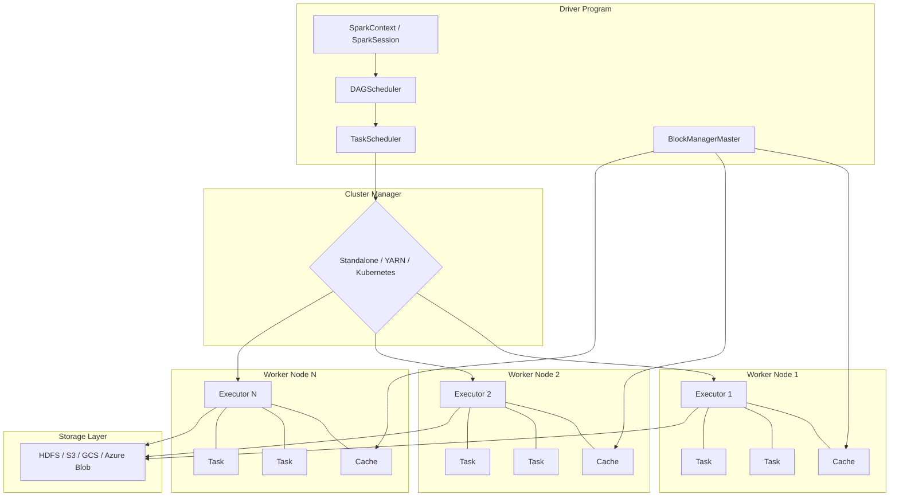
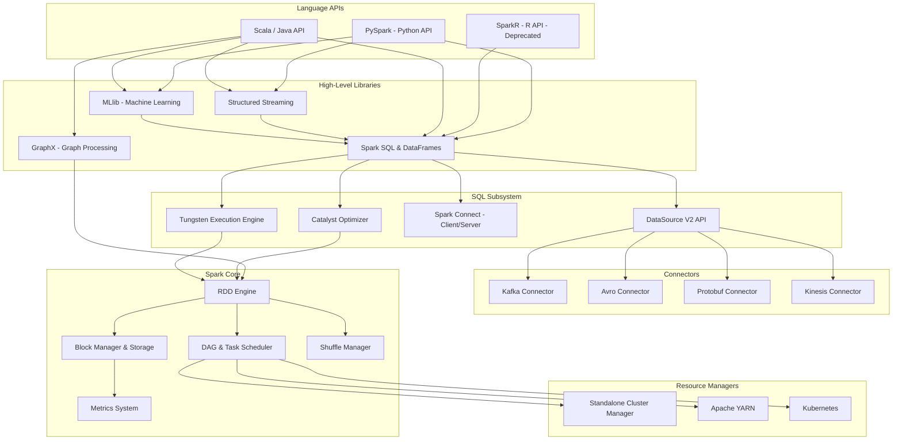
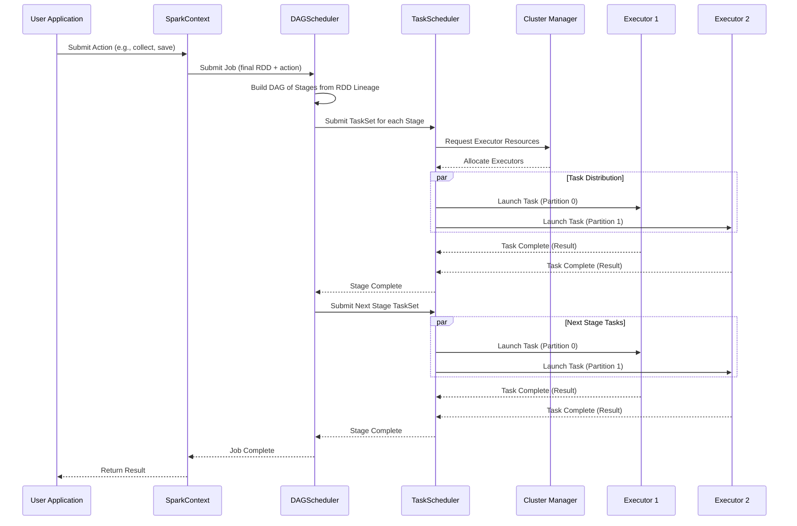
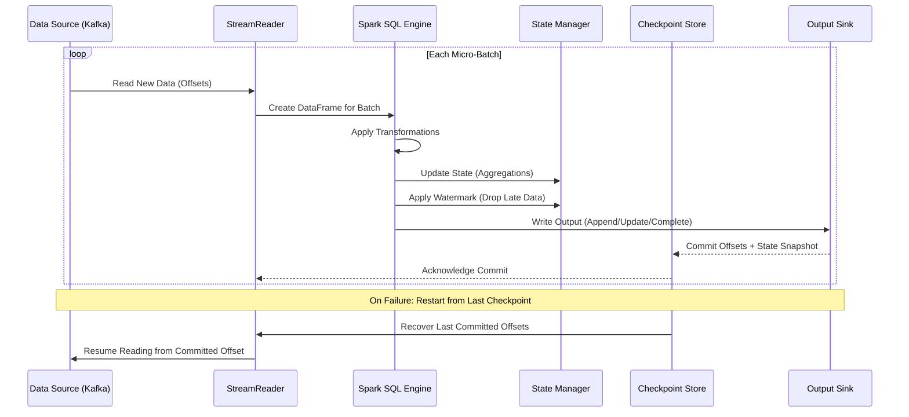
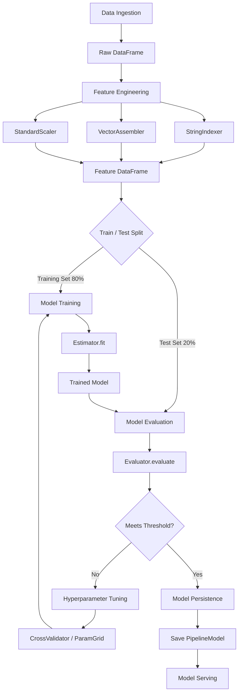
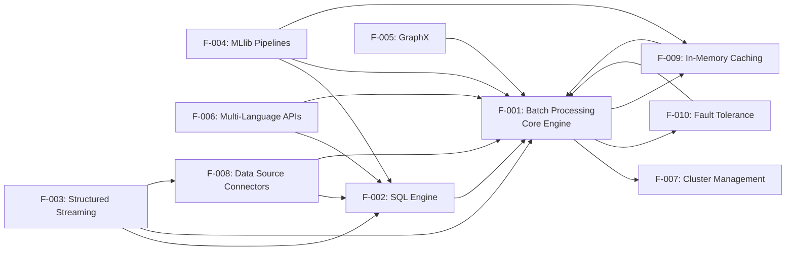
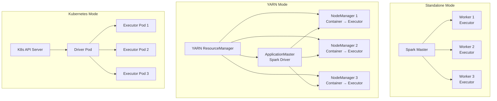

# Product Requirements Document — Apache Spark 4.1.0-SNAPSHOT

> **Version:** 4.1.0-SNAPSHOT | **Last Updated:** 2025 | **Status:** Living Document
> **License:** Apache License 2.0

---

## Table of Contents

1. [Executive Summary](#1-executive-summary)
2. [Business Problem](#2-business-problem)
3. [Product Overview](#3-product-overview)
4. [Feature Catalog](#4-feature-catalog)
5. [User Flows and Interaction Patterns](#5-user-flows-and-interaction-patterns)
6. [Acceptance Criteria](#6-acceptance-criteria)
7. [Non-Functional Requirements](#7-non-functional-requirements)
8. [Integration Points](#8-integration-points)
9. [Constraints and Assumptions](#9-constraints-and-assumptions)
10. [Appendices](#10-appendices)

---

## 1. Executive Summary

### 1.1 Product Vision

Apache Spark is a unified analytics engine for large-scale data processing. It provides high-level APIs in Scala, Java, Python, and R (deprecated), and an optimized engine that supports general computation graphs for data analysis. It also supports a rich set of higher-level tools including Spark SQL for SQL and DataFrames, pandas API on Spark for pandas workloads, MLlib for machine learning, GraphX for graph processing, and Structured Streaming for stream processing. *(Source: README.md)*

Apache Spark eliminates the need for organizations to maintain separate systems for batch analytics, interactive SQL queries, real-time stream processing, machine learning, and graph computation. By providing a single, cohesive platform with a unified API surface, Spark reduces operational overhead, accelerates time-to-insight, and empowers data teams to build end-to-end analytics pipelines within one framework.

### 1.2 Target Users and Stakeholders

| Persona | Role Description | Primary Spark Interactions |
|---------|-----------------|---------------------------|
| **Data Engineer** | Builds and maintains ETL/ELT data pipelines at scale | DataFrame API, Spark SQL, Structured Streaming, Data Source Connectors, spark-submit |
| **Data Scientist** | Performs exploratory data analysis, feature engineering, and model training | PySpark, MLlib Pipelines, pandas API on Spark, spark-shell/pyspark REPL |
| **Application Developer** | Integrates Spark processing into production applications and microservices | Spark Connect client API, DataFrame/Dataset API, Java/Scala APIs |
| **System Administrator** | Deploys, configures, monitors, and maintains Spark clusters | Cluster manager configuration (YARN/Kubernetes/Standalone), Spark Web UI, metrics, security settings |
| **Apache Open-Source Community** | Contributes code, documentation, bug reports, and feature proposals | Source code (Scala/Java/Python), JIRA issue tracker, GitHub pull requests, mailing lists |

### 1.3 Document Purpose and Scope

This Product Requirements Document consolidates the business problem, complete feature catalog, acceptance criteria, and user flows for Apache Spark version 4.1.0-SNAPSHOT. It serves as the single source of truth aligning all stakeholders on the product's capabilities, boundaries, and quality expectations. *(Source: docs/_config.yml — SPARK_VERSION: 4.1.0-SNAPSHOT)*

This document covers:
- The business problems Apache Spark addresses
- A complete catalog of 10 core features (F-001 through F-010) with descriptions, components, and business value
- Five primary user workflows with interaction patterns and code examples
- Formal acceptance criteria in BDD Given/When/Then format for each feature
- Non-functional requirements for performance, scalability, security, and reliability
- Integration points with external systems and data platforms
- Technical constraints and scope boundaries

---

## 2. Business Problem

### 2.1 Distributed Computing Complexity

Organizations struggle with the complexity of distributed data processing. Building distributed applications requires specialized knowledge to parallelize computations across clusters of machines, manage data locality, handle network failures, and optimize resource allocation. Without a high-level abstraction layer, data teams must write low-level distributed systems code to process data at scale, dramatically increasing development time and error rates.

Apache Spark addresses this by providing high-level APIs (RDD, DataFrame, Dataset) that abstract away the complexity of distributed execution. The DAG scheduler automatically optimizes execution plans, the task scheduler handles work distribution, and the storage system manages data placement — all transparently to the application developer. *(Source: core/src/main/scala/org/apache/spark/SparkContext.scala)*

### 2.2 Performance Bottlenecks

Traditional MapReduce frameworks impose disk I/O bottlenecks between every processing stage. Each intermediate result is written to disk and read back for the next stage, making iterative algorithms (common in machine learning and graph processing) and interactive queries prohibitively slow. A single machine learning training iteration that processes data across 10 stages incurs 10 full disk read-write cycles.

Apache Spark's in-memory computing model keeps intermediate data in memory across stages, eliminating unnecessary disk I/O. The Tungsten execution engine uses off-heap memory management and whole-stage code generation to process data at speeds approaching bare-metal performance. For iterative algorithms, Spark delivers up to 100x improvement over disk-based MapReduce. *(Source: docs/tuning.md)*

### 2.3 Analytics Platform Fragmentation

Data teams often use disparate, disconnected tools for different analytics workloads:
- One system for batch ETL processing
- A separate SQL engine for interactive queries
- A dedicated stream processing framework for real-time data
- Standalone machine learning platforms for model training
- Specialized graph processing systems for relationship analysis

This fragmentation creates operational complexity (multiple systems to deploy, monitor, and maintain), data movement overhead (copying data between systems), skill fragmentation (different APIs and paradigms per tool), and data consistency challenges (no unified view of data across systems).

Apache Spark provides a unified platform where batch processing, SQL queries, stream processing, machine learning, and graph analytics all share the same execution engine, the same API primitives, the same data representations, and the same cluster resources. *(Source: README.md)*

### 2.4 Polyglot Data Science Requirements

Modern data teams span multiple programming languages and skill sets. Data engineers typically work in Scala or Java for production pipelines, data scientists prefer Python for exploratory analysis and prototyping, business analysts use SQL for ad-hoc queries, and statistical researchers have historically used R. Requiring all team members to use a single language creates friction and slows adoption.

Apache Spark provides native APIs in Scala, Java, and Python (PySpark), with full SQL support and a deprecated R binding (SparkR). The Python-first strategy ensures PySpark maintains full DataFrame API parity with the Scala API. The pandas API on Spark allows Python data scientists to use familiar pandas syntax on distributed datasets without rewriting code. *(Source: python/pyspark/)*

---

## 3. Product Overview

### 3.1 System Architecture

Apache Spark uses a master-worker architecture known as the Driver-Executor model. The Driver program runs the user's main function, creates the SparkSession (or SparkContext), and orchestrates the execution of tasks across a cluster of Executor processes. *(Source: core/src/main/scala/org/apache/spark/SparkContext.scala)*



*(Source: docs/cluster-overview.md)*

**Key Architectural Components:**
- **Driver Program**: Runs the user's main function, creates the SparkSession, and coordinates execution. Contains the DAGScheduler (builds execution DAGs from RDD lineage), TaskScheduler (assigns tasks to Executors), and BlockManagerMaster (tracks cached data).
- **Cluster Manager**: External service that allocates resources. Spark supports Standalone (built-in), Apache YARN, and Kubernetes.
- **Executors**: JVM processes on worker nodes that execute tasks and cache data. Each application gets its own set of Executors, providing process-level isolation.
- **Tasks**: The smallest unit of work, each processing one data partition. Tasks run within Executor threads.

### 3.2 Module Hierarchy



*(Source: pom.xml — module declarations)*

### 3.3 Technology Foundation

All versions are extracted from the project dependency manifest. *(Source: pom.xml)*

| Category | Technology | Version | Purpose |
|----------|-----------|---------|---------|
| **Runtime** | Apache Spark | 4.1.0-SNAPSHOT | Core platform version |
| **Languages** | Scala | 2.13.17 | Primary implementation language |
| | Java | 17+ (minimum 17.0.11) | JVM runtime |
| | Python | 3.10–3.14 | PySpark language binding |
| | R | Deprecated | SparkR language binding |
| **Data Processing** | Apache Hadoop | 3.4.2 | Distributed storage and YARN integration |
| | Apache Kafka | 3.9.1 | Streaming data integration |
| | Apache Hive | 2.3.10 | Metastore and SQL compatibility |
| | Apache Parquet | 1.16.0 | Columnar storage format |
| | Apache ORC | 2.2.1 | Hive-optimized columnar format |
| | Apache Arrow | 18.3.0 | Zero-copy columnar data exchange |
| | Protocol Buffers | 4.33.0 | Structured message serialization |
| | Apache Avro | 1.12.1 | Row-oriented data serialization |
| **Networking** | Netty | 4.2.7.Final | Asynchronous network communication |
| | gRPC | 1.67.1 | Spark Connect RPC framework |
| | Eclipse Jetty | 11.0.26 | Web UI HTTP server |
| **Serialization** | Kryo | 4.0.3 | Fast object serialization |
| | Jackson | 2.20.0 | JSON processing |
| **ML / Numerical** | Breeze | 2.1.0 | Numerical processing library for MLlib |
| **Monitoring** | Dropwizard Metrics | 4.2.33 | Application metrics collection |
| **Logging** | Log4j | 2.24.3 | Logging framework |
| **Utilities** | Google Guava | 33.4.0-jre | Core utility library |

*(Source: pom.xml — lines 29, 120–121, 128, 130, 132, 139, 141, 144, 145, 147, 152, 159, 178, 188, 202, 220, 234, 308, 1134)*

---

## 4. Feature Catalog

### Feature Catalog Summary

| Feature ID | Feature Name | Module | Business Value |
|-----------|-------------|--------|---------------|
| F-001 | Distributed Batch Processing | `core/` | Enables parallel data processing across clusters with automatic fault recovery |
| F-002 | SQL Query Processing Engine | `sql/` | Provides familiar SQL interface with query optimization for structured data analysis |
| F-003 | Real-Time Stream Processing | `streaming/`, `sql/core/` | Enables continuous data processing with exactly-once delivery guarantees |
| F-004 | Machine Learning Pipelines | `mllib/` | Delivers scalable ML training and inference with standardized pipeline abstractions |
| F-005 | Graph Processing | `graphx/` | Supports graph-parallel computation for relationship and network analysis |
| F-006 | Multi-Language API Support | `python/`, `R/` | Reduces adoption barriers by supporting Scala, Java, Python, SQL, and R |
| F-007 | Cluster Resource Management | `resource-managers/` | Provides flexible deployment across Standalone, YARN, and Kubernetes clusters |
| F-008 | Data Source Connectors | `connector/` | Connects to diverse data stores and formats through a unified API |
| F-009 | In-Memory Caching and Storage | `core/` (storage) | Accelerates iterative and interactive workloads by caching data in memory |
| F-010 | Fault Tolerance and Recovery | `core/` (lineage) | Ensures data pipeline reliability through automatic failure detection and recovery |

---

### F-001: Distributed Batch Processing (Core)

- **Description**: RDD-based distributed computing engine with lazy evaluation, DAG-based scheduling, and automatic parallelization. The core engine partitions data across cluster nodes, schedules tasks using a directed acyclic graph (DAG) of stages, and manages data locality to minimize network transfers.
- **Key APIs**: `SparkContext`, `RDD`, `Broadcast`, `Accumulator`, `SparkConf`
- **Key Components**:
  - **RDD (Resilient Distributed Dataset)**: Immutable, partitioned collection of records that can be operated on in parallel
  - **DAGScheduler**: Translates RDD lineage graphs into physical execution plans of stages
  - **TaskScheduler**: Assigns individual tasks to Executors based on data locality preferences
  - **BlockManager**: Manages storage of data blocks in memory and on disk across the cluster
- **Business Value**: Enables organizations to process terabyte- to petabyte-scale datasets using commodity hardware clusters, reducing infrastructure costs and processing time compared to single-machine solutions
- **Source Reference**: `core/` module — `Source: core/src/main/scala/org/apache/spark/SparkContext.scala`

---

### F-002: SQL Query Processing Engine

- **Description**: Full ANSI SQL support with the Catalyst query optimizer, Tungsten binary execution engine, DataFrame/Dataset API, and the Spark Connect client-server architecture. The SQL engine parses SQL queries and DataFrame operations into logical plans, applies rule-based and cost-based optimization, and generates optimized physical execution plans with whole-stage code generation.
- **Key APIs**: `SparkSession`, `DataFrame`, `Dataset`, `Catalog`, `Column`, SQL built-in functions, `DataFrameReader`/`DataFrameWriter`
- **Key Components**:
  - **Catalyst Optimizer**: Rule-based and cost-based query optimization engine that transforms logical plans into optimized physical plans
  - **Tungsten Engine**: Off-heap memory management and whole-stage code generation for near-native execution speed
  - **Spark Connect**: Client-server architecture enabling remote DataFrame operations via gRPC, decoupling client applications from cluster runtimes
  - **DataSource V2 API**: Pluggable interface for reading from and writing to external data systems
- **Business Value**: Allows data engineers and analysts to query structured data using standard SQL or programmatic DataFrame APIs with automatic query optimization, eliminating the need for manual query tuning in most scenarios
- **Source Reference**: `sql/catalyst/`, `sql/core/`, `sql/api/`, `sql/connect/`

---

### F-003: Real-Time Stream Processing (Structured Streaming)

- **Description**: Micro-batch and continuous stream processing engine built on the Spark SQL engine. Structured Streaming treats streaming data as an unbounded table, applying the same DataFrame/Dataset operations used for batch processing. It provides exactly-once fault-tolerance guarantees through checkpointing and write-ahead logs, with support for event-time processing via watermarks.
- **Key APIs**: Streaming `DataFrame` APIs, `writeStream`, `readStream`, `Trigger`, watermark (`withWatermark`), `StreamingQuery`, `StreamingQueryListener`
- **Key Components**:
  - **Micro-Batch Engine**: Processes data in small, incremental batches with exactly-once semantics
  - **Continuous Processing Mode**: Low-latency processing mode for sub-millisecond end-to-end latency
  - **Watermark Manager**: Handles late-arriving data by tracking event-time progress
  - **Checkpoint Manager**: Persists query progress and state for fault recovery
  - **Kafka/Kinesis Sources and Sinks**: Built-in connectors for common streaming platforms
- **Business Value**: Enables real-time data processing pipelines using the same APIs and engine used for batch processing, reducing the learning curve and operational overhead of maintaining separate batch and streaming systems
- **Source Reference**: `streaming/`, `sql/core/` (Structured Streaming), `connector/kafka-0-10-sql/`

---

### F-004: Machine Learning Pipelines (MLlib)

- **Description**: Distributed machine learning library with a Pipeline API that standardizes the ML workflow into composable stages. MLlib provides Estimators (algorithms that train models from data), Transformers (functions that transform DataFrames), and Evaluators (metrics for model quality). It includes algorithms for classification, regression, clustering, collaborative filtering, dimensionality reduction, and feature engineering.
- **Key APIs**: `Pipeline`, `PipelineModel`, `Estimator`, `Transformer`, `Evaluator`, `CrossValidator`, `ParamGridBuilder`, `VectorAssembler`
- **Key Components**:
  - **Pipeline API**: Chains multiple Transformers and Estimators into a reproducible ML workflow
  - **Feature Engineering**: VectorAssembler, StringIndexer, OneHotEncoder, StandardScaler, Tokenizer, and 30+ feature transformers
  - **Algorithms**: LogisticRegression, RandomForestClassifier, GBTClassifier, LinearRegression, KMeans, ALS, LDA, PCA, and more
  - **Model Persistence**: Save and load trained models and complete pipelines to/from distributed storage
  - **Cross-Validation**: K-fold cross-validation and train-validation split with automatic hyperparameter tuning
- **Business Value**: Enables data scientists to build, train, evaluate, and deploy machine learning models at scale using a standardized pipeline abstraction, with automatic distribution of computation across cluster nodes
- **Source Reference**: `mllib/`, `mllib-local/`

---

### F-005: Graph Processing (GraphX)

- **Description**: Graph-parallel computation framework with immutable, distributed graph abstractions. GraphX extends Spark RDDs with a directed multigraph abstraction (the `Graph` class) that associates properties with vertices and edges. It includes the Pregel API for iterative graph algorithms and a library of built-in algorithms.
- **Key APIs**: `Graph`, `VertexRDD`, `EdgeRDD`, `EdgeTriplet`, `Pregel`, `GraphOps`
- **Key Components**:
  - **Graph Abstraction**: Directed multigraph with user-defined properties on vertices and edges
  - **Pregel API**: Bulk-synchronous parallel message-passing interface for iterative graph algorithms
  - **Built-in Algorithms**: PageRank, Connected Components, Strongly Connected Components, Triangle Counting, Label Propagation
  - **Graph Builders**: Methods to construct graphs from RDDs of edges and vertices, including `GraphLoader.edgeListFile`
- **Business Value**: Enables analysis of relationship networks (social graphs, web link structures, knowledge graphs, transportation networks) using distributed graph-parallel computation, integrated within the same Spark application that performs ETL and machine learning
- **Source Reference**: `graphx/`

---

### F-006: Multi-Language API Support

- **Description**: Native language bindings for Scala, Java, Python (PySpark), and R (SparkR — deprecated). PySpark provides full DataFrame API parity with the Scala API, plus the pandas API on Spark that allows existing pandas code to run on distributed Spark clusters. The Python-first strategy ensures PySpark is a first-class citizen with dedicated optimization and testing.
- **Key APIs**: PySpark (`pyspark.sql`, `pyspark.ml`, `pyspark.streaming`), pandas API on Spark (`pyspark.pandas`), SparkR (`SparkR::SparkSession`, deprecated)
- **Key Components**:
  - **PySpark**: Full Python API wrapping Spark's Scala core via Py4J gateway, supporting DataFrame, SQL, ML, and Streaming operations
  - **pandas API on Spark**: Drop-in pandas replacement that executes on Spark's distributed engine (previously Koalas)
  - **Spark Connect Python Client**: Lightweight Python client connecting to remote Spark servers via gRPC
  - **SparkR (Deprecated)**: R language binding providing DataFrame API access; deprecated as of Spark 4.x
- **Business Value**: Reduces adoption barriers by allowing data teams to use their preferred programming language while sharing the same cluster resources, data, and processing engine
- **Source Reference**: `python/pyspark/`, `R/pkg/`

---

### F-007: Cluster Resource Management

- **Description**: Pluggable cluster manager interface supporting Standalone (built-in), Apache YARN, and Kubernetes deployment. Spark supports client and cluster deploy modes, dynamic Executor allocation (adding and removing Executors based on workload), and configurable resource requests (CPU cores, memory, GPU).
- **Key APIs**: `spark-submit` (deploy modes), `SparkConf` (resource configuration), `ExecutorAllocationManager` (dynamic allocation)
- **Key Components**:
  - **Standalone Cluster Manager**: Built-in cluster manager for simple deployments with a Master and Worker daemon architecture
  - **YARN Integration**: Runs Spark as a YARN application with the ApplicationMaster managing Executor containers
  - **Kubernetes Integration**: Deploys Spark Driver and Executors as Kubernetes pods with native pod template support
  - **Dynamic Executor Allocation**: Automatically scales the number of Executors based on pending task backlog and idle time
- **Business Value**: Provides deployment flexibility across on-premises and cloud infrastructure, with automatic resource scaling to optimize cluster utilization and reduce costs
- **Source Reference**: `resource-managers/kubernetes/`, `resource-managers/yarn/`, `core/` (standalone)

---

### F-008: Data Source Connectors

- **Description**: DataSource V2 API providing a pluggable, standardized interface for reading from and writing to external data systems. Spark includes built-in connectors for file formats (Parquet, ORC, JSON, CSV, Avro, Protobuf, text), databases (JDBC), streaming platforms (Kafka, Kinesis), and catalog systems (Hive Metastore).
- **Key APIs**: `DataFrameReader.format()`, `DataFrameWriter.format()`, `DataSource V2` interfaces (`TableProvider`, `ScanBuilder`, `WriteBuilder`)
- **Key Components**:
  - **File Format Connectors**: Parquet (columnar, predicate pushdown), ORC (Hive-optimized columnar), JSON, CSV, Text, Avro, Protobuf
  - **Kafka Connector**: Read from and write to Apache Kafka topics with exactly-once semantics
  - **Kinesis Connector**: Integration with Amazon Kinesis streams
  - **JDBC Connector**: Read from and write to relational databases with partition-based parallelism
  - **Hive Integration**: Read from and write to Hive-managed tables via the Hive Metastore
- **Business Value**: Eliminates the need for custom data ingestion code by providing standardized connectors for common data sources, with automatic schema inference, predicate pushdown, and partition pruning for optimized data access
- **Source Reference**: `connector/kafka-0-10/`, `connector/avro/`, `connector/protobuf/`, `connector/kinesis-asl/`, `sql/core/`

---

### F-009: In-Memory Caching and Storage

- **Description**: Multi-tier storage system with configurable persistence levels. The BlockManager provides in-memory caching of RDDs and DataFrames across the cluster, with overflow to disk and optional off-heap storage. Storage levels include MEMORY_ONLY, MEMORY_AND_DISK, MEMORY_ONLY_SER (serialized), DISK_ONLY, and variants with replication (e.g., MEMORY_ONLY_2 for 2x replication).
- **Key APIs**: `RDD.persist()`, `RDD.cache()`, `DataFrame.cache()`, `DataFrame.persist()`, `StorageLevel`, `RDD.unpersist()`
- **Key Components**:
  - **BlockManager**: Distributed storage system managing data blocks across memory, disk, and off-heap
  - **MemoryStore**: In-memory storage for deserialized and serialized data blocks
  - **DiskStore**: Spillover storage for blocks that do not fit in memory
  - **Storage Levels**: Configurable persistence policies controlling memory/disk usage and replication
- **Business Value**: Accelerates iterative algorithms (ML training with multiple passes over data) and interactive queries (repeated analysis on the same dataset) by keeping data in memory, avoiding repeated reads from external storage
- **Source Reference**: `core/src/main/scala/org/apache/spark/storage/BlockManager.scala`

---

### F-010: Fault Tolerance and Recovery

- **Description**: Comprehensive fault tolerance through RDD lineage tracking, checkpointing, speculative execution, and driver recovery. When an Executor fails or a task produces incorrect results, Spark recomputes lost data partitions using the recorded lineage (sequence of transformations). Checkpointing persists RDD/DataFrame state to reliable storage, truncating long lineage chains. Speculative execution re-launches slow tasks on other Executors to mitigate stragglers.
- **Key APIs**: `RDD.checkpoint()`, `SparkContext.setCheckpointDir()`, `StreamingQuery.checkpoint`, `spark.speculation` configuration
- **Key Components**:
  - **Lineage Tracking**: Records the sequence of transformations that produced each RDD partition, enabling recomputation on failure
  - **Checkpointing**: Saves RDD/DataFrame data to HDFS or other reliable storage, allowing recovery without full recomputation
  - **Speculative Execution**: Detects straggler tasks and launches duplicate copies on other Executors
  - **Write-Ahead Log (WAL)**: For Structured Streaming, records received data to reliable storage before processing for exactly-once guarantees
  - **Driver Recovery**: In cluster mode, the cluster manager can restart the Driver process after failure
- **Business Value**: Ensures data pipeline reliability in production environments by automatically recovering from hardware failures, network partitions, and straggler tasks without manual intervention or data loss
- **Source Reference**: `core/` (lineage, checkpoint, speculative execution)

---

## 5. User Flows and Interaction Patterns

### 5.1 Interactive Data Exploration

**Workflow**: spark-shell/pyspark → SparkSession → load data → DataFrame transformations → display results → iterate

Data scientists and data engineers use Spark's interactive shells (spark-shell for Scala, pyspark for Python) to explore datasets iteratively. The REPL provides immediate feedback, enabling rapid prototyping of data transformations. *(Source: docs/quick-start.md)*

**Steps:**
1. Launch the interactive shell (`./bin/pyspark` or `./bin/spark-shell`)
2. A `SparkSession` is automatically created as the `spark` variable
3. Load data from a source (file, database, or streaming source)
4. Apply DataFrame transformations (filter, select, groupBy, join)
5. Execute actions (show, count, collect) to trigger computation and display results
6. Iterate by refining transformations based on observed results
7. Optionally save results to external storage

```python
# PySpark interactive exploration example
df = spark.read.parquet("s3a://data-lake/events/")
df.filter(df.event_type == "purchase") \
  .groupBy("product_category") \
  .agg({"amount": "sum", "user_id": "countDistinct"}) \
  .orderBy("sum(amount)", ascending=False) \
  .show(10)
```

*(Source: README.md — Interactive Python Shell section)*

---

### 5.2 Batch Application Execution

**Workflow**: spark-submit → cluster allocation → DAG scheduling → stage execution → output writing → resource release

Production batch applications are packaged as JARs (Scala/Java) or Python scripts and submitted to the cluster using `spark-submit`. The cluster manager allocates resources, the Driver builds the execution DAG, and Executors process data in parallel. *(Source: docs/cluster-overview.md)*

**Steps:**
1. Package the application as a JAR or Python script
2. Submit using `spark-submit` with cluster configuration (master URL, executor memory, cores)
3. The Cluster Manager allocates Executor containers on worker nodes
4. The Driver's DAGScheduler builds stages from the RDD/DataFrame lineage graph
5. The TaskScheduler assigns tasks to Executors based on data locality
6. Executors process partitions in parallel, shuffling data between stages as needed
7. Final results are written to the output sink (HDFS, S3, database)
8. Resources are released back to the cluster

```bash
# Submit a batch application to a YARN cluster
./bin/spark-submit \
  --class com.example.ETLPipeline \
  --master yarn \
  --deploy-mode cluster \
  --executor-memory 8g \
  --num-executors 20 \
  app.jar --input /data/raw --output /data/processed
```

---

### 5.3 Data Pipeline Development

**Workflow**: define sources → transformations → quality checks → write to sink → schedule with orchestrator

Data engineers build multi-step data pipelines that read from raw sources, apply business transformations, validate data quality, and write processed data to curated data stores. *(Source: docs/sql-programming-guide.md)*

**Steps:**
1. Define data sources using `spark.read.format(...).load(...)`
2. Apply transformations: cleaning, enrichment, aggregation, joins
3. Perform data quality checks (null counts, value ranges, schema validation)
4. Write processed data to the target sink using `df.write.format(...).save(...)`
5. Configure partitioning, bucketing, and compression for the output
6. Schedule the pipeline with an external orchestrator (e.g., cron, Airflow)

```scala
// Scala data pipeline example
val raw = spark.read.format("parquet").load("/data/raw/events")
val cleaned = raw
  .filter(col("event_id").isNotNull)
  .withColumn("event_date", to_date(col("timestamp")))
  .dropDuplicates("event_id")
val enriched = cleaned.join(dimTable, Seq("user_id"), "left")
enriched.write
  .format("parquet")
  .partitionBy("event_date")
  .mode("overwrite")
  .save("/data/curated/events")
```

---

### 5.4 Machine Learning Workflow

**Workflow**: data ingestion → feature engineering → train/test split → model training → cross-validation → evaluation → model persistence

Data scientists use MLlib's Pipeline API to build end-to-end machine learning workflows. The Pipeline abstraction ensures reproducibility by encapsulating the entire feature engineering and training process into a single, serializable object. *(Source: mllib/)*

**Steps:**
1. Load and explore training data as a DataFrame
2. Engineer features: tokenization, encoding, scaling, vector assembly
3. Split data into training and test sets
4. Define the ML pipeline: chain feature transformers and an estimator
5. Configure cross-validation with a parameter grid for hyperparameter tuning
6. Fit the pipeline on training data to produce a trained PipelineModel
7. Evaluate model performance on the test set using an Evaluator
8. Persist the trained model to distributed storage for serving

```python
# PySpark ML pipeline example
from pyspark.ml import Pipeline
from pyspark.ml.feature import VectorAssembler, StringIndexer
from pyspark.ml.classification import LogisticRegression
from pyspark.ml.evaluation import BinaryClassificationEvaluator

assembler = VectorAssembler(inputCols=["age", "income", "score"], outputCol="features")
lr = LogisticRegression(featuresCol="features", labelCol="label", maxIter=10)
pipeline = Pipeline(stages=[assembler, lr])
model = pipeline.fit(training_df)
predictions = model.transform(test_df)
evaluator = BinaryClassificationEvaluator(labelCol="label")
auc = evaluator.evaluate(predictions)
model.write().overwrite().save("/models/churn_predictor")
```

---

### 5.5 Streaming Application Lifecycle

**Workflow**: define source → processing logic → watermarks/triggers → output sink → checkpoint → monitor

Streaming application developers build continuous data processing pipelines using Structured Streaming. The streaming query reads from a source (e.g., Kafka), applies transformations, manages late data with watermarks, and writes results to an output sink with exactly-once guarantees. *(Source: streaming/)*

**Steps:**
1. Define a streaming source using `spark.readStream.format(...).load(...)`
2. Apply DataFrame transformations (same API as batch processing)
3. Configure watermarks for handling late-arriving data
4. Set the trigger interval (micro-batch) or continuous processing mode
5. Define the output sink and output mode (append, update, complete)
6. Configure checkpoint location for fault recovery
7. Start the streaming query and monitor via `StreamingQuery` interface or Spark Web UI
8. Manage query lifecycle (await termination, stop, restart)

```python
# PySpark Structured Streaming example
stream_df = spark.readStream \
    .format("kafka") \
    .option("kafka.bootstrap.servers", "broker:9092") \
    .option("subscribe", "events") \
    .load()
parsed = stream_df.select(
    from_json(col("value").cast("string"), schema).alias("data")
).select("data.*")
query = parsed \
    .withWatermark("event_time", "10 minutes") \
    .groupBy(window("event_time", "5 minutes"), "category") \
    .count() \
    .writeStream \
    .format("parquet") \
    .option("checkpointLocation", "/checkpoints/event_counts") \
    .outputMode("append") \
    .trigger(processingTime="1 minute") \
    .start("/output/event_counts")
```

---

### 5.6 SQL Query Execution

**Workflow**: register tables → write SQL → execute → retrieve results

Analysts and engineers can execute standard SQL queries against data registered as tables or temporary views in Spark's catalog.

```sql
-- Register a Parquet file as a temporary view and query it
CREATE TEMPORARY VIEW sales USING parquet OPTIONS (path '/data/sales.parquet');
SELECT region, fiscal_year, SUM(revenue) AS total_revenue
FROM sales
WHERE fiscal_year >= 2023
GROUP BY region, fiscal_year
ORDER BY total_revenue DESC;
```

---

## 6. Acceptance Criteria

All acceptance criteria use BDD-style Given/When/Then format. Each feature includes criteria for input validation, expected output, error handling, and edge cases.

### 6.1 F-001: Distributed Batch Processing — Acceptance Criteria

| AC ID | Category | Criterion |
|-------|----------|-----------|
| AC-001-01 | Input Validation | **Given** a user creates an RDD from an input path, **When** the path does not exist on the file system, **Then** the system throws a `FileNotFoundException` with the invalid path included in the error message within 5 seconds |
| AC-001-02 | Expected Output | **Given** a user creates an RDD from a text file containing 1,000,000 lines and calls `count()`, **When** the action completes, **Then** the returned value is exactly 1,000,000 |
| AC-001-03 | Expected Output | **Given** a user applies `map` and `filter` transformations to an RDD, **When** an action triggers execution, **Then** the DAGScheduler produces an execution plan with the minimum number of stages required by the transformation lineage |
| AC-001-04 | Error Handling | **Given** an Executor process is terminated during task execution, **When** the TaskScheduler detects the failure, **Then** the failed tasks are rescheduled on available Executors within the configured `spark.task.maxFailures` retry limit (default: 4) |
| AC-001-05 | Edge Case | **Given** a user creates an RDD from an empty directory containing zero files, **When** `count()` is called, **Then** the returned value is 0 and no error is thrown |

### 6.2 F-002: SQL Query Processing Engine — Acceptance Criteria

| AC ID | Category | Criterion |
|-------|----------|-----------|
| AC-002-01 | Input Validation | **Given** a user submits a SQL query with a syntax error (e.g., missing FROM clause), **When** the query is parsed, **Then** the system throws a `ParseException` with the line number and position of the syntax error |
| AC-002-02 | Expected Output | **Given** a user executes `SELECT COUNT(*) FROM table` on a DataFrame with 500,000 rows, **When** the query completes, **Then** the result contains exactly one row with the value 500,000 |
| AC-002-03 | Expected Output | **Given** a user executes a join query between two DataFrames, **When** the Catalyst optimizer processes the query, **Then** predicate pushdown is applied to filter data before the join stage, and the physical plan shows a `Filter` node below the `Join` node |
| AC-002-04 | Error Handling | **Given** a user queries a column that does not exist in the DataFrame schema, **When** the query is analyzed, **Then** the system throws an `AnalysisException` listing the invalid column name and available columns in the schema |
| AC-002-05 | Edge Case | **Given** a user executes a SQL query on a DataFrame with zero rows, **When** an aggregation function (e.g., `SUM`, `AVG`) is applied, **Then** the result returns `NULL` for the aggregation column and no error is thrown |

### 6.3 F-003: Real-Time Stream Processing — Acceptance Criteria

| AC ID | Category | Criterion |
|-------|----------|-----------|
| AC-003-01 | Input Validation | **Given** a user starts a streaming query with an invalid Kafka bootstrap server address, **When** the query attempts to connect, **Then** the system reports a connection error with the specific broker address that failed |
| AC-003-02 | Expected Output | **Given** a user starts a streaming query reading from a Kafka topic with 100 new messages, **When** one micro-batch trigger completes, **Then** all 100 messages are processed and written to the output sink with no duplicates |
| AC-003-03 | Error Handling | **Given** a running streaming query encounters a checkpoint directory that is not writable, **When** the query attempts to commit a micro-batch, **Then** the StreamingQuery transitions to a TERMINATED state with an IOException describing the checkpoint write failure |
| AC-003-04 | Edge Case | **Given** a streaming query with a 10-minute watermark receives an event with an event-time 15 minutes behind the current watermark, **When** the event is processed, **Then** the event is dropped from windowed aggregations and the `numDroppedRows` metric increments by 1 |
| AC-003-05 | Expected Output | **Given** a streaming query is restarted from a checkpoint after a failure, **When** the query resumes processing, **Then** it continues from the last committed offset with no data loss and no duplicate processing |

### 6.4 F-004: Machine Learning Pipelines — Acceptance Criteria

| AC ID | Category | Criterion |
|-------|----------|-----------|
| AC-004-01 | Input Validation | **Given** a user fits a LogisticRegression model with a `featuresCol` that does not exist in the training DataFrame, **When** `pipeline.fit()` is called, **Then** the system throws an `IllegalArgumentException` naming the missing column |
| AC-004-02 | Expected Output | **Given** a user trains a binary classification model on a labeled dataset, **When** `model.transform(testData)` is called, **Then** the output DataFrame contains `prediction`, `probability`, and `rawPrediction` columns with one row per input row |
| AC-004-03 | Error Handling | **Given** a user attempts to load a saved model from a path that does not exist, **When** `PipelineModel.load(path)` is called, **Then** the system throws a `FileNotFoundException` with the invalid path in the error message |
| AC-004-04 | Edge Case | **Given** a training DataFrame contains a feature column with all identical values (zero variance), **When** a StandardScaler is applied, **Then** the scaler outputs zero for that column and does not produce `NaN` or `Infinity` values |
| AC-004-05 | Expected Output | **Given** a user runs CrossValidator with 3 folds and a parameter grid of 4 configurations, **When** cross-validation completes, **Then** exactly 12 models are trained (3 folds × 4 configurations) and the best model is selected based on the specified evaluation metric |

### 6.5 F-005: Graph Processing — Acceptance Criteria

| AC ID | Category | Criterion |
|-------|----------|-----------|
| AC-005-01 | Input Validation | **Given** a user constructs a Graph from an edge RDD containing edges that reference non-existent vertex IDs, **When** the Graph is created, **Then** default vertex properties are assigned to the missing vertices and no error is thrown |
| AC-005-02 | Expected Output | **Given** a user runs PageRank on a graph with 1,000 vertices and 5,000 edges for 10 iterations, **When** the algorithm completes, **Then** the sum of all vertex PageRank values equals 1,000 (number of vertices) with a tolerance of ±0.01 |
| AC-005-03 | Error Handling | **Given** a user calls `Graph.fromEdgeTuples` with an empty RDD of edges, **When** the Graph is constructed, **Then** a Graph with zero edges and zero vertices is created and no exception is thrown |
| AC-005-04 | Edge Case | **Given** a graph contains self-loop edges (source vertex equals destination vertex), **When** Triangle Counting is executed, **Then** self-loops are excluded from the triangle count |

### 6.6 F-006: Multi-Language API Support — Acceptance Criteria

| AC ID | Category | Criterion |
|-------|----------|-----------|
| AC-006-01 | Input Validation | **Given** a PySpark user calls `spark.read.csv()` with a path that does not exist, **When** the operation is executed, **Then** the Python exception message contains the invalid file path and the exception type is `AnalysisException` |
| AC-006-02 | Expected Output | **Given** a PySpark user creates a DataFrame with 3 columns and 100 rows and calls `df.count()`, **When** the action completes, **Then** the returned Python integer is exactly 100 |
| AC-006-03 | Expected Output | **Given** a user executes identical DataFrame operations in Scala and PySpark on the same dataset, **When** both operations complete, **Then** the results are identical in schema and row content |
| AC-006-04 | Error Handling | **Given** a PySpark user registers a Python UDF that raises a `ValueError`, **When** the UDF is invoked on a DataFrame row, **Then** the Spark job fails with a `PythonException` containing the original `ValueError` message |
| AC-006-05 | Edge Case | **Given** a user converts a PySpark DataFrame to a pandas DataFrame using `toPandas()` on a DataFrame with zero rows, **When** the conversion completes, **Then** an empty pandas DataFrame is returned with the correct column names and data types |

### 6.7 F-007: Cluster Resource Management — Acceptance Criteria

| AC ID | Category | Criterion |
|-------|----------|-----------|
| AC-007-01 | Input Validation | **Given** a user submits an application with `--executor-memory` set to a value exceeding the cluster's maximum container memory, **When** the submission is processed, **Then** the Cluster Manager rejects the request with an error message stating the requested memory exceeds the maximum allocation |
| AC-007-02 | Expected Output | **Given** a user submits an application requesting 10 Executors with 4 cores each, **When** the Cluster Manager allocates resources, **Then** 10 Executor processes are launched, each with 4 CPU cores available for task execution |
| AC-007-03 | Error Handling | **Given** a user submits an application to a YARN cluster that is at full capacity, **When** the submission is processed, **Then** the application enters a PENDING state and the Driver logs a message indicating that resources are not available |
| AC-007-04 | Edge Case | **Given** dynamic allocation is enabled and an application has no pending tasks for the configured `spark.dynamicAllocation.executorIdleTimeout` duration, **When** the timeout expires, **Then** idle Executors are released back to the Cluster Manager and the Executor count decreases by the number of released Executors |

### 6.8 F-008: Data Source Connectors — Acceptance Criteria

| AC ID | Category | Criterion |
|-------|----------|-----------|
| AC-008-01 | Input Validation | **Given** a user reads a Parquet file with a schema that does not match the specified schema, **When** `spark.read.schema(userSchema).parquet(path)` is called, **Then** the system either performs schema reconciliation for compatible types or throws a `SchemaConversionException` for incompatible types |
| AC-008-02 | Expected Output | **Given** a user writes a DataFrame with 10,000 rows to Parquet format, **When** the write completes and the data is read back, **Then** the resulting DataFrame contains exactly 10,000 rows with identical column values |
| AC-008-03 | Error Handling | **Given** a user reads from a JDBC source with invalid connection credentials, **When** the connection is attempted, **Then** the system throws a `SQLException` with a message indicating authentication failure |
| AC-008-04 | Edge Case | **Given** a user reads a CSV file with zero data rows (header row only), **When** `spark.read.option("header", "true").csv(path)` is called, **Then** the resulting DataFrame has the correct column names from the header and zero rows |
| AC-008-05 | Expected Output | **Given** a user reads a Parquet file with a predicate filter, **When** the filter references a column that supports predicate pushdown, **Then** the physical plan shows a `PushedFilters` attribute and only matching row groups are read from the file |

### 6.9 F-009: In-Memory Caching — Acceptance Criteria

| AC ID | Category | Criterion |
|-------|----------|-----------|
| AC-009-01 | Input Validation | **Given** a user calls `df.persist(StorageLevel.MEMORY_ONLY)` on a DataFrame, **When** the persist call is made, **Then** the DataFrame is marked for caching and no data is materialized until an action triggers computation |
| AC-009-02 | Expected Output | **Given** a user caches a DataFrame and calls `count()` to materialize it, **When** the same DataFrame is used in a subsequent action, **Then** the second action reads data from the cache (memory) and does not re-read from the original data source |
| AC-009-03 | Error Handling | **Given** a user caches a DataFrame that exceeds the available memory for the MEMORY_ONLY storage level, **When** materialization is triggered, **Then** partitions that do not fit in memory are recomputed from the original data source on each access |
| AC-009-04 | Edge Case | **Given** a user calls `unpersist()` on a cached DataFrame, **When** the unpersist call completes, **Then** the cached data is removed from all Executors and the storage tab in the Spark Web UI no longer lists the DataFrame |

### 6.10 F-010: Fault Tolerance and Recovery — Acceptance Criteria

| AC ID | Category | Criterion |
|-------|----------|-----------|
| AC-010-01 | Input Validation | **Given** a user calls `sc.setCheckpointDir(path)` with a path on a non-reliable file system (local file system in cluster mode), **When** the checkpoint directory is set, **Then** Spark logs a warning indicating that the checkpoint directory is not on a reliable file system |
| AC-010-02 | Expected Output | **Given** an Executor holding cached RDD partitions is terminated, **When** a subsequent action requires the lost partitions, **Then** Spark recomputes the lost partitions using the recorded RDD lineage and the final result is identical to the result that would have been produced without the failure |
| AC-010-03 | Error Handling | **Given** a task fails on an Executor, **When** the number of consecutive failures for that task reaches `spark.task.maxFailures` (default: 4), **Then** the entire stage is marked as failed and the corresponding job is aborted with a `SparkException` describing the task failure |
| AC-010-04 | Edge Case | **Given** speculative execution is enabled (`spark.speculation=true`) and a task takes more than `spark.speculation.multiplier` times the median task duration, **When** the speculation threshold is exceeded, **Then** a speculative copy of the task is launched on a different Executor and the first copy to complete is used |

---

## 7. Non-Functional Requirements

### 7.1 Performance

- **In-Memory Processing**: Spark's in-memory computation model delivers up to 100x performance improvement over disk-based MapReduce for iterative algorithms by caching intermediate results in memory across computation stages *(Source: docs/tuning.md)*
- **Catalyst Query Optimization**: The Catalyst optimizer applies rule-based and cost-based optimization transformations to SQL and DataFrame operations, including predicate pushdown, column pruning, constant folding, join reordering, and broadcast join selection
- **Tungsten Execution**: Whole-stage code generation compiles query plans into optimized Java bytecode, eliminating virtual function dispatch overhead and leveraging CPU cache locality. Off-heap memory management reduces garbage collection pressure *(Source: sql/core/)*
- **Shuffle Optimization**: Sort-based shuffle with optional compression (LZ4, Snappy, ZSTD) and configurable buffer sizes minimizes network I/O during data redistribution between stages
- **Adaptive Query Execution (AQE)**: Runtime query re-optimization that adjusts shuffle partition counts, converts sort-merge joins to broadcast joins, and handles data skew based on actual runtime statistics

### 7.2 Scalability

- **Horizontal Scaling**: Linear scaling from a single node to clusters of thousands of nodes by adding worker machines to the cluster
- **Dynamic Resource Allocation**: Automatic scaling of Executor count based on workload demands, adding Executors when tasks are pending and releasing them when idle *(Source: docs/configuration.md)*
- **Data Scale**: Supports processing of petabyte-scale datasets through distributed partitioning across cluster nodes
- **Partition Management**: Configurable partition counts (default: 200 for shuffles) with automatic partition coalescing via AQE to optimize small-partition overhead
- **Multi-Tenant Deployment**: Multiple Spark applications share cluster resources through the cluster manager's resource scheduling (YARN queues, Kubernetes namespaces)

### 7.3 Security

- **Authentication**: Kerberos-based authentication for HDFS, YARN, and Hive Metastore access. Shared secret authentication between Spark components (Driver, Executors, Shuffle Service) *(Source: docs/security.md)*
- **Encryption**: TLS/SSL encryption for all network communication channels (RPC, shuffle data transfer, Web UI). Encryption of data at rest for local disk storage using `spark.io.encryption.enabled`
- **Authorization**: ACL-based access control for the Spark Web UI, History Server, and modification operations. Integration with Hadoop's delegation token mechanism for secure access to HDFS and other services
- **Secret Management**: Secure handling of credentials through Hadoop credential providers and environment-based secret injection. Kafka delegation token support for authenticated streaming
- **Network Isolation**: Configurable network ports and bind addresses. Support for Kubernetes network policies and YARN network ACLs for multi-tenant isolation

### 7.4 Reliability

- **Lineage-Based Recovery**: Automatic recomputation of lost data partitions through recorded transformation lineage, requiring no manual intervention after Executor failures *(Source: core/)*
- **Checkpoint Persistence**: Periodic materialization of computation state to reliable distributed storage (HDFS, S3), truncating long lineage chains and enabling recovery of stateful streaming queries
- **Speculative Execution**: Proactive re-execution of slow tasks on alternate Executors to mitigate hardware-induced stragglers, configurable via `spark.speculation` settings
- **Driver High Availability**: In cluster deploy mode, the cluster manager (YARN ApplicationMaster, Kubernetes pod restart policy) can restart the Driver process after failure
- **Exactly-Once Semantics**: Structured Streaming provides exactly-once processing guarantees through idempotent sink writes and checkpoint-based recovery, ensuring no data loss or duplicate processing after failures

---

## 8. Integration Points

### 8.1 External System Integration Matrix

| Integration Category | System | Protocol / API | Spark Module | Notes |
|---------------------|--------|---------------|-------------|-------|
| **Cluster Management** | Standalone | Custom RPC | `core/` | Built-in cluster manager with Master/Worker daemons |
| | Apache YARN | YARN RPC | `resource-managers/yarn/` | Runs as a YARN application; supports client and cluster deploy modes |
| | Kubernetes | Kubernetes API (REST) | `resource-managers/kubernetes/` | Driver and Executors run as Kubernetes pods |
| **Distributed Storage** | HDFS | Hadoop FileSystem API | `core/` (Hadoop integration) | Primary distributed file system for data storage and checkpoints |
| | Amazon S3 | S3A FileSystem (AWS SDK) | `core/` + `hadoop-cloud/` | Object storage access via Hadoop's S3A connector |
| | Google Cloud Storage | GCS Connector | `core/` + `hadoop-cloud/` | Object storage access via Google's Hadoop connector |
| | Azure Blob Storage | ABFS FileSystem | `core/` + `hadoop-cloud/` | Object storage access via Azure's Hadoop connector |
| **Streaming Sources** | Apache Kafka | Kafka Consumer/Producer API | `connector/kafka-0-10-sql/` | Source and sink for Structured Streaming; supports exactly-once semantics |
| | Amazon Kinesis | Kinesis Client Library | `connector/kinesis-asl/` | Source for DStream-based streaming |
| **Metadata** | Hive Metastore | Hive Metastore Thrift API | `sql/hive/` | Table and partition metadata management; enables `SHOW TABLES`, `CREATE TABLE` |
| **Data Formats** | Apache Parquet | Parquet-MR library | `sql/core/` | Columnar format with predicate pushdown and column pruning |
| | Apache ORC | ORC Core library | `sql/core/` | Hive-optimized columnar format |
| | Apache Avro | Avro library | `connector/avro/` | Row-oriented format with schema evolution support |
| | Protocol Buffers | Protobuf Java library | `connector/protobuf/` | Structured message serialization format |
| | JSON / CSV / Text | Built-in parsers | `sql/core/` | Common file format support with schema inference |
| **Databases** | JDBC Sources | JDBC Driver API | `sql/core/` | Parallel reads/writes to relational databases (PostgreSQL, MySQL, Oracle, SQL Server, DB2) |
| **Monitoring** | Dropwizard Metrics | Metrics library API | `core/` (metrics) | Application metrics: counters, gauges, histograms, timers |
| | JMX | Java Management Extensions | `core/` (metrics) | JVM-level monitoring and management |
| | Prometheus | Metrics servlet endpoint | `core/` (metrics) | Metrics export in Prometheus format via `/metrics/prometheus` endpoint |
| **Client Interface** | Spark Connect | gRPC (Protocol Buffers) | `sql/connect/` | Remote DataFrame API access; decouples client from server runtime |
| **Web Interface** | Spark Web UI | HTTP (Jetty) | `core/` (ui) | Job, stage, task, storage, and environment monitoring at port 4040 |

*(Source: pom.xml, connector/, resource-managers/, sql/connect/)*

---

## 9. Constraints and Assumptions

### 9.1 In Scope

- All 10 core features (F-001 through F-010) as described in the Feature Catalog
- Multi-language API support: Scala, Java, Python (PySpark), SQL, R (SparkR — deprecated)
- Cluster deployment on Standalone, Apache YARN, and Kubernetes cluster managers
- Built-in data source connectors: Parquet, ORC, JSON, CSV, Avro, Protobuf, JDBC, Kafka, Kinesis, Hive
- Monitoring and observability through the Spark Web UI, Dropwizard Metrics, JMX, and event logging
- Security features: Kerberos authentication, TLS/SSL encryption, ACL-based authorization
- Spark Connect client-server architecture for remote DataFrame operations

### 9.2 Out of Scope

- **Third-party orchestration tools**: Integration with Apache Airflow, Prefect, Dagster, or other workflow orchestrators is not part of the Spark core product
- **Third-party ML platforms**: Integration with MLflow, Weights & Biases, Neptune, or other experiment tracking systems is not included
- **Cloud provider-specific services**: Managed Spark services (AWS EMR, Google Dataproc, Azure HDInsight, Databricks) are not covered; this PRD addresses the open-source Apache Spark project
- **Custom user applications**: Application-level business logic built on top of Spark APIs
- **GPU acceleration**: Native GPU computing support (beyond JVM-level GPU passthrough) is not part of the current release scope
- **Delta Lake / Iceberg / Hudi**: Table format implementations are separate projects that integrate with Spark through the DataSource V2 API

### 9.3 Technical Constraints

| Constraint | Requirement | Impact |
|-----------|------------|--------|
| **JVM Version** | Java 17 or later (minimum 17.0.11) | All Spark processes (Driver, Executors) require JVM 17+; JVM 8 and 11 are no longer supported *(Source: pom.xml — lines 120–121)* |
| **Scala Binary Compatibility** | Scala 2.13 | Spark 4.x is built for Scala 2.13; Scala 2.12 is no longer supported *(Source: pom.xml — line 178)* |
| **Python Version** | Python 3.10–3.14 | PySpark requires Python 3.10 or later; Python 3.9 and earlier are not supported |
| **Network Connectivity** | Required for distributed execution | Driver must be network-addressable from all Executors; Executors communicate for shuffle data exchange |
| **Memory Requirements** | Configurable per application | In-memory processing requires careful memory tuning; `spark.executor.memory`, `spark.driver.memory`, and `spark.memory.fraction` must be configured based on workload characteristics *(Source: docs/configuration.md)* |
| **Storage Requirements** | Reliable distributed storage for checkpoints | Structured Streaming and RDD checkpointing require a reliable file system (HDFS, S3, GCS); local file system is not reliable for cluster deployments |
| **Clock Synchronization** | NTP recommended | Event-time processing in Structured Streaming relies on consistent clock synchronization across cluster nodes for watermark calculations |

### 9.4 Assumptions

- Cluster infrastructure (physical or virtual machines, networking, storage) is provisioned and managed outside of Spark
- The cluster manager (YARN, Kubernetes, or Standalone) is installed, configured, and operational before Spark applications are submitted
- Data sources (HDFS, S3, Kafka, databases) are accessible from the cluster network with the required authentication credentials
- Users have the required permissions (file system ACLs, Kerberos principals, Kubernetes RBAC) to submit applications and access data
- The required cluster resources (CPU, memory, disk) are available to run the configured number of Executors

---

## 10. Appendices

### 10.1 Glossary

| Term | Definition |
|------|-----------|
| **RDD** | Resilient Distributed Dataset — the fundamental data abstraction in Spark, representing an immutable, partitioned collection of records that can be processed in parallel |
| **DataFrame** | A distributed collection of data organized into named columns, conceptually equivalent to a table in a relational database or a data frame in R/Python |
| **Dataset** | A strongly-typed distributed collection (Scala/Java only) that combines the benefits of RDDs (type safety) with the optimization benefits of DataFrames |
| **SparkSession** | The unified entry point for Spark functionality, replacing the older SparkContext, SQLContext, and HiveContext. Created via `SparkSession.builder()` |
| **SparkContext** | The original entry point for Spark Core functionality, responsible for connecting to the cluster manager and creating RDDs. Encapsulated within SparkSession in modern Spark |
| **Catalyst** | The extensible query optimization framework in Spark SQL that transforms logical plans into optimized physical execution plans using rule-based and cost-based optimization |
| **Tungsten** | The execution engine component that provides off-heap memory management, cache-aware computation, and whole-stage code generation for near-native performance |
| **Executor** | A JVM process launched on a worker node for a specific Spark application that runs tasks and stores data in memory or on disk |
| **Driver** | The process running the user's main function that creates the SparkSession and coordinates the execution of tasks across the cluster |
| **DAG** | Directed Acyclic Graph — the execution plan representing the sequence of computations (stages) required to produce a result from the input RDDs/DataFrames |
| **Partition** | A logical chunk of a distributed dataset. Each partition is processed by one task on one Executor |
| **Shuffle** | The process of redistributing data across partitions, typically required by operations like `groupByKey`, `reduceByKey`, and `join`. Shuffles involve disk I/O and network transfer |
| **Broadcast** | A read-only variable distributed to all Executors, used to share large lookup tables or configuration data without shipping it with every task |
| **Accumulator** | A write-only shared variable that Executors can add to, used for implementing counters and sums across distributed tasks |
| **Stage** | A set of parallel tasks that can be executed without a shuffle boundary. Stages are determined by the DAGScheduler based on shuffle dependencies |
| **Task** | The smallest unit of work in Spark, processing one partition of data on one Executor thread |
| **BlockManager** | The distributed storage system that manages data blocks (cached RDDs, shuffle data, broadcast variables) across memory and disk on each Executor |
| **Checkpoint** | The process of saving RDD or streaming query state to reliable storage (HDFS, S3) to truncate lineage chains and enable fault recovery |
| **Watermark** | A threshold in event-time processing that defines how late data can arrive before it is dropped. Used in Structured Streaming to manage late-arriving events |
| **Trigger** | The mechanism that controls when a Structured Streaming query processes new data. Options include fixed-interval micro-batches, one-time processing, available-now processing, and continuous processing |

### 10.2 Version Matrix

Complete dependency version matrix for Apache Spark 4.1.0-SNAPSHOT. *(Source: pom.xml)*

| Component | Version | Source (pom.xml line) |
|-----------|---------|----------------------|
| Apache Spark | 4.1.0-SNAPSHOT | Line 29 |
| Scala | 2.13.17 | Line 178 |
| Scala Binary | 2.13 | Line 179 |
| Java | 17 (minimum 17.0.11) | Lines 120–121 |
| Python | 3.10–3.14 | CI workflow configuration |
| Apache Hadoop | 3.4.2 | Line 130 |
| Apache Kafka | 3.9.1 | Line 141 |
| Apache Hive | 2.3.10 | Line 139 |
| Apache Parquet | 1.16.0 | Line 144 |
| Apache ORC | 2.2.1 | Line 145 |
| Apache Arrow | 18.3.0 | Line 234 |
| Apache Avro | 1.12.1 | Line 161 |
| Protocol Buffers | 4.33.0 | Line 132 |
| Netty | 4.2.7.Final | Line 220 |
| gRPC | 1.67.1 | Line 308 |
| Eclipse Jetty | 11.0.26 | Line 147 |
| Kryo | 4.0.3 | Line 152 |
| Breeze | 2.1.0 | Dependency management |
| Dropwizard Metrics | 4.2.33 | Line 159 |
| Log4j | 2.24.3 | Line 128 |
| Jackson (FasterXML) | 2.20.0 | Line 188 |
| Google Guava | 33.4.0-jre | Line 202 |
| SLF4J | 2.0.17 | Line 127 |
| Snappy | 1.1.10.8 | Line 190 |
| Apache Commons Math | 3.6.1 | Line 174 |
| Apache Commons Lang 3 | 3.19.0 | Line 198 |
| Apache Commons IO | 2.20.0 | Line 194 |
| Apache Commons Codec | 1.19.0 | Line 192 |
| Apache Zookeeper | 3.9.4 | Line 134 |
| Apache Curator | 5.9.0 | Line 135 |
| Kubernetes Client | 7.4.0 | Line 240 |
| Derby | 10.16.1.1 | Line 143 |
| ANTLR | 4.13.1 | Line 210 |
| Janino | 3.1.9 | Line 204 |
| Jersey | 3.0.18 | Line 205 |
| ASM | 9.8 | Line 126 |

### 10.3 References

The following source files and documentation pages were referenced in this PRD:

| Reference | Path | Content Used |
|-----------|------|-------------|
| Project README | `README.md` | Product description, build instructions, interactive shell examples |
| Maven Parent POM | `pom.xml` | All dependency versions, module structure, build configuration |
| Jekyll Site Config | `docs/_config.yml` | SPARK_VERSION, SCALA_VERSION site variables |
| Cluster Overview | `docs/cluster-overview.md` | Driver-Executor architecture, cluster manager types, glossary |
| Quick Start Guide | `docs/quick-start.md` | Interactive exploration patterns, basic usage examples |
| SQL Programming Guide | `docs/sql-programming-guide.md` | DataFrame/Dataset API, SQL query execution |
| ML Guide | `docs/ml-guide.md` | MLlib Pipeline API, algorithm catalog |
| Structured Streaming Guide | `docs/structured-streaming-programming-guide.md` | Streaming query model, watermarks, triggers |
| GraphX Guide | `docs/graphx-programming-guide.md` | Graph abstraction, Pregel API, built-in algorithms |
| Configuration Guide | `docs/configuration.md` | Spark configuration parameters, memory management |
| Security Guide | `docs/security.md` | Authentication, encryption, authorization |
| Monitoring Guide | `docs/monitoring.md` | Web UI, metrics, event logging |
| Tuning Guide | `docs/tuning.md` | Performance optimization, memory tuning |
| Web UI Guide | `docs/web-ui.md` | Web UI tabs and metrics display |
| SparkContext Source | `core/src/main/scala/org/apache/spark/SparkContext.scala` | Core architecture, Driver program entry point |
| BlockManager Source | `core/src/main/scala/org/apache/spark/storage/BlockManager.scala` | Storage system, caching, persistence levels |

---

### Additional Diagrams

#### Job Submission Flow



*(Source: core/src/main/scala/org/apache/spark/SparkContext.scala)*

---

#### Streaming Data Flow



*(Source: sql/core/, streaming/)*

---

#### ML Pipeline Workflow



*(Source: mllib/)*

---

#### Feature Dependency Map



*(Source: pom.xml — module dependency declarations)*

---

#### Deployment Models Comparison



*(Source: resource-managers/kubernetes/, resource-managers/yarn/, docs/cluster-overview.md)*

---

*This document is the single source of truth for Apache Spark 4.1.0-SNAPSHOT product requirements. All technical claims are cited from the project's source code and documentation. For the latest information, refer to the [Apache Spark documentation](https://spark.apache.org/documentation.html) and the [project repository](https://github.com/apache/spark).*
