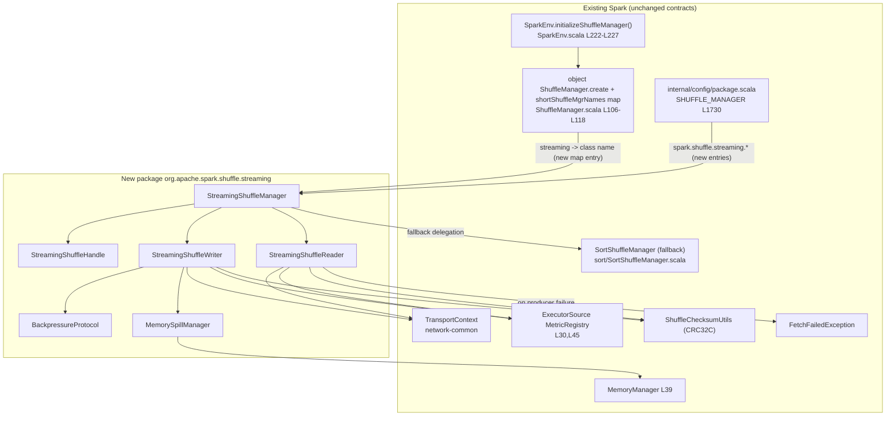

# Technical Specification

# 0. Agent Action Plan

## 0.1 Intent Clarification

This section restates the user request — *"Streaming Shuffle Implementation for Apache Spark"* — in precise technical language, surfaces the requirements that are implied but not explicitly stated, and maps the stated intent onto concrete engineering actions within the existing Apache Spark 4.1.0-SNAPSHOT codebase [core/pom.xml:version]. The repository was confirmed to be Apache Spark [README.md:L1] built with Scala 2.13.17, Java 17, Hadoop 3.4.2, and Netty 4.2.7.Final [pom.xml:scala.version,java.version,hadoop.version,netty.version].

### 0.1.1 Core Feature Objective

Based on the prompt, the Blitzy platform understands that the new feature requirement is to introduce an **opt-in streaming shuffle engine** that streams intermediate shuffle data directly from producer (map) tasks to consumer (reduce) tasks through bounded in-memory buffers governed by a backpressure protocol — eliminating the disk-materialization latency inherent in the existing sort-based shuffle, while guaranteeing **zero regression** for existing workloads through automatic graceful degradation to the current `SortShuffleManager` [shuffle/sort/SortShuffleManager.scala:L73].

The discrete feature requirements, restated with technical precision:

- Deliver a new `ShuffleManager` implementation, selectable via `spark.shuffle.manager=streaming`, that **coexists with — never replaces —** the existing `SortShuffleManager` [shuffle/sort/SortShuffleManager.scala:L73-L194], which remains the default and the fallback path.
- Stream data from producers to consumers over the **existing** network transport layer with per-partition memory buffers and a backpressure mechanism, targeting a 30-50% end-to-end latency reduction for shuffle-bound workloads (10GB+ data, 100+ partitions) and a 5-10% improvement for CPU-bound workloads.
- Prevent memory exhaustion through an 80% buffer-utilization spill threshold with sub-100ms response time, and guarantee zero data loss across producer crashes, consumer failures, and network partitions.
- Provide six core components: a streaming `ShuffleManager`, a streaming `ShuffleWriter`, a streaming `ShuffleReader`, a backpressure protocol, a memory-spill manager, and a comprehensive test/benchmark suite.

The following implicit requirements were detected and must be addressed for the feature to function correctly:

- **A new shuffle handle type is required.** The `ShuffleManager` contract dispatches `getWriter`/`getReader` based on the handle returned by `registerShuffle` [shuffle/ShuffleManager.scala:L43-L52], exactly as `SortShuffleManager` dispatches on `SerializedShuffleHandle`/`BypassMergeSortShuffleHandle` [shuffle/sort/SortShuffleManager.scala:L264-L278]. A new `StreamingShuffleHandle extends BaseShuffleHandle` [shuffle/BaseShuffleHandle.scala:L25-L28] is therefore implied.
- **Opt-in is two-fold.** Activation requires both the manager selector (`spark.shuffle.manager=streaming`, resolved through `SHUFFLE_MANAGER` [internal/config/package.scala:L1730-L1734]) and the new feature flag `spark.shuffle.streaming.enabled`, which in turn requires new `ConfigEntry` constants to be defined.
- **The reader's iterator must be lazy/blocking.** `ShuffleReader.read()` returns `Iterator[Product2[K,C]]` [shuffle/ShuffleReader.scala:L23-L33]; consuming in-progress (not-yet-complete) blocks requires the polling/streaming logic to live behind that iterator boundary so existing call sites remain unchanged.
- **The writer must still produce a `MapStatus`.** `ShuffleWriter.stop()` returns `Option[MapStatus]` [shuffle/ShuffleWriter.scala:L33]; the streaming writer must emit a `MapStatus` [scheduler/MapStatus.scala] so the unmodified `MapOutputTracker` and DAG scheduler can continue to locate outputs.
- **Graceful degradation implies composition.** To revert to sort-based behavior under the documented fallback conditions, the `StreamingShuffleManager` must internally compose a `SortShuffleManager` instance and delegate to it, rather than modifying scheduler or task logic.
- **Reuse the existing checksum facility.** CRC32C integrity checks must reuse `ShuffleChecksumUtils` [shuffle/ShuffleChecksumUtils.scala] rather than introduce a new checksum implementation.
- **Telemetry must use the existing metrics stack.** The four required streaming metrics must integrate with the existing Dropwizard `MetricRegistry` registration pattern used by `ExecutorSource` [executor/ExecutorSource.scala:L30,L45], exposed over JMX — no new metrics framework.

### 0.1.2 Special Instructions and Constraints

The prompt's *Implementation Discipline* block functions as the de-facto rule set for this feature and is treated as binding:

- Confine all changes to the `ShuffleManager` abstraction boundary; preserve the sort-based shuffle as the fallback; never modify the DAG scheduler, task lifecycle, or user-facing APIs.
- Select the approach requiring the least modification to the executor memory model and the network transport layer.
- Isolate streaming logic in dedicated classes with zero cross-contamination of existing components, and document every integration point with comments explaining the coexistence strategy.

**Absolute preservation (zero modifications) list** — the following must not be altered: RDD/DataFrame/Dataset user-facing APIs; the DAG scheduler and task-scheduling algorithms; executor lifecycle management; the lineage-tracking and fault-recovery model; the existing `SortShuffleManager` implementation [shuffle/sort/SortShuffleManager.scala]; deployment infrastructure and external dependencies; block-manager storage interface contracts; and task serialization/deserialization protocols.

**Configuration interface (preserved verbatim from the prompt):**

- `spark.shuffle.streaming.enabled`: Boolean, default false (opt-in flag)
- `spark.shuffle.streaming.bufferSizePercent`: Integer 1-50, default 20 (percent of executor memory)
- `spark.shuffle.streaming.spillThreshold`: Integer 50-95, default 80 (percent buffer utilization)
- `spark.shuffle.streaming.maxBandwidthMBps`: Integer, default unlimited (per-executor rate limit)
- `spark.shuffle.streaming.debug`: Boolean, default false (debug logging)

**Fallback conditions (auto-revert to sort-based shuffle):** consumer sustained 2x slower than producer for >60s; memory pressure that prevents buffer allocation (OOM risk); network saturation >90% link capacity; producer/consumer version mismatch.

**Operational and failure-tolerance constraints:** per-partition buffer = (executorMemory × bufferPercent) / numPartitions; spill at the configurable 80% threshold; zero memory leaks over a 2-hour stress test; reuse the existing `TransportContext`; QoS shuffle priority over speculative tasks; token-bucket refill = maxBandwidthMBps / numConcurrentShuffles; TCP keepalive 5s; pipelined block size limited to 2MB; connection timeout 5s; heartbeat interval 10s; CRC32C integrity; retry with exponential backoff (start 1s, max 5 attempts); atomic partial-read invalidation; config changes require executor restart (no dynamic reconfiguration in v1); telemetry overhead <1% CPU; log volume <10MB/hour per executor; JMX metrics exposed.

**User Example (integration factory, preserved exactly as provided):**

<pre>
case "streaming" => new StreamingShuffleManager(conf)
</pre>

Implementation note on the example: the prompt's snippet is illustrative. The actual factory in the current codebase is a name→class-name map (`shortShuffleMgrNames`) rather than a `match` expression [shuffle/ShuffleManager.scala:L112-L114]; the streaming entry will be added to that map (see §0.4). No web-search research was mandated by the prompt; supplementary research conducted to validate the design is documented in §0.2.2.

### 0.1.3 Technical Interpretation

These feature requirements translate to the following technical implementation strategy. Each requirement is mapped to a concrete action of the form *"To [achieve goal], we will [create/modify/extend] [specific component]."*

- To make streaming shuffle selectable, we will **modify** the `shortShuffleMgrNames` map in `object ShuffleManager` to register `"streaming" -> classOf[...streaming.StreamingShuffleManager].getName` [shuffle/ShuffleManager.scala:L112-L114], leaving `SparkEnv.initializeShuffleManager()` untouched [SparkEnv.scala:L222-L227].
- To expose the configuration surface, we will **extend** `internal/config/package.scala` with five `ConfigEntry` constants adjacent to `SHUFFLE_MANAGER` [internal/config/package.scala:L1730-L1734], following the existing `.doc().version().booleanConf/intConf.checkValue().createWithDefault()` builder pattern.
- To implement the engine, we will **create** a new, isolated sub-package `org.apache.spark.shuffle.streaming` containing `StreamingShuffleManager` (implements `ShuffleManager`), `StreamingShuffleWriter` (extends `ShuffleWriter`), `StreamingShuffleReader` (implements `ShuffleReader`), `BackpressureProtocol`, `MemorySpillManager`, and `StreamingShuffleHandle` (extends `BaseShuffleHandle`).
- To guarantee zero regression, we will **compose** a `SortShuffleManager` inside `StreamingShuffleManager` and delegate to it whenever the feature is disabled or a fallback condition fires.
- To preserve the fault-recovery model without touching the scheduler, the reader will signal recomputation by throwing the existing `FetchFailedException` [shuffle/FetchFailedException.scala] on producer-failure/partial-read-invalidation — the unmodified DAG scheduler already converts this into upstream stage recomputation.
- To deliver observability, we will **register** four new gauges/counters (`shuffle.streaming.bufferUtilizationPercent`, `.spillCount`, `.backpressureEvents`, `.partialReadInvalidations`) through the existing `MetricRegistry` pattern [executor/ExecutorSource.scala:L30,L45].
- To validate correctness and performance, we will **create** a mirror test package under `core/src/test/.../shuffle/streaming/` plus a benchmark, and **author/update** the configuration, tuning, architecture, and troubleshooting documentation.

## 0.2 Repository Scope Discovery

This section catalogs every existing file relevant to the feature, the supplementary research conducted to validate the design, and the complete set of new files that must be created. The repository contains **no `.blitzyignore` files** [repository-wide find: none], so no path-exclusion constraints apply.

### 0.2.1 Comprehensive File Analysis

The shuffle subsystem resides at `core/src/main/scala/org/apache/spark/shuffle/`. The following existing files are the authoritative contracts and reference implementations for this feature. Only two of them are modified (see §0.4 and §0.5); the remainder are read-only references whose contracts must be honored.

| Existing File | Role for this feature | Disposition |
|---------------|----------------------|-------------|
| `shuffle/ShuffleManager.scala` | Trait + factory; `getWriter`/`getReader`/`registerShuffle` contract [L38-L100]; `shortShuffleMgrNames` map [L112-L114] | **MODIFY** (register `"streaming"`) |
| `internal/config/package.scala` | `SHUFFLE_MANAGER` entry [L1730-L1734]; config-builder conventions; `PUSH_BASED_SHUFFLE_ENABLED` opt-in precedent [L2565] | **MODIFY** (add `spark.shuffle.streaming.*`) |
| `shuffle/ShuffleWriter.scala` | `abstract class ShuffleWriter[K,V]`: `write`/`stop`/`getPartitionLengths` [L27-L37] | REFERENCE |
| `shuffle/ShuffleReader.scala` | `trait ShuffleReader[K,C]`: `read():Iterator[Product2[K,C]]` [L23-L33] | REFERENCE |
| `shuffle/ShuffleHandle.scala` / `shuffle/BaseShuffleHandle.scala` | Handle base classes [L27-L28] / [L25-L28] | REFERENCE |
| `shuffle/sort/SortShuffleManager.scala` | Reference implementation + the fallback engine [L73-L194] | REFERENCE (preserve) |
| `shuffle/metrics.scala` | `ShuffleReadMetricsReporter` [L28-L46] / `ShuffleWriteMetricsReporter` [L56-L62] | REFERENCE |
| `shuffle/ShuffleChecksumUtils.scala` | Existing CRC32C facility to reuse | REFERENCE |
| `shuffle/ShuffleBlockResolver.scala` | Block-resolution trait contract (preserve) | REFERENCE |
| `shuffle/FetchFailedException.scala` | Existing fault signal that triggers stage recompute | REFERENCE |
| `core/SparkEnv.scala` | `initializeShuffleManager()` calls `ShuffleManager.create` [L222-L227] | REFERENCE (unchanged) |
| `memory/MemoryManager.scala` | `abstract class MemoryManager` [L39]; buffer accounting interface | REFERENCE |
| `common/network-common/.../TransportContext.java` | Existing transport layer to reuse | REFERENCE |
| `executor/ExecutorSource.scala` | `MetricRegistry` registration pattern [L30,L45] | REFERENCE |
| `scheduler/MapStatus.scala` | Data contract returned by `writer.stop()` | REFERENCE |

**Integration-point discovery summary:** the only API surface that connects the feature to the engine is the `ShuffleManager` factory map [shuffle/ShuffleManager.scala:L112-L114] and the configuration registry [internal/config/package.scala:L1730]. There are no database models, migrations, REST controllers, or middleware involved — this is an internal execution-engine feature. Service-level wiring (instantiation) is already generic [SparkEnv.scala:L222-L227] and requires no change because it resolves the manager class name dynamically.

### 0.2.2 Web Search Research Conducted

Supplementary research was conducted to validate the proposed design against established prior art and algorithms. Findings (with sources):

- **Prior art — Project Magnet / push-based shuffle (SPARK-30602), shipped in Apache Spark 3.2** (LinkedIn Engineering; VLDB 2020). Push-based shuffle addresses shuffle scalability/reliability and, critically, uses a *best-effort* design with graceful fallback: reduce tasks can fill holes from unmerged blocks and "completely fall back" when merged files are unavailable. This is directly analogous to the required graceful degradation to `SortShuffleManager`, and the LinkedIn write-up explicitly notes push-based shuffle "can be further adapted to continuous streaming workloads." The codebase already contains this opt-in-shuffle precedent via `PUSH_BASED_SHUFFLE_ENABLED` [internal/config/package.scala:L2565], confirming that an additive, flag-gated shuffle variant is an established pattern in Spark.
- **Token-bucket rate limiting** (network/QoS literature; system-design references). A token bucket adds tokens at a fixed rate up to a maximum capacity, transmitting only when tokens are available; it is the preferred choice for flow control because it absorbs short bursts while enforcing a sustained long-term rate. This validates the prompt's mandated `BackpressureProtocol` rate limiter and its refill formula (`maxBandwidthMBps / numConcurrentShuffles`).
- **Backpressure in distributed systems.** Rate limiting prevents upstream producers from overwhelming downstream consumers; when the bucket is empty, excess work is delayed — matching the prompt's consumer-to-producer heartbeat flow-control model.
- **CRC32C for shuffle integrity.** Spark already standardizes shuffle-block checksums on CRC32C through `ShuffleChecksumUtils` [shuffle/ShuffleChecksumUtils.scala]; the feature reuses this rather than introducing a new algorithm.

### 0.2.3 New File Requirements

All new production source files are created in a dedicated, isolated sub-package `org.apache.spark.shuffle.streaming` (sibling to `org.apache.spark.shuffle.sort`) to satisfy the "zero cross-contamination" discipline.

- **New source files** (`core/src/main/scala/org/apache/spark/shuffle/streaming/`):
  - `StreamingShuffleManager.scala` — implements `ShuffleManager`; factory for streaming writer/reader; composes a `SortShuffleManager` for fallback (~300 lines).
  - `StreamingShuffleHandle.scala` — `extends BaseShuffleHandle[K,V,C]`; enables type-based writer/reader dispatch (~40 lines).
  - `StreamingShuffleWriter.scala` — extends `ShuffleWriter[K,V]`; per-partition buffers, pipelining, CRC32C, spill coordination (~500 lines).
  - `BackpressureProtocol.scala` — heartbeat flow control + token-bucket rate limiting + priority arbitration + telemetry (~350 lines).
  - `StreamingShuffleReader.scala` — implements `ShuffleReader[K,C]`; in-progress block requests, partial-read invalidation, ack protocol, checksum validation (~400 lines).
  - `MemorySpillManager.scala` — 80% threshold polling, LRU spill, reclamation, block-manager disk coordination, metrics (~400 lines).
- **New test files** (`core/src/test/scala/org/apache/spark/shuffle/streaming/`): `StreamingShuffleManagerSuite`, `StreamingShuffleWriterSuite`, `BackpressureProtocolSuite`, `StreamingShuffleReaderSuite`, `MemorySpillManagerSuite`, `StreamingShuffleIntegrationSuite` (all `*Suite.scala`, extend `SparkFunSuite`).
- **New benchmark**: `StreamingShufflePerformanceBenchmark.scala` (extends `BenchmarkBase`).
- **New documentation**: `docs/streaming-shuffle.md` (architecture/design, troubleshooting, feature-flag migration guide, compatibility matrix, dashboard-template references).

## 0.3 Dependency Inventory

**This feature introduces no dependency changes — no additions, no updates, and no removals.** Every capability required by streaming shuffle is satisfied by libraries already declared in the build, consistent with the prompt's mandate to reuse the existing transport layer and external dependencies.

The runtime and library versions below were verified read-only from the build manifests and provide the compatibility baseline for the feature (and for the compatibility matrix to be authored in `docs/streaming-shuffle.md`):

| Component | Version | Source (read-only) | Relevance to feature |
|-----------|---------|--------------------|----------------------|
| Apache Spark | 4.1.0-SNAPSHOT | `core/pom.xml` (version) | Target build |
| Spark Core artifact | `spark-core_2.13` | `core/pom.xml` (artifactId) | Module that hosts the feature |
| Scala | 2.13.17 (binary 2.13) | `pom.xml` (scala.version) | Language runtime |
| Java | 17 | `pom.xml` (java.version) | JVM target |
| Hadoop | 3.4.2 | `pom.xml` (hadoop.version) | Cluster/runtime baseline |
| Netty | 4.2.7.Final | `pom.xml` (netty.version); `netty-all` [core/pom.xml:L297-L298] | Reused network transport |
| Dropwizard Metrics | 4.2.33 | `pom.xml` (codahale.metrics.version); `metrics-core` [core/pom.xml:L326-L327] | Reused telemetry registry |

Capability-to-existing-dependency mapping (no new packages needed):

- **Network streaming** → reuse `io.netty:netty-all` [core/pom.xml:L297-L298] via the existing `TransportContext`; no new dependency.
- **Telemetry** → reuse `io.dropwizard.metrics:metrics-core` [core/pom.xml:L326-L327] via the `MetricRegistry` pattern; no new dependency.
- **Optional block compression** → existing codecs `snappy-java` [core/pom.xml:L236], `lz4-java` [core/pom.xml:L240], and `zstd-jni` [core/pom.xml:L244] are already present.
- **CRC32C checksum** → JDK-builtin (`java.util.zip.CRC32C`) surfaced through the existing `ShuffleChecksumUtils` [shuffle/ShuffleChecksumUtils.scala]; no new dependency.

Because no manifests change, there are no import-rewrite or external-reference (build/CI) update requirements arising from dependency churn for this feature.

## 0.4 Integration Analysis

The feature integrates entirely within the `ShuffleManager` abstraction boundary. The diagram below shows how the new streaming components (in the new sub-package) plug into the existing, unchanged Spark machinery.

### 0.4.1 Existing Code Touchpoints

Direct modifications required (exactly two production files):

- `core/src/main/scala/org/apache/spark/shuffle/ShuffleManager.scala` — add a single entry to the `shortShuffleMgrNames` map so `"streaming"` resolves to the new manager's fully-qualified class name [shuffle/ShuffleManager.scala:L112-L114]. Illustrative shape of the change:

<pre>
private val shortShuffleMgrNames = Map(
  "sort" -> classOf[SortShuffleManager].getName,
  "tungsten-sort" -> classOf[SortShuffleManager].getName,
  "streaming" -> classOf[org.apache.spark.shuffle.streaming.StreamingShuffleManager].getName)
</pre>

- `core/src/main/scala/org/apache/spark/internal/config/package.scala` — add five `ConfigEntry` constants adjacent to `SHUFFLE_MANAGER` [internal/config/package.scala:L1730-L1734], following the existing builder pattern with documented validation ranges. Illustrative shape:

<pre>
val STREAMING_SHUFFLE_ENABLED = ConfigBuilder("spark.shuffle.streaming.enabled")
  .version("4.1.0").booleanConf.createWithDefault(false)
</pre>

Integration touchpoints that are reused **without modification** (contracts honored, no source change):

- **Instantiation** — `SparkEnv.initializeShuffleManager()` already resolves the manager dynamically from the configured name [SparkEnv.scala:L222-L227]; registering the name in the factory map is sufficient, so `SparkEnv` is untouched.
- **Fallback engine** — `StreamingShuffleManager` composes a `SortShuffleManager` instance [shuffle/sort/SortShuffleManager.scala:L73-L194] and delegates `registerShuffle`/`getWriter`/`getReader` to it when the feature is disabled or a fallback condition fires.
- **Memory accounting** — buffer allocation is tracked through the existing `MemoryManager` interface [memory/MemoryManager.scala:L39]; no redesign of the memory model.
- **Network transport** — streaming uses the existing `TransportContext` [common/network-common/.../TransportContext.java]; no new transport stack.
- **Telemetry** — the four streaming metrics are registered through the existing Dropwizard `MetricRegistry` pattern [executor/ExecutorSource.scala:L30,L45] and exposed over JMX.
- **Checksums** — CRC32C generation/validation reuses `ShuffleChecksumUtils` [shuffle/ShuffleChecksumUtils.scala].
- **Output discovery** — the writer emits a standard `MapStatus` [scheduler/MapStatus.scala] so `MapOutputTracker` and the DAG scheduler locate outputs unchanged.
- **Fault recovery** — the reader throws the existing `FetchFailedException` [shuffle/FetchFailedException.scala] on partial-read invalidation; the unmodified DAG scheduler converts this into upstream stage recomputation, preserving the lineage/fault-recovery model.

There are **no** database, schema, migration, dependency-injection-container, or model-export touchpoints for this feature — the integration surface is limited to the shuffle factory and the configuration registry.

## 0.5 Technical Implementation

This section defines the file-by-file execution plan and the implementation approach per file. Every file listed under CREATE or MODIFY must be acted upon; REFERENCE files are read-only contracts cited for accuracy and are not changed.

### 0.5.1 File-by-File Execution Plan

**Group 1 — Core streaming engine (CREATE)** in `core/src/main/scala/org/apache/spark/shuffle/streaming/`:

| Mode | File | Purpose |
|------|------|---------|
| CREATE | `StreamingShuffleManager.scala` | Implement `ShuffleManager`; dispatch streaming writer/reader; compose `SortShuffleManager` for fallback |
| CREATE | `StreamingShuffleHandle.scala` | `extends BaseShuffleHandle[K,V,C]`; carries shuffle metadata for type-based dispatch |
| CREATE | `StreamingShuffleWriter.scala` | `extends ShuffleWriter[K,V]`; per-partition buffers, pipelining, CRC32C, spill coordination, `MapStatus` emission |
| CREATE | `BackpressureProtocol.scala` | Heartbeat flow control, token-bucket rate limiter, priority arbitration, telemetry |
| CREATE | `StreamingShuffleReader.scala` | `implements ShuffleReader[K,C]`; in-progress block requests, partial-read invalidation, ack protocol, checksum validation |
| CREATE | `MemorySpillManager.scala` | 80% threshold polling, LRU spill, reclamation, block-manager disk coordination, metrics |

**Group 2 — Integration (MODIFY)** — minimal, two files:

| Mode | File | Change |
|------|------|--------|
| MODIFY | `shuffle/ShuffleManager.scala` | Register `"streaming"` in `shortShuffleMgrNames` [L112-L114] |
| MODIFY | `internal/config/package.scala` | Add five `spark.shuffle.streaming.*` `ConfigEntry` constants near `SHUFFLE_MANAGER` [L1730] |

**Group 3 — Tests & benchmark (CREATE)** in `core/src/test/scala/org/apache/spark/shuffle/streaming/` (benchmark may sit under `.../benchmark/`):

| Mode | File | Coverage |
|------|------|----------|
| CREATE | `StreamingShuffleManagerSuite.scala` | Selection, handle dispatch, fallback delegation |
| CREATE | `StreamingShuffleWriterSuite.scala` | Buffer allocation, memory tracking, spill at 80% with timing, checksum, producer-failure cleanup |
| CREATE | `BackpressureProtocolSuite.scala` | Ack/reclamation, token-bucket limiting, timeout detection, priority arbitration |
| CREATE | `StreamingShuffleReaderSuite.scala` | In-progress requests, timeout detection, partial-read invalidation, checksum validation/retransmission |
| CREATE | `MemorySpillManagerSuite.scala` | Threshold polling, LRU selection, reclamation within 100ms |
| CREATE | `StreamingShuffleIntegrationSuite.scala` | 10GB/100-partition latency check, failure/slowdown/partition injection, concurrent-shuffle arbitration |
| CREATE | `StreamingShufflePerformanceBenchmark.scala` | Baseline sort vs. streaming; latency/memory/spill/bandwidth metrics |

**Group 4 — Documentation**:

| Mode | File | Change |
|------|------|--------|
| MODIFY | `docs/configuration.md` | Add `spark.shuffle.streaming.*` parameter rows |
| MODIFY | `docs/tuning.md` | Add streaming-shuffle tuning guidance |
| CREATE | `docs/streaming-shuffle.md` | Architecture/design, troubleshooting, feature-flag migration guide, compatibility matrix, dashboard templates |

**Group 5 — REFERENCE (read-only, not modified):** `ShuffleWriter.scala`, `ShuffleReader.scala`, `ShuffleHandle.scala`, `BaseShuffleHandle.scala`, `metrics.scala`, `sort/SortShuffleManager.scala`, `SparkEnv.scala` [L222-L227], `memory/MemoryManager.scala`, `TransportContext.java`, `executor/ExecutorSource.scala`, `ShuffleChecksumUtils.scala`, `scheduler/MapStatus.scala`, `ShuffleBlockResolver.scala`, `FetchFailedException.scala`.

No files are deleted (Mode DELETE: none).

### 0.5.2 Implementation Approach per File

- **`StreamingShuffleManager.scala`** — Implement the `ShuffleManager` trait with constructor `(conf: SparkConf, isDriver: Boolean)` matching the contract [shuffle/ShuffleManager.scala:L32-L33]. `registerShuffle` returns a `StreamingShuffleHandle` when streaming is enabled and the dependency is supported, otherwise delegates to the composed `SortShuffleManager`. `getWriter`/`getReader` dispatch on handle type — `StreamingShuffleHandle` → streaming writer/reader, any other handle → delegate to fallback. `shuffleBlockResolver` returns an `IndexShuffleBlockResolver` for spilled blocks; `stop()` tears down both engines.
- **`StreamingShuffleHandle.scala`** — A thin `class StreamingShuffleHandle[K,V,C](shuffleId, dependency) extends BaseShuffleHandle[K,V,C]` [shuffle/BaseShuffleHandle.scala:L25-L28], mirroring the `SerializedShuffleHandle` pattern [shuffle/sort/SortShuffleManager.scala:L264-L268].
- **`StreamingShuffleWriter.scala`** — Implement `write(records)` to partition records into per-partition in-memory buffers sized `(executorMemory × bufferPercent) / numPartitions`, tracked through the existing `MemoryManager` [memory/MemoryManager.scala:L39]; pipeline ≤2MB blocks to consumers via `TransportContext`; compute CRC32C via `ShuffleChecksumUtils`; trigger backpressure/spill at the configured threshold; return `Option[MapStatus]` from `stop(success)` and expose `getPartitionLengths()` [shuffle/ShuffleWriter.scala:L27-L37].
- **`BackpressureProtocol.scala`** — Implement consumer→producer heartbeats (10s interval, 5s connect timeout), a token-bucket limiter with refill `maxBandwidthMBps / numConcurrentShuffles`, QoS priority arbitration by partition count and data volume, and telemetry emission.
- **`StreamingShuffleReader.scala`** — Implement `read()` to return a lazy/blocking `Iterator[Product2[K,C]]` [shuffle/ShuffleReader.scala:L23-L33] that requests in-progress blocks, validates CRC32C (retransmit on corruption with exponential backoff: start 1s, max 5 attempts), acknowledges consumed buffers, and on producer-timeout performs atomic partial-read invalidation by throwing `FetchFailedException` [shuffle/FetchFailedException.scala] to drive existing upstream recomputation.
- **`MemorySpillManager.scala`** — Poll memory utilization every 100ms; when the spill threshold is crossed, spill the largest buffered partitions via LRU to block-manager disk storage; reclaim buffers within 100ms of consumer acknowledgment; emit spill metrics.
- **`shuffle/ShuffleManager.scala` (MODIFY)** — Add the `"streaming"` entry to `shortShuffleMgrNames` [L112-L114]; add a brief comment explaining the coexistence strategy. No other change.
- **`internal/config/package.scala` (MODIFY)** — Define `STREAMING_SHUFFLE_ENABLED` (boolean, default false), `STREAMING_SHUFFLE_BUFFER_SIZE_PERCENT` (int, `checkValue` 1-50, default 20), `STREAMING_SHUFFLE_SPILL_THRESHOLD` (int, `checkValue` 50-95, default 80), `STREAMING_SHUFFLE_MAX_BANDWIDTH_MBPS` (int, default unlimited), and `STREAMING_SHUFFLE_DEBUG` (boolean, default false), each with `.doc()` and `.version("4.1.0")`.
- **Test suites & benchmark (CREATE)** — Extend `SparkFunSuite` (with `LocalSparkContext`/`SharedSparkContext` as needed), follow the `*Suite.scala` naming convention, and mirror the structure of `SortShuffleManagerSuite`; the benchmark extends `BenchmarkBase`.
- **Documentation** — Update the configuration table and tuning guide; author the standalone architecture/troubleshooting/migration document, clearly referencing the configuration keys and the coexistence/fallback model.

#### 0.5.2.1 User Interface Design

**Not applicable.** Streaming shuffle is a backend distributed-execution feature with no user-interface surface; there are no screens, components, Figma frames, or design-system elements involved. The only user-facing surface is the configuration interface documented in §0.1.2 and the metrics exposed over JMX.

## 0.6 Scope Boundaries

This section defines the exhaustive in-scope file set (with wildcard patterns) and the explicit out-of-scope boundaries.

### 0.6.1 Exhaustively In Scope

- **New streaming source package (all files):**
  - `core/src/main/scala/org/apache/spark/shuffle/streaming/**/*.scala` — `StreamingShuffleManager`, `StreamingShuffleHandle`, `StreamingShuffleWriter`, `BackpressureProtocol`, `StreamingShuffleReader`, `MemorySpillManager`
- **New streaming test package (all files):**
  - `core/src/test/scala/org/apache/spark/shuffle/streaming/**/*.scala` — all `*Suite.scala` and the integration suite
  - `core/src/test/scala/org/apache/spark/shuffle/**/StreamingShufflePerformanceBenchmark.scala` — performance benchmark
- **Integration points (targeted edits only):**
  - `core/src/main/scala/org/apache/spark/shuffle/ShuffleManager.scala` — `shortShuffleMgrNames` map entry [L112-L114]
  - `core/src/main/scala/org/apache/spark/internal/config/package.scala` — new `spark.shuffle.streaming.*` entries near [L1730]
- **Documentation:**
  - `docs/streaming-shuffle.md` (CREATE)
  - `docs/configuration.md` (UPDATE — `spark.shuffle.streaming.*` rows)
  - `docs/tuning.md` (UPDATE — streaming tuning section)

### 0.6.2 Explicitly Out of Scope

- The existing `SortShuffleManager` and all `shuffle/sort/**` internals — preserved unchanged as the default and fallback engine [shuffle/sort/SortShuffleManager.scala].
- `SparkEnv` instantiation path [SparkEnv.scala:L222-L227] — unchanged; the factory map registration is sufficient.
- The DAG scheduler and task-scheduling algorithms, lineage tracking, and the fault-recovery model — reuse the existing `FetchFailedException` only [shuffle/FetchFailedException.scala]; no source modification.
- RDD/DataFrame/Dataset user-facing APIs; executor lifecycle management; task serialization/deserialization protocols.
- Block-manager storage interface contracts and the `MemoryManager` design [memory/MemoryManager.scala] — used through existing interfaces only, never redesigned.
- `TransportContext` and network-common internals [common/network-common/.../TransportContext.java] — reused only.
- DAG-optimization heuristics, query-planning modifications, dynamic reconfiguration (v1 requires executor restart), and external-system integrations.
- No new external dependencies, build/CI manifest churn, UI/Figma/design-system work, or database/schema/migration changes.

## 0.7 Rules for Feature Addition

No user-specified implementation rules were provided for this project (the rules set was empty, and no setup instructions or environments were attached). The feature-specific rules below are therefore derived from the prompt's *Implementation Discipline* directives, which act as the binding rule set, and from conventions observed in the codebase.

- **Abstraction-boundary confinement:** Make only the changes necessary within the `ShuffleManager` abstraction boundary [shuffle/ShuffleManager.scala:L38-L100]. The sole permitted edits outside the new `streaming` package are the factory map entry [shuffle/ShuffleManager.scala:L112-L114] and the configuration constants [internal/config/package.scala:L1730].
- **Preserve the fallback engine:** The existing sort-based shuffle must remain fully intact and serve as the fallback; `StreamingShuffleManager` composes and delegates to it rather than altering it [shuffle/sort/SortShuffleManager.scala:L73-L194].
- **Never modify protected subsystems:** The DAG scheduler, task lifecycle, user-facing APIs, lineage/fault-recovery model, block-manager storage contracts, and task ser/deser protocols must not be changed. Upstream recomputation is triggered only through the existing `FetchFailedException` [shuffle/FetchFailedException.scala].
- **Least-modification principle:** Choose the approach that minimally touches the executor memory model and the network transport — reuse `MemoryManager` [memory/MemoryManager.scala:L39] and `TransportContext` [common/network-common/.../TransportContext.java] through their existing interfaces.
- **Isolation / zero cross-contamination:** All streaming logic lives in the dedicated `org.apache.spark.shuffle.streaming` package; existing components must not import or depend on streaming classes.
- **Document coexistence:** Every integration point must carry a comment explaining how streaming and sort-based shuffle coexist.
- **Convention adherence:** New configuration entries follow the `ConfigBuilder` pattern with `.doc()`, `.version()`, and `checkValue` validation [internal/config/package.scala:L1730-L1734]; new tests follow the `*Suite.scala` naming convention and extend `SparkFunSuite`; the new manager mirrors the structure and dispatch style of `SortShuffleManager`.
- **Performance & safety gates (from the prompt):** target 30-50% latency reduction for shuffle-bound workloads; zero regression for memory-bound workloads via automatic fallback; zero data loss under all failure scenarios; zero memory leaks over a 2-hour stress test; telemetry overhead <1% CPU and log volume <10MB/hour per executor.
- **Security/integrity:** All streamed blocks are integrity-checked with CRC32C via the existing `ShuffleChecksumUtils` [shuffle/ShuffleChecksumUtils.scala], with retransmission on corruption.

## 0.8 Attachments

No attachments were provided for this project. There are no PDF, image, or document attachments, and no Figma design frames or URLs to enumerate. All requirements were derived from the user's textual prompt ("Streaming Shuffle Implementation for Apache Spark"); no external reference files, design screens, or supplementary materials accompanied the request.

