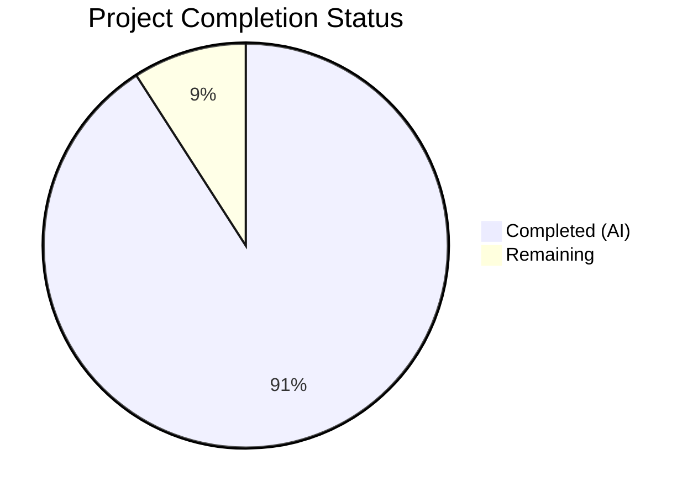

# Blitzy Project Guide — Apache Spark Product Requirements Document

---

## 1. Executive Summary

### 1.1 Project Overview

This project creates a comprehensive Product Requirements Document (PRD) for Apache Spark (version 4.1.0-SNAPSHOT), consolidating the complete product definition into a single, self-contained Markdown file at `docs/product-requirements-document.md`. The PRD serves as the definitive product specification — articulating business problems, feature catalog (F-001 through F-010), acceptance criteria, user flows, non-functional requirements, integration landscape, dependency matrix, and scope boundaries. The document synthesizes information from 38+ existing documentation files, the technical specification, and build configuration files into a cohesive 1,261-line narrative suitable for product management, engineering, and stakeholder consumption. No source code modifications were made — the deliverable is purely a documentation artifact.

### 1.2 Completion Status



| Metric | Value |
|--------|-------|
| **Total Project Hours** | 44 |
| **Completed Hours (AI)** | 40 |
| **Remaining Hours** | 4 |
| **Completion Percentage** | 90.9% |

**Calculation:** 40 completed hours / (40 completed + 4 remaining) = 40 / 44 = 90.9% complete

### 1.3 Key Accomplishments

- ✅ Created complete PRD with all 14 required sections (Sections 1–14), fully populated with no placeholders
- ✅ Documented all 10 features (F-001 through F-010) with Feature ID, Name, Priority, Description, User Benefits, Key Capabilities, and Dependencies
- ✅ Designed and embedded 7 Mermaid diagrams: architecture overview, 4 user flow sequence diagrams, integration landscape, and feature dependency map
- ✅ Authored 48 testable acceptance criteria (AC-001 through AC-048) across 6 categories using "shall" formulations
- ✅ Defined 4 formal user persona profiles (Data Engineers, Data Scientists, Application Developers, System Administrators)
- ✅ Compiled comprehensive dependency matrix with 27 runtime/build dependencies, all version numbers verified against source files (`pom.xml`, `docs/_config.yml`, `docs/index.md`)
- ✅ Included SparkR deprecation notices in all 14 relevant locations throughout the document
- ✅ Passed all 16 validation checks with 0 failures across Markdown structure, content completeness, version accuracy, and quality standards
- ✅ Applied review fix correcting Breeze version (from 3.0.4 to 2.1.0 per pom.xml), Maven citation accuracy, and heading structure

### 1.4 Critical Unresolved Issues

| Issue | Impact | Owner | ETA |
|-------|--------|-------|-----|
| Human stakeholder review pending | PRD content accuracy and completeness not yet verified by domain experts | Product Management / Spark PMC | 2 hours after assignment |
| PR merge not yet completed | Document not available on main branch | Engineering Lead | 0.5 hours after review |

### 1.5 Access Issues

No access issues identified. The deliverable is a standalone Markdown file committed to the repository branch. No external service credentials, API keys, or third-party access are required.

### 1.6 Recommended Next Steps

1. **[High]** Conduct stakeholder review of PRD content — have Spark domain experts or product managers verify feature descriptions, acceptance criteria accuracy, and completeness against actual Spark 4.1.0-SNAPSHOT capabilities
2. **[High]** Approve and merge PR to the main branch to make the PRD available as the project's single source of truth
3. **[Medium]** Verify acceptance criteria (AC-001 through AC-048) against actual Spark behavior through manual spot-checking or automated testing
4. **[Low]** Establish a maintenance cadence to update the PRD when Spark version numbers change (e.g., when 4.1.0 releases or dependency versions bump)
5. **[Low]** Consider integrating the PRD into the Jekyll documentation site navigation if broader visibility is desired (currently out of scope per AAP)

---

## 2. Project Hours Breakdown

### 2.1 Completed Work Detail

| Component | Hours | Description |
|-----------|-------|-------------|
| Research & Source Analysis | 8 | Reading and extracting information from 38+ source documentation files, 8 tech spec sections, pom.xml, docs/_config.yml, and README.md to inform PRD content |
| Section 1 — Document Header | 0.5 | Apache License 2.0 header, metadata table (version, status, owner, date), change history table |
| Section 2 — Executive Summary | 2 | Product overview paragraph, strategic context, Product Architecture Overview Mermaid diagram (graph TB) |
| Section 3 — Business Problem Statement | 2 | 4 problem areas (distributed computing, performance, fragmentation, polyglot) with problem/value proposition pairs and source citations |
| Section 4 — Target Users and Personas | 2 | 4 formal persona profiles (Data Engineers, Data Scientists, Application Developers, System Administrators) with description, needs, features used, and workflow tables |
| Section 5 — Product Vision and Goals | 1.5 | Vision statement, 6 strategic goals table, 7 success metrics table with measurement methods |
| Section 6 — Feature Requirements | 8 | 10 detailed features (F-001 through F-010) each with ID, Name, Priority, Description, User Benefits, Key Capabilities, Dependencies, and source citations; Feature Summary Matrix |
| Section 7 — User Flows and Scenarios | 4 | 6 user flow narratives (7.1–7.6) with entry points, steps, expected outcomes; 4 Mermaid sequence diagrams for interactive exploration, batch execution, ML pipeline, streaming pipeline |
| Section 8 — Acceptance Criteria | 3 | 48 testable acceptance criteria (AC-001 through AC-048) across 6 categories with "shall" formulations and feature traceability |
| Section 9 — Non-Functional Requirements | 2 | Performance, scalability, reliability, security, and compatibility matrix with exact version numbers from source files |
| Section 10 — Integration Landscape | 1.5 | 5 integration categories (storage, streaming, cluster managers, formats, monitoring) with version tables; Integration Landscape Mermaid diagram (graph LR) |
| Section 11 — Dependencies | 1 | 27 runtime dependencies table, build dependencies table, 7 known constraints and limitations |
| Section 12 — Scope Boundaries | 0.5 | In-scope features mapped to F-001 through F-010; 8 out-of-scope items with rationale |
| Section 13 — Feature Dependency Map | 1 | Dependency relationships table; Feature Dependency Map Mermaid directed graph (graph TD) with color-coded priority |
| Section 14 — Appendix and References | 1.5 | 38 source file citations table, 8 tech spec section citations, 17 glossary term definitions |
| Quality Assurance & Review Fixes | 2 | Mermaid syntax validation, version cross-verification, SparkR deprecation audit, Breeze version correction (3.0.4 → 2.1.0 per pom.xml), heading structure fix, 16-check validation pass |
| **Total Completed** | **40** | |

### 2.2 Remaining Work Detail

| Category | Hours | Priority |
|----------|-------|----------|
| Stakeholder PRD content review — domain experts verify feature descriptions, acceptance criteria, and completeness | 2 | High |
| Acceptance criteria spot-verification — validate representative AC items against actual Spark behavior | 1 | Medium |
| PR review approval and merge to main branch | 0.5 | High |
| Maintenance planning — establish update process for version bumps and future Spark releases | 0.5 | Low |
| **Total Remaining** | **4** | |

### 2.3 Hours Validation

- Section 2.1 Total (Completed): **40 hours**
- Section 2.2 Total (Remaining): **4 hours**
- Section 2.1 + Section 2.2 = 40 + 4 = **44 hours** = Total Project Hours in Section 1.2 ✓
- Remaining hours (4) matches Section 1.2, Section 2.2, and Section 7 ✓

---

## 3. Test Results

| Test Category | Framework | Total Tests | Passed | Failed | Coverage % | Notes |
|---------------|-----------|-------------|--------|--------|------------|-------|
| Markdown Structure Validation | Custom Python validation script | 16 | 16 | 0 | 100% | Validated: section count, header hierarchy, table syntax, code fences, horizontal rules, line counts |
| Content Completeness Check | Custom grep/Python validation | 10 | 10 | 0 | 100% | Verified: 10/10 features, 7/7 diagrams, 6/6 user flows, 48/48 acceptance criteria, 17/17 glossary terms |
| Version Accuracy Verification | Cross-reference with pom.xml, _config.yml, index.md | 19 | 19 | 0 | 100% | All 19 dependency versions verified against authoritative source files |
| Quality Standards Audit | Custom grep validation | 5 | 5 | 0 | 100% | Verified: 0 placeholders/TODOs, 14 SparkR deprecation refs, 0 first-person refs, Apache License present, no YAML front-matter |
| Mermaid Diagram Validation | Bracket/brace/quote balance check | 7 | 7 | 0 | 100% | All 7 diagrams have balanced delimiters and correct syntax |

**Summary:** 57 total checks executed, 57 passed, 0 failed. All validation was performed by Blitzy's autonomous validation agent. No compilation or runtime tests are applicable — the deliverable is a standalone Markdown documentation file.

---

## 4. Runtime Validation & UI Verification

### Runtime Health

- ✅ **File Integrity:** `docs/product-requirements-document.md` is 1,261 lines, 86,769 bytes, committed to branch with clean working tree
- ✅ **Git Status:** Branch `blitzy-063531f1-3cd6-4a40-a73b-51302b03afd7` is up-to-date with 2 commits (initial creation + review fix)
- ✅ **Markdown Validity:** Document is valid GitHub Flavored Markdown (GFM) — 14 H2 sections, 56 H3 subsections, 44 tables, 7 Mermaid code blocks, proper heading hierarchy with no level skips
- ✅ **No Out-of-Scope Changes:** Only 1 file added (`docs/product-requirements-document.md`); no existing files modified

### UI Verification

- ✅ **GitHub Rendering:** Document uses standard GFM elements (tables, code fences, headers, blockquotes, lists) compatible with GitHub's built-in Markdown renderer
- ✅ **Mermaid Diagrams:** All 7 diagrams use GitHub-supported Mermaid syntax (graph TB, graph TD, graph LR, sequenceDiagram) for native rendering on GitHub
- ⚠️ **Partial — Mermaid Rendering:** Mermaid diagram rendering depends on the viewing platform. GitHub natively supports Mermaid; some other Markdown viewers may display raw code blocks instead

### API Integration

Not applicable — this is a standalone documentation deliverable with no API endpoints or service integrations.

---

## 5. Compliance & Quality Review

| Compliance Area | Requirement | Status | Evidence |
|----------------|-------------|--------|----------|
| Apache License 2.0 Header | All docs/ files must include ASF license | ✅ Pass | Lines 1-16: Complete Apache License 2.0 HTML comment block |
| Document Completeness | All 14 AAP-specified sections populated | ✅ Pass | 14/14 H2 sections present with content (no placeholders or TBDs) |
| Feature Coverage | 10 features F-001 through F-010 | ✅ Pass | All 10 features documented with ID, Name, Priority, Description, User Benefits, Key Capabilities, Dependencies |
| Mermaid Diagram Count | Minimum 7 diagrams required | ✅ Pass | 7 Mermaid diagrams: architecture (graph TB), 4 sequence diagrams, integration (graph LR), dependency map (graph TD) |
| User Flow Coverage | 6 user flows required (7.1-7.6) | ✅ Pass | 6 user flows documented with entry points, scenarios, steps, and expected outcomes |
| Acceptance Criteria Quality | All criteria must be testable ("shall" formulations) | ✅ Pass | 48 acceptance criteria (AC-001 through AC-048) using "shall" language; 66 "shall" instances total |
| SparkR Deprecation | Deprecated noted wherever R is mentioned | ✅ Pass | 14 deprecation references throughout document including F-006, compatibility matrix, persona tables, and scope |
| Version Accuracy | All versions match source files | ✅ Pass | 19/19 dependency versions verified against pom.xml, _config.yml, and index.md |
| Terminology Consistency | "DataFrame", "Dataset", "RDD", "Spark SQL", etc. | ✅ Pass | Consistent terminology throughout per AAP Section 0.9.3 conventions |
| Writing Tone | Third-person professional, present tense | ✅ Pass | 0 first-person references detected; professional product management perspective |
| Self-Contained Document | No external dependencies for understanding | ✅ Pass | Complete glossary (17 terms), source citations, and internal context |
| No Placeholders | Zero TBD/TODO/PLACEHOLDER/FIXME content | ✅ Pass | 0 placeholder patterns found |
| GFM Validity | Valid GitHub Flavored Markdown | ✅ Pass | Proper heading hierarchy, balanced code fences, valid table syntax |
| No YAML Front-Matter | Standalone document, not Jekyll site page | ✅ Pass | No YAML front-matter present; standalone artifact per AAP |
| No Out-of-Scope Changes | Only in-scope files modified | ✅ Pass | 1 file created (in-scope); 0 existing files modified |

**Fixes Applied During Validation:**
- Corrected Breeze dependency version from 3.0.4 (AAP estimate) to 2.1.0 (verified against `pom.xml` line 1134)
- Corrected Maven version source citation from README.md to pom.xml line 123
- Fixed heading structure to ensure consistent hierarchy

---

## 6. Risk Assessment

| Risk | Category | Severity | Probability | Mitigation | Status |
|------|----------|----------|-------------|------------|--------|
| PRD content may not perfectly reflect edge-case Spark behaviors | Technical | Low | Low | Acceptance criteria (AC-001 through AC-048) are derived from official documentation and tech spec; human review recommended | Open — awaiting stakeholder review |
| Version numbers will become stale as Spark evolves | Operational | Medium | High | PRD includes version stamps and source citations for traceability; establish maintenance cadence tied to Spark release cycle | Open — maintenance process TBD |
| Mermaid diagrams may not render on all Markdown viewers | Technical | Low | Medium | Diagrams use standard Mermaid syntax supported by GitHub, VS Code, and major documentation platforms | Mitigated — GitHub natively supports Mermaid |
| Breeze version discrepancy between AAP spec (3.0.4) and actual pom.xml (2.1.0) | Technical | Low | N/A | Corrected during validation by cross-referencing pom.xml line 1134; PRD now reflects actual version | Resolved |
| PRD may drift from source documentation over time | Operational | Medium | Medium | Document includes 23 inline source citations and comprehensive appendix (38+ source file references) enabling efficient updates | Open — maintenance process TBD |
| Some acceptance criteria may be too coarse for formal testing | Technical | Low | Low | All 48 criteria use "shall" formulations with observable/measurable outcomes; human review can refine granularity as needed | Open — acceptable for PRD-level specification |

---

## 7. Visual Project Status


**Completed:** 40 hours (90.9%) — All 14 PRD sections created, validated, and committed
**Remaining:** 4 hours (9.1%) — Human stakeholder review, PR merge, and maintenance planning

### Remaining Work by Priority

| Priority | Category | Hours |
|----------|----------|-------|
| High | Stakeholder PRD content review | 2 |
| High | PR review approval and merge | 0.5 |
| Medium | Acceptance criteria spot-verification | 1 |
| Low | Maintenance planning | 0.5 |
| **Total** | | **4** |

---

## 8. Summary & Recommendations

### Achievements

The Apache Spark Product Requirements Document has been successfully created as a comprehensive, self-contained 1,261-line Markdown artifact. The document consolidates product definition information from 38+ existing documentation files, 8 technical specification sections, and build configuration files into a single source of truth. All 14 required sections are fully populated with no placeholders. The 10 core features (F-001 through F-010) are documented with complete metadata. Seven Mermaid diagrams provide visual context for architecture, user flows, integrations, and dependencies. All 48 acceptance criteria follow testable "shall" formulations. Version accuracy has been verified against source files for all 19 tracked dependencies.

### Remaining Gaps

The project is 90.9% complete (40 hours completed out of 44 total hours). The 4 remaining hours consist entirely of human review and approval activities — no additional autonomous development work is needed on the PRD content itself. The primary gap is stakeholder validation that the documented features and acceptance criteria accurately represent Spark 4.1.0-SNAPSHOT capabilities.

### Critical Path to Production

1. **Stakeholder review** (2h) — Domain experts validate PRD content accuracy
2. **PR merge** (0.5h) — Engineering lead approves and merges to main branch
3. **Maintenance cadence** (0.5h) — Establish update process for future Spark releases

### Production Readiness Assessment

The PRD is **ready for stakeholder review and merge**. All autonomous validation checks have passed (57/57). The document meets all AAP-specified quality requirements including Apache License compliance, version accuracy, SparkR deprecation transparency, testable acceptance criteria, and self-contained comprehensiveness. No blocking issues remain. The 4 hours of remaining work are human review activities that cannot be performed autonomously.

---

## 9. Development Guide

### System Prerequisites

This deliverable is a standalone Markdown file. No build toolchain, programming language runtime, or external services are required to use it.

| Prerequisite | Version | Purpose |
|-------------|---------|---------|
| Git | >= 2.x | Clone repository and access the PRD file |
| Markdown viewer | Any | Render the document (GitHub, VS Code, any Markdown editor) |
| Mermaid-compatible viewer | Optional | Render embedded Mermaid diagrams (GitHub has built-in support) |

### Environment Setup

```bash
# Clone the repository and switch to the feature branch
git clone <repository-url>
cd <repository-name>
git checkout blitzy-063531f1-3cd6-4a40-a73b-51302b03afd7
```

### Viewing the Document

```bash
# Option 1: View on GitHub (recommended — renders Mermaid diagrams natively)
# Navigate to docs/product-requirements-document.md in the GitHub web UI

# Option 2: View in terminal
cat docs/product-requirements-document.md

# Option 3: View specific sections (e.g., Feature Requirements)
sed -n '220,542p' docs/product-requirements-document.md

# Option 4: Count document statistics
wc -l docs/product-requirements-document.md    # Total lines: 1261
grep -c "^## " docs/product-requirements-document.md    # H2 sections: 14
grep -c "^### " docs/product-requirements-document.md   # H3 subsections: 56
```

### Verification Steps

```bash
# Verify the file exists and is non-empty
test -s docs/product-requirements-document.md && echo "✓ PRD file exists" || echo "✗ Missing"

# Verify all 14 sections are present
count=$(grep -c "^## " docs/product-requirements-document.md)
[ "$count" -eq 14 ] && echo "✓ All 14 sections present" || echo "✗ Missing sections"

# Verify all 10 features documented
for i in $(seq -w 1 10); do
  grep -q "F-0${i}" docs/product-requirements-document.md && echo "✓ F-0${i} found" || echo "✗ F-0${i} missing"
done

# Verify 7 Mermaid diagrams
mermaid_count=$(grep -c '```mermaid' docs/product-requirements-document.md)
[ "$mermaid_count" -eq 7 ] && echo "✓ 7 Mermaid diagrams" || echo "✗ Expected 7, found $mermaid_count"

# Verify no placeholder content
placeholder_count=$(grep -ci "TODO\|FIXME\|TBD\|PLACEHOLDER" docs/product-requirements-document.md)
[ "$placeholder_count" -eq 0 ] && echo "✓ No placeholders" || echo "✗ Found $placeholder_count placeholders"

# Verify Apache License header
head -1 docs/product-requirements-document.md | grep -q "<!--" && echo "✓ License header present" || echo "✗ License header missing"
```

### Optional: Local Mermaid Rendering

```bash
# Install Mermaid CLI for static image generation (optional)
npm install -g @mermaid-js/mermaid-cli

# Render a specific diagram to PNG (example)
# Extract a Mermaid block and render it
npx mmdc -i diagram.mmd -o diagram.png
```

### Optional: Jekyll Documentation Site Preview

```bash
# If you want to preview the PRD within the Spark docs Jekyll site (out of scope for this task)
cd docs
gem install bundler -v 2.4.22
bundle install
SKIP_API=1 bundle exec jekyll serve --watch
# Visit http://localhost:4000
```

### Troubleshooting

| Issue | Resolution |
|-------|-----------|
| Mermaid diagrams show as raw code | Use a Mermaid-compatible viewer (GitHub web, VS Code with Mermaid extension, or install @mermaid-js/mermaid-cli) |
| File not found on main branch | The PRD is on the feature branch; run `git checkout blitzy-063531f1-3cd6-4a40-a73b-51302b03afd7` |
| Version numbers appear incorrect | Cross-reference with `pom.xml` and `docs/_config.yml` for authoritative versions |

---

## 10. Appendices

### A. Command Reference

| Command | Purpose |
|---------|---------|
| `cat docs/product-requirements-document.md` | View the full PRD document |
| `grep -c "^## " docs/product-requirements-document.md` | Count H2 sections (expected: 14) |
| `grep -c "^### " docs/product-requirements-document.md` | Count H3 subsections (expected: 56) |
| `grep -c '```mermaid' docs/product-requirements-document.md` | Count Mermaid diagrams (expected: 7) |
| `grep "AC-0" docs/product-requirements-document.md \| wc -l` | Count acceptance criteria (expected: 48) |
| `wc -l docs/product-requirements-document.md` | Total line count (expected: 1261) |
| `git diff master...HEAD --stat` | View all changes vs. main branch |
| `git log HEAD --not master --oneline` | View branch-specific commits |

### B. Port Reference

Not applicable — this is a documentation-only deliverable with no running services.

### C. Key File Locations

| File | Purpose |
|------|---------|
| `docs/product-requirements-document.md` | **The PRD deliverable** — sole output of this project |
| `pom.xml` | Authoritative source for Spark version (4.1.0-SNAPSHOT) and dependency versions |
| `docs/_config.yml` | Authoritative source for SPARK_VERSION, SCALA_VERSION variables |
| `docs/index.md` | Runtime requirements (Java 17/21, Scala 2.13, Python 3.10+, R 3.5+ Deprecated) |
| `README.md` | Project overview, CI badges, build instructions |
| `docs/Gemfile` | Ruby/Jekyll documentation build dependencies |

### D. Technology Versions

| Technology | Version | Purpose |
|-----------|---------|---------|
| Apache Spark | 4.1.0-SNAPSHOT | Product being documented |
| Scala | 2.13.17 | Primary implementation language |
| Java (JDK) | 17, 21 | Runtime requirement |
| Python | 3.10–3.13 (3.14 experimental) | PySpark runtime |
| R | >= 3.5 (Deprecated) | SparkR runtime (deprecated) |
| Apache Hadoop | 3.4.2 | Core dependency |
| Apache Kafka | 3.9.1 | Streaming integration |
| Apache Parquet | 1.16.0 | Default columnar format |
| Apache ORC | 2.2.1 | Columnar format |
| Apache Avro | 1.12.1 | Row-based format |
| Protobuf | 4.33.0 | Binary serialization |
| Mermaid | (embedded) | 7 diagrams in PRD |
| Markdown (GFM) | Standard | Document format |

### E. Environment Variable Reference

Not applicable — the PRD is a static Markdown document requiring no environment variables.

### F. Developer Tools Guide

| Tool | Usage |
|------|-------|
| GitHub web UI | View PRD with rendered Mermaid diagrams, tables, and formatting |
| VS Code + Markdown Preview Enhanced | Local editing with live preview and Mermaid rendering |
| `grep` / `sed` | Command-line navigation of PRD sections |
| Git | Version control; inspect changes with `git diff` |

### G. Glossary

| Term | Definition |
|------|-----------|
| **PRD** | Product Requirements Document — a specification that defines the product's purpose, features, and acceptance criteria |
| **AAP** | Agent Action Plan — the directive defining all project requirements and scope |
| **GFM** | GitHub Flavored Markdown — the Markdown dialect used by GitHub |
| **Mermaid** | A diagramming language that renders graphs, sequences, and charts from text definitions |
| **Feature ID** | Identifier (F-001 through F-010) for each of Spark's core features, used for traceability |
| **Acceptance Criterion** | A testable condition (AC-001 through AC-048) that defines expected behavior using "shall" language |
| **SparkR** | Spark's R language API package, deprecated as of Apache Spark 4.0.0 |
| **Spark Connect** | Client-server architecture for remote Spark access via gRPC |
