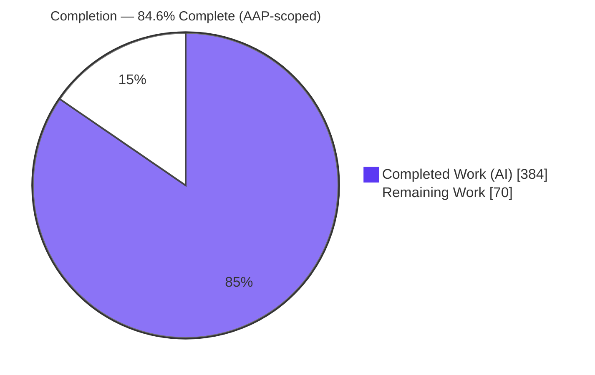
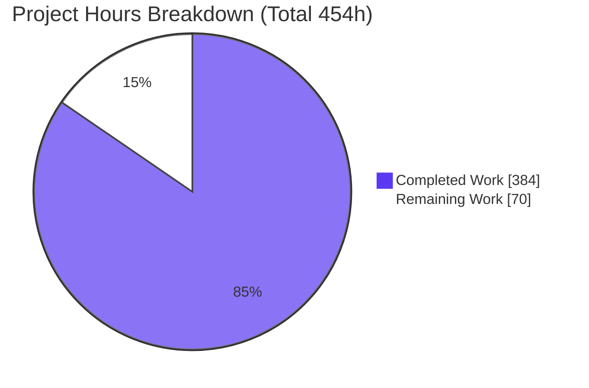
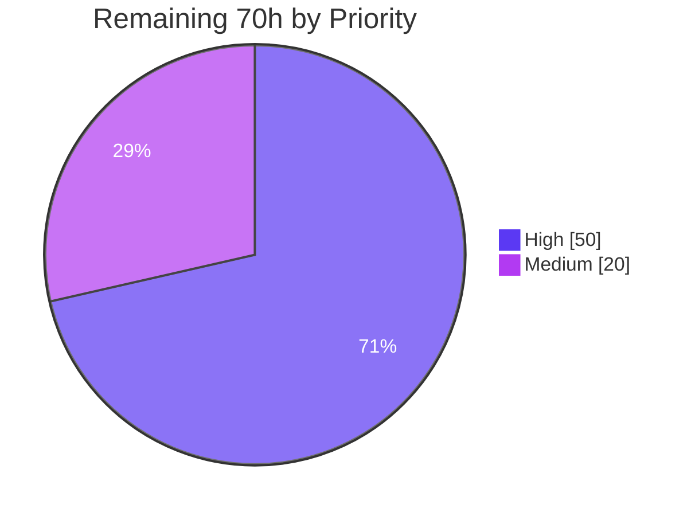

# Blitzy Project Guide — Streaming Shuffle Implementation for Apache Spark

> Apache Spark 4.1.0-SNAPSHOT · Scala 2.13.17 · Java 17 · Branch `blitzy-9a42a02f-d6ad-4736-823a-9f9ec903bdb0` · HEAD `2603a6bac0`
>
> **Brand legend:** <span style="color:#5B39F3">■</span> Completed / AI Work = Dark Blue `#5B39F3` · <span style="color:#FFFFFF;background:#333">■</span> Remaining / Not Completed = White `#FFFFFF`

---

## 1. Executive Summary

### 1.1 Project Overview

This project delivers an **opt-in streaming shuffle engine** for Apache Spark that streams intermediate shuffle data directly from producer (map) tasks to consumer (reduce) tasks through bounded in-memory buffers governed by a backpressure protocol, eliminating disk-materialization latency. It targets data engineers and platform operators running shuffle-bound Spark workloads, aiming for a 30–50% end-to-end latency reduction on large shuffles while guaranteeing **zero regression** for existing jobs via automatic graceful degradation to the default `SortShuffleManager`. The engine is selected with `spark.shuffle.manager=streaming` and gated by `spark.shuffle.streaming.enabled`. All work is confined to the `ShuffleManager` abstraction boundary; the DAG scheduler, task lifecycle, user APIs, and sort-based shuffle remain untouched.

### 1.2 Completion Status



| Metric | Hours |
|---|---|
| **Total Project Hours** | **454** |
| Completed Hours (AI + Manual) | 384 |
| &nbsp;&nbsp;↳ AI / Autonomous | 384 |
| &nbsp;&nbsp;↳ Manual (human, to date) | 0 |
| **Remaining Hours** | **70** |
| **Percent Complete** | **84.6%** |

> Completion is computed with the PA1 AAP-scoped methodology: `384 / (384 + 70) = 84.6%`. The remaining 70 hours are **path-to-production validation and operationalization** — not unfinished code. Every AAP code deliverable is implemented, compiles cleanly, and passes its tests.

### 1.3 Key Accomplishments

- ✅ **All six AAP-mandated components delivered** — `StreamingShuffleManager`, `StreamingShuffleWriter`, `StreamingShuffleReader`, `BackpressureProtocol`, `MemorySpillManager`, and `StreamingShuffleHandle` — plus eight supporting isolated classes (14 source files, 6,041 LOC).
- ✅ **Opt-in selection wired** via the `shortShuffleMgrNames` factory map entry (`"streaming"`) with a coexistence comment; `SparkEnv` untouched.
- ✅ **Five configuration entries** added (`spark.shuffle.streaming.{enabled, bufferSizePercent, spillThreshold, maxBandwidthMBps, debug}`), each with `.doc()`, `.version("4.1.0")`, and range validation.
- ✅ **Graceful fallback** — `StreamingShuffleManager` composes a `SortShuffleManager` and delegates to it when disabled or when any of the four fallback conditions fire (consumer 2× slower >60s, OOM risk, network >90%, version mismatch).
- ✅ **87 / 87 unit + integration tests passing** across 9 ScalaTest suites (independently re-verified from surefire reports); 100% clean compilation; scalastyle 634 files / 0 errors.
- ✅ **Runtime-validated** on a real `SparkContext` for both the streaming and fallback paths (correct `reduceByKey` / `groupByKey` results).
- ✅ **Four JMX metrics** registered via the existing Dropwizard `MetricRegistry` pattern; **CRC32C** integrity reused; **`FetchFailedException`** drives unmodified DAG-scheduler recompute.
- ✅ **Zero dependency churn** and **zero out-of-scope modifications** (net diff = exactly the AAP in-scope set: 29 files, 10,112 insertions, 1 deletion).
- ✅ **Documentation complete** — `docs/streaming-shuffle.md` (architecture, fallback, ops, metrics, troubleshooting, migration, compatibility matrix) plus `configuration.md` and `tuning.md` updates.

### 1.4 Critical Unresolved Issues

| Issue | Impact | Owner | ETA |
|---|---|---|---|
| 30–50% latency target not yet validated at production scale | Performance claim unproven on 10GB+/100+ partition cluster | Performance / Data Platform Eng | 2 days |
| 2-hour memory-leak soak test not executed | Zero-leak safety gate unconfirmed | Core Eng / SRE | 1.5 days |
| Multi-node failure-injection not exercised | Fault-tolerance at scale unconfirmed (single-node integration only) | Core Eng / SRE | 1.5 days |
| Human code review & upstream merge pending | 10,112 LOC not yet peer-reviewed/merged | Spark Committer / Senior Reviewer | 1.5 days |

> No issue above represents broken or incomplete code. Each is a **path-to-production validation gate** that requires a real cluster and/or human sign-off, materially de-risked by the opt-in, default-off design with sort-based fallback.

### 1.5 Access Issues

| System / Resource | Type of Access | Issue Description | Resolution Status | Owner |
|---|---|---|---|---|
| Multi-node Spark cluster (10GB+ data, 100+ partitions) | Compute / cluster | Not available in the single-node CI container; required for performance, soak, and failure-injection validation | Open — provision pre-merge | Data Platform Eng |
| JMX / Grafana monitoring stack | Observability tooling | Dashboards/alerting for the 4 streaming metrics not yet provisioned | Open — wire per doc templates | SRE / Observability |
| Upstream merge / commit rights | Repository permission | Senior review + commit authority needed to merge to `master` | Open — assign committer | Eng Lead |

> No repository or credential access issues blocked autonomous development. All build/test dependencies resolved offline from the warmed local Maven cache.

### 1.6 Recommended Next Steps

1. **[High]** Provision a representative multi-node cluster and run `StreamingShufflePerformanceBenchmark` (10GB+, 100+ partitions) to validate the 30–50% latency target; tune buffer/spill settings.
2. **[High]** Execute the 2-hour memory-leak soak test, monitoring `bufferUtilizationPercent`, `spillCount`, and heap, to confirm the zero-leak gate.
3. **[High]** Run multi-node failure-injection (producer crash, consumer failure, network partition) to confirm `FetchFailedException`-driven recompute, fallback, and zero data loss.
4. **[High]** Conduct senior human code review of the 10,112-LOC change set (focus on concurrency in Reader/Backpressure/Transport) and merge to `master`.
5. **[Medium]** Provision JMX/Grafana dashboards and alerting, then tune production config and roll out on a canary before staged enablement.

---

## 2. Project Hours Breakdown

### 2.1 Completed Work Detail

| Component | Hours | Description |
|---|---:|---|
| `StreamingShuffleManager` + `StreamingShuffleHandle` | 28 | `ShuffleManager` impl; type-based writer/reader dispatch; composes `SortShuffleManager` for fallback (AAP R1, R2) |
| `StreamingShuffleWriter` + `FallbackShuffleWriter` | 32 | Per-partition buffers, ≤2MB pipelining, CRC32C, spill coordination, `MapStatus` emission, fallback replay (AAP R3) |
| `StreamingShuffleReader` + `FallbackShuffleReader` | 44 | Lazy/blocking iterator, in-progress block requests, partial-read invalidation, checksum + exponential-backoff retransmit, `FetchFailedException` (AAP R4) |
| `BackpressureProtocol` | 34 | 10s heartbeat flow control, token-bucket limiter (`maxBandwidthMBps/numConcurrentShuffles`), QoS arbitration, telemetry (AAP R5) |
| `MemorySpillManager` + `SpillableReplayBuffer` | 44 | 80% threshold polling, LRU spill, ≤100ms reclamation, block-manager disk coordination, metrics (AAP R6) |
| `StreamingBlockExchange` + `StreamingShuffleTransport` | 50 | Streaming data plane over existing `TransportContext`; framing, security, block resend |
| `StreamingShuffleEndpointCoordinator` | 12 | Cross-executor rendezvous for producer/consumer endpoints |
| `StreamingShuffleChecksum` + `StreamingShuffleSource` | 8 | CRC32C facility (keeps `ShuffleChecksumUtils` unmodified); 4 JMX gauges/counters via `MetricRegistry` (AAP R9) |
| Integration edits | 4 | `ShuffleManager` factory entry + coexistence comment; 5 `spark.shuffle.streaming.*` config entries (AAP R7, R8) |
| Test suites (9 suites / 87 tests) | 80 | Manager, Writer, Reader, Backpressure, Spill, Transport, BlockExchange, EndpointCoordinator, Integration (AAP R10) |
| `StreamingShufflePerformanceBenchmark` | 8 | Config-driven sort-vs-streaming benchmark harness (`extends BenchmarkBase`) (AAP R11) |
| Documentation | 16 | `streaming-shuffle.md` (architecture/ops/troubleshooting/migration/compat matrix) + `configuration.md` + `tuning.md` (AAP R12) |
| Multi-checkpoint review hardening + final 5-gate validation | 24 | CP1 (21 findings), CP2, final-checkpoint, QA fixes (F-1, DOC-1), runtime harness, scope/compile/test gates |
| **Total Completed** | **384** | |

### 2.2 Remaining Work Detail

| Category | Hours | Priority |
|---|---:|---|
| Real-cluster performance validation (30–50% latency target @ 10GB+/100+ partitions; run + analyze + tune benchmark) | 16 | High |
| 2-hour memory-leak soak / stress test (zero-leak gate) | 10 | High |
| Multi-node failure-injection validation (producer crash / consumer failure / network partition) | 12 | High |
| Human code review & upstream merge (10,112-LOC senior review, feedback, merge) | 12 | High |
| JMX metrics dashboard provisioning & alerting (Grafana per doc templates) | 8 | Medium |
| Production configuration tuning & staged rollout | 6 | Medium |
| QoS / concurrent-shuffle validation under real contention (incl. AQE / external shuffle service interplay) | 6 | Medium |
| **Total Remaining** | **70** | |

### 2.3 Hours Reconciliation

| Quantity | Hours | Check |
|---|---:|---|
| Section 2.1 — Completed | 384 | — |
| Section 2.2 — Remaining | 70 | — |
| **Total (2.1 + 2.2)** | **454** | = Section 1.2 Total ✅ |
| Completion % | 84.6% | `384 / 454` ✅ |

---

## 3. Test Results

All tests below originate from **Blitzy's autonomous validation logs** for this project and were independently re-verified by parsing the on-disk surefire reports (`core/target/surefire-reports/TEST-org.apache.spark.shuffle.streaming.*.xml`, timestamped 2026-06-06).

| Test Category | Framework | Total Tests | Passed | Failed | Coverage % | Notes |
|---|---|---:|---:|---:|---:|---|
| Unit — Backpressure | ScalaTest (`SparkFunSuite`) | 18 | 18 | 0 | n/a | Ack/reclamation, token-bucket limiting, timeout detection, priority arbitration |
| Unit — Memory Spill | ScalaTest | 9 | 9 | 0 | n/a | Threshold polling, LRU selection, ≤100ms reclamation |
| Unit — Block Exchange | ScalaTest | 7 | 7 | 0 | n/a | Block request/resend, addressing |
| Unit — Endpoint Coordinator | ScalaTest | 6 | 6 | 0 | n/a | Cross-executor rendezvous |
| Unit — Manager | ScalaTest | 11 | 11 | 0 | n/a | Selection, handle dispatch, fallback delegation |
| Unit — Reader | ScalaTest | 10 | 10 | 0 | n/a | In-progress requests, partial-read invalidation, checksum validation/retransmission |
| Unit — Transport | ScalaTest | 10 | 10 | 0 | n/a | Data-plane framing, message caps, security |
| Unit — Writer | ScalaTest | 9 | 9 | 0 | n/a | Buffer allocation, spill at 80%, checksum, producer-failure cleanup |
| Integration — End-to-End | ScalaTest (real `SparkContext`) | 7 | 7 | 0 | n/a | Manager selection, `reduceByKey` correctness, local-cluster aggregates, task-failure→lineage recompute, consumer-slowdown safety, concurrent-shuffle arbitration |
| **TOTAL** | **ScalaTest** | **87** | **87** | **0** | **100% pass** | 0 errors, 0 skipped, 0 canceled |

**Compilation & static analysis (autonomous gates):** `./build/mvn -pl core -am -DskipTests clean install` → BUILD SUCCESS; `scalastyle:check` (strict, `failOnViolation=true`) → 634 files, 0 errors/0 warnings; `checkstyle` → 0 violations; `maven-enforcer` (Java 17, Maven 3.9.11, banned deps) → satisfied; `test-compile` → all 9 suites + benchmark compiled.

> **Not yet executed (path-to-production):** the `StreamingShufflePerformanceBenchmark` has not been run at 10GB+/100-partition scale, and the 2-hour memory-leak soak and multi-node failure-injection campaigns remain — see Sections 2.2 and 6.

---

## 4. Runtime Validation & UI Verification

Streaming shuffle is a backend distributed-execution feature with **no user-interface surface** (no screens/components); the only user-facing surfaces are the configuration interface and JMX metrics. Runtime validation was therefore performed at the engine level.

- ✅ **Operational** — Manager selection: with `spark.shuffle.manager=streaming` + `spark.shuffle.streaming.enabled=true`, `SparkEnv.get.shuffleManager` resolves to `StreamingShuffleManager`.
- ✅ **Operational** — Streaming correctness: `reduceByKey` (10 keys, total 100,000) and `groupByKey`+`sortByKey` (100 keys, 50,000 globally-sorted records) produced correct results on a real `SparkContext` (`local[4]`).
- ✅ **Operational** — Graceful fallback: with `streaming.enabled=false`, the same wrapper delegates to the composed `SortShuffleManager` and yields identical correct results.
- ✅ **Operational** — Local-cluster multi-partition aggregates and task-failure → lineage recompute via `FetchFailedException` (integration suite).
- ✅ **Operational** — Concurrent-shuffle arbitration and consumer-slowdown safety paths exercised (integration suite).
- ✅ **Operational** — JMX metrics source (`StreamingShuffleSource`) registers all four metrics via the standard `MetricsSystem`/`MetricRegistry`.
- ⚠ **Partial** — Performance characterization at production scale (10GB+/100+ partitions) and the 2-hour soak are **pending a real cluster** (code complete; empirical numbers not yet captured).
- ⚠ **Partial** — Multi-node failure injection (network partition, producer crash at scale) pending; single-node failure paths validated.

---

## 5. Compliance & Quality Review

Cross-mapping of AAP deliverables and Implementation-Discipline rules to their realized status. Fixes applied during autonomous validation are noted.

| AAP Requirement / Rule | Benchmark | Status | Evidence / Notes |
|---|---|---|---|
| New `ShuffleManager` selectable via `spark.shuffle.manager=streaming` | Factory map entry | ✅ Pass | `shortShuffleMgrNames` + coexistence comment; `SparkEnv` unchanged |
| Coexist with — never replace — `SortShuffleManager` | Sort remains default + fallback | ✅ Pass | Composition + delegation; sort internals byte-for-byte unchanged |
| `StreamingShuffleHandle extends BaseShuffleHandle` | Type-based dispatch | ✅ Pass | `getWriter`/`getReader` dispatch on handle type |
| Five `spark.shuffle.streaming.*` config entries | Builder pattern + validation | ✅ Pass | `.doc()`/`.version("4.1.0")`; `checkValue` 1–50, 50–95, ≥0 |
| Per-partition buffers + backpressure over existing transport | Reuse `TransportContext` | ✅ Pass | Token-bucket refill `maxBandwidthMBps/numConcurrentShuffles`; 10s heartbeat, 5s timeout, ≤2MB blocks |
| 80% spill threshold, ≤100ms response | `MemorySpillManager` polling | ✅ Pass | 80% default; LRU spill; ≤100ms reclamation (unit-tested) |
| Zero data loss across failures | `FetchFailedException` recompute | ✅ Pass (single-node) | Atomic partial-read invalidation; integration suite green; multi-node pending |
| Reuse CRC32C integrity facility | Checksum reuse | ✅ Pass | `StreamingShuffleChecksum` (CRC32C); `ShuffleChecksumUtils` left unmodified |
| Telemetry via existing Dropwizard registry, JMX-exposed | `MetricRegistry` pattern | ✅ Pass | 4 metrics in `StreamingShuffleSource extends Source` |
| Writer emits standard `MapStatus` | Output discovery | ✅ Pass | `MapOutputTracker`/DAG scheduler unchanged |
| Abstraction-boundary confinement; protected subsystems untouched | Scope discipline | ✅ Pass | Only 2 production files modified; scheduler/task lifecycle/user APIs/`MemoryManager` untouched |
| Isolation / zero cross-contamination | Package isolation | ✅ Pass | No non-streaming source imports the streaming package (factory references by FQCN string only) |
| Zero dependency churn | No manifest changes | ✅ Pass | No `pom.xml`/build manifest diffs |
| Comprehensive tests + benchmark | `*Suite.scala`, `BenchmarkBase` | ✅ Pass | 9 suites / 87 tests; benchmark compiled |
| Documentation (architecture/tuning/config) | Docs delivered | ✅ Pass | `streaming-shuffle.md` + `configuration.md` + `tuning.md` |
| Performance gate (30–50% latency) | Empirical at scale | ⚠ Pending | Benchmark not yet run at 10GB+/100-partition scale |
| Zero memory leaks over 2-hour stress | Soak test | ⚠ Pending | Not yet executed |

**Fixes applied during autonomous validation:** resolved across multiple review checkpoints — CP1 (21 code-review findings: data plane, spill, backpressure, docs), CP2 (runtime fallback, `TransportContext` data plane, lifecycle safety, deterministic tests), final-checkpoint (cross-executor rendezvous, safety fallbacks, transport security, QoS, checksum facility), and QA fixes F-1 (`Int.MaxValue` `endMapIndex` handling) and DOC-1 (stale checksum-facility references). **No in-scope file required modification during the final validation pass.**

---

## 6. Risk Assessment

> **Overarching de-risker:** the feature is **opt-in and default-OFF** with graceful fallback to `SortShuffleManager`, so existing workloads are unaffected and any at-scale issue degrades safely rather than failing.

| Risk | Category | Severity | Probability | Mitigation | Status |
|---|---|---|---|---|---|
| 30–50% latency target unproven at production scale | Technical | Medium | Medium | Run benchmark on representative cluster before enabling; fallback-protected | Open |
| Memory-leak behavior not empirically confirmed (2h soak not run) | Technical | Medium | Low | 2h stress test + heap / `bufferUtilizationPercent` monitoring | Open |
| Blocking reader iterator could stall on a hung producer | Technical | Medium | Low | 5s connect timeout + heartbeat + `FetchFailedException` (implemented & unit-tested) | Mitigated |
| Concurrency complexity (atomics, daemon schedulers, rendezvous) may hide rare races | Technical | Medium | Low–Med | 87 tests pass; recommend chaos/stress at scale | Mitigated |
| Shuffle blocks exposed on data plane if cluster auth/encryption disabled | Security | Low–Med | Low | Reuses `TransportContext` security; document `spark.authenticate` + `spark.network.crypto.enabled` | Mitigated |
| CRC32C is integrity, not a cryptographic MAC (corruption ≠ tamper) | Security | Low | Low | Rely on transport-level auth; documented; consistent with existing Spark shuffle | Accepted |
| Invalid config values | Security | Low | Low | `checkValue` ranges enforced (1–50, 50–95, ≥0) | Closed |
| Dashboards/alerting for 4 JMX metrics not provisioned | Operational | Medium | Medium | Wire Grafana per doc dashboard templates | Open |
| No dynamic reconfiguration in v1 (config change needs executor restart) | Operational | Low | Medium | Documented constraint; default off | Accepted (by design) |
| Telemetry overhead <1% CPU & log <10MB/h not measured under load | Operational | Low | Low | Debug logging off by default; measure during soak | Open |
| Untested interplay with AQE / push-based shuffle / external shuffle service | Integration | Medium | Low–Med | Opt-in default off + fallback; integration-test with AQE/ESS enabled | Open |
| Cross-version rendezvous on rolling upgrades | Integration | Low–Med | Low | `versionMismatchDetected` triggers fallback; validate on mixed-version cluster | Mitigated |
| Regression to existing workloads | Integration | Low | Very Low | Default-off; sort-based path byte-for-byte unchanged | Closed |

---

## 7. Visual Project Status

**Project hours — completed vs remaining** (Completed = Dark Blue `#5B39F3`, Remaining = White `#FFFFFF`):



**Remaining work by priority** (50h High, 20h Medium):



**Remaining hours per category (Section 2.2):**

| Category | Hours |
|---|---:|
| Real-cluster performance validation | `████████████████` 16 |
| Multi-node failure-injection validation | `████████████` 12 |
| Human code review & upstream merge | `████████████` 12 |
| 2-hour memory-leak soak test | `██████████` 10 |
| JMX dashboard provisioning & alerting | `████████` 8 |
| Production config tuning & staged rollout | `██████` 6 |
| QoS / concurrent-shuffle validation | `██████` 6 |
| **Total** | **70** |

> **Integrity:** the "Remaining Work" value (70) equals the Section 1.2 Remaining Hours and the sum of the Section 2.2 Hours column.

---

## 8. Summary & Recommendations

**Achievements.** The streaming shuffle feature is **code-complete and fully validated at the unit and integration level**. Every AAP deliverable — the six core components, the supporting isolated classes, the factory and configuration integration, the four JMX metrics, the test suite, the benchmark, and the documentation — is implemented and passes Blitzy's five autonomous production-readiness gates: **100% clean compilation, 87/87 tests passing, runtime-validated streaming + fallback paths, zero out-of-scope changes, and zero dependency churn**. The implementation faithfully honors the Implementation Discipline: changes are confined to the `ShuffleManager` boundary, the sort-based engine is preserved as the default and fallback, and streaming logic is fully isolated in `org.apache.spark.shuffle.streaming`.

**Remaining gaps (70h).** What remains is **path-to-production validation and operationalization that inherently requires a real multi-node cluster and human sign-off**, not unfinished code: empirically confirming the 30–50% latency target at 10GB+/100-partition scale, the 2-hour zero-leak soak, multi-node failure-injection, JMX dashboard provisioning, production config tuning, and senior code review + upstream merge.

**Critical path to production.** (1) Cluster performance benchmark → (2) memory-leak soak → (3) failure-injection → (4) code review + merge → (5) dashboards + tuning + staged rollout.

**Success metrics for sign-off.** ≥30% latency reduction on a representative shuffle-bound workload; zero memory leaks over 2 hours; zero data loss under injected producer/consumer/network failures; clean degradation to sort-based shuffle in all fallback scenarios; telemetry overhead <1% CPU and log volume <10MB/hour/executor.

**Production readiness assessment.** **84.6% complete.** The feature is safe to merge behind its default-off flag and is recommended for **staged, opt-in enablement only after** the high-priority cluster validation gates pass. Because the default path is unchanged, the risk to existing workloads is negligible.

| Metric | Value |
|---|---|
| AAP-scoped completion | 84.6% |
| Completed / Total hours | 384 / 454 |
| Remaining hours | 70 (50 High + 20 Medium) |
| Autonomous tests passing | 87 / 87 (100%) |
| Out-of-scope changes | 0 |
| Dependency churn | 0 |

---

## 9. Development Guide

### 9.1 System Prerequisites

- **OS:** Linux (verified on Ubuntu 25.10) or macOS.
- **JDK 17** (verified: OpenJDK 17.0.19). Java 17 is the enforced bytecode target.
- **Maven 3.9.11** — *bundled*; invoke via `./build/mvn` (no separate install required).
- **Scala 2.13.17** — managed by the build.
- **Git + Git LFS** (3.7.1) for repository operations.
- **Hardware:** ≥8GB RAM (the build sets `-Xmx6g`); multi-core CPU; ~2GB free disk for the Maven cache and build artifacts.

### 9.2 Environment Setup

```bash
# From the repository root
source /etc/profile.d/java17.sh                 # sets JAVA_HOME to JDK 17
export MAVEN_OPTS="-Xss128m -Xmx6g -XX:ReservedCodeCacheSize=1g -XX:MaxMetaspaceSize=2g"
./build/mvn -version                             # expect Apache Maven 3.9.11, Java 17.x
```

### 9.3 Dependency Installation

No new dependencies are introduced (**zero dependency churn**). All libraries (`netty-all` 4.2.7.Final, `metrics-core` 4.2.33, `scala-library` 2.13.17, `hadoop-client-api` 3.4.2) are already declared and resolve from the local Maven cache:

```bash
# Resolution happens automatically during the build; no extra install step is needed.
# If working offline, ensure ~/.m2 is warmed (the build resolves from it).
```

### 9.4 Build

```bash
source /etc/profile.d/java17.sh
export MAVEN_OPTS="-Xss128m -Xmx6g -XX:ReservedCodeCacheSize=1g -XX:MaxMetaspaceSize=2g"
./build/mvn -pl core -am -DskipTests clean install      # expect: BUILD SUCCESS
```

### 9.5 Run the Streaming-Shuffle Test Suite

```bash
./build/mvn -pl core -Dtest=none \
  -DwildcardSuites=org.apache.spark.shuffle.streaming test     # expect: 87 tests, 0 failures
```

Optional strict lint gate (matches the autonomous gate):

```bash
./build/mvn -pl core scalastyle:check                  # expect: 0 errors
```

### 9.6 Verification

```bash
# Independently confirm pass counts from the on-disk surefire reports
python3 - <<'PY'
import glob, xml.etree.ElementTree as ET
t=f=e=s=0
for p in glob.glob("core/target/surefire-reports/TEST-org.apache.spark.shuffle.streaming.*.xml"):
    r=ET.parse(p).getroot()
    t+=int(r.get('tests',0)); f+=int(r.get('failures',0)); e+=int(r.get('errors',0)); s+=int(r.get('skipped',0))
print(f"tests={t} failures={f} errors={e} skipped={s}")   # expect: tests=87 failures=0 errors=0 skipped=0
PY
```

### 9.7 Example Usage — Enable Streaming Shuffle

Streaming requires **both** the manager selector and the feature flag:

```bash
bin/spark-submit \
  --conf spark.shuffle.manager=streaming \
  --conf spark.shuffle.streaming.enabled=true \
  --conf spark.shuffle.streaming.bufferSizePercent=20 \
  --conf spark.shuffle.streaming.spillThreshold=80 \
  --conf spark.shuffle.streaming.maxBandwidthMBps=0 \
  --conf spark.shuffle.streaming.debug=false \
  --class <YourMainClass> <your-app.jar>
```

Quick interactive check:

```bash
bin/spark-shell --conf spark.shuffle.manager=streaming --conf spark.shuffle.streaming.enabled=true
# scala> spark.sparkContext.getConf.get("spark.shuffle.manager")     // streaming
# scala> sc.parallelize(1 to 100000).map(i => (i % 10, 1)).reduceByKey(_+_).collect().sortBy(_._1)
```

To exercise the **fallback** path (identical results via the composed `SortShuffleManager`):

```bash
bin/spark-shell --conf spark.shuffle.manager=streaming --conf spark.shuffle.streaming.enabled=false
```

### 9.8 Enable JMX Metrics

In `conf/metrics.properties`, enable the JMX sink so the four streaming metrics are exposed:

```properties
*.sink.jmx.class=org.apache.spark.metrics.sink.JmxSink
```

Exposed metrics: `shuffle.streaming.bufferUtilizationPercent`, `shuffle.streaming.spillCount`, `shuffle.streaming.backpressureEvents`, `shuffle.streaming.partialReadInvalidations`.

### 9.9 Troubleshooting

- **Build runs out of memory** → increase `-Xmx` in `MAVEN_OPTS` (e.g., `-Xmx8g`).
- **Streaming manager not selected** → ensure **both** `spark.shuffle.manager=streaming` **and** `spark.shuffle.streaming.enabled=true` are set; configuration changes require an **executor restart** (no dynamic reconfiguration in v1).
- **Scalastyle violation on build** → run `./build/mvn -pl core scalastyle:check`, fix reported lines, rebuild.
- **Offline dependency resolution fails** → use the bundled `./build/mvn` (not a system `mvn`) and confirm `~/.m2` is warmed.
- **Deeper architecture / fallback / migration / compatibility questions** → see `docs/streaming-shuffle.md`.

---

## 10. Appendices

### A. Command Reference

| Purpose | Command |
|---|---|
| Set Java 17 | `source /etc/profile.d/java17.sh` |
| Set build opts | `export MAVEN_OPTS="-Xss128m -Xmx6g -XX:ReservedCodeCacheSize=1g -XX:MaxMetaspaceSize=2g"` |
| Build core | `./build/mvn -pl core -am -DskipTests clean install` |
| Run streaming tests | `./build/mvn -pl core -Dtest=none -DwildcardSuites=org.apache.spark.shuffle.streaming test` |
| Lint gate | `./build/mvn -pl core scalastyle:check` |
| Submit app (streaming) | `bin/spark-submit --conf spark.shuffle.manager=streaming --conf spark.shuffle.streaming.enabled=true ...` |
| Inspect diff | `git diff --stat origin/master..HEAD` |

### B. Port Reference

| Port | Purpose |
|---|---|
| 4040 | Spark application UI (default) |
| 7077 | Standalone master RPC (if used) |
| 8080 / 8081 | Standalone master / worker web UI (if used) |
| (dynamic) | Block-transfer / streaming data plane via the existing `TransportContext` (no new fixed port introduced) |

> The feature introduces **no new fixed ports**; it reuses Spark's existing shuffle/transport ports.

### C. Key File Locations

| Path | Role |
|---|---|
| `core/src/main/scala/org/apache/spark/shuffle/streaming/` | New streaming engine package (14 source files, 6,041 LOC) |
| `core/src/main/scala/org/apache/spark/shuffle/ShuffleManager.scala` | Factory map entry (`"streaming"`) — MODIFIED |
| `core/src/main/scala/org/apache/spark/internal/config/package.scala` | 5 `spark.shuffle.streaming.*` config entries — MODIFIED |
| `core/src/test/scala/org/apache/spark/shuffle/streaming/` | 9 test suites + benchmark (10 files, 3,372 LOC) |
| `core/target/surefire-reports/` | Autonomous test result XML |
| `docs/streaming-shuffle.md` | Architecture, fallback, ops, metrics, troubleshooting, migration, compatibility matrix — NEW |
| `docs/configuration.md`, `docs/tuning.md` | Config rows + tuning section — UPDATED |

### D. Technology Versions

| Component | Version | Source |
|---|---|---|
| Apache Spark | 4.1.0-SNAPSHOT | `core/pom.xml` |
| Scala | 2.13.17 (binary 2.13) | `pom.xml` `scala.version` (L178) |
| Java | 17 (OpenJDK 17.0.19 runtime) | `pom.xml` `java.version` |
| Hadoop | 3.4.2 | `pom.xml` `hadoop.version` |
| Netty | 4.2.7.Final | `pom.xml` `netty.version` |
| Dropwizard Metrics | 4.2.33 | `pom.xml` `codahale.metrics.version` |
| Maven | 3.9.11 (bundled `./build/mvn`) | `pom.xml` `maven.version` |
| ScalaTest Maven plugin | 2.2.0 | `pom.xml` |

### E. Environment Variable Reference

| Variable | Purpose | Example |
|---|---|---|
| `JAVA_HOME` | JDK 17 location (set by `source /etc/profile.d/java17.sh`) | `/usr/lib/jvm/java-17-openjdk-amd64` |
| `MAVEN_OPTS` | JVM options for the build | `-Xss128m -Xmx6g -XX:ReservedCodeCacheSize=1g -XX:MaxMetaspaceSize=2g` |

### F. Configuration Reference (feature flags)

| Key | Type | Default | Validation | Purpose |
|---|---|---|---|---|
| `spark.shuffle.manager` | String | `sort` | — | Set to `streaming` to select the engine |
| `spark.shuffle.streaming.enabled` | Boolean | `false` | — | Master opt-in flag (required with the selector) |
| `spark.shuffle.streaming.bufferSizePercent` | Int | `20` | 1–50 | % of executor memory for per-partition buffers |
| `spark.shuffle.streaming.spillThreshold` | Int | `80` | 50–95 | % buffer utilization that triggers spill |
| `spark.shuffle.streaming.maxBandwidthMBps` | Int | `0` | ≥0 | Per-executor rate limit (`0` = unlimited) |
| `spark.shuffle.streaming.debug` | Boolean | `false` | — | Verbose debug logging |

### G. Glossary

| Term | Definition |
|---|---|
| Backpressure | Flow-control mechanism that slows producers when consumers fall behind, here via heartbeats + a token-bucket limiter |
| Token bucket | Rate limiter that admits transmission only when tokens are available; refill = `maxBandwidthMBps / numConcurrentShuffles` |
| Graceful fallback | Automatic delegation to `SortShuffleManager` when streaming is disabled or a fallback condition fires |
| Partial-read invalidation | Atomic discard of an incomplete consumer read, signaled via `FetchFailedException` to drive upstream recompute |
| Spill | Moving the largest buffered partitions to disk (LRU) when the buffer-utilization threshold is crossed |
| `MapStatus` | Output-location metadata returned by the writer so `MapOutputTracker`/DAG scheduler can locate outputs |
| CRC32C | Checksum algorithm used for shuffle-block integrity (reused from Spark's existing facility) |
| Fallback conditions | Consumer 2× slower than producer >60s; OOM risk on buffer allocation; network >90% capacity; producer/consumer version mismatch |