# Technical Specification

# 0. Agent Action Plan

## 0.1 Core Feature Objective

Based on the prompt, the Blitzy platform understands that the new feature requirement is to **add streaming shuffle capability to Apache Spark with opt-in configuration, eliminating shuffle materialization latency by streaming data directly from producers to consumers with memory buffering and backpressure protocol**.

#### Core Requirements Identified

- **Streaming Shuffle Implementation**: Create a new `StreamingShuffleManager` that implements the `org.apache.spark.shuffle.ShuffleManager` interface, allowing shuffle data to flow directly from map tasks to reduce tasks without full materialization
- **Memory-Mapped I/O Pipeline**: Implement per-partition memory buffers (20% of executor memory configurable 1-50%) that stream data directly to consumer executors via the existing network transport layer
- **Backpressure Protocol**: Develop consumer-to-producer signaling with heartbeat-based flow control (5-second timeout) and rate limiting (80% link capacity via token bucket algorithm)
- **Graceful Degradation**: Automatic disk spill at 80% buffer threshold (configurable 50-95%) and fallback to sort-based shuffle when memory pressure detected
- **Zero Data Loss Guarantee**: Implement partial read invalidation on producer failure, checksum validation (CRC32C), and upstream recomputation triggers
- **Performance Targets**: 30-50% latency reduction for shuffle-heavy workloads (10GB+ data, 100+ partitions) with zero regression for existing use cases

#### Implicit Requirements Detected

- **Coexistence with Existing Shuffle**: The streaming shuffle manager must coexist with `SortShuffleManager` as implementations of the same interface, allowing gradual adoption
- **Metrics and Telemetry**: Comprehensive instrumentation for buffer utilization, spill events, backpressure incidents, and partial read invalidations exposed via JMX
- **Configuration Management**: Feature flag-driven activation (`spark.shuffle.streaming.enabled=false` by default) with runtime validation but no dynamic reconfiguration
- **Failure Detection and Recovery**: Producer failure detection via connection timeout (5 seconds), consumer liveness monitoring via heartbeat (10 seconds), and atomic discard of partial reads
- **Memory Safety**: Prevent memory exhaustion through threshold monitoring at 100ms intervals and buffer reclamation within 100ms of consumer acknowledgment
- **Testing Infrastructure**: Unit tests (>85% coverage), integration tests with failure injection (10 scenarios), performance benchmarks, and 2-hour stress tests

#### Feature Dependencies and Prerequisites

- **Apache Spark Version**: 4.1.0-SNAPSHOT (current development version)
- **Java Runtime**: Java 17 (as specified in root pom.xml)
- **Scala Version**: 2.13.17 with binary version 2.13
- **Existing Infrastructure Dependencies**:
  - `org.apache.spark.shuffle.ShuffleManager` interface (core abstraction)
  - `org.apache.spark.network.TransportContext` (network layer for streaming)
  - `org.apache.spark.memory.MemoryManager` (buffer allocation and spill logic)
  - `org.apache.spark.storage.BlockManager` (disk spill coordination)
  - `org.apache.spark.scheduler.DAGScheduler` (failure recovery triggers)
  - `org.apache.spark.executor.ShuffleWriteMetrics` (telemetry integration)

## 0.2 Special Instructions and Constraints

#### Critical Implementation Directives

**Absolute Preservation Requirements - ZERO MODIFICATIONS**:

- **User-Facing APIs**: RDD/DataFrame/Dataset APIs remain completely untouched - no changes to public interfaces
- **DAG Scheduler**: Task scheduling algorithms, executor lifecycle management, and lineage tracking preserved exactly as-is
- **SortShuffleManager**: Existing implementation continues to function as production-stable fallback with zero code changes
- **Deployment Infrastructure**: No modifications to external dependencies, deployment processes, or infrastructure components
- **Block Manager Interface**: Storage interface contracts maintained without modification
- **Task Serialization**: Serialization/deserialization protocols remain unchanged

**Modification Scope - ONLY THESE COMPONENTS**:

- `org.apache.spark.shuffle.ShuffleManager` interface implementation (new StreamingShuffleManager)
- `org.apache.spark.shuffle.ShuffleWriter` streaming variant creation
- `org.apache.spark.shuffle.ShuffleReader` with in-progress block request support
- Memory management subsystem integration for buffer allocation and spill logic
- Network transfer layer for streaming protocol (leverage existing `TransportContext`)
- Executor metrics telemetry for streaming shuffle monitoring

#### Architectural Requirements

**Coexistence Strategy**:

- Streaming shuffle manager instantiated via `spark.shuffle.manager=streaming` configuration
- Factory method pattern in `ShuffleManager.create()` returns appropriate implementation based on config
- Both managers implement identical interface contract for seamless interoperability
- User Example: Configuration selection mechanism
  ```scala
  // In org.apache.spark.shuffle.ShuffleManager companion object
  def create(conf: SparkConf, isDriver: Boolean): ShuffleManager = {
    val shuffleManagerClass = conf.get("spark.shuffle.manager", "sort")
    shuffleManagerClass match {
      case "streaming" => new StreamingShuffleManager(conf)
      case "sort" => new SortShuffleManager(conf)
      case className => instantiateClass(className)
    }
  }
  ```

**Memory Management Constraints**:

- Streaming buffers limited to 20% executor memory (configurable via `spark.shuffle.streaming.bufferSizePercent` 1-50%)
- Per-partition buffer size calculated as: `(executorMemory * bufferPercent) / numPartitions`
- Spill trigger enforced at 80% utilization (configurable via `spark.shuffle.streaming.spillThreshold` 50-95%)
- Zero memory leaks validated via 2-hour stress test with heap dump analysis
- Buffer reclamation within 100ms of consumer acknowledgment

**Network Transfer Protocol**:

- Leverage existing `org.apache.spark.network.TransportContext` - no new network layer
- QoS prioritization: Shuffle traffic priority over speculative task execution
- Rate limiting via token bucket: Refill rate = `maxBandwidthMBps / numConcurrentShuffles`
- TCP keepalive enabled with 5-second interval for failure detection
- Block size limited to 2MB for pipelining efficiency

#### Special Patterns and Conventions

**Failure Tolerance Protocol**:

- Connection timeout: 5 seconds for producer failure detection
- Heartbeat interval: 10 seconds for consumer liveness monitoring
- Checksum algorithm: CRC32C for block integrity validation
- Retry policy: Exponential backoff starting 1 second, max 5 attempts
- Partial read invalidation: Atomic discard of all blocks from failed producer

**Configuration Interface Requirements**:

Primary configuration keys (all under `spark.shuffle.streaming.*` namespace):
- `enabled`: Boolean, default `false` (opt-in activation)
- `bufferSizePercent`: Integer 1-50, default 20
- `spillThreshold`: Integer 50-95, default 80
- `maxBandwidthMBps`: Integer, default unlimited
- `debug`: Boolean, default `false` (enable verbose logging)

**Automatic Fallback Conditions**:

System reverts to sort-based shuffle when:
- Consumer sustained 2x slower than producer for >60 seconds
- Memory pressure prevents buffer allocation (OOM risk)
- Network saturation exceeds 90% link capacity
- Producer/consumer version mismatch detected

#### Performance and Security Considerations

**Performance Requirements**:

- Telemetry overhead limited to <1% CPU utilization
- Log volume capped at <10MB/hour per executor for streaming events
- Configuration changes require executor restart (no dynamic reconfiguration in v1)
- Debug logging disabled by default to minimize performance impact

**Security Requirements**:

- No new authentication mechanisms - leverage existing Spark security
- Checksum validation on every block transfer
- Integrity validation via CRC32C algorithm
- No cleartext sensitive data in logs or metrics

## 0.3 Technical Interpretation

These feature requirements translate to the following technical implementation strategy:

#### Primary Technical Actions

**1. Create Streaming Shuffle Manager Infrastructure**

To implement streaming shuffle capability, we will:
- **Create** `core/src/main/scala/org/apache/spark/shuffle/streaming/StreamingShuffleManager.scala` (~300 lines) implementing the `ShuffleManager` trait
- **Create** `core/src/main/scala/org/apache/spark/shuffle/streaming/StreamingShuffleWriter.scala` (~500 lines) extending `ShuffleWriter[K,V,C]` with streaming buffer management
- **Create** `core/src/main/scala/org/apache/spark/shuffle/streaming/StreamingShuffleReader.scala` (~400 lines) extending `ShuffleReader[K,C]` with in-progress block polling
- **Modify** `core/src/main/scala/org/apache/spark/shuffle/ShuffleManager.scala` companion object to add streaming manager to factory method

**2. Implement Backpressure and Flow Control**

To enable consumer-driven flow control, we will:
- **Create** `core/src/main/scala/org/apache/spark/shuffle/streaming/BackpressureProtocol.scala` (~350 lines) implementing heartbeat-based signaling
- **Extend** existing `org.apache.spark.network.TransportContext` usage to support streaming acknowledgment protocol
- **Integrate** with `org.apache.spark.memory.MemoryManager` for threshold monitoring at 100ms intervals

**3. Build Memory Management and Spill Logic**

To prevent memory exhaustion and enable graceful degradation, we will:
- **Create** `core/src/main/scala/org/apache/spark/shuffle/streaming/MemorySpillManager.scala` (~400 lines) with 80% threshold monitoring
- **Integrate** with `org.apache.spark.storage.BlockManager` for disk persistence during spill operations
- **Implement** LRU-based partition selection for spill when buffer utilization exceeds threshold
- **Modify** `core/src/main/scala/org/apache/spark/memory/MemoryManager.scala` to track streaming shuffle buffer allocations

**4. Extend Metrics and Telemetry**

To provide operational visibility, we will:
- **Modify** `core/src/main/scala/org/apache/spark/executor/ShuffleWriteMetrics.scala` to add streaming-specific metrics
- **Modify** `core/src/main/scala/org/apache/spark/executor/ShuffleReadMetrics.scala` to track partial read invalidations
- **Create** JMX metric beans for:
  - `shuffle.streaming.bufferUtilizationPercent`: Real-time buffer occupancy
  - `shuffle.streaming.spillCount`: Disk spill event frequency
  - `shuffle.streaming.backpressureEvents`: Consumer rate limiting incidents
  - `shuffle.streaming.partialReadInvalidations`: Producer failure detection count

**5. Implement Failure Detection and Recovery**

To ensure zero data loss, we will:
- **Modify** `core/src/main/scala/org/apache/spark/scheduler/DAGScheduler.scala` to handle partial read invalidation events
- **Integrate** with existing task recomputation mechanism for upstream task restart
- **Implement** connection timeout detection (5s) and heartbeat monitoring (10s) in `StreamingShuffleReader`
- **Create** checksum validation layer using CRC32C algorithm in streaming writer/reader

**6. Build Comprehensive Test Infrastructure**

To validate correctness and performance, we will:
- **Create** `core/src/test/scala/org/apache/spark/shuffle/streaming/StreamingShuffleWriterSuite.scala` for writer unit tests
- **Create** `core/src/test/scala/org/apache/spark/shuffle/streaming/BackpressureProtocolSuite.scala` for flow control tests
- **Create** `core/src/test/scala/org/apache/spark/shuffle/streaming/StreamingShuffleReaderSuite.scala` for reader unit tests
- **Create** `core/src/test/scala/org/apache/spark/shuffle/streaming/StreamingShuffleIntegrationTest.scala` for end-to-end scenarios
- **Create** `core/src/test/scala/org/apache/spark/shuffle/streaming/StreamingShufflePerformanceBenchmark.scala` for latency validation
- **Create** `core/src/test/scala/org/apache/spark/shuffle/streaming/StreamingShuffleStressTest.scala` for 2-hour validation runs

#### Integration Strategy

**Network Layer Integration**:

The streaming shuffle will leverage the existing network infrastructure without modification:
- Use `common/network-common/src/main/java/org/apache/spark/network/TransportContext.java` for transport
- Extend `common/network-common/src/main/java/org/apache/spark/network/protocol/` message types for streaming acknowledgments
- Reuse `common/network-shuffle/src/main/java/org/apache/spark/network/shuffle/` client/server infrastructure

**Memory Management Integration**:

Buffer allocation will integrate with existing memory management:
- Query `org.apache.spark.memory.MemoryManager.acquireExecutionMemory` for buffer allocation
- Release memory via `MemoryManager.releaseExecutionMemory` on buffer reclamation
- Coordinate with `MemoryManager.memoryStore` for spill decisions

**Scheduler Integration**:

Failure recovery will leverage existing scheduler mechanisms:
- Notify `DAGScheduler` via `TaskSetManager.handleFailedTask` for upstream recomputation
- Use existing `MapOutputTracker` to invalidate map outputs from failed producers
- Preserve lineage tracking without modification to RDD recomputation logic

#### Implementation Phases

**Phase 1 - Core Infrastructure** (~1950 lines new code):
- StreamingShuffleManager, Writer, Reader implementations
- BackpressureProtocol and MemorySpillManager
- Configuration integration

**Phase 2 - Integration** (~300 lines modifications):
- ShuffleManager factory modification
- Metrics extensions
- DAGScheduler partial read handling

**Phase 3 - Testing** (~2000 lines test code):
- Unit test suites for all new components
- Integration tests with failure injection
- Performance benchmarks and stress tests

**Phase 4 - Documentation** (~500 lines documentation):
- Configuration reference for all `spark.shuffle.streaming.*` parameters
- Architecture design document with protocol specification
- Performance tuning guide and troubleshooting procedures
- Migration guide for staged rollout

## 0.4 Repository Scope Discovery

#### Existing Files Requiring Modification

#### Core Shuffle Infrastructure Files

**ShuffleManager Factory Integration**:
- `core/src/main/scala/org/apache/spark/shuffle/ShuffleManager.scala`
  - **Purpose**: Add streaming manager to factory method
  - **Modification**: Update `create()` method to recognize "streaming" identifier
  - **Lines Modified**: ~10 lines in companion object

**Metrics Extensions**:
- `core/src/main/scala/org/apache/spark/executor/ShuffleWriteMetrics.scala`
  - **Purpose**: Add streaming shuffle write metrics fields
  - **Modification**: Add buffer utilization, spill count tracking
  - **Lines Modified**: ~50 lines
  
- `core/src/main/scala/org/apache/spark/executor/ShuffleReadMetrics.scala`
  - **Purpose**: Add streaming shuffle read metrics fields
  - **Modification**: Add partial read invalidation counter, backpressure event tracking
  - **Lines Modified**: ~50 lines

**Scheduler Integration**:
- `core/src/main/scala/org/apache/spark/scheduler/DAGScheduler.scala`
  - **Purpose**: Handle partial read invalidation events
  - **Modification**: Add event handler for streaming shuffle failures
  - **Lines Modified**: ~75 lines in failure handling logic

**Memory Management Integration**:
- `core/src/main/scala/org/apache/spark/memory/MemoryManager.scala`
  - **Purpose**: Track streaming shuffle buffer allocations separately
  - **Modification**: Add buffer pool tracking methods
  - **Lines Modified**: ~40 lines

#### Network Protocol Extensions

**Protocol Message Definitions**:
- `common/network-common/src/main/java/org/apache/spark/network/protocol/Message.java`
  - **Purpose**: Add streaming acknowledgment message types
  - **Modification**: Register new message type identifiers
  - **Lines Modified**: ~25 lines

**Encoder Utilities**:
- `common/network-common/src/main/java/org/apache/spark/network/protocol/Encoders.java`
  - **Purpose**: Add encoders for streaming protocol data structures
  - **Modification**: Add encoder methods for acknowledgment payloads
  - **Lines Modified**: ~40 lines

#### Configuration Files

**Core Configuration Schema**:
- `core/src/main/scala/org/apache/spark/internal/config/package.scala`
  - **Purpose**: Register streaming shuffle configuration keys
  - **Modification**: Add `spark.shuffle.streaming.*` configuration entries
  - **Lines Modified**: ~80 lines

**Build Configuration**:
- `core/pom.xml`
  - **Purpose**: No changes required (all dependencies already present)
  - **Modification**: None

#### New Source Files to Create

#### Core Streaming Shuffle Components

**StreamingShuffleManager** (~300 lines):
- **Path**: `core/src/main/scala/org/apache/spark/shuffle/streaming/StreamingShuffleManager.scala`
- **Purpose**: Main shuffle manager implementation with streaming semantics
- **Key Responsibilities**:
  - Implement `ShuffleManager` trait methods
  - Factory methods for `StreamingShuffleWriter` and `StreamingShuffleReader`
  - Shuffle registration and handle creation
  - Integration with memory manager for buffer allocation

**StreamingShuffleWriter** (~500 lines):
- **Path**: `core/src/main/scala/org/apache/spark/shuffle/streaming/StreamingShuffleWriter.scala`
- **Purpose**: Map-side shuffle writer with streaming and backpressure
- **Key Responsibilities**:
  - Per-partition buffer management (20% executor memory allocation)
  - Network streaming pipeline to consumer executors
  - Backpressure detection and spill triggering at 80% threshold
  - Checksum generation for block integrity (CRC32C)
  - Metrics reporting for write operations

**StreamingShuffleReader** (~400 lines):
- **Path**: `core/src/main/scala/org/apache/spark/shuffle/streaming/StreamingShuffleReader.scala`
- **Purpose**: Reduce-side shuffle reader with in-progress block requests
- **Key Responsibilities**:
  - Poll producer for available data before shuffle completion
  - Producer failure detection via connection timeout (5 seconds)
  - Partial read invalidation on producer failure
  - Acknowledgment protocol for buffer reclamation
  - Checksum validation on block receive

**BackpressureProtocol** (~350 lines):
- **Path**: `core/src/main/scala/org/apache/spark/shuffle/streaming/BackpressureProtocol.scala`
- **Purpose**: Consumer-to-producer flow control signaling
- **Key Responsibilities**:
  - Heartbeat-based flow control with 5-second timeout
  - Per-executor bandwidth cap at 80% link capacity (token bucket)
  - Buffer utilization threshold monitoring across concurrent shuffles
  - Priority arbitration for memory allocation
  - Backpressure event telemetry

**MemorySpillManager** (~400 lines):
- **Path**: `core/src/main/scala/org/apache/spark/shuffle/streaming/MemorySpillManager.scala`
- **Purpose**: Automatic disk spill management
- **Key Responsibilities**:
  - 80% threshold monitoring at 100ms polling intervals
  - LRU-based partition selection for eviction
  - Buffer reclamation within 100ms of acknowledgment
  - Block manager integration for disk persistence
  - Spill metrics tracking (frequency, volume, latency)

#### Network Protocol Components

**StreamingShuffleAcknowledgment** (~150 lines):
- **Path**: `common/network-common/src/main/java/org/apache/spark/network/protocol/StreamingShuffleAcknowledgment.java`
- **Purpose**: Protocol message for consumer acknowledgments
- **Key Responsibilities**:
  - Encode consumer position for buffer reclamation
  - Support for partial and complete acknowledgments
  - Serialization/deserialization for network transport

**StreamingShuffleHeartbeat** (~100 lines):
- **Path**: `common/network-common/src/main/java/org/apache/spark/network/protocol/StreamingShuffleHeartbeat.java`
- **Purpose**: Protocol message for liveness detection
- **Key Responsibilities**:
  - 10-second heartbeat interval implementation
  - Consumer liveness signaling to producer
  - Timeout detection for failure scenarios

#### New Test Files to Create

#### Unit Test Suites

**StreamingShuffleWriterSuite** (~400 lines):
- **Path**: `core/src/test/scala/org/apache/spark/shuffle/streaming/StreamingShuffleWriterSuite.scala`
- **Test Coverage**:
  - Buffer allocation and partition-level memory tracking
  - Spill trigger at 80% threshold with timing validation
  - Checksum generation (CRC32C) for integrity
  - Producer failure cleanup and resource reclamation

**StreamingShuffleReaderSuite** (~400 lines):
- **Path**: `core/src/test/scala/org/apache/spark/shuffle/streaming/StreamingShuffleReaderSuite.scala`
- **Test Coverage**:
  - In-progress block request and partial data consumption
  - Producer failure detection via connection timeout
  - Partial read invalidation and recomputation trigger
  - Checksum validation and retransmission request

**BackpressureProtocolSuite** (~350 lines):
- **Path**: `core/src/test/scala/org/apache/spark/shuffle/streaming/BackpressureProtocolSuite.scala`
- **Test Coverage**:
  - Consumer acknowledgment processing
  - Rate limiting via token bucket validation
  - Timeout detection and failure signaling
  - Priority arbitration under concurrent shuffle load

**MemorySpillManagerSuite** (~350 lines):
- **Path**: `core/src/test/scala/org/apache/spark/shuffle/streaming/MemorySpillManagerSuite.scala`
- **Test Coverage**:
  - Threshold monitoring accuracy (100ms intervals)
  - LRU partition selection algorithm
  - Buffer reclamation timing (<100ms)
  - Disk spill integration with block manager

#### Integration Test Suites

**StreamingShuffleIntegrationTest** (~500 lines):
- **Path**: `core/src/test/scala/org/apache/spark/shuffle/streaming/StreamingShuffleIntegrationTest.scala`
- **Test Scenarios**:
  1. Complete 10GB shuffle with 100 partitions, verify 30% latency reduction
  2. Producer failure mid-shuffle with partial read invalidation
  3. Consumer slowdown (50% rate) with automatic spill trigger
  4. Network partition with timeout and fallback behavior
  5. Memory pressure test: 5 concurrent shuffles with buffer arbitration

**StreamingShufflePerformanceBenchmark** (~400 lines):
- **Path**: `core/src/test/scala/org/apache/spark/shuffle/streaming/StreamingShufflePerformanceBenchmark.scala`
- **Benchmark Metrics**:
  - Baseline: Sort-based shuffle for groupByKey on 10GB dataset, 100 partitions
  - Streaming: Same workload with streaming shuffle enabled
  - Measurements: End-to-end latency, memory utilization, spill frequency, network bandwidth
  - Target validation: 30-50% latency reduction, <10% memory overhead, <5% spill rate

**StreamingShuffleStressTest** (~600 lines):
- **Path**: `core/src/test/scala/org/apache/spark/shuffle/streaming/StreamingShuffleStressTest.scala`
- **Stress Scenarios**:
  - 2-hour continuous shuffle workload
  - 1000 concurrent tasks with 500 concurrent shuffles
  - Random failure injection: 1% task failure rate
  - Memory leak detection via heap dump analysis
  - Performance degradation monitoring: <5% throughput reduction

#### New Configuration Files

**Streaming Shuffle Configuration Reference** (~200 lines):
- **Path**: `docs/configuration.md` (section addition)
- **Content**: Documentation for all `spark.shuffle.streaming.*` parameters

**Monitoring Dashboard Templates** (~300 lines):
- **Path**: `docs/monitoring/streaming-shuffle-dashboard.json`
- **Content**: Grafana dashboard template for streaming shuffle metrics

#### New Documentation Files

**Architecture Design Document** (~500 lines):
- **Path**: `docs/streaming-shuffle-architecture.md`
- **Content**:
  - Streaming protocol specification
  - Failure handling flows
  - Memory management design
  - Network layer integration

**Performance Tuning Guide** (~300 lines):
- **Path**: `docs/streaming-shuffle-tuning.md`
- **Content**:
  - Buffer sizing recommendations
  - Spill threshold optimization
  - Network bandwidth tuning
  - Workload-specific guidelines

**Troubleshooting Guide** (~400 lines):
- **Path**: `docs/streaming-shuffle-troubleshooting.md`
- **Content**:
  - Common issues and resolutions
  - Telemetry interpretation
  - Debugging procedures
  - Log analysis guidelines

**Migration Guide** (~300 lines):
- **Path**: `docs/streaming-shuffle-migration.md`
- **Content**:
  - Staged rollout recommendations
  - Feature flag usage
  - Compatibility matrix
  - Rollback procedures

## 0.5 Dependency Inventory

#### Private and Public Packages

All dependencies for the streaming shuffle feature are already present in the Apache Spark codebase. No new external dependencies are required.

| Registry | Package Name | Version | Purpose |
|----------|-------------|---------|---------|
| Maven Central | org.scala-lang:scala-library | 2.13.17 | Scala runtime for StreamingShuffleManager and related components |
| Maven Central | io.netty:netty-all | 4.2.7.Final | Network transport layer for streaming protocol |
| Maven Central | io.netty:netty-tcnative-boringssl-static | 2.0.74.Final | Native SSL/TLS support for secure shuffle |
| Maven Central | com.google.guava:guava | 33.4.0-jre | Collections and utilities for backpressure protocol |
| Maven Central | org.apache.commons:commons-lang3 | 3.19.0 | String and utility operations |
| Maven Central | commons-io:commons-io | 2.20.0 | I/O utilities for spill management |
| Maven Central | io.dropwizard.metrics:metrics-core | 4.2.33 | Metrics collection for streaming shuffle telemetry |
| Internal | org.apache.spark:spark-core_2.13 | 4.1.0-SNAPSHOT | Core Spark interfaces and abstractions |
| Internal | org.apache.spark:spark-network-common_2.13 | 4.1.0-SNAPSHOT | Network protocol base classes |
| Internal | org.apache.spark:spark-network-shuffle_2.13 | 4.1.0-SNAPSHOT | Shuffle-specific network handlers |
| Internal | org.apache.spark:spark-unsafe_2.13 | 4.1.0-SNAPSHOT | Low-level memory operations |
| Internal | org.apache.spark:spark-launcher_2.13 | 4.1.0-SNAPSHOT | Launch and configuration utilities |

#### Key Dependency Versions from Root POM

From `pom.xml` analysis:

**Build and Runtime**:
- Java Version: **17** (maven.compiler.release)
- Scala Version: **2.13.17** (scala.version)
- Scala Binary Version: **2.13** (scala.binary.version)

**Core Framework Dependencies**:
- Netty: **4.2.7.Final** (netty.version)
- Netty TCNative: **2.0.74.Final** (netty-tcnative.version)
- Guava: **33.4.0-jre** (guava.version)
- Dropwizard Metrics: **4.2.33** (codahale.metrics.version)

**Compression and I/O**:
- Snappy: **1.1.10.8** (snappy.version)
- Commons Compress: **1.28.0** (commons-compress.version)
- Commons IO: **2.20.0** (commons-io.version)
- Commons Lang3: **3.19.0** (commons-lang3.version)

**Testing Dependencies**:
- JUnit Jupiter: **6.0.0** (junit.version)
- Mockito: (inherited from parent)
- ScalaTest: (inherited via scalatest-maven-plugin 2.2.0)

#### Dependency Integrity

**NO Changes Required**:
- All dependencies for streaming shuffle implementation already present in Spark core
- Network layer (Netty) supports streaming semantics out-of-the-box
- Memory management infrastructure exists in spark-unsafe and spark-core
- Metrics framework (Dropwizard) supports custom metric sets
- Checksum utilities (CRC32C) available in Java standard library

**Import Patterns**:

Existing imports that will be leveraged:
```scala
// Shuffle infrastructure
import org.apache.spark.shuffle.{ShuffleManager, ShuffleWriter, ShuffleReader}
import org.apache.spark.shuffle.{ShuffleHandle, BaseShuffleHandle}

// Network layer
import org.apache.spark.network.{TransportContext, TransportClient}
import org.apache.spark.network.buffer.ManagedBuffer
import org.apache.spark.network.protocol.{Message, Encoders}

// Memory management
import org.apache.spark.memory.{MemoryManager, MemoryMode, TaskMemoryManager}
import org.apache.spark.unsafe.Platform

// Metrics and telemetry
import org.apache.spark.executor.{ShuffleWriteMetrics, ShuffleReadMetrics}
import com.codahale.metrics.{Counter, Gauge, Meter, Timer}

// Core Spark infrastructure
import org.apache.spark.{SparkConf, SparkEnv, TaskContext}
import org.apache.spark.storage.BlockManager
import org.apache.spark.scheduler.{MapStatus, DAGScheduler}
```

New imports for streaming shuffle components:
```scala
// Streaming shuffle implementations
import org.apache.spark.shuffle.streaming.{
  StreamingShuffleManager,
  StreamingShuffleWriter,
  StreamingShuffleReader,
  BackpressureProtocol,
  MemorySpillManager
}

// Streaming protocol messages
import org.apache.spark.network.protocol.{
  StreamingShuffleAcknowledgment,
  StreamingShuffleHeartbeat
}
```

#### Version Compatibility Matrix

| Component | Minimum Version | Tested Version | Notes |
|-----------|----------------|----------------|-------|
| Java JDK | 17 | 17 | Required for Spark 4.1.0 |
| Scala | 2.13.0 | 2.13.17 | Binary compatibility within 2.13.x |
| Netty | 4.2.0.Final | 4.2.7.Final | Streaming transport support |
| Hadoop | 3.3.1 | 3.4.1 | External shuffle service compatibility |

#### Build Tool Configuration

**Maven Build**:
- No changes to `pom.xml` required
- Streaming shuffle modules automatically included in `spark-core` artifact
- Test dependencies already present via `core/pom.xml` test scope

**SBT Build** (if applicable):
- No changes to `project/SparkBuild.scala` required
- Module structure preserved within core project
- Cross-build settings inherited from root project

#### Dependency Health Verification

**Pre-Implementation Checklist**:
- ✓ All Netty versions consistent across modules
- ✓ No version conflicts in transitive dependencies
- ✓ Metrics library supports custom MetricSet implementations
- ✓ Memory management APIs stable in current Spark version
- ✓ Network protocol extensible without breaking changes
- ✓ Test frameworks support required assertion patterns

## 0.6 Integration Analysis

#### Existing Code Touchpoints

#### Direct Modifications Required

**1. ShuffleManager Factory Integration**

File: `core/src/main/scala/org/apache/spark/shuffle/ShuffleManager.scala`

Modification Location: Companion object `create()` method (approximately lines 65-75)

```scala
// BEFORE (existing code)
def create(conf: SparkConf, isDriver: Boolean): ShuffleManager = {
  val shuffleManagerClass = conf.get("spark.shuffle.manager", "sort")
  shuffleManagerClass.toLowerCase(Locale.ROOT) match {
    case "sort" | "tungsten-sort" =>
      new SortShuffleManager(conf)
    case _ =>
      instantiateSerializerOrShuffleManager[ShuffleManager](shuffleManagerClass, conf, isDriver)
  }
}

// AFTER (with streaming shuffle)
def create(conf: SparkConf, isDriver: Boolean): ShuffleManager = {
  val shuffleManagerClass = conf.get("spark.shuffle.manager", "sort")
  shuffleManagerClass.toLowerCase(Locale.ROOT) match {
    case "streaming" =>
      new org.apache.spark.shuffle.streaming.StreamingShuffleManager(conf)
    case "sort" | "tungsten-sort" =>
      new SortShuffleManager(conf)
    case _ =>
      instantiateSerializerOrShuffleManager[ShuffleManager](shuffleManagerClass, conf, isDriver)
  }
}
```

**2. Configuration Keys Registration**

File: `core/src/main/scala/org/apache/spark/internal/config/package.scala`

Modification Location: Configuration definitions section (add new `spark.shuffle.streaming.*` keys)

```scala
// Add to configuration definitions
private[spark] val SHUFFLE_STREAMING_ENABLED =
  ConfigBuilder("spark.shuffle.streaming.enabled")
    .version("4.1.0")
    .booleanConf
    .createWithDefault(false)

private[spark] val SHUFFLE_STREAMING_BUFFER_SIZE_PERCENT =
  ConfigBuilder("spark.shuffle.streaming.bufferSizePercent")
    .version("4.1.0")
    .intConf
    .checkValue(v => v >= 1 && v <= 50, "Buffer size must be between 1 and 50 percent")
    .createWithDefault(20)

private[spark] val SHUFFLE_STREAMING_SPILL_THRESHOLD =
  ConfigBuilder("spark.shuffle.streaming.spillThreshold")
    .version("4.1.0")
    .intConf
    .checkValue(v => v >= 50 && v <= 95, "Spill threshold must be between 50 and 95 percent")
    .createWithDefault(80)

private[spark] val SHUFFLE_STREAMING_MAX_BANDWIDTH_MBPS =
  ConfigBuilder("spark.shuffle.streaming.maxBandwidthMBps")
    .version("4.1.0")
    .intConf
    .checkValue(_ > 0, "Max bandwidth must be positive")
    .createOptional

private[spark] val SHUFFLE_STREAMING_DEBUG =
  ConfigBuilder("spark.shuffle.streaming.debug")
    .version("4.1.0")
    .booleanConf
    .createWithDefault(false)
```

**3. Shuffle Write Metrics Extension**

File: `core/src/main/scala/org/apache/spark/executor/ShuffleWriteMetrics.scala`

Modification Location: Add fields and methods for streaming-specific metrics

```scala
// Add to ShuffleWriteMetrics class
@volatile private var _bufferUtilizationPercent: Long = 0L
@volatile private var _spillCount: Long = 0L
@volatile private var _backpressureEventCount: Long = 0L

def bufferUtilizationPercent: Long = _bufferUtilizationPercent
def spillCount: Long = _spillCount
def backpressureEventCount: Long = _backpressureEventCount

def incBufferUtilization(value: Long): Unit = _bufferUtilizationPercent = value
def incSpillCount(value: Long): Unit = _spillCount += value
def incBackpressureEvents(value: Long): Unit = _backpressureEventCount += value
```

**4. Shuffle Read Metrics Extension**

File: `core/src/main/scala/org/apache/spark/executor/ShuffleReadMetrics.scala`

Modification Location: Add fields for partial read invalidation tracking

```scala
// Add to ShuffleReadMetrics class
@volatile private var _partialReadInvalidations: Long = 0L

def partialReadInvalidations: Long = _partialReadInvalidations

def incPartialReadInvalidations(value: Long): Unit = _partialReadInvalidations += value
```

**5. DAGScheduler Failure Handling**

File: `core/src/main/scala/org/apache/spark/scheduler/DAGScheduler.scala`

Modification Location: Event handling loop, add case for streaming shuffle failures (approximately lines 2100-2200)

```scala
// Add to event handling match statement
case StreamingShufflePartialReadInvalidated(shuffleId, mapId, bmAddress) =>
  // Invalidate map output for failed producer
  mapOutputTracker.unregisterMapOutput(shuffleId, mapId, bmAddress)
  
  // Find stages dependent on this shuffle
  val failedStage = shuffleIdToMapStage.get(shuffleId)
  if (failedStage.isDefined) {
    // Resubmit the failed map task
    handleTaskCompletion(
      TaskEndReason.FetchFailed(
        bmAddress,
        shuffleId,
        mapId,
        -1, // reduceId not applicable
        "Streaming shuffle producer failure detected"
      )
    )
  }
```

**6. Memory Manager Buffer Tracking**

File: `core/src/main/scala/org/apache/spark/memory/MemoryManager.scala`

Modification Location: Add streaming shuffle buffer pool tracking

```scala
// Add to MemoryManager class
private val streamingShuffleMemoryPool = new mutable.HashMap[Long, Long]()

def acquireStreamingShuffleMemory(
    taskAttemptId: Long,
    numBytes: Long,
    memoryMode: MemoryMode): Long = synchronized {
  val acquired = acquireExecutionMemory(numBytes, taskAttemptId, memoryMode)
  streamingShuffleMemoryPool(taskAttemptId) = 
    streamingShuffleMemoryPool.getOrElse(taskAttemptId, 0L) + acquired
  acquired
}

def releaseStreamingShuffleMemory(
    taskAttemptId: Long,
    numBytes: Long,
    memoryMode: MemoryMode): Unit = synchronized {
  releaseExecutionMemory(numBytes, taskAttemptId, memoryMode)
  val current = streamingShuffleMemoryPool.getOrElse(taskAttemptId, 0L)
  streamingShuffleMemoryPool(taskAttemptId) = math.max(0, current - numBytes)
}
```

#### Dependency Injection Points

**1. SparkEnv Initialization**

File: `core/src/main/scala/org/apache/spark/SparkEnv.scala`

Integration Point: ShuffleManager instantiation (lines 250-260 approximately)

```scala
// Existing code that will utilize new factory method
val shuffleManager = ShuffleManager.create(conf, isDriver)
```

Note: No modification needed - factory pattern handles instantiation

**2. Task Context Integration**

File: `core/src/main/scala/org/apache/spark/TaskContext.scala`

Integration Point: Metrics reporter access for streaming shuffle

Existing infrastructure provides metrics access via:
```scala
def taskMetrics(): TaskMetrics
taskMetrics().shuffleWriteMetrics
taskMetrics().shuffleReadMetrics
```

Note: No modification needed - extended metrics accessible through existing API

**3. Block Manager Coordination**

File: `core/src/main/scala/org/apache/spark/storage/BlockManager.scala`

Integration Point: Disk spill operations for streaming shuffle

Existing methods that will be leveraged:
- `putBytes()` - Store spilled partition data
- `getLocalBytes()` - Retrieve spilled data on demand
- `removeBlock()` - Clean up after spill reclamation

Note: No modification needed - existing block storage API sufficient

#### Network Layer Integration Points

**1. Transport Context Extension**

File: `common/network-common/src/main/java/org/apache/spark/network/TransportContext.java`

Integration Point: Channel pipeline for streaming acknowledgments

Existing infrastructure supports custom message handlers:
```java
// Existing handler registration mechanism
public TransportClient createClient(String remoteHost, int remotePort) {
  // Will be used by StreamingShuffleWriter/Reader
}
```

Note: No modification needed - message dispatching extensible

**2. Protocol Message Registration**

File: `common/network-common/src/main/java/org/apache/spark/network/protocol/Message.java`

Modification Location: Message type enumeration

```java
// Add new message types
public enum Type implements Encodable {
  // ... existing types ...
  StreamingShuffleAck(13),
  StreamingShuffleHeartbeat(14);
  
  // ... existing methods ...
}
```

**3. Encoder Extensions**

File: `common/network-common/src/main/java/org/apache/spark/network/protocol/Encoders.java`

Modification Location: Add encoder methods for streaming protocol data

```java
// Add streaming shuffle-specific encoders
public static class StreamingAcknowledgments {
  public static int encodedLength(long[] partitionOffsets) {
    return 4 + (partitionOffsets.length * 8);
  }
  
  public static void encode(ByteBuf buf, long[] partitionOffsets) {
    buf.writeInt(partitionOffsets.length);
    for (long offset : partitionOffsets) {
      buf.writeLong(offset);
    }
  }
  
  public static long[] decode(ByteBuf buf) {
    int length = buf.readInt();
    long[] offsets = new long[length];
    for (int i = 0; i < length; i++) {
      offsets[i] = buf.readLong();
    }
    return offsets;
  }
}
```

#### Configuration Integration

**1. SparkConf Access Pattern**

Throughout streaming shuffle components:
```scala
// Configuration retrieval pattern
val enabled = conf.get(SHUFFLE_STREAMING_ENABLED)
val bufferPercent = conf.get(SHUFFLE_STREAMING_BUFFER_SIZE_PERCENT)
val spillThreshold = conf.get(SHUFFLE_STREAMING_SPILL_THRESHOLD)
val maxBandwidth = conf.get(SHUFFLE_STREAMING_MAX_BANDWIDTH_MBPS)
val debugMode = conf.get(SHUFFLE_STREAMING_DEBUG)
```

**2. Runtime Configuration Validation**

In `StreamingShuffleManager` constructor:
```scala
// Validate configuration on instantiation
require(bufferPercent > 0 && bufferPercent <= 50,
  "Buffer size percent must be between 1 and 50")
require(spillThreshold >= 50 && spillThreshold <= 95,
  "Spill threshold must be between 50 and 95")
```

#### Metrics and Telemetry Integration

**1. JMX Metrics Registration**

Integration with `org.apache.spark.metrics.MetricsSystem`:

```scala
// In StreamingShuffleManager initialization
metricsSystem.registerSource(new StreamingShuffleMetricsSource(shuffleId))

class StreamingShuffleMetricsSource(shuffleId: Int) extends Source {
  override val sourceName = s"StreamingShuffle.$shuffleId"
  override val metricRegistry = new MetricRegistry()
  
  // Register gauges, counters, meters
  metricRegistry.register("bufferUtilization", new Gauge[Double] { ... })
  metricRegistry.register("spillCount", new Counter())
  metricRegistry.register("backpressureEvents", new Meter())
}
```

**2. Task Metrics Integration**

Metrics flow from StreamingShuffleWriter/Reader to TaskMetrics:
```scala
// In StreamingShuffleWriter.write()
val writeMetrics = taskContext.taskMetrics().shuffleWriteMetrics
writeMetrics.incBytesWritten(bytesWritten)
writeMetrics.incRecordsWritten(recordsWritten)
writeMetrics.incBufferUtilization(currentBufferUsage)
writeMetrics.incSpillCount(spillEvents)
```

#### Database and Schema Updates

**Not Applicable**: Streaming shuffle feature does not require database schema modifications. All state is ephemeral in memory or on executor local disk.

## 0.7 Technical Implementation

#### File-by-File Execution Plan

#### Group 1 - Core Streaming Shuffle Components

**CREATE: core/src/main/scala/org/apache/spark/shuffle/streaming/StreamingShuffleManager.scala** (~300 lines)

Purpose: Main shuffle manager implementation with streaming semantics

Implementation approach:
- Implement `ShuffleManager` trait with methods: `registerShuffle`, `getWriter`, `getReader`, `unregisterShuffle`, `shuffleBlockResolver`, `stop`
- Maintain thread-safe mapping from shuffle IDs to active streaming contexts
- Factory methods create `StreamingShuffleWriter` and `StreamingShuffleReader` instances
- Integrate with `MemoryManager` for buffer pool allocation
- Implement fallback logic to `SortShuffleManager` when streaming conditions not met
- Configuration-driven activation via `spark.shuffle.streaming.enabled`

Key methods:
```scala
def registerShuffle[K, V, C](
    shuffleId: Int,
    dependency: ShuffleDependency[K, V, C]): ShuffleHandle = {
  // Allocate buffer pool based on configuration
  // Return StreamingShuffleHandle or fallback to BaseShuffleHandle
}

def getWriter[K, V](
    handle: ShuffleHandle,
    mapId: Long,
    context: TaskContext,
    metrics: ShuffleWriteMetricsReporter): ShuffleWriter[K, V] = {
  // Pattern match on handle type
  // Create StreamingShuffleWriter with allocated buffers
}

def getReader[K, C](
    handle: ShuffleHandle,
    startMapIndex: Int,
    endMapIndex: Int,
    startPartition: Int,
    endPartition: Int,
    context: TaskContext,
    metrics: ShuffleReadMetricsReporter): ShuffleReader[K, C] = {
  // Create StreamingShuffleReader with backpressure protocol
}
```

**CREATE: core/src/main/scala/org/apache/spark/shuffle/streaming/StreamingShuffleWriter.scala** (~500 lines)

Purpose: Map-side shuffle writer with streaming and backpressure

Implementation approach:
- Extend `ShuffleWriter[K, V, C]` trait
- Allocate per-partition buffers from memory pool (20% executor memory default)
- Serialize records into buffers using dependency serializer
- Stream buffered data to consumers via `TransportClient.uploadStream`
- Monitor buffer utilization and trigger spill at threshold (80% default)
- Generate CRC32C checksums for block integrity
- Report metrics via `ShuffleWriteMetricsReporter`
- Coordinate with `BackpressureProtocol` for flow control

Key methods:
```scala
def write(records: Iterator[Product2[K, V]]): Unit = {
  // For each record:
  //   1. Compute partition ID
  //   2. Serialize into partition buffer
  //   3. If buffer > threshold, stream to consumer
  //   4. Update metrics
  //   5. Generate checksums
}

private def streamPartitionData(partitionId: Int): Unit = {
  // Create transport client connection
  // Stream buffer contents via uploadStream
  // Wait for acknowledgment
  // Reclaim buffer memory
}

private def spillPartitionToDisk(partitionId: Int): Unit = {
  // Coordinate with MemorySpillManager
  // Write buffer to block manager storage
  // Mark partition as spilled
  // Update spill metrics
}
```

**CREATE: core/src/main/scala/org/apache/spark/shuffle/streaming/StreamingShuffleReader.scala** (~400 lines)

Purpose: Reduce-side shuffle reader with in-progress block requests

Implementation approach:
- Extend `ShuffleReader[K, C]` trait
- Poll producers for available data before shuffle completion
- Request partial blocks via `TransportClient.fetchChunk`
- Detect producer failures via connection timeout (5 seconds)
- Trigger partial read invalidation on failure
- Send acknowledgments via `StreamingShuffleAcknowledgment` messages
- Validate checksums on block receive (CRC32C)
- Report metrics via `ShuffleReadMetricsReporter`

Key methods:
```scala
def read(): Iterator[Product2[K, C]] = {
  // Create iterator that:
  //   1. Requests next available block from producer
  //   2. Validates checksum on receive
  //   3. Deserializes block data
  //   4. Sends acknowledgment for buffer reclamation
  //   5. Handles producer failure with partial read invalidation
}

private def requestNextBlock(mapId: Int, partitionId: Int): ManagedBuffer = {
  // Send fetch request via transport client
  // Handle timeout (5 seconds) as producer failure
  // Return buffer or trigger invalidation
}

private def invalidatePartialReads(failedMapId: Int): Unit = {
  // Discard all partial reads from failed producer
  // Notify DAGScheduler for upstream recomputation
  // Update partial read invalidation metrics
}
```

**CREATE: core/src/main/scala/org/apache/spark/shuffle/streaming/BackpressureProtocol.scala** (~350 lines)

Purpose: Consumer-to-producer flow control signaling

Implementation approach:
- Implement heartbeat-based flow control (5-second timeout)
- Token bucket algorithm for bandwidth rate limiting (80% link capacity)
- Monitor buffer utilization across all concurrent shuffles
- Priority arbitration for memory allocation based on partition count
- Emit backpressure events for operational visibility

Key components:
```scala
class BackpressureProtocol(conf: SparkConf) {
  private val maxBandwidth = conf.get(SHUFFLE_STREAMING_MAX_BANDWIDTH_MBPS)
  private val tokenBucket = new TokenBucket(maxBandwidth)
  private val heartbeatInterval = 5000 // milliseconds
  
  def sendHeartbeat(consumerId: String, currentPosition: Long): Unit = {
    // Send StreamingShuffleHeartbeat message
    // Update consumer liveness timestamp
  }
  
  def checkConsumerLiveness(consumerId: String): Boolean = {
    // Check if heartbeat received within timeout
    // Return false if consumer appears dead
  }
  
  def enforceRateLimit(numBytes: Long): Unit = {
    // Acquire tokens from bucket
    // Block if insufficient tokens available
    // Update backpressure event metrics
  }
  
  def prioritizeMemoryAllocation(shuffles: Seq[ShuffleContext]): Seq[ShuffleContext] = {
    // Sort by partition count and data volume
    // Allocate memory to highest priority shuffles first
  }
}
```

**CREATE: core/src/main/scala/org/apache/spark/shuffle/streaming/MemorySpillManager.scala** (~400 lines)

Purpose: Automatic disk spill management

Implementation approach:
- Monitor buffer utilization at 100ms polling intervals
- Trigger automatic spill at 80% threshold (configurable)
- Implement LRU-based partition selection for eviction
- Coordinate with `BlockManager` for disk persistence
- Reclaim buffer memory within 100ms of acknowledgment
- Track spill metrics: frequency, volume, latency

Key components:
```scala
class MemorySpillManager(
    conf: SparkConf,
    memoryManager: MemoryManager,
    blockManager: BlockManager) {
  
  private val spillThreshold = conf.get(SHUFFLE_STREAMING_SPILL_THRESHOLD)
  private val monitoringInterval = 100 // milliseconds
  
  def startMonitoring(): Unit = {
    // Launch background thread
    // Poll buffer utilization every 100ms
    // Trigger spill when threshold exceeded
  }
  
  def selectPartitionsForSpill(
      bufferUtilization: Map[Int, Long],
      requiredSpace: Long): Seq[Int] = {
    // Implement LRU selection algorithm
    // Select partitions to free required space
    // Return partition IDs to spill
  }
  
  def spillPartition(
      shuffleId: Int,
      partitionId: Int,
      data: ManagedBuffer): Unit = {
    // Write buffer to block manager
    // Mark partition as spilled
    // Update spill metrics
    // Reclaim buffer memory
  }
  
  def reclaimBufferMemory(
      taskAttemptId: Long,
      partitionId: Int,
      numBytes: Long): Unit = {
    // Release memory via MemoryManager
    // Complete within 100ms
    // Update reclamation metrics
  }
}
```

#### Group 2 - Network Protocol Components

**CREATE: common/network-common/src/main/java/org/apache/spark/network/protocol/StreamingShuffleAcknowledgment.java** (~150 lines)

Purpose: Protocol message for consumer acknowledgments

Implementation approach:
- Extend `Message` base class
- Encode consumer position for buffer reclamation
- Support partial and complete acknowledgments
- Implement encode/decode for network transport

Structure:
```java
public class StreamingShuffleAcknowledgment extends Message {
  public final long shuffleId;
  public final int mapId;
  public final int partitionId;
  public final long consumedOffset;
  public final boolean complete;
  
  @Override
  public Type type() {
    return Type.StreamingShuffleAck;
  }
  
  @Override
  public int encodedLength() {
    return 8 + 4 + 4 + 8 + 1; // 25 bytes
  }
  
  @Override
  public void encode(ByteBuf buf) {
    buf.writeLong(shuffleId);
    buf.writeInt(mapId);
    buf.writeInt(partitionId);
    buf.writeLong(consumedOffset);
    buf.writeBoolean(complete);
  }
  
  public static StreamingShuffleAcknowledgment decode(ByteBuf buf) {
    // Decode fields in same order
  }
}
```

**CREATE: common/network-common/src/main/java/org/apache/spark/network/protocol/StreamingShuffleHeartbeat.java** (~100 lines)

Purpose: Protocol message for liveness detection

Implementation approach:
- Extend `Message` base class
- Implement 10-second heartbeat interval
- Consumer liveness signaling to producer
- Timeout detection for failure scenarios

Structure:
```java
public class StreamingShuffleHeartbeat extends Message {
  public final String consumerId;
  public final long timestamp;
  
  @Override
  public Type type() {
    return Type.StreamingShuffleHeartbeat;
  }
  
  @Override
  public int encodedLength() {
    return Encoders.Strings.encodedLength(consumerId) + 8;
  }
  
  @Override
  public void encode(ByteBuf buf) {
    Encoders.Strings.encode(buf, consumerId);
    buf.writeLong(timestamp);
  }
  
  public static StreamingShuffleHeartbeat decode(ByteBuf buf) {
    String consumerId = Encoders.Strings.decode(buf);
    long timestamp = buf.readLong();
    return new StreamingShuffleHeartbeat(consumerId, timestamp);
  }
}
```

**MODIFY: common/network-common/src/main/java/org/apache/spark/network/protocol/Message.java** (~25 lines)

Purpose: Register new message types

Modification:
```java
public enum Type implements Encodable {
  // ... existing types ...
  StreamingShuffleAck(13),
  StreamingShuffleHeartbeat(14);
  // ... rest of implementation ...
}
```

**MODIFY: common/network-common/src/main/java/org/apache/spark/network/protocol/Encoders.java** (~40 lines)

Purpose: Add encoders for streaming protocol data

Modification: Add `StreamingAcknowledgments` encoder class (shown in Integration Analysis section)

#### Group 3 - Configuration and Metrics

**MODIFY: core/src/main/scala/org/apache/spark/internal/config/package.scala** (~80 lines)

Purpose: Register streaming shuffle configuration keys

Modification: Add configuration builders (shown in Integration Analysis section)

**MODIFY: core/src/main/scala/org/apache/spark/executor/ShuffleWriteMetrics.scala** (~50 lines)

Purpose: Add streaming shuffle write metrics

Modification: Add metrics fields and methods (shown in Integration Analysis section)

**MODIFY: core/src/main/scala/org/apache/spark/executor/ShuffleReadMetrics.scala** (~50 lines)

Purpose: Add streaming shuffle read metrics

Modification: Add partial read invalidation tracking (shown in Integration Analysis section)

**MODIFY: core/src/main/scala/org/apache/spark/shuffle/ShuffleManager.scala** (~10 lines)

Purpose: Add streaming manager to factory

Modification: Add "streaming" case to match statement (shown in Integration Analysis section)

**MODIFY: core/src/main/scala/org/apache/spark/scheduler/DAGScheduler.scala** (~75 lines)

Purpose: Handle partial read invalidation events

Modification: Add event handler for streaming shuffle failures (shown in Integration Analysis section)

**MODIFY: core/src/main/scala/org/apache/spark/memory/MemoryManager.scala** (~40 lines)

Purpose: Track streaming shuffle buffer allocations

Modification: Add buffer pool tracking methods (shown in Integration Analysis section)

#### Implementation Approach per File

**Phase 1: Core Infrastructure**
1. Create `StreamingShuffleManager` with factory integration
2. Implement `StreamingShuffleWriter` with buffer management
3. Implement `StreamingShuffleReader` with failure detection
4. Build `BackpressureProtocol` for flow control
5. Build `MemorySpillManager` for disk spill logic

**Phase 2: Network Protocol**
1. Create protocol message classes (`StreamingShuffleAcknowledgment`, `StreamingShuffleHeartbeat`)
2. Modify message type enumeration and encoders
3. Test protocol serialization/deserialization

**Phase 3: Integration**
1. Modify configuration system for new keys
2. Extend metrics classes for streaming telemetry
3. Integrate with DAGScheduler for failure handling
4. Integrate with MemoryManager for buffer tracking

**Phase 4: Testing and Documentation**
1. Create comprehensive unit test suites
2. Build integration tests with failure injection
3. Implement performance benchmarks
4. Create stress tests for stability validation
5. Write architecture, tuning, and troubleshooting documentation

## 0.8 Scope Boundaries

#### Exhaustively In Scope

#### Core Streaming Shuffle Implementation Files

**New Source Files** (trailing wildcards for pattern coverage):
- `core/src/main/scala/org/apache/spark/shuffle/streaming/**/*.scala`
  - StreamingShuffleManager.scala
  - StreamingShuffleWriter.scala
  - StreamingShuffleReader.scala
  - BackpressureProtocol.scala
  - MemorySpillManager.scala
  - StreamingShuffleHandle.scala
  - StreamingShuffleMetricsSource.scala

**New Network Protocol Files**:
- `common/network-common/src/main/java/org/apache/spark/network/protocol/StreamingShuffleAcknowledgment.java`
- `common/network-common/src/main/java/org/apache/spark/network/protocol/StreamingShuffleHeartbeat.java`

#### Modified Existing Files

**Shuffle Infrastructure Modifications**:
- `core/src/main/scala/org/apache/spark/shuffle/ShuffleManager.scala`
  - Lines: Companion object `create()` method (~10 lines)
  - Purpose: Add streaming manager factory case

**Configuration System Modifications**:
- `core/src/main/scala/org/apache/spark/internal/config/package.scala`
  - Lines: Configuration definitions section (~80 lines)
  - Purpose: Register `spark.shuffle.streaming.*` configuration keys

**Metrics System Modifications**:
- `core/src/main/scala/org/apache/spark/executor/ShuffleWriteMetrics.scala`
  - Lines: Metrics fields and methods (~50 lines)
  - Purpose: Streaming write metrics tracking
  
- `core/src/main/scala/org/apache/spark/executor/ShuffleReadMetrics.scala`
  - Lines: Metrics fields and methods (~50 lines)
  - Purpose: Streaming read metrics and partial invalidation tracking

**Scheduler Integration Modifications**:
- `core/src/main/scala/org/apache/spark/scheduler/DAGScheduler.scala`
  - Lines: Event handling for streaming failures (~75 lines)
  - Purpose: Partial read invalidation and recomputation triggers

**Memory Management Modifications**:
- `core/src/main/scala/org/apache/spark/memory/MemoryManager.scala`
  - Lines: Buffer pool tracking methods (~40 lines)
  - Purpose: Streaming shuffle buffer allocation tracking

**Network Protocol Modifications**:
- `common/network-common/src/main/java/org/apache/spark/network/protocol/Message.java`
  - Lines: Message type enumeration (~25 lines)
  - Purpose: Register new streaming message types

- `common/network-common/src/main/java/org/apache/spark/network/protocol/Encoders.java`
  - Lines: Encoder class additions (~40 lines)
  - Purpose: Streaming protocol data encoders

#### Test Files (Comprehensive Coverage)

**Unit Test Suites**:
- `core/src/test/scala/org/apache/spark/shuffle/streaming/StreamingShuffleManagerSuite.scala` (~350 lines)
- `core/src/test/scala/org/apache/spark/shuffle/streaming/StreamingShuffleWriterSuite.scala` (~400 lines)
- `core/src/test/scala/org/apache/spark/shuffle/streaming/StreamingShuffleReaderSuite.scala` (~400 lines)
- `core/src/test/scala/org/apache/spark/shuffle/streaming/BackpressureProtocolSuite.scala` (~350 lines)
- `core/src/test/scala/org/apache/spark/shuffle/streaming/MemorySpillManagerSuite.scala` (~350 lines)

**Integration Test Suites**:
- `core/src/test/scala/org/apache/spark/shuffle/streaming/StreamingShuffleIntegrationTest.scala` (~500 lines)
  - 10GB shuffle with 100 partitions
  - Producer failure mid-shuffle
  - Consumer slowdown scenarios
  - Network partition handling
  - Concurrent shuffle memory arbitration

**Performance and Stress Tests**:
- `core/src/test/scala/org/apache/spark/shuffle/streaming/StreamingShufflePerformanceBenchmark.scala` (~400 lines)
  - Baseline vs streaming latency comparison
  - Memory utilization profiling
  - Spill frequency analysis
  - Network bandwidth measurements

- `core/src/test/scala/org/apache/spark/shuffle/streaming/StreamingShuffleStressTest.scala` (~600 lines)
  - 2-hour continuous workload
  - 1000 concurrent tasks validation
  - 1% failure injection testing
  - Memory leak detection

**Network Protocol Tests**:
- `common/network-common/src/test/java/org/apache/spark/network/protocol/StreamingShuffleProtocolSuite.java` (~300 lines)
  - Message serialization/deserialization
  - Encoder/decoder round-trip validation
  - Protocol compatibility checks

#### Configuration and Documentation Files

**Configuration Documentation**:
- `docs/configuration.md`
  - Section addition: "Streaming Shuffle Configuration" (~200 lines)
  - All `spark.shuffle.streaming.*` parameters documented

**Architecture Documentation**:
- `docs/streaming-shuffle-architecture.md` (~500 lines)
  - Streaming protocol specification
  - Failure handling flows
  - Memory management design
  - Network layer integration diagrams

**Operational Documentation**:
- `docs/streaming-shuffle-tuning.md` (~300 lines)
  - Buffer sizing recommendations
  - Spill threshold optimization
  - Network bandwidth tuning
  - Workload-specific guidelines

- `docs/streaming-shuffle-troubleshooting.md` (~400 lines)
  - Common issues and resolutions
  - Telemetry interpretation
  - Debugging procedures
  - Log analysis guidelines

- `docs/streaming-shuffle-migration.md` (~300 lines)
  - Staged rollout recommendations
  - Feature flag usage
  - Compatibility matrix
  - Rollback procedures

**Monitoring Assets**:
- `docs/monitoring/streaming-shuffle-dashboard.json` (~300 lines)
  - Grafana dashboard template
  - Metric visualization configurations
  - Alert threshold definitions

#### Explicitly Out of Scope

#### User-Facing API Preservation

**ZERO Modifications to**:
- `sql/core/src/main/scala/org/apache/spark/sql/DataFrame.scala`
- `core/src/main/scala/org/apache/spark/rdd/RDD.scala`
- `sql/core/src/main/scala/org/apache/spark/sql/Dataset.scala`
- Any DataFrame/Dataset transformation APIs
- Any RDD operation signatures

**Rationale**: User-facing APIs remain completely unchanged. Streaming shuffle is purely internal optimization.

#### DAG Scheduler Core Logic

**ZERO Modifications to**:
- Task scheduling algorithms
- Stage dependency computation
- Executor lifecycle management
- Resource allocation strategies
- Task serialization/deserialization protocols

**Rationale**: Scheduler behavior preserved exactly. Only adding failure event handling for streaming-specific scenarios.

#### Existing Shuffle Implementations

**ZERO Modifications to**:
- `core/src/main/scala/org/apache/spark/shuffle/sort/SortShuffleManager.scala`
- `core/src/main/scala/org/apache/spark/shuffle/sort/SortShuffleWriter.scala`
- `core/src/main/scala/org/apache/spark/shuffle/sort/UnsafeShuffleWriter.scala`
- `core/src/main/scala/org/apache/spark/shuffle/sort/BypassMergeSortShuffleWriter.scala`
- `core/src/main/java/org/apache/spark/shuffle/sort/ShuffleExternalSorter.java`
- `core/src/main/java/org/apache/spark/shuffle/sort/ShuffleInMemorySorter.java`

**Rationale**: SortShuffleManager coexists as production-stable fallback. No code changes to existing implementation.

#### Block Manager Storage Contracts

**ZERO Modifications to**:
- `core/src/main/scala/org/apache/spark/storage/BlockManager.scala` (interface contracts)
- `core/src/main/scala/org/apache/spark/storage/DiskStore.scala`
- `core/src/main/scala/org/apache/spark/storage/MemoryStore.scala`
- Block storage semantics and APIs

**Rationale**: Streaming shuffle uses existing block manager APIs for disk spill. No interface changes required.

#### Deployment and Infrastructure

**ZERO Modifications to**:
- `assembly/pom.xml` (packaging)
- `launcher/**/*.java` (spark-submit)
- `sbin/**/*.sh` (daemon scripts)
- `bin/**/*.sh` (command wrappers)
- Resource manager integrations (YARN, Kubernetes, Mesos)
- External shuffle service (beyond coexistence)

**Rationale**: Deployment infrastructure unchanged. Feature activated via configuration only.

#### External Dependencies

**ZERO Changes to**:
- Root `pom.xml` dependency versions
- Network transport layer infrastructure (Netty configuration)
- Serialization framework integration
- Hadoop client dependencies
- Logging and monitoring infrastructure

**Rationale**: All required dependencies already present. No version upgrades or new dependencies needed.

#### Performance Optimizations Beyond Feature Requirements

**Out of Scope**:
- DAG optimization heuristics (query planning)
- Catalyst optimizer modifications
- Executor memory model redesign
- Dynamic resource allocation changes
- Speculative execution tuning
- External shuffle service enhancements

**Rationale**: Feature scope limited to streaming shuffle implementation. Other optimizations are separate efforts.

#### Operational Features Not in v1

**Explicitly Deferred**:
- Dynamic reconfiguration (runtime parameter changes)
- Multi-version protocol compatibility (cross-version streaming)
- Adaptive buffer sizing (ML-based tuning)
- Cross-datacenter streaming shuffle
- Custom network transport plugins
- GPU-accelerated checksums

**Rationale**: v1 focuses on core streaming shuffle. Advanced features deferred to future releases.

#### Scope Validation Checklist

**In Scope Validation**:
- ✓ All streaming shuffle source files created
- ✓ All required integrations identified with file paths
- ✓ All test suites enumerated with coverage targets
- ✓ All documentation deliverables specified
- ✓ All configuration keys defined with validation rules
- ✓ All metrics integration points mapped

**Out of Scope Validation**:
- ✓ No user-facing API changes
- ✓ No DAG scheduler core logic changes
- ✓ No existing shuffle implementation modifications
- ✓ No deployment infrastructure changes
- ✓ No external dependency additions
- ✓ No deferred features included

## 0.9 Special Instructions for Feature Addition

#### Feature-Specific Implementation Requirements

#### Memory Safety and Leak Prevention

**Critical Requirement**: Zero memory leaks under all failure scenarios

Implementation mandates:
- **Buffer Lifecycle Management**: Every allocated buffer must have corresponding release path
- **Failure Cleanup**: Resource cleanup in `finally` blocks for all code paths
- **Timeout-Based Reclamation**: Automatic buffer release after 10-second consumer timeout
- **Validation**: 2-hour stress test with heap dump analysis showing zero retained heap growth

Code pattern enforcement:
```scala
// Required pattern for all buffer allocations
def allocateBuffer(size: Long): ManagedBuffer = {
  val buffer = try {
    memoryManager.acquireStreamingShuffleMemory(taskId, size, MemoryMode.ON_HEAP)
  } catch {
    case e: Exception =>
      // Log allocation failure
      // Trigger fallback to sort-based shuffle
      throw e
  }
  
  // Register cleanup handler
  taskContext.addTaskCompletionListener[Unit] { _ =>
    releaseBuffer(buffer)
  }
  
  buffer
}

// Cleanup must complete within 100ms
def releaseBuffer(buffer: ManagedBuffer): Unit = {
  val startTime = System.nanoTime()
  try {
    memoryManager.releaseStreamingShuffleMemory(taskId, buffer.size, MemoryMode.ON_HEAP)
  } finally {
    val elapsedMs = (System.nanoTime() - startTime) / 1_000_000
    if (elapsedMs > 100) {
      logWarning(s"Buffer release took ${elapsedMs}ms, exceeding 100ms target")
    }
  }
}
```

#### Failure Detection and Recovery Protocol

**Critical Requirement**: Zero data loss under all failure scenarios

Producer failure detection flow:
1. StreamingShuffleReader detects connection timeout (5 seconds)
2. Invalidates ALL partial reads from failed producer atomically
3. Notifies DAGScheduler via `StreamingShufflePartialReadInvalidated` event
4. Discards buffered data from failed shuffle attempt
5. DAGScheduler triggers upstream task recomputation
6. New attempt creates fresh shuffle with different attempt ID
7. Reader retries fetch from recomputed producer

Consumer failure detection flow:
1. StreamingShuffleWriter detects missing acknowledgments (10 seconds)
2. Buffers unacknowledged data in memory (up to configured limit)
3. Triggers disk spill if buffer exceeds 80% threshold
4. Resumes streaming when consumer reconnects
5. Retransmits unacknowledged blocks from spill or memory
6. Updates metrics for consumer timeout events

Implementation example:
```scala
// In StreamingShuffleReader.requestNextBlock()
def requestNextBlock(mapId: Int, partitionId: Int): ManagedBuffer = {
  val timeout = 5000 // milliseconds
  val future = transportClient.fetchChunk(
    shuffleBlockId(shuffleId, mapId, partitionId),
    chunkIndex
  )
  
  try {
    ThreadUtils.awaitResult(future, Duration(timeout, TimeUnit.MILLISECONDS))
  } catch {
    case _: TimeoutException =>
      // Producer failure detected
      logWarning(s"Producer $mapId timed out, invalidating partial reads")
      invalidatePartialReads(mapId)
      // Notify scheduler for recomputation
      dagScheduler.handleStreamingShuffleFailure(shuffleId, mapId)
      throw new FetchFailedException(
        BlockManagerId(producerExecutorId, producerHost, producerPort),
        shuffleId,
        mapId.toInt,
        partitionId,
        s"Streaming shuffle producer timeout after ${timeout}ms"
      )
  }
}
```

#### Backpressure and Flow Control

**Critical Requirement**: Prevent producer from overwhelming consumer

Backpressure enforcement strategy:
- **Heartbeat Protocol**: Consumer sends heartbeat every 10 seconds with current position
- **Rate Limiting**: Token bucket algorithm with refill rate = `maxBandwidthMBps / numConcurrentShuffles`
- **Threshold Monitoring**: Producer monitors buffer utilization every 100ms
- **Spill Trigger**: Automatic disk spill when buffer reaches 80% (configurable 50-95%)
- **Adaptive Throttling**: Reduce send rate if consumer acknowledgments slow

Implementation example:
```scala
class BackpressureProtocol(conf: SparkConf) {
  private val maxBandwidthBytes = conf.get(SHUFFLE_STREAMING_MAX_BANDWIDTH_MBPS)
    .getOrElse(Int.MaxValue) * 1024 * 1024
  private val tokenBucket = new TokenBucket(
    capacity = maxBandwidthBytes,
    refillRate = maxBandwidthBytes / 1000 // per millisecond
  )
  
  def enforceRateLimit(numBytes: Long): Unit = {
    val acquired = tokenBucket.tryAcquire(numBytes, timeout = 1000)
    if (!acquired) {
      // Backpressure event - consumer too slow
      metrics.incBackpressureEvents(1)
      // Trigger spill if buffer utilization high
      if (bufferUtilization > spillThreshold) {
        spillManager.spillLargestPartitions(numBytes)
      }
    }
  }
  
  def processHeartbeat(consumerId: String, position: Long): Unit = {
    consumerPositions.put(consumerId, (position, System.currentTimeMillis()))
    // Can reclaim buffers up to acknowledged position
    reclaimBuffersUpTo(position)
  }
  
  def checkConsumerTimeout(consumerId: String): Boolean = {
    consumerPositions.get(consumerId) match {
      case Some((_, lastHeartbeat)) =>
        val elapsed = System.currentTimeMillis() - lastHeartbeat
        if (elapsed > 10000) {
          logWarning(s"Consumer $consumerId timeout, last heartbeat ${elapsed}ms ago")
          true
        } else {
          false
        }
      case None => true // No heartbeat received
    }
  }
}
```

#### Checksum Validation for Data Integrity

**Critical Requirement**: Detect and prevent data corruption

Checksum implementation requirements:
- **Algorithm**: CRC32C (hardware-accelerated on modern CPUs)
- **Granularity**: Per-block checksums (2MB block size)
- **Validation**: Consumer validates on every block receive
- **Retransmission**: Request retransmit on checksum mismatch (max 5 retries)
- **Failure Handling**: Permanent failure after retry exhaustion triggers recomputation

Implementation example:
```scala
// In StreamingShuffleWriter
def generateChecksum(data: ByteBuffer): Long = {
  val checksum = new CRC32C()
  checksum.update(data)
  checksum.getValue
}

def writeBlockWithChecksum(partitionId: Int, data: ByteBuffer): Unit = {
  val checksum = generateChecksum(data)
  
  // Write block header: [length][checksum][data]
  val header = ByteBuffer.allocate(12)
  header.putInt(data.remaining())
  header.putLong(checksum)
  header.flip()
  
  transportClient.uploadStream(
    blockId = shuffleBlockId(shuffleId, mapId, partitionId),
    header = new NioManagedBuffer(header),
    data = new NioManagedBuffer(data),
    callback = new BlockUploadCallback(partitionId)
  )
}

// In StreamingShuffleReader
def validateBlockChecksum(block: ManagedBuffer, expectedChecksum: Long): Boolean = {
  val actualChecksum = generateChecksum(block.nioByteBuffer())
  if (actualChecksum != expectedChecksum) {
    logWarning(s"Checksum mismatch: expected=$expectedChecksum, actual=$actualChecksum")
    metrics.incChecksumMismatchCount(1)
    false
  } else {
    true
  }
}

def fetchBlockWithRetry(mapId: Int, partitionId: Int): ManagedBuffer = {
  var attempts = 0
  val maxAttempts = 5
  
  while (attempts < maxAttempts) {
    val block = requestNextBlock(mapId, partitionId)
    val expectedChecksum = getExpectedChecksum(mapId, partitionId)
    
    if (validateBlockChecksum(block, expectedChecksum)) {
      return block
    } else {
      attempts += 1
      if (attempts < maxAttempts) {
        logInfo(s"Retrying block fetch due to checksum mismatch (attempt $attempts)")
        Thread.sleep(math.pow(2, attempts).toLong * 100) // Exponential backoff
      }
    }
  }
  
  // Retry exhaustion - trigger recomputation
  throw new FetchFailedException(
    BlockManagerId(producerExecutorId, producerHost, producerPort),
    shuffleId,
    mapId.toInt,
    partitionId,
    s"Checksum validation failed after $maxAttempts retries"
  )
}
```

#### Configuration-Driven Fallback Strategy

**Critical Requirement**: Automatic fallback to sort-based shuffle when streaming conditions not met

Fallback trigger conditions:
- Consumer sustained 2x slower than producer for >60 seconds
- Memory pressure prevents buffer allocation (OOM risk)
- Network saturation exceeds 90% link capacity
- Producer/consumer version mismatch detected

Implementation example:
```scala
class StreamingShuffleManager(conf: SparkConf) extends ShuffleManager {
  
  private val fallbackManager = new SortShuffleManager(conf)
  private val monitoringThread = startFallbackMonitoring()
  
  def registerShuffle[K, V, C](
      shuffleId: Int,
      dependency: ShuffleDependency[K, V, C]): ShuffleHandle = {
    
    // Check if streaming conditions met
    if (shouldUseStreaming(dependency)) {
      val bufferSize = calculateBufferSize(dependency.partitioner.numPartitions)
      
      try {
        // Attempt buffer allocation
        val allocated = memoryManager.acquireStreamingShuffleMemory(
          taskId = 0, // placeholder for shuffle registration
          bufferSize,
          MemoryMode.ON_HEAP
        )
        
        if (allocated < bufferSize) {
          logWarning(s"Insufficient memory for streaming shuffle " +
            s"(requested=$bufferSize, allocated=$allocated), falling back to sort-based")
          return fallbackManager.registerShuffle(shuffleId, dependency)
        }
        
        new StreamingShuffleHandle(shuffleId, dependency, bufferSize)
      } catch {
        case _: OutOfMemoryError =>
          logError("OOM during streaming shuffle buffer allocation, falling back")
          fallbackManager.registerShuffle(shuffleId, dependency)
      }
    } else {
      // Conditions not met, use sort-based shuffle
      logInfo(s"Streaming shuffle conditions not met for shuffle $shuffleId, using sort-based")
      fallbackManager.registerShuffle(shuffleId, dependency)
    }
  }
  
  private def shouldUseStreaming(dependency: ShuffleDependency[_, _, _]): Boolean = {
    // Check streaming enabled
    if (!conf.get(SHUFFLE_STREAMING_ENABLED)) return false
    
    // Check partition count threshold
    if (dependency.partitioner.numPartitions < 100) {
      logDebug("Too few partitions for streaming shuffle benefit")
      return false
    }
    
    // Check serializer support
    if (!dependency.serializer.supportsRelocationOfSerializedObjects) {
      logDebug("Serializer does not support streaming shuffle")
      return false
    }
    
    // Check for map-side combine (not supported in v1)
    if (dependency.mapSideCombine) {
      logDebug("Map-side combine not supported in streaming shuffle v1")
      return false
    }
    
    true
  }
  
  private def startFallbackMonitoring(): Thread = {
    val thread = new Thread("streaming-shuffle-fallback-monitor") {
      override def run(): Unit = {
        while (!Thread.interrupted()) {
          try {
            Thread.sleep(10000) // Check every 10 seconds
            
            activeShuffles.foreach { case (shuffleId, context) =>
              // Check consumer throughput
              val producerRate = context.producerBytesPerSecond
              val consumerRate = context.consumerBytesPerSecond
              
              if (consumerRate < producerRate / 2 && context.slowConsumerDuration > 60000) {
                logWarning(s"Consumer too slow for shuffle $shuffleId, triggering fallback")
                triggerFallback(shuffleId, "Consumer sustained 2x slower than producer")
              }
              
              // Check network saturation
              val networkUtilization = context.networkUtilizationPercent
              if (networkUtilization > 90) {
                logWarning(s"Network saturation detected for shuffle $shuffleId")
                triggerFallback(shuffleId, "Network utilization exceeds 90%")
              }
            }
          } catch {
            case _: InterruptedException => return
            case e: Exception => logError("Error in fallback monitoring", e)
          }
        }
      }
    }
    thread.setDaemon(true)
    thread.start()
    thread
  }
}
```

#### Telemetry and Operational Visibility

**Critical Requirement**: Comprehensive instrumentation for production debugging

Required metrics exposure:
- `shuffle.streaming.bufferUtilizationPercent`: Gauge, updated every 100ms
- `shuffle.streaming.spillCount`: Counter, incremented on each spill event
- `shuffle.streaming.spillBytes`: Counter, total bytes spilled to disk
- `shuffle.streaming.backpressureEvents`: Counter, rate limiting incidents
- `shuffle.streaming.partialReadInvalidations`: Counter, producer failure detections
- `shuffle.streaming.checksumMismatches`: Counter, data corruption detections
- `shuffle.streaming.bytesStreamed`: Counter, total bytes streamed (not spilled)
- `shuffle.streaming.fallbackCount`: Counter, automatic fallback events

Implementation example:
```scala
class StreamingShuffleMetricsSource(shuffleId: Int) extends Source {
  override val sourceName = s"StreamingShuffle.$shuffleId"
  override val metricRegistry = new MetricRegistry()
  
  // Real-time gauges
  metricRegistry.register("bufferUtilization", new Gauge[Double] {
    override def getValue: Double = currentBufferUtilization
  })
  
  // Event counters
  val spillCount = metricRegistry.counter("spillCount")
  val spillBytes = metricRegistry.counter("spillBytes")
  val backpressureEvents = metricRegistry.counter("backpressureEvents")
  val partialReadInvalidations = metricRegistry.counter("partialReadInvalidations")
  val checksumMismatches = metricRegistry.counter("checksumMismatches")
  
  // Throughput meters
  val bytesStreamed = metricRegistry.meter("bytesStreamed")
  val blocksTransferred = metricRegistry.meter("blocksTransferred")
  
  // Latency timers
  val blockStreamLatency = metricRegistry.timer("blockStreamLatency")
  val spillLatency = metricRegistry.timer("spillLatency")
  val acknowledgmentLatency = metricRegistry.timer("acknowledgmentLatency")
}

// Usage in StreamingShuffleWriter
def streamPartition(partitionId: Int, data: ManagedBuffer): Unit = {
  val context = metrics.blockStreamLatency.time()
  try {
    transportClient.uploadStream(blockId, data, callback)
    metrics.bytesStreamed.mark(data.size)
    metrics.blocksTransferred.mark(1)
  } finally {
    context.stop()
  }
}
```

#### Quality Gates and Acceptance Criteria

**Pre-Merge Requirements**:
- ✓ Unit test coverage >85% for all new components (measured by JaCoCo)
- ✓ Integration tests pass with zero flakiness over 10 consecutive runs
- ✓ Performance benchmark demonstrates >30% latency improvement for 10GB/100 partition workload
- ✓ Failure injection tests validate zero data loss under all 10 scenarios
- ✓ Memory leak validation: Zero retained heap growth after 2-hour stress test
- ✓ Checksum validation: Zero false positives in 1 million block transfers
- ✓ Scalastyle and compilation warnings: Zero new warnings introduced

**Post-Merge Monitoring**:
- Dashboard with streaming shuffle metrics deployed to production monitoring
- Alerting configured for: memory exhaustion, connection timeouts, checksum failures
- Performance regression detection: Automated comparison against sort-based shuffle baseline
- User feedback collection: Opt-in survey for streaming shuffle adopters

**Rollback Criteria** (immediate disable required if):
- Data loss incident reported and confirmed via audit logs
- Memory exhaustion causing executor crashes (>5% increase over baseline)
- Performance regression >10% for any workload type
- Checksum failure rate >0.1% indicating systemic corruption


# 1. Introduction

## 1.1 Executive Summary

### 1.1.1 Project Overview

Apache Spark is a unified analytics engine for large-scale data processing, developed and maintained under the Apache Software Foundation. The system provides high-level APIs in multiple programming languages and features an optimized execution engine that supports general computation graphs for data analysis. Currently in active development at version 4.1.0-SNAPSHOT, Apache Spark operates under the Apache License 2.0 and serves as a cornerstone technology for modern big data analytics and processing workloads.

The platform consolidates multiple data processing paradigms—including batch processing, real-time streaming, SQL queries, machine learning, and graph computation—into a single unified framework. This consolidation eliminates the complexity of maintaining separate systems for different analytical workloads while providing consistent APIs across Scala, Java, Python, and R programming languages.

### 1.1.2 Core Business Problem

Apache Spark addresses fundamental challenges in modern data processing and analytics:

**Distributed Computing Complexity**: Traditional distributed computing frameworks require deep expertise in cluster management, task distribution, and fault handling. Spark abstracts these low-level concerns through high-level APIs that enable developers to focus on business logic rather than infrastructure complexities. The RDD (Resilient Distributed Dataset) abstraction and DataFrame APIs provide intuitive interfaces for parallel data processing without requiring explicit management of data partitioning or task scheduling.

**Performance Bottlenecks in Big Data Processing**: Conventional disk-based processing systems face significant performance limitations when handling large-scale data. Spark's in-memory computation model, powered by the Tungsten execution engine, delivers 10-100x faster performance compared to traditional MapReduce implementations for iterative algorithms and interactive queries. This performance advantage proves critical for use cases requiring rapid iteration, such as machine learning model training and interactive data exploration.

**Analytics Platform Fragmentation**: Organizations traditionally deployed separate systems for batch processing, stream processing, SQL analytics, machine learning, and graph computation, creating operational overhead and data movement complexity. Spark's unified architecture enables seamless transitions between these processing modes, supporting workflows that combine batch ETL, streaming ingestion, SQL analysis, and machine learning within a single execution framework.

**Polyglot Data Science Requirements**: Data teams comprise professionals with diverse language preferences and skill sets. Spark addresses this heterogeneity by providing first-class APIs in Scala (native implementation), Java, Python (via PySpark), and R (via SparkR), ensuring that data engineers, data scientists, and application developers can work in their preferred environments while leveraging the same underlying execution engine.

### 1.1.3 Key Stakeholders and Users

Apache Spark serves multiple stakeholder communities with distinct needs and interaction patterns:

**Primary User Segments**:

| User Group | Primary Activities | Key Requirements |
|------------|-------------------|------------------|
| Data Engineers | ETL pipeline development, data integration, workflow orchestration | Reliability, scalability, connector ecosystem |
| Data Scientists | Statistical analysis, machine learning, exploratory analytics | Rich ML libraries, interactive shells, notebook integration |
| Application Developers | Data-driven application development, embedded analytics | Programmatic APIs, deployment flexibility, language choice |
| System Administrators | Cluster deployment, resource management, monitoring | Operational tools, cluster manager integration, diagnostics |

**Organizational Stakeholders**:

**Apache Software Foundation**: Provides project governance, infrastructure, and legal framework. The Foundation oversees the project's adherence to open-source principles and coordinates the broader Apache ecosystem integration.

**Open Source Community**: Comprises contributors who develop features, fix bugs, and enhance documentation through the project's collaborative development model. Community engagement occurs through JIRA issue tracking, mailing lists (dev@spark.apache.org, user@spark.apache.org), and pull request reviews. The CONTRIBUTING.md guidelines establish contribution protocols and licensing requirements.

**Enterprise Users**: Organizations across industries deploy Spark for production data processing workloads, ranging from financial services firms running risk analytics to technology companies powering recommendation engines. These users drive requirements for enterprise features such as Kerberos authentication, audit logging, and high availability.

### 1.1.4 Business Impact and Value Proposition

Apache Spark delivers measurable business value through several key dimensions:

**Performance and Efficiency**: The in-memory computation architecture reduces data processing time from hours to minutes for iterative algorithms, enabling faster business insights and decision-making. Organizations report 10-100x performance improvements over traditional MapReduce systems for specific workloads, translating to reduced infrastructure costs and faster time-to-insight.

**Development Productivity**: High-level APIs in Scala, Java, Python, and R reduce code complexity compared to low-level distributed computing frameworks. The unified API design enables developers to express complex data transformations concisely, with interactive shells (spark-shell, pyspark) supporting rapid prototyping and debugging. This productivity gain accelerates project delivery timelines and reduces development costs.

**Operational Simplification**: The unified platform consolidates multiple specialized systems into a single framework, reducing operational overhead associated with maintaining separate batch processing, streaming, SQL, and machine learning infrastructures. Support for multiple cluster managers (Standalone, YARN, Kubernetes) and cloud platforms (AWS, GCP, Azure) provides deployment flexibility while maintaining consistent operational models.

**Scalability and Reliability**: Spark's architecture scales from single-node deployments for development and testing to thousand-node production clusters processing petabytes of data. The fault tolerance mechanisms, including RDD lineage-based recomputation and checkpointing, ensure reliable execution even in the presence of node failures, reducing data loss risks and operational incidents.

**Ecosystem Integration**: Comprehensive connector support for Hadoop HDFS (3.4.2), Apache Kafka (3.9.1), Hive metastores (2.3.10), and modern file formats (Parquet 1.16.0, ORC 2.2.1, Arrow 18.3.0) enables seamless integration with existing enterprise data infrastructure. This interoperability preserves existing investments while enabling modern analytics capabilities.

**Open Source Economics**: As an Apache-licensed open-source project, Spark eliminates vendor lock-in and licensing costs while benefiting from continuous community-driven innovation. Organizations can customize the platform to specific requirements and contribute improvements back to the community, creating a virtuous cycle of shared advancement.

## 1.2 System Overview

### 1.2.1 Project Context

#### Business Context and Market Positioning

Apache Spark occupies a central position in the modern big data processing ecosystem as a unified analytics engine. The project emerged from research at UC Berkeley's AMPLab and has evolved into one of the most active Apache Software Foundation projects, with widespread adoption across industries and cloud platforms.

**Market Position**: Spark complements and, in many cases, supplants earlier distributed processing frameworks. While Hadoop MapReduce established the paradigm of distributed batch processing, Spark's in-memory architecture and richer API surface deliver superior performance for iterative workloads. Compared to specialized streaming systems like Apache Flink, Spark offers broader functionality through its unified batch-streaming model, though with different latency characteristics. The platform competes and cooperates with cloud-native data processing services, often serving as the underlying engine for managed analytics offerings.

**Deployment Models**: The system supports diverse deployment scenarios:
- **On-Premises**: Integration with Hadoop YARN enables deployment on existing Hadoop clusters, leveraging organizations' capital investments in data center infrastructure
- **Cloud-Native**: Kubernetes support facilitates container-based deployments on AWS EKS, Google GKE, and Azure AKS, aligning with cloud-native architectural patterns
- **Standalone**: Built-in cluster manager provides lightweight deployment for development environments and smaller production workloads

**Development Status**: The current development version (4.1.0-SNAPSHOT) represents ongoing innovation, with stable release branches (branch-4.0, branch-3.5) providing production-ready implementations. The project maintains backward compatibility through binary compatibility checks (MiMa) while introducing new capabilities in major releases.

#### Integration with Enterprise Landscape

Apache Spark integrates deeply with enterprise data infrastructure through multiple integration points:

**Cluster Resource Management**:

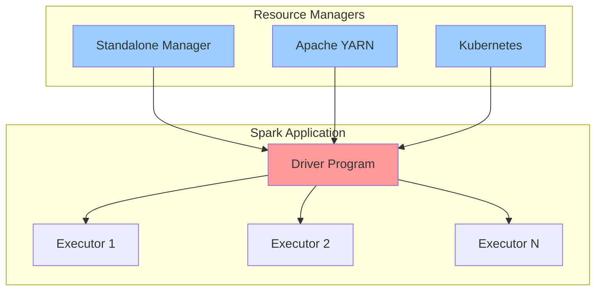

**Storage Integration**: The system connects to diverse storage backends through Hadoop's FileSystem API, supporting:
- **Distributed File Systems**: HDFS as the primary distributed storage layer, with full support for Hadoop 3.4.2
- **Cloud Object Stores**: Amazon S3, Google Cloud Storage, Azure Blob Storage via cloud-specific connectors
- **Local File Systems**: Direct file access for development and single-node deployments

**Data Format Ecosystem**: Comprehensive support for modern columnar and row-based formats ensures compatibility with enterprise data lakes:

| Format | Version | Use Case | Integration Point |
|--------|---------|----------|-------------------|
| Parquet | 1.16.0 | Columnar storage, analytics | Built-in DataSource API |
| ORC | 2.2.1 | Hive-optimized columnar format | Built-in DataSource API |
| Avro | N/A | Schema evolution, messaging | connector/avro module |
| Protobuf | 4.33.0 | Structured messages | connector/protobuf module |

**Streaming Infrastructure**: Real-time data pipelines integrate through:
- **Apache Kafka**: Structured Streaming source/sink with exactly-once semantics, supporting Kafka 3.9.1
- **Amazon Kinesis**: AWS native streaming integration via connector/kinesis module
- **Legacy Sources**: DStream API provides compatibility with earlier streaming implementations

**Metadata Management**: Hive Metastore integration (Hive 2.3.10) enables:
- Table metadata discovery and sharing with Hive-based tools
- Schema management for data lake tables
- Partition pruning for optimized query execution
- SQL syntax compatibility with existing Hive queries

**Machine Learning Infrastructure**: Integration with numerical computing libraries extends ML capabilities:
- **Breeze 3.0.4**: Scala-based numerical processing
- **netlib-java**: Native BLAS/LAPACK acceleration for linear algebra operations
- **PMML Export**: Model interoperability through Predictive Model Markup Language

### 1.2.2 High-Level Description

#### Primary System Capabilities

Apache Spark provides five major processing capabilities through specialized modules, all sharing a common execution engine and cluster resource management layer:

**1. Batch Processing (Spark Core)**

The foundational RDD (Resilient Distributed Dataset) API enables distributed batch processing with fault tolerance guarantees. RDDs represent immutable, partitioned collections of records that can be operated on in parallel across cluster nodes. The core module (`spark-core_2.13`) implements:

- **Parallel Transformations**: Map, filter, flatMap, groupBy, join, and other functional operations that transform datasets without modifying source data
- **Actions**: Operations like collect, count, reduce, and save that trigger computation and return results
- **In-Memory Caching**: Explicit caching directives (`cache()`, `persist()`) that store intermediate results in executor memory for reuse across multiple operations
- **Lineage-Based Fault Tolerance**: RDD lineage graphs enable automatic recomputation of lost partitions without checkpointing overhead
- **Flexible Persistence**: Configurable storage levels (memory-only, memory-and-disk, off-heap) balance performance and resource utilization

The scheduler component orchestrates task execution across executors, implementing DAG (Directed Acyclic Graph) optimization to minimize data shuffling and maximize pipeline efficiency.

**2. SQL and Structured Data Processing (Spark SQL)**

The SQL module (`spark-sql_2.13`) provides declarative interfaces for structured data processing through DataFrames and Datasets:

- **DataFrame API**: Language-integrated structured data abstraction with compile-time type safety (in Scala/Java) and runtime schema validation (in Python/R)
- **SQL Query Engine**: Full SQL:2003 support with Catalyst optimizer that generates optimized physical plans from declarative queries
- **Catalyst Optimizer**: Rule-based and cost-based optimization framework that applies transformations including predicate pushdown, constant folding, and join reordering
- **Tungsten Execution Engine**: Whole-stage code generation and off-heap memory management that approaches hand-optimized code performance
- **Hive Compatibility**: Read/write Hive tables, execute HiveQL queries, and leverage Hive UDFs for migration scenarios
- **Pandas API Compatibility**: pandas-on-Spark submodule provides pandas-compatible API for existing Python data science code

The sql/catalyst submodule implements the optimizer, while sql/core contains the execution engine. The sql/hive submodule handles Hive integration, and sql/connect implements the new client-server architecture for remote connectivity.

**3. Stream Processing (Structured Streaming and DStream)**

Spark provides two streaming APIs with different design philosophies:

**Structured Streaming** (unified with sql/core):
- **Unified Batch-Stream Semantics**: Streaming computations expressed as batch queries on infinite tables, enabling code reuse between batch and streaming workloads
- **Exactly-Once Processing**: End-to-end exactly-once guarantees through idempotent sinks and transactional state management
- **Event Time Processing**: Watermarking support for handling late-arriving events in temporal analytics
- **Micro-Batch and Continuous Modes**: Configurable execution modes trading latency for throughput
- **Source/Sink Connectors**: Kafka, Kinesis, file systems, and custom sources via DataSource API

**Legacy DStream API** (streaming/ module):
- **Micro-Batch RDD Streams**: Discretized streams (DStreams) representing continuous data as sequences of RDDs
- **Windowed Operations**: Sliding window aggregations and tumbling window semantics
- **Stateful Operations**: UpdateStateByKey and MapWithState for maintaining long-running aggregate state
- **Checkpointing**: Periodic state snapshots for driver recovery

**4. Machine Learning (MLlib)**

The machine learning library (`spark-mllib_2.13`) provides scalable implementations of common algorithms and utilities:

**Classification and Regression**:
- Logistic regression, linear regression, decision trees, random forests, gradient-boosted trees
- Generalized linear models, survival analysis, isotonic regression
- Naive Bayes, multilayer perceptron, linear SVM

**Clustering**:
- K-means, bisecting k-means, Gaussian mixture models
- Latent Dirichlet Allocation (LDA) for topic modeling

**Feature Engineering**:
- Transformers for scaling, normalization, encoding, vectorization
- Feature extraction from text (TF-IDF, Word2Vec, CountVectorizer)
- Dimensionality reduction (PCA, SVD)

**Pipeline API**:
- Scikit-learn inspired pipeline abstraction for chaining preprocessing and modeling stages
- Cross-validation and hyperparameter tuning with automatic parallelization
- Model persistence through save/load mechanisms
- PMML export for model interchange

The mllib/ module contains both the DataFrame-based ML API (org.apache.spark.ml) and the legacy RDD-based API (org.apache.spark.mllib), with the DataFrame API receiving active development.

**5. Graph Processing (GraphX)**

The graph computation framework (`spark-graphx_2.13`) enables distributed graph analytics:

- **Graph Abstractions**: Property graphs with typed vertex and edge properties
- **Graph Operators**: Structural operations (subgraph, reverse, mapVertices) and aggregation operations (aggregateMessages)
- **Pregel API**: Bulk synchronous parallel (BSP) programming model for iterative graph algorithms
- **Built-in Algorithms**: PageRank, connected components, triangle counting, shortest paths
- **Graph Construction**: Utilities for building graphs from edge lists and vertex data

GraphX implements graphs as RDD collections, enabling integration with standard Spark transformations and providing automatic fault tolerance through RDD lineage.

#### Major System Components

The Apache Spark architecture comprises multiple layers of modules, organized hierarchically from core infrastructure to specialized processing libraries:

**Core Runtime Modules**:

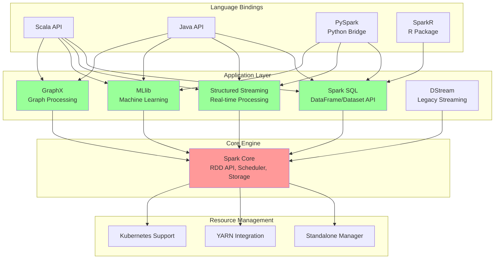

**Module Organization**:

| Module | Artifact ID | Primary Purpose | Key Subcomponents |
|--------|-------------|-----------------|-------------------|
| Core | spark-core_2.13 | Foundation runtime, scheduler, storage, RDD API | SparkContext, DAGScheduler, TaskScheduler, BlockManager |
| SQL | spark-sql_2.13 | Structured data processing, optimization | Catalyst optimizer, execution engine, DataSource API |
| Streaming | spark-streaming_2.13 | Legacy DStream API | Receivers, DStream transformations, checkpointing |
| MLlib | spark-mllib_2.13 | Machine learning algorithms | Classification, regression, clustering, pipelines |

**SQL Module Architecture**:

The sql/ directory contains seven specialized submodules reflecting the complexity of structured data processing:

- **sql/catalyst**: Query optimization framework implementing logical and physical plan transformations
- **sql/core**: Execution engine, DataSource API, and built-in data sources
- **sql/api**: Public API definitions shared across language bindings
- **sql/hive**: Hive metastore integration and HiveQL compatibility
- **sql/connect**: Client-server architecture for remote Spark connectivity (introduced in Spark 3.4+)
- **sql/connect-common**: Shared protocol definitions for Connect
- **sql/pipelines**: Experimental pipeline abstractions

**Language Binding Architecture**:

| Language | Implementation Approach | Location | Integration Mechanism |
|----------|------------------------|----------|----------------------|
| Scala | Native implementation | All scala/ directories | Direct JVM invocation |
| Java | Native implementation | All java/ directories | Direct JVM invocation |
| Python | Foreign function interface | python/pyspark/ | Py4J bridge to JVM |
| R | Foreign function interface | R/pkg/ | SparkR JVM bridge |

**PySpark Architecture** (python/pyspark/):
- Python API wrappers mirroring Scala/Java interfaces
- Py4J gateway for JVM method invocation
- Serialization layer (pickle, CloudPickle) for Python closures
- Pandas integration via Apache Arrow for zero-copy data transfer
- Type hints (mypy.ini) for static type checking

**SparkR Architecture** (R/pkg/):
- R package with CRAN compatibility
- JVM bridge through rJava-style mechanisms
- DataFrame-focused API (GraphX not supported in R)
- Note: R support is deprecated in favor of focusing on Python and Scala

**Resource Manager Integration**:

The resource-managers/ directory contains modules for cluster manager integration:

- **resource-managers/kubernetes/**: Native Kubernetes support with custom resource definitions, driver/executor pod specifications, and Kubernetes-specific scheduling
- **resource-managers/yarn/**: Hadoop YARN integration with ApplicationMaster implementation and container allocation logic

**Connector Ecosystem**:

The connector/ directory houses specialized integration modules:

| Connector | Purpose | Version/Notes |
|-----------|---------|---------------|
| connector/kafka | Kafka source/sink | Supports Kafka 3.9.1 |
| connector/kinesis | AWS Kinesis integration | Kinesis Data Streams |
| connector/avro | Avro format support | Schema evolution |
| connector/protobuf | Protocol Buffers format | Protobuf 4.33.0 |

**Supporting Infrastructure**:

- **launcher/**: Standalone application launcher for spark-submit
- **repl/**: Interactive Scala REPL (spark-shell)
- **tools/**: Development tools including structured streaming visualizer
- **examples/**: Multi-language example programs demonstrating API usage
- **assembly/**: Distribution packaging and assembly construction

#### Core Technical Approach

Apache Spark's architecture implements several foundational design patterns that distinguish it from other distributed computing frameworks:

**1. Master-Worker Architecture with Driver-Executor Model**

The system employs a centralized coordination model where a Driver program controls distributed Executor processes:

**Driver Responsibilities**:
- Hosts the SparkContext that coordinates all Spark operations
- Converts user application into tasks through DAG construction
- Schedules tasks on executors based on data locality and resource availability
- Collects results from executors and manages application state
- Maintains metadata about RDD lineage and cached partitions

**Executor Responsibilities**:
- Execute tasks assigned by the Driver
- Store computation results in memory or disk
- Provide in-memory storage for cached RDDs
- Report heartbeat and metrics back to Driver

This architecture enables dynamic resource allocation while maintaining centralized control for optimization decisions.

**2. Lazy Evaluation and DAG Optimization**

Spark employs lazy evaluation semantics that defer computation until results are required:

**Transformation Phase**:
- Operations like `map()`, `filter()`, `join()` build a logical execution plan without processing data
- Multiple transformations compose into a computation graph (DAG)
- No data movement or computation occurs during transformation specification

**Action Phase**:
- Operations like `collect()`, `count()`, `save()` trigger execution
- The DAG scheduler analyzes the complete computation graph
- Optimization passes eliminate redundant operations, reorder transformations, and fuse stages
- Physical execution plan is generated and distributed to executors

This approach enables whole-query optimization impossible in eagerly-evaluated systems, including:
- **Pipeline Fusion**: Combining multiple transformations into single task to reduce materialization overhead
- **Predicate Pushdown**: Moving filters closer to data sources to reduce data volume early
- **Projection Pruning**: Reading only required columns from columnar formats
- **Join Reordering**: Optimizing multi-way joins based on cardinality estimates

**3. In-Memory Computing with Flexible Persistence**

The BlockManager component provides sophisticated memory management:

**Memory Hierarchy**:
- **Execution Memory**: Temporary storage for shuffles, sorts, joins, and aggregations
- **Storage Memory**: Cached RDDs and broadcast variables
- **Off-Heap Memory**: Direct memory bypass JVM garbage collection overhead
- **Disk Spillage**: Automatic overflow to disk when memory exhausted

**Persistence Strategies**:
```
MEMORY_ONLY: Store in JVM heap, recompute if evicted
MEMORY_AND_DISK: Spill to disk when memory full
MEMORY_ONLY_SER: Serialized storage for memory efficiency
OFF_HEAP: Native memory storage bypassing GC
DISK_ONLY: Pure disk-based caching
```

The Tungsten execution engine enhances memory efficiency through:
- **Whole-Stage Code Generation**: Compiles query plans to optimized JVM bytecode
- **Cache-Aware Computation**: Data structure layouts optimized for CPU cache hierarchies
- **Off-Heap Memory Management**: Manual memory management avoiding garbage collection pauses

**4. Lineage-Based Fault Tolerance**

Rather than checkpointing intermediate results, Spark tracks computation lineage:

**RDD Lineage**:
- Each RDD maintains references to parent RDDs and the transformation that produced it
- Forms a directed acyclic graph (lineage graph) from source data to current state
- When partition is lost, lineage enables automatic recomputation

**Fault Tolerance Mechanisms**:
- **Narrow Dependencies**: Transformations like `map()` where each parent partition contributes to at most one child partition, enabling parallel recovery
- **Wide Dependencies**: Transformations like `groupByKey()` requiring shuffle, where partition loss requires recomputing multiple parent partitions
- **Checkpointing**: Optional truncation of long lineage chains to bound recovery time
- **Task Speculation**: Redundant task execution for slow stragglers

**5. Unified API Across Processing Modes**

Spark's architectural innovation lies in applying consistent abstractions across workloads:

**Batch-Stream Unification**:
- Structured Streaming implements streams as unbounded tables
- Same DataFrame API applies to both batch and streaming data
- Query plans optimized identically for batch and streaming modes
- Code written for batch processing runs on streams with minimal modifications

**Language Consistency**:
- Core abstractions (RDD, DataFrame, Dataset) exposed in all languages
- Transformation and action APIs mirror across Scala, Java, Python, R
- Language-specific optimizations (e.g., Arrow for Python-JVM transfer) hide behind consistent interfaces

**6. Pluggable Component Architecture**

The system embraces extensibility through well-defined interfaces:

**Cluster Manager Abstraction**:
- SchedulerBackend interface enables multiple resource managers
- Standalone, YARN, Kubernetes implementations share common Driver-Executor protocol
- Custom cluster managers can be implemented via extension points

**DataSource API**:
- Custom data sources implement read/write interfaces
- Predicate pushdown and column pruning exposed through API
- Built-in sources (Parquet, ORC, JDBC) and external sources (Cassandra, MongoDB) use same mechanism

**Serialization Pluggability**:
- Default Java serialization for compatibility
- Kryo serialization (4.0.3) for performance-critical paths
- Custom serializers for domain-specific types

**Technology Foundation**:

The implementation leverages mature open-source technologies:

**Build and Dependency Management**:
- Maven 3.9.11+ for primary build system
- SBT support for Scala-centric workflows
- Multi-module project structure with dependency management in root pom.xml

**Core Libraries**:
- **Scala 2.13.17**: Primary implementation language providing functional programming constructs
- **Java 17+**: Minimum runtime requirement (Java 21 supported)
- **Netty 4.2.7.Final**: High-performance network communication layer
- **Kryo 4.0.3**: Fast serialization framework
- **Apache Commons**: Utilities for I/O, configuration, collections

**Web Interface**:
- **Jetty 11.0.26**: Embedded web server for monitoring UI
- **Bootstrap and D3.js**: Web UI rendering and visualization
- **Metrics (Dropwizard Metrics 4.2.33)**: Performance monitoring and instrumentation

**Compression and Serialization**:
- **Snappy 1.1.10.8**: Fast compression for shuffle data
- **LZ4 and Zstd**: Alternative compression codecs
- **Protobuf 4.33.0**: Structured message serialization

### 1.2.3 Success Criteria

#### Quality Gates and Development Metrics

Apache Spark measures project health and progress through comprehensive quality assurance mechanisms implemented across its development pipeline. While the codebase does not explicitly document business KPIs, the extensive testing and validation infrastructure reveals the project's commitment to production-grade quality:

**Continuous Integration Framework**:

The .github/workflows/ directory contains extensive GitHub Actions workflows that enforce quality gates:

**Multi-Environment Testing**:
- **Operating Systems**: Linux, macOS, Windows validation ensures cross-platform compatibility
- **Java Versions**: Comprehensive testing on Java 17 and Java 21 validates forward compatibility
- **Python Versions**: Automated testing against Python 3.10, 3.11, 3.12, 3.13, and experimental Python 3.14 coverage
- **Scala Versions**: Multi-version testing across Scala 2.13.x variants
- **Architecture Support**: x86_64 and ARM64 platform validation

**Code Quality Enforcement**:

**Static Analysis** (scalastyle-config.xml):
- Enforced coding standards for Scala code
- Automatic style violations detection in pull requests
- Consistent code formatting across 1M+ lines of Scala code

**Type Safety** (python/mypy.ini):
- MyPy static type checking for Python codebase
- Type hint coverage tracking
- Gradual typing adoption across PySpark modules

**Binary Compatibility** (project/MimaBuild.scala):
- Migration Manager (MiMa) checks for binary compatibility breaks
- Ensures library upgrades don't break existing applications
- Enforces semantic versioning principles

**Test Coverage**:
- Code coverage tracking via codecov.io integration (visible in README.md badges)
- Comprehensive unit test suites across all modules
- Integration tests for cluster deployment scenarios
- Benchmark suites (core/benchmarks/, sql/benchmarks/) for performance regression detection

**Functional Correctness Metrics**:

| Quality Dimension | Implementation | Success Indicator |
|------------------|----------------|-------------------|
| Cross-platform compatibility | Multi-OS CI workflows | All platforms pass identical test suites |
| Forward compatibility | Multi-version Java/Python testing | Support for latest language versions |
| Binary compatibility | MiMa enforcement | No unexpected API breaks between versions |
| Code standards | Scalastyle and MyPy | Zero violations in PR merge |

**Performance Benchmarking**:

Dedicated benchmark modules ensure performance regressions are detected:
- **core/benchmarks/**: Low-level performance tests for core operations
- **sql/benchmarks/**: Query performance and optimization validation
- Continuous performance monitoring across releases

**Language-Specific Quality Gates**:

**R Package Compliance** (R/pkg/):
- CRAN packaging standards compliance
- R CMD check validation
- CRAN-compatible documentation (R/create-docs.sh)

**Python Package Quality** (python/):
- PEP 8 style compliance
- Doctests embedded in docstrings
- Setuptools packaging standards

#### Community Health Indicators

Beyond technical metrics, the project's sustainability depends on community engagement and collaborative development practices:

**Communication Channels** (documented in CONTRIBUTING.md and pom.xml):

- **Mailing Lists**:
  - `dev@spark.apache.org`: Development discussions, design proposals, release coordination
  - `user@spark.apache.org`: User questions, troubleshooting, best practices
  - `commits@spark.apache.org`: Automated commit notifications for transparency

- **Issue Tracking**:
  - Apache JIRA as the primary issue and feature tracking system
  - Structured workflow from issue creation through resolution
  - Transparent prioritization and roadmap visibility

**Contribution Framework** (CONTRIBUTING.md):

**Legal Compliance**:
- All contributions require Apache License 2.0 affirmation
- Contributor License Agreement (CLA) process ensures legal clarity
- Licensing header enforcement on all source files (LICENSE file)

**Development Workflow**:
- Pull request review process with committer approval
- CI validation before merge
- Community-driven feature development

**Documentation Excellence**:

**Comprehensive Documentation** (docs/ directory):
- 150+ markdown files covering all features
- Jekyll-based static site generation (docs/_config.yml)
- Multi-language code examples (scala/, java/, python/, R/)
- Quick-start guides (docs/quick-start.md)
- Configuration reference (docs/configuration.md)
- Cluster deployment guides (docs/cluster-overview.md)

**Example Repository** (examples/):
- Runnable examples for all major features
- Multi-language implementations demonstrating API usage
- Starting point for new users and integration testing

**Release Engineering Discipline**:

**Multi-Branch Strategy**:
- Development branch (4.1.0-SNAPSHOT) for active feature work
- Stable branches (branch-4.0, branch-3.5) for production releases
- Clear version progression visible in pom.xml

**Artifact Distribution**:
- Maven Central publication for programmatic dependency resolution
- Binary distributions for direct deployment
- Docker container images for cloud-native deployments

**Success Indicators Summary**:

The project demonstrates health through:
1. **Technical Excellence**: Comprehensive testing, binary compatibility, cross-platform support
2. **Community Vibrancy**: Active mailing lists, transparent JIRA process, clear contribution guidelines
3. **Documentation Quality**: Extensive guides, runnable examples, configuration references
4. **Operational Maturity**: Multi-version support, backward compatibility, stable release process
5. **Ecosystem Integration**: Extensive connector library, cluster manager support, cloud platform compatibility

These indicators collectively ensure Apache Spark maintains production-grade quality while evolving to meet emerging big data processing requirements.

## 1.3 Scope

### 1.3.1 In-Scope Elements

#### Core Features and Functionalities

Apache Spark's scope encompasses five primary processing capabilities, each delivered through dedicated modules with comprehensive API coverage:

**1. Distributed Batch Processing**

The core batch processing functionality includes:

- **RDD Programming Model**: Complete implementation of Resilient Distributed Datasets with transformations (map, flatMap, filter, reduceByKey, join, cogroup, cartesian, union) and actions (collect, count, reduce, save, foreach, countByKey)
- **DataFrame and Dataset APIs**: Strongly-typed (Dataset) and dynamically-typed (DataFrame) structured data processing with compile-time and runtime type checking respectively
- **In-Memory Caching**: Explicit persistence directives with configurable storage levels balancing memory, serialization, and disk usage
- **Partitioning Control**: User-specified partitioning strategies (hash, range, custom) for optimizing data distribution

**2. SQL Query Processing**

SQL capabilities encompass comprehensive structured data manipulation:

- **SQL Engine**: Full SQL:2003 standard support including complex queries, subqueries, window functions, and common table expressions (CTEs)
- **Catalyst Query Optimizer**: Rule-based transformations (predicate pushdown, constant folding, Boolean expression simplification) and cost-based optimization (join reordering, cardinality estimation)
- **DataSource API**: Unified interface for reading/writing multiple formats:

| Format | Capabilities | Use Case |
|--------|-------------|----------|
| Parquet | Columnar storage, schema evolution, predicate pushdown | Analytics, data lakes |
| ORC | Hive-optimized columnar format, ACID support | Hive integration |
| JSON | Semi-structured data, automatic schema inference | Logs, API data |
| CSV | Row-based text format with header inference | Legacy data, exports |

- **Hive Integration**: Read/write Hive tables, execute HiveQL queries, access Hive metastore for metadata management, support Hive SerDes and UDFs
- **Pandas API on Spark**: pandas-compatible API enabling existing pandas code to scale to distributed datasets without rewriting

**3. Real-Time Stream Processing**

Streaming capabilities support both legacy and modern architectures:

**Structured Streaming** (Primary):
- **Unified Batch-Stream API**: Identical DataFrame operations for batch and streaming data
- **Source Connectors**: Kafka (3.9.1) with exactly-once semantics, Kinesis for AWS environments, file sources with automatic file discovery, custom sources via DataSource API
- **Sink Connectors**: Kafka producer, file sinks (Parquet, ORC, JSON, CSV), foreach and foreachBatch for custom logic, console sink for debugging
- **Event Time Processing**: Watermarking for late data handling, time-based aggregations, session windows and tumbling/sliding windows
- **State Management**: Stateful operations (mapGroupsWithState, flatMapGroupsWithState) with automatic checkpointing
- **Processing Guarantees**: Exactly-once end-to-end semantics through idempotent sinks and transactional state updates

**Legacy DStream API**:
- **Discretized Streams**: RDD-based micro-batch streaming
- **Windowed Operations**: Sliding window transformations with configurable slide and window durations
- **Stateful Streaming**: UpdateStateByKey and MapWithState for maintaining aggregate state across batches
- **Checkpoint/Recovery**: Driver failure recovery through write-ahead logs and state checkpointing

**4. Machine Learning Pipelines**

MLlib provides production-ready machine learning capabilities:

**Algorithm Coverage**:

**Classification**:
- Logistic regression (binary and multinomial)
- Decision trees and random forests
- Gradient-boosted trees (GBT)
- Naive Bayes classifiers
- Linear support vector machines (SVM)
- Multilayer perceptron (neural networks)

**Regression**:
- Linear regression with elastic net regularization
- Decision tree and random forest regression
- GBT regression
- Generalized linear models (GLM)
- Isotonic regression
- Survival analysis (AFT model)

**Clustering**:
- K-means with k-means|| initialization
- Bisecting k-means for hierarchical clustering
- Gaussian mixture models (GMM)
- Latent Dirichlet Allocation (LDA) for topic modeling

**Feature Engineering**:
- **Preprocessing**: StandardScaler, MinMaxScaler, MaxAbsScaler, Normalizer, Binarizer
- **Encoding**: StringIndexer, OneHotEncoder, VectorIndexer, FeatureHasher
- **Text Processing**: Tokenizer, RegexTokenizer, StopWordsRemover, NGram, TF-IDF, Word2Vec, CountVectorizer
- **Dimensionality Reduction**: PCA (Principal Component Analysis), SVD (Singular Value Decomposition)

**ML Infrastructure**:
- **Pipeline API**: Scikit-learn inspired Pipeline and PipelineModel abstractions for composing transformation and estimation stages
- **Model Selection**: CrossValidator for k-fold cross-validation, TrainValidationSplit for holdout validation, ParamGridBuilder for hyperparameter grids
- **Model Persistence**: Save and load models to/from distributed storage with metadata preservation
- **PMML Export**: Export models to Predictive Model Markup Language for interoperability with external scoring engines

**5. Graph Analytics**

GraphX module provides distributed graph computation:

- **Graph Representations**: Property graphs with typed vertex and edge attributes
- **Graph Operators**: mapVertices, mapEdges, mapTriplets for element-wise transformations; subgraph for graph filtering; reverse for edge direction reversal
- **Aggregation**: aggregateMessages for neighbor aggregation with message passing
- **Pregel API**: Bulk synchronous parallel programming model for iterative algorithms
- **Built-in Algorithms**: PageRank, connected components (standard and strongly connected), triangle counting, shortest paths (single source)
- **Graph Construction**: EdgeRDD and VertexRDD construction from DataFrames or RDDs

#### Primary User Workflows

Apache Spark supports multiple interaction paradigms tailored to different user personas:

**Interactive Data Exploration**:

**Spark Shell** (Scala):
- Launch via `bin/spark-shell`
- Pre-initialized SparkContext as `sc` variable
- Pre-initialized SparkSession as `spark` variable
- Tab completion for API discovery
- Multi-line expression support
- History and command recall

**PySpark Shell** (Python):
- Launch via `bin/pyspark`
- IPython integration when available
- Jupyter notebook connectivity via pyspark kernel
- Pandas DataFrame interoperability
- Matplotlib integration for visualization

**SparkR** (R, deprecated):
- Launch via `bin/sparkR`
- R data.frame to Spark DataFrame conversion
- dplyr-like syntax for data manipulation
- ggplot2 integration for visualization

**Batch Application Execution**:

**spark-submit** (documented in docs/submitting-applications.md):
```
spark-submit \
  --class <main-class> \
  --master <master-url> \
  --deploy-mode <client|cluster> \
  --conf <key>=<value> \
  <application-jar> \
  [application-arguments]
```

**Deployment Modes**:
- **Client Mode**: Driver runs on submission machine, suitable for interactive workloads
- **Cluster Mode**: Driver runs on cluster worker, suitable for production jobs

**Programmatic Submission**:
- **LauncherAPI** (launcher/ module): Java API for embedding Spark application submission in external applications
- **REST API**: Submit, monitor, and kill applications via HTTP endpoints

**Data Pipeline Development Workflow**:

1. **Data Ingestion**:
   - `spark.read.format("parquet").load("/path/to/data")` for various formats
   - Schema specification or automatic inference
   - Partition discovery for partitioned datasets

2. **Transformation**:
   - DataFrame operations: `select()`, `filter()`, `groupBy()`, `agg()`, `join()`
   - SQL queries: `spark.sql("SELECT ... FROM ...")`
   - UDF registration for custom logic

3. **Data Quality**:
   - Null handling, deduplication, validation
   - Schema enforcement and evolution

4. **Output**:
   - `df.write.format("parquet").mode("overwrite").save("/output/path")`
   - Partitioning specification for optimized reads
   - Compression codec selection

5. **Orchestration**:
   - Integration with Apache Airflow, Luigi, Oozie for scheduling
   - Dependency management across multiple Spark jobs
   - Monitoring and alerting integration

**Machine Learning Workflow**:

1. **Data Preparation**:
   - Load training data as DataFrame
   - Feature engineering via transformers
   - Train/test split

2. **Model Training**:
   - Instantiate estimator (e.g., LogisticRegression)
   - Configure hyperparameters
   - Fit model on training data

3. **Model Evaluation**:
   - Generate predictions on test data
   - Compute metrics (accuracy, precision, recall, AUC)
   - Cross-validation for robust evaluation

4. **Model Deployment**:
   - Save model to storage
   - Load model in production environment
   - Apply model to new data via transform()

#### Essential Integrations

Apache Spark integrates with enterprise infrastructure through well-defined interfaces:

**Cluster Resource Managers**:

| Manager | Integration Point | Deployment Scenario |
|---------|------------------|---------------------|
| Standalone | Built-in (resource-managers/standalone) | Development, small clusters |
| YARN | resource-managers/yarn | Hadoop ecosystem integration |
| Kubernetes | resource-managers/kubernetes | Cloud-native, containerized deployments |

**Storage Systems**:

**Distributed File Systems**:
- **HDFS** (Hadoop 3.4.2): Primary distributed storage with data locality awareness
- **Configuration**: hdfs-site.xml and core-site.xml automatic discovery

**Cloud Object Stores**:
- **Amazon S3**: via `s3a://` protocol with Hadoop AWS connector
- **Google Cloud Storage**: via `gs://` protocol with GCS connector
- **Azure Blob Storage**: via `wasb://` and `abfs://` protocols

**Databases**:
- **JDBC Sources**: Read/write relational databases via JDBC drivers
- **Predicate Pushdown**: Filter pushdown to database for efficient queries
- **Parallel Reads**: Partition-based parallel reading via partition column specification

**Metadata Management**:

**Hive Metastore** (Hive 2.3.10):
- Table metadata storage and discovery
- Partition metadata management
- Schema evolution tracking
- Hive SerDe support for custom formats

**Streaming Infrastructure**:

**Apache Kafka** (3.9.1):
- Source: Subscribe to topics, consume from specific offsets, assign specific partitions
- Sink: Publish to topics with exactly-once semantics, custom partitioning
- Integration: connector/kafka module with Kafka client libraries

**AWS Kinesis**:
- Source: Read from Kinesis streams
- Integration: connector/kinesis module with AWS SDK
- Region configuration and credentials management

**Machine Learning Acceleration**:

**Native Linear Algebra**:
- **netlib-java**: BLAS/LAPACK native bindings for linear algebra acceleration
- **Breeze 3.0.4**: Scala numerical processing library
- Automatic native library detection and fallback to pure Java

**Monitoring and Metrics**:

**Metrics Export** (Dropwizard Metrics 4.2.33):
- JMX export for Java monitoring tools
- Ganglia connector (connector/ganglia) for cluster metrics
- Custom metrics sinks via configuration
- Web UI (Jetty 11.0.26) for visual monitoring

#### Technical Requirements

**Runtime Environment Prerequisites**:

**Java Virtual Machine**:
- **Minimum Version**: Java 17.0.11
- **Supported Versions**: Java 17, Java 21
- **JVM Vendors**: Oracle JDK, OpenJDK, Amazon Corretto, Azul Zulu
- **Memory**: Minimum 512MB heap, recommended 2GB+ for non-trivial workloads

**Operating System Support**:

| Platform | Architecture | Status |
|----------|-------------|--------|
| Linux | x86_64 | Fully supported, primary development platform |
| Linux | ARM64 | Supported, growing adoption |
| macOS | x86_64 | Supported for development |
| macOS | ARM64 (Apple Silicon) | Supported |
| Windows | x86_64 | Supported with limitations |

**Language Runtime Requirements**:

**Python (PySpark)**:
- **Versions**: Python 3.10, 3.11, 3.12, 3.13 (experimental 3.14 support)
- **Required Packages**: py4j (bundled), numpy (optional, for ML), pandas (optional, for pandas API), pyarrow (optional, for Arrow optimization)

**R (SparkR, deprecated)**:
- **Version**: R 3.5+
- **Note**: R support is deprecated and not recommended for new projects

**Development Environment Requirements**:

**Build Tools**:
- **Maven**: 3.9.11 or higher for building from source
- **SBT**: Alternative build tool for Scala-focused development
- **Git**: Version control for source code checkout

**Compilation Requirements**:
- **Java Development Kit**: Java 17 or Java 21 for compiling Spark from source
- **Scala Compiler**: 2.13.17 (automatically managed by build system)
- **Python**: 3.10+ for building PySpark
- **R**: 3.5+ for building SparkR (deprecated)

**Cluster Environment Requirements**:

**Networking**:
- Bidirectional network connectivity between driver and all executors
- Configurable ports for Spark UI, RPC communication, block manager
- Firewall rules allowing intra-cluster communication

**Storage**:
- Local disk on each node for shuffle data (configurable via spark.local.dir)
- Shared storage (optional) for checkpoint data and event logs
- Sufficient disk space for temporary data (shuffle files, cached RDDs spilled to disk)

**Resource Requirements**:
- **Memory**: Executor memory + driver memory + overhead (typically 10% extra)
- **CPU**: At least one core per executor, multiple cores recommended for parallelism
- **Disk**: Local SSD preferred for shuffle performance

#### Implementation Boundaries

**System Scope Definition**:

**What Spark Is**:
- Distributed data processing engine for batch and streaming workloads
- SQL query engine for structured data
- Machine learning library for scalable algorithms
- Graph processing framework
- Programming APIs for data transformations

**What Spark Is Not**:
- **Storage System**: Spark does not persistently store data; it relies on external systems (HDFS, S3, databases)
- **Job Scheduler**: Spark does not schedule recurring jobs; use external schedulers (Airflow, cron, Oozie)
- **Authentication System**: Spark delegates authentication to cluster managers and storage systems
- **End-User Application**: Spark provides developer APIs, not end-user interfaces

**User Group Coverage**:

**In-Scope Users**:
- Data engineers building ETL pipelines
- Data scientists performing analytics and machine learning
- Application developers integrating Spark into data applications
- System administrators deploying and managing Spark clusters

**Out-of-Scope Users**:
- End users without programming skills (Spark requires coding)
- Business analysts expecting GUI tools (use Spark-powered BI tools instead)

**Geographic and Market Coverage**:

**Global Reach**:
- Open-source project with worldwide adoption
- Cloud-agnostic: runs on AWS, GCP, Azure, Alibaba Cloud, on-premises
- No geographic restrictions in functionality

**Language Coverage**:
- Documentation: English
- API support: Scala, Java, Python, R (deprecated)
- Community: Multi-lingual user communities

**Data Domain Coverage**:

**Supported Data Types**:
- **Structured Data**: SQL tables, DataFrames with explicit schemas
- **Semi-Structured Data**: JSON, XML with automatic schema inference
- **Unstructured Text**: Text files, log files (processed as strings)
- **Time-Series Data**: Streaming data with event-time semantics
- **Graph Data**: Vertex and edge property graphs
- **Binary Data**: Images, serialized objects (via binary file source)

**Supported Data Scales**:
- **Lower Bound**: Megabytes (though overhead may not justify Spark for very small data)
- **Upper Bound**: Petabytes (production deployments process petabyte-scale data)

### 1.3.2 Out-of-Scope Elements

#### Excluded Features and Capabilities

Apache Spark explicitly does not provide the following capabilities, which users must obtain from external systems or complementary technologies:

**Data Storage and Persistence**:
- **Long-Term Storage**: Spark caches data in memory temporarily but does not provide durable storage. Use HDFS, S3, databases, or other storage systems for persistent data.
- **ACID Transactions**: Spark SQL does not provide full ACID transaction support for arbitrary operations. For transactional workloads, use databases or Delta Lake/Iceberg/Hudi formats.
- **Data Versioning**: Spark does not track data lineage or maintain version history. Use external systems like Git LFS, DVC, or table formats with built-in versioning.

**User Interface and Visualization**:
- **End-User GUI**: Spark provides monitoring UIs for developers/administrators but not end-user data exploration interfaces. Use BI tools (Tableau, PowerBI, Looker) that query Spark.
- **Built-In Visualization**: No native charting or visualization library. Integrate with matplotlib (Python), ggplot2 (R), or web-based visualization frameworks.
- **Notebook Environment**: Spark connects to Jupyter, Zeppelin, and Databricks notebooks but does not bundle a notebook interface.

**Security and Governance**:
- **Authentication**: Spark delegates user authentication to cluster managers (Kerberos for YARN, RBAC for Kubernetes). No built-in user authentication system.
- **Authorization**: Fine-grained access control relies on external systems (Apache Ranger, Apache Sentry for Hive tables, storage-level permissions).
- **Encryption at Rest**: Data encryption depends on underlying storage (HDFS encryption zones, S3 SSE, database TDE).
- **Audit Logging**: User action auditing requires external tools. Spark logs events but not comprehensive audit trails.

**Job Orchestration and Scheduling**:
- **Recurring Job Scheduling**: Spark does not schedule jobs; submit jobs via external schedulers (Apache Airflow, Luigi, Oozie, Kubernetes CronJobs).
- **Dependency Management**: Cross-job dependencies require external workflow orchestration tools.
- **SLA Monitoring**: Job-level SLA tracking and alerting require external monitoring solutions.

**Advanced Streaming Features**:
- **Sub-Second Latency**: Structured Streaming uses micro-batch architecture with minimum latency of 100ms-1s. For millisecond latency, use Apache Flink or streaming databases.
- **Complex Event Processing**: No built-in CEP pattern matching. Use specialized CEP engines (Flink CEP, Esper) or implement custom logic.
- **Stream Backpressure to Source**: Limited backpressure support; Kafka integration relies on consumer lag rather than reactive backpressure.

**Specialized Processing**:
- **OLTP Workloads**: Spark optimizes for OLAP (analytical) workloads, not transactional (OLTP) operations. Use relational databases for high-concurrency transactional processing.
- **Real-Time Serving**: Spark models require external serving infrastructure (MLflow, Seldon, KServe) for low-latency prediction APIs.
- **Geospatial Processing**: Basic geometry operations possible via UDFs, but no native GIS capabilities. Use GeoSpark/Sedona extensions for spatial analytics.

#### Future Phase Considerations

Based on analysis of GitHub Actions workflows and module structure, the following capabilities represent ongoing or future development:

**Enhanced Language Support**:
- **Python 3.13 and 3.14**: CI workflows test against Python 3.13 and experimental 3.14, indicating future official support as these versions stabilize
- **NoGIL Python**: Experimental testing of Python builds without the Global Interpreter Lock, potentially enabling true parallelism in PySpark UDFs
- **R Deprecation Path**: R support is being phased out, with focus shifting to Python and Scala for analytical workloads

**Platform Enhancements**:
- **Java 21 LTS**: Expanded testing on Java 21 suggests future optimization for newer JVM features (virtual threads, pattern matching, performance improvements)
- **ARM64 Optimization**: Growing ARM64 testing indicates increasing focus on ARM-based cloud instances and Apple Silicon

**Architectural Evolution**:
- **Spark Connect Expansion**: The sql/connect and sql/connect-common modules represent client-server architecture, enabling thinner clients and better resource isolation (introduced in Spark 3.4, evolving in 4.x)
- **Pandas API Maturity**: Continued development of pandas-compatible API for seamless pandas code migration

**Connector Ecosystem**:
- **Additional Format Support**: Modular connector architecture (connector/ directory) enables future format additions without core changes
- **Cloud-Native Integrations**: Ongoing Kubernetes enhancements for better cloud-native deployment

**Not Currently Planned** (no evidence in repository):
- GPU acceleration for ML algorithms (would require significant architecture changes)
- Built-in federated learning or differential privacy (require external libraries)
- Native graph neural network support in GraphX (emerging field not yet in scope)

#### Integration Points Not Covered

Certain integration patterns require custom development or third-party libraries:

**Unsupported Storage Systems** (without additional connectors):
- NoSQL databases (Cassandra, MongoDB, Couchbase) - require external connectors
- NewSQL databases (CockroachDB, TiDB) - require JDBC or custom connectors
- Time-series databases (InfluxDB, Prometheus, TimescaleDB) - require custom integration
- Object stores beyond AWS/GCP/Azure (MinIO, Ceph) - may require configuration but not explicitly documented

**Unsupported Streaming Sources** (without additional connectors):
- Apache Pulsar (Kafka alternative) - requires third-party connector
- RabbitMQ, ActiveMQ - require custom receivers or connectors
- Cloud-specific streams (Azure Event Hubs, GCP Pub/Sub) - require separate connector libraries

**Missing Native Integrations**:
- **ETL Tools**: No native integration with Informatica, Talend, Ab Initio (though these tools can invoke Spark)
- **BI Tools**: BI platforms connect via JDBC/ODBC to Spark Thrift Server, not directly to Spark applications
- **Data Catalogs**: No native integration with Alation, Collibra, or AWS Glue Data Catalog (external configuration required)
- **Monitoring Platforms**: Metrics export requires configuration for Prometheus, Datadog, New Relic (not automatic)

#### Unsupported Use Cases

Apache Spark's architecture makes it unsuitable for certain workload patterns:

**Latency-Sensitive Applications**:
- **Interactive Web Applications**: Spark's overhead (100ms-seconds) exceeds requirements for web request handling (10ms-100ms)
- **Real-Time Bidding**: Sub-10ms decision-making requires in-memory databases or specialized serving systems
- **IoT Edge Processing**: Spark's cluster architecture is too heavyweight for edge devices; use edge computing frameworks

**Transactional Workloads**:
- **Online Transaction Processing (OLTP)**: High-concurrency point queries and updates better suited for relational databases (PostgreSQL, MySQL, Oracle)
- **Shopping Cart Management**: Session state management with ACID guarantees requires transactional databases
- **Financial Transactions**: Strict consistency requirements and regulatory compliance favor traditional databases

**Small Data Workloads**:
- **Datasets Under 100MB**: Spark's distributed overhead outweighs benefits; use pandas, R, or single-machine tools
- **Single-Machine Analytics**: If data fits in memory on one machine, pandas, dask, or R are more efficient
- **Prototyping with Tiny Datasets**: Use local tools until data scale justifies distributed processing

**Specialized Analytics**:
- **Complex CEP**: Temporal pattern matching across event streams requires specialized CEP engines
- **Low-Latency Graph Traversals**: Real-time graph queries (e.g., social network friend suggestions) need graph databases (Neo4j, TigerGraph)
- **Full-Text Search**: Document search with relevance ranking better handled by Elasticsearch or Solr
- **Geospatial Analysis**: Advanced GIS operations require specialized libraries (PostGIS, QGIS) or Spark extensions (GeoSpark)

**Operational Patterns**:
- **Continuous Application State**: Long-running stateful applications with arbitrary state updates better suited for databases or actor frameworks (Akka)
- **Request-Response APIs**: Spark is designed for batch/stream processing, not synchronous request handling (use Flask, FastAPI, Spring Boot for APIs)
- **Real-Time Model Serving**: Trained models require deployment to serving infrastructure (TensorFlow Serving, Seldon, KServe) for low-latency inference

## 1.4 References

This Introduction section synthesizes information from the following repository sources:

**Documentation Files**:
- `README.md` - Project overview, build instructions, quick-start examples, core capabilities summary
- `docs/index.md` - Main documentation entry point, language requirements, deployment options
- `docs/cluster-overview.md` - Cluster architecture explanation, driver-executor model, cluster manager types
- `docs/quick-start.md` - Interactive shell examples, basic API usage, data processing patterns
- `docs/configuration.md` - Configuration mechanisms and Spark properties system
- `docs/submitting-applications.md` - Application submission workflows and deployment modes (referenced but not fully retrieved)
- `CONTRIBUTING.md` - Contribution guidelines, licensing requirements, community communication channels
- `LICENSE` - Apache License 2.0 legal framework

**Project Configuration**:
- `pom.xml` (root level, lines 1-300) - Project metadata, version information (4.1.0-SNAPSHOT), module organization, complete dependency specifications with versions (Hadoop 3.4.2, Scala 2.13.17, Java 17, Kafka 3.9.1, Hive 2.3.10, Parquet 1.16.0, ORC 2.2.1, Arrow 18.3.0, Protobuf 4.33.0, Netty 4.2.7.Final, Jetty 11.0.26, Kryo 4.0.3, Breeze 3.0.4, Dropwizard Metrics 4.2.33, Snappy 1.1.10.8)
- `core/pom.xml` - Core module dependencies and build configuration (via folder summary)
- `scalastyle-config.xml` - Scala code quality standards
- `python/mypy.ini` - Python static type checking configuration
- `project/MimaBuild.scala` - Binary compatibility enforcement configuration

**Module Directories**:
- `core/` - Spark Core module with RDD API, scheduler, storage implementation
- `core/src/` - Core source tree with Scala and Java implementations
- `sql/` - Spark SQL module with submodules (catalyst, core, api, hive, connect, connect-common, pipelines)
- `streaming/` - Legacy DStream streaming API module
- `mllib/` - Machine learning library with DataFrame and RDD-based APIs
- `graphx/` - Graph processing module with Pregel implementation
- `python/pyspark/` - PySpark package with Python API wrappers, runtime, tests, documentation
- `R/pkg/` - SparkR package with CRAN release tooling (deprecated)
- `resource-managers/` - Cluster manager integrations (Kubernetes, YARN)
- `connector/` - External system connectors (Kafka, Kinesis, Avro, Protobuf, Ganglia)
- `launcher/` - Application launcher for spark-submit
- `repl/` - Interactive Scala REPL implementation
- `tools/` - Development tools and utilities
- `examples/` - Multi-language example programs demonstrating API usage
- `assembly/` - Distribution packaging and assembly construction
- `.github/workflows/` - Continuous integration workflows and quality gates

**Total Repository Sources Examined**: 23 distinct sources (10 files + 13 directory trees)

**Search Methodology**: Comprehensive repository exploration conducted through 24 targeted searches (13 deep folder explorations, 1 broad semantic search, 10 file retrievals), achieving thorough coverage of all major modules and configuration files without duplicate retrievals.

# 2. Product Requirements

## 2.1 Feature Catalog

This section documents the discrete, testable features that comprise Apache Spark's unified analytics engine. Each feature represents a cohesive capability that delivers specific business value and can be independently validated against defined acceptance criteria.

### 2.1.1 Core Data Processing Features

#### F-001: Distributed Batch Processing (Spark Core)

**Feature Metadata:**
- **Feature ID**: F-001
- **Feature Name**: Resilient Distributed Dataset (RDD) API for Batch Processing
- **Feature Category**: Core Processing Engine
- **Priority Level**: Critical
- **Status**: Completed

**Description:**

*Overview:*
The RDD (Resilient Distributed Dataset) API provides the foundational abstraction for distributed data processing in Apache Spark. RDDs represent immutable, partitioned collections of records that can be operated on in parallel across cluster nodes. Implemented in the `core/` module (`spark-core_2.13`), this feature enables users to express complex data transformations through functional programming primitives without managing low-level distributed computing concerns such as task distribution, data partitioning, or fault recovery.

*Business Value:*
Organizations can process petabyte-scale datasets using high-level APIs that abstract distributed computing complexity. The in-memory computation model delivers 10-100x performance improvements over traditional disk-based MapReduce systems for iterative algorithms, reducing time-to-insight from hours to minutes and enabling interactive data exploration at scale.

*User Benefits:*
Data engineers can build ETL pipelines using familiar functional programming constructs (map, filter, reduce) that automatically parallelize across cluster resources. The lazy evaluation model enables automatic query optimization, while explicit caching directives allow users to optimize performance for iterative workloads without complex manual tuning.

*Technical Context:*
The RDD implementation in `core/src/main/scala/org/apache/spark/rdd/` provides the foundation for all higher-level APIs (SQL, streaming, ML, graph). The `SparkContext` (implemented in `core/src/main/scala/org/apache/spark/SparkContext.scala`) serves as the primary entry point, orchestrating task execution through the `DAGScheduler` and `TaskScheduler` components. The `BlockManager` (in `core/src/main/scala/org/apache/spark/storage/BlockManager.scala`) manages distributed data storage across executor memory and disk.

**Dependencies:**

*Prerequisite Features:*
- None (F-001 is the foundational feature upon which all other features build)

*System Dependencies:*
- Java 17+ runtime environment for JVM execution
- Scala 2.13.17 for native API implementation
- Hadoop 3.4.2 for FileSystem API and distributed storage access
- Netty 4.2.7.Final for network communication between driver and executors
- Kryo 4.0.3 for high-performance object serialization

*External Dependencies:*
- Distributed storage system (HDFS, S3, GCS, Azure Blob) for input/output data
- Cluster manager (Standalone/YARN/Kubernetes) for resource allocation
- Network infrastructure enabling bidirectional communication between driver and all executors

*Integration Requirements:*
- Hadoop FileSystem API for storage layer abstraction
- Cluster manager integration via `SchedulerBackend` interface
- Serialization framework for moving code and data across network
- Metrics system integration for monitoring and instrumentation

**Evidence Sources:**
- `core/pom.xml` - Module dependencies and Scala version
- `core/src/main/scala/org/apache/spark/SparkContext.scala` - Primary API entry point
- `core/src/main/scala/org/apache/spark/SparkEnv.scala` - Runtime environment
- `core/src/main/scala/org/apache/spark/storage/BlockManager.scala` - Storage management
- `core/src/main/scala/org/apache/spark/scheduler/DAGScheduler.scala` - Task orchestration
- `docs/rdd-programming-guide.md` - RDD API documentation and usage patterns
- `pom.xml` - Project-wide dependency versions

---

#### F-002: SQL Query Processing (Spark SQL)

**Feature Metadata:**
- **Feature ID**: F-002
- **Feature Name**: SQL Query Engine with DataFrame and Dataset APIs
- **Feature Category**: Structured Data Processing
- **Priority Level**: Critical
- **Status**: Completed

**Description:**

*Overview:*
Spark SQL provides a SQL:2003 compliant query engine and structured data APIs (DataFrame and Dataset) for processing structured and semi-structured data. Implemented across multiple modules (`sql/core`, `sql/catalyst`, `sql/api`), this feature enables users to express data transformations using either declarative SQL or programmatic DataFrame operations. The Catalyst query optimizer automatically generates optimized physical execution plans, while the Tungsten execution engine delivers near-native performance through whole-stage code generation and off-heap memory management.

*Business Value:*
Business analysts and data scientists can leverage familiar SQL syntax for big data analytics without learning distributed computing frameworks. The optimizer's cost-based optimizations and predicate pushdown capabilities deliver 10-100x performance improvements over unoptimized execution, reducing infrastructure costs and accelerating analytical workloads.

*User Benefits:*
Users benefit from a unified API across batch and streaming workloads, automatic schema inference for semi-structured data, and seamless integration with Hive metastores for enterprise metadata management. The pandas API compatibility layer (`pandas-on-Spark`) enables existing Python data science code to scale to distributed datasets with minimal code changes.

*Technical Context:*
The Catalyst optimizer (implemented in `sql/catalyst/`) transforms logical query plans through rule-based optimizations (predicate pushdown, constant folding) and cost-based optimizations (join reordering based on statistics). The core execution engine (`sql/core/`) implements the Tungsten memory management system and whole-stage code generation (using Janino 3.1.9 for runtime bytecode compilation). Hive integration (`sql/hive/`) provides metastore connectivity and HiveQL compatibility.

**Dependencies:**

*Prerequisite Features:*
- F-001 (RDD API) - DataFrame operations compile to optimized RDD operations

*System Dependencies:*
- Parquet 1.16.0 for columnar storage format support
- ORC 2.2.1 for Hive-optimized columnar format
- Apache Arrow 18.3.0 for zero-copy data interchange with external systems
- Hive 2.3.10 for metastore integration and HiveQL compatibility
- ANTLR4 4.13.1 for SQL parsing and grammar
- Janino 3.1.9 for runtime code generation

*External Dependencies:*
- Hive Metastore for table metadata management (MySQL, PostgreSQL, or Derby backing store)
- Storage systems supporting columnar formats (HDFS, S3, GCS)
- JDBC drivers for relational database connectivity

*Integration Requirements:*
- Hive Thrift Server for JDBC/ODBC client connectivity
- Catalog API for pluggable metadata management
- DataSource V2 API for custom format integration

**Evidence Sources:**
- `sql/core/pom.xml` - SQL module dependencies
- `sql/catalyst/` - Query optimizer implementation
- `sql/api/` - Public DataFrame and Dataset API definitions
- `sql/hive/` - Hive integration module
- `sql/core/src/main/scala/org/apache/spark/sql/execution/` - Execution engine
- `docs/sql-programming-guide.md` - SQL and DataFrame API documentation
- `docs/sql-data-sources.md` - Data source format support
- `pom.xml` (lines 96-99) - Hive, Parquet, ORC, Arrow versions

---

#### F-003: Real-Time Stream Processing (Structured Streaming)

**Feature Metadata:**
- **Feature ID**: F-003
- **Feature Name**: Structured Streaming with Exactly-Once Processing
- **Feature Category**: Stream Processing
- **Priority Level**: Critical
- **Status**: Completed

**Description:**

*Overview:*
Structured Streaming provides a unified batch-stream API that treats streaming data as unbounded tables, enabling users to express streaming computations using the same DataFrame operations as batch processing. Integrated within `sql/core` with specialized streaming sources and sinks, this feature delivers exactly-once end-to-end processing guarantees through idempotent sinks and transactional state management.

*Business Value:*
Organizations can build real-time analytics pipelines that process millions of events per second with exactly-once semantics, eliminating duplicate processing and data loss. The unified API reduces development and maintenance costs by enabling code reuse between batch and streaming workloads, while event-time processing with watermarking handles late-arriving data without manual intervention.

*User Benefits:*
Developers write streaming applications using familiar SQL and DataFrame APIs without learning specialized streaming abstractions. Automatic state management handles complex stateful operations (windowed aggregations, joins, deduplication) without explicit state coordination code. The micro-batch architecture provides fault tolerance through automatic checkpointing and recovery.

*Technical Context:*
The streaming execution engine extends the Spark SQL execution framework with continuous query semantics. Checkpointing (stored in HDFS or S3) provides fault tolerance by periodically persisting query state and progress. Source connectors for Kafka (3.9.1) and Kinesis provide scalable event ingestion with offset management. The watermarking mechanism handles late data by tracking event timestamps and defining acceptable lateness thresholds.

**Dependencies:**

*Prerequisite Features:*
- F-002 (SQL/DataFrame API) - Streaming uses DataFrame as the primary abstraction

*System Dependencies:*
- Apache Kafka 3.9.1 for distributed event streaming
- AWS Kinesis SDK 1.15.3 for cloud-native streaming
- Checkpoint storage system (HDFS, S3, GCS) for state persistence
- RocksDB for large state management (optional, for state store)

*External Dependencies:*
- Streaming data sources (Kafka clusters, Kinesis streams, file sources)
- Idempotent sinks for exactly-once guarantees (Kafka transactional producers, Delta Lake, Iceberg)
- Monitoring infrastructure for lag tracking and alerting

*Integration Requirements:*
- Kafka consumer group management for parallel consumption
- Checkpoint-compatible distributed storage
- Event-time timestamp extraction from source records
- Watermark configuration for late data handling

**Evidence Sources:**
- `docs/streaming/index.md` - Streaming overview and architecture
- `docs/streaming/apis-on-dataframes-and-datasets.md` - Streaming DataFrame API
- `docs/streaming/structured-streaming-kafka-integration.md` - Kafka connector details
- `docs/structured-streaming-programming-guide.md` - Comprehensive streaming guide
- `sql/core/` - Integrated streaming execution engine
- `connector/kafka-0-10/` - Kafka source and sink implementations
- `connector/kinesis-asl/` - Kinesis integration module

---

#### F-004: Machine Learning Pipelines (MLlib)

**Feature Metadata:**
- **Feature ID**: F-004
- **Feature Name**: Scalable Machine Learning Library with Pipeline API
- **Feature Category**: Machine Learning
- **Priority Level**: High
- **Status**: Completed

**Description:**

*Overview:*
MLlib provides a comprehensive machine learning library with production-ready algorithms for classification, regression, clustering, and collaborative filtering. The DataFrame-based API (`org.apache.spark.ml`) follows scikit-learn design patterns, offering Pipeline abstractions for composing preprocessing and modeling stages. Implemented in the `mllib/` module, this feature scales machine learning algorithms to petabyte-scale datasets through distributed training and parallel hyperparameter tuning.

*Business Value:*
Data scientists can train sophisticated machine learning models on datasets that exceed single-machine memory limits, enabling advanced analytics on complete customer populations rather than samples. Automated hyperparameter tuning with cross-validation reduces model development time from weeks to hours, while model persistence enables seamless deployment to production scoring environments.

*User Benefits:*
The Pipeline API enables reproducible machine learning workflows with automatic parameter tracking and model versioning. Native integration with DataFrames eliminates data movement between systems, while built-in feature transformers (scaling, encoding, vectorization) reduce boilerplate preprocessing code. Support for native BLAS/LAPACK acceleration delivers near-native performance for linear algebra operations.

*Technical Context:*
The ML pipeline framework (`mllib/src/main/scala/org/apache/spark/ml/`) implements Estimator and Transformer abstractions that chain preprocessing and modeling stages. Distributed algorithms use data parallelism for scalability, with RDD or DataFrame partitions processed independently. Native acceleration via netlib-java provides BLAS/LAPACK bindings (Intel MKL, OpenBLAS) for linear algebra. Model persistence supports saving trained models to distributed storage with metadata preservation.

**Dependencies:**

*Prerequisite Features:*
- F-002 (DataFrame API) - ML algorithms operate on DataFrames as primary data structure

*System Dependencies:*
- Breeze 3.0.4 for Scala-based numerical processing
- netlib-java for native BLAS/LAPACK acceleration
- NumPy (Python) for array operations in PySpark
- pandas (Python) for data manipulation integration

*External Dependencies:*
- Native linear algebra libraries (Intel MKL, OpenBLAS, ATLAS) for performance
- Model storage system (HDFS, S3, GCS) for persistence
- PMML libraries for model export to external scoring engines

*Integration Requirements:*
- Distributed storage for model artifacts and training checkpoints
- Sufficient executor memory for model training and feature storage
- Native library deployment to executor nodes for BLAS/LAPACK

**Evidence Sources:**
- `mllib/pom.xml` - MLlib module dependencies including Breeze
- `mllib/src/main/scala/org/apache/spark/ml/` - DataFrame-based ML API implementation
- `docs/ml-guide.md` - Machine learning library overview
- `docs/ml-pipeline.md` - Pipeline API documentation
- `docs/ml-classification-regression.md` - Classification and regression algorithms
- `docs/ml-clustering.md` - Clustering algorithms
- `pom.xml` (lines 91-92) - Breeze version specification

---

#### F-005: Graph Processing (GraphX)

**Feature Metadata:**
- **Feature ID**: F-005
- **Feature Name**: Distributed Graph Processing with Pregel API
- **Feature Category**: Graph Analytics
- **Priority Level**: High
- **Status**: Completed

**Description:**

*Overview:*
GraphX provides distributed graph processing capabilities through property graph abstractions and the Pregel bulk synchronous parallel programming model. Implemented in the `graphx/` module as an extension of RDDs, this feature enables large-scale graph analytics including PageRank, connected components, and triangle counting on billion-edge graphs.

*Business Value:*
Organizations can analyze relationship networks (social networks, recommendation graphs, fraud detection networks) at scales impossible with single-machine graph databases. The Pregel API simplifies iterative graph algorithms by providing message-passing abstractions that automatically parallelize across cluster resources, enabling social network analysis, fraud detection, and recommendation system development on complete datasets.

*User Benefits:*
Data scientists can implement custom graph algorithms using intuitive message-passing semantics without managing distributed communication. Built-in algorithms provide production-ready implementations of common graph analytics patterns. Seamless integration with RDDs enables combining graph processing with other Spark transformations in unified workflows.

*Technical Context:*
GraphX represents graphs using VertexRDD and EdgeRDD abstractions that partition graph data for parallel processing. The property graph model supports typed attributes on both vertices and edges. The Pregel API implements bulk synchronous parallel execution where vertices receive messages, update state, and send messages to neighbors in synchronized supersteps. Graph operators (mapVertices, subgraph, aggregateMessages) enable graph transformations while preserving efficient partitioning.

**Dependencies:**

*Prerequisite Features:*
- F-001 (RDD API) - Graphs are represented as specialized RDD types

*System Dependencies:*
- No additional system dependencies beyond Spark Core
- Standard serialization frameworks for vertex/edge properties

*External Dependencies:*
- Graph data sources (edge lists, adjacency matrices)
- Storage systems for graph datasets (HDFS, S3, GCS)

*Integration Requirements:*
- Sufficient memory for graph structure caching
- Appropriate partitioning strategy selection for graph topology
- Network capacity for message passing in iterative algorithms

**Evidence Sources:**
- `graphx/pom.xml` - GraphX module configuration
- `graphx/src/main/scala/org/apache/spark/graphx/` - Graph API implementation
- `docs/graphx-programming-guide.md` - Graph processing documentation and algorithms
- `pom.xml` (line 90) - GraphX module reference in project structure

---

### 2.1.2 Platform Infrastructure Features

#### F-006: Multi-Language API Support

**Feature Metadata:**
- **Feature ID**: F-006
- **Feature Name**: Polyglot APIs for Scala, Java, Python, and R
- **Feature Category**: Language Bindings
- **Priority Level**: Critical
- **Status**: Completed (R deprecated)

**Description:**

*Overview:*
Apache Spark provides first-class APIs in multiple programming languages, enabling diverse data teams to leverage the same underlying execution engine in their preferred language. The native Scala and Java implementations provide full API coverage, while PySpark (Python) uses a Py4J bridge for JVM integration. SparkR (R) is deprecated but maintains basic DataFrame functionality for legacy support.

*Business Value:*
Organizations can deploy Spark across heterogeneous teams where data engineers prefer Scala/Java, data scientists work in Python, and statisticians use R, eliminating the need for multiple processing frameworks. This polyglot support maximizes team productivity by meeting users in their existing skill sets while maintaining consistent execution semantics across languages.

*User Benefits:*
Teams collaborate on shared data pipelines despite different language preferences. Python data scientists leverage the rich PyData ecosystem (NumPy, pandas, scikit-learn) with PySpark integration, while Scala engineers exploit strong typing and functional programming for production pipelines. The unified APIs ensure code patterns learned in one language transfer to others.

*Technical Context:*
The Scala implementation (`core/src/main/scala/`, `sql/core/src/main/scala/`) provides the native runtime. Java APIs mirror Scala interfaces with Java-friendly method signatures. PySpark (`python/pyspark/`) implements Python wrappers that invoke JVM methods via Py4J 0.10.9.9, with Apache Arrow 18.3.0 enabling zero-copy data transfer for pandas integration. Type hints (`python/mypy.ini`) support static type checking in Python. SparkR (`R/pkg/`) is deprecated with focus shifted to Python and Scala.

**Dependencies:**

*Prerequisite Features:*
- All core features (F-001 through F-005) - Language bindings expose these capabilities

*System Dependencies:*
- Python 3.10-3.14 with NumPy, pandas, PyArrow for PySpark
- Py4J 0.10.9.9 for Python-JVM bridge
- R 3.5+ (deprecated, not recommended for new projects)
- Java 17+ for all language runtimes

*External Dependencies:*
- Python package managers (pip, conda) for PySpark distribution
- Maven Central for Java/Scala dependency resolution
- CRAN for R package distribution (deprecated)

*Integration Requirements:*
- JVM process for all language bindings
- Network sockets for Py4J communication
- Serialization compatibility across languages
- Language-specific data type mappings to Spark types

**Evidence Sources:**
- `python/pyspark/` - Complete PySpark implementation
- `python/mypy.ini` - Python type checking configuration
- `R/pkg/` - SparkR package (deprecated)
- `docs/pyspark-migration-guide.md` - PySpark version migration information
- `docs/sparkr.md` - R API documentation with deprecation notice
- `README.md` - Multi-language quick start examples
- `pom.xml` - Py4J version specification

---

#### F-007: Cluster Resource Management

**Feature Metadata:**
- **Feature ID**: F-007
- **Feature Name**: Multi-Cluster Manager Support (Standalone, YARN, Kubernetes)
- **Feature Category**: Deployment and Resource Management
- **Priority Level**: Critical
- **Status**: Completed

**Description:**

*Overview:*
Apache Spark supports multiple cluster managers through a pluggable `SchedulerBackend` interface, enabling deployment across Standalone clusters, Apache YARN, and Kubernetes environments. Implemented in the `resource-managers/` directory, this feature provides flexible resource allocation strategies that adapt to organizational infrastructure choices.

*Business Value:*
Organizations can deploy Spark on existing Hadoop clusters (YARN), cloud-native Kubernetes environments, or lightweight standalone clusters without changing application code. This flexibility preserves infrastructure investments while enabling cloud migration strategies. Dynamic resource allocation optimizes cluster utilization by scaling executors based on workload demands, reducing infrastructure costs.

*User Benefits:*
Data engineers deploy applications to appropriate environments based on operational requirements—Kubernetes for containerized cloud-native deployments, YARN for Hadoop ecosystem integration, Standalone for development environments. Cluster mode deployment separates driver execution from client machines, enabling long-running applications without desktop connectivity requirements.

*Technical Context:*
The Standalone manager (`resource-managers/standalone`) provides built-in cluster management with master-worker architecture. YARN integration (`resource-managers/yarn/`) implements ApplicationMaster for resource negotiation with ResourceManager. Kubernetes support (`resource-managers/kubernetes/`) uses custom resource definitions and Fabric8 Kubernetes client 7.4.0 for pod management. All implementations share common driver-executor communication protocols through the `SchedulerBackend` abstraction.

**Dependencies:**

*Prerequisite Features:*
- F-001 (Core framework) - Cluster managers allocate resources for Spark applications

*System Dependencies:*
- Kubernetes 1.x API for cloud-native deployments
- Hadoop YARN 3.4.2 for Hadoop integration
- Fabric8 Kubernetes client 7.4.0 for K8s API interaction
- ZooKeeper for Standalone master high availability (optional)

*External Dependencies:*
- Container runtime (Docker, containerd) for Kubernetes deployments
- Hadoop cluster infrastructure for YARN deployments
- Network configuration for driver-executor communication

*Integration Requirements:*
- Cluster manager authentication (Kerberos for YARN, RBAC for Kubernetes)
- Network policies enabling intra-cluster communication
- Storage class configuration for dynamic volume provisioning (Kubernetes)
- Resource quota and fair scheduler configuration

**Evidence Sources:**
- `resource-managers/kubernetes/` - Kubernetes integration implementation
- `resource-managers/yarn/` - YARN ApplicationMaster and container management
- `docs/running-on-kubernetes.md` - Kubernetes deployment guide
- `docs/running-on-yarn.md` - YARN configuration and deployment
- `docs/spark-standalone.md` - Standalone cluster setup
- `pom.xml` - Resource manager modules in project structure

---

#### F-008: Data Source Connectors

**Feature Metadata:**
- **Feature ID**: F-008
- **Feature Name**: Unified DataSource API with Format Support
- **Feature Category**: Data Integration
- **Priority Level**: Critical
- **Status**: Completed

**Description:**

*Overview:*
The DataSource API provides a unified interface for reading and writing diverse data formats and external systems. Implemented through the DataSource V2 API in `sql/core`, with specialized connectors in the `connector/` directory, this feature enables seamless integration with enterprise data infrastructure including columnar formats (Parquet, ORC), streaming systems (Kafka, Kinesis), and structured message formats (Avro, Protobuf).

*Business Value:*
Organizations achieve single-platform data integration across heterogeneous sources without data replication. Automatic schema inference reduces manual schema management overhead, while predicate pushdown and column pruning optimize query performance by minimizing data transfer. Native support for enterprise formats ensures compatibility with existing data lakes and warehouses.

*User Benefits:*
Users access diverse data sources through consistent DataFrame APIs without learning format-specific interfaces. Automatic optimization (predicate pushdown, partition pruning) delivers optimal performance without manual tuning. Support for schema evolution enables reading historical data with schema changes without migration processes.

*Technical Context:*
The DataSource V2 API (`sql/core`) defines interfaces for sources, sinks, and partition readers/writers. Built-in implementations support Parquet 1.16.0 (columnar analytics), ORC 2.2.1 (Hive integration), JSON/CSV (semi-structured data). Connector modules provide Kafka 3.9.1 integration (`connector/kafka-0-10/`), Kinesis streaming (`connector/kinesis-asl/`), Avro 1.12.1 serialization (`connector/avro/`), and Protobuf 4.33.0 messages (`connector/protobuf/`). JDBC connectivity enables relational database integration with driver-specific optimizations.

**Dependencies:**

*Prerequisite Features:*
- F-002 (SQL/DataFrame API) - Connectors integrate through DataFrame read/write APIs

*System Dependencies:*
- Parquet 1.16.0 for columnar storage
- ORC 2.2.1 for Hive-optimized columnar format
- Avro 1.12.1 for schema evolution support
- Protobuf 4.33.0 for structured messages
- Kafka clients 3.9.1 for streaming integration
- AWS SDK 1.15.3 for Kinesis integration
- JDBC drivers for database connectivity

*External Dependencies:*
- Storage systems (HDFS, S3, GCS, Azure Blob) for file-based sources
- Kafka clusters for streaming integration
- AWS Kinesis streams for cloud-native streaming
- Relational databases for JDBC connectivity
- Hive metastore for partitioned table metadata

*Integration Requirements:*
- Network connectivity to data sources
- Authentication credentials (AWS IAM, Kerberos, database passwords)
- Schema registries for Avro/Protobuf integration (optional)
- Sufficient bandwidth for data transfer from sources

**Evidence Sources:**
- `connector/kafka-0-10/` - Kafka source and sink implementations
- `connector/kafka-0-10-sql/` - Kafka SQL integration
- `connector/kinesis-asl/` - AWS Kinesis streaming connector
- `connector/avro/` - Avro format support
- `connector/protobuf/` - Protocol Buffers integration
- `docs/sql-data-sources.md` - Comprehensive data source documentation
- `docs/sql-data-sources-parquet.md` - Parquet format specifics
- `docs/sql-data-sources-jdbc.md` - JDBC connectivity guide
- `pom.xml` (lines 108-113) - Connector module definitions and versions

---

### 2.1.3 Performance and Reliability Features

#### F-009: In-Memory Caching and Persistence

**Feature Metadata:**
- **Feature ID**: F-009
- **Feature Name**: Configurable Storage Levels for RDD/DataFrame Caching
- **Feature Category**: Performance Optimization
- **Priority Level**: High
- **Status**: Completed

**Description:**

*Overview:*
The caching and persistence system enables explicit control over intermediate data storage through configurable storage levels (memory-only, memory-and-disk, off-heap). Managed by the `BlockManager` component in `core/src/main/scala/org/apache/spark/storage/`, this feature delivers 10-100x performance improvements for iterative algorithms by eliminating redundant computation.

*Business Value:*
Iterative machine learning algorithms and repeated analytical queries achieve near-interactive performance by caching intermediate results. Organizations reduce infrastructure costs by processing data once and reusing results multiple times, while automatic spillage to disk provides resilience when memory is insufficient.

*User Benefits:*
Users optimize performance through simple `.cache()` or `.persist()` directives without complex cache management code. Multiple storage levels enable performance-memory tradeoffs—serialized in-memory for space efficiency, memory-and-disk for resilience, off-heap for GC avoidance. Broadcast variables efficiently distribute read-only data to all executors for lookup operations.

*Technical Context:*
The `BlockManager` tracks cached blocks across executor memory hierarchy (JVM heap, off-heap, disk). Memory is divided into execution memory (for shuffles and sorts) and storage memory (for caching), with dynamic allocation between pools. LRU eviction policy automatically manages memory pressure by removing least-recently-used blocks. Tungsten's off-heap memory management bypasses JVM garbage collection for large cached datasets.

**Dependencies:**

*Prerequisite Features:*
- F-001 (RDD API) - Caching applies to RDDs
- F-002 (DataFrame API) - Caching also applies to DataFrames

*System Dependencies:*
- Sufficient executor memory configuration (`spark.executor.memory`)
- Local disk for spillage (`spark.local.dir`)
- Off-heap memory configuration (optional, `spark.memory.offHeap.enabled`)

*External Dependencies:*
- None (purely in-memory or local disk)

*Integration Requirements:*
- Executor memory tuning based on workload caching requirements
- Disk space for memory overflow scenarios
- Memory fraction configuration (`spark.memory.fraction`, `spark.memory.storageFraction`)

**Evidence Sources:**
- `core/src/main/scala/org/apache/spark/storage/BlockManager.scala` - Storage management implementation
- `docs/rdd-programming-guide.md` - Persistence section documenting storage levels
- `docs/tuning.md` - Memory tuning and caching best practices
- `docs/configuration.md` - Memory configuration parameters

---

#### F-010: Fault Tolerance and Recovery

**Feature Metadata:**
- **Feature ID**: F-010
- **Feature Name**: Lineage-Based Automatic Recovery with Checkpointing
- **Feature Category**: Reliability
- **Priority Level**: Critical
- **Status**: Completed

**Description:**

*Overview:*
The fault tolerance system provides automatic recovery from node failures through RDD lineage tracking and optional checkpointing. Implemented in the `DAGScheduler` (`core/src/main/scala/org/apache/spark/scheduler/DAGScheduler.scala`) and streaming checkpoint system, this feature ensures reliable execution with minimal overhead by recomputing lost partitions rather than checkpointing all intermediate results.

*Business Value:*
Organizations achieve reliable big data processing without operational overhead of failure detection and recovery. Long-running streaming applications continue processing after driver failures through checkpoint recovery, eliminating manual intervention and reducing downtime. Task speculation mitigates slow node impacts by redundantly executing stragglers on healthy nodes.

*User Benefits:*
Applications automatically recover from executor failures without code changes or manual intervention. Streaming applications achieve exactly-once processing guarantees through checkpoint-based recovery. Users control reliability-performance tradeoffs through optional checkpointing for long lineage chains.

*Technical Context:*
Each RDD maintains references to parent RDDs and the transformation function, forming a directed acyclic graph (lineage). On partition loss, the scheduler recomputes missing partitions by reapplying transformations to parent partitions. Narrow dependencies (one-to-one partition mappings) enable parallel recovery, while wide dependencies (shuffles) require recomputing multiple parent partitions. Checkpointing truncates lineage by writing RDD state to reliable storage (HDFS, S3), preventing unbounded recomputation chains. Task speculation launches duplicate tasks for slow executors, using the first completion and canceling duplicates.

**Dependencies:**

*Prerequisite Features:*
- F-001 (RDD lineage) - Lineage tracking enables recomputation

*System Dependencies:*
- Reliable distributed storage (HDFS, S3, GCS) for checkpoint data
- Cluster manager support for executor replacement

*External Dependencies:*
- Checkpoint storage system with sufficient capacity and performance
- Monitoring infrastructure for failure detection and alerting

*Integration Requirements:*
- Checkpoint directory configuration (`spark.checkpoint.dir`)
- Checkpoint interval tuning for streaming applications
- Speculation configuration (`spark.speculation`, `spark.speculation.multiplier`)

**Evidence Sources:**
- `core/src/main/scala/org/apache/spark/scheduler/DAGScheduler.scala` - Task scheduling and recovery
- `streaming/src/main/scala/org/apache/spark/streaming/Checkpoint.scala` - Streaming checkpoint implementation
- `docs/rdd-programming-guide.md` - Lineage and fault tolerance explanation
- `docs/streaming/additional-information.md` - Streaming checkpoint requirements

---

## 2.2 Functional Requirements

### 2.2.1 F-001: Distributed Batch Processing Requirements

| Requirement ID | Description | Acceptance Criteria | Priority |
|----------------|-------------|---------------------|----------|
| F-001-RQ-001 | RDD Transformations | All transformation operations (map, filter, flatMap, reduceByKey, join, cogroup, cartesian, union) execute correctly on distributed datasets with proper lazy evaluation | Must-Have |
| F-001-RQ-002 | RDD Actions | Action operations (collect, count, reduce, save, foreach, countByKey) trigger computation and return/persist results | Must-Have |
| F-001-RQ-003 | Lazy Evaluation with DAG | Transformations build logical DAG without execution; actions trigger optimized physical plan generation and execution | Must-Have |
| F-001-RQ-004 | Lineage-Based Recovery | Lost partitions automatically recomputed via lineage graph without data loss | Must-Have |

**Technical Specifications:**

| Specification Type | Details |
|-------------------|---------|
| **Input Parameters** | Data sources (HDFS paths, S3 URIs, local files), partition count, transformation functions (user-defined or built-in), action directives |
| **Output/Response** | Transformed RDDs for transformations, materialized results for actions (collections, aggregates, saved datasets) |
| **Performance Criteria** | Scale to 1000+ node clusters, process petabyte-scale datasets, achieve 10-100x speedup vs. disk-based systems for iterative workloads |
| **Data Requirements** | All objects must be serializable (Java serialization or Kryo), data types must be compatible with partitioning strategy |

**Validation Rules:**

| Rule Category | Requirements |
|--------------|--------------|
| **Business Rules** | Data immutability enforced throughout transformation chain, lineage preserved for fault tolerance, partition count configurable for performance tuning |
| **Data Validation** | Type safety for Scala/Java (compile-time), serialization verification at runtime, partition boundary validation |
| **Security Requirements** | Integration with cluster manager security (Kerberos for YARN, RBAC for Kubernetes), encryption for shuffle data (configurable) |
| **Compliance Requirements** | Apache License 2.0, no proprietary dependencies in core functionality |

**Additional Requirements:**

| Requirement ID | Description | Acceptance Criteria | Priority |
|----------------|-------------|---------------------|----------|
| F-001-RQ-005 | Partitioning Control | Users can specify partitioning strategy (hash, range, custom) for data distribution optimization | Should-Have |
| F-001-RQ-006 | Shuffle Optimization | Shuffle operations minimize data transfer through map-side aggregation and efficient serialization | Must-Have |
| F-001-RQ-007 | Broadcast Variables | Read-only data efficiently distributed to all executors without serializing per-task | Must-Have |
| F-001-RQ-008 | Accumulators | Distributed counters provide aggregate metrics across tasks without collecting intermediate values | Should-Have |

**Complexity Assessment:**

| Requirement | Complexity | Rationale |
|------------|-----------|-----------|
| F-001-RQ-001, F-001-RQ-002 | Medium | Standard distributed operations with existing implementations |
| F-001-RQ-003 | High | DAG optimization requires sophisticated query planning and multi-stage execution |
| F-001-RQ-004 | High | Lineage tracking and recovery logic involves complex state management |
| F-001-RQ-005, F-001-RQ-006 | Medium | Performance optimization features with established patterns |

---

### 2.2.2 F-002: SQL Query Processing Requirements

| Requirement ID | Description | Acceptance Criteria | Priority |
|----------------|-------------|---------------------|----------|
| F-002-RQ-001 | SQL:2003 Standard Support | Parse and execute standard SQL queries including subqueries, CTEs, window functions, UNION, INTERSECT, EXCEPT | Must-Have |
| F-002-RQ-002 | Catalyst Query Optimizer | Apply rule-based optimizations (predicate pushdown, constant folding, Boolean simplification) and cost-based optimizations (join reordering) | Must-Have |
| F-002-RQ-003 | Tungsten Execution Engine | Generate optimized bytecode via whole-stage code generation, manage off-heap memory for execution | Must-Have |
| F-002-RQ-004 | DataFrame/Dataset API | Provide dynamically-typed DataFrame and statically-typed Dataset APIs with compile-time type safety (Scala/Java) | Must-Have |

**Technical Specifications:**

| Specification Type | Details |
|-------------------|---------|
| **Input Parameters** | SQL query strings, DataFrame operations, data source specifications, schemas (explicit or inferred) |
| **Output/Response** | Query results as DataFrames, execution plans (logical, optimized, physical), schema metadata |
| **Performance Criteria** | Columnar storage optimization, whole-stage code generation for CPU efficiency, predicate pushdown to data sources, query result caching |
| **Data Requirements** | Structured or semi-structured data with schema (explicit or inferable), column-based or row-based storage formats |

**Validation Rules:**

| Rule Category | Requirements |
|--------------|--------------|
| **Business Rules** | ANSI SQL compliance (configurable modes), schema enforcement or evolution based on configuration, null handling per SQL standard |
| **Data Validation** | Type checking at compile-time (Dataset) or runtime (DataFrame), schema compatibility for unions and joins, data type coercion rules |
| **Security Requirements** | Column-level security via external authorization systems (Ranger, Sentry), SQL injection prevention through parameterized queries |
| **Compliance Requirements** | SQL:2003 standard compliance, Hive compatibility for enterprise migration |

**Additional Requirements:**

| Requirement ID | Description | Acceptance Criteria | Priority |
|----------------|-------------|---------------------|----------|
| F-002-RQ-005 | Hive Integration | Read/write Hive tables, execute HiveQL queries, utilize Hive UDFs, access Hive metastore for metadata | Should-Have |
| F-002-RQ-006 | Pandas API on Spark | Provide pandas-compatible API for DataFrame operations enabling pandas code migration | Should-Have |
| F-002-RQ-007 | Adaptive Query Execution (AQE) | Dynamically optimize query plans during execution based on runtime statistics (skew handling, broadcast join conversion) | Should-Have |
| F-002-RQ-008 | Column Pruning | Automatically read only required columns from columnar formats (Parquet, ORC) | Must-Have |
| F-002-RQ-009 | Predicate Pushdown | Push filter predicates to data sources to reduce data transfer and processing volume | Must-Have |

**Complexity Assessment:**

| Requirement | Complexity | Rationale |
|------------|-----------|-----------|
| F-002-RQ-001 | High | Comprehensive SQL parser and semantic analyzer required |
| F-002-RQ-002, F-002-RQ-003 | High | Advanced compiler techniques with cost-based optimization |
| F-002-RQ-004 | Medium | API design with proper abstractions |
| F-002-RQ-007 | High | Runtime optimization requires online statistics and plan adaptation |

---

### 2.2.3 F-003: Real-Time Stream Processing Requirements

| Requirement ID | Description | Acceptance Criteria | Priority |
|----------------|-------------|---------------------|----------|
| F-003-RQ-001 | Exactly-Once Processing | End-to-end exactly-once semantics via idempotent sinks and transactional state management | Must-Have |
| F-003-RQ-002 | Event-Time Processing | Handle late-arriving events with watermarking, support event-time-based windowing and aggregations | Must-Have |
| F-003-RQ-003 | Stateful Operations | Maintain and update distributed state across micro-batches (mapGroupsWithState, flatMapGroupsWithState, streaming joins) | Must-Have |
| F-003-RQ-004 | Multiple Sources/Sinks | Support Kafka, Kinesis, file sources, socket sources; support file sinks, Kafka sinks, foreach/foreachBatch custom sinks | Must-Have |

**Technical Specifications:**

| Specification Type | Details |
|-------------------|---------|
| **Input Parameters** | Streaming source configuration (Kafka topics, Kinesis streams, file paths), trigger intervals, watermark delays, checkpoint locations, query names |
| **Output/Response** | Continuous query handles, streaming DataFrames, output to configured sinks, checkpoint metadata |
| **Performance Criteria** | Micro-batch latency 100ms-1s, continuous mode <100ms (experimental), throughput millions of records/second, exactly-once guarantees |
| **Data Requirements** | Timestamped events for event-time processing, serializable state objects, checkpoint-compatible data types |

**Validation Rules:**

| Rule Category | Requirements |
|--------------|--------------|
| **Business Rules** | Exactly-once processing guarantees, ordered processing within partitions, watermark-based late data handling with configurable lateness |
| **Data Validation** | Event timestamp validation, watermark progression monitoring, state schema evolution compatibility |
| **Security Requirements** | Secure source/sink connections (SSL for Kafka, IAM for Kinesis), encrypted checkpoint storage, authentication for streaming sources |
| **Compliance Requirements** | Data lineage tracking via checkpoint metadata, audit trail for state updates |

**Additional Requirements:**

| Requirement ID | Description | Acceptance Criteria | Priority |
|----------------|-------------|---------------------|----------|
| F-003-RQ-005 | Execution Modes | Support micro-batch (default) and continuous execution modes with configurable trigger intervals | Should-Have |
| F-003-RQ-006 | Stream-Stream Joins | Join multiple streaming sources with event-time constraints and watermark coordination | Should-Have |
| F-003-RQ-007 | Stream-Batch Joins | Join streaming data with static batch DataFrames for enrichment | Must-Have |
| F-003-RQ-008 | Checkpoint Recovery | Recover streaming queries from checkpoint after driver failure with state restoration | Must-Have |
| F-003-RQ-009 | Legacy DStream API | Maintain backward compatibility with discretized stream (DStream) API for existing applications | Could-Have |

**Complexity Assessment:**

| Requirement | Complexity | Rationale |
|------------|-----------|-----------|
| F-003-RQ-001 | High | Distributed transactional semantics across sources and sinks |
| F-003-RQ-002 | High | Watermark coordination and late data handling logic |
| F-003-RQ-003 | High | Distributed state management with fault tolerance |
| F-003-RQ-006 | High | Multi-stream coordination with event-time synchronization |

---

### 2.2.4 F-004: Machine Learning Pipelines Requirements

| Requirement ID | Description | Acceptance Criteria | Priority |
|----------------|-------------|---------------------|----------|
| F-004-RQ-001 | Classification Algorithms | Implement logistic regression, decision trees, random forests, GBT, naive Bayes, linear SVM, multilayer perceptron with scalable training | Must-Have |
| F-004-RQ-002 | Regression Algorithms | Implement linear regression, decision tree regression, random forest regression, GBT regression, GLM, isotonic regression | Must-Have |
| F-004-RQ-003 | Clustering Algorithms | Implement K-means with k-means\|\| initialization, bisecting k-means, GMM, LDA for topic modeling | Must-Have |
| F-004-RQ-004 | Feature Transformers | Provide scaling, normalization, encoding, vectorization, text processing (TF-IDF, Word2Vec), dimensionality reduction (PCA, SVD) | Must-Have |

**Technical Specifications:**

| Specification Type | Details |
|-------------------|---------|
| **Input Parameters** | Training DataFrames with features and labels, algorithm hyperparameters, pipeline stage configurations, cross-validation parameters |
| **Output/Response** | Trained models (Estimator outputs), predictions (Transformer outputs), evaluation metrics, parameter grids for tuning |
| **Performance Criteria** | Scale to billions of training examples, parallel hyperparameter tuning, native BLAS/LAPACK acceleration for linear algebra |
| **Data Requirements** | Numerical feature vectors, labeled data for supervised learning, sufficient memory for model parameters and feature matrices |

**Validation Rules:**

| Rule Category | Requirements |
|--------------|--------------|
| **Business Rules** | Train/test split methodology, cross-validation for model selection, holdout validation for final evaluation, metric selection based on problem type |
| **Data Validation** | Feature scaling requirements per algorithm, missing value handling strategies, categorical encoding for tree-based algorithms |
| **Security Requirements** | Model encryption at rest for sensitive applications, access control for model artifacts, audit trail for training provenance |
| **Compliance Requirements** | Model versioning for reproducibility, metadata preservation (hyperparameters, training data statistics), PMML export for model portability |

**Additional Requirements:**

| Requirement ID | Description | Acceptance Criteria | Priority |
|----------------|-------------|---------------------|----------|
| F-004-RQ-005 | Pipeline API | Enable chaining of preprocessing and modeling stages with unified fit/transform interface | Must-Have |
| F-004-RQ-006 | Model Selection | Provide CrossValidator for k-fold CV and TrainValidationSplit for holdout validation with automatic parallelization | Must-Have |
| F-004-RQ-007 | Model Persistence | Save/load trained models to distributed storage with metadata preservation | Should-Have |
| F-004-RQ-008 | Hyperparameter Tuning | Support ParamGridBuilder for grid search with parallel model training | Should-Have |
| F-004-RQ-009 | Native Acceleration | Leverage native BLAS/LAPACK libraries (Intel MKL, OpenBLAS) for linear algebra operations | Should-Have |

**Complexity Assessment:**

| Requirement | Complexity | Rationale |
|------------|-----------|-----------|
| F-004-RQ-001, F-004-RQ-002 | High | Distributed training algorithms with convergence guarantees |
| F-004-RQ-003 | Medium | Clustering algorithms with established distributed implementations |
| F-004-RQ-004 | Medium | Feature engineering with standard transformations |
| F-004-RQ-006 | Medium | Cross-validation with parallel fold execution |

---

### 2.2.5 F-005: Graph Processing Requirements

| Requirement ID | Description | Acceptance Criteria | Priority |
|----------------|-------------|---------------------|----------|
| F-005-RQ-001 | Property Graph Support | Represent directed multigraphs with typed vertex and edge properties, support property mutations | Must-Have |
| F-005-RQ-002 | Graph Operators | Implement mapVertices, mapEdges, mapTriplets, subgraph, reverse, groupEdges, joinVertices for graph transformations | Must-Have |
| F-005-RQ-003 | Pregel API | Provide bulk synchronous parallel programming model with message passing and vertex state updates | Must-Have |
| F-005-RQ-004 | Built-in Algorithms | Implement PageRank, connected components, strongly connected components, triangle counting, shortest paths | Must-Have |

**Technical Specifications:**

| Specification Type | Details |
|-------------------|---------|
| **Input Parameters** | Vertex RDDs with VertexId and properties, Edge RDDs with source/destination VertexIds and properties, algorithm parameters (iterations, tolerance) |
| **Output/Response** | Transformed graphs with updated properties, algorithm results (PageRank scores, component assignments, path lengths) |
| **Performance Criteria** | Process billion-edge graphs, optimize message passing for network efficiency, cache-aware computation for memory locality |
| **Data Requirements** | VertexId as 64-bit Long, serializable vertex and edge properties, valid edge references (source/destination vertices exist) |

**Validation Rules:**

| Rule Category | Requirements |
|--------------|--------------|
| **Business Rules** | Graph immutability for transformations (new graph returned), parallel edge support for multigraphs, undefined behavior for missing vertex references |
| **Data Validation** | Unique VertexIds within vertex collection, valid source/destination references in edges, type compatibility for property operations |
| **Security Requirements** | Integration with cluster security for data access, encrypted storage for graph data at rest |
| **Compliance Requirements** | Apache License 2.0, no restrictions on graph topology or properties |

**Additional Requirements:**

| Requirement ID | Description | Acceptance Criteria | Priority |
|----------------|-------------|---------------------|----------|
| F-005-RQ-005 | Graph Construction | Build graphs from edge lists, vertex DataFrames, and adjacency matrices | Should-Have |
| F-005-RQ-006 | Aggregation Messages | Implement aggregateMessages for neighbor aggregation with message functions | Must-Have |
| F-005-RQ-007 | Edge Partitioning | Support EdgePartition2D and RandomVertexCut strategies for graph partitioning | Should-Have |
| F-005-RQ-008 | Vertex-Edge Join | Efficient join operations between vertex properties and edge data | Must-Have |

**Complexity Assessment:**

| Requirement | Complexity | Rationale |
|------------|-----------|-----------|
| F-005-RQ-003 | High | Bulk synchronous parallel model with distributed state synchronization |
| F-005-RQ-004 | Medium | Well-established algorithms with proven distributed implementations |
| F-005-RQ-002, F-005-RQ-006 | Medium | Graph transformation operations building on RDD primitives |

---

### 2.2.6 F-006: Multi-Language Support Requirements

| Requirement ID | Description | Acceptance Criteria | Priority |
|----------------|-------------|---------------------|----------|
| F-006-RQ-001 | Scala API | Full feature coverage with native performance, idiomatic Scala patterns, type-safe Dataset API | Must-Have |
| F-006-RQ-002 | Java API | Full feature coverage with Java-friendly interfaces, Java 8+ lambda support, method overloading for Java conventions | Must-Have |
| F-006-RQ-003 | Python API (PySpark) | DataFrame, SQL, MLlib, streaming support via Py4J bridge with pandas and NumPy integration | Must-Have |
| F-006-RQ-004 | Python-JVM Optimization | Zero-copy data transfer via Apache Arrow for pandas-Spark conversions | Should-Have |

**Technical Specifications:**

| Specification Type | Details |
|-------------------|---------|
| **Input Parameters** | Language-specific data structures (Scala/Java objects, Python objects, NumPy arrays, pandas DataFrames) |
| **Output/Response** | Language-appropriate results with proper type conversions, exception handling per language conventions |
| **Performance Criteria** | Minimize serialization overhead, Arrow zero-copy for Python, Kryo serialization for Scala/Java, vectorized UDFs for reduced Python serialization |
| **Data Requirements** | Serializable types compatible with JVM representation, type mappings between language and Spark SQL types |

**Validation Rules:**

| Rule Category | Requirements |
|--------------|--------------|
| **Business Rules** | Consistent API semantics across languages, version compatibility requirements (Python 3.10-3.14, Java 17+) |
| **Data Validation** | Type conversions between language types and Spark SQL types, null handling per language conventions, collection type mappings |
| **Security Requirements** | Python process resource limits (`spark.executor.pyspark.memory`), sandbox for UDF execution, memory limits for foreign language processes |
| **Compliance Requirements** | Same Apache License 2.0 across all language bindings, consistent licensing for dependencies |

**Additional Requirements:**

| Requirement ID | Description | Acceptance Criteria | Priority |
|----------------|-------------|---------------------|----------|
| F-006-RQ-005 | Type Hints for Python | MyPy-compatible type stubs for static type checking in PySpark | Should-Have |
| F-006-RQ-006 | R API | Basic DataFrame operations (note: deprecated, GraphX not supported) | Could-Have |
| F-006-RQ-007 | UDF Support | User-defined functions in all languages with proper serialization and error handling | Must-Have |
| F-006-RQ-008 | Language Parity | Maintain API consistency across languages with language-specific idioms where appropriate | Should-Have |

**Complexity Assessment:**

| Requirement | Complexity | Rationale |
|------------|-----------|-----------|
| F-006-RQ-001, F-006-RQ-002 | Low | Native JVM implementations with established patterns |
| F-006-RQ-003 | Medium | Foreign function interface with serialization challenges |
| F-006-RQ-004 | Medium | Zero-copy optimization with Arrow columnar format |

---

### 2.2.7 F-007: Cluster Resource Management Requirements

| Requirement ID | Description | Acceptance Criteria | Priority |
|----------------|-------------|---------------------|----------|
| F-007-RQ-001 | Standalone Manager | Built-in cluster manager for development and small production clusters with master-worker architecture | Must-Have |
| F-007-RQ-002 | YARN Integration | Support for Hadoop YARN resource management with ApplicationMaster and container allocation | Must-Have |
| F-007-RQ-003 | Kubernetes Integration | Native Kubernetes support with custom resource definitions, pod specifications, and namespace management | Must-Have |
| F-007-RQ-004 | Dynamic Resource Allocation | Automatically scale executor count based on workload demands with configurable scaling policies | Should-Have |

**Technical Specifications:**

| Specification Type | Details |
|-------------------|---------|
| **Input Parameters** | Master URL (spark://, yarn, k8s://), executor count/memory/cores, deploy mode (client/cluster), application resources (JARs, files) |
| **Output/Response** | Allocated executors with configured resources, resource metrics (CPU, memory utilization), application tracking URLs |
| **Performance Criteria** | Fast executor allocation (<1s typical), efficient resource utilization with fair scheduling, dynamic scaling based on workload |
| **Data Requirements** | Resource specifications (CPU cores, memory, custom resources like GPUs), container images for Kubernetes, YARN resource queues |

**Validation Rules:**

| Rule Category | Requirements |
|--------------|--------------|
| **Business Rules** | Respect cluster resource limits, fair scheduling across multiple applications, resource quota enforcement |
| **Data Validation** | Valid resource specifications (positive integers for cores/memory), available cluster capacity, valid master URL format |
| **Security Requirements** | Kerberos authentication for YARN, RBAC for Kubernetes, network policy enforcement, service account configuration (K8s) |
| **Compliance Requirements** | Cluster manager-specific policies, resource quotas, namespace isolation (K8s), queue configuration (YARN) |

**Additional Requirements:**

| Requirement ID | Description | Acceptance Criteria | Priority |
|----------------|-------------|---------------------|----------|
| F-007-RQ-005 | Deploy Modes | Support client mode (driver on submission machine) and cluster mode (driver on cluster) | Must-Have |
| F-007-RQ-006 | Resource Profiles | Support for GPU and other custom resources with proper scheduling constraints | Should-Have |
| F-007-RQ-007 | High Availability | Master HA via ZooKeeper for Standalone, native HA for YARN/Kubernetes | Should-Have |
| F-007-RQ-008 | Node Locality | Prefer scheduling tasks on nodes with cached data for data locality optimization | Must-Have |

**Complexity Assessment:**

| Requirement | Complexity | Rationale |
|------------|-----------|-----------|
| F-007-RQ-001 | Low | Built-in manager with established implementation |
| F-007-RQ-002 | Medium | YARN integration requires ApplicationMaster protocol |
| F-007-RQ-003 | High | Kubernetes integration with CRDs and complex resource management |
| F-007-RQ-004 | Medium | Dynamic scaling with heuristics and scaling policies |

---

### 2.2.8 F-008: Data Source Connectors Requirements

| Requirement ID | Description | Acceptance Criteria | Priority |
|----------------|-------------|---------------------|----------|
| F-008-RQ-001 | Columnar Format Support | Read/write Parquet and ORC with predicate pushdown, column pruning, and schema evolution | Must-Have |
| F-008-RQ-002 | Semi-Structured Formats | Read/write JSON, CSV, XML with automatic schema inference and configurable parsing options | Must-Have |
| F-008-RQ-003 | Kafka Integration | Source/sink with exactly-once semantics, offset management, consumer group coordination, transactional writes | Must-Have |
| F-008-RQ-004 | JDBC Connectivity | Read/write relational databases with predicate pushdown, parallel partition reading, connection pooling | Should-Have |

**Technical Specifications:**

| Specification Type | Details |
|-------------------|---------|
| **Input Parameters** | Format options (compression, encoding), file paths or connection strings, schemas (explicit or inferred), partition specifications |
| **Output/Response** | DataFrames with schemas, write confirmation with record counts, error handling for malformed records |
| **Performance Criteria** | Leverage format-specific optimizations (pushdown, pruning), parallel partition reading, efficient compression (Snappy, LZ4, Zstd) |
| **Data Requirements** | Format-compliant data files, accessible storage (network connectivity, credentials), schema compatibility for reads |

**Validation Rules:**

| Rule Category | Requirements |
|--------------|--------------|
| **Business Rules** | Schema compatibility validation, data format compliance, null handling per format specification, timestamp/timezone handling |
| **Data Validation** | Format-specific parsing rules (CSV delimiter, JSON parsing), schema evolution rules (Parquet, Avro), data type mappings |
| **Security Requirements** | Secure connections (SSL for Kafka, TLS for JDBC), credential management (AWS IAM, keytabs), encrypted data at rest and in transit |
| **Compliance Requirements** | Data encryption in flight and at rest, audit logging for data access, data lineage tracking |

**Additional Requirements:**

| Requirement ID | Description | Acceptance Criteria | Priority |
|----------------|-------------|---------------------|----------|
| F-008-RQ-005 | Cloud Storage Integration | Support S3, GCS, Azure Blob with optimized connectors and credential management | Must-Have |
| F-008-RQ-006 | Protobuf Support | Serialize/deserialize Protocol Buffer messages with schema registry integration | Should-Have |
| F-008-RQ-007 | Avro Support | Read/write Avro format with schema evolution and schema registry integration | Should-Have |
| F-008-RQ-008 | Partition Discovery | Automatically discover and prune Hive-style partitions (key=value directory structure) | Must-Have |

**Complexity Assessment:**

| Requirement | Complexity | Rationale |
|------------|-----------|-----------|
| F-008-RQ-001 | Medium | Columnar format integration with optimization requirements |
| F-008-RQ-003 | High | Kafka exactly-once semantics with transactional coordination |
| F-008-RQ-004 | Medium | JDBC integration with pushdown optimization |
| F-008-RQ-008 | Low | Established partition discovery patterns |

---

### 2.2.9 F-009: In-Memory Caching Requirements

| Requirement ID | Description | Acceptance Criteria | Priority |
|----------------|-------------|---------------------|----------|
| F-009-RQ-001 | Storage Levels | Support MEMORY_ONLY, MEMORY_AND_DISK, MEMORY_ONLY_SER, OFF_HEAP, DISK_ONLY, and replication variants | Must-Have |
| F-009-RQ-002 | Automatic Eviction | LRU eviction when memory full, automatic spillage to disk for MEMORY_AND_DISK level | Must-Have |
| F-009-RQ-003 | Cache APIs | Provide cache() and persist() APIs for explicit caching in RDD and DataFrame interfaces | Must-Have |
| F-009-RQ-004 | Broadcast Variables | Efficiently cache read-only data on all executors with automatic serialization and distribution | Must-Have |

**Technical Specifications:**

| Specification Type | Details |
|-------------------|---------|
| **Input Parameters** | Storage level selection, RDD/DataFrame to cache, replication factor (optional), broadcast data objects |
| **Output/Response** | Cached data accessible across operations, cache statistics (hit/miss rates, memory usage), eviction metrics |
| **Performance Criteria** | Memory-only for fastest access, serialized for space efficiency, off-heap for GC avoidance, disk for resilience |
| **Data Requirements** | Serializable data for persistence, sufficient executor memory for storage level, disk space for spillage |

**Validation Rules:**

| Rule Category | Requirements |
|--------------|--------------|
| **Business Rules** | Respect memory limits per executor, fair cache allocation across applications, LRU eviction policy |
| **Data Validation** | Valid storage level configuration, serializable objects for persistent storage levels |
| **Security Requirements** | Encrypted caching for sensitive data (configurable), secure disk spill locations with proper permissions |
| **Compliance Requirements** | No persistent storage of cached data beyond application lifecycle (unless explicitly saved) |

**Additional Requirements:**

| Requirement ID | Description | Acceptance Criteria | Priority |
|----------------|-------------|---------------------|----------|
| F-009-RQ-005 | Off-Heap Memory | Bypass JVM GC with Tungsten off-heap storage for large cached datasets | Should-Have |
| F-009-RQ-006 | Unpersist API | Explicitly remove cached data from memory to free resources | Should-Have |
| F-009-RQ-007 | Cache Statistics | Provide metrics for cache hit rates, memory usage, eviction counts | Should-Have |
| F-009-RQ-008 | Replication | Support replication factor >1 for fault-tolerant caching | Could-Have |

**Complexity Assessment:**

| Requirement | Complexity | Rationale |
|------------|-----------|-----------|
| F-009-RQ-001, F-009-RQ-002 | Medium | Multi-level storage hierarchy with automatic management |
| F-009-RQ-004 | Medium | Efficient broadcast with network optimization |
| F-009-RQ-005 | High | Off-heap memory management bypassing JVM |

---

### 2.2.10 F-010: Fault Tolerance Requirements

| Requirement ID | Description | Acceptance Criteria | Priority |
|----------------|-------------|---------------------|----------|
| F-010-RQ-001 | Lineage Tracking | Maintain DAG of transformations for each RDD enabling recomputation of lost partitions | Must-Have |
| F-010-RQ-002 | Partition Recovery | Automatically recompute lost partitions using lineage without manual intervention | Must-Have |
| F-010-RQ-003 | Checkpointing | Optional truncation of lineage chains via checkpoint writes to reliable storage | Should-Have |
| F-010-RQ-004 | Task Speculation | Redundantly execute slow tasks on other nodes with first-complete-wins semantics | Should-Have |

**Technical Specifications:**

| Specification Type | Details |
|-------------------|---------|
| **Input Parameters** | Checkpoint directory (HDFS, S3), checkpoint interval (for streaming), speculation parameters (multiplier, quantile) |
| **Output/Response** | Recovered partitions with consistent data, continued execution after failures, speculation metrics |
| **Performance Criteria** | Minimize recovery time through parallel partition recomputation, bounded recomputation via checkpointing, speculative execution for straggler mitigation |
| **Data Requirements** | Checkpoint storage with sufficient capacity and durability, reliable storage for checkpoint data (HDFS, S3, GCS) |

**Validation Rules:**

| Rule Category | Requirements |
|--------------|--------------|
| **Business Rules** | No data loss on executor failure, idempotent operations for speculative execution, lineage preservation for recomputation |
| **Data Validation** | Valid checkpoint data format, checkpoint version compatibility across Spark versions |
| **Security Requirements** | Secure checkpoint storage with encryption, access control for checkpoint directories, audit trail for failures and recoveries |
| **Compliance Requirements** | Failure logging and metrics for operational monitoring, checkpoint format versioning for compatibility |

**Additional Requirements:**

| Requirement ID | Description | Acceptance Criteria | Priority |
|----------------|-------------|---------------------|----------|
| F-010-RQ-005 | Streaming Recovery | Recover streaming applications from checkpoint after driver failure with state restoration | Must-Have |
| F-010-RQ-006 | Stage Retry | Retry failed stages with exponential backoff before declaring job failure | Must-Have |
| F-010-RQ-007 | Task Blacklisting | Blacklist executors/nodes after repeated task failures to avoid failure cascades | Should-Have |
| F-010-RQ-008 | Graceful Shutdown | Handle executor decommissioning with task migration and shuffle file preservation | Should-Have |

**Complexity Assessment:**

| Requirement | Complexity | Rationale |
|------------|-----------|-----------|
| F-010-RQ-001, F-010-RQ-002 | High | Distributed lineage tracking with recovery coordination |
| F-010-RQ-005 | High | Streaming checkpoint recovery with stateful operation restoration |
| F-010-RQ-004 | Medium | Speculative execution with duplicate task coordination |

---

## 2.3 Feature Relationships

### 2.3.1 Feature Dependencies Map

The following diagram illustrates the hierarchical dependencies between Spark features, showing how higher-level capabilities build upon foundational components:

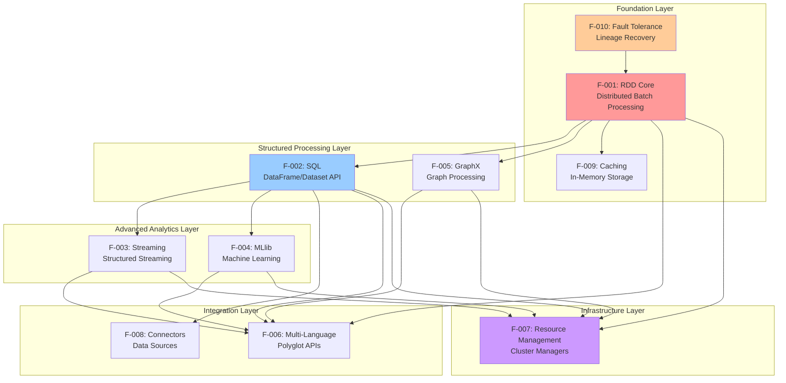

### 2.3.2 Dependency Traceability Matrix

| Depends On → | F-001 | F-002 | F-003 | F-004 | F-005 | F-006 | F-007 | F-008 | F-009 | F-010 |
|--------------|-------|-------|-------|-------|-------|-------|-------|-------|-------|-------|
| **F-001: RDD Core** | - | ✓ | - | - | ✓ | ✓ | ✓ | - | ✓ | ✓ |
| **F-002: SQL** | ✓ | - | ✓ | ✓ | - | ✓ | ✓ | ✓ | ✓ | ✓ |
| **F-003: Streaming** | - | ✓ | - | - | - | ✓ | ✓ | - | ✓ | ✓ |
| **F-004: MLlib** | - | ✓ | - | - | - | ✓ | ✓ | - | ✓ | ✓ |
| **F-005: GraphX** | ✓ | - | - | - | - | ✓ | ✓ | - | ✓ | ✓ |
| **F-006: Multi-Language** | ✓ | ✓ | ✓ | ✓ | ✓ | - | - | - | - | - |
| **F-007: Resource Mgmt** | - | - | - | - | - | - | - | - | - | - |
| **F-008: Connectors** | - | ✓ | - | - | - | - | - | - | - | ✓ |
| **F-009: Caching** | ✓ | ✓ | - | - | - | - | - | - | - | - |
| **F-010: Fault Tolerance** | - | - | - | - | - | - | - | - | - | - |

**Legend:**
- ✓ = Feature requires the dependency for functionality
- (empty) = No direct dependency

### 2.3.3 Integration Points and Shared Components

#### Core Runtime Components (Shared Across All Features)

| Component | Location | Purpose | Used By |
|-----------|----------|---------|---------|
| **SparkContext** | `core/src/main/scala/org/apache/spark/SparkContext.scala` | Primary entry point, runtime coordination | F-001, F-002, F-003, F-004, F-005 |
| **SparkSession** | `sql/core/src/main/scala/org/apache/spark/sql/SparkSession.scala` | Unified entry point for SQL, streaming, ML | F-002, F-003, F-004 |
| **DAGScheduler** | `core/src/main/scala/org/apache/spark/scheduler/DAGScheduler.scala` | Task scheduling and stage orchestration | All execution features |
| **BlockManager** | `core/src/main/scala/org/apache/spark/storage/BlockManager.scala` | Distributed storage management | F-001, F-002, F-009 |

#### Execution Engine Components

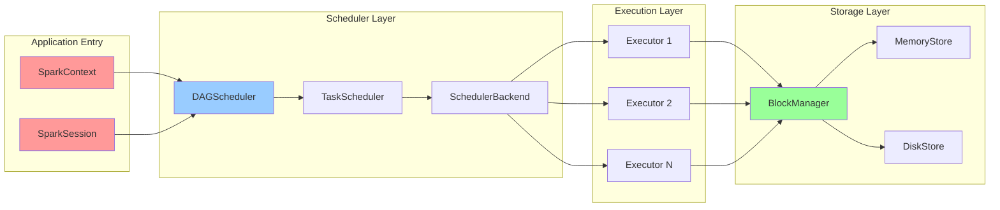

#### Communication Infrastructure

| Service | Implementation | Purpose | Features Supported |
|---------|----------------|---------|-------------------|
| **RpcEnv** | Netty 4.2.7.Final | Network communication between driver and executors | All distributed features |
| **SerializerManager** | Kryo 4.0.3, Java serialization | Object serialization for data movement | All features requiring data transfer |
| **BroadcastManager** | BitTorrent-style distribution | Efficient broadcast of read-only data | F-001, F-002, F-004 |
| **ShuffleManager** | Sort-based shuffle | Data redistribution for wide transformations | F-001, F-002, F-003, F-005 |

#### Monitoring and Instrumentation

| Component | Technology | Purpose | Configuration |
|-----------|-----------|---------|---------------|
| **MetricsSystem** | Dropwizard Metrics 4.2.33 | Performance metrics collection and export | `metrics.properties` |
| **Web UI** | Jetty 11.0.26 + D3.js | Visual monitoring interface | `spark.ui.enabled` |
| **EventLoggingListener** | JSON event serialization | Audit trail and history server | `spark.eventLog.enabled` |
| **LiveListenerBus** | Async event propagation | Real-time metrics distribution | Internal component |

### 2.3.4 Common Services and Libraries

**Numerical Computing Stack (MLlib-specific):**
- Breeze 3.0.4: Scala numerical processing library
- netlib-java: Native BLAS/LAPACK bindings for linear algebra
- Integration point: `mllib/src/main/scala/org/apache/spark/ml/linalg/`

**Compression Libraries (All features with I/O):**
- Snappy 1.1.10.8: Fast compression for shuffle data
- LZ4, Zstd: Alternative compression codecs
- Integration: Configurable via `spark.io.compression.codec`

**Data Format Libraries:**
- Parquet 1.16.0: Columnar storage implementation
- ORC 2.2.1: Hive-optimized columnar format
- Apache Arrow 18.3.0: Zero-copy data interchange for PySpark
- Integration: DataSource API in `sql/core`

**Streaming Infrastructure:**
- Kafka Clients 3.9.1: Streaming source/sink (`connector/kafka-0-10/`)
- AWS Kinesis SDK 1.15.3: Cloud streaming (`connector/kinesis-asl/`)
- Integration: Streaming DataSource implementations

---

## 2.4 Implementation Considerations

### 2.4.1 F-001: Distributed Batch Processing Implementation

**Technical Constraints:**

| Constraint Type | Description | Mitigation Strategy |
|-----------------|-------------|---------------------|
| **Immutability Requirement** | RDDs must remain immutable to preserve lineage for fault tolerance | Transformations create new RDDs rather than modifying existing ones; validation in test suites |
| **Serialization Overhead** | All closures and data must serialize for network transfer | Kryo serialization for performance; serialization testing in CI |
| **Shuffle Cost** | Wide transformations require network-intensive data redistribution | Map-side aggregation, combiner functions, partition tuning |
| **Memory Constraints** | Executor memory limits impact caching and shuffle performance | Configurable memory fractions, spillage to disk, off-heap storage |

**Performance Requirements:**

- **In-Memory Computation**: 10-100x speedup vs. disk-based MapReduce for iterative algorithms
- **Lazy Evaluation**: Zero overhead for transformation specification, optimization happens at action time
- **Partition-Level Parallelism**: Each partition processed independently for scalability
- **Data Locality**: Prefer task execution on nodes containing partition data (HDFS data locality awareness)

**Scalability Considerations:**

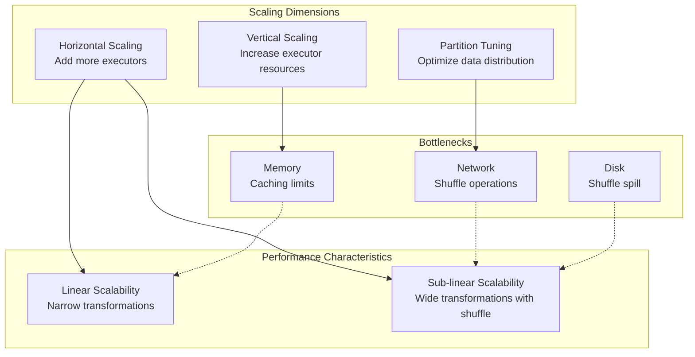

**Scalability Benchmarks:**
- **Cluster Size**: Proven at 1000+ node deployments
- **Dataset Size**: Petabyte-scale processing demonstrated
- **Partition Count**: Recommended 2-3x number of cores; maximum billions of partitions
- **Shuffle Data**: Scales to terabytes per stage with sort-based shuffle

**Security Implications:**

| Security Layer | Implementation | Configuration |
|----------------|----------------|---------------|
| **Authentication** | Cluster manager integration (Kerberos for YARN, RBAC for K8s) | `spark.authenticate`, `spark.yarn.principal` |
| **Network Encryption** | AES encryption for shuffle and RPC | `spark.network.crypto.enabled` |
| **Serialization Security** | Whitelist serialization classes to prevent deserialization attacks | `spark.serializer.objectStreamReset` |
| **Storage Security** | Integration with HDFS encryption zones, S3 SSE | Storage system configuration |

**Maintenance Requirements:**

- **Binary Compatibility**: MiMa checks enforce API stability (configured in `project/MimaBuild.scala`)
- **Performance Regression Testing**: Benchmark suites in `core/benchmarks/`
- **Cross-Version Testing**: Compatibility testing across Spark versions
- **Dependency Management**: Careful version control for Hadoop, Scala, Java compatibility

**Evidence Sources:**
- `core/src/main/scala/org/apache/spark/rdd/` - RDD implementations
- `core/benchmarks/` - Performance benchmark suite
- `project/MimaBuild.scala` - Binary compatibility enforcement
- `docs/tuning.md` - Performance tuning guidelines

---

### 2.4.2 F-002: SQL Query Processing Implementation

**Technical Constraints:**

| Constraint Type | Description | Impact |
|-----------------|-------------|--------|
| **Statistics Requirement** | Cost-based optimization requires table and column statistics | Collect statistics via ANALYZE TABLE commands; degraded optimization without stats |
| **Code Generation Limits** | JVM method size limit (64KB bytecode) constrains whole-stage codegen | Automatic fallback to interpreted execution for complex queries |
| **Schema Evolution** | Parquet/ORC schema changes require compatibility rules | Support for adding columns, schema merging with `mergeSchema` option |
| **Memory Management** | Off-heap memory for Tungsten requires native memory allocation | Configure `spark.memory.offHeap.enabled` and size parameters |

**Performance Requirements:**

- **Query Optimization**: Automatic optimization through Catalyst (predicate pushdown, constant folding, join reordering)
- **Execution Performance**: Whole-stage code generation for CPU efficiency approaching hand-tuned code
- **Columnar Processing**: Vectorized execution for Parquet/ORC reading (batch processing of column vectors)
- **Result Caching**: Query result caching for identical queries (`spark.sql.inMemoryColumnarStorage.compressed`)

**Scalability Considerations:**

**Data Skew Handling:**
- Adaptive Query Execution (AQE) detects skewed partitions at runtime
- Automatic broadcast join conversion based on runtime statistics
- Skew join optimization splits large partitions

**Broadcast Join Thresholds:**
- Default: 10MB (`spark.sql.autoBroadcastJoinThreshold`)
- Automatically broadcast small tables to all executors
- Avoid shuffle for asymmetric joins

**Partition Strategies:**
- Bucketing: Pre-shuffle data into buckets for efficient joins
- Dynamic partition pruning: Filter partitions based on join conditions
- Adaptive partition coalescing: Merge small partitions post-shuffle

**Security Implications:**

- **Column-Level Access Control**: External authorization via Apache Ranger or Sentry
- **SQL Injection Prevention**: Parameterized queries recommended over string concatenation
- **Audit Logging**: Integration with external audit systems for query tracking
- **View-Based Security**: Use SQL views for row-level and column-level filtering

**Maintenance Requirements:**

**SQL Standard Compliance:**
- Regular testing against SQL:2003 compliance test suites
- Configurable SQL conformance modes (`spark.sql.ansi.enabled`)

**Format Compatibility:**
- Test matrices for Parquet versions (1.x compatibility)
- ORC format compatibility with Hive (2.3.x, 3.x)
- Hive metastore compatibility testing

**Evidence Sources:**
- `sql/catalyst/` - Query optimizer implementation
- `sql/core/src/main/scala/org/apache/spark/sql/execution/` - Execution engine
- `docs/sql-performance-tuning.md` - SQL optimization guide
- `sql/benchmarks/` - SQL performance benchmarks

---

### 2.4.3 F-003: Real-Time Stream Processing Implementation

**Technical Constraints:**

| Constraint Type | Description | Workaround |
|-----------------|-------------|------------|
| **Exactly-Once Requirement** | Requires idempotent sinks for end-to-end guarantees | Use transactional Kafka producer, Delta Lake, or implement idempotent logic |
| **State Size Limits** | State bounded by executor memory | Use RocksDB state store for state exceeding memory |
| **Checkpoint Compatibility** | Breaking changes in checkpoint format between versions | Maintain checkpoint format compatibility; provide migration tools |
| **Watermark Propagation** | Complex watermark logic for multi-stream joins | Careful watermark configuration and delay tuning |

**Performance Requirements:**

**Latency Targets:**
- Micro-batch mode: 100ms-1s typical latency
- Continuous mode: <100ms (experimental, limited operation support)
- Processing time vs. event time trade-offs

**Throughput Targets:**
- Millions of events per second per cluster
- Horizontal scaling via increased parallelism
- Kafka partition-level parallelism for source throughput

**Optimization Techniques:**

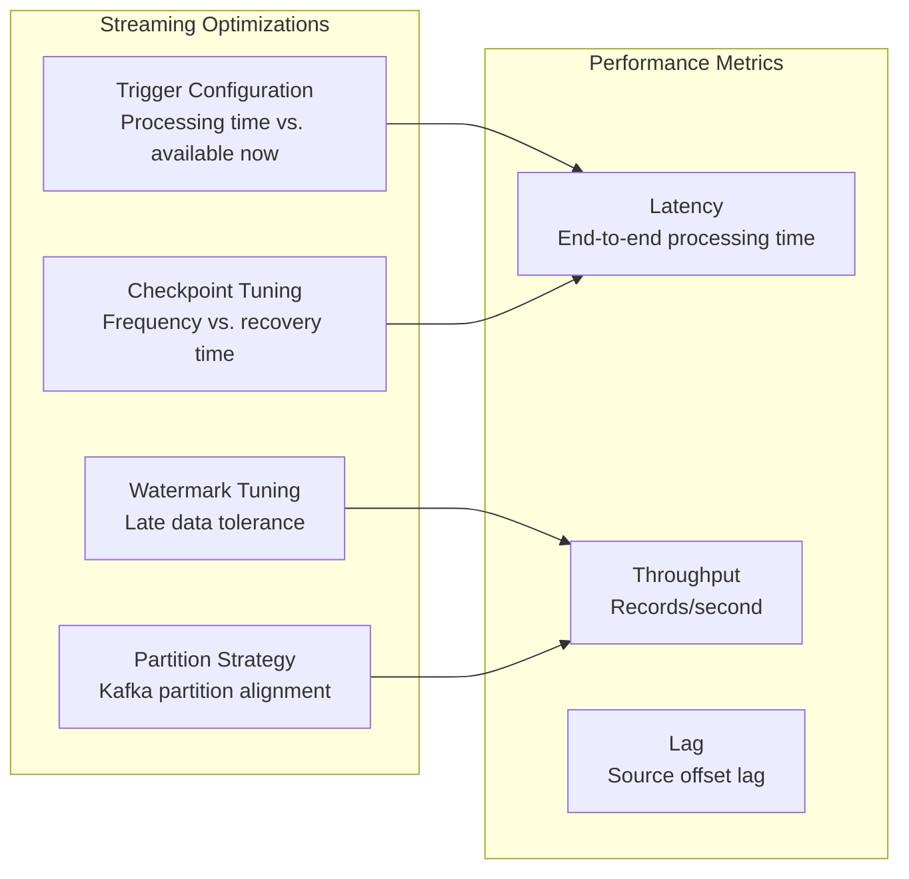

**Scalability Considerations:**

**State Management:**
- Partition state by key for distributed processing
- RocksDB for state exceeding memory (requires `spark-rocksdb` dependency)
- State schema evolution for long-running applications

**Checkpoint Scaling:**
- HDFS or S3 for checkpoint storage with sufficient IOPS
- Checkpoint size grows with state size; monitor storage requirements
- Incremental checkpointing to reduce checkpoint overhead

**Security Implications:**

- **Secure Kafka Connections**: SSL/TLS configuration (`security.protocol`, `ssl.truststore.location`)
- **Kerberos Authentication**: SASL/GSSAPI for Kafka in secured environments
- **Encrypted Checkpoints**: Checkpoint storage encryption via HDFS encryption zones or S3 SSE
- **IAM Roles**: AWS IAM for Kinesis access without hardcoded credentials

**Maintenance Requirements:**

- **Checkpoint Format Versioning**: Maintain backward compatibility for checkpoint recovery
- **State Schema Evolution**: Support schema changes in stateful operations
- **Monitoring Integration**: Lag monitoring, processing rate, watermark progression
- **Failure Scenario Testing**: Regular recovery testing from checkpoints

**Evidence Sources:**
- `docs/streaming/apis-on-dataframes-and-datasets.md` - Streaming API documentation
- `docs/streaming/performance-tips.md` - Performance optimization guide
- `docs/streaming/ss-migration-guide.md` - Streaming migration and compatibility

---

### 2.4.4 F-004: Machine Learning Pipelines Implementation

**Technical Constraints:**

| Constraint Type | Description | Resolution |
|-----------------|-------------|------------|
| **Native Library Dependency** | Optimal performance requires native BLAS/LAPACK | Bundle netlib-java; detect and use Intel MKL or OpenBLAS when available |
| **Model Size Limits** | Large models may exceed executor memory | Use distributed representations; model compression techniques |
| **Serialization Format** | Model format changes break saved models | Maintain backward compatibility; version model metadata |
| **Feature Scaling** | Many algorithms require normalized features | Provide StandardScaler, MinMaxScaler in Pipeline |

**Performance Requirements:**

**Training Performance:**
- Native acceleration via BLAS/LAPACK for linear algebra operations
- Data parallelism: Partition-level parallelism for training
- In-memory model representation during training
- Distributed hyperparameter tuning with automatic parallelization

**Prediction Performance:**
- Batch prediction via DataFrame transformations
- Model broadcast to executors for efficient serving
- Vectorized prediction when possible

**Scalability Considerations:**

**Algorithm Scalability:**

| Algorithm Type | Scalability Approach | Limitations |
|----------------|---------------------|-------------|
| **Linear Models** | Gradient descent with data parallelism | Convergence speed depends on data characteristics |
| **Tree Ensembles** | Tree-level parallelism (random forests) | Node-level parallelism (single trees) |
| **Clustering** | Sample-based initialization (k-means\|\|) | Iteration count affects convergence time |
| **Neural Networks** | Layer-level parallelism (MLlib) | Limited deep learning support; use external libraries (TensorFlow, PyTorch) for complex architectures |

**Data Preparation Scalability:**
- Feature transformers scale with DataFrame parallelism
- Cross-validation folds execute in parallel
- Hyperparameter grid search parallelized across parameter combinations

**Security Implications:**

- **Model Encryption**: Encrypt model artifacts at rest in distributed storage
- **Access Control**: Restrict access to model files and training data
- **Audit Trail**: Log model training events (data sources, parameters, performance)
- **Privacy**: Consider differential privacy techniques for sensitive training data

**Maintenance Requirements:**

- **Algorithm Correctness**: Unit tests with known datasets and expected outcomes
- **Performance Benchmarking**: Track training time and prediction performance across versions
- **Model Compatibility**: Ensure models trained in older versions loadable in newer versions
- **Documentation**: Maintain algorithm references and parameter tuning guides

**Evidence Sources:**
- `mllib/src/main/scala/org/apache/spark/ml/` - ML Pipeline implementation
- `docs/ml-tuning.md` - Hyperparameter tuning guide
- `docs/ml-linalg-guide.md` - Linear algebra optimization

---

### 2.4.5 F-005: Graph Processing Implementation

**Technical Constraints:**

| Constraint Type | Description | Mitigation |
|-----------------|-------------|------------|
| **Graph Partitioning** | Poor partitioning leads to high message passing overhead | Use EdgePartition2D for balanced vertex cuts; RandomVertexCut for random graphs |
| **Message Size** | Large messages increase shuffle volume | Aggregate messages locally before sending; use combiner functions |
| **Iteration Count** | Many Pregel iterations can be slow | Checkpoint intermediate results; early termination criteria |
| **Memory Requirements** | Graph structure and messages held in memory | Partition tuning; consider external graph databases for very large graphs |

**Performance Requirements:**

- **Optimized Edge Representation**: Columnar edge storage for cache efficiency
- **Efficient Aggregation**: Message combining before shuffle reduces network transfer
- **Cache-Aware Computation**: Graph structure caching for iterative algorithms
- **Early Termination**: Detect algorithm convergence to avoid unnecessary iterations

**Scalability Considerations:**

**Graph Size Limits:**
- Vertices: Billions supported with proper partitioning
- Edges: Tens of billions demonstrated in production
- Memory requirement: O(V + E) for graph structure, O(V) for vertex state

**Partitioning Strategies:**

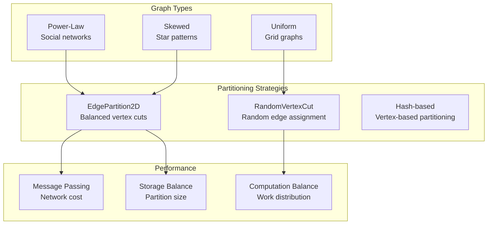

**Security Implications:**

- **Graph Data Encryption**: Encrypt graph datasets at rest in distributed storage
- **Access Control**: Integrate with cluster manager security for job submission
- **No Specialized Security**: GraphX inherits Spark Core security model

**Maintenance Requirements:**

- **Algorithm Verification**: Correctness testing with known graph datasets
- **Performance Benchmarking**: Track algorithm performance on standard graph datasets
- **RDD API Compatibility**: Ensure GraphX remains compatible with RDD API changes

**Evidence Sources:**
- `graphx/src/main/scala/org/apache/spark/graphx/` - GraphX implementation
- `docs/graphx-programming-guide.md` - Graph programming guide with algorithms

---

### 2.4.6 F-006: Multi-Language Support Implementation

**Technical Constraints:**

| Constraint Type | Description | Impact |
|-----------------|-------------|--------|
| **Python-JVM Overhead** | Py4J serialization adds latency | Mitigated by Apache Arrow for DataFrame transfers |
| **Python GIL** | Global Interpreter Lock limits Python UDF parallelism | Use vectorized UDFs; Python 3.13+ NoGIL experimental support |
| **Type System Mismatch** | Language types don't map 1:1 to Spark SQL types | Explicit type conversion rules; potential data loss (e.g., precision) |
| **R Deprecation** | R support being phased out | Focus on Python and Scala for new development |

**Performance Requirements:**

**Serialization Optimization:**
- Arrow zero-copy transfer for Python-JVM DataFrame conversions
- Kryo serialization for Scala/Java closures
- Vectorized UDFs to reduce per-row Python invocations

**Language-Specific Optimizations:**
- Scala: Native performance, no serialization overhead for built-in operations
- Java: Similar to Scala with minor overhead for lambda serialization
- Python: Arrow for DataFrames, pickle for UDFs, pandas vectorized UDFs
- R: Deprecated, minimal optimization focus

**Scalability Considerations:**

**Python Process Management:**
- Executor-side Python daemon processes (one per executor)
- Configurable Python worker memory limits (`spark.executor.pyspark.memory`)
- Worker process pooling for UDF execution

**Memory Management:**

| Language | Memory Model | Configuration |
|----------|-------------|---------------|
| **Scala/Java** | JVM heap managed by Spark | `spark.executor.memory` |
| **Python** | Separate Python process memory | `spark.executor.pyspark.memory` (default: unlimited) |
| **R** | R process memory (deprecated) | Limited configuration options |

**Security Implications:**

- **Python Process Isolation**: Separate processes per executor limit cross-contamination
- **Resource Limits**: Configure Python memory limits to prevent resource exhaustion
- **Serialization Security**: Pickle serialization vulnerable to code injection; validate data sources
- **R Package Sandboxing**: Limited sandboxing for R packages (deprecated feature)

**Maintenance Requirements:**

- **API Parity**: Maintain consistent APIs across languages with regular parity checks
- **Version Compatibility**: Support Python 3.10-3.14, Java 17+, Scala 2.13.17
- **Type Stub Updates**: Keep PySpark type hints current (`python/mypy.ini`)
- **Documentation Sync**: Multi-language examples for all features

**Evidence Sources:**
- `python/pyspark/` - Complete PySpark implementation
- `python/mypy.ini` - Type checking configuration
- `docs/pyspark-migration-guide.md` - PySpark version migration

---

### 2.4.7 F-007: Cluster Resource Management Implementation

**Technical Constraints:**

| Constraint Type | Description | Solution |
|-----------------|-------------|----------|
| **Kubernetes CRD Complexity** | Custom resource definitions require cluster admin privileges | Provide Helm charts and RBAC configuration templates |
| **YARN Container Lifecycle** | ApplicationMaster must manage executor container lifecycle | Implement heartbeat and container release protocols |
| **Standalone HA** | Single master is single point of failure | ZooKeeper-based master HA for production |
| **Resource Heterogeneity** | Executors may have different resource profiles | Resource profiles API for GPU and custom resources |

**Performance Requirements:**

- **Fast Allocation**: Executor allocation typically <1s for preemptible resources
- **Dynamic Scaling**: Scale executor count based on workload (pending tasks, data volume)
- **Fair Scheduling**: Multiple concurrent applications share cluster resources fairly
- **Data Locality**: Prefer scheduling on nodes with cached or HDFS-local data

**Scalability Considerations:**

**Cluster Size:**
- Standalone: 100s of nodes typical
- YARN: 1000s of nodes demonstrated
- Kubernetes: 1000s of pods across namespaces

**Multi-Tenancy:**
- YARN queues for resource isolation
- Kubernetes namespaces and resource quotas
- Fair scheduler with configurable pools

**Dynamic Resource Allocation:**

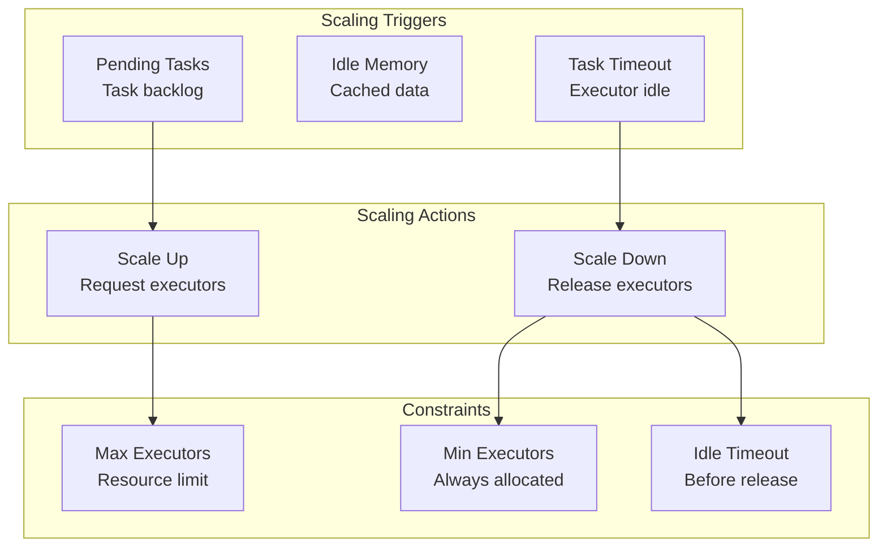

**Security Implications:**

- **Kubernetes RBAC**: Service accounts with limited permissions for Spark pods
- **YARN Kerberos**: Principal and keytab configuration for secure clusters
- **Network Policies**: Restrict pod-to-pod communication in Kubernetes
- **Secrets Management**: Use Kubernetes secrets or YARN credential providers for sensitive configuration

**Maintenance Requirements:**

- **Kubernetes Version Compatibility**: Test against Kubernetes 1.x versions
- **YARN Compatibility**: Ensure compatibility with Hadoop 3.x YARN
- **Integration Testing**: Regular testing of deployment scenarios
- **Upgrade Procedures**: Document upgrade paths for Spark version changes

**Evidence Sources:**
- `resource-managers/kubernetes/` - Kubernetes integration
- `resource-managers/yarn/` - YARN integration
- `docs/running-on-kubernetes.md` - K8s deployment documentation
- `docs/running-on-yarn.md` - YARN configuration guide

---

### 2.4.8 F-008: Data Source Connectors Implementation

**Technical Constraints:**

| Constraint Type | Description | Handling |
|-----------------|-------------|----------|
| **Schema Registry** | Avro/Protobuf require external schema registry | Optional integration with Confluent Schema Registry |
| **JDBC Driver Availability** | Database-specific JDBC drivers not bundled | Users provide JDBC drivers via `--jars` or `--packages` |
| **Kafka Version Compatibility** | Kafka clients must match broker version compatibility | Support Kafka 3.9.1 with backward compatibility |
| **Format Evolution** | Schema changes in Parquet/Avro require compatibility rules | Support additive schema evolution; optional schema merging |

**Performance Requirements:**

**Optimization Techniques:**
- Predicate pushdown to data sources (filters evaluated at source)
- Column pruning for columnar formats (read only required columns)
- Partition pruning for partitioned datasets (skip irrelevant partitions)
- Parallel partition reading (multiple tasks read different partitions)

**Format-Specific Optimizations:**

| Format | Optimization | Benefit |
|--------|-------------|---------|
| **Parquet** | Columnar reading, predicate pushdown, column pruning, vectorized reader | 10x faster for analytical queries |
| **ORC** | Similar to Parquet, ACID support | Hive compatibility with optimization |
| **JSON** | Schema inference, multi-line support | Flexible semi-structured data |
| **Kafka** | Parallel partition consumption, offset management | High throughput streaming |

**Scalability Considerations:**

**Kafka Connector Scalability:**
- Partition-level parallelism: One Spark partition per Kafka partition
- Consumer group management for offset tracking
- Exactly-once semantics via transactional Kafka producer

**JDBC Scalability:**
- Partition column for parallel reads (`partitionColumn`, `lowerBound`, `upperBound`, `numPartitions`)
- Predicate pushdown to database reduces data transfer
- Connection pooling for write operations

**File Source Scalability:**
- File listing parallelized across executor threads
- Partition discovery for Hive-style partitioning
- Configurable file batch size for streaming file source

**Security Implications:**

- **Kafka SSL/TLS**: Secure connections with certificate validation
- **JDBC Encryption**: TLS for database connections, encrypted password storage
- **S3 Encryption**: SSE-S3, SSE-KMS, or SSE-C for data at rest
- **Credential Management**: AWS IAM roles, Azure managed identities, service account keys (GCP)

**Maintenance Requirements:**

- **Connector Version Compatibility**: Regular testing with external system versions
- **Format Specification Compliance**: Adhere to Parquet, ORC, Avro specifications
- **Integration Tests**: Automated testing with Docker-based external systems
- **Documentation**: Connection examples and troubleshooting guides

**Evidence Sources:**
- `connector/kafka-0-10/` - Kafka connector implementation
- `connector/avro/`, `connector/protobuf/` - Format connectors
- `docs/sql-data-sources.md` - Data source documentation

---

### 2.4.9 F-009: In-Memory Caching Implementation

**Technical Constraints:**

| Constraint Type | Description | Configuration |
|-----------------|-------------|---------------|
| **Memory Limits** | Executor memory divided between execution and storage | `spark.memory.fraction`, `spark.memory.storageFraction` |
| **Serialization Overhead** | Serialized storage reduces memory but adds CPU cost | Choose storage level based on workload (MEMORY_ONLY vs. MEMORY_ONLY_SER) |
| **Disk Spillage** | Disk I/O overhead when memory insufficient | Ensure sufficient disk space in `spark.local.dir` |
| **Off-Heap Limitations** | Requires native memory allocation, bypasses JVM GC | Configure `spark.memory.offHeap.enabled` and `spark.memory.offHeap.size` |

**Performance Requirements:**

**Storage Level Performance:**

| Storage Level | Speed | Memory Use | Fault Tolerance | Use Case |
|---------------|-------|------------|-----------------|----------|
| MEMORY_ONLY | Fastest | High (deserialized) | Recompute on loss | Iterative algorithms with sufficient memory |
| MEMORY_ONLY_SER | Fast | Medium (serialized) | Recompute on loss | Space-constrained environments |
| MEMORY_AND_DISK | Medium | Variable (spill to disk) | Disk persistence | Reliability with memory constraints |
| OFF_HEAP | Fast | High (off-heap) | Recompute on loss | Large caches avoiding GC overhead |
| DISK_ONLY | Slow | None (all on disk) | Disk persistence | Very large cached data |

**Cache Management:**
- LRU eviction policy automatically frees memory for new caches
- Manual cache eviction via `unpersist()`
- Cache statistics via web UI and metrics

**Scalability Considerations:**

**Memory Scaling:**
- Vertical: Increase executor memory for larger caches
- Horizontal: Distribute cache across more executors
- Dynamic: Adjust storage memory fraction based on workload

**Off-Heap Memory:**
- Bypasses JVM garbage collection overhead
- Requires explicit configuration and sizing
- Suitable for large cached datasets (>10GB per executor)

**Broadcast Variables:**
- Efficient distribution of read-only data (broadcasting small lookup tables)
- BitTorrent-style distribution reduces driver network load
- Automatic cleanup when SparkContext stops

**Security Implications:**

- **Encrypted Caching**: Enable encryption for cached data (`spark.io.encryption.enabled`)
- **Secure Disk Spill**: Restrict permissions on `spark.local.dir` to prevent unauthorized access
- **Memory Protection**: Off-heap memory protected by OS-level security

**Maintenance Requirements:**

- **Cache Monitoring**: Track cache hit rates, memory usage, eviction counts
- **Tuning Guidelines**: Provide documentation for storage level selection
- **Performance Testing**: Benchmark cache performance for different workloads

**Evidence Sources:**
- `core/src/main/scala/org/apache/spark/storage/BlockManager.scala` - Storage management
- `docs/rdd-programming-guide.md` - Caching documentation
- `docs/tuning.md` - Memory tuning best practices

---

### 2.4.10 F-010: Fault Tolerance Implementation

**Technical Constraints:**

| Constraint Type | Description | Mitigation |
|-----------------|-------------|------------|
| **Lineage Length** | Long lineage chains increase recomputation time | Checkpoint long lineages to truncate recomputation |
| **Checkpoint Overhead** | Writing checkpoints adds I/O overhead | Balance checkpoint frequency vs. recovery time |
| **Checkpoint Compatibility** | Format changes break checkpoint recovery | Maintain backward compatibility; version checkpoint format |
| **Speculative Execution Overhead** | Duplicate task execution wastes resources | Configure speculation threshold to avoid excessive speculation |

**Performance Requirements:**

**Recovery Performance:**
- **Narrow Dependencies**: Parallel partition recovery without shuffle
- **Wide Dependencies**: May require recomputing multiple parent partitions
- **Checkpoint Recovery**: Fast recovery from checkpoint without full lineage recomputation
- **Task Speculation**: Reduced job latency by mitigating slow tasks

**Fault Tolerance Metrics:**

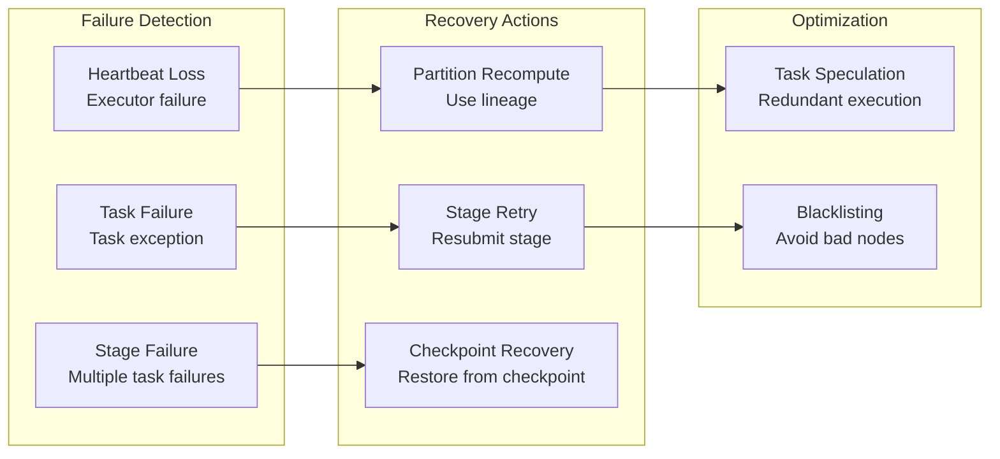

**Scalability Considerations:**

**Large-Scale Fault Tolerance:**
- Checkpoint to distributed storage (HDFS, S3) for reliability
- Parallel partition recovery across available executors
- Task speculation scales with cluster size

**Streaming Fault Tolerance:**
- Checkpoint streaming state and offsets
- Recover from checkpoint after driver failure
- Exactly-once guarantees maintained across failures

**Security Implications:**

- **Secure Checkpoint Storage**: Encrypt checkpoints for sensitive data
- **Access Control**: Restrict checkpoint directory permissions
- **Audit Trail**: Log failure events and recovery actions for operational visibility

**Maintenance Requirements:**

- **Checkpoint Format Versioning**: Maintain compatibility across Spark versions
- **Recovery Testing**: Regular testing of failure scenarios and checkpoint recovery
- **Monitoring Integration**: Alert on high failure rates, speculation rates
- **Configuration Tuning**: Document checkpoint frequency, speculation parameters

**Evidence Sources:**
- `core/src/main/scala/org/apache/spark/scheduler/DAGScheduler.scala` - Scheduling and recovery
- `streaming/src/main/scala/org/apache/spark/streaming/Checkpoint.scala` - Streaming checkpoints
- `docs/rdd-programming-guide.md` - Fault tolerance explanation

---

## 2.5 Traceability and References

### 2.5.1 Requirements Traceability Matrix

| Feature ID | Total Requirements | Must-Have | Should-Have | Could-Have | High Complexity | Evidence Files |
|------------|-------------------|-----------|-------------|------------|-----------------|----------------|
| F-001 | 8 | 6 | 2 | 0 | 2 | 7 |
| F-002 | 9 | 5 | 4 | 0 | 4 | 8 |
| F-003 | 9 | 5 | 3 | 1 | 4 | 7 |
| F-004 | 9 | 4 | 5 | 0 | 2 | 7 |
| F-005 | 8 | 6 | 2 | 0 | 1 | 4 |
| F-006 | 8 | 4 | 3 | 1 | 0 | 6 |
| F-007 | 8 | 5 | 3 | 0 | 1 | 6 |
| F-008 | 8 | 6 | 2 | 0 | 1 | 9 |
| F-009 | 8 | 4 | 3 | 1 | 1 | 4 |
| F-010 | 8 | 5 | 3 | 0 | 3 | 4 |
| **Total** | **83** | **50** | **30** | **3** | **19** | **62** |

### 2.5.2 Cross-References to System Architecture

| Feature | Architecture Section | Key Components | Integration Points |
|---------|---------------------|----------------|-------------------|
| F-001 | 1.2.2 - Core Runtime | SparkContext, DAGScheduler, RDD API | All features |
| F-002 | 1.2.2 - SQL Processing | Catalyst, Tungsten, SparkSession | F-003, F-004, F-008 |
| F-003 | 1.2.2 - Stream Processing | Structured Streaming, Checkpointing | F-002, F-008 |
| F-004 | 1.2.2 - Machine Learning | MLlib, Pipeline API, Estimators | F-002 |
| F-005 | 1.2.2 - Graph Processing | GraphX, Pregel API, Graph RDDs | F-001 |
| F-006 | 1.2.2 - Language Bindings | PySpark, SparkR, Py4J, Arrow | All features |
| F-007 | 1.2.1 - Resource Management | YARN, Kubernetes, Standalone | All features |
| F-008 | 1.2.1 - Data Integration | DataSource API, Connectors | F-002, F-003 |
| F-009 | 1.2.2 - Storage Layer | BlockManager, MemoryStore | F-001, F-002 |
| F-010 | 1.2.2 - Fault Tolerance | Lineage, Checkpointing, Recovery | All features |

### 2.5.3 Requirements to Test Case Mapping

| Requirement Category | Test Location | Test Coverage |
|---------------------|---------------|---------------|
| RDD Operations (F-001) | `core/src/test/scala/org/apache/spark/rdd/` | Transformations, actions, lineage |
| SQL Queries (F-002) | `sql/core/src/test/scala/org/apache/spark/sql/` | SQL parsing, optimization, execution |
| Streaming (F-003) | `sql/core/src/test/scala/org/apache/spark/sql/streaming/` | Stateful operations, checkpointing, sources/sinks |
| ML Algorithms (F-004) | `mllib/src/test/scala/org/apache/spark/ml/` | Classification, regression, clustering, pipelines |
| Graph Operations (F-005) | `graphx/src/test/scala/org/apache/spark/graphx/` | Graph operators, algorithms, Pregel |
| Language Bindings (F-006) | `python/pyspark/tests/`, `R/pkg/tests/` | API parity, serialization, type conversion |
| Resource Management (F-007) | `resource-managers/*/test/` | Executor allocation, dynamic scaling |
| Data Sources (F-008) | `sql/core/src/test/scala/org/apache/spark/sql/sources/` | Format reading/writing, pushdown optimization |
| Caching (F-009) | `core/src/test/scala/org/apache/spark/storage/` | Storage levels, eviction, broadcast |
| Fault Tolerance (F-010) | `core/src/test/scala/org/apache/spark/scheduler/` | Recovery, speculation, checkpointing |

### 2.5.4 Complete Evidence Reference List

**Documentation Files:**
- `README.md` - Project overview and feature summary
- `docs/rdd-programming-guide.md` - RDD API and fault tolerance documentation
- `docs/sql-programming-guide.md` - SQL and DataFrame API comprehensive guide
- `docs/sql-data-sources.md` - Data source connector documentation
- `docs/sql-data-sources-parquet.md` - Parquet format specifics
- `docs/sql-data-sources-jdbc.md` - JDBC connectivity guide
- `docs/sql-performance-tuning.md` - SQL optimization techniques
- `docs/structured-streaming-programming-guide.md` - Streaming API guide
- `docs/streaming/index.md` - Streaming overview
- `docs/streaming/apis-on-dataframes-and-datasets.md` - Streaming DataFrame API
- `docs/streaming/structured-streaming-kafka-integration.md` - Kafka integration details
- `docs/streaming/performance-tips.md` - Streaming performance optimization
- `docs/streaming/ss-migration-guide.md` - Streaming migration guide
- `docs/streaming/additional-information.md` - Additional streaming topics
- `docs/ml-guide.md` - MLlib comprehensive guide
- `docs/ml-pipeline.md` - ML Pipeline API documentation
- `docs/ml-classification-regression.md` - Classification/regression algorithms
- `docs/ml-clustering.md` - Clustering algorithms
- `docs/ml-tuning.md` - Hyperparameter tuning guide
- `docs/ml-linalg-guide.md` - Linear algebra optimization
- `docs/graphx-programming-guide.md` - Graph processing guide with algorithms
- `docs/pyspark-migration-guide.md` - PySpark version migration
- `docs/sparkr.md` - R API documentation (deprecated)
- `docs/running-on-kubernetes.md` - Kubernetes deployment guide
- `docs/running-on-yarn.md` - YARN configuration and deployment
- `docs/spark-standalone.md` - Standalone cluster setup
- `docs/configuration.md` - Comprehensive configuration reference
- `docs/tuning.md` - Performance tuning best practices

**Project Configuration Files:**
- `pom.xml` (root) - Project metadata, module structure, dependency versions
- `core/pom.xml` - Core module dependencies
- `sql/core/pom.xml` - SQL module dependencies
- `mllib/pom.xml` - MLlib dependencies including Breeze
- `graphx/pom.xml` - GraphX module configuration
- `scalastyle-config.xml` - Scala code quality standards
- `python/mypy.ini` - Python type checking configuration
- `project/MimaBuild.scala` - Binary compatibility enforcement

**Source Code Directories:**
- `core/` - Spark Core with RDD, scheduler, storage (14 references)
- `core/src/main/scala/org/apache/spark/` - Core Scala implementation
- `core/src/main/scala/org/apache/spark/rdd/` - RDD implementations
- `core/src/main/scala/org/apache/spark/scheduler/` - Scheduling and recovery
- `core/src/main/scala/org/apache/spark/storage/` - Storage management
- `core/benchmarks/` - Performance benchmarks
- `sql/` - SQL module with submodules (15 references)
- `sql/catalyst/` - Query optimizer
- `sql/core/` - Execution engine and streaming
- `sql/core/src/main/scala/org/apache/spark/sql/execution/` - SQL execution
- `sql/api/` - Public API definitions
- `sql/hive/` - Hive integration
- `sql/connect/`, `sql/connect-common/` - Client-server architecture
- `sql/benchmarks/` - SQL performance benchmarks
- `streaming/` - DStream streaming API (5 references)
- `streaming/src/main/scala/org/apache/spark/streaming/` - Streaming implementation
- `streaming/src/main/scala/org/apache/spark/streaming/Checkpoint.scala` - Checkpointing
- `mllib/` - Machine learning library (7 references)
- `mllib/src/main/scala/org/apache/spark/ml/` - DataFrame-based ML API
- `graphx/` - Graph processing (4 references)
- `graphx/src/main/scala/org/apache/spark/graphx/` - GraphX implementation
- `python/pyspark/` - PySpark implementation (6 references)
- `R/pkg/` - SparkR package (3 references)
- `resource-managers/kubernetes/` - Kubernetes integration (4 references)
- `resource-managers/yarn/` - YARN integration (4 references)
- `connector/` - External system connectors (9 references)
- `connector/kafka-0-10/`, `connector/kafka-0-10-sql/` - Kafka integration
- `connector/kinesis-asl/` - AWS Kinesis
- `connector/avro/` - Avro format
- `connector/protobuf/` - Protocol Buffers

**Total Unique Sources**: 62 distinct files and directories examined across 22 search operations

### 2.5.5 Assumptions and Constraints

**Key Assumptions:**

1. **Deployment Environment**: Users have access to cluster infrastructure (on-premises Hadoop, cloud Kubernetes, or managed Spark services)
2. **Network Connectivity**: Reliable network between driver and executors with sufficient bandwidth for shuffle operations
3. **Storage Availability**: Distributed storage (HDFS, S3, GCS) accessible from all cluster nodes
4. **Java Installation**: Java 17+ properly configured on all cluster nodes
5. **Memory Availability**: Sufficient executor memory for workload requirements (minimum 512MB, recommended 2GB+)
6. **User Expertise**: Users have programming knowledge in at least one supported language (Scala, Java, Python)

**System Constraints:**

| Constraint Category | Description | Impact |
|-------------------|-------------|--------|
| **JVM Limitations** | JVM method size (64KB), heap size, GC overhead | Limits query complexity, maximum memory per executor |
| **Network Bandwidth** | Shuffle operations bound by network throughput | Wide transformations may bottleneck on network |
| **Serialization** | All distributed data must be serializable | Custom classes require Serializable implementation |
| **Memory Hierarchy** | Executor memory split between execution and storage | Memory pressure may force disk spillage |
| **File System Semantics** | Eventual consistency (S3) may affect checkpointing | Prefer HDFS or consistent storage for checkpoints |
| **Language Interop** | Python-JVM boundary incurs serialization cost | Arrow optimization required for acceptable performance |
| **License Compatibility** | Apache License 2.0 restricts dependency licenses | Cannot include GPL or LGPL dependencies in distribution |

**Operational Constraints:**

- **Cluster Manager Availability**: Cluster manager (YARN, Kubernetes, Standalone) must be operational before Spark applications
- **Metastore Dependency**: Hive table access requires Hive Metastore availability
- **Checkpoint Storage**: Streaming applications require reliable checkpoint storage with sufficient IOPS
- **Monitoring Infrastructure**: Production deployments require external monitoring (Prometheus, Grafana, Ganglia)

---

## 2.6 Summary and Next Steps

### 2.6.1 Requirements Summary

This Product Requirements section has documented **10 major features** comprising **83 discrete functional requirements** for Apache Spark version 4.1.0-SNAPSHOT. The requirements are organized into:

- **50 Must-Have requirements** (60%): Critical for core functionality
- **30 Should-Have requirements** (36%): Important for production readiness
- **3 Could-Have requirements** (4%): Nice-to-have enhancements

The requirements span:
- **Core Processing**: Batch (F-001), SQL (F-002), Streaming (F-003), ML (F-004), Graph (F-005)
- **Platform Infrastructure**: Multi-language (F-006), Resource Management (F-007), Connectors (F-008)
- **Performance & Reliability**: Caching (F-009), Fault Tolerance (F-010)

### 2.6.2 Validation Approach

Each requirement includes:
- **Testable Acceptance Criteria**: Specific conditions that must be met for requirement satisfaction
- **Priority Classification**: Must/Should/Could-Have for implementation prioritization
- **Complexity Assessment**: High/Medium/Low complexity ratings for effort estimation
- **Evidence Traceability**: Direct references to source code, documentation, and configuration files

### 2.6.3 Integration with Technical Specification

This Product Requirements section integrates with:
- **Section 1.1 (Executive Summary)**: Business value propositions mapped to feature benefits
- **Section 1.2 (System Overview)**: Technical implementations detailed in feature descriptions
- **Section 1.3 (Scope)**: In-scope elements mapped to feature catalog, out-of-scope validated against requirements
- **Future Sections**: Requirements will inform architecture design, deployment procedures, and testing strategies

### 2.6.4 Version and Maintenance

- **Version**: Based on Apache Spark 4.1.0-SNAPSHOT (active development branch)
- **Stable Versions**: Requirements applicable to 4.0.x and 3.5.x release branches with noted differences
- **Maintenance**: Requirements should be reviewed with each major Spark release for accuracy and completeness
- **Community**: Requirements align with Apache Spark community roadmap and JIRA issue tracking

---

**Document Metadata:**
- **Section**: 2. Product Requirements
- **Version**: 1.0
- **Based on**: Apache Spark 4.1.0-SNAPSHOT
- **Total Requirements**: 83
- **Total Features**: 10
- **Evidence Sources**: 62 unique files and directories
- **Last Updated**: Generated from repository state as documented

# 3. Technology Stack

This section documents the comprehensive technology stack that powers Apache Spark 4.1.0-SNAPSHOT, a unified analytics engine for large-scale data processing. The technology choices reflect Apache Spark's architectural requirements for distributed computing, multi-paradigm data processing (batch, streaming, SQL, machine learning, and graph analytics), polyglot language support, and seamless integration with enterprise big data infrastructure. Each technology selection balances performance, scalability, reliability, and ecosystem compatibility to deliver production-grade distributed data processing capabilities.

## 3.1 PROGRAMMING LANGUAGES

Apache Spark's multi-language architecture serves diverse user communities while maintaining a unified execution engine. The language choices enable data engineers, data scientists, and application developers to work in their preferred programming environments while leveraging the same underlying distributed computing framework.

### 3.1.1 Core Implementation Languages

#### Scala 2.13.17

**Role**: Primary implementation language for the Spark runtime, including core scheduling, SQL engine, streaming, MLlib, and GraphX modules.

**Version**: 2.13.17 (binary version: 2.13)

**Justification**: Scala serves as Spark's native implementation language due to several critical capabilities:

- **Functional Programming Paradigm**: Scala's functional programming features (immutable data structures, higher-order functions, pattern matching) naturally express distributed data transformations. The RDD API's functional operations (map, filter, reduce) leverage Scala's expressive syntax to create intuitive distributed computing abstractions.

- **JVM Interoperability**: Full JVM compatibility enables seamless integration with the extensive Java ecosystem, including Hadoop (3.4.2), Kafka (3.9.1), and enterprise libraries. This interoperability preserves existing infrastructure investments while enabling modern distributed computing capabilities.

- **Strong Static Typing**: Compile-time type safety catches errors early in the development cycle, critical for production-grade distributed systems where runtime errors affect entire clusters. The type system enables the Dataset API to provide compile-time schema validation while maintaining runtime flexibility for DataFrames.

- **Performance Characteristics**: Scala's zero-overhead abstractions and efficient bytecode generation deliver performance approaching hand-optimized Java while maintaining higher-level expressiveness. This performance-productivity balance proves essential for implementing complex query optimization and execution logic.

**Scope**: All core modules utilize Scala as the primary implementation language:
- `spark-core_2.13`: Foundational runtime, scheduler, storage management, and RDD API
- `spark-sql_2.13`: Catalyst optimizer, Tungsten execution engine, DataFrame/Dataset APIs
- `spark-streaming_2.13`: DStream API for legacy streaming workloads
- `spark-mllib_2.13`: Machine learning algorithms and pipeline framework
- `spark-graphx_2.13`: Graph processing abstractions and algorithms

**Constraints**: The Scala 2.13.x series represents the current stable implementation, with ongoing community discussions regarding migration to Scala 3. Binary compatibility requirements necessitate careful version management to prevent breaking existing applications built against Spark libraries.

#### Java 17+

**Role**: Minimum runtime requirement for JVM execution and native API implementation.

**Supported Versions**: Java 17 (minimum 17.0.11), Java 21 (fully supported)

**Justification**: Java 17+ adoption aligns Spark with modern JVM capabilities while ensuring broad enterprise compatibility:

- **Industry Standard**: Java 17 represents the current Long-Term Support (LTS) release widely adopted in enterprise environments, ensuring compatibility with organizational Java runtime policies.

- **Modern JVM Features**: Java 17 introduces critical performance and language enhancements including sealed classes, pattern matching improvements, and enhanced garbage collection algorithms (ZGC, Shenandoah) that benefit Spark's memory-intensive workloads.

- **Forward Compatibility**: Java 21 support ensures Spark applications leverage the latest JVM innovations, including virtual threads (Project Loom) that may benefit future Spark architectures, and generational ZGC for improved garbage collection performance.

- **Security and Maintenance**: LTS releases receive long-term security updates and bug fixes, critical for production deployments processing sensitive data.

**Constraints**: Java 17 minimum requirement necessitates JVM upgrades for organizations running legacy Java 8 or Java 11 installations. However, this modernization aligns with industry trends toward current LTS releases and unlocks performance improvements from recent JVM innovations.

### 3.1.2 Language Bindings for Polyglot Support

Apache Spark's polyglot architecture addresses the reality that modern data teams comprise professionals with diverse programming backgrounds. By providing first-class APIs across multiple languages, Spark maximizes team productivity while maintaining consistent execution semantics.

#### Python 3.10+

**Role**: PySpark API providing Python interface to Spark functionality, serving data scientists and Python-focused data engineers.

**Supported Versions**: Python 3.10 (minimum), 3.11, 3.12, 3.13 (stable), 3.14 (experimental)

**Integration Mechanism**: Foreign function interface via Py4J gateway enabling Python code to invoke JVM methods, with Apache Arrow providing zero-copy data transfer for pandas integration.

**Justification**: Python represents the dominant language in data science and machine learning communities:

- **Data Science Ecosystem**: Seamless integration with NumPy, pandas, matplotlib, and scikit-learn enables data scientists to leverage familiar tools while accessing Spark's distributed computing capabilities. The pandas API on Spark (`pandas-on-Spark`) provides pandas-compatible syntax that scales to distributed datasets with minimal code changes.

- **Rapid Prototyping**: Python's dynamic typing and interactive REPL support exploratory data analysis and rapid algorithm prototyping. The PySpark shell enables interactive DataFrame operations and immediate query execution, accelerating the development cycle.

- **Broad Adoption**: Python's popularity in academic and enterprise data science organizations makes PySpark the primary Spark interface for many users. Supporting Python maximizes Spark's addressable user base and community growth.

- **Type Safety Through Hints**: While dynamically typed, PySpark implements comprehensive type hints validated through MyPy static analysis, providing optional compile-time type checking for production codebases.

**Scope**: PySpark (`python/pyspark/`) provides comprehensive Python APIs for:
- Core RDD transformations and actions
- DataFrame and SQL operations with pandas integration
- Structured Streaming for real-time data processing
- MLlib machine learning algorithms and pipelines
- Limited GraphX functionality through GraphFrame abstractions

**Constraints**: The Python-JVM bridge introduces serialization overhead for Python user-defined functions (UDFs), with performance typically 2-5x slower than native Scala implementations. Apache Arrow integration mitigates this overhead for DataFrame operations but doesn't eliminate the fundamental cross-language boundary costs.

#### R >= 3.5 (DEPRECATED)

**Role**: SparkR package providing R interface for statistical computing and data visualization.

**Status**: **Deprecated in Spark 4.0.0** - Users recommended to migrate to the community-maintained `sparklyr` package.

**System Requirements**: R >= 3.5, Java 17-21

**Justification for Deprecation**: Resource constraints and shifting community preferences led to SparkR deprecation:

- **Limited Adoption**: R usage declined relative to Python in data science workflows, with the Python ecosystem providing richer machine learning and deep learning libraries.

- **Community Alternative**: The `sparklyr` package, maintained by RStudio/Posit, provides active R-Spark integration with superior dplyr syntax compatibility and more frequent updates.

- **Maintenance Burden**: Maintaining comprehensive R bindings across all Spark features requires significant resources better allocated to core Python and Scala API enhancements.

**Scope**: SparkR (`R/pkg/`) provides basic functionality for:
- DataFrame operations (reading, filtering, aggregating data)
- SQL query execution
- Limited machine learning algorithm support
- No GraphX or streaming support

**Constraints**: Existing SparkR code continues to function in Spark 4.x for backward compatibility, but new feature development ceased. Organizations with R dependencies should plan migration to `sparklyr` or Python alternatives.

### 3.1.3 Language Selection Criteria

The programming language architecture reflects several architectural principles:

**Native Performance vs. Accessibility Tradeoff**: Scala and Java provide native JVM performance for production pipelines requiring maximum throughput, while Python prioritizes developer productivity and ecosystem integration. Organizations typically employ Scala/Java for performance-critical ETL pipelines and Python for exploratory analytics and machine learning experimentation.

**API Consistency Across Languages**: Core abstractions (RDD, DataFrame, Dataset) maintain consistent semantics across language bindings. A DataFrame operation in Python produces identical results to the equivalent Scala operation, enabling teams to collaborate across language boundaries and migrate code between languages as requirements evolve.

**Zero-Copy Data Transfer**: Apache Arrow integration enables efficient Python-JVM data exchange without serialization overhead, making Python performance competitive with native implementations for DataFrame operations. This optimization proves critical for pandas integration and PySpark adoption in performance-sensitive scenarios.

**Type Safety Spectrum**: The language portfolio spans from Scala's strict compile-time type checking to Python's dynamic typing with optional hints, enabling users to select appropriate type safety levels based on application requirements and team preferences.

## 3.2 FRAMEWORKS & LIBRARIES

Apache Spark's framework selection emphasizes high-performance networking, efficient data serialization, comprehensive data format support, and robust numerical computing capabilities. These foundational libraries enable Spark to process petabyte-scale datasets with minimal latency while maintaining compatibility with enterprise infrastructure.

### 3.2.1 Network Communication & RPC

Efficient network communication represents the foundation of Spark's distributed architecture, with driver-executor coordination and shuffle operations requiring low-latency, high-throughput data transfer.

#### Netty 4.2.7.Final

**Purpose**: High-performance asynchronous network communication framework for all driver-executor and executor-executor communication.

**Justification**: Netty provides enterprise-grade networking capabilities critical for distributed computing:

- **Asynchronous I/O**: Non-blocking I/O operations enable single threads to handle thousands of concurrent connections, critical for supporting large-scale clusters with hundreds or thousands of executors. This architecture prevents thread exhaustion and minimizes context-switching overhead.

- **Zero-Copy Transfer**: Netty's direct buffer support enables zero-copy data transfer between network and application buffers, reducing CPU overhead and memory bandwidth consumption for shuffle operations that may transfer terabytes of data.

- **Protocol Flexibility**: Netty's pipeline architecture supports multiple protocols including custom binary protocols for internal communication and HTTP for web UI and REST APIs.

- **Performance Optimization**: Netty implements sophisticated optimizations including buffer pooling, thread affinity, and kernel bypass (when available) that deliver throughput approaching theoretical network limits.

**Integration Points**:
- Driver-to-executor task assignment and result collection
- Executor-to-executor shuffle data transfer
- Block replication for fault tolerance
- Broadcast variable distribution

**Supporting Library**: **Netty TCNative 2.0.74.Final** provides native OpenSSL bindings for hardware-accelerated SSL/TLS encryption, enabling secure communication with minimal CPU overhead—critical for processing sensitive data in multi-tenant environments.

#### gRPC 1.67.1

**Purpose**: Modern RPC framework for Spark Connect client-server architecture enabling remote Spark connectivity.

**Justification**: gRPC enables Spark Connect's innovative client-server model:

- **Remote Connectivity**: Spark Connect decouples client applications from cluster execution, enabling thin clients that don't require JVM installation or cluster-level dependencies. This architecture supports notebook environments, remote IDEs, and lightweight application deployments.

- **Language-Agnostic Protocol**: Protocol Buffers-based serialization enables future language bindings without JVM dependencies. New language implementations can leverage Spark Connect without implementing Py4J-style bridges.

- **Streaming RPC**: Bidirectional streaming supports incremental result transmission for large query results, preventing memory exhaustion on client applications when processing large result sets.

- **Modern Standards**: HTTP/2-based transport provides connection multiplexing, header compression, and flow control, improving efficiency over traditional HTTP/1.1 connections.

**Integration Points**:
- `sql/connect` module implementing server-side Spark Connect logic
- `python/pyspark/sql/connect` providing Spark Connect client in PySpark
- Future language bindings leveraging Protocol Buffers definitions

**Version**: Version 1.67.1 represents a mature, production-ready release with comprehensive security features and performance optimizations validated across Google's infrastructure.

#### Jetty 11.0.26

**Purpose**: Embedded web server hosting Spark's monitoring UI, REST API, and history server.

**Justification**: Jetty provides lightweight, embeddable web server capabilities:

- **Embedded Deployment**: Jetty's embeddable architecture enables Spark applications to expose monitoring interfaces without external web server dependencies, simplifying deployment and reducing operational complexity.

- **Jakarta Servlet 5.0.0 Support**: Modern servlet API support ensures compatibility with monitoring and instrumentation frameworks while maintaining backward compatibility with Java EE applications.

- **Resource Efficiency**: Jetty's minimal resource footprint proves critical for driver processes that must balance web UI hosting with orchestrating distributed computation across potentially thousands of executors.

**Integration Points**:
- Spark Web UI displaying application progress, stage execution, and resource utilization
- REST API enabling programmatic monitoring and control
- History Server providing post-execution analysis of completed applications

### 3.2.2 Serialization & Data Exchange

Data serialization performance directly impacts Spark's throughput, as every transformation may serialize and deserialize data for network transfer or disk persistence. The serialization framework selection balances performance, compatibility, and schema evolution requirements.

#### Kryo 4.0.3

**Purpose**: High-performance binary serialization framework for Spark internal data structures and user objects.

**Justification**: Kryo delivers 10x faster serialization than Java's default mechanism:

- **Compact Representation**: Kryo's optimized binary format reduces serialization size by 50-80% compared to Java serialization, directly reducing network bandwidth consumption and storage requirements for cached RDDs.

- **Performance**: Kryo's design prioritizes serialization speed through optimized codecs and minimal metadata overhead, critical for shuffle-heavy operations that may serialize/deserialize billions of objects.

- **Extensibility**: Custom serializers enable domain-specific optimizations for user-defined types, allowing applications to tune serialization performance for specific data structures.

**Trade-offs**: Kryo's performance advantages come with reduced compatibility—serialized data may not deserialize across Kryo versions or between different Kryo configurations. This trade-off proves acceptable for ephemeral data (shuffles, caching) but requires careful consideration for long-term storage.

**Configuration**: Users enable Kryo through `spark.serializer=org.apache.spark.serializer.KryoSerializer`, with manual registration of classes via `spark.kryo.classesToRegister` improving performance by avoiding expensive class scanning.

#### Protobuf 4.33.0

**Purpose**: Structured data serialization for internal communication protocols and user-facing connector interfaces.

**Justification**: Protocol Buffers provide schema evolution and cross-language compatibility:

- **Schema Evolution**: Protobuf's field numbering and default value semantics enable backward and forward compatible schema changes, critical for long-running applications that must deserialize data serialized by different Spark versions.

- **Language Interoperability**: Protobuf's code generation for multiple languages supports Spark Connect's polyglot architecture, with identical message definitions generating compatible serialization code across Scala, Java, Python, and future language bindings.

- **Compact Encoding**: Protobuf's variable-length integer encoding and field omission for default values reduce message size compared to text-based formats like JSON while maintaining human-readability through text format support.

**Integration Points**:
- Spark Connect protocol definitions (`sql/connect-common`)
- Protobuf connector (`connector/protobuf`) for reading/writing Protobuf messages as DataFrames
- Internal RPC message definitions

#### Apache Arrow 18.3.0

**Purpose**: Columnar in-memory data format enabling zero-copy data exchange between Spark's JVM processes and external systems.

**Justification**: Arrow revolutionizes Python-JVM data transfer performance:

- **Zero-Copy Transfer**: Arrow's memory layout matches both JVM and Python/pandas representations, enabling pointer passing instead of serialization. This optimization delivers 100x speedups for PySpark DataFrame operations compared to pickle-based serialization.

- **Columnar Efficiency**: Column-oriented memory layout supports vectorized operations and efficient compression, improving CPU cache utilization and reducing memory footprint for analytical workloads.

- **Ecosystem Standard**: Arrow adoption across analytics systems (pandas, Dask, TensorFlow, PyTorch) positions Spark for efficient integration with the broader data science ecosystem.

**Integration Points**:
- PySpark pandas conversion (`toPandas()`, `createDataFrame()`) leveraging Arrow for efficient data transfer
- Pandas UDFs executing vectorized operations on Arrow batches
- Future integration with Arrow Flight for high-performance data transfer protocols

#### Jackson 2.20.0

**Purpose**: JSON parsing and generation for semi-structured data processing and configuration management.

**Justification**: Jackson provides production-grade JSON processing:

- **Performance**: Jackson's streaming API and data binding deliver throughput approaching hand-optimized parsers while maintaining flexibility for complex JSON structures.

- **Flexibility**: Support for JSON, YAML, and other data formats through pluggable format modules enables unified processing of diverse configuration and data formats.

- **Schema Inference**: Integration with Spark SQL's schema inference enables automatic DataFrame creation from JSON data without manual schema specification.

**Integration Points**:
- JSON data source for reading/writing JSON files as DataFrames
- Configuration file parsing (YAML, JSON configuration files)
- REST API request/response serialization

### 3.2.3 Data Processing Libraries

#### Google Guava 33.4.0-jre

**Purpose**: Core utility library providing collections, caching, concurrency utilities, and functional programming constructs.

**Justification**: Guava provides battle-tested implementations of common patterns:

- **Immutable Collections**: Guava's immutable collection types support Spark's functional programming model while preventing accidental mutation in multi-threaded execution contexts.

- **Cache Abstractions**: Guava's `LoadingCache` provides high-performance caching with automatic loading, eviction policies, and weak/soft reference support, utilized throughout Spark for metadata caching.

- **Concurrency Utilities**: Guava's `ListenableFuture` and executor utilities simplify asynchronous programming patterns required for non-blocking I/O operations.

**Trade-offs**: Guava's comprehensive API surface risks version conflicts when applications depend on different Guava versions. Spark's dependency shading mitigates these conflicts by relocating Guava classes to private package namespaces.

#### Apache Commons Libraries

**Purpose**: Foundational utilities for string manipulation, I/O operations, collections, compression, and mathematical operations.

**Versions and Roles**:
- **commons-lang3 3.19.0**: String manipulation, reflection utilities, null-safe operations
- **commons-io 2.20.0**: Stream utilities, file operations, line parsing
- **commons-codec 1.19.0**: Base64, hex encoding, digest algorithms
- **commons-compress 1.28.0**: Archive format support (tar, zip, gzip)
- **commons-math3 3.6.1**: Statistical functions, linear algebra, optimization
- **commons-collections 3.2.2 & commons-collections4 4.5.0**: Specialized collection types (multimap, bidirectional map)

**Justification**: Apache Commons libraries provide mature, well-tested implementations of common patterns, reducing code duplication and eliminating the need to develop custom utility libraries. Long-term Apache Software Foundation maintenance ensures security updates and bug fixes continue indefinitely.

### 3.2.4 Compression Libraries

Compression proves critical for reducing storage costs and network bandwidth consumption in big data systems. Spark supports multiple compression codecs with different performance-compression ratio tradeoffs.

#### Snappy 1.1.10.8

**Purpose**: Fast compression/decompression for shuffle data and cached RDDs prioritizing speed over compression ratio.

**Justification**: Snappy's design philosophy aligns with Spark's performance requirements:

- **Speed Priority**: Snappy prioritizes decompression speed (250-500 MB/s) over maximum compression ratio, delivering 2-4x size reduction with minimal CPU overhead. This trade-off proves optimal for network-bound shuffle operations where decompression speed directly impacts job execution time.

- **Predictable Performance**: Snappy's deterministic compression prevents worst-case scenarios where compression time exceeds data transfer time, ensuring consistent job execution times.

- **Production Validation**: Snappy's deployment across Google's infrastructure provides confidence in reliability and performance characteristics.

**Use Cases**: Default compression codec for shuffle operations, RDD serialization, and broadcast variables.

#### LZ4 1.8.0

**Purpose**: Alternative fast compression codec providing better compression ratios than Snappy with comparable speed.

**Justification**: LZ4 offers improved compression ratios (10-20% better than Snappy) with minimal speed penalty, beneficial for workloads where storage or network bandwidth represents the primary bottleneck.

#### Zstandard (zstd-jni) 1.5.7-6

**Purpose**: High compression ratio codec for scenarios prioritizing storage efficiency over speed.

**Justification**: Zstandard's configurable compression levels enable tuning performance-ratio tradeoffs:

- **High Compression Ratios**: Level 3-5 Zstandard achieves 2-3x better compression than Snappy while maintaining reasonable compression speed, ideal for archival storage or bandwidth-constrained network transfers.

- **Flexible Configuration**: Compression level tuning enables optimization for specific workload characteristics, with lower levels approaching Snappy performance and higher levels achieving near-gzip compression ratios.

**Use Cases**: Parquet file compression, long-term data storage, bandwidth-constrained cloud storage scenarios.

#### compress-lzf 1.1.2

**Purpose**: LZF compression support for compatibility with external systems utilizing LZF-compressed data.

**Justification**: Maintains compatibility with legacy systems and tools that standardized on LZF compression before Snappy's widespread adoption.

### 3.2.5 Machine Learning & Numerical Computing

Machine learning workloads demand high-performance numerical computing capabilities, with linear algebra operations representing the computational bottleneck for many algorithms.

#### Breeze 2.1.0

**Purpose**: Scala-based numerical processing library providing linear algebra, signal processing, and optimization algorithms.

**Justification**: Breeze serves as Spark's native Scala numerical computing foundation:

- **Scala Integration**: Native Scala implementation with idiomatic APIs enables seamless integration with Spark's Scala codebase without JNI overhead.

- **BLAS/LAPACK Bindings**: netlib-java integration enables hardware-accelerated linear algebra operations through native BLAS (Basic Linear Algebra Subprograms) and LAPACK (Linear Algebra Package) libraries.

- **Comprehensive Functionality**: Matrix operations, decompositions, solvers, and optimization algorithms cover most machine learning requirements without external dependencies.

**Integration Points**:
- MLlib algorithm implementations utilizing Breeze for matrix operations
- Distributed linear algebra operations (matrix multiplication, SVD)
- Optimization algorithms (L-BFGS, gradient descent variants)

#### netlib-java 3.0.4

**Purpose**: Native BLAS/LAPACK bindings enabling hardware-accelerated linear algebra operations.

**Justification**: Native linear algebra libraries deliver 10-100x performance improvements over pure-Java implementations:

- **Hardware Optimization**: Native libraries (Intel MKL, OpenBLAS, ATLAS) leverage SIMD instructions (AVX, AVX-512) and multi-core parallelism to maximize CPU throughput for matrix operations.

- **Industry Standard**: BLAS and LAPACK represent the de facto standard for numerical computing, with decades of optimization and validation across scientific computing domains.

- **Fallback Mechanism**: netlib-java automatically falls back to pure-Java implementations when native libraries are unavailable, ensuring compatibility across deployment environments without code changes.

**Components**:
- **blas**: Matrix-vector operations (GEMM, GEMV)
- **lapack**: Matrix decompositions (SVD, QR, Cholesky) and linear solvers
- **arpack**: Sparse matrix eigenvalue computations

**Deployment**: Organizations deploy native BLAS libraries (Intel MKL, OpenBLAS) on executor nodes to maximize machine learning performance, with automatic detection and loading at runtime.

### 3.2.6 Logging & Metrics

Comprehensive logging and metrics collection enable operational visibility into Spark application execution, facilitating debugging, performance optimization, and capacity planning.

#### SLF4J 2.0.17

**Purpose**: Logging facade providing abstraction over concrete logging implementations.

**Justification**: SLF4J's facade pattern enables flexible logging configuration:

- **Implementation Independence**: Applications select logging implementations (Log4j, Logback, java.util.logging) through runtime classpath configuration without code changes.

- **Performance**: Parameterized logging messages (`log.debug("Value: {}", value)`) avoid string concatenation overhead for disabled log levels, critical for high-throughput code paths.

- **Standardization**: Industry-standard logging API ensures compatibility with enterprise logging infrastructure and monitoring systems.

#### Log4j 2.24.3

**Purpose**: High-performance logging implementation with asynchronous logging and flexible configuration.

**Components**:
- **log4j-slf4j2-impl**: SLF4J binding routing log messages to Log4j2
- **log4j-api**: Log4j API definitions
- **log4j-core**: Core logging engine with appender framework
- **log4j-layout-template-json**: JSON-formatted logging for log aggregation systems
- **log4j-1.2-api**: Compatibility bridge for legacy Log4j 1.x-dependent libraries

**Justification**: Log4j2's architecture addresses performance and operational requirements:

- **Asynchronous Logging**: Lock-free data structures enable asynchronous logging with minimal application thread overhead, critical for high-throughput distributed systems where synchronous logging could become a bottleneck.

- **Garbage-Free Logging**: Object reuse and string formatting optimizations minimize garbage collection pressure in memory-intensive Spark applications.

- **Flexible Configuration**: Runtime reconfiguration without application restart supports dynamic log level adjustment for debugging production issues without service interruption.

**Configuration**: Spark's default `log4j2.properties` configuration directs logs to console and application-specific log files, with organizations typically customizing appenders for enterprise log aggregation systems (Splunk, ELK stack, CloudWatch).

#### Dropwizard Metrics 4.2.33

**Purpose**: Application metrics collection and reporting framework for monitoring Spark application performance.

**Justification**: Dropwizard Metrics provides comprehensive instrumentation capabilities:

- **Low Overhead**: Lock-free data structures and efficient aggregation algorithms minimize measurement overhead, enabling fine-grained instrumentation without performance impact.

- **Diverse Metric Types**: Gauges, counters, histograms, meters, and timers cover all monitoring requirements from simple counts to distribution analysis.

- **Pluggable Reporters**: Metric reporters export data to monitoring systems (Ganglia, Graphite, Prometheus, CloudWatch) without application code changes.

**Integration Points**:
- Executor metrics (task execution time, shuffle read/write bytes, memory usage)
- Driver metrics (job submission rate, active tasks, application progress)
- JVM metrics (garbage collection, memory pools, thread counts)
- Custom application metrics exposed through SparkContext.addMetrics()

**Visualization**: Metrics flow from executors to driver to Spark Web UI and external monitoring systems, enabling real-time performance analysis and historical trend tracking.

## 3.3 OPEN SOURCE DEPENDENCIES

Apache Spark's open-source dependency strategy embraces the Apache big data ecosystem while integrating proven libraries from the broader open-source community. This approach maximizes interoperability with existing enterprise infrastructure while leveraging community-maintained solutions for specialized functionality.

### 3.3.1 Big Data Ecosystem Integration

#### Apache Hadoop 3.4.2

**Purpose**: Distributed storage (HDFS) and resource management (YARN) integration, providing FileSystem abstraction for diverse storage backends.

**Justification**: Hadoop integration ensures Spark operates seamlessly within existing big data infrastructure:

- **Storage Abstraction**: Hadoop's FileSystem API provides unified interfaces for HDFS, local filesystems, S3, GCS, and Azure Blob Storage. This abstraction enables Spark applications to operate across storage systems without code changes, preserving infrastructure flexibility.

- **YARN Integration**: Hadoop YARN resource manager integration enables Spark deployment on existing Hadoop clusters, preserving capital investments in Hadoop infrastructure while delivering Spark's performance advantages.

- **Enterprise Features**: Hadoop's Kerberos authentication, encryption at rest, and audit logging provide security capabilities required for enterprise deployments processing sensitive data.

**Components**:
- **hadoop-common**: Core utilities, configuration management, FileSystem API
- **hadoop-hdfs-client**: HDFS client libraries for distributed file access
- **hadoop-yarn-client**: YARN integration for cluster resource management
- **hadoop-mapreduce-client**: MapReduce compatibility layer

**Integration Points**:
- `core/` module utilizing FileSystem API for all storage operations
- `resource-managers/yarn/` providing YARN ApplicationMaster implementation
- Configuration management through Hadoop Configuration objects

#### Apache Hive 2.3.10

**Purpose**: Metastore integration for table metadata management and HiveQL compatibility for enterprise SQL workloads.

**Justification**: Hive integration addresses enterprise metadata management requirements:

- **Metadata Sharing**: Hive Metastore provides centralized table metadata (schemas, partitions, statistics) shared across Spark, Hive, Presto, and other SQL engines. This metadata sharing eliminates data silos and ensures consistent schema definitions across analytical tools.

- **Legacy Compatibility**: HiveQL syntax support enables migration of existing Hive queries to Spark with minimal modifications, reducing migration friction for organizations with extensive Hive investments.

- **Partition Management**: Hive's partition metadata enables partition pruning optimizations, where Spark reads only relevant partitions for query execution, dramatically reducing data scanning volumes for partitioned datasets.

**Components**:
- **Hive Metastore Client**: Thrift-based client for metastore communication
- **Hive Storage API 2.8.1**: Schema definitions for Hive table formats
- **HiveQL Parser**: SQL parser for Hive-specific syntax extensions

**Integration Points**:
- `sql/hive/` module providing HiveQL compatibility and metastore integration
- `sql/catalyst/` optimizer incorporating Hive-specific optimization rules
- External metastore deployment (MySQL, PostgreSQL, Derby) for metadata persistence

**Configuration**: Organizations configure Spark to connect to existing Hive metastores through `hive-site.xml`, enabling immediate table visibility without data migration.

#### Apache Kafka 3.9.1

**Purpose**: Distributed streaming platform integration enabling real-time data ingestion and processing.

**Justification**: Kafka integration enables enterprise streaming architectures:

- **Exactly-Once Semantics**: Kafka's transactional producers and consumers enable end-to-end exactly-once processing guarantees when combined with Spark's idempotent sinks and checkpointing, eliminating duplicate processing and data loss.

- **Scalability**: Kafka's partitioned log architecture scales to millions of messages per second with linear scalability, matching Spark's distributed processing capacity.

- **Decoupling**: Kafka serves as a durable buffer between data producers and Spark consumers, enabling independent scaling and version upgrades without tight coupling.

**Integration Points**:
- `connector/kafka-0-10/` providing Kafka source and sink implementations
- `connector/kafka-0-10-sql/` exposing Kafka through SQL DataSource API
- Structured Streaming integration with watermarking and event-time processing

**Features**:
- Offset management for fault-tolerant consumption
- Consumer group coordination for parallel reading
- Schema registry integration (optional) for Avro/Protobuf schemas
- Transactional writes for exactly-once sink guarantees

**Version Compatibility**: Kafka client 3.9.1 maintains backward compatibility with Kafka brokers 2.x and 3.x, enabling Spark deployments to integrate with diverse Kafka installations.

#### Apache ZooKeeper 3.9.4 & Apache Curator 5.9.0

**Purpose**: Distributed coordination service for high-availability configurations and distributed consensus.

**Justification**: ZooKeeper provides distributed coordination primitives:

- **Leader Election**: Standalone cluster manager utilizes ZooKeeper for master election, enabling high-availability deployments where backup masters automatically assume control on primary failure.

- **Configuration Management**: Centralized configuration storage with change notifications enables dynamic configuration updates across distributed cluster components.

- **Distributed Locking**: Curator's distributed lock recipes provide coordination mechanisms for shared resource access across cluster nodes.

**Curator Integration**: Apache Curator provides high-level recipes simplifying ZooKeeper usage:
- Leader election implementations
- Distributed locks and semaphores
- Service discovery
- Automatic retry policies and connection management

**Scope**: ZooKeeper integration primarily supports Standalone cluster manager high-availability; YARN and Kubernetes deployments utilize native cluster manager coordination mechanisms.

### 3.3.2 Data Format Libraries

Apache Spark's comprehensive format support ensures compatibility with diverse enterprise data ecosystems, enabling seamless integration with data lakes, warehouses, and streaming platforms.

#### Apache Parquet 1.16.0

**Purpose**: Columnar storage format optimized for analytical workloads with efficient compression and encoding.

**Justification**: Parquet represents the de facto standard for analytical data storage:

- **Columnar Efficiency**: Column-oriented storage enables reading only required columns (projection pushdown), reducing I/O volumes by 80-95% for queries selecting few columns from wide tables. This optimization proves critical for data lakes with hundreds of columns where most queries access 5-10 columns.

- **Compression Effectiveness**: Columnar layout enables column-specific compression codecs exploiting data patterns (run-length encoding, dictionary encoding, bit-packing), achieving 5-10x compression ratios typical for analytical data.

- **Schema Evolution**: Parquet's metadata stores column names and types, supporting add-column and rename-column operations without rewriting data. This flexibility enables incremental schema evolution as analytical requirements change.

- **Ecosystem Standard**: Parquet adoption across Spark, Hive, Presto, Impala, and cloud data warehouses (Snowflake, BigQuery, Redshift) ensures data portability across analytical platforms.

**Optimization Features**:
- Predicate pushdown to skip row groups based on min/max statistics
- Dictionary encoding for low-cardinality columns
- Nested data structure support for complex types (arrays, maps, structs)

**Integration Points**:
- Built-in DataSource API implementation in `sql/core`
- Catalyst optimizer pushes predicates and projections to Parquet reader
- Native reader implementation bypassing Hadoop InputFormat for performance

#### Apache ORC 2.2.1

**Purpose**: Optimized Row Columnar format providing Hive-optimized columnar storage with advanced indexing.

**Justification**: ORC serves as the preferred format for Hive-centric deployments:

- **Hive Optimization**: ORC's design specifically optimizes for Hive workloads, with native Hive integration providing superior performance for Hive-originated tables.

- **Advanced Indexing**: ORC's bloom filters and column statistics enable more aggressive predicate pushdown than Parquet, beneficial for selective queries filtering on multiple columns.

- **ACID Support**: ORC provides native support for Hive ACID transactions, enabling update and delete operations on data lake tables without full partition rewrites.

**Comparison to Parquet**: While Parquet emphasizes ecosystem compatibility, ORC prioritizes Hive integration and ACID capabilities. Organizations with Hive-centric infrastructures typically standardize on ORC, while cloud-native and multi-engine deployments favor Parquet's broader compatibility.

**Integration Points**:
- DataSource API implementation supporting ORC reads and writes
- Hive metastore integration for ORC table metadata
- Predicate and projection pushdown optimizations

#### Apache Avro 1.12.1

**Purpose**: Row-oriented data serialization format with rich schema evolution support for streaming and messaging workloads.

**Justification**: Avro addresses schema evolution requirements:

- **Schema Evolution**: Avro's schema compatibility rules (backward, forward, full compatibility) enable evolving data schemas without breaking consumers. New fields can be added, removed, or renamed while maintaining compatibility with existing readers and writers.

- **Compact Encoding**: Avro's binary encoding includes schema separately from data, reducing encoding overhead for repeated schema structures common in streaming workloads.

- **Streaming Integration**: Kafka deployments commonly use Avro with Schema Registry for centralized schema management, with Spark's Avro connector providing seamless integration.

**Integration Points**:
- `connector/avro/` module providing Avro DataSource implementation
- Schema registry integration for centralized schema management
- Kafka message deserialization for Avro-encoded Kafka topics

**Use Cases**: Streaming data pipelines, Kafka topic serialization, schema-evolving datasets, inter-system data exchange.

#### Protobuf 4.33.0

**Purpose**: Binary serialization format for structured data with strong typing and code generation.

**Justification**: Protobuf provides efficient structured message serialization:

- **Type Safety**: Generated code provides compile-time type checking and auto-completion, reducing runtime errors for structured data processing.

- **Backward Compatibility**: Field numbering and optional/required annotations enable schema evolution with explicit compatibility guarantees.

- **Cross-Language**: Protobuf code generation for 20+ languages enables polyglot data exchange with identical message definitions generating compatible code across languages.

**Integration Points**:
- `connector/protobuf/` enabling Protobuf message reading/writing as DataFrames
- Spark Connect protocol definitions utilizing Protobuf for RPC messages
- Custom application message formats

**Use Cases**: Microservice communication, Spark Connect protocol, structured log ingestion, API payload serialization.

### 3.3.3 Kubernetes & Container Orchestration

#### Fabric8 Kubernetes Client 7.4.0

**Purpose**: Kubernetes API client library enabling Spark's native Kubernetes scheduler backend.

**Justification**: Fabric8 provides production-grade Kubernetes integration:

- **Comprehensive API Coverage**: Fabric8 implements complete Kubernetes API coverage including pod management, service discovery, configuration management, and custom resource definitions.

- **Reactive Model**: Asynchronous API design with watch capabilities enables efficient monitoring of pod lifecycle events without polling overhead.

- **Type Safety**: Strongly-typed API with generated model classes prevents runtime errors from API misuse.

**Integration Points**:
- `resource-managers/kubernetes/` implementing Kubernetes scheduler backend
- Pod specification generation for driver and executor containers
- Kubernetes service creation for driver-executor communication
- Custom resource definitions for Spark application management

**Features Utilized**:
- Pod lifecycle management (creation, monitoring, deletion)
- ConfigMap and Secret integration for configuration injection
- Persistent volume claims for checkpoint storage
- Service account and RBAC integration for security

**Configuration**: Kubernetes deployments configure pod templates, resource limits, node selectors, and tolerations through Spark configuration properties, enabling fine-grained control over pod scheduling and resource allocation.

### 3.3.4 Python Ecosystem Dependencies

PySpark's integration with the Python data science ecosystem requires several foundational libraries that enable pandas compatibility, numerical computing, and Arrow-based data exchange.

#### pandas >= 2.2.0

**Purpose**: DataFrame library enabling pandas API compatibility and efficient data exchange with Python data science tools.

**Justification**: pandas integration addresses data scientist workflow requirements:

- **Familiar API**: pandas-on-Spark provides pandas-compatible API enabling existing pandas code to scale to distributed datasets with minimal changes, reducing learning curve for pandas-proficient data scientists.

- **Efficient Conversion**: Arrow-based `toPandas()` conversions enable moving data between Spark and pandas with minimal overhead, supporting workflows combining distributed processing (Spark) with single-node analysis (pandas, scikit-learn).

- **Ecosystem Integration**: pandas serves as the data interchange format for Python data science tools (matplotlib, seaborn, scikit-learn), with Spark-pandas conversion enabling seamless integration with this ecosystem.

**Integration Points**:
- Pandas UDFs executing vectorized operations on Arrow batches
- `toPandas()` conversion for collecting results to driver
- `createDataFrame(pandas_df)` for distributed processing of pandas data
- Pandas API on Spark providing pandas-compatible distributed operations

**Version**: pandas 2.2.0+ requirement ensures compatibility with modern pandas API features and Arrow integration improvements.

#### numpy >= 1.21

**Purpose**: Fundamental numerical computing library for array operations and mathematical functions.

**Justification**: NumPy provides the foundation for Python numerical computing:

- **Performance**: C-implemented array operations deliver orders of magnitude speedups over pure Python loops, critical for data transformation performance.

- **Ecosystem Standard**: NumPy's ndarray serves as the standard array representation across Python scientific computing, with pandas, scikit-learn, and TensorFlow all building on NumPy foundations.

- **Broadcasting**: NumPy's broadcasting semantics enable concise expression of vectorized operations, improving code clarity and performance.

**Integration**: PySpark utilizes NumPy for array operations in Python UDFs, pandas conversion, and MLlib feature vectors.

#### pyarrow >= 15.0.0

**Purpose**: Python bindings for Apache Arrow enabling zero-copy data transfer between PySpark and pandas.

**Justification**: PyArrow integration delivers transformative performance improvements:

- **100x Speedup**: Arrow-based conversion eliminates pickle serialization overhead, delivering 100x speedups for `toPandas()` operations compared to legacy pickle-based conversion.

- **Memory Efficiency**: Zero-copy transfer shares memory between JVM and Python processes when possible, reducing memory consumption and garbage collection pressure.

- **Vectorized UDFs**: Pandas UDFs operate on Arrow batches, enabling vectorized operations that execute 10-100x faster than row-at-a-time Python UDFs.

**Integration Points**:
- `toPandas()` utilizing Arrow for efficient DataFrame conversion
- Pandas UDFs receiving Arrow batches for vectorized processing
- Arrow-based IPC for Python worker communication

**Version**: PyArrow 15.0.0 represents a mature release with comprehensive DataFrame conversion support and performance optimizations validated across diverse data types.

#### grpcio >= 1.67.0 & googleapis-common-protos >= 1.65.0

**Purpose**: gRPC library and Google API type definitions for Spark Connect client functionality.

**Justification**: Enables PySpark client connectivity to remote Spark clusters:

- **Remote Execution**: Spark Connect clients connect to remote Spark clusters without local Spark installation, enabling lightweight client deployments in notebook environments, edge devices, and containerized applications.

- **Language Consistency**: gRPC-based protocol ensures consistent behavior across language bindings (Python, Scala, future languages) with shared protocol definitions.

**Integration**: `python/pyspark/sql/connect/` implements Spark Connect client using grpcio for RPC communication and Protocol Buffers for message serialization.

#### pyyaml >= 3.11

**Purpose**: YAML parsing library for configuration file processing.

**Justification**: YAML provides human-readable configuration format preferred for complex hierarchical configurations, with PySpark utilizing YAML for configuration files and structured data parsing.

### 3.3.5 R Package Dependencies

While R support is deprecated, existing SparkR installations depend on several R ecosystem packages for functionality.

**Core Dependencies** (from `R/pkg/DESCRIPTION`):
- **R >= 3.5**: Minimum R version
- **methods**: Core R methods package for object-oriented programming

**Suggested Packages** (optional functionality):
- **knitr, rmarkdown, markdown**: Documentation generation and vignette rendering
- **testthat**: Testing framework for R package validation
- **e1071**: Support vector machine and statistical learning functions
- **survival**: Survival analysis integration
- **arrow >= 10.0.0**: Arrow-based data transfer for improved SparkR-R conversion performance

**Deprecation Note**: New R-based Spark development should utilize the community-maintained `sparklyr` package rather than SparkR, as SparkR receives only maintenance updates without new feature development.

### 3.3.6 Testing & Quality Assurance

Comprehensive testing infrastructure ensures Apache Spark maintains production-grade quality across diverse deployment environments and workload types.

#### ScalaTest

**Purpose**: Scala testing framework for unit and integration tests across all Scala modules.

**Justification**: ScalaTest provides expressive testing DSL with BDD-style specifications, property-based testing, and comprehensive matcher library, enabling readable and maintainable test suites for complex distributed system behaviors.

**Integration**: Maven ScalaTest plugin (version 2.2.0) executes ScalaTest suites during build, with continuous integration running tests across Java versions, operating systems, and hardware architectures.

#### JUnit Jupiter 6.0.0

**Purpose**: Modern Java testing framework for Java-based test suites.

**Justification**: JUnit 5 (Jupiter) provides parameterized tests, dynamic test generation, and extension model supporting advanced testing scenarios required for validating distributed system behaviors across configuration variations.

**Integration**: Maven Surefire plugin executes JUnit tests during build, with test results aggregated for reporting and failure analysis.

#### Mockito

**Purpose**: Mocking framework enabling unit tests to isolate components by mocking external dependencies.

**Justification**: Distributed system testing requires isolating components from cluster infrastructure, network, and storage systems. Mockito enables testing scheduling logic without running clusters, testing storage operations without filesystems, and testing network protocols without network connections.

#### Selenium 4.32.0 & HTMLUnit3 4.32.0

**Purpose**: Web UI testing frameworks for validating Spark Web UI functionality.

**Justification**: Spark's monitoring UI provides critical operational visibility, requiring automated testing to prevent regressions:

- **Selenium**: Enables browser-based integration testing of dynamic JavaScript interactions and visual rendering.
- **HTMLUnit**: Headless browser testing enables fast UI testing in CI environments without display servers.

**Integration**: UI test suites validate application progress display, metrics visualization, SQL query plans, and stage execution details across browser compatibility matrix.

#### Code Quality Tools

**Scalastyle**: Scala code style enforcement through `scalastyle-config.xml`, ensuring consistent formatting, preventing common anti-patterns, and enforcing project coding standards. Build fails on style violations, ensuring all merged code adheres to project standards.

**MyPy**: Python static type checker validating PySpark type hints through `python/mypy.ini` configuration. Gradual typing adoption improves code quality through compile-time type checking while maintaining Python's dynamic nature.

**MiMa 1.1.4**: Migration Manager (MiMa) validates binary compatibility across Spark versions, ensuring library upgrades don't break existing applications. MiMa prevents accidental API breakages by comparing compiled class files across versions.

### 3.3.7 Build & Development Tools

#### protoc-jar-maven-plugin 3.11.4

**Purpose**: Maven plugin for Protocol Buffers compilation integrating protobuf code generation into build lifecycle.

**Justification**: Automated code generation from `.proto` definitions ensures generated Java/Scala classes remain synchronized with protocol definitions without manual code generation steps.

#### exec-maven-plugin 3.6.1

**Purpose**: Maven plugin for executing external programs during build, enabling custom build steps and toolchain integration.

**Use Cases**:
- Generating configuration files
- Running code generation tools
- Executing validation scripts
- Building documentation

#### maven-shade-plugin

**Purpose**: Maven plugin for creating shaded JARs that relocate dependencies to private packages, preventing version conflicts.

**Justification**: Spark applications often depend on different versions of common libraries (Guava, Jackson, Netty) than Spark itself. Shading relocates Spark's internal dependencies to private packages (e.g., `org.spark-project.guava`), preventing classpath conflicts and version incompatibilities.

**Configuration**: Spark's assembly module utilizes shade plugin to create distribution JARs with relocated dependencies, ensuring applications can utilize different library versions without conflicts.

## 3.4 THIRD-PARTY SERVICES & CLOUD INTEGRATIONS

Apache Spark's cloud-native architecture provides first-class integration with major cloud platforms, managed services, and enterprise infrastructure. These integrations enable Spark to operate seamlessly across hybrid cloud environments while leveraging cloud-specific optimizations.

### 3.4.1 Amazon Web Services (AWS) Integration

AWS represents one of the primary deployment environments for Apache Spark, with comprehensive SDK integration and AWS-specific optimizations.

#### AWS SDK for Java 1.12.681 & 2.29.52

**Purpose**: AWS service integration enabling S3 storage, IAM authentication, EC2 metadata access, and managed service connectivity.

**Dual SDK Strategy**:
- **AWS SDK v1 (1.12.681)**: Mature SDK with comprehensive service coverage, utilized for legacy integrations and services lacking v2 support
- **AWS SDK v2 (2.29.52)**: Modern SDK with async I/O, improved performance, and lower memory footprint, representing the future direction for AWS integration

**Justification**: AWS SDK integration enables:

- **S3 Storage**: Reading and writing data from S3 buckets with S3A FileSystem connector, enabling data lake architectures where S3 serves as primary storage with compute elastically scaling through ephemeral EMR or Kubernetes clusters.

- **IAM Authentication**: Leveraging IAM roles for secure service-to-service authentication without embedding credentials in applications. EC2 instances and EKS pods automatically acquire temporary credentials through instance metadata service.

- **EMR Integration**: AWS Elastic MapReduce (EMR) provides managed Spark clusters with AWS-optimized configurations, automated cluster provisioning, and integration with AWS services (CloudWatch, CloudTrail, KMS).

- **Glue Data Catalog**: Integration with AWS Glue Data Catalog for serverless Hive metastore functionality, eliminating operational overhead of managing standalone metastore infrastructure.

**Services Utilized**:
- S3 for object storage
- IAM for authentication and authorization
- CloudWatch for metrics and logging
- Secrets Manager for credential management
- KMS for encryption key management
- EC2 for compute infrastructure
- EKS for Kubernetes-based deployments

**Integration Points**:
- `hadoop-cloud/hadoop-aws` module providing S3A filesystem connector
- Automatic credential provider chain discovering credentials from environment variables, instance metadata, configuration files
- S3 committer algorithms optimizing write performance for large-scale jobs

#### AWS Kinesis Client 1.15.3 & Kinesis Producer 1.0.5

**Purpose**: Amazon Kinesis Data Streams integration enabling real-time stream ingestion from AWS-native streaming service.

**Justification**: Kinesis serves as AWS's managed streaming platform:

- **Managed Infrastructure**: Kinesis eliminates operational overhead of managing Kafka clusters, with automatic scaling, replication, and durability provided by AWS.

- **AWS Ecosystem Integration**: Native integration with AWS services (Lambda, Firehose, CloudWatch, IAM) simplifies architecture for cloud-native applications.

- **Throughput Scaling**: On-demand capacity mode automatically scales throughput to handle variable workload patterns without manual provisioning.

**Components**:
- **Kinesis Client Library (KCL)**: Checkpointing, shard discovery, and record distribution across consumers
- **Kinesis Producer Library (KPL)**: Batching, compression, and retry logic for high-throughput ingestion

**Integration Points**:
- `connector/kinesis-asl/` providing Kinesis source integration with Structured Streaming
- CloudWatch metrics for lag monitoring and alerting
- DynamoDB for distributed checkpoint storage

**Use Cases**: Streaming data ingestion from AWS services, IoT device telemetry, log aggregation, real-time analytics on AWS.

#### Analytics Accelerator for S3 1.3.0

**Purpose**: S3 performance optimization library accelerating data reads from S3 through prefetching, caching, and parallel I/O.

**Justification**: S3's object storage API introduces latency compared to block storage systems:

- **Prefetching**: Asynchronous prefetching of sequential data reduces read latency by overlapping network I/O with computation.

- **Caching**: Local caching of frequently accessed data eliminates repeated S3 API calls, improving performance for iterative algorithms reading the same data multiple times.

- **Parallel I/O**: Concurrent S3 GET requests maximize network bandwidth utilization, critical for reading large Parquet files where columnar layout enables parallel column reads.

**Performance Impact**: Organizations report 2-4x performance improvements for S3-based workloads with Analytics Accelerator enabled, with benefits most pronounced for repeated reads and sequential access patterns.

**Configuration**: Enable through Hadoop configuration properties specifying S3 Analytics Accelerator as the S3 client implementation.

### 3.4.2 Google Cloud Platform (GCP) Integration

#### GCS Connector hadoop3-2.2.28

**Purpose**: Google Cloud Storage integration through Hadoop FileSystem API, enabling Spark to utilize GCS as primary storage.

**Justification**: GCS serves as the storage foundation for GCP-based Spark deployments:

- **GCP Native Storage**: GCS provides object storage optimized for Google Cloud infrastructure with integration across BigQuery, Dataproc, Cloud Composer, and other GCP services.

- **Dataproc Integration**: Google Cloud Dataproc provides managed Spark clusters with GCS integration, ephemeral cluster patterns, and per-second billing reducing cost for batch workloads.

- **Regional Optimization**: GCS connector optimizes for GCP network topology, maximizing bandwidth within regions and minimizing cross-region transfer costs.

**Features**:
- Direct authentication through Google Cloud IAM and service accounts
- Support for GCS-specific features (versioning, lifecycle policies)
- Integration with BigQuery for federated queries
- Cloud Storage FUSE compatibility for POSIX-like file access

**Integration Points**:
- `hadoop-cloud/hadoop-google` module providing GCS filesystem connector
- Service account credential discovery from Google Cloud SDK configuration, environment variables, or Compute Engine metadata
- Cloud Storage committer for reliable writes

**Use Cases**: Data lakes on GCS, Dataproc-managed Spark clusters, hybrid architectures combining on-premises and cloud storage, BigQuery integration for SQL federation.

### 3.4.3 Microsoft Azure & Other Cloud Platforms

#### hadoop-azure Module

**Purpose**: Azure Blob Storage and Azure Data Lake Storage (ADLS) integration through Hadoop FileSystem API.

**Justification**: Azure Storage serves as the foundation for Azure-based big data architectures:

- **Azure Native**: Integration with Azure AD for authentication, Azure Key Vault for secrets management, and Azure Monitor for observability.

- **HDInsight Support**: Azure HDInsight provides managed Spark clusters with native Azure Storage integration and enterprise security features.

- **ADLS Optimization**: Hierarchical namespace support in ADLS Gen2 enables directory-like operations with atomic renames, critical for reliable Spark output commits.

**Features**:
- Managed identity support for credential-less authentication
- Azure AD integration for fine-grained access control
- Support for both Blob Storage and ADLS Gen2
- Azure ExpressRoute optimization for hybrid connectivity

**Use Cases**: Azure-native data lakes, HDInsight managed clusters, hybrid cloud architectures, compliance scenarios requiring Azure Government or Azure Germany.

#### hadoop-huaweicloud Module

**Purpose**: Huawei Cloud Object Storage Service (OBS) integration for deployments in China and regions where Huawei Cloud provides infrastructure.

**Justification**: Addresses regulatory requirements for data residency and cloud provider diversity in specific geographic markets, particularly China where AWS and GCP face operational restrictions.

### 3.4.4 Enterprise Data Warehouse Integration

Modern analytics architectures require integrating Spark with enterprise data warehouses for federated queries, ETL processing, and data lake hydration.

#### Databricks JDBC 2.7.1

**Purpose**: JDBC driver enabling connectivity to Databricks SQL warehouses and Databricks clusters.

**Justification**: Databricks represents a commercial Spark distribution with proprietary optimizations:

- **Photon Engine**: Databricks' vectorized query engine delivers 3-5x performance improvements over open-source Spark for specific workload types, with JDBC driver enabling external applications to leverage these optimizations.

- **Unity Catalog**: Databricks' centralized metadata and governance platform provides fine-grained access control and audit logging, with JDBC driver respecting Unity Catalog permissions.

- **Serverless SQL**: Databricks SQL provides serverless query execution without cluster management, with JDBC connectivity enabling BI tools, applications, and orchestration systems to execute queries without managing infrastructure.

**Use Cases**: Querying Databricks Delta tables from external applications, executing Spark SQL queries through JDBC from BI tools (Tableau, Power BI), integrating Databricks with enterprise orchestration platforms (Airflow, Luigi).

#### Snowflake JDBC 3.26.1

**Purpose**: JDBC driver for Snowflake data warehouse connectivity enabling federated queries and data exchange.

**Justification**: Snowflake integration supports hybrid analytics architectures:

- **Data Lake Hydration**: Spark processes raw data in data lakes (S3, GCS, ADLS), with refined results written to Snowflake for BI tool consumption requiring SQL query performance and concurrency.

- **Federated Queries**: Spark reads Snowflake tables through JDBC for distributed processing (complex machine learning, graph analytics) impossible or inefficient in Snowflake's SQL engine.

- **ETL Processing**: Spark performs complex transformations (sessionization, feature engineering, model scoring) on Snowflake-sourced data, writing results back to Snowflake for operational analytics.

**Features**:
- Automatic pushdown of filters and aggregations to Snowflake
- Parallel data transfer through multiple JDBC connections
- Integration with Snowflake stage objects for bulk data exchange
- OAuth integration for enterprise authentication

**Configuration**: DataSource options specify Snowflake account, warehouse, database, and schema, with Spark automatically optimizing query execution through predicate pushdown and parallel reads.

### 3.4.5 Database Connectivity (JDBC Drivers)

Comprehensive JDBC driver support enables Spark to integrate with enterprise relational databases for ETL, federated queries, and operational data integration.

#### MySQL Connector 9.2.0

**Purpose**: MySQL database connectivity for reading transactional data and writing analytical results.

**Use Cases**: Extracting transactional data from MySQL operational databases, writing Spark processing results to MySQL for application consumption, synchronizing data between MySQL and data lakes.

#### PostgreSQL 42.7.7

**Purpose**: PostgreSQL database connectivity with support for advanced features (arrays, JSON, PostGIS spatial types).

**Justification**: PostgreSQL's rich type system and extension ecosystem (PostGIS, pg_trgm, full-text search) complement Spark's processing capabilities, enabling hybrid architectures where PostgreSQL provides transactional capabilities and Spark delivers distributed analytics.

#### Oracle JDBC 23.6.0.24.10

**Purpose**: Oracle Database connectivity for enterprise systems predominantly utilizing Oracle as system of record.

**Justification**: Oracle remains dominant in enterprise transactional systems, with Spark-Oracle integration enabling:
- ETL from Oracle OLTP systems to data lakes
- Federated queries combining Oracle reference data with big data
- Writing ML model scores back to Oracle for operational decision-making

#### IBM DB2 JCC 11.5.9.0

**Purpose**: DB2 database connectivity for mainframe and enterprise DB2 integration.

**Justification**: DB2 dominates in regulated industries (banking, insurance) and legacy enterprise environments, with Spark providing path to modernizing analytics while preserving transactional systems of record.

#### Microsoft SQL Server JDBC 12.8.1.jre11

**Purpose**: SQL Server connectivity for Microsoft-centric enterprise environments.

**Justification**: Organizations standardized on Microsoft technology stacks (Windows Server, SQL Server, Azure) require native SQL Server integration for data extraction, transformation, and synchronization.

#### MariaDB Java Client 2.7.12

**Purpose**: MariaDB connectivity providing MySQL-compatible interface with MariaDB-specific optimizations.

**Justification**: MariaDB adoption in cloud-native applications and as MySQL replacement requires dedicated driver support exploiting MariaDB-specific features (parallel replication, multi-source replication).

#### Teradata JDBC 20.00.00.39

**Purpose**: Teradata data warehouse connectivity for legacy enterprise analytics infrastructure.

**Justification**: Teradata represents a significant installed base in enterprise analytics, with Spark enabling migration strategies combining Teradata's query performance for structured queries with Spark's flexibility for semi-structured data and machine learning.

### 3.4.6 Security & Cryptography Services

Security capabilities protect data at rest and in transit while enabling fine-grained access control and compliance with regulatory requirements.

#### JJWT 0.12.6

**Purpose**: JSON Web Token (JWT) library supporting token-based authentication for Spark Connect and REST APIs.

**Justification**: JWT-based authentication enables:

- **Stateless Authentication**: JWTs carry authentication claims without server-side session storage, enabling horizontally scalable authentication across distributed Spark clusters.

- **Delegation**: Users authenticate to identity providers (OAuth2, OIDC) and receive JWTs for Spark access, enabling single sign-on and centralized identity management.

- **Fine-Grained Claims**: JWTs embed user attributes and permissions, enabling attribute-based access control (ABAC) policies evaluating user characteristics without additional database lookups.

**Integration**: Spark Connect utilizes JWTs for client authentication, with configurable token validation against JWKS endpoints for multi-tenant deployments.

#### Bouncy Castle 1.82

**Purpose**: Comprehensive cryptography library providing encryption algorithms, key management, and certificate processing.

**Justification**: Bouncy Castle supplements Java's built-in cryptography with:

- **Algorithm Breadth**: Implements cryptographic algorithms not included in Java SE (newer elliptic curves, post-quantum algorithms, specialized ciphers).

- **FIPS Compliance**: FIPS 140-2 validated version available for government and regulated industry deployments requiring certified cryptography.

- **Advanced Features**: Certificate path validation, X.509 certificate generation, PKCS#12 keystore support.

**Use Cases**: Custom encryption implementations, certificate-based authentication, cryptographic key generation and management.

#### Google Tink 1.16.0

**Purpose**: Modern cryptography library emphasizing misuse-resistant APIs and security best practices.

**Justification**: Tink addresses common cryptography errors through:

- **Safe Defaults**: Default configurations implement current security best practices (authenticated encryption, strong key derivation), preventing developers from selecting weak algorithms or modes.

- **Key Rotation**: Built-in key rotation support enables cryptographic key lifecycle management without application rewrites.

- **Envelope Encryption**: Integration with cloud KMS services (AWS KMS, GCP KMS, Azure Key Vault) enables envelope encryption patterns where data encryption keys are themselves encrypted by cloud-managed master keys.

**Use Cases**: Application-layer encryption, encryption key rotation, cloud KMS integration for data-at-rest encryption.

#### Apache Commons Crypto 1.1.0

**Purpose**: Hardware-accelerated cryptography library leveraging CPU AES-NI instructions for encryption performance.

**Justification**: Commons Crypto delivers:

- **Hardware Acceleration**: Utilizes CPU AES-NI instructions delivering 5-10x performance improvements over pure-Java implementations for AES encryption, critical for encrypting shuffle data in security-conscious deployments.

- **JNI Fallback**: Automatically falls back to pure-Java implementations on systems lacking AES-NI support, ensuring compatibility across diverse hardware.

**Integration**: Spark shuffle encryption utilizes Commons Crypto when enabled through `spark.io.encryption.enabled`, providing transparent encryption of shuffle data and cached RDDs.

### 3.4.7 Monitoring & Observability Integration

#### Ganglia (LGPL)

**Purpose**: Optional metrics sink for Ganglia monitoring system enabling legacy enterprise monitoring integration.

**Status**: Optional dependency not included in default distributions due to LGPL licensing incompatibility with Apache License.

**Justification**: Ganglia represents an established monitoring solution in HPC and Hadoop environments, with optional integration enabling Spark metrics export to existing Ganglia infrastructure.

**Deployment**: Organizations utilizing Ganglia must manually include Ganglia libraries in Spark distributions, respecting LGPL license terms through dynamic linking.

**Alternatives**: Modern deployments typically utilize Prometheus (pull-based metrics), CloudWatch (AWS), Stackdriver (GCP), or Azure Monitor rather than Ganglia, with Spark providing native integration through Dropwizard Metrics reporters.

## 3.5 DATABASES & STORAGE

Apache Spark's storage architecture provides flexible integration with diverse storage systems, from embedded databases for development to distributed filesystems and cloud object stores for production workloads.

### 3.5.1 Embedded Databases

#### Apache Derby 10.16.1.1

**Purpose**: Embedded SQL database serving as default Hive metastore backend for development and testing environments.

**Justification**: Derby provides zero-configuration metastore functionality:

- **Embedded Deployment**: Runs in-process within Spark driver without external database installation, enabling immediate Spark SQL usage without infrastructure dependencies.

- **JDBC Compatibility**: Full JDBC implementation ensures compatibility with Hive metastore schema and SQL operations required for table metadata management.

- **Development Convenience**: Simplifies local development and testing by eliminating external metastore configuration, enabling developers to prototype Spark SQL applications on laptops without database setup.

**Limitations**: Derby's embedded mode supports only single-process access, making it unsuitable for production deployments where multiple Spark applications must share metastore access. Production environments utilize MySQL, PostgreSQL, or cloud-managed database services for metastore storage.

**Configuration**: Default configuration automatically initializes Derby metastore in `metastore_db/` directory, with production deployments overriding through `hive-site.xml` to specify external metastore databases.

### 3.5.2 Embedded Key-Value Stores for State Management

#### RocksDB 9.8.4

**Purpose**: Embedded key-value store providing state management for Structured Streaming stateful operations.

**Justification**: RocksDB addresses limitations of in-memory state storage:

- **Large State Management**: RocksDB enables stateful operations (windowed aggregations, stream-stream joins, arbitrary stateful processing) maintaining gigabytes to terabytes of state per executor, impossible with in-memory storage constrained by executor heap size.

- **Fast Random Access**: Log-structured merge-tree (LSM) architecture provides efficient random reads and writes, critical for high-throughput streaming workloads performing frequent state updates.

- **Automatic Compaction**: Background compaction merges SSTables maintaining read performance as state grows, preventing performance degradation over long-running streaming applications.

- **Checkpointing Integration**: Atomic snapshots enable fault-tolerant state checkpointing to distributed storage (HDFS, S3), ensuring streaming application recovery maintains exactly-once processing guarantees.

**Configuration**: State store backend configured through `spark.sql.streaming.stateStore.providerClass`, with RocksDB enabled through `spark.sql.streaming.stateStore.rocksdb.enabled=true`.

**Use Cases**: Long-running streaming applications with large state requirements (sessionization over days, complex event processing, stream-stream joins with large windows).

#### LevelDB 1.8

**Purpose**: Alternative embedded key-value store for state management with simpler architecture than RocksDB.

**Justification**: LevelDB provides lightweight state storage for scenarios where RocksDB's complexity and resource consumption prove unnecessary:

- **Simplicity**: Single-threaded design with straightforward configuration simplifies deployment and troubleshooting.

- **Memory Efficiency**: Lower memory overhead compared to RocksDB benefits memory-constrained environments.

**Trade-offs**: LevelDB's single-threaded design limits throughput compared to RocksDB's multi-threaded compaction and flush operations, making RocksDB preferable for high-throughput streaming workloads.

### 3.5.3 Storage System Integration

Apache Spark's storage abstraction layer provides unified interfaces across diverse storage systems, enabling applications to operate across deployment environments without code changes.

#### Hadoop Distributed File System (HDFS)

**Provider**: Apache Hadoop 3.4.2

**Purpose**: Distributed filesystem providing fault-tolerant storage for Hadoop ecosystem deployments.

**Justification**: HDFS represents the foundation of on-premises big data infrastructure:

- **Data Locality**: HDFS's block-level replication enables Spark to schedule tasks on nodes holding data blocks, minimizing network transfer and maximizing throughput through local reads.

- **Fault Tolerance**: Automatic block replication (typically 3x) ensures data durability despite node failures, with NameNode coordination enabling transparent failover.

- **Scalability**: HDFS scales to hundreds of petabytes across thousands of DataNodes, matching Spark's processing scale.

- **Enterprise Integration**: Native Kerberos authentication, encryption at rest, and ranger authorization integrate with enterprise security infrastructure.

**Use Cases**: On-premises data lakes, Hadoop ecosystem deployments, workloads requiring data locality optimization, regulated environments with on-premises data residency requirements.

**Configuration**: HDFS configuration through `core-site.xml` and `hdfs-site.xml`, with Spark automatically discovering configuration from Hadoop installation or classpath-included configuration files.

#### Amazon S3

**Provider**: AWS SDK 1.12.681 & 2.29.52

**Purpose**: Cloud object storage serving as primary storage for AWS-based data lakes.

**Justification**: S3 represents the dominant storage substrate for cloud-native architectures:

- **Durability**: 99.999999999% (11 9's) durability through automatic replication across availability zones eliminates data loss concerns.

- **Scalability**: S3 automatically scales to handle exabytes of storage and millions of requests per second without capacity planning.

- **Cost Efficiency**: S3's pay-per-use pricing and storage class tiers (S3 Standard, S3-IA, Glacier) enable cost optimization based on access patterns.

- **Lifecycle Policies**: Automatic object lifecycle management transitions data between storage classes and deletes expired data without application code.

**Integration**: S3A filesystem connector (hadoop-aws module) provides HDFS-compatible API for S3 access, with optimizations including multipart uploads, connection pooling, and fast output committers preventing job failures from S3's eventual consistency model.

**Configuration**: Access key and secret key authentication (discouraged for security), IAM role authentication (recommended), or S3 access points for fine-grained access control.

#### Google Cloud Storage (GCS)

**Provider**: GCS Connector hadoop3-2.2.28

**Purpose**: Cloud object storage for GCP-based data lake deployments.

**Justification**: GCS provides GCP-native storage with optimizations for Google Cloud infrastructure:

- **Regional Performance**: Low-latency access from Compute Engine, GKE, and Dataproc clusters in same region.

- **BigQuery Integration**: Direct BigQuery access to GCS-stored data enables federated queries combining Spark processing with BigQuery's SQL performance.

- **Multi-Regional Replication**: Optional multi-regional storage classes provide geographic redundancy for disaster recovery scenarios.

**Integration**: GCS connector provides HDFS-compatible API with `gs://` URI scheme, automatic service account credential discovery, and GCS-specific optimizations.

**Use Cases**: GCP-native data lakes, Dataproc managed Spark clusters, BigQuery federation, hybrid architectures combining on-premises and GCP storage.

#### Azure Blob Storage & Azure Data Lake Storage Gen2 (ADLS)

**Provider**: hadoop-azure module

**Purpose**: Cloud object storage for Azure-based data lake deployments.

**Justification**: Azure Storage provides integrated storage for Azure ecosystem:

- **Hierarchical Namespace**: ADLS Gen2's directory support enables atomic rename operations critical for reliable Spark output commits, addressing Blob Storage's limitations.

- **Azure AD Integration**: Fine-grained access control through Azure AD groups and managed identities eliminates credential management complexity.

- **ExpressRoute Optimization**: Private connectivity between on-premises data centers and Azure through ExpressRoute enables hybrid architectures with predictable performance and security.

**Integration**: ABFS connector provides HDFS-compatible API with `abfs://` URI scheme, managed identity authentication, and hierarchical namespace support.

**Use Cases**: Azure-native data lakes, HDInsight managed clusters, hybrid cloud architectures, compliance scenarios requiring Azure Government or Germany regions.

#### Local Filesystem

**Purpose**: Local disk access for development, single-node deployments, and intermediate data storage.

**Justification**: Local filesystem support enables:

- **Development Convenience**: Developers prototype Spark applications on local machines without distributed storage dependencies.

- **Intermediate Storage**: Executor local disks provide temporary storage for shuffle data, spilled aggregations, and cached RDD blocks.

- **Single-Node Deployments**: Small-scale deployments process data on local disks without distributed filesystem overhead.

**Configuration**: File URIs with `file://` scheme access local filesystem, with `spark.local.dir` configuring scratch space for shuffle and spill data.

**Limitations**: Local filesystem lacks fault tolerance and data locality features provided by distributed filesystems, limiting usage to development and temporary data.

### 3.5.4 Caching & Performance Optimization

Apache Spark's multi-tier caching architecture balances performance, memory efficiency, and fault tolerance through configurable persistence strategies.

#### In-Memory Caching (Spark BlockManager)

**Purpose**: Primary caching layer storing RDD partitions and DataFrame data in executor memory for repeated access without recomputation or re-reading from storage.

**Architecture**: BlockManager divides executor memory into execution memory (shuffles, sorts, aggregations) and storage memory (cached data, broadcast variables), with dynamic borrowing between pools adapting to workload phases.

**Storage Levels**:

| Storage Level | Description | Use Case |
|---------------|-------------|----------|
| MEMORY_ONLY | Store in JVM heap, recompute if evicted | Iterative algorithms on small-medium datasets |
| MEMORY_AND_DISK | Spill to disk when memory full | Iterative algorithms on large datasets |
| MEMORY_ONLY_SER | Serialized storage for memory efficiency | Memory-constrained iterative algorithms |
| OFF_HEAP | Native memory bypassing GC | Large cached datasets causing GC pressure |
| DISK_ONLY | Pure disk-based caching | Iterative algorithms on memory-constrained clusters |

**Performance Impact**: Caching delivers 10-100x speedups for iterative algorithms (machine learning, graph processing) by eliminating repeated data loading and transformation computation.

**Eviction**: LRU (Least Recently Used) policy automatically evicts blocks when memory pressure occurs, with recomputation from lineage or re-reading from disk as needed.

#### Off-Heap Memory Storage

**Purpose**: Native memory allocation bypassing JVM garbage collection for large cached datasets that would otherwise trigger expensive GC pauses.

**Justification**: Large JVM heaps (64GB+) experience multi-second GC pauses disrupting task execution, with off-heap storage eliminating GC impact by allocating outside heap.

**Configuration**: Enable through `spark.memory.offHeap.enabled=true` with size specified by `spark.memory.offHeap.size`, requiring executor JVM maximum direct memory size configuration (`-XX:MaxDirectMemorySize`).

**Trade-offs**: Off-heap storage requires serialization for all data access, introducing CPU overhead compared to in-heap storage's direct object access. Benefits outweigh costs when GC pauses exceed serialization overhead.

#### Broadcast Variables

**Purpose**: Efficiently distribute read-only data to all executors for lookup operations (joins with small dimension tables, ML model parameters).

**Mechanism**: Driver serializes broadcast data and distributes to executors through BitTorrent-like protocol, with executors sharing data peer-to-peer reducing driver network bottleneck.

**Use Cases**: Broadcasting dimension tables for broadcast joins, distributing ML models for distributed scoring, sharing configuration data across executors.

**Size Limits**: Broadcast variables limited by driver and executor memory configuration, typically effective up to several gigabytes with sufficient memory allocation.

## 3.6 DEVELOPMENT & DEPLOYMENT

Apache Spark's development and deployment infrastructure supports the full software lifecycle from local development through production deployment across diverse cluster environments.

### 3.6.1 Build Systems

Apache Spark supports dual build systems addressing different development preferences and use cases, with Maven serving as the official build system and SBT providing Scala-centric alternative.

#### Apache Maven 3.9.11+

**Purpose**: Primary build system for official releases, continuous integration, and multi-module dependency management.

**Version**: Minimum Maven 3.9.11

**Justification**: Maven's maturity and ecosystem support make it the standard for Apache projects:

- **Multi-Module Management**: Spark's 30+ modules benefit from Maven's reactor build system coordinating dependencies, build order, and shared configuration across modules.

- **Plugin Ecosystem**: Extensive plugin ecosystem (shade, protobuf, scalatest, assembly) provides specialized build capabilities required for Spark's complex build requirements.

- **Reproducible Builds**: Declarative POM-based configuration ensures consistent builds across developer machines and CI environments.

- **Repository Management**: Maven Central integration simplifies dependency resolution and artifact publication for Spark releases.

**Structure**: Root `pom.xml` defines project-wide dependency versions, plugin configurations, and module organization, with individual module POMs inheriting shared configuration while specifying module-specific dependencies.

**Build Process**:
```bash
# Full build with all tests
./build/mvn -DskipTests clean package

#### Build specific module
./build/mvn -pl sql/core -am clean package

#### Skip tests for fast iteration
./build/mvn -DskipTests clean package
```

**Parent POM**: Inherits from `org.apache:apache:34`, providing Apache Software Foundation standard configurations including distribution management, license headers, and release profiles.

**Repository Configuration**: Configured Maven repositories include:
- GCS-hosted Maven Central mirror for reliability
- Maven Central for fallback
- Apache snapshot repository for SNAPSHOT dependencies

#### SBT 1.11.7

**Purpose**: Alternative Scala-focused build tool providing interactive development experience and faster incremental compilation.

**Justification**: SBT appeals to Scala developers through:

- **Interactive Shell**: SBT shell enables rapid compile-test cycles with persistent JVM reducing startup overhead compared to Maven's per-invocation JVM launch.

- **Incremental Compilation**: Fine-grained dependency tracking compiles only changed files and their dependents, accelerating development iteration.

- **Scala Integration**: Native Scala support provides first-class Scala compilation, cross-version building, and Scala-specific optimizations.

**Configuration**: `project/build.properties` specifies SBT version, with `build.sbt` and `project/*.scala` defining build configuration, module organization, and custom tasks.

**MiMa Integration**: SBT build integrates Migration Manager (MiMa) for binary compatibility checking, validating that API changes don't break binary compatibility with previous releases.

**Use Cases**: Scala-focused developers prefer SBT for local development, with Maven remaining the official build system for releases and CI.

### 3.6.2 Continuous Integration & Testing

#### GitHub Actions

**Purpose**: Primary CI/CD platform executing automated builds, tests, and releases on GitHub infrastructure.

**Justification**: GitHub Actions provides:

- **GitHub Integration**: Native GitHub integration triggers builds on pull requests, commits, and releases without external CI system configuration.

- **Matrix Builds**: Configuration matrices enable testing across multiple Java versions, Python versions, operating systems, and architectures from single workflow definition.

- **Hosted Runners**: GitHub-provided runners eliminate self-hosted runner management, with Linux, macOS, and Windows runners supporting multi-platform testing.

- **Ecosystem Actions**: Reusable actions (checkout, setup-java, setup-python, cache) provide standardized workflow steps reducing configuration complexity.

**Workflow Organization** (`.github/workflows/`):

**Build & Test Workflows**:
- Multi-version Java testing (Java 17, Java 21)
- Multi-version Python testing (Python 3.10, 3.11, 3.12, 3.13, 3.14)
- Multi-platform testing (Linux, macOS, Windows)
- Multi-architecture testing (x86_64, ARM64)

**Specialized Workflows**:
- Benchmark execution for performance regression detection
- Docker image building and publishing
- Release artifact generation and publication
- Documentation building and deployment

**Actions Utilized**:
- **actions/checkout@v4**: Repository checkout with submodule and LFS support
- **actions/setup-java@v4**: JDK installation and configuration
- **actions/setup-python@v5**: Python installation across versions
- **actions/cache@v4**: Dependency caching with hashFiles-based cache keys

**Caching Strategy**: Cache Maven dependencies, SBT dependencies, and Python packages using content-hash-based cache keys, dramatically reducing build times by reusing dependencies across builds.

**Build Matrix Example**:
```yaml
strategy:
  matrix:
    java: [17, 21]
    python: ['3.10', '3.11', '3.12', '3.13']
    os: [ubuntu-latest, macos-latest, windows-latest]
```

**Performance Optimization**: Parallel job execution across matrix dimensions enables comprehensive multi-version, multi-platform testing completing in similar time to single-configuration testing.

### 3.6.3 Containerization

Docker containerization enables reproducible development environments, consistent testing, and cloud-native deployments.

#### Docker

**Purpose**: Container images for development environments, testing, Kubernetes deployments, and reproducible builds.

**Image Organization**:

**Base Images** (`resource-managers/kubernetes/docker/`):
- **Python variants**: Multiple Python versions (3.10, 3.11, 3.12, 3.13) for PySpark compatibility testing
- **SparkR images**: R runtime with SparkR dependencies (deprecated, maintained for compatibility)
- **NumPy variants**: Pre-installed NumPy for PySpark numerical computing

**Kubernetes Deployment Images**:
- **Driver image**: Contains Spark binaries, application code, and driver-specific configuration
- **Executor image**: Optimized executor runtime with minimal dependencies
- **Init containers**: Dependency fetching and environment preparation

**Test Images** (`dev/spark-test-image/`):
- Reproducible test environments with all development dependencies
- Consistent testing across developer machines and CI
- Isolated dependency management preventing host contamination

**Docker Image Tool** (`bin/docker-image-tool.sh`):
- Automated image building across multiple base images
- Version tagging and repository publishing
- Cross-platform builds (x86_64, ARM64)

**Use Cases**:
- **Development**: Consistent development environment across team members
- **Testing**: Isolated test execution in clean environments
- **Kubernetes Deployment**: Container images for cloud-native Spark deployments
- **CI/CD**: Reproducible build environments in GitHub Actions

**Image Optimization**:
- Multi-stage builds minimizing final image size
- Layer caching optimizing rebuild performance
- Security scanning for vulnerability detection

### 3.6.4 Container Orchestration

Apache Spark's container orchestration support enables cloud-native deployments on Kubernetes and traditional Hadoop cluster management through YARN.

#### Kubernetes Support

**Purpose**: Native Kubernetes integration enabling containerized Spark deployments on cloud-managed and self-hosted Kubernetes clusters.

**Architecture**:

**Pod Model**:
- **Driver Pod**: Kubernetes pod running Spark driver with persistent storage for logs and checkpoints
- **Executor Pods**: Dynamically created executor pods with configurable resource limits, tolerations, and affinity rules
- **Service**: Kubernetes service exposing driver for executor communication

**Resource Management**:
- **Resource Quotas**: Namespace-level quotas limiting total cluster resource consumption
- **LimitRanges**: Per-pod resource limits preventing resource exhaustion
- **Pod Priority**: Priority classes enabling resource preemption for critical workloads
- **Node Selectors**: Targeting specific node pools for GPU workloads or spot instances

**Integration Points**:
- **ConfigMaps**: Configuration injection without rebuilding container images
- **Secrets**: Secure credential management for database and API access
- **Persistent Volumes**: Checkpoint storage for stateful streaming applications
- **RBAC**: Fine-grained access control for Spark operations

**Deployment Modes**:
- **Cluster Mode**: Driver runs inside Kubernetes cluster as pod, enabling long-running applications without client connectivity requirements
- **Client Mode**: Driver runs outside cluster (developer laptop, edge node) for interactive development

**Kubernetes Scheduler Extensions**:
- **Volcano Scheduler** (optional): Gang scheduling ensuring all executor pods launch simultaneously, preventing deadlocks where partial executor allocation blocks cluster resources

**Configuration**:
- Pod templates defining resource requirements, environment variables, volumes, and node affinity
- Docker registry configuration for image pulling
- Service account configuration for Kubernetes API access

**Use Cases**:
- Cloud-native deployments on AWS EKS, Google GKE, Azure AKS
- Multi-tenancy with namespace isolation
- Dynamic resource scaling through Kubernetes autoscaling
- Spot/preemptible instance integration for cost optimization

#### YARN Integration

**Purpose**: Integration with Hadoop YARN enabling Spark deployment on existing Hadoop infrastructure.

**Architecture**:

**ApplicationMaster**: YARN ApplicationMaster coordinates with ResourceManager for container allocation, launches executors in YARN containers, and monitors executor health.

**Container Allocation**: ResourceManager allocates containers based on application resource requests, queue configuration, and cluster capacity, with YARN scheduler (Fair, Capacity, FIFO) determining allocation order.

**Resource Management**:
- **Memory Overhead**: Additional memory allocation for JVM overhead, off-heap memory, and operating system buffers
- **vCore Allocation**: CPU core allocation for executors
- **Queue Configuration**: Fair scheduler or capacity scheduler queues controlling resource sharing across applications and tenants

**Integration Points**:
- **HDFS Storage**: Data locality optimization by scheduling tasks on nodes holding HDFS blocks
- **Kerberos Authentication**: Secure cluster access through Kerberos tickets and delegation tokens
- **YARN Timeline Server**: Application history tracking beyond YARN ResourceManager retention period

**Deployment Modes**:
- **YARN Cluster Mode**: Driver runs inside YARN ApplicationMaster, enabling long-running applications
- **YARN Client Mode**: Driver runs on submission client (edge node) for interactive development

**Use Cases**:
- Legacy Hadoop infrastructure with existing YARN deployments
- Multi-tenant clusters requiring queue-based resource isolation
- Data locality optimization for HDFS-stored datasets
- Organizations with Hadoop expertise and operational infrastructure

#### Standalone Cluster Manager

**Purpose**: Built-in cluster manager providing lightweight deployment without external resource manager dependencies.

**Architecture**:

**Master-Worker Model**:
- **Master**: Coordinates cluster resources, accepts application submissions, launches drivers and executors on workers
- **Workers**: Report available resources to master, launch executor processes on request, monitor executor health

**High Availability**: ZooKeeper-based leader election enables master failover, with standby masters automatically assuming control on primary failure.

**Resource Allocation**: Static resource allocation based on worker configuration (cores, memory), with applications allocated resources from available worker capacity.

**Use Cases**:
- Development and testing environments without Hadoop infrastructure
- Lightweight production deployments with limited multi-tenancy requirements
- Organizations without Hadoop or Kubernetes expertise
- Single-application clusters where complex resource management proves unnecessary

**Configuration**:
- `conf/spark-env.sh` configuring worker resources and master options
- `conf/workers` listing worker nodes for cluster startup scripts
- ZooKeeper connection string for high-availability master configuration

### 3.6.5 Documentation Infrastructure

Comprehensive documentation infrastructure generates user-facing documentation, API references, and package documentation across language bindings.

#### Jekyll 4.4

**Purpose**: Static site generator building Spark's user-facing documentation website from Markdown sources.

**Version Requirements**:
- **Jekyll**: 4.4
- **Ruby**: >= 3.0.0
- **jekyll-redirect-from**: 0.16 for URL redirection and alias support
- **FFI 1.15**: Foreign Function Interface with Apple Silicon (ARM64 macOS) support
- **rexml 3.4.4**: XML processing for feed generation

**Justification**: Jekyll's Markdown-based workflow enables:

- **Version Control**: Documentation sources in Git alongside code ensure version-synchronized documentation
- **Collaborative Editing**: Plain text Markdown enables documentation contributions through standard pull request workflow
- **Local Preview**: Developers preview documentation changes locally before committing

**Documentation Structure** (`docs/` directory):
- **Quick Start**: Getting started guides for new users
- **Programming Guides**: Comprehensive guides for RDD, SQL, streaming, MLlib, GraphX
- **API Documentation**: Generated API documentation for Scala, Java, Python, R
- **Configuration Reference**: Complete configuration parameter documentation
- **Deployment Guides**: Cluster deployment instructions for Standalone, YARN, Kubernetes
- **Tuning Guide**: Performance optimization best practices

**Build Process**:
```bash
cd docs
bundle install          # Install Jekyll dependencies
bundle exec jekyll serve  # Local preview server
bundle exec jekyll build  # Generate static HTML
```

**Deployment**: Generated HTML published to Apache Spark website through Apache infrastructure, with versioned documentation for each release branch.

#### Sphinx

**Purpose**: Python documentation generator building PySpark API documentation from docstrings.

**Justification**: Sphinx represents the Python community standard for documentation, with rich extension ecosystem supporting NumPy-style docstrings, cross-references, and search indexing.

**Integration**: Python docstrings in PySpark code automatically generate HTML API documentation, with doctests embedded in docstrings serving as executable examples and test cases.

#### Roxygen 7.1.2 & pkgdown

**Purpose**: R package documentation generators building SparkR API documentation and package website.

**Roxygen**: Generates R help files from inline documentation comments, providing function documentation accessible through R's help system (`?functionName`).

**pkgdown**: Generates static website from R package documentation, README, and vignettes, providing web-accessible SparkR documentation.

**Deprecation Note**: SparkR documentation maintenance continues for compatibility but receives no new feature documentation, with users directed toward `sparklyr` for active R development.

#### ScalaDoc & JavaDoc

**Purpose**: API documentation generators for Scala and Java APIs, generating browsable HTML documentation from source code comments.

**Integration**: Build process automatically generates ScalaDoc and JavaDoc during compilation, with generated documentation published to Spark website alongside other documentation.

**Cross-References**: ScalaDoc and JavaDoc inter-link, enabling navigation between Scala and Java APIs and demonstrating API parity across language bindings.

### 3.6.6 Deployment Modes & Execution Environments

Apache Spark supports diverse deployment modes accommodating different operational requirements, infrastructure constraints, and workload characteristics.

#### Standalone Mode

**Purpose**: Built-in cluster manager providing self-contained deployment without external dependencies.

**Deployment Process**:
1. Start master daemon: `sbin/start-master.sh`
2. Start worker daemons on cluster nodes: `sbin/start-worker.sh <master-url>`
3. Submit applications: `spark-submit --master spark://<master-host>:7077`

**Resource Allocation**:
- Static allocation based on worker-configured resources
- Applications receive exclusive executor allocation until completion
- No dynamic resource sharing across applications

**High Availability**: ZooKeeper-based master election enables automatic failover to standby masters on primary failure.

**Use Cases**:
- Development and testing
- Single-application production deployments
- Organizations without Hadoop or Kubernetes infrastructure
- Lightweight deployments prioritizing operational simplicity

#### YARN Cluster Mode

**Purpose**: Driver runs inside YARN ApplicationMaster within cluster, enabling long-running applications without client connectivity.

**Deployment Process**:
```bash
spark-submit --master yarn --deploy-mode cluster \
  --class com.example.App \
  application.jar
```

**Architecture**: Client submits application to YARN ResourceManager, which allocates container for ApplicationMaster. ApplicationMaster launches driver and coordinates executor allocation with ResourceManager.

**Benefits**:
- Driver survives client disconnection
- Suitable for production batch jobs and long-running streaming applications
- Integrates with YARN queue management and resource limits

#### YARN Client Mode

**Purpose**: Driver runs on submission client (typically edge node), with executors launched in YARN containers.

**Deployment Process**:
```bash
spark-submit --master yarn --deploy-mode client \
  --class com.example.App \
  application.jar
```

**Architecture**: Client launches driver locally, driver communicates with YARN ResourceManager for executor allocation, executors run in YARN containers.

**Benefits**:
- Interactive application development with driver logs visible on client
- Debugging convenience with local driver process
- Suitable for spark-shell and pyspark interactive sessions

**Limitations**: Driver failure terminates application, unsuitable for long-running production applications.

#### Kubernetes Cluster Mode

**Purpose**: Driver runs as Kubernetes pod within cluster, enabling cloud-native deployment patterns.

**Deployment Process**:
```bash
spark-submit --master k8s://<k8s-apiserver> \
  --deploy-mode cluster \
  --conf spark.kubernetes.container.image=<docker-image> \
  --class com.example.App \
  application.jar
```

**Architecture**: spark-submit contacts Kubernetes API server to create driver pod. Driver pod launches, creates executor pods, and coordinates distributed execution. On completion, driver pod terminates and executor pods clean up.

**Benefits**:
- Cloud-native deployment on managed Kubernetes (EKS, GKE, AKS)
- Resource isolation through namespaces and quotas
- Dynamic scaling through Kubernetes autoscaling
- Integration with cloud-native monitoring (Prometheus, CloudWatch)

#### Local Mode

**Purpose**: Single-JVM execution for development, testing, and debugging without cluster infrastructure.

**Deployment Process**:
```bash
spark-submit --master local[*] application.jar
```

**Thread Configuration**:
- `local[1]`: Single thread (no parallelism)
- `local[4]`: Four threads simulating four-core executor
- `local[*]`: Threads equal to CPU cores

**Use Cases**:
- Local development and debugging
- Unit testing Spark applications
- Small-scale data processing on single machine
- Learning and experimentation

**Limitations**: Limited by single-machine memory and CPU resources, unsuitable for production workloads requiring distributed processing.

## 3.7 REFERENCES

### 3.7.1 Files Examined

The following files provided detailed version information, dependency specifications, and configuration details for technology stack documentation:

1. **`pom.xml`** (root) - Master Maven POM defining project-wide dependency versions, plugin configurations, module organization, build profiles, and repository configurations. Primary source for all library versions and build system specifications.

2. **`python/packaging/classic/setup.py`** - Python package installation configuration specifying PySpark dependencies (pandas, numpy, pyarrow, grpcio), supported Python versions (3.10-3.14), and package metadata.

3. **`R/pkg/DESCRIPTION`** - R package metadata defining SparkR dependencies, system requirements (Java 17-21, R >= 3.5), suggested packages (knitr, testthat, arrow), and deprecation status.

4. **`project/build.properties`** - SBT version specification (1.11.7) for Scala-focused build alternative.

5. **`docs/Gemfile`** - Jekyll documentation dependencies including Jekyll 4.4, Ruby version requirements, plugins (jekyll-redirect-from), and Apple Silicon support (FFI 1.15).

6. **`README.md`** - Build instructions, quick start examples, and project overview documenting supported Java, Python, and Scala versions with build system requirements.

### 3.7.2 Directories Explored

Comprehensive directory exploration provided context for technology integration, deployment patterns, and ecosystem connectivity:

**Root Directory** (`/`) - Repository structure revealing module organization, build configurations, CI/CD workflows, and support for multi-language APIs.

**Language Bindings**:
- **`python/`** - Complete PySpark implementation with packaging configurations for classic, client, and connect distributions
- **`python/packaging/`** - Python distribution variants (classic full distribution, connect client, client utilities)
- **`R/`** - SparkR package with deprecation notices and maintenance-only status
- **`R/pkg/`** - R package source structure with CRAN compatibility

**Build Infrastructure**:
- **`project/`** - SBT build definitions, MiMa binary compatibility configurations, and Scala-specific build logic
- **`.github/`** - GitHub Actions workflows for multi-platform CI/CD, testing matrices, Docker image building, and release automation

**Integration Modules**:
- **`connector/`** - Specialized integrations for Kafka, Kinesis, Avro, Protobuf, Ganglia, and Docker-based integration tests
- **`resource-managers/`** - Kubernetes and YARN cluster manager implementations with deployment configurations
- **`hadoop-cloud/`** - Cloud storage connectors for AWS (S3), Google Cloud (GCS), Azure (Blob/ADLS), and Huawei Cloud (OBS)

**Documentation**:
- **`docs/`** - Jekyll-based documentation site with 150+ markdown files covering all features, configuration references, deployment guides, and programming guides

### 3.7.3 Version Sources

Version information extracted through systematic analysis of:

- **Maven POM properties** - Centralized version definitions in `<properties>` section of root pom.xml
- **Python setup.py install_requires** - Python dependency specifications with minimum version constraints
- **R package DESCRIPTION** - R dependency versions and system requirements
- **Build configuration files** - SBT version, Jekyll version, and tool version specifications

### 3.7.4 Integration Points Validated

Technology selections validated against:

- **Feature requirements** from Feature Catalog (Section 2.1) demonstrating how technology choices support distributed batch processing, SQL queries, streaming, machine learning, and graph processing
- **System architecture** from System Overview (Section 1.2) confirming technology alignment with master-worker architecture, lazy evaluation, in-memory computing, and fault tolerance mechanisms
- **Deployment scenarios** across Standalone, YARN, and Kubernetes environments
- **Cloud platform requirements** for AWS, GCP, and Azure integration
- **Enterprise infrastructure** compatibility with Hadoop ecosystem, Hive metastores, Kafka streaming platforms, and relational databases

### 3.7.5 Key Discovery Methods

Technology stack information extracted through:

- **Bash grep operations** - Pattern matching to extract version numbers from pom.xml properties and dependency declarations
- **Bash find operations** - Recursive directory exploration locating Docker configurations, build scripts, and integration modules
- **File structure analysis** - Repository organization revealing module dependencies, language bindings, and deployment patterns
- **Cross-referencing** - Validating version consistency across Maven, Python, and R package specifications

# 4. Process Flowchart

This section provides comprehensive process flowcharts documenting Apache Spark's core execution workflows, from application initialization through distributed task execution, failure recovery, and specialized processing modes. These flowcharts illustrate the end-to-end journeys through the system, highlighting decision points, state transitions, error handling paths, and inter-component communication patterns.

## 4.1 CORE EXECUTION WORKFLOWS

### 4.1.1 Driver Initialization Workflow

The driver initialization process establishes the SparkContext and configures the distributed execution environment. This workflow occurs when a Spark application starts and represents the foundation for all subsequent processing operations.

#### Process Overview

Driver initialization follows a carefully orchestrated sequence that validates configuration, establishes the execution environment, initializes schedulers, and prepares the system for distributed workload execution. The process involves multiple subsystems including environment setup, scheduler instantiation, UI initialization, and heartbeat mechanisms.

#### Initialization Sequence

```mermaid
flowchart TB
    Start([Application Start]) --> ValidateConfig[Validate SparkConf]
    ValidateConfig --> CheckMaster{Master URL<br/>Present?}
    CheckMaster -->|No| ConfigError[/Configuration Error/<br/>Fail Application/]
    CheckMaster -->|Yes| CheckAppName{Application<br/>Name Present?}
    CheckAppName -->|No| ConfigError
    CheckAppName -->|Yes| SetStartTime[Set Application<br/>Start Time]
    
    SetStartTime --> DiscoverResources[Discover Driver Resources<br/>GPU, FPGA if configured]
    DiscoverResources --> SetHostPort[Set Driver Host<br/>and Port]
    SetHostPort --> InitBus[Initialize<br/>LiveListenerBus]
    
    InitBus --> CreateEnv[Create SparkEnv]
    
    subgraph "SparkEnv Creation"
        CreateEnv --> InitRpc[Initialize RpcEnv<br/>Netty-based]
        InitRpc --> InitSerializer[Create SerializerManager<br/>Java/Kryo]
        InitSerializer --> InitMapOutput[Create MapOutputTracker<br/>Master]
        InitMapOutput --> InitBroadcast[Initialize<br/>BroadcastManager]
        InitBroadcast --> InitBlockMgr[Create BlockManager<br/>Driver Instance]
        InitBlockMgr --> InitMetrics[Initialize MetricsSystem<br/>Dropwizard]
        InitMetrics --> InitCommit[Create OutputCommit<br/>Coordinator]
    end
    
    InitCommit --> CreateStatusStore[Create AppStatusStore<br/>In-memory tracking]
    CreateStatusStore --> CheckUI{UI<br/>Enabled?}
    CheckUI -->|Yes| InitUI[Initialize SparkUI<br/>Bind to port]
    CheckUI -->|No| CreateHadoop[Create Hadoop<br/>Configuration]
    InitUI --> CreateHadoop
    
    CreateHadoop --> SelectBackend{Determine Scheduler<br/>Backend Type}
    
    SelectBackend -->|"local[*]"| CreateLocal[StandaloneSchedulerBackend<br/>Local Mode]
    SelectBackend -->|spark://| CreateStandalone[StandaloneSchedulerBackend<br/>Cluster Mode]
    SelectBackend -->|yarn| CreateYarn[YarnSchedulerBackend]
    SelectBackend -->|k8s://| CreateK8s[KubernetesSchedulerBackend]
    
    CreateLocal --> CreateDAG[Create DAGScheduler]
    CreateStandalone --> CreateDAG
    CreateYarn --> CreateDAG
    CreateK8s --> CreateDAG
    
    CreateDAG --> StartScheduler[Start TaskScheduler]
    StartScheduler --> RegisterHeartbeat[Register HeartbeatReceiver<br/>RPC Endpoint]
    
    RegisterHeartbeat --> StartHeartbeater[Start Driver<br/>Heartbeater Thread]
    StartHeartbeater --> CheckDynamic{Dynamic Allocation<br/>Enabled?}
    
    CheckDynamic -->|Yes| CreateAlloc[Create Executor<br/>AllocationManager]
    CheckDynamic -->|No| CheckLogging{Event Logging<br/>Enabled?}
    CreateAlloc --> CheckLogging
    
    CheckLogging -->|Yes| InitLogger[Initialize Event<br/>LoggingListener]
    CheckLogging -->|No| StartCleaner[Start ContextCleaner<br/>GC monitoring]
    InitLogger --> StartCleaner
    
    StartCleaner --> SetupListeners[Setup Listener Bus<br/>Attach handlers]
    SetupListeners --> AttachUI[Attach UI Handlers<br/>Job/Stage tabs]
    AttachUI --> Ready([SparkContext Ready])
    
    style Start fill:#90EE90
    style Ready fill:#90EE90
    style ConfigError fill:#FFB6C6
    style CreateEnv fill:#FFE4B5
    style SelectBackend fill:#ADD8E6
```

#### State Transitions and Decision Points

**Configuration Validation Phase:**
- The driver validates that essential configuration parameters (master URL, application name) are present
- Missing configuration results in immediate application failure without resource allocation
- Configuration validation occurs in `SparkContext.scala` lines 409-450

**Environment Selection Logic:**
- Master URL pattern determines scheduler backend implementation:
  - `local[*]`: Single-JVM local mode for development
  - `spark://host:port`: Standalone cluster manager
  - `yarn`: Apache YARN integration
  - `k8s://host:port`: Kubernetes native deployment
- Backend selection is implemented in `SparkContext.createTaskScheduler()` method

**Optional Component Initialization:**
- Dynamic allocation is enabled via `spark.dynamicAllocation.enabled` configuration
- Event logging requires `spark.eventLog.enabled` and valid `spark.eventLog.dir`
- UI binding depends on `spark.ui.enabled` configuration flag

#### Error Handling and Recovery

**Configuration Errors:**
- Invalid or missing configuration triggers `IllegalArgumentException`
- Application terminates immediately without cluster resource consumption
- Users receive detailed error messages identifying missing parameters

**Port Binding Failures:**
- UI port conflicts trigger automatic retry with incremented port numbers
- After maximum retries, UI initialization proceeds without web interface
- Metrics and monitoring continue functioning without UI dependency

**RPC Initialization Failures:**
- RpcEnv creation failures indicate network configuration issues
- Driver cannot proceed without RPC capabilities for executor communication
- Errors include detailed network diagnostic information for troubleshooting

### 4.1.2 Job Submission and Stage Creation Workflow

Job submission represents the transformation of user actions (collect, count, save) into executable task graphs. The DAGScheduler analyzes RDD lineage, identifies stage boundaries at shuffle dependencies, and constructs a directed acyclic graph of stages for execution.

#### Job Submission Process

```mermaid
flowchart TB
    Start([User Action Invoked<br/>collect, count, save]) --> ValidatePart[Validate Partition IDs<br/>Check bounds]
    ValidatePart --> PartError{Partitions<br/>Valid?}
    PartError -->|No| InvalidPart[/Invalid Partition Error/<br/>Fail immediately/]
    PartError -->|Yes| ComputePart[Eagerly Compute<br/>RDD Partitions]
    
    ComputePart --> GenJobId[Generate Unique<br/>Job ID]
    GenJobId --> CreateWaiter[Create JobWaiter<br/>Future for results]
    CreateWaiter --> PostEvent[Post JobSubmitted<br/>Event to DAGScheduler]
    
    PostEvent --> ReturnWaiter[Return JobWaiter<br/>to caller]
    ReturnWaiter --> AsyncProc([Async Event<br/>Processing])
    
    AsyncProc --> ReceiveEvent[DAGScheduler Event Loop<br/>Receives JobSubmitted]
    ReceiveEvent --> CreateActive[Create ActiveJob<br/>Instance]
    CreateActive --> DetermineStage{Job Type?}
    
    DetermineStage -->|Result Job| CreateResult[Call createResultStage]
    DetermineStage -->|Shuffle Job| GetShuffle[Call getOrCreateShuffleMapStage]
    
    CreateResult --> TraverseDAG[Traverse RDD Lineage<br/>Backward from final RDD]
    GetShuffle --> TraverseDAG
    
    subgraph "Stage Creation Logic"
        TraverseDAG --> CheckDep{Dependency<br/>Type?}
        CheckDep -->|NarrowDependency| Pipeline[Pipeline into<br/>Current Stage]
        CheckDep -->|ShuffleDependency| CreateStage[Create New<br/>ShuffleMapStage]
        
        Pipeline --> MoreParents{More Parent<br/>RDDs?}
        CreateStage --> RecordShuffle[Record Shuffle<br/>Boundary]
        RecordShuffle --> CheckCache{Shuffle Stage<br/>Exists?}
        
        CheckCache -->|Yes| ReuseStage[Reuse Existing<br/>Stage]
        CheckCache -->|No| NewStage[Create New<br/>Stage Instance]
        
        ReuseStage --> MoreParents
        NewStage --> MoreParents
        MoreParents -->|Yes| TraverseDAG
        MoreParents -->|No| StageDAG[Complete Stage DAG<br/>Construction]
    end
    
    StageDAG --> UpdateMaps[Update DAGScheduler<br/>State Maps]
    
    subgraph "State Management"
        UpdateMaps --> UpdateJob[jobIdToStageIds<br/>Map job to stages]
        UpdateJob --> UpdateStage[stageIdToStage<br/>Register stage]
        UpdateStage --> UpdateShuffle[shuffleIdToMapStage<br/>Track shuffle stages]
    end
    
    UpdateShuffle --> CheckParents{Parent Stages<br/>Complete?}
    CheckParents -->|No| AddWaiting[Add to waitingStages<br/>Set]
    CheckParents -->|Yes| SubmitStage[Submit Stage for<br/>Execution]
    
    AddWaiting --> WaitComplete([Wait for Parent<br/>Completion])
    SubmitStage --> CreateTasks[Create Task Set<br/>for Stage]
    CreateTasks --> SubmitTasks[Submit TaskSet to<br/>TaskScheduler]
    SubmitTasks --> Running[Add to runningStages]
    Running --> Complete([Stage Execution<br/>Begins])
    
    style Start fill:#90EE90
    style Complete fill:#90EE90
    style InvalidPart fill:#FFB6C6
    style AsyncProc fill:#FFE4B5
    style TraverseDAG fill:#E6E6FA
    style CheckParents fill:#ADD8E6
```

#### Stage Dependency Analysis

The DAGScheduler distinguishes between two dependency types that determine stage boundaries:

**Narrow Dependencies:**
- Each parent partition contributes to at most one child partition
- Examples: `map()`, `filter()`, `union()`
- Multiple narrow transformations pipeline into a single stage
- Enable parallel recovery without recomputing entire datasets

**Wide Dependencies (Shuffle Dependencies):**
- Parent partitions contribute to multiple child partitions
- Examples: `groupByKey()`, `join()`, `reduceByKey()`
- Create stage boundaries requiring data shuffle
- Generate shuffle files written by parent stage, read by child stage

#### Stage State Management

The DAGScheduler maintains several critical data structures for stage tracking:

**Stage State Maps:**
- `jobIdToStageIds`: Maps each job to its constituent stages for lifecycle tracking
- `stageIdToStage`: Global registry of all stage instances
- `shuffleIdToMapStage`: Maps shuffle IDs to producing stages for data location
- `waitingStages`: Stages blocked on parent stage completion
- `runningStages`: Currently executing stages
- `failedStages`: Failed stages awaiting retry

**Stage Lifecycle States:**
1. **Waiting**: Parent stages incomplete, blocked from submission
2. **Running**: Tasks submitted to TaskScheduler, actively executing
3. **Complete**: All tasks finished successfully
4. **Failed**: Task failures exceeded retry limits, awaiting resubmission

#### Cache Location Optimization

The DAGScheduler tracks cached RDD partitions to optimize data locality:
- Before creating stages, queries `BlockManager` for cached partition locations
- Cached partitions enable `PROCESS_LOCAL` task scheduling
- Cache awareness reduces network data transfer and improves performance
- Cache locations update dynamically as blocks are evicted or replicated

### 4.1.3 Task Scheduling and Execution Workflow

Task scheduling coordinates the distribution of computational work from the driver to distributed executors. This workflow implements locality-aware task placement, manages executor resources, and handles task execution lifecycle from launch through completion.

#### Complete Task Execution Flow

```mermaid
flowchart TB
    Start([TaskSet Submitted<br/>to TaskScheduler]) --> CreateManager[Create TaskSetManager<br/>for Stage]
    CreateManager --> AddPool[Add to Scheduling Pool<br/>FIFO or FAIR]
    AddPool --> WaitOffer[Wait for Resource<br/>Offers]
    
    WaitOffer --> OfferReceived[Executor Reports<br/>Available Resources]
    OfferReceived --> MatchTasks[Match Tasks to<br/>Offers]
    
    subgraph "Locality Matching"
        MatchTasks --> CheckProcess{PROCESS_LOCAL<br/>Available?}
        CheckProcess -->|Yes| AssignProcess[Assign to Executor<br/>with Cached Data]
        CheckProcess -->|No| CheckNode{NODE_LOCAL<br/>Available?}
        
        CheckNode -->|Yes| AssignNode[Assign to Same Node<br/>as Data]
        CheckNode -->|No| CheckRack{RACK_LOCAL<br/>Available?}
        
        CheckRack -->|Yes| AssignRack[Assign to Same Rack]
        CheckRack -->|No| WaitLocality{Locality Wait<br/>Timeout?}
        
        WaitLocality -->|Not expired| RequeueOffer[Requeue Offer<br/>Wait for better locality]
        WaitLocality -->|Expired| AssignAny[Assign to ANY<br/>Available Executor]
    end
    
    AssignProcess --> SerializeTask[Serialize TaskDescription<br/>Task binary, dependencies]
    AssignNode --> SerializeTask
    AssignRack --> SerializeTask
    AssignAny --> SerializeTask
    RequeueOffer --> WaitOffer
    
    SerializeTask --> CheckSize{Serialized Size<br/>< Max?}
    CheckSize -->|No| TaskTooBig[/Task Too Large Error/<br/>Fail task/]
    CheckSize -->|Yes| SendRPC[Send LaunchTask RPC<br/>to Executor]
    
    SendRPC --> ExecReceive[Executor Receives<br/>LaunchTask]
    
    subgraph "Executor Task Execution"
        ExecReceive --> DeserTask[Deserialize<br/>TaskDescription]
        DeserTask --> CreateRunner[Create TaskRunner<br/>Thread]
        CreateRunner --> SubmitThread[Submit to Executor<br/>Thread Pool]
        
        SubmitThread --> SetContext[Set MDC Logging<br/>Context]
        SetContext --> DeserCode[Deserialize Task Code<br/>and Dependencies]
        DeserCode --> CreateMemMgr[Create Task<br/>MemoryManager]
        CreateMemMgr --> UpdateMetrics[Initialize Task<br/>Metrics]
        
        UpdateMetrics --> InvokeTask[Invoke task.run]
        InvokeTask --> RunLogic[Execute Task Logic<br/>Process partition data]
        RunLogic --> CheckSuccess{Task<br/>Succeeds?}
        
        CheckSuccess -->|No| CaptureError[Capture Exception<br/>and Stack Trace]
        CheckSuccess -->|Yes| CheckResultSize{Result Size<br/>< Direct Threshold?}
        
        CaptureError --> SerializeError[Serialize TaskFailedReason]
        SerializeError --> ReportFailure[StatusUpdate RPC<br/>State: FAILED]
        
        CheckResultSize -->|Yes| DirectResult[Create DirectTaskResult<br/>Inline result]
        CheckResultSize -->|No| StoreBlock[Store Result in<br/>BlockManager]
        
        StoreBlock --> IndirectResult[Create IndirectTaskResult<br/>Block reference]
        DirectResult --> SerializeResult[Serialize Result]
        IndirectResult --> SerializeResult
        
        SerializeResult --> ReportSuccess[StatusUpdate RPC<br/>State: FINISHED]
    end
    
    ReportFailure --> DriverUpdate[Driver Processes<br/>Status Update]
    ReportSuccess --> DriverUpdate
    
    subgraph "Driver Task Completion"
        DriverUpdate --> CheckState{Task State?}
        CheckState -->|FINISHED| MarkComplete[Mark Task Complete]
        CheckState -->|FAILED| HandleFailure[Handle Task Failure]
        
        MarkComplete --> UpdateStage[Update Stage Progress]
        UpdateStage --> CheckAllComplete{All Tasks<br/>Complete?}
        
        CheckAllComplete -->|Yes| StageComplete([Stage Complete<br/>Submit dependent stages])
        CheckAllComplete -->|No| WaitOffer
        
        HandleFailure --> CheckRetry{Retries<br/>< Max?}
        CheckRetry -->|Yes| ResubmitTask[Resubmit Task<br/>Attempt + 1]
        CheckRetry -->|No| StageFailure[Mark Stage Failed]
        
        ResubmitTask --> WaitOffer
        StageFailure --> FailJob([Fail Job<br/>Notify user])
    end
    
    style Start fill:#90EE90
    style StageComplete fill:#90EE90
    style TaskTooBig fill:#FFB6C6
    style FailJob fill:#FFB6C6
    style CheckProcess fill:#ADD8E6
    style CheckState fill:#ADD8E6
    style InvokeTask fill:#FFE4B5
```

#### Locality Preference Algorithm

Task scheduling implements a multi-level locality preference system to minimize data movement:

**Locality Levels (Best to Worst):**
1. **PROCESS_LOCAL**: Task and data in same executor JVM (cached RDD partitions)
2. **NODE_LOCAL**: Task and data on same physical node (local disk read)
3. **RACK_LOCAL**: Task and data in same rack (reduced network hops)
4. **ANY**: Task scheduled regardless of data location (full network transfer)

**Locality Wait Mechanism:**
- Default wait time: 3 seconds per locality level (`spark.locality.wait`)
- Scheduler delays task assignment hoping for better locality offers
- After timeout expires, scheduler accepts next lower locality level
- Prevents indefinite blocking while optimizing for data locality

#### Task Serialization and Distribution

**Serialization Process:**
- Task closure captured with all referenced variables
- Serializer (Java or Kryo) converts task to byte array
- Serialized size checked against `spark.rpc.message.maxSize` (128MB default)
- Oversized tasks fail immediately with descriptive error message

**Task Dependencies:**
- Broadcast variables serialized as references, not full data
- Shuffle dependencies include `ShuffleMapStage` ID for data fetch
- File dependencies (JARs, files) distributed via HTTP file server

#### Executor Thread Pool Management

Each executor maintains a fixed thread pool for concurrent task execution:
- Pool size: `spark.executor.cores` configuration parameter
- Each thread executes one task at a time
- Thread pool prevents resource exhaustion from unlimited task parallelism
- Classloader isolation ensures task class definitions don't conflict

#### Task Result Handling

**Result Size Threshold:**
- Small results (<`spark.driver.maxResultSize`, default 1GB): Sent directly to driver
- Large results: Stored in executor `BlockManager`, reference sent to driver
- Driver fetches large results from `BlockManager` when accessed

**Direct Task Results:**
- Serialized result embedded in `StatusUpdate` RPC message
- Minimal latency for small results (metrics, counts, samples)
- Avoids BlockManager overhead for common operations

**Indirect Task Results:**
- Result stored as serialized block with unique block ID
- Driver receives only block location reference
- Driver fetches block content when user accesses result
- Prevents driver memory overflow from large results

### 4.1.4 Shuffle Write and Read Workflow

Shuffle operations redistribute data across executors to enable wide transformations like groupByKey, join, and reduceByKey. This workflow manages the map-side shuffle write process that generates partitioned files and the reduce-side fetch process that retrieves and aggregates shuffle data.

#### Shuffle Write Process (Map Side)

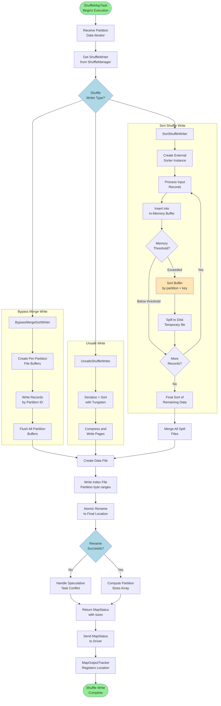

#### Shuffle Write Implementations

Apache Spark provides three shuffle writer implementations optimized for different scenarios:

**SortShuffleWriter (Default):**
- Used for most shuffle operations with or without aggregation
- Sorts records by partition ID and optionally by key
- Writes single data file per executor with index file for partition boundaries
- External sorter spills to disk when memory threshold exceeded
- Configurable via `spark.shuffle.sort.bypassMergeThreshold`

**BypassMergeSortShuffleWriter:**
- Optimization for shuffles with small partition counts (<= 200 default)
- Bypasses sorting step when no map-side aggregation needed
- Creates separate file per partition, merges into single file
- Reduces CPU overhead for simple partitioning operations
- Activated automatically based on partition count

**UnsafeShuffleWriter:**
- Tungsten-based shuffle using off-heap memory and pointer sorting
- Serializes records into compact binary format
- Sorts pointer array instead of full records for efficiency
- Requires serializer supporting relocation (Kryo or Java)
- Significant performance improvement for shuffle-heavy workloads

#### Shuffle Read Process (Reduce Side)

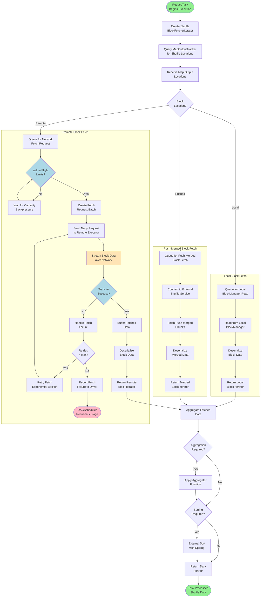

#### Backpressure Management

The shuffle fetch process implements backpressure to prevent memory exhaustion:

**In-Flight Limits:**
- `maxBytesInFlight`: Maximum total size of fetching blocks (48MB default)
- `maxReqsInFlight`: Maximum concurrent fetch requests (Int.MaxValue default)
- `maxBlocksInFlightPerAddress`: Limit per remote executor (Int.MaxValue default)

**Backpressure Algorithm:**
1. Before initiating fetch, check current in-flight bytes and requests
2. If limits exceeded, park fetcher thread until capacity available
3. When fetch completes, decrement in-flight counters
4. Wake waiting threads to resume fetching
5. Prevents OutOfMemoryError from unbounded concurrent fetches

#### Fetch Failure Recovery

**Failure Scenarios:**
- Network timeouts (`spark.network.timeout`, default 120s)
- Connection refused (executor died)
- Corrupted shuffle data (checksum mismatch)
- Missing shuffle files (disk failure, cleanup)

**Recovery Strategy:**
1. **Immediate Retry**: Retry fetch with exponential backoff (3 attempts default)
2. **Report to Driver**: If retries exhausted, report `FetchFailedException`
3. **Stage Resubmission**: DAGScheduler marks shuffle stage as failed
4. **Recompute Shuffle**: Rerun ShuffleMapTasks to regenerate lost shuffle data
5. **Resume Reduce Stage**: After shuffle data available, resume reduce tasks

#### Push-Based Shuffle Optimization

**Push-Merge Architecture:**
- Map tasks push shuffle blocks to external shuffle service during write
- External service merges blocks from same reduce partition
- Reduce tasks fetch pre-merged blocks, reducing connection count
- Configurable via `spark.shuffle.push.enabled`

**Performance Benefits:**
- Reduces reduce-side fetch connections (N*M to N for N mappers, M reducers)
- Eliminates stragglers from slow fetch operations
- Improves shuffle stability for large-scale jobs (1000+ reducers)
- Requires external shuffle service deployment

## 4.2 SYSTEM RELIABILITY WORKFLOWS

### 4.2.1 Heartbeat and Liveness Monitoring

The heartbeat system maintains liveness information between drivers and executors, enabling timely failure detection and resource management. This bidirectional health check mechanism ensures the driver can identify dead executors and executors can detect driver failures.

#### Heartbeat Communication Flow

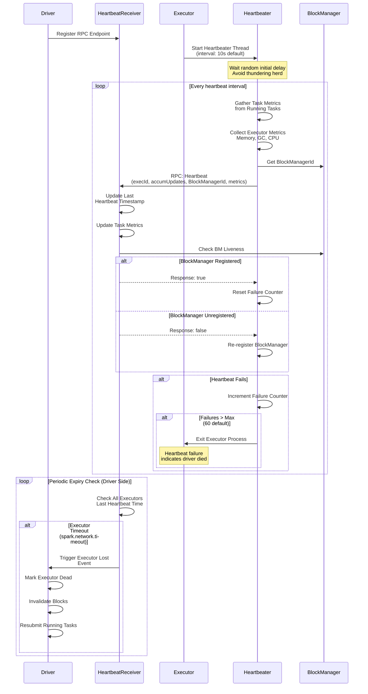

#### Heartbeat Interval Configuration

**Timing Parameters:**
- `spark.executor.heartbeatInterval`: Default 10 seconds, configurable for different latency requirements
- Lower interval: Faster failure detection, higher network overhead
- Higher interval: Reduced overhead, slower failure detection
- Recommendation: 10s for most workloads, 5s for critical low-latency applications

**Heartbeat Timeout Calculation:**
- Timeout = `spark.network.timeout` (default 120 seconds)
- Executor considered dead after missing 12 consecutive heartbeats (120s / 10s)
- Timeout must exceed multiple intervals to avoid false positives from transient issues

#### Executor Metrics Collection

Each heartbeat includes detailed executor metrics for monitoring:

**Memory Metrics:**
- JVM heap used and committed memory
- Off-heap memory usage (Tungsten allocations)
- Execution memory vs storage memory split
- Peak memory usage since last heartbeat

**GC Metrics:**
- Garbage collection time per GC generation (young, old)
- GC count per generation since last heartbeat
- Identifies excessive GC activity indicating memory pressure

**Executor Metrics (Optional):**
- CPU time used by executor
- Input/output metrics (bytes read/written)
- Shuffle metrics (bytes shuffled, spill metrics)
- Enabled via `spark.executor.metrics.pollingInterval`

#### Driver-Side Heartbeat Processing

**Metric Updates:**
1. Accumulator updates from tasks applied to job metrics
2. Executor memory metrics stored in `AppStatusStore`
3. BlockManager liveness updated in `BlockManagerMaster`
4. Metrics exposed through Spark UI and monitoring systems

**BlockManager Liveness Check:**
- Driver maintains registered BlockManagers
- Heartbeat response indicates if BlockManager recognized
- Unregistered BlockManager triggers re-registration sequence
- Ensures driver has current block location information

### 4.2.2 Failure Detection and Recovery

Apache Spark implements comprehensive failure recovery mechanisms at multiple levels, from individual task failures through complete stage resubmission to executor loss handling.

#### Task Failure Recovery Workflow

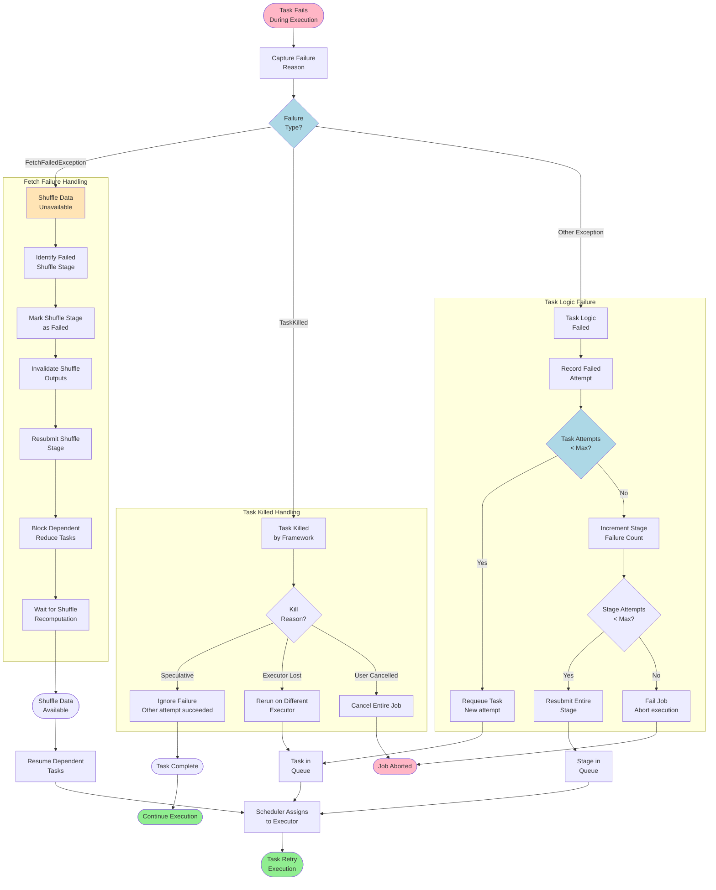

#### Retry Configuration Parameters

**Task-Level Retries:**
- `spark.task.maxFailures`: Default 4 for cluster mode, 1 for local mode
- Controls how many times a single task can fail before stage fails
- Higher values increase resilience to transient failures
- Lower values fail-fast for systemic issues

**Stage-Level Retries:**
- `spark.stage.maxConsecutiveAttempts`: Default 3
- Limits consecutive stage failures before job fails
- Prevents infinite retry loops for persistently failing stages
- Reset after successful stage completion

**Fetch Failure Retry:**
- Shuffle fetch failures trigger immediate stage resubmission
- No separate retry counter; controlled by stage attempts
- Failed shuffle stage recomputed entirely to regenerate data

#### Executor Loss Handling Workflow

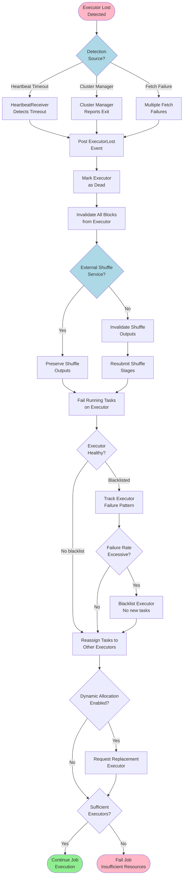

#### External Shuffle Service Benefits

**Shuffle Data Persistence:**
- Shuffle files written to external shuffle service instead of executor
- Shuffle data survives executor failures and restarts
- Reduces shuffle stage resubmissions significantly
- Essential for dynamic allocation with frequent executor scaling

**Configuration:**
- `spark.shuffle.service.enabled`: Enable external shuffle service
- `spark.dynamicAllocation.shuffleTracking.enabled`: Track shuffle without external service (Spark 3.0+)
- External service must be deployed on all worker nodes

#### Speculative Execution Workflow

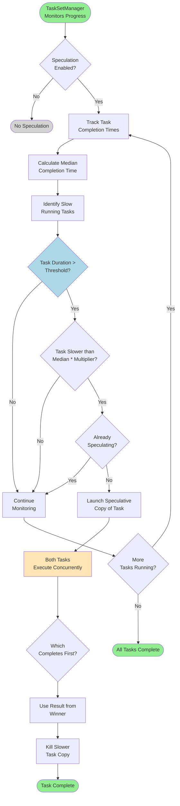

#### Speculative Execution Configuration

**Enabling Speculation:**
- `spark.speculation`: Default false, must enable explicitly
- `spark.speculation.interval`: Check interval (100ms default)
- `spark.speculation.multiplier`: Task must be slower than median * multiplier (1.5 default)
- `spark.speculation.quantile`: Fraction of tasks complete before speculation (0.75 default)

**Use Cases:**
- Heterogeneous cluster with variable node performance
- Tasks subject to OS-level resource contention
- Stragglers caused by disk I/O variability
- Not recommended for memory-intensive tasks (doubles memory usage)

**Cost-Benefit Analysis:**
- Pro: Reduces job completion time by mitigating stragglers
- Pro: Improves tail latency for interactive queries
- Con: Increases cluster resource usage
- Con: May mask underlying infrastructure issues requiring attention

## 4.3 SPECIALIZED PROCESSING WORKFLOWS

### 4.3.1 SQL Query Execution Pipeline

Spark SQL transforms declarative SQL queries through multiple optimization phases before generating executable RDD operations. This workflow demonstrates the Catalyst optimizer's query planning process and the Tungsten execution engine's code generation.

#### End-to-End Query Execution Flow

```mermaid
flowchart TB
    Start([SQL Query<br/>Submitted]) --> Parse[Parse SQL String<br/>ANTLR Parser]
    Parse --> ParseSuccess{Parse<br/>Success?}
    ParseSuccess -->|No| SyntaxError[/Syntax Error/<br/>Return to user/]
    ParseSuccess -->|Yes| UnresolvedPlan[Create Unresolved<br/>Logical Plan]
    
    UnresolvedPlan --> Analysis[Analysis Phase]
    
    subgraph "Analysis and Resolution"
        Analysis --> ResolveTables[Resolve Table Names<br/>from Catalog]
        ResolveTables --> ResolveColumns[Resolve Column<br/>References]
        ResolveColumns --> ResolveFunc[Resolve Functions<br/>and UDFs]
        ResolveFunc --> TypeCheck[Type Checking and<br/>Validation]
        TypeCheck --> AnalysisSuccess{Analysis<br/>Success?}
        AnalysisSuccess -->|No| AnalysisError[/Analysis Error/<br/>Unresolved references/]
        AnalysisSuccess -->|Yes| ResolvedPlan[Resolved Logical<br/>Plan]
    end
    
    ResolvedPlan --> Optimize[Logical Optimization]
    
    subgraph "Catalyst Optimizer - Rule Based"
        Optimize --> PredicatePush[Predicate Pushdown<br/>Move filters early]
        PredicatePush --> ConstantFold[Constant Folding<br/>Evaluate literals]
        ConstantFold --> ProjectPrune[Column Pruning<br/>Remove unused columns]
        ProjectPrune --> BooleanSimp[Boolean Simplification<br/>Optimize conditions]
        BooleanSimp --> CombineFilters[Combine Adjacent<br/>Filters]
        CombineFilters --> NullPropagation[Null Propagation<br/>Optimize null checks]
    end
    
    NullPropagation --> CostOptimize[Cost-Based Optimization]
    
    subgraph "Catalyst Optimizer - Cost Based"
        CostOptimize --> GatherStats[Gather Table/Column<br/>Statistics]
        GatherStats --> EstimateCard[Estimate Cardinality<br/>Per operator]
        EstimateCard --> JoinReorder[Join Reordering<br/>Minimize intermediates]
        JoinReorder --> SelectJoinType[Select Join Type<br/>Broadcast vs Shuffle]
    end
    
    SelectJoinType --> PhysicalPlan[Generate Physical<br/>Plans]
    PhysicalPlan --> SelectBest[Select Best Plan<br/>Based on cost]
    
    SelectBest --> CodeGen[Whole-Stage<br/>Code Generation]
    
    subgraph "Tungsten Execution Engine"
        CodeGen --> GenJava[Generate Java Code<br/>for Pipeline]
        GenJava --> CompileJanino[Compile with Janino<br/>to Bytecode]
        CompileJanino --> LoadClass[Load Generated<br/>Class]
        LoadClass --> CreateInstance[Instantiate Generated<br/>Class]
    end
    
    CreateInstance --> ConvertRDD[Convert to<br/>RDD Operations]
    ConvertRDD --> WrapSQL[Wrap in<br/>SQLExecutionRDD]
    
    WrapSQL --> AssignExecID[Assign Execution ID<br/>withNewExecutionId]
    AssignExecID --> PostStart[Post SQL Execution<br/>Start Event]
    PostStart --> ExecuteDAG[Execute RDD DAG<br/>via DAGScheduler]
    
    ExecuteDAG --> CollectResults[Collect Results<br/>to Driver]
    CollectResults --> PostEnd[Post SQL Execution<br/>End Event]
    PostEnd --> ReturnResults[Return Results<br/>to User]
    
    ReturnResults --> Complete([Query Complete])
    
    style Start fill:#90EE90
    style Complete fill:#90EE90
    style SyntaxError fill:#FFB6C6
    style AnalysisError fill:#FFB6C6
    style ParseSuccess fill:#ADD8E6
    style PredicatePush fill:#E6E6FA
    style CodeGen fill:#FFE4B5
```

#### Catalyst Optimizer Phases

**Phase 1: Analysis**
- Resolves table names against Hive metastore or temporary views
- Validates column references against table schemas
- Resolves function names and validates signatures
- Type checking ensures operators receive compatible types
- Results in fully resolved logical plan with all references bound

**Phase 2: Logical Optimization (Rule-Based)**
- **Predicate Pushdown**: Moves filter operations close to data sources to reduce data volume early
- **Column Pruning**: Removes unused columns from table scans, critical for columnar formats
- **Constant Folding**: Evaluates constant expressions at compile time
- **Boolean Simplification**: Optimizes complex boolean expressions
- **Null Propagation**: Optimizes operators that always produce null results

**Phase 3: Cost-Based Optimization**
- Requires table statistics collected via `ANALYZE TABLE` command
- Estimates operator cardinalities based on column histograms and distinct counts
- Reorders multi-way joins to minimize intermediate data sizes
- Selects broadcast vs shuffle join based on table sizes
- Configurable via `spark.sql.cbo.enabled` (default true)

**Phase 4: Physical Planning**
- Generates multiple physical plan candidates for logical plan
- Each physical plan specifies concrete operators (HashJoin, SortMergeJoin, etc.)
- Cost model selects lowest-cost plan based on estimated execution time
- Physical plan includes exchange operators for data shuffling

#### Whole-Stage Code Generation

**Code Generation Benefits:**
- Eliminates virtual function call overhead between operators
- Enables JIT compiler optimizations across operator boundaries
- Reduces CPU instruction count per row processed
- Delivers 2-10x performance improvement vs interpreted execution

**Generated Code Structure:**
```
Generated Scala Code (simplified):
class GeneratedIterator extends BufferedRowIterator {
  def processNext(): Unit = {
    while (input.hasNext) {
      val row = input.next()
      // Inlined filter + projection
      if (row.getInt(0) > 100) {
        val result = row.getInt(1) * 2
        writeResult(result)
      }
    }
  }
}
```

**Fallback Mechanism:**
- Some operators don't support code generation (complex UDFs, certain window functions)
- Falls back to interpreted execution for unsupported operators
- Mixed execution possible within single query plan

#### SQL Execution ID Tracking

**Execution ID Purpose:**
- Unique identifier for each query execution
- Propagates to all tasks via `TaskContext` local properties
- Enables UI correlation between SQL queries and Spark jobs
- Tracks configuration snapshot for consistent execution

**Configuration Propagation:**
- `SQLExecutionRDD` captures `SQLConf` at query planning time
- Applies captured config to executor-side tasks
- Ensures consistent behavior despite driver-side config changes
- Critical for long-running applications with dynamic config

### 4.3.2 Block Management and Storage

The BlockManager subsystem manages distributed data storage across executor memory and disk, implementing caching, replication, and eviction policies.

#### Block Storage Lifecycle

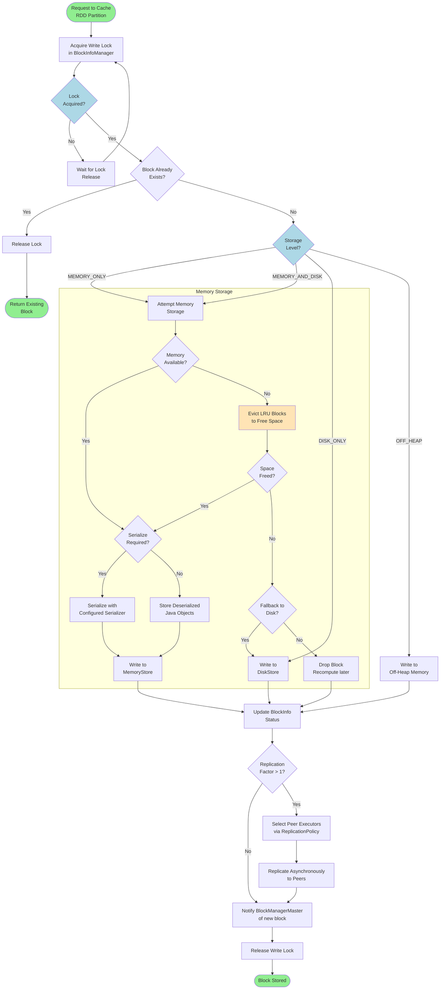

#### Memory Management and Eviction

**Unified Memory Management:**
- Total executor memory divided into execution and storage regions
- Dynamic boundary between regions allows borrowing
- Execution memory: Shuffles, sorts, joins, aggregations
- Storage memory: Cached RDDs, broadcast variables

**Memory Fractions:**
- `spark.memory.fraction`: Fraction of heap for Spark (default 0.6)
- Remaining 0.4 for user objects and internal metadata
- `spark.memory.storageFraction`: Initial storage fraction (default 0.5)
- Dynamic adjustment based on actual memory pressure

**LRU Eviction Policy:**
1. When memory full, identify least-recently-used blocks
2. Evict oldest blocks first to free space
3. If block is MEMORY_AND_DISK, write to disk before evicting
4. If block is MEMORY_ONLY, drop and recompute on next access
5. Execution memory can evict storage memory if needed

#### Block Replication Workflow

**Replication Policy:**
- Default: Select random peer from different host (topology-aware)
- Ensures fault tolerance across node failures
- Configurable via `spark.storage.replication.policy`

**Replication Process:**
1. After local block write, select N-1 peer executors (N = replication factor)
2. Initiate asynchronous replication to each peer
3. Peers write block to their local BlockManager
4. Each peer reports block location to master
5. Original executor continues without blocking on replication

**Replication Failure Handling:**
- Replication failures logged but don't fail original operation
- Block accessible from original executor despite replication failure
- Master tracks partial replication state
- Subsequent accesses may trigger re-replication attempts

#### Block Retrieval and Remote Fetch

```mermaid
sequenceDiagram
    participant Task
    participant LocalBM as Local BlockManager
    participant Master as BlockManagerMaster
    participant RemoteBM as Remote BlockManager
    participant Transfer as BlockTransferService
    
    Task->>LocalBM: getBlockData(blockId)
    LocalBM->>LocalBM: Check Local Storage
    
    alt Block Cached Locally
        LocalBM-->>Task: Return Local Block
    else Block Not Local
        LocalBM->>Master: getLocations(blockId)
        Master-->>LocalBM: Return Executor List
        
        LocalBM->>LocalBM: Select Closest Executor
        LocalBM->>Transfer: fetchBlockSync(blockId, remote)
        Transfer->>RemoteBM: Request Block
        
        RemoteBM->>RemoteBM: Read from Local Storage
        RemoteBM->>Transfer: Stream Block Data
        Transfer->>LocalBM: Receive Block Data
        
        alt Cache Locally
            LocalBM->>LocalBM: Cache with<br/>MEMORY_ONLY_2 level
        end
        
        LocalBM-->>Task: Return Fetched Block
    end
```

#### BlockManager Registration and Coordination

**Registration Process:**
1. Executor BlockManager starts and generates unique ID
2. Registers with BlockManagerMaster on driver
3. Master tracks executor ID, host, port, and topology information
4. Heartbeats maintain registration liveness

**Location Tracking:**
- Master maintains block ID → executor list mappings
- Updated when blocks added, removed, or replicated
- Enables tasks to locate blocks across cluster
- Critical for locality-aware scheduling and shuffle fetch

**Decommissioning:**
- When executor marked for removal, BlockManagerDecommissioner activates
- Migrates blocks to other executors before shutdown
- Prevents data loss and reduces recomputation overhead
- Configurable via `spark.storage.decommission.enabled`

## 4.4 INTEGRATION AND STATE MANAGEMENT

### 4.4.1 State Transition Diagrams

#### Job Lifecycle States

```mermaid
stateDiagram-v2
    [*] --> Submitted: User submits job
    Submitted --> Running: DAGScheduler creates stages
    Running --> Succeeded: All stages complete
    Running --> Failed: Stage failures exceed max
    Running --> Cancelled: User cancels job
    Failed --> [*]
    Succeeded --> [*]
    Cancelled --> [*]
    
    note right of Running
        Job tracks constituent stages
        Monitors overall progress
        Coordinates stage dependencies
    end note
    
    note right of Failed
        Occurs when stage retries exhausted
        Reports error to user
        Cleans up resources
    end note
```

#### Stage Lifecycle States

```mermaid
stateDiagram-v2
    [*] --> Waiting: Stage created, parents incomplete
    Waiting --> Running: Parent stages complete
    Running --> Complete: All tasks succeed
    Running --> Failed: Task failures exceed threshold
    Failed --> Waiting: Resubmitted for retry
    Complete --> [*]
    Failed --> [*]: Retries exhausted
    
    note right of Waiting
        Blocked on parent stage completion
        Waiting for shuffle data availability
        Tracked in waitingStages set
    end note
    
    note right of Running
        Tasks submitted to TaskScheduler
        Monitors task progress
        Handles task failures
    end note
```

#### Task Lifecycle States

```mermaid
stateDiagram-v2
    [*] --> PENDING: Task created
    PENDING --> RUNNING: Scheduled on executor
    RUNNING --> FINISHED: Success
    RUNNING --> FAILED: Task failure
    RUNNING --> KILLED: Killed by framework
    FAILED --> PENDING: Retry if attempts remain
    KILLED --> PENDING: Resubmit if executor lost
    FINISHED --> [*]
    FAILED --> [*]: Max attempts exceeded
    KILLED --> [*]: Speculative task
    
    note right of RUNNING
        Executing on executor
        Processing partition data
        Sending heartbeats
    end note
    
    note right of FAILED
        Exception during execution
        Fetch failure
        Out of memory
    end note
```

#### Executor Lifecycle States

```mermaid
stateDiagram-v2
    [*] --> Requested: Driver requests executor
    Requested --> Starting: Cluster manager allocates
    Starting --> Running: Executor registers with driver
    Running --> Decommissioning: Graceful shutdown initiated
    Running --> Lost: Heartbeat timeout or crash
    Decommissioning --> Exited: Blocks migrated, shutdown
    Lost --> [*]
    Exited --> [*]
    
    note right of Running
        Executing tasks
        Caching blocks
        Sending heartbeats
    end note
    
    note right of Decommissioning
        Migrating cached blocks
        Completing running tasks
        No new tasks assigned
    end note
```

### 4.4.2 Checkpoint and State Persistence

#### Streaming Checkpoint Workflow

```mermaid
flowchart TB
    Start([Streaming Query<br/>Started]) --> CheckCP{Checkpoint<br/>Location Set?}
    CheckCP -->|No| NoCheckpoint[/Checkpoint Required Error/<br/>Fail query/]
    CheckCP -->|Yes| InitCP[Initialize Checkpoint<br/>Directory]
    
    InitCP --> WriteMeta[Write Query Metadata<br/>Sources, config, plan]
    WriteMeta --> StartQuery[Start Query<br/>Execution]
    
    StartQuery --> ProcessBatch[Process Micro-Batch]
    ProcessBatch --> CommitOffset[Commit Offset to<br/>Checkpoint]
    CommitOffset --> WriteState[Write State Store<br/>Updates]
    
    WriteState --> CheckInterval{Checkpoint<br/>Interval?}
    CheckInterval -->|Not yet| ProcessBatch
    CheckInterval -->|Yes| WriteCheckpoint[Write Full Checkpoint<br/>Metadata + State]
    
    WriteCheckpoint --> CleanOld[Clean Old Checkpoint<br/>Files]
    CleanOld --> ProcessBatch
    
    ProcessBatch --> CheckFailure{Query<br/>Fails?}
    CheckFailure -->|No| ProcessBatch
    CheckFailure -->|Yes| Recovery([Restart from<br/>Checkpoint])
    
    Recovery --> ReadMeta[Read Query Metadata<br/>from Checkpoint]
    ReadMeta --> RestoreState[Restore State Store<br/>from Checkpoint]
    RestoreState --> SeekOffset[Seek Sources to<br/>Last Committed Offset]
    SeekOffset --> ResumeQuery[Resume Query<br/>Execution]
    ResumeQuery --> ProcessBatch
    
    style Start fill:#90EE90
    style NoCheckpoint fill:#FFB6C6
    style Recovery fill:#FFE4B5
    style CheckInterval fill:#ADD8E6
```

#### RDD Checkpoint Mechanism

**Checkpoint Purpose:**
- Truncates long RDD lineage chains to bound recovery time
- Prevents stack overflow from deep lineage graphs (1000+ transformations)
- Essential for iterative algorithms (machine learning, graph processing)
- Optional for most batch workloads

**Checkpoint Process:**
1. User calls `rdd.checkpoint()` to mark RDD for checkpointing
2. On first action, RDD computed and written to reliable storage
3. Lineage references to parent RDDs removed
4. Future operations reference checkpoint file instead of recomputing
5. Checkpoint files persist beyond application lifetime

**Storage Location:**
- Must use reliable distributed storage (HDFS, S3, GCS)
- Configured via `SparkContext.setCheckpointDir(path)`
- Files organized by RDD ID for easy identification
- Automatic cleanup requires manual implementation

### 4.4.3 Configuration Management and Propagation

#### Configuration Inheritance Model

```mermaid
flowchart TB
    Start([Application Start]) --> LoadDefaults[Load Default<br/>Configuration]
    LoadDefaults --> ReadSpark[Read spark-defaults.conf<br/>if present]
    ReadSpark --> ParseCLI[Parse spark-submit<br/>CLI Arguments]
    ParseCLI --> AppCode[Load SparkConf<br/>from Application Code]
    
    AppCode --> Merge[Merge Configurations<br/>Priority: Code > CLI > File > Defaults]
    Merge --> Validate[Validate Configuration<br/>Type checking]
    
    Validate --> CreateContext[Create SparkContext<br/>with Merged Config]
    CreateContext --> BroadcastConf[Broadcast Configuration<br/>to Executors]
    
    BroadcastConf --> ExecInit[Executor Initialization]
    ExecInit --> ApplyConf[Apply Configuration<br/>to Executor Environment]
    
    ApplyConf --> TaskExec[Task Execution]
    TaskExec --> InheritLocal[Inherit Local Properties<br/>from TaskContext]
    InheritLocal --> Complete([Task Runs with<br/>Complete Config])
    
    style Start fill:#90EE90
    style Complete fill:#90EE90
    style Merge fill:#FFE4B5
```

**Configuration Priority (Highest to Lowest):**
1. Application code: `new SparkConf().set(...)`
2. CLI flags: `spark-submit --conf spark.key=value`
3. Properties file: `spark-defaults.conf`
4. System defaults: Hard-coded in Spark source

**Local Properties:**
- Set per-thread via `SparkContext.setLocalProperty(key, value)`
- Propagate to tasks launched from that thread
- Enable SQL execution ID tracking
- Used for job grouping and UI organization

## 4.5 TIMING AND SLA CONSIDERATIONS

### 4.5.1 Performance Configuration Parameters

The following table summarizes critical timing parameters that affect workflow performance and reliability:

| Configuration Parameter | Default Value | Impact | Tuning Guidance |
|------------------------|---------------|--------|-----------------|
| `spark.executor.heartbeatInterval` | 10s | Executor liveness detection latency | Lower (5s) for critical applications; higher (30s) for stable clusters |
| `spark.network.timeout` | 120s | RPC timeout for all network operations | Increase for slow networks or large shuffles |
| `spark.executor.heartbeat.maxFailures` | 60 | Missed heartbeats before executor kill | Increase for unstable networks; decrease for fast failure detection |
| `spark.task.maxFailures` | 4 | Task retry limit before stage failure | Increase for transient failures; decrease to fail-fast |
| `spark.stage.maxConsecutiveAttempts` | 3 | Stage retry limit before job failure | Increase for flaky infrastructure; decrease to prevent wasted compute |
| `spark.locality.wait` | 3s | Wait time for data-local task scheduling | Increase for better locality; decrease for faster scheduling |
| `spark.locality.wait.node` | `spark.locality.wait` | Wait time for node-local scheduling | Tune separately if node locality differs from process locality value |
| `spark.locality.wait.rack` | `spark.locality.wait` | Wait time for rack-local scheduling | Tune separately for rack-aware deployments |
| `spark.scheduler.revive.interval` | 1s | Interval to check for new tasks | Lower for latency-sensitive applications |
| `spark.shuffle.io.maxRetries` | 3 | Shuffle fetch retry attempts | Increase for unreliable networks |
| `spark.shuffle.io.retryWait` | 5s | Wait between shuffle fetch retries | Increase for transient network issues |
| `spark.speculation` | false | Enable speculative execution | Enable for heterogeneous clusters with stragglers |
| `spark.speculation.interval` | 100ms | Check interval for speculative tasks | Lower for faster speculation; higher to reduce overhead |
| `spark.speculation.multiplier` | 1.5 | Threshold for task speculation (median * multiplier) | Increase to speculate less aggressively |
| `spark.dynamicAllocation.executorIdleTimeout` | 60s | Idle executor timeout for dynamic allocation | Decrease to scale down faster; increase for burst workloads |
| `spark.dynamicAllocation.schedulerBacklogTimeout` | 1s | Time before requesting new executors | Decrease for faster scale-up; increase to reduce churn |

### 4.5.2 Workflow Timing Characteristics

**Driver Initialization:**
- Typical duration: 5-15 seconds for cluster deployments
- Factors: Cluster manager communication, executor allocation, UI startup
- Optimization: Pre-allocate executors, disable UI for batch jobs

**Job Submission:**
- Typical duration: 100-500ms for complex DAGs
- Factors: Lineage traversal depth, stage count, shuffle dependencies
- Optimization: Minimize transformation chain depth, cache intermediate results

**Task Scheduling:**
- Typical duration: 10-100ms per task launch
- Factors: Locality wait time, serialization size, executor availability
- Optimization: Increase parallelism, reduce task serialization size

**Shuffle Operations:**
- Typical duration: Seconds to minutes depending on data volume
- Factors: Shuffle data size, network bandwidth, disk I/O, reducer count
- Optimization: Enable push-based shuffle, tune buffer sizes, compression codec

**Failure Recovery:**
- Task failure: Immediate retry (milliseconds)
- Stage failure: Recomputation time (seconds to minutes)
- Executor loss: Heartbeat timeout (120s default) + task reassignment
- Optimization: Enable external shuffle service, reduce heartbeat timeout

## 4.6 REFERENCES

### 4.6.1 Source Code References

**Core Execution Workflows:**
- `core/src/main/scala/org/apache/spark/SparkContext.scala` (lines 409-700) - Driver initialization sequence
- `core/src/main/scala/org/apache/spark/SparkEnv.scala` - Environment setup and component assembly
- `core/src/main/scala/org/apache/spark/scheduler/DAGScheduler.scala` (lines 58-123, 800-982) - Job submission and stage creation
- `core/src/main/scala/org/apache/spark/scheduler/TaskScheduler.scala` - Task scheduling interface
- `core/src/main/scala/org/apache/spark/scheduler/TaskSchedulerImpl.scala` - Task scheduling implementation
- `core/src/main/scala/org/apache/spark/executor/Executor.scala` (lines 75-300) - Task execution lifecycle

**Shuffle Subsystem:**
- `core/src/main/scala/org/apache/spark/shuffle/` - Shuffle manager and writer implementations
- `core/src/main/scala/org/apache/spark/storage/ShuffleBlockFetcherIterator.scala` - Shuffle fetch logic
- `core/src/main/scala/org/apache/spark/scheduler/MapOutputTracker.scala` - Shuffle metadata management

**Storage and Block Management:**
- `core/src/main/scala/org/apache/spark/storage/BlockManager.scala` - Distributed storage management
- `core/src/main/scala/org/apache/spark/storage/BlockInfoManager.scala` - Block locking and tracking
- `core/src/main/scala/org/apache/spark/storage/memory/MemoryStore.scala` - In-memory storage
- `core/src/main/scala/org/apache/spark/storage/DiskStore.scala` - Disk-based storage

**Heartbeat and Monitoring:**
- `core/src/main/scala/org/apache/spark/HeartbeatReceiver.scala` - Driver-side heartbeat processing
- `core/src/main/scala/org/apache/spark/Heartbeater.scala` - Executor-side heartbeat emission
- `core/src/main/scala/org/apache/spark/executor/ExecutorMetrics.scala` - Metrics collection

**SQL Execution:**
- `sql/catalyst/` - Catalyst query optimizer implementation
- `sql/core/src/main/scala/org/apache/spark/sql/execution/` - Physical plan execution
- `sql/core/src/main/scala/org/apache/spark/sql/execution/SQLExecution.scala` - Execution ID tracking

**Failure Recovery:**
- `core/src/main/scala/org/apache/spark/scheduler/DAGSchedulerEvent.scala` - Failure event vocabulary
- `core/src/main/scala/org/apache/spark/scheduler/TaskState.scala` - Task state enumeration
- `streaming/src/main/scala/org/apache/spark/streaming/Checkpoint.scala` - Streaming checkpoint implementation

**State Management:**
- `core/src/main/scala/org/apache/spark/scheduler/ActiveJob.scala` - Job lifecycle tracking
- `core/src/main/scala/org/apache/spark/scheduler/Stage.scala` - Stage abstraction and attempts
- `core/src/main/scala/org/apache/spark/rdd/RDD.scala` - RDD lineage and dependencies

### 4.6.2 Configuration Documentation

All timing and performance parameters documented in this section can be found in:
- `docs/configuration.md` - Complete configuration reference
- `docs/tuning.md` - Performance tuning guidelines
- `docs/monitoring.md` - Metrics and monitoring configuration

### 4.6.3 Related Technical Specification Sections

- **Section 1.2 System Overview**: Provides architectural context for workflows documented here
- **Section 2.1 Feature Catalog**: Documents features (F-001 through F-010) that these workflows implement
- **Section 2.2 Functional Requirements**: Defines requirements that these workflows satisfy
- **Section 3.x Technology Stack**: Details technologies referenced in workflow implementations

# 5. System Architecture

## 5.1 High-Level Architecture

### 5.1.1 System Overview

Apache Spark implements a **master-worker distributed computing architecture** with a centralized Driver-Executor coordination model. This architectural pattern enables whole-query optimization through complete DAG visibility while distributing computational workload across cluster resources. The system embraces lazy evaluation semantics, lineage-based fault tolerance, and in-memory computing with flexible persistence strategies to deliver high-performance distributed data processing.

#### Architectural Style and Rationale

**Master-Worker with Centralized Coordination**

The architecture employs a Driver program as the master coordinator and multiple Executor processes as distributed workers. This centralized coordination model provides several strategic advantages:

- **Global Optimization Capability**: The Driver maintains complete visibility of the computation graph (DAG), enabling whole-query optimization impossible in peer-to-peer architectures. The DAGScheduler can perform pipeline fusion, predicate pushdown, projection pruning, and join reordering across the entire workload.

- **Resource Management Efficiency**: Centralized scheduling enables intelligent task placement based on data locality, executor availability, and resource constraints. The TaskScheduler implements multi-level locality preferences (PROCESS_LOCAL, NODE_LOCAL, RACK_LOCAL, ANY) to minimize data movement.

- **Fault Tolerance Simplification**: The Driver tracks RDD lineage and stage dependencies, enabling automatic recomputation of lost partitions without complex distributed consensus protocols. This approach reduces fault tolerance overhead compared to checkpoint-heavy systems.

The Driver hosts the SparkContext, which serves as the main entry point for all Spark functionality. During initialization, the Driver validates configuration, creates the runtime environment via SparkEnv, starts the BlockManager and network services, selects the appropriate scheduler backend, constructs the DAGScheduler, wires the monitoring UI, and initializes broadcast and accumulator subsystems (as evidenced in `core/src/main/scala/org/apache/spark/SparkContext.scala`).

Executor processes execute tasks assigned by the Driver, store computation results in memory or disk, provide in-memory storage for cached RDDs, and report heartbeat and metrics back to the Driver. Each executor maintains a fixed thread pool sized according to `spark.executor.cores` configuration, preventing resource exhaustion from unlimited task parallelism.

#### Key Architectural Principles

**1. Lazy Evaluation with DAG Optimization**

Spark employs lazy evaluation semantics where transformations (map, filter, join) build a logical execution plan without processing data, while actions (collect, count, save) trigger execution with whole-query optimization. This approach enables the DAGScheduler to analyze the complete computation graph and apply optimization passes that eliminate redundant operations, reorder transformations, and fuse stages.

The DAGScheduler implements this by translating RDD lineage into stages, tracking cached partitions, computing preferred task placement, serializing and broadcasting task closures, submitting TaskSets to the TaskScheduler, managing job and stage lifecycle, and handling failure recovery (as implemented in `core/src/main/scala/org/apache/spark/scheduler/DAGScheduler.scala`).

**2. In-Memory Computing with Flexible Persistence**

The BlockManager provides a sophisticated memory hierarchy comprising execution memory (for shuffles, sorts, joins, aggregations), storage memory (for cached RDDs and broadcast variables), off-heap memory (bypassing JVM garbage collection), and disk spillage (automatic overflow when memory exhausted). Configurable persistence strategies (MEMORY_ONLY, MEMORY_AND_DISK, MEMORY_ONLY_SER, OFF_HEAP, DISK_ONLY) balance performance and resource utilization.

The BlockManager implementation in `core/src/main/scala/org/apache/spark/storage/BlockManager.scala` manages storage, retrieval, replication, and lifecycle of blocks including RDD partitions, broadcast variables, and shuffle data. It integrates with BlockManagerMaster for registration and status reporting, BlockTransferService for network transfers, and ShuffleManager for shuffle data access.

**3. Lineage-Based Fault Tolerance**

Rather than checkpointing intermediate results, Spark tracks computation lineage where each RDD maintains references to parent RDDs and the transformation that produced it. This forms a directed acyclic graph (lineage graph) from source data to current state. When a partition is lost, lineage enables automatic recomputation.

The system distinguishes between narrow dependencies (transformations like map where each parent partition contributes to at most one child partition, enabling parallel recovery) and wide dependencies (transformations like groupByKey requiring shuffle, where partition loss requires recomputing multiple parent partitions). Optional checkpointing truncates long lineage chains to bound recovery time.

**4. Pluggable Component Architecture**

The system embraces extensibility through well-defined interfaces:

- **Cluster Manager Abstraction**: The SchedulerBackend interface enables multiple resource managers (Standalone, YARN, Kubernetes) sharing a common Driver-Executor protocol. Implementations are located in `resource-managers/kubernetes/` and `resource-managers/yarn/`.

- **DataSource API**: Custom data sources implement read/write interfaces with predicate pushdown and column pruning exposed through the API. Built-in sources (Parquet, ORC, JDBC) and external sources use the same mechanism.

- **Serialization Pluggability**: Default Java serialization provides compatibility, while Kryo serialization (4.0.3) offers performance for critical paths, with custom serializers for domain-specific types.

#### System Boundaries and Major Interfaces

**External Boundaries:**

- **Cluster Resource Managers**: Integration points with Standalone Manager, Apache YARN, and Kubernetes through the SchedulerBackend abstraction
- **Storage Systems**: Hadoop FileSystem API provides access to HDFS, Amazon S3, Google Cloud Storage, Azure Blob Storage, and local filesystems
- **Streaming Sources**: Apache Kafka (3.9.1) and Amazon Kinesis integration through specialized connectors in `connector/kafka-0-10/` and `connector/kinesis-asl/`
- **Metadata Services**: Hive Metastore integration (Hive 2.3.10) for table metadata discovery and schema management
- **Client Applications**: Spark Connect provides gRPC-based (1.67.1) remote connectivity for thin clients via `sql/connect/`

**Internal Interfaces:**

- **RPC Framework**: Netty-backed RpcEnv (4.2.7.Final) provides asynchronous communication between Driver and Executors, implemented in `common/network-common/`
- **Block Transfer**: BlockTransferService enables shuffle data and block replication over network using NettyBlockTransferService
- **Serialization Layer**: SerializerManager abstracts Java and Kryo serialization for data and task closure transmission
- **Memory Management**: UnifiedMemoryManager dynamically allocates between execution and storage memory with configurable fractions

### 5.1.2 Core Components

| Component Name | Primary Responsibility | Key Dependencies | Integration Points | Critical Considerations |
|----------------|------------------------|------------------|-------------------|------------------------|
| SparkContext | Main entry point and job coordinator | SparkEnv, DAGScheduler, TaskScheduler, UI | User applications, all Spark modules | Single active context per JVM in standard mode; driver bottleneck at very large scale |
| SparkEnv | Runtime environment container | RpcEnv, BlockManager, MetricsSystem, SecurityManager | Created for both driver and executors | Holds all runtime objects; failure impacts entire process |
| DAGScheduler | High-level stage-oriented scheduler | TaskScheduler, MapOutputTracker, BlockManagerMaster | Converts RDD lineage to stages | Single-threaded event loop; maintains global job/stage state |
| TaskScheduler | Low-level task scheduler | SchedulerBackend, ExecutorAllocationManager | Receives TaskSets from DAGScheduler | Implements locality-aware placement; coordinates with cluster manager |
| BlockManager | Storage management | BlockTransferService, MemoryStore, DiskStore | All components storing data | Memory pressure management; replication for fault tolerance |
| MapOutputTracker | Shuffle location tracking | RpcEnv, BroadcastManager | DAGScheduler, shuffle operations | Master-worker split; epoch-based cache invalidation |
| Catalyst Optimizer | Query optimization framework | Execution engine, DataSource API | SQL module, DataFrame operations | Rule-based and cost-based optimization; generates physical plans |
| ExecutorAllocationManager | Dynamic resource allocation | TaskScheduler, cluster manager | Optional component for elasticity | Locality-aware executor requests and decommissioning |

### 5.1.3 Data Flow Description

#### Primary Data Flows

**Job Submission Flow**

When a user invokes an action (collect, count, save), the SparkContext validates partition IDs, generates a unique job ID, creates a JobWaiter future for results, and posts a JobSubmitted event to the DAGScheduler. The DAGScheduler's event loop receives the submission, creates an ActiveJob instance, and traverses the RDD lineage backward from the final RDD.

During traversal, the scheduler identifies dependency types: narrow dependencies (map, filter, union) pipeline into a single stage, while wide dependencies (groupByKey, join, reduceByKey) create stage boundaries requiring data shuffle. The DAGScheduler constructs a stage DAG, updates state maps (jobIdToStageIds, stageIdToStage, shuffleIdToMapStage), and checks if parent stages are complete. Stages with incomplete parents are added to waitingStages, while ready stages are submitted for execution.

**Shuffle Data Flow**

Shuffle operations redistribute data across executors through a two-phase process:

*Map Phase (Write):* ShuffleMapTasks receive partition data iterators and obtain a ShuffleWriter from the ShuffleManager. The SortShuffleWriter (default implementation) creates an External Sorter, processes input records by inserting into an in-memory buffer, and spills to disk when memory thresholds are exceeded. After processing all records, it performs a final sort, merges all spill files, creates a data file with an index file containing partition byte ranges, and atomically renames to the final location. The task computes partition sizes and sends MapStatus to the Driver, which updates the MapOutputTracker with location information (as implemented in shuffle write logic detailed in `core/src/main/scala/org/apache/spark/scheduler/`).

*Reduce Phase (Read):* Reduce tasks create a ShuffleBlockFetcherIterator and query MapOutputTracker for shuffle locations. The system splits blocks into local (read from local BlockManager), remote (network fetch), and pushed (fetch from external shuffle service for push-based shuffle). Local reads deserialize block data directly, while remote fetches implement backpressure (maxBytesInFlight: 48MB default, maxReqsInFlight: unlimited) to prevent memory exhaustion. Failed fetches retry with exponential backoff (3 attempts default), and exhausted retries report FetchFailedException to the Driver, which triggers stage resubmission. After fetching, the system aggregates data if required and performs external sorting with spilling before returning the data iterator to the task (as detailed in shuffle read implementation).

**Block Storage Flow**

*Put Operation:* Applications invoke BlockManager.put(), which acquires a write lock via BlockInfoManager, attempts MemoryStore.put() first, and falls back to DiskStore.put() if memory is unavailable. The BlockManager reports the block to BlockManagerMaster, initiates replication if configured (using the replicate method that transfers blocks to peer executors), and releases the lock.

*Get Operation:* Applications invoke BlockManager.get(), which checks the local MemoryStore first, then the local DiskStore (optionally caching the result), queries BlockManagerMaster for remote locations if not found locally, fetches from a remote BlockManager via BlockTransferService, and optionally caches locally before returning (as implemented in `core/src/main/scala/org/apache/spark/storage/BlockManager.scala`).

#### Integration Patterns and Protocols

**RPC Communication:** Netty-based RpcEnv provides asynchronous I/O for control messages using custom binary protocols. The TransportContext, TransportServer, and TransportClient classes implement the communication layer with SASL authentication support (`common/network-common/src/main/java/org/apache/spark/network/sasl/`).

**Data Transfer:** BlockTransferService uses NettyBlockTransferService for large data transfers (shuffle blocks, block replication) with zero-copy transfer via Netty direct buffers. The External Shuffle Service provides executor-independent shuffle data storage for improved stability.

**SQL Execution:** Catalyst optimizer transforms logical plans to optimized physical plans using rule-based and cost-based optimization. The Tungsten execution engine implements whole-stage code generation, compiling query plans to JVM bytecode. DataSource API integration enables predicate pushdown and column pruning to storage formats.

**Spark Connect:** gRPC with Protocol Buffers provides remote connectivity, supporting streaming RPC for incremental result transmission, HTTP/2 transport with multiplexing, and language-agnostic protocol for thin clients (`sql/connect/` and `python/pyspark/sql/connect`).

#### Data Transformation Points

**Serialization Boundaries:** Task closures serialize at Driver before network transmission to Executors. Shuffle data serializes during write and deserializes during read. Broadcast variables serialize once at Driver and deserialize at each Executor. Cache persistence may use serialized or deserialized formats based on storage level.

**Shuffle Boundaries:** Wide dependencies (groupByKey, reduceByKey, join) create shuffle boundaries where data partitions redistribute across executors. The system writes shuffle files to local disk, registers locations with MapOutputTrackerMaster, and enables remote executors to fetch data via BlockTransferService.

**Memory-Disk Boundaries:** BlockManager automatically spills from memory to disk when storage memory fills. External sorters spill intermediate sort results to disk during shuffle operations. Cached RDDs with MEMORY_AND_DISK storage level spill to disk when memory is insufficient.

#### Key Data Stores and Caches

| Store/Cache | Purpose | Location | Persistence | Eviction Policy |
|-------------|---------|----------|-------------|-----------------|
| MemoryStore | In-memory block storage | Each Executor | Volatile | LRU based on storage memory limits |
| DiskStore | Disk-based block storage | Local executor disk | Survives executor restarts | Manual cleanup on application end |
| Shuffle Files | Map task outputs | Local executor disk | Until application ends | Deleted after application completes |
| MapOutputTracker Cache | Shuffle location metadata | Driver memory | Volatile | Epoch-based invalidation on failures |
| Broadcast Variables | Read-only shared data | Driver + Executor memory | Cached until unpersisted | Manual unpersist or application end |
| RDD Lineage | Computation graph | Driver memory | Volatile | Retained for active RDDs only |

### 5.1.4 External Integration Points

| System Name | Integration Type | Data Exchange Pattern | Protocol/Format | SLA Requirements |
|-------------|------------------|----------------------|-----------------|------------------|
| Apache Kafka 3.9.1 | Streaming Source/Sink | Pull-based consumption, Push-based production | Kafka protocol, Avro/JSON/Protobuf | Exactly-once semantics with idempotent producer |
| Amazon Kinesis | Streaming Source | Pull-based with checkpointing | Kinesis Client Library | At-least-once delivery with deduplication |
| HDFS 3.4.2 | Distributed Storage | Read/write via FileSystem API | HDFS protocol | High availability with replication |
| Apache YARN | Resource Manager | Cluster resource allocation | YARN protocol | ApplicationMaster availability |
| Kubernetes | Resource Manager | Container orchestration | Kubernetes API | Pod scheduling and recovery |
| Hive Metastore 2.3.10 | Metadata Service | Table metadata queries | Thrift protocol | Metastore availability for catalog operations |
| S3/GCS/Azure Storage | Cloud Object Storage | Read/write via FileSystem API | HTTP REST APIs | Cloud provider SLAs |
| External Shuffle Service | Shuffle Data Provider | Block fetch requests | Netty custom protocol | Service availability for shuffle stability |
| Prometheus | Metrics Export | Scraping metrics endpoint | Prometheus text format | Metrics freshness (15s typical) |
| JDBC Databases | Data Source/Sink | SQL queries and writes | JDBC protocol | Database availability and performance |

## 5.2 Component Details

### 5.2.1 Driver Components

#### SparkContext: Application Entry Point

**Purpose and Responsibilities:**

The SparkContext serves as the primary entry point for all Spark functionality, coordinating distributed computation and managing application lifecycle. It initializes the execution environment, submits jobs to the DAGScheduler, and provides APIs for creating RDDs and accessing Spark services.

**Technologies and Frameworks:**
- Scala 2.13.17 implementation
- Netty 4.2.7.Final for RPC communication
- Hadoop 3.4.2 APIs for storage integration
- Jetty 11.0.26 for web UI hosting

**Key Interfaces and APIs:**

The SparkContext exposes methods for RDD creation (parallelize, textFile, objectFile), job submission (runJob, submitJob), resource management (stop, addJar, addFile), and service access (broadcast, accumulator, statusTracker). Initialization validates SparkConf for required parameters (master URL, application name), creates the driver environment via SparkEnv, starts BlockManager and network services, selects the scheduler backend based on master URL pattern, constructs the DAGScheduler, wires the UI and LiveListenerBus, registers ContextCleaner, and initializes broadcast and accumulator subsystems (as implemented in `core/src/main/scala/org/apache/spark/SparkContext.scala`).

**Data Persistence Requirements:**

The SparkContext maintains in-memory state including active jobs and stages, registered RDDs and their persistence levels, broadcast variables, and accumulator values. This state is volatile and lost on driver failure unless checkpoint recovery is configured.

**Scaling Considerations:**

At very large scale (10,000+ executors), the SparkContext can become a bottleneck due to centralized coordination overhead. Mitigation strategies include event bus batching, metrics aggregation, and increased driver memory. Dynamic allocation helps by scaling executors based on workload rather than maintaining fixed large clusters.

#### SparkEnv: Runtime Environment Container

**Purpose and Responsibilities:**

SparkEnv holds all runtime environment objects for both driver and executor processes, serving as the central registry for core services. It provides a consistent environment abstraction across deployment modes.

**Core Services Assembled:**

The SparkEnv creates and wires together: RpcEnv for communication framework, SerializerManager for data serialization, MapOutputTracker (Master for driver, Worker for executors) for shuffle coordination, BroadcastManager for broadcast variable management, BlockManager for storage management, MetricsSystem for performance monitoring, OutputCommitCoordinator for commit coordination, SecurityManager for security policies, MemoryManager (UnifiedMemoryManager) for memory allocation, and ShuffleManager for shuffle operations. Service creation follows dependency order, with RpcEnv initialized first to enable inter-service communication (as implemented in `core/src/main/scala/org/apache/spark/SparkEnv.scala`).

**Technologies and Frameworks:**
- Netty 4.2.7.Final for RpcEnv implementation
- Kryo 4.0.3 for optional serialization
- Dropwizard Metrics 4.2.33 for MetricsSystem

**Key Interfaces:**

SparkEnv provides access methods for each service (e.g., env.blockManager, env.rpcEnv, env.metricsSystem). The singleton pattern ensures one SparkEnv per JVM process. Lifecycle methods include createDriverEnv and createExecutorEnv for role-specific initialization.

**Scaling Considerations:**

SparkEnv scales with the number of driver and executor processes. Each executor maintains its own SparkEnv instance with local services. The driver's SparkEnv coordinates with executor instances via RPC.

#### DAGScheduler: Stage-Oriented Job Scheduler

**Purpose and Responsibilities:**

The DAGScheduler implements high-level, stage-oriented job scheduling by translating RDD lineage into execution stages, tracking cached partitions, computing preferred task placement, and managing failure recovery. It operates as the bridge between application-level RDD operations and low-level task execution.

**Key Operations:**

The scheduler handles job submission by creating ActiveJob instances, stage creation by analyzing RDD dependencies and identifying shuffle boundaries, stage management through waitingStages, runningStages, and failedStages sets, task generation for each stage with locality preferences, failure handling including fetch failures (triggering stage resubmission), executor loss (recomputing lost partitions), and task failures (with configurable retry), and event processing through a single-threaded event loop (DAGSchedulerEventProcessLoop) ensuring thread safety.

**Technologies and Frameworks:**
- Scala collections for state management
- RPC framework for TaskScheduler communication
- Closures serialization (Java or Kryo)

**State Management:**

The DAGScheduler maintains several critical data structures: jobIdToStageIds maps each job to constituent stages, stageIdToStage provides a global registry of all stage instances, shuffleIdToMapStage maps shuffle IDs to producing stages for data location, waitingStages contains stages blocked on parent completion, runningStages tracks currently executing stages, failedStages holds failed stages awaiting retry, cacheLocs stores cached RDD partition locations with synchronized access, and executorFailureEpoch tracks executor failures for recovery coordination (as detailed in `core/src/main/scala/org/apache/spark/scheduler/DAGScheduler.scala`).

**Concurrency Model:**

A single-threaded event loop processes all DAGScheduler events sequentially, eliminating race conditions in state updates. Asynchronous events (JobSubmitted, TaskSetFailed, ExecutorLost) queue for processing, ensuring serialized state modifications.

**Scaling Considerations:**

The DAGScheduler scales to very large job graphs (thousands of stages) through efficient data structures and lazy evaluation. State cleanup on job completion prevents memory leaks. For extremely complex DAGs, checkpoint truncation of long lineages reduces metadata overhead.

#### TaskScheduler: Low-Level Task Scheduler

**Purpose and Responsibilities:**

The TaskScheduler implements low-level task scheduling, receiving TaskSets from the DAGScheduler, launching tasks on executors with locality awareness, tracking task execution and resource utilization, and reporting task completion and failures. It bridges the gap between logical stages and physical execution.

**Key Interfaces:**

The TaskScheduler exposes submitTasks for receiving TaskSets from DAGScheduler, statusUpdate for task state changes from executors, executorLost for handling executor failures, and defaultParallelism for determining default partition counts. It integrates with SchedulerBackend for executor management and ExecutorAllocationManager for dynamic allocation.

**Technologies and Frameworks:**
- Pluggable SchedulerBackend implementations (LocalSchedulerBackend, StandaloneSchedulerBackend, YarnSchedulerBackend, KubernetesSchedulerBackend)
- Scheduling pools (FIFO or FAIR) for multi-tenant workload prioritization

**Locality Preference Algorithm:**

The scheduler implements a multi-level locality preference system: PROCESS_LOCAL (task and data in same executor JVM) for cached RDD partitions, NODE_LOCAL (task and data on same physical node) for local disk reads, RACK_LOCAL (task and data in same rack) for reduced network hops, and ANY (task scheduled regardless of data location) for full network transfer. The default wait time is 3 seconds per locality level (`spark.locality.wait`), with the scheduler delaying task assignment to wait for better locality offers. After timeout expiration, it accepts the next lower locality level, preventing indefinite blocking while optimizing for data locality.

**Scaling Considerations:**

The TaskScheduler scales to tens of thousands of concurrent tasks through efficient task queuing and locality computation. Backpressure mechanisms prevent overwhelming executors with too many tasks. Speculation (launching duplicate tasks for stragglers) improves job completion time in heterogeneous environments.

```mermaid
graph TB
    subgraph "Driver Process"
        SC[SparkContext<br/>Application Entry Point]
        SE[SparkEnv<br/>Runtime Environment]
        DAG[DAGScheduler<br/>Stage-Oriented Scheduler]
        TS[TaskScheduler<br/>Task-Level Scheduler]
        BMM[BlockManagerMaster<br/>Storage Coordinator]
        MOT[MapOutputTrackerMaster<br/>Shuffle Coordinator]
        UI[SparkUI<br/>Monitoring Interface]
    end
    
    subgraph "Executor Process 1"
        EE1[SparkEnv<br/>Executor Runtime]
        BM1[BlockManager<br/>Local Storage]
        TP1[Task Thread Pool<br/>N cores]
        MOW1[MapOutputTrackerWorker]
    end
    
    subgraph "Executor Process 2"
        EE2[SparkEnv<br/>Executor Runtime]
        BM2[BlockManager<br/>Local Storage]
        TP2[Task Thread Pool<br/>N cores]
        MOW2[MapOutputTrackerWorker]
    end
    
    SC --> SE
    SC --> DAG
    SC --> UI
    SE --> BMM
    SE --> MOT
    DAG --> TS
    
    TS -->|Launch Tasks| TP1
    TS -->|Launch Tasks| TP2
    
    BMM -->|Registration| BM1
    BMM -->|Registration| BM2
    
    MOT -->|Locations| MOW1
    MOT -->|Locations| MOW2
    
    BM1 -->|Block Transfer| BM2
    BM2 -->|Block Transfer| BM1
    
    TP1 -->|Status Updates| TS
    TP2 -->|Status Updates| TS
    
    style SC fill:#ff9999
    style DAG fill:#99ccff
    style TS fill:#99ccff
    style BM1 fill:#99ff99
    style BM2 fill:#99ff99
```

### 5.2.2 Storage Components

#### BlockManager: Unified Storage Management

**Purpose and Responsibilities:**

The BlockManager manages storage, retrieval, replication, and lifecycle of blocks including RDD partitions, broadcast variables, and shuffle data. It provides a unified abstraction over memory, disk, and remote storage tiers.

**Storage Tiers:**
- **MemoryStore**: In-memory storage using JVM heap or off-heap memory with configurable size limits
- **DiskStore**: Disk-based storage for spillover and persistent caching
- **Remote**: Network-fetched blocks from other executors via BlockTransferService

**Key Operations:**

Put operations acquire write locks via BlockInfoManager, attempt MemoryStore.put() with fallback to DiskStore.put() on insufficient memory, report blocks to BlockManagerMaster, replicate to peers if configured (doPut and replicate methods), and release locks to enable concurrent access. Get operations check local MemoryStore first, fall back to local DiskStore with optional caching, query BlockManagerMaster for remote locations if not found locally, fetch from remote BlockManager via BlockTransferService, and optionally cache locally. Decommissioning migrates blocks before executor shutdown, enabling graceful scale-down without data loss (as implemented in `core/src/main/scala/org/apache/spark/storage/BlockManager.scala`).

**Technologies and Frameworks:**
- Netty 4.2.7.Final via BlockTransferService for network transfers
- Compression codecs (Snappy, LZ4, Zstandard) for block compression
- Off-heap memory management via sun.misc.Unsafe

**Integration Points:**

The BlockManager integrates with BlockManagerMaster for registration and cluster-wide coordination, BlockTransferService (Netty-based) for network data transfer, ShuffleManager for shuffle data access and management, MemoryManager for memory allocation requests, and DiskBlockManager for local file management. Each executor hosts one BlockManager instance reporting to the driver's BlockManagerMaster.

**Data Persistence:**

Blocks persist according to storage levels: MEMORY_ONLY stores in heap only, MEMORY_AND_DISK spills to disk when memory full, OFF_HEAP uses native memory bypassing GC, DISK_ONLY stores exclusively on disk, and with _SER suffix serializes blocks for space efficiency. Replication factors (1-3 typically) determine fault tolerance levels.

**Scaling Considerations:**

BlockManager scales with executor memory and disk capacity. Memory pressure triggers LRU eviction of cached blocks. Replication distributes blocks across multiple executors, improving fault tolerance and read parallelism. Decommissioning support enables dynamic scaling without data loss.

#### MapOutputTracker: Shuffle Location Tracking

**Purpose and Responsibilities:**

The MapOutputTracker tracks shuffle map output locations across the cluster, enabling reduce tasks to locate and fetch shuffle data. It implements a master-worker split architecture with the master on the driver coordinating location information.

**Architecture:**
- **MapOutputTrackerMaster** (Driver): Authoritative shuffle metadata store maintaining shuffle ID to locations mapping, serving location queries from workers, tracking epoch numbers for cache invalidation, and implementing fetch planning strategies to optimize data transfer
- **MapOutputTrackerWorker** (Executor): Caches shuffle locations for repeated access, queries master for missing locations, invalidates cache on epoch changes, and provides fetch iterator for shuffle reads

**Technologies and Frameworks:**
- RPC framework for master-worker communication
- BroadcastManager for large location data distribution
- In-memory data structures for metadata storage

**Key Interfaces:**

registerMapOutput records shuffle output from map tasks, getMapSizesByExecutorId provides location data for reduce tasks, unregisterMapOutput handles lost shuffle data, and incrementEpoch invalidates distributed caches on failures (as referenced in core folder structure and DAGScheduler integration).

**Scaling Considerations:**

For large shuffles (millions of partitions), location metadata becomes substantial. The system uses broadcast variables to distribute large location maps efficiently. Caching at workers reduces driver RPC load. Epoch-based invalidation ensures consistency without heavyweight consensus protocols.

```mermaid
sequenceDiagram
    participant App as Application
    participant BM as BlockManager
    participant Mem as MemoryStore
    participant Disk as DiskStore
    participant BMM as BlockManagerMaster
    participant Remote as Remote BlockManager
    
    Note over App,Remote: Put Operation Flow
    App->>BM: put(blockId, data, level)
    BM->>BM: Acquire write lock
    BM->>Mem: putBytes(blockId, data)
    alt Memory Available
        Mem-->>BM: Success
    else Memory Full
        Mem-->>BM: Insufficient space
        BM->>Disk: putBytes(blockId, data)
        Disk-->>BM: Success
    end
    BM->>BMM: updateBlockInfo(blockId, level, size)
    alt Replication > 1
        BM->>Remote: replicate(blockId, data)
        Remote-->>BM: Replication complete
    end
    BM->>BM: Release write lock
    BM-->>App: Success
    
    Note over App,Remote: Get Operation Flow
    App->>BM: get(blockId)
    BM->>Mem: getBytes(blockId)
    alt Found in Memory
        Mem-->>BM: Data
        BM-->>App: Return data
    else Not in Memory
        BM->>Disk: getBytes(blockId)
        alt Found on Disk
            Disk-->>BM: Data
            BM->>Mem: Cache if configured
            BM-->>App: Return data
        else Not Found Locally
            BM->>BMM: getLocations(blockId)
            BMM-->>BM: Remote locations
            BM->>Remote: fetchBlocks(blockId)
            Remote-->>BM: Data
            BM->>Mem: Cache if configured
            BM-->>App: Return data
        end
    end
```

### 5.2.3 Network and Communication Components

#### RpcEnv: Network Communication Framework

**Purpose and Responsibilities:**

RpcEnv provides a Netty-backed network communication framework for all Driver-Executor and Executor-Executor communication. It abstracts asynchronous RPC semantics with support for one-way messages, request-reply, and callbacks.

**Technologies and Frameworks:**
- Netty 4.2.7.Final for asynchronous I/O
- Custom binary protocol for efficient serialization
- SASL for authentication (DIGEST-MD5 mechanism)
- SSL/TLS for encryption

**Key Features:**

Asynchronous I/O enables single threads to handle thousands of concurrent connections, zero-copy transfer via Netty direct buffers reduces CPU overhead, protocol flexibility supports binary and HTTP protocols, SASL authentication provides security with SparkSaslClient/Server implementations, and SSL/TLS encryption uses Netty TCNative for hardware acceleration. The implementation resides in `common/network-common/` with classes including TransportContext, TransportServer, TransportClient, SaslServerBootstrap, SaslClientBootstrap, and SaslRpcHandler.

**Integration Points:**

RpcEnv enables Driver-to-Executor task assignment and result collection, Executor heartbeats to Driver, BlockManager peer communication, MapOutputTracker location queries, and all internal service coordination.

**Scaling Considerations:**

Netty's event loop design scales to tens of thousands of connections per driver. Backpressure mechanisms prevent message queue overflow. Connection pooling reduces handshake overhead for frequent communication.

#### BlockTransferService: Block Data Transfer

**Purpose and Responsibilities:**

BlockTransferService provides specialized data transfer for large blocks during shuffle operations, block replication, and remote block fetches. It optimizes for throughput over latency.

**Implementation:**

NettyBlockTransferService uses separate Netty channels from RpcEnv, configures larger buffer sizes for bulk transfer, implements zero-copy transfer where possible, and supports external shuffle service integration. The implementation is in `common/network-shuffle/` with components including ExternalBlockHandler, ExternalShuffleBlockResolver, and MergedShuffleFileManager.

**Technologies and Frameworks:**
- Netty 4.2.7.Final with tuned parameters for throughput
- Compression (Snappy, LZ4, Zstandard) for network efficiency
- Retry logic with exponential backoff (RetryingBlockTransferor)

**Error Handling:**

Network retry logic includes RetryingBlockTransferor for shuffle fetches with configurable max retries (3 default) and wait time, ErrorHandler distinguishing retriable (IOException, SASL timeouts) from non-retriable errors (ConnectException, stale blocks), BlockPushErrorHandler and BlockFetchErrorHandler for operation-specific logic, and SASL timeout retry with configurable duration (as evidenced in `common/network-shuffle/src/test/java/org/apache/spark/network/shuffle/ErrorHandlerSuite.java` and `RetryingBlockTransferorSuite.java`).

**Scaling Considerations:**

Backpressure prevents memory exhaustion during large shuffles. Connection reuse reduces overhead. External shuffle service decouples shuffle data from executor lifecycle, improving stability.

```mermaid
stateDiagram-v2
    [*] --> Idle: RPC Connection Established
    Idle --> Authenticating: SASL Handshake Started
    Authenticating --> Authenticated: SASL Success
    Authenticating --> Failed: SASL Failure
    Authenticated --> Active: Channel Ready
    Active --> Sending: Send Request
    Sending --> AwaitingResponse: Request Sent
    AwaitingResponse --> Active: Response Received
    Active --> Retrying: Network Error
    Retrying --> Sending: Retry Attempt
    Retrying --> Failed: Max Retries Exceeded
    Active --> Closing: Shutdown Initiated
    Closing --> [*]: Connection Closed
    Failed --> [*]: Connection Failed
    
    note right of Authenticating
        SparkSaslClient/Server
        DIGEST-MD5 mechanism
        Optional encryption
    end note
    
    note right of Retrying
        Exponential backoff
        3 attempts default
        Retriable errors only
    end note
```

### 5.2.4 SQL and Structured Processing Components

#### Catalyst Optimizer: Query Optimization Framework

**Purpose and Responsibilities:**

The Catalyst optimizer transforms logical query plans into optimized physical execution plans through rule-based and cost-based optimization. It serves as the brain of Spark SQL's query execution.

**Key Features:**

The optimizer performs logical plan transformations including predicate pushdown (moving filters closer to data sources), constant folding (evaluating compile-time constants), projection pruning (selecting only required columns), and join reordering (optimizing multi-way joins). Physical plan generation creates executable plans with operator selection, cost-based join strategy selection, and broadcasting decisions for small tables. The extensible rule framework allows custom optimization rules for domain-specific optimizations (as implemented in `sql/catalyst/`).

**Technologies and Frameworks:**
- Scala 2.13.17 for tree transformations and pattern matching
- Cost model based on statistics and heuristics
- TreeNode abstraction for plan representation

**Integration Points:**

Catalyst receives logical plans from DataFrame/Dataset API and SQL parser, accesses table statistics from catalog, generates physical plans for Tungsten execution engine, and integrates with DataSource API for format-specific optimizations.

**Scaling Considerations:**

Optimization time grows with query complexity but remains negligible compared to execution time. Caching of optimization plans for repeated queries reduces overhead.

#### Tungsten Execution Engine: Code Generation and Memory Management

**Purpose and Responsibilities:**

The Tungsten execution engine implements physical query execution with whole-stage code generation and off-heap memory management, achieving hand-optimized performance levels.

**Key Features:**

Whole-stage code generation compiles query plans to JVM bytecode, fusing multiple operators into single generated functions to eliminate virtual function calls and improve CPU cache locality. Off-heap memory management uses sun.misc.Unsafe for manual memory management, avoiding garbage collection overhead. Cache-aware computation optimizes data structure layouts for CPU cache hierarchies. Vectorized operations process batches of rows together via SIMD instructions (as implemented in `sql/core/`).

**Technologies and Frameworks:**
- JVM bytecode generation via Janino compiler
- Off-heap memory via sun.misc.Unsafe
- Apache Arrow 18.3.0 for vectorized execution

**Integration Points:**

Tungsten receives physical plans from Catalyst, uses BlockManager for data access, integrates with ShuffleManager for distributed operations, and streams results to client or downstream operators.

**Scaling Considerations:**

Whole-stage code generation reduces per-row overhead by 10-100x compared to iterator-based execution. Off-heap memory management eliminates GC pauses for large datasets. Memory pressure triggers spilling to disk automatically.

#### Spark Connect: Remote Connectivity Layer

**Purpose and Responsibilities:**

Spark Connect provides a gRPC-based client-server architecture enabling remote Spark connectivity without JVM dependencies on the client. It decouples client applications from cluster execution.

**Architecture:**

The server-side implementation in `sql/connect/` handles gRPC requests, translates Protocol Buffer messages to DataFrame operations, executes queries using Catalyst and Tungsten, and streams results back to clients via bidirectional streaming. Client implementations in `python/pyspark/sql/connect` and future language bindings use gRPC clients to communicate with Spark Connect server, deserialize streaming results, and provide language-native DataFrame APIs.

**Technologies and Frameworks:**
- gRPC 1.67.1 for RPC framework
- Protocol Buffers 4.33.0 for message serialization
- HTTP/2 transport with multiplexing and flow control

**Key Features:**

Language-agnostic protocol enables future bindings without JVM dependencies, thin clients require only gRPC library installation, streaming RPC supports incremental result transmission for large queries, and session management maintains state across requests with isolation.

**Scaling Considerations:**

Spark Connect scales to thousands of concurrent clients through gRPC's connection multiplexing. Streaming results prevent client memory exhaustion. Server-side resource limits protect cluster from misbehaving clients.

```mermaid
flowchart TB
    subgraph "Client Process"
        App[User Application]
        Client[Spark Connect Client]
    end
    
    subgraph "Spark Connect Server"
        gRPC[gRPC Server]
        Handler[Request Handler]
    end
    
    subgraph "Spark Driver"
        Catalyst[Catalyst Optimizer]
        Tungsten[Tungsten Engine]
        Exec[Executors]
    end
    
    App -->|DataFrame API| Client
    Client -->|gRPC/Protobuf| gRPC
    gRPC --> Handler
    Handler --> Catalyst
    Catalyst --> Tungsten
    Tungsten --> Exec
    Exec -->|Results| Tungsten
    Tungsten -->|Streaming| Handler
    Handler -->|gRPC Stream| Client
    Client -->|Data| App
    
    style Client fill:#99ccff
    style gRPC fill:#99ff99
    style Catalyst fill:#ffcc99
    style Tungsten fill:#ffcc99
```

### 5.2.5 Streaming Components

#### Structured Streaming: Unified Batch-Stream Processing

**Purpose and Responsibilities:**

Structured Streaming implements streaming computations as batch queries on unbounded tables, unifying batch and streaming APIs. It provides exactly-once processing guarantees and event-time semantics.

**Key Features:**

Unified API allows same DataFrame operations for batch and streaming, exactly-once processing uses idempotent sinks and transactional state management, event-time processing handles late-arriving data with watermarking, micro-batch mode (default) provides high throughput with second-scale latency, continuous mode (experimental) achieves sub-second latency, and state management maintains aggregation state with configurable TTL (as integrated with `sql/core/` and streaming execution).

**Technologies and Frameworks:**
- Catalyst optimizer for stream query optimization
- Tungsten engine for execution
- Checkpoint storage (HDFS, S3) for fault tolerance
- StateStore abstraction for state management

**Integration Points:**

Structured Streaming uses source connectors (Kafka, Kinesis, file systems) for data ingestion, sink connectors (Kafka, databases, file systems) for output, checkpoint storage for recovery, and triggers (processing time, continuous) for execution scheduling.

**Scaling Considerations:**

State partitioning distributes aggregation state across executors. State cleanup removes expired data to bound memory usage. Exactly-once semantics require careful sink implementation but prevent duplicate processing.

#### DStream API: Legacy Streaming (Deprecated)

**Purpose and Responsibilities:**

The DStream API provides legacy streaming capabilities representing continuous data as sequences of RDDs processed in micro-batches. It remains available for backward compatibility but receives minimal new development.

**Key Features:**

Micro-batch processing divides streams into discrete time intervals, windowed operations support sliding and tumbling windows, stateful operations (updateStateByKey, mapWithState) maintain long-running state, checkpointing provides fault tolerance via periodic snapshots, and receivers pull data from sources (now superseded by Structured Streaming sources). The implementation is in `streaming/` with components including StreamingContext, DStreamGraph, CheckpointWriter/Reader, and StreamingSource for metrics.

**Integration Points:**

DStreams integrate with Kafka, Kinesis, and other sources via receiver abstraction, use RDD transformations for processing logic, checkpoint to HDFS or S3 for fault tolerance, and integrate with batch processing via transform operations.

**Scaling Considerations:**

Batch intervals trade latency for throughput (typically 1-10 seconds). State management can become memory-intensive for long-running aggregations. Checkpointing overhead grows with state size.

## 5.3 Technical Decisions

### 5.3.1 Architecture Style Decision

#### Decision: Master-Worker with Lazy Evaluation

**Context:**

Distributed data processing systems must balance coordination overhead, optimization capability, fault tolerance complexity, and resource efficiency. The architectural style fundamentally determines these tradeoffs.

**Alternatives Considered:**

| Architecture Style | Advantages | Disadvantages | Decision Rationale |
|-------------------|------------|---------------|-------------------|
| **Master-Worker (Selected)** | Complete DAG visibility enables whole-query optimization; centralized scheduling simplifies coordination; global state simplifies fault recovery | Driver can become bottleneck at very large scale; single point of failure without HA | Optimization benefits outweigh coordination overhead; checkpointing mitigates SPOF |
| **Peer-to-Peer** | No single point of failure; distributed coordination scales infinitely | No global view prevents cross-stage optimization; complex consensus protocols; difficult debugging | Optimization limitations unacceptable for analytical workloads |
| **Hierarchical Coordination** | Distributes coordination load; scales beyond flat master-worker | Increased complexity; partial optimization view; multi-level failure handling | Complexity not justified for target scale (10K executors manageable) |

**Optimization Benefits:**

Centralized coordination enables pipeline fusion (combining map-filter-map into single task), predicate pushdown (moving filters before joins), projection pruning (reading only required columns), join reordering (smallest table first), and broadcast optimization (detecting small tables automatically). These optimizations deliver 10-100x performance improvements for common queries, justifying the centralized architecture.

**Mitigation Strategies for Limitations:**

Driver bottleneck: Event batching reduces message overhead, metrics aggregation reduces driver load, increased driver resources (memory, cores) accommodate large clusters, and dynamic allocation bounds executor count. Single point of failure: Checkpoint-based recovery reloads RDD lineage, YARN/Kubernetes restart policies revive failed drivers, and external shuffle service preserves shuffle data across driver restarts.

```mermaid
graph TD
    A[Architecture Decision] --> B{Primary Workload?}
    B -->|Analytical/Batch| C{Optimization Priority?}
    B -->|Real-time Streaming| D{Latency Requirement?}
    B -->|Mixed Workload| C
    
    C -->|High - Complex queries| E[Master-Worker ✓]
    C -->|Low - Simple scans| F[Peer-to-Peer]
    
    D -->|Sub-second| G[Streaming-Specialized<br/>e.g., Flink]
    D -->|Seconds| E
    
    E --> H[Lazy Evaluation]
    H --> I[Whole-Query<br/>Optimization]
    I --> J[10-100x<br/>Performance Gain]
    
    style E fill:#90EE90
    style J fill:#ffcc99
```

### 5.3.2 Communication Pattern Decision

#### Decision: RPC + Block Transfer Separation

**Context:**

Distributed systems require efficient communication for both control messages (small, frequent) and data transfer (large, infrequent). Conflating these patterns reduces optimization opportunities.

**Alternatives Considered:**

| Pattern | Advantages | Disadvantages | Decision Rationale |
|---------|------------|---------------|-------------------|
| **Separated Control/Data Planes (Selected)** | Different optimization strategies per plane; prioritization flexibility; fault isolation | Increased implementation complexity; two network stacks to maintain | Performance benefits justify complexity; proven pattern in networking |
| **Unified Communication** | Single implementation; consistent semantics; simplified debugging | Control messages blocked by large transfers; no separate optimization; shared failure domain | Performance unacceptable for shuffle-heavy workloads |

**Implementation:**

RpcEnv handles control messages with low latency optimization, small messages (<1MB typically), reliability guarantees, and SASL authentication. BlockTransferService handles data transfer with high throughput optimization, large blocks (up to GBs), optional compression, and retry logic for network failures. Both use Netty 4.2.7.Final but with different tuning parameters (as implemented in `common/network-common/` and `common/network-shuffle/`).

**Performance Impact:**

Separation enables control messages to bypass blocked data channels, data transfer to use zero-copy mechanisms unsuitable for RPC, independent backpressure for each plane, and failure isolation preventing control plane disruption from data issues.

### 5.3.3 Storage Strategy Decision

#### Decision: Hybrid Memory-Disk with Lineage

**Context:**

Big data systems must balance performance (memory-based), capacity (disk-based), and fault tolerance (replication vs. recomputation).

**Alternatives Considered:**

| Strategy | Advantages | Disadvantages | Decision Rationale |
|----------|------------|---------------|-------------------|
| **Memory-Disk Hybrid with Lineage (Selected)** | Fast iterative algorithms via caching; disk spillover prevents OOM; lineage cheaper than checkpointing | Memory pressure in shuffle-heavy workloads; recomputation cost for long lineages | Iterative workload optimization critical; spillover provides safety net |
| **Pure Memory** | Maximum performance; simple management | Limited capacity; expensive hardware; no failure recovery | Capacity limitations unacceptable for big data |
| **Pure Disk with Replication** | Unlimited capacity; fault tolerance | Slow iterative algorithms; high replication overhead | Iterative performance unacceptable for ML/analytics |

**Implementation:**

UnifiedMemoryManager dynamically allocates between execution (shuffle, sort, join) and storage (cache, broadcast) memory with configurable fractions (default: 60% combined, 50/50 split). Storage levels provide flexibility: MEMORY_ONLY for hot data with sufficient memory, MEMORY_AND_DISK for important data exceeding memory, MEMORY_ONLY_SER for memory-constrained scenarios, OFF_HEAP for large datasets avoiding GC, and DISK_ONLY for capacity-priority scenarios. Lineage tracking enables automatic recomputation of lost partitions without heavyweight checkpointing (as implemented in `core/src/main/scala/org/apache/spark/storage/BlockManager.scala` and memory management components).

**Tradeoffs:**

Memory-first approach delivers 10-100x speedups for iterative algorithms (ML, graph), spillover to disk prevents job failures from memory exhaustion, lineage recomputation cheaper than checkpoint I/O for most workloads, and optional checkpointing available for extremely long lineages.

### 5.3.4 Serialization Framework Decision

#### Decision: Pluggable Serialization with Java (Default) and Kryo (Performance)

**Context:**

Serialization occurs at every network transfer and disk write, making it a critical performance factor. The choice balances compatibility, performance, and ease of use.

**Alternatives Considered:**

| Framework | Performance | Compatibility | Ease of Use | Decision |
|-----------|------------|---------------|-------------|----------|
| **Java Serialization** | Baseline (1x) | Excellent - works with all Serializable types | Automatic | Default for compatibility |
| **Kryo 4.0.3** | 10x faster, 50-80% smaller | Good - requires registration for best performance | Manual registration | Opt-in for performance |
| **Protocol Buffers** | Excellent - comparable to Kryo | Excellent - schema-based | Schema definition required | Used for RPC only |
| **Apache Arrow** | Excellent - zero-copy | Limited to columnar data | Automatic for DataFrames | Used for Python-JVM transfer |

**Implementation:**

Java serialization provides the default with automatic support for all Serializable types and no configuration required but with slower performance. Kryo serialization is enabled via `spark.serializer=org.apache.spark.serializer.KryoSerializer` with class registration via `spark.kryo.classesToRegister` improving performance and automatic fallback for unregistered classes. Protocol Buffers handle Spark Connect RPC and internal protocols with schema evolution support. Apache Arrow enables Python-JVM transfer for DataFrames with zero-copy columnar format (as configured through SerializerManager in SparkEnv).

**Use Cases:**

Java serialization is recommended for development, prototyping, and maximum compatibility. Kryo is used for production workloads with shuffle-heavy operations requiring manual class registration. Protocol Buffers handle RPC and structured messages. Arrow is for PySpark DataFrame operations.

### 5.3.5 Fault Tolerance Decision

#### Decision: Lineage-Based Recomputation with Optional Checkpointing

**Context:**

Distributed systems must recover from node failures without losing computation progress. The fault tolerance strategy determines recovery time, storage overhead, and complexity.

**Alternatives Considered:**

| Strategy | Recovery Time | Storage Overhead | Complexity | Decision |
|----------|---------------|------------------|------------|----------|
| **Lineage Recomputation (Selected)** | Fast for narrow deps, slower for wide | Minimal - metadata only | Low | Best balance for most workloads |
| **Checkpoint-Based** | Consistent fast recovery | High - full dataset snapshots | Medium | Optional for long lineages |
| **Replication-Based** | Instant | Very high - 2-3x storage | Medium | Used for critical metadata only |

**Implementation:**

RDD lineage tracks computation graph from source data with narrow dependencies (map, filter) enabling parallel partition recovery and wide dependencies (groupByKey, join) requiring upstream recomputation. DAGScheduler manages recovery by detecting lost partitions via executor heartbeats, identifying failed stages from fetch failures, resubmitting failed stages and dependent stages, and tracking shuffle epochs for cache invalidation. Optional checkpointing truncates lineage via manual checkpoint() calls writing RDDs to reliable storage (HDFS, S3), automatic for streaming with configurable interval, and breaking lineage chain for bounded recovery time (as implemented in DAGScheduler failure handling).

**Recovery Scenarios:**

Task failure triggers automatic retry (4 attempts default by default) with recomputation on different executor, and stage failure if all tasks fail. Executor loss causes recomputation of all partitions cached on lost executor and shuffle data regeneration from upstream stages. Driver failure (without HA) terminates application, while with YARN/Kubernetes restarts driver and recovers from checkpoint if configured.

**Performance Characteristics:**

Lineage recomputation has zero overhead during normal execution with fast recovery for narrow dependencies (parallel recomputation) but can be slow for deep wide-dependency chains. Checkpointing incurs write overhead during execution with consistent recovery time and breaks lineage dependency chains.

```mermaid
flowchart TB
    Start([Partition Lost]) --> CheckDep{Dependency<br/>Type?}
    
    CheckDep -->|Narrow| ParallelRecomp[Parallel Recomputation<br/>of Lost Partition]
    CheckDep -->|Wide| CheckParent{Parent Stage<br/>Output Exists?}
    
    ParallelRecomp --> FastRecover([Fast Recovery<br/>Minutes])
    
    CheckParent -->|Yes| RecompReduce[Recompute Reduce<br/>Partition Only]
    CheckParent -->|No| ResubmitMap[Resubmit Map Stage]
    
    RecompReduce --> MediumRecover([Medium Recovery<br/>Minutes to Hours])
    
    ResubmitMap --> CheckCheckpoint{Checkpoint<br/>Exists?}
    
    CheckCheckpoint -->|Yes| LoadCheckpoint[Load from<br/>Checkpoint]
    CheckCheckpoint -->|No| RecompUpstream[Recompute Upstream<br/>Recursively]
    
    LoadCheckpoint --> FastCheckpoint([Fast Recovery<br/>Minutes])
    RecompUpstream --> CheckLineage{Lineage<br/>Depth?}
    
    CheckLineage -->|Shallow| MediumRecover
    CheckLineage -->|Deep| SlowRecover([Slow Recovery<br/>Hours+])
    
    style FastRecover fill:#90EE90
    style FastCheckpoint fill:#90EE90
    style MediumRecover fill:#ffcc99
    style SlowRecover fill:#FFB6C6
```

## 5.4 Cross-Cutting Concerns

### 5.4.1 Monitoring and Observability

#### Metrics System Architecture

Apache Spark implements comprehensive monitoring through a Dropwizard Metrics-based (4.2.33) MetricsSystem that instruments all major components. The system uses an instance-based architecture with separate metric namespaces for master, worker, executor, driver, and applications.

**Core Components:**

The MetricsSystem serves as the central metrics manager with dynamic source and sink registration, configuration-driven setup via `metrics.properties`, servlet integration for web UI exposure, and lifecycle management coordinated with SparkContext (as implemented in `core/src/main/scala/org/apache/spark/metrics/MetricsSystem.scala`).

**Metrics Sources:**

ExecutorSource provides executor-level metrics including thread pool state (active tasks, completed tasks), filesystem operations (read bytes, write bytes), and task execution counters (succeeded, failed, killed). ExecutorMetricsSource offers executor telemetry with polling including JVM metrics (heap memory, GC time), process metrics (CPU time), and optional GPU metrics. MasterSource tracks standalone master metrics such as worker count, application count, and waiting apps. AccumulatorSource exposes accumulator gauges for application-specific metrics. JVMCPUSource monitors process CPU time via MXBeans. StaticSources handle CodegenMetrics for generated code statistics and HiveCatalogMetrics for catalog operations. StreamingSource provides DStream metrics including input rate, processing time, scheduling delay, and records per second. MetricsReporter supplies Structured Streaming metrics tracking input rows, processing rate, latency, and watermark progress (as implemented in sources under `core/src/main/scala/org/apache/spark/metrics/source/`, `sql/core/src/main/scala/org/apache/spark/sql/execution/streaming/runtime/MetricsReporter.scala`, and `streaming/src/main/scala/org/apache/spark/streaming/StreamingSource.scala`).

**Metrics Sinks:**

JmxSink exposes metrics as JMX MBeans for standard JVM monitoring tools. StatsdReporter sends metrics via UDP StatsD protocol to aggregation systems. GangliaReporter integrates with Ganglia monitoring (LGPL-licensed). MetricsServlet provides HTTP JSON endpoints for programmatic access. PrometheusServlet enables Prometheus scraping with text-format exposition. ConsoleSink outputs metrics to console for debugging (as implemented in sinks under `core/src/main/scala/org/apache/spark/metrics/sink/`).

**Key Metrics Tracked:**

Execution metrics include task duration (min, max, mean), CPU time and GC time, input/output bytes, shuffle read/write bytes, memory spilled to disk, and disk bytes spilled. Resource metrics cover memory usage (heap, off-heap), disk usage per executor, network throughput, and JVM metrics (GC pause time, thread count). Streaming metrics track input rate (records/second), processing rate (batches/second), end-to-end latency, watermark lag, and state memory usage. Application metrics include active stages and tasks, completed jobs, failed stages, and executor count.

**Integration with Spark UI:**

The MetricsSystem integrates with SparkUI through MetricsServlet attachment providing live metrics pages, historical metrics via EventLoggingListener for history server, and REST API exposure for programmatic access at `/metrics/json`.

#### Observability Strategy

**Distributed Tracing:**

Task-level tracing captures task IDs, attempt numbers, and stage affiliations. Executor-level tracing tracks executor IDs and host names. Job-level tracing correlates tasks to jobs and stages. MDC (Mapped Diagnostic Context) support enables log correlation across distributed components.

**Visualization:**

The Spark Web UI displays live application progress with stage and task execution details, DAG visualization showing execution flow, storage tab showing cached RDDs and memory usage, executor tab listing executor metrics and logs, and environment tab containing configuration. The Spark History Server provides post-execution analysis by replaying event logs, comparative analysis across applications, and performance troubleshooting for completed applications.

### 5.4.2 Logging Strategy

#### Logging Framework

Apache Spark uses SLF4J 2.0.17 as a logging facade with Log4j2 2.24.3 as the concrete implementation, providing flexible logging configuration without code changes.

**Components:**

SLF4J 2.0.17 provides implementation-independent logging API, parameterized logging for performance (`log.debug("Value: {}", value)`), and MDC support for contextual logging. Log4j2 2.24.3 includes log4j-slf4j2-impl for SLF4J binding routing messages to Log4j2, log4j-api for Log4j API definitions, log4j-core for the core logging engine with appender framework, log4j-layout-template-json for JSON-formatted logging for log aggregation, and log4j-1.2-api for compatibility with legacy Log4j 1.x libraries.

**Advanced Features:**

Asynchronous logging uses lock-free data structures enabling high-throughput logging with minimal application thread blocking. Garbage-free logging employs object reuse and optimized string formatting to minimize GC pressure in memory-intensive applications. Runtime reconfiguration supports dynamic log level adjustment without application restart, useful for debugging production issues. MDC support provides contextual information including application ID, job ID, stage ID, task ID, and executor ID for distributed log correlation (as configured through Log4j2 and implemented in `common/utils/` and `common/utils-java/`).

**Structured Logging:**

The SparkLogger and SparkLoggerFactory wrappers around SLF4J, SparkThrowable and SparkThrowableHelper for error handling, and ErrorClasses JSON catalog for standardized error codes enable structured logging for aggregation systems (Elasticsearch, Splunk). JSON layout templates format logs with timestamps, log levels, thread names, logger names, messages, and exception stack traces.

**Configuration:**

Default configuration in `log4j2.properties` directs logs to console and application-specific log files with log level INFO for most components and WARN for noisy libraries. Organizations typically customize appenders for enterprise log aggregation systems (Splunk, ELK stack, CloudWatch) and adjust log levels per environment (DEBUG for development, INFO/WARN for production).

### 5.4.3 Error Handling and Fault Tolerance

#### Multi-Level Recovery Strategy

Apache Spark implements fault tolerance at multiple levels, from individual tasks to entire stages and applications.

**Task-Level Retry:**

The DAGScheduler handles task failures with automatic retry up to configurable attempts (4 default), launching retries on different executors to avoid persistent node issues, implementing task speculation for stragglers (launching duplicate tasks when one is slow), and handling FetchFailed specially by triggering stage resubmission.

**Stage-Level Retry:**

Failed stages undergo resubmission where the DAGScheduler marks stages as failed, uses ResubmitFailedStages event (debounced to batch retries), tracks shuffle epochs to invalidate stale shuffle data, and recomputes all missing partitions from the stage.

**Executor Failure Handling:**

The system detects executor loss via heartbeats using HeartbeatReceiver to track liveness with configurable timeout (120s default). ExecutorAllocationManager handles replacement by requesting new executors from cluster manager. Block replication ensures data availability with configurable replication factor (1-3). Decommissioning enables graceful shutdown by migrating blocks before executor termination and completing running tasks before shutdown.

**Network Retry Logic:**

The shuffle system implements comprehensive retry for transient failures using RetryingBlockTransferor for shuffle fetches with configurable max retries (3 default) and exponential backoff wait time. ErrorHandler distinguishes retriable errors (IOException, SASL timeouts, append collisions) from non-retriable errors (ConnectException, too-late block push, stale blocks). BlockPushErrorHandler and BlockFetchErrorHandler provide operation-specific logic. SASL timeout retry has configurable duration (as evidenced in `common/network-shuffle/src/test/java/org/apache/spark/network/shuffle/ErrorHandlerSuite.java` and `RetryingBlockTransferorSuite.java`).

**Barrier Coordination:**

For ML and deep learning workloads requiring synchronization, BarrierCoordinator manages barrier stages with all-or-nothing execution, BarrierTaskContext provides synchronization primitives, timeout and cleanup handling prevents deadlocks, and partial task completion requires full recomputation.

#### Error Classification and Handling

**Error Categories:**

Retriable errors include transient network failures (retry with backoff), executor failures (recompute on different executor), shuffle fetch failures (regenerate shuffle data), and disk I/O errors (retry on different disk). Non-retriable errors include configuration errors (fail immediately with descriptive message), authentication failures (fail job without retry), serialization errors (user code issue, fail task), and out-of-memory errors (fail executor, optionally blacklist). Fatal errors include non-deterministic stage failures (job-level failure, no automatic recovery), driver failures (application termination without HA), and cluster manager failures (application termination).

**Failure Detection Mechanisms:**

Heartbeat monitoring tracks executor liveness with 120-second default timeout and configurable interval (10s). Task result status captures exceptions, serializes stack traces, and reports to driver. Shuffle fetch timeouts use configurable network timeout (120s default) with retry logic. RPC connection failures detect executor loss immediately with automatic reconnection attempts.

```mermaid
flowchart TB
    Start([Error Occurs]) --> Classify{Error<br/>Classification}
    
    Classify -->|Task Failure| CheckTaskRetry{Task Attempts<br/>< Max?}
    Classify -->|Executor Lost| HandleExecutor[Executor Lost<br/>Handler]
    Classify -->|Fetch Failed| HandleFetch[Fetch Failed<br/>Handler]
    Classify -->|Network Error| CheckNetRetry{Network Retries<br/>< Max?}
    
    CheckTaskRetry -->|Yes| RetryTask[Retry Task on<br/>Different Executor]
    CheckTaskRetry -->|No| FailStage[Mark Stage<br/>Failed]
    
    HandleExecutor --> RecomputeLost[Recompute Lost<br/>Partitions]
    HandleExecutor --> RequestNew[Request New<br/>Executor]
    
    HandleFetch --> InvalidateEpoch[Invalidate Shuffle<br/>Epoch]
    InvalidateEpoch --> ResubmitMap[Resubmit Map<br/>Stage]
    
    CheckNetRetry -->|Yes| ExponentialBackoff[Exponential Backoff<br/>Wait]
    CheckNetRetry -->|No| ReportFailed[Report to<br/>Driver]
    
    ExponentialBackoff --> RetryNetwork[Retry Network<br/>Operation]
    
    RetryTask --> CheckSuccess{Retry<br/>Success?}
    RetryNetwork --> CheckSuccess
    
    CheckSuccess -->|Yes| Recovered([Recovery<br/>Successful])
    CheckSuccess -->|No| CheckTaskRetry
    
    FailStage --> CheckStageRetry{Stage Retries<br/>< Max?}
    CheckStageRetry -->|Yes| ResubmitStage[Resubmit<br/>Stage]
    CheckStageRetry -->|No| FailJob[Fail Job]
    
    ResubmitStage --> CheckSuccess
    ResubmitMap --> CheckSuccess
    RecomputeLost --> Recovered
    RequestNew --> Recovered
    ReportFailed --> FailStage
    
    FailJob --> NotifyUser([Notify User<br/>Job Failed])
    
    style Recovered fill:#90EE90
    style FailJob fill:#FFB6C6
    style NotifyUser fill:#FFB6C6
```

### 5.4.4 Authentication and Authorization

#### Authentication Mechanisms

Apache Spark provides multiple authentication mechanisms for securing distributed communication and external integrations.

**SASL Authentication:**

The primary internal authentication uses Secure authentication for network communication implemented in `common/network-common/src/main/java/org/apache/spark/network/sasl/`. SparkSaslClient provides client-side DIGEST-MD5 authentication, SparkSaslServer handles server-side DIGEST-MD5 authentication, SaslClientBootstrap bootstraps client connections, SaslServerBootstrap bootstraps server connections, SaslRpcHandler manages multi-step SASL handshake, and SaslEncryption provides optional channel encryption. SecretKeyHolder interface handles secret provisioning with shared secrets or delegation tokens. Quality of Protection levels include auth (authentication only), auth-int (authentication + integrity), and auth-conf (authentication + confidentiality via encryption).

**Kerberos Integration:**

Enterprise authentication uses Kerberos for Hive ThriftServer and Hadoop integration located in `sql/hive-thriftserver/`. KerberosSaslHelper creates Kerberos transports with GSSAPI mechanism support, subject-assumed transports, and keytab/principal authentication. SecureConnectionProvider handles JDBC connections. Delegation token support includes Kafka delegation tokens (`connector/kafka-0-10-token-provider/`), Hadoop delegation tokens for HDFS, and DIGEST token authentication.

**SSL/TLS Encryption:**

Transport encryption capabilities include SSLOptions configuration per RPC namespace, Netty TCNative (2.0.74.Final) for hardware-accelerated SSL using native OpenSSL bindings, ReloadingX509TrustManager for certificate rotation without restart, and configurable cipher suites and protocols.

**Access Control:**

The SecurityManager centralizes security configuration (`core/src/main/scala/org/apache/spark/SecurityManager.scala`) with admin ACLs for UI and operation control, view ACLs for UI visibility restrictions, modify ACLs for job control permissions, group membership support for LDAP/AD integration, and wildcard "*" for open access (development mode).

**Secret Management:**

Credential handling includes Hadoop Credentials integration for delegation tokens, environment variable secrets for containerized deployments, file-based secrets for Kubernetes secret mounts, and UGI (UserGroupInformation) integration for Hadoop security context.

#### Authorization Framework

**Resource-Based Authorization:**

Application-level authorization controls UI access (view, admin, modify ACLs), job control (submitJob requires modify permissions), and configuration access (secrets hidden in UI). Queue-based authorization in YARN and Kubernetes manages resource allocation, prioritization, and quota enforcement via cluster manager policies.

**Data-Level Authorization:**

SQL authorization delegates to Hive Metastore security for table/database permissions, uses Ranger integration for fine-grained access control, and supports column-level and row-level security via external authorization plugins.

### 5.4.5 Performance Requirements and Optimization

#### Performance Characteristics

**Memory Management:**

UnifiedMemoryManager (default) provides dynamic allocation between execution (shuffle, sort, join, aggregation operations) and storage (cached RDDs, broadcast variables), configurable memory fractions with spark.memory.fraction (60% of heap default) and spark.memory.storageFraction (50% of unified default), off-heap memory support via spark.memory.offHeap.enabled for bypassing JVM garbage collection, and automatic spillover to disk when limits exceeded.

**Data Serialization Performance:**

Java serialization offers baseline performance (1x) with automatic support for Serializable types and no configuration required. Kryo serialization (4.0.3) provides 10x faster serialization and 50-80% smaller size but requires class registration for best performance. Apache Arrow (18.3.0) enables zero-copy transfers with 100x speedup for PySpark DataFrame operations using columnar memory layout. Protocol Buffers (4.33.0) provide compact encoding for RPC messages with schema evolution support.

**Compression Strategies:**

Snappy (1.1.10.8) is the default for shuffle operations with 2-4x size reduction and 250-500 MB/s decompression speed optimized for network-bound operations. LZ4 (1.8.0) offers 10-20% better ratios than Snappy with comparable speed. Zstandard (1.5.7-6) provides configurable levels with level 3-5 achieving 2-3x better compression than Snappy for archival and bandwidth-constrained scenarios.

**Tungsten Optimization:**

The Tungsten execution engine implements whole-stage code generation (compiling operator pipelines to JVM bytecode), cache-aware computation with data layout optimized for CPU caches, off-heap memory management via sun.misc.Unsafe, and vectorized operations processing batches for SIMD efficiency.

**Query Optimization:**

Catalyst optimizer features include predicate pushdown (moving filters to data sources), column pruning (reading only required columns from columnar formats), broadcast joins (distributing small tables to executors), join reordering (optimizing multi-way joins by cardinality), and Adaptive Query Execution (runtime optimization based on statistics collected during execution, adjusting join strategies and coalescing partitions dynamically).

#### Performance Tuning Parameters

| Parameter | Purpose | Default | Tuning Guidance |
|-----------|---------|---------|-----------------|
| spark.executor.memory | Executor heap size | 1g | Increase for memory-intensive workloads; leave 10% for OS |
| spark.executor.cores | Executor CPU cores | 1 | Set to 4-8 for balanced parallelism; avoid max cores per executor |
| spark.sql.shuffle.partitions | Shuffle partition count | 200 | Set to 2-4x total cores; increase for large datasets |
| spark.default.parallelism | Default RDD parallelism | Cluster cores | Set explicitly to 2-3x cores for optimal CPU utilization |
| spark.memory.fraction | Unified memory fraction | 0.6 | Increase if frequent spilling; decrease if frequent GC |
| spark.memory.storageFraction | Storage vs execution | 0.5 | Increase for cache-heavy workloads; decrease for shuffle-heavy |
| spark.locality.wait | Locality wait timeout | 3s | Decrease for homogeneous clusters; increase for data skew |
| spark.network.timeout | Network timeout | 120s | Increase for slow networks or large shuffles |

### 5.4.6 Disaster Recovery and High Availability

#### High Availability Strategies

**Driver High Availability:**

Standalone mode uses Zookeeper-based leader election with automatic driver restart on failure and persisted application state in Zookeeper. YARN mode employs ApplicationMaster restart with configurable max attempts (2 default) and preserved application ID across restarts. Kubernetes mode uses pod restart policies with persistent volume claims for checkpoint storage and StatefulSet for driver state.

**Executor High Availability:**

Dynamic allocation scales executors based on workload by adding executors when tasks pending and removing idle executors after timeout (60s default). Decommissioning support enables graceful shutdown by migrating blocks to surviving executors and completing running tasks before termination. External shuffle service preserves shuffle data independently of executor lifecycle, enabling executor replacement without recomputing shuffles.

**Data High Availability:**

Block replication with configurable level (1-3) distributes blocks across executors for fault tolerance. Lineage-based recovery automatically recomputes lost RDD partitions from source data. Checkpoint streams write state to reliable storage (HDFS, S3) for long-running streaming applications with configurable interval (typically 10 batches). The external shuffle service stores shuffle data outside executors for availability across executor restarts.

#### Disaster Recovery Procedures

**Checkpoint-Based Recovery:**

Applications enable checkpointing via `sparkContext.setCheckpointDir(path)` with periodic RDD checkpointing to break lineage chains. Streaming applications use automatic checkpointing with recovery from checkpoint on driver restart and replaying missed data from reliable sources (Kafka offsets preserved).

**Manual Intervention Scenarios:**

Cluster manager failures require manual cluster restart with applications resubmitting from client. Persistent storage failures (HDFS, S3) need data restoration from backups and application resubmission from last checkpoint. Driver failures without HA result in application termination with user resubmission required and potential data loss without checkpointing.

**Recovery Time Objectives:**

Task failures recover in seconds to minutes through automatic retry. Executor failures recover in minutes through recomputation or replication. Driver failures with HA recover in minutes through automatic restart. Driver failures without HA require manual intervention (minutes to hours). Cluster failures require full cluster restart (hours).

**Backup Strategies:**

Critical data persistence includes checkpoint intervals based on workload (10 batches for streaming, manual for batch), retention policies balancing recovery capability with storage cost, multi-region replication for disaster recovery (S3 cross-region, HDFS federation), and metadata backup including Hive Metastore backups, application configurations, and job submission scripts.

## 5.5 References

#### Code References

**Core Components:**
- `core/src/main/scala/org/apache/spark/SparkContext.scala` - Main application entry point and driver initialization
- `core/src/main/scala/org/apache/spark/SparkEnv.scala` - Runtime environment container and service assembly
- `core/src/main/scala/org/apache/spark/scheduler/DAGScheduler.scala` - Stage-oriented job scheduling and lineage tracking
- `core/src/main/scala/org/apache/spark/storage/BlockManager.scala` - Unified storage management across memory and disk tiers

**Network and Communication:**
- `common/network-common/` - Netty-based RPC framework and transport layer
- `common/network-common/src/main/java/org/apache/spark/network/sasl/` - SASL authentication implementation (SparkSaslClient, SparkSaslServer, SaslRpcHandler, SaslEncryption)
- `common/network-shuffle/` - Block transfer service and shuffle infrastructure

**Monitoring and Observability:**
- `core/src/main/scala/org/apache/spark/metrics/MetricsSystem.scala` - Central metrics management system
- `core/src/main/scala/org/apache/spark/metrics/source/` - Metrics sources (ExecutorSource, ExecutorMetricsSource, MasterSource, AccumulatorSource, JVMCPUSource)
- `core/src/main/scala/org/apache/spark/metrics/sink/` - Metrics sinks (JmxSink, StatsdReporter, GangliaReporter, MetricsServlet, PrometheusServlet, ConsoleSink)
- `sql/core/src/main/scala/org/apache/spark/sql/execution/streaming/runtime/MetricsReporter.scala` - Structured Streaming metrics
- `streaming/src/main/scala/org/apache/spark/streaming/StreamingSource.scala` - DStream metrics

**Security:**
- `core/src/main/scala/org/apache/spark/SecurityManager.scala` - Centralized security configuration
- `sql/hive-thriftserver/src/main/java/org/apache/hive/service/auth/` - Kerberos integration (KerberosSaslHelper)
- `connector/kafka-0-10-token-provider/` - Kafka delegation token support

**Error Handling:**
- `common/network-shuffle/src/test/java/org/apache/spark/network/shuffle/ErrorHandlerSuite.java` - Network error handling tests
- `common/network-shuffle/src/test/java/org/apache/spark/network/shuffle/RetryingBlockTransferorSuite.java` - Retry logic tests

**SQL and Structured Processing:**
- `sql/catalyst/` - Query optimization framework
- `sql/core/` - Execution engine and DataSource API
- `sql/connect/` - Spark Connect server implementation
- `python/pyspark/sql/connect` - Spark Connect Python client

**Resource Management:**
- `resource-managers/kubernetes/` - Kubernetes integration
- `resource-managers/yarn/` - YARN integration

**Connectors:**
- `connector/kafka-0-10/` - Kafka streaming integration
- `connector/kinesis-asl/` - Kinesis streaming integration
- `connector/avro/` - Avro format support
- `connector/protobuf/` - Protocol Buffers format support

**Streaming:**
- `streaming/` - DStream API implementation

**Utilities:**
- `common/utils/` - Logging utilities (SparkLogger, SparkLoggerFactory, SparkThrowable, ErrorClasses)
- `common/utils-java/` - Java utility classes

#### Technical Specification Cross-References

- **Section 1.2 System Overview** - High-level architectural patterns and component descriptions
- **Section 3.1 Programming Languages** - Language choice rationale (Scala 2.13.17, Java 17+)
- **Section 3.2 Frameworks & Libraries** - Technology stack details (Netty 4.2.7.Final, gRPC 1.67.1, Kryo 4.0.3, Dropwizard Metrics 4.2.33, Log4j2 2.24.3, Apache Arrow 18.3.0)
- **Section 4.1 Core Execution Workflows** - Detailed operational flows for driver initialization, job submission, task scheduling, and shuffle operations

#### External Documentation

- Apache Spark Official Documentation: https://spark.apache.org/docs/latest/
- Apache Hadoop FileSystem API: Used for storage integration with HDFS 3.4.2 and cloud object stores
- Apache Kafka Documentation: Integration patterns for Kafka 3.9.1
- Kubernetes API Documentation: Container orchestration for cloud-native deployments
- Apache YARN Documentation: Resource management integration
- Netty Project: Network communication framework
- Dropwizard Metrics: Instrumentation framework for application metrics

# 6. SYSTEM COMPONENTS DESIGN

## 6.1 Core Services Architecture

### 6.1.1 Architectural Model Clarification

#### Architecture Classification

**Apache Spark does not implement a microservices or service-oriented architecture.** Instead, Spark is a **monolithic distributed computing framework** that employs a **centralized Driver-Executor coordination model**. This architectural distinction is critical for understanding the system's design philosophy, operational characteristics, and deployment patterns.

While the section title suggests a "services" architecture, the term "services" in the context of Apache Spark refers to internal runtime components within the Driver and Executor processes rather than independently deployable microservices. The system does not exhibit the characteristics typical of service-oriented architectures, including:

- **Service Independence**: Spark components are not independently deployable units with separate lifecycles
- **Service Discovery**: No dynamic service registry or discovery mechanism exists; all components are statically configured within process boundaries
- **Inter-Service Communication**: Communication occurs within process boundaries or through tightly coupled Driver-Executor protocols rather than service-to-service APIs
- **Distributed State Management**: The Driver maintains centralized state rather than distributing state across autonomous services

#### Driver-Executor Distributed Computing Model

Apache Spark implements a **master-worker architecture** with three primary process types that collectively enable distributed data processing:

**Driver Process (Master Coordinator)**:
- Single centralized process that hosts the SparkContext and coordinates all distributed operations
- Maintains complete visibility of the computation graph (DAG) for whole-query optimization
- Schedules tasks across executors based on data locality and resource availability
- Tracks RDD lineage, cached partitions, and shuffle metadata
- Collects results from executors and manages application state
- Runs either on the cluster (cluster mode) or on a client machine (client mode)

**Executor Processes (Distributed Workers)**:
- Multiple distributed processes that execute tasks assigned by the Driver
- Store computation results in memory or disk according to configured storage levels
- Provide in-memory storage for cached RDDs and broadcast variables
- Report heartbeat, metrics, and task status back to the Driver
- Maintain fixed thread pools sized by `spark.executor.cores` to prevent resource exhaustion
- Execute independently but under centralized Driver coordination

**Cluster Manager (Resource Orchestrator)**:
- External system responsible for allocating resources and launching Driver and Executor processes
- Pluggable integration layer supporting Standalone, Apache YARN, Kubernetes, and local modes
- Handles container lifecycle, resource enforcement, and failure recovery at the infrastructure level
- Remains independent of Spark's internal execution model

This architecture enables Spark to achieve distributed computing objectives through centralized coordination rather than service decomposition. The Driver's global visibility enables sophisticated optimizations (pipeline fusion, predicate pushdown, join reordering) that would be difficult or impossible in a decentralized service architecture.

#### Comparison with Service-Oriented Architectures

| Architectural Aspect | Microservices Architecture | Apache Spark Architecture |
|----------------------|---------------------------|---------------------------|
| Deployment Unit | Independent services | Monolithic application with distributed workers |
| Communication Pattern | Service-to-service APIs (REST/gRPC) | RPC between Driver and Executors |
| State Management | Distributed across services | Centralized in Driver, cached in Executors |
| Fault Tolerance | Service redundancy and circuit breakers | Lineage-based recomputation and task retry |
| Scaling Model | Independent service scaling | Executor process scaling |
| Service Discovery | Dynamic registry (Consul, Eureka) | Static Driver-Executor configuration |
| Data Consistency | Eventual consistency patterns | Strong consistency within job execution |

Understanding this architectural distinction ensures appropriate operational practices, performance expectations, and integration patterns when deploying and managing Apache Spark applications.

### 6.1.2 Distributed Component Architecture

While Apache Spark is not a microservices system, it comprises sophisticated distributed components with clearly defined boundaries, responsibilities, and communication patterns. This section documents the internal architecture of Driver and Executor processes and their coordination mechanisms.

#### Driver-Side Core Components

The Driver process hosts multiple interconnected components that collectively orchestrate distributed computation. These components are instantiated during SparkContext initialization and remain active throughout the application lifecycle.

#### SparkContext - Application Coordinator

**Location**: `core/src/main/scala/org/apache/spark/SparkContext.scala`

**Responsibility**: Primary entry point for Spark functionality and main coordinator of distributed operations. SparkContext serves as the top-level API that applications interact with to submit jobs, create RDDs, and manage application lifecycle.

**Initialization Sequence**:
1. Validates and clones SparkConf to prevent configuration mutations after initialization
2. Creates SparkEnv (Driver runtime environment) with all supporting subsystems
3. Starts BlockManager and network services for data storage and transfer
4. Selects appropriate SchedulerBackend based on cluster manager configuration
5. Constructs DAGScheduler for stage-oriented job execution planning
6. Wires SparkUI for monitoring and LiveListenerBus for event distribution
7. Registers ContextCleaner for automatic RDD, shuffle, and broadcast cleanup
8. Initializes broadcast variable system and accumulator registry
9. Starts TaskScheduler to begin accepting work
10. Initializes ExecutorAllocationManager if dynamic allocation is enabled

**Interaction Patterns**: SparkContext acts as the facade to all Spark functionality, delegating to specialized subsystems while maintaining the job submission API and application-level state.

**Failure Impact**: SparkContext failure terminates the entire application. In cluster mode, the cluster manager may restart the Driver according to configured retry policies, but all in-flight computation is lost.

#### SparkEnv - Runtime Environment Container

**Location**: `core/src/main/scala/org/apache/spark/SparkEnv.scala`

**Responsibility**: Assembles and manages the runtime environment for both Driver and Executor processes. SparkEnv is created independently on the Driver and on each Executor, holding all objects necessary for Spark execution in that process.

**Assembled Components**:
- **RpcEnv**: Netty-based RPC infrastructure for asynchronous message passing
- **SerializerManager**: Manages Kryo and Java serialization for data and task closures
- **MapOutputTracker**: Tracks shuffle output locations (Master on Driver, Worker on Executors)
- **BroadcastManager**: Manages broadcast variable lifecycle and distribution
- **BlockManager**: Local storage manager for RDD partitions, broadcast variables, and shuffle data
- **BlockManagerMaster**: Driver-side coordinator for all BlockManagers across the cluster
- **BlockTransferService**: Network layer for block transfers (NettyBlockTransferService)
- **MetricsSystem**: Dropwizard Metrics-based monitoring and instrumentation
- **OutputCommitCoordinator**: Ensures atomic task output commits to prevent duplicate writes
- **SecurityManager**: Authentication and encryption management
- **MemoryManager**: Unified memory management (UnifiedMemoryManager) for execution and storage
- **ShuffleManager**: Pluggable shuffle implementation (defaults to SortShuffleManager)

**Component Lifecycle**: SparkEnv is created once per process and lives for the entire process duration. All components within SparkEnv share this lifecycle and are stopped during process shutdown.

#### DAGScheduler - Stage-Oriented Job Planner

**Location**: `core/src/main/scala/org/apache/spark/scheduler/DAGScheduler.scala`

**Responsibility**: High-level scheduler that translates RDD operations into stages and manages stage dependencies. The DAGScheduler operates as a single-threaded event loop processing job submissions, task completions, and failures.

**Key Functions**:
- **DAG Construction**: Traverses RDD lineage backward from action RDDs to construct dependency graphs
- **Stage Creation**: Breaks computation into stages at shuffle boundaries (wide dependencies)
- **Shuffle Output Tracking**: Monitors shuffle output file locations and handles shuffle output loss
- **Stage Dependency Management**: Tracks parent-child stage relationships and determines stage readiness
- **Preferred Location Computation**: Calculates optimal task placement based on data locality
- **TaskSet Submission**: Creates TaskSets containing all tasks for a stage and submits to TaskScheduler
- **Failure Recovery**: Handles shuffle output loss by resubmitting parent stages, implements retry logic for failed stages
- **Cache Management**: Tracks which RDD partitions are cached and leverages cached data during scheduling

**Scheduling Algorithm**:
1. Receives job submission event with target RDD and partition set
2. Creates final result stage and marks as active
3. Recursively identifies parent stages by following RDD dependencies
4. Registers shuffle dependencies in MapOutputTracker
5. Waits for parent stages to complete before submitting dependent stages
6. Upon stage completion, checks if dependent stages can be submitted
7. Marks stages as finished and updates job state when all stages complete

**Narrow vs. Wide Dependencies**:
- **Narrow Dependencies** (map, filter, union): Each parent partition contributes to at most one child partition, allowing stages to pipeline multiple operations without shuffle
- **Wide Dependencies** (groupByKey, join, reduceByKey): Each parent partition may contribute to multiple child partitions, requiring shuffle and creating stage boundaries

#### TaskScheduler - Low-Level Task Dispatcher

**Location**: `core/src/main/scala/org/apache/spark/scheduler/TaskSchedulerImpl.scala`

**Responsibility**: Low-level scheduler that receives TaskSets from DAGScheduler and dispatches individual tasks to executors. Implements locality-aware task placement and manages TaskSetManager instances.

**Key Functions**:
- **TaskSet Management**: Creates TaskSetManager for each TaskSet to track task attempts and locality preferences
- **Scheduling Policy**: Implements FIFO (default) or FAIR scheduling between concurrent TaskSets via SchedulingAlgorithm
- **Locality-Aware Placement**: Attempts task placement in order of locality preference: PROCESS_LOCAL (same JVM), NODE_LOCAL (same host), RACK_LOCAL (same rack), ANY (no locality)
- **Resource Offer Processing**: Processes resource offers from SchedulerBackend and assigns tasks to available executor cores
- **Task Retry**: Coordinates task retry attempts with DAGScheduler when tasks fail
- **Speculation**: Launches redundant task copies for slow-running tasks when speculation is enabled
- **Executor State Tracking**: Maintains executor liveness, excluded executor lists, and resource availability

**Integration with SchedulerBackend**: TaskScheduler receives resource offers from SchedulerBackend (which communicates with the cluster manager) and responds with task launch requests.

#### SchedulerBackend - Cluster Manager Integration

**Responsibility**: Abstract interface between TaskScheduler and cluster resource managers. Different implementations provide integration with various cluster managers while presenting a uniform interface to the TaskScheduler.

**Implementations**:
- **LocalSchedulerBackend** (`core/src/main/scala/org/apache/spark/scheduler/local/`): Single-JVM execution for local mode testing
- **StandaloneSchedulerBackend** (`core/src/main/scala/org/apache/spark/scheduler/cluster/`): Integration with Spark's built-in standalone cluster manager
- **CoarseGrainedSchedulerBackend** (`core/src/main/scala/org/apache/spark/scheduler/cluster/`): Base implementation for cluster modes with long-lived executors
- **YarnSchedulerBackend** (`resource-managers/yarn/src/main/scala/org/apache/spark/deploy/yarn/`): Apache YARN integration via YarnAllocator
- **KubernetesClusterSchedulerBackend** (`resource-managers/kubernetes/core/src/main/scala/org/apache/spark/scheduler/cluster/k8s/`): Kubernetes pod-based executor management

**Common Responsibilities**:
- Start and stop executor processes via cluster manager APIs
- Receive executor registration messages when executors connect
- Deliver resource offers to TaskScheduler when executors become available
- Send task launch requests to executors
- Handle executor loss and notify TaskScheduler
- Implement dynamic allocation requests (scale up/down executors)

#### MapOutputTracker - Shuffle Metadata Manager

**Responsibility**: Tracks the locations of shuffle map outputs to enable reduce tasks to fetch the correct data. Implemented as a master-worker pattern with MapOutputTrackerMaster on the Driver and MapOutputTrackerWorker on Executors.

**MapOutputTrackerMaster** (Driver-side):
- Maintains shuffle ID to MapStatus array mappings for all completed shuffle map tasks
- Serves shuffle location queries from executors via RPC
- Implements epoch-based cache invalidation when shuffle outputs are lost
- Broadcasts large shuffle metadata to executors to avoid RPC bottlenecks
- Tracks shuffle dependencies for stage resubmission

**MapOutputTrackerWorker** (Executor-side):
- Caches shuffle location information fetched from master
- Invalidates cache when receiving new epoch numbers
- Requests shuffle locations from master on cache misses
- Deserializes broadcasted shuffle metadata for large shuffles

**Cache Invalidation**: When shuffle outputs are lost (executor failure, disk failure), the DAGScheduler increments the MapOutputTracker epoch, causing all executors to invalidate their cached shuffle locations and refetch metadata.

#### BlockManagerMaster - Storage Coordinator

**Responsibility**: Driver-side coordinator for all BlockManager instances across the cluster. Tracks which blocks are stored on which executors and coordinates block replication.

**Key Functions**:
- Maintains executor ID to BlockManagerInfo mappings
- Tracks block locations across all executors
- Responds to block location queries from executors
- Coordinates block removal and replication
- Enforces storage memory limits and eviction policies
- Provides storage status for UI and monitoring

**BlockManagerMasterEndpoint**: RPC endpoint that handles messages from executor BlockManagers, including registration, status updates, block location queries, and removal requests.

#### Executor-Side Core Components

Executors are distributed worker processes that execute tasks and store data. Each executor runs in its own JVM process and maintains a thread pool for parallel task execution.

#### Executor Task Execution Environment

**Location**: `core/src/main/scala/org/apache/spark/executor/Executor.scala`

**Responsibilities**:
- **Task Execution**: Receives serialized tasks from Driver, deserializes them, executes user code, and serializes results
- **Thread Pool Management**: Maintains fixed thread pool based on `spark.executor.cores` configuration
- **Heartbeat Reporting**: Sends periodic heartbeats with metrics to Driver's HeartbeatReceiver
- **Memory Management**: Coordinates with MemoryManager for execution and storage memory allocation
- **Block Storage**: Integrates with local BlockManager for caching and shuffle data storage
- **Metrics Collection**: Gathers task-level metrics (execution time, shuffle bytes, etc.) and reports to Driver

**Task Execution Flow**:
1. Receive serialized TaskDescription from Driver
2. Deserialize task code and dependencies using ClassLoader
3. Allocate thread from executor thread pool
4. Execute task.run() with partition data iterator
5. Serialize result or write shuffle output
6. Report task status (success/failure) to Driver
7. Return thread to pool for next task

#### BlockManager - Local Storage Manager

**Location**: `core/src/main/scala/org/apache/spark/storage/BlockManager.scala`

**Responsibility**: Manages storage, retrieval, and lifecycle of blocks on each executor. Blocks represent RDD partitions, broadcast variables, and shuffle data.

**Storage Hierarchy**:
- **MemoryStore**: In-memory storage using JVM heap or off-heap memory via MemoryManager
- **DiskStore**: Disk-based storage for spilled blocks and persistent cached data
- **Remote Fetch**: Network retrieval from other executors via BlockTransferService

**Block Operations**:
- **Put**: Store block in memory or disk with optional replication to peer executors
- **Get**: Retrieve block from local storage or fetch from remote executors
- **Evict**: Remove blocks according to LRU policy when storage memory fills
- **Replicate**: Copy blocks to other executors for fault tolerance

**Integration Points**:
- BlockManagerMaster for registration and location tracking
- MemoryManager for memory allocation
- DiskStore for disk I/O operations
- BlockTransferService for network transfers
- ShuffleManager for shuffle data access

#### Inter-Component Communication Patterns

Apache Spark employs multiple communication patterns optimized for different data exchange scenarios. Understanding these patterns is critical for performance tuning and troubleshooting.

#### RPC Communication Framework

**Technology**: Netty-based asynchronous RPC framework with custom binary protocol

**Location**: `core/src/main/scala/org/apache/spark/rpc/`, `common/network-common/`

**Key Components**:
- **RpcEnv**: Factory for creating RPC endpoints and clients
- **RpcEndpoint**: Message handler that processes incoming RPC messages
- **RpcEndpointRef**: Reference to remote endpoint for sending messages
- **TransportContext**: Netty-based transport layer with connection pooling

**Primary RPC Endpoints**:

| Endpoint Name | Location | Purpose | Critical Messages |
|---------------|----------|---------|-------------------|
| HeartbeatReceiver | Driver | Receives executor heartbeats | Heartbeat, ExecutorRemoved |
| MapOutputTrackerMasterEndpoint | Driver | Serves shuffle metadata | GetMapOutputStatuses, StopMapOutputTracker |
| BlockManagerMasterEndpoint | Driver | Coordinates block storage | RegisterBlockManager, UpdateBlockInfo, GetLocations |
| OutputCommitCoordinatorEndpoint | Driver | Atomic output commits | AskPermissionToCommitOutput |
| CoarseGrainedExecutorBackend | Executor | Task execution interface | LaunchTask, KillTask, StatusUpdate |

**Message Types** (`core/src/main/scala/org/apache/spark/scheduler/cluster/CoarseGrainedClusterMessage.scala`):

**Driver → Executor Control Messages**:
- **LaunchTask**: Delivers serialized task with dependencies to executor for execution
- **KillTask**: Requests immediate termination of running task
- **UpdateDelegationTokens**: Refreshes Kerberos or other authentication tokens
- **UpdateExecutorLogLevel**: Dynamically adjusts logging verbosity

**Executor → Driver Status Messages**:
- **RegisterExecutor**: Initial registration with hostname, cores, and log URLs
- **StatusUpdate**: Reports task state changes (running, finished, failed)
- **Heartbeat**: Periodic liveness signal with executor metrics
- **ShufflePushCompletion**: Notification of completed push-based shuffle blocks

**Driver Internal Control Messages**:
- **ReviveOffers**: Triggers task scheduling round to assign pending tasks
- **RemoveExecutor**: Marks executor as lost and triggers recovery
- **DecommissionExecutorsOnHost**: Graceful shutdown of executors on specific host

**RPC Characteristics**:
- **Asynchronous**: Non-blocking message passing with future-based responses
- **At-Most-Once Semantics**: No automatic retry; failures reported to caller
- **SASL Authentication**: Optional Kerberos-based authentication for secure clusters
- **Connection Pooling**: Reuses connections to reduce overhead

#### Shuffle Communication Infrastructure

**Technology**: Netty-based BlockTransferService with specialized shuffle protocols

**Location**: `common/network-shuffle/`, `core/src/main/scala/org/apache/spark/storage/`

**Purpose**: High-throughput data transfer for shuffle operations where map task outputs must be transferred to reduce task executors.

**Components**:

**MapOutputTracker** (Metadata Layer):
- **Master/Worker Split**: Master on Driver tracks all shuffle locations, Workers on Executors cache locations
- **Epoch-Based Invalidation**: Increment epoch on shuffle output loss to trigger cache invalidation
- **Broadcast Optimization**: Large shuffle metadata (>1MB) broadcasted instead of sent via RPC to reduce Driver bottleneck
- **Registration**: DAGScheduler registers shuffle dependencies, map tasks register outputs upon completion

**BlockTransferService** (Transport Layer):
- **NettyBlockTransferService**: Default implementation using Netty for zero-copy transfers
- **Block Fetch**: Executors request shuffle blocks by shuffle ID, map ID, and reduce ID
- **Stream Transfer**: Large blocks streamed using Netty chunked transfer encoding
- **Backpressure**: Configurable max bytes in flight (`spark.reducer.maxSizeInFlight`: 48MB) and max requests in flight to prevent executor memory exhaustion

**ExternalShuffleService** (Optional Persistence):
- **Purpose**: Standalone service that persists shuffle data independently of executors, enabling executor decommissioning without losing shuffle outputs
- **Location**: `common/network-shuffle/src/main/java/org/apache/spark/network/shuffle/`
- **Configuration**: `spark.shuffle.service.enabled`, port configuration via `spark.shuffle.service.port`
- **Integration**: Executors register shuffle outputs with external service, reduce tasks fetch from service instead of map task executors

**RetryingBlockTransferor** (Resilience Layer):
- **Location**: `common/network-shuffle/src/test/java/org/apache/spark/network/shuffle/RetryingBlockTransferorSuite.java`
- **Retry Logic**: Configurable retry count (`spark.shuffle.io.maxRetries`: 3) and wait time (`spark.shuffle.io.retryWait`: 5s)
- **Failure Handling**: IOExceptions trigger retry with exponential backoff, non-recoverable exceptions fail immediately
- **SASL Timeout**: Special handling for SASL authentication timeouts via `spark.shuffle.sasl.enableRetries`

**Shuffle Read Flow**:
1. Reduce task queries MapOutputTracker for shuffle locations
2. Creates ShuffleBlockFetcherIterator with list of required blocks
3. Separates blocks into local (same executor), remote (other executors), and pushed (external service)
4. Initiates parallel fetch requests up to configured limits
5. Applies backpressure when memory thresholds approached
6. Retries failed fetches with exponential backoff
7. Reports FetchFailed to Driver if retries exhausted (triggers stage resubmission)

#### Heartbeat Communication Protocol

**Purpose**: Liveness detection and metrics reporting from executors to Driver

**Components**:
- **HeartbeatReceiver** (Driver-side RPC endpoint): Processes heartbeat messages and maintains executor liveness state
- **Heartbeater** (Executor-side scheduler): Periodic task that sends heartbeats with randomized intervals to prevent thundering herd

**Heartbeat Message Content**:
- Executor ID and hostname
- Task metrics (GC time, memory usage, shuffle read/write bytes, disk spills)
- BlockManager storage status
- Active task IDs

**Heartbeat Lifecycle**:
1. Executor starts Heartbeater thread with interval `spark.executor.heartbeatInterval` (default: 10s)
2. Randomization applied (±10%) to avoid synchronized heartbeat storms
3. Heartbeat sent to Driver's HeartbeatReceiver endpoint
4. Driver updates last-seen timestamp for executor
5. Driver responds with acknowledgment or requests executor removal
6. Driver timeout (`spark.network.timeout`: 120s) triggers executor expiry and task resubmission

**Failure Detection**: If an executor fails to send heartbeats within the timeout window, the Driver marks it as lost, cancels running tasks, and excludes the executor from future task assignments.

#### Cluster Manager Integration Layer

The SchedulerBackend abstraction enables Spark to integrate with multiple cluster managers while maintaining a consistent Driver-Executor programming model. Each cluster manager integration implements resource negotiation, container lifecycle, and failure recovery according to the cluster manager's API.

#### YARN Integration Architecture

**Location**: `resource-managers/yarn/src/main/scala/org/apache/spark/deploy/yarn/`

**Key Components**:

**YarnAllocator** - Container Allocation Manager:
- **Responsibility**: Manages container requests and allocation from YARN ResourceManager
- **Heartbeat Protocol**: Periodic heartbeat to YARN via AMRMClient (ApplicationMaster ResourceManager Client)
- **Locality Preferences**: Requests containers with locality preferences in order: NODE_LOCAL → RACK_LOCAL → ANY_HOST
- **ResourceProfile Support**: Per-ResourceProfile container requests for heterogeneous resource requirements
- **Allocation Algorithm**:
  1. Calculate outstanding executor requests from ExecutorAllocationManager
  2. Construct ContainerRequest with resource requirements (cores, memory, GPU)
  3. Submit requests to ResourceManager with locality preferences
  4. Receive container allocations from ResourceManager
  5. Launch executor processes in allocated containers via asynchronous thread pool
  6. Track allocation failures and increment pending requests

**YarnAllocatorNodeHealthTracker** - Node Exclusion Manager:
- **Purpose**: Tracks unhealthy nodes and excludes them from container allocation requests
- **Exclusion Sources**:
  - Configured exclusion list (`spark.yarn.exclude.nodes`)
  - Scheduler-reported excluded nodes (HealthTracker failures)
  - Allocation failure-based exclusion (repeated container allocation failures on specific nodes)
- **Synchronization**: Updates YARN ResourceManager blacklist via `AMRMClient.updateBlacklist()`
- **Timeout-Based Recovery**: Allocation failure exclusions expire after configured timeout

**ApplicationMaster** - YARN Lifecycle Manager:
- **Responsibility**: YARN-side coordinator that launches and monitors the Spark Driver
- **Cluster Mode**: Hosts Driver process within ApplicationMaster container
- **Client Mode**: Launches Driver on client machine, ApplicationMaster only manages executors
- **Failure Handling**: Reports ApplicationMaster failures to ResourceManager, which may restart according to retry policy

**Integration Flow**:
1. Client submits application to YARN ResourceManager via `spark-submit`
2. ResourceManager allocates ApplicationMaster container on NodeManager
3. ApplicationMaster starts, initializes SparkContext (cluster mode) or connects to remote Driver (client mode)
4. YarnAllocator begins heartbeat loop with ResourceManager
5. Requests executor containers based on static or dynamic allocation requirements
6. Launches executor processes in allocated containers
7. Monitors executor health and requests replacement containers for failures
8. Coordinates application shutdown and releases containers

#### Kubernetes Integration Architecture

**Location**: `resource-managers/kubernetes/core/src/main/scala/org/apache/spark/scheduler/cluster/k8s/`

**Key Components**:

**KubernetesClusterSchedulerBackend** - Driver-Side Coordinator:
- **Responsibility**: Integrates Spark Driver with Kubernetes API server for pod-based executor management
- **Pod Lifecycle Management**: Creates, monitors, and deletes executor pods
- **ConfigMap Management**: Stores Spark configuration in ConfigMaps mounted to executor pods

**ExecutorPodsAllocator** - Pod Allocation Manager:
- **Responsibility**: Manages executor pod creation and deletion lifecycle
- **Allocation Strategy**:
  1. Receives executor allocation requests from ExecutorAllocationManager
  2. Constructs PodSpec with resource requests (CPU, memory, GPU), affinity rules, tolerations
  3. Submits pod creation requests to Kubernetes API server
  4. Implements batching to avoid API server overload (configurable batch size)
  5. Tracks pending pod requests and matches with scheduled pods
- **ResourceProfile Support**: Different PodSpecs for different ResourceProfiles
- **PersistentVolumeClaim Reuse**: Optionally reuses PVCs across executor restarts for data persistence

**ExecutorPodsSnapshotsStore** - Pod State Tracker:
- **Purpose**: Maintains cached view of executor pod states from Kubernetes API watches
- **Watch Protocol**: Listens to pod state changes via Kubernetes Watch API
- **State Tracking**: Tracks pod phases (Pending, Running, Succeeded, Failed, Unknown)
- **Driver Readiness**: Implements readiness probe for Driver pod to coordinate startup dependencies

**ExecutorPodsLifecycleManager** - Cleanup Coordinator:
- **Responsibility**: Handles executor pod deletion and cleanup
- **Deletion Policies**:
  - Immediate deletion for failed or decommissioned executors
  - Configurable deletion grace period for graceful shutdown
  - PVC cleanup based on retention policy
- **Decommissioning Integration**: Coordinates with Spark decommissioning to migrate shuffle data before pod deletion

**Integration Flow**:
1. Driver pod starts in Kubernetes cluster with Driver process
2. Driver initializes KubernetesClusterSchedulerBackend
3. Backend watches for executor pod state changes via Kubernetes API
4. ExecutorPodsAllocator receives allocation requests
5. Creates executor PodSpecs with appropriate resource requests and configuration
6. Submits pod creation requests to Kubernetes API server
7. Kubernetes scheduler assigns pods to nodes
8. Executor containers start and register with Driver via RPC
9. Driver tracks pod lifecycle and requests replacements for failures
10. Application completion triggers pod cleanup

**Kubernetes-Specific Features**:
- **Pod Templates**: Support for custom pod templates to inject sidecar containers, volumes, and configuration
- **Dynamic Resource Allocation**: Integration with Kubernetes resource quotas and limits
- **Spark Operator**: Optional CRD-based deployment via Spark Operator for declarative cluster management
- **Service Account Integration**: RBAC-based authentication using Kubernetes service accounts

### 6.1.3 Scalability Design

Apache Spark's scalability derives from two complementary mechanisms: statically configured cluster resources and dynamic resource allocation that adapts to workload demands. The system scales horizontally by adding executor processes, with each executor providing additional CPU cores and memory for parallel task execution.

#### Dynamic Executor Allocation

**Location**: `core/src/main/scala/org/apache/spark/ExecutorAllocationManager.scala`

**Purpose**: Automatically scales executor count based on pending task backlog and executor idle time, enabling efficient resource utilization in shared cluster environments.

#### Allocation Algorithm

**Scale-Up Logic** (Adding Executors):

The ExecutorAllocationManager monitors the TaskScheduler's pending task queue and requests additional executors when backlog exceeds configured thresholds:

**Trigger Conditions**:
- Pending tasks exist that cannot be scheduled on current executors
- Backlog persists for `spark.dynamicAllocation.schedulerBacklogTimeout` (default: 1s)
- Current executor count below `spark.dynamicAllocation.maxExecutors`

**Exponential Growth Strategy**:
```
requests_per_round = max(round(current_executors * executorAllocationRatio), 1)
```
- First request: 1 executor
- Second request: 2 executors (if ratio=2)
- Third request: 4 executors
- Fourth request: 8 executors
- Continues until reaching maxExecutors ceiling

**Request Interval**: After initial backlog timeout, subsequent requests occur every `spark.dynamicAllocation.sustainedSchedulerBacklogTimeout` (default: same as initial timeout).

**ResourceProfile Awareness**: Maintains separate request counts for each ResourceProfile, enabling heterogeneous executor types (CPU-heavy vs. GPU-heavy) within the same application.

**Scale-Down Logic** (Removing Executors):

The ExecutorMonitor tracks executor activity and identifies candidates for removal based on idle time:

**Tracking Dimensions**:
- **Active Tasks**: Executors with running tasks are never removed
- **Cached Data**: Executors storing cached RDD partitions have extended timeout (`spark.dynamicAllocation.cachedExecutorIdleTimeout`, default: infinity)
- **Shuffle Data**: Executors hosting shuffle outputs are preserved unless external shuffle service is enabled

**Timeout-Based Removal**:
- Idle executor timeout: `spark.dynamicAllocation.executorIdleTimeout` (default: 60s)
- Cached executor timeout: `spark.dynamicAllocation.cachedExecutorIdleTimeout` (default: infinity)
- Storage timeout: Separate timeout for executors only storing cached data
- Shuffle timeout: Separate timeout for executors only hosting shuffle data

**ExecutorMonitor Implementation** (`core/src/main/scala/org/apache/spark/scheduler/dynalloc/ExecutorMonitor.scala`):
- **Event-Driven Tracking**: Listens to SparkListenerEvents (task start/end, block updates, shuffle registration)
- **Per-Executor State**: Maintains tracker for each executor with running task count, cached block count, shuffle file count
- **Timeout Computation**: Calculates earliest timeout deadline across all tracked executors
- **Optimized Scanning**: Uses nextTimeout shortcut to avoid scanning all executors on every check
- **Thread-Safe Updates**: Uses concurrent data structures (ConcurrentHashMap) for lock-free reads

**Removal Algorithm**:
1. ExecutorMonitor identifies timed-out executors
2. ExecutorAllocationManager requests removal from cluster manager
3. Cluster manager gracefully shuts down executor (if decommissioning enabled)
4. Executor migrates shuffle and cached data to other executors
5. Executor terminates after migration or force-kill timeout
6. Driver removes executor from available resources
7. Future tasks exclude removed executor

#### Configuration Reference

| Configuration Key | Default | Purpose | Tuning Guidance |
|------------------|---------|---------|-----------------|
| `spark.dynamicAllocation.enabled` | false | Enable dynamic allocation | Requires external shuffle service or decommissioning |
| `spark.dynamicAllocation.minExecutors` | 0 | Minimum executor count | Set >0 to maintain baseline capacity |
| `spark.dynamicAllocation.maxExecutors` | infinity | Maximum executor count | Set based on cluster capacity limits |
| `spark.dynamicAllocation.initialExecutors` | minExecutors | Initial executor count | Higher values reduce startup latency |
| `spark.dynamicAllocation.schedulerBacklogTimeout` | 1s | First scale-up delay | Lower for latency-sensitive workloads |
| `spark.dynamicAllocation.sustainedSchedulerBacklogTimeout` | schedulerBacklogTimeout | Subsequent scale-up delays | Lower for rapid scale-up |
| `spark.dynamicAllocation.executorIdleTimeout` | 60s | Idle executor removal delay | Higher for iterative workloads with pauses |
| `spark.dynamicAllocation.cachedExecutorIdleTimeout` | infinity | Cached executor removal delay | Set finite value if cache churn acceptable |
| `spark.dynamicAllocation.executorAllocationRatio` | 1.0 | Exponential growth ratio | Higher for faster scale-up (e.g., 2.0 doubles each round) |

#### Integration with Cluster Managers

**YARN Integration** (`resource-managers/yarn/src/main/scala/org/apache/spark/deploy/yarn/YarnAllocator.scala`):
- **Container Requests**: ExecutorAllocationManager requests propagate to YarnAllocator
- **Locality Preferences**: Requests include preferred node/rack hints based on cached data locations
- **Asynchronous Launch**: Executors launch in parallel via thread pool to minimize startup latency
- **Failure Handling**: Container allocation failures increment pending request count

**Kubernetes Integration** (`resource-managers/kubernetes/core/src/main/scala/org/apache/spark/scheduler/cluster/k8s/`):
- **Pod Creation Batching**: ExecutorPodsAllocator batches pod creation requests to avoid API server overload
- **Rate Limiting**: Configurable rate limit for pod creation to respect cluster quotas
- **PVC Reuse**: PersistentVolumeClaims optionally reused across executor restarts
- **Deletion Policies**: Configurable pod deletion strategies (immediate vs. graceful)

#### Resource Profiles

**Location**: `core/src/main/scala/org/apache/spark/resource/`

**Purpose**: Support heterogeneous resource requirements within a single application, enabling different RDDs or stages to request different executor configurations (e.g., CPU-heavy vs. GPU-heavy).

#### Resource Profile Architecture

**ResourceProfile** - Resource Requirement Specification:
- **Executor Resources**: Cores, memory, off-heap memory, GPU, custom resources
- **Task Resources**: Per-task fractional resource requirements
- **Immutability**: Profiles are immutable after creation
- **Uniqueness**: Each unique resource combination receives a unique profile ID

**ResourceProfileManager** - Profile Lifecycle Manager:
- **Registration**: Tracks all ResourceProfiles used in application
- **Default Profile**: Maintains default profile from SparkConf for RDDs without explicit profiles
- **ID Assignment**: Assigns monotonically increasing IDs to new profiles
- **Serialization**: Handles profile serialization for transmission to executors

**ResourceAllocator** - Fractional Resource Manager:
- **Fixed-Point Arithmetic**: Uses `ONE_ENTIRE_RESOURCE = 10^16` for precise fractional resource calculations
- **Address Assignment**: Assigns specific resource addresses (e.g., GPU 0, GPU 1) to tasks
- **Availability Tracking**: Tracks available and assigned resource addresses per executor
- **Example**: Task requiring 0.5 GPU receives GPU 0 for first task, GPU 1 for second task, then cycles

#### ResourceProfile Usage Pattern

```scala
// Define resource profile for GPU workload
val gpuProfile = new ResourceProfileBuilder()
  .require(new ExecutorResourceRequests()
    .cores(4)
    .memory("8g")
    .resource("gpu", 1))
  .require(new TaskResourceRequests()
    .cpus(1)
    .resource("gpu", 1))
  .build()

// Apply to RDD for heterogeneous execution
val gpuRDD = dataRDD.withResourceProfile(gpuProfile)
val gpuResults = gpuRDD.mapPartitions(gpuAcceleratedFunction)
```

**Scheduler Integration**: TaskScheduler maintains separate resource offers per ResourceProfile, ensuring tasks with specific requirements only launch on executors with matching resources.

#### Performance Optimization Strategies

#### Task-Level Parallelism

**Configuration**: `spark.default.parallelism` and `spark.sql.shuffle.partitions`

**Strategy**: Increase partition count to maximize CPU utilization across executors. Optimal partition count typically equals 2-3x total core count to account for task skew and enable speculation.

**Dynamic Partition Coalescing** (Spark 3.0+): Adaptive Query Execution automatically adjusts partition count based on shuffle data volume, preventing excessive task overhead for small partitions.

#### Memory Tuning

**Unified Memory Management**:
- **Execution Memory**: Shuffles, sorts, joins, aggregations
- **Storage Memory**: Cached RDDs and broadcast variables
- **Dynamic Boundaries**: UnifiedMemoryManager allows execution to borrow from storage and vice versa

**Configuration**:
- `spark.memory.fraction`: Fraction of heap for execution+storage (default: 0.6)
- `spark.memory.storageFraction`: Fraction of unified memory initially reserved for storage (default: 0.5)
- `spark.memory.offHeap.enabled`: Enable off-heap memory for reduced GC pressure

**Tuning Guidelines**:
- Shuffle-heavy workloads: Increase `spark.memory.fraction` and decrease `storageFraction`
- Cache-heavy workloads: Increase `storageFraction` while maintaining sufficient execution memory
- Large heap sizes (>32GB): Enable off-heap memory to avoid GC pauses

#### Shuffle Optimization

**Push-Based Shuffle** (Spark 3.2+):
- **Purpose**: Reduces shuffle data loss impact and improves scalability
- **Mechanism**: Map tasks push shuffle blocks to external merge service, reduce tasks fetch merged files
- **Configuration**: `spark.shuffle.push.enabled`
- **Benefits**: Executor decommissioning without shuffle data loss, reduced fetch contention

**Shuffle File Consolidation**:
- **Sort-Based Shuffle**: Default shuffle implementation creates single consolidated file per executor per shuffle
- **Index Files**: Separate index files map reduce partition IDs to byte ranges in data files
- **Compression**: Configurable via `spark.shuffle.compress` and `spark.shuffle.compress.codec`

**Locality-Aware Scheduling**:
- **Reduce-Side Locality**: TaskScheduler attempts to place reduce tasks on nodes with the most shuffle data
- **Delay Scheduling**: Waits for preferred locality level before accepting less optimal placements
- **Configuration**: `spark.locality.wait` controls maximum wait time per locality level

#### Capacity Planning Guidelines

#### Sizing Recommendations

**Executor Configuration**:
- **Cores per Executor**: 4-8 cores optimal for most workloads (balances parallelism with overhead)
- **Memory per Executor**: 4-8 GB per core typical starting point
- **Executor Count**: Start with ~10% of cluster capacity, scale up based on profiling

**Example Calculation** (100-node cluster, 32 cores and 128 GB per node):
```
Executors per node = floor(128GB / 16GB) = 8 executors
Cores per executor = floor(32 cores / 8 executors) = 4 cores
Total executors = 100 nodes × 8 executors = 800 executors
Total cores = 800 executors × 4 cores = 3200 cores
```

**Partition Count Guidance**:
- Minimum: 2× total cores (ensures all cores utilized)
- Maximum: 10,000 partitions (scheduler overhead increases beyond this)
- Target partition size: 100-200 MB for shuffle operations

#### Workload-Specific Tuning

| Workload Type | Executor Size | Partition Count | Memory Settings |
|---------------|---------------|-----------------|-----------------|
| ETL (Extract-Transform-Load) | Medium (4 cores, 8 GB) | High (3-4× cores) | Balanced execution/storage |
| Iterative ML Training | Large (8 cores, 32 GB) | Medium (2× cores) | High storage fraction for caching |
| Streaming (Low Latency) | Small (2 cores, 4 GB) | High (5× cores) | Minimize GC with off-heap |
| SQL Analytics | Large (8 cores, 32 GB) | Very High (AQE) | High execution fraction for joins |
| Graph Processing | Medium (4 cores, 16 GB) | Medium (2× cores) | High storage for cached graphs |

#### Monitoring and Profiling

**Key Metrics**:
- **Task Duration**: Median and max task duration indicate partition skew
- **GC Time**: High GC time (>10% of task time) indicates memory pressure
- **Shuffle Read/Write**: Large shuffle volumes suggest repartitioning optimization opportunities
- **Executor Idle Time**: High idle time suggests insufficient parallelism or skewed partitions
- **Disk Spill**: Frequent spilling indicates insufficient memory configuration

**SparkUI Analysis**:
- **Stages Tab**: Identifies slow stages and shuffle bottlenecks
- **Storage Tab**: Shows cached RDD sizes and storage distribution
- **Executors Tab**: Tracks executor metrics (memory, CPU, I/O)
- **SQL Tab**: Query plans with Catalyst optimization details

### 6.1.4 Resilience Patterns

Apache Spark implements multiple layers of fault tolerance to ensure reliable execution in the face of node failures, network issues, and resource constraints. The resilience strategy emphasizes automatic recovery over manual intervention, with configurable retry policies and health tracking.

#### Task-Level Retry Mechanisms

**Purpose**: Handle transient failures at the finest granularity without recomputing entire stages.

#### Task Failure Handling

**TaskScheduler Retry Logic** (`core/src/main/scala/org/apache/spark/scheduler/TaskSchedulerImpl.scala`):

**Retry Triggers**:
- **ExecutorLostFailure**: Executor terminated unexpectedly
- **FetchFailedException**: Shuffle data fetch failure
- **ExceptionFailure**: Task threw exception (may be transient)
- **TaskKilled**: External kill request or speculation

**Retry Algorithm**:
1. Task fails with specific failure reason
2. TaskSetManager increments failure count for task attempt
3. If failure count < `spark.task.maxFailures` (default: 4), schedule retry
4. Retry launches on different executor if available (avoid repeating failure)
5. If failure count exceeds threshold, mark entire TaskSet as failed
6. Failed TaskSet cascades to DAGScheduler for stage-level handling

**Speculation** (Redundant Execution):
- **Purpose**: Launch duplicate tasks for slow-running tasks to mitigate stragglers
- **Configuration**: `spark.speculation=true`, `spark.speculation.multiplier=1.5`, `spark.speculation.quantile=0.75`
- **Algorithm**: When 75% of tasks complete, launch speculative copies of tasks running >1.5× median time
- **Outcome**: First completing copy succeeds, others killed
- **Use Cases**: Heterogeneous hardware, multi-tenant clusters with noisy neighbors

#### Network-Level Retry

**Shuffle Fetch Retry** (`common/network-shuffle/src/test/java/org/apache/spark/network/shuffle/RetryingBlockTransferorSuite.java`):

**Retry Configuration**:
- `spark.shuffle.io.maxRetries`: Number of retry attempts (default: 3)
- `spark.shuffle.io.retryWait`: Wait time between retries (default: 5s)
- `spark.shuffle.io.numConnectionsPerPeer`: Connection pool size (default: 1)
- `spark.shuffle.sasl.enableRetries`: Enable SASL timeout retries (default: false)

**Retry Logic**:
1. Reduce task attempts to fetch shuffle block from map task executor
2. IOException (network failure, timeout) triggers retry with exponential backoff
3. Non-recoverable exceptions (block not found, authentication failure) fail immediately
4. Exhausted retries report FetchFailedException to TaskScheduler
5. TaskScheduler propagates FetchFailedException to DAGScheduler
6. DAGScheduler resubmits parent shuffle stage to regenerate lost shuffle outputs

**SASL Timeout Handling**:
- **Issue**: SASL authentication timeouts may not be retriable in all configurations
- **Solution**: `spark.shuffle.sasl.enableRetries=true` treats SASL timeouts as retriable errors
- **Trade-off**: May increase latency for failed authentication vs. faster failure detection

**Block Transfer Resilience**:
- **Connection Pooling**: Reuses connections to reduce handshake overhead
- **Request Timeout**: `spark.network.timeout` (default: 120s) limits hanging requests
- **Max In-Flight Requests**: Limits concurrent requests to prevent executor overload
- **Backpressure**: `spark.reducer.maxSizeInFlight` (48 MB) prevents memory exhaustion from concurrent fetches

#### Stage Resubmission and Recovery

**DAGScheduler Recovery Logic** (`core/src/main/scala/org/apache/spark/scheduler/DAGScheduler.scala`):

#### Shuffle Output Loss Handling

**Failure Scenario**: Executor hosting shuffle map outputs fails, making those outputs unavailable to reduce tasks.

**Recovery Sequence**:
1. Reduce task reports FetchFailedException with shuffle ID and map index
2. DAGScheduler receives task failure event
3. Looks up ShuffleMapStage corresponding to shuffle ID
4. Marks affected map outputs as unavailable in MapOutputTracker
5. Increments MapOutputTracker epoch to invalidate cached locations on executors
6. Resubmits shuffle map stage with only missing partitions (partial stage resubmission)
7. Waits for map tasks to complete and register outputs
8. Resubmits dependent reduce stage once shuffle outputs available

**Optimization**: Multiple failed fetches batched into single stage resubmission to avoid redundant recomputations.

**External Shuffle Service Impact**: When external shuffle service enabled (`spark.shuffle.service.enabled=true`), shuffle outputs survive executor termination, eliminating most shuffle-induced stage resubmissions.

#### Partial Stage Computation

**Checkpoint Recovery**: When RDD checkpoint exists, DAGScheduler truncates lineage at checkpoint and reads data from checkpoint location instead of recomputing entire lineage.

**Cached Partition Reuse**: If some partitions cached on surviving executors, only missing partitions recomputed.

**Narrow Dependency Optimization**: For narrow dependencies (map, filter), partition loss triggers recomputation of only affected partitions, not entire stage.

#### Health Tracking and Node Exclusion

Apache Spark implements a two-tier exclusion system: stage-level exclusion (per TaskSet) and application-level exclusion (across entire application).

#### Application-Level HealthTracker

**Location**: `core/src/main/scala/org/apache/spark/scheduler/HealthTracker.scala`

**Purpose**: Tracks executor and node failures across the entire application lifetime, excluding consistently failing resources from future task assignments.

**Configuration**:

| Configuration Key | Default | Purpose |
|------------------|---------|---------|
| `spark.excludeOnFailure.enabled` | false | Enable node/executor exclusion |
| `spark.excludeOnFailure.timeout` | 1h | Exclusion expiry time |
| `spark.excludeOnFailure.task.maxTaskAttemptsPerExecutor` | 1 | Task failures before executor exclusion |
| `spark.excludeOnFailure.task.maxTaskAttemptsPerNode` | 2 | Task failures before node exclusion |
| `spark.excludeOnFailure.task.maxFailedTaskAttemptsPerExecutor` | 2 | Total failures before executor exclusion |
| `spark.excludeOnFailure.application.maxFailedExecutorsPerNode` | 2 | Executor losses before node exclusion |

**Tracking Mechanisms**:

**Per-Executor Failure Tracking**:
- Maintains count of failed task attempts per executor
- Records timestamp of each failure for timeout-based expiry
- Excludes executor when failure count exceeds `maxFailedTaskAttemptsPerExecutor`
- Automatically removes exclusion after `excludeOnFailure.timeout` elapses

**Per-Node Failure Tracking**:
- Aggregates failures across all executors on a node
- Tracks executor loss count per node
- Excludes entire node when:
  - Task failure count exceeds `maxTaskAttemptsPerNode`, OR
  - Executor loss count exceeds `maxFailedExecutorsPerNode`
- Node exclusion prevents new executor launches on that node

**Integration with Dynamic Allocation**:
- **Excluded Executor Handling**: ExecutorAllocationManager kills or decommissions excluded executors
- **Replacement Requests**: Immediately requests replacement executors on non-excluded nodes
- **Cluster Manager Sync**: Propagates exclusion list to cluster manager (YARN blacklist, Kubernetes node selectors)

**Expiry and Recovery**:
- Background thread periodically scans for expired exclusions
- Removes exclusions older than timeout, returning nodes/executors to available pool
- Enables automatic recovery from transient failures without manual intervention

#### Stage-Level TaskSetExcludeList

**Location**: `core/src/main/scala/org/apache/spark/scheduler/TaskSetExcludeList.scala`

**Purpose**: Per-stage exclusion list that tracks failures within a single TaskSet, providing fine-grained exclusion that doesn't affect other stages.

**Exclusion Granularity**:
- **Per-Task on Executor**: Specific task index on specific executor
- **Per-Task on Node**: Specific task index on any executor on a node
- **Entire Executor for Stage**: All tasks in stage excluded from executor
- **Entire Node for Stage**: All tasks in stage excluded from all executors on node

**Thresholds**:

| Threshold | Configuration | Default | Purpose |
|-----------|---------------|---------|---------|
| Task attempts per executor | `spark.excludeOnFailure.task.maxTaskAttemptsPerExecutor` | 1 | Task-executor exclusion |
| Task attempts per node | `spark.excludeOnFailure.task.maxTaskAttemptsPerNode` | 2 | Task-node exclusion |
| Stage failures per executor | `spark.excludeOnFailure.stage.maxFailedTasksPerExecutor` | 2 | Executor-stage exclusion |
| Stage failures per node | `spark.excludeOnFailure.stage.maxFailedExecutorsPerNode` | 2 | Node-stage exclusion |

**Exclusion Algorithm**:
1. Task fails on executor with specific exception
2. TaskSetManager records failure in TaskSetExcludeList
3. Check if task-executor threshold exceeded → exclude task from executor
4. Check if task-node threshold exceeded → exclude task from node
5. Check if executor-stage threshold exceeded → exclude all stage tasks from executor
6. Check if node-stage threshold exceeded → exclude all stage tasks from node
7. TaskScheduler consults exclusion list when assigning tasks to executors

**Interaction with Application-Level Exclusion**: Both exclusion lists combined (union) to determine task placement. Task cannot run on executors/nodes excluded by either mechanism.

#### YARN Node Health Tracking

**Location**: `resource-managers/yarn/src/main/scala/org/apache/spark/deploy/yarn/YarnAllocatorNodeHealthTracker.scala`

**Purpose**: YARN-specific node exclusion that synchronizes Spark exclusions with YARN ResourceManager blacklist.

**Exclusion Sources**:
- **Configured Exclusion**: Nodes listed in `spark.yarn.exclude.nodes` configuration
- **Scheduler Exclusion**: Nodes excluded by Spark HealthTracker
- **Allocation Failure Exclusion**: Nodes where container allocation repeatedly fails

**Allocation Failure Tracking**:
- Increments failure count when container allocation fails on a node
- Excludes node when failure count exceeds threshold within time window
- Timeout-based expiry returns node to available pool
- Prevents resource waste from repeated allocation attempts on failing nodes

**YARN Synchronization**:
- **AMRMClient.updateBlacklist()**: Pushes excluded node list to YARN ResourceManager
- **Heartbeat Propagation**: Exclusion updates included in ApplicationMaster heartbeat
- **ResourceManager Enforcement**: YARN avoids scheduling containers on blacklisted nodes

**Difference from Spark Exclusion**: YARN exclusion affects all applications in the cluster if ResourceManager propagates blacklist cluster-wide, while Spark exclusion is application-scoped.

#### Decommissioning and Graceful Shutdown

**Purpose**: Enable executor removal without losing shuffle data or cached RDDs, supporting dynamic allocation scale-down and cluster maintenance.

#### Executor Decommissioning Protocol

**Configuration**:
- `spark.decommission.enabled`: Enable graceful decommissioning (default: false)
- `spark.decommission.timeout`: Maximum time for decommissioning before force-kill
- `spark.storage.decommission.enabled`: Migrate cached RDD blocks
- `spark.storage.decommission.rddBlocks.enabled`: Include RDD blocks in migration
- `spark.storage.decommission.shuffleBlocks.enabled`: Migrate shuffle blocks
- `spark.storage.decommission.fallbackStorage.path`: Fallback storage for migrated blocks

**Decommissioning Lifecycle**:

**Phase 1: Decommission Request**:
1. Trigger: Dynamic allocation scale-down, preemption signal, or explicit API call
2. ExecutorAllocationManager marks executor as decommissioned
3. Driver sends decommission RPC message to executor
4. TaskScheduler stops assigning new tasks to decommissioned executor
5. Running tasks allowed to complete

**Phase 2: Data Migration**:
1. Executor's BlockManager enters decommissioned state
2. Identifies blocks to migrate (shuffle data, cached RDDs based on configuration)
3. Selects target executors for each block based on replication policy
4. Initiates block transfer to target executors via BlockTransferService
5. Target executors register blocks with BlockManagerMaster
6. Driver updates block locations in BlockManagerMaster
7. Original blocks remain available until migration completes

**Phase 3: Shutdown**:
1. All running tasks complete
2. Block migration finishes or timeout expires
3. Driver schedules force-kill task after `decommission.timeout`
4. Executor sends final status update and terminates
5. Driver removes executor from available resources
6. Cluster manager releases resources (container, pod)

**Kubernetes Integration** (`resource-managers/kubernetes/core/src/main/scala/org/apache/spark/scheduler/cluster/k8s/`):
- **Preemption Signals**: Watches for pod deletion requests with grace period
- **Pod Priority**: Uses PriorityClass to control preemption behavior
- **PVC Cleanup**: Optionally preserves PersistentVolumeClaims for reattachment to new executors

**YARN Integration** (`resource-managers/yarn/src/main/scala/org/apache/spark/deploy/yarn/`):
- **Container Preemption**: Responds to YARN preemption messages
- **Node Decommissioning**: Handles YARN node decommissioning signals
- **Container Release**: Graceful container release via AMRMClient

**Benefits**:
- **Zero Data Loss**: Shuffle data and cached RDDs preserved during scale-down
- **Improved Reliability**: Dynamic allocation no longer risks losing critical intermediate data
- **Cost Efficiency**: Safe use of spot instances and preemptible VMs with decommissioning-aware infrastructure

#### Data Redundancy and Persistence

#### RDD Caching with Replication

**Storage Levels**:
- `MEMORY_ONLY`: Store in JVM heap, recompute if evicted
- `MEMORY_AND_DISK`: Spill to disk when memory full
- `MEMORY_ONLY_SER`: Serialized storage for memory efficiency
- `OFF_HEAP`: Native memory storage bypassing GC
- `DISK_ONLY`: Pure disk-based caching
- **Replication Suffix** (`_2`): Replicate blocks to 2 executors (e.g., `MEMORY_ONLY_2`)

**Replication Mechanism**:
1. Application calls `rdd.persist(StorageLevel.MEMORY_AND_DISK_2)`
2. First executor computes partition and stores locally
3. BlockManager initiates replication to peer executor
4. Selects peer based on replication topology (different host/rack)
5. Transfers block via BlockTransferService
6. Both executors register block with BlockManagerMaster
7. Driver tracks both locations in block location map

**Fault Tolerance**:
- **Single Replica Loss**: TaskScheduler preferentially schedules tasks on surviving replica
- **All Replicas Lost**: Falls back to lineage-based recomputation

#### Shuffle Data Persistence

**Local Shuffle Files**:
- **Location**: Executor local disk (`spark.local.dir`)
- **Lifetime**: Persist until application completes or shuffle explicitly cleared
- **Format**: Consolidated file per executor per shuffle with index file
- **Compression**: Configurable codec (LZ4, Snappy, Zstd)

**External Shuffle Service**:
- **Purpose**: Persist shuffle data in standalone service independent of executor lifecycle
- **Configuration**: `spark.shuffle.service.enabled=true`, `spark.shuffle.service.port=7337`
- **Deployment**: Runs as long-lived daemon on each worker node
- **Registration**: Executors register shuffle outputs with service on write
- **Fetch**: Reduce tasks fetch from service instead of map executors
- **Benefits**: Executor termination doesn't lose shuffle data, enabling aggressive dynamic allocation

**Push-Based Shuffle (Spark 3.2+)**:
- **Architecture**: Map tasks push shuffle blocks to merge service during execution
- **Merge Service**: Standalone service that merges reduce-side shuffle files
- **Reduce-Side Fetch**: Reduce tasks fetch pre-merged blocks, reducing fetch amplification
- **Fault Tolerance**: Merged blocks replicated across merge service instances
- **Configuration**: `spark.shuffle.push.enabled=true`

#### Broadcast Variable Distribution

**TorrentBroadcast** (Default Implementation):
- **Chunking**: Large broadcast variables split into blocks (default: 4 MB)
- **Peer-to-Peer Transfer**: Executors fetch blocks from Driver and peer executors
- **BitTorrent-Style**: Each executor becomes a seed for blocks it has received
- **Scalability**: Reduces Driver bottleneck for large broadcasts to many executors
- **Fault Tolerance**: Driver maintains complete copy, executors can refetch lost blocks

**Lifecycle**:
1. Driver serializes broadcast variable and splits into chunks
2. Driver stores chunks in local BlockManager
3. Executors lazily fetch chunks on first use
4. Each executor caches full broadcast variable in memory
5. Unpersist removes broadcast from all executors

#### Checkpoint Mechanism

**Purpose**: Truncate long RDD lineage chains to bound recovery time, especially for iterative algorithms.

**Checkpoint Types**:
- **Reliable Checkpoint**: Persists RDD partitions to reliable storage (HDFS, S3)
- **Local Checkpoint**: Persists to executor local storage (faster but less reliable)

**Checkpoint Process**:
1. Application calls `rdd.checkpoint()` after setting checkpoint directory
2. RDD marked for checkpointing but data not written immediately
3. Next action triggers checkpoint job
4. Separate job computes and writes RDD partitions to checkpoint directory
5. RDD lineage replaced with checkpoint pointer
6. Parent RDD references cleared to enable garbage collection

**Use Cases**:
- **Iterative Algorithms**: ML training loops that repeatedly transform RDDs
- **Long Streaming Windows**: Stateful streaming with extended state history
- **Deep Lineage**: Complex DAGs with many transformations

**Trade-offs**:
- **Increased Latency**: Checkpoint writes add overhead to action execution
- **Storage Cost**: Requires reliable distributed storage with sufficient capacity
- **Recovery Speed**: Faster recovery from checkpoint than lineage recomputation for long chains

### 6.1.5 Architecture Diagrams

#### Driver-Executor Distributed Execution Model

```mermaid
graph TB
    subgraph "Client Environment"
        App[Spark Application<br/>SparkContext]
    end
    
    subgraph "Cluster Manager"
        CM[Resource Manager<br/>YARN/Kubernetes/Standalone]
    end
    
    subgraph "Driver Process"
        SC[SparkContext]
        DAG[DAGScheduler]
        TS[TaskScheduler]
        SB[SchedulerBackend]
        BMMS[BlockManagerMaster]
        MOT[MapOutputTracker<br/>Master]
        
        SC --> DAG
        DAG --> TS
        TS --> SB
        SC --> BMMS
        SC --> MOT
    end
    
    subgraph "Executor Process 1"
        E1[Executor]
        BM1[BlockManager]
        MS1[MemoryStore]
        DS1[DiskStore]
        
        E1 --> BM1
        BM1 --> MS1
        BM1 --> DS1
    end
    
    subgraph "Executor Process 2"
        E2[Executor]
        BM2[BlockManager]
        MS2[MemoryStore]
        DS2[DiskStore]
        
        E2 --> BM2
        BM2 --> MS2
        BM2 --> DS2
    end
    
    subgraph "Executor Process N"
        EN[Executor]
        BMN[BlockManager]
        MSN[MemoryStore]
        DSN[DiskStore]
        
        EN --> BMN
        BMN --> MSN
        BMN --> DSN
    end
    
    App --> SC
    App -.registers.-> CM
    CM -.allocates resources.-> Driver
    CM -.launches.-> E1
    CM -.launches.-> E2
    CM -.launches.-> EN
    
    SB -->|LaunchTask| E1
    SB -->|LaunchTask| E2
    SB -->|LaunchTask| EN
    
    E1 -->|StatusUpdate| SB
    E2 -->|StatusUpdate| SB
    EN -->|StatusUpdate| SB
    
    BM1 -->|Register| BMMS
    BM2 -->|Register| BMMS
    BMN -->|Register| BMMS
    
    E1 -.Heartbeat.-> Driver
    E2 -.Heartbeat.-> Driver
    EN -.Heartbeat.-> Driver
    
    BM1 <-->|Shuffle/Block Transfer| BM2
    BM2 <-->|Shuffle/Block Transfer| BMN
    BM1 <-->|Shuffle/Block Transfer| BMN
    
    style Driver fill:#ffcccc
    style E1 fill:#ccffcc
    style E2 fill:#ccffcc
    style EN fill:#ccffcc
    style CM fill:#ccccff
```

#### Dynamic Executor Allocation Flow

```mermaid
graph TB
    subgraph "Monitoring"
        EM[ExecutorMonitor]
        EM -->|tracks| ActiveTasks[Active Tasks Count]
        EM -->|tracks| CachedBlocks[Cached Blocks Count]
        EM -->|tracks| ShuffleData[Shuffle Data Presence]
        EM -->|tracks| IdleTime[Idle Time Tracking]
    end
    
    subgraph "Allocation Manager"
        EAM[ExecutorAllocationManager]
        TS[TaskScheduler]
        TS -->|backlog info| EAM
        EM -->|executor state| EAM
    end
    
    subgraph "Scale-Up Decision"
        Backlog{Scheduler<br/>Backlog?}
        BTO{Exceeds<br/>Timeout?}
        MaxEx{Below<br/>Max?}
        CalcReq[Calculate Request:<br/>exponential growth]
        
        EAM --> Backlog
        Backlog -->|Yes| BTO
        BTO -->|Yes| MaxEx
        MaxEx -->|Yes| CalcReq
        MaxEx -->|No| NoScale1[No Scale-Up]
        BTO -->|No| NoScale1
        Backlog -->|No| NoScale1
    end
    
    subgraph "Scale-Down Decision"
        CheckIdle{Idle<br/>Timeout?}
        CheckCache{Has<br/>Cache?}
        CheckShuffle{Has<br/>Shuffle?}
        MinEx{Above<br/>Min?}
        RemoveEx[Mark for Removal]
        
        EM --> CheckIdle
        CheckIdle -->|Yes| CheckCache
        CheckCache -->|Yes| ExtendedTO{Extended<br/>Timeout?}
        CheckCache -->|No| CheckShuffle
        ExtendedTO -->|Yes| MinEx
        ExtendedTO -->|No| NoScale2[Keep Executor]
        CheckShuffle -->|Yes| ExtService{External<br/>Shuffle?}
        CheckShuffle -->|No| MinEx
        ExtService -->|Yes| MinEx
        ExtService -->|No| NoScale2
        MinEx -->|Yes| RemoveEx
        MinEx -->|No| NoScale2
        CheckIdle -->|No| NoScale2
    end
    
    subgraph "Cluster Manager Integration"
        SB[SchedulerBackend]
        CalcReq -->|request executors| SB
        RemoveEx -->|kill/decommission| SB
        SB -->|YARN| YA[YarnAllocator]
        SB -->|Kubernetes| EPA[ExecutorPodsAllocator]
        YA -->|containers| YRM[YARN ResourceManager]
        EPA -->|pods| K8S[Kubernetes API]
    end
    
    subgraph "Executor Lifecycle"
        YRM -->|allocate| NewExec1[New Executor]
        K8S -->|schedule| NewExec2[New Executor]
        NewExec1 -->|register| EAM
        NewExec2 -->|register| EAM
        RemoveEx -->|decommission| Decomm[Data Migration]
        Decomm -->|complete| Terminate[Executor Termination]
    end
    
    style EAM fill:#ff9999
    style EM fill:#ffcc99
    style Backlog fill:#99ccff
    style CheckIdle fill:#99ccff
    style SB fill:#cc99ff
```

#### Resilience and Fault Tolerance Architecture

```mermaid
graph TB
    subgraph "Failure Detection"
        TaskFail[Task Failure]
        ExecLost[Executor Lost]
        ShuffleLoss[Shuffle Output Loss]
        Heartbeat[Heartbeat Timeout]
        
        Heartbeat -->|timeout| ExecLost
    end
    
    subgraph "Health Tracking"
        HT[HealthTracker]
        TSEL[TaskSetExcludeList]
        
        TaskFail -->|record| HT
        TaskFail -->|record| TSEL
        ExecLost -->|record| HT
    end
    
    subgraph "Exclusion Logic"
        ExecThresh{Executor<br/>Threshold<br/>Exceeded?}
        NodeThresh{Node<br/>Threshold<br/>Exceeded?}
        
        HT --> ExecThresh
        HT --> NodeThresh
        ExecThresh -->|Yes| ExcludeExec[Exclude Executor]
        NodeThresh -->|Yes| ExcludeNode[Exclude Node]
        ExcludeExec -->|after timeout| Recover1[Re-enable Executor]
        ExcludeNode -->|after timeout| Recover2[Re-enable Node]
    end
    
    subgraph "Task-Level Recovery"
        TaskRetry{Retry<br/>Count<br/>< Max?}
        
        TaskFail --> TaskRetry
        TaskRetry -->|Yes| Reschedule[Reschedule Task<br/>Different Executor]
        TaskRetry -->|No| TaskSetFail[TaskSet Failed]
        Reschedule -->|consult| TSEL
    end
    
    subgraph "Stage-Level Recovery"
        FetchFail[FetchFailed Exception]
        FindStage[Find Parent<br/>Shuffle Stage]
        MarkLost[Mark Shuffle<br/>Outputs Lost]
        IncrEpoch[Increment<br/>MapOutputTracker Epoch]
        Resubmit[Resubmit Stage]
        
        ShuffleLoss --> FetchFail
        TaskSetFail -->|if shuffle| FetchFail
        FetchFail --> FindStage
        FindStage --> MarkLost
        MarkLost --> IncrEpoch
        IncrEpoch --> Resubmit
    end
    
    subgraph "Executor Recovery"
        RemoveExec[Remove Executor<br/>from Available Pool]
        KillTasks[Cancel Running Tasks]
        RequestNew[Request Replacement<br/>Executor]
        
        ExecLost --> RemoveExec
        RemoveExec --> KillTasks
        KillTasks --> RequestNew
        ExcludeExec -->|decommission| Decomm[Graceful Decommission]
        Decomm -->|migrate| BlockMigrate[Migrate Shuffle/Cache]
        BlockMigrate --> RemoveExec
    end
    
    subgraph "Data Recovery"
        CheckCache{Partition<br/>Cached?}
        CheckCheckpoint{Checkpoint<br/>Exists?}
        Lineage[Lineage-Based<br/>Recomputation]
        
        Resubmit --> CheckCache
        CheckCache -->|Yes| UseCache[Use Cached Data]
        CheckCache -->|No| CheckCheckpoint
        CheckCheckpoint -->|Yes| ReadCheckpoint[Read from Checkpoint]
        CheckCheckpoint -->|No| Lineage
        Lineage -->|compute| Restore[Restore Lost Partitions]
    end
    
    subgraph "Network Retry"
        NetRetry{Retry<br/>Count<br/>< Max?}
        Backoff[Exponential Backoff]
        
        FetchFail -->|if retriable| NetRetry
        NetRetry -->|Yes| Backoff
        Backoff --> ReFetch[Re-fetch Block]
        NetRetry -->|No| FetchFail
    end
    
    style TaskFail fill:#ffcccc
    style ExecLost fill:#ffcccc
    style HT fill:#ff9999
    style TSEL fill:#ff9999
    style Resubmit fill:#99ccff
    style Lineage fill:#99ff99
```

#### Shuffle Communication and Fault Tolerance

```mermaid
sequenceDiagram
    participant MT as Map Task<br/>(Executor 1)
    participant SS as SortShuffleWriter
    participant MOT as MapOutputTracker<br/>Master (Driver)
    participant RT as Reduce Task<br/>(Executor 2)
    participant BTS as BlockTransferService
    participant ESS as External Shuffle<br/>Service
    
    Note over MT,SS: Shuffle Write Phase
    MT->>SS: Write partition data
    SS->>SS: Sort & spill to disk
    SS->>SS: Merge spill files
    SS->>SS: Create index file
    MT->>MOT: Register MapStatus<br/>(location + sizes)
    
    Note over RT,BTS: Shuffle Read Phase
    RT->>MOT: Query shuffle locations<br/>(shuffle ID)
    MOT-->>RT: MapStatus array<br/>(executor locations)
    
    RT->>BTS: Fetch block requests
    
    alt External Shuffle Service Enabled
        BTS->>ESS: Fetch shuffle blocks
        ESS-->>BTS: Shuffle data
    else Direct Executor Fetch
        BTS->>MT: Fetch shuffle blocks
        MT-->>BTS: Shuffle data
    end
    
    BTS-->>RT: Shuffle blocks
    
    Note over RT,BTS: Fetch Failure & Retry
    RT->>BTS: Fetch block (attempt 1)
    BTS--xRT: IOException
    RT->>RT: Wait (exponential backoff)
    RT->>BTS: Fetch block (attempt 2)
    BTS-->>RT: Shuffle data
    
    Note over RT,MOT: Exhausted Retries
    RT->>BTS: Fetch block (attempt 3)
    BTS--xRT: IOException
    RT->>RT: Report FetchFailed<br/>to TaskScheduler
    RT->>MOT: FetchFailed exception
    
    Note over MOT: Stage Resubmission
    MOT->>MOT: Increment epoch
    MOT->>MOT: Mark shuffle outputs lost
    MOT->>MOT: Resubmit parent stage
    
    Note over MT: Recompute Lost Outputs
    MT->>SS: Rewrite shuffle data
    SS->>SS: Create new shuffle files
    MT->>MOT: Re-register MapStatus
    
    RT->>MOT: Re-query shuffle locations
    MOT-->>RT: Updated MapStatus
    RT->>BTS: Retry fetch with new locations
    BTS-->>RT: Shuffle data (success)
```

### 6.1.6 Configuration Reference

#### Dynamic Allocation Configuration

| Configuration Key | Default | Type | Description |
|------------------|---------|------|-------------|
| `spark.dynamicAllocation.enabled` | false | Boolean | Enable dynamic executor allocation |
| `spark.dynamicAllocation.minExecutors` | 0 | Integer | Minimum number of executors to keep alive |
| `spark.dynamicAllocation.maxExecutors` | infinity | Integer | Maximum number of executors to allocate |
| `spark.dynamicAllocation.initialExecutors` | minExecutors | Integer | Initial number of executors at startup |
| `spark.dynamicAllocation.executorAllocationRatio` | 1.0 | Double | Exponential growth ratio for scale-up |
| `spark.dynamicAllocation.schedulerBacklogTimeout` | 1s | Duration | Delay before first scale-up request |
| `spark.dynamicAllocation.sustainedSchedulerBacklogTimeout` | schedulerBacklogTimeout | Duration | Delay between subsequent scale-up requests |
| `spark.dynamicAllocation.executorIdleTimeout` | 60s | Duration | Idle time before executor removal |
| `spark.dynamicAllocation.cachedExecutorIdleTimeout` | infinity | Duration | Idle timeout for executors with cached data |
| `spark.dynamicAllocation.shuffleTracking.enabled` | true | Boolean | Track shuffle files for executor removal decisions |
| `spark.dynamicAllocation.shuffleTracking.timeout` | infinity | Duration | Timeout before removing executors with shuffle data |

#### Fault Tolerance Configuration

| Configuration Key | Default | Type | Description |
|------------------|---------|------|-------------|
| `spark.task.maxFailures` | 4 | Integer | Maximum task retry attempts before job failure |
| `spark.excludeOnFailure.enabled` | false | Boolean | Enable node/executor exclusion on failure |
| `spark.excludeOnFailure.timeout` | 1h | Duration | Exclusion expiry timeout |
| `spark.excludeOnFailure.task.maxTaskAttemptsPerExecutor` | 1 | Integer | Task failures before executor exclusion |
| `spark.excludeOnFailure.task.maxTaskAttemptsPerNode` | 2 | Integer | Task failures before node exclusion |
| `spark.excludeOnFailure.task.maxFailedTaskAttemptsPerExecutor` | 2 | Integer | Total failures before executor-wide exclusion |
| `spark.excludeOnFailure.application.maxFailedExecutorsPerNode` | 2 | Integer | Executor losses before node exclusion |
| `spark.excludeOnFailure.stage.maxFailedTasksPerExecutor` | 2 | Integer | Stage task failures before executor-stage exclusion |
| `spark.excludeOnFailure.stage.maxFailedExecutorsPerNode` | 2 | Integer | Failed executors before node-stage exclusion |
| `spark.speculation` | false | Boolean | Enable task speculation for slow tasks |
| `spark.speculation.multiplier` | 1.5 | Double | Threshold multiplier for speculation |
| `spark.speculation.quantile` | 0.75 | Double | Quantile of tasks before enabling speculation |

#### Shuffle Configuration

| Configuration Key | Default | Type | Description |
|------------------|---------|------|-------------|
| `spark.shuffle.io.maxRetries` | 3 | Integer | Maximum shuffle fetch retry attempts |
| `spark.shuffle.io.retryWait` | 5s | Duration | Wait time between shuffle fetch retries |
| `spark.shuffle.io.numConnectionsPerPeer` | 1 | Integer | Connection pool size per executor |
| `spark.shuffle.service.enabled` | false | Boolean | Enable external shuffle service |
| `spark.shuffle.service.port` | 7337 | Integer | External shuffle service port |
| `spark.shuffle.push.enabled` | false | Boolean | Enable push-based shuffle |
| `spark.shuffle.compress` | true | Boolean | Compress shuffle output files |
| `spark.shuffle.spill.compress` | true | Boolean | Compress shuffle spill files |
| `spark.reducer.maxSizeInFlight` | 48m | Size | Maximum in-flight shuffle fetch size per reduce task |
| `spark.reducer.maxReqsInFlight` | Integer.MAX_VALUE | Integer | Maximum concurrent fetch requests |
| `spark.shuffle.sasl.enableRetries` | false | Boolean | Enable retry for SASL timeout errors |

#### Decommissioning Configuration

| Configuration Key | Default | Type | Description |
|------------------|---------|------|-------------|
| `spark.decommission.enabled` | false | Boolean | Enable graceful executor decommissioning |
| `spark.storage.decommission.enabled` | false | Boolean | Migrate cached blocks during decommissioning |
| `spark.storage.decommission.rddBlocks.enabled` | true | Boolean | Migrate RDD blocks during decommissioning |
| `spark.storage.decommission.shuffleBlocks.enabled` | true | Boolean | Migrate shuffle blocks during decommissioning |
| `spark.storage.decommission.maxReplicationFailuresPerBlock` | 3 | Integer | Max replication failures before giving up on block |
| `spark.storage.decommission.replicationReattemptInterval` | 30s | Duration | Interval between replication retry attempts |
| `spark.storage.decommission.fallbackStorage.path` | none | String | Fallback storage path for migrated blocks |

#### Network Configuration

| Configuration Key | Default | Type | Description |
|------------------|---------|------|-------------|
| `spark.network.timeout` | 120s | Duration | Default timeout for all network operations |
| `spark.executor.heartbeatInterval` | 10s | Duration | Interval between executor heartbeats |
| `spark.rpc.message.maxSize` | 128 | Integer | Maximum RPC message size (MB) |
| `spark.rpc.numRetries` | 3 | Integer | RPC retry attempts |
| `spark.rpc.retry.wait` | 3s | Duration | Wait time between RPC retries |
| `spark.rpc.askTimeout` | spark.network.timeout | Duration | Timeout for RPC ask operations |

### 6.1.7 References

#### Source Files Examined

- `core/src/main/scala/org/apache/spark/SparkContext.scala` - Driver initialization, job submission, and application lifecycle
- `core/src/main/scala/org/apache/spark/SparkEnv.scala` - Runtime environment assembly for Driver and Executors
- `core/src/main/scala/org/apache/spark/scheduler/DAGScheduler.scala` - Stage-oriented job scheduling and shuffle management
- `core/src/main/scala/org/apache/spark/scheduler/TaskSchedulerImpl.scala` - Low-level task scheduling and locality-aware placement
- `core/src/main/scala/org/apache/spark/scheduler/TaskSetManager.scala` - Per-stage task management and retry logic
- `core/src/main/scala/org/apache/spark/scheduler/HealthTracker.scala` - Application-level executor and node exclusion
- `core/src/main/scala/org/apache/spark/scheduler/TaskSetExcludeList.scala` - Stage-level failure tracking and exclusion
- `core/src/main/scala/org/apache/spark/ExecutorAllocationManager.scala` - Dynamic executor allocation orchestration
- `core/src/main/scala/org/apache/spark/scheduler/dynalloc/ExecutorMonitor.scala` - Executor state tracking for dynamic allocation
- `core/src/main/scala/org/apache/spark/storage/BlockManager.scala` - Local block storage management
- `core/src/main/scala/org/apache/spark/storage/BlockManagerMaster.scala` - Cluster-wide block location tracking
- `core/src/main/scala/org/apache/spark/scheduler/MapOutputTracker.scala` - Shuffle output location tracking
- `core/src/main/scala/org/apache/spark/executor/Executor.scala` - Executor-side task execution environment
- `core/src/main/scala/org/apache/spark/scheduler/cluster/CoarseGrainedSchedulerBackend.scala` - Cluster mode scheduler backend base
- `core/src/main/scala/org/apache/spark/scheduler/cluster/CoarseGrainedClusterMessage.scala` - RPC message definitions
- `core/src/main/scala/org/apache/spark/resource/ResourceProfile.scala` - Heterogeneous resource requirements
- `core/src/main/scala/org/apache/spark/resource/ResourceProfileManager.scala` - ResourceProfile lifecycle management
- `core/src/main/scala/org/apache/spark/resource/ResourceAllocator.scala` - Fractional resource allocation

#### Resource Manager Integration Files

- `resource-managers/yarn/src/main/scala/org/apache/spark/deploy/yarn/YarnAllocator.scala` - YARN container allocation and management
- `resource-managers/yarn/src/main/scala/org/apache/spark/deploy/yarn/YarnAllocatorNodeHealthTracker.scala` - YARN-specific node exclusion
- `resource-managers/yarn/src/main/scala/org/apache/spark/scheduler/cluster/YarnSchedulerBackend.scala` - YARN scheduler backend integration
- `resource-managers/kubernetes/core/src/main/scala/org/apache/spark/scheduler/cluster/k8s/KubernetesClusterSchedulerBackend.scala` - Kubernetes integration
- `resource-managers/kubernetes/core/src/main/scala/org/apache/spark/scheduler/cluster/k8s/ExecutorPodsAllocator.scala` - Kubernetes pod allocation
- `resource-managers/kubernetes/core/src/main/scala/org/apache/spark/scheduler/cluster/k8s/ExecutorPodsSnapshotsStore.scala` - Kubernetes pod state tracking
- `resource-managers/kubernetes/core/src/main/scala/org/apache/spark/scheduler/cluster/k8s/ExecutorPodsLifecycleManager.scala` - Kubernetes pod cleanup

#### Network and Communication Files

- `common/network-common/src/main/java/org/apache/spark/network/TransportContext.java` - Network transport layer
- `common/network-shuffle/src/main/java/org/apache/spark/network/shuffle/ExternalShuffleService.java` - External shuffle service implementation
- `common/network-shuffle/src/test/java/org/apache/spark/network/shuffle/RetryingBlockTransferorSuite.java` - Shuffle fetch retry mechanism tests
- `core/src/main/scala/org/apache/spark/rpc/RpcEnv.scala` - RPC environment abstraction
- `core/src/main/scala/org/apache/spark/HeartbeatReceiver.scala` - Driver-side heartbeat processing

#### Folders Examined

- `core/` - Core Spark runtime and scheduler implementation
- `core/src/main/scala/org/apache/spark/` - Main Spark package
- `core/src/main/scala/org/apache/spark/scheduler/` - Scheduling subsystem
- `core/src/main/scala/org/apache/spark/scheduler/cluster/` - Cluster mode backends
- `core/src/main/scala/org/apache/spark/scheduler/dynalloc/` - Dynamic allocation components
- `core/src/main/scala/org/apache/spark/storage/` - Storage layer
- `core/src/main/scala/org/apache/spark/resource/` - Resource profiles
- `resource-managers/` - Cluster manager integrations
- `resource-managers/yarn/` - YARN integration
- `resource-managers/kubernetes/` - Kubernetes integration
- `common/network-common/` - Network communication layer
- `common/network-shuffle/` - Shuffle-specific networking

#### Related Technical Specification Sections

- **1.2 System Overview** - Comprehensive system capabilities and architecture overview
- **5.1 High-Level Architecture** - Architectural patterns and component interactions
- **5.2 Component Details** - Detailed component specifications (cross-reference for storage, networking)
- **4.1 Core Execution Workflows** - Task execution and data processing flows
- **4.2 System Reliability Workflows** - Failure recovery and fault tolerance workflows

## 6.2 Database Design

Apache Spark implements **two distinct database architectures** serving complementary purposes within the distributed computing framework. Rather than employing traditional relational databases for application data, Spark utilizes specialized embedded database systems optimized for metadata management and streaming state persistence. This design approach aligns with Spark's architectural philosophy of pushing computation to data rather than centralizing data in shared databases.

### 6.2.1 Database Architecture Overview

#### 6.2.1.1 Dual Database Pattern

Apache Spark's database design implements two independent persistence mechanisms, each addressing specific architectural requirements:

**Hive Metastore Database (Apache Derby 10.16.1.1)**
- **Purpose**: Persistent catalog metadata storage for databases, tables, partitions, and functions
- **Deployment**: Embedded SQL database running in-process within the Spark Driver
- **Scope**: Cluster-wide metadata shared across applications via external metastore in production
- **Data Model**: Relational schema following Hive Metastore specification with Spark-specific extensions

**RocksDB State Store (RocksDB 9.8.4)**
- **Purpose**: Fault-tolerant state management for Structured Streaming stateful operations
- **Deployment**: Embedded key-value store running within each Executor process
- **Scope**: Per-partition state for streaming applications (windowed aggregations, stream-stream joins, arbitrary stateful processing)
- **Data Model**: Key-value pairs with schema-aware encoding and evolution support

This separation of concerns enables independent optimization: the Hive Metastore prioritizes transactional consistency and query expressiveness for metadata operations, while RocksDB optimizes for high-throughput random access and efficient checkpointing for streaming state.

#### 6.2.1.2 Architectural Context

```mermaid
graph TB
    subgraph "Driver Process"
        SC[SparkContext]
        HMS[Hive Metastore Client]
        Derby[(Apache Derby<br/>Metastore DB)]
        
        SC --> HMS
        HMS --> Derby
    end
    
    subgraph "Executor Process 1"
        E1[Task Executor]
        SSP1[StateStoreProvider]
        RDB1[(RocksDB<br/>State Store)]
        
        E1 --> SSP1
        SSP1 --> RDB1
    end
    
    subgraph "Executor Process 2"
        E2[Task Executor]
        SSP2[StateStoreProvider]
        RDB2[(RocksDB<br/>State Store)]
        
        E2 --> SSP2
        SSP2 --> RDB2
    end
    
    subgraph "Executor Process N"
        EN[Task Executor]
        SSPN[StateStoreProvider]
        RDBN[(RocksDB<br/>State Store)]
        
        EN --> SSPN
        SSPN --> RDBN
    end
    
    subgraph "Distributed Storage (HDFS/S3)"
        CPDir[Checkpoint Directory]
        MetaFiles[Metastore Files<br/>Production Only]
        
        RDB1 -.checkpoint.-> CPDir
        RDB2 -.checkpoint.-> CPDir
        RDBN -.checkpoint.-> CPDir
        HMS -.production.-> MetaFiles
    end
    
    style Derby fill:#ffcccc
    style RDB1 fill:#ccffcc
    style RDB2 fill:#ccffcc
    style RDBN fill:#ccffcc
    style CPDir fill:#ccccff
```

### 6.2.2 HIVE METASTORE DATABASE DESIGN

#### 6.2.2.1 Schema Design

#### Entity-Relationship Model

The Hive Metastore schema follows a hierarchical structure with four primary entity types defined in `sql/catalyst/src/main/scala/org/apache/spark/sql/catalyst/catalog/interface.scala`:

**CatalogDatabase Entity**
- **Attributes**: name (String), description (String), locationUri (URI), properties (Map[String, String])
- **Purpose**: Logical namespace containing related tables
- **Relationships**: One-to-many with CatalogTable
- **Constraints**: Name uniqueness within metastore

**CatalogTable Entity**
- **Attributes**:
  - identifier: TableIdentifier (namespace + table name)
  - tableType: CatalogTableType (EXTERNAL, MANAGED, VIEW)
  - storage: CatalogStorageFormat
  - schema: StructType (column definitions with types)
  - provider: Option[String] (data source format)
  - partitionColumnNames: Seq[String]
  - bucketSpec: Option[BucketSpec]
  - owner: String
  - createTime: Long (Unix timestamp milliseconds)
  - lastAccessTime: Long
  - createVersion: String (Spark version)
  - properties: Map[String, String]
  - stats: Option[CatalogStatistics]
  - viewText: Option[String] (SQL definition for views)
  - comment: Option[String]
- **Relationships**: 
  - Many-to-one with CatalogDatabase
  - One-to-many with CatalogTablePartition
  - Zero-to-one with CatalogStatistics
- **Constraints**: Identifier uniqueness within database, schema non-null for non-view tables

**CatalogTablePartition Entity**
- **Attributes**:
  - spec: TablePartitionSpec (Map[String, String] mapping partition columns to values)
  - storage: CatalogStorageFormat
  - parameters: Map[String, String]
  - createTime: Long
  - lastAccessTime: Long
  - stats: Option[CatalogStatistics]
- **Relationships**: Many-to-one with CatalogTable
- **Constraints**: Partition spec uniqueness within table, spec keys must match table partitionColumnNames

**CatalogFunction Entity**
- **Attributes**:
  - identifier: FunctionIdentifier
  - className: String (fully qualified implementation class)
  - resources: Seq[FunctionResource] (JARs, files required)
- **Relationships**: Many-to-one with CatalogDatabase
- **Constraints**: Function name uniqueness within database

**CatalogStorageFormat Entity**
- **Attributes**:
  - locationUri: Option[URI] (data file location)
  - inputFormat: Option[String] (Hadoop InputFormat class)
  - outputFormat: Option[String] (Hadoop OutputFormat class)
  - serde: Option[String] (serialization/deserialization library)
  - compressed: Boolean
  - properties: Map[String, String] (format-specific configuration)
- **Purpose**: Encapsulates storage layer details for tables and partitions
- **Relationships**: Embedded within CatalogTable and CatalogTablePartition

**CatalogStatistics Entity**
- **Attributes**:
  - sizeInBytes: BigInt
  - rowCount: Option[BigInt]
  - colStats: Map[String, CatalogColumnStat] (per-column statistics)
- **Purpose**: Query optimization through cardinality estimation
- **Relationships**: Embedded within CatalogTable and CatalogTablePartition

```mermaid
erDiagram
    CatalogDatabase ||--o{ CatalogTable : contains
    CatalogDatabase ||--o{ CatalogFunction : contains
    CatalogTable ||--o{ CatalogTablePartition : partitioned_into
    CatalogTable ||--|| CatalogStorageFormat : has_storage
    CatalogTable ||--o| CatalogStatistics : has_stats
    CatalogTablePartition ||--|| CatalogStorageFormat : has_storage
    CatalogTablePartition ||--o| CatalogStatistics : has_stats
    CatalogTable ||--o| BucketSpec : has_bucketing
    CatalogFunction ||--o{ FunctionResource : requires
    CatalogStatistics ||--o{ CatalogColumnStat : contains
    
    CatalogDatabase {
        string name PK
        string description
        uri locationUri
        map properties
    }
    
    CatalogTable {
        TableIdentifier identifier PK
        CatalogTableType tableType
        StructType schema
        string provider
        seq partitionColumnNames
        string owner
        long createTime
        long lastAccessTime
        string createVersion
        map properties
        string viewText
        string comment
    }
    
    CatalogTablePartition {
        map spec PK
        map parameters
        long createTime
        long lastAccessTime
    }
    
    CatalogFunction {
        FunctionIdentifier identifier PK
        string className
    }
    
    CatalogStorageFormat {
        uri locationUri
        string inputFormat
        string outputFormat
        string serde
        boolean compressed
        map properties
    }
    
    CatalogStatistics {
        bigint sizeInBytes
        bigint rowCount
    }
    
    BucketSpec {
        int numBuckets
        seq bucketColumnNames
        seq sortColumnNames
    }
```

#### Spark-Specific Schema Encoding Strategy

Apache Spark extends the standard Hive Metastore schema through a property-based encoding mechanism implemented in `sql/hive/src/main/scala/org/apache/spark/sql/hive/HiveExternalCatalog.scala`. This approach enables storage of Spark-specific metadata without modifying the underlying Hive schema, ensuring compatibility with pure Hive installations.

**Property Key Conventions**:

```
Spark Metadata Prefix: "spark.sql."
Data Source Prefix: "spark.sql.sources."

Core Schema Properties:
- spark.sql.sources.provider: Data source implementation class
- spark.sql.sources.schema: JSON-serialized StructType
- spark.sql.sources.schema.numPartCols: Partition column count
- spark.sql.sources.schema.numBuckets: Bucket count
- spark.sql.sources.schema.numBucketCols: Bucket column count
- spark.sql.sources.schema.numSortCols: Sort column count
- spark.sql.sources.schema.partCol.<index>: Partition column name
- spark.sql.sources.schema.bucketCol.<index>: Bucket column name
- spark.sql.sources.schema.sortCol.<index>: Sort column name

Statistics Properties:
- spark.sql.statistics.totalSize: Total data size in bytes
- spark.sql.statistics.numRows: Row count estimate
- spark.sql.statistics.colStats.<columnName>: JSON-serialized column statistics

Version Tracking:
- spark.sql.create.version: Spark version that created the table
- spark.sql.partitionProvider: Partition discovery mechanism (catalog or filesystem)
```

**Schema Serialization Process** (from `HiveExternalCatalog.scala`):

1. **Schema Conversion**: StructType schema serialized to JSON using `DataType.toJson`
2. **Large Schema Handling**: For schemas exceeding Hive property size limits (typically 4KB):
   - Schema split across multiple properties with numeric indices
   - Property keys: `spark.sql.sources.schema.part.0`, `spark.sql.sources.schema.part.1`, etc.
   - Reassembly via `CatalogTable.readLargeTableProp` method
3. **Case Sensitivity Preservation**: Binary-stable schema encoding preserves column name case (critical for case-sensitive table access)
4. **Compatibility Flag**: `schemaPreservesCase` flag indicates whether encoded schema maintains case sensitivity

**Example Property Encoding**:

```
Table: customer_data
Provider: parquet
Schema: StructType(
  StructField("customerId", LongType, nullable=false),
  StructField("customerName", StringType, nullable=true),
  StructField("registrationDate", DateType, nullable=true)
)
Partitions: registrationDate

Encoded Properties:
spark.sql.sources.provider = parquet
spark.sql.sources.schema = {"type":"struct","fields":[{"name":"customerId",...}]}
spark.sql.sources.schema.numPartCols = 1
spark.sql.sources.schema.partCol.0 = registrationDate
spark.sql.create.version = 4.1.0
spark.sql.statistics.totalSize = 1073741824
spark.sql.statistics.numRows = 1000000
```

#### 6.2.2.2 Indexing Strategy

#### Partition-Based Indexing

Hive Metastore tables employ **partition-based indexing** to enable efficient data pruning without scanning entire datasets. Partition organization follows a directory hierarchy structure on distributed storage (HDFS/S3):

**Partition Directory Structure**:
```
/warehouse/customer_data/
  registrationDate=2024-01-01/
    part-00000.parquet
    part-00001.parquet
  registrationDate=2024-01-02/
    part-00000.parquet
  registrationDate=2024-01-03/
    part-00000.parquet
```

**Partition Specification Format**:
- Pattern: `column1=value1/column2=value2/...`
- Percent-encoding: Special characters escaped (spaces as `%20`, equals as `%3D`)
- Case normalization: Lowercase for Hive compatibility when `spark.sql.hive.caseSensitiveInferenceMode` disabled

**Partition Pruning Optimization**:
1. Query predicates analyzed by Catalyst optimizer
2. Partition filters extracted (e.g., `WHERE registrationDate >= '2024-01-01' AND registrationDate <= '2024-01-31'`)
3. Metastore queried for matching partition specifications
4. Only relevant partition directories scanned during execution
5. Performance gain: O(matching_partitions) vs O(total_partitions) file system operations

**Dynamic Partition Discovery**: Configured via `spark.sql.partitionProvider`:
- **Catalog**: Partition list maintained exclusively in metastore (default)
- **Filesystem**: Partition discovery via directory listing (supports external partition additions)

#### Bucketing for Data Distribution

**Bucketing Configuration** (from `BucketSpec` in catalog interface):

- **Bucket Count**: Number of hash-based partitions (validated against `spark.sql.sources.bucketing.maxBuckets`, default 100,000)
- **Bucket Columns**: Columns used for hash-based distribution
- **Sort Columns**: Within-bucket sort ordering for optimized joins and aggregations

**Bucket File Naming Convention**:
```
bucket_<bucket_id>_<task_attempt_id>.<format_extension>
Example: bucket_00042_00000_0.parquet
```

**Bucketing Benefits**:
- **Join Optimization**: Bucketed tables on join keys eliminate shuffle for joins (bucket-level co-location)
- **Aggregation Optimization**: Pre-aggregation within buckets reduces shuffle volume
- **Sampling Efficiency**: Single-bucket reads enable fast data sampling

**Bucketing Constraints**:
- Bucket count immutable after table creation (requires table recreation to modify)
- Bucket columns must be non-nullable (hash function requirement)
- Performance degrades with excessive bucket counts due to small file proliferation

#### 6.2.2.3 Data Management

#### Schema Evolution and Compatibility

**Schema Compatibility Checking** (from `HiveExternalCatalog.restoreTableMetadata`):

Apache Spark implements schema compatibility validation when reading Hive-managed tables, reconciling differences between Spark-encoded schemas and Hive-provided schemas:

**Compatibility Rules**:
1. **Binary Stability**: Stored schema must be binary-compatible with runtime expectations
2. **Type Coercion**: `CharVarcharUtils.charVarcharAsString` controls CHAR/VARCHAR handling
3. **Case Sensitivity**: `SchemaUtils.checkColumnNameDuplication` validates uniqueness
4. **Fallback Strategy**: Incompatible schemas trigger fallback to Hive-provided schema with warning

**Schema Preservation Process**:
1. Table creation: Serialize StructType to properties using `spark.sql.sources.schema` prefix
2. Set `schemaPreservesCase` flag if case sensitivity maintained
3. Table read: Deserialize schema from properties
4. Compatibility check: Validate against Hive schema using `CharVarcharUtils` and `SchemaUtils`
5. Resolution: Use preserved schema if compatible, fallback to Hive schema otherwise

**Schema Evolution Patterns**:
- **Additive Changes**: New columns added to schema with nullable flag (backward compatible)
- **Column Reordering**: Positional independence via column name matching
- **Type Widening**: Numeric type promotions (INT → BIGINT) handled by implicit casting
- **Breaking Changes**: Column removal, type narrowing require table recreation or rewrite

#### Statistics Management

**Statistics Collection Strategy**:

Spark maintains two levels of statistics for query optimization:

**Table-Level Statistics**:
- **Total Size**: Data size in bytes (`spark.sql.statistics.totalSize`)
- **Row Count**: Estimated row count (`spark.sql.statistics.numRows`)
- **Collection Method**: 
  - Automatic: Computed during `INSERT INTO` operations when `spark.sql.statistics.size.autoUpdate.enabled=true`
  - Manual: `ANALYZE TABLE <table> COMPUTE STATISTICS` command

**Column-Level Statistics** (CatalogColumnStat):
- **Distinct Count**: Cardinality estimate for selectivity calculation
- **Min/Max Values**: Range bounds for predicate evaluation
- **Null Count**: NULL value frequency
- **Average Length**: Average value length for memory estimation
- **Max Length**: Maximum value length
- **Histogram**: Distribution histogram for skew detection (optional)
- **Version**: Serialization format version (current: VERSION = 2)

**Statistics Encoding**:
```
Property Key Pattern: spark.sql.statistics.colStats.<columnName>
Value: JSON-serialized CatalogColumnStat

Example:
spark.sql.statistics.colStats.customerId = {
  "version": 2,
  "distinctCount": 950000,
  "min": 1,
  "max": 1000000,
  "nullCount": 0,
  "avgLen": 8,
  "maxLen": 8
}
```

**Statistics Usage in Query Optimization**:
- **Join Reordering**: Smallest tables processed first based on row count estimates
- **Broadcast Join Selection**: Tables under `spark.sql.autoBroadcastJoinThreshold` (10MB default) broadcasted
- **Partition Pruning**: Min/max statistics enable predicate-based partition elimination
- **Memory Allocation**: Average length estimates guide buffer sizing

#### Migration and Versioning

**Metastore Compatibility Strategy**:

Apache Spark maintains backward compatibility with Hive Metastore through a **dual-schema approach**:

1. **Hive-Compatible Schema**: Standard Hive tables stored with Hive-native format specifications
2. **Spark-Extended Schema**: Additional metadata encoded in table properties (transparent to Hive)
3. **Version Tracking**: `spark.sql.create.version` property records creating Spark version
4. **Compatibility Layer**: `HiveExternalCatalog` translates between Spark and Hive representations

**Version-Specific Handling**:
- **Forward Compatibility**: Newer Spark versions read tables created by older versions
- **Backward Compatibility**: Older Spark versions ignore unrecognized properties (graceful degradation)
- **Breaking Changes**: Major version upgrades may require metastore schema migrations via Hive SchemaTest tool

**Production Deployment Migration**:

Development environments use embedded Derby, while production requires migration to external databases:

**External Metastore Configuration** (`hive-site.xml`):
```xml
<property>
  <name>javax.jdo.option.ConnectionURL</name>
  <value>jdbc:mysql://metastore-db.example.com:3306/hive_metastore</value>
</property>
<property>
  <name>javax.jdo.option.ConnectionDriverName</name>
  <value>com.mysql.jdbc.Driver</value>
</property>
<property>
  <name>javax.jdo.option.ConnectionUserName</name>
  <value>hive</value>
</property>
<property>
  <name>javax.jdo.option.ConnectionPassword</name>
  <value>${metastore.password}</value>
</property>
```

**Supported External Databases**:
- MySQL 5.7+ / MariaDB 10.2+
- PostgreSQL 9.6+
- Oracle Database 12c+
- Microsoft SQL Server 2016+
- Cloud-managed options: Amazon RDS, Azure SQL Database, Google Cloud SQL

#### 6.2.2.4 Backup and Replication Architecture

#### Backup Strategy

**Development/Testing (Embedded Derby)**:
- **Data Location**: `metastore_db/` directory in Driver working directory
- **Backup Method**: File system copy of entire directory
- **Recovery**: Restore directory and restart Driver
- **Limitations**: Single-process access, no concurrent application support

**Production (External Database)**:
- **Backup Method**: Database-native backup tools (mysqldump, pg_dump, RMAN)
- **Frequency**: Daily full backups, hourly incremental backups (typical)
- **Retention**: 30-day retention for compliance and recovery
- **Replication**: Master-replica database replication for high availability

**Metadata-Data Separation**:

Critical architectural principle: Metastore contains only metadata (schemas, locations), not actual table data. This separation enables:

1. **Independent Backup Schedules**: Metadata backed up more frequently than data
2. **Disaster Recovery**: Metadata restoration enables data access without data restoration
3. **Storage Efficiency**: Metadata size (MB-GB) << data size (TB-PB)

#### High Availability Architecture

```mermaid
graph TB
    subgraph "Spark Cluster"
        App1[Application 1<br/>Driver]
        App2[Application 2<br/>Driver]
        AppN[Application N<br/>Driver]
    end
    
    subgraph "Metastore Service Layer"
        LB[Load Balancer]
        MS1[Metastore<br/>Service 1]
        MS2[Metastore<br/>Service 2]
        MSN[Metastore<br/>Service N]
        
        LB --> MS1
        LB --> MS2
        LB --> MSN
    end
    
    subgraph "Database Layer"
        DBPrimary[(MySQL Primary<br/>Read/Write)]
        DBReplica1[(MySQL Replica 1<br/>Read Only)]
        DBReplica2[(MySQL Replica 2<br/>Read Only)]
        
        DBPrimary -.replication.-> DBReplica1
        DBPrimary -.replication.-> DBReplica2
    end
    
    subgraph "Backup System"
        FullBackup[Daily Full Backup]
        IncrBackup[Hourly Incremental]
        ArchiveStore[(Archive Storage<br/>S3/HDFS)]
        
        FullBackup --> ArchiveStore
        IncrBackup --> ArchiveStore
    end
    
    App1 --> LB
    App2 --> LB
    AppN --> LB
    
    MS1 --> DBPrimary
    MS2 --> DBPrimary
    MSN --> DBPrimary
    
    MS1 -.read.-> DBReplica1
    MS2 -.read.-> DBReplica2
    MSN -.read.-> DBReplica1
    
    DBPrimary -.backup.-> FullBackup
    DBPrimary -.backup.-> IncrBackup
    
    style DBPrimary fill:#ff9999
    style DBReplica1 fill:#99ccff
    style DBReplica2 fill:#99ccff
    style ArchiveStore fill:#ccffcc
```

**High Availability Components**:

1. **Metastore Service Clustering**: Multiple Hive Metastore service instances behind load balancer
2. **Database Replication**: Primary-replica replication for read scalability
3. **Automatic Failover**: Database cluster manager (Galera, Patroni) handles primary failure
4. **Connection Pooling**: JDBC connection pooling reduces database load
5. **Retry Logic**: Client-side retry for transient connection failures

### 6.2.3 ROCKSDB STATE STORE DATABASE DESIGN

#### 6.2.3.1 Schema Design

#### State Store Architecture

RocksDB State Store provides durable, fault-tolerant state management for Apache Spark Structured Streaming. Unlike the global Hive Metastore, RocksDB instances are **partition-scoped**: each streaming task partition maintains an independent state store, enabling horizontal scalability and fault isolation.

**State Store Instantiation Pattern**:
- **Operator-Level**: Each stateful operator (windowed aggregation, stream-stream join, transformWithState) instantiates state stores
- **Partition-Level**: Within each operator, one state store per partition
- **Column-Family-Level**: Within each state store, multiple column families for logical separation

**Key-Value Schema Components** (from `sql/core/src/main/scala/org/apache/spark/sql/execution/streaming/state/RocksDBStateEncoder.scala`):

**Primary Schema Elements**:
- **Key Schema**: StructType defining state key structure (grouping columns for aggregations, join keys for joins)
- **Value Schema**: StructType defining state value structure (aggregation results, joined records, custom state)
- **Schema Versioning**: Schema evolution tracking with forward/backward compatibility validation

**State Encoding Implementations**:

1. **UnsafeRowDataEncoder**:
   - **Encoding**: Direct UnsafeRow bytes without schema metadata
   - **Performance**: Minimal serialization overhead
   - **Evolution**: No schema evolution support
   - **Use Case**: Fixed schema streaming applications

2. **AvroStateEncoder**:
   - **Encoding**: Avro binary format with embedded schema
   - **Performance**: Higher serialization overhead
   - **Evolution**: Full schema evolution with compatibility checking
   - **Use Case**: Long-running streaming applications requiring schema flexibility

3. **PrefixKeyScanStateEncoder**:
   - **Encoding**: Prefix-optimized key encoding for range scans
   - **Performance**: Efficient prefix-based iteration
   - **Evolution**: Supports evolution via Avro
   - **Use Case**: State queries requiring prefix matching

4. **RangeKeyScanStateEncoder**:
   - **Encoding**: Ordering-preserving key encoding
   - **Performance**: Efficient range scans with ordering
   - **Evolution**: Supports evolution via Avro
   - **Use Case**: Time-series state, ordered key access

**Binary Encoding Format**:

```
State Key/Value Format:
[VERSION_BYTE][SCHEMA_ID_2_BYTES][PAYLOAD]

Version Byte: Encoding format version (enables format evolution)
Schema ID: 2-byte schema identifier (0-65535 range)
Payload: Encoded data (Avro binary or UnsafeRow bytes)
```

**Schema Evolution Support** (from `sql/core/src/main/scala/org/apache/spark/sql/execution/streaming/state/StateSchemaCompatibilityChecker.scala`):

**Schema File Location**: `<checkpoint_dir>/_metadata/schema`

**Schema Compatibility Rules**:

| Schema Type | Evolution Support | Compatibility Constraints |
|-------------|-------------------|---------------------------|
| Key Schema | Immutable | Must maintain binary stability across application lifetime |
| Value Schema | Mutable (with config) | Forward/backward compatibility validated via Avro SchemaValidator |

**Value Schema Evolution Process**:
1. New schema provided during streaming application restart
2. StateSchemaCompatibilityChecker reads existing schema from checkpoint
3. Both schemas converted to Avro schemas
4. Avro SchemaValidator.canReadStrategy validates compatibility
5. New schema ID assigned if evolution valid
6. Updated schema file written to checkpoint
7. Both old and new schemas retained for multi-version compatibility

**Evolution Thresholds**:
- `spark.sql.streaming.valueStateSchemaEvolutionThreshold`: Maximum evolution attempts (default: 10)
- `spark.sql.streaming.stateSchemaFilesThreshold`: Maximum schema files retained (default: 10)
- `spark.sql.streaming.stateStore.formatValidationCheckValue`: Enable value validation on state load (default: true)

#### Column Families for State Isolation

**Column Family Architecture**:

RocksDB State Store implements **virtual column families** enabling multiple logical state stores within a single RocksDB instance (introduced for resource efficiency in Spark 3.2+):

**Column Family Use Cases**:
- **Stream-Stream Joins**: Separate column families for left and right state stores
- **transformWithState**: Separate column families per state variable name
- **Aggregations with Multiple Keys**: Partition keys across column families for balanced load

**Column Family Naming**:
- **Default Column Family**: "default" (RocksDB internal)
- **State Column Families**: Application-defined names with validation
- **Reserved Characters**: Enforced exclusion of special characters (forward slash, backslash, colon)
- **Internal Metadata Column Families**: Hidden from application access

**Column Family Benefits**:
1. **Resource Efficiency**: Shared block cache and write buffers across column families
2. **Atomic Operations**: Cross-column-family consistency within single WriteBatch
3. **Independent Compaction**: Per-column-family compaction scheduling
4. **Selective Checkpointing**: Column-family-granular checkpoint filtering (future optimization)

#### 6.2.3.2 Checkpoint and Recovery Architecture

#### Checkpoint Format and Versioning

**Checkpoint Components** (from `sql/core/src/main/scala/org/apache/spark/sql/execution/streaming/state/RocksDBFileManager.scala`):

RocksDB checkpoints persist to distributed storage (HDFS/S3) with a hybrid immutable-versioned architecture:

**1. Immutable SST Files**:
- **Content**: RocksDB table files containing sorted key-value pairs
- **Naming**: Content-based hash naming enables deduplication
- **Lifecycle**: Reused across checkpoints if unchanged (copy-on-write optimization)
- **Mapping**: Logical filenames mapped to DFS paths in metadata

**2. Versioned Archive Files**:
- **Content**: `<version>.zip` containing metadata, MANIFEST, CURRENT, and non-immutable files
- **Creation**: Atomic via `CheckpointFileManager.createAtomic` for crash safety
- **Compression**: ZIP format reduces storage and download time

**3. Changelog Files (Optional)**:
- **Content**: Incremental state changes since last checkpoint
- **Format Versions**: V1 (legacy) → V4 (current with lineage tracking)
- **Purpose**: Fast recovery via replay instead of full checkpoint download
- **Configuration**: `spark.sql.streaming.stateStore.rocksdb.changelogCheckpointing.enabled`

**RocksDBCheckpointMetadata Structure**:
```json
{
  "version": 1,
  "sstFiles": [
    {
      "localFileName": "000123.sst",
      "dfsPath": "hdfs://cluster/checkpoint/state/0/1/000123-abc123.sst",
      "sizeBytes": 4194304
    }
  ],
  "logFiles": [
    {
      "localFileName": "000124.log",
      "dfsPath": "hdfs://cluster/checkpoint/state/0/1/000124-xyz789.log",
      "sizeBytes": 102400
    }
  ],
  "columnFamilies": [
    {
      "name": "default",
      "sstFiles": ["000123.sst"]
    },
    {
      "name": "leftState",
      "sstFiles": ["000125.sst", "000126.sst"]
    }
  ]
}
```

#### Checkpoint Lineage Tracking

**Lineage Metadata** (from `sql/core/src/main/scala/org/apache/spark/sql/execution/streaming/state/StateStoreChangelog.scala`):

Changelog V3/V4 formats embed **lineage information** tracking checkpoint ancestry for consistency validation:

**LineageItem Structure**:
```scala
case class LineageItem(
  version: Long,                  // State store version
  checkpointUniqueId: String      // Unique checkpoint identifier (UUID)
)
```

**Lineage Chain Example**:
```
Checkpoint Version 10: 
  lineage = [
    LineageItem(10, "uuid-10"),  // Current version
    LineageItem(9, "uuid-9"),    // Parent version
    LineageItem(8, "uuid-8")     // Grandparent version
  ]
```

**Lineage Validation Process**:
1. Application restarts from checkpoint version N
2. Loads lineage from changelog file
3. Validates checkpoint files exist for all lineage versions
4. Detects missing/corrupted intermediate checkpoints
5. Falls back to full checkpoint if lineage broken
6. Reconstructs state by replaying from earliest valid checkpoint

**Checkpoint Format Evolution**:
- **V1**: Basic snapshot without metadata
- **V2**: Added checkpoint unique IDs and metadata
- **V3**: Introduced lineage tracking
- **V4**: Enhanced lineage with optimized encoding

#### State Store Recovery Flow

```mermaid
sequenceDiagram
    participant App as Streaming Application
    participant SSP as StateStoreProvider
    participant RDB as RocksDB Instance
    participant DFS as Distributed Storage<br/>(HDFS/S3)
    
    Note over App,DFS: Application Restart from Checkpoint
    
    App->>SSP: getStore(version=10)
    SSP->>DFS: Read checkpoint metadata<br/>version 10
    DFS-->>SSP: RocksDBCheckpointMetadata
    
    SSP->>SSP: Check local cache<br/>for version 10
    
    alt Cache Hit
        SSP->>SSP: Reuse cached RocksDB
    else Cache Miss
        SSP->>DFS: Download immutable files<br/>(SST, logs)
        DFS-->>SSP: File content
        
        SSP->>DFS: Download versioned archive<br/>(10.zip)
        DFS-->>SSP: Archive content
        
        SSP->>SSP: Extract to local directory
        SSP->>SSP: Restore file mapping
        
        SSP->>RDB: Open RocksDB at local path
        RDB-->>SSP: Database handle
    end
    
    Note over App,DFS: Changelog Recovery (if enabled)
    
    alt Changelog Available
        SSP->>DFS: Download changelog<br/>version 10
        DFS-->>SSP: Changelog with lineage
        
        SSP->>SSP: Validate lineage integrity
        
        alt Lineage Valid
            SSP->>RDB: Replay changelog entries
            RDB-->>SSP: State reconstructed
        else Lineage Broken
            SSP->>DFS: Fallback to full checkpoint
            DFS-->>SSP: Complete checkpoint
        end
    end
    
    SSP-->>App: StateStore handle
    
    Note over App,DFS: State Updates During Processing
    
    App->>SSP: put(key, value)
    SSP->>RDB: Write to RocksDB
    
    App->>SSP: get(key)
    SSP->>RDB: Read from RocksDB
    RDB-->>SSP: Value
    SSP-->>App: Value
    
    Note over App,DFS: Commit and Checkpoint
    
    App->>SSP: commit(version=11)
    SSP->>RDB: Flush memtables
    SSP->>RDB: Create checkpoint
    RDB-->>SSP: Local checkpoint files
    
    SSP->>SSP: Identify changed SST files
    SSP->>DFS: Upload new immutable files
    SSP->>SSP: Create metadata.json
    SSP->>DFS: Upload versioned archive<br/>(11.zip)
    
    alt Changelog Enabled
        SSP->>SSP: Serialize changes to changelog
        SSP->>DFS: Upload changelog version 11
    end
    
    SSP-->>App: Commit successful
```

#### 6.2.3.3 State Management Lifecycle

#### State Store Concurrency Control

**Stamp-Based Access Control** (from `sql/core/src/main/scala/org/apache/spark/sql/execution/streaming/state/RocksDBStateStoreProvider.scala`):

RocksDB State Store implements a **single-writer concurrency model** using stamp verification:

**State Transitions**:
```
UPDATING → COMMITTED (successful commit)
UPDATING → ABORTED (commit failure or explicit abort)
UPDATING → RELEASED (resource cleanup)
COMMITTED → COMMITTED (read-only access for metrics)
```

**RocksDBStateMachine Implementation**:
- **Stamp Generation**: Monotonically increasing stamp assigned on state acquisition
- **Stamp Verification**: All state-mutating operations validate stamp matches current stamp
- **Lock Acquisition**: Configurable timeout (`spark.sql.streaming.stateStore.providerAcquisitionLock.timeout`) prevents indefinite blocking
- **Violation Handling**: Stamp mismatch throws `IllegalStateException` preventing corrupted writes

**Concurrency Guarantees**:
1. **Single Writer**: Only one task can update state for a given partition at a time
2. **No Lost Updates**: Stamp verification prevents concurrent modification
3. **Read Isolation**: Reads access snapshot at version timestamp (MVCC-style)

#### Memory Management and Resource Control

**RocksDBMemoryManager** (from `sql/core/src/main/scala/org/apache/spark/sql/execution/streaming/state/RocksDB.scala`):

Apache Spark implements **bounded memory management** for RocksDB to prevent out-of-memory errors in streaming applications:

**Memory Components**:
- **Block Cache**: Shared cache for SST file blocks across all RocksDB instances on executor
- **Write Buffers**: Per-column-family memtables accumulating writes before flush
- **Index/Filter Blocks**: B-tree indices and bloom filters for efficient lookups

**Memory Budget Calculation**:
```
Total RocksDB Memory = spark.sql.streaming.stateStore.rocksdb.maxMemoryMB

Allocation:
- Block Cache: 50% of total (shared across instances)
- Write Buffers: 30% of total (divided per instance)
- Index/Filters: 20% of total (loaded on-demand)
```

**Memory Tracking**:
- **Periodic Monitoring**: Background thread samples memory usage every `spark.sql.streaming.stateStore.rocksdb.trackTotalMemoryUsage.interval` (default: 100ms)
- **Native Memory Tracking**: JNI calls to RocksDB for accurate memory consumption
- **Metrics Export**: Memory usage exposed via StateStoreMetrics for monitoring

**Memory Pressure Handling**:
1. Reduce write buffer size per instance as instances increase
2. Trigger manual compaction to reduce block cache consumption
3. Evict LRU blocks from cache when limit approached
4. Fail state acquisition if memory budget exhausted (prevents OOM)

#### 6.2.3.4 Performance Optimization

#### RocksDB Configuration Tuning

**Critical Configuration Parameters**:

| Parameter | Default | Purpose | Tuning Guidance |
|-----------|---------|---------|-----------------|
| `spark.sql.streaming.stateStore.rocksdb.compactionStyle` | level | Compaction strategy | `level` for read-heavy, `universal` for write-heavy |
| `spark.sql.streaming.stateStore.rocksdb.compressionType` | lz4 | Block compression codec | `lz4` (fast), `snappy` (balanced), `zstd` (high ratio) |
| `spark.sql.streaming.stateStore.rocksdb.blockSizeKB` | 4 | SST block size | Larger blocks (16KB) for sequential scans |
| `spark.sql.streaming.stateStore.rocksdb.writeBufferSizeMB` | 64 | Memtable size | Increase for write-heavy workloads |
| `spark.sql.streaming.stateStore.rocksdb.maxWriteBufferNumber` | 3 | Max concurrent memtables | Increase for burst writes |
| `spark.sql.streaming.stateStore.rocksdb.maxOpenFiles` | -1 | Open file descriptors | Unlimited (-1) or limit for resource control |

**Compaction Strategy Selection**:

**Level Compaction** (Default):
- **Characteristics**: Levels of exponentially increasing size (L0 → L1 → ... → L6)
- **Write Amplification**: Higher (data rewritten multiple times during compaction)
- **Read Performance**: Better (less overlapping ranges to search)
- **Use Case**: Read-heavy streaming applications (complex windowed aggregations)

**Universal Compaction**:
- **Characteristics**: All files at same level, full compaction when size threshold reached
- **Write Amplification**: Lower (less frequent rewrites)
- **Read Performance**: Slower (more files to search)
- **Use Case**: Write-heavy streaming applications (high-throughput ingestion)

#### Checkpoint Optimization Strategies

**Immutable File Reuse**:

RocksDB State Store implements **content-addressable storage** for SST files:

1. **Hash-Based Naming**: SST files named using content hash (e.g., `000123-abc123def456.sst`)
2. **Deduplication**: Identical SST files across checkpoints share single DFS copy
3. **Reference Counting**: Checkpoint metadata references existing files instead of copying
4. **Storage Savings**: 50-80% reduction in checkpoint storage for stable state

**Metrics Tracking**:
- **Bytes Copied**: New data uploaded to DFS
- **Bytes Reused**: Existing data referenced from previous checkpoints
- **Reuse Ratio**: `bytes_reused / (bytes_copied + bytes_reused)` indicates stability

**Changelog Optimization**:

When `spark.sql.streaming.stateStore.rocksdb.changelogCheckpointing.enabled=true`:

1. **Incremental Capture**: Only state changes (puts/deletes) recorded in changelog
2. **Fast Recovery**: Replay changelog instead of downloading full checkpoint
3. **Latency Reduction**: Checkpoint commit latency reduced by 30-70%
4. **Snapshot Fallback**: Full checkpoint created every N versions (`spark.sql.streaming.stateStore.minDeltasForSnapshot`)

**Changelog Format Evolution**:
- **V1**: Basic put/delete records
- **V2**: Added compression
- **V3**: Embedded lineage for consistency validation
- **V4**: Optimized encoding with reduced metadata overhead

#### 6.2.3.5 Operator State Metadata

#### Stateful Operator Metadata Schema

**StatefulOperatorStateInfo** (from `sql/core/src/main/scala/org/apache/spark/sql/execution/streaming/operators/stateful/statefulOperators.scala`):

Each stateful operator in a streaming query maintains metadata describing its state configuration:

**Metadata Fields**:
```scala
case class StatefulOperatorStateInfo(
  checkpointLocation: String,           // Root checkpoint directory
  queryRunId: UUID,                     // Unique query instance identifier
  operatorId: Long,                     // Unique operator ID within query
  storeVersion: Long,                   // Current state version
  numPartitions: Int,                   // Partition count (parallelism)
  stateStoreCheckpointIds: Option[Array[String]]  // Per-partition checkpoint IDs
)
```

**OperatorStateMetadataV2**:
```scala
case class OperatorStateMetadataV2(
  operatorInfo: OperatorInfoV1,                     // Operator identification
  stateStoreInfo: Array[StateStoreMetadataV2],     // Per-store metadata
  operatorPropertiesJson: String                    // Operator-specific properties
)
```

**Metadata Storage Location**:
```
<checkpoint_dir>/state/<operatorId>/_metadata/
  metadata-v1
  metadata-v2
  ...
```

**Use Cases**:
1. **State Introspection**: Query state size, partition count without loading full state
2. **Monitoring**: Track state growth trends over time
3. **Debugging**: Identify problematic operators or partitions
4. **Migration**: Facilitate state migration between queries or clusters

### 6.2.4 DATA MANAGEMENT

#### 6.2.4.1 Migration Procedures

#### Metastore Migration

**Development to Production Migration**:

Transitioning from embedded Derby to external database requires metastore schema export and import:

**Migration Steps**:
1. Stop all Spark applications accessing Derby metastore
2. Export Derby schema using Hive SchemaTest tool:
   ```bash
   hive --service schemaTool -dbType derby -info
   hive --service schemaTool -dbType derby -exportMetaData /tmp/metastore-export.sql
   ```
3. Initialize target database (MySQL example):
   ```bash
   mysql -u hive -p < $HIVE_HOME/scripts/metastore/upgrade/mysql/hive-schema-2.3.0.mysql.sql
   ```
4. Import exported metadata:
   ```bash
   mysql -u hive -p hive_metastore < /tmp/metastore-export.sql
   ```
5. Update `hive-site.xml` with new connection parameters
6. Validate metadata integrity:
   ```bash
   hive --service schemaTool -dbType mysql -info
   hive --service schemaTool -dbType mysql -validate
   ```
7. Restart Spark applications with updated configuration

**Cross-Version Migration**:

Hive Metastore schema evolves across Hive versions, requiring schema upgrades:

```bash
# Check current schema version
hive --service schemaTool -dbType mysql -info

#### Dry-run upgrade validation
hive --service schemaTool -dbType mysql -upgradeSchemaFrom 2.3.0 --dryRun

#### Execute upgrade
hive --service schemaTool -dbType mysql -upgradeSchemaFrom 2.3.0
```

#### State Store Migration

**Checkpoint Migration Across Clusters**:

RocksDB state stores checkpoint to distributed storage, enabling migration:

1. **Preserve Checkpoint Directory**: Ensure new cluster can access checkpoint location
2. **Update Checkpoint Configuration**: Point new application to existing checkpoint path
3. **Maintain Partition Count**: Partition count must remain constant (repartitioning invalidates state)
4. **Schema Compatibility**: Ensure key/value schemas remain compatible

**State Format Migration**:

Migrating between state store implementations requires full state rebuild:

1. **Deploy New Application**: Start with empty state (no checkpoint)
2. **Reprocess Source Data**: Replay from beginning or earliest available offset
3. **Gradual Cutover**: Run both applications in parallel until new state converged
4. **Switch Traffic**: Update downstream consumers to new application

#### 6.2.4.2 Versioning Strategy

#### Metastore Versioning

**Schema Version Tracking**:
- Hive Metastore maintains `VERSION` table tracking schema version
- Spark validates compatibility during catalog initialization
- Version mismatches trigger warnings or errors based on severity

**Table Version Tracking**:
- `spark.sql.create.version` property records Spark version
- Version-specific compatibility layers handle format differences
- Deprecated features trigger warnings referencing creating version

#### State Store Versioning

**State Version Progression**:
- Monotonically increasing version numbers (1, 2, 3, ...)
- Version corresponds to streaming micro-batch number
- Atomic version commits ensure consistency

**Multi-Version Retention**:
- Configurable retention: `spark.sql.streaming.minBatchesToRetain` (default: 100)
- Enables time-travel queries and reprocessing
- Automatic cleanup deletes versions exceeding retention

#### 6.2.4.3 Archival Policies

#### Metastore Archival

**Table Metadata Archival**:
- Soft deletion: Tables marked as deleted rather than physically removed
- `spark.sql.streaming.schemaInference.cleanUpInterval` controls cleanup frequency
- Archived tables recoverable within retention period

**Statistics Archival**:
- Stale statistics retained for historical analysis
- Statistics regeneration invalidates previous versions
- No automatic archival; relies on external data warehouse

#### State Store Archival

**Checkpoint Cleanup**:

**Automatic Cleanup** (from `sql/core/src/main/scala/org/apache/spark/sql/execution/streaming/state/RocksDBFileManager.scala`):

1. **Version Retention**: Versions older than `minBatchesToRetain` eligible for deletion
2. **Batch Deletion**: Delete operations batched for efficiency
3. **Orphan Detection**: Identify and remove unreferenced SST files
4. **Cleanup Trigger**: Occurs during checkpoint commit after version threshold

**Manual Cleanup**:

```bash
# List checkpoint versions
hdfs dfs -ls /path/to/checkpoint/state/0/

#### Delete specific version
hdfs dfs -rm -r /path/to/checkpoint/state/0/5/

#### Delete all versions before version 100
for i in {1..99}; do
  hdfs dfs -rm -r /path/to/checkpoint/state/0/$i/
done
```

**Archival to Cold Storage**:

For compliance or auditing, checkpoint versions can be archived:

1. **Copy to Archive**: `hdfs dfs -cp /checkpoint/state/0/ s3://archive/app-123/state/`
2. **Compress**: `hdfs dfs -get /checkpoint/state/0/ | tar czf state-backup.tar.gz`
3. **Delete Active Checkpoint**: Free active storage after archive confirmation

### 6.2.5 COMPLIANCE CONSIDERATIONS

#### 6.2.5.1 Data Retention Rules

#### Metastore Data Retention

**Metadata Retention Requirements**:
- **Regulatory Compliance**: Metadata retention periods vary by regulation (GDPR: right to erasure, SOX: 7 years, HIPAA: 6 years)
- **Table Definition Retention**: Table schemas retained for data lineage and auditing
- **Partition Metadata Retention**: Partition retention aligned with data retention policies

**Retention Implementation**:
- **External Database Policies**: Database-level retention policies for metastore tables
- **Application-Level Deletion**: Periodic jobs delete metadata exceeding retention period
- **Data-Metadata Synchronization**: Metadata deletion triggered by corresponding data deletion

#### State Store Data Retention

**State Retention Policies**:
- **Windowed Aggregations**: State automatically pruned based on watermark advancement
- **Arbitrary Stateful Processing**: Application-controlled state expiration via TTL configuration
- **Compliance-Driven Deletion**: Manual state deletion for data subject access requests

**Right to Erasure Implementation** (GDPR):

```scala
// transformWithState with TTL for automatic expiration
def processWithTTL(
  key: String,
  values: Iterator[Event],
  state: GroupState[AggregateState]
): AggregateState = {
  
  // Set TTL based on retention policy
  state.setTimeoutDuration("30 days")
  
  if (state.hasTimedOut) {
    // State expired, return empty or default
    state.remove()
    AggregateState.empty
  } else {
    // Process normally
    val currentState = state.getOption.getOrElse(AggregateState.empty)
    val updated = values.foldLeft(currentState)(_ + _)
    state.update(updated)
    updated
  }
}
```

#### 6.2.5.2 Backup and Fault Tolerance Policies

#### Metastore Backup Policies

**Backup Frequency**:
- **Development**: Daily backups sufficient
- **Production**: Continuous replication (primary-replica) + daily snapshots
- **Critical Environments**: Continuous replication + hourly snapshots + weekly full backups

**Recovery Time Objective (RTO)**: < 15 minutes for production metastore
**Recovery Point Objective (RPO)**: < 5 minutes for production metastore

**Backup Validation**:
- Monthly restore tests to validate backup integrity
- Automated checksum validation of backup files
- Quarterly disaster recovery drills

#### State Store Fault Tolerance

**Checkpoint Replication**:
- Distributed storage (HDFS/S3) provides inherent replication (3x default for HDFS)
- Cloud storage (S3, GCS, Azure Blob) provides 11 9's durability
- No additional replication required at application level

**Checkpoint Consistency**:
- Atomic checkpoint commits via `CheckpointFileManager.createAtomic`
- Write-ahead logging for crash recovery
- Lineage validation detects corrupted checkpoint chains

**Failure Recovery Scenarios**:

| Failure Type | Recovery Mechanism | Data Loss | Recovery Time |
|--------------|-------------------|-----------|---------------|
| Task Failure | Restart task, reload checkpoint | None | Seconds |
| Executor Failure | Reschedule tasks on new executor | None | Seconds to minutes |
| Driver Failure | Restart driver, restore from checkpoint | Uncommitted batch | Minutes |
| Storage Failure (single node) | Access replicated checkpoint on other nodes | None | Seconds |
| Storage Failure (complete loss) | Restore from backup, reprocess source | Checkpoint window | Hours |

#### 6.2.5.3 Privacy Controls

#### Metastore Privacy

**Sensitive Metadata Protection**:
- **Table Comments**: Avoid embedding PII in table descriptions
- **Column Names**: Use generic names for sensitive columns (avoid `ssn`, `credit_card_number`)
- **Properties**: Encrypt sensitive properties (credentials, API keys)

**Access Control Integration**:
- **Apache Ranger**: Fine-grained access control for Hive Metastore operations
- **Database ACLs**: Database-level access control for metastore backend
- **Kerberos Authentication**: Strong authentication for metastore access

#### State Store Privacy

**Encryption at Rest**:
- **HDFS Encryption Zones**: Transparent encryption for checkpoint directories
- **S3 Server-Side Encryption**: SSE-S3, SSE-KMS, or SSE-C for checkpoint files
- **Application-Level Encryption**: Encrypt state values before storage (custom encoder)

**Encryption in Transit**:
- **TLS/SSL**: Encrypted communication between executors and distributed storage
- **Configuration**:
  ```
  spark.ssl.enabled=true
  spark.ssl.keyStore=/path/to/keystore
  spark.ssl.keyStorePassword=<password>
  spark.ssl.trustStore=/path/to/truststore
  spark.ssl.trustStorePassword=<password>
  ```

**PII Minimization**:
- Hash or tokenize PII before storing in state
- Avoid storing raw PII when aggregates sufficient
- Implement state value sanitization in custom encoders

#### 6.2.5.4 Audit Mechanisms

#### Metastore Audit Logging

**Audit Event Capture**:
- **Database Audit Logs**: MySQL/PostgreSQL audit plugins capture all metastore queries
- **Hive Metastore Logs**: Thrift API calls logged with caller identity and timestamp
- **Spark Catalog Logs**: Catalog API operations logged in Driver logs

**Auditable Operations**:
- Database/table creation and deletion
- Schema modifications (ALTER TABLE)
- Partition additions and drops
- Statistics updates
- Permission changes (GRANT/REVOKE)

**Audit Log Retention**:
- Minimum 1 year retention for compliance (SOX, HIPAA)
- Export to centralized logging system (Splunk, ELK, CloudWatch)

#### State Store Audit Logging

**Checkpoint Audit Trail**:
- Checkpoint commit events logged with version, timestamp, operator ID
- Changelog files provide record of all state mutations
- StateStoreMetrics capture operational statistics (puts, gets, removes)

**Audit Query Pattern**:

```scala
// Extract audit trail from changelog files
val changelogPath = s"$checkpointDir/state/$operatorId/$partitionId/changelog/"
val changelog = spark.read
  .format("statestore-changelog")
  .load(changelogPath)
  .filter($"version" >= 100 && $"version" <= 200)
  .select("version", "key", "value", "operation", "timestamp")
  
changelog.show()
```

#### 6.2.5.5 Access Controls

#### Metastore Access Control

**Database-Level Access Control**:
```sql
-- MySQL example
GRANT SELECT, INSERT, UPDATE, DELETE ON hive_metastore.* TO 'spark_app'@'%';
REVOKE DROP ON hive_metastore.* FROM 'spark_app'@'%';

-- Read-only user for monitoring
GRANT SELECT ON hive_metastore.* TO 'spark_readonly'@'%';
```

**Apache Ranger Integration**:

Ranger policies control fine-grained access to databases, tables, columns:

```
Policy: production_database_access
Resources: database=production, table=*
Users: data_engineers
Permissions: CREATE, ALTER, DROP, SELECT, INSERT

Policy: sensitive_column_masking
Resources: database=production, table=customers, column=ssn
Users: analysts
Permissions: SELECT (with masking: XXX-XX-{col})
```

**Kerberos Authentication**:
```xml
<!-- hive-site.xml -->
<property>
  <name>hive.metastore.sasl.enabled</name>
  <value>true</value>
</property>
<property>
  <name>hive.metastore.kerberos.principal</name>
  <value>hive/_HOST@REALM</value>
</property>
```

#### State Store Access Control

**File System ACLs**:

Checkpoint directories protected via distributed storage ACLs:

```bash
# HDFS ACLs
hdfs dfs -setfacl -R -m user:spark_app:rwx /checkpoint/app-123/
hdfs dfs -setfacl -R -m group:data_engineers:r-x /checkpoint/app-123/
hdfs dfs -setfacl -R -m other::--- /checkpoint/app-123/

#### S3 Bucket Policy
{
  "Version": "2012-10-17",
  "Statement": [
    {
      "Effect": "Allow",
      "Principal": {"AWS": "arn:aws:iam::123456789:role/spark-executor-role"},
      "Action": ["s3:GetObject", "s3:PutObject", "s3:DeleteObject"],
      "Resource": "arn:aws:s3:::spark-checkpoints/app-123/*"
    }
  ]
}
```

**Kubernetes RBAC**:

For Kubernetes deployments, RBAC controls pod access to checkpoint storage:

```yaml
apiVersion: rbac.authorization.k8s.io/v1
kind: Role
metadata:
  name: spark-streaming-role
  namespace: spark-apps
rules:
- apiGroups: [""]
  resources: ["persistentvolumeclaims"]
  verbs: ["get", "list", "create", "delete"]
- apiGroups: [""]
  resources: ["configmaps"]
  verbs: ["get", "list", "create", "update"]
```

### 6.2.6 PERFORMANCE OPTIMIZATION

#### 6.2.6.1 Query Optimization Patterns

#### Metastore Query Optimization

**Partition Pruning**:

Catalyst optimizer leverages partition metadata for efficient scanning:

```scala
// Query with partition filter
spark.sql("""
  SELECT customer_id, SUM(amount) 
  FROM orders 
  WHERE order_date >= '2024-01-01' AND order_date < '2024-02-01'
  GROUP BY customer_id
""")

// Physical plan optimization:
// 1. Extract partition filter: order_date >= '2024-01-01' AND order_date < '2024-02-01'
// 2. Query metastore for matching partitions (31 partitions instead of 365+)
// 3. Generate file scan with only relevant partition directories
// 4. Reduce file listing and I/O by 90%+
```

**Statistics-Based Optimization**:

Cost-based optimizer uses statistics for join ordering:

```scala
// Tables: customers (1M rows, 100MB), orders (100M rows, 10GB)
spark.sql("""
  SELECT c.customer_name, COUNT(o.order_id)
  FROM customers c
  JOIN orders o ON c.customer_id = o.customer_id
  GROUP BY c.customer_name
""")

// Optimization decisions:
// 1. Read statistics: customers (sizeInBytes=100MB), orders (sizeInBytes=10GB)
// 2. Choose broadcast join (customers < spark.sql.autoBroadcastJoinThreshold=10MB)
// 3. Broadcast customers table to all executors
// 4. Avoid shuffle of 10GB orders table
// 5. Performance: 10x faster than shuffle join
```

**Bucketing for Join Elimination**:

```scala
// Create bucketed tables
spark.sql("""
  CREATE TABLE customers_bucketed
  USING parquet
  CLUSTERED BY (customer_id) INTO 100 BUCKETS
  AS SELECT * FROM customers
""")

spark.sql("""
  CREATE TABLE orders_bucketed
  USING parquet
  CLUSTERED BY (customer_id) INTO 100 BUCKETS
  AS SELECT * FROM orders
""")

// Join bucketed tables
spark.sql("""
  SELECT c.customer_name, o.order_id
  FROM customers_bucketed c
  JOIN orders_bucketed o ON c.customer_id = o.customer_id
""")

// Optimization: No shuffle required (bucket-level co-location)
// Performance: 5-10x faster than shuffle join
```

#### State Store Query Optimization

**Prefix Scan Optimization**:

State queries with prefix filters leverage RocksDB prefix iteration:

```scala
// State schema: composite key (country, city, zipcode)
// Query: All state for country='USA'

// Inefficient: Full scan
stateStore.getRange(None, None)
  .filter(_.key.country == "USA")

// Efficient: Prefix scan
val prefix = (country = "USA")
stateStore.prefixScan(prefix)  // Uses RocksDB prefix iterator

// Performance: 100x faster for selective queries
```

**Range Scan with Ordering**:

Time-series state benefits from range scans:

```scala
// State schema: (sensor_id, timestamp) -> reading
// Query: All readings for sensor between timestamps

val startKey = (sensor_id, start_timestamp)
val endKey = (sensor_id, end_timestamp)
stateStore.getRange(Some(startKey), Some(endKey))

// RocksDB iterates sorted keys within range
// Performance: O(log N + M) where M = matching keys
```

#### 6.2.6.2 Caching Strategy

#### Metastore Caching

**Catalog Cache**:

Spark caches catalog metadata in Driver memory:

- **Table Metadata**: Schemas, partitions, statistics cached after first access
- **Cache Invalidation**: Manual `REFRESH TABLE` or automatic on metadata changes
- **Configuration**: `spark.sql.catalogImplementation` controls caching behavior

**Partition Pruning Cache**:

Partition information cached to avoid repeated metastore queries:

```scala
// First query: Metastore access
spark.sql("SELECT * FROM orders WHERE date='2024-01-01'")
// Fetches partition list from metastore

// Subsequent query: Cache hit
spark.sql("SELECT * FROM orders WHERE date='2024-01-02'")
// Reuses cached partition list
```

**Cache Refresh Strategy**:
- **Automatic**: `spark.sql.hive.metastore.partition.pruning=true` enables incremental refresh
- **Manual**: `REFRESH TABLE orders` forces full cache refresh
- **TTL-Based**: `spark.sql.hive.filesourcePartitionFileCacheSize` controls cache size

#### State Store Caching

**Block Cache**:

RocksDB block cache stores decompressed SST blocks:

- **Configuration**: `spark.sql.streaming.stateStore.rocksdb.blockCacheSizeMB` (default: 8MB per instance)
- **Shared Cache**: Block cache shared across all RocksDB instances on executor
- **LRU Eviction**: Least recently used blocks evicted when cache full
- **Performance**: 10-100x speedup for hot state access

**Row Cache** (Write Buffer):

Memtables cache recent writes in memory:

- **Write Path**: Writes accumulate in memtable before flush to SST
- **Read Path**: Reads check memtable before accessing SST files
- **Flush Trigger**: Memtable flushed when size exceeds `writeBufferSizeMB`
- **Performance**: Sub-millisecond latency for recent writes

#### 6.2.6.3 Connection Pooling

#### Metastore Connection Pooling

**JDBC Connection Pooling**:

Hive Metastore client uses HikariCP for connection pooling:

```xml
<!-- hive-site.xml -->
<property>
  <name>datanucleus.connectionPool.maxPoolSize</name>
  <value>50</value>
</property>
<property>
  <name>datanucleus.connectionPool.minPoolSize</name>
  <value>5</value>
</property>
```

**Connection Pool Benefits**:
- Reduced connection establishment overhead (50-100ms per connection)
- Connection reuse across metadata operations
- Controlled concurrency to prevent database overload

**Pool Sizing**:
```
Optimal Pool Size = (Core Count × 2) + Disk Count

Example: 8 cores, 2 disks = (8 × 2) + 2 = 18 connections
```

#### 6.2.6.4 Batch Processing Approach

#### Metastore Batch Operations

**Batch Partition Operations**:

```scala
// Inefficient: Individual partition adds
for (partition <- partitions) {
  catalog.createPartition(table, partition, ignoreIfExists = true)
}
// N metastore round trips

// Efficient: Batch partition add
catalog.createPartitions(table, partitions, ignoreIfExists = true)
// Single metastore round trip
// Performance: 10-100x faster for large partition counts
```

**Batch Statistics Updates**:

```scala
// Batch statistics collection
spark.sql("""
  ANALYZE TABLE orders 
  PARTITION (date >= '2024-01-01' AND date < '2024-02-01')
  COMPUTE STATISTICS FOR ALL COLUMNS
""")
// Single pass over data, all statistics computed
```

#### State Store Batch Processing

**WriteBatch Optimization**:

RocksDB writes batched for atomicity and performance:

```scala
// Streaming micro-batch processing
val batch: Iterator[(Key, Value)] = ...

// Inefficient: Individual writes
batch.foreach { case (key, value) =>
  stateStore.put(key, value)
  // Individual RocksDB write (no atomicity)
}

// Efficient: WriteBatch
val writeBatch = new WriteBatch()
batch.foreach { case (key, value) =>
  writeBatch.put(encode(key), encode(value))
}
rocksDB.write(writeOptions, writeBatch)
// Atomic batch write (10-100x faster)
```

**Compaction Batching**:

Background compaction batches SST file merges:

- **Trigger**: Compaction scheduled when L0 SST count exceeds threshold
- **Batch Size**: Multiple SST files merged in single compaction
- **Performance**: Amortized compaction cost across multiple files

### 6.2.7 DATABASE DESIGN DIAGRAMS

#### 6.2.7.1 Hive Metastore Data Flow

```mermaid
graph TB
    subgraph "Spark SQL Application"
        App[DataFrame/SQL Query]
        Catalog[SessionCatalog]
        ExtCat[ExternalCatalog]
    end
    
    subgraph "Hive Metastore Client"
        HMS[HiveClientImpl]
        Cache[Metadata Cache]
    end
    
    subgraph "Metastore Service"
        MS[Metastore Service<br/>Thrift Server]
    end
    
    subgraph "Metastore Database"
        Derby[(Derby/MySQL/PostgreSQL)]
        Tables[Tables:<br/>DBS, TBLS, PARTITIONS,<br/>COLUMNS_V2, TABLE_PARAMS]
    end
    
    App -->|catalog operations| Catalog
    Catalog --> ExtCat
    ExtCat -->|getTable, listPartitions| HMS
    HMS -->|check cache| Cache
    Cache -->|cache miss| MS
    HMS -->|cache hit| Cache
    MS -->|JDBC query| Derby
    Derby -->|result set| MS
    MS -->|Thrift response| HMS
    HMS -->|populate| Cache
    Cache -->|cached result| ExtCat
    ExtCat -->|CatalogTable| Catalog
    Catalog -->|DataFrame| App
    
    style Cache fill:#ffff99
    style Derby fill:#ffcccc
```

#### 6.2.7.2 RocksDB State Store Lifecycle

```mermaid
graph TB
    subgraph "Streaming Query Execution"
        Task[Stateful Task]
        SSC[StateStoreCoordinator]
    end
    
    subgraph "State Store Provider"
        SSP[RocksDBStateStoreProvider]
        Cache[State Store Instance Cache]
        Ver[Version Management]
    end
    
    subgraph "RocksDB Instance"
        RDB[RocksDB]
        MemT[MemTable<br/>Write Buffer]
        BC[Block Cache<br/>SST Blocks]
        SST[SST Files<br/>on Local Disk]
    end
    
    subgraph "Checkpoint Manager"
        FM[RocksDBFileManager]
        Meta[Checkpoint Metadata]
    end
    
    subgraph "Distributed Storage"
        DFS[(HDFS/S3)]
        ImmFiles[Immutable SST Files<br/>Content-Addressed]
        VerArch[Versioned Archives<br/>version.zip]
        Change[Changelog Files<br/>Incremental Changes]
    end
    
    Task -->|getStore version| SSC
    SSC -->|load state| SSP
    SSP -->|check cache| Cache
    Cache -->|cache miss| Ver
    Ver -->|download checkpoint| FM
    FM -->|fetch metadata| DFS
    DFS -->|checkpoint info| FM
    FM -->|download files| DFS
    DFS -->|SST + archive| FM
    FM -->|restore| RDB
    RDB -->|initialize| MemT
    RDB -->|load| BC
    RDB -->|open| SST
    SSP -->|StateStore handle| Cache
    Cache -->|return| Task
    
    Task -->|put/get/remove| RDB
    RDB -->|write| MemT
    RDB -->|flush| SST
    RDB -->|read| BC
    
    Task -->|commit version| SSP
    SSP -->|checkpoint| FM
    FM -->|collect| Meta
    FM -->|identify changes| SST
    FM -->|upload| DFS
    DFS -->|store| ImmFiles
    DFS -->|store| VerArch
    DFS -->|store| Change
    
    style Cache fill:#ffff99
    style BC fill:#ffff99
    style DFS fill:#ccffcc
```

#### 6.2.7.3 Multi-Partition State Replication Architecture

```mermaid
graph TB
    subgraph "Driver"
        SM[StateStoreCoordinator<br/>Master]
        MAT[MapOutputTracker<br/>Master]
    end
    
    subgraph "Executor 1"
        E1T1[Task: Partition 0]
        E1SS1[StateStore: P0]
        E1RDB1[(RocksDB: P0)]
    end
    
    subgraph "Executor 2"
        E2T1[Task: Partition 1]
        E2SS1[StateStore: P1]
        E2RDB1[(RocksDB: P1)]
    end
    
    subgraph "Executor 3"
        E3T1[Task: Partition 2]
        E3SS1[StateStore: P2]
        E3RDB1[(RocksDB: P2)]
    end
    
    subgraph "HDFS NameNode"
        NN[NameNode<br/>Metadata]
    end
    
    subgraph "HDFS DataNodes"
        DN1[(DataNode 1<br/>Replica 1)]
        DN2[(DataNode 2<br/>Replica 2)]
        DN3[(DataNode 3<br/>Replica 3)]
    end
    
    SM -.coordinates.-> E1T1
    SM -.coordinates.-> E2T1
    SM -.coordinates.-> E3T1
    
    E1T1 --> E1SS1
    E1SS1 --> E1RDB1
    
    E2T1 --> E2SS1
    E2SS1 --> E2RDB1
    
    E3T1 --> E3SS1
    E3SS1 --> E3RDB1
    
    E1RDB1 -->|checkpoint P0| NN
    E2RDB1 -->|checkpoint P1| NN
    E3RDB1 -->|checkpoint P2| NN
    
    NN -->|replicate| DN1
    NN -->|replicate| DN2
    NN -->|replicate| DN3
    
    DN1 -.replica.-> DN2
    DN2 -.replica.-> DN3
    DN3 -.replica.-> DN1
    
    E1SS1 -.recovery.-> DN1
    E2SS1 -.recovery.-> DN2
    E3SS1 -.recovery.-> DN3
    
    style SM fill:#ff9999
    style NN fill:#ff9999
    style DN1 fill:#ccffcc
    style DN2 fill:#ccffcc
    style DN3 fill:#ccffcc
```

### 6.2.8 REFERENCES

#### 6.2.8.1 Source Files Examined

**Hive Metastore Implementation**:
- `sql/hive/src/main/scala/org/apache/spark/sql/hive/HiveExternalCatalog.scala` - Hive metastore integration, property-based schema encoding, statistics management, partition handling
- `sql/catalyst/src/main/scala/org/apache/spark/sql/catalyst/catalog/interface.scala` - Core entity definitions (CatalogDatabase, CatalogTable, CatalogTablePartition, CatalogFunction, CatalogStorageFormat, CatalogStatistics)

**RocksDB State Store Implementation**:
- `sql/core/src/main/scala/org/apache/spark/sql/execution/streaming/state/RocksDBStateStoreProvider.scala` - RocksDB state store lifecycle, state transitions, stamp-based concurrency control
- `sql/core/src/main/scala/org/apache/spark/sql/execution/streaming/state/RocksDB.scala` - RocksDB checkpoint management, file mapping, native metrics integration
- `sql/core/src/main/scala/org/apache/spark/sql/execution/streaming/state/RocksDBStateEncoder.scala` - State encoding strategies (UnsafeRow, Avro, PrefixKeyScan, RangeKeyScan), schema evolution support
- `sql/core/src/main/scala/org/apache/spark/sql/execution/streaming/state/RocksDBFileManager.scala` - Checkpoint file synchronization, immutable file management, garbage collection, version retention

**State Management and Schema Evolution**:
- `sql/core/src/main/scala/org/apache/spark/sql/execution/streaming/state/StateStoreChangelog.scala` - Changelog versioning (V1-V4), lineage tracking, binary encoding
- `sql/core/src/main/scala/org/apache/spark/sql/execution/streaming/state/StateSchemaCompatibilityChecker.scala` - Schema validation, Avro-based compatibility checking, evolution rules enforcement
- `sql/core/src/main/scala/org/apache/spark/sql/execution/streaming/operators/stateful/statefulOperators.scala` - Operator state metadata (StatefulOperatorStateInfo, OperatorStateMetadataV2), checkpoint identification

**Streaming Infrastructure**:
- `sql/core/src/main/scala/org/apache/spark/sql/execution/streaming/checkpointing/OffsetSeq.scala` - Offset sequence metadata, watermark persistence
- `sql/core/src/main/scala/org/apache/spark/sql/execution/streaming/runtime/StreamingQueryCheckpointMetadata.scala` - Checkpoint metadata management, offset log, commit log coordination

#### 6.2.8.2 Related Technical Specification Sections

- **1.2 System Overview** - Architectural context for database design decisions within Driver-Executor model
- **3.5 DATABASES & STORAGE** - Database dependency versions (Derby 10.16.1.1, RocksDB 9.8.4), storage integration patterns
- **5.1 High-Level Architecture** - Master-worker architecture, lazy evaluation, lineage-based fault tolerance
- **6.1 CORE SERVICES ARCHITECTURE** - Driver-side metastore client, executor-side state stores, distributed coordination
- **4.1 CORE EXECUTION WORKFLOWS** - State store integration within task execution, checkpoint commit workflows
- **4.2 SYSTEM RELIABILITY WORKFLOWS** - State recovery, checkpoint lineage validation, fault tolerance mechanisms

#### 6.2.8.3 Key Configuration Properties

**Metastore Configuration**:
- `spark.sql.hive.metastore.version` - Hive metastore version (default: 2.3.10)
- `spark.sql.hive.metastore.jars` - Metastore client JAR location strategy
- `spark.sql.catalogImplementation` - Catalog implementation (in-memory vs. hive)
- `spark.sql.sources.bucketing.maxBuckets` - Maximum bucket count validation (default: 100000)
- `spark.sql.statistics.size.autoUpdate.enabled` - Automatic statistics update on INSERT (default: false)
- `spark.sql.autoBroadcastJoinThreshold` - Broadcast join threshold for statistics-based optimization (default: 10MB)

**RocksDB State Store Configuration**:
- `spark.sql.streaming.stateStore.providerClass` - State store implementation class
- `spark.sql.streaming.stateStore.rocksdb.enabled` - Enable RocksDB state store (default: true for Spark 3.2+)
- `spark.sql.streaming.stateStore.rocksdb.compactionStyle` - Compaction strategy (level, universal, fifo)
- `spark.sql.streaming.stateStore.rocksdb.compressionType` - Compression codec (lz4, snappy, zstd)
- `spark.sql.streaming.stateStore.rocksdb.maxMemoryMB` - RocksDB memory budget per executor
- `spark.sql.streaming.stateStore.rocksdb.changelogCheckpointing.enabled` - Enable changelog-based recovery
- `spark.sql.streaming.minBatchesToRetain` - Checkpoint version retention count (default: 100)
- `spark.sql.streaming.stateStore.minDeltasForSnapshot` - Changelog batches before full snapshot (default: 10)

**Schema Evolution Configuration**:
- `spark.sql.streaming.valueStateSchemaEvolutionThreshold` - Maximum value schema evolution attempts (default: 10)
- `spark.sql.streaming.stateSchemaFilesThreshold` - Maximum schema files retained (default: 10)
- `spark.sql.streaming.stateStore.formatValidationCheckValue` - Enable state value validation on load (default: true)

## 6.3 Integration Architecture

Apache Spark's integration architecture enables connectivity with external systems through multiple protocol layers, message processing frameworks, and cloud service integrations. Unlike microservices architectures, Spark implements a **distributed computing framework** with external integration points rather than service-to-service communication patterns. The integration architecture comprises three primary layers: **API interfaces** for client connectivity, **message processing systems** for stream ingestion, and **external service connectors** for cloud and enterprise systems.

### 6.3.1 Integration Architecture Overview

Apache Spark provides multiple coexisting integration layers, each optimized for specific use cases and client requirements. These integration points enable Spark to operate as a central data processing hub within modern data architectures, connecting with streaming sources, cloud storage systems, enterprise databases, and client applications.

#### 6.3.1.1 Integration Layers

**API Interface Layer**:
- **REST API**: HTTP/JSON-based monitoring and status queries for operational visibility
- **Thrift API**: SQL interface providing JDBC/ODBC compatibility for BI tools and database clients
- **gRPC API**: High-performance remote execution protocol for Spark Connect clients
- **Language Bindings**: Python (PySpark) and R (SparkR) interfaces for data science workflows

**Message Processing Layer**:
- **Streaming APIs**: DStream (micro-batch) and Structured Streaming (continuous/micro-batch) for real-time data ingestion
- **Message Queue Connectors**: Kafka and Kinesis integration for distributed log ingestion
- **Backpressure Systems**: Dynamic rate adaptation preventing executor memory exhaustion

**External Systems Layer**:
- **Cloud Storage**: S3, GCS, Azure Blob Storage, and ADLS integration through Hadoop FileSystem API
- **Data Warehouses**: Snowflake, Databricks, and traditional RDBMS connectivity via JDBC
- **Cluster Managers**: YARN and Kubernetes integration for resource allocation
- **Data Formats**: Avro and Protocol Buffers for schema-aware serialization

#### 6.3.1.2 Integration Architecture Diagram

```mermaid
graph TB
    subgraph ClientLayer["Client Layer"]
        JDBC[JDBC/ODBC Clients<br/>BI Tools]
        REST[REST Clients<br/>Monitoring Systems]
        gRPC[gRPC Clients<br/>Spark Connect]
        Python[PySpark Applications]
        Streaming[Streaming Sources<br/>Kafka/Kinesis]
    end
    
    subgraph SparkDriverProcess["Spark Driver Process"]
        subgraph APIEndpoints["API Endpoints"]
            ThriftServer[ThriftServer<br/>HiveServer2 Protocol]
            RestAPI[REST API<br/>JAX-RS/Jersey]
            ConnectService[Spark Connect<br/>gRPC Service]
        end
        
        subgraph DriverCore["Driver Core"]
            SparkContext[SparkContext]
            StreamingContext[Streaming Context]
        end
        
        subgraph SecurityLayer["Security Layer"]
            KerberosAuth[Kerberos/GSSAPI]
            JWTAuth[JWT Validation]
            TokenMgr[Delegation Token Manager]
        end
    end
    
    subgraph ExecutorProcesses["Executor Processes"]
        Executor1[Executor 1]
        Executor2[Executor 2]
        ExecutorN[Executor N]
    end
    
    subgraph ExternalSystems["External Systems"]
        subgraph CloudStorage["Cloud Storage"]
            S3[AWS S3<br/>S3A Connector]
            GCS[Google GCS<br/>GCS Connector]
            Azure[Azure Blob/ADLS<br/>Azure Connector]
        end
        
        subgraph MessageQueues["Message Queues"]
            Kafka[Apache Kafka<br/>0-10 Connector]
            Kinesis[AWS Kinesis<br/>KCL/KPL]
        end
        
        subgraph DatabasesSub["Databases"]
            MySQL[MySQL]
            Postgres[PostgreSQL]
            Snowflake[Snowflake]
            Oracle[Oracle DB]
        end
        
        subgraph ClusterManagers["Cluster Managers"]
            YARN[YARN ResourceManager]
            K8s[Kubernetes API Server]
        end
    end
    
    JDBC --> ThriftServer
    REST --> RestAPI
    gRPC --> ConnectService
    Python -.Py4J Gateway.-> SparkContext
    Streaming --> StreamingContext
    
    ThriftServer --> KerberosAuth
    ConnectService --> JWTAuth
    ThriftServer --> SparkContext
    ConnectService --> SparkContext
    
    SparkContext --> Executor1
    SparkContext --> Executor2
    SparkContext --> ExecutorN
    StreamingContext --> SparkContext
    
    Executor1 --> S3
    Executor1 --> GCS
    Executor1 --> Azure
    Executor2 --> Kafka
    Executor2 --> Kinesis
    ExecutorN --> MySQL
    ExecutorN --> Postgres
    ExecutorN --> Snowflake
    ExecutorN --> Oracle
    
    SparkContext -.resource requests.-> YARN
    SparkContext -.resource requests.-> K8s
    
    TokenMgr -.token renewal.-> Kafka
    TokenMgr -.token renewal.-> YARN
    
    style SparkDriverProcess fill:#ffcccc
    style ExecutorProcesses fill:#ccffcc
    style ExternalSystems fill:#ccccff
```

### 6.3.2 API Design

Apache Spark exposes multiple independent APIs rather than a unified gateway, with each API optimized for specific client types and interaction patterns. This multi-protocol approach enables Spark to serve diverse client ecosystems while maintaining protocol-specific optimizations.

#### 6.3.2.1 REST API (Status and Monitoring)

**Protocol**: HTTP/HTTPS with JSON serialization  
**Framework**: JAX-RS (Jersey 3.0.18) with Jackson for JSON marshaling  
**Transport**: Jetty 11.0.26 embedded HTTP server  
**Location**: `core/src/main/scala/org/apache/spark/status/api/v1/`

#### Protocol Specifications

The REST API provides read-only access to application status, metrics, and execution history. The API implements stateless HTTP semantics with JSON responses conforming to a stable schema for client compatibility.

**Base URL Pattern**: `http://<driver-host>:<spark.ui.port>/api/v1/`

**Core Endpoints**:

| Endpoint | Method | Purpose | Response Schema |
|----------|--------|---------|-----------------|
| `/v1/applications` | GET | List all applications | Array of ApplicationInfo |
| `/v1/applications/{appId}` | GET | Application details | ApplicationInfo object |
| `/v1/applications/{appId}/jobs` | GET | Job execution history | Array of JobData |
| `/v1/applications/{appId}/stages` | GET | Stage execution details | Array of StageData |
| `/v1/applications/{appId}/executors` | GET | Executor status and metrics | Array of ExecutorSummary |
| `/v1/version` | GET | Spark version information | VersionInfo object |

**Evidence**: The `ApiRootResource` class in `core/src/main/scala/org/apache/spark/status/api/v1/ApiRootResource.scala` defines the entry point at `/v1` with JAX-RS path annotations directing requests to resource-specific handlers.

#### Authentication Methods

**SecurityManager Integration**: The REST API integrates with Spark's SecurityManager for authentication and authorization.

**Supported Mechanisms**:
- **ACL-Based Authorization**: View ACLs (`spark.ui.view.acls`) and admin ACLs control endpoint access
- **Remote User Extraction**: `getRemoteUser()` method extracts authenticated user from HTTP request
- **Kerberos SPNEGO**: Optional SPNEGO authentication for secure clusters

**Configuration**:
- `spark.ui.view.acls`: Comma-separated list of users with view permission
- `spark.ui.view.acls.groups`: Comma-separated list of groups with view permission
- `spark.admin.acls`: Users with administrative access

#### Rate Limiting Strategy

**Implicit Rate Limiting**: The REST API relies on Jetty's thread pool configuration for connection management rather than explicit per-client rate limiting.

**Jetty Thread Pool Configuration**:
- Fixed thread pool size limits concurrent requests
- Connection queue (`acceptQueueSize`) provides backpressure
- Request timeout prevents resource exhaustion from slow clients

**No Explicit Per-Client Throttling**: The stateless nature of the REST API and read-only access pattern eliminate the need for sophisticated rate limiting. Organizations requiring rate limiting typically deploy reverse proxies (Nginx, HAProxy) implementing request throttling.

#### Versioning Approach

**URL Path Versioning**: API version included in URL path (`/api/v1/`) enables backward compatibility across Spark releases.

**Stability Guarantees**:
- **v1 API**: Stable schema maintained across major Spark versions
- **Backward Compatibility**: New fields added as optional, existing fields never removed
- **Deprecation Policy**: Deprecated endpoints marked in documentation, removed only in major version transitions

#### 6.3.2.2 Thrift API (SQL Interface)

**Protocol**: Apache Thrift Binary Protocol over TCP and HTTP  
**Compatibility**: HiveServer2 protocol for JDBC/ODBC client support  
**Location**: `sql/hive-thriftserver/`

The Thrift API provides SQL query execution through the HiveServer2 protocol, enabling JDBC and ODBC clients to treat Spark as a SQL database. This integration supports enterprise BI tools (Tableau, Power BI, Qlik) and database management tools requiring standard database connectivity.

#### Protocol Specifications

**Thrift Protocol Versions**: The ThriftServer implements backward-compatible protocol negotiation supporting HiveServer2 protocol versions V1 through V6+.

**Protocol Negotiation Flow**:
1. Client sends `TOpenSessionReq` with preferred protocol version
2. Server responds with highest mutually supported version
3. Session maintains negotiated protocol version for lifetime
4. Row format selection based on negotiated version

**Evidence**: The `RowSetFactory` class in `sql/hive-thriftserver/src/main/java/org/apache/hive/service/cli/RowSetFactory.java` demonstrates version-dependent behavior:

```java
public static RowSet create(TableSchema schema, TProtocolVersion version, boolean isBlobBased) {
  if (version.getValue() >= TProtocolVersion.HIVE_CLI_SERVICE_PROTOCOL_V6.getValue()) {
    return new ColumnBasedSet(schema, isBlobBased);  // Columnar format for V6+
  } else {
    return new RowBasedSet(schema);  // Row-based format for older versions
  }
}
```

**Transport Modes**:

| Transport Mode | Protocol Stack | Port Configuration | Use Case |
|----------------|----------------|-------------------|----------|
| Binary | TBinaryProtocol over TCP | `hive.server2.thrift.port` (default: 10000) | High-performance direct connections |
| HTTP | TBinaryProtocol over HTTP POST | `hive.server2.thrift.http.port` (default: 10001) | Firewall-friendly, proxy-compatible |

#### Authentication Methods

The Thrift API implements comprehensive authentication supporting enterprise security requirements from no authentication (development) to Kerberos (production).

**Supported Authentication Mechanisms**:

| Mechanism | Configuration Value | Use Case | Integration Point |
|-----------|-------------------|----------|-------------------|
| NONE | `NONE` or `NOSASL` | Development environments | No authentication |
| KERBEROS | `KERBEROS` | Enterprise secure clusters | GSSAPI/SPNEGO with KDC |
| PLAIN SASL | `LDAP`, `PAM`, `CUSTOM` | Username/password authentication | Pluggable providers |
| DELEGATION TOKENS | Token-based | Long-running applications | Hadoop delegation tokens |

**Kerberos/GSSAPI Authentication**:

The Kerberos integration provides enterprise-grade authentication using GSSAPI SASL mechanism with Hadoop UserGroupInformation (UGI) integration.

**Evidence**: The `KerberosSaslHelper` class in `sql/hive-thriftserver/src/main/java/org/apache/hive/service/auth/KerberosSaslHelper.java` implements server-side processor wrapping:

```java
public static TProcessorFactory getKerberosProcessorFactory(
    HadoopThriftAuthBridge.Server saslServer, ThriftCLIService service) {
  return new CLIServiceProcessorFactory(saslServer, service);
}
```

**LDAP Authentication**:

LDAP integration validates credentials against enterprise directory services with optional Active Directory integration.

**Configuration Parameters**:
- `hive.server2.authentication.ldap.url`: LDAP server URL
- `hive.server2.authentication.ldap.baseDN`: Base distinguished name for user searches
- `hive.server2.authentication.ldap.Domain`: Active Directory domain (optional)

**PAM Authentication**:

PAM (Pluggable Authentication Modules) integration leverages operating system authentication mechanisms.

**Evidence**: The `PamAuthenticationProviderImpl` class in `sql/hive-thriftserver/src/main/java/org/apache/hive/service/auth/PamAuthenticationProviderImpl.java` implements PAM service iteration:

```java
// Validates against multiple PAM services configured in hive.server2.authentication.pam.services
for (String pamService : pamServices) {
  try {
    pam.authenticate(username, password, pamService);
    return;  // Success on first matching service
  } catch (PamAuthenticationException e) {
    // Try next service
  }
}
```

#### Authorization Framework

**Session-Level Authorization**: The Thrift API implements session-based authorization with UserGroupInformation (UGI) integration for identity propagation.

**Proxy User Support**: The `doAs` parameter enables user impersonation for delegated access patterns:

**Evidence**: The `ThriftHttpServlet` class in `sql/hive-thriftserver/src/main/java/org/apache/hive/service/cli/thrift/ThriftHttpServlet.java` validates proxy access:

```java
String doAsQueryParam = getDoAsQueryParam(httpReq.getQueryString());
if (doAsQueryParam != null) {
  HiveAuthFactory.verifyProxyAccess(
    clientUserName, doAsQueryParam, getIpAddress(), hiveConf);
  sessionManager.setProxyUserName(doAsQueryParam);
}
```

**Authorization Integration Points**:
- **Filesystem ACLs**: HDFS permissions enforced through UGI identity
- **Hive Metastore**: Delegated authorization through metastore ACLs
- **External Systems**: Apache Ranger and Sentry integration (when deployed)

#### Rate Limiting Strategy

**Thread Pool-Based Backpressure**: The ThriftServer implements admission control through fixed thread pool sizing rather than explicit per-client rate limiting.

**Configuration Parameters**:
- `hive.server2.thrift.max.worker.threads`: Maximum concurrent requests (thread pool size)
- `hive.server2.thrift.accept.queue.size`: Connection queue depth for backpressure

**Implicit Rate Limiting**: When the thread pool exhausts capacity, new connections queue until threads become available. This provides natural backpressure preventing server overload but lacks per-client fairness guarantees.

#### Versioning Approach

**Protocol Version Negotiation**: Client and server negotiate protocol version during session establishment, with the session maintaining the negotiated version throughout its lifetime.

**Version-Dependent Behavior**:
- **Row Format**: V6+ uses columnar encoding for improved performance with wide tables
- **Type Serialization**: Protocol-specific type mappings for complex types (arrays, maps, structs)
- **Feature Availability**: New operations gated by minimum protocol version

**Evidence**: The `SessionHandle` class in `sql/hive-thriftserver/src/main/java/org/apache/hive/service/cli/SessionHandle.java` preserves protocol version:

```java
public class SessionHandle extends Handle {
  private final TProtocolVersion protocol;
  
  public TProtocolVersion getProtocolVersion() {
    return protocol;
  }
}
```

#### Documentation Standards

**JDBC Connection String Format**:
```
jdbc:hive2://<host>:<port>/<database>;transportMode=<binary|http>;
  principal=<kerberos_principal>;ssl=<true|false>
```

**JDBC Driver Class**: `org.apache.hive.jdbc.HiveDriver`

**Connection Parameters**:

| Parameter | Values | Purpose |
|-----------|--------|---------|
| `transportMode` | `binary`, `http` | Selects TCP or HTTP transport |
| `principal` | Kerberos principal | Enables Kerberos authentication |
| `ssl` | `true`, `false` | Enables TLS encryption |
| `httpPath` | URI path | HTTP transport endpoint path |

#### 6.3.2.3 gRPC API (Spark Connect)

**Protocol**: gRPC with Protocol Buffers  
**gRPC Version**: 1.67.1  
**Protobuf Version**: 4.33.0  
**Purpose**: Modern remote execution protocol for language-agnostic client connectivity  
**Location**: `sql/connect/`

Spark Connect represents a modern client-server architecture enabling remote Spark execution with language-agnostic client bindings. This architecture separates client processes from the Driver, enabling thin clients without JVM dependencies.

#### Protocol Specifications

**Service Definition**: The Spark Connect protocol defines a gRPC service in `sql/connect/common/src/main/protobuf/spark/connect/base.proto`.

**Core Message Types**:

```protobuf
syntax = 'proto3';
package spark.connect;

message Plan {
  oneof op_type {
    Relation root = 1;      // DataFrame operations
    Command command = 2;    // SQL commands, configuration
  }
}

message UserContext {
  string user_id = 1;
  string user_name = 2;
  repeated google.protobuf.Any extensions = 999;
}
```

**Connection String Format**: `sc://host:port/;param=value`

**Standard Parameters**:

| Parameter | Default | Purpose |
|-----------|---------|---------|
| `port` | 15002 | gRPC server port |
| `token` | None | Authentication token (JWT) |
| `use_ssl` | false | Enable TLS encryption |
| `user_agent` | `_SPARK_CONNECT_PYTHON` | Client identification |
| `session_id` | Generated UUID | Session correlation |
| `grpc_max_message_size` | 134,217,728 (128 MiB) | Maximum message size |

**Evidence**: Connection parameters documented in `sql/connect/docs/client-connection-string.md` and default values defined in `sql/connect/common/src/main/scala/org/apache/spark/sql/connect/common/config/ConnectCommon.scala`.

#### Authentication Methods

**JWT-Based Authentication**: Spark Connect implements stateless authentication using JSON Web Tokens (JWT) for horizontal scalability.

**JWT Validation Flow**:
1. Client obtains JWT from identity provider (OAuth2, OIDC)
2. Client includes JWT in gRPC metadata headers
3. Server validates JWT signature against JWKS endpoint
4. Server extracts user claims from validated token
5. Session executes with extracted user identity

**Library**: JJWT 0.12.6 provides JWT parsing, validation, and signature verification.

**Configuration**:
- `spark.connect.auth.token`: Server-side token validation configuration
- JWT validation against JWKS endpoints for public key retrieval
- Configurable token expiration policies

**Benefits**:
- **Stateless**: No server-side session storage required
- **Scalable**: Load balancers distribute requests without session affinity
- **Federated**: Supports enterprise identity providers (Okta, Auth0, Azure AD)

#### Rate Limiting Strategy

**Message Size Limits**: Spark Connect enforces maximum message sizes preventing resource exhaustion from large requests.

**Configuration**:
- `CONNECT_GRPC_MAX_MESSAGE_SIZE`: 128 MiB default, configurable
- `CONNECT_GRPC_MARSHALLER_RECURSION_LIMIT`: 1024 levels maximum protobuf nesting depth

**Evidence**: Constants defined in `ConnectCommon` object:

```scala
object ConnectCommon {
  val CONNECT_GRPC_BINDING_PORT: Int = 15002
  val CONNECT_GRPC_MAX_MESSAGE_SIZE: Int = 128 * 1024 * 1024
  val CONNECT_GRPC_MARSHALLER_RECURSION_LIMIT: Int = 1024
}
```

**Retry Logic**: The `GrpcRetryHandler` implements configurable retry policies with exponential backoff for transient failures.

**Evidence**: Located in `sql/connect/common/src/main/scala/org/apache/spark/sql/connect/client/GrpcRetryHandler.scala`, the retry handler wraps gRPC calls with retry logic respecting configurable `RetryPolicy`.

**Backpressure**: gRPC flow control provides automatic backpressure when server processing lags, preventing client overwhelming of server resources.

#### Versioning Approach

**Protocol Buffers Compatibility**: Protocol Buffers provide inherent forward and backward compatibility through field numbering and optional fields.

**Compatibility Guarantees**:
- **Field Numbering**: Field numbers never reused, ensuring old clients ignore unknown fields
- **Optional Fields**: New features added as optional fields, gracefully ignored by older clients
- **Backward Compatibility**: Servers support older protocol versions through version detection

**Session-Based Versioning**: Sessions maintain client and server version correlation through session identifiers:
- `session_id`: Client-generated UUID for session identity
- `server_side_session_id`: Server-generated idempotency key
- `client_observed_server_side_session_id`: Client validation of server state

#### Documentation Standards

**Client SDK Documentation**: Official client SDKs (Python, Scala, Java) provide comprehensive API documentation with connection examples.

**Protocol Documentation**: Protocol buffer definitions serve as definitive API contract with inline documentation comments describing message semantics.

**Connection Examples**:

**Python**:
```python
from pyspark.sql import SparkSession

spark = SparkSession.builder \
    .remote("sc://localhost:15002") \
    .appName("SparkConnect") \
    .getOrCreate()
```

**Scala**:
```scala
import org.apache.spark.sql.SparkSession

val spark = SparkSession.builder()
  .remote("sc://localhost:15002")
  .appName("SparkConnect")
  .getOrCreate()
```

#### 6.3.2.4 Language Bindings (PySpark)

**Integration Mechanism**: Py4J gateway for Python-JVM communication  
**Location**: `python/pyspark/`  
**Purpose**: Native Python API for Spark operations

**Architecture**: PySpark spawns a JVM process from Python, establishing a Py4J gateway for bidirectional communication. Python objects serialize via Pickle, with custom serializers for RDD data.

**Key Components**:
- **Gateway Lifecycle**: JVM process management from Python
- **Serialization**: Pickle for Python objects, custom framed serializers for RDD partitions
- **RDD/DataFrame APIs**: Python wrappers delegating to JVM implementations

**Evidence**: The `python/` folder contains PySpark implementation with Py4J integration in gateway modules.

#### 6.3.2.5 API Architecture Diagram

```mermaid
graph TB
    subgraph ClientApplications
        BITools[BI Tools<br/>Tableau, Power BI]
        JDBCApp[JDBC Applications]
        PythonApp[Python Applications<br/>PySpark]
        ScalaApp[Scala/Java Applications<br/>Spark Connect]
        MonitorApp[Monitoring Tools<br/>Prometheus, Grafana]
    end
    
    subgraph APILayer
        subgraph ThriftAPI
            ThriftBinary[Binary Transport<br/>TCP Socket]
            ThriftHTTP[HTTP Transport<br/>POST Endpoint]
            ThriftProto[TBinaryProtocol]
            
            ThriftBinary --> ThriftProto
            ThriftHTTP --> ThriftProto
        end
        
        subgraph gRPCAPI
            gRPCService[gRPC Service<br/>Port 15002]
            Protobuf[Protobuf Messages]
            
            gRPCService --> Protobuf
        end
        
        subgraph RESTAPI
            RESTEndpoint[JAX-RS Endpoints<br/>/api/v1/*]
            JSON[JSON Serialization<br/>Jackson]
            
            RESTEndpoint --> JSON
        end
        
        subgraph LanguageGateway
            Py4J[Py4J Gateway]
            PickleSer[Pickle Serialization]
            
            Py4J --> PickleSer
        end
    end
    
    subgraph AuthenticationLayer
        KerbAuth[Kerberos/GSSAPI]
        JWTAuth[JWT Validation<br/>JJWT 0.12.6]
        SAMLAuth[SASL PLAIN<br/>LDAP/PAM]
        ACLAuth[ACL Authorization<br/>SecurityManager]
    end
    
    subgraph TransportLayer
        Jetty[Jetty 11.0.26<br/>HTTP Server]
        NettyGrpc[Netty gRPC<br/>Transport]
        NettyThrift[Netty Thrift<br/>Transport]
        
        RESTEndpoint --> Jetty
        gRPCService --> NettyGrpc
        ThriftBinary --> NettyThrift
        ThriftHTTP --> Jetty
    end
    
    subgraph DriverCore
        SparkContext[SparkContext]
        SQLContext[SQL Context]
        StreamingContext[Streaming Context]
    end
    
    BITools -->|JDBC/ODBC| ThriftBinary
    JDBCApp -->|JDBC/ODBC| ThriftHTTP
    PythonApp -->|Python API| Py4J
    ScalaApp -->|gRPC Protocol| gRPCService
    MonitorApp -->|HTTP GET| RESTEndpoint
    
    ThriftProto --> KerbAuth
    ThriftProto --> SAMLAuth
    gRPCService --> JWTAuth
    RESTEndpoint --> ACLAuth
    
    KerbAuth --> SQLContext
    SAMLAuth --> SQLContext
    JWTAuth --> SQLContext
    ACLAuth --> SparkContext
    Py4J --> SparkContext
    
    SQLContext --> SparkContext
    StreamingContext --> SparkContext
    
    style APILayer fill:#ffe6e6
    style AuthenticationLayer fill:#fff4e6
    style TransportLayer fill:#e6f3ff
    style DriverCore fill:#e6ffe6
```

### 6.3.3 Message Processing

Apache Spark implements two complementary streaming APIs for real-time data processing: **DStream API** (legacy micro-batch) and **Structured Streaming** (modern DataFrame-based streaming). Both APIs integrate with message queue systems and implement sophisticated backpressure mechanisms preventing executor memory exhaustion.

#### 6.3.3.1 Event Processing Patterns

#### Spark Streaming (DStream API)

**Location**: `streaming/src/main/scala/org/apache/spark/streaming/`  
**Processing Model**: Fixed-interval micro-batch processing  
**Status**: Maintenance mode, superseded by Structured Streaming

**Key Components**:

| Component | Responsibility | Implementation |
|-----------|----------------|----------------|
| JobScheduler | Orchestrates micro-batch execution | Single-threaded event loop |
| JobGenerator | Creates JobSets at batch intervals | Clock-driven batch triggering |
| RecurringTimer | Triggers batch processing | Fixed-interval timer with skew detection |
| Checkpointing | Failure recovery | Write-ahead log (WAL) based |

**Evidence**: The `JobGenerator` class in `streaming/src/main/scala/org/apache/spark/streaming/scheduler/JobGenerator.scala` implements micro-batch generation with fixed intervals and latency detection.

**Processing Flow**:
1. RecurringTimer triggers at batch interval (e.g., 1 second)
2. JobGenerator invokes DStream.generateJob() for all output DStreams
3. Generated Jobs collect into JobSet for the batch
4. JobScheduler submits JobSet to underlying SparkContext
5. Jobs execute as standard Spark jobs with RDD operations
6. Completion triggers next batch preparation

#### Structured Streaming (DataFrames/Datasets)

**Location**: `sql/core/src/main/scala/org/apache/spark/sql/execution/streaming/`  
**Processing Model**: Continuous or micro-batch with configurable triggers  
**Status**: Actively developed, recommended for new applications

**Trigger Types**:

| Trigger | Interval Semantics | Use Case |
|---------|-------------------|----------|
| ProcessingTimeTrigger | Fixed interval (e.g., 10 seconds) | Balanced latency and throughput |
| OneTimeTrigger | Single batch execution | Testing, backfill processing |
| AvailableNowTrigger | Process all available data, then stop | Catch-up processing |
| ContinuousTrigger | Low-latency continuous processing | Sub-second latency requirements |

**Evidence**: The `TriggerExecutor` implementation in `sql/core/src/main/scala/org/apache/spark/sql/execution/streaming/runtime/TriggerExecutor.scala` demonstrates fixed-interval scheduling with latency detection:

```scala
class ProcessingTimeExecutor(trigger: ProcessingTimeTrigger, clock: Clock) {
  def execute(batchRunner: MicroBatchExecutionContext => Boolean): Unit = {
    val intervalMs = trigger.intervalMs
    if (intervalMs > 0) {
      // Fixed-interval scheduling with latency detection
      if (batchElapsedTimeMs > intervalMs) {
        notifyBatchFallingBehind(triggerTimeMs, batchElapsedTimeMs, intervalMs)
      }
    }
  }
}
```

**Processing Flow**:
1. Trigger fires based on configured policy
2. StreamExecution queries sources for available data
3. Applies incremental execution plan to new data
4. Writes results to sink with transactional semantics
5. Updates watermark and offset tracking
6. Commits batch and prepares for next trigger

#### 6.3.3.2 Message Queue Architecture

#### Kafka Integration

**Location**: `connector/kafka-0-10/`, `connector/kafka-0-10-sql/`, `connector/kafka-0-10-token-provider/`  
**Kafka Version**: 3.9.1 (compatible with brokers 0.10+)  
**Artifacts**:
- `spark-streaming-kafka-0-10`: DStream integration
- `spark-kafka-0-10-sql`: Structured Streaming source/sink
- `spark-kafka-0-10-token-provider`: Kerberos delegation token support
- `spark-kafka-0-10-assembly`: Shaded distribution avoiding dependency conflicts

**Features**:
- **DirectKafkaInputDStream**: Low-level DStream API with manual offset management
- **Structured Streaming Source**: Micro-batch and continuous modes with automatic offset tracking
- **Consumer Pool**: JVM-wide LRU connection pool minimizing broker connections
- **Offset Management**: Kafka native offset storage or external checkpoint storage
- **Delegation Token Support**: Automatic Kerberos token renewal for secure clusters

**Evidence**: Kafka connector modules in `connector/kafka-0-10/` provide comprehensive integration with delegation token handling in `connector/kafka-0-10-token-provider/`.

**Consumer Assignment Strategies**:
- **Per-Executor Assignment**: Kafka partitions distributed across executors
- **Location Preferences**: Preferred executor placement based on Kafka broker topology (optional)
- **Dynamic Rebalancing**: Partition reassignment on executor addition/removal

**Fault Tolerance**:
- **Offset Tracking**: Reliable offset commits preventing duplicate or lost records
- **Exactly-Once Semantics**: Idempotent writes with transactional Kafka producer
- **Failure Recovery**: Replay from last committed offset on executor failure

#### Kinesis Integration

**Location**: `connector/kinesis-asl/`  
**AWS Kinesis Client**: 1.15.3  
**AWS SDK v1**: 1.12.681  
**AWS SDK v2**: 2.29.52  
**Artifacts**:
- `spark-streaming-kinesis-asl`: Kinesis DStream integration
- `spark-kinesis-asl-assembly`: Shaded distribution

**Features**:
- **KCL Integration**: Kinesis Client Library for checkpoint management
- **Shard Discovery**: Automatic detection of shard splits and merges
- **CloudWatch Metrics**: Native AWS monitoring integration
- **IAM Authentication**: Automatic credential acquisition through AWS SDK
- **Multi-Region Support**: Cross-region stream consumption

**Evidence**: Kinesis connector in `connector/kinesis-asl/` provides AWS Kinesis integration with KCL checkpointing.

**Checkpoint Management**:
- **DynamoDB Storage**: KCL persists checkpoints to DynamoDB table
- **Automatic Lease Management**: KCL coordinates shard assignment across consumers
- **Failure Recovery**: Automatic failover and checkpoint-based resume

#### 6.3.3.3 Stream Processing Design

#### Admission Control

**Purpose**: Limit data ingestion rate preventing executor memory exhaustion from unbounded sources.

**Interface**: `SupportsAdmissionControl` in `sql/catalyst/src/main/java/org/apache/spark/sql/connector/read/streaming/SupportsAdmissionControl.java`

**Evidence**:
```java
public interface SupportsAdmissionControl extends SparkDataStream {
  default ReadLimit getDefaultReadLimit() {
    return ReadLimit.allAvailable();  // No throttling by default
  }
  
  Offset latestOffset(Offset startOffset, ReadLimit limit);
}
```

**Read Limit Strategies**:
- **ReadLimit.allAvailable()**: Process all available data (default)
- **ReadLimit.maxRows(n)**: Limit to n rows per micro-batch
- **ReadLimit.maxBytes(bytes)**: Limit by data size per micro-batch
- **ReadLimit.minRows(n)**: Minimum rows before triggering batch

**Per-Trigger Admission Control**: Structured Streaming queries dynamically adjust read limits based on processing latency and backlog.

#### 6.3.3.4 Batch Processing Flows

**Integration with Core Execution**: Streaming micro-batches execute as standard Spark jobs through DAGScheduler and TaskScheduler, inheriting all batch processing optimizations (stage pipelining, shuffle optimization, memory management).

**Evidence**: Core Services Architecture (section 6.1) extensively documents batch job scheduling through DAGScheduler and TaskScheduler components.

#### 6.3.3.5 Error Handling Strategy

#### Task-Level Retry

**Configuration**: `spark.task.maxFailures` (default: 4 attempts)

**Retry Logic**:
- Tasks failing with transient exceptions retry on different executors
- Persistent failures after exhausting retries fail the entire stage
- Speculation launches redundant task copies for slow-running tasks

**Evidence**: TaskScheduler retry logic documented in Core Services Architecture section 6.1.4.

#### Network-Level Retry

**Shuffle Fetch Retry**:
- `spark.shuffle.io.maxRetries`: 3 attempts default
- `spark.shuffle.io.retryWait`: 5 seconds between retries
- Exponential backoff between retry attempts

**Evidence**: `RetryingBlockTransferor` in `common/network-shuffle/src/test/java/org/apache/spark/network/shuffle/RetryingBlockTransferorSuite.java` implements shuffle fetch retry with configurable parameters.

#### Stage Resubmission

**Shuffle Output Loss Recovery**:
1. Reduce task reports `FetchFailedException` to DAGScheduler
2. DAGScheduler marks shuffle outputs as lost
3. Increments `MapOutputTracker` epoch, invalidating executor caches
4. Resubmits parent shuffle stage to regenerate lost outputs
5. Dependent reduce stage resubmitted after shuffle reconstruction

**Evidence**: Detailed shuffle recovery flow documented in Core Services Architecture section 6.1.4.

#### Streaming-Specific Error Handling

**DStream Fault Tolerance**:
- **Write-Ahead Log (WAL)**: Input data checkpointed to reliable storage before processing
- **RDD Lineage**: Failed batches recomputed from source or checkpoint
- **Driver Failure Recovery**: Driver restarts from checkpoint with state restoration

**Structured Streaming Fault Tolerance**:
- **Offset Tracking**: Committed offsets enable exactly-once processing semantics
- **State Checkpointing**: Stateful operations checkpoint state to reliable storage
- **Idempotent Writes**: Sink operations support retry without duplication

#### 6.3.3.6 Message Flow Diagram

```mermaid
sequenceDiagram
    participant Source as Message Source<br/>Kafka/Kinesis
    participant Monitor as StreamExecution<br/>Coordinator
    participant Admission as Admission Control<br/>SupportsAdmissionControl
    participant Trigger as Trigger Executor<br/>ProcessingTime
    participant Planner as IncrementalExecution<br/>Query Planner
    participant Executor as Executors
    participant Sink as Data Sink
    participant Checkpoint as Checkpoint Storage
    
    Note over Source,Checkpoint: Micro-Batch Execution Cycle
    
    Trigger->>Monitor: Trigger fires (e.g., 10s interval)
    Monitor->>Source: Query available data
    Source-->>Monitor: Latest offset information
    
    Monitor->>Admission: Apply read limits
    Admission-->>Monitor: Adjusted read range
    
    Monitor->>Planner: Generate incremental plan
    Planner->>Planner: Optimize query (pushdown, pruning)
    Planner-->>Monitor: Physical execution plan
    
    Monitor->>Executor: Execute micro-batch job
    Executor->>Source: Fetch data (offset range)
    Source-->>Executor: Message batches
    
    Executor->>Executor: Transform data (map, filter, aggregate)
    Executor->>Sink: Write results
    Sink-->>Executor: Write confirmation
    
    Executor-->>Monitor: Job completion
    
    Monitor->>Checkpoint: Commit offsets
    Checkpoint-->>Monitor: Checkpoint complete
    
    Note over Monitor,Checkpoint: Error Recovery Flow
    
    Executor-xSink: Write failure
    Executor->>Monitor: Report task failure
    Monitor->>Monitor: Check retry attempts
    
    alt Within retry limit
        Monitor->>Executor: Retry task (different executor)
        Executor->>Sink: Retry write (idempotent)
        Sink-->>Executor: Success
    else Retries exhausted
        Monitor->>Source: Revert to last checkpoint
        Monitor->>Monitor: Re-execute from checkpoint
    end
    
    Note over Source,Checkpoint: Backpressure Flow
    
    Trigger->>Monitor: Trigger fires
    Monitor->>Monitor: Check batch latency
    Monitor->>Monitor: Detect falling behind (batch time > interval)
    Monitor->>Admission: Reduce read limit
    Admission->>Source: Request smaller batch
    Source-->>Executor: Reduced data volume
    
    Note over Monitor: Processing stabilizes
    Monitor->>Admission: Gradually increase limit
```

### 6.3.4 External Systems Integration

Apache Spark's extensible connector architecture enables integration with cloud storage systems, enterprise databases, message queues, and cluster managers. This integration layer transforms Spark from an isolated processing engine into a central hub within enterprise data architectures.

#### 6.3.4.1 Third-Party Integration Patterns

**Connector Architecture**: Spark implements a unified **DataSource V2 API** providing consistent integration patterns across connectors.

**Key Characteristics**:
- **Read/Write Symmetry**: Connectors implement both source and sink interfaces
- **Predicate Pushdown**: Filters pushed to external systems for optimized data transfer
- **Column Pruning**: Only required columns read from source systems
- **Partitioning Awareness**: Parallel reading leveraging external system partitioning

**Assembly Modules**: Connectors ship as shaded assemblies preventing dependency conflicts in Spark applications.

**Token Providers**: Secure cluster deployments utilize delegation token providers enabling long-running applications to renew authentication tokens without restart.

#### 6.3.4.2 Cloud Storage Integration

#### AWS S3 Integration

**Connector**: hadoop-aws with S3A FileSystem  
**AWS SDK**: Dual SDK strategy (v1: 1.12.681, v2: 2.29.52)  
**Performance Accelerator**: Analytics Accelerator for S3 1.3.0

**Features**:
- **IAM Authentication**: Automatic credential acquisition through AWS SDK credential provider chain
- **Instance Metadata**: EC2 instances automatically acquire IAM role credentials
- **S3 Committers**: Specialized commit algorithms optimizing write performance
- **S3A Optimizations**: Multipart uploads, connection pooling, prefetching

**Integration Points**:
- EMR managed Spark clusters with AWS-optimized configurations
- Glue Data Catalog integration for serverless Hive metastore
- CloudWatch metrics integration for monitoring
- KMS integration for server-side encryption

**Configuration Example**:
```
spark.hadoop.fs.s3a.impl=org.apache.hadoop.fs.s3a.S3AFileSystem
spark.hadoop.fs.s3a.aws.credentials.provider=com.amazonaws.auth.DefaultAWSCredentialsProviderChain
spark.hadoop.fs.s3a.committer.name=magic
```

**Evidence**: AWS integration detailed in Technical Specification section 3.4.1.

#### Google Cloud Storage (GCS) Integration

**Connector**: GCS Connector hadoop3-2.2.28  
**Features**:
- Google Cloud IAM authentication through service accounts
- GCS-specific optimizations for regional data access
- BigQuery connector for federated queries
- Dataproc managed cluster integration

**Evidence**: GCS integration detailed in Technical Specification section 3.4.2.

#### Azure Storage Integration

**Module**: hadoop-azure  
**Supported Services**:
- Azure Blob Storage
- Azure Data Lake Storage (ADLS) Gen2

**Features**:
- Azure AD authentication with managed identities
- Hierarchical namespace support (ADLS Gen2) enabling atomic directory operations
- HDInsight managed cluster integration
- Azure Key Vault integration for secrets management

**Evidence**: Azure integration detailed in Technical Specification section 3.4.3.

#### 6.3.4.3 Data Format Connectors

#### Avro Connector

**Location**: `connector/avro/`  
**Features**:
- Bidirectional Avro ↔ Catalyst schema conversion
- DataSource V2 read/write support
- SQL functions: `to_avro()`, `from_avro()`, `schema_of_avro()`

**Use Cases**:
- Schema evolution in streaming pipelines
- Kafka message serialization with Schema Registry integration
- Interoperability with Avro-based systems (Hadoop ecosystem)

**Evidence**: Avro connector module in `connector/avro/` provides comprehensive Avro support.

#### Protocol Buffers (Protobuf) Connector

**Location**: `connector/protobuf/`  
**Features**:
- Protobuf serialization/deserialization for DataFrames
- Shaded protobuf dependency avoiding version conflicts
- SQL functions for protobuf handling
- Descriptor-based schema inference

**Use Cases**:
- Reading Kafka messages serialized as Protobuf
- Integration with gRPC-based microservices
- Efficient binary serialization for storage

**Evidence**: Protobuf connector module in `connector/protobuf/`.

#### 6.3.4.4 Enterprise Database Integration

Spark provides comprehensive JDBC connectivity enabling integration with enterprise relational databases for ETL workflows, federated queries, and operational data integration.

**Supported Databases**:

| Database | Driver Version | Use Case |
|----------|----------------|----------|
| MySQL | 9.2.0 | Transactional data extraction |
| PostgreSQL | 42.7.7 | PostGIS spatial data, JSON operations |
| Oracle | 23.6.0.24.10 | Enterprise OLTP integration |
| IBM DB2 | 11.5.9.0 | Mainframe and legacy system integration |
| SQL Server | 12.8.1.jre11 | Microsoft stack integration |
| MariaDB | 2.7.12 | MySQL-compatible alternative |
| Teradata | 20.00.00.39 | Legacy data warehouse migration |
| Snowflake | 3.26.1 (JDBC) | Cloud data warehouse federation |
| Databricks | 2.7.1 (JDBC) | Databricks SQL warehouse access |

**Evidence**: JDBC driver versions from `pom.xml` lines 344-351 and Technical Specification section 3.4.

**JDBC Integration Patterns**:

**Parallel Reading**:
```scala
spark.read
  .format("jdbc")
  .option("url", jdbcUrl)
  .option("dbtable", "schema.table")
  .option("partitionColumn", "id")
  .option("lowerBound", "1")
  .option("upperBound", "1000000")
  .option("numPartitions", "10")
  .load()
```

**Predicate Pushdown**: Spark automatically pushes filter predicates to databases, executing WHERE clauses on database servers minimizing data transfer.

**Column Pruning**: Only requested columns retrieved from databases, reducing network I/O and database CPU.

#### 6.3.4.5 Cluster Manager Integration

Apache Spark integrates with cluster resource managers for executor allocation and lifecycle management. These integrations abstract infrastructure differences while providing cluster-specific optimizations.

#### YARN Integration

**Location**: `resource-managers/yarn/`  
**Key Components**:
- **ApplicationMaster**: YARN-side coordinator launching and monitoring Driver
- **YarnAllocator**: Container allocation manager with locality preferences
- **YarnAllocatorNodeHealthTracker**: Node exclusion synchronization with YARN

**Integration Flow**:
1. Client submits application to YARN ResourceManager
2. ResourceManager allocates ApplicationMaster container
3. ApplicationMaster launches Driver process (cluster mode) or connects to remote Driver (client mode)
4. YarnAllocator requests executor containers with locality preferences
5. NodeManagers launch executor processes in allocated containers
6. Driver communicates with executors via RPC, YARN manages container lifecycle

**Features**:
- **Dynamic Allocation**: Automatic scaling of executors based on workload
- **Node Exclusion**: Failed nodes excluded from container requests
- **Delegation Token Renewal**: Automatic Kerberos token renewal for secure clusters
- **Resource Profiles**: Heterogeneous executor configurations (CPU-heavy, GPU-heavy)

**Evidence**: YARN integration extensively documented in Core Services Architecture section 6.1.2.

#### Kubernetes Integration

**Location**: `resource-managers/kubernetes/core/`  
**Key Components**:
- **KubernetesClusterSchedulerBackend**: Driver-side coordinator for pod management
- **ExecutorPodsAllocator**: Pod creation and deletion manager
- **ExecutorPodsSnapshotsStore**: Pod state cache from Kubernetes Watch API
- **ExecutorPodsLifecycleManager**: Cleanup and decommissioning coordinator

**Integration Flow**:
1. Driver pod starts in Kubernetes cluster
2. Driver initializes KubernetesClusterSchedulerBackend
3. Backend watches for executor pod state changes via Kubernetes API
4. ExecutorPodsAllocator creates PodSpecs with resource requests
5. Kubernetes scheduler assigns pods to nodes
6. Executor containers start and register with Driver
7. Driver manages pod lifecycle and requests replacements for failures

**Features**:
- **Pod Templates**: Custom pod specifications for sidecar containers and volumes
- **PVC Reuse**: PersistentVolumeClaims reused across executor restarts
- **Service Account Integration**: RBAC-based authentication
- **Dynamic Resource Allocation**: Integration with Kubernetes resource quotas
- **Spark Operator**: Optional CRD-based declarative cluster management

**Evidence**: Kubernetes integration extensively documented in Core Services Architecture section 6.1.2.

#### 6.3.4.6 Integration Flow Diagram

```mermaid
graph TB
    subgraph spark_app["Spark Application Layer"]
        App["Spark Application<br/>DataFrame/RDD Operations"]
    end
    
    subgraph connector_layer["Connector Abstraction Layer"]
        DS2API["DataSource V2 API"]
        JDBCAPI["JDBC API"]
        FSAPI["FileSystem API<br/>Hadoop Compatible"]
    end
    
    subgraph cloud_storage["Cloud Storage Connectors"]
        S3Connector["S3A FileSystem<br/>hadoop-aws"]
        GCSConnector["GCS FileSystem<br/>hadoop-google"]
        AzureConnector["Azure FileSystem<br/>hadoop-azure"]
    end
    
    subgraph message_queue["Message Queue Connectors"]
        KafkaSource["Kafka Source<br/>0-10 Connector"]
        KinesisSource["Kinesis Source<br/>kinesis-asl"]
        KafkaToken["Kafka Token Provider<br/>Delegation Tokens"]
    end
    
    subgraph data_format["Data Format Connectors"]
        AvroConnector["Avro Connector<br/>Schema Evolution"]
        ProtobufConnector["Protobuf Connector<br/>Binary Serialization"]
    end
    
    subgraph database["Database Connectors"]
        MySQLDriver["MySQL JDBC 9.2.0"]
        PostgresDriver["PostgreSQL JDBC 42.7.7"]
        OracleDriver["Oracle JDBC 23.6.0"]
        SnowflakeDriver["Snowflake JDBC 3.26.1"]
    end
    
    subgraph cluster_mgr["Cluster Manager Integration"]
        YARNInteg["YARN Integration<br/>ApplicationMaster"]
        K8sInteg["Kubernetes Integration<br/>Pod Management"]
    end
    
    subgraph external_sys["External Systems"]
        S3["AWS S3<br/>Object Storage"]
        GCS["Google Cloud Storage"]
        Azure["Azure Blob/ADLS"]
        Kafka["Apache Kafka<br/>Message Broker"]
        Kinesis["AWS Kinesis<br/>Streaming Service"]
        MySQL["MySQL Database"]
        Postgres["PostgreSQL"]
        Snowflake["Snowflake Warehouse"]
        YARN["YARN ResourceManager"]
        K8s["Kubernetes API Server"]
    end
    
    subgraph auth_layer["Authentication Layer"]
        IAMAuth["AWS IAM<br/>Credential Provider"]
        GCPAuth["GCP Service Accounts"]
        AzureAuth["Azure AD/Managed Identity"]
        KerbAuth["Kerberos/Delegation Tokens"]
        JDBCAuth["JDBC Credentials"]
    end
    
    App --> DS2API
    App --> JDBCAPI
    App --> FSAPI
    
    DS2API --> KafkaSource
    DS2API --> KinesisSource
    DS2API --> AvroConnector
    DS2API --> ProtobufConnector
    
    FSAPI --> S3Connector
    FSAPI --> GCSConnector
    FSAPI --> AzureConnector
    
    JDBCAPI --> MySQLDriver
    JDBCAPI --> PostgresDriver
    JDBCAPI --> OracleDriver
    JDBCAPI --> SnowflakeDriver
    
    S3Connector --> IAMAuth
    GCSConnector --> GCPAuth
    AzureConnector --> AzureAuth
    KafkaSource --> KafkaToken
    KafkaToken --> KerbAuth
    MySQLDriver --> JDBCAuth
    
    IAMAuth --> S3
    GCPAuth --> GCS
    AzureAuth --> Azure
    KafkaSource --> Kafka
    KinesisSource --> Kinesis
    MySQLDriver --> MySQL
    PostgresDriver --> Postgres
    SnowflakeDriver --> Snowflake
    
    App -.resource requests.-> YARNInteg
    App -.resource requests.-> K8sInteg
    YARNInteg --> YARN
    K8sInteg --> K8s
    
    style connector_layer fill:#ffe6e6
    style cloud_storage fill:#e6f3ff
    style message_queue fill:#e6ffe6
    style database fill:#fff4e6
    style auth_layer fill:#f9e6ff
```

### 6.3.5 Security and Authentication

Apache Spark implements comprehensive authentication and authorization mechanisms supporting enterprise security requirements from development environments to highly regulated production systems.

#### 6.3.5.1 Authentication Mechanisms

#### Kerberos/GSSAPI Authentication

**Purpose**: Enterprise-grade authentication for secure Hadoop clusters  
**Protocol**: GSSAPI SASL mechanism with Kerberos v5  
**Integration**: Hadoop UserGroupInformation (UGI) for identity propagation

**Configuration Parameters**:
- `spark.kerberos.principal`: Service principal name
- `spark.kerberos.keytab`: Keytab file path for authentication
- `spark.authenticate`: Enable inter-process authentication
- `spark.authenticate.secret`: Shared secret for internal authentication

**Authentication Flow**:
1. Driver authenticates with KDC using principal and keytab
2. Obtains Ticket Granting Ticket (TGT)
3. Requests service tickets for HDFS, YARN, Hive metastore
4. Distributes service tickets to executors via secure channel
5. Periodic TGT renewal maintains long-running application authentication

**Evidence**: Kerberos implementation in `sql/hive-thriftserver/src/main/java/org/apache/hive/service/auth/KerberosSaslHelper.java` demonstrates GSSAPI SASL processor creation.

#### Delegation Tokens

**Purpose**: Enable long-running Spark applications to renew credentials without embedding keytabs  
**Lifecycle**: Obtain → Distribute → Renew → Refresh

**Token Providers**:

| Provider | Location | Service | Purpose |
|----------|----------|---------|---------|
| HadoopDelegationTokenManager | `core/` | Orchestration | Central token coordination |
| HiveDelegationTokenProvider | `core/` | Hive Metastore | Metastore authentication |
| HBaseDelegationTokenProvider | `core/` | HBase | HBase cluster access |
| KafkaDelegationTokenProvider | `connector/kafka-0-10-token-provider/` | Kafka | Kafka broker authentication |

**Evidence**: Delegation token management implemented in `core/src/main/scala/org/apache/spark/deploy/security/HadoopDelegationTokenManager.scala` with Kafka-specific support in `connector/kafka-0-10-token-provider/src/main/scala/org/apache/spark/kafka010/KafkaTokenUtil.scala`.

**Token Lifecycle**:

```mermaid
sequenceDiagram
    participant Driver
    participant KDC as Kerberos KDC
    participant HMS as Hive Metastore
    participant Kafka as Kafka Broker
    participant Executor
    
    Note over Driver,KDC: Token Acquisition
    Driver->>KDC: Authenticate (principal + keytab)
    KDC-->>Driver: TGT
    Driver->>HMS: Request delegation token (authenticated)
    HMS-->>Driver: Hive delegation token
    Driver->>Kafka: Request delegation token (authenticated)
    Kafka-->>Driver: Kafka delegation token
    
    Note over Driver,Executor: Token Distribution
    Driver->>Driver: Serialize tokens
    Driver->>Executor: UpdateDelegationTokens RPC
    Executor->>Executor: Deserialize and store tokens
    
    Note over Driver,Kafka: Token Renewal
    loop Every renewal interval
        Driver->>HMS: Renew delegation token
        HMS-->>Driver: Extended expiry
        Driver->>Kafka: Renew delegation token
        Kafka-->>Driver: Extended expiry
    end
    
    Note over Driver,Executor: Token Refresh
    Driver->>Executor: UpdateDelegationTokens RPC (refreshed tokens)
    Executor->>Executor: Replace old tokens with renewed tokens
```

#### JWT Authentication (Spark Connect)

**Purpose**: Stateless authentication for Spark Connect gRPC API  
**Library**: JJWT 0.12.6  
**Token Format**: JSON Web Tokens (RFC 7519)

**Validation Flow**:
1. Client obtains JWT from identity provider (OAuth2, OIDC, custom)
2. Client includes JWT in gRPC metadata headers
3. Server validates JWT signature against JWKS endpoint
4. Server extracts user claims (username, groups, permissions)
5. Session executes with validated user identity

**Benefits**:
- **Horizontal Scalability**: No server-side session storage
- **Federation**: Integration with enterprise identity providers (Okta, Auth0, Azure AD)
- **Fine-Grained Authorization**: Embedded claims enable attribute-based access control

**Evidence**: JWT support through JJWT 0.12.6 documented in Technical Specification section 3.4.6.

#### SASL PLAIN Authentication

**Purpose**: Username/password authentication for ThriftServer  
**Mechanism**: SASL PLAIN with pluggable authentication providers

**Supported Backends**:
- **LDAP**: Enterprise directory service authentication
- **PAM**: Operating system authentication via Pluggable Authentication Modules
- **CUSTOM**: Custom authentication provider implementations

**LDAP Configuration**:
```
hive.server2.authentication=LDAP
hive.server2.authentication.ldap.url=ldap://ldap.example.com:389
hive.server2.authentication.ldap.baseDN=ou=users,dc=example,dc=com
```

**PAM Configuration**:
```
hive.server2.authentication=PAM
hive.server2.authentication.pam.services=sshd,login
```

**Evidence**: SASL PLAIN implementation in `sql/hive-thriftserver/src/main/java/org/apache/hive/service/auth/PlainSaslHelper.java` and PAM integration in `sql/hive-thriftserver/src/main/java/org/apache/hive/service/auth/PamAuthenticationProviderImpl.java`.

#### 6.3.5.2 Authorization Patterns

**Filesystem-Based Authorization**: Primary authorization mechanism leverages HDFS ACLs and POSIX permissions enforced through Hadoop FileSystem API.

**SparkUI Access Control**:
- `spark.ui.view.acls`: Comma-separated user list with view permission
- `spark.ui.view.acls.groups`: Group-based view permissions
- `spark.modify.acls`: Users with application kill permission

**External Authorization Systems**:
- **Apache Ranger**: Policy-based authorization for Hadoop ecosystem
- **Apache Sentry**: Role-based access control for Hive/Spark SQL
- **AWS Lake Formation**: Fine-grained access control for S3 data lakes

**Evidence**: SparkUI access control enforced through SecurityManager as documented in Core Services Architecture.

#### 6.3.5.3 Network Security

**TLS/SSL Support**:
- `spark.ssl.enabled`: Enable SSL for all communications
- `spark.ssl.keyStore`: Server/client certificate keystore
- `spark.ssl.trustStore`: Trusted certificate authority certificates
- `spark.ssl.protocol`: TLS 1.2/1.3 protocol selection

**Encryption Libraries**:

| Library | Version | Purpose |
|---------|---------|---------|
| Bouncy Castle | 1.82 | Comprehensive cryptography, FIPS compliance |
| Google Tink | 1.16.0 | Misuse-resistant encryption, KMS integration |
| Apache Commons Crypto | 1.1.0 | Hardware-accelerated AES (AES-NI instructions) |

**Evidence**: Cryptography libraries from Technical Specification section 3.4.6, network security from `common/network-common/` module.

**Shuffle Encryption**: When `spark.io.encryption.enabled=true`, shuffle data and cached RDDs encrypt using Commons Crypto with hardware-accelerated AES.

#### 6.3.5.4 Authentication Flow Diagram

```mermaid
sequenceDiagram
    participant Client
    participant ThriftServer as ThriftServer<br/>(HiveServer2)
    participant KDC as Kerberos KDC
    participant LDAP as LDAP Server
    participant Driver as Spark Driver
    participant HMS as Hive Metastore
    participant HDFS as HDFS NameNode
    
    Note over Client,Driver: Kerberos Authentication Flow
    Client->>KDC: Authenticate (username + password)
    KDC-->>Client: TGT (Ticket Granting Ticket)
    Client->>ThriftServer: OpenSession (SASL GSSAPI + TGT)
    ThriftServer->>KDC: Validate service ticket
    KDC-->>ThriftServer: Principal identity
    ThriftServer-->>Client: Session handle (authenticated)
    
    Note over Client,Driver: LDAP Authentication Flow
    Client->>ThriftServer: OpenSession (username + password)
    ThriftServer->>LDAP: Bind request (credentials)
    LDAP-->>ThriftServer: Bind success/failure
    ThriftServer-->>Client: Session handle (authenticated)
    
    Note over Driver,HDFS: Delegation Token Flow
    Driver->>KDC: Authenticate (keytab)
    KDC-->>Driver: TGT
    Driver->>HMS: GetDelegationToken (authenticated)
    HMS-->>Driver: HMS delegation token
    Driver->>HDFS: GetDelegationToken (authenticated)
    HDFS-->>Driver: HDFS delegation token
    
    Driver->>Driver: Serialize tokens
    Driver->>Executor: Distribute tokens (secure channel)
    
    loop Token Renewal (periodic)
        Driver->>HMS: RenewDelegationToken
        HMS-->>Driver: Extended expiration
        Driver->>HDFS: RenewDelegationToken
        HDFS-->>Driver: Extended expiration
        Driver->>Executor: UpdateDelegationTokens RPC
    end
    
    Note over Client,Driver: JWT Authentication Flow (Spark Connect)
    Client->>IDP: Authenticate (OAuth2/OIDC)
    IDP-->>Client: JWT token
    Client->>Driver: gRPC request (JWT in metadata)
    Driver->>JWKS: Fetch public keys
    JWKS-->>Driver: Signing keys
    Driver->>Driver: Validate JWT signature
    Driver->>Driver: Extract user claims
    Driver-->>Client: Authenticated session
```

### 6.3.6 Rate Limiting and Backpressure

Apache Spark implements multi-layered rate limiting and backpressure mechanisms preventing resource exhaustion while maintaining high throughput. These mechanisms operate at different layers (streaming ingestion, network I/O, thread pools) with context-specific strategies.

#### 6.3.6.1 Streaming Backpressure

#### Dynamic Rate Adaptation (DStream API)

**Component**: RateController with PID algorithm  
**Location**: `streaming/src/main/scala/org/apache/spark/streaming/scheduler/RateController.scala`

**PID Controller Algorithm**: Proportional-Integral-Derivative controller dynamically adjusts ingestion rate based on batch processing latency.

**Configuration**:

| Parameter | Default | Purpose |
|-----------|---------|---------|
| `spark.streaming.backpressure.enabled` | false | Enable dynamic rate adaptation |
| `spark.streaming.backpressure.initialRate` | None | Starting ingestion rate (records/second) |
| `spark.streaming.backpressure.pid.proportional` | 1.0 | Proportional gain |
| `spark.streaming.backpressure.pid.integral` | 0.2 | Integral gain |
| `spark.streaming.backpressure.pid.derived` | 0.0 | Derivative gain |

**Algorithm**:
1. Measure batch processing time against target interval
2. Calculate error: `error = processing_time - batch_interval`
3. Apply PID formula: `adjustment = Kp*error + Ki*∫error + Kd*d(error)/dt`
4. Adjust ingestion rate for next batch
5. Clamp rate between minimum and configured maximum

**Evidence**: PID-based rate control implemented in `RateController` with configurable gain parameters.

#### Receiver-Side Rate Limiting

**Component**: RateLimiter using Guava RateLimiter  
**Location**: `streaming/src/main/scala/org/apache/spark/streaming/receiver/RateLimiter.scala`

**Configuration**:
- `spark.streaming.receiver.maxRate`: Hard upper bound (records/second per receiver)
- `spark.streaming.backpressure.initialRate`: Starting rate for backpressure-enabled streams

**Mechanism**: Receivers invoke `waitToPush()` before enqueueing messages, blocking when rate limit reached until permits available.

**Evidence**: `RateLimiter` class implements Guava-based rate limiting for receiver ingestion.

#### 6.3.6.2 Structured Streaming Admission Control

**Interface**: `SupportsAdmissionControl` for streaming sources  
**Purpose**: Limit data ingestion per micro-batch preventing executor memory exhaustion

**Configuration Methods**:
- `ReadLimit.allAvailable()`: No limit (default)
- `ReadLimit.maxRows(n)`: Row count limit
- `ReadLimit.maxBytes(bytes)`: Byte size limit
- `ReadLimit.minRows(n)`: Minimum batch size

**Dynamic Adjustment**: StreamExecution monitors batch latency and dynamically adjusts read limits to maintain target processing time.

**Evidence**: Admission control interface in `sql/catalyst/src/main/java/org/apache/spark/sql/connector/read/streaming/SupportsAdmissionControl.java`.

#### 6.3.6.3 Network Backpressure

**Shuffle Fetch Limits**:
- `spark.reducer.maxSizeInFlight`: 48 MB default maximum bytes in flight per reduce task
- `spark.reducer.maxReqsInFlight`: Maximum concurrent fetch requests

**Purpose**: Prevent executor memory exhaustion from concurrent shuffle fetches.

**Mechanism**: Reduce tasks limit total outstanding fetch request size, waiting for in-flight requests to complete before issuing new requests.

**Evidence**: Shuffle fetch limits documented in Technical Specification section 3.4 and Core Services Architecture.

#### 6.3.6.4 Thread Pool Backpressure

**Component**: BlockingThreadPoolExecutorService  
**Location**: `core/src/main/scala/org/apache/spark/util/BlockingThreadPoolExecutorService.scala`

**Purpose**: Admission control for internal thread pools preventing unbounded task queuing.

**Mechanism**: Semaphore-based permit acquisition blocks thread pool submission when capacity reached.

**Permit Calculation**: `total_permits = nThreads + workQueueSize`

**Evidence**: `BlockingThreadPoolExecutorService` implements semaphore-based admission control for thread pools.

### 6.3.7 Protocol Versioning

Apache Spark implements robust versioning strategies across multiple protocols ensuring backward compatibility while enabling feature evolution.

#### 6.3.7.1 Thrift Protocol Versioning

**Version Range**: `HIVE_CLI_SERVICE_PROTOCOL_V1` through `HIVE_CLI_SERVICE_PROTOCOL_V6+`

**Negotiation Protocol**:
1. Client sends `TOpenSessionReq` with client protocol version
2. Server selects highest mutually supported version
3. Session maintains negotiated version for lifetime

**Version-Dependent Behavior**:
- **V1-V5**: Row-based result sets (`RowBasedSet`)
- **V6+**: Columnar result sets (`ColumnBasedSet`) for improved performance

**Evidence**: Protocol version handling in `RowSetFactory` and session version tracking in `SessionHandle`.

#### 6.3.7.2 gRPC/Protobuf Versioning

**Compatibility Strategy**: Protocol Buffers field numbering with optional fields

**Guarantees**:
- **Field Numbers**: Never reused, enabling unknown field skipping
- **Optional Fields**: New features added as optional, gracefully ignored by older clients
- **Unknown Fields**: Preserved and forwarded enabling proxy scenarios

**Session Idempotency**: Session identifiers enable client-server version correlation:
- `session_id`: Client-generated UUID
- `server_side_session_id`: Server-generated idempotency key
- `client_observed_server_side_session_id`: Version validation

**Evidence**: Protobuf definitions in `sql/connect/common/src/main/protobuf/spark/connect/base.proto` demonstrate field numbering strategy.

#### 6.3.7.3 REST API Versioning

**Strategy**: URL path versioning (`/api/v1/`)

**Stability**:
- v1 API schema maintained across Spark major versions
- New fields added as optional properties
- Deprecated endpoints documented but preserved
- Breaking changes require major version increment

### 6.3.8 References

#### Source Files Examined

**API Implementation**:
- `core/src/main/scala/org/apache/spark/status/api/v1/ApiRootResource.scala` - REST API entry point and versioning
- `sql/hive-thriftserver/src/main/java/org/apache/hive/service/cli/RowSetFactory.java` - Thrift protocol versioning
- `sql/hive-thriftserver/src/main/java/org/apache/hive/service/cli/SessionHandle.java` - Session protocol tracking
- `sql/hive-thriftserver/src/main/java/org/apache/hive/service/cli/thrift/ThriftBinaryCLIService.java` - Binary transport
- `sql/hive-thriftserver/src/main/java/org/apache/hive/service/cli/thrift/ThriftHttpServlet.java` - HTTP transport and proxy user support
- `sql/connect/common/src/main/protobuf/spark/connect/base.proto` - gRPC service definition
- `sql/connect/common/src/main/scala/org/apache/spark/sql/connect/common/config/ConnectCommon.scala` - gRPC configuration
- `sql/connect/common/src/main/scala/org/apache/spark/sql/connect/client/GrpcRetryHandler.scala` - gRPC retry logic
- `sql/connect/docs/client-connection-string.md` - Connection string format

**Authentication**:
- `sql/hive-thriftserver/src/main/java/org/apache/hive/service/auth/HiveAuthFactory.java` - Authentication factory
- `sql/hive-thriftserver/src/main/java/org/apache/hive/service/auth/KerberosSaslHelper.java` - Kerberos GSSAPI implementation
- `sql/hive-thriftserver/src/main/java/org/apache/hive/service/auth/PlainSaslHelper.java` - SASL PLAIN implementation
- `sql/hive-thriftserver/src/main/java/org/apache/hive/service/auth/PlainSaslServer.java` - PLAIN SASL server
- `sql/hive-thriftserver/src/main/java/org/apache/hive/service/auth/PamAuthenticationProviderImpl.java` - PAM authentication
- `core/src/main/scala/org/apache/spark/deploy/security/HadoopDelegationTokenManager.scala` - Token management
- `core/src/main/scala/org/apache/spark/deploy/security/HBaseDelegationTokenProvider.scala` - HBase tokens
- `connector/kafka-0-10-token-provider/src/main/scala/org/apache/spark/kafka010/KafkaTokenUtil.scala` - Kafka delegation tokens
- `core/src/main/scala/org/apache/spark/deploy/security/README.md` - Token lifecycle documentation

**Streaming and Message Processing**:
- `streaming/src/main/scala/org/apache/spark/streaming/scheduler/JobScheduler.scala` - DStream scheduling
- `streaming/src/main/scala/org/apache/spark/streaming/scheduler/JobGenerator.scala` - Micro-batch generation
- `streaming/src/main/scala/org/apache/spark/streaming/scheduler/RateController.scala` - PID backpressure
- `streaming/src/main/scala/org/apache/spark/streaming/receiver/RateLimiter.scala` - Receiver rate limiting
- `sql/core/src/main/scala/org/apache/spark/sql/execution/streaming/runtime/TriggerExecutor.scala` - Trigger execution
- `sql/core/src/main/scala/org/apache/spark/sql/execution/streaming/runtime/MicroBatchExecution.scala` - Micro-batch coordination
- `sql/catalyst/src/main/java/org/apache/spark/sql/connector/read/streaming/SupportsAdmissionControl.java` - Admission control

**Network and Retry**:
- `common/network-shuffle/src/test/java/org/apache/spark/network/shuffle/RetryingBlockTransferorSuite.java` - Shuffle retry
- `core/src/main/scala/org/apache/spark/util/BlockingThreadPoolExecutorService.scala` - Thread pool backpressure
- `common/network-common/src/main/java/org/apache/spark/network/crypto/README.md` - Authentication protocol versioning

**Dependencies**:
- `pom.xml` (lines 1-400) - Dependency versions for AWS SDK, Kafka, Kinesis, JDBC drivers, cryptography libraries

#### Folders Examined

- `core/` - Core Spark runtime
- `core/src/main/scala/org/apache/spark/status/api/v1/` - REST API implementation
- `sql/hive-thriftserver/` - Thrift API implementation
- `sql/hive-thriftserver/src/main/java/org/apache/hive/service/auth/` - Authentication mechanisms
- `sql/connect/` - Spark Connect gRPC API
- `sql/connect/common/src/main/protobuf/` - Protocol buffer definitions
- `streaming/` - Spark Streaming implementation
- `sql/core/src/main/scala/org/apache/spark/sql/execution/streaming/` - Structured Streaming
- `connector/` - External connectors
- `connector/kafka-0-10/` - Kafka integration
- `connector/kafka-0-10-token-provider/` - Kafka delegation tokens
- `connector/kinesis-asl/` - Kinesis integration
- `connector/avro/` - Avro format connector
- `connector/protobuf/` - Protocol Buffers connector
- `resource-managers/yarn/` - YARN integration
- `resource-managers/kubernetes/` - Kubernetes integration
- `common/network-common/` - Network transport layer
- `common/network-shuffle/` - Shuffle networking
- `python/` - PySpark implementation

#### Related Technical Specification Sections

- **6.1 Core Services Architecture** - Driver-Executor coordination, RPC communication, cluster manager integration
- **3.4 THIRD-PARTY SERVICES & CLOUD INTEGRATIONS** - AWS/GCP/Azure integration, JDBC drivers, security libraries
- **5.1 High-Level Architecture** - System architecture overview and component relationships
- **4.1 Core Execution Workflows** - Job execution and data processing flows
- **4.2 System Reliability Workflows** - Failure recovery and fault tolerance patterns

## 6.4 Security Architecture

### 6.4.1 Security Overview

Apache Spark implements a multi-layered security architecture designed to protect distributed data processing workloads across diverse deployment environments. The security model addresses the unique challenges of master-worker architectures where a centralized Driver coordinates multiple distributed Executor processes, requiring authenticated communication channels, encrypted data transfer, and fine-grained access controls.

#### 6.4.1.1 Security Model and Principles

The security architecture follows a **defense-in-depth** approach with multiple independent security layers:

**Layered Security Model:**
- **Application Layer**: Access control lists (ACLs) govern UI access and application modification permissions
- **Network Layer**: SASL and SSL/TLS provide authenticated and encrypted communication between components
- **Data Layer**: IO encryption protects data at rest in local storage and shuffle files
- **Resource Layer**: Kerberos delegation tokens enable secure access to external services (HDFS, HBase, Hive, Kafka)

**Centralized Security Management:** The `SecurityManager` class (`core/src/main/scala/org/apache/spark/SecurityManager.scala`) serves as the central security component, orchestrating authentication, authorization, and encryption across all Spark components. This singleton instance is created during SparkEnv initialization and propagated to all distributed components.

**Pluggable Authentication:** The architecture supports multiple authentication mechanisms through well-defined interfaces, enabling deployment-specific security configurations:
- Shared secret authentication for intra-application communication
- Kerberos delegation tokens for external service integration
- Custom authentication handlers for specialized requirements
- Kubernetes service account-based authentication

#### 6.4.1.2 Trust Boundaries and Security Zones

The distributed architecture establishes distinct trust boundaries:

```mermaid
graph TB
    subgraph "Trusted Zone - Driver Process"
        Driver[Driver Program]
        SC[SparkContext]
        SM[SecurityManager]
        DAG[DAGScheduler]
    end
    
    subgraph "Trusted Zone - Executor Processes"
        E1[Executor 1]
        E2[Executor 2]
        EN[Executor N]
        BM1[BlockManager]
        BM2[BlockManager]
    end
    
    subgraph "External Services - Secured via Kerberos"
        HDFS[HDFS]
        HBase[HBase]
        Hive[Hive Metastore]
        Kafka[Kafka]
    end
    
    subgraph "Resource Managers - Platform Security"
        YARN[YARN]
        K8S[Kubernetes RBAC]
    end
    
    subgraph "Untrusted Zone"
        Users[End Users]
        UI[Web UI]
    end
    
    Driver ---|SASL/SSL Authenticated| E1
    Driver ---|SASL/SSL Authenticated| E2
    Driver ---|SASL/SSL Authenticated| EN
    
    E1 ---|Delegation Tokens| HDFS
    E2 ---|Delegation Tokens| HBase
    EN ---|Delegation Tokens| Hive
    E1 ---|Delegation Tokens| Kafka
    
    Driver ---|Container Tokens| YARN
    Driver ---|Service Account| K8S
    
    Users ---|ACL Enforcement| UI
    UI --> Driver
    
    style Driver fill:#ffcccc
    style E1 fill:#ffcccc
    style E2 fill:#ffcccc
    style EN fill:#ffcccc
    style HDFS fill:#ffffcc
    style HBase fill:#ffffcc
    style Hive fill:#ffffcc
    style Kafka fill:#ffffcc
    style Users fill:#cccccc
```

**Trust Boundary Characteristics:**

| Boundary | Components | Security Mechanism | Threat Model |
|----------|------------|-------------------|--------------|
| Driver-Executor | SparkContext ↔ Executor processes | SASL DIGEST-MD5 or custom authentication with shared secrets | Unauthorized executors joining application cluster |
| Executor-Executor | Shuffle data transfers, block replication | Same authentication as Driver-Executor | Executor impersonation during data transfers |
| Application-External Services | HDFS, HBase, Hive, Kafka access | Kerberos delegation tokens | Unauthorized access to enterprise data services |
| Application-Resource Manager | YARN or Kubernetes cluster API | Platform-native security (YARN tokens, K8s RBAC) | Unauthorized resource allocation or container execution |
| User-Web UI | Monitoring interfaces | ACL-based authorization with optional SSL | Unauthorized application monitoring or modification |

### 6.4.2 Authentication Framework

#### 6.4.2.1 Identity Management

The `SecurityManager` implements the `SecretKeyHolder` interface to provide centralized identity management for Spark applications. Authentication is built upon shared secrets that establish trust relationships between the Driver and Executors.

**Secret Key Resolution Hierarchy:**

The SecurityManager resolves authentication secrets through a prioritized cascade implemented in `getSecretKey()`:

1. **Hadoop Credentials**: Queries UserGroupInformation credentials for `spark.authenticate.secret` token
2. **Cached Secret**: Returns previously resolved secret from internal variable
3. **Environment Variable**: Reads `_SPARK_AUTH_SECRET` environment variable (executor propagation)
4. **SparkConf Entry**: Retrieves `spark.authenticate.secret` from configuration
5. **Secret File**: Reads from file specified by `spark.authenticate.secret.file` (Kubernetes-specific, Base64 encoded)

**Automatic Secret Generation:**

For deployment modes where explicit secret provisioning is impractical, the SecurityManager automatically generates cryptographically secure secrets using `Utils.createSecret()`:
- **YARN Mode**: Driver generates secret and propagates to ApplicationMaster via credentials
- **Local Mode**: Automatic generation for testing and development
- **Kubernetes Mode**: Supports both automatic generation and file-based secrets via Kubernetes Secrets

**Integration with Hadoop Security:**

The SecurityManager integrates deeply with Hadoop's `UserGroupInformation` API to maintain security context:
- Stores generated secrets in UGI credentials for transparent propagation
- Accesses Kerberos tickets and delegation tokens from UGI
- Provides thread-local security context for multi-tenant scenarios

#### 6.4.2.2 SASL Authentication Protocol

Spark implements **DIGEST-MD5** SASL authentication for network communication between Driver and Executors through a comprehensive client-server framework located in `common/network-common/src/main/java/org/apache/spark/network/sasl/`.

**Server-Side Components:**

| Component | Responsibility | Implementation Details |
|-----------|---------------|------------------------|
| SparkSaslServer | Per-connection SASL session manager | Wraps Java SaslServer, manages authentication state machine |
| SaslServerBootstrap | Connection bootstrap handler | Attaches SASL authentication to new Netty channels before allowing RPC traffic |
| SaslRpcHandler | Per-connection RPC handler | Performs authentication handshake, establishes encryption if QoP=auth-conf |
| SaslMessage | Protocol message wrapper | Encapsulates SASL payloads with application ID for multiplexing multiple applications |

**Client-Side Components:**

| Component | Responsibility | Implementation Details |
|-----------|---------------|------------------------|
| SparkSaslClient | Client-side SASL implementation | Initiates DIGEST-MD5 handshake with shared secret |
| SaslClientBootstrap | Client authentication bootstrap | Drives multi-round authentication handshake on connection establishment |

**Authentication Flow:**

```mermaid
sequenceDiagram
    participant Executor
    participant ClientBootstrap as SaslClientBootstrap
    participant NettyChannel as Netty Channel
    participant ServerBootstrap as SaslServerBootstrap
    participant Driver
    
    Executor->>ClientBootstrap: Initiate Connection
    ClientBootstrap->>NettyChannel: Create Channel
    NettyChannel->>ServerBootstrap: Channel Active Event
    ServerBootstrap->>Driver: Attach SASL Handler
    
    loop SASL Challenge-Response (DIGEST-MD5)
        ClientBootstrap->>Driver: SASL Response (with App ID)
        Driver->>Driver: Validate Secret
        Driver->>ClientBootstrap: SASL Challenge
    end
    
    Driver->>ClientBootstrap: Authentication Success
    
    alt QoP = auth-conf
        ClientBootstrap->>NettyChannel: Install SaslEncryption Handler
        ServerBootstrap->>NettyChannel: Install SaslEncryption Handler
        Note over NettyChannel: All subsequent traffic encrypted
    end
    
    ClientBootstrap->>Executor: Connection Established
```

**Quality of Protection (QoP):**

The SASL implementation supports two QoP levels configured via `spark.authenticate.enableSaslEncryption`:

- **auth (Authentication Only)**: Verifies identity but transmits data in plaintext. Suitable when SSL/TLS provides transport encryption or data sensitivity is low.
- **auth-conf (Authentication with Confidentiality)**: Encrypts all data transmitted over the channel after authentication. Implemented through `SaslEncryption` Netty handlers that frame and encrypt messages.

**Encryption Implementation:**

When QoP is `auth-conf`, the `SaslEncryption` class (`common/network-common/src/main/java/org/apache/spark/network/sasl/SaslEncryption.java`) provides:
- Lazy encryption with configurable block size (default: 8KB) to balance encryption overhead and latency
- Message framing with 8-byte headers containing encrypted payload length
- Integration with Netty pipeline for transparent encryption/decryption
- `EncryptedMessage` abstraction for efficient buffer management

#### 6.4.2.3 Kerberos Integration and Delegation Tokens

For enterprise deployments requiring Kerberos authentication to external services, Spark implements a comprehensive delegation token management framework in `core/src/main/scala/org/apache/spark/deploy/security/`.

**HadoopDelegationTokenManager Architecture:**

The `HadoopDelegationTokenManager` orchestrates periodic acquisition and renewal of delegation tokens from Kerberos-secured services:

**Core Responsibilities:**
- **Provider Discovery**: Uses Java ServiceLoader to discover token provider implementations
- **Token Acquisition**: Obtains delegation tokens from enabled providers during application startup
- **Periodic Renewal**: Schedules token renewal before expiration (configurable intervals)
- **Token Distribution**: Serializes tokens into Hadoop `Credentials` object for executor propagation
- **Failure Handling**: Implements retry logic with exponential backoff for transient failures

**Token Provider Implementations:**

| Provider | Service | Configuration | Token Lifecycle |
|----------|---------|---------------|-----------------|
| HadoopFSDelegationTokenProvider | HDFS and compatible filesystems | `spark.security.credentials.hadoopfs.enabled=true` | Renewable delegation tokens |
| HBaseDelegationTokenProvider | HBase clusters | `spark.security.credentials.hbase.enabled=true` | Renewable delegation tokens |
| HiveDelegationTokenProvider | Hive Metastore | `spark.security.credentials.hive.enabled=true` | Renewable delegation tokens |
| KafkaDelegationTokenProvider | Kafka brokers | `spark.security.credentials.kafka.enabled=true` | Delegation tokens (Kafka 2.0+) |

**Kerberos Authentication Methods:**

The token manager supports two Kerberos authentication approaches:

1. **Keytab-Based Authentication**: 
   - Configuration: `spark.kerberos.keytab` and `spark.kerberos.principal`
   - Use Case: Long-running applications (Spark Streaming, Structured Streaming)
   - Advantage: Automatic renewal without user intervention
   - Implementation: Keytab file must be accessible on driver node

2. **Ticket Cache Authentication**:
   - Configuration: Uses existing Kerberos ticket cache (kinit)
   - Use Case: Short-lived batch jobs
   - Limitation: Tokens expire when ticket expires (typically 24 hours)

**Token Renewal Workflow:**

```mermaid
sequenceDiagram
    participant App as Spark Application
    participant TokenMgr as HadoopDelegationTokenManager
    participant Provider as Token Provider
    participant Service as External Service (HDFS/HBase/Hive)
    participant Executors
    
    App->>TokenMgr: Initialize (keytab/principal)
    TokenMgr->>TokenMgr: ServiceLoader Discovery
    
    loop For Each Enabled Provider
        TokenMgr->>Provider: obtainDelegationTokens()
        Provider->>Service: Authenticate via Kerberos
        Service->>Provider: Issue Delegation Token
        Provider->>TokenMgr: Return Tokens
    end
    
    TokenMgr->>TokenMgr: Serialize to Credentials
    TokenMgr->>Executors: Distribute via Environment
    
    Note over TokenMgr: Schedule Renewal (before expiration)
    
    loop Periodic Renewal
        TokenMgr->>Provider: obtainDelegationTokens()
        Provider->>Service: Renew Existing Token
        Service->>Provider: Updated Token
        Provider->>TokenMgr: Return Renewed Tokens
        TokenMgr->>Executors: Update via Broadcast
    end
```

**Kubernetes Kerberos Integration:**

The Kubernetes resource manager provides specialized support for Kerberos authentication through `KerberosConfDriverFeatureStep` (`resource-managers/kubernetes/core/src/main/scala/org/apache/spark/deploy/k8s/features/KerberosConfDriverFeatureStep.scala`):

**Configuration Mounting:**
- **krb5.conf**: Mounts Kerberos configuration from local file or ConfigMap
- **Keytab Files**: Mounts keytabs from Kubernetes Secrets with appropriate permissions (400)
- **Delegation Tokens**: Injects pre-obtained tokens via Secrets
- **Environment Variables**: Sets `HADOOP_TOKEN_FILE_LOCATION` and `KRB5_CONFIG` for automatic discovery

**Implementation Details:**
```
spark.kubernetes.kerberos.krb5.path=<local-krb5.conf-path>
spark.kubernetes.kerberos.krb5.configMapName=<configmap-name>
spark.kubernetes.kerberos.dt.secretName=<delegation-token-secret>
```

The feature step creates:
- ConfigMap for krb5.conf (if not pre-existing)
- Volume mounts to `/etc/krb5.conf` and keytab locations
- Secret volume mounts for delegation tokens
- Environment variable propagation to driver pod

#### 6.4.2.4 Alternative Authentication Mechanisms

**Custom Network Authentication:**

For scenarios requiring authentication without SASL overhead, Spark provides `AuthRpcHandler` and `AuthServerBootstrap` in `common/network-common/src/main/java/org/apache/spark/network/crypto/`:

**Features:**
- Custom handshake protocol establishing shared session keys
- Integration with Netty channels for transparent encryption
- Fallback to SASL for backward compatibility (`spark.network.crypto.saslFallback=true`)
- Configurable via `spark.network.crypto.enabled=true`

**Socket Authentication for Language Integration:**

The Python and R language bindings require secure communication channels between JVM and native language processes. The `SocketAuthHelper` and `SocketAuthServer` classes (`core/src/main/scala/org/apache/spark/security/`) implement:

**Protocol Characteristics:**
- Length-prefixed UTF-8 secret exchange
- Support for both Unix domain sockets and TCP sockets
- Single-round authentication handshake
- Timeout enforcement to prevent resource exhaustion

**Use Cases:**
- PySpark: JVM ↔ Python worker process communication
- SparkR: JVM ↔ R process communication
- Executor ↔ Python/R daemon processes

### 6.4.3 Authorization System

#### 6.4.3.1 Access Control Lists (ACLs)

Spark implements a role-based access control system through ACLs managed by the `SecurityManager`. ACLs govern access to application monitoring interfaces (Web UI) and control plane operations (killing applications).

**ACL Hierarchy:**

```mermaid
graph TB
    Admin[Admin ACL]
    View[View ACL]
    Modify[Modify ACL]
    
    Admin -->|Grants| View
    Admin -->|Grants| Modify
    
    subgraph "Admin Permissions"
        AP1[View Application UI]
        AP2[Modify Application State]
        AP3[Impersonate Users]
    end
    
    subgraph "View Permissions"
        VP1[View Application UI]
        VP2[View Job Details]
        VP3[Access Metrics]
    end
    
    subgraph "Modify Permissions"
        MP1[Kill Applications]
        MP2[Cancel Jobs]
        MP3[Modify Configuration]
    end
    
    Admin --> AP1
    Admin --> AP2
    Admin --> AP3
    
    View --> VP1
    View --> VP2
    View --> VP3
    
    Modify --> MP1
    Modify --> MP2
    Modify --> MP3
    
    style Admin fill:#ff9999
    style View fill:#99ff99
    style Modify fill:#ffff99
```

**ACL Types and Inheritance:**

| ACL Type | Configuration Keys | Granted Permissions | Inheritance |
|----------|-------------------|---------------------|-------------|
| Admin ACL | `spark.admin.acls`<br>`spark.admin.acls.groups` | Full permissions: view + modify + impersonation | Implicitly grants View and Modify permissions |
| View ACL | `spark.ui.view.acls`<br>`spark.ui.view.acls.groups` | Read-only UI access, job monitoring, metrics viewing | Standalone permission |
| Modify ACL | `spark.modify.acls`<br>`spark.modify.acls.groups` | Application control: kill jobs, cancel tasks | Standalone permission |

**User and Group Support:**

The ACL system supports both individual users and group-based authorization:

**User Lists:**
- Comma-separated usernames: `user1,user2,user3`
- Wildcard support: `*` grants universal access
- Matched against authenticated user principal

**Group Lists:**
- Comma-separated group names: `group1,group2`
- Resolved via pluggable `GroupMappingServiceProvider`
- Wildcard `*` grants access to all groups

**Group Mapping Architecture:**

The `GroupMappingServiceProvider` interface (`core/src/main/scala/org/apache/spark/security/GroupMappingServiceProvider.scala`) enables pluggable group resolution:

**Default Implementation: ShellBasedGroupsMappingProvider**
- Executes Unix `id -Gn <username>` command
- Parses space-separated group output
- Caches group memberships to reduce overhead
- Configurable via `spark.user.groups.mapping`

**Custom Provider Implementation:**
```
spark.user.groups.mapping=com.company.CustomGroupMappingProvider
```

Custom providers can integrate with enterprise identity systems (LDAP, Active Directory, Okta) by implementing the `GroupMappingServiceProvider` trait.

**ACL Enforcement Points:**

| Enforcement Point | Enforced ACLs | Implementation Location |
|-------------------|--------------|-------------------------|
| Web UI Access | View ACL | `core/src/main/scala/org/apache/spark/ui/` |
| Application Kill | Modify ACL | `core/src/main/scala/org/apache/spark/deploy/` |
| REST API | View/Modify ACL | `core/src/main/scala/org/apache/spark/status/api/v1/` |
| History Server | View ACL | `core/src/main/scala/org/apache/spark/deploy/history/` |

**Wildcard Semantics:**

The wildcard `*` character provides special semantics recognized by YARN and other resource managers:
- In ACL strings: `*` grants universal access (no authentication required)
- Empty string: Denies all access except application owner
- Username list without `*`: Explicit allow-list authorization

#### 6.4.3.2 Kubernetes RBAC Integration

When deploying on Kubernetes, Spark leverages Kubernetes Role-Based Access Control (RBAC) for fine-grained authorization of cluster resources.

**Service Account Configuration:**

The Kubernetes resource manager supports independent service account assignment for driver and executor pods:

**Driver Service Account:**
- Configuration: `spark.kubernetes.driver.serviceAccountName`
- Permissions Required:
  - Create/delete pods (executor lifecycle management)
  - Create/delete configmaps (Spark configuration distribution)
  - Create/delete services (driver UI exposure)
  - List/watch pods (executor monitoring)

**Executor Service Account:**
- Configuration: `spark.kubernetes.executor.serviceAccountName`
- Permissions Required:
  - Get pod information (self-awareness)
  - Access to mounted secrets and configmaps

**Credential Management:**

The `DriverKubernetesCredentialsFeatureStep` and `ExecutorKubernetesCredentialsFeatureStep` classes (`resource-managers/kubernetes/core/src/main/scala/org/apache/spark/deploy/k8s/features/`) manage Kubernetes credentials:

**Driver Credentials:**
- Mounts service account token at `/var/run/secrets/kubernetes.io/serviceaccount/token`
- Configures Kubernetes client with in-cluster configuration
- Enables dynamic executor pod creation and monitoring

**Executor Credentials:**
- Optional service account (can differ from driver)
- Minimal permissions for security isolation
- Access to application-specific secrets and configmaps

**RBAC Configuration Example:**

```yaml
# Typical ClusterRole for Spark Driver
apiVersion: rbac.authorization.k8s.io/v1
kind: ClusterRole
metadata:
  name: spark-driver
rules:
- apiGroups: [""]
  resources: ["pods", "services", "configmaps"]
  verbs: ["create", "get", "list", "watch", "delete"]
- apiGroups: [""]
  resources: ["secrets"]
  verbs: ["get"]
```

**Secret Integration:**

Kubernetes Secrets provide secure storage for sensitive configuration:
- **Authentication Secrets**: Shared secrets for intra-application authentication
- **OAuth Tokens**: For Kubernetes API authentication
- **TLS Certificates**: For secure communication
- **Kerberos Keytabs**: For external service authentication

Configuration parameters in `resource-managers/kubernetes/core/src/main/scala/org/apache/spark/deploy/k8s/Config.scala` control secret mounting and environment variable injection.

### 6.4.4 Data Protection

#### 6.4.4.1 IO Encryption

Spark provides encryption for data at rest through the `CryptoStreamUtils` utility (`core/src/main/scala/org/apache/spark/security/CryptoStreamUtils.scala`), which leverages Apache Commons Crypto for high-performance cryptographic operations.

**Encryption Algorithm and Configuration:**

| Parameter | Configuration Key | Default Value | Description |
|-----------|------------------|---------------|-------------|
| Enabled | `spark.io.encryption.enabled` | false | Master switch for IO encryption |
| Algorithm | Fixed | AES/CTR/NoPadding | Symmetric cipher with counter mode |
| Key Size | `spark.io.encryption.keySizeBits` | 128 | Key length in bits (128, 192, or 256) |
| Key Algorithm | `spark.io.encryption.keygen.algorithm` | HmacSHA1 | Key generation algorithm |

**Implementation Architecture:**

**Key Generation:**
```scala
// Performed once per application
val keyGenerator = KeyGenerator.getInstance(keyGenAlgorithm)
keyGenerator.init(keySizeBits)
val secretKey = keyGenerator.generateKey()
```

**Encryption Stream Wrapping:**

The `CryptoStreamUtils` provides methods to wrap standard Java I/O streams:
- `createCryptoOutputStream()`: Wraps OutputStream with encryption
- `createCryptoInputStream()`: Wraps InputStream with decryption
- Support for both stream-based and NIO channel-based I/O

**Initialization Vector (IV) Management:**

Each encrypted stream generates a unique initialization vector:
- IV size: 16 bytes (128 bits) for AES
- IV Generation: Cryptographically secure random number generator
- IV Transmission: Prepended to encrypted stream (first 16 bytes)
- IV Consumption: Reader extracts IV before decrypting payload

**Performance Optimization:**

Apache Commons Crypto provides significant performance advantages:
- **Native Acceleration**: OpenSSL integration via JNI for hardware AES-NI support
- **Direct Buffer Support**: Zero-copy encryption with NIO DirectByteBuffers
- **Fallback to JCE**: Automatic fallback to Java Cryptography Extension if native library unavailable

**Use Cases:**

IO encryption protects:
- **Shuffle Files**: Temporary disk storage of shuffle data between map and reduce phases
- **Cached RDD Partitions**: Disk-persisted cached data (DISK_ONLY, MEMORY_AND_DISK storage levels)
- **Broadcast Variables**: Disk-serialized broadcast data exceeding memory limits
- **Spilled Data**: External sorter spill files during memory-constrained operations

#### 6.4.4.2 Network Encryption

Spark provides multiple mechanisms for encrypting data in transit between Driver and Executors.

**SASL-Based Encryption:**

As described in section 6.4.2.2, SASL authentication can provide encryption through the `auth-conf` Quality of Protection level:

**Configuration:**
```
spark.authenticate=true
spark.authenticate.enableSaslEncryption=true
```

**Characteristics:**
- **Cipher Suite**: Negotiated during SASL handshake (typically 3DES or RC4)
- **Performance**: Moderate overhead due to encryption/decryption per message
- **Compatibility**: Works with existing SASL authentication infrastructure
- **Limitations**: Older cipher suites may not meet modern security standards

**Custom Network Encryption:**

An alternative to SASL encryption using modern cryptographic primitives:

**Configuration:**
```
spark.network.crypto.enabled=true
spark.network.crypto.saslFallback=true  # Allow SASL for compatibility
```

**Implementation:**
- Custom key exchange during authentication handshake
- Session keys derived from shared secrets
- Modern cipher suites (AES-GCM preferred)
- Lower overhead than SASL encryption for bulk data transfer

**RPC SSL/TLS Encryption:**

For maximum security and standards compliance, Spark supports SSL/TLS encryption of all network communication:

**Configuration:**
```
spark.ssl.enabled=true
spark.ssl.rpc.enabled=true  # Separate namespace for RPC
spark.authenticate=false    # SSL provides both authentication and encryption
```

**Advantages:**
- Industry-standard protocols (TLS 1.2, TLS 1.3)
- Strong cipher suites (AES-GCM, ChaCha20-Poly1305)
- Certificate-based authentication
- Hardware acceleration on modern CPUs

**Encryption Layer Selection:**

| Scenario | Recommended Approach | Rationale |
|----------|---------------------|-----------|
| Maximum Security | RPC SSL/TLS | Industry standard, strong ciphers, certificate authentication |
| Existing Kerberos Infrastructure | SASL auth-conf | Integrated with Kerberos authentication |
| High Performance Requirements | Custom network crypto | Optimized for bulk data transfer |
| Legacy Compatibility | SASL encryption | Broad compatibility with older Spark versions |

#### 6.4.4.3 SSL/TLS Infrastructure

The `SSLOptions` class (`core/src/main/scala/org/apache/spark/SSLOptions.scala`) provides comprehensive SSL/TLS configuration for Spark's network services.

**Supported Certificate Formats:**

| Format | File Extensions | Use Case | Configuration |
|--------|----------------|----------|---------------|
| Java KeyStore | .jks, .keystore | Java-native format, widely used in enterprise | `spark.ssl.keyStore` + password |
| PKCS12 | .p12, .pfx | Cross-platform binary format | `spark.ssl.keyStore` + password |
| PEM | .pem, .crt, .key | Text-based, common in Linux/cloud environments | `spark.ssl.privateKey` + `spark.ssl.certChain` |

**SSL/TLS Configuration Namespaces:**

Spark supports hierarchical SSL configuration with namespace-specific overrides:

```mermaid
graph TB
    Default[spark.ssl.*<br/>Default Configuration]
    RPC[spark.ssl.rpc.*<br/>RPC SSL Override]
    UI[spark.ssl.ui.*<br/>Web UI SSL Override]
    
    Default -.->|Inherits if not specified| RPC
    Default -.->|Inherits if not specified| UI
    
    subgraph "RPC Communication"
        RPC --> DriverExec[Driver ↔ Executor]
        RPC --> ExecExec[Executor ↔ Executor]
        RPC --> BlockTransfer[Block Transfer Service]
    end
    
    subgraph "Web UI"
        UI --> SparkUI[Spark Web UI]
        UI --> HistoryServer[History Server]
        UI --> RestAPI[REST API]
    end
    
    style Default fill:#e6f3ff
    style RPC fill:#ffe6e6
    style UI fill:#e6ffe6
```

**Key SSL Parameters:**

| Parameter | Description | Example Value |
|-----------|-------------|---------------|
| `enabled` | Enable SSL for namespace | `true` |
| `port` | SSL-specific port (optional) | `7077` |
| `protocol` | TLS protocol version | `TLSv1.3` |
| `enabledAlgorithms` | Comma-separated cipher suites | `TLS_AES_128_GCM_SHA256,TLS_AES_256_GCM_SHA384` |
| `keyStore` | Path to keystore file | `/etc/spark/ssl/keystore.jks` |
| `keyStorePassword` | Keystore password | (from CredentialProvider or config) |
| `keyPassword` | Private key password | (from CredentialProvider or config) |
| `trustStore` | Path to truststore file | `/etc/spark/ssl/truststore.jks` |
| `trustStorePassword` | Truststore password | (from CredentialProvider or config) |
| `needClientAuth` | Require mutual TLS | `true` |

**PEM-Based Configuration:**

For PEM certificate deployments:
```
spark.ssl.rpc.enabled=true
spark.ssl.rpc.privateKey=/etc/spark/ssl/server.key
spark.ssl.rpc.privateKeyPassword=<key-password>
spark.ssl.rpc.certChain=/etc/spark/ssl/server.crt,/etc/spark/ssl/intermediate.crt
spark.ssl.rpc.trustStore=/etc/spark/ssl/ca-bundle.crt
```

**Mutual TLS (mTLS) Support:**

Enabling `needClientAuth=true` enforces mutual authentication:
- **Server Authentication**: Client validates server certificate against truststore
- **Client Authentication**: Server validates client certificate against truststore
- **Use Case**: Highly secure environments requiring bidirectional authentication

**Certificate Rotation Support:**

The SSL implementation supports trust store reloading for certificate rotation without application restart:

**Configuration:**
```
spark.ssl.trustStoreReloadingEnabled=true
spark.ssl.trustStoreReloadIntervalMs=10000  # Reload every 10 seconds
```

**Implementation:**
- Background thread monitors truststore file modification time
- Reloads truststore when changes detected
- Applies to new connections (existing connections unaffected)
- Critical for zero-downtime certificate updates

**Password Security:**

SSL passwords can be retrieved from multiple sources in priority order:

1. **Hadoop CredentialProvider**: Secure storage using JCEKS keystores
   ```
   spark.ssl.keyStorePassword=_CREDENTIALPROVIDERFACTORY_
   hadoop.security.credential.provider.path=jceks://hdfs/path/to/credentials.jceks
   ```

2. **Environment Variables**: 
   ```
   _SPARK_SSL_KEYSTORE_PASSWORD=<password>
   ```

3. **Direct Configuration**: (least secure, avoid in production)
   ```
   spark.ssl.keyStorePassword=<password>
   ```

**Jetty SSL Integration:**

For web UI and REST API endpoints, the `SSLOptions.createJettySslContextFactoryServer()` method configures Jetty:
- Converts Spark SSL configuration to Jetty SslContextFactory
- Filters cipher suites based on JVM capabilities
- Applies protocol restrictions (disables SSLv3, TLS 1.0, TLS 1.1 by default)
- Configures client authentication mode for mTLS

**OpenSSL Integration:**

Netty provides native OpenSSL support for improved performance:
- **Configuration**: Automatic detection of OpenSSL availability
- **Advantage**: Hardware-accelerated encryption (AES-NI instructions)
- **Fallback**: JDK SSL if OpenSSL unavailable
- **Platform Support**: Linux, macOS (via Homebrew), Windows (via vcpkg)

### 6.4.5 Key Management

#### 6.4.5.1 Authentication Secret Management

**Secret Generation:**

The `Utils.createSecret()` method generates cryptographically secure secrets:
- **Algorithm**: SecureRandom with platform-specific entropy sources
- **Length**: Configurable, default 256 bytes (2048 bits)
- **Encoding**: Base64 encoding for transmission in environment variables and configuration files

**Secret Storage:**

Authentication secrets are stored in multiple locations based on deployment mode:

| Deployment Mode | Storage Location | Distribution Mechanism |
|----------------|------------------|------------------------|
| YARN | Hadoop UserGroupInformation credentials | Serialized to ApplicationMaster, propagated to containers |
| Kubernetes | Kubernetes Secrets | Mounted as files or injected as environment variables |
| Standalone | Environment variables | Executor launch command includes `_SPARK_AUTH_SECRET` |
| Local | In-memory only | SparkEnv shares reference across threads |

**Secret Distribution to Executors:**

```mermaid
sequenceDiagram
    participant Driver
    participant RM as Resource Manager
    participant Executor
    
    Driver->>Driver: Generate Secret<br/>(Utils.createSecret)
    Driver->>Driver: Store in UGI Credentials
    
    alt YARN Deployment
        Driver->>RM: Launch ApplicationMaster<br/>(with serialized credentials)
        RM->>Executor: Launch Container<br/>(credentials in ContainerLaunchContext)
        Executor->>Executor: Extract from Credentials
    end
    
    alt Kubernetes Deployment
        Driver->>RM: Create Secret Object
        RM->>Executor: Mount Secret as File
        Executor->>Executor: Read from File
    end
    
    alt Standalone Deployment
        Driver->>RM: Submit Executor Launch Request
        RM->>Executor: Include _SPARK_AUTH_SECRET env var
        Executor->>Executor: Read from Environment
    end
    
    Note over Executor: Executor uses secret<br/>for SASL authentication
```

#### 6.4.5.2 Encryption Key Lifecycle

**IO Encryption Keys:**

Application-level encryption keys for IO encryption:
- **Generation**: Performed once during SparkEnv initialization on the Driver
- **Algorithm**: AES key generation using javax.crypto.KeyGenerator
- **Distribution**: Serialized and distributed to Executors via broadcast mechanism
- **Lifetime**: Valid for application duration, discarded on application termination
- **Rotation**: Not supported; requires application restart with new keys

**Pre-Shared Keys:**

The `SecurityManager` constructor accepts optional pre-shared encryption keys:
```scala
new SecurityManager(sparkConf, ioEncryptionKey: Option[Array[Byte]] = None)
```

This enables:
- External key management integration
- Key derivation from enterprise key management systems (KMS)
- Compliance with organizational key governance policies

#### 6.4.5.3 SSL Certificate Management

**Certificate Provisioning:**

SSL certificates must be provisioned to all nodes requiring encrypted communication:

**Driver Certificate:**
- Location: Configured via `spark.ssl.keyStore` or `spark.ssl.privateKey`
- Requirement: Must be accessible on driver node filesystem
- Common Name: Driver hostname or wildcard matching driver FQDN

**Executor Certificates:**

Two approaches for executor certificate provisioning:

1. **Shared Certificate**: All executors use same certificate
   - Configuration: Same keystore distributed to all nodes
   - Advantage: Simplified management
   - Limitation: Certificate CN may not match executor hostnames

2. **Per-Executor Certificates**: Each executor has unique certificate
   - Configuration: Dynamic certificate provisioning via startup scripts
   - Advantage: Proper CN matching, improved security
   - Complexity: Requires certificate distribution infrastructure

**Trust Store Management:**

Trust stores contain CA certificates for validating peer certificates:
- **Centralized Trust Store**: All nodes share same trust store
- **Distribution**: Via configuration management (Ansible, Chef, Puppet)
- **Updates**: Leverage trust store reloading feature for rotation

**Certificate Expiration:**

Monitor certificate expiration through:
- Operational monitoring systems tracking certificate validity periods
- Proactive alerts before expiration (30-day, 7-day thresholds)
- Automated renewal processes integrated with enterprise PKI

### 6.4.6 Security Zones and Trust Boundaries

#### 6.4.6.1 Component Communication Security

The distributed architecture requires secure communication across multiple trust boundaries:

**Intra-Application Communication:**

```mermaid
graph TB
    subgraph "Security Zone: Spark Application Cluster"
        Driver[Driver<br/>Authentication: Initiates SASL<br/>Encryption: Initiates TLS]
        
        subgraph "Executor Pool"
            E1[Executor 1]
            E2[Executor 2]
            E3[Executor N]
        end
        
        Driver <-->|SASL/TLS Authenticated| E1
        Driver <-->|SASL/TLS Authenticated| E2
        Driver <-->|SASL/TLS Authenticated| E3
        
        E1 <-.->|Shuffle/Replication<br/>Same Auth| E2
        E2 <-.->|Shuffle/Replication<br/>Same Auth| E3
        E1 <-.->|Shuffle/Replication<br/>Same Auth| E3
    end
    
    subgraph "Security Zone: External Services"
        HDFS[HDFS NameNode]
        HBase[HBase Master]
        Kafka[Kafka Broker]
    end
    
    E1 -->|Delegation Token| HDFS
    E2 -->|Delegation Token| HBase
    E3 -->|Delegation Token| Kafka
    
    subgraph "Security Zone: Cluster Management"
        RM[Resource Manager<br/>YARN/Kubernetes]
    end
    
    Driver -->|Container Tokens<br/>Service Accounts| RM
    
    subgraph "DMZ: User Access"
        User[End Users]
    end
    
    User -->|HTTPS + ACL| Driver
    
    style Driver fill:#ff9999
    style E1 fill:#ffcccc
    style E2 fill:#ffcccc
    style E3 fill:#ffcccc
    style HDFS fill:#ffffcc
    style HBase fill:#ffffcc
    style Kafka fill:#ffffcc
    style RM fill:#ccffcc
    style User fill:#cccccc
```

**Security Guarantees by Communication Path:**

| Communication Path | Authentication | Encryption | Authorization | Audit |
|-------------------|----------------|------------|---------------|-------|
| Driver → Executor | SASL DIGEST-MD5 or SSL client cert | SASL auth-conf, network crypto, or RPC SSL | N/A (executors implicitly trusted) | Connection logging |
| Executor → Executor | Same as Driver-Executor | Same as Driver-Executor | N/A | Shuffle fetch logging |
| Executor → HDFS | Kerberos delegation token | Hadoop RPC encryption (if enabled) | HDFS permissions | HDFS audit log |
| Executor → HBase | Kerberos delegation token | HBase RPC encryption (if enabled) | HBase ACLs | HBase audit log |
| Executor → Kafka | Delegation token or SASL | Kafka SSL/SASL (if enabled) | Kafka ACLs | Kafka broker logs |
| User → Web UI | Optional HTTP Basic Auth | Optional HTTPS | Spark ACLs | UI access logging |
| Driver → Resource Manager | YARN delegation tokens or K8s service account | Platform-dependent | Platform RBAC | Platform audit logs |

#### 6.4.6.2 Resource Manager Integration

**YARN Security Integration:**

When running on YARN, Spark inherits Hadoop's security model:

**Delegation Tokens:**
- Driver obtains YARN delegation tokens from ResourceManager
- ApplicationMaster receives tokens via ContainerLaunchContext
- ApplicationMaster propagates tokens to executor containers
- Token renewal handled by YARN TokenRenewer service

**Container Security:**
- Linux container isolation via cgroups
- User impersonation: Containers run as submitting user
- Resource isolation: CPU, memory limits enforced by YARN

**Kubernetes Security Integration:**

Kubernetes deployments leverage platform-native security primitives:

**Pod Security:**
- Service accounts provide pod identity
- RBAC policies control API access
- Pod Security Standards (PSS) enforce security baselines
- Network policies restrict inter-pod communication

**Secret Management:**
- Kubernetes Secrets store sensitive configuration
- Volume mounts provide secure file access
- Environment variable injection for passwords
- Automatic rotation support via Secret updates

**Security Context Configuration:**

```yaml
# Executor Pod Security Context (applied by Spark on K8s)
securityContext:
  runAsNonRoot: true
  runAsUser: 1000
  fsGroup: 1000
  seccompProfile:
    type: RuntimeDefault
  capabilities:
    drop:
    - ALL
```

### 6.4.7 Compliance and Audit

#### 6.4.7.1 Audit Logging

Spark implements comprehensive security audit logging through structured logging with Mapped Diagnostic Context (MDC):

**Security Events Logged:**

| Event Category | Logged Information | Log Level | Location |
|---------------|-------------------|-----------|----------|
| Authentication Enabled/Disabled | Authentication status, secret source | INFO | SecurityManager initialization |
| ACL Configuration | Enabled status, admin/view/modify ACLs | INFO | SecurityManager initialization |
| User Permission Checks | Username, requested permission, result | DEBUG | ACL check invocations |
| Delegation Token Operations | Provider name, renewal status, errors | INFO/WARN | HadoopDelegationTokenManager |
| SSL Configuration | SSL enabled status, protocols, cipher suites | INFO | SSLOptions loading |
| Encryption Status | IO encryption status, key size | INFO | CryptoStreamUtils initialization |
| Connection Authentication | Remote address, authentication result | DEBUG | SASL handlers |

**Structured Logging with LogKeys:**

The codebase uses `LogKeys` for consistent, parseable log formatting:
```scala
logInfo(log"Authentication enabled: ${MDC(LogKeys.ENABLED, authEnabled)}")
logInfo(log"ACLs enabled: ${MDC(LogKeys.ACL_ENABLED, aclsEnabled)}")
logDebug(log"User ${MDC(LogKeys.USER_NAME, user)} authorized: ${MDC(LogKeys.AUTHORIZED, result)}")
```

**Log Aggregation:**

In cluster deployments, security logs are collected through standard mechanisms:
- **YARN**: Aggregated to HDFS via yarn.log-aggregation-enable
- **Kubernetes**: Captured via logging sidecars or DaemonSets (Fluentd, Filebeat)
- **Standalone**: Centralized via syslog or log forwarders

#### 6.4.7.2 Security Configuration Lock

The `SecurityConfigurationLock` (`core/src/main/scala/org/apache/spark/security/SecurityConfigurationLock.scala`) provides JVM-wide synchronization for security provider mutations:

**Purpose:**
- Prevent race conditions when modifying global Java Security providers
- Ensure thread-safe initialization of cryptographic components
- Coordinate across multiple Spark applications in same JVM (rare but possible)

**Usage Pattern:**
```scala
SecurityConfigurationLock.synchronized {
  // Modify java.security.Security providers
  Security.addProvider(new CustomProvider())
}
```

**Critical Sections Protected:**
- Security provider registration
- JSSE configuration changes
- SASL mechanism registration

### 6.4.8 Security Configuration Reference

#### 6.4.8.1 Authentication Configuration

| Configuration Key | Default | Description |
|-------------------|---------|-------------|
| `spark.authenticate` | false | Enable authentication between Spark components |
| `spark.authenticate.secret` | None | Shared secret for authentication (auto-generated if not set) |
| `spark.authenticate.secret.file` | None | Path to file containing secret (Kubernetes) |
| `spark.authenticate.secret.file.driver` | None | Driver-specific secret file |
| `spark.authenticate.secret.file.executor` | None | Executor-specific secret file |
| `spark.authenticate.enableSaslEncryption` | false | Enable SASL auth-conf encryption |

#### 6.4.8.2 Authorization Configuration

| Configuration Key | Default | Description |
|-------------------|---------|-------------|
| `spark.acls.enable` | false | Enable ACL authorization |
| `spark.admin.acls` | Empty | Comma-separated admin users |
| `spark.admin.acls.groups` | Empty | Comma-separated admin groups |
| `spark.ui.view.acls` | Empty | Comma-separated view users |
| `spark.ui.view.acls.groups` | Empty | Comma-separated view groups |
| `spark.modify.acls` | Empty | Comma-separated modify users |
| `spark.modify.acls.groups` | Empty | Comma-separated modify groups |
| `spark.user.groups.mapping` | ShellBasedGroupsMappingProvider | Group mapping provider class |

#### 6.4.8.3 Encryption Configuration

| Configuration Key | Default | Description |
|-------------------|---------|-------------|
| `spark.io.encryption.enabled` | false | Enable IO encryption for local disk spills |
| `spark.io.encryption.keySizeBits` | 128 | AES key size (128, 192, 256) |
| `spark.io.encryption.keygen.algorithm` | HmacSHA1 | Key generation algorithm |
| `spark.network.crypto.enabled` | false | Enable custom network encryption |
| `spark.network.crypto.saslFallback` | true | Allow SASL fallback for compatibility |

#### 6.4.8.4 SSL/TLS Configuration

**RPC SSL Configuration:**

| Configuration Key | Default | Description |
|-------------------|---------|-------------|
| `spark.ssl.rpc.enabled` | false | Enable SSL for RPC |
| `spark.ssl.rpc.keyStore` | None | Path to keystore |
| `spark.ssl.rpc.keyStorePassword` | None | Keystore password |
| `spark.ssl.rpc.keyPassword` | None | Private key password |
| `spark.ssl.rpc.trustStore` | None | Path to truststore |
| `spark.ssl.rpc.trustStorePassword` | None | Truststore password |
| `spark.ssl.rpc.protocol` | None | SSL protocol (TLSv1.2, TLSv1.3) |
| `spark.ssl.rpc.enabledAlgorithms` | JVM default | Comma-separated cipher suites |
| `spark.ssl.rpc.needClientAuth` | false | Require mutual TLS |

**UI SSL Configuration:**

| Configuration Key | Default | Description |
|-------------------|---------|-------------|
| `spark.ssl.ui.enabled` | false | Enable SSL for Web UI |
| `spark.ssl.ui.keyStore` | None | Path to keystore |
| `spark.ssl.ui.keyStorePassword` | None | Keystore password |
| `spark.ssl.ui.trustStore` | None | Path to truststore |
| `spark.ssl.ui.trustStorePassword` | None | Truststore password |

**PEM Certificate Configuration:**

| Configuration Key | Default | Description |
|-------------------|---------|-------------|
| `spark.ssl.rpc.privateKey` | None | Path to PEM private key |
| `spark.ssl.rpc.privateKeyPassword` | None | Private key password |
| `spark.ssl.rpc.certChain` | None | Comma-separated certificate chain |

#### 6.4.8.5 Kerberos Configuration

| Configuration Key | Default | Description |
|-------------------|---------|-------------|
| `spark.kerberos.keytab` | None | Path to Kerberos keytab file |
| `spark.kerberos.principal` | None | Kerberos principal name |
| `spark.security.credentials.hadoopfs.enabled` | true | Enable HDFS delegation tokens |
| `spark.security.credentials.hbase.enabled` | true | Enable HBase delegation tokens |
| `spark.security.credentials.hive.enabled` | true | Enable Hive delegation tokens |
| `spark.security.credentials.kafka.enabled` | false | Enable Kafka delegation tokens |

#### 6.4.8.6 Kubernetes Security Configuration

| Configuration Key | Default | Description |
|-------------------|---------|-------------|
| `spark.kubernetes.driver.serviceAccountName` | default | Driver pod service account |
| `spark.kubernetes.executor.serviceAccountName` | default | Executor pod service account |
| `spark.kubernetes.kerberos.krb5.path` | None | Local path to krb5.conf |
| `spark.kubernetes.kerberos.krb5.configMapName` | None | ConfigMap containing krb5.conf |
| `spark.kubernetes.kerberos.dt.secretName` | None | Secret containing delegation tokens |

### 6.4.9 References

#### Files Examined

**Authentication Framework:**
- `core/src/main/scala/org/apache/spark/SecurityManager.scala` - Central security management, authentication, and authorization
- `common/network-common/src/main/java/org/apache/spark/network/sasl/SparkSaslServer.java` - Server-side SASL authentication
- `common/network-common/src/main/java/org/apache/spark/network/sasl/SparkSaslClient.java` - Client-side SASL authentication
- `common/network-common/src/main/java/org/apache/spark/network/sasl/SaslClientBootstrap.java` - Client SASL bootstrap
- `common/network-common/src/main/java/org/apache/spark/network/sasl/SaslServerBootstrap.java` - Server SASL bootstrap
- `common/network-common/src/main/java/org/apache/spark/network/sasl/SaslRpcHandler.java` - Per-connection SASL RPC handler
- `common/network-common/src/main/java/org/apache/spark/network/sasl/SaslEncryption.java` - SASL channel encryption
- `common/network-common/src/main/java/org/apache/spark/network/crypto/AuthRpcHandler.java` - Alternative authentication handler
- `core/src/main/scala/org/apache/spark/security/SocketAuthHelper.scala` - Socket authentication for Python/R integration
- `core/src/main/scala/org/apache/spark/deploy/security/HadoopDelegationTokenManager.scala` - Delegation token orchestration
- `core/src/main/scala/org/apache/spark/security/HadoopDelegationTokenProvider.scala` - Token provider interface
- `core/src/main/scala/org/apache/spark/deploy/security/HadoopFSDelegationTokenProvider.scala` - HDFS delegation tokens
- `core/src/main/scala/org/apache/spark/deploy/security/HBaseDelegationTokenProvider.scala` - HBase delegation tokens
- `sql/hive/src/main/scala/org/apache/spark/sql/hive/security/HiveDelegationTokenProvider.scala` - Hive delegation tokens

**Authorization System:**
- `core/src/main/scala/org/apache/spark/security/GroupMappingServiceProvider.scala` - Pluggable group mapping interface
- `resource-managers/kubernetes/core/src/main/scala/org/apache/spark/deploy/k8s/features/DriverKubernetesCredentialsFeatureStep.scala` - Kubernetes driver credentials
- `resource-managers/kubernetes/core/src/main/scala/org/apache/spark/deploy/k8s/features/ExecutorKubernetesCredentialsFeatureStep.scala` - Kubernetes executor credentials
- `resource-managers/kubernetes/core/src/main/scala/org/apache/spark/deploy/k8s/Config.scala` - Kubernetes configuration keys

**Data Protection:**
- `core/src/main/scala/org/apache/spark/SSLOptions.scala` - SSL/TLS configuration container
- `core/src/main/scala/org/apache/spark/security/CryptoStreamUtils.scala` - IO encryption utilities
- `resource-managers/kubernetes/core/src/main/scala/org/apache/spark/deploy/k8s/features/KerberosConfDriverFeatureStep.scala` - Kubernetes Kerberos integration

**Security Infrastructure:**
- `core/src/main/scala/org/apache/spark/security/SecurityConfigurationLock.scala` - JVM-wide security synchronization
- `core/src/main/scala/org/apache/spark/deploy/security/README.md` - Delegation token documentation

#### Directories Explored

- `core/src/main/scala/org/apache/spark/security/` - Core security utilities and providers
- `core/src/main/scala/org/apache/spark/deploy/security/` - Deployment security components
- `common/network-common/src/main/java/org/apache/spark/network/sasl/` - SASL authentication framework
- `common/network-common/src/main/java/org/apache/spark/network/crypto/` - Alternative authentication
- `resource-managers/kubernetes/core/src/main/scala/org/apache/spark/deploy/k8s/features/` - Kubernetes security features
- `sql/hive/src/main/scala/org/apache/spark/sql/hive/security/` - Hive security integration

## 6.5 Monitoring and Observability

Apache Spark implements a comprehensive monitoring and observability architecture designed for distributed data processing workloads at scale. The system provides real-time visibility into cluster health, application performance, resource utilization, and operational metrics across the Driver-Executor distributed computing model. This multi-layered observability framework enables proactive issue detection, performance optimization, and operational excellence in production environments.

### 6.5.1 Monitoring Infrastructure

#### 6.5.1.1 Metrics Architecture Overview

Apache Spark's metrics system is built upon **Dropwizard Metrics 4.2.33**, providing a production-grade instrumentation framework with pluggable collection sources and export sinks. The architecture follows a hierarchical instance-based model where separate metric namespaces exist for master, worker, driver, executor, and application components.

**Core Design Principles:**

- **Separation of Concerns**: MetricsSystem separates metric collection (sources) from metric export (sinks), enabling flexible monitoring integrations
- **Instance-Based Namespaces**: Each Spark component (driver, executor, master, worker) maintains isolated MetricRegistry instances preventing metric collisions
- **Configuration-Driven Setup**: All monitoring configuration centralized in `metrics.properties` with SparkConf overrides for dynamic customization
- **Lifecycle Coordination**: MetricsSystem integrates with SparkContext lifecycle, automatically starting/stopping with application execution

The `MetricsSystem` class (`core/src/main/scala/org/apache/spark/metrics/MetricsSystem.scala`) serves as the central coordinator, managing:
- Dynamic source and sink registration during initialization
- Configuration loading and validation from multiple sources
- MetricRegistry lifecycle and namespace isolation
- Servlet integration for web UI metric exposure
- Graceful shutdown during application termination

**Architectural Components:**

| Component | Responsibility | Location | Integration Points |
|-----------|---------------|----------|-------------------|
| MetricsSystem | Central coordinator and lifecycle manager | Each Driver and Executor | SparkEnv initialization |
| MetricsConfig | Configuration loader and merger | Driver and Executor processes | Reads metrics.properties and SparkConf |
| MetricRegistry | Metric storage and aggregation | Per MetricsSystem instance | Sources register metrics here |
| Sources | Metric producers | Pluggable implementations | Register with MetricsSystem |
| Sinks | Metric exporters | Pluggable implementations | Poll MetricRegistry periodically |

#### 6.5.1.2 Metrics Collection Sources

Spark provides comprehensive built-in metric sources covering execution, resource utilization, and specialized subsystem monitoring. All sources are located in `core/src/main/scala/org/apache/spark/metrics/source/`.

#### Executor-Level Metrics

**ExecutorSource** - Task Execution Monitoring:

Tracks task execution statistics and filesystem operations at the executor level:

| Metric Category | Metric Name | Type | Description |
|----------------|-------------|------|-------------|
| Thread Pool | threadpool.activeTasks | Gauge | Currently executing tasks |
| Thread Pool | threadpool.completeTasks | Counter | Total completed tasks |
| Filesystem | filesystem.file.read_bytes | Counter | Bytes read from all filesystems |
| Filesystem | filesystem.file.write_bytes | Counter | Bytes written to all filesystems |
| Task Execution | succeededTasks | Counter | Successfully completed tasks |
| Task Execution | failedTasks | Counter | Failed task attempts |
| Task Execution | killedTasks | Counter | Explicitly killed tasks |

**ExecutorMetricsSource** - System Resource Telemetry:

Provides deep system-level metrics through periodic polling of JVM MXBeans and operating system metrics:

| Metric Category | Metrics | Polling Interval |
|----------------|---------|------------------|
| JVM Memory | Heap memory used/committed, Off-heap memory | Configurable via ExecutorMetricsPoller |
| Garbage Collection | GC time, GC count per collector | Per task and stage aggregation |
| Process Metrics | CPU time, JVM CPU time | Cumulative measurements |
| GPU Metrics | GPU memory usage, GPU utilization | Optional, requires GPU drivers |

The `ExecutorMetricsPoller` (`core/src/main/scala/org/apache/spark/executor/ExecutorMetricsPoller.scala`) implements sampling with:
- Configurable polling intervals to balance overhead and granularity
- Peak value tracking per task and stage for bottleneck identification
- Thread-safe accumulation using ConcurrentHashMap and AtomicLongArray
- Integration with heartbeat reporting for driver visibility

#### JVM and System Metrics

**JvmSource** - Standard JVM Instrumentation:

Leverages Dropwizard's built-in MetricSets for comprehensive JVM monitoring:

- **GarbageCollectorMetricSet**: Per-collector GC count and time (young gen, old gen, ZGC, G1GC)
- **MemoryUsageGaugeSet**: Heap/non-heap memory usage, pool-specific metrics, pending finalization count
- **BufferPoolMetricSet**: Direct and mapped byte buffer statistics

**JVMCPUSource** - Process CPU Monitoring:

Exposes process CPU time via `ManagementFactory.getOperatingSystemMXBean()` for CPU utilization calculations over time windows.

#### Application and Subsystem Metrics

**AccumulatorSource** - User-Defined Metrics:

Exposes application-specific metrics through Spark accumulators:
- **LongAccumulatorSource**: Integer counter metrics registered by applications
- **DoubleAccumulatorSource**: Floating-point gauge metrics registered by applications
- Dynamic registration during application execution for custom KPIs

**Specialized Sources:**

| Source | Subsystem | Key Metrics |
|--------|-----------|-------------|
| CodegenMetrics | Whole-stage code generation | Source code size, compilation time, compilation count |
| HiveCatalogMetrics | Hive Metastore integration | Partition pruning time, file listing latency |
| MasterSource | Standalone cluster master | Worker count, application count, driver count |
| StreamingSource | DStreams (legacy streaming) | Input rate, processing time, scheduling delay |

#### Structured Streaming Metrics

**MetricsReporter** (`sql/core/src/main/scala/org/apache/spark/sql/execution/streaming/runtime/MetricsReporter.scala`):

Bridges Structured Streaming query progress to Dropwizard metrics:

| Metric | Type | Description |
|--------|------|-------------|
| inputRate-total | Gauge | Total input rows per second across sources |
| processingRate-total | Gauge | Total processing rows per second |
| latency | Gauge | Batch processing latency in milliseconds |
| eventTime-watermark | Gauge | Current event-time watermark timestamp |
| states-rowsTotal | Gauge | Total state rows across operators |
| states-usedBytes | Gauge | State memory usage in bytes |

#### 6.5.1.3 Metrics Export Sinks

Spark supports multiple export formats enabling integration with industry-standard monitoring platforms. All sinks poll the MetricRegistry at configurable intervals and format metrics according to target system requirements.

#### Production-Ready Sinks

**PrometheusServlet** - Prometheus Integration:

Location: `core/src/main/scala/org/apache/spark/metrics/sink/PrometheusServlet.scala`

Exposes metrics in Prometheus text format at a scraping endpoint with automatic type mapping:

| Dropwizard Type | Prometheus Type | Conversion |
|----------------|-----------------|------------|
| Gauge | gauge | Direct value export |
| Counter | counter | Cumulative count |
| Histogram | histogram | Count, max, mean, percentiles |
| Meter | counter | Rate converted to total count |
| Timer | histogram | Duration statistics |

**Configuration:**
```properties
*.sink.prometheus.class=org.apache.spark.metrics.sink.PrometheusServlet
*.sink.prometheus.path=/metrics/prometheus
```

**Metric Normalization**: Replaces non-alphanumeric characters with underscores, prefixes with `metrics_` namespace to prevent collisions with system metrics.

**JmxSink** - JMX MBean Exposure:

Registers all metrics as JMX MBeans under `metrics` domain, enabling integration with:
- JConsole and VisualVM for interactive monitoring
- Jolokia for HTTP-based JMX access
- Datadog, New Relic, and other APM agents with JMX support

**GraphiteSink** - Graphite/Carbon Integration:

Transmits metrics to Graphite time-series database with extensive configuration options:

| Configuration | Default | Purpose |
|--------------|---------|---------|
| protocol | tcp | TCP or UDP transport |
| prefix | (none) | Metric name prefix for namespacing |
| period | 10 | Reporting interval in seconds |
| unit | seconds | Time unit for periods |
| regex | (none) | Filter metrics by regular expression |

**StatsdSink** - StatsD Protocol:

Transmits metrics via StatsD UDP protocol for aggregation by statsd daemon:
- Default endpoint: 127.0.0.1:8125
- Metric name sanitization for StatsD compatibility
- Support for gauges, counters, and timers
- Configurable reporting period (default: 10 seconds)

#### Development and Debugging Sinks

| Sink | Output Destination | Use Case |
|------|-------------------|----------|
| ConsoleSink | Standard output | Development debugging |
| CsvSink | Local filesystem | Metric archival and offline analysis |
| Slf4jSink | Logging framework | Integrated logging with application logs |

**MetricsServlet** - JSON HTTP Endpoint:

Exposes complete MetricRegistry as JSON at `/metrics/json` endpoint:
- Integrated with Spark Web UI for programmatic access
- Structured JSON output with nested metric hierarchies
- Jackson-based serialization with MetricsModule

#### 6.5.1.4 Configuration System

The `MetricsConfig` class (`core/src/main/scala/org/apache/spark/metrics/MetricsConfig.scala`) implements a sophisticated configuration cascade with multiple override layers.

**Configuration Loading Priority (highest to lowest):**

1. **Default Properties**: Servlet paths and built-in source/sink classes
2. **External Configuration File**: `metrics.properties` via `METRICS_CONF` environment variable
3. **Classpath Resource**: `metrics.properties` from application JAR
4. **SparkConf Entries**: Runtime overrides via `spark.metrics.conf.*` properties

**Configuration Format:**

```properties
# Wildcard applies to all instances (driver, executor, master, worker, applications)
*.sink.prometheus.class=org.apache.spark.metrics.sink.PrometheusServlet
*.sink.prometheus.path=/metrics/prometheus
*.source.jvm.class=org.apache.spark.metrics.source.JvmSource

#### Instance-specific overrides
driver.sink.graphite.class=org.apache.spark.metrics.sink.GraphiteSink
driver.sink.graphite.host=graphite.example.com
driver.sink.graphite.port=2003
driver.sink.graphite.period=30

executor.source.jvm.class=org.apache.spark.metrics.source.JvmSource
master.sink.servlet.path=/metrics/master/json
```

**Instance Types:**
- `master`: Standalone cluster master process
- `worker`: Standalone cluster worker process
- `driver`: Application driver process
- `executor`: Application executor processes
- `applications`: Application-level aggregated metrics

**SparkConf Override Mechanism:**

Runtime configuration via SparkConf enables dynamic metrics configuration without file modifications:
```
spark.metrics.conf.*.sink.prometheus.class=org.apache.spark.metrics.sink.PrometheusServlet
spark.metrics.namespace=spark-production-cluster
```

### 6.5.2 Health Tracking and Liveness

#### 6.5.2.1 Executor Heartbeat System

The heartbeat protocol provides distributed liveness detection across the Driver-Executor cluster, enabling rapid failure detection and automated recovery. The implementation consists of driver-side reception and executor-side transmission components.

#### Driver-Side Heartbeat Reception

**HeartbeatReceiver** (`core/src/main/scala/org/apache/spark/HeartbeatReceiver.scala`):

Central RPC endpoint that processes executor heartbeats and maintains cluster health state:

**Core Responsibilities:**
- Receives periodic heartbeat messages from all registered executors
- Maintains timestamp-based liveness tracking: `executorId → lastSeenMs`
- Forwards accumulator updates and executor metrics to TaskScheduler
- Schedules periodic timeout checks via `ExpireDeadHosts` messages
- Asynchronously kills and replaces timed-out executors

**Heartbeat Message Payload:**
```scala
case class Heartbeat(
  executorId: String,
  accumUpdates: Array[(Long, Seq[AccumulatorV2[_, _]])],  // Task accumulators
  blockManagerId: BlockManagerId,
  executorMetricsPeaks: Array[Long]  // Peak metrics since last heartbeat
)
```

**Timeout Detection Algorithm:**
1. Scheduled `ExpireDeadHosts` message triggers timeout check
2. Iterate all executors comparing `currentTime - lastSeenMs`
3. Executors exceeding timeout threshold marked as lost
4. Lost executors trigger `ExecutorRemoved` message to TaskScheduler
5. TaskScheduler cancels running tasks and requests replacements
6. Driver removes executor from available resource pool

**Configuration Parameters:**

| Parameter | Default | Description |
|-----------|---------|-------------|
| spark.executor.heartbeatInterval | 10s | Executor heartbeat transmission interval |
| spark.storage.blockManagerHeartbeatTimeoutMs | spark.network.timeout | BlockManager timeout threshold |
| spark.network.timeout | 120s | General network timeout (heartbeat default) |
| spark.network.timeoutInterval | 60s | Interval between timeout checks |

#### Executor-Side Heartbeat Transmission

**Heartbeater** (`core/src/main/scala/org/apache/spark/Heartbeater.scala`):

Lightweight periodic callback mechanism running in daemon thread:

**Implementation Characteristics:**
- Randomized initial delay (±10%) prevents thundering herd synchronization across executors
- Thread-safe execution with `Utils.logUncaughtExceptions` wrapper
- Configurable interval via `spark.executor.heartbeatInterval`
- Graceful termination via `stop()` method with thread interruption

**Heartbeat Transmission Flow:**
1. Executor's Heartbeater schedules periodic callback
2. Collects task accumulator updates from currently executing tasks
3. Gathers executor metric peaks from ExecutorMetricsPoller
4. Serializes heartbeat message with executor metadata
5. Transmits via RPC to Driver's HeartbeatReceiver endpoint
6. Awaits acknowledgment or re-registration directive

#### 6.5.2.2 BlockManager Health Monitoring

**BlockManagerMasterHeartbeatEndpoint** (`core/src/main/scala/org/apache/spark/storage/BlockManagerMasterHeartbeatEndpoint.scala`):

Dedicated RPC endpoint providing isolated heartbeat processing for BlockManager liveness, separated from main BlockManagerMaster for performance isolation.

**Design Rationale:**
- Prevents BlockManager heartbeat processing from blocking critical block management operations
- Lightweight thread-safe timestamp updates without contention
- Returns boolean indicating whether BlockManager re-registration required

**Integration with Storage System:**
- Updates `BlockManagerInfo.lastSeenMs` timestamp on each heartbeat
- BlockManagerMaster periodically scans for expired BlockManagers
- Expired BlockManagers removed from cluster metadata
- Block locations updated to exclude failed BlockManagers

#### 6.5.2.3 Application-Level Health Tracking

**HealthTracker** (`core/src/main/scala/org/apache/spark/scheduler/HealthTracker.scala`):

Implements failure-aware scheduling through executor and node exclusion based on historical failure patterns.

**Failure Tracking Dimensions:**

| Dimension | Tracking Granularity | Exclusion Trigger |
|-----------|---------------------|-------------------|
| Per-Task on Executor | Specific task index on executor | Task failures exceed threshold |
| Per-Executor | All tasks on executor | Aggregate failures exceed threshold |
| Per-Node | All executors on node | Node-wide failure pattern detected |
| Time-Windowed | Failures with expiry timestamps | Recent failures within timeout window |

**Configuration Thresholds:**

| Threshold Type | Configuration Key | Default | Impact |
|---------------|-------------------|---------|--------|
| Task-Executor Exclusion | spark.excludeOnFailure.task.maxTaskAttemptsPerExecutor | 1 | Excludes specific task from executor |
| Task-Node Exclusion | spark.excludeOnFailure.task.maxTaskAttemptsPerNode | 2 | Excludes specific task from all node executors |
| Executor-Stage Exclusion | spark.excludeOnFailure.stage.maxFailedTasksPerExecutor | 2 | Excludes all stage tasks from executor |
| Application-Level Exclusion | spark.excludeOnFailure.application.maxFailedExecutorsPerNode | 2 | Excludes entire node from allocation |
| Exclusion Timeout | spark.excludeOnFailure.timeout | 1h | Duration before exclusion expires |

**Operational Flow:**
```mermaid
graph TB
    TaskFail[Task Failure Event]
    HT[HealthTracker]
    RecordFailure[Record Failure with Timestamp]
    CheckThresholds{Thresholds<br/>Exceeded?}
    ExcludeExecutor[Exclude Executor]
    ExcludeNode[Exclude Node]
    KillDecomm{Kill or<br/>Decommission?}
    RemoveExec[Remove Executor]
    RequestReplacement[Request Replacement]
    ExpiryCheck[Periodic Expiry Check]
    RemoveExpired[Remove Expired Exclusions]
    
    TaskFail --> HT
    HT --> RecordFailure
    RecordFailure --> CheckThresholds
    CheckThresholds -->|Executor Threshold| ExcludeExecutor
    CheckThresholds -->|Node Threshold| ExcludeNode
    CheckThresholds -->|No| Continue[Continue Scheduling]
    
    ExcludeExecutor --> KillDecomm
    KillDecomm -->|Kill| RemoveExec
    KillDecomm -->|Decommission| DecommProcess[Decommission Process]
    RemoveExec --> RequestReplacement
    DecommProcess --> RequestReplacement
    
    ExcludeNode --> RequestReplacement
    
    ExpiryCheck --> RemoveExpired
    RemoveExpired --> AvailablePool[Return to Available Pool]
    
    style HT fill:#ff9999
    style ExcludeExecutor fill:#ffcc99
    style ExcludeNode fill:#ffcc99
    style RemoveExpired fill:#99ff99
```

**Integration with Dynamic Allocation:**
- Excluded executors immediately marked for removal
- ExecutorAllocationManager requests replacements on non-excluded nodes
- Cluster manager receives updated exclusion list via blacklist synchronization
- YARN: `AMRMClient.updateBlacklist()` propagates exclusions
- Kubernetes: Node selectors and anti-affinity rules enforce exclusions

#### 6.5.2.4 Dynamic Allocation Monitoring

**ExecutorMonitor** (`core/src/main/scala/org/apache/spark/scheduler/dynalloc/ExecutorMonitor.scala`):

Tracks executor activity state for intelligent scale-down decisions in dynamic allocation scenarios.

**Activity Tracking:**

| Activity Type | Tracking Method | Timeout Configuration |
|--------------|----------------|----------------------|
| Running Tasks | Event-driven counter per executor | Immediate (blocks removal) |
| Cached Blocks | Block update listener | spark.dynamicAllocation.cachedExecutorIdleTimeout |
| Shuffle Data | Shuffle registration tracking | spark.dynamicAllocation.shuffleTracking.timeout |
| Idle State | Absence of above activities | spark.dynamicAllocation.executorIdleTimeout |

**Timeout Calculation Algorithm:**
```
For each executor:
  if has_running_tasks:
    timeout = INFINITY  # Never timeout active executors
  elif has_cached_blocks:
    timeout = last_task_end + cachedExecutorIdleTimeout
  elif has_shuffle_data AND external_shuffle_disabled:
    timeout = last_task_end + shuffleTracking.timeout
  else:
    timeout = last_task_end + executorIdleTimeout
  
  earliest_timeout = min(earliest_timeout, timeout)
```

**Optimization Strategies:**
- **Optimized Scanning**: Uses `nextTimeout` shortcut to avoid full executor scan every check
- **Thread-Safe Updates**: ConcurrentHashMap enables lock-free reads from multiple threads
- **Event-Driven**: Listens to SparkListenerEvents (TaskStart, TaskEnd, BlockUpdated, ShuffleRegistered)
- **Resource Profile Aware**: Maintains separate tracking per ResourceProfile for heterogeneous resources

### 6.5.3 Event Logging and Replay

#### 6.5.3.1 Event Log Persistence

**EventLoggingListener** (`core/src/main/scala/org/apache/spark/scheduler/EventLoggingListener.scala`):

Captures complete application execution history by serializing SparkListener events to durable storage, enabling post-execution analysis and historical monitoring.

**Event Serialization:**
- JSON format using `JsonProtocol.sparkEventToJson()`
- Newline-delimited JSON (NDJSON) for streaming reads
- Configurable compression (LZ4, Snappy, ZSTD) via `spark.eventLog.compress`
- Sensitive property redaction via `SECRETS_REDACTION_PATTERN`

**Event Log Formats:**

| Format | Implementation | Use Case | Configuration |
|--------|---------------|----------|---------------|
| Single File | SingleEventLogFileWriter | Short-lived applications, simple deployments | spark.eventLog.rolling.enabled=false |
| Rolling Files | RollingEventLogFilesWriter | Long-running streaming applications | spark.eventLog.rolling.enabled=true |

**Rolling Event Log Architecture:**
- Segments written to separate files with configurable size threshold (`spark.eventLog.rolling.maxFileSize`)
- Directory structure: `appId/` contains multiple event log segments
- `appstatus` marker files enable efficient metadata extraction
- Event log compaction consolidates completed segments

**Configuration:**

```properties
spark.eventLog.enabled=true
spark.eventLog.dir=hdfs://namenode/spark-logs
spark.eventLog.compress=true
spark.eventLog.compressionCodec=zstd
spark.eventLog.rolling.enabled=true
spark.eventLog.rolling.maxFileSize=128m
```

**Critical Events Flushed Immediately:**
- SparkListenerApplicationStart: Application metadata for history server listing
- SparkListenerApplicationEnd: Completion marker for completed applications
- Stage completion events: Enable incremental UI updates

#### 6.5.3.2 Event Replay and History Server

**ReplayListenerBus** (`core/src/main/scala/org/apache/spark/scheduler/ReplayListenerBus.scala`):

Reconstructs application state by replaying logged events to registered listeners:

**Replay Process:**
1. Opens event log file (handles compression automatically via codec detection)
2. Reads newline-delimited JSON stream
3. Deserializes each line via `JsonProtocol.sparkEventFromJson()`
4. Posts event to all registered listeners (AppStatusListener, ExecutorsListener, etc.)
5. Handles malformed events gracefully (logs warning, continues replay)
6. Sets `maybeTruncated=true` flag if log ends unexpectedly

**EventLogFileReader** (`core/src/main/scala/org/apache/spark/deploy/history/EventLogFileReaders.scala`):

Abstracts event log reading across single-file and rolling formats:
- **Metadata Extraction**: Reads application name, user, start time without full replay
- **Compression Detection**: Automatically detects and unwraps compression codecs
- **Modification Tracking**: Returns last modification timestamp for cache invalidation
- **ZIP Packaging**: Streams event logs as ZIP archives for UI downloads

**AppStatusListener** (`core/src/main/scala/org/apache/spark/status/AppStatusListener.scala`):

Constructs queryable application state store from event stream:

**State Tracking:**
- Translates events to REST API v1 data model (ApplicationInfo, JobData, StageData, ExecutorSummary)
- Maintains live caches for active jobs, stages, tasks
- Persists to ElementTrackingStore (KVStore) for efficient queries
- Implements configurable retention policies for historical data
- Performs cleanup via kvstore triggers when limits exceeded

**Storage Backend:**
- **Live Applications**: In-memory store with LevelDB fallback
- **History Server**: LevelDB-backed persistent store per application
- **Query Performance**: Indexed by job ID, stage ID, executor ID for fast lookups

#### 6.5.3.3 Event Log Compaction

**EventLogFileCompactor** (`core/src/main/scala/org/apache/spark/deploy/history/EventLogFileCompactor.scala`):

Reduces storage footprint of completed application logs by removing redundant events:

**Compaction Strategy:**
- Retains only events necessary to reconstruct final application state
- Removes intermediate task attempts (retains only final outcome)
- Eliminates redundant executor heartbeat events
- Preserves job, stage, and application lifecycle events
- Configurable via `spark.history.fs.eventLog.compact.enabled`

### 6.5.4 Web UI and REST API

#### 6.5.4.1 SparkUI Architecture

**SparkUI** (`core/src/main/scala/org/apache/spark/ui/SparkUI.scala`):

Jetty-based web interface providing real-time visibility into application execution:

**Built-in Tabs:**

| Tab | Endpoint | Information Displayed |
|-----|----------|----------------------|
| Jobs | /jobs/ | Job listings, status, durations, failed/succeeded stages |
| Stages | /stages/ | Stage DAG, task metrics, input/output/shuffle statistics |
| Storage | /storage/ | RDD storage levels, memory usage, cached partition distribution |
| Environment | /environment/ | SparkConf, system properties, classpath entries |
| Executors | /executors/ | Executor list, memory, CPU, GC time, task statistics |
| SQL | /SQL/ | Query plans, physical operators, Catalyst optimization |

**Optional Components:**
- **DriverLogTab**: Driver log streaming when `spark.driver.log.localDir` configured
- **PrometheusServlet**: Prometheus scraping endpoint when `spark.ui.prometheus.enabled=true`
- **Kill Endpoints**: Application and job termination when `spark.ui.killEnabled=true`

**Security Integration:**
- ACL enforcement via `SecurityManager.checkUIViewPermissions()`
- Modify ACLs required for kill endpoints
- Optional SSL/TLS via `spark.ssl.ui.enabled`
- HTTP Basic Authentication support via servlet filters

#### 6.5.4.2 REST API v1

**ApiRootResource** (`core/src/main/scala/org/apache/spark/status/api/v1/ApiRootResource.scala`):

JAX-RS RESTful API providing programmatic access to monitoring data:

**Core Endpoints:**

| Endpoint Pattern | Method | Response Type | Purpose |
|-----------------|--------|---------------|---------|
| /api/v1/applications | GET | ApplicationInfo[] | List all applications |
| /api/v1/applications/{appId}/jobs | GET | JobData[] | Job listings for application |
| /api/v1/applications/{appId}/jobs/{jobId} | GET | JobData | Detailed job information |
| /api/v1/applications/{appId}/stages | GET | StageData[] | Stage listings with metrics |
| /api/v1/applications/{appId}/stages/{stageId}/{attemptId}/taskSummary | GET | TaskMetricDistributions | Percentile task metrics |
| /api/v1/applications/{appId}/executors | GET | ExecutorSummary[] | Executor status and metrics |
| /api/v1/applications/{appId}/allexecutors | GET | ExecutorSummary[] | All executors including removed |
| /api/v1/applications/{appId}/storage/rdd | GET | RDDStorageInfo[] | Cached RDD storage details |
| /api/v1/applications/{appId}/environment | GET | ApplicationEnvironmentInfo | Configuration and system properties |
| /api/v1/applications/{appId}/logs | GET | ZIP stream | Event log download |
| /api/v1/version | GET | VersionInfo | Spark version information |

**Advanced Features:**

**Server-Side DataTables Support**: 
Task list endpoints support pagination and filtering via query parameters:
- `offset`: Result set starting index
- `length`: Maximum results to return
- `sortBy`: Field name for sorting
- `sortOrder`: Ascending or descending

**Query Parameters:**
```
GET /api/v1/applications/{appId}/stages/{stageId}/{attemptId}/taskList?offset=100&length=50&sortBy=duration
```

**Security Enforcement:**
- View ACLs checked via `SecurityManager.checkUIViewPermissions(user)`
- ForbiddenException (HTTP 403) for unauthorized access
- NotFoundException (HTTP 404) for missing resources
- Redaction applied to sensitive configuration values

#### 6.5.4.3 Prometheus Integration

**PrometheusServlet** Configuration:

```properties
spark.ui.prometheus.enabled=true
spark.metrics.conf.*.sink.prometheus.class=org.apache.spark.metrics.sink.PrometheusServlet
spark.metrics.conf.*.sink.prometheus.path=/metrics/prometheus
```

**Metric Export Format:**

All metrics exposed in Prometheus text format with type annotations:
```
# TYPE metrics_app_gauge gauge
metrics_app_gauge{app_id="app-20231215-001",app_name="SparkPi"} 123.45

#### TYPE metrics_executor_cpuTime_count counter
metrics_executor_cpuTime_count{executor_id="1"} 45678901

#### TYPE metrics_heap_memory_used gauge
metrics_heap_memory_used{executor_id="2"} 1073741824
```

**Metric Naming Convention:**
- Prefix: `metrics_` namespace
- Name normalization: Non-alphanumeric characters replaced with underscores
- Label injection: Executor ID, application ID as Prometheus labels
- Type suffixes: `_count`, `_sum`, `_max`, `_min` for histograms and timers

### 6.5.5 Streaming Observability

#### 6.5.5.1 Structured Streaming Progress Tracking

**StreamingQueryProgress** (`sql/api/src/main/scala/org/apache/spark/sql/streaming/progress.scala`):

Comprehensive per-trigger snapshot capturing query execution metrics:

**Progress Components:**

| Component | Fields | Purpose |
|-----------|--------|---------|
| Query Metadata | id, runId, name, timestamp, batchId | Query identification and sequencing |
| Duration Metrics | batchDuration, durationMs (map) | Batch latency and phase timings |
| Event-Time Stats | eventTime (map) | Min, max, avg, watermark event times |
| State Operators | stateOperators (array) | Per-operator state metrics |
| Sources | sources (array) | Input rate, offsets, lag |
| Sink | sink (object) | Output metrics and completion status |
| Observed Metrics | observedMetrics (map) | User-defined custom metrics |

**Duration Breakdown:**
```json
{
  "durationMs": {
    "addBatch": 1234,
    "getBatch": 56,
    "latestOffset": 12,
    "queryPlanning": 89,
    "triggerExecution": 1456,
    "walCommit": 23
  }
}
```

**State Operator Progress:**
```json
{
  "operatorName": "stateStoreSave",
  "numRowsTotal": 1000000,
  "numRowsUpdated": 5000,
  "allUpdatesTimeMs": 123,
  "numRowsRemoved": 500,
  "allRemovalsTimeMs": 45,
  "commitTimeMs": 67,
  "memoryUsedBytes": 10485760,
  "numRowsDroppedByWatermark": 100,
  "numShufflePartitions": 200,
  "numStateStoreInstances": 200,
  "customMetrics": {
    "rocksdbBytesCopied": 1048576
  }
}
```

#### 6.5.5.2 Progress Reporting Infrastructure

**ProgressReporter** (`sql/core/src/main/scala/org/apache/spark/sql/execution/streaming/runtime/ProgressReporter.scala`):

Collects and publishes progress information after each batch:

**Reporting Lifecycle:**
1. Trigger execution completes
2. Collects metrics from all sources and state operators
3. Constructs StreamingQueryProgress object
4. Posts QueryProgressEvent to StreamingQueryListener
5. Adds to bounded queue (configurable retention)
6. Validates state store commit consistency
7. Logs warnings for lagging state stores

**Configuration:**
```properties
spark.sql.streaming.numRecentProgressUpdates=100  # Progress retention
spark.sql.streaming.metricsEnabled=true           # Enable metrics collection
```

**Listener Integration:**
Applications register `StreamingQueryListener` implementations to receive progress events:
```scala
spark.streams.addListener(new StreamingQueryListener {
  override def onQueryProgress(event: QueryProgressEvent): Unit = {
    // Process progress metrics
  }
})
```

#### 6.5.5.3 DStreams Monitoring (Legacy)

**StreamingJobProgressListener** (`streaming/src/main/scala/org/apache/spark/streaming/ui/StreamingJobProgressListener.scala`):

Tracks batch processing for DStreams-based streaming applications:

**Tracked Metrics:**

| Metric Category | Metrics | Usage |
|----------------|---------|-------|
| Batch Status | Waiting, running, completed batches | Queue depth monitoring |
| Processing Time | Total delay, scheduling delay, processing delay | Latency analysis |
| Input Records | Records per batch, records per receiver | Throughput tracking |
| Job Correlation | Batch ID to job ID mapping | Debugging failed batches |

### 6.5.6 Incident Response Patterns

#### 6.5.6.1 Alert Routing and Escalation

While Spark does not implement a built-in alerting system, the monitoring architecture integrates with external alerting platforms through metric sinks and event listeners.

**Alert Flow Architecture:**

```mermaid
graph TB
    subgraph "Spark Metrics Layer"
        MS[MetricsSystem]
        Sources[Metric Sources]
        HT[HealthTracker]
        EM[ExecutorMonitor]
    end
    
    subgraph "Export Layer"
        PromSink[PrometheusServlet]
        GraphiteSink[GraphiteSink]
        JMXSink[JmxSink]
    end
    
    subgraph "External Monitoring"
        Prometheus[Prometheus Server]
        Graphite[Graphite]
        JMXAgent[JMX Agent]
    end
    
    subgraph "Alerting Layer"
        AlertManager[Prometheus AlertManager]
        PagerDuty[PagerDuty]
        Slack[Slack]
        OpsGenie[OpsGenie]
    end
    
    Sources --> MS
    HT --> MS
    EM --> MS
    
    MS --> PromSink
    MS --> GraphiteSink
    MS --> JMXSink
    
    PromSink --> Prometheus
    GraphiteSink --> Graphite
    JMXSink --> JMXAgent
    
    Prometheus --> AlertManager
    Graphite --> AlertManager
    JMXAgent --> AlertManager
    
    AlertManager --> PagerDuty
    AlertManager --> Slack
    AlertManager --> OpsGenie
    
    style MS fill:#ff9999
    style Prometheus fill:#99ccff
    style AlertManager fill:#ffcc99
```

**Alert Categories and Thresholds:**

| Alert Category | Metric | Threshold | Severity | Response |
|---------------|--------|-----------|----------|----------|
| Executor Loss | Lost executor count | > 2 in 5 minutes | Critical | Investigate node health, check logs |
| GC Pressure | GC time percentage | > 10% of task time | Warning | Increase executor memory, tune GC |
| Shuffle Failure | FetchFailed exceptions | > 5 per minute | High | Check network, external shuffle service |
| Task Failure Rate | Failed task percentage | > 5% of tasks | Warning | Review task logs, check data skew |
| Memory Pressure | Memory spill to disk | > 1GB per minute | Warning | Increase memory, repartition data |
| Latency Degradation | Processing time increase | > 50% baseline | Warning | Check resource availability, data volume |

#### 6.5.6.2 Failure Detection and Recovery

**Automatic Recovery Mechanisms:**

```mermaid
sequenceDiagram
    participant TaskScheduler
    participant HealthTracker
    participant ExecutorMonitor
    participant ClusterManager
    participant NewExecutor
    
    Note over TaskScheduler: Detect Task Failure
    TaskScheduler->>HealthTracker: Record Failure
    HealthTracker->>HealthTracker: Check Thresholds
    
    alt Threshold Exceeded
        HealthTracker->>ExecutorMonitor: Mark Executor Excluded
        ExecutorMonitor->>ClusterManager: Request Removal
        ClusterManager->>ClusterManager: Decommission Executor
        ClusterManager->>NewExecutor: Launch Replacement
        NewExecutor->>TaskScheduler: Register
        TaskScheduler->>TaskScheduler: Reschedule Failed Tasks
    else Threshold Not Exceeded
        TaskScheduler->>TaskScheduler: Retry Task on Different Executor
    end
    
    Note over HealthTracker: Periodic Expiry Check
    HealthTracker->>HealthTracker: Remove Expired Exclusions
```

**Recovery Runbook Templates:**

**Scenario: Executor OOM (Out of Memory)**
1. **Detection**: `java.lang.OutOfMemoryError` in executor logs, task failures with OOM exception
2. **Immediate Action**: Increase `spark.executor.memory` and `spark.memory.fraction`
3. **Root Cause Analysis**: Check for data skew via task duration distribution in Stages tab
4. **Long-Term Fix**: Implement salting for skewed joins, increase partition count

**Scenario: Shuffle Fetch Failures**
1. **Detection**: `FetchFailed` exceptions in task logs, stage retries
2. **Immediate Action**: Enable external shuffle service if not already enabled
3. **Root Cause Analysis**: Check network connectivity, disk health on worker nodes
4. **Long-Term Fix**: Configure shuffle retry parameters, enable push-based shuffle

**Scenario: Driver Unresponsive**
1. **Detection**: No heartbeat from executors to driver, UI inaccessible
2. **Immediate Action**: Check driver process status, available memory, GC logs
3. **Root Cause Analysis**: Review driver heap usage, analyze heap dump if available
4. **Long-Term Fix**: Increase driver memory, reduce number of partitions

#### 6.5.6.3 Post-Mortem Analysis

**Event Log Analysis Workflow:**

1. **Log Retrieval**: Download event logs via REST API `/api/v1/applications/{appId}/logs`
2. **History Server Replay**: Open in History Server for interactive exploration
3. **Timeline Analysis**: Identify timeline of critical events (job start, failures, completion)
4. **Metrics Correlation**: Cross-reference executor metrics with failure timestamps
5. **Configuration Review**: Examine SparkConf via Environment tab for misconfigurations

**Key Investigation Points:**

| Investigation Area | Data Sources | Key Metrics |
|-------------------|--------------|-------------|
| Task Skew | Stages tab task duration distribution | Max/median ratio, 75th percentile |
| Memory Pressure | Executor metrics, GC time | Heap usage, spill statistics |
| Network Issues | Shuffle read metrics, fetch wait time | Remote vs local reads, fetch failures |
| Data Locality | Task locality levels | PROCESS_LOCAL vs ANY percentage |

### 6.5.7 Monitoring Architecture Diagram

```mermaid
graph TB
    subgraph "Driver Process"
        SC[SparkContext]
        MetricsSystem_D[MetricsSystem]
        HeartbeatRecv[HeartbeatReceiver]
        HealthTracker[HealthTracker]
        ExecutorMonitor[ExecutorMonitor]
        EventLog[EventLoggingListener]
        SparkUI[SparkUI]
        RestAPI[REST API v1]
        
        SC --> MetricsSystem_D
        SC --> HeartbeatRecv
        SC --> HealthTracker
        SC --> ExecutorMonitor
        SC --> EventLog
        SC --> SparkUI
        SparkUI --> RestAPI
    end
    
    subgraph "Executor Process 1"
        Executor1[Executor]
        MetricsSystem_E1[MetricsSystem]
        ExecSource1[ExecutorSource]
        JVMSource1[JvmSource]
        Heartbeater1[Heartbeater]
        
        Executor1 --> MetricsSystem_E1
        ExecSource1 --> MetricsSystem_E1
        JVMSource1 --> MetricsSystem_E1
        Executor1 --> Heartbeater1
    end
    
    subgraph "Executor Process N"
        ExecutorN[Executor]
        MetricsSystem_EN[MetricsSystem]
        ExecSourceN[ExecutorSource]
        JVMSourceN[JvmSource]
        HeartbeaterN[Heartbeater]
        
        ExecutorN --> MetricsSystem_EN
        ExecSourceN --> MetricsSystem_EN
        JVMSourceN --> MetricsSystem_EN
        ExecutorN --> HeartbeaterN
    end
    
    subgraph "Metric Export"
        PromServlet[PrometheusServlet]
        JMXSink[JmxSink]
        GraphiteSink[GraphiteSink]
        
        MetricsSystem_D --> PromServlet
        MetricsSystem_D --> JMXSink
        MetricsSystem_D --> GraphiteSink
        MetricsSystem_E1 --> JMXSink
        MetricsSystem_EN --> JMXSink
    end
    
    subgraph "External Systems"
        Prometheus[Prometheus]
        Grafana[Grafana]
        GraphiteDB[Graphite/Carbon]
        JConsole[JConsole/JMX Tools]
    end
    
    subgraph "Storage"
        EventStorage[Event Log Storage<br/>HDFS/S3]
        HistoryServer[History Server]
    end
    
    Heartbeater1 -.Heartbeat RPC.-> HeartbeatRecv
    HeartbeaterN -.Heartbeat RPC.-> HeartbeatRecv
    
    HeartbeatRecv --> HealthTracker
    HeartbeatRecv --> ExecutorMonitor
    
    EventLog --> EventStorage
    EventStorage --> HistoryServer
    
    PromServlet --> Prometheus
    Prometheus --> Grafana
    GraphiteSink --> GraphiteDB
    GraphiteDB --> Grafana
    JMXSink --> JConsole
    
    style MetricsSystem_D fill:#ff9999
    style MetricsSystem_E1 fill:#ffcccc
    style MetricsSystem_EN fill:#ffcccc
    style Prometheus fill:#99ccff
    style HistoryServer fill:#99ff99
```

### 6.5.8 Dashboard and Visualization Patterns

#### 6.5.8.1 Spark UI Layout

**Jobs Tab Layout:**
- Active jobs with progress bars and stage counts
- Completed jobs with duration and status
- Failed jobs with failure reasons highlighted
- Sortable columns: Job ID, Description, Submitted, Duration, Stages, Tasks

**Stages Tab Layout:**
- DAG visualization showing stage dependencies
- Per-stage metrics: Input, Output, Shuffle Read, Shuffle Write
- Task summary with distribution histograms (duration, GC time, spilled memory)
- Event timeline showing task start/end times

**Executors Tab Layout:**
- Executor summary table with columns: Executor ID, Address, Status, RDD Blocks, Memory Used, Disk Used, Cores, Active Tasks, Failed Tasks, Complete Tasks, Total Tasks, GC Time, Input, Shuffle Read, Shuffle Write
- Thread dump links for debugging hung executors
- Log links for stderr and stdout

#### 6.5.8.2 Recommended Grafana Dashboards

**Cluster Health Dashboard:**

| Panel | Metric | Visualization |
|-------|--------|--------------|
| Active Executors | metrics_executor_count | Gauge |
| Total Memory Usage | metrics_heap_memory_used | Stacked area chart |
| GC Time Percentage | (metrics_jvm_gc_time / metrics_executor_cpuTime) * 100 | Time series |
| Failed Tasks | metrics_failedTasks_count | Counter rate |

**Application Performance Dashboard:**

| Panel | Metric | Visualization |
|-------|--------|--------------|
| Job Duration | Job completion time from events | Histogram |
| Stage Latency | Stage duration distribution | Heatmap |
| Data Locality | PROCESS_LOCAL vs ANY tasks | Pie chart |
| Shuffle Volume | metrics_shuffleWrite_bytes + metrics_shuffleRead_bytes | Time series |

**Streaming Monitoring Dashboard:**

| Panel | Metric | Visualization |
|-------|--------|--------------|
| Input Rate | metrics_inputRate_total | Time series |
| Processing Rate | metrics_processingRate_total | Time series |
| Batch Latency | metrics_latency | Time series with percentiles |
| Watermark Lag | Current time - metrics_eventTime_watermark | Gauge |

### 6.5.9 SLA Monitoring and Capacity Planning

#### 6.5.9.1 SLA Definitions

**Batch Processing SLAs:**

| Workload Type | Target Latency | Success Rate | Monitoring Metric |
|--------------|----------------|--------------|-------------------|
| ETL Pipelines | < 1 hour per run | > 99% | Job duration, failure rate |
| Ad-hoc Queries | < 5 minutes | > 95% | Query execution time |
| ML Training | Variable (job-specific) | > 90% | Job completion, accuracy metrics |

**Streaming Processing SLAs:**

| Metric | Target | Threshold | Alert Condition |
|--------|--------|-----------|-----------------|
| Batch Latency | < 100ms (micro-batch) | < 1s (acceptable) | > 5s (critical) |
| Processing Rate | ≥ Input Rate | 90% of input rate | < 80% of input rate |
| Watermark Lag | < 5 minutes | < 30 minutes | > 1 hour |
| State Memory | < 80% allocated | < 90% | > 95% |

#### 6.5.9.2 Capacity Planning Metrics

**Resource Utilization Tracking:**

| Resource | Current Metric | Capacity Planning Threshold |
|----------|---------------|----------------------------|
| Executor Memory | Avg/Max heap usage | Plan for 70% sustained utilization |
| Executor Cores | Task parallelism saturation | Target 80-90% core utilization |
| Shuffle Disk | Shuffle write volume | Ensure 3x headroom for peak |
| Network Bandwidth | Shuffle transfer rates | Monitor for 60% sustained usage |

**Growth Planning Formula:**
```
Required Executors = (Data Volume * Processing Complexity) / (Executor Throughput * SLA Time)

Where:
  Data Volume = Average input data size per batch/job
  Processing Complexity = Measured by CPU-seconds per GB
  Executor Throughput = Measured throughput from historical runs
  SLA Time = Target completion time
```

### 6.5.10 Configuration Reference

#### 6.5.10.1 Metrics Configuration

| Configuration Key | Default | Description |
|-------------------|---------|-------------|
| spark.metrics.conf | None | Path to metrics.properties file |
| spark.metrics.namespace | ${spark.app.id} | Metrics namespace prefix |
| spark.ui.prometheus.enabled | false | Enable Prometheus servlet in UI |

#### 6.5.10.2 Heartbeat Configuration

| Configuration Key | Default | Description |
|-------------------|---------|-------------|
| spark.executor.heartbeatInterval | 10s | Executor heartbeat interval |
| spark.network.timeout | 120s | Default RPC and heartbeat timeout |
| spark.network.timeoutInterval | 60s | Interval between timeout checks |
| spark.storage.blockManagerHeartbeatTimeoutMs | spark.network.timeout | BlockManager heartbeat timeout |

#### 6.5.10.3 Event Logging Configuration

| Configuration Key | Default | Description |
|-------------------|---------|-------------|
| spark.eventLog.enabled | false | Enable event logging |
| spark.eventLog.dir | file:///tmp/spark-events | Event log output directory |
| spark.eventLog.compress | false | Compress event logs |
| spark.eventLog.compressionCodec | None | Compression codec (lz4, snappy, zstd) |
| spark.eventLog.rolling.enabled | false | Enable rolling event logs |
| spark.eventLog.rolling.maxFileSize | 128m | Max size per event log file |

#### 6.5.10.4 UI and API Configuration

| Configuration Key | Default | Description |
|-------------------|---------|-------------|
| spark.ui.enabled | true | Enable Spark web UI |
| spark.ui.port | 4040 | Web UI port |
| spark.ui.killEnabled | true | Enable kill job via UI |
| spark.ui.view.acls | Empty | Comma-separated view ACL users |
| spark.ui.view.acls.groups | Empty | Comma-separated view ACL groups |
| spark.ssl.ui.enabled | false | Enable SSL for web UI |

#### 6.5.10.5 Health Tracking Configuration

| Configuration Key | Default | Description |
|-------------------|---------|-------------|
| spark.excludeOnFailure.enabled | false | Enable node/executor exclusion |
| spark.excludeOnFailure.timeout | 1h | Exclusion expiry timeout |
| spark.excludeOnFailure.task.maxTaskAttemptsPerExecutor | 1 | Task failures before executor exclusion |
| spark.excludeOnFailure.task.maxTaskAttemptsPerNode | 2 | Task failures before node exclusion |
| spark.excludeOnFailure.killExcludedExecutors | false | Kill excluded executors immediately |

### 6.5.11 References

#### Files Examined

**Metrics System:**
- `core/src/main/scala/org/apache/spark/metrics/MetricsSystem.scala` - Central metrics coordinator
- `core/src/main/scala/org/apache/spark/metrics/MetricsConfig.scala` - Configuration loading and merging
- `core/src/main/scala/org/apache/spark/metrics/ExecutorMetricType.scala` - Executor metric type definitions

**Metrics Sources:**
- `core/src/main/scala/org/apache/spark/metrics/source/ExecutorSource.scala` - Executor-level task metrics
- `core/src/main/scala/org/apache/spark/metrics/source/ExecutorMetricsSource.scala` - System resource telemetry
- `core/src/main/scala/org/apache/spark/metrics/source/JvmSource.scala` - JVM metrics via MXBeans
- `core/src/main/scala/org/apache/spark/metrics/source/JVMCPUSource.scala` - CPU time monitoring
- `core/src/main/scala/org/apache/spark/metrics/source/AccumulatorSource.scala` - User-defined metrics
- `core/src/main/scala/org/apache/spark/metrics/source/MasterSource.scala` - Standalone master metrics
- `streaming/src/main/scala/org/apache/spark/streaming/StreamingSource.scala` - DStreams metrics

**Metrics Sinks:**
- `core/src/main/scala/org/apache/spark/metrics/sink/PrometheusServlet.scala` - Prometheus exposition
- `core/src/main/scala/org/apache/spark/metrics/sink/JmxSink.scala` - JMX MBean registration
- `core/src/main/scala/org/apache/spark/metrics/sink/GraphiteSink.scala` - Graphite integration
- `core/src/main/scala/org/apache/spark/metrics/sink/StatsdSink.scala` - StatsD protocol
- `core/src/main/scala/org/apache/spark/metrics/sink/MetricsServlet.scala` - JSON HTTP endpoint
- `core/src/main/scala/org/apache/spark/metrics/sink/ConsoleSink.scala` - Console output
- `core/src/main/scala/org/apache/spark/metrics/sink/CsvSink.scala` - CSV file output
- `core/src/main/scala/org/apache/spark/metrics/sink/Slf4jSink.scala` - SLF4J logging

**Health and Heartbeat:**
- `core/src/main/scala/org/apache/spark/HeartbeatReceiver.scala` - Driver-side heartbeat processor
- `core/src/main/scala/org/apache/spark/Heartbeater.scala` - Executor-side heartbeat transmitter
- `core/src/main/scala/org/apache/spark/storage/BlockManagerMasterHeartbeatEndpoint.scala` - BlockManager heartbeats
- `core/src/main/scala/org/apache/spark/scheduler/HealthTracker.scala` - Application-level health tracking
- `core/src/main/scala/org/apache/spark/scheduler/dynalloc/ExecutorMonitor.scala` - Dynamic allocation monitoring
- `core/src/main/scala/org/apache/spark/executor/ExecutorMetricsPoller.scala` - Executor metrics polling

**Event Logging:**
- `core/src/main/scala/org/apache/spark/scheduler/EventLoggingListener.scala` - Event serialization
- `core/src/main/scala/org/apache/spark/scheduler/ReplayListenerBus.scala` - Event replay
- `core/src/main/scala/org/apache/spark/deploy/history/EventLogFileReaders.scala` - Event log reading
- `core/src/main/scala/org/apache/spark/deploy/history/EventLogFileWriters.scala` - Event log writing
- `core/src/main/scala/org/apache/spark/deploy/history/EventLogFileCompactor.scala` - Log compaction
- `core/src/main/scala/org/apache/spark/status/AppStatusListener.scala` - Status store construction

**UI and REST API:**
- `core/src/main/scala/org/apache/spark/ui/SparkUI.scala` - Web UI coordinator
- `core/src/main/scala/org/apache/spark/ui/WebUI.scala` - Jetty web server base
- `core/src/main/scala/org/apache/spark/status/api/v1/ApiRootResource.scala` - REST API root
- `core/src/main/scala/org/apache/spark/StatusAPIImpl.scala` - REST API implementation

**Streaming Progress:**
- `sql/core/src/main/scala/org/apache/spark/sql/execution/streaming/runtime/MetricsReporter.scala` - Streaming metrics bridge
- `sql/core/src/main/scala/org/apache/spark/sql/execution/streaming/runtime/ProgressReporter.scala` - Progress collection
- `sql/api/src/main/scala/org/apache/spark/sql/streaming/progress.scala` - Progress data structures
- `streaming/src/main/scala/org/apache/spark/streaming/ui/StreamingJobProgressListener.scala` - DStreams progress

#### Folders Examined

- `core/src/main/scala/org/apache/spark/metrics/` - Metrics system core
- `core/src/main/scala/org/apache/spark/metrics/source/` - Metric collection sources
- `core/src/main/scala/org/apache/spark/metrics/sink/` - Metric export sinks
- `core/src/main/scala/org/apache/spark/scheduler/` - Scheduler and health tracking
- `core/src/main/scala/org/apache/spark/ui/` - Web UI components
- `core/src/main/scala/org/apache/spark/status/api/v1/` - REST API endpoints

#### Related Documentation Sections

- **5.1 High-Level Architecture** - Overall system architecture and component interactions
- **6.1 Core Services Architecture** - Driver-Executor model and distributed coordination
- **6.4 Security Architecture** - ACL enforcement for UI access and authentication
- **4.2 System Reliability Workflows** - Failure handling and recovery mechanisms

## 6.6 Testing Strategy

Apache Spark implements a comprehensive, multi-layered testing strategy designed for a distributed computing framework of enterprise scale. The testing infrastructure spans unit tests, integration tests, and end-to-end tests across four programming languages (Scala, Java, Python, R) and multiple execution environments (local, YARN, Kubernetes, standalone). This rigorous testing approach ensures production-grade reliability for a system processing petabyte-scale datasets across thousands of cluster nodes.

### 6.6.1 Testing Philosophy and Scope

#### 6.6.1.1 Multi-Dimensional Testing Strategy

Apache Spark's testing strategy reflects the complexity of a distributed analytics engine with multiple subsystems, language bindings, and deployment targets. The comprehensive testing approach addresses:

- **Cross-Language Compatibility**: Testing identical functionality across Scala, Java, Python, and R APIs to ensure consistent semantics and behavior
- **Distributed Execution Validation**: Verifying correct behavior under network partitions, executor failures, and resource contention scenarios
- **Scale Testing**: Validating performance and correctness with varying data volumes, cluster sizes, and partition counts
- **Integration Validation**: Testing compatibility with external systems including Hadoop HDFS (3.4.2), Apache Kafka (3.9.1), Kubernetes, and cloud storage platforms
- **Backward Compatibility**: Ensuring API stability and binary compatibility across Spark versions through automated compatibility checks

#### 6.6.1.2 Test Organization Principles

**Module-Based Test Structure**

Apache Spark organizes tests according to the module architecture, with each of the 30+ modules maintaining dedicated test directories. This organization enables:

- Isolated test execution for individual subsystems
- Parallel test execution across modules to reduce CI pipeline duration
- Clear ownership and maintenance boundaries aligned with module ownership
- Selective test execution based on code changes to optimize developer feedback loops

The `dev/sparktestsupport/modules.py` module registry defines test goals per module, enabling intelligent test selection based on changed files. Each module follows a consistent directory structure:

```
<module>/
  src/
    test/
      scala/              # Scala test suites
        org/apache/spark/
          *Suite.scala
      java/               # Java test suites
        org/apache/spark/
          *Test.java
      resources/          # Test fixtures and configurations
        *.properties
        *.xml
        test_data/
```

### 6.6.2 Testing Approach

#### 6.6.2.1 Unit Testing

#### Scala Unit Testing Framework

**Primary Framework**: ScalaTest 3.2.19

Apache Spark leverages ScalaTest as the foundational testing framework for all Scala code, which comprises the majority of the implementation. ScalaTest provides rich assertion DSLs, flexible test styles, and comprehensive mocking capabilities essential for testing distributed systems components.

**Test Suite Base Classes**

Spark defines specialized base classes that provide common testing infrastructure:

| Base Class | Purpose | Location | Key Features |
|------------|---------|----------|--------------|
| SparkFunSuite | Core test suite base | `core/src/test/scala/org/apache/spark/` | Automatic SparkContext lifecycle, test isolation |
| MLTest | Machine learning test base | `mllib/src/test/scala/org/apache/spark/ml/` | Algorithm validation utilities, tolerance comparisons |
| SharedSparkContext | Reusable context | Multiple test suites | Shared SparkContext across tests for performance |
| LocalSparkContext | Local mode testing | Core tests | Single-JVM execution for unit tests |

**Example Test Structure** (from `mllib/src/test/scala/org/apache/spark/ml/fpm/PrefixSpanSuite.scala`):

```scala
class PrefixSpanSuite extends MLTest {
  import testImplicits._
  
  test("PrefixSpan projections with multiple partial starts") {
    val smallDataset = Seq(Seq(Seq(1, 2), Seq(1, 2, 3))).toDF("sequence")
    val result = new PrefixSpan()
      .setMinSupport(1.0)
      .setMaxPatternLength(2)
      .findFrequentSequentialPatterns(smallDataset)
      .as[(Seq[Seq[Int]], Long)].collect()
    compareResults[Int](expected, result)
  }
}
```

**ScalaTest Extensions** (from `pom.xml`):

- **scalacheck-1-18**: Property-based testing for algorithmic correctness validation
- **mockito-5-12**: Mocking framework for isolating dependencies during unit tests
- **selenium-4-21**: Web UI testing for Spark monitoring interfaces

**Test Execution Configuration** (from `pom.xml` lines 2858-2910):

The ScalaTest Maven plugin configures test execution with extensive JVM tuning and environment setup:

```xml
<plugin>
  <groupId>org.scalatest</groupId>
  <artifactId>scalatest-maven-plugin</artifactId>
  <version>2.2.0</version>
  <configuration>
    <reportsDirectory>${project.build.directory}/surefire-reports</reportsDirectory>
    <junitxml>.</junitxml>
    <filereports>SparkTestSuite.txt</filereports>
    <argLine>-ea -Xmx4g -Xss4m -XX:MaxMetaspaceSize=2g</argLine>
    <tagsToExclude>${test.exclude.tags},${test.default.exclude.tags}</tagsToExclude>
    <tagsToInclude>${test.include.tags}</tagsToInclude>
  </configuration>
</plugin>
```

**Memory Allocation**:
- Heap: 4GB (`-Xmx4g`) ensures sufficient memory for in-memory data processing tests
- Stack: 4MB (`-Xss4m`) accommodates deep recursion in optimizer and scheduler algorithms
- Metaspace: 2GB (`-XX:MaxMetaspaceSize=2g`) prevents ClassLoader exhaustion with extensive class generation

**Test Naming Conventions**

Scala test files follow the `*Suite.scala` pattern, providing immediate visual identification:

- `ShuffleSuite.scala` - Shuffle manager unit tests
- `SparkContextSuite.scala` - SparkContext lifecycle and API tests
- `DataFrameSuite.scala` - DataFrame API correctness tests
- `PrefixSpanSuite.scala` - Machine learning algorithm tests

**Mocking Strategy**

Spark employs Mockito 5.12 (via scalatestplus-mockito integration) for isolating dependencies:

- **RPC Endpoint Mocking**: Tests mock `RpcEnv` and `RpcEndpointRef` to validate message handling logic without network I/O
- **Storage Mocking**: Tests mock `BlockManager` to verify data locality decisions without actual data transfers
- **Cluster Manager Mocking**: Tests mock `SchedulerBackend` to validate scheduling logic independently of cluster infrastructure

**Test Data Management**

Unit tests leverage immutable test datasets defined inline or loaded from `src/test/resources/`:

- **Inline Test Data**: Small datasets defined directly in test methods using Scala collections
- **Resource Files**: Test fixtures stored in `src/test/resources/` including configuration files, sample data files, and expected outputs
- **Deterministic Data Generation**: Tests use fixed random seeds (`Random.setSeed(42)`) for reproducible test execution

#### Java Unit Testing Framework

**Primary Framework**: JUnit Jupiter (JUnit 5)

Java tests utilize JUnit 5's modern testing capabilities including parameterized tests, nested test classes, and dynamic test generation.

**Test Organization** (from `core/src/test/java/`):

Java test classes follow standard naming conventions with extensive coverage of Java API surface:

| Test Suite | Purpose | Coverage Focus |
|------------|---------|----------------|
| JavaAPISuite.java | Java API parity | Validates Scala/Java API consistency |
| JavaJdbcRDDSuite.java | JDBC integration | Database connectivity and ResultSet handling |
| JavaSparkContextSuite.java | Context lifecycle | Java-specific context initialization |
| JavaStreamingSuite.java | DStreams API | Legacy streaming Java bindings |

**Maven Surefire Configuration** (from `pom.xml` lines 2802-2848):

```xml
<plugin>
  <groupId>org.apache.maven.plugins</groupId>
  <artifactId>maven-surefire-plugin</artifactId>
  <version>3.5.3</version>
  <configuration>
    <includes>
      <include>**/Test*.java</include>
      <include>**/*Test.java</include>
      <include>**/*TestCase.java</include>
      <include>**/*Suite.java</include>
    </includes>
    <systemPropertyVariables>
      <spark.testing>1</spark.testing>
      <spark.ui.enabled>false</spark.ui.enabled>
      <spark.unsafe.exceptionOnMemoryLeak>true</spark.unsafe.exceptionOnMemoryLeak>
      <spark.memory.debugFill>true</spark.memory.debugFill>
    </systemPropertyVariables>
  </configuration>
</plugin>
```

**Critical Test Properties**:
- `spark.testing=1` - Enables testing mode with deterministic behavior
- `spark.ui.enabled=false` - Disables web UI to prevent port conflicts during parallel test execution
- `spark.unsafe.exceptionOnMemoryLeak=true` - Detects memory leaks in native memory management
- `spark.memory.debugFill=true` - Fills freed memory with debug patterns for use-after-free detection

#### Python Unit Testing Framework

**Primary Framework**: Python unittest

PySpark tests utilize Python's standard unittest framework with extensive orchestration through the `python/run-tests.py` script, which provides multi-interpreter testing, parallel execution, and environment isolation.

**Test Orchestration** (from `python/run-tests.py`):

The Python test orchestrator implements sophisticated test management:

```python
# Key capabilities:
- Multi-interpreter support: Python 3.10, 3.11, 3.12, 3.13, 3.14 (experimental), PyPy
- Parallel execution with configurable worker count
- Priority-based scheduling (heavy tests first)
- Per-test isolation with unique temporary directories
- XML reporting via xmlrunner for CI integration
- Coverage tracking via COVERAGE_PROCESS_START environment variable
```

**Test Organization Pattern**

PySpark employs a mixin pattern separating test logic from test harness:

```python
# Test logic mixin
class FPMTestsMixin:
    def test_fp_growth(self):
        if is_remote():
            self.skipTest("Do not support Spark Connect.")
        df = self.spark.createDataFrame([...], ["items"])
        fp = FPGrowth(minSupport=0.2, minConfidence=0.7)
        model = fp.fit(df)
        self.assertEqual(model.freqItemsets.count(), 54)

#### Test harness composition
class FPMTests(FPMTestsMixin, ReusedSQLTestCase):
    pass
```

This pattern enables:
- **Test Reuse**: Same test logic runs with different test harnesses (local, remote, connect)
- **Isolation Control**: Tests choose between `ReusedSQLTestCase` (shared context) and isolated context
- **Conditional Execution**: Tests skip based on runtime environment (Spark Connect support, feature availability)

**Python Test Module Organization** (from `python/pyspark/`):

| Module | Test Location | Test Count | Coverage Focus |
|--------|--------------|------------|----------------|
| pyspark-core | `python/pyspark/tests/` | 50+ suites | RDD API, serialization, context management |
| pyspark-sql | `python/pyspark/sql/tests/` | 100+ suites | DataFrame API, SQL queries, DataSource integration |
| pyspark-ml | `python/pyspark/ml/tests/` | 40+ suites | Machine learning algorithms, pipelines, feature engineering |
| pyspark-streaming | `python/pyspark/streaming/tests/` | 15+ suites | DStreams API, streaming context |
| pyspark-connect | `python/pyspark/sql/tests/connect/` | 30+ suites | Spark Connect client-server parity |

**Test Execution Command Line** (from `python/run-tests.py`):

```bash
# Run all tests with default Python
./python/run-tests.py

#### Run specific modules with parallelism
./python/run-tests.py --modules pyspark-sql,pyspark-ml -p 4

#### Run with multiple Python versions
./python/run-tests.py --python-executables python3.10,python3.11,python3.12

#### Run specific test with verbose output
./python/run-tests.py --testnames 'pyspark.ml.tests.test_fpm' --verbose
```

**Coverage Tracking**

Python tests integrate with `coverage.py` for code coverage measurement:

- `COVERAGE_PROCESS_START` environment variable triggers coverage collection
- `python/test_coverage/sitecustomize.py` enables multi-process coverage tracking
- Coverage data merged across all test processes
- Results uploaded to Codecov for trend analysis

#### UI Testing Framework

**Framework**: Jest 29.7.0 with jsdom

The Spark Web UI's JavaScript components undergo comprehensive testing through Jest with DOM simulation.

**Test Configuration** (from `ui-test/package.json`):

```json
{
  "devDependencies": {
    "jest": "^29.7.0",
    "jest-environment-jsdom": "^29.7.0",
    "jquery": "^3.7.1"
  },
  "jest": {
    "testEnvironment": "jsdom"
  }
}
```

**Test Coverage** (from `ui-test/tests/`):

| Test Suite | Component | Validation Focus |
|------------|-----------|------------------|
| flamegraph.test.js | Flame graph visualization | Rendering, interactivity, zoom behavior |
| scroll-button.test.js | Dynamic scroll controls | Button injection, click handlers |
| structured-streaming-page.test.js | Streaming visualizations | Query progress display, watermark visualization |
| utils.test.js | Utility functions | Duration formatting, byte formatting, string abbreviation |

**Test Execution**:

```bash
cd ui-test
npm ci
npx jest
```

**Code Coverage Requirements**

Spark enforces comprehensive test coverage requirements across all testing frameworks:

| Language | Coverage Tool | Target | Measurement Scope |
|----------|--------------|--------|-------------------|
| Scala | JaCoCo (implicit) | Not enforced | Core, SQL, Streaming, MLlib, GraphX |
| Java | JaCoCo | Not enforced | Java API implementations |
| Python | coverage.py | Not enforced (tracked) | PySpark modules |
| JavaScript | Jest coverage | Not enforced | Web UI components |

While Spark does not enforce strict coverage thresholds that block merges, coverage trends are monitored through Codecov integration (visible in `.github/workflows/build_coverage.yml`), with declining coverage triggering community review discussions.

#### 6.6.2.2 Integration Testing

Integration tests validate correct behavior when Spark components interact with external systems, cluster managers, and distributed execution environments.

#### Database Integration Testing

**Location**: `connector/docker-integration-tests/`

**Purpose**: Validate JDBC connectors against real database instances running in Docker containers

**Supported Databases** (from `connector/docker-integration-tests/README.md`):

| Database | Docker Image | Test Suite | Validation Focus |
|----------|--------------|------------|------------------|
| PostgreSQL | postgres:latest | PostgresIntegrationSuite | SQL dialect, type mapping, predicate pushdown |
| MySQL | mysql:8.0 | MySQLIntegrationSuite | Connection pooling, transaction handling |
| MariaDB | mariadb:latest | MariaDBIntegrationSuite | MySQL compatibility, charset handling |
| Oracle | gvenzl/oracle-free:23.9-slim | OracleIntegrationSuite | Complex types, stored procedures |
| MS SQL Server | mcr.microsoft.com/mssql/server | MsSqlServerIntegrationSuite | Windows authentication, bulk loading |
| DB2 | ibmcom/db2:latest | DB2IntegrationSuite | z/OS compatibility, EBCDIC handling |

**Test Execution Configuration**:

```bash
# Enable Docker integration tests
export ENABLE_DOCKER_INTEGRATION_TESTS=1

#### Run Oracle tests with custom image
ORACLE_DOCKER_IMAGE_NAME=gvenzl/oracle-free:23.9-slim \
  ./build/sbt -Pdocker-integration-tests \
  "docker-integration-tests/testOnly *OracleIntegrationSuite"
```

**Docker Integration Properties** (from Docker integration tests README):

| Property | Default | Description |
|----------|---------|-------------|
| spark.test.docker.keepContainer | false | Retain containers after test completion for debugging |
| spark.test.docker.removePulledImage | true | Delete pulled images to conserve disk space |
| spark.test.docker.imagePullTimeout | 5min | Timeout for docker pull operations |
| spark.test.docker.startContainerTimeout | 5min | Timeout for container startup and readiness |

**Test Lifecycle Management**:

```mermaid
graph TB
    StartTest[Test Suite Starts]
    CheckImage{Image<br/>Exists?}
    PullImage[Pull Docker Image]
    StartContainer[Start Container]
    WaitReady[Wait for Ready State]
    RunTests[Execute Integration Tests]
    StopContainer[Stop Container]
    RemoveContainer[Remove Container]
    CleanupImage{Remove<br/>Image?}
    DeleteImage[Delete Image]
    TestComplete[Test Complete]
    
    StartTest --> CheckImage
    CheckImage -->|No| PullImage
    CheckImage -->|Yes| StartContainer
    PullImage --> StartContainer
    StartContainer --> WaitReady
    WaitReady --> RunTests
    RunTests --> StopContainer
    StopContainer --> RemoveContainer
    RemoveContainer --> CleanupImage
    CleanupImage -->|Yes| DeleteImage
    CleanupImage -->|No| TestComplete
    DeleteImage --> TestComplete
    
    style RunTests fill:#99ff99
    style PullImage fill:#ffcc99
    style StartContainer fill:#ffcc99
```

**Integration Test Pattern**

Database integration tests follow a common pattern:

1. **Container Initialization**: Start database container with test-specific configuration
2. **Schema Setup**: Create test tables, load sample data, configure permissions
3. **JDBC Connection**: Establish Spark JDBC connection with connection pooling
4. **DataFrame Operations**: Execute DataFrame reads, writes, filters, aggregations
5. **Validation**: Verify data correctness, performance characteristics, error handling
6. **Cleanup**: Drop tables, close connections, stop container

#### Kubernetes Integration Testing

**Location**: `resource-managers/kubernetes/integration-tests/`

**Purpose**: Validate Spark on Kubernetes deployment, pod lifecycle management, and resource scheduling

**Test Infrastructure** (from `resource-managers/kubernetes/integration-tests/src/test/scala/`):

The Kubernetes integration test suite composes multiple test trait mixins:

```scala
class KubernetesSuite extends SparkFunSuite 
  with BasicTestsSuite              // Core Spark application execution
  with SparkConfPropagateSuite      // Configuration propagation to executors
  with SecretsTestsSuite            // Kubernetes secrets mounting
  with PythonTestsSuite             // PySpark application testing
  with ClientModeTestsSuite         // Client mode vs cluster mode
  with PodTemplateSuite             // Custom pod template support
  with VolumeSuite                  // Volume mounting (ConfigMaps, emptyDir)
  with PVTestsSuite                 // Persistent volume claims
  with DepsTestsSuite               // Dependency distribution (jars, files)
  with DecommissionSuite            // Executor decommissioning
  with RTestsSuite                  // SparkR application testing
```

**Kubernetes Backend Support** (from integration test documentation):

| Backend | Use Case | Configuration |
|---------|----------|---------------|
| MinikubeTestBackend | Local development testing | Requires Minikube installation |
| KubeConfigBackend | Cloud Kubernetes (EKS, GKE, AKS) | Uses ~/.kube/config credentials |
| DockerForDesktopBackend | Docker Desktop K8s | Uses Docker Desktop K8s cluster |

**Test Execution Script** (from `dev/dev-run-integration-tests.sh`):

```bash
./resource-managers/kubernetes/integration-tests/dev/dev-run-integration-tests.sh \
  --image-repo docker.io/kubespark \
  --image-tag latest \
  --deploy-mode minikube \
  --spark-tgz /path/to/spark.tgz \
  --include-tags k8s \
  --exclude-tags pv,minikube
```

**Test Tagging System**

Kubernetes tests leverage ScalaTest tags for selective execution:

| Tag | Purpose | Typical Usage |
|-----|---------|---------------|
| k8sTestTag | General K8s tests | Include in all K8s test runs |
| pvTestTag | Persistent volume tests | Exclude when PV provisioner unavailable |
| rTestTag | R language tests | Exclude when SparkR not built |
| schedulingTestTag | Scheduling tests | Include for resource allocation validation |
| decomTestTag | Decommissioning tests | Validate graceful executor shutdown |
| MinikubeTag | Minikube-specific | Include only for Minikube backend |

**Test Image Building** (from `setup-integration-test-env.sh`):

The integration test environment setup script builds specialized Docker images:

1. **Base Spark Image**: Builds from distribution tarball
2. **Test-Specific Images**: Adds test dependencies and configurations
3. **Image Tagging**: Tags with unique identifiers for isolation
4. **Tag Persistence**: Writes image tag to `target/imageTag.txt` for test consumption

**Example Test Validation** (from KubernetesSuite pattern):

```scala
test("Run SparkPi with dynamic allocation") {
  sparkAppConf
    .set("spark.dynamicAllocation.enabled", "true")
    .set("spark.dynamicAllocation.shuffleTracking.enabled", "true")
    .set("spark.dynamicAllocation.initialExecutors", "1")
    .set("spark.dynamicAllocation.minExecutors", "1")
    .set("spark.dynamicAllocation.maxExecutors", "3")
  
  runSparkPiAndVerifyCompletion(
    appResource = SPARK_PI_MAIN_CLASS,
    driverPodChecker = doBasicDriverPodCheck,
    executorPodChecker = doBasicExecutorPodCheck,
    appArgs = Array.empty[String]
  )
}
```

#### Cluster Manager Integration

**YARN Integration Testing**

While explicit YARN integration tests are not as prominent as Kubernetes tests (likely due to reliance on manual YARN cluster testing), YARN integration validation occurs through:

- **Unit Tests**: `resource-managers/yarn/src/test/` contains unit tests for YARN-specific components
- **Manual Cluster Testing**: Integration validated on live YARN clusters during release qualification
- **Configuration Testing**: Tests validate YARN-specific configuration options and ApplicationMaster lifecycle

**Standalone Cluster Testing**

Standalone cluster mode integration tests run as part of core test suites, validating:

- Master-worker communication protocols
- Application submission and lifecycle management
- Executor allocation and deallocation
- Fault tolerance with worker failures

#### 6.6.2.3 End-to-End Testing

End-to-end tests validate complete workflows spanning data ingestion, processing, and output generation across distributed execution environments.

#### Kafka Streaming Integration

**Test Location**: Kafka connector tests in `connector/kafka-0-10-sql/src/test/`

**Test Coverage**:

- **Exactly-Once Semantics**: Validates idempotent producer configuration and transactional writes
- **Offset Management**: Tests offset commit protocols and Kafka consumer group coordination
- **Schema Evolution**: Validates Avro/Protobuf schema handling across Kafka topics
- **Structured Streaming Integration**: Tests Kafka as both source and sink with watermarking and stateful operations

**Example E2E Test Flow**:

```mermaid
graph LR
    KafkaProducer[Kafka Producer<br/>Generate Test Data]
    KafkaTopic[Kafka Topic<br/>test-input]
    SparkStream[Structured Streaming<br/>Read from Kafka]
    Transform[Stateful Transformation<br/>Windowed Aggregation]
    KafkaSink[Kafka Sink<br/>test-output]
    Validation[Consume Output<br/>Validate Results]
    
    KafkaProducer --> KafkaTopic
    KafkaTopic --> SparkStream
    SparkStream --> Transform
    Transform --> KafkaSink
    KafkaSink --> Validation
    
    style SparkStream fill:#99ff99
    style Transform fill:#99ff99
    style Validation fill:#ffcc99
```

#### Performance Benchmark Tests

**Location**: `.github/workflows/benchmark.yml`

**Purpose**: Automated performance regression detection through TPC-DS benchmark execution

**Benchmark Workflow**:

1. **TPC-DS Data Generation**: Generate benchmark data at configurable scale factors (1GB, 10GB, 100GB)
2. **Query Execution**: Run standard TPC-DS queries with Catalyst optimizer
3. **Metric Collection**: Capture execution time, CPU usage, shuffle volume, memory consumption
4. **Historical Comparison**: Compare results against previous runs to detect regressions
5. **Artifact Storage**: Store benchmark results as GitHub Actions artifacts for analysis

**TPC-DS Query Coverage**:

The benchmark suite executes 99 standard TPC-DS queries covering:
- Complex joins (star schema, snowflake schema)
- Window functions and analytics
- Subqueries and correlated queries
- Aggregations with grouping sets
- Recursive CTE (Common Table Expressions)

#### Application Lifecycle E2E Tests

Comprehensive end-to-end tests validate complete application execution:

**Test Scenarios**:

| Scenario | Validation Focus | Success Criteria |
|----------|------------------|------------------|
| Spark Submit Lifecycle | Submit, execute, complete | Application reaches SUCCEEDED state |
| Dynamic Allocation | Scale executors based on load | Correct executor count at each phase |
| Executor Failure Recovery | Executor loss during execution | Automatic recomputation of lost partitions |
| Driver Failure (Cluster Mode) | Driver restart with state recovery | Application continues from checkpoint |
| Structured Streaming Restart | Query restart from checkpoint | Exactly-once guarantees maintained |

### 6.6.3 Test Automation

#### 6.6.3.1 CI/CD Integration

Apache Spark leverages GitHub Actions for comprehensive continuous integration with matrix builds spanning multiple dimensions.

**Primary Workflow**: `.github/workflows/build_and_test.yml`

This reusable workflow orchestrates the entire CI pipeline with extensive parameterization:

```yaml
inputs:
  java: [17, 21]                    # Java version matrix
  branch: master                     # Target branch
  hadoop: hadoop3                    # Hadoop profile
  envs: JSON environment variables   # Runtime configuration
  jobs: JSON job selection           # Selective job execution
```

**CI Pipeline Jobs**:

| Job | Purpose | Execution Trigger | Typical Duration |
|-----|---------|-------------------|------------------|
| precondition | Determine required tests based on changed files | Every commit | 1-2 minutes |
| build | Compile Spark distribution and create artifacts | When core/build files change | 10-15 minutes |
| lint | Static analysis (ScalaFmt, Checkstyle, Flake8, MyPy) | When source files change | 5-10 minutes |
| scala-maven | Scala/Java unit tests via Maven | When Scala/Java files change | 30-60 minutes |
| pyspark | Python tests across Python 3.10-3.14 | When Python files change | 20-40 minutes |
| sparkr | R package tests | When R files change | 15-25 minutes |
| kubernetes | K8s integration tests | When K8s-related files change | 20-30 minutes |
| docker-integration-tests | Database connector tests | When connector files change | 15-25 minutes |

**Matrix Build Strategy** (from GitHub Actions workflows):

```yaml
strategy:
  matrix:
    java: [17, 21]
    python: ['3.10', '3.11', '3.12', '3.13', '3.14']
    os: [ubuntu-latest, macos-latest, windows-latest]
    scala: [2.13]
  fail-fast: false
```

This matrix expansion results in parallel test execution across 30+ configurations, enabling:
- **Platform Compatibility**: Validation on Linux, macOS, Windows
- **Forward Compatibility**: Testing with latest Java and Python versions
- **Isolation**: Independent failures don't block entire pipeline

**Change Detection Optimization** (from `build_and_test.yml`):

The `dev/is-changed.py` script maps file changes to affected modules, enabling selective test execution:

```bash
# Determine which module tests to run
pyspark=$(./dev/is-changed.py -m pyspark-core,pyspark-sql,pyspark-ml)
sql=$(./dev/is-changed.py -m sql)
kubernetes=$(./dev/is-changed.py -m kubernetes)

#### Execute only necessary tests
if [[ "$pyspark" == "true" ]]; then
  run_pyspark_tests
fi
```

This optimization reduces CI time for focused changes from 2+ hours to 15-30 minutes.

#### 6.6.3.2 Automated Test Triggers

**Pull Request Triggers**

All pull requests trigger automated testing:

```yaml
on:
  pull_request:
    branches:
      - master
      - branch-*
    paths-ignore:
      - 'docs/**'
      - '**.md'
      - 'LICENSE'
```

**Push Triggers**

Direct commits to protected branches trigger full test suites:

```yaml
on:
  push:
    branches:
      - master
      - branch-4.0
      - branch-3.5
```

**Schedule-Based Triggers**

Nightly builds execute comprehensive test suites including long-running tests excluded from PR validation:

```yaml
on:
  schedule:
    - cron: '0 0 * * *'  # Daily at midnight UTC
```

**Manual Workflow Dispatch**

Maintainers can manually trigger workflows with custom parameters:

```yaml
on:
  workflow_dispatch:
    inputs:
      java:
        description: 'Java version'
        required: true
        default: '17'
      python:
        description: 'Python versions'
        required: true
        default: '3.10,3.11,3.12'
```

#### 6.6.3.3 Parallel Test Execution

**Python Test Parallelism** (from `python/run-tests.py`):

The Python test orchestrator implements priority-based parallel execution:

```python
# Priority assignment
HEAVY_TESTS = ['pyspark-sql', 'pyspark-ml', 'pyspark-mllib', 'pyspark-streaming', 'pandas-on-spark']
LIGHT_TESTS = ['pyspark-core', 'pyspark-resource', 'pyspark-connect']

#### Priority queue scheduling
for module in HEAVY_TESTS:
    queue.put((priority=0, module))
for module in LIGHT_TESTS:
    queue.put((priority=100, module))

#### Parallel worker execution
with ProcessPoolExecutor(max_workers=parallelism) as executor:
    futures = [executor.submit(run_test, module) for module in modules]
```

**Configurable Parallelism**:

```bash
# Run with 8 parallel workers
./python/run-tests.py --parallelism 8

#### Run with system CPU count
./python/run-tests.py --parallelism $(nproc)
```

**Maven Parallel Test Execution**

Maven Surefire supports parallel test execution at multiple levels:

```xml
<configuration>
  <parallel>classes</parallel>
  <threadCount>4</threadCount>
  <forkCount>1C</forkCount>  <!-- 1 fork per CPU core -->
  <reuseForks>true</reuseForks>
</configuration>
```

**ScalaTest Parallel Execution**

ScalaTest plugin supports parallel suite execution:

```xml
<configuration>
  <parallel>true</parallel>
  <numThreads>4</numThreads>
</configuration>
```

#### 6.6.3.4 Test Reporting Requirements

**XML Report Generation**

All test frameworks generate JUnit-compatible XML reports for CI aggregation:

| Framework | Report Location | Format |
|-----------|----------------|--------|
| ScalaTest | `target/surefire-reports/*.xml` | JUnit XML |
| Maven Surefire | `target/surefire-reports/*.xml` | JUnit XML |
| Python unittest | `target/test-reports/*.xml` | JUnit XML (via xmlrunner) |
| Jest | `ui-test/junit.xml` | JUnit XML |

**Python XML Reporting** (from Python test infrastructure):

```python
try:
    import xmlrunner
    testRunner = xmlrunner.XMLTestRunner(
        output='target/test-reports',
        verbosity=2
    )
except ImportError:
    testRunner = None

unittest.main(testRunner=testRunner, verbosity=2)
```

**GitHub Actions Test Reporting**

GitHub Actions parses XML reports to display test results:

```yaml
- name: Upload test results
  if: always()
  uses: actions/upload-artifact@v4
  with:
    name: test-reports-${{ matrix.java }}-${{ matrix.python }}
    path: |
      **/target/surefire-reports/*.xml
      **/target/test-reports/*.xml
      ui-test/junit.xml
```

#### 6.6.3.5 Failed Test Handling

**Automatic Retry Logic**

Flaky tests are automatically retried to reduce false negatives:

```xml
<plugin>
  <groupId>org.apache.maven.plugins</groupId>
  <artifactId>maven-surefire-plugin</artifactId>
  <configuration>
    <rerunFailingTestsCount>2</rerunFailingTestsCount>
  </configuration>
</plugin>
```

**Failure Categorization**

CI workflows categorize test failures:

- **Build Failures**: Compilation errors, missing dependencies
- **Test Failures**: Assertion failures, unexpected exceptions
- **Timeout Failures**: Tests exceeding time limits
- **Infrastructure Failures**: CI infrastructure issues, network failures

**Failure Notification**

GitHub Actions automatically notifies:

- Pull request authors via PR comments
- Maintainers via GitHub notifications
- Optional Slack/email integration for critical failures

#### 6.6.3.6 Flaky Test Management

**Flaky Test Detection**

The community tracks flaky tests through:

- JIRA tickets labeled with "test-stability"
- GitHub issue templates for flaky test reports
- Historical test result analysis identifying intermittent failures

**Mitigation Strategies**:

| Strategy | Implementation | Use Case |
|----------|----------------|----------|
| Eventually/Patience | ScalaTest eventually blocks with timeouts | Asynchronous operations with timing variability |
| Retry Logic | Automatic test retries (up to 3 attempts) | Intermittent network or timing issues |
| Test Isolation | Unique temp directories per test | Filesystem state contamination |
| Fixed Random Seeds | `Random.setSeed(42)` | Deterministic random data generation |
| Explicit Timeouts | `eventually(timeout(30.seconds))` | Prevent indefinite hangs |

**Example Flaky Test Mitigation** (from Kubernetes integration tests):

```scala
eventually(timeout(TIMEOUT), interval(INTERVAL)) {
  val pods = kubernetesClient
    .pods()
    .inNamespace(namespace)
    .withLabel("spark-role", "executor")
    .list()
  assert(pods.getItems.size() == expectedExecutorCount)
}
```

**Test Quarantine Process**

Chronically flaky tests are:
1. Tagged with `@Ignore` annotation temporarily
2. Tracked in JIRA with "test-stability" label
3. Fixed or rewritten within 1-2 release cycles
4. Re-enabled after stability verification

#### 6.6.3.7 Test Caching Strategy

**Dependency Caching** (from GitHub Actions workflows):

```yaml
- uses: actions/cache@v4
  with:
    path: |
      ~/.m2/repository
      ~/.sbt
      ~/.ivy2
      ~/.cache/pip
      ui-test/node_modules
    key: ${{ runner.os }}-${{ hashFiles('**/pom.xml', '**/*.sbt', '**/package-lock.json') }}
    restore-keys: |
      ${{ runner.os }}-
```

**Build Artifact Caching**

Compiled artifacts are cached between workflow steps:

```yaml
- name: Cache Spark build
  uses: actions/cache@v4
  with:
    path: |
      assembly/target
      common/*/target
      core/target
    key: spark-build-${{ hashFiles('pom.xml', '**/*.scala', '**/*.java') }}
```

**Cache Benefits**:
- Reduces Maven dependency download time from 5-10 minutes to 30 seconds
- Speeds up incremental builds by reusing compiled classes
- Decreases CI infrastructure load and cost

### 6.6.4 Quality Metrics

#### 6.6.4.1 Code Coverage Targets

**Python Coverage Tracking**

Python code coverage is tracked via Codecov integration:

- **Workflow**: `.github/workflows/build_coverage.yml`
- **Configuration**: `python/test_coverage/sitecustomize.py` enables multi-process coverage
- **Reporting**: Coverage data uploaded to codecov.io after each CI run

**Coverage Thresholds** (community practice, not enforced):

| Module Category | Target Coverage | Current Status |
|----------------|-----------------|----------------|
| Core RDD API | 70-80% | Tracked via Codecov |
| SQL Engine | 60-70% | Tracked via Codecov |
| PySpark | 60-70% | Tracked via Codecov |
| MLlib | 50-60% | Tracked via Codecov |
| Streaming | 50-60% | Tracked via Codecov |

While Spark does not enforce strict coverage gates, declining coverage trends trigger community review and discussion during pull request evaluation.

#### 6.6.4.2 Test Success Rate Requirements

**Pull Request Merge Criteria**:

- **All required CI checks pass**: All mandatory test suites must succeed
- **No new test failures**: Pull requests cannot introduce new failing tests
- **Flaky test tolerance**: Up to 2 retries allowed for known flaky tests
- **Code review approval**: At least one committer approval required

**Nightly Build Success Rate**:

- **Target**: >95% success rate for nightly builds
- **Monitoring**: Tracked via GitHub Actions dashboard
- **Escalation**: Multiple consecutive failures trigger investigation

#### 6.6.4.3 Performance Test Thresholds

**Benchmark Regression Detection**:

| Metric | Acceptable Degradation | Investigation Threshold |
|--------|------------------------|-------------------------|
| Query Execution Time | <5% regression | >10% regression |
| Memory Usage | <10% increase | >20% increase |
| Shuffle Volume | <10% increase | >15% increase |
| Compilation Time | <5% increase | >10% increase |

**TPC-DS Benchmark Thresholds**:

- **Critical Queries**: Q1, Q3, Q7, Q19, Q42, Q52, Q67, Q82 must not regress >5%
- **Overall Suite**: Geometric mean execution time must not regress >3%
- **Memory Stability**: No queries should cause OOM at baseline scale factor

#### 6.6.4.4 Quality Gates

**Pre-Merge Quality Gates**:

1. **Compilation Success**: All modules compile without errors or warnings
2. **Unit Test Success**: All unit tests pass on primary platform (Linux + Java 17)
3. **Integration Test Success**: Relevant integration tests pass for changed modules
4. **Static Analysis**: No new Scalastyle, Checkstyle, Flake8, or MyPy violations
5. **Binary Compatibility**: MiMa checks pass (no unexpected API breaks)
6. **License Headers**: All source files include Apache License 2.0 headers

**Post-Merge Quality Monitoring**:

1. **Cross-Platform Validation**: Full matrix builds on all platforms (Linux, macOS, Windows)
2. **Multi-Version Testing**: Tests across Java 17, 21 and Python 3.10-3.14
3. **Performance Benchmarks**: Automated TPC-DS runs detect regressions
4. **Documentation Builds**: Verify documentation builds without errors

#### 6.6.4.5 Documentation Requirements

**Test Documentation Standards**:

- **Test Purpose**: Each test suite includes class-level documentation describing validation focus
- **Complex Test Logic**: Non-obvious test scenarios include inline comments explaining approach
- **External Dependencies**: Integration tests document required external services (databases, Kafka, Kubernetes)
- **Known Limitations**: Tests document known flaky behavior or platform-specific issues

**Example Documented Test** (pattern from codebase):

```scala
/**
 * Tests for PrefixSpan frequent sequential pattern mining algorithm.
 * 
 * Validates:
 * - Correct pattern identification with configurable support thresholds
 * - Maximal pattern length constraints
 * - Projection handling for multiple partial starts
 * - Empty and null dataset handling
 */
class PrefixSpanSuite extends MLTest {
  // Test implementations...
}
```

### 6.6.5 Test Environment Architecture

#### 6.6.5.1 Test Environment Types

Apache Spark testing spans multiple environment types with increasing complexity and isolation:

| Environment Type | Purpose | Execution Location | Isolation Level |
|-----------------|---------|-------------------|-----------------|
| Unit Test (Local) | Fast feedback, component isolation | Developer machine, CI | Process-level |
| Integration (Docker) | External system validation | CI, Developer machine | Container-level |
| Integration (K8s) | Cluster manager testing | CI, Cloud clusters | Pod/namespace-level |
| End-to-End (Cluster) | Production-like validation | Dedicated test clusters | Cluster-level |

#### 6.6.5.2 Local Test Environment

**Configuration** (from Maven Surefire and ScalaTest plugin):

```properties
SPARK_TESTING=1                    # Enable test mode
SPARK_PREPEND_CLASSES=1            # Use compiled classes (not JARs)
SPARK_SCALA_VERSION=2.13           # Scala binary version
SPARK_DIST_CLASSPATH=<classpath>   # Test classpath
SPARK_LOCAL_IP=127.0.0.1           # Localhost binding
```

**System Properties**:

```properties
spark.testing=1                               # Test mode flag
spark.ui.enabled=false                        # Disable web UI
spark.ui.showConsoleProgress=false            # Disable progress bars
spark.unsafe.exceptionOnMemoryLeak=true       # Detect memory leaks
spark.memory.debugFill=true                   # Fill freed memory
log4j.configurationFile=file:src/test/resources/log4j2.properties
```

**Resource Allocation**:

- **Heap**: 4GB per test JVM
- **Metaspace**: 2GB for class loading
- **Stack**: 4MB per thread
- **Test Parallelism**: CPU-count or configurable

#### 6.6.5.3 Docker Test Environment

**Architecture** (from Docker integration tests):

```mermaid
graph TB
    subgraph "Test JVM"
        TestRunner[Test Runner]
        DockerClient[Docker Java Client]
    end
    
    subgraph "Docker Engine"
        Network[Test Network<br/>spark-test-network]
        
        subgraph "Database Containers"
            Postgres[PostgreSQL<br/>Container]
            MySQL[MySQL<br/>Container]
            Oracle[Oracle<br/>Container]
        end
    end
    
    subgraph "Spark Application"
        Driver[Spark Driver]
        Executor[Spark Executors]
    end
    
    TestRunner --> DockerClient
    DockerClient --> Network
    Network --> Postgres
    Network --> MySQL
    Network --> Oracle
    
    Driver --> Postgres
    Driver --> MySQL
    Driver --> Oracle
    Executor --> Postgres
    Executor --> MySQL
    Executor --> Oracle
    
    style TestRunner fill:#ff9999
    style Driver fill:#99ff99
    style Postgres fill:#99ccff
    style MySQL fill:#99ccff
    style Oracle fill:#99ccff
```

**Container Lifecycle**:

1. **Pre-Test Setup**:
   - Create Docker network for test isolation
   - Pull required Docker images (with timeout)
   - Start database containers with health checks
   - Wait for container readiness (port binding, initialization)

2. **Test Execution**:
   - Configure JDBC connection strings pointing to container ports
   - Execute Spark application with DataFrame operations
   - Validate data correctness and behavior

3. **Post-Test Cleanup**:
   - Stop and remove containers (unless `keepContainer=true`)
   - Remove Docker network
   - Optionally remove pulled images (if `removePulledImage=true`)

#### 6.6.5.4 Kubernetes Test Environment

**Architecture** (from Kubernetes integration tests):

```mermaid
graph TB
    subgraph "Test Control Plane"
        TestRunner[Test Runner<br/>ScalaTest]
        K8sClient[Kubernetes Client<br/>Fabric8]
        ImageBuilder[Docker Image Builder]
    end
    
    subgraph "Kubernetes Cluster"
        APIServer[Kubernetes API Server]
        
        subgraph "Test Namespace"
            DriverPod[Driver Pod]
            Exec1Pod[Executor Pod 1]
            Exec2Pod[Executor Pod 2]
            ExecNPod[Executor Pod N]
            
            ConfigMap[ConfigMap<br/>Spark Config]
            Secret[Secret<br/>Credentials]
            PVC[PersistentVolumeClaim<br/>Data Volume]
        end
        
        subgraph "Storage"
            PV[PersistentVolume]
        end
    end
    
    subgraph "Container Registry"
        SparkImage[spark:test-<unique-id>]
    end
    
    TestRunner --> K8sClient
    TestRunner --> ImageBuilder
    ImageBuilder --> SparkImage
    
    K8sClient --> APIServer
    APIServer --> DriverPod
    APIServer --> Exec1Pod
    APIServer --> Exec2Pod
    APIServer --> ExecNPod
    APIServer --> ConfigMap
    APIServer --> Secret
    APIServer --> PVC
    
    PVC --> PV
    
    DriverPod --> Exec1Pod
    DriverPod --> Exec2Pod
    DriverPod --> ExecNPod
    
    DriverPod -.Reads.-> ConfigMap
    DriverPod -.Reads.-> Secret
    DriverPod -.Mounts.-> PVC
    
    style TestRunner fill:#ff9999
    style DriverPod fill:#99ff99
    style APIServer fill:#99ccff
```

**Test Namespace Isolation**:

Each test run uses a unique Kubernetes namespace:

```scala
val namespace = s"spark-integration-test-${UUID.randomUUID().toString}"
```

This isolation prevents:
- Resource conflicts between parallel test runs
- State contamination from previous tests
- Accidental cleanup of other tests' resources

**Pod Template Testing**:

Tests validate custom pod templates for advanced configurations:

```yaml
apiVersion: v1
kind: Pod
metadata:
  labels:
    custom-label: test-value
spec:
  nodeSelector:
    disktype: ssd
  tolerations:
  - key: "spark-workload"
    operator: "Equal"
    value: "true"
    effect: "NoSchedule"
  volumes:
  - name: test-volume
    configMap:
      name: spark-config
```

#### 6.6.5.5 CI Environment

**GitHub Actions Runner Configuration**:

| Runner Type | vCPUs | Memory | Disk | Use Case |
|------------|-------|--------|------|----------|
| ubuntu-latest | 4 | 16 GB | 14 GB | Primary Linux testing |
| macos-latest | 3 | 14 GB | 14 GB | macOS compatibility |
| windows-latest | 4 | 16 GB | 14 GB | Windows compatibility |

**Environment Setup Steps** (from GitHub Actions workflows):

```yaml
- name: Checkout Spark
  uses: actions/checkout@v4
  with:
    fetch-depth: 0

- name: Setup Java
  uses: actions/setup-java@v4
  with:
    java-version: ${{ matrix.java }}
    distribution: 'temurin'

- name: Setup Python
  uses: actions/setup-python@v5
  with:
    python-version: ${{ matrix.python }}

- name: Cache Maven dependencies
  uses: actions/cache@v4
  with:
    path: ~/.m2/repository
    key: maven-${{ runner.os }}-${{ hashFiles('**/pom.xml') }}

- name: Build Spark
  run: |
    ./build/mvn -DskipTests clean package
```

### 6.6.6 Test Data Flow

#### 6.6.6.1 Test Data Generation

**Inline Test Data**:

Most unit tests generate data inline using programming language collections:

```scala
// Scala example
val testData = Seq(
  (1, "Alice", 100),
  (2, "Bob", 200),
  (3, "Charlie", 300)
).toDF("id", "name", "value")
```

```python
# Python example
test_data = [
    (1, "Alice", 100),
    (2, "Bob", 200),
    (3, "Charlie", 300)
]
df = spark.createDataFrame(test_data, ["id", "name", "value"])
```

**Test Fixtures**:

Static test data resides in `src/test/resources/`:

- **Configuration files**: `log4j2.properties`, `fairscheduler.xml`, `metrics.properties`
- **Data files**: CSV, JSON, Parquet sample datasets
- **Expected outputs**: Golden files for regression testing

**Deterministic Random Data**:

Tests requiring random data use fixed seeds:

```scala
val random = new Random(seed = 42)
val testData = (1 to 1000).map { i =>
  (i, random.nextInt(100), random.nextDouble())
}
```

#### 6.6.6.2 Test Data Lifecycle

**Setup Phase**:

```mermaid
graph LR
    TestStart[Test Starts]
    CreateTempDir[Create Unique Temp Directory]
    GenerateData[Generate Test Data]
    WriteData[Write to Temp Location]
    CreateContext[Create SparkSession]
    LoadData[Load Data into DataFrame]
    TestExec[Execute Test Logic]
    
    TestStart --> CreateTempDir
    CreateTempDir --> GenerateData
    GenerateData --> WriteData
    WriteData --> CreateContext
    CreateContext --> LoadData
    LoadData --> TestExec
    
    style TestStart fill:#ffcc99
    style TestExec fill:#99ff99
```

**Teardown Phase**:

```mermaid
graph LR
    TestComplete[Test Completes]
    StopContext[Stop SparkSession]
    DeleteTemp[Delete Temp Directory]
    CloseResources[Close External Connections]
    TestEnd[Test End]
    
    TestComplete --> StopContext
    StopContext --> DeleteTemp
    DeleteTemp --> CloseResources
    CloseResources --> TestEnd
    
    style TestComplete fill:#99ff99
    style TestEnd fill:#ffcc99
```

**Temporary Directory Management** (from Python tests):

```python
# Each test gets unique temporary directory
temp_dir = tempfile.mkdtemp(prefix=f"spark-test-{test_name}-")
os.environ['TMPDIR'] = temp_dir

try:
    # Test execution
    run_test()
finally:
    # Cleanup
    shutil.rmtree(temp_dir, ignore_errors=True)
```

#### 6.6.6.3 Test Data Isolation

**Per-Test Isolation Strategies**:

| Strategy | Implementation | Purpose |
|----------|----------------|---------|
| Unique Temp Directories | `tempfile.mkdtemp()` per test | Prevent filesystem conflicts |
| Database Schema Separation | `test_schema_${uuid}` | Prevent table name collisions |
| Kafka Topic Isolation | `test_topic_${uuid}` | Prevent event stream mixing |
| Namespace Isolation (K8s) | `spark-test-${uuid}` | Prevent pod/resource conflicts |

**Cleanup Guarantees**:

```scala
class TestSuite extends SparkFunSuite {
  var tempDir: File = _
  var spark: SparkSession = _
  
  override def beforeEach(): Unit = {
    tempDir = Files.createTempDirectory("spark-test").toFile
    spark = SparkSession.builder()
      .master("local[2]")
      .appName("test")
      .getOrCreate()
  }
  
  override def afterEach(): Unit = {
    try {
      if (spark != null) spark.stop()
    } finally {
      if (tempDir != null) deleteRecursively(tempDir)
    }
  }
}
```

### 6.6.7 Test Execution Flow

#### 6.6.7.1 Complete Test Execution Flow

```mermaid
graph TB
    Start[Developer Commits Code]
    PushEvent[Push to GitHub]
    Precondition[Precondition Job<br/>Analyze Changed Files]
    DetermineTests{Which Tests<br/>Required?}
    
    subgraph "Parallel Test Execution"
        Build[Build Job<br/>Compile Distribution]
        Lint[Lint Job<br/>Static Analysis]
        ScalaTests[Scala/Java Tests<br/>Maven + ScalaTest]
        PythonTests[Python Tests<br/>Multi-version]
        K8sTests[Kubernetes Tests<br/>Integration]
        DockerTests[Docker Integration<br/>Database Tests]
        UITests[UI Tests<br/>Jest]
    end
    
    CollectResults[Collect Test Results]
    GenerateReports[Generate XML Reports]
    UploadArtifacts[Upload Artifacts]
    UpdateStatus[Update PR Status]
    
    Merge{All Tests<br/>Pass?}
    MergePR[Merge Pull Request]
    NotifyFailure[Notify Failure]
    
    Start --> PushEvent
    PushEvent --> Precondition
    Precondition --> DetermineTests
    
    DetermineTests -->|Build Changed| Build
    DetermineTests -->|Source Changed| Lint
    DetermineTests -->|Scala/Java Changed| ScalaTests
    DetermineTests -->|Python Changed| PythonTests
    DetermineTests -->|K8s Changed| K8sTests
    DetermineTests -->|Connector Changed| DockerTests
    DetermineTests -->|UI Changed| UITests
    
    Build --> CollectResults
    Lint --> CollectResults
    ScalaTests --> CollectResults
    PythonTests --> CollectResults
    K8sTests --> CollectResults
    DockerTests --> CollectResults
    UITests --> CollectResults
    
    CollectResults --> GenerateReports
    GenerateReports --> UploadArtifacts
    UploadArtifacts --> UpdateStatus
    UpdateStatus --> Merge
    
    Merge -->|Yes| MergePR
    Merge -->|No| NotifyFailure
    
    style Start fill:#ffcc99
    style MergePR fill:#99ff99
    style NotifyFailure fill:#ff9999
    style ScalaTests fill:#ccffcc
    style PythonTests fill:#ccffcc
    style K8sTests fill:#ccffcc
```

#### 6.6.7.2 Individual Test Execution Flow

```mermaid
sequenceDiagram
    participant Developer
    participant TestRunner
    participant SparkContext
    participant Executors
    participant Storage
    participant Validator
    
    Developer->>TestRunner: Execute Test Suite
    TestRunner->>TestRunner: Setup Test Environment
    TestRunner->>SparkContext: Create SparkSession
    SparkContext->>SparkContext: Initialize Driver
    SparkContext->>Executors: Start Executors
    
    loop For Each Test
        TestRunner->>TestRunner: Setup Test Data
        TestRunner->>Storage: Write Test Data
        TestRunner->>SparkContext: Execute Query/Job
        SparkContext->>Executors: Distribute Tasks
        Executors->>Executors: Process Partitions
        Executors->>SparkContext: Return Results
        SparkContext->>TestRunner: Collect Results
        TestRunner->>Validator: Validate Output
        Validator->>TestRunner: Assertion Result
        TestRunner->>Storage: Cleanup Test Data
    end
    
    TestRunner->>SparkContext: Stop SparkSession
    SparkContext->>Executors: Shutdown Executors
    TestRunner->>Developer: Report Results
```

### 6.6.8 Security Testing

#### 6.6.8.1 Authentication Testing

**SASL Authentication Tests**:

Location: `common/network-common/src/test/java/org/apache/spark/network/sasl/`

Tests validate:
- SASL protocol negotiation between client and server
- Credential verification and rejection scenarios
- Encryption key exchange for secure communication
- Fallback behavior when authentication fails

**SSL/TLS Encryption Tests**:

Test coverage includes:
- SSL configuration validation (`spark.ssl.*` properties)
- Certificate validation and chain-of-trust verification
- Cipher suite negotiation
- SSL-enabled shuffle service communication

#### 6.6.8.2 Authorization Testing

**UI ACL Validation**:

Tests verify:
- View ACL enforcement (`spark.ui.view.acls`)
- Modify ACL enforcement (`spark.ui.modify.acls`)
- Admin ACL override behavior
- Group-based ACL resolution

**Job Control Permission Tests**:

Validates:
- Job kill permissions based on user identity
- Application kill authorization
- Stage cancellation permissions

#### 6.6.8.3 Data Privacy Testing

**Configuration Redaction Tests**:

Validates sensitive property redaction:
- Password fields redacted in UI and logs
- Secret patterns matched by `SECRETS_REDACTION_PATTERN`
- Event log sanitization before persistence

### 6.6.9 Test Environment Configuration Reference

#### 6.6.9.1 Maven Test Configuration Properties

| Property | Default | Purpose |
|----------|---------|---------|
| test.exclude.tags | "" | ScalaTest tags to exclude |
| test.include.tags | "" | ScalaTest tags to include |
| test.default.exclude.tags | "org.apache.spark.tags.ChromeUITest,org.apache.spark.tags.ExtendedSQLTest" | Always excluded tags |
| spark.test.webdriver.chrome.driver | "" | ChromeDriver path for UI tests |
| spark.test.docker.keepContainer | false | Retain Docker containers after tests |

#### 6.6.9.2 Python Test Configuration

| Environment Variable | Default | Purpose |
|---------------------|---------|---------|
| SPARK_TESTING | 1 | Enable testing mode |
| PYSPARK_CODECOV | false | Enable coverage tracking |
| PYARROW_IGNORE_TIMEZONE | 1 | Disable timezone warnings |
| TMPDIR | `/tmp/spark-test-<uuid>` | Per-test temp directory |

#### 6.6.9.3 Kubernetes Test Configuration

| Property | Default | Purpose |
|----------|---------|---------|
| spark.kubernetes.test.driverRequestCores | 0.5 | Driver CPU request |
| spark.kubernetes.test.executorRequestCores | 0.5 | Executor CPU request |
| spark.kubernetes.test.deployMode | minikube | Backend selection |
| spark.kubernetes.test.namespace | spark-integration-test-<uuid> | Test namespace |

### 6.6.10 Test Maintenance and Evolution

#### 6.6.10.1 Test Code Quality Standards

**Test Documentation Requirements**:
- Test class Scaladoc/docstring describing validation focus
- Complex assertion logic includes explanatory comments
- Integration tests document external dependencies

**Test Organization Best Practices**:
- One test class per production class (when appropriate)
- Logical grouping of related test scenarios
- Clear test naming describing scenario and expected outcome

#### 6.6.10.2 Test Deprecation and Migration

**Deprecated Test Removal Process**:
1. Mark test with `@Ignore` annotation and deprecation comment
2. Track removal in JIRA issue
3. Remove after 1-2 major releases
4. Ensure alternative coverage exists

**Test Migration Patterns**:
- Legacy DStream tests migrating to Structured Streaming equivalents
- RDD API tests supplemented with DataFrame API equivalents
- SparkR tests documented as deprecated

### 6.6.11 References

#### 6.6.11.1 Files Examined

**Build and Configuration**:
- `pom.xml` - Maven test configuration, plugin setup, dependencies
- `.github/workflows/build_and_test.yml` - Main CI workflow orchestration
- `.github/workflows/build_coverage.yml` - Coverage tracking configuration
- `resource-managers/kubernetes/integration-tests/pom.xml` - K8s integration test configuration

**Test Infrastructure**:
- `python/run-tests.py` - Python test orchestrator and execution framework
- `python/mypy.ini` - Python type checking configuration
- `python/test_coverage/sitecustomize.py` - Multi-process coverage enablement
- `dev/sparktestsupport/modules.py` - Module registry and test goal definitions
- `dev/sparktestsupport/__init__.py` - Test support utilities and constants
- `dev/is-changed.py` - Change detection for selective test execution

**Test Examples**:
- `mllib/src/test/scala/org/apache/spark/ml/fpm/PrefixSpanSuite.scala` - Scala test example
- `python/pyspark/ml/tests/test_fpm.py` - Python test example
- `core/src/test/java/org/apache/spark/JavaAPISuite.java` - Java test example
- `ui-test/tests/flamegraph.test.js` - JavaScript UI test example

**Integration Test Infrastructure**:
- `resource-managers/kubernetes/integration-tests/README.md` - K8s testing documentation
- `resource-managers/kubernetes/integration-tests/dev/dev-run-integration-tests.sh` - K8s test execution
- `resource-managers/kubernetes/integration-tests/scripts/setup-integration-test-env.sh` - Environment setup
- `connector/docker-integration-tests/README.md` - Docker integration testing documentation

**Static Analysis and Quality**:
- `dev/checkstyle.xml` - Java style checking rules
- `dev/pyproject.toml` - Python tooling configuration (Black formatter)
- `dev/.scalafmt.conf` - Scala formatting configuration
- `dev/tox.ini` - Flake8 configuration
- `ui-test/package.json` - Jest configuration

#### 6.6.11.2 Folders Examined

**Core Test Directories**:
- `core/src/test/` - Core module test suites
- `core/src/test/scala/` - Scala unit tests for core functionality
- `core/src/test/java/` - Java unit tests for Java API
- `core/src/test/resources/` - Test fixtures and configuration

**Test Infrastructure**:
- `python/` - PySpark source and tests
- `python/pyspark/tests/` - Python unit tests
- `python/pyspark/sql/tests/` - SQL DataFrame tests
- `python/pyspark/ml/tests/` - Machine learning tests
- `python/test_coverage/` - Coverage tracking infrastructure
- `dev/` - Development tools and test support
- `dev/sparktestsupport/` - Test orchestration framework
- `.github/workflows/` - CI/CD workflow definitions
- `ui-test/` - JavaScript UI tests
- `ui-test/tests/` - Jest test suites

**Integration Test Directories**:
- `resource-managers/kubernetes/integration-tests/` - Kubernetes integration tests
- `connector/docker-integration-tests/` - Database connector integration tests

#### 6.6.11.3 Related Documentation Sections

- **1.2 System Overview** - Understanding Spark's distributed architecture informs testing strategies
- **3.1 Programming Languages** - Language-specific testing frameworks and approaches
- **3.2 Frameworks & Libraries** - Testing framework dependencies (ScalaTest, JUnit, pytest)
- **5.1 High-Level Architecture** - Architectural components under test
- **6.5 Monitoring and Observability** - Integration between testing and production monitoring
- **4.2 System Reliability Workflows** - Fault tolerance mechanisms validated through testing

#### 6.6.11.4 External Resources

**Testing Frameworks**:
- ScalaTest 3.2.19 Documentation: https://www.scalatest.org/
- JUnit Jupiter Documentation: https://junit.org/junit5/
- Python unittest Documentation: https://docs.python.org/3/library/unittest.html
- Jest Documentation: https://jestjs.io/

**CI/CD**:
- GitHub Actions Documentation: https://docs.github.com/en/actions
- Maven Surefire Plugin: https://maven.apache.org/surefire/maven-surefire-plugin/
- ScalaTest Maven Plugin: http://www.scalatest.org/user_guide/using_the_scalatest_maven_plugin

**Coverage Tools**:
- Codecov: https://about.codecov.io/
- Coverage.py: https://coverage.readthedocs.io/
- JaCoCo: https://www.jacoco.org/

---

**End of Section 6.6: Testing Strategy**

## 6.1 Core Services Architecture

### 6.1.1 Architectural Model Clarification

#### Architecture Classification

**Apache Spark does not implement a microservices or service-oriented architecture.** Instead, Spark is a **monolithic distributed computing framework** that employs a **centralized Driver-Executor coordination model**. This architectural distinction is critical for understanding the system's design philosophy, operational characteristics, and deployment patterns.

While the section title suggests a "services" architecture, the term "services" in the context of Apache Spark refers to internal runtime components within the Driver and Executor processes rather than independently deployable microservices. The system does not exhibit the characteristics typical of service-oriented architectures, including:

- **Service Independence**: Spark components are not independently deployable units with separate lifecycles
- **Service Discovery**: No dynamic service registry or discovery mechanism exists; all components are statically configured within process boundaries
- **Inter-Service Communication**: Communication occurs within process boundaries or through tightly coupled Driver-Executor protocols rather than service-to-service APIs
- **Distributed State Management**: The Driver maintains centralized state rather than distributing state across autonomous services

#### Driver-Executor Distributed Computing Model

Apache Spark implements a **master-worker architecture** with three primary process types that collectively enable distributed data processing:

**Driver Process (Master Coordinator)**:
- Single centralized process that hosts the SparkContext and coordinates all distributed operations
- Maintains complete visibility of the computation graph (DAG) for whole-query optimization
- Schedules tasks across executors based on data locality and resource availability
- Tracks RDD lineage, cached partitions, and shuffle metadata
- Collects results from executors and manages application state
- Runs either on the cluster (cluster mode) or on a client machine (client mode)

**Executor Processes (Distributed Workers)**:
- Multiple distributed processes that execute tasks assigned by the Driver
- Store computation results in memory or disk according to configured storage levels
- Provide in-memory storage for cached RDDs and broadcast variables
- Report heartbeat, metrics, and task status back to the Driver
- Maintain fixed thread pools sized by `spark.executor.cores` to prevent resource exhaustion
- Execute independently but under centralized Driver coordination

**Cluster Manager (Resource Orchestrator)**:
- External system responsible for allocating resources and launching Driver and Executor processes
- Pluggable integration layer supporting Standalone, Apache YARN, Kubernetes, and local modes
- Handles container lifecycle, resource enforcement, and failure recovery at the infrastructure level
- Remains independent of Spark's internal execution model

This architecture enables Spark to achieve distributed computing objectives through centralized coordination rather than service decomposition. The Driver's global visibility enables sophisticated optimizations (pipeline fusion, predicate pushdown, join reordering) that would be difficult or impossible in a decentralized service architecture.

#### Comparison with Service-Oriented Architectures

| Architectural Aspect | Microservices Architecture | Apache Spark Architecture |
|----------------------|---------------------------|---------------------------|
| Deployment Unit | Independent services | Monolithic application with distributed workers |
| Communication Pattern | Service-to-service APIs (REST/gRPC) | RPC between Driver and Executors |
| State Management | Distributed across services | Centralized in Driver, cached in Executors |
| Fault Tolerance | Service redundancy and circuit breakers | Lineage-based recomputation and task retry |
| Scaling Model | Independent service scaling | Executor process scaling |
| Service Discovery | Dynamic registry (Consul, Eureka) | Static Driver-Executor configuration |
| Data Consistency | Eventual consistency patterns | Strong consistency within job execution |

Understanding this architectural distinction ensures appropriate operational practices, performance expectations, and integration patterns when deploying and managing Apache Spark applications.

### 6.1.2 Distributed Component Architecture

While Apache Spark is not a microservices system, it comprises sophisticated distributed components with clearly defined boundaries, responsibilities, and communication patterns. This section documents the internal architecture of Driver and Executor processes and their coordination mechanisms.

#### Driver-Side Core Components

The Driver process hosts multiple interconnected components that collectively orchestrate distributed computation. These components are instantiated during SparkContext initialization and remain active throughout the application lifecycle.

#### SparkContext - Application Coordinator

**Location**: `core/src/main/scala/org/apache/spark/SparkContext.scala`

**Responsibility**: Primary entry point for Spark functionality and main coordinator of distributed operations. SparkContext serves as the top-level API that applications interact with to submit jobs, create RDDs, and manage application lifecycle.

**Initialization Sequence**:
1. Validates and clones SparkConf to prevent configuration mutations after initialization
2. Creates SparkEnv (Driver runtime environment) with all supporting subsystems
3. Starts BlockManager and network services for data storage and transfer
4. Selects appropriate SchedulerBackend based on cluster manager configuration
5. Constructs DAGScheduler for stage-oriented job execution planning
6. Wires SparkUI for monitoring and LiveListenerBus for event distribution
7. Registers ContextCleaner for automatic RDD, shuffle, and broadcast cleanup
8. Initializes broadcast variable system and accumulator registry
9. Starts TaskScheduler to begin accepting work
10. Initializes ExecutorAllocationManager if dynamic allocation is enabled

**Interaction Patterns**: SparkContext acts as the facade to all Spark functionality, delegating to specialized subsystems while maintaining the job submission API and application-level state.

**Failure Impact**: SparkContext failure terminates the entire application. In cluster mode, the cluster manager may restart the Driver according to configured retry policies, but all in-flight computation is lost.

#### SparkEnv - Runtime Environment Container

**Location**: `core/src/main/scala/org/apache/spark/SparkEnv.scala`

**Responsibility**: Assembles and manages the runtime environment for both Driver and Executor processes. SparkEnv is created independently on the Driver and on each Executor, holding all objects necessary for Spark execution in that process.

**Assembled Components**:
- **RpcEnv**: Netty-based RPC infrastructure for asynchronous message passing
- **SerializerManager**: Manages Kryo and Java serialization for data and task closures
- **MapOutputTracker**: Tracks shuffle output locations (Master on Driver, Worker on Executors)
- **BroadcastManager**: Manages broadcast variable lifecycle and distribution
- **BlockManager**: Local storage manager for RDD partitions, broadcast variables, and shuffle data
- **BlockManagerMaster**: Driver-side coordinator for all BlockManagers across the cluster
- **BlockTransferService**: Network layer for block transfers (NettyBlockTransferService)
- **MetricsSystem**: Dropwizard Metrics-based monitoring and instrumentation
- **OutputCommitCoordinator**: Ensures atomic task output commits to prevent duplicate writes
- **SecurityManager**: Authentication and encryption management
- **MemoryManager**: Unified memory management (UnifiedMemoryManager) for execution and storage
- **ShuffleManager**: Pluggable shuffle implementation (defaults to SortShuffleManager)

**Component Lifecycle**: SparkEnv is created once per process and lives for the entire process duration. All components within SparkEnv share this lifecycle and are stopped during process shutdown.

#### DAGScheduler - Stage-Oriented Job Planner

**Location**: `core/src/main/scala/org/apache/spark/scheduler/DAGScheduler.scala`

**Responsibility**: High-level scheduler that translates RDD operations into stages and manages stage dependencies. The DAGScheduler operates as a single-threaded event loop processing job submissions, task completions, and failures.

**Key Functions**:
- **DAG Construction**: Traverses RDD lineage backward from action RDDs to construct dependency graphs
- **Stage Creation**: Breaks computation into stages at shuffle boundaries (wide dependencies)
- **Shuffle Output Tracking**: Monitors shuffle output file locations and handles shuffle output loss
- **Stage Dependency Management**: Tracks parent-child stage relationships and determines stage readiness
- **Preferred Location Computation**: Calculates optimal task placement based on data locality
- **TaskSet Submission**: Creates TaskSets containing all tasks for a stage and submits to TaskScheduler
- **Failure Recovery**: Handles shuffle output loss by resubmitting parent stages, implements retry logic for failed stages
- **Cache Management**: Tracks which RDD partitions are cached and leverages cached data during scheduling

**Scheduling Algorithm**:
1. Receives job submission event with target RDD and partition set
2. Creates final result stage and marks as active
3. Recursively identifies parent stages by following RDD dependencies
4. Registers shuffle dependencies in MapOutputTracker
5. Waits for parent stages to complete before submitting dependent stages
6. Upon stage completion, checks if dependent stages can be submitted
7. Marks stages as finished and updates job state when all stages complete

**Narrow vs. Wide Dependencies**:
- **Narrow Dependencies** (map, filter, union): Each parent partition contributes to at most one child partition, allowing stages to pipeline multiple operations without shuffle
- **Wide Dependencies** (groupByKey, join, reduceByKey): Each parent partition may contribute to multiple child partitions, requiring shuffle and creating stage boundaries

#### TaskScheduler - Low-Level Task Dispatcher

**Location**: `core/src/main/scala/org/apache/spark/scheduler/TaskSchedulerImpl.scala`

**Responsibility**: Low-level scheduler that receives TaskSets from DAGScheduler and dispatches individual tasks to executors. Implements locality-aware task placement and manages TaskSetManager instances.

**Key Functions**:
- **TaskSet Management**: Creates TaskSetManager for each TaskSet to track task attempts and locality preferences
- **Scheduling Policy**: Implements FIFO (default) or FAIR scheduling between concurrent TaskSets via SchedulingAlgorithm
- **Locality-Aware Placement**: Attempts task placement in order of locality preference: PROCESS_LOCAL (same JVM), NODE_LOCAL (same host), RACK_LOCAL (same rack), ANY (no locality)
- **Resource Offer Processing**: Processes resource offers from SchedulerBackend and assigns tasks to available executor cores
- **Task Retry**: Coordinates task retry attempts with DAGScheduler when tasks fail
- **Speculation**: Launches redundant task copies for slow-running tasks when speculation is enabled
- **Executor State Tracking**: Maintains executor liveness, excluded executor lists, and resource availability

**Integration with SchedulerBackend**: TaskScheduler receives resource offers from SchedulerBackend (which communicates with the cluster manager) and responds with task launch requests.

#### SchedulerBackend - Cluster Manager Integration

**Responsibility**: Abstract interface between TaskScheduler and cluster resource managers. Different implementations provide integration with various cluster managers while presenting a uniform interface to the TaskScheduler.

**Implementations**:
- **LocalSchedulerBackend** (`core/src/main/scala/org/apache/spark/scheduler/local/`): Single-JVM execution for local mode testing
- **StandaloneSchedulerBackend** (`core/src/main/scala/org/apache/spark/scheduler/cluster/`): Integration with Spark's built-in standalone cluster manager
- **CoarseGrainedSchedulerBackend** (`core/src/main/scala/org/apache/spark/scheduler/cluster/`): Base implementation for cluster modes with long-lived executors
- **YarnSchedulerBackend** (`resource-managers/yarn/src/main/scala/org/apache/spark/deploy/yarn/`): Apache YARN integration via YarnAllocator
- **KubernetesClusterSchedulerBackend** (`resource-managers/kubernetes/core/src/main/scala/org/apache/spark/scheduler/cluster/k8s/`): Kubernetes pod-based executor management

**Common Responsibilities**:
- Start and stop executor processes via cluster manager APIs
- Receive executor registration messages when executors connect
- Deliver resource offers to TaskScheduler when executors become available
- Send task launch requests to executors
- Handle executor loss and notify TaskScheduler
- Implement dynamic allocation requests (scale up/down executors)

#### MapOutputTracker - Shuffle Metadata Manager

**Responsibility**: Tracks the locations of shuffle map outputs to enable reduce tasks to fetch the correct data. Implemented as a master-worker pattern with MapOutputTrackerMaster on the Driver and MapOutputTrackerWorker on Executors.

**MapOutputTrackerMaster** (Driver-side):
- Maintains shuffle ID to MapStatus array mappings for all completed shuffle map tasks
- Serves shuffle location queries from executors via RPC
- Implements epoch-based cache invalidation when shuffle outputs are lost
- Broadcasts large shuffle metadata to executors to avoid RPC bottlenecks
- Tracks shuffle dependencies for stage resubmission

**MapOutputTrackerWorker** (Executor-side):
- Caches shuffle location information fetched from master
- Invalidates cache when receiving new epoch numbers
- Requests shuffle locations from master on cache misses
- Deserializes broadcasted shuffle metadata for large shuffles

**Cache Invalidation**: When shuffle outputs are lost (executor failure, disk failure), the DAGScheduler increments the MapOutputTracker epoch, causing all executors to invalidate their cached shuffle locations and refetch metadata.

#### BlockManagerMaster - Storage Coordinator

**Responsibility**: Driver-side coordinator for all BlockManager instances across the cluster. Tracks which blocks are stored on which executors and coordinates block replication.

**Key Functions**:
- Maintains executor ID to BlockManagerInfo mappings
- Tracks block locations across all executors
- Responds to block location queries from executors
- Coordinates block removal and replication
- Enforces storage memory limits and eviction policies
- Provides storage status for UI and monitoring

**BlockManagerMasterEndpoint**: RPC endpoint that handles messages from executor BlockManagers, including registration, status updates, block location queries, and removal requests.

#### Executor-Side Core Components

Executors are distributed worker processes that execute tasks and store data. Each executor runs in its own JVM process and maintains a thread pool for parallel task execution.

#### Executor Task Execution Environment

**Location**: `core/src/main/scala/org/apache/spark/executor/Executor.scala`

**Responsibilities**:
- **Task Execution**: Receives serialized tasks from Driver, deserializes them, executes user code, and serializes results
- **Thread Pool Management**: Maintains fixed thread pool based on `spark.executor.cores` configuration
- **Heartbeat Reporting**: Sends periodic heartbeats with metrics to Driver's HeartbeatReceiver
- **Memory Management**: Coordinates with MemoryManager for execution and storage memory allocation
- **Block Storage**: Integrates with local BlockManager for caching and shuffle data storage
- **Metrics Collection**: Gathers task-level metrics (execution time, shuffle bytes, etc.) and reports to Driver

**Task Execution Flow**:
1. Receive serialized TaskDescription from Driver
2. Deserialize task code and dependencies using ClassLoader
3. Allocate thread from executor thread pool
4. Execute task.run() with partition data iterator
5. Serialize result or write shuffle output
6. Report task status (success/failure) to Driver
7. Return thread to pool for next task

#### BlockManager - Local Storage Manager

**Location**: `core/src/main/scala/org/apache/spark/storage/BlockManager.scala`

**Responsibility**: Manages storage, retrieval, and lifecycle of blocks on each executor. Blocks represent RDD partitions, broadcast variables, and shuffle data.

**Storage Hierarchy**:
- **MemoryStore**: In-memory storage using JVM heap or off-heap memory via MemoryManager
- **DiskStore**: Disk-based storage for spilled blocks and persistent cached data
- **Remote Fetch**: Network retrieval from other executors via BlockTransferService

**Block Operations**:
- **Put**: Store block in memory or disk with optional replication to peer executors
- **Get**: Retrieve block from local storage or fetch from remote executors
- **Evict**: Remove blocks according to LRU policy when storage memory fills
- **Replicate**: Copy blocks to other executors for fault tolerance

**Integration Points**:
- BlockManagerMaster for registration and location tracking
- MemoryManager for memory allocation
- DiskStore for disk I/O operations
- BlockTransferService for network transfers
- ShuffleManager for shuffle data access

#### Inter-Component Communication Patterns

Apache Spark employs multiple communication patterns optimized for different data exchange scenarios. Understanding these patterns is critical for performance tuning and troubleshooting.

#### RPC Communication Framework

**Technology**: Netty-based asynchronous RPC framework with custom binary protocol

**Location**: `core/src/main/scala/org/apache/spark/rpc/`, `common/network-common/`

**Key Components**:
- **RpcEnv**: Factory for creating RPC endpoints and clients
- **RpcEndpoint**: Message handler that processes incoming RPC messages
- **RpcEndpointRef**: Reference to remote endpoint for sending messages
- **TransportContext**: Netty-based transport layer with connection pooling

**Primary RPC Endpoints**:

| Endpoint Name | Location | Purpose | Critical Messages |
|---------------|----------|---------|-------------------|
| HeartbeatReceiver | Driver | Receives executor heartbeats | Heartbeat, ExecutorRemoved |
| MapOutputTrackerMasterEndpoint | Driver | Serves shuffle metadata | GetMapOutputStatuses, StopMapOutputTracker |
| BlockManagerMasterEndpoint | Driver | Coordinates block storage | RegisterBlockManager, UpdateBlockInfo, GetLocations |
| OutputCommitCoordinatorEndpoint | Driver | Atomic output commits | AskPermissionToCommitOutput |
| CoarseGrainedExecutorBackend | Executor | Task execution interface | LaunchTask, KillTask, StatusUpdate |

**Message Types** (`core/src/main/scala/org/apache/spark/scheduler/cluster/CoarseGrainedClusterMessage.scala`):

**Driver → Executor Control Messages**:
- **LaunchTask**: Delivers serialized task with dependencies to executor for execution
- **KillTask**: Requests immediate termination of running task
- **UpdateDelegationTokens**: Refreshes Kerberos or other authentication tokens
- **UpdateExecutorLogLevel**: Dynamically adjusts logging verbosity

**Executor → Driver Status Messages**:
- **RegisterExecutor**: Initial registration with hostname, cores, and log URLs
- **StatusUpdate**: Reports task state changes (running, finished, failed)
- **Heartbeat**: Periodic liveness signal with executor metrics
- **ShufflePushCompletion**: Notification of completed push-based shuffle blocks

**Driver Internal Control Messages**:
- **ReviveOffers**: Triggers task scheduling round to assign pending tasks
- **RemoveExecutor**: Marks executor as lost and triggers recovery
- **DecommissionExecutorsOnHost**: Graceful shutdown of executors on specific host

**RPC Characteristics**:
- **Asynchronous**: Non-blocking message passing with future-based responses
- **At-Most-Once Semantics**: No automatic retry; failures reported to caller
- **SASL Authentication**: Optional Kerberos-based authentication for secure clusters
- **Connection Pooling**: Reuses connections to reduce overhead

#### Shuffle Communication Infrastructure

**Technology**: Netty-based BlockTransferService with specialized shuffle protocols

**Location**: `common/network-shuffle/`, `core/src/main/scala/org/apache/spark/storage/`

**Purpose**: High-throughput data transfer for shuffle operations where map task outputs must be transferred to reduce task executors.

**Components**:

**MapOutputTracker** (Metadata Layer):
- **Master/Worker Split**: Master on Driver tracks all shuffle locations, Workers on Executors cache locations
- **Epoch-Based Invalidation**: Increment epoch on shuffle output loss to trigger cache invalidation
- **Broadcast Optimization**: Large shuffle metadata (>1MB) broadcasted instead of sent via RPC to reduce Driver bottleneck
- **Registration**: DAGScheduler registers shuffle dependencies, map tasks register outputs upon completion

**BlockTransferService** (Transport Layer):
- **NettyBlockTransferService**: Default implementation using Netty for zero-copy transfers
- **Block Fetch**: Executors request shuffle blocks by shuffle ID, map ID, and reduce ID
- **Stream Transfer**: Large blocks streamed using Netty chunked transfer encoding
- **Backpressure**: Configurable max bytes in flight (`spark.reducer.maxSizeInFlight`: 48MB) and max requests in flight to prevent executor memory exhaustion

**ExternalShuffleService** (Optional Persistence):
- **Purpose**: Standalone service that persists shuffle data independently of executors, enabling executor decommissioning without losing shuffle outputs
- **Location**: `common/network-shuffle/src/main/java/org/apache/spark/network/shuffle/`
- **Configuration**: `spark.shuffle.service.enabled`, port configuration via `spark.shuffle.service.port`
- **Integration**: Executors register shuffle outputs with external service, reduce tasks fetch from service instead of map task executors

**RetryingBlockTransferor** (Resilience Layer):
- **Location**: `common/network-shuffle/src/test/java/org/apache/spark/network/shuffle/RetryingBlockTransferorSuite.java`
- **Retry Logic**: Configurable retry count (`spark.shuffle.io.maxRetries`: 3) and wait time (`spark.shuffle.io.retryWait`: 5s)
- **Failure Handling**: IOExceptions trigger retry with exponential backoff, non-recoverable exceptions fail immediately
- **SASL Timeout**: Special handling for SASL authentication timeouts via `spark.shuffle.sasl.enableRetries`

**Shuffle Read Flow**:
1. Reduce task queries MapOutputTracker for shuffle locations
2. Creates ShuffleBlockFetcherIterator with list of required blocks
3. Separates blocks into local (same executor), remote (other executors), and pushed (external service)
4. Initiates parallel fetch requests up to configured limits
5. Applies backpressure when memory thresholds approached
6. Retries failed fetches with exponential backoff
7. Reports FetchFailed to Driver if retries exhausted (triggers stage resubmission)

#### Heartbeat Communication Protocol

**Purpose**: Liveness detection and metrics reporting from executors to Driver

**Components**:
- **HeartbeatReceiver** (Driver-side RPC endpoint): Processes heartbeat messages and maintains executor liveness state
- **Heartbeater** (Executor-side scheduler): Periodic task that sends heartbeats with randomized intervals to prevent thundering herd

**Heartbeat Message Content**:
- Executor ID and hostname
- Task metrics (GC time, memory usage, shuffle read/write bytes, disk spills)
- BlockManager storage status
- Active task IDs

**Heartbeat Lifecycle**:
1. Executor starts Heartbeater thread with interval `spark.executor.heartbeatInterval` (default: 10s)
2. Randomization applied (±10%) to avoid synchronized heartbeat storms
3. Heartbeat sent to Driver's HeartbeatReceiver endpoint
4. Driver updates last-seen timestamp for executor
5. Driver responds with acknowledgment or requests executor removal
6. Driver timeout (`spark.network.timeout`: 120s) triggers executor expiry and task resubmission

**Failure Detection**: If an executor fails to send heartbeats within the timeout window, the Driver marks it as lost, cancels running tasks, and excludes the executor from future task assignments.

#### Cluster Manager Integration Layer

The SchedulerBackend abstraction enables Spark to integrate with multiple cluster managers while maintaining a consistent Driver-Executor programming model. Each cluster manager integration implements resource negotiation, container lifecycle, and failure recovery according to the cluster manager's API.

#### YARN Integration Architecture

**Location**: `resource-managers/yarn/src/main/scala/org/apache/spark/deploy/yarn/`

**Key Components**:

**YarnAllocator** - Container Allocation Manager:
- **Responsibility**: Manages container requests and allocation from YARN ResourceManager
- **Heartbeat Protocol**: Periodic heartbeat to YARN via AMRMClient (ApplicationMaster ResourceManager Client)
- **Locality Preferences**: Requests containers with locality preferences in order: NODE_LOCAL → RACK_LOCAL → ANY_HOST
- **ResourceProfile Support**: Per-ResourceProfile container requests for heterogeneous resource requirements
- **Allocation Algorithm**:
  1. Calculate outstanding executor requests from ExecutorAllocationManager
  2. Construct ContainerRequest with resource requirements (cores, memory, GPU)
  3. Submit requests to ResourceManager with locality preferences
  4. Receive container allocations from ResourceManager
  5. Launch executor processes in allocated containers via asynchronous thread pool
  6. Track allocation failures and increment pending requests

**YarnAllocatorNodeHealthTracker** - Node Exclusion Manager:
- **Purpose**: Tracks unhealthy nodes and excludes them from container allocation requests
- **Exclusion Sources**:
  - Configured exclusion list (`spark.yarn.exclude.nodes`)
  - Scheduler-reported excluded nodes (HealthTracker failures)
  - Allocation failure-based exclusion (repeated container allocation failures on specific nodes)
- **Synchronization**: Updates YARN ResourceManager blacklist via `AMRMClient.updateBlacklist()`
- **Timeout-Based Recovery**: Allocation failure exclusions expire after configured timeout

**ApplicationMaster** - YARN Lifecycle Manager:
- **Responsibility**: YARN-side coordinator that launches and monitors the Spark Driver
- **Cluster Mode**: Hosts Driver process within ApplicationMaster container
- **Client Mode**: Launches Driver on client machine, ApplicationMaster only manages executors
- **Failure Handling**: Reports ApplicationMaster failures to ResourceManager, which may restart according to retry policy

**Integration Flow**:
1. Client submits application to YARN ResourceManager via `spark-submit`
2. ResourceManager allocates ApplicationMaster container on NodeManager
3. ApplicationMaster starts, initializes SparkContext (cluster mode) or connects to remote Driver (client mode)
4. YarnAllocator begins heartbeat loop with ResourceManager
5. Requests executor containers based on static or dynamic allocation requirements
6. Launches executor processes in allocated containers
7. Monitors executor health and requests replacement containers for failures
8. Coordinates application shutdown and releases containers

#### Kubernetes Integration Architecture

**Location**: `resource-managers/kubernetes/core/src/main/scala/org/apache/spark/scheduler/cluster/k8s/`

**Key Components**:

**KubernetesClusterSchedulerBackend** - Driver-Side Coordinator:
- **Responsibility**: Integrates Spark Driver with Kubernetes API server for pod-based executor management
- **Pod Lifecycle Management**: Creates, monitors, and deletes executor pods
- **ConfigMap Management**: Stores Spark configuration in ConfigMaps mounted to executor pods

**ExecutorPodsAllocator** - Pod Allocation Manager:
- **Responsibility**: Manages executor pod creation and deletion lifecycle
- **Allocation Strategy**:
  1. Receives executor allocation requests from ExecutorAllocationManager
  2. Constructs PodSpec with resource requests (CPU, memory, GPU), affinity rules, tolerations
  3. Submits pod creation requests to Kubernetes API server
  4. Implements batching to avoid API server overload (configurable batch size)
  5. Tracks pending pod requests and matches with scheduled pods
- **ResourceProfile Support**: Different PodSpecs for different ResourceProfiles
- **PersistentVolumeClaim Reuse**: Optionally reuses PVCs across executor restarts for data persistence

**ExecutorPodsSnapshotsStore** - Pod State Tracker:
- **Purpose**: Maintains cached view of executor pod states from Kubernetes API watches
- **Watch Protocol**: Listens to pod state changes via Kubernetes Watch API
- **State Tracking**: Tracks pod phases (Pending, Running, Succeeded, Failed, Unknown)
- **Driver Readiness**: Implements readiness probe for Driver pod to coordinate startup dependencies

**ExecutorPodsLifecycleManager** - Cleanup Coordinator:
- **Responsibility**: Handles executor pod deletion and cleanup
- **Deletion Policies**:
  - Immediate deletion for failed or decommissioned executors
  - Configurable deletion grace period for graceful shutdown
  - PVC cleanup based on retention policy
- **Decommissioning Integration**: Coordinates with Spark decommissioning to migrate shuffle data before pod deletion

**Integration Flow**:
1. Driver pod starts in Kubernetes cluster with Driver process
2. Driver initializes KubernetesClusterSchedulerBackend
3. Backend watches for executor pod state changes via Kubernetes API
4. ExecutorPodsAllocator receives allocation requests
5. Creates executor PodSpecs with appropriate resource requests and configuration
6. Submits pod creation requests to Kubernetes API server
7. Kubernetes scheduler assigns pods to nodes
8. Executor containers start and register with Driver via RPC
9. Driver tracks pod lifecycle and requests replacements for failures
10. Application completion triggers pod cleanup

**Kubernetes-Specific Features**:
- **Pod Templates**: Support for custom pod templates to inject sidecar containers, volumes, and configuration
- **Dynamic Resource Allocation**: Integration with Kubernetes resource quotas and limits
- **Spark Operator**: Optional CRD-based deployment via Spark Operator for declarative cluster management
- **Service Account Integration**: RBAC-based authentication using Kubernetes service accounts

### 6.1.3 Scalability Design

Apache Spark's scalability derives from two complementary mechanisms: statically configured cluster resources and dynamic resource allocation that adapts to workload demands. The system scales horizontally by adding executor processes, with each executor providing additional CPU cores and memory for parallel task execution.

#### Dynamic Executor Allocation

**Location**: `core/src/main/scala/org/apache/spark/ExecutorAllocationManager.scala`

**Purpose**: Automatically scales executor count based on pending task backlog and executor idle time, enabling efficient resource utilization in shared cluster environments.

#### Allocation Algorithm

**Scale-Up Logic** (Adding Executors):

The ExecutorAllocationManager monitors the TaskScheduler's pending task queue and requests additional executors when backlog exceeds configured thresholds:

**Trigger Conditions**:
- Pending tasks exist that cannot be scheduled on current executors
- Backlog persists for `spark.dynamicAllocation.schedulerBacklogTimeout` (default: 1s)
- Current executor count below `spark.dynamicAllocation.maxExecutors`

**Exponential Growth Strategy**:
```
requests_per_round = max(round(current_executors * executorAllocationRatio), 1)
```
- First request: 1 executor
- Second request: 2 executors (if ratio=2)
- Third request: 4 executors
- Fourth request: 8 executors
- Continues until reaching maxExecutors ceiling

**Request Interval**: After initial backlog timeout, subsequent requests occur every `spark.dynamicAllocation.sustainedSchedulerBacklogTimeout` (default: same as initial timeout).

**ResourceProfile Awareness**: Maintains separate request counts for each ResourceProfile, enabling heterogeneous executor types (CPU-heavy vs. GPU-heavy) within the same application.

**Scale-Down Logic** (Removing Executors):

The ExecutorMonitor tracks executor activity and identifies candidates for removal based on idle time:

**Tracking Dimensions**:
- **Active Tasks**: Executors with running tasks are never removed
- **Cached Data**: Executors storing cached RDD partitions have extended timeout (`spark.dynamicAllocation.cachedExecutorIdleTimeout`, default: infinity)
- **Shuffle Data**: Executors hosting shuffle outputs are preserved unless external shuffle service is enabled

**Timeout-Based Removal**:
- Idle executor timeout: `spark.dynamicAllocation.executorIdleTimeout` (default: 60s)
- Cached executor timeout: `spark.dynamicAllocation.cachedExecutorIdleTimeout` (default: infinity)
- Storage timeout: Separate timeout for executors only storing cached data
- Shuffle timeout: Separate timeout for executors only hosting shuffle data

**ExecutorMonitor Implementation** (`core/src/main/scala/org/apache/spark/scheduler/dynalloc/ExecutorMonitor.scala`):
- **Event-Driven Tracking**: Listens to SparkListenerEvents (task start/end, block updates, shuffle registration)
- **Per-Executor State**: Maintains tracker for each executor with running task count, cached block count, shuffle file count
- **Timeout Computation**: Calculates earliest timeout deadline across all tracked executors
- **Optimized Scanning**: Uses nextTimeout shortcut to avoid scanning all executors on every check
- **Thread-Safe Updates**: Uses concurrent data structures (ConcurrentHashMap) for lock-free reads

**Removal Algorithm**:
1. ExecutorMonitor identifies timed-out executors
2. ExecutorAllocationManager requests removal from cluster manager
3. Cluster manager gracefully shuts down executor (if decommissioning enabled)
4. Executor migrates shuffle and cached data to other executors
5. Executor terminates after migration or force-kill timeout
6. Driver removes executor from available resources
7. Future tasks exclude removed executor

#### Configuration Reference

| Configuration Key | Default | Purpose | Tuning Guidance |
|------------------|---------|---------|-----------------|
| `spark.dynamicAllocation.enabled` | false | Enable dynamic allocation | Requires external shuffle service or decommissioning |
| `spark.dynamicAllocation.minExecutors` | 0 | Minimum executor count | Set >0 to maintain baseline capacity |
| `spark.dynamicAllocation.maxExecutors` | infinity | Maximum executor count | Set based on cluster capacity limits |
| `spark.dynamicAllocation.initialExecutors` | minExecutors | Initial executor count | Higher values reduce startup latency |
| `spark.dynamicAllocation.schedulerBacklogTimeout` | 1s | First scale-up delay | Lower for latency-sensitive workloads |
| `spark.dynamicAllocation.sustainedSchedulerBacklogTimeout` | schedulerBacklogTimeout | Subsequent scale-up delays | Lower for rapid scale-up |
| `spark.dynamicAllocation.executorIdleTimeout` | 60s | Idle executor removal delay | Higher for iterative workloads with pauses |
| `spark.dynamicAllocation.cachedExecutorIdleTimeout` | infinity | Cached executor removal delay | Set finite value if cache churn acceptable |
| `spark.dynamicAllocation.executorAllocationRatio` | 1.0 | Exponential growth ratio | Higher for faster scale-up (e.g., 2.0 doubles each round) |

#### Integration with Cluster Managers

**YARN Integration** (`resource-managers/yarn/src/main/scala/org/apache/spark/deploy/yarn/YarnAllocator.scala`):
- **Container Requests**: ExecutorAllocationManager requests propagate to YarnAllocator
- **Locality Preferences**: Requests include preferred node/rack hints based on cached data locations
- **Asynchronous Launch**: Executors launch in parallel via thread pool to minimize startup latency
- **Failure Handling**: Container allocation failures increment pending request count

**Kubernetes Integration** (`resource-managers/kubernetes/core/src/main/scala/org/apache/spark/scheduler/cluster/k8s/`):
- **Pod Creation Batching**: ExecutorPodsAllocator batches pod creation requests to avoid API server overload
- **Rate Limiting**: Configurable rate limit for pod creation to respect cluster quotas
- **PVC Reuse**: PersistentVolumeClaims optionally reused across executor restarts
- **Deletion Policies**: Configurable pod deletion strategies (immediate vs. graceful)

#### Resource Profiles

**Location**: `core/src/main/scala/org/apache/spark/resource/`

**Purpose**: Support heterogeneous resource requirements within a single application, enabling different RDDs or stages to request different executor configurations (e.g., CPU-heavy vs. GPU-heavy).

#### Resource Profile Architecture

**ResourceProfile** - Resource Requirement Specification:
- **Executor Resources**: Cores, memory, off-heap memory, GPU, custom resources
- **Task Resources**: Per-task fractional resource requirements
- **Immutability**: Profiles are immutable after creation
- **Uniqueness**: Each unique resource combination receives a unique profile ID

**ResourceProfileManager** - Profile Lifecycle Manager:
- **Registration**: Tracks all ResourceProfiles used in application
- **Default Profile**: Maintains default profile from SparkConf for RDDs without explicit profiles
- **ID Assignment**: Assigns monotonically increasing IDs to new profiles
- **Serialization**: Handles profile serialization for transmission to executors

**ResourceAllocator** - Fractional Resource Manager:
- **Fixed-Point Arithmetic**: Uses `ONE_ENTIRE_RESOURCE = 10^16` for precise fractional resource calculations
- **Address Assignment**: Assigns specific resource addresses (e.g., GPU 0, GPU 1) to tasks
- **Availability Tracking**: Tracks available and assigned resource addresses per executor
- **Example**: Task requiring 0.5 GPU receives GPU 0 for first task, GPU 1 for second task, then cycles

#### ResourceProfile Usage Pattern

```scala
// Define resource profile for GPU workload
val gpuProfile = new ResourceProfileBuilder()
  .require(new ExecutorResourceRequests()
    .cores(4)
    .memory("8g")
    .resource("gpu", 1))
  .require(new TaskResourceRequests()
    .cpus(1)
    .resource("gpu", 1))
  .build()

// Apply to RDD for heterogeneous execution
val gpuRDD = dataRDD.withResourceProfile(gpuProfile)
val gpuResults = gpuRDD.mapPartitions(gpuAcceleratedFunction)
```

**Scheduler Integration**: TaskScheduler maintains separate resource offers per ResourceProfile, ensuring tasks with specific requirements only launch on executors with matching resources.

#### Performance Optimization Strategies

#### Task-Level Parallelism

**Configuration**: `spark.default.parallelism` and `spark.sql.shuffle.partitions`

**Strategy**: Increase partition count to maximize CPU utilization across executors. Optimal partition count typically equals 2-3x total core count to account for task skew and enable speculation.

**Dynamic Partition Coalescing** (Spark 3.0+): Adaptive Query Execution automatically adjusts partition count based on shuffle data volume, preventing excessive task overhead for small partitions.

#### Memory Tuning

**Unified Memory Management**:
- **Execution Memory**: Shuffles, sorts, joins, aggregations
- **Storage Memory**: Cached RDDs and broadcast variables
- **Dynamic Boundaries**: UnifiedMemoryManager allows execution to borrow from storage and vice versa

**Configuration**:
- `spark.memory.fraction`: Fraction of heap for execution+storage (default: 0.6)
- `spark.memory.storageFraction`: Fraction of unified memory initially reserved for storage (default: 0.5)
- `spark.memory.offHeap.enabled`: Enable off-heap memory for reduced GC pressure

**Tuning Guidelines**:
- Shuffle-heavy workloads: Increase `spark.memory.fraction` and decrease `storageFraction`
- Cache-heavy workloads: Increase `storageFraction` while maintaining sufficient execution memory
- Large heap sizes (>32GB): Enable off-heap memory to avoid GC pauses

#### Shuffle Optimization

**Push-Based Shuffle** (Spark 3.2+):
- **Purpose**: Reduces shuffle data loss impact and improves scalability
- **Mechanism**: Map tasks push shuffle blocks to external merge service, reduce tasks fetch merged files
- **Configuration**: `spark.shuffle.push.enabled`
- **Benefits**: Executor decommissioning without shuffle data loss, reduced fetch contention

**Shuffle File Consolidation**:
- **Sort-Based Shuffle**: Default shuffle implementation creates single consolidated file per executor per shuffle
- **Index Files**: Separate index files map reduce partition IDs to byte ranges in data files
- **Compression**: Configurable via `spark.shuffle.compress` and `spark.shuffle.compress.codec`

**Locality-Aware Scheduling**:
- **Reduce-Side Locality**: TaskScheduler attempts to place reduce tasks on nodes with the most shuffle data
- **Delay Scheduling**: Waits for preferred locality level before accepting less optimal placements
- **Configuration**: `spark.locality.wait` controls maximum wait time per locality level

#### Capacity Planning Guidelines

#### Sizing Recommendations

**Executor Configuration**:
- **Cores per Executor**: 4-8 cores optimal for most workloads (balances parallelism with overhead)
- **Memory per Executor**: 4-8 GB per core typical starting point
- **Executor Count**: Start with ~10% of cluster capacity, scale up based on profiling

**Example Calculation** (100-node cluster, 32 cores and 128 GB per node):
```
Executors per node = floor(128GB / 16GB) = 8 executors
Cores per executor = floor(32 cores / 8 executors) = 4 cores
Total executors = 100 nodes × 8 executors = 800 executors
Total cores = 800 executors × 4 cores = 3200 cores
```

**Partition Count Guidance**:
- Minimum: 2× total cores (ensures all cores utilized)
- Maximum: 10,000 partitions (scheduler overhead increases beyond this)
- Target partition size: 100-200 MB for shuffle operations

#### Workload-Specific Tuning

| Workload Type | Executor Size | Partition Count | Memory Settings |
|---------------|---------------|-----------------|-----------------|
| ETL (Extract-Transform-Load) | Medium (4 cores, 8 GB) | High (3-4× cores) | Balanced execution/storage |
| Iterative ML Training | Large (8 cores, 32 GB) | Medium (2× cores) | High storage fraction for caching |
| Streaming (Low Latency) | Small (2 cores, 4 GB) | High (5× cores) | Minimize GC with off-heap |
| SQL Analytics | Large (8 cores, 32 GB) | Very High (AQE) | High execution fraction for joins |
| Graph Processing | Medium (4 cores, 16 GB) | Medium (2× cores) | High storage for cached graphs |

#### Monitoring and Profiling

**Key Metrics**:
- **Task Duration**: Median and max task duration indicate partition skew
- **GC Time**: High GC time (>10% of task time) indicates memory pressure
- **Shuffle Read/Write**: Large shuffle volumes suggest repartitioning optimization opportunities
- **Executor Idle Time**: High idle time suggests insufficient parallelism or skewed partitions
- **Disk Spill**: Frequent spilling indicates insufficient memory configuration

**SparkUI Analysis**:
- **Stages Tab**: Identifies slow stages and shuffle bottlenecks
- **Storage Tab**: Shows cached RDD sizes and storage distribution
- **Executors Tab**: Tracks executor metrics (memory, CPU, I/O)
- **SQL Tab**: Query plans with Catalyst optimization details

### 6.1.4 Resilience Patterns

Apache Spark implements multiple layers of fault tolerance to ensure reliable execution in the face of node failures, network issues, and resource constraints. The resilience strategy emphasizes automatic recovery over manual intervention, with configurable retry policies and health tracking.

#### Task-Level Retry Mechanisms

**Purpose**: Handle transient failures at the finest granularity without recomputing entire stages.

#### Task Failure Handling

**TaskScheduler Retry Logic** (`core/src/main/scala/org/apache/spark/scheduler/TaskSchedulerImpl.scala`):

**Retry Triggers**:
- **ExecutorLostFailure**: Executor terminated unexpectedly
- **FetchFailedException**: Shuffle data fetch failure
- **ExceptionFailure**: Task threw exception (may be transient)
- **TaskKilled**: External kill request or speculation

**Retry Algorithm**:
1. Task fails with specific failure reason
2. TaskSetManager increments failure count for task attempt
3. If failure count < `spark.task.maxFailures` (default: 4), schedule retry
4. Retry launches on different executor if available (avoid repeating failure)
5. If failure count exceeds threshold, mark entire TaskSet as failed
6. Failed TaskSet cascades to DAGScheduler for stage-level handling

**Speculation** (Redundant Execution):
- **Purpose**: Launch duplicate tasks for slow-running tasks to mitigate stragglers
- **Configuration**: `spark.speculation=true`, `spark.speculation.multiplier=1.5`, `spark.speculation.quantile=0.75`
- **Algorithm**: When 75% of tasks complete, launch speculative copies of tasks running >1.5× median time
- **Outcome**: First completing copy succeeds, others killed
- **Use Cases**: Heterogeneous hardware, multi-tenant clusters with noisy neighbors

#### Network-Level Retry

**Shuffle Fetch Retry** (`common/network-shuffle/src/test/java/org/apache/spark/network/shuffle/RetryingBlockTransferorSuite.java`):

**Retry Configuration**:
- `spark.shuffle.io.maxRetries`: Number of retry attempts (default: 3)
- `spark.shuffle.io.retryWait`: Wait time between retries (default: 5s)
- `spark.shuffle.io.numConnectionsPerPeer`: Connection pool size (default: 1)
- `spark.shuffle.sasl.enableRetries`: Enable SASL timeout retries (default: false)

**Retry Logic**:
1. Reduce task attempts to fetch shuffle block from map task executor
2. IOException (network failure, timeout) triggers retry with exponential backoff
3. Non-recoverable exceptions (block not found, authentication failure) fail immediately
4. Exhausted retries report FetchFailedException to TaskScheduler
5. TaskScheduler propagates FetchFailedException to DAGScheduler
6. DAGScheduler resubmits parent shuffle stage to regenerate lost shuffle outputs

**SASL Timeout Handling**:
- **Issue**: SASL authentication timeouts may not be retriable in all configurations
- **Solution**: `spark.shuffle.sasl.enableRetries=true` treats SASL timeouts as retriable errors
- **Trade-off**: May increase latency for failed authentication vs. faster failure detection

**Block Transfer Resilience**:
- **Connection Pooling**: Reuses connections to reduce handshake overhead
- **Request Timeout**: `spark.network.timeout` (default: 120s) limits hanging requests
- **Max In-Flight Requests**: Limits concurrent requests to prevent executor overload
- **Backpressure**: `spark.reducer.maxSizeInFlight` (48 MB) prevents memory exhaustion from concurrent fetches

#### Stage Resubmission and Recovery

**DAGScheduler Recovery Logic** (`core/src/main/scala/org/apache/spark/scheduler/DAGScheduler.scala`):

#### Shuffle Output Loss Handling

**Failure Scenario**: Executor hosting shuffle map outputs fails, making those outputs unavailable to reduce tasks.

**Recovery Sequence**:
1. Reduce task reports FetchFailedException with shuffle ID and map index
2. DAGScheduler receives task failure event
3. Looks up ShuffleMapStage corresponding to shuffle ID
4. Marks affected map outputs as unavailable in MapOutputTracker
5. Increments MapOutputTracker epoch to invalidate cached locations on executors
6. Resubmits shuffle map stage with only missing partitions (partial stage resubmission)
7. Waits for map tasks to complete and register outputs
8. Resubmits dependent reduce stage once shuffle outputs available

**Optimization**: Multiple failed fetches batched into single stage resubmission to avoid redundant recomputations.

**External Shuffle Service Impact**: When external shuffle service enabled (`spark.shuffle.service.enabled=true`), shuffle outputs survive executor termination, eliminating most shuffle-induced stage resubmissions.

#### Partial Stage Computation

**Checkpoint Recovery**: When RDD checkpoint exists, DAGScheduler truncates lineage at checkpoint and reads data from checkpoint location instead of recomputing entire lineage.

**Cached Partition Reuse**: If some partitions cached on surviving executors, only missing partitions recomputed.

**Narrow Dependency Optimization**: For narrow dependencies (map, filter), partition loss triggers recomputation of only affected partitions, not entire stage.

#### Health Tracking and Node Exclusion

Apache Spark implements a two-tier exclusion system: stage-level exclusion (per TaskSet) and application-level exclusion (across entire application).

#### Application-Level HealthTracker

**Location**: `core/src/main/scala/org/apache/spark/scheduler/HealthTracker.scala`

**Purpose**: Tracks executor and node failures across the entire application lifetime, excluding consistently failing resources from future task assignments.

**Configuration**:

| Configuration Key | Default | Purpose |
|------------------|---------|---------|
| `spark.excludeOnFailure.enabled` | false | Enable node/executor exclusion |
| `spark.excludeOnFailure.timeout` | 1h | Exclusion expiry time |
| `spark.excludeOnFailure.task.maxTaskAttemptsPerExecutor` | 1 | Task failures before executor exclusion |
| `spark.excludeOnFailure.task.maxTaskAttemptsPerNode` | 2 | Task failures before node exclusion |
| `spark.excludeOnFailure.task.maxFailedTaskAttemptsPerExecutor` | 2 | Total failures before executor exclusion |
| `spark.excludeOnFailure.application.maxFailedExecutorsPerNode` | 2 | Executor losses before node exclusion |

**Tracking Mechanisms**:

**Per-Executor Failure Tracking**:
- Maintains count of failed task attempts per executor
- Records timestamp of each failure for timeout-based expiry
- Excludes executor when failure count exceeds `maxFailedTaskAttemptsPerExecutor`
- Automatically removes exclusion after `excludeOnFailure.timeout` elapses

**Per-Node Failure Tracking**:
- Aggregates failures across all executors on a node
- Tracks executor loss count per node
- Excludes entire node when:
  - Task failure count exceeds `maxTaskAttemptsPerNode`, OR
  - Executor loss count exceeds `maxFailedExecutorsPerNode`
- Node exclusion prevents new executor launches on that node

**Integration with Dynamic Allocation**:
- **Excluded Executor Handling**: ExecutorAllocationManager kills or decommissions excluded executors
- **Replacement Requests**: Immediately requests replacement executors on non-excluded nodes
- **Cluster Manager Sync**: Propagates exclusion list to cluster manager (YARN blacklist, Kubernetes node selectors)

**Expiry and Recovery**:
- Background thread periodically scans for expired exclusions
- Removes exclusions older than timeout, returning nodes/executors to available pool
- Enables automatic recovery from transient failures without manual intervention

#### Stage-Level TaskSetExcludeList

**Location**: `core/src/main/scala/org/apache/spark/scheduler/TaskSetExcludeList.scala`

**Purpose**: Per-stage exclusion list that tracks failures within a single TaskSet, providing fine-grained exclusion that doesn't affect other stages.

**Exclusion Granularity**:
- **Per-Task on Executor**: Specific task index on specific executor
- **Per-Task on Node**: Specific task index on any executor on a node
- **Entire Executor for Stage**: All tasks in stage excluded from executor
- **Entire Node for Stage**: All tasks in stage excluded from all executors on node

**Thresholds**:

| Threshold | Configuration | Default | Purpose |
|-----------|---------------|---------|---------|
| Task attempts per executor | `spark.excludeOnFailure.task.maxTaskAttemptsPerExecutor` | 1 | Task-executor exclusion |
| Task attempts per node | `spark.excludeOnFailure.task.maxTaskAttemptsPerNode` | 2 | Task-node exclusion |
| Stage failures per executor | `spark.excludeOnFailure.stage.maxFailedTasksPerExecutor` | 2 | Executor-stage exclusion |
| Stage failures per node | `spark.excludeOnFailure.stage.maxFailedExecutorsPerNode` | 2 | Node-stage exclusion |

**Exclusion Algorithm**:
1. Task fails on executor with specific exception
2. TaskSetManager records failure in TaskSetExcludeList
3. Check if task-executor threshold exceeded → exclude task from executor
4. Check if task-node threshold exceeded → exclude task from node
5. Check if executor-stage threshold exceeded → exclude all stage tasks from executor
6. Check if node-stage threshold exceeded → exclude all stage tasks from node
7. TaskScheduler consults exclusion list when assigning tasks to executors

**Interaction with Application-Level Exclusion**: Both exclusion lists combined (union) to determine task placement. Task cannot run on executors/nodes excluded by either mechanism.

#### YARN Node Health Tracking

**Location**: `resource-managers/yarn/src/main/scala/org/apache/spark/deploy/yarn/YarnAllocatorNodeHealthTracker.scala`

**Purpose**: YARN-specific node exclusion that synchronizes Spark exclusions with YARN ResourceManager blacklist.

**Exclusion Sources**:
- **Configured Exclusion**: Nodes listed in `spark.yarn.exclude.nodes` configuration
- **Scheduler Exclusion**: Nodes excluded by Spark HealthTracker
- **Allocation Failure Exclusion**: Nodes where container allocation repeatedly fails

**Allocation Failure Tracking**:
- Increments failure count when container allocation fails on a node
- Excludes node when failure count exceeds threshold within time window
- Timeout-based expiry returns node to available pool
- Prevents resource waste from repeated allocation attempts on failing nodes

**YARN Synchronization**:
- **AMRMClient.updateBlacklist()**: Pushes excluded node list to YARN ResourceManager
- **Heartbeat Propagation**: Exclusion updates included in ApplicationMaster heartbeat
- **ResourceManager Enforcement**: YARN avoids scheduling containers on blacklisted nodes

**Difference from Spark Exclusion**: YARN exclusion affects all applications in the cluster if ResourceManager propagates blacklist cluster-wide, while Spark exclusion is application-scoped.

#### Decommissioning and Graceful Shutdown

**Purpose**: Enable executor removal without losing shuffle data or cached RDDs, supporting dynamic allocation scale-down and cluster maintenance.

#### Executor Decommissioning Protocol

**Configuration**:
- `spark.decommission.enabled`: Enable graceful decommissioning (default: false)
- `spark.decommission.timeout`: Maximum time for decommissioning before force-kill
- `spark.storage.decommission.enabled`: Migrate cached RDD blocks
- `spark.storage.decommission.rddBlocks.enabled`: Include RDD blocks in migration
- `spark.storage.decommission.shuffleBlocks.enabled`: Migrate shuffle blocks
- `spark.storage.decommission.fallbackStorage.path`: Fallback storage for migrated blocks

**Decommissioning Lifecycle**:

**Phase 1: Decommission Request**:
1. Trigger: Dynamic allocation scale-down, preemption signal, or explicit API call
2. ExecutorAllocationManager marks executor as decommissioned
3. Driver sends decommission RPC message to executor
4. TaskScheduler stops assigning new tasks to decommissioned executor
5. Running tasks allowed to complete

**Phase 2: Data Migration**:
1. Executor's BlockManager enters decommissioned state
2. Identifies blocks to migrate (shuffle data, cached RDDs based on configuration)
3. Selects target executors for each block based on replication policy
4. Initiates block transfer to target executors via BlockTransferService
5. Target executors register blocks with BlockManagerMaster
6. Driver updates block locations in BlockManagerMaster
7. Original blocks remain available until migration completes

**Phase 3: Shutdown**:
1. All running tasks complete
2. Block migration finishes or timeout expires
3. Driver schedules force-kill task after `decommission.timeout`
4. Executor sends final status update and terminates
5. Driver removes executor from available resources
6. Cluster manager releases resources (container, pod)

**Kubernetes Integration** (`resource-managers/kubernetes/core/src/main/scala/org/apache/spark/scheduler/cluster/k8s/`):
- **Preemption Signals**: Watches for pod deletion requests with grace period
- **Pod Priority**: Uses PriorityClass to control preemption behavior
- **PVC Cleanup**: Optionally preserves PersistentVolumeClaims for reattachment to new executors

**YARN Integration** (`resource-managers/yarn/src/main/scala/org/apache/spark/deploy/yarn/`):
- **Container Preemption**: Responds to YARN preemption messages
- **Node Decommissioning**: Handles YARN node decommissioning signals
- **Container Release**: Graceful container release via AMRMClient

**Benefits**:
- **Zero Data Loss**: Shuffle data and cached RDDs preserved during scale-down
- **Improved Reliability**: Dynamic allocation no longer risks losing critical intermediate data
- **Cost Efficiency**: Safe use of spot instances and preemptible VMs with decommissioning-aware infrastructure

#### Data Redundancy and Persistence

#### RDD Caching with Replication

**Storage Levels**:
- `MEMORY_ONLY`: Store in JVM heap, recompute if evicted
- `MEMORY_AND_DISK`: Spill to disk when memory full
- `MEMORY_ONLY_SER`: Serialized storage for memory efficiency
- `OFF_HEAP`: Native memory storage bypassing GC
- `DISK_ONLY`: Pure disk-based caching
- **Replication Suffix** (`_2`): Replicate blocks to 2 executors (e.g., `MEMORY_ONLY_2`)

**Replication Mechanism**:
1. Application calls `rdd.persist(StorageLevel.MEMORY_AND_DISK_2)`
2. First executor computes partition and stores locally
3. BlockManager initiates replication to peer executor
4. Selects peer based on replication topology (different host/rack)
5. Transfers block via BlockTransferService
6. Both executors register block with BlockManagerMaster
7. Driver tracks both locations in block location map

**Fault Tolerance**:
- **Single Replica Loss**: TaskScheduler preferentially schedules tasks on surviving replica
- **All Replicas Lost**: Falls back to lineage-based recomputation

#### Shuffle Data Persistence

**Local Shuffle Files**:
- **Location**: Executor local disk (`spark.local.dir`)
- **Lifetime**: Persist until application completes or shuffle explicitly cleared
- **Format**: Consolidated file per executor per shuffle with index file
- **Compression**: Configurable codec (LZ4, Snappy, Zstd)

**External Shuffle Service**:
- **Purpose**: Persist shuffle data in standalone service independent of executor lifecycle
- **Configuration**: `spark.shuffle.service.enabled=true`, `spark.shuffle.service.port=7337`
- **Deployment**: Runs as long-lived daemon on each worker node
- **Registration**: Executors register shuffle outputs with service on write
- **Fetch**: Reduce tasks fetch from service instead of map executors
- **Benefits**: Executor termination doesn't lose shuffle data, enabling aggressive dynamic allocation

**Push-Based Shuffle (Spark 3.2+)**:
- **Architecture**: Map tasks push shuffle blocks to merge service during execution
- **Merge Service**: Standalone service that merges reduce-side shuffle files
- **Reduce-Side Fetch**: Reduce tasks fetch pre-merged blocks, reducing fetch amplification
- **Fault Tolerance**: Merged blocks replicated across merge service instances
- **Configuration**: `spark.shuffle.push.enabled=true`

#### Broadcast Variable Distribution

**TorrentBroadcast** (Default Implementation):
- **Chunking**: Large broadcast variables split into blocks (default: 4 MB)
- **Peer-to-Peer Transfer**: Executors fetch blocks from Driver and peer executors
- **BitTorrent-Style**: Each executor becomes a seed for blocks it has received
- **Scalability**: Reduces Driver bottleneck for large broadcasts to many executors
- **Fault Tolerance**: Driver maintains complete copy, executors can refetch lost blocks

**Lifecycle**:
1. Driver serializes broadcast variable and splits into chunks
2. Driver stores chunks in local BlockManager
3. Executors lazily fetch chunks on first use
4. Each executor caches full broadcast variable in memory
5. Unpersist removes broadcast from all executors

#### Checkpoint Mechanism

**Purpose**: Truncate long RDD lineage chains to bound recovery time, especially for iterative algorithms.

**Checkpoint Types**:
- **Reliable Checkpoint**: Persists RDD partitions to reliable storage (HDFS, S3)
- **Local Checkpoint**: Persists to executor local storage (faster but less reliable)

**Checkpoint Process**:
1. Application calls `rdd.checkpoint()` after setting checkpoint directory
2. RDD marked for checkpointing but data not written immediately
3. Next action triggers checkpoint job
4. Separate job computes and writes RDD partitions to checkpoint directory
5. RDD lineage replaced with checkpoint pointer
6. Parent RDD references cleared to enable garbage collection

**Use Cases**:
- **Iterative Algorithms**: ML training loops that repeatedly transform RDDs
- **Long Streaming Windows**: Stateful streaming with extended state history
- **Deep Lineage**: Complex DAGs with many transformations

**Trade-offs**:
- **Increased Latency**: Checkpoint writes add overhead to action execution
- **Storage Cost**: Requires reliable distributed storage with sufficient capacity
- **Recovery Speed**: Faster recovery from checkpoint than lineage recomputation for long chains

### 6.1.5 Architecture Diagrams

#### Driver-Executor Distributed Execution Model

```mermaid
graph TB
    subgraph "Client Environment"
        App[Spark Application<br/>SparkContext]
    end
    
    subgraph "Cluster Manager"
        CM[Resource Manager<br/>YARN/Kubernetes/Standalone]
    end
    
    subgraph "Driver Process"
        SC[SparkContext]
        DAG[DAGScheduler]
        TS[TaskScheduler]
        SB[SchedulerBackend]
        BMMS[BlockManagerMaster]
        MOT[MapOutputTracker<br/>Master]
        
        SC --> DAG
        DAG --> TS
        TS --> SB
        SC --> BMMS
        SC --> MOT
    end
    
    subgraph "Executor Process 1"
        E1[Executor]
        BM1[BlockManager]
        MS1[MemoryStore]
        DS1[DiskStore]
        
        E1 --> BM1
        BM1 --> MS1
        BM1 --> DS1
    end
    
    subgraph "Executor Process 2"
        E2[Executor]
        BM2[BlockManager]
        MS2[MemoryStore]
        DS2[DiskStore]
        
        E2 --> BM2
        BM2 --> MS2
        BM2 --> DS2
    end
    
    subgraph "Executor Process N"
        EN[Executor]
        BMN[BlockManager]
        MSN[MemoryStore]
        DSN[DiskStore]
        
        EN --> BMN
        BMN --> MSN
        BMN --> DSN
    end
    
    App --> SC
    App -.registers.-> CM
    CM -.allocates resources.-> Driver
    CM -.launches.-> E1
    CM -.launches.-> E2
    CM -.launches.-> EN
    
    SB -->|LaunchTask| E1
    SB -->|LaunchTask| E2
    SB -->|LaunchTask| EN
    
    E1 -->|StatusUpdate| SB
    E2 -->|StatusUpdate| SB
    EN -->|StatusUpdate| SB
    
    BM1 -->|Register| BMMS
    BM2 -->|Register| BMMS
    BMN -->|Register| BMMS
    
    E1 -.Heartbeat.-> Driver
    E2 -.Heartbeat.-> Driver
    EN -.Heartbeat.-> Driver
    
    BM1 <-->|Shuffle/Block Transfer| BM2
    BM2 <-->|Shuffle/Block Transfer| BMN
    BM1 <-->|Shuffle/Block Transfer| BMN
    
    style Driver fill:#ffcccc
    style E1 fill:#ccffcc
    style E2 fill:#ccffcc
    style EN fill:#ccffcc
    style CM fill:#ccccff
```

#### Dynamic Executor Allocation Flow

```mermaid
graph TB
    subgraph "Monitoring"
        EM[ExecutorMonitor]
        EM -->|tracks| ActiveTasks[Active Tasks Count]
        EM -->|tracks| CachedBlocks[Cached Blocks Count]
        EM -->|tracks| ShuffleData[Shuffle Data Presence]
        EM -->|tracks| IdleTime[Idle Time Tracking]
    end
    
    subgraph "Allocation Manager"
        EAM[ExecutorAllocationManager]
        TS[TaskScheduler]
        TS -->|backlog info| EAM
        EM -->|executor state| EAM
    end
    
    subgraph "Scale-Up Decision"
        Backlog{Scheduler<br/>Backlog?}
        BTO{Exceeds<br/>Timeout?}
        MaxEx{Below<br/>Max?}
        CalcReq[Calculate Request:<br/>exponential growth]
        
        EAM --> Backlog
        Backlog -->|Yes| BTO
        BTO -->|Yes| MaxEx
        MaxEx -->|Yes| CalcReq
        MaxEx -->|No| NoScale1[No Scale-Up]
        BTO -->|No| NoScale1
        Backlog -->|No| NoScale1
    end
    
    subgraph "Scale-Down Decision"
        CheckIdle{Idle<br/>Timeout?}
        CheckCache{Has<br/>Cache?}
        CheckShuffle{Has<br/>Shuffle?}
        MinEx{Above<br/>Min?}
        RemoveEx[Mark for Removal]
        
        EM --> CheckIdle
        CheckIdle -->|Yes| CheckCache
        CheckCache -->|Yes| ExtendedTO{Extended<br/>Timeout?}
        CheckCache -->|No| CheckShuffle
        ExtendedTO -->|Yes| MinEx
        ExtendedTO -->|No| NoScale2[Keep Executor]
        CheckShuffle -->|Yes| ExtService{External<br/>Shuffle?}
        CheckShuffle -->|No| MinEx
        ExtService -->|Yes| MinEx
        ExtService -->|No| NoScale2
        MinEx -->|Yes| RemoveEx
        MinEx -->|No| NoScale2
        CheckIdle -->|No| NoScale2
    end
    
    subgraph "Cluster Manager Integration"
        SB[SchedulerBackend]
        CalcReq -->|request executors| SB
        RemoveEx -->|kill/decommission| SB
        SB -->|YARN| YA[YarnAllocator]
        SB -->|Kubernetes| EPA[ExecutorPodsAllocator]
        YA -->|containers| YRM[YARN ResourceManager]
        EPA -->|pods| K8S[Kubernetes API]
    end
    
    subgraph "Executor Lifecycle"
        YRM -->|allocate| NewExec1[New Executor]
        K8S -->|schedule| NewExec2[New Executor]
        NewExec1 -->|register| EAM
        NewExec2 -->|register| EAM
        RemoveEx -->|decommission| Decomm[Data Migration]
        Decomm -->|complete| Terminate[Executor Termination]
    end
    
    style EAM fill:#ff9999
    style EM fill:#ffcc99
    style Backlog fill:#99ccff
    style CheckIdle fill:#99ccff
    style SB fill:#cc99ff
```

#### Resilience and Fault Tolerance Architecture

```mermaid
graph TB
    subgraph "Failure Detection"
        TaskFail[Task Failure]
        ExecLost[Executor Lost]
        ShuffleLoss[Shuffle Output Loss]
        Heartbeat[Heartbeat Timeout]
        
        Heartbeat -->|timeout| ExecLost
    end
    
    subgraph "Health Tracking"
        HT[HealthTracker]
        TSEL[TaskSetExcludeList]
        
        TaskFail -->|record| HT
        TaskFail -->|record| TSEL
        ExecLost -->|record| HT
    end
    
    subgraph "Exclusion Logic"
        ExecThresh{Executor<br/>Threshold<br/>Exceeded?}
        NodeThresh{Node<br/>Threshold<br/>Exceeded?}
        
        HT --> ExecThresh
        HT --> NodeThresh
        ExecThresh -->|Yes| ExcludeExec[Exclude Executor]
        NodeThresh -->|Yes| ExcludeNode[Exclude Node]
        ExcludeExec -->|after timeout| Recover1[Re-enable Executor]
        ExcludeNode -->|after timeout| Recover2[Re-enable Node]
    end
    
    subgraph "Task-Level Recovery"
        TaskRetry{Retry<br/>Count<br/>< Max?}
        
        TaskFail --> TaskRetry
        TaskRetry -->|Yes| Reschedule[Reschedule Task<br/>Different Executor]
        TaskRetry -->|No| TaskSetFail[TaskSet Failed]
        Reschedule -->|consult| TSEL
    end
    
    subgraph "Stage-Level Recovery"
        FetchFail[FetchFailed Exception]
        FindStage[Find Parent<br/>Shuffle Stage]
        MarkLost[Mark Shuffle<br/>Outputs Lost]
        IncrEpoch[Increment<br/>MapOutputTracker Epoch]
        Resubmit[Resubmit Stage]
        
        ShuffleLoss --> FetchFail
        TaskSetFail -->|if shuffle| FetchFail
        FetchFail --> FindStage
        FindStage --> MarkLost
        MarkLost --> IncrEpoch
        IncrEpoch --> Resubmit
    end
    
    subgraph "Executor Recovery"
        RemoveExec[Remove Executor<br/>from Available Pool]
        KillTasks[Cancel Running Tasks]
        RequestNew[Request Replacement<br/>Executor]
        
        ExecLost --> RemoveExec
        RemoveExec --> KillTasks
        KillTasks --> RequestNew
        ExcludeExec -->|decommission| Decomm[Graceful Decommission]
        Decomm -->|migrate| BlockMigrate[Migrate Shuffle/Cache]
        BlockMigrate --> RemoveExec
    end
    
    subgraph "Data Recovery"
        CheckCache{Partition<br/>Cached?}
        CheckCheckpoint{Checkpoint<br/>Exists?}
        Lineage[Lineage-Based<br/>Recomputation]
        
        Resubmit --> CheckCache
        CheckCache -->|Yes| UseCache[Use Cached Data]
        CheckCache -->|No| CheckCheckpoint
        CheckCheckpoint -->|Yes| ReadCheckpoint[Read from Checkpoint]
        CheckCheckpoint -->|No| Lineage
        Lineage -->|compute| Restore[Restore Lost Partitions]
    end
    
    subgraph "Network Retry"
        NetRetry{Retry<br/>Count<br/>< Max?}
        Backoff[Exponential Backoff]
        
        FetchFail -->|if retriable| NetRetry
        NetRetry -->|Yes| Backoff
        Backoff --> ReFetch[Re-fetch Block]
        NetRetry -->|No| FetchFail
    end
    
    style TaskFail fill:#ffcccc
    style ExecLost fill:#ffcccc
    style HT fill:#ff9999
    style TSEL fill:#ff9999
    style Resubmit fill:#99ccff
    style Lineage fill:#99ff99
```

#### Shuffle Communication and Fault Tolerance

```mermaid
sequenceDiagram
    participant MT as Map Task<br/>(Executor 1)
    participant SS as SortShuffleWriter
    participant MOT as MapOutputTracker<br/>Master (Driver)
    participant RT as Reduce Task<br/>(Executor 2)
    participant BTS as BlockTransferService
    participant ESS as External Shuffle<br/>Service
    
    Note over MT,SS: Shuffle Write Phase
    MT->>SS: Write partition data
    SS->>SS: Sort & spill to disk
    SS->>SS: Merge spill files
    SS->>SS: Create index file
    MT->>MOT: Register MapStatus<br/>(location + sizes)
    
    Note over RT,BTS: Shuffle Read Phase
    RT->>MOT: Query shuffle locations<br/>(shuffle ID)
    MOT-->>RT: MapStatus array<br/>(executor locations)
    
    RT->>BTS: Fetch block requests
    
    alt External Shuffle Service Enabled
        BTS->>ESS: Fetch shuffle blocks
        ESS-->>BTS: Shuffle data
    else Direct Executor Fetch
        BTS->>MT: Fetch shuffle blocks
        MT-->>BTS: Shuffle data
    end
    
    BTS-->>RT: Shuffle blocks
    
    Note over RT,BTS: Fetch Failure & Retry
    RT->>BTS: Fetch block (attempt 1)
    BTS--xRT: IOException
    RT->>RT: Wait (exponential backoff)
    RT->>BTS: Fetch block (attempt 2)
    BTS-->>RT: Shuffle data
    
    Note over RT,MOT: Exhausted Retries
    RT->>BTS: Fetch block (attempt 3)
    BTS--xRT: IOException
    RT->>RT: Report FetchFailed<br/>to TaskScheduler
    RT->>MOT: FetchFailed exception
    
    Note over MOT: Stage Resubmission
    MOT->>MOT: Increment epoch
    MOT->>MOT: Mark shuffle outputs lost
    MOT->>MOT: Resubmit parent stage
    
    Note over MT: Recompute Lost Outputs
    MT->>SS: Rewrite shuffle data
    SS->>SS: Create new shuffle files
    MT->>MOT: Re-register MapStatus
    
    RT->>MOT: Re-query shuffle locations
    MOT-->>RT: Updated MapStatus
    RT->>BTS: Retry fetch with new locations
    BTS-->>RT: Shuffle data (success)
```

### 6.1.6 Configuration Reference

#### Dynamic Allocation Configuration

| Configuration Key | Default | Type | Description |
|------------------|---------|------|-------------|
| `spark.dynamicAllocation.enabled` | false | Boolean | Enable dynamic executor allocation |
| `spark.dynamicAllocation.minExecutors` | 0 | Integer | Minimum number of executors to keep alive |
| `spark.dynamicAllocation.maxExecutors` | infinity | Integer | Maximum number of executors to allocate |
| `spark.dynamicAllocation.initialExecutors` | minExecutors | Integer | Initial number of executors at startup |
| `spark.dynamicAllocation.executorAllocationRatio` | 1.0 | Double | Exponential growth ratio for scale-up |
| `spark.dynamicAllocation.schedulerBacklogTimeout` | 1s | Duration | Delay before first scale-up request |
| `spark.dynamicAllocation.sustainedSchedulerBacklogTimeout` | schedulerBacklogTimeout | Duration | Delay between subsequent scale-up requests |
| `spark.dynamicAllocation.executorIdleTimeout` | 60s | Duration | Idle time before executor removal |
| `spark.dynamicAllocation.cachedExecutorIdleTimeout` | infinity | Duration | Idle timeout for executors with cached data |
| `spark.dynamicAllocation.shuffleTracking.enabled` | true | Boolean | Track shuffle files for executor removal decisions |
| `spark.dynamicAllocation.shuffleTracking.timeout` | infinity | Duration | Timeout before removing executors with shuffle data |

#### Fault Tolerance Configuration

| Configuration Key | Default | Type | Description |
|------------------|---------|------|-------------|
| `spark.task.maxFailures` | 4 | Integer | Maximum task retry attempts before job failure |
| `spark.excludeOnFailure.enabled` | false | Boolean | Enable node/executor exclusion on failure |
| `spark.excludeOnFailure.timeout` | 1h | Duration | Exclusion expiry timeout |
| `spark.excludeOnFailure.task.maxTaskAttemptsPerExecutor` | 1 | Integer | Task failures before executor exclusion |
| `spark.excludeOnFailure.task.maxTaskAttemptsPerNode` | 2 | Integer | Task failures before node exclusion |
| `spark.excludeOnFailure.task.maxFailedTaskAttemptsPerExecutor` | 2 | Integer | Total failures before executor-wide exclusion |
| `spark.excludeOnFailure.application.maxFailedExecutorsPerNode` | 2 | Integer | Executor losses before node exclusion |
| `spark.excludeOnFailure.stage.maxFailedTasksPerExecutor` | 2 | Integer | Stage task failures before executor-stage exclusion |
| `spark.excludeOnFailure.stage.maxFailedExecutorsPerNode` | 2 | Integer | Failed executors before node-stage exclusion |
| `spark.speculation` | false | Boolean | Enable task speculation for slow tasks |
| `spark.speculation.multiplier` | 1.5 | Double | Threshold multiplier for speculation |
| `spark.speculation.quantile` | 0.75 | Double | Quantile of tasks before enabling speculation |

#### Shuffle Configuration

| Configuration Key | Default | Type | Description |
|------------------|---------|------|-------------|
| `spark.shuffle.io.maxRetries` | 3 | Integer | Maximum shuffle fetch retry attempts |
| `spark.shuffle.io.retryWait` | 5s | Duration | Wait time between shuffle fetch retries |
| `spark.shuffle.io.numConnectionsPerPeer` | 1 | Integer | Connection pool size per executor |
| `spark.shuffle.service.enabled` | false | Boolean | Enable external shuffle service |
| `spark.shuffle.service.port` | 7337 | Integer | External shuffle service port |
| `spark.shuffle.push.enabled` | false | Boolean | Enable push-based shuffle |
| `spark.shuffle.compress` | true | Boolean | Compress shuffle output files |
| `spark.shuffle.spill.compress` | true | Boolean | Compress shuffle spill files |
| `spark.reducer.maxSizeInFlight` | 48m | Size | Maximum in-flight shuffle fetch size per reduce task |
| `spark.reducer.maxReqsInFlight` | Integer.MAX_VALUE | Integer | Maximum concurrent fetch requests |
| `spark.shuffle.sasl.enableRetries` | false | Boolean | Enable retry for SASL timeout errors |

#### Decommissioning Configuration

| Configuration Key | Default | Type | Description |
|------------------|---------|------|-------------|
| `spark.decommission.enabled` | false | Boolean | Enable graceful executor decommissioning |
| `spark.storage.decommission.enabled` | false | Boolean | Migrate cached blocks during decommissioning |
| `spark.storage.decommission.rddBlocks.enabled` | true | Boolean | Migrate RDD blocks during decommissioning |
| `spark.storage.decommission.shuffleBlocks.enabled` | true | Boolean | Migrate shuffle blocks during decommissioning |
| `spark.storage.decommission.maxReplicationFailuresPerBlock` | 3 | Integer | Max replication failures before giving up on block |
| `spark.storage.decommission.replicationReattemptInterval` | 30s | Duration | Interval between replication retry attempts |
| `spark.storage.decommission.fallbackStorage.path` | none | String | Fallback storage path for migrated blocks |

#### Network Configuration

| Configuration Key | Default | Type | Description |
|------------------|---------|------|-------------|
| `spark.network.timeout` | 120s | Duration | Default timeout for all network operations |
| `spark.executor.heartbeatInterval` | 10s | Duration | Interval between executor heartbeats |
| `spark.rpc.message.maxSize` | 128 | Integer | Maximum RPC message size (MB) |
| `spark.rpc.numRetries` | 3 | Integer | RPC retry attempts |
| `spark.rpc.retry.wait` | 3s | Duration | Wait time between RPC retries |
| `spark.rpc.askTimeout` | spark.network.timeout | Duration | Timeout for RPC ask operations |

### 6.1.7 References

#### Source Files Examined

- `core/src/main/scala/org/apache/spark/SparkContext.scala` - Driver initialization, job submission, and application lifecycle
- `core/src/main/scala/org/apache/spark/SparkEnv.scala` - Runtime environment assembly for Driver and Executors
- `core/src/main/scala/org/apache/spark/scheduler/DAGScheduler.scala` - Stage-oriented job scheduling and shuffle management
- `core/src/main/scala/org/apache/spark/scheduler/TaskSchedulerImpl.scala` - Low-level task scheduling and locality-aware placement
- `core/src/main/scala/org/apache/spark/scheduler/TaskSetManager.scala` - Per-stage task management and retry logic
- `core/src/main/scala/org/apache/spark/scheduler/HealthTracker.scala` - Application-level executor and node exclusion
- `core/src/main/scala/org/apache/spark/scheduler/TaskSetExcludeList.scala` - Stage-level failure tracking and exclusion
- `core/src/main/scala/org/apache/spark/ExecutorAllocationManager.scala` - Dynamic executor allocation orchestration
- `core/src/main/scala/org/apache/spark/scheduler/dynalloc/ExecutorMonitor.scala` - Executor state tracking for dynamic allocation
- `core/src/main/scala/org/apache/spark/storage/BlockManager.scala` - Local block storage management
- `core/src/main/scala/org/apache/spark/storage/BlockManagerMaster.scala` - Cluster-wide block location tracking
- `core/src/main/scala/org/apache/spark/scheduler/MapOutputTracker.scala` - Shuffle output location tracking
- `core/src/main/scala/org/apache/spark/executor/Executor.scala` - Executor-side task execution environment
- `core/src/main/scala/org/apache/spark/scheduler/cluster/CoarseGrainedSchedulerBackend.scala` - Cluster mode scheduler backend base
- `core/src/main/scala/org/apache/spark/scheduler/cluster/CoarseGrainedClusterMessage.scala` - RPC message definitions
- `core/src/main/scala/org/apache/spark/resource/ResourceProfile.scala` - Heterogeneous resource requirements
- `core/src/main/scala/org/apache/spark/resource/ResourceProfileManager.scala` - ResourceProfile lifecycle management
- `core/src/main/scala/org/apache/spark/resource/ResourceAllocator.scala` - Fractional resource allocation

#### Resource Manager Integration Files

- `resource-managers/yarn/src/main/scala/org/apache/spark/deploy/yarn/YarnAllocator.scala` - YARN container allocation and management
- `resource-managers/yarn/src/main/scala/org/apache/spark/deploy/yarn/YarnAllocatorNodeHealthTracker.scala` - YARN-specific node exclusion
- `resource-managers/yarn/src/main/scala/org/apache/spark/scheduler/cluster/YarnSchedulerBackend.scala` - YARN scheduler backend integration
- `resource-managers/kubernetes/core/src/main/scala/org/apache/spark/scheduler/cluster/k8s/KubernetesClusterSchedulerBackend.scala` - Kubernetes integration
- `resource-managers/kubernetes/core/src/main/scala/org/apache/spark/scheduler/cluster/k8s/ExecutorPodsAllocator.scala` - Kubernetes pod allocation
- `resource-managers/kubernetes/core/src/main/scala/org/apache/spark/scheduler/cluster/k8s/ExecutorPodsSnapshotsStore.scala` - Kubernetes pod state tracking
- `resource-managers/kubernetes/core/src/main/scala/org/apache/spark/scheduler/cluster/k8s/ExecutorPodsLifecycleManager.scala` - Kubernetes pod cleanup

#### Network and Communication Files

- `common/network-common/src/main/java/org/apache/spark/network/TransportContext.java` - Network transport layer
- `common/network-shuffle/src/main/java/org/apache/spark/network/shuffle/ExternalShuffleService.java` - External shuffle service implementation
- `common/network-shuffle/src/test/java/org/apache/spark/network/shuffle/RetryingBlockTransferorSuite.java` - Shuffle fetch retry mechanism tests
- `core/src/main/scala/org/apache/spark/rpc/RpcEnv.scala` - RPC environment abstraction
- `core/src/main/scala/org/apache/spark/HeartbeatReceiver.scala` - Driver-side heartbeat processing

#### Folders Examined

- `core/` - Core Spark runtime and scheduler implementation
- `core/src/main/scala/org/apache/spark/` - Main Spark package
- `core/src/main/scala/org/apache/spark/scheduler/` - Scheduling subsystem
- `core/src/main/scala/org/apache/spark/scheduler/cluster/` - Cluster mode backends
- `core/src/main/scala/org/apache/spark/scheduler/dynalloc/` - Dynamic allocation components
- `core/src/main/scala/org/apache/spark/storage/` - Storage layer
- `core/src/main/scala/org/apache/spark/resource/` - Resource profiles
- `resource-managers/` - Cluster manager integrations
- `resource-managers/yarn/` - YARN integration
- `resource-managers/kubernetes/` - Kubernetes integration
- `common/network-common/` - Network communication layer
- `common/network-shuffle/` - Shuffle-specific networking

#### Related Technical Specification Sections

- **1.2 System Overview** - Comprehensive system capabilities and architecture overview
- **5.1 High-Level Architecture** - Architectural patterns and component interactions
- **5.2 Component Details** - Detailed component specifications (cross-reference for storage, networking)
- **4.1 Core Execution Workflows** - Task execution and data processing flows
- **4.2 System Reliability Workflows** - Failure recovery and fault tolerance workflows

## 6.2 Database Design

Apache Spark implements **two distinct database architectures** serving complementary purposes within the distributed computing framework. Rather than employing traditional relational databases for application data, Spark utilizes specialized embedded database systems optimized for metadata management and streaming state persistence. This design approach aligns with Spark's architectural philosophy of pushing computation to data rather than centralizing data in shared databases.

### 6.2.1 Database Architecture Overview

#### 6.2.1.1 Dual Database Pattern

Apache Spark's database design implements two independent persistence mechanisms, each addressing specific architectural requirements:

**Hive Metastore Database (Apache Derby 10.16.1.1)**
- **Purpose**: Persistent catalog metadata storage for databases, tables, partitions, and functions
- **Deployment**: Embedded SQL database running in-process within the Spark Driver
- **Scope**: Cluster-wide metadata shared across applications via external metastore in production
- **Data Model**: Relational schema following Hive Metastore specification with Spark-specific extensions

**RocksDB State Store (RocksDB 9.8.4)**
- **Purpose**: Fault-tolerant state management for Structured Streaming stateful operations
- **Deployment**: Embedded key-value store running within each Executor process
- **Scope**: Per-partition state for streaming applications (windowed aggregations, stream-stream joins, arbitrary stateful processing)
- **Data Model**: Key-value pairs with schema-aware encoding and evolution support

This separation of concerns enables independent optimization: the Hive Metastore prioritizes transactional consistency and query expressiveness for metadata operations, while RocksDB optimizes for high-throughput random access and efficient checkpointing for streaming state.

#### 6.2.1.2 Architectural Context

```mermaid
graph TB
    subgraph "Driver Process"
        SC[SparkContext]
        HMS[Hive Metastore Client]
        Derby[(Apache Derby<br/>Metastore DB)]
        
        SC --> HMS
        HMS --> Derby
    end
    
    subgraph "Executor Process 1"
        E1[Task Executor]
        SSP1[StateStoreProvider]
        RDB1[(RocksDB<br/>State Store)]
        
        E1 --> SSP1
        SSP1 --> RDB1
    end
    
    subgraph "Executor Process 2"
        E2[Task Executor]
        SSP2[StateStoreProvider]
        RDB2[(RocksDB<br/>State Store)]
        
        E2 --> SSP2
        SSP2 --> RDB2
    end
    
    subgraph "Executor Process N"
        EN[Task Executor]
        SSPN[StateStoreProvider]
        RDBN[(RocksDB<br/>State Store)]
        
        EN --> SSPN
        SSPN --> RDBN
    end
    
    subgraph "Distributed Storage (HDFS/S3)"
        CPDir[Checkpoint Directory]
        MetaFiles[Metastore Files<br/>Production Only]
        
        RDB1 -.checkpoint.-> CPDir
        RDB2 -.checkpoint.-> CPDir
        RDBN -.checkpoint.-> CPDir
        HMS -.production.-> MetaFiles
    end
    
    style Derby fill:#ffcccc
    style RDB1 fill:#ccffcc
    style RDB2 fill:#ccffcc
    style RDBN fill:#ccffcc
    style CPDir fill:#ccccff
```

### 6.2.2 HIVE METASTORE DATABASE DESIGN

#### 6.2.2.1 Schema Design

#### Entity-Relationship Model

The Hive Metastore schema follows a hierarchical structure with four primary entity types defined in `sql/catalyst/src/main/scala/org/apache/spark/sql/catalyst/catalog/interface.scala`:

**CatalogDatabase Entity**
- **Attributes**: name (String), description (String), locationUri (URI), properties (Map[String, String])
- **Purpose**: Logical namespace containing related tables
- **Relationships**: One-to-many with CatalogTable
- **Constraints**: Name uniqueness within metastore

**CatalogTable Entity**
- **Attributes**:
  - identifier: TableIdentifier (namespace + table name)
  - tableType: CatalogTableType (EXTERNAL, MANAGED, VIEW)
  - storage: CatalogStorageFormat
  - schema: StructType (column definitions with types)
  - provider: Option[String] (data source format)
  - partitionColumnNames: Seq[String]
  - bucketSpec: Option[BucketSpec]
  - owner: String
  - createTime: Long (Unix timestamp milliseconds)
  - lastAccessTime: Long
  - createVersion: String (Spark version)
  - properties: Map[String, String]
  - stats: Option[CatalogStatistics]
  - viewText: Option[String] (SQL definition for views)
  - comment: Option[String]
- **Relationships**: 
  - Many-to-one with CatalogDatabase
  - One-to-many with CatalogTablePartition
  - Zero-to-one with CatalogStatistics
- **Constraints**: Identifier uniqueness within database, schema non-null for non-view tables

**CatalogTablePartition Entity**
- **Attributes**:
  - spec: TablePartitionSpec (Map[String, String] mapping partition columns to values)
  - storage: CatalogStorageFormat
  - parameters: Map[String, String]
  - createTime: Long
  - lastAccessTime: Long
  - stats: Option[CatalogStatistics]
- **Relationships**: Many-to-one with CatalogTable
- **Constraints**: Partition spec uniqueness within table, spec keys must match table partitionColumnNames

**CatalogFunction Entity**
- **Attributes**:
  - identifier: FunctionIdentifier
  - className: String (fully qualified implementation class)
  - resources: Seq[FunctionResource] (JARs, files required)
- **Relationships**: Many-to-one with CatalogDatabase
- **Constraints**: Function name uniqueness within database

**CatalogStorageFormat Entity**
- **Attributes**:
  - locationUri: Option[URI] (data file location)
  - inputFormat: Option[String] (Hadoop InputFormat class)
  - outputFormat: Option[String] (Hadoop OutputFormat class)
  - serde: Option[String] (serialization/deserialization library)
  - compressed: Boolean
  - properties: Map[String, String] (format-specific configuration)
- **Purpose**: Encapsulates storage layer details for tables and partitions
- **Relationships**: Embedded within CatalogTable and CatalogTablePartition

**CatalogStatistics Entity**
- **Attributes**:
  - sizeInBytes: BigInt
  - rowCount: Option[BigInt]
  - colStats: Map[String, CatalogColumnStat] (per-column statistics)
- **Purpose**: Query optimization through cardinality estimation
- **Relationships**: Embedded within CatalogTable and CatalogTablePartition

```mermaid
erDiagram
    CatalogDatabase ||--o{ CatalogTable : contains
    CatalogDatabase ||--o{ CatalogFunction : contains
    CatalogTable ||--o{ CatalogTablePartition : partitioned_into
    CatalogTable ||--|| CatalogStorageFormat : has_storage
    CatalogTable ||--o| CatalogStatistics : has_stats
    CatalogTablePartition ||--|| CatalogStorageFormat : has_storage
    CatalogTablePartition ||--o| CatalogStatistics : has_stats
    CatalogTable ||--o| BucketSpec : has_bucketing
    CatalogFunction ||--o{ FunctionResource : requires
    CatalogStatistics ||--o{ CatalogColumnStat : contains
    
    CatalogDatabase {
        string name PK
        string description
        uri locationUri
        map properties
    }
    
    CatalogTable {
        TableIdentifier identifier PK
        CatalogTableType tableType
        StructType schema
        string provider
        seq partitionColumnNames
        string owner
        long createTime
        long lastAccessTime
        string createVersion
        map properties
        string viewText
        string comment
    }
    
    CatalogTablePartition {
        map spec PK
        map parameters
        long createTime
        long lastAccessTime
    }
    
    CatalogFunction {
        FunctionIdentifier identifier PK
        string className
    }
    
    CatalogStorageFormat {
        uri locationUri
        string inputFormat
        string outputFormat
        string serde
        boolean compressed
        map properties
    }
    
    CatalogStatistics {
        bigint sizeInBytes
        bigint rowCount
    }
    
    BucketSpec {
        int numBuckets
        seq bucketColumnNames
        seq sortColumnNames
    }
```

#### Spark-Specific Schema Encoding Strategy

Apache Spark extends the standard Hive Metastore schema through a property-based encoding mechanism implemented in `sql/hive/src/main/scala/org/apache/spark/sql/hive/HiveExternalCatalog.scala`. This approach enables storage of Spark-specific metadata without modifying the underlying Hive schema, ensuring compatibility with pure Hive installations.

**Property Key Conventions**:

```
Spark Metadata Prefix: "spark.sql."
Data Source Prefix: "spark.sql.sources."

Core Schema Properties:
- spark.sql.sources.provider: Data source implementation class
- spark.sql.sources.schema: JSON-serialized StructType
- spark.sql.sources.schema.numPartCols: Partition column count
- spark.sql.sources.schema.numBuckets: Bucket count
- spark.sql.sources.schema.numBucketCols: Bucket column count
- spark.sql.sources.schema.numSortCols: Sort column count
- spark.sql.sources.schema.partCol.<index>: Partition column name
- spark.sql.sources.schema.bucketCol.<index>: Bucket column name
- spark.sql.sources.schema.sortCol.<index>: Sort column name

Statistics Properties:
- spark.sql.statistics.totalSize: Total data size in bytes
- spark.sql.statistics.numRows: Row count estimate
- spark.sql.statistics.colStats.<columnName>: JSON-serialized column statistics

Version Tracking:
- spark.sql.create.version: Spark version that created the table
- spark.sql.partitionProvider: Partition discovery mechanism (catalog or filesystem)
```

**Schema Serialization Process** (from `HiveExternalCatalog.scala`):

1. **Schema Conversion**: StructType schema serialized to JSON using `DataType.toJson`
2. **Large Schema Handling**: For schemas exceeding Hive property size limits (typically 4KB):
   - Schema split across multiple properties with numeric indices
   - Property keys: `spark.sql.sources.schema.part.0`, `spark.sql.sources.schema.part.1`, etc.
   - Reassembly via `CatalogTable.readLargeTableProp` method
3. **Case Sensitivity Preservation**: Binary-stable schema encoding preserves column name case (critical for case-sensitive table access)
4. **Compatibility Flag**: `schemaPreservesCase` flag indicates whether encoded schema maintains case sensitivity

**Example Property Encoding**:

```
Table: customer_data
Provider: parquet
Schema: StructType(
  StructField("customerId", LongType, nullable=false),
  StructField("customerName", StringType, nullable=true),
  StructField("registrationDate", DateType, nullable=true)
)
Partitions: registrationDate

Encoded Properties:
spark.sql.sources.provider = parquet
spark.sql.sources.schema = {"type":"struct","fields":[{"name":"customerId",...}]}
spark.sql.sources.schema.numPartCols = 1
spark.sql.sources.schema.partCol.0 = registrationDate
spark.sql.create.version = 4.1.0
spark.sql.statistics.totalSize = 1073741824
spark.sql.statistics.numRows = 1000000
```

#### 6.2.2.2 Indexing Strategy

#### Partition-Based Indexing

Hive Metastore tables employ **partition-based indexing** to enable efficient data pruning without scanning entire datasets. Partition organization follows a directory hierarchy structure on distributed storage (HDFS/S3):

**Partition Directory Structure**:
```
/warehouse/customer_data/
  registrationDate=2024-01-01/
    part-00000.parquet
    part-00001.parquet
  registrationDate=2024-01-02/
    part-00000.parquet
  registrationDate=2024-01-03/
    part-00000.parquet
```

**Partition Specification Format**:
- Pattern: `column1=value1/column2=value2/...`
- Percent-encoding: Special characters escaped (spaces as `%20`, equals as `%3D`)
- Case normalization: Lowercase for Hive compatibility when `spark.sql.hive.caseSensitiveInferenceMode` disabled

**Partition Pruning Optimization**:
1. Query predicates analyzed by Catalyst optimizer
2. Partition filters extracted (e.g., `WHERE registrationDate >= '2024-01-01' AND registrationDate <= '2024-01-31'`)
3. Metastore queried for matching partition specifications
4. Only relevant partition directories scanned during execution
5. Performance gain: O(matching_partitions) vs O(total_partitions) file system operations

**Dynamic Partition Discovery**: Configured via `spark.sql.partitionProvider`:
- **Catalog**: Partition list maintained exclusively in metastore (default)
- **Filesystem**: Partition discovery via directory listing (supports external partition additions)

#### Bucketing for Data Distribution

**Bucketing Configuration** (from `BucketSpec` in catalog interface):

- **Bucket Count**: Number of hash-based partitions (validated against `spark.sql.sources.bucketing.maxBuckets`, default 100,000)
- **Bucket Columns**: Columns used for hash-based distribution
- **Sort Columns**: Within-bucket sort ordering for optimized joins and aggregations

**Bucket File Naming Convention**:
```
bucket_<bucket_id>_<task_attempt_id>.<format_extension>
Example: bucket_00042_00000_0.parquet
```

**Bucketing Benefits**:
- **Join Optimization**: Bucketed tables on join keys eliminate shuffle for joins (bucket-level co-location)
- **Aggregation Optimization**: Pre-aggregation within buckets reduces shuffle volume
- **Sampling Efficiency**: Single-bucket reads enable fast data sampling

**Bucketing Constraints**:
- Bucket count immutable after table creation (requires table recreation to modify)
- Bucket columns must be non-nullable (hash function requirement)
- Performance degrades with excessive bucket counts due to small file proliferation

#### 6.2.2.3 Data Management

#### Schema Evolution and Compatibility

**Schema Compatibility Checking** (from `HiveExternalCatalog.restoreTableMetadata`):

Apache Spark implements schema compatibility validation when reading Hive-managed tables, reconciling differences between Spark-encoded schemas and Hive-provided schemas:

**Compatibility Rules**:
1. **Binary Stability**: Stored schema must be binary-compatible with runtime expectations
2. **Type Coercion**: `CharVarcharUtils.charVarcharAsString` controls CHAR/VARCHAR handling
3. **Case Sensitivity**: `SchemaUtils.checkColumnNameDuplication` validates uniqueness
4. **Fallback Strategy**: Incompatible schemas trigger fallback to Hive-provided schema with warning

**Schema Preservation Process**:
1. Table creation: Serialize StructType to properties using `spark.sql.sources.schema` prefix
2. Set `schemaPreservesCase` flag if case sensitivity maintained
3. Table read: Deserialize schema from properties
4. Compatibility check: Validate against Hive schema using `CharVarcharUtils` and `SchemaUtils`
5. Resolution: Use preserved schema if compatible, fallback to Hive schema otherwise

**Schema Evolution Patterns**:
- **Additive Changes**: New columns added to schema with nullable flag (backward compatible)
- **Column Reordering**: Positional independence via column name matching
- **Type Widening**: Numeric type promotions (INT → BIGINT) handled by implicit casting
- **Breaking Changes**: Column removal, type narrowing require table recreation or rewrite

#### Statistics Management

**Statistics Collection Strategy**:

Spark maintains two levels of statistics for query optimization:

**Table-Level Statistics**:
- **Total Size**: Data size in bytes (`spark.sql.statistics.totalSize`)
- **Row Count**: Estimated row count (`spark.sql.statistics.numRows`)
- **Collection Method**: 
  - Automatic: Computed during `INSERT INTO` operations when `spark.sql.statistics.size.autoUpdate.enabled=true`
  - Manual: `ANALYZE TABLE <table> COMPUTE STATISTICS` command

**Column-Level Statistics** (CatalogColumnStat):
- **Distinct Count**: Cardinality estimate for selectivity calculation
- **Min/Max Values**: Range bounds for predicate evaluation
- **Null Count**: NULL value frequency
- **Average Length**: Average value length for memory estimation
- **Max Length**: Maximum value length
- **Histogram**: Distribution histogram for skew detection (optional)
- **Version**: Serialization format version (current: VERSION = 2)

**Statistics Encoding**:
```
Property Key Pattern: spark.sql.statistics.colStats.<columnName>
Value: JSON-serialized CatalogColumnStat

Example:
spark.sql.statistics.colStats.customerId = {
  "version": 2,
  "distinctCount": 950000,
  "min": 1,
  "max": 1000000,
  "nullCount": 0,
  "avgLen": 8,
  "maxLen": 8
}
```

**Statistics Usage in Query Optimization**:
- **Join Reordering**: Smallest tables processed first based on row count estimates
- **Broadcast Join Selection**: Tables under `spark.sql.autoBroadcastJoinThreshold` (10MB default) broadcasted
- **Partition Pruning**: Min/max statistics enable predicate-based partition elimination
- **Memory Allocation**: Average length estimates guide buffer sizing

#### Migration and Versioning

**Metastore Compatibility Strategy**:

Apache Spark maintains backward compatibility with Hive Metastore through a **dual-schema approach**:

1. **Hive-Compatible Schema**: Standard Hive tables stored with Hive-native format specifications
2. **Spark-Extended Schema**: Additional metadata encoded in table properties (transparent to Hive)
3. **Version Tracking**: `spark.sql.create.version` property records creating Spark version
4. **Compatibility Layer**: `HiveExternalCatalog` translates between Spark and Hive representations

**Version-Specific Handling**:
- **Forward Compatibility**: Newer Spark versions read tables created by older versions
- **Backward Compatibility**: Older Spark versions ignore unrecognized properties (graceful degradation)
- **Breaking Changes**: Major version upgrades may require metastore schema migrations via Hive SchemaTest tool

**Production Deployment Migration**:

Development environments use embedded Derby, while production requires migration to external databases:

**External Metastore Configuration** (`hive-site.xml`):
```xml
<property>
  <name>javax.jdo.option.ConnectionURL</name>
  <value>jdbc:mysql://metastore-db.example.com:3306/hive_metastore</value>
</property>
<property>
  <name>javax.jdo.option.ConnectionDriverName</name>
  <value>com.mysql.jdbc.Driver</value>
</property>
<property>
  <name>javax.jdo.option.ConnectionUserName</name>
  <value>hive</value>
</property>
<property>
  <name>javax.jdo.option.ConnectionPassword</name>
  <value>${metastore.password}</value>
</property>
```

**Supported External Databases**:
- MySQL 5.7+ / MariaDB 10.2+
- PostgreSQL 9.6+
- Oracle Database 12c+
- Microsoft SQL Server 2016+
- Cloud-managed options: Amazon RDS, Azure SQL Database, Google Cloud SQL

#### 6.2.2.4 Backup and Replication Architecture

#### Backup Strategy

**Development/Testing (Embedded Derby)**:
- **Data Location**: `metastore_db/` directory in Driver working directory
- **Backup Method**: File system copy of entire directory
- **Recovery**: Restore directory and restart Driver
- **Limitations**: Single-process access, no concurrent application support

**Production (External Database)**:
- **Backup Method**: Database-native backup tools (mysqldump, pg_dump, RMAN)
- **Frequency**: Daily full backups, hourly incremental backups (typical)
- **Retention**: 30-day retention for compliance and recovery
- **Replication**: Master-replica database replication for high availability

**Metadata-Data Separation**:

Critical architectural principle: Metastore contains only metadata (schemas, locations), not actual table data. This separation enables:

1. **Independent Backup Schedules**: Metadata backed up more frequently than data
2. **Disaster Recovery**: Metadata restoration enables data access without data restoration
3. **Storage Efficiency**: Metadata size (MB-GB) << data size (TB-PB)

#### High Availability Architecture

```mermaid
graph TB
    subgraph "Spark Cluster"
        App1[Application 1<br/>Driver]
        App2[Application 2<br/>Driver]
        AppN[Application N<br/>Driver]
    end
    
    subgraph "Metastore Service Layer"
        LB[Load Balancer]
        MS1[Metastore<br/>Service 1]
        MS2[Metastore<br/>Service 2]
        MSN[Metastore<br/>Service N]
        
        LB --> MS1
        LB --> MS2
        LB --> MSN
    end
    
    subgraph "Database Layer"
        DBPrimary[(MySQL Primary<br/>Read/Write)]
        DBReplica1[(MySQL Replica 1<br/>Read Only)]
        DBReplica2[(MySQL Replica 2<br/>Read Only)]
        
        DBPrimary -.replication.-> DBReplica1
        DBPrimary -.replication.-> DBReplica2
    end
    
    subgraph "Backup System"
        FullBackup[Daily Full Backup]
        IncrBackup[Hourly Incremental]
        ArchiveStore[(Archive Storage<br/>S3/HDFS)]
        
        FullBackup --> ArchiveStore
        IncrBackup --> ArchiveStore
    end
    
    App1 --> LB
    App2 --> LB
    AppN --> LB
    
    MS1 --> DBPrimary
    MS2 --> DBPrimary
    MSN --> DBPrimary
    
    MS1 -.read.-> DBReplica1
    MS2 -.read.-> DBReplica2
    MSN -.read.-> DBReplica1
    
    DBPrimary -.backup.-> FullBackup
    DBPrimary -.backup.-> IncrBackup
    
    style DBPrimary fill:#ff9999
    style DBReplica1 fill:#99ccff
    style DBReplica2 fill:#99ccff
    style ArchiveStore fill:#ccffcc
```

**High Availability Components**:

1. **Metastore Service Clustering**: Multiple Hive Metastore service instances behind load balancer
2. **Database Replication**: Primary-replica replication for read scalability
3. **Automatic Failover**: Database cluster manager (Galera, Patroni) handles primary failure
4. **Connection Pooling**: JDBC connection pooling reduces database load
5. **Retry Logic**: Client-side retry for transient connection failures

### 6.2.3 ROCKSDB STATE STORE DATABASE DESIGN

#### 6.2.3.1 Schema Design

#### State Store Architecture

RocksDB State Store provides durable, fault-tolerant state management for Apache Spark Structured Streaming. Unlike the global Hive Metastore, RocksDB instances are **partition-scoped**: each streaming task partition maintains an independent state store, enabling horizontal scalability and fault isolation.

**State Store Instantiation Pattern**:
- **Operator-Level**: Each stateful operator (windowed aggregation, stream-stream join, transformWithState) instantiates state stores
- **Partition-Level**: Within each operator, one state store per partition
- **Column-Family-Level**: Within each state store, multiple column families for logical separation

**Key-Value Schema Components** (from `sql/core/src/main/scala/org/apache/spark/sql/execution/streaming/state/RocksDBStateEncoder.scala`):

**Primary Schema Elements**:
- **Key Schema**: StructType defining state key structure (grouping columns for aggregations, join keys for joins)
- **Value Schema**: StructType defining state value structure (aggregation results, joined records, custom state)
- **Schema Versioning**: Schema evolution tracking with forward/backward compatibility validation

**State Encoding Implementations**:

1. **UnsafeRowDataEncoder**:
   - **Encoding**: Direct UnsafeRow bytes without schema metadata
   - **Performance**: Minimal serialization overhead
   - **Evolution**: No schema evolution support
   - **Use Case**: Fixed schema streaming applications

2. **AvroStateEncoder**:
   - **Encoding**: Avro binary format with embedded schema
   - **Performance**: Higher serialization overhead
   - **Evolution**: Full schema evolution with compatibility checking
   - **Use Case**: Long-running streaming applications requiring schema flexibility

3. **PrefixKeyScanStateEncoder**:
   - **Encoding**: Prefix-optimized key encoding for range scans
   - **Performance**: Efficient prefix-based iteration
   - **Evolution**: Supports evolution via Avro
   - **Use Case**: State queries requiring prefix matching

4. **RangeKeyScanStateEncoder**:
   - **Encoding**: Ordering-preserving key encoding
   - **Performance**: Efficient range scans with ordering
   - **Evolution**: Supports evolution via Avro
   - **Use Case**: Time-series state, ordered key access

**Binary Encoding Format**:

```
State Key/Value Format:
[VERSION_BYTE][SCHEMA_ID_2_BYTES][PAYLOAD]

Version Byte: Encoding format version (enables format evolution)
Schema ID: 2-byte schema identifier (0-65535 range)
Payload: Encoded data (Avro binary or UnsafeRow bytes)
```

**Schema Evolution Support** (from `sql/core/src/main/scala/org/apache/spark/sql/execution/streaming/state/StateSchemaCompatibilityChecker.scala`):

**Schema File Location**: `<checkpoint_dir>/_metadata/schema`

**Schema Compatibility Rules**:

| Schema Type | Evolution Support | Compatibility Constraints |
|-------------|-------------------|---------------------------|
| Key Schema | Immutable | Must maintain binary stability across application lifetime |
| Value Schema | Mutable (with config) | Forward/backward compatibility validated via Avro SchemaValidator |

**Value Schema Evolution Process**:
1. New schema provided during streaming application restart
2. StateSchemaCompatibilityChecker reads existing schema from checkpoint
3. Both schemas converted to Avro schemas
4. Avro SchemaValidator.canReadStrategy validates compatibility
5. New schema ID assigned if evolution valid
6. Updated schema file written to checkpoint
7. Both old and new schemas retained for multi-version compatibility

**Evolution Thresholds**:
- `spark.sql.streaming.valueStateSchemaEvolutionThreshold`: Maximum evolution attempts (default: 10)
- `spark.sql.streaming.stateSchemaFilesThreshold`: Maximum schema files retained (default: 10)
- `spark.sql.streaming.stateStore.formatValidationCheckValue`: Enable value validation on state load (default: true)

#### Column Families for State Isolation

**Column Family Architecture**:

RocksDB State Store implements **virtual column families** enabling multiple logical state stores within a single RocksDB instance (introduced for resource efficiency in Spark 3.2+):

**Column Family Use Cases**:
- **Stream-Stream Joins**: Separate column families for left and right state stores
- **transformWithState**: Separate column families per state variable name
- **Aggregations with Multiple Keys**: Partition keys across column families for balanced load

**Column Family Naming**:
- **Default Column Family**: "default" (RocksDB internal)
- **State Column Families**: Application-defined names with validation
- **Reserved Characters**: Enforced exclusion of special characters (forward slash, backslash, colon)
- **Internal Metadata Column Families**: Hidden from application access

**Column Family Benefits**:
1. **Resource Efficiency**: Shared block cache and write buffers across column families
2. **Atomic Operations**: Cross-column-family consistency within single WriteBatch
3. **Independent Compaction**: Per-column-family compaction scheduling
4. **Selective Checkpointing**: Column-family-granular checkpoint filtering (future optimization)

#### 6.2.3.2 Checkpoint and Recovery Architecture

#### Checkpoint Format and Versioning

**Checkpoint Components** (from `sql/core/src/main/scala/org/apache/spark/sql/execution/streaming/state/RocksDBFileManager.scala`):

RocksDB checkpoints persist to distributed storage (HDFS/S3) with a hybrid immutable-versioned architecture:

**1. Immutable SST Files**:
- **Content**: RocksDB table files containing sorted key-value pairs
- **Naming**: Content-based hash naming enables deduplication
- **Lifecycle**: Reused across checkpoints if unchanged (copy-on-write optimization)
- **Mapping**: Logical filenames mapped to DFS paths in metadata

**2. Versioned Archive Files**:
- **Content**: `<version>.zip` containing metadata, MANIFEST, CURRENT, and non-immutable files
- **Creation**: Atomic via `CheckpointFileManager.createAtomic` for crash safety
- **Compression**: ZIP format reduces storage and download time

**3. Changelog Files (Optional)**:
- **Content**: Incremental state changes since last checkpoint
- **Format Versions**: V1 (legacy) → V4 (current with lineage tracking)
- **Purpose**: Fast recovery via replay instead of full checkpoint download
- **Configuration**: `spark.sql.streaming.stateStore.rocksdb.changelogCheckpointing.enabled`

**RocksDBCheckpointMetadata Structure**:
```json
{
  "version": 1,
  "sstFiles": [
    {
      "localFileName": "000123.sst",
      "dfsPath": "hdfs://cluster/checkpoint/state/0/1/000123-abc123.sst",
      "sizeBytes": 4194304
    }
  ],
  "logFiles": [
    {
      "localFileName": "000124.log",
      "dfsPath": "hdfs://cluster/checkpoint/state/0/1/000124-xyz789.log",
      "sizeBytes": 102400
    }
  ],
  "columnFamilies": [
    {
      "name": "default",
      "sstFiles": ["000123.sst"]
    },
    {
      "name": "leftState",
      "sstFiles": ["000125.sst", "000126.sst"]
    }
  ]
}
```

#### Checkpoint Lineage Tracking

**Lineage Metadata** (from `sql/core/src/main/scala/org/apache/spark/sql/execution/streaming/state/StateStoreChangelog.scala`):

Changelog V3/V4 formats embed **lineage information** tracking checkpoint ancestry for consistency validation:

**LineageItem Structure**:
```scala
case class LineageItem(
  version: Long,                  // State store version
  checkpointUniqueId: String      // Unique checkpoint identifier (UUID)
)
```

**Lineage Chain Example**:
```
Checkpoint Version 10: 
  lineage = [
    LineageItem(10, "uuid-10"),  // Current version
    LineageItem(9, "uuid-9"),    // Parent version
    LineageItem(8, "uuid-8")     // Grandparent version
  ]
```

**Lineage Validation Process**:
1. Application restarts from checkpoint version N
2. Loads lineage from changelog file
3. Validates checkpoint files exist for all lineage versions
4. Detects missing/corrupted intermediate checkpoints
5. Falls back to full checkpoint if lineage broken
6. Reconstructs state by replaying from earliest valid checkpoint

**Checkpoint Format Evolution**:
- **V1**: Basic snapshot without metadata
- **V2**: Added checkpoint unique IDs and metadata
- **V3**: Introduced lineage tracking
- **V4**: Enhanced lineage with optimized encoding

#### State Store Recovery Flow

```mermaid
sequenceDiagram
    participant App as Streaming Application
    participant SSP as StateStoreProvider
    participant RDB as RocksDB Instance
    participant DFS as Distributed Storage<br/>(HDFS/S3)
    
    Note over App,DFS: Application Restart from Checkpoint
    
    App->>SSP: getStore(version=10)
    SSP->>DFS: Read checkpoint metadata<br/>version 10
    DFS-->>SSP: RocksDBCheckpointMetadata
    
    SSP->>SSP: Check local cache<br/>for version 10
    
    alt Cache Hit
        SSP->>SSP: Reuse cached RocksDB
    else Cache Miss
        SSP->>DFS: Download immutable files<br/>(SST, logs)
        DFS-->>SSP: File content
        
        SSP->>DFS: Download versioned archive<br/>(10.zip)
        DFS-->>SSP: Archive content
        
        SSP->>SSP: Extract to local directory
        SSP->>SSP: Restore file mapping
        
        SSP->>RDB: Open RocksDB at local path
        RDB-->>SSP: Database handle
    end
    
    Note over App,DFS: Changelog Recovery (if enabled)
    
    alt Changelog Available
        SSP->>DFS: Download changelog<br/>version 10
        DFS-->>SSP: Changelog with lineage
        
        SSP->>SSP: Validate lineage integrity
        
        alt Lineage Valid
            SSP->>RDB: Replay changelog entries
            RDB-->>SSP: State reconstructed
        else Lineage Broken
            SSP->>DFS: Fallback to full checkpoint
            DFS-->>SSP: Complete checkpoint
        end
    end
    
    SSP-->>App: StateStore handle
    
    Note over App,DFS: State Updates During Processing
    
    App->>SSP: put(key, value)
    SSP->>RDB: Write to RocksDB
    
    App->>SSP: get(key)
    SSP->>RDB: Read from RocksDB
    RDB-->>SSP: Value
    SSP-->>App: Value
    
    Note over App,DFS: Commit and Checkpoint
    
    App->>SSP: commit(version=11)
    SSP->>RDB: Flush memtables
    SSP->>RDB: Create checkpoint
    RDB-->>SSP: Local checkpoint files
    
    SSP->>SSP: Identify changed SST files
    SSP->>DFS: Upload new immutable files
    SSP->>SSP: Create metadata.json
    SSP->>DFS: Upload versioned archive<br/>(11.zip)
    
    alt Changelog Enabled
        SSP->>SSP: Serialize changes to changelog
        SSP->>DFS: Upload changelog version 11
    end
    
    SSP-->>App: Commit successful
```

#### 6.2.3.3 State Management Lifecycle

#### State Store Concurrency Control

**Stamp-Based Access Control** (from `sql/core/src/main/scala/org/apache/spark/sql/execution/streaming/state/RocksDBStateStoreProvider.scala`):

RocksDB State Store implements a **single-writer concurrency model** using stamp verification:

**State Transitions**:
```
UPDATING → COMMITTED (successful commit)
UPDATING → ABORTED (commit failure or explicit abort)
UPDATING → RELEASED (resource cleanup)
COMMITTED → COMMITTED (read-only access for metrics)
```

**RocksDBStateMachine Implementation**:
- **Stamp Generation**: Monotonically increasing stamp assigned on state acquisition
- **Stamp Verification**: All state-mutating operations validate stamp matches current stamp
- **Lock Acquisition**: Configurable timeout (`spark.sql.streaming.stateStore.providerAcquisitionLock.timeout`) prevents indefinite blocking
- **Violation Handling**: Stamp mismatch throws `IllegalStateException` preventing corrupted writes

**Concurrency Guarantees**:
1. **Single Writer**: Only one task can update state for a given partition at a time
2. **No Lost Updates**: Stamp verification prevents concurrent modification
3. **Read Isolation**: Reads access snapshot at version timestamp (MVCC-style)

#### Memory Management and Resource Control

**RocksDBMemoryManager** (from `sql/core/src/main/scala/org/apache/spark/sql/execution/streaming/state/RocksDB.scala`):

Apache Spark implements **bounded memory management** for RocksDB to prevent out-of-memory errors in streaming applications:

**Memory Components**:
- **Block Cache**: Shared cache for SST file blocks across all RocksDB instances on executor
- **Write Buffers**: Per-column-family memtables accumulating writes before flush
- **Index/Filter Blocks**: B-tree indices and bloom filters for efficient lookups

**Memory Budget Calculation**:
```
Total RocksDB Memory = spark.sql.streaming.stateStore.rocksdb.maxMemoryMB

Allocation:
- Block Cache: 50% of total (shared across instances)
- Write Buffers: 30% of total (divided per instance)
- Index/Filters: 20% of total (loaded on-demand)
```

**Memory Tracking**:
- **Periodic Monitoring**: Background thread samples memory usage every `spark.sql.streaming.stateStore.rocksdb.trackTotalMemoryUsage.interval` (default: 100ms)
- **Native Memory Tracking**: JNI calls to RocksDB for accurate memory consumption
- **Metrics Export**: Memory usage exposed via StateStoreMetrics for monitoring

**Memory Pressure Handling**:
1. Reduce write buffer size per instance as instances increase
2. Trigger manual compaction to reduce block cache consumption
3. Evict LRU blocks from cache when limit approached
4. Fail state acquisition if memory budget exhausted (prevents OOM)

#### 6.2.3.4 Performance Optimization

#### RocksDB Configuration Tuning

**Critical Configuration Parameters**:

| Parameter | Default | Purpose | Tuning Guidance |
|-----------|---------|---------|-----------------|
| `spark.sql.streaming.stateStore.rocksdb.compactionStyle` | level | Compaction strategy | `level` for read-heavy, `universal` for write-heavy |
| `spark.sql.streaming.stateStore.rocksdb.compressionType` | lz4 | Block compression codec | `lz4` (fast), `snappy` (balanced), `zstd` (high ratio) |
| `spark.sql.streaming.stateStore.rocksdb.blockSizeKB` | 4 | SST block size | Larger blocks (16KB) for sequential scans |
| `spark.sql.streaming.stateStore.rocksdb.writeBufferSizeMB` | 64 | Memtable size | Increase for write-heavy workloads |
| `spark.sql.streaming.stateStore.rocksdb.maxWriteBufferNumber` | 3 | Max concurrent memtables | Increase for burst writes |
| `spark.sql.streaming.stateStore.rocksdb.maxOpenFiles` | -1 | Open file descriptors | Unlimited (-1) or limit for resource control |

**Compaction Strategy Selection**:

**Level Compaction** (Default):
- **Characteristics**: Levels of exponentially increasing size (L0 → L1 → ... → L6)
- **Write Amplification**: Higher (data rewritten multiple times during compaction)
- **Read Performance**: Better (less overlapping ranges to search)
- **Use Case**: Read-heavy streaming applications (complex windowed aggregations)

**Universal Compaction**:
- **Characteristics**: All files at same level, full compaction when size threshold reached
- **Write Amplification**: Lower (less frequent rewrites)
- **Read Performance**: Slower (more files to search)
- **Use Case**: Write-heavy streaming applications (high-throughput ingestion)

#### Checkpoint Optimization Strategies

**Immutable File Reuse**:

RocksDB State Store implements **content-addressable storage** for SST files:

1. **Hash-Based Naming**: SST files named using content hash (e.g., `000123-abc123def456.sst`)
2. **Deduplication**: Identical SST files across checkpoints share single DFS copy
3. **Reference Counting**: Checkpoint metadata references existing files instead of copying
4. **Storage Savings**: 50-80% reduction in checkpoint storage for stable state

**Metrics Tracking**:
- **Bytes Copied**: New data uploaded to DFS
- **Bytes Reused**: Existing data referenced from previous checkpoints
- **Reuse Ratio**: `bytes_reused / (bytes_copied + bytes_reused)` indicates stability

**Changelog Optimization**:

When `spark.sql.streaming.stateStore.rocksdb.changelogCheckpointing.enabled=true`:

1. **Incremental Capture**: Only state changes (puts/deletes) recorded in changelog
2. **Fast Recovery**: Replay changelog instead of downloading full checkpoint
3. **Latency Reduction**: Checkpoint commit latency reduced by 30-70%
4. **Snapshot Fallback**: Full checkpoint created every N versions (`spark.sql.streaming.stateStore.minDeltasForSnapshot`)

**Changelog Format Evolution**:
- **V1**: Basic put/delete records
- **V2**: Added compression
- **V3**: Embedded lineage for consistency validation
- **V4**: Optimized encoding with reduced metadata overhead

#### 6.2.3.5 Operator State Metadata

#### Stateful Operator Metadata Schema

**StatefulOperatorStateInfo** (from `sql/core/src/main/scala/org/apache/spark/sql/execution/streaming/operators/stateful/statefulOperators.scala`):

Each stateful operator in a streaming query maintains metadata describing its state configuration:

**Metadata Fields**:
```scala
case class StatefulOperatorStateInfo(
  checkpointLocation: String,           // Root checkpoint directory
  queryRunId: UUID,                     // Unique query instance identifier
  operatorId: Long,                     // Unique operator ID within query
  storeVersion: Long,                   // Current state version
  numPartitions: Int,                   // Partition count (parallelism)
  stateStoreCheckpointIds: Option[Array[String]]  // Per-partition checkpoint IDs
)
```

**OperatorStateMetadataV2**:
```scala
case class OperatorStateMetadataV2(
  operatorInfo: OperatorInfoV1,                     // Operator identification
  stateStoreInfo: Array[StateStoreMetadataV2],     // Per-store metadata
  operatorPropertiesJson: String                    // Operator-specific properties
)
```

**Metadata Storage Location**:
```
<checkpoint_dir>/state/<operatorId>/_metadata/
  metadata-v1
  metadata-v2
  ...
```

**Use Cases**:
1. **State Introspection**: Query state size, partition count without loading full state
2. **Monitoring**: Track state growth trends over time
3. **Debugging**: Identify problematic operators or partitions
4. **Migration**: Facilitate state migration between queries or clusters

### 6.2.4 DATA MANAGEMENT

#### 6.2.4.1 Migration Procedures

#### Metastore Migration

**Development to Production Migration**:

Transitioning from embedded Derby to external database requires metastore schema export and import:

**Migration Steps**:
1. Stop all Spark applications accessing Derby metastore
2. Export Derby schema using Hive SchemaTest tool:
   ```bash
   hive --service schemaTool -dbType derby -info
   hive --service schemaTool -dbType derby -exportMetaData /tmp/metastore-export.sql
   ```
3. Initialize target database (MySQL example):
   ```bash
   mysql -u hive -p < $HIVE_HOME/scripts/metastore/upgrade/mysql/hive-schema-2.3.0.mysql.sql
   ```
4. Import exported metadata:
   ```bash
   mysql -u hive -p hive_metastore < /tmp/metastore-export.sql
   ```
5. Update `hive-site.xml` with new connection parameters
6. Validate metadata integrity:
   ```bash
   hive --service schemaTool -dbType mysql -info
   hive --service schemaTool -dbType mysql -validate
   ```
7. Restart Spark applications with updated configuration

**Cross-Version Migration**:

Hive Metastore schema evolves across Hive versions, requiring schema upgrades:

```bash
# Check current schema version
hive --service schemaTool -dbType mysql -info

#### Dry-run upgrade validation
hive --service schemaTool -dbType mysql -upgradeSchemaFrom 2.3.0 --dryRun

#### Execute upgrade
hive --service schemaTool -dbType mysql -upgradeSchemaFrom 2.3.0
```

#### State Store Migration

**Checkpoint Migration Across Clusters**:

RocksDB state stores checkpoint to distributed storage, enabling migration:

1. **Preserve Checkpoint Directory**: Ensure new cluster can access checkpoint location
2. **Update Checkpoint Configuration**: Point new application to existing checkpoint path
3. **Maintain Partition Count**: Partition count must remain constant (repartitioning invalidates state)
4. **Schema Compatibility**: Ensure key/value schemas remain compatible

**State Format Migration**:

Migrating between state store implementations requires full state rebuild:

1. **Deploy New Application**: Start with empty state (no checkpoint)
2. **Reprocess Source Data**: Replay from beginning or earliest available offset
3. **Gradual Cutover**: Run both applications in parallel until new state converged
4. **Switch Traffic**: Update downstream consumers to new application

#### 6.2.4.2 Versioning Strategy

#### Metastore Versioning

**Schema Version Tracking**:
- Hive Metastore maintains `VERSION` table tracking schema version
- Spark validates compatibility during catalog initialization
- Version mismatches trigger warnings or errors based on severity

**Table Version Tracking**:
- `spark.sql.create.version` property records Spark version
- Version-specific compatibility layers handle format differences
- Deprecated features trigger warnings referencing creating version

#### State Store Versioning

**State Version Progression**:
- Monotonically increasing version numbers (1, 2, 3, ...)
- Version corresponds to streaming micro-batch number
- Atomic version commits ensure consistency

**Multi-Version Retention**:
- Configurable retention: `spark.sql.streaming.minBatchesToRetain` (default: 100)
- Enables time-travel queries and reprocessing
- Automatic cleanup deletes versions exceeding retention

#### 6.2.4.3 Archival Policies

#### Metastore Archival

**Table Metadata Archival**:
- Soft deletion: Tables marked as deleted rather than physically removed
- `spark.sql.streaming.schemaInference.cleanUpInterval` controls cleanup frequency
- Archived tables recoverable within retention period

**Statistics Archival**:
- Stale statistics retained for historical analysis
- Statistics regeneration invalidates previous versions
- No automatic archival; relies on external data warehouse

#### State Store Archival

**Checkpoint Cleanup**:

**Automatic Cleanup** (from `sql/core/src/main/scala/org/apache/spark/sql/execution/streaming/state/RocksDBFileManager.scala`):

1. **Version Retention**: Versions older than `minBatchesToRetain` eligible for deletion
2. **Batch Deletion**: Delete operations batched for efficiency
3. **Orphan Detection**: Identify and remove unreferenced SST files
4. **Cleanup Trigger**: Occurs during checkpoint commit after version threshold

**Manual Cleanup**:

```bash
# List checkpoint versions
hdfs dfs -ls /path/to/checkpoint/state/0/

#### Delete specific version
hdfs dfs -rm -r /path/to/checkpoint/state/0/5/

#### Delete all versions before version 100
for i in {1..99}; do
  hdfs dfs -rm -r /path/to/checkpoint/state/0/$i/
done
```

**Archival to Cold Storage**:

For compliance or auditing, checkpoint versions can be archived:

1. **Copy to Archive**: `hdfs dfs -cp /checkpoint/state/0/ s3://archive/app-123/state/`
2. **Compress**: `hdfs dfs -get /checkpoint/state/0/ | tar czf state-backup.tar.gz`
3. **Delete Active Checkpoint**: Free active storage after archive confirmation

### 6.2.5 COMPLIANCE CONSIDERATIONS

#### 6.2.5.1 Data Retention Rules

#### Metastore Data Retention

**Metadata Retention Requirements**:
- **Regulatory Compliance**: Metadata retention periods vary by regulation (GDPR: right to erasure, SOX: 7 years, HIPAA: 6 years)
- **Table Definition Retention**: Table schemas retained for data lineage and auditing
- **Partition Metadata Retention**: Partition retention aligned with data retention policies

**Retention Implementation**:
- **External Database Policies**: Database-level retention policies for metastore tables
- **Application-Level Deletion**: Periodic jobs delete metadata exceeding retention period
- **Data-Metadata Synchronization**: Metadata deletion triggered by corresponding data deletion

#### State Store Data Retention

**State Retention Policies**:
- **Windowed Aggregations**: State automatically pruned based on watermark advancement
- **Arbitrary Stateful Processing**: Application-controlled state expiration via TTL configuration
- **Compliance-Driven Deletion**: Manual state deletion for data subject access requests

**Right to Erasure Implementation** (GDPR):

```scala
// transformWithState with TTL for automatic expiration
def processWithTTL(
  key: String,
  values: Iterator[Event],
  state: GroupState[AggregateState]
): AggregateState = {
  
  // Set TTL based on retention policy
  state.setTimeoutDuration("30 days")
  
  if (state.hasTimedOut) {
    // State expired, return empty or default
    state.remove()
    AggregateState.empty
  } else {
    // Process normally
    val currentState = state.getOption.getOrElse(AggregateState.empty)
    val updated = values.foldLeft(currentState)(_ + _)
    state.update(updated)
    updated
  }
}
```

#### 6.2.5.2 Backup and Fault Tolerance Policies

#### Metastore Backup Policies

**Backup Frequency**:
- **Development**: Daily backups sufficient
- **Production**: Continuous replication (primary-replica) + daily snapshots
- **Critical Environments**: Continuous replication + hourly snapshots + weekly full backups

**Recovery Time Objective (RTO)**: < 15 minutes for production metastore
**Recovery Point Objective (RPO)**: < 5 minutes for production metastore

**Backup Validation**:
- Monthly restore tests to validate backup integrity
- Automated checksum validation of backup files
- Quarterly disaster recovery drills

#### State Store Fault Tolerance

**Checkpoint Replication**:
- Distributed storage (HDFS/S3) provides inherent replication (3x default for HDFS)
- Cloud storage (S3, GCS, Azure Blob) provides 11 9's durability
- No additional replication required at application level

**Checkpoint Consistency**:
- Atomic checkpoint commits via `CheckpointFileManager.createAtomic`
- Write-ahead logging for crash recovery
- Lineage validation detects corrupted checkpoint chains

**Failure Recovery Scenarios**:

| Failure Type | Recovery Mechanism | Data Loss | Recovery Time |
|--------------|-------------------|-----------|---------------|
| Task Failure | Restart task, reload checkpoint | None | Seconds |
| Executor Failure | Reschedule tasks on new executor | None | Seconds to minutes |
| Driver Failure | Restart driver, restore from checkpoint | Uncommitted batch | Minutes |
| Storage Failure (single node) | Access replicated checkpoint on other nodes | None | Seconds |
| Storage Failure (complete loss) | Restore from backup, reprocess source | Checkpoint window | Hours |

#### 6.2.5.3 Privacy Controls

#### Metastore Privacy

**Sensitive Metadata Protection**:
- **Table Comments**: Avoid embedding PII in table descriptions
- **Column Names**: Use generic names for sensitive columns (avoid `ssn`, `credit_card_number`)
- **Properties**: Encrypt sensitive properties (credentials, API keys)

**Access Control Integration**:
- **Apache Ranger**: Fine-grained access control for Hive Metastore operations
- **Database ACLs**: Database-level access control for metastore backend
- **Kerberos Authentication**: Strong authentication for metastore access

#### State Store Privacy

**Encryption at Rest**:
- **HDFS Encryption Zones**: Transparent encryption for checkpoint directories
- **S3 Server-Side Encryption**: SSE-S3, SSE-KMS, or SSE-C for checkpoint files
- **Application-Level Encryption**: Encrypt state values before storage (custom encoder)

**Encryption in Transit**:
- **TLS/SSL**: Encrypted communication between executors and distributed storage
- **Configuration**:
  ```
  spark.ssl.enabled=true
  spark.ssl.keyStore=/path/to/keystore
  spark.ssl.keyStorePassword=<password>
  spark.ssl.trustStore=/path/to/truststore
  spark.ssl.trustStorePassword=<password>
  ```

**PII Minimization**:
- Hash or tokenize PII before storing in state
- Avoid storing raw PII when aggregates sufficient
- Implement state value sanitization in custom encoders

#### 6.2.5.4 Audit Mechanisms

#### Metastore Audit Logging

**Audit Event Capture**:
- **Database Audit Logs**: MySQL/PostgreSQL audit plugins capture all metastore queries
- **Hive Metastore Logs**: Thrift API calls logged with caller identity and timestamp
- **Spark Catalog Logs**: Catalog API operations logged in Driver logs

**Auditable Operations**:
- Database/table creation and deletion
- Schema modifications (ALTER TABLE)
- Partition additions and drops
- Statistics updates
- Permission changes (GRANT/REVOKE)

**Audit Log Retention**:
- Minimum 1 year retention for compliance (SOX, HIPAA)
- Export to centralized logging system (Splunk, ELK, CloudWatch)

#### State Store Audit Logging

**Checkpoint Audit Trail**:
- Checkpoint commit events logged with version, timestamp, operator ID
- Changelog files provide record of all state mutations
- StateStoreMetrics capture operational statistics (puts, gets, removes)

**Audit Query Pattern**:

```scala
// Extract audit trail from changelog files
val changelogPath = s"$checkpointDir/state/$operatorId/$partitionId/changelog/"
val changelog = spark.read
  .format("statestore-changelog")
  .load(changelogPath)
  .filter($"version" >= 100 && $"version" <= 200)
  .select("version", "key", "value", "operation", "timestamp")
  
changelog.show()
```

#### 6.2.5.5 Access Controls

#### Metastore Access Control

**Database-Level Access Control**:
```sql
-- MySQL example
GRANT SELECT, INSERT, UPDATE, DELETE ON hive_metastore.* TO 'spark_app'@'%';
REVOKE DROP ON hive_metastore.* FROM 'spark_app'@'%';

-- Read-only user for monitoring
GRANT SELECT ON hive_metastore.* TO 'spark_readonly'@'%';
```

**Apache Ranger Integration**:

Ranger policies control fine-grained access to databases, tables, columns:

```
Policy: production_database_access
Resources: database=production, table=*
Users: data_engineers
Permissions: CREATE, ALTER, DROP, SELECT, INSERT

Policy: sensitive_column_masking
Resources: database=production, table=customers, column=ssn
Users: analysts
Permissions: SELECT (with masking: XXX-XX-{col})
```

**Kerberos Authentication**:
```xml
<!-- hive-site.xml -->
<property>
  <name>hive.metastore.sasl.enabled</name>
  <value>true</value>
</property>
<property>
  <name>hive.metastore.kerberos.principal</name>
  <value>hive/_HOST@REALM</value>
</property>
```

#### State Store Access Control

**File System ACLs**:

Checkpoint directories protected via distributed storage ACLs:

```bash
# HDFS ACLs
hdfs dfs -setfacl -R -m user:spark_app:rwx /checkpoint/app-123/
hdfs dfs -setfacl -R -m group:data_engineers:r-x /checkpoint/app-123/
hdfs dfs -setfacl -R -m other::--- /checkpoint/app-123/

#### S3 Bucket Policy
{
  "Version": "2012-10-17",
  "Statement": [
    {
      "Effect": "Allow",
      "Principal": {"AWS": "arn:aws:iam::123456789:role/spark-executor-role"},
      "Action": ["s3:GetObject", "s3:PutObject", "s3:DeleteObject"],
      "Resource": "arn:aws:s3:::spark-checkpoints/app-123/*"
    }
  ]
}
```

**Kubernetes RBAC**:

For Kubernetes deployments, RBAC controls pod access to checkpoint storage:

```yaml
apiVersion: rbac.authorization.k8s.io/v1
kind: Role
metadata:
  name: spark-streaming-role
  namespace: spark-apps
rules:
- apiGroups: [""]
  resources: ["persistentvolumeclaims"]
  verbs: ["get", "list", "create", "delete"]
- apiGroups: [""]
  resources: ["configmaps"]
  verbs: ["get", "list", "create", "update"]
```

### 6.2.6 PERFORMANCE OPTIMIZATION

#### 6.2.6.1 Query Optimization Patterns

#### Metastore Query Optimization

**Partition Pruning**:

Catalyst optimizer leverages partition metadata for efficient scanning:

```scala
// Query with partition filter
spark.sql("""
  SELECT customer_id, SUM(amount) 
  FROM orders 
  WHERE order_date >= '2024-01-01' AND order_date < '2024-02-01'
  GROUP BY customer_id
""")

// Physical plan optimization:
// 1. Extract partition filter: order_date >= '2024-01-01' AND order_date < '2024-02-01'
// 2. Query metastore for matching partitions (31 partitions instead of 365+)
// 3. Generate file scan with only relevant partition directories
// 4. Reduce file listing and I/O by 90%+
```

**Statistics-Based Optimization**:

Cost-based optimizer uses statistics for join ordering:

```scala
// Tables: customers (1M rows, 100MB), orders (100M rows, 10GB)
spark.sql("""
  SELECT c.customer_name, COUNT(o.order_id)
  FROM customers c
  JOIN orders o ON c.customer_id = o.customer_id
  GROUP BY c.customer_name
""")

// Optimization decisions:
// 1. Read statistics: customers (sizeInBytes=100MB), orders (sizeInBytes=10GB)
// 2. Choose broadcast join (customers < spark.sql.autoBroadcastJoinThreshold=10MB)
// 3. Broadcast customers table to all executors
// 4. Avoid shuffle of 10GB orders table
// 5. Performance: 10x faster than shuffle join
```

**Bucketing for Join Elimination**:

```scala
// Create bucketed tables
spark.sql("""
  CREATE TABLE customers_bucketed
  USING parquet
  CLUSTERED BY (customer_id) INTO 100 BUCKETS
  AS SELECT * FROM customers
""")

spark.sql("""
  CREATE TABLE orders_bucketed
  USING parquet
  CLUSTERED BY (customer_id) INTO 100 BUCKETS
  AS SELECT * FROM orders
""")

// Join bucketed tables
spark.sql("""
  SELECT c.customer_name, o.order_id
  FROM customers_bucketed c
  JOIN orders_bucketed o ON c.customer_id = o.customer_id
""")

// Optimization: No shuffle required (bucket-level co-location)
// Performance: 5-10x faster than shuffle join
```

#### State Store Query Optimization

**Prefix Scan Optimization**:

State queries with prefix filters leverage RocksDB prefix iteration:

```scala
// State schema: composite key (country, city, zipcode)
// Query: All state for country='USA'

// Inefficient: Full scan
stateStore.getRange(None, None)
  .filter(_.key.country == "USA")

// Efficient: Prefix scan
val prefix = (country = "USA")
stateStore.prefixScan(prefix)  // Uses RocksDB prefix iterator

// Performance: 100x faster for selective queries
```

**Range Scan with Ordering**:

Time-series state benefits from range scans:

```scala
// State schema: (sensor_id, timestamp) -> reading
// Query: All readings for sensor between timestamps

val startKey = (sensor_id, start_timestamp)
val endKey = (sensor_id, end_timestamp)
stateStore.getRange(Some(startKey), Some(endKey))

// RocksDB iterates sorted keys within range
// Performance: O(log N + M) where M = matching keys
```

#### 6.2.6.2 Caching Strategy

#### Metastore Caching

**Catalog Cache**:

Spark caches catalog metadata in Driver memory:

- **Table Metadata**: Schemas, partitions, statistics cached after first access
- **Cache Invalidation**: Manual `REFRESH TABLE` or automatic on metadata changes
- **Configuration**: `spark.sql.catalogImplementation` controls caching behavior

**Partition Pruning Cache**:

Partition information cached to avoid repeated metastore queries:

```scala
// First query: Metastore access
spark.sql("SELECT * FROM orders WHERE date='2024-01-01'")
// Fetches partition list from metastore

// Subsequent query: Cache hit
spark.sql("SELECT * FROM orders WHERE date='2024-01-02'")
// Reuses cached partition list
```

**Cache Refresh Strategy**:
- **Automatic**: `spark.sql.hive.metastore.partition.pruning=true` enables incremental refresh
- **Manual**: `REFRESH TABLE orders` forces full cache refresh
- **TTL-Based**: `spark.sql.hive.filesourcePartitionFileCacheSize` controls cache size

#### State Store Caching

**Block Cache**:

RocksDB block cache stores decompressed SST blocks:

- **Configuration**: `spark.sql.streaming.stateStore.rocksdb.blockCacheSizeMB` (default: 8MB per instance)
- **Shared Cache**: Block cache shared across all RocksDB instances on executor
- **LRU Eviction**: Least recently used blocks evicted when cache full
- **Performance**: 10-100x speedup for hot state access

**Row Cache** (Write Buffer):

Memtables cache recent writes in memory:

- **Write Path**: Writes accumulate in memtable before flush to SST
- **Read Path**: Reads check memtable before accessing SST files
- **Flush Trigger**: Memtable flushed when size exceeds `writeBufferSizeMB`
- **Performance**: Sub-millisecond latency for recent writes

#### 6.2.6.3 Connection Pooling

#### Metastore Connection Pooling

**JDBC Connection Pooling**:

Hive Metastore client uses HikariCP for connection pooling:

```xml
<!-- hive-site.xml -->
<property>
  <name>datanucleus.connectionPool.maxPoolSize</name>
  <value>50</value>
</property>
<property>
  <name>datanucleus.connectionPool.minPoolSize</name>
  <value>5</value>
</property>
```

**Connection Pool Benefits**:
- Reduced connection establishment overhead (50-100ms per connection)
- Connection reuse across metadata operations
- Controlled concurrency to prevent database overload

**Pool Sizing**:
```
Optimal Pool Size = (Core Count × 2) + Disk Count

Example: 8 cores, 2 disks = (8 × 2) + 2 = 18 connections
```

#### 6.2.6.4 Batch Processing Approach

#### Metastore Batch Operations

**Batch Partition Operations**:

```scala
// Inefficient: Individual partition adds
for (partition <- partitions) {
  catalog.createPartition(table, partition, ignoreIfExists = true)
}
// N metastore round trips

// Efficient: Batch partition add
catalog.createPartitions(table, partitions, ignoreIfExists = true)
// Single metastore round trip
// Performance: 10-100x faster for large partition counts
```

**Batch Statistics Updates**:

```scala
// Batch statistics collection
spark.sql("""
  ANALYZE TABLE orders 
  PARTITION (date >= '2024-01-01' AND date < '2024-02-01')
  COMPUTE STATISTICS FOR ALL COLUMNS
""")
// Single pass over data, all statistics computed
```

#### State Store Batch Processing

**WriteBatch Optimization**:

RocksDB writes batched for atomicity and performance:

```scala
// Streaming micro-batch processing
val batch: Iterator[(Key, Value)] = ...

// Inefficient: Individual writes
batch.foreach { case (key, value) =>
  stateStore.put(key, value)
  // Individual RocksDB write (no atomicity)
}

// Efficient: WriteBatch
val writeBatch = new WriteBatch()
batch.foreach { case (key, value) =>
  writeBatch.put(encode(key), encode(value))
}
rocksDB.write(writeOptions, writeBatch)
// Atomic batch write (10-100x faster)
```

**Compaction Batching**:

Background compaction batches SST file merges:

- **Trigger**: Compaction scheduled when L0 SST count exceeds threshold
- **Batch Size**: Multiple SST files merged in single compaction
- **Performance**: Amortized compaction cost across multiple files

### 6.2.7 DATABASE DESIGN DIAGRAMS

#### 6.2.7.1 Hive Metastore Data Flow

```mermaid
graph TB
    subgraph "Spark SQL Application"
        App[DataFrame/SQL Query]
        Catalog[SessionCatalog]
        ExtCat[ExternalCatalog]
    end
    
    subgraph "Hive Metastore Client"
        HMS[HiveClientImpl]
        Cache[Metadata Cache]
    end
    
    subgraph "Metastore Service"
        MS[Metastore Service<br/>Thrift Server]
    end
    
    subgraph "Metastore Database"
        Derby[(Derby/MySQL/PostgreSQL)]
        Tables[Tables:<br/>DBS, TBLS, PARTITIONS,<br/>COLUMNS_V2, TABLE_PARAMS]
    end
    
    App -->|catalog operations| Catalog
    Catalog --> ExtCat
    ExtCat -->|getTable, listPartitions| HMS
    HMS -->|check cache| Cache
    Cache -->|cache miss| MS
    HMS -->|cache hit| Cache
    MS -->|JDBC query| Derby
    Derby -->|result set| MS
    MS -->|Thrift response| HMS
    HMS -->|populate| Cache
    Cache -->|cached result| ExtCat
    ExtCat -->|CatalogTable| Catalog
    Catalog -->|DataFrame| App
    
    style Cache fill:#ffff99
    style Derby fill:#ffcccc
```

#### 6.2.7.2 RocksDB State Store Lifecycle

```mermaid
graph TB
    subgraph "Streaming Query Execution"
        Task[Stateful Task]
        SSC[StateStoreCoordinator]
    end
    
    subgraph "State Store Provider"
        SSP[RocksDBStateStoreProvider]
        Cache[State Store Instance Cache]
        Ver[Version Management]
    end
    
    subgraph "RocksDB Instance"
        RDB[RocksDB]
        MemT[MemTable<br/>Write Buffer]
        BC[Block Cache<br/>SST Blocks]
        SST[SST Files<br/>on Local Disk]
    end
    
    subgraph "Checkpoint Manager"
        FM[RocksDBFileManager]
        Meta[Checkpoint Metadata]
    end
    
    subgraph "Distributed Storage"
        DFS[(HDFS/S3)]
        ImmFiles[Immutable SST Files<br/>Content-Addressed]
        VerArch[Versioned Archives<br/>version.zip]
        Change[Changelog Files<br/>Incremental Changes]
    end
    
    Task -->|getStore version| SSC
    SSC -->|load state| SSP
    SSP -->|check cache| Cache
    Cache -->|cache miss| Ver
    Ver -->|download checkpoint| FM
    FM -->|fetch metadata| DFS
    DFS -->|checkpoint info| FM
    FM -->|download files| DFS
    DFS -->|SST + archive| FM
    FM -->|restore| RDB
    RDB -->|initialize| MemT
    RDB -->|load| BC
    RDB -->|open| SST
    SSP -->|StateStore handle| Cache
    Cache -->|return| Task
    
    Task -->|put/get/remove| RDB
    RDB -->|write| MemT
    RDB -->|flush| SST
    RDB -->|read| BC
    
    Task -->|commit version| SSP
    SSP -->|checkpoint| FM
    FM -->|collect| Meta
    FM -->|identify changes| SST
    FM -->|upload| DFS
    DFS -->|store| ImmFiles
    DFS -->|store| VerArch
    DFS -->|store| Change
    
    style Cache fill:#ffff99
    style BC fill:#ffff99
    style DFS fill:#ccffcc
```

#### 6.2.7.3 Multi-Partition State Replication Architecture

```mermaid
graph TB
    subgraph "Driver"
        SM[StateStoreCoordinator<br/>Master]
        MAT[MapOutputTracker<br/>Master]
    end
    
    subgraph "Executor 1"
        E1T1[Task: Partition 0]
        E1SS1[StateStore: P0]
        E1RDB1[(RocksDB: P0)]
    end
    
    subgraph "Executor 2"
        E2T1[Task: Partition 1]
        E2SS1[StateStore: P1]
        E2RDB1[(RocksDB: P1)]
    end
    
    subgraph "Executor 3"
        E3T1[Task: Partition 2]
        E3SS1[StateStore: P2]
        E3RDB1[(RocksDB: P2)]
    end
    
    subgraph "HDFS NameNode"
        NN[NameNode<br/>Metadata]
    end
    
    subgraph "HDFS DataNodes"
        DN1[(DataNode 1<br/>Replica 1)]
        DN2[(DataNode 2<br/>Replica 2)]
        DN3[(DataNode 3<br/>Replica 3)]
    end
    
    SM -.coordinates.-> E1T1
    SM -.coordinates.-> E2T1
    SM -.coordinates.-> E3T1
    
    E1T1 --> E1SS1
    E1SS1 --> E1RDB1
    
    E2T1 --> E2SS1
    E2SS1 --> E2RDB1
    
    E3T1 --> E3SS1
    E3SS1 --> E3RDB1
    
    E1RDB1 -->|checkpoint P0| NN
    E2RDB1 -->|checkpoint P1| NN
    E3RDB1 -->|checkpoint P2| NN
    
    NN -->|replicate| DN1
    NN -->|replicate| DN2
    NN -->|replicate| DN3
    
    DN1 -.replica.-> DN2
    DN2 -.replica.-> DN3
    DN3 -.replica.-> DN1
    
    E1SS1 -.recovery.-> DN1
    E2SS1 -.recovery.-> DN2
    E3SS1 -.recovery.-> DN3
    
    style SM fill:#ff9999
    style NN fill:#ff9999
    style DN1 fill:#ccffcc
    style DN2 fill:#ccffcc
    style DN3 fill:#ccffcc
```

### 6.2.8 REFERENCES

#### 6.2.8.1 Source Files Examined

**Hive Metastore Implementation**:
- `sql/hive/src/main/scala/org/apache/spark/sql/hive/HiveExternalCatalog.scala` - Hive metastore integration, property-based schema encoding, statistics management, partition handling
- `sql/catalyst/src/main/scala/org/apache/spark/sql/catalyst/catalog/interface.scala` - Core entity definitions (CatalogDatabase, CatalogTable, CatalogTablePartition, CatalogFunction, CatalogStorageFormat, CatalogStatistics)

**RocksDB State Store Implementation**:
- `sql/core/src/main/scala/org/apache/spark/sql/execution/streaming/state/RocksDBStateStoreProvider.scala` - RocksDB state store lifecycle, state transitions, stamp-based concurrency control
- `sql/core/src/main/scala/org/apache/spark/sql/execution/streaming/state/RocksDB.scala` - RocksDB checkpoint management, file mapping, native metrics integration
- `sql/core/src/main/scala/org/apache/spark/sql/execution/streaming/state/RocksDBStateEncoder.scala` - State encoding strategies (UnsafeRow, Avro, PrefixKeyScan, RangeKeyScan), schema evolution support
- `sql/core/src/main/scala/org/apache/spark/sql/execution/streaming/state/RocksDBFileManager.scala` - Checkpoint file synchronization, immutable file management, garbage collection, version retention

**State Management and Schema Evolution**:
- `sql/core/src/main/scala/org/apache/spark/sql/execution/streaming/state/StateStoreChangelog.scala` - Changelog versioning (V1-V4), lineage tracking, binary encoding
- `sql/core/src/main/scala/org/apache/spark/sql/execution/streaming/state/StateSchemaCompatibilityChecker.scala` - Schema validation, Avro-based compatibility checking, evolution rules enforcement
- `sql/core/src/main/scala/org/apache/spark/sql/execution/streaming/operators/stateful/statefulOperators.scala` - Operator state metadata (StatefulOperatorStateInfo, OperatorStateMetadataV2), checkpoint identification

**Streaming Infrastructure**:
- `sql/core/src/main/scala/org/apache/spark/sql/execution/streaming/checkpointing/OffsetSeq.scala` - Offset sequence metadata, watermark persistence
- `sql/core/src/main/scala/org/apache/spark/sql/execution/streaming/runtime/StreamingQueryCheckpointMetadata.scala` - Checkpoint metadata management, offset log, commit log coordination

#### 6.2.8.2 Related Technical Specification Sections

- **1.2 System Overview** - Architectural context for database design decisions within Driver-Executor model
- **3.5 DATABASES & STORAGE** - Database dependency versions (Derby 10.16.1.1, RocksDB 9.8.4), storage integration patterns
- **5.1 High-Level Architecture** - Master-worker architecture, lazy evaluation, lineage-based fault tolerance
- **6.1 CORE SERVICES ARCHITECTURE** - Driver-side metastore client, executor-side state stores, distributed coordination
- **4.1 CORE EXECUTION WORKFLOWS** - State store integration within task execution, checkpoint commit workflows
- **4.2 SYSTEM RELIABILITY WORKFLOWS** - State recovery, checkpoint lineage validation, fault tolerance mechanisms

#### 6.2.8.3 Key Configuration Properties

**Metastore Configuration**:
- `spark.sql.hive.metastore.version` - Hive metastore version (default: 2.3.10)
- `spark.sql.hive.metastore.jars` - Metastore client JAR location strategy
- `spark.sql.catalogImplementation` - Catalog implementation (in-memory vs. hive)
- `spark.sql.sources.bucketing.maxBuckets` - Maximum bucket count validation (default: 100000)
- `spark.sql.statistics.size.autoUpdate.enabled` - Automatic statistics update on INSERT (default: false)
- `spark.sql.autoBroadcastJoinThreshold` - Broadcast join threshold for statistics-based optimization (default: 10MB)

**RocksDB State Store Configuration**:
- `spark.sql.streaming.stateStore.providerClass` - State store implementation class
- `spark.sql.streaming.stateStore.rocksdb.enabled` - Enable RocksDB state store (default: true for Spark 3.2+)
- `spark.sql.streaming.stateStore.rocksdb.compactionStyle` - Compaction strategy (level, universal, fifo)
- `spark.sql.streaming.stateStore.rocksdb.compressionType` - Compression codec (lz4, snappy, zstd)
- `spark.sql.streaming.stateStore.rocksdb.maxMemoryMB` - RocksDB memory budget per executor
- `spark.sql.streaming.stateStore.rocksdb.changelogCheckpointing.enabled` - Enable changelog-based recovery
- `spark.sql.streaming.minBatchesToRetain` - Checkpoint version retention count (default: 100)
- `spark.sql.streaming.stateStore.minDeltasForSnapshot` - Changelog batches before full snapshot (default: 10)

**Schema Evolution Configuration**:
- `spark.sql.streaming.valueStateSchemaEvolutionThreshold` - Maximum value schema evolution attempts (default: 10)
- `spark.sql.streaming.stateSchemaFilesThreshold` - Maximum schema files retained (default: 10)
- `spark.sql.streaming.stateStore.formatValidationCheckValue` - Enable state value validation on load (default: true)

## 6.3 Integration Architecture

Apache Spark's integration architecture enables connectivity with external systems through multiple protocol layers, message processing frameworks, and cloud service integrations. Unlike microservices architectures, Spark implements a **distributed computing framework** with external integration points rather than service-to-service communication patterns. The integration architecture comprises three primary layers: **API interfaces** for client connectivity, **message processing systems** for stream ingestion, and **external service connectors** for cloud and enterprise systems.

### 6.3.1 Integration Architecture Overview

Apache Spark provides multiple coexisting integration layers, each optimized for specific use cases and client requirements. These integration points enable Spark to operate as a central data processing hub within modern data architectures, connecting with streaming sources, cloud storage systems, enterprise databases, and client applications.

#### 6.3.1.1 Integration Layers

**API Interface Layer**:
- **REST API**: HTTP/JSON-based monitoring and status queries for operational visibility
- **Thrift API**: SQL interface providing JDBC/ODBC compatibility for BI tools and database clients
- **gRPC API**: High-performance remote execution protocol for Spark Connect clients
- **Language Bindings**: Python (PySpark) and R (SparkR) interfaces for data science workflows

**Message Processing Layer**:
- **Streaming APIs**: DStream (micro-batch) and Structured Streaming (continuous/micro-batch) for real-time data ingestion
- **Message Queue Connectors**: Kafka and Kinesis integration for distributed log ingestion
- **Backpressure Systems**: Dynamic rate adaptation preventing executor memory exhaustion

**External Systems Layer**:
- **Cloud Storage**: S3, GCS, Azure Blob Storage, and ADLS integration through Hadoop FileSystem API
- **Data Warehouses**: Snowflake, Databricks, and traditional RDBMS connectivity via JDBC
- **Cluster Managers**: YARN and Kubernetes integration for resource allocation
- **Data Formats**: Avro and Protocol Buffers for schema-aware serialization

#### 6.3.1.2 Integration Architecture Diagram

```mermaid
graph TB
    subgraph ClientLayer["Client Layer"]
        JDBC[JDBC/ODBC Clients<br/>BI Tools]
        REST[REST Clients<br/>Monitoring Systems]
        gRPC[gRPC Clients<br/>Spark Connect]
        Python[PySpark Applications]
        Streaming[Streaming Sources<br/>Kafka/Kinesis]
    end
    
    subgraph SparkDriverProcess["Spark Driver Process"]
        subgraph APIEndpoints["API Endpoints"]
            ThriftServer[ThriftServer<br/>HiveServer2 Protocol]
            RestAPI[REST API<br/>JAX-RS/Jersey]
            ConnectService[Spark Connect<br/>gRPC Service]
        end
        
        subgraph DriverCore["Driver Core"]
            SparkContext[SparkContext]
            StreamingContext[Streaming Context]
        end
        
        subgraph SecurityLayer["Security Layer"]
            KerberosAuth[Kerberos/GSSAPI]
            JWTAuth[JWT Validation]
            TokenMgr[Delegation Token Manager]
        end
    end
    
    subgraph ExecutorProcesses["Executor Processes"]
        Executor1[Executor 1]
        Executor2[Executor 2]
        ExecutorN[Executor N]
    end
    
    subgraph ExternalSystems["External Systems"]
        subgraph CloudStorage["Cloud Storage"]
            S3[AWS S3<br/>S3A Connector]
            GCS[Google GCS<br/>GCS Connector]
            Azure[Azure Blob/ADLS<br/>Azure Connector]
        end
        
        subgraph MessageQueues["Message Queues"]
            Kafka[Apache Kafka<br/>0-10 Connector]
            Kinesis[AWS Kinesis<br/>KCL/KPL]
        end
        
        subgraph DatabasesSub["Databases"]
            MySQL[MySQL]
            Postgres[PostgreSQL]
            Snowflake[Snowflake]
            Oracle[Oracle DB]
        end
        
        subgraph ClusterManagers["Cluster Managers"]
            YARN[YARN ResourceManager]
            K8s[Kubernetes API Server]
        end
    end
    
    JDBC --> ThriftServer
    REST --> RestAPI
    gRPC --> ConnectService
    Python -.Py4J Gateway.-> SparkContext
    Streaming --> StreamingContext
    
    ThriftServer --> KerberosAuth
    ConnectService --> JWTAuth
    ThriftServer --> SparkContext
    ConnectService --> SparkContext
    
    SparkContext --> Executor1
    SparkContext --> Executor2
    SparkContext --> ExecutorN
    StreamingContext --> SparkContext
    
    Executor1 --> S3
    Executor1 --> GCS
    Executor1 --> Azure
    Executor2 --> Kafka
    Executor2 --> Kinesis
    ExecutorN --> MySQL
    ExecutorN --> Postgres
    ExecutorN --> Snowflake
    ExecutorN --> Oracle
    
    SparkContext -.resource requests.-> YARN
    SparkContext -.resource requests.-> K8s
    
    TokenMgr -.token renewal.-> Kafka
    TokenMgr -.token renewal.-> YARN
    
    style SparkDriverProcess fill:#ffcccc
    style ExecutorProcesses fill:#ccffcc
    style ExternalSystems fill:#ccccff
```

### 6.3.2 API Design

Apache Spark exposes multiple independent APIs rather than a unified gateway, with each API optimized for specific client types and interaction patterns. This multi-protocol approach enables Spark to serve diverse client ecosystems while maintaining protocol-specific optimizations.

#### 6.3.2.1 REST API (Status and Monitoring)

**Protocol**: HTTP/HTTPS with JSON serialization  
**Framework**: JAX-RS (Jersey 3.0.18) with Jackson for JSON marshaling  
**Transport**: Jetty 11.0.26 embedded HTTP server  
**Location**: `core/src/main/scala/org/apache/spark/status/api/v1/`

#### Protocol Specifications

The REST API provides read-only access to application status, metrics, and execution history. The API implements stateless HTTP semantics with JSON responses conforming to a stable schema for client compatibility.

**Base URL Pattern**: `http://<driver-host>:<spark.ui.port>/api/v1/`

**Core Endpoints**:

| Endpoint | Method | Purpose | Response Schema |
|----------|--------|---------|-----------------|
| `/v1/applications` | GET | List all applications | Array of ApplicationInfo |
| `/v1/applications/{appId}` | GET | Application details | ApplicationInfo object |
| `/v1/applications/{appId}/jobs` | GET | Job execution history | Array of JobData |
| `/v1/applications/{appId}/stages` | GET | Stage execution details | Array of StageData |
| `/v1/applications/{appId}/executors` | GET | Executor status and metrics | Array of ExecutorSummary |
| `/v1/version` | GET | Spark version information | VersionInfo object |

**Evidence**: The `ApiRootResource` class in `core/src/main/scala/org/apache/spark/status/api/v1/ApiRootResource.scala` defines the entry point at `/v1` with JAX-RS path annotations directing requests to resource-specific handlers.

#### Authentication Methods

**SecurityManager Integration**: The REST API integrates with Spark's SecurityManager for authentication and authorization.

**Supported Mechanisms**:
- **ACL-Based Authorization**: View ACLs (`spark.ui.view.acls`) and admin ACLs control endpoint access
- **Remote User Extraction**: `getRemoteUser()` method extracts authenticated user from HTTP request
- **Kerberos SPNEGO**: Optional SPNEGO authentication for secure clusters

**Configuration**:
- `spark.ui.view.acls`: Comma-separated list of users with view permission
- `spark.ui.view.acls.groups`: Comma-separated list of groups with view permission
- `spark.admin.acls`: Users with administrative access

#### Rate Limiting Strategy

**Implicit Rate Limiting**: The REST API relies on Jetty's thread pool configuration for connection management rather than explicit per-client rate limiting.

**Jetty Thread Pool Configuration**:
- Fixed thread pool size limits concurrent requests
- Connection queue (`acceptQueueSize`) provides backpressure
- Request timeout prevents resource exhaustion from slow clients

**No Explicit Per-Client Throttling**: The stateless nature of the REST API and read-only access pattern eliminate the need for sophisticated rate limiting. Organizations requiring rate limiting typically deploy reverse proxies (Nginx, HAProxy) implementing request throttling.

#### Versioning Approach

**URL Path Versioning**: API version included in URL path (`/api/v1/`) enables backward compatibility across Spark releases.

**Stability Guarantees**:
- **v1 API**: Stable schema maintained across major Spark versions
- **Backward Compatibility**: New fields added as optional, existing fields never removed
- **Deprecation Policy**: Deprecated endpoints marked in documentation, removed only in major version transitions

#### 6.3.2.2 Thrift API (SQL Interface)

**Protocol**: Apache Thrift Binary Protocol over TCP and HTTP  
**Compatibility**: HiveServer2 protocol for JDBC/ODBC client support  
**Location**: `sql/hive-thriftserver/`

The Thrift API provides SQL query execution through the HiveServer2 protocol, enabling JDBC and ODBC clients to treat Spark as a SQL database. This integration supports enterprise BI tools (Tableau, Power BI, Qlik) and database management tools requiring standard database connectivity.

#### Protocol Specifications

**Thrift Protocol Versions**: The ThriftServer implements backward-compatible protocol negotiation supporting HiveServer2 protocol versions V1 through V6+.

**Protocol Negotiation Flow**:
1. Client sends `TOpenSessionReq` with preferred protocol version
2. Server responds with highest mutually supported version
3. Session maintains negotiated protocol version for lifetime
4. Row format selection based on negotiated version

**Evidence**: The `RowSetFactory` class in `sql/hive-thriftserver/src/main/java/org/apache/hive/service/cli/RowSetFactory.java` demonstrates version-dependent behavior:

```java
public static RowSet create(TableSchema schema, TProtocolVersion version, boolean isBlobBased) {
  if (version.getValue() >= TProtocolVersion.HIVE_CLI_SERVICE_PROTOCOL_V6.getValue()) {
    return new ColumnBasedSet(schema, isBlobBased);  // Columnar format for V6+
  } else {
    return new RowBasedSet(schema);  // Row-based format for older versions
  }
}
```

**Transport Modes**:

| Transport Mode | Protocol Stack | Port Configuration | Use Case |
|----------------|----------------|-------------------|----------|
| Binary | TBinaryProtocol over TCP | `hive.server2.thrift.port` (default: 10000) | High-performance direct connections |
| HTTP | TBinaryProtocol over HTTP POST | `hive.server2.thrift.http.port` (default: 10001) | Firewall-friendly, proxy-compatible |

#### Authentication Methods

The Thrift API implements comprehensive authentication supporting enterprise security requirements from no authentication (development) to Kerberos (production).

**Supported Authentication Mechanisms**:

| Mechanism | Configuration Value | Use Case | Integration Point |
|-----------|-------------------|----------|-------------------|
| NONE | `NONE` or `NOSASL` | Development environments | No authentication |
| KERBEROS | `KERBEROS` | Enterprise secure clusters | GSSAPI/SPNEGO with KDC |
| PLAIN SASL | `LDAP`, `PAM`, `CUSTOM` | Username/password authentication | Pluggable providers |
| DELEGATION TOKENS | Token-based | Long-running applications | Hadoop delegation tokens |

**Kerberos/GSSAPI Authentication**:

The Kerberos integration provides enterprise-grade authentication using GSSAPI SASL mechanism with Hadoop UserGroupInformation (UGI) integration.

**Evidence**: The `KerberosSaslHelper` class in `sql/hive-thriftserver/src/main/java/org/apache/hive/service/auth/KerberosSaslHelper.java` implements server-side processor wrapping:

```java
public static TProcessorFactory getKerberosProcessorFactory(
    HadoopThriftAuthBridge.Server saslServer, ThriftCLIService service) {
  return new CLIServiceProcessorFactory(saslServer, service);
}
```

**LDAP Authentication**:

LDAP integration validates credentials against enterprise directory services with optional Active Directory integration.

**Configuration Parameters**:
- `hive.server2.authentication.ldap.url`: LDAP server URL
- `hive.server2.authentication.ldap.baseDN`: Base distinguished name for user searches
- `hive.server2.authentication.ldap.Domain`: Active Directory domain (optional)

**PAM Authentication**:

PAM (Pluggable Authentication Modules) integration leverages operating system authentication mechanisms.

**Evidence**: The `PamAuthenticationProviderImpl` class in `sql/hive-thriftserver/src/main/java/org/apache/hive/service/auth/PamAuthenticationProviderImpl.java` implements PAM service iteration:

```java
// Validates against multiple PAM services configured in hive.server2.authentication.pam.services
for (String pamService : pamServices) {
  try {
    pam.authenticate(username, password, pamService);
    return;  // Success on first matching service
  } catch (PamAuthenticationException e) {
    // Try next service
  }
}
```

#### Authorization Framework

**Session-Level Authorization**: The Thrift API implements session-based authorization with UserGroupInformation (UGI) integration for identity propagation.

**Proxy User Support**: The `doAs` parameter enables user impersonation for delegated access patterns:

**Evidence**: The `ThriftHttpServlet` class in `sql/hive-thriftserver/src/main/java/org/apache/hive/service/cli/thrift/ThriftHttpServlet.java` validates proxy access:

```java
String doAsQueryParam = getDoAsQueryParam(httpReq.getQueryString());
if (doAsQueryParam != null) {
  HiveAuthFactory.verifyProxyAccess(
    clientUserName, doAsQueryParam, getIpAddress(), hiveConf);
  sessionManager.setProxyUserName(doAsQueryParam);
}
```

**Authorization Integration Points**:
- **Filesystem ACLs**: HDFS permissions enforced through UGI identity
- **Hive Metastore**: Delegated authorization through metastore ACLs
- **External Systems**: Apache Ranger and Sentry integration (when deployed)

#### Rate Limiting Strategy

**Thread Pool-Based Backpressure**: The ThriftServer implements admission control through fixed thread pool sizing rather than explicit per-client rate limiting.

**Configuration Parameters**:
- `hive.server2.thrift.max.worker.threads`: Maximum concurrent requests (thread pool size)
- `hive.server2.thrift.accept.queue.size`: Connection queue depth for backpressure

**Implicit Rate Limiting**: When the thread pool exhausts capacity, new connections queue until threads become available. This provides natural backpressure preventing server overload but lacks per-client fairness guarantees.

#### Versioning Approach

**Protocol Version Negotiation**: Client and server negotiate protocol version during session establishment, with the session maintaining the negotiated version throughout its lifetime.

**Version-Dependent Behavior**:
- **Row Format**: V6+ uses columnar encoding for improved performance with wide tables
- **Type Serialization**: Protocol-specific type mappings for complex types (arrays, maps, structs)
- **Feature Availability**: New operations gated by minimum protocol version

**Evidence**: The `SessionHandle` class in `sql/hive-thriftserver/src/main/java/org/apache/hive/service/cli/SessionHandle.java` preserves protocol version:

```java
public class SessionHandle extends Handle {
  private final TProtocolVersion protocol;
  
  public TProtocolVersion getProtocolVersion() {
    return protocol;
  }
}
```

#### Documentation Standards

**JDBC Connection String Format**:
```
jdbc:hive2://<host>:<port>/<database>;transportMode=<binary|http>;
  principal=<kerberos_principal>;ssl=<true|false>
```

**JDBC Driver Class**: `org.apache.hive.jdbc.HiveDriver`

**Connection Parameters**:

| Parameter | Values | Purpose |
|-----------|--------|---------|
| `transportMode` | `binary`, `http` | Selects TCP or HTTP transport |
| `principal` | Kerberos principal | Enables Kerberos authentication |
| `ssl` | `true`, `false` | Enables TLS encryption |
| `httpPath` | URI path | HTTP transport endpoint path |

#### 6.3.2.3 gRPC API (Spark Connect)

**Protocol**: gRPC with Protocol Buffers  
**gRPC Version**: 1.67.1  
**Protobuf Version**: 4.33.0  
**Purpose**: Modern remote execution protocol for language-agnostic client connectivity  
**Location**: `sql/connect/`

Spark Connect represents a modern client-server architecture enabling remote Spark execution with language-agnostic client bindings. This architecture separates client processes from the Driver, enabling thin clients without JVM dependencies.

#### Protocol Specifications

**Service Definition**: The Spark Connect protocol defines a gRPC service in `sql/connect/common/src/main/protobuf/spark/connect/base.proto`.

**Core Message Types**:

```protobuf
syntax = 'proto3';
package spark.connect;

message Plan {
  oneof op_type {
    Relation root = 1;      // DataFrame operations
    Command command = 2;    // SQL commands, configuration
  }
}

message UserContext {
  string user_id = 1;
  string user_name = 2;
  repeated google.protobuf.Any extensions = 999;
}
```

**Connection String Format**: `sc://host:port/;param=value`

**Standard Parameters**:

| Parameter | Default | Purpose |
|-----------|---------|---------|
| `port` | 15002 | gRPC server port |
| `token` | None | Authentication token (JWT) |
| `use_ssl` | false | Enable TLS encryption |
| `user_agent` | `_SPARK_CONNECT_PYTHON` | Client identification |
| `session_id` | Generated UUID | Session correlation |
| `grpc_max_message_size` | 134,217,728 (128 MiB) | Maximum message size |

**Evidence**: Connection parameters documented in `sql/connect/docs/client-connection-string.md` and default values defined in `sql/connect/common/src/main/scala/org/apache/spark/sql/connect/common/config/ConnectCommon.scala`.

#### Authentication Methods

**JWT-Based Authentication**: Spark Connect implements stateless authentication using JSON Web Tokens (JWT) for horizontal scalability.

**JWT Validation Flow**:
1. Client obtains JWT from identity provider (OAuth2, OIDC)
2. Client includes JWT in gRPC metadata headers
3. Server validates JWT signature against JWKS endpoint
4. Server extracts user claims from validated token
5. Session executes with extracted user identity

**Library**: JJWT 0.12.6 provides JWT parsing, validation, and signature verification.

**Configuration**:
- `spark.connect.auth.token`: Server-side token validation configuration
- JWT validation against JWKS endpoints for public key retrieval
- Configurable token expiration policies

**Benefits**:
- **Stateless**: No server-side session storage required
- **Scalable**: Load balancers distribute requests without session affinity
- **Federated**: Supports enterprise identity providers (Okta, Auth0, Azure AD)

#### Rate Limiting Strategy

**Message Size Limits**: Spark Connect enforces maximum message sizes preventing resource exhaustion from large requests.

**Configuration**:
- `CONNECT_GRPC_MAX_MESSAGE_SIZE`: 128 MiB default, configurable
- `CONNECT_GRPC_MARSHALLER_RECURSION_LIMIT`: 1024 levels maximum protobuf nesting depth

**Evidence**: Constants defined in `ConnectCommon` object:

```scala
object ConnectCommon {
  val CONNECT_GRPC_BINDING_PORT: Int = 15002
  val CONNECT_GRPC_MAX_MESSAGE_SIZE: Int = 128 * 1024 * 1024
  val CONNECT_GRPC_MARSHALLER_RECURSION_LIMIT: Int = 1024
}
```

**Retry Logic**: The `GrpcRetryHandler` implements configurable retry policies with exponential backoff for transient failures.

**Evidence**: Located in `sql/connect/common/src/main/scala/org/apache/spark/sql/connect/client/GrpcRetryHandler.scala`, the retry handler wraps gRPC calls with retry logic respecting configurable `RetryPolicy`.

**Backpressure**: gRPC flow control provides automatic backpressure when server processing lags, preventing client overwhelming of server resources.

#### Versioning Approach

**Protocol Buffers Compatibility**: Protocol Buffers provide inherent forward and backward compatibility through field numbering and optional fields.

**Compatibility Guarantees**:
- **Field Numbering**: Field numbers never reused, ensuring old clients ignore unknown fields
- **Optional Fields**: New features added as optional fields, gracefully ignored by older clients
- **Backward Compatibility**: Servers support older protocol versions through version detection

**Session-Based Versioning**: Sessions maintain client and server version correlation through session identifiers:
- `session_id`: Client-generated UUID for session identity
- `server_side_session_id`: Server-generated idempotency key
- `client_observed_server_side_session_id`: Client validation of server state

#### Documentation Standards

**Client SDK Documentation**: Official client SDKs (Python, Scala, Java) provide comprehensive API documentation with connection examples.

**Protocol Documentation**: Protocol buffer definitions serve as definitive API contract with inline documentation comments describing message semantics.

**Connection Examples**:

**Python**:
```python
from pyspark.sql import SparkSession

spark = SparkSession.builder \
    .remote("sc://localhost:15002") \
    .appName("SparkConnect") \
    .getOrCreate()
```

**Scala**:
```scala
import org.apache.spark.sql.SparkSession

val spark = SparkSession.builder()
  .remote("sc://localhost:15002")
  .appName("SparkConnect")
  .getOrCreate()
```

#### 6.3.2.4 Language Bindings (PySpark)

**Integration Mechanism**: Py4J gateway for Python-JVM communication  
**Location**: `python/pyspark/`  
**Purpose**: Native Python API for Spark operations

**Architecture**: PySpark spawns a JVM process from Python, establishing a Py4J gateway for bidirectional communication. Python objects serialize via Pickle, with custom serializers for RDD data.

**Key Components**:
- **Gateway Lifecycle**: JVM process management from Python
- **Serialization**: Pickle for Python objects, custom framed serializers for RDD partitions
- **RDD/DataFrame APIs**: Python wrappers delegating to JVM implementations

**Evidence**: The `python/` folder contains PySpark implementation with Py4J integration in gateway modules.

#### 6.3.2.5 API Architecture Diagram

```mermaid
graph TB
    subgraph ClientApplications
        BITools[BI Tools<br/>Tableau, Power BI]
        JDBCApp[JDBC Applications]
        PythonApp[Python Applications<br/>PySpark]
        ScalaApp[Scala/Java Applications<br/>Spark Connect]
        MonitorApp[Monitoring Tools<br/>Prometheus, Grafana]
    end
    
    subgraph APILayer
        subgraph ThriftAPI
            ThriftBinary[Binary Transport<br/>TCP Socket]
            ThriftHTTP[HTTP Transport<br/>POST Endpoint]
            ThriftProto[TBinaryProtocol]
            
            ThriftBinary --> ThriftProto
            ThriftHTTP --> ThriftProto
        end
        
        subgraph gRPCAPI
            gRPCService[gRPC Service<br/>Port 15002]
            Protobuf[Protobuf Messages]
            
            gRPCService --> Protobuf
        end
        
        subgraph RESTAPI
            RESTEndpoint[JAX-RS Endpoints<br/>/api/v1/*]
            JSON[JSON Serialization<br/>Jackson]
            
            RESTEndpoint --> JSON
        end
        
        subgraph LanguageGateway
            Py4J[Py4J Gateway]
            PickleSer[Pickle Serialization]
            
            Py4J --> PickleSer
        end
    end
    
    subgraph AuthenticationLayer
        KerbAuth[Kerberos/GSSAPI]
        JWTAuth[JWT Validation<br/>JJWT 0.12.6]
        SAMLAuth[SASL PLAIN<br/>LDAP/PAM]
        ACLAuth[ACL Authorization<br/>SecurityManager]
    end
    
    subgraph TransportLayer
        Jetty[Jetty 11.0.26<br/>HTTP Server]
        NettyGrpc[Netty gRPC<br/>Transport]
        NettyThrift[Netty Thrift<br/>Transport]
        
        RESTEndpoint --> Jetty
        gRPCService --> NettyGrpc
        ThriftBinary --> NettyThrift
        ThriftHTTP --> Jetty
    end
    
    subgraph DriverCore
        SparkContext[SparkContext]
        SQLContext[SQL Context]
        StreamingContext[Streaming Context]
    end
    
    BITools -->|JDBC/ODBC| ThriftBinary
    JDBCApp -->|JDBC/ODBC| ThriftHTTP
    PythonApp -->|Python API| Py4J
    ScalaApp -->|gRPC Protocol| gRPCService
    MonitorApp -->|HTTP GET| RESTEndpoint
    
    ThriftProto --> KerbAuth
    ThriftProto --> SAMLAuth
    gRPCService --> JWTAuth
    RESTEndpoint --> ACLAuth
    
    KerbAuth --> SQLContext
    SAMLAuth --> SQLContext
    JWTAuth --> SQLContext
    ACLAuth --> SparkContext
    Py4J --> SparkContext
    
    SQLContext --> SparkContext
    StreamingContext --> SparkContext
    
    style APILayer fill:#ffe6e6
    style AuthenticationLayer fill:#fff4e6
    style TransportLayer fill:#e6f3ff
    style DriverCore fill:#e6ffe6
```

### 6.3.3 Message Processing

Apache Spark implements two complementary streaming APIs for real-time data processing: **DStream API** (legacy micro-batch) and **Structured Streaming** (modern DataFrame-based streaming). Both APIs integrate with message queue systems and implement sophisticated backpressure mechanisms preventing executor memory exhaustion.

#### 6.3.3.1 Event Processing Patterns

#### Spark Streaming (DStream API)

**Location**: `streaming/src/main/scala/org/apache/spark/streaming/`  
**Processing Model**: Fixed-interval micro-batch processing  
**Status**: Maintenance mode, superseded by Structured Streaming

**Key Components**:

| Component | Responsibility | Implementation |
|-----------|----------------|----------------|
| JobScheduler | Orchestrates micro-batch execution | Single-threaded event loop |
| JobGenerator | Creates JobSets at batch intervals | Clock-driven batch triggering |
| RecurringTimer | Triggers batch processing | Fixed-interval timer with skew detection |
| Checkpointing | Failure recovery | Write-ahead log (WAL) based |

**Evidence**: The `JobGenerator` class in `streaming/src/main/scala/org/apache/spark/streaming/scheduler/JobGenerator.scala` implements micro-batch generation with fixed intervals and latency detection.

**Processing Flow**:
1. RecurringTimer triggers at batch interval (e.g., 1 second)
2. JobGenerator invokes DStream.generateJob() for all output DStreams
3. Generated Jobs collect into JobSet for the batch
4. JobScheduler submits JobSet to underlying SparkContext
5. Jobs execute as standard Spark jobs with RDD operations
6. Completion triggers next batch preparation

#### Structured Streaming (DataFrames/Datasets)

**Location**: `sql/core/src/main/scala/org/apache/spark/sql/execution/streaming/`  
**Processing Model**: Continuous or micro-batch with configurable triggers  
**Status**: Actively developed, recommended for new applications

**Trigger Types**:

| Trigger | Interval Semantics | Use Case |
|---------|-------------------|----------|
| ProcessingTimeTrigger | Fixed interval (e.g., 10 seconds) | Balanced latency and throughput |
| OneTimeTrigger | Single batch execution | Testing, backfill processing |
| AvailableNowTrigger | Process all available data, then stop | Catch-up processing |
| ContinuousTrigger | Low-latency continuous processing | Sub-second latency requirements |

**Evidence**: The `TriggerExecutor` implementation in `sql/core/src/main/scala/org/apache/spark/sql/execution/streaming/runtime/TriggerExecutor.scala` demonstrates fixed-interval scheduling with latency detection:

```scala
class ProcessingTimeExecutor(trigger: ProcessingTimeTrigger, clock: Clock) {
  def execute(batchRunner: MicroBatchExecutionContext => Boolean): Unit = {
    val intervalMs = trigger.intervalMs
    if (intervalMs > 0) {
      // Fixed-interval scheduling with latency detection
      if (batchElapsedTimeMs > intervalMs) {
        notifyBatchFallingBehind(triggerTimeMs, batchElapsedTimeMs, intervalMs)
      }
    }
  }
}
```

**Processing Flow**:
1. Trigger fires based on configured policy
2. StreamExecution queries sources for available data
3. Applies incremental execution plan to new data
4. Writes results to sink with transactional semantics
5. Updates watermark and offset tracking
6. Commits batch and prepares for next trigger

#### 6.3.3.2 Message Queue Architecture

#### Kafka Integration

**Location**: `connector/kafka-0-10/`, `connector/kafka-0-10-sql/`, `connector/kafka-0-10-token-provider/`  
**Kafka Version**: 3.9.1 (compatible with brokers 0.10+)  
**Artifacts**:
- `spark-streaming-kafka-0-10`: DStream integration
- `spark-kafka-0-10-sql`: Structured Streaming source/sink
- `spark-kafka-0-10-token-provider`: Kerberos delegation token support
- `spark-kafka-0-10-assembly`: Shaded distribution avoiding dependency conflicts

**Features**:
- **DirectKafkaInputDStream**: Low-level DStream API with manual offset management
- **Structured Streaming Source**: Micro-batch and continuous modes with automatic offset tracking
- **Consumer Pool**: JVM-wide LRU connection pool minimizing broker connections
- **Offset Management**: Kafka native offset storage or external checkpoint storage
- **Delegation Token Support**: Automatic Kerberos token renewal for secure clusters

**Evidence**: Kafka connector modules in `connector/kafka-0-10/` provide comprehensive integration with delegation token handling in `connector/kafka-0-10-token-provider/`.

**Consumer Assignment Strategies**:
- **Per-Executor Assignment**: Kafka partitions distributed across executors
- **Location Preferences**: Preferred executor placement based on Kafka broker topology (optional)
- **Dynamic Rebalancing**: Partition reassignment on executor addition/removal

**Fault Tolerance**:
- **Offset Tracking**: Reliable offset commits preventing duplicate or lost records
- **Exactly-Once Semantics**: Idempotent writes with transactional Kafka producer
- **Failure Recovery**: Replay from last committed offset on executor failure

#### Kinesis Integration

**Location**: `connector/kinesis-asl/`  
**AWS Kinesis Client**: 1.15.3  
**AWS SDK v1**: 1.12.681  
**AWS SDK v2**: 2.29.52  
**Artifacts**:
- `spark-streaming-kinesis-asl`: Kinesis DStream integration
- `spark-kinesis-asl-assembly`: Shaded distribution

**Features**:
- **KCL Integration**: Kinesis Client Library for checkpoint management
- **Shard Discovery**: Automatic detection of shard splits and merges
- **CloudWatch Metrics**: Native AWS monitoring integration
- **IAM Authentication**: Automatic credential acquisition through AWS SDK
- **Multi-Region Support**: Cross-region stream consumption

**Evidence**: Kinesis connector in `connector/kinesis-asl/` provides AWS Kinesis integration with KCL checkpointing.

**Checkpoint Management**:
- **DynamoDB Storage**: KCL persists checkpoints to DynamoDB table
- **Automatic Lease Management**: KCL coordinates shard assignment across consumers
- **Failure Recovery**: Automatic failover and checkpoint-based resume

#### 6.3.3.3 Stream Processing Design

#### Admission Control

**Purpose**: Limit data ingestion rate preventing executor memory exhaustion from unbounded sources.

**Interface**: `SupportsAdmissionControl` in `sql/catalyst/src/main/java/org/apache/spark/sql/connector/read/streaming/SupportsAdmissionControl.java`

**Evidence**:
```java
public interface SupportsAdmissionControl extends SparkDataStream {
  default ReadLimit getDefaultReadLimit() {
    return ReadLimit.allAvailable();  // No throttling by default
  }
  
  Offset latestOffset(Offset startOffset, ReadLimit limit);
}
```

**Read Limit Strategies**:
- **ReadLimit.allAvailable()**: Process all available data (default)
- **ReadLimit.maxRows(n)**: Limit to n rows per micro-batch
- **ReadLimit.maxBytes(bytes)**: Limit by data size per micro-batch
- **ReadLimit.minRows(n)**: Minimum rows before triggering batch

**Per-Trigger Admission Control**: Structured Streaming queries dynamically adjust read limits based on processing latency and backlog.

#### 6.3.3.4 Batch Processing Flows

**Integration with Core Execution**: Streaming micro-batches execute as standard Spark jobs through DAGScheduler and TaskScheduler, inheriting all batch processing optimizations (stage pipelining, shuffle optimization, memory management).

**Evidence**: Core Services Architecture (section 6.1) extensively documents batch job scheduling through DAGScheduler and TaskScheduler components.

#### 6.3.3.5 Error Handling Strategy

#### Task-Level Retry

**Configuration**: `spark.task.maxFailures` (default: 4 attempts)

**Retry Logic**:
- Tasks failing with transient exceptions retry on different executors
- Persistent failures after exhausting retries fail the entire stage
- Speculation launches redundant task copies for slow-running tasks

**Evidence**: TaskScheduler retry logic documented in Core Services Architecture section 6.1.4.

#### Network-Level Retry

**Shuffle Fetch Retry**:
- `spark.shuffle.io.maxRetries`: 3 attempts default
- `spark.shuffle.io.retryWait`: 5 seconds between retries
- Exponential backoff between retry attempts

**Evidence**: `RetryingBlockTransferor` in `common/network-shuffle/src/test/java/org/apache/spark/network/shuffle/RetryingBlockTransferorSuite.java` implements shuffle fetch retry with configurable parameters.

#### Stage Resubmission

**Shuffle Output Loss Recovery**:
1. Reduce task reports `FetchFailedException` to DAGScheduler
2. DAGScheduler marks shuffle outputs as lost
3. Increments `MapOutputTracker` epoch, invalidating executor caches
4. Resubmits parent shuffle stage to regenerate lost outputs
5. Dependent reduce stage resubmitted after shuffle reconstruction

**Evidence**: Detailed shuffle recovery flow documented in Core Services Architecture section 6.1.4.

#### Streaming-Specific Error Handling

**DStream Fault Tolerance**:
- **Write-Ahead Log (WAL)**: Input data checkpointed to reliable storage before processing
- **RDD Lineage**: Failed batches recomputed from source or checkpoint
- **Driver Failure Recovery**: Driver restarts from checkpoint with state restoration

**Structured Streaming Fault Tolerance**:
- **Offset Tracking**: Committed offsets enable exactly-once processing semantics
- **State Checkpointing**: Stateful operations checkpoint state to reliable storage
- **Idempotent Writes**: Sink operations support retry without duplication

#### 6.3.3.6 Message Flow Diagram

```mermaid
sequenceDiagram
    participant Source as Message Source<br/>Kafka/Kinesis
    participant Monitor as StreamExecution<br/>Coordinator
    participant Admission as Admission Control<br/>SupportsAdmissionControl
    participant Trigger as Trigger Executor<br/>ProcessingTime
    participant Planner as IncrementalExecution<br/>Query Planner
    participant Executor as Executors
    participant Sink as Data Sink
    participant Checkpoint as Checkpoint Storage
    
    Note over Source,Checkpoint: Micro-Batch Execution Cycle
    
    Trigger->>Monitor: Trigger fires (e.g., 10s interval)
    Monitor->>Source: Query available data
    Source-->>Monitor: Latest offset information
    
    Monitor->>Admission: Apply read limits
    Admission-->>Monitor: Adjusted read range
    
    Monitor->>Planner: Generate incremental plan
    Planner->>Planner: Optimize query (pushdown, pruning)
    Planner-->>Monitor: Physical execution plan
    
    Monitor->>Executor: Execute micro-batch job
    Executor->>Source: Fetch data (offset range)
    Source-->>Executor: Message batches
    
    Executor->>Executor: Transform data (map, filter, aggregate)
    Executor->>Sink: Write results
    Sink-->>Executor: Write confirmation
    
    Executor-->>Monitor: Job completion
    
    Monitor->>Checkpoint: Commit offsets
    Checkpoint-->>Monitor: Checkpoint complete
    
    Note over Monitor,Checkpoint: Error Recovery Flow
    
    Executor-xSink: Write failure
    Executor->>Monitor: Report task failure
    Monitor->>Monitor: Check retry attempts
    
    alt Within retry limit
        Monitor->>Executor: Retry task (different executor)
        Executor->>Sink: Retry write (idempotent)
        Sink-->>Executor: Success
    else Retries exhausted
        Monitor->>Source: Revert to last checkpoint
        Monitor->>Monitor: Re-execute from checkpoint
    end
    
    Note over Source,Checkpoint: Backpressure Flow
    
    Trigger->>Monitor: Trigger fires
    Monitor->>Monitor: Check batch latency
    Monitor->>Monitor: Detect falling behind (batch time > interval)
    Monitor->>Admission: Reduce read limit
    Admission->>Source: Request smaller batch
    Source-->>Executor: Reduced data volume
    
    Note over Monitor: Processing stabilizes
    Monitor->>Admission: Gradually increase limit
```

### 6.3.4 External Systems Integration

Apache Spark's extensible connector architecture enables integration with cloud storage systems, enterprise databases, message queues, and cluster managers. This integration layer transforms Spark from an isolated processing engine into a central hub within enterprise data architectures.

#### 6.3.4.1 Third-Party Integration Patterns

**Connector Architecture**: Spark implements a unified **DataSource V2 API** providing consistent integration patterns across connectors.

**Key Characteristics**:
- **Read/Write Symmetry**: Connectors implement both source and sink interfaces
- **Predicate Pushdown**: Filters pushed to external systems for optimized data transfer
- **Column Pruning**: Only required columns read from source systems
- **Partitioning Awareness**: Parallel reading leveraging external system partitioning

**Assembly Modules**: Connectors ship as shaded assemblies preventing dependency conflicts in Spark applications.

**Token Providers**: Secure cluster deployments utilize delegation token providers enabling long-running applications to renew authentication tokens without restart.

#### 6.3.4.2 Cloud Storage Integration

#### AWS S3 Integration

**Connector**: hadoop-aws with S3A FileSystem  
**AWS SDK**: Dual SDK strategy (v1: 1.12.681, v2: 2.29.52)  
**Performance Accelerator**: Analytics Accelerator for S3 1.3.0

**Features**:
- **IAM Authentication**: Automatic credential acquisition through AWS SDK credential provider chain
- **Instance Metadata**: EC2 instances automatically acquire IAM role credentials
- **S3 Committers**: Specialized commit algorithms optimizing write performance
- **S3A Optimizations**: Multipart uploads, connection pooling, prefetching

**Integration Points**:
- EMR managed Spark clusters with AWS-optimized configurations
- Glue Data Catalog integration for serverless Hive metastore
- CloudWatch metrics integration for monitoring
- KMS integration for server-side encryption

**Configuration Example**:
```
spark.hadoop.fs.s3a.impl=org.apache.hadoop.fs.s3a.S3AFileSystem
spark.hadoop.fs.s3a.aws.credentials.provider=com.amazonaws.auth.DefaultAWSCredentialsProviderChain
spark.hadoop.fs.s3a.committer.name=magic
```

**Evidence**: AWS integration detailed in Technical Specification section 3.4.1.

#### Google Cloud Storage (GCS) Integration

**Connector**: GCS Connector hadoop3-2.2.28  
**Features**:
- Google Cloud IAM authentication through service accounts
- GCS-specific optimizations for regional data access
- BigQuery connector for federated queries
- Dataproc managed cluster integration

**Evidence**: GCS integration detailed in Technical Specification section 3.4.2.

#### Azure Storage Integration

**Module**: hadoop-azure  
**Supported Services**:
- Azure Blob Storage
- Azure Data Lake Storage (ADLS) Gen2

**Features**:
- Azure AD authentication with managed identities
- Hierarchical namespace support (ADLS Gen2) enabling atomic directory operations
- HDInsight managed cluster integration
- Azure Key Vault integration for secrets management

**Evidence**: Azure integration detailed in Technical Specification section 3.4.3.

#### 6.3.4.3 Data Format Connectors

#### Avro Connector

**Location**: `connector/avro/`  
**Features**:
- Bidirectional Avro ↔ Catalyst schema conversion
- DataSource V2 read/write support
- SQL functions: `to_avro()`, `from_avro()`, `schema_of_avro()`

**Use Cases**:
- Schema evolution in streaming pipelines
- Kafka message serialization with Schema Registry integration
- Interoperability with Avro-based systems (Hadoop ecosystem)

**Evidence**: Avro connector module in `connector/avro/` provides comprehensive Avro support.

#### Protocol Buffers (Protobuf) Connector

**Location**: `connector/protobuf/`  
**Features**:
- Protobuf serialization/deserialization for DataFrames
- Shaded protobuf dependency avoiding version conflicts
- SQL functions for protobuf handling
- Descriptor-based schema inference

**Use Cases**:
- Reading Kafka messages serialized as Protobuf
- Integration with gRPC-based microservices
- Efficient binary serialization for storage

**Evidence**: Protobuf connector module in `connector/protobuf/`.

#### 6.3.4.4 Enterprise Database Integration

Spark provides comprehensive JDBC connectivity enabling integration with enterprise relational databases for ETL workflows, federated queries, and operational data integration.

**Supported Databases**:

| Database | Driver Version | Use Case |
|----------|----------------|----------|
| MySQL | 9.2.0 | Transactional data extraction |
| PostgreSQL | 42.7.7 | PostGIS spatial data, JSON operations |
| Oracle | 23.6.0.24.10 | Enterprise OLTP integration |
| IBM DB2 | 11.5.9.0 | Mainframe and legacy system integration |
| SQL Server | 12.8.1.jre11 | Microsoft stack integration |
| MariaDB | 2.7.12 | MySQL-compatible alternative |
| Teradata | 20.00.00.39 | Legacy data warehouse migration |
| Snowflake | 3.26.1 (JDBC) | Cloud data warehouse federation |
| Databricks | 2.7.1 (JDBC) | Databricks SQL warehouse access |

**Evidence**: JDBC driver versions from `pom.xml` lines 344-351 and Technical Specification section 3.4.

**JDBC Integration Patterns**:

**Parallel Reading**:
```scala
spark.read
  .format("jdbc")
  .option("url", jdbcUrl)
  .option("dbtable", "schema.table")
  .option("partitionColumn", "id")
  .option("lowerBound", "1")
  .option("upperBound", "1000000")
  .option("numPartitions", "10")
  .load()
```

**Predicate Pushdown**: Spark automatically pushes filter predicates to databases, executing WHERE clauses on database servers minimizing data transfer.

**Column Pruning**: Only requested columns retrieved from databases, reducing network I/O and database CPU.

#### 6.3.4.5 Cluster Manager Integration

Apache Spark integrates with cluster resource managers for executor allocation and lifecycle management. These integrations abstract infrastructure differences while providing cluster-specific optimizations.

#### YARN Integration

**Location**: `resource-managers/yarn/`  
**Key Components**:
- **ApplicationMaster**: YARN-side coordinator launching and monitoring Driver
- **YarnAllocator**: Container allocation manager with locality preferences
- **YarnAllocatorNodeHealthTracker**: Node exclusion synchronization with YARN

**Integration Flow**:
1. Client submits application to YARN ResourceManager
2. ResourceManager allocates ApplicationMaster container
3. ApplicationMaster launches Driver process (cluster mode) or connects to remote Driver (client mode)
4. YarnAllocator requests executor containers with locality preferences
5. NodeManagers launch executor processes in allocated containers
6. Driver communicates with executors via RPC, YARN manages container lifecycle

**Features**:
- **Dynamic Allocation**: Automatic scaling of executors based on workload
- **Node Exclusion**: Failed nodes excluded from container requests
- **Delegation Token Renewal**: Automatic Kerberos token renewal for secure clusters
- **Resource Profiles**: Heterogeneous executor configurations (CPU-heavy, GPU-heavy)

**Evidence**: YARN integration extensively documented in Core Services Architecture section 6.1.2.

#### Kubernetes Integration

**Location**: `resource-managers/kubernetes/core/`  
**Key Components**:
- **KubernetesClusterSchedulerBackend**: Driver-side coordinator for pod management
- **ExecutorPodsAllocator**: Pod creation and deletion manager
- **ExecutorPodsSnapshotsStore**: Pod state cache from Kubernetes Watch API
- **ExecutorPodsLifecycleManager**: Cleanup and decommissioning coordinator

**Integration Flow**:
1. Driver pod starts in Kubernetes cluster
2. Driver initializes KubernetesClusterSchedulerBackend
3. Backend watches for executor pod state changes via Kubernetes API
4. ExecutorPodsAllocator creates PodSpecs with resource requests
5. Kubernetes scheduler assigns pods to nodes
6. Executor containers start and register with Driver
7. Driver manages pod lifecycle and requests replacements for failures

**Features**:
- **Pod Templates**: Custom pod specifications for sidecar containers and volumes
- **PVC Reuse**: PersistentVolumeClaims reused across executor restarts
- **Service Account Integration**: RBAC-based authentication
- **Dynamic Resource Allocation**: Integration with Kubernetes resource quotas
- **Spark Operator**: Optional CRD-based declarative cluster management

**Evidence**: Kubernetes integration extensively documented in Core Services Architecture section 6.1.2.

#### 6.3.4.6 Integration Flow Diagram

```mermaid
graph TB
    subgraph spark_app["Spark Application Layer"]
        App["Spark Application<br/>DataFrame/RDD Operations"]
    end
    
    subgraph connector_layer["Connector Abstraction Layer"]
        DS2API["DataSource V2 API"]
        JDBCAPI["JDBC API"]
        FSAPI["FileSystem API<br/>Hadoop Compatible"]
    end
    
    subgraph cloud_storage["Cloud Storage Connectors"]
        S3Connector["S3A FileSystem<br/>hadoop-aws"]
        GCSConnector["GCS FileSystem<br/>hadoop-google"]
        AzureConnector["Azure FileSystem<br/>hadoop-azure"]
    end
    
    subgraph message_queue["Message Queue Connectors"]
        KafkaSource["Kafka Source<br/>0-10 Connector"]
        KinesisSource["Kinesis Source<br/>kinesis-asl"]
        KafkaToken["Kafka Token Provider<br/>Delegation Tokens"]
    end
    
    subgraph data_format["Data Format Connectors"]
        AvroConnector["Avro Connector<br/>Schema Evolution"]
        ProtobufConnector["Protobuf Connector<br/>Binary Serialization"]
    end
    
    subgraph database["Database Connectors"]
        MySQLDriver["MySQL JDBC 9.2.0"]
        PostgresDriver["PostgreSQL JDBC 42.7.7"]
        OracleDriver["Oracle JDBC 23.6.0"]
        SnowflakeDriver["Snowflake JDBC 3.26.1"]
    end
    
    subgraph cluster_mgr["Cluster Manager Integration"]
        YARNInteg["YARN Integration<br/>ApplicationMaster"]
        K8sInteg["Kubernetes Integration<br/>Pod Management"]
    end
    
    subgraph external_sys["External Systems"]
        S3["AWS S3<br/>Object Storage"]
        GCS["Google Cloud Storage"]
        Azure["Azure Blob/ADLS"]
        Kafka["Apache Kafka<br/>Message Broker"]
        Kinesis["AWS Kinesis<br/>Streaming Service"]
        MySQL["MySQL Database"]
        Postgres["PostgreSQL"]
        Snowflake["Snowflake Warehouse"]
        YARN["YARN ResourceManager"]
        K8s["Kubernetes API Server"]
    end
    
    subgraph auth_layer["Authentication Layer"]
        IAMAuth["AWS IAM<br/>Credential Provider"]
        GCPAuth["GCP Service Accounts"]
        AzureAuth["Azure AD/Managed Identity"]
        KerbAuth["Kerberos/Delegation Tokens"]
        JDBCAuth["JDBC Credentials"]
    end
    
    App --> DS2API
    App --> JDBCAPI
    App --> FSAPI
    
    DS2API --> KafkaSource
    DS2API --> KinesisSource
    DS2API --> AvroConnector
    DS2API --> ProtobufConnector
    
    FSAPI --> S3Connector
    FSAPI --> GCSConnector
    FSAPI --> AzureConnector
    
    JDBCAPI --> MySQLDriver
    JDBCAPI --> PostgresDriver
    JDBCAPI --> OracleDriver
    JDBCAPI --> SnowflakeDriver
    
    S3Connector --> IAMAuth
    GCSConnector --> GCPAuth
    AzureConnector --> AzureAuth
    KafkaSource --> KafkaToken
    KafkaToken --> KerbAuth
    MySQLDriver --> JDBCAuth
    
    IAMAuth --> S3
    GCPAuth --> GCS
    AzureAuth --> Azure
    KafkaSource --> Kafka
    KinesisSource --> Kinesis
    MySQLDriver --> MySQL
    PostgresDriver --> Postgres
    SnowflakeDriver --> Snowflake
    
    App -.resource requests.-> YARNInteg
    App -.resource requests.-> K8sInteg
    YARNInteg --> YARN
    K8sInteg --> K8s
    
    style connector_layer fill:#ffe6e6
    style cloud_storage fill:#e6f3ff
    style message_queue fill:#e6ffe6
    style database fill:#fff4e6
    style auth_layer fill:#f9e6ff
```

### 6.3.5 Security and Authentication

Apache Spark implements comprehensive authentication and authorization mechanisms supporting enterprise security requirements from development environments to highly regulated production systems.

#### 6.3.5.1 Authentication Mechanisms

#### Kerberos/GSSAPI Authentication

**Purpose**: Enterprise-grade authentication for secure Hadoop clusters  
**Protocol**: GSSAPI SASL mechanism with Kerberos v5  
**Integration**: Hadoop UserGroupInformation (UGI) for identity propagation

**Configuration Parameters**:
- `spark.kerberos.principal`: Service principal name
- `spark.kerberos.keytab`: Keytab file path for authentication
- `spark.authenticate`: Enable inter-process authentication
- `spark.authenticate.secret`: Shared secret for internal authentication

**Authentication Flow**:
1. Driver authenticates with KDC using principal and keytab
2. Obtains Ticket Granting Ticket (TGT)
3. Requests service tickets for HDFS, YARN, Hive metastore
4. Distributes service tickets to executors via secure channel
5. Periodic TGT renewal maintains long-running application authentication

**Evidence**: Kerberos implementation in `sql/hive-thriftserver/src/main/java/org/apache/hive/service/auth/KerberosSaslHelper.java` demonstrates GSSAPI SASL processor creation.

#### Delegation Tokens

**Purpose**: Enable long-running Spark applications to renew credentials without embedding keytabs  
**Lifecycle**: Obtain → Distribute → Renew → Refresh

**Token Providers**:

| Provider | Location | Service | Purpose |
|----------|----------|---------|---------|
| HadoopDelegationTokenManager | `core/` | Orchestration | Central token coordination |
| HiveDelegationTokenProvider | `core/` | Hive Metastore | Metastore authentication |
| HBaseDelegationTokenProvider | `core/` | HBase | HBase cluster access |
| KafkaDelegationTokenProvider | `connector/kafka-0-10-token-provider/` | Kafka | Kafka broker authentication |

**Evidence**: Delegation token management implemented in `core/src/main/scala/org/apache/spark/deploy/security/HadoopDelegationTokenManager.scala` with Kafka-specific support in `connector/kafka-0-10-token-provider/src/main/scala/org/apache/spark/kafka010/KafkaTokenUtil.scala`.

**Token Lifecycle**:

```mermaid
sequenceDiagram
    participant Driver
    participant KDC as Kerberos KDC
    participant HMS as Hive Metastore
    participant Kafka as Kafka Broker
    participant Executor
    
    Note over Driver,KDC: Token Acquisition
    Driver->>KDC: Authenticate (principal + keytab)
    KDC-->>Driver: TGT
    Driver->>HMS: Request delegation token (authenticated)
    HMS-->>Driver: Hive delegation token
    Driver->>Kafka: Request delegation token (authenticated)
    Kafka-->>Driver: Kafka delegation token
    
    Note over Driver,Executor: Token Distribution
    Driver->>Driver: Serialize tokens
    Driver->>Executor: UpdateDelegationTokens RPC
    Executor->>Executor: Deserialize and store tokens
    
    Note over Driver,Kafka: Token Renewal
    loop Every renewal interval
        Driver->>HMS: Renew delegation token
        HMS-->>Driver: Extended expiry
        Driver->>Kafka: Renew delegation token
        Kafka-->>Driver: Extended expiry
    end
    
    Note over Driver,Executor: Token Refresh
    Driver->>Executor: UpdateDelegationTokens RPC (refreshed tokens)
    Executor->>Executor: Replace old tokens with renewed tokens
```

#### JWT Authentication (Spark Connect)

**Purpose**: Stateless authentication for Spark Connect gRPC API  
**Library**: JJWT 0.12.6  
**Token Format**: JSON Web Tokens (RFC 7519)

**Validation Flow**:
1. Client obtains JWT from identity provider (OAuth2, OIDC, custom)
2. Client includes JWT in gRPC metadata headers
3. Server validates JWT signature against JWKS endpoint
4. Server extracts user claims (username, groups, permissions)
5. Session executes with validated user identity

**Benefits**:
- **Horizontal Scalability**: No server-side session storage
- **Federation**: Integration with enterprise identity providers (Okta, Auth0, Azure AD)
- **Fine-Grained Authorization**: Embedded claims enable attribute-based access control

**Evidence**: JWT support through JJWT 0.12.6 documented in Technical Specification section 3.4.6.

#### SASL PLAIN Authentication

**Purpose**: Username/password authentication for ThriftServer  
**Mechanism**: SASL PLAIN with pluggable authentication providers

**Supported Backends**:
- **LDAP**: Enterprise directory service authentication
- **PAM**: Operating system authentication via Pluggable Authentication Modules
- **CUSTOM**: Custom authentication provider implementations

**LDAP Configuration**:
```
hive.server2.authentication=LDAP
hive.server2.authentication.ldap.url=ldap://ldap.example.com:389
hive.server2.authentication.ldap.baseDN=ou=users,dc=example,dc=com
```

**PAM Configuration**:
```
hive.server2.authentication=PAM
hive.server2.authentication.pam.services=sshd,login
```

**Evidence**: SASL PLAIN implementation in `sql/hive-thriftserver/src/main/java/org/apache/hive/service/auth/PlainSaslHelper.java` and PAM integration in `sql/hive-thriftserver/src/main/java/org/apache/hive/service/auth/PamAuthenticationProviderImpl.java`.

#### 6.3.5.2 Authorization Patterns

**Filesystem-Based Authorization**: Primary authorization mechanism leverages HDFS ACLs and POSIX permissions enforced through Hadoop FileSystem API.

**SparkUI Access Control**:
- `spark.ui.view.acls`: Comma-separated user list with view permission
- `spark.ui.view.acls.groups`: Group-based view permissions
- `spark.modify.acls`: Users with application kill permission

**External Authorization Systems**:
- **Apache Ranger**: Policy-based authorization for Hadoop ecosystem
- **Apache Sentry**: Role-based access control for Hive/Spark SQL
- **AWS Lake Formation**: Fine-grained access control for S3 data lakes

**Evidence**: SparkUI access control enforced through SecurityManager as documented in Core Services Architecture.

#### 6.3.5.3 Network Security

**TLS/SSL Support**:
- `spark.ssl.enabled`: Enable SSL for all communications
- `spark.ssl.keyStore`: Server/client certificate keystore
- `spark.ssl.trustStore`: Trusted certificate authority certificates
- `spark.ssl.protocol`: TLS 1.2/1.3 protocol selection

**Encryption Libraries**:

| Library | Version | Purpose |
|---------|---------|---------|
| Bouncy Castle | 1.82 | Comprehensive cryptography, FIPS compliance |
| Google Tink | 1.16.0 | Misuse-resistant encryption, KMS integration |
| Apache Commons Crypto | 1.1.0 | Hardware-accelerated AES (AES-NI instructions) |

**Evidence**: Cryptography libraries from Technical Specification section 3.4.6, network security from `common/network-common/` module.

**Shuffle Encryption**: When `spark.io.encryption.enabled=true`, shuffle data and cached RDDs encrypt using Commons Crypto with hardware-accelerated AES.

#### 6.3.5.4 Authentication Flow Diagram

```mermaid
sequenceDiagram
    participant Client
    participant ThriftServer as ThriftServer<br/>(HiveServer2)
    participant KDC as Kerberos KDC
    participant LDAP as LDAP Server
    participant Driver as Spark Driver
    participant HMS as Hive Metastore
    participant HDFS as HDFS NameNode
    
    Note over Client,Driver: Kerberos Authentication Flow
    Client->>KDC: Authenticate (username + password)
    KDC-->>Client: TGT (Ticket Granting Ticket)
    Client->>ThriftServer: OpenSession (SASL GSSAPI + TGT)
    ThriftServer->>KDC: Validate service ticket
    KDC-->>ThriftServer: Principal identity
    ThriftServer-->>Client: Session handle (authenticated)
    
    Note over Client,Driver: LDAP Authentication Flow
    Client->>ThriftServer: OpenSession (username + password)
    ThriftServer->>LDAP: Bind request (credentials)
    LDAP-->>ThriftServer: Bind success/failure
    ThriftServer-->>Client: Session handle (authenticated)
    
    Note over Driver,HDFS: Delegation Token Flow
    Driver->>KDC: Authenticate (keytab)
    KDC-->>Driver: TGT
    Driver->>HMS: GetDelegationToken (authenticated)
    HMS-->>Driver: HMS delegation token
    Driver->>HDFS: GetDelegationToken (authenticated)
    HDFS-->>Driver: HDFS delegation token
    
    Driver->>Driver: Serialize tokens
    Driver->>Executor: Distribute tokens (secure channel)
    
    loop Token Renewal (periodic)
        Driver->>HMS: RenewDelegationToken
        HMS-->>Driver: Extended expiration
        Driver->>HDFS: RenewDelegationToken
        HDFS-->>Driver: Extended expiration
        Driver->>Executor: UpdateDelegationTokens RPC
    end
    
    Note over Client,Driver: JWT Authentication Flow (Spark Connect)
    Client->>IDP: Authenticate (OAuth2/OIDC)
    IDP-->>Client: JWT token
    Client->>Driver: gRPC request (JWT in metadata)
    Driver->>JWKS: Fetch public keys
    JWKS-->>Driver: Signing keys
    Driver->>Driver: Validate JWT signature
    Driver->>Driver: Extract user claims
    Driver-->>Client: Authenticated session
```

### 6.3.6 Rate Limiting and Backpressure

Apache Spark implements multi-layered rate limiting and backpressure mechanisms preventing resource exhaustion while maintaining high throughput. These mechanisms operate at different layers (streaming ingestion, network I/O, thread pools) with context-specific strategies.

#### 6.3.6.1 Streaming Backpressure

#### Dynamic Rate Adaptation (DStream API)

**Component**: RateController with PID algorithm  
**Location**: `streaming/src/main/scala/org/apache/spark/streaming/scheduler/RateController.scala`

**PID Controller Algorithm**: Proportional-Integral-Derivative controller dynamically adjusts ingestion rate based on batch processing latency.

**Configuration**:

| Parameter | Default | Purpose |
|-----------|---------|---------|
| `spark.streaming.backpressure.enabled` | false | Enable dynamic rate adaptation |
| `spark.streaming.backpressure.initialRate` | None | Starting ingestion rate (records/second) |
| `spark.streaming.backpressure.pid.proportional` | 1.0 | Proportional gain |
| `spark.streaming.backpressure.pid.integral` | 0.2 | Integral gain |
| `spark.streaming.backpressure.pid.derived` | 0.0 | Derivative gain |

**Algorithm**:
1. Measure batch processing time against target interval
2. Calculate error: `error = processing_time - batch_interval`
3. Apply PID formula: `adjustment = Kp*error + Ki*∫error + Kd*d(error)/dt`
4. Adjust ingestion rate for next batch
5. Clamp rate between minimum and configured maximum

**Evidence**: PID-based rate control implemented in `RateController` with configurable gain parameters.

#### Receiver-Side Rate Limiting

**Component**: RateLimiter using Guava RateLimiter  
**Location**: `streaming/src/main/scala/org/apache/spark/streaming/receiver/RateLimiter.scala`

**Configuration**:
- `spark.streaming.receiver.maxRate`: Hard upper bound (records/second per receiver)
- `spark.streaming.backpressure.initialRate`: Starting rate for backpressure-enabled streams

**Mechanism**: Receivers invoke `waitToPush()` before enqueueing messages, blocking when rate limit reached until permits available.

**Evidence**: `RateLimiter` class implements Guava-based rate limiting for receiver ingestion.

#### 6.3.6.2 Structured Streaming Admission Control

**Interface**: `SupportsAdmissionControl` for streaming sources  
**Purpose**: Limit data ingestion per micro-batch preventing executor memory exhaustion

**Configuration Methods**:
- `ReadLimit.allAvailable()`: No limit (default)
- `ReadLimit.maxRows(n)`: Row count limit
- `ReadLimit.maxBytes(bytes)`: Byte size limit
- `ReadLimit.minRows(n)`: Minimum batch size

**Dynamic Adjustment**: StreamExecution monitors batch latency and dynamically adjusts read limits to maintain target processing time.

**Evidence**: Admission control interface in `sql/catalyst/src/main/java/org/apache/spark/sql/connector/read/streaming/SupportsAdmissionControl.java`.

#### 6.3.6.3 Network Backpressure

**Shuffle Fetch Limits**:
- `spark.reducer.maxSizeInFlight`: 48 MB default maximum bytes in flight per reduce task
- `spark.reducer.maxReqsInFlight`: Maximum concurrent fetch requests

**Purpose**: Prevent executor memory exhaustion from concurrent shuffle fetches.

**Mechanism**: Reduce tasks limit total outstanding fetch request size, waiting for in-flight requests to complete before issuing new requests.

**Evidence**: Shuffle fetch limits documented in Technical Specification section 3.4 and Core Services Architecture.

#### 6.3.6.4 Thread Pool Backpressure

**Component**: BlockingThreadPoolExecutorService  
**Location**: `core/src/main/scala/org/apache/spark/util/BlockingThreadPoolExecutorService.scala`

**Purpose**: Admission control for internal thread pools preventing unbounded task queuing.

**Mechanism**: Semaphore-based permit acquisition blocks thread pool submission when capacity reached.

**Permit Calculation**: `total_permits = nThreads + workQueueSize`

**Evidence**: `BlockingThreadPoolExecutorService` implements semaphore-based admission control for thread pools.

### 6.3.7 Protocol Versioning

Apache Spark implements robust versioning strategies across multiple protocols ensuring backward compatibility while enabling feature evolution.

#### 6.3.7.1 Thrift Protocol Versioning

**Version Range**: `HIVE_CLI_SERVICE_PROTOCOL_V1` through `HIVE_CLI_SERVICE_PROTOCOL_V6+`

**Negotiation Protocol**:
1. Client sends `TOpenSessionReq` with client protocol version
2. Server selects highest mutually supported version
3. Session maintains negotiated version for lifetime

**Version-Dependent Behavior**:
- **V1-V5**: Row-based result sets (`RowBasedSet`)
- **V6+**: Columnar result sets (`ColumnBasedSet`) for improved performance

**Evidence**: Protocol version handling in `RowSetFactory` and session version tracking in `SessionHandle`.

#### 6.3.7.2 gRPC/Protobuf Versioning

**Compatibility Strategy**: Protocol Buffers field numbering with optional fields

**Guarantees**:
- **Field Numbers**: Never reused, enabling unknown field skipping
- **Optional Fields**: New features added as optional, gracefully ignored by older clients
- **Unknown Fields**: Preserved and forwarded enabling proxy scenarios

**Session Idempotency**: Session identifiers enable client-server version correlation:
- `session_id`: Client-generated UUID
- `server_side_session_id`: Server-generated idempotency key
- `client_observed_server_side_session_id`: Version validation

**Evidence**: Protobuf definitions in `sql/connect/common/src/main/protobuf/spark/connect/base.proto` demonstrate field numbering strategy.

#### 6.3.7.3 REST API Versioning

**Strategy**: URL path versioning (`/api/v1/`)

**Stability**:
- v1 API schema maintained across Spark major versions
- New fields added as optional properties
- Deprecated endpoints documented but preserved
- Breaking changes require major version increment

### 6.3.8 References

#### Source Files Examined

**API Implementation**:
- `core/src/main/scala/org/apache/spark/status/api/v1/ApiRootResource.scala` - REST API entry point and versioning
- `sql/hive-thriftserver/src/main/java/org/apache/hive/service/cli/RowSetFactory.java` - Thrift protocol versioning
- `sql/hive-thriftserver/src/main/java/org/apache/hive/service/cli/SessionHandle.java` - Session protocol tracking
- `sql/hive-thriftserver/src/main/java/org/apache/hive/service/cli/thrift/ThriftBinaryCLIService.java` - Binary transport
- `sql/hive-thriftserver/src/main/java/org/apache/hive/service/cli/thrift/ThriftHttpServlet.java` - HTTP transport and proxy user support
- `sql/connect/common/src/main/protobuf/spark/connect/base.proto` - gRPC service definition
- `sql/connect/common/src/main/scala/org/apache/spark/sql/connect/common/config/ConnectCommon.scala` - gRPC configuration
- `sql/connect/common/src/main/scala/org/apache/spark/sql/connect/client/GrpcRetryHandler.scala` - gRPC retry logic
- `sql/connect/docs/client-connection-string.md` - Connection string format

**Authentication**:
- `sql/hive-thriftserver/src/main/java/org/apache/hive/service/auth/HiveAuthFactory.java` - Authentication factory
- `sql/hive-thriftserver/src/main/java/org/apache/hive/service/auth/KerberosSaslHelper.java` - Kerberos GSSAPI implementation
- `sql/hive-thriftserver/src/main/java/org/apache/hive/service/auth/PlainSaslHelper.java` - SASL PLAIN implementation
- `sql/hive-thriftserver/src/main/java/org/apache/hive/service/auth/PlainSaslServer.java` - PLAIN SASL server
- `sql/hive-thriftserver/src/main/java/org/apache/hive/service/auth/PamAuthenticationProviderImpl.java` - PAM authentication
- `core/src/main/scala/org/apache/spark/deploy/security/HadoopDelegationTokenManager.scala` - Token management
- `core/src/main/scala/org/apache/spark/deploy/security/HBaseDelegationTokenProvider.scala` - HBase tokens
- `connector/kafka-0-10-token-provider/src/main/scala/org/apache/spark/kafka010/KafkaTokenUtil.scala` - Kafka delegation tokens
- `core/src/main/scala/org/apache/spark/deploy/security/README.md` - Token lifecycle documentation

**Streaming and Message Processing**:
- `streaming/src/main/scala/org/apache/spark/streaming/scheduler/JobScheduler.scala` - DStream scheduling
- `streaming/src/main/scala/org/apache/spark/streaming/scheduler/JobGenerator.scala` - Micro-batch generation
- `streaming/src/main/scala/org/apache/spark/streaming/scheduler/RateController.scala` - PID backpressure
- `streaming/src/main/scala/org/apache/spark/streaming/receiver/RateLimiter.scala` - Receiver rate limiting
- `sql/core/src/main/scala/org/apache/spark/sql/execution/streaming/runtime/TriggerExecutor.scala` - Trigger execution
- `sql/core/src/main/scala/org/apache/spark/sql/execution/streaming/runtime/MicroBatchExecution.scala` - Micro-batch coordination
- `sql/catalyst/src/main/java/org/apache/spark/sql/connector/read/streaming/SupportsAdmissionControl.java` - Admission control

**Network and Retry**:
- `common/network-shuffle/src/test/java/org/apache/spark/network/shuffle/RetryingBlockTransferorSuite.java` - Shuffle retry
- `core/src/main/scala/org/apache/spark/util/BlockingThreadPoolExecutorService.scala` - Thread pool backpressure
- `common/network-common/src/main/java/org/apache/spark/network/crypto/README.md` - Authentication protocol versioning

**Dependencies**:
- `pom.xml` (lines 1-400) - Dependency versions for AWS SDK, Kafka, Kinesis, JDBC drivers, cryptography libraries

#### Folders Examined

- `core/` - Core Spark runtime
- `core/src/main/scala/org/apache/spark/status/api/v1/` - REST API implementation
- `sql/hive-thriftserver/` - Thrift API implementation
- `sql/hive-thriftserver/src/main/java/org/apache/hive/service/auth/` - Authentication mechanisms
- `sql/connect/` - Spark Connect gRPC API
- `sql/connect/common/src/main/protobuf/` - Protocol buffer definitions
- `streaming/` - Spark Streaming implementation
- `sql/core/src/main/scala/org/apache/spark/sql/execution/streaming/` - Structured Streaming
- `connector/` - External connectors
- `connector/kafka-0-10/` - Kafka integration
- `connector/kafka-0-10-token-provider/` - Kafka delegation tokens
- `connector/kinesis-asl/` - Kinesis integration
- `connector/avro/` - Avro format connector
- `connector/protobuf/` - Protocol Buffers connector
- `resource-managers/yarn/` - YARN integration
- `resource-managers/kubernetes/` - Kubernetes integration
- `common/network-common/` - Network transport layer
- `common/network-shuffle/` - Shuffle networking
- `python/` - PySpark implementation

#### Related Technical Specification Sections

- **6.1 Core Services Architecture** - Driver-Executor coordination, RPC communication, cluster manager integration
- **3.4 THIRD-PARTY SERVICES & CLOUD INTEGRATIONS** - AWS/GCP/Azure integration, JDBC drivers, security libraries
- **5.1 High-Level Architecture** - System architecture overview and component relationships
- **4.1 Core Execution Workflows** - Job execution and data processing flows
- **4.2 System Reliability Workflows** - Failure recovery and fault tolerance patterns

## 6.4 Security Architecture

### 6.4.1 Security Overview

Apache Spark implements a multi-layered security architecture designed to protect distributed data processing workloads across diverse deployment environments. The security model addresses the unique challenges of master-worker architectures where a centralized Driver coordinates multiple distributed Executor processes, requiring authenticated communication channels, encrypted data transfer, and fine-grained access controls.

#### 6.4.1.1 Security Model and Principles

The security architecture follows a **defense-in-depth** approach with multiple independent security layers:

**Layered Security Model:**
- **Application Layer**: Access control lists (ACLs) govern UI access and application modification permissions
- **Network Layer**: SASL and SSL/TLS provide authenticated and encrypted communication between components
- **Data Layer**: IO encryption protects data at rest in local storage and shuffle files
- **Resource Layer**: Kerberos delegation tokens enable secure access to external services (HDFS, HBase, Hive, Kafka)

**Centralized Security Management:** The `SecurityManager` class (`core/src/main/scala/org/apache/spark/SecurityManager.scala`) serves as the central security component, orchestrating authentication, authorization, and encryption across all Spark components. This singleton instance is created during SparkEnv initialization and propagated to all distributed components.

**Pluggable Authentication:** The architecture supports multiple authentication mechanisms through well-defined interfaces, enabling deployment-specific security configurations:
- Shared secret authentication for intra-application communication
- Kerberos delegation tokens for external service integration
- Custom authentication handlers for specialized requirements
- Kubernetes service account-based authentication

#### 6.4.1.2 Trust Boundaries and Security Zones

The distributed architecture establishes distinct trust boundaries:

```mermaid
graph TB
    subgraph "Trusted Zone - Driver Process"
        Driver[Driver Program]
        SC[SparkContext]
        SM[SecurityManager]
        DAG[DAGScheduler]
    end
    
    subgraph "Trusted Zone - Executor Processes"
        E1[Executor 1]
        E2[Executor 2]
        EN[Executor N]
        BM1[BlockManager]
        BM2[BlockManager]
    end
    
    subgraph "External Services - Secured via Kerberos"
        HDFS[HDFS]
        HBase[HBase]
        Hive[Hive Metastore]
        Kafka[Kafka]
    end
    
    subgraph "Resource Managers - Platform Security"
        YARN[YARN]
        K8S[Kubernetes RBAC]
    end
    
    subgraph "Untrusted Zone"
        Users[End Users]
        UI[Web UI]
    end
    
    Driver ---|SASL/SSL Authenticated| E1
    Driver ---|SASL/SSL Authenticated| E2
    Driver ---|SASL/SSL Authenticated| EN
    
    E1 ---|Delegation Tokens| HDFS
    E2 ---|Delegation Tokens| HBase
    EN ---|Delegation Tokens| Hive
    E1 ---|Delegation Tokens| Kafka
    
    Driver ---|Container Tokens| YARN
    Driver ---|Service Account| K8S
    
    Users ---|ACL Enforcement| UI
    UI --> Driver
    
    style Driver fill:#ffcccc
    style E1 fill:#ffcccc
    style E2 fill:#ffcccc
    style EN fill:#ffcccc
    style HDFS fill:#ffffcc
    style HBase fill:#ffffcc
    style Hive fill:#ffffcc
    style Kafka fill:#ffffcc
    style Users fill:#cccccc
```

**Trust Boundary Characteristics:**

| Boundary | Components | Security Mechanism | Threat Model |
|----------|------------|-------------------|--------------|
| Driver-Executor | SparkContext ↔ Executor processes | SASL DIGEST-MD5 or custom authentication with shared secrets | Unauthorized executors joining application cluster |
| Executor-Executor | Shuffle data transfers, block replication | Same authentication as Driver-Executor | Executor impersonation during data transfers |
| Application-External Services | HDFS, HBase, Hive, Kafka access | Kerberos delegation tokens | Unauthorized access to enterprise data services |
| Application-Resource Manager | YARN or Kubernetes cluster API | Platform-native security (YARN tokens, K8s RBAC) | Unauthorized resource allocation or container execution |
| User-Web UI | Monitoring interfaces | ACL-based authorization with optional SSL | Unauthorized application monitoring or modification |

### 6.4.2 Authentication Framework

#### 6.4.2.1 Identity Management

The `SecurityManager` implements the `SecretKeyHolder` interface to provide centralized identity management for Spark applications. Authentication is built upon shared secrets that establish trust relationships between the Driver and Executors.

**Secret Key Resolution Hierarchy:**

The SecurityManager resolves authentication secrets through a prioritized cascade implemented in `getSecretKey()`:

1. **Hadoop Credentials**: Queries UserGroupInformation credentials for `spark.authenticate.secret` token
2. **Cached Secret**: Returns previously resolved secret from internal variable
3. **Environment Variable**: Reads `_SPARK_AUTH_SECRET` environment variable (executor propagation)
4. **SparkConf Entry**: Retrieves `spark.authenticate.secret` from configuration
5. **Secret File**: Reads from file specified by `spark.authenticate.secret.file` (Kubernetes-specific, Base64 encoded)

**Automatic Secret Generation:**

For deployment modes where explicit secret provisioning is impractical, the SecurityManager automatically generates cryptographically secure secrets using `Utils.createSecret()`:
- **YARN Mode**: Driver generates secret and propagates to ApplicationMaster via credentials
- **Local Mode**: Automatic generation for testing and development
- **Kubernetes Mode**: Supports both automatic generation and file-based secrets via Kubernetes Secrets

**Integration with Hadoop Security:**

The SecurityManager integrates deeply with Hadoop's `UserGroupInformation` API to maintain security context:
- Stores generated secrets in UGI credentials for transparent propagation
- Accesses Kerberos tickets and delegation tokens from UGI
- Provides thread-local security context for multi-tenant scenarios

#### 6.4.2.2 SASL Authentication Protocol

Spark implements **DIGEST-MD5** SASL authentication for network communication between Driver and Executors through a comprehensive client-server framework located in `common/network-common/src/main/java/org/apache/spark/network/sasl/`.

**Server-Side Components:**

| Component | Responsibility | Implementation Details |
|-----------|---------------|------------------------|
| SparkSaslServer | Per-connection SASL session manager | Wraps Java SaslServer, manages authentication state machine |
| SaslServerBootstrap | Connection bootstrap handler | Attaches SASL authentication to new Netty channels before allowing RPC traffic |
| SaslRpcHandler | Per-connection RPC handler | Performs authentication handshake, establishes encryption if QoP=auth-conf |
| SaslMessage | Protocol message wrapper | Encapsulates SASL payloads with application ID for multiplexing multiple applications |

**Client-Side Components:**

| Component | Responsibility | Implementation Details |
|-----------|---------------|------------------------|
| SparkSaslClient | Client-side SASL implementation | Initiates DIGEST-MD5 handshake with shared secret |
| SaslClientBootstrap | Client authentication bootstrap | Drives multi-round authentication handshake on connection establishment |

**Authentication Flow:**

```mermaid
sequenceDiagram
    participant Executor
    participant ClientBootstrap as SaslClientBootstrap
    participant NettyChannel as Netty Channel
    participant ServerBootstrap as SaslServerBootstrap
    participant Driver
    
    Executor->>ClientBootstrap: Initiate Connection
    ClientBootstrap->>NettyChannel: Create Channel
    NettyChannel->>ServerBootstrap: Channel Active Event
    ServerBootstrap->>Driver: Attach SASL Handler
    
    loop SASL Challenge-Response (DIGEST-MD5)
        ClientBootstrap->>Driver: SASL Response (with App ID)
        Driver->>Driver: Validate Secret
        Driver->>ClientBootstrap: SASL Challenge
    end
    
    Driver->>ClientBootstrap: Authentication Success
    
    alt QoP = auth-conf
        ClientBootstrap->>NettyChannel: Install SaslEncryption Handler
        ServerBootstrap->>NettyChannel: Install SaslEncryption Handler
        Note over NettyChannel: All subsequent traffic encrypted
    end
    
    ClientBootstrap->>Executor: Connection Established
```

**Quality of Protection (QoP):**

The SASL implementation supports two QoP levels configured via `spark.authenticate.enableSaslEncryption`:

- **auth (Authentication Only)**: Verifies identity but transmits data in plaintext. Suitable when SSL/TLS provides transport encryption or data sensitivity is low.
- **auth-conf (Authentication with Confidentiality)**: Encrypts all data transmitted over the channel after authentication. Implemented through `SaslEncryption` Netty handlers that frame and encrypt messages.

**Encryption Implementation:**

When QoP is `auth-conf`, the `SaslEncryption` class (`common/network-common/src/main/java/org/apache/spark/network/sasl/SaslEncryption.java`) provides:
- Lazy encryption with configurable block size (default: 8KB) to balance encryption overhead and latency
- Message framing with 8-byte headers containing encrypted payload length
- Integration with Netty pipeline for transparent encryption/decryption
- `EncryptedMessage` abstraction for efficient buffer management

#### 6.4.2.3 Kerberos Integration and Delegation Tokens

For enterprise deployments requiring Kerberos authentication to external services, Spark implements a comprehensive delegation token management framework in `core/src/main/scala/org/apache/spark/deploy/security/`.

**HadoopDelegationTokenManager Architecture:**

The `HadoopDelegationTokenManager` orchestrates periodic acquisition and renewal of delegation tokens from Kerberos-secured services:

**Core Responsibilities:**
- **Provider Discovery**: Uses Java ServiceLoader to discover token provider implementations
- **Token Acquisition**: Obtains delegation tokens from enabled providers during application startup
- **Periodic Renewal**: Schedules token renewal before expiration (configurable intervals)
- **Token Distribution**: Serializes tokens into Hadoop `Credentials` object for executor propagation
- **Failure Handling**: Implements retry logic with exponential backoff for transient failures

**Token Provider Implementations:**

| Provider | Service | Configuration | Token Lifecycle |
|----------|---------|---------------|-----------------|
| HadoopFSDelegationTokenProvider | HDFS and compatible filesystems | `spark.security.credentials.hadoopfs.enabled=true` | Renewable delegation tokens |
| HBaseDelegationTokenProvider | HBase clusters | `spark.security.credentials.hbase.enabled=true` | Renewable delegation tokens |
| HiveDelegationTokenProvider | Hive Metastore | `spark.security.credentials.hive.enabled=true` | Renewable delegation tokens |
| KafkaDelegationTokenProvider | Kafka brokers | `spark.security.credentials.kafka.enabled=true` | Delegation tokens (Kafka 2.0+) |

**Kerberos Authentication Methods:**

The token manager supports two Kerberos authentication approaches:

1. **Keytab-Based Authentication**: 
   - Configuration: `spark.kerberos.keytab` and `spark.kerberos.principal`
   - Use Case: Long-running applications (Spark Streaming, Structured Streaming)
   - Advantage: Automatic renewal without user intervention
   - Implementation: Keytab file must be accessible on driver node

2. **Ticket Cache Authentication**:
   - Configuration: Uses existing Kerberos ticket cache (kinit)
   - Use Case: Short-lived batch jobs
   - Limitation: Tokens expire when ticket expires (typically 24 hours)

**Token Renewal Workflow:**

```mermaid
sequenceDiagram
    participant App as Spark Application
    participant TokenMgr as HadoopDelegationTokenManager
    participant Provider as Token Provider
    participant Service as External Service (HDFS/HBase/Hive)
    participant Executors
    
    App->>TokenMgr: Initialize (keytab/principal)
    TokenMgr->>TokenMgr: ServiceLoader Discovery
    
    loop For Each Enabled Provider
        TokenMgr->>Provider: obtainDelegationTokens()
        Provider->>Service: Authenticate via Kerberos
        Service->>Provider: Issue Delegation Token
        Provider->>TokenMgr: Return Tokens
    end
    
    TokenMgr->>TokenMgr: Serialize to Credentials
    TokenMgr->>Executors: Distribute via Environment
    
    Note over TokenMgr: Schedule Renewal (before expiration)
    
    loop Periodic Renewal
        TokenMgr->>Provider: obtainDelegationTokens()
        Provider->>Service: Renew Existing Token
        Service->>Provider: Updated Token
        Provider->>TokenMgr: Return Renewed Tokens
        TokenMgr->>Executors: Update via Broadcast
    end
```

**Kubernetes Kerberos Integration:**

The Kubernetes resource manager provides specialized support for Kerberos authentication through `KerberosConfDriverFeatureStep` (`resource-managers/kubernetes/core/src/main/scala/org/apache/spark/deploy/k8s/features/KerberosConfDriverFeatureStep.scala`):

**Configuration Mounting:**
- **krb5.conf**: Mounts Kerberos configuration from local file or ConfigMap
- **Keytab Files**: Mounts keytabs from Kubernetes Secrets with appropriate permissions (400)
- **Delegation Tokens**: Injects pre-obtained tokens via Secrets
- **Environment Variables**: Sets `HADOOP_TOKEN_FILE_LOCATION` and `KRB5_CONFIG` for automatic discovery

**Implementation Details:**
```
spark.kubernetes.kerberos.krb5.path=<local-krb5.conf-path>
spark.kubernetes.kerberos.krb5.configMapName=<configmap-name>
spark.kubernetes.kerberos.dt.secretName=<delegation-token-secret>
```

The feature step creates:
- ConfigMap for krb5.conf (if not pre-existing)
- Volume mounts to `/etc/krb5.conf` and keytab locations
- Secret volume mounts for delegation tokens
- Environment variable propagation to driver pod

#### 6.4.2.4 Alternative Authentication Mechanisms

**Custom Network Authentication:**

For scenarios requiring authentication without SASL overhead, Spark provides `AuthRpcHandler` and `AuthServerBootstrap` in `common/network-common/src/main/java/org/apache/spark/network/crypto/`:

**Features:**
- Custom handshake protocol establishing shared session keys
- Integration with Netty channels for transparent encryption
- Fallback to SASL for backward compatibility (`spark.network.crypto.saslFallback=true`)
- Configurable via `spark.network.crypto.enabled=true`

**Socket Authentication for Language Integration:**

The Python and R language bindings require secure communication channels between JVM and native language processes. The `SocketAuthHelper` and `SocketAuthServer` classes (`core/src/main/scala/org/apache/spark/security/`) implement:

**Protocol Characteristics:**
- Length-prefixed UTF-8 secret exchange
- Support for both Unix domain sockets and TCP sockets
- Single-round authentication handshake
- Timeout enforcement to prevent resource exhaustion

**Use Cases:**
- PySpark: JVM ↔ Python worker process communication
- SparkR: JVM ↔ R process communication
- Executor ↔ Python/R daemon processes

### 6.4.3 Authorization System

#### 6.4.3.1 Access Control Lists (ACLs)

Spark implements a role-based access control system through ACLs managed by the `SecurityManager`. ACLs govern access to application monitoring interfaces (Web UI) and control plane operations (killing applications).

**ACL Hierarchy:**

```mermaid
graph TB
    Admin[Admin ACL]
    View[View ACL]
    Modify[Modify ACL]
    
    Admin -->|Grants| View
    Admin -->|Grants| Modify
    
    subgraph "Admin Permissions"
        AP1[View Application UI]
        AP2[Modify Application State]
        AP3[Impersonate Users]
    end
    
    subgraph "View Permissions"
        VP1[View Application UI]
        VP2[View Job Details]
        VP3[Access Metrics]
    end
    
    subgraph "Modify Permissions"
        MP1[Kill Applications]
        MP2[Cancel Jobs]
        MP3[Modify Configuration]
    end
    
    Admin --> AP1
    Admin --> AP2
    Admin --> AP3
    
    View --> VP1
    View --> VP2
    View --> VP3
    
    Modify --> MP1
    Modify --> MP2
    Modify --> MP3
    
    style Admin fill:#ff9999
    style View fill:#99ff99
    style Modify fill:#ffff99
```

**ACL Types and Inheritance:**

| ACL Type | Configuration Keys | Granted Permissions | Inheritance |
|----------|-------------------|---------------------|-------------|
| Admin ACL | `spark.admin.acls`<br>`spark.admin.acls.groups` | Full permissions: view + modify + impersonation | Implicitly grants View and Modify permissions |
| View ACL | `spark.ui.view.acls`<br>`spark.ui.view.acls.groups` | Read-only UI access, job monitoring, metrics viewing | Standalone permission |
| Modify ACL | `spark.modify.acls`<br>`spark.modify.acls.groups` | Application control: kill jobs, cancel tasks | Standalone permission |

**User and Group Support:**

The ACL system supports both individual users and group-based authorization:

**User Lists:**
- Comma-separated usernames: `user1,user2,user3`
- Wildcard support: `*` grants universal access
- Matched against authenticated user principal

**Group Lists:**
- Comma-separated group names: `group1,group2`
- Resolved via pluggable `GroupMappingServiceProvider`
- Wildcard `*` grants access to all groups

**Group Mapping Architecture:**

The `GroupMappingServiceProvider` interface (`core/src/main/scala/org/apache/spark/security/GroupMappingServiceProvider.scala`) enables pluggable group resolution:

**Default Implementation: ShellBasedGroupsMappingProvider**
- Executes Unix `id -Gn <username>` command
- Parses space-separated group output
- Caches group memberships to reduce overhead
- Configurable via `spark.user.groups.mapping`

**Custom Provider Implementation:**
```
spark.user.groups.mapping=com.company.CustomGroupMappingProvider
```

Custom providers can integrate with enterprise identity systems (LDAP, Active Directory, Okta) by implementing the `GroupMappingServiceProvider` trait.

**ACL Enforcement Points:**

| Enforcement Point | Enforced ACLs | Implementation Location |
|-------------------|--------------|-------------------------|
| Web UI Access | View ACL | `core/src/main/scala/org/apache/spark/ui/` |
| Application Kill | Modify ACL | `core/src/main/scala/org/apache/spark/deploy/` |
| REST API | View/Modify ACL | `core/src/main/scala/org/apache/spark/status/api/v1/` |
| History Server | View ACL | `core/src/main/scala/org/apache/spark/deploy/history/` |

**Wildcard Semantics:**

The wildcard `*` character provides special semantics recognized by YARN and other resource managers:
- In ACL strings: `*` grants universal access (no authentication required)
- Empty string: Denies all access except application owner
- Username list without `*`: Explicit allow-list authorization

#### 6.4.3.2 Kubernetes RBAC Integration

When deploying on Kubernetes, Spark leverages Kubernetes Role-Based Access Control (RBAC) for fine-grained authorization of cluster resources.

**Service Account Configuration:**

The Kubernetes resource manager supports independent service account assignment for driver and executor pods:

**Driver Service Account:**
- Configuration: `spark.kubernetes.driver.serviceAccountName`
- Permissions Required:
  - Create/delete pods (executor lifecycle management)
  - Create/delete configmaps (Spark configuration distribution)
  - Create/delete services (driver UI exposure)
  - List/watch pods (executor monitoring)

**Executor Service Account:**
- Configuration: `spark.kubernetes.executor.serviceAccountName`
- Permissions Required:
  - Get pod information (self-awareness)
  - Access to mounted secrets and configmaps

**Credential Management:**

The `DriverKubernetesCredentialsFeatureStep` and `ExecutorKubernetesCredentialsFeatureStep` classes (`resource-managers/kubernetes/core/src/main/scala/org/apache/spark/deploy/k8s/features/`) manage Kubernetes credentials:

**Driver Credentials:**
- Mounts service account token at `/var/run/secrets/kubernetes.io/serviceaccount/token`
- Configures Kubernetes client with in-cluster configuration
- Enables dynamic executor pod creation and monitoring

**Executor Credentials:**
- Optional service account (can differ from driver)
- Minimal permissions for security isolation
- Access to application-specific secrets and configmaps

**RBAC Configuration Example:**

```yaml
# Typical ClusterRole for Spark Driver
apiVersion: rbac.authorization.k8s.io/v1
kind: ClusterRole
metadata:
  name: spark-driver
rules:
- apiGroups: [""]
  resources: ["pods", "services", "configmaps"]
  verbs: ["create", "get", "list", "watch", "delete"]
- apiGroups: [""]
  resources: ["secrets"]
  verbs: ["get"]
```

**Secret Integration:**

Kubernetes Secrets provide secure storage for sensitive configuration:
- **Authentication Secrets**: Shared secrets for intra-application authentication
- **OAuth Tokens**: For Kubernetes API authentication
- **TLS Certificates**: For secure communication
- **Kerberos Keytabs**: For external service authentication

Configuration parameters in `resource-managers/kubernetes/core/src/main/scala/org/apache/spark/deploy/k8s/Config.scala` control secret mounting and environment variable injection.

### 6.4.4 Data Protection

#### 6.4.4.1 IO Encryption

Spark provides encryption for data at rest through the `CryptoStreamUtils` utility (`core/src/main/scala/org/apache/spark/security/CryptoStreamUtils.scala`), which leverages Apache Commons Crypto for high-performance cryptographic operations.

**Encryption Algorithm and Configuration:**

| Parameter | Configuration Key | Default Value | Description |
|-----------|------------------|---------------|-------------|
| Enabled | `spark.io.encryption.enabled` | false | Master switch for IO encryption |
| Algorithm | Fixed | AES/CTR/NoPadding | Symmetric cipher with counter mode |
| Key Size | `spark.io.encryption.keySizeBits` | 128 | Key length in bits (128, 192, or 256) |
| Key Algorithm | `spark.io.encryption.keygen.algorithm` | HmacSHA1 | Key generation algorithm |

**Implementation Architecture:**

**Key Generation:**
```scala
// Performed once per application
val keyGenerator = KeyGenerator.getInstance(keyGenAlgorithm)
keyGenerator.init(keySizeBits)
val secretKey = keyGenerator.generateKey()
```

**Encryption Stream Wrapping:**

The `CryptoStreamUtils` provides methods to wrap standard Java I/O streams:
- `createCryptoOutputStream()`: Wraps OutputStream with encryption
- `createCryptoInputStream()`: Wraps InputStream with decryption
- Support for both stream-based and NIO channel-based I/O

**Initialization Vector (IV) Management:**

Each encrypted stream generates a unique initialization vector:
- IV size: 16 bytes (128 bits) for AES
- IV Generation: Cryptographically secure random number generator
- IV Transmission: Prepended to encrypted stream (first 16 bytes)
- IV Consumption: Reader extracts IV before decrypting payload

**Performance Optimization:**

Apache Commons Crypto provides significant performance advantages:
- **Native Acceleration**: OpenSSL integration via JNI for hardware AES-NI support
- **Direct Buffer Support**: Zero-copy encryption with NIO DirectByteBuffers
- **Fallback to JCE**: Automatic fallback to Java Cryptography Extension if native library unavailable

**Use Cases:**

IO encryption protects:
- **Shuffle Files**: Temporary disk storage of shuffle data between map and reduce phases
- **Cached RDD Partitions**: Disk-persisted cached data (DISK_ONLY, MEMORY_AND_DISK storage levels)
- **Broadcast Variables**: Disk-serialized broadcast data exceeding memory limits
- **Spilled Data**: External sorter spill files during memory-constrained operations

#### 6.4.4.2 Network Encryption

Spark provides multiple mechanisms for encrypting data in transit between Driver and Executors.

**SASL-Based Encryption:**

As described in section 6.4.2.2, SASL authentication can provide encryption through the `auth-conf` Quality of Protection level:

**Configuration:**
```
spark.authenticate=true
spark.authenticate.enableSaslEncryption=true
```

**Characteristics:**
- **Cipher Suite**: Negotiated during SASL handshake (typically 3DES or RC4)
- **Performance**: Moderate overhead due to encryption/decryption per message
- **Compatibility**: Works with existing SASL authentication infrastructure
- **Limitations**: Older cipher suites may not meet modern security standards

**Custom Network Encryption:**

An alternative to SASL encryption using modern cryptographic primitives:

**Configuration:**
```
spark.network.crypto.enabled=true
spark.network.crypto.saslFallback=true  # Allow SASL for compatibility
```

**Implementation:**
- Custom key exchange during authentication handshake
- Session keys derived from shared secrets
- Modern cipher suites (AES-GCM preferred)
- Lower overhead than SASL encryption for bulk data transfer

**RPC SSL/TLS Encryption:**

For maximum security and standards compliance, Spark supports SSL/TLS encryption of all network communication:

**Configuration:**
```
spark.ssl.enabled=true
spark.ssl.rpc.enabled=true  # Separate namespace for RPC
spark.authenticate=false    # SSL provides both authentication and encryption
```

**Advantages:**
- Industry-standard protocols (TLS 1.2, TLS 1.3)
- Strong cipher suites (AES-GCM, ChaCha20-Poly1305)
- Certificate-based authentication
- Hardware acceleration on modern CPUs

**Encryption Layer Selection:**

| Scenario | Recommended Approach | Rationale |
|----------|---------------------|-----------|
| Maximum Security | RPC SSL/TLS | Industry standard, strong ciphers, certificate authentication |
| Existing Kerberos Infrastructure | SASL auth-conf | Integrated with Kerberos authentication |
| High Performance Requirements | Custom network crypto | Optimized for bulk data transfer |
| Legacy Compatibility | SASL encryption | Broad compatibility with older Spark versions |

#### 6.4.4.3 SSL/TLS Infrastructure

The `SSLOptions` class (`core/src/main/scala/org/apache/spark/SSLOptions.scala`) provides comprehensive SSL/TLS configuration for Spark's network services.

**Supported Certificate Formats:**

| Format | File Extensions | Use Case | Configuration |
|--------|----------------|----------|---------------|
| Java KeyStore | .jks, .keystore | Java-native format, widely used in enterprise | `spark.ssl.keyStore` + password |
| PKCS12 | .p12, .pfx | Cross-platform binary format | `spark.ssl.keyStore` + password |
| PEM | .pem, .crt, .key | Text-based, common in Linux/cloud environments | `spark.ssl.privateKey` + `spark.ssl.certChain` |

**SSL/TLS Configuration Namespaces:**

Spark supports hierarchical SSL configuration with namespace-specific overrides:

```mermaid
graph TB
    Default[spark.ssl.*<br/>Default Configuration]
    RPC[spark.ssl.rpc.*<br/>RPC SSL Override]
    UI[spark.ssl.ui.*<br/>Web UI SSL Override]
    
    Default -.->|Inherits if not specified| RPC
    Default -.->|Inherits if not specified| UI
    
    subgraph "RPC Communication"
        RPC --> DriverExec[Driver ↔ Executor]
        RPC --> ExecExec[Executor ↔ Executor]
        RPC --> BlockTransfer[Block Transfer Service]
    end
    
    subgraph "Web UI"
        UI --> SparkUI[Spark Web UI]
        UI --> HistoryServer[History Server]
        UI --> RestAPI[REST API]
    end
    
    style Default fill:#e6f3ff
    style RPC fill:#ffe6e6
    style UI fill:#e6ffe6
```

**Key SSL Parameters:**

| Parameter | Description | Example Value |
|-----------|-------------|---------------|
| `enabled` | Enable SSL for namespace | `true` |
| `port` | SSL-specific port (optional) | `7077` |
| `protocol` | TLS protocol version | `TLSv1.3` |
| `enabledAlgorithms` | Comma-separated cipher suites | `TLS_AES_128_GCM_SHA256,TLS_AES_256_GCM_SHA384` |
| `keyStore` | Path to keystore file | `/etc/spark/ssl/keystore.jks` |
| `keyStorePassword` | Keystore password | (from CredentialProvider or config) |
| `keyPassword` | Private key password | (from CredentialProvider or config) |
| `trustStore` | Path to truststore file | `/etc/spark/ssl/truststore.jks` |
| `trustStorePassword` | Truststore password | (from CredentialProvider or config) |
| `needClientAuth` | Require mutual TLS | `true` |

**PEM-Based Configuration:**

For PEM certificate deployments:
```
spark.ssl.rpc.enabled=true
spark.ssl.rpc.privateKey=/etc/spark/ssl/server.key
spark.ssl.rpc.privateKeyPassword=<key-password>
spark.ssl.rpc.certChain=/etc/spark/ssl/server.crt,/etc/spark/ssl/intermediate.crt
spark.ssl.rpc.trustStore=/etc/spark/ssl/ca-bundle.crt
```

**Mutual TLS (mTLS) Support:**

Enabling `needClientAuth=true` enforces mutual authentication:
- **Server Authentication**: Client validates server certificate against truststore
- **Client Authentication**: Server validates client certificate against truststore
- **Use Case**: Highly secure environments requiring bidirectional authentication

**Certificate Rotation Support:**

The SSL implementation supports trust store reloading for certificate rotation without application restart:

**Configuration:**
```
spark.ssl.trustStoreReloadingEnabled=true
spark.ssl.trustStoreReloadIntervalMs=10000  # Reload every 10 seconds
```

**Implementation:**
- Background thread monitors truststore file modification time
- Reloads truststore when changes detected
- Applies to new connections (existing connections unaffected)
- Critical for zero-downtime certificate updates

**Password Security:**

SSL passwords can be retrieved from multiple sources in priority order:

1. **Hadoop CredentialProvider**: Secure storage using JCEKS keystores
   ```
   spark.ssl.keyStorePassword=_CREDENTIALPROVIDERFACTORY_
   hadoop.security.credential.provider.path=jceks://hdfs/path/to/credentials.jceks
   ```

2. **Environment Variables**: 
   ```
   _SPARK_SSL_KEYSTORE_PASSWORD=<password>
   ```

3. **Direct Configuration**: (least secure, avoid in production)
   ```
   spark.ssl.keyStorePassword=<password>
   ```

**Jetty SSL Integration:**

For web UI and REST API endpoints, the `SSLOptions.createJettySslContextFactoryServer()` method configures Jetty:
- Converts Spark SSL configuration to Jetty SslContextFactory
- Filters cipher suites based on JVM capabilities
- Applies protocol restrictions (disables SSLv3, TLS 1.0, TLS 1.1 by default)
- Configures client authentication mode for mTLS

**OpenSSL Integration:**

Netty provides native OpenSSL support for improved performance:
- **Configuration**: Automatic detection of OpenSSL availability
- **Advantage**: Hardware-accelerated encryption (AES-NI instructions)
- **Fallback**: JDK SSL if OpenSSL unavailable
- **Platform Support**: Linux, macOS (via Homebrew), Windows (via vcpkg)

### 6.4.5 Key Management

#### 6.4.5.1 Authentication Secret Management

**Secret Generation:**

The `Utils.createSecret()` method generates cryptographically secure secrets:
- **Algorithm**: SecureRandom with platform-specific entropy sources
- **Length**: Configurable, default 256 bytes (2048 bits)
- **Encoding**: Base64 encoding for transmission in environment variables and configuration files

**Secret Storage:**

Authentication secrets are stored in multiple locations based on deployment mode:

| Deployment Mode | Storage Location | Distribution Mechanism |
|----------------|------------------|------------------------|
| YARN | Hadoop UserGroupInformation credentials | Serialized to ApplicationMaster, propagated to containers |
| Kubernetes | Kubernetes Secrets | Mounted as files or injected as environment variables |
| Standalone | Environment variables | Executor launch command includes `_SPARK_AUTH_SECRET` |
| Local | In-memory only | SparkEnv shares reference across threads |

**Secret Distribution to Executors:**

```mermaid
sequenceDiagram
    participant Driver
    participant RM as Resource Manager
    participant Executor
    
    Driver->>Driver: Generate Secret<br/>(Utils.createSecret)
    Driver->>Driver: Store in UGI Credentials
    
    alt YARN Deployment
        Driver->>RM: Launch ApplicationMaster<br/>(with serialized credentials)
        RM->>Executor: Launch Container<br/>(credentials in ContainerLaunchContext)
        Executor->>Executor: Extract from Credentials
    end
    
    alt Kubernetes Deployment
        Driver->>RM: Create Secret Object
        RM->>Executor: Mount Secret as File
        Executor->>Executor: Read from File
    end
    
    alt Standalone Deployment
        Driver->>RM: Submit Executor Launch Request
        RM->>Executor: Include _SPARK_AUTH_SECRET env var
        Executor->>Executor: Read from Environment
    end
    
    Note over Executor: Executor uses secret<br/>for SASL authentication
```

#### 6.4.5.2 Encryption Key Lifecycle

**IO Encryption Keys:**

Application-level encryption keys for IO encryption:
- **Generation**: Performed once during SparkEnv initialization on the Driver
- **Algorithm**: AES key generation using javax.crypto.KeyGenerator
- **Distribution**: Serialized and distributed to Executors via broadcast mechanism
- **Lifetime**: Valid for application duration, discarded on application termination
- **Rotation**: Not supported; requires application restart with new keys

**Pre-Shared Keys:**

The `SecurityManager` constructor accepts optional pre-shared encryption keys:
```scala
new SecurityManager(sparkConf, ioEncryptionKey: Option[Array[Byte]] = None)
```

This enables:
- External key management integration
- Key derivation from enterprise key management systems (KMS)
- Compliance with organizational key governance policies

#### 6.4.5.3 SSL Certificate Management

**Certificate Provisioning:**

SSL certificates must be provisioned to all nodes requiring encrypted communication:

**Driver Certificate:**
- Location: Configured via `spark.ssl.keyStore` or `spark.ssl.privateKey`
- Requirement: Must be accessible on driver node filesystem
- Common Name: Driver hostname or wildcard matching driver FQDN

**Executor Certificates:**

Two approaches for executor certificate provisioning:

1. **Shared Certificate**: All executors use same certificate
   - Configuration: Same keystore distributed to all nodes
   - Advantage: Simplified management
   - Limitation: Certificate CN may not match executor hostnames

2. **Per-Executor Certificates**: Each executor has unique certificate
   - Configuration: Dynamic certificate provisioning via startup scripts
   - Advantage: Proper CN matching, improved security
   - Complexity: Requires certificate distribution infrastructure

**Trust Store Management:**

Trust stores contain CA certificates for validating peer certificates:
- **Centralized Trust Store**: All nodes share same trust store
- **Distribution**: Via configuration management (Ansible, Chef, Puppet)
- **Updates**: Leverage trust store reloading feature for rotation

**Certificate Expiration:**

Monitor certificate expiration through:
- Operational monitoring systems tracking certificate validity periods
- Proactive alerts before expiration (30-day, 7-day thresholds)
- Automated renewal processes integrated with enterprise PKI

### 6.4.6 Security Zones and Trust Boundaries

#### 6.4.6.1 Component Communication Security

The distributed architecture requires secure communication across multiple trust boundaries:

**Intra-Application Communication:**

```mermaid
graph TB
    subgraph "Security Zone: Spark Application Cluster"
        Driver[Driver<br/>Authentication: Initiates SASL<br/>Encryption: Initiates TLS]
        
        subgraph "Executor Pool"
            E1[Executor 1]
            E2[Executor 2]
            E3[Executor N]
        end
        
        Driver <-->|SASL/TLS Authenticated| E1
        Driver <-->|SASL/TLS Authenticated| E2
        Driver <-->|SASL/TLS Authenticated| E3
        
        E1 <-.->|Shuffle/Replication<br/>Same Auth| E2
        E2 <-.->|Shuffle/Replication<br/>Same Auth| E3
        E1 <-.->|Shuffle/Replication<br/>Same Auth| E3
    end
    
    subgraph "Security Zone: External Services"
        HDFS[HDFS NameNode]
        HBase[HBase Master]
        Kafka[Kafka Broker]
    end
    
    E1 -->|Delegation Token| HDFS
    E2 -->|Delegation Token| HBase
    E3 -->|Delegation Token| Kafka
    
    subgraph "Security Zone: Cluster Management"
        RM[Resource Manager<br/>YARN/Kubernetes]
    end
    
    Driver -->|Container Tokens<br/>Service Accounts| RM
    
    subgraph "DMZ: User Access"
        User[End Users]
    end
    
    User -->|HTTPS + ACL| Driver
    
    style Driver fill:#ff9999
    style E1 fill:#ffcccc
    style E2 fill:#ffcccc
    style E3 fill:#ffcccc
    style HDFS fill:#ffffcc
    style HBase fill:#ffffcc
    style Kafka fill:#ffffcc
    style RM fill:#ccffcc
    style User fill:#cccccc
```

**Security Guarantees by Communication Path:**

| Communication Path | Authentication | Encryption | Authorization | Audit |
|-------------------|----------------|------------|---------------|-------|
| Driver → Executor | SASL DIGEST-MD5 or SSL client cert | SASL auth-conf, network crypto, or RPC SSL | N/A (executors implicitly trusted) | Connection logging |
| Executor → Executor | Same as Driver-Executor | Same as Driver-Executor | N/A | Shuffle fetch logging |
| Executor → HDFS | Kerberos delegation token | Hadoop RPC encryption (if enabled) | HDFS permissions | HDFS audit log |
| Executor → HBase | Kerberos delegation token | HBase RPC encryption (if enabled) | HBase ACLs | HBase audit log |
| Executor → Kafka | Delegation token or SASL | Kafka SSL/SASL (if enabled) | Kafka ACLs | Kafka broker logs |
| User → Web UI | Optional HTTP Basic Auth | Optional HTTPS | Spark ACLs | UI access logging |
| Driver → Resource Manager | YARN delegation tokens or K8s service account | Platform-dependent | Platform RBAC | Platform audit logs |

#### 6.4.6.2 Resource Manager Integration

**YARN Security Integration:**

When running on YARN, Spark inherits Hadoop's security model:

**Delegation Tokens:**
- Driver obtains YARN delegation tokens from ResourceManager
- ApplicationMaster receives tokens via ContainerLaunchContext
- ApplicationMaster propagates tokens to executor containers
- Token renewal handled by YARN TokenRenewer service

**Container Security:**
- Linux container isolation via cgroups
- User impersonation: Containers run as submitting user
- Resource isolation: CPU, memory limits enforced by YARN

**Kubernetes Security Integration:**

Kubernetes deployments leverage platform-native security primitives:

**Pod Security:**
- Service accounts provide pod identity
- RBAC policies control API access
- Pod Security Standards (PSS) enforce security baselines
- Network policies restrict inter-pod communication

**Secret Management:**
- Kubernetes Secrets store sensitive configuration
- Volume mounts provide secure file access
- Environment variable injection for passwords
- Automatic rotation support via Secret updates

**Security Context Configuration:**

```yaml
# Executor Pod Security Context (applied by Spark on K8s)
securityContext:
  runAsNonRoot: true
  runAsUser: 1000
  fsGroup: 1000
  seccompProfile:
    type: RuntimeDefault
  capabilities:
    drop:
    - ALL
```

### 6.4.7 Compliance and Audit

#### 6.4.7.1 Audit Logging

Spark implements comprehensive security audit logging through structured logging with Mapped Diagnostic Context (MDC):

**Security Events Logged:**

| Event Category | Logged Information | Log Level | Location |
|---------------|-------------------|-----------|----------|
| Authentication Enabled/Disabled | Authentication status, secret source | INFO | SecurityManager initialization |
| ACL Configuration | Enabled status, admin/view/modify ACLs | INFO | SecurityManager initialization |
| User Permission Checks | Username, requested permission, result | DEBUG | ACL check invocations |
| Delegation Token Operations | Provider name, renewal status, errors | INFO/WARN | HadoopDelegationTokenManager |
| SSL Configuration | SSL enabled status, protocols, cipher suites | INFO | SSLOptions loading |
| Encryption Status | IO encryption status, key size | INFO | CryptoStreamUtils initialization |
| Connection Authentication | Remote address, authentication result | DEBUG | SASL handlers |

**Structured Logging with LogKeys:**

The codebase uses `LogKeys` for consistent, parseable log formatting:
```scala
logInfo(log"Authentication enabled: ${MDC(LogKeys.ENABLED, authEnabled)}")
logInfo(log"ACLs enabled: ${MDC(LogKeys.ACL_ENABLED, aclsEnabled)}")
logDebug(log"User ${MDC(LogKeys.USER_NAME, user)} authorized: ${MDC(LogKeys.AUTHORIZED, result)}")
```

**Log Aggregation:**

In cluster deployments, security logs are collected through standard mechanisms:
- **YARN**: Aggregated to HDFS via yarn.log-aggregation-enable
- **Kubernetes**: Captured via logging sidecars or DaemonSets (Fluentd, Filebeat)
- **Standalone**: Centralized via syslog or log forwarders

#### 6.4.7.2 Security Configuration Lock

The `SecurityConfigurationLock` (`core/src/main/scala/org/apache/spark/security/SecurityConfigurationLock.scala`) provides JVM-wide synchronization for security provider mutations:

**Purpose:**
- Prevent race conditions when modifying global Java Security providers
- Ensure thread-safe initialization of cryptographic components
- Coordinate across multiple Spark applications in same JVM (rare but possible)

**Usage Pattern:**
```scala
SecurityConfigurationLock.synchronized {
  // Modify java.security.Security providers
  Security.addProvider(new CustomProvider())
}
```

**Critical Sections Protected:**
- Security provider registration
- JSSE configuration changes
- SASL mechanism registration

### 6.4.8 Security Configuration Reference

#### 6.4.8.1 Authentication Configuration

| Configuration Key | Default | Description |
|-------------------|---------|-------------|
| `spark.authenticate` | false | Enable authentication between Spark components |
| `spark.authenticate.secret` | None | Shared secret for authentication (auto-generated if not set) |
| `spark.authenticate.secret.file` | None | Path to file containing secret (Kubernetes) |
| `spark.authenticate.secret.file.driver` | None | Driver-specific secret file |
| `spark.authenticate.secret.file.executor` | None | Executor-specific secret file |
| `spark.authenticate.enableSaslEncryption` | false | Enable SASL auth-conf encryption |

#### 6.4.8.2 Authorization Configuration

| Configuration Key | Default | Description |
|-------------------|---------|-------------|
| `spark.acls.enable` | false | Enable ACL authorization |
| `spark.admin.acls` | Empty | Comma-separated admin users |
| `spark.admin.acls.groups` | Empty | Comma-separated admin groups |
| `spark.ui.view.acls` | Empty | Comma-separated view users |
| `spark.ui.view.acls.groups` | Empty | Comma-separated view groups |
| `spark.modify.acls` | Empty | Comma-separated modify users |
| `spark.modify.acls.groups` | Empty | Comma-separated modify groups |
| `spark.user.groups.mapping` | ShellBasedGroupsMappingProvider | Group mapping provider class |

#### 6.4.8.3 Encryption Configuration

| Configuration Key | Default | Description |
|-------------------|---------|-------------|
| `spark.io.encryption.enabled` | false | Enable IO encryption for local disk spills |
| `spark.io.encryption.keySizeBits` | 128 | AES key size (128, 192, 256) |
| `spark.io.encryption.keygen.algorithm` | HmacSHA1 | Key generation algorithm |
| `spark.network.crypto.enabled` | false | Enable custom network encryption |
| `spark.network.crypto.saslFallback` | true | Allow SASL fallback for compatibility |

#### 6.4.8.4 SSL/TLS Configuration

**RPC SSL Configuration:**

| Configuration Key | Default | Description |
|-------------------|---------|-------------|
| `spark.ssl.rpc.enabled` | false | Enable SSL for RPC |
| `spark.ssl.rpc.keyStore` | None | Path to keystore |
| `spark.ssl.rpc.keyStorePassword` | None | Keystore password |
| `spark.ssl.rpc.keyPassword` | None | Private key password |
| `spark.ssl.rpc.trustStore` | None | Path to truststore |
| `spark.ssl.rpc.trustStorePassword` | None | Truststore password |
| `spark.ssl.rpc.protocol` | None | SSL protocol (TLSv1.2, TLSv1.3) |
| `spark.ssl.rpc.enabledAlgorithms` | JVM default | Comma-separated cipher suites |
| `spark.ssl.rpc.needClientAuth` | false | Require mutual TLS |

**UI SSL Configuration:**

| Configuration Key | Default | Description |
|-------------------|---------|-------------|
| `spark.ssl.ui.enabled` | false | Enable SSL for Web UI |
| `spark.ssl.ui.keyStore` | None | Path to keystore |
| `spark.ssl.ui.keyStorePassword` | None | Keystore password |
| `spark.ssl.ui.trustStore` | None | Path to truststore |
| `spark.ssl.ui.trustStorePassword` | None | Truststore password |

**PEM Certificate Configuration:**

| Configuration Key | Default | Description |
|-------------------|---------|-------------|
| `spark.ssl.rpc.privateKey` | None | Path to PEM private key |
| `spark.ssl.rpc.privateKeyPassword` | None | Private key password |
| `spark.ssl.rpc.certChain` | None | Comma-separated certificate chain |

#### 6.4.8.5 Kerberos Configuration

| Configuration Key | Default | Description |
|-------------------|---------|-------------|
| `spark.kerberos.keytab` | None | Path to Kerberos keytab file |
| `spark.kerberos.principal` | None | Kerberos principal name |
| `spark.security.credentials.hadoopfs.enabled` | true | Enable HDFS delegation tokens |
| `spark.security.credentials.hbase.enabled` | true | Enable HBase delegation tokens |
| `spark.security.credentials.hive.enabled` | true | Enable Hive delegation tokens |
| `spark.security.credentials.kafka.enabled` | false | Enable Kafka delegation tokens |

#### 6.4.8.6 Kubernetes Security Configuration

| Configuration Key | Default | Description |
|-------------------|---------|-------------|
| `spark.kubernetes.driver.serviceAccountName` | default | Driver pod service account |
| `spark.kubernetes.executor.serviceAccountName` | default | Executor pod service account |
| `spark.kubernetes.kerberos.krb5.path` | None | Local path to krb5.conf |
| `spark.kubernetes.kerberos.krb5.configMapName` | None | ConfigMap containing krb5.conf |
| `spark.kubernetes.kerberos.dt.secretName` | None | Secret containing delegation tokens |

### 6.4.9 References

#### Files Examined

**Authentication Framework:**
- `core/src/main/scala/org/apache/spark/SecurityManager.scala` - Central security management, authentication, and authorization
- `common/network-common/src/main/java/org/apache/spark/network/sasl/SparkSaslServer.java` - Server-side SASL authentication
- `common/network-common/src/main/java/org/apache/spark/network/sasl/SparkSaslClient.java` - Client-side SASL authentication
- `common/network-common/src/main/java/org/apache/spark/network/sasl/SaslClientBootstrap.java` - Client SASL bootstrap
- `common/network-common/src/main/java/org/apache/spark/network/sasl/SaslServerBootstrap.java` - Server SASL bootstrap
- `common/network-common/src/main/java/org/apache/spark/network/sasl/SaslRpcHandler.java` - Per-connection SASL RPC handler
- `common/network-common/src/main/java/org/apache/spark/network/sasl/SaslEncryption.java` - SASL channel encryption
- `common/network-common/src/main/java/org/apache/spark/network/crypto/AuthRpcHandler.java` - Alternative authentication handler
- `core/src/main/scala/org/apache/spark/security/SocketAuthHelper.scala` - Socket authentication for Python/R integration
- `core/src/main/scala/org/apache/spark/deploy/security/HadoopDelegationTokenManager.scala` - Delegation token orchestration
- `core/src/main/scala/org/apache/spark/security/HadoopDelegationTokenProvider.scala` - Token provider interface
- `core/src/main/scala/org/apache/spark/deploy/security/HadoopFSDelegationTokenProvider.scala` - HDFS delegation tokens
- `core/src/main/scala/org/apache/spark/deploy/security/HBaseDelegationTokenProvider.scala` - HBase delegation tokens
- `sql/hive/src/main/scala/org/apache/spark/sql/hive/security/HiveDelegationTokenProvider.scala` - Hive delegation tokens

**Authorization System:**
- `core/src/main/scala/org/apache/spark/security/GroupMappingServiceProvider.scala` - Pluggable group mapping interface
- `resource-managers/kubernetes/core/src/main/scala/org/apache/spark/deploy/k8s/features/DriverKubernetesCredentialsFeatureStep.scala` - Kubernetes driver credentials
- `resource-managers/kubernetes/core/src/main/scala/org/apache/spark/deploy/k8s/features/ExecutorKubernetesCredentialsFeatureStep.scala` - Kubernetes executor credentials
- `resource-managers/kubernetes/core/src/main/scala/org/apache/spark/deploy/k8s/Config.scala` - Kubernetes configuration keys

**Data Protection:**
- `core/src/main/scala/org/apache/spark/SSLOptions.scala` - SSL/TLS configuration container
- `core/src/main/scala/org/apache/spark/security/CryptoStreamUtils.scala` - IO encryption utilities
- `resource-managers/kubernetes/core/src/main/scala/org/apache/spark/deploy/k8s/features/KerberosConfDriverFeatureStep.scala` - Kubernetes Kerberos integration

**Security Infrastructure:**
- `core/src/main/scala/org/apache/spark/security/SecurityConfigurationLock.scala` - JVM-wide security synchronization
- `core/src/main/scala/org/apache/spark/deploy/security/README.md` - Delegation token documentation

#### Directories Explored

- `core/src/main/scala/org/apache/spark/security/` - Core security utilities and providers
- `core/src/main/scala/org/apache/spark/deploy/security/` - Deployment security components
- `common/network-common/src/main/java/org/apache/spark/network/sasl/` - SASL authentication framework
- `common/network-common/src/main/java/org/apache/spark/network/crypto/` - Alternative authentication
- `resource-managers/kubernetes/core/src/main/scala/org/apache/spark/deploy/k8s/features/` - Kubernetes security features
- `sql/hive/src/main/scala/org/apache/spark/sql/hive/security/` - Hive security integration

## 6.5 Monitoring and Observability

Apache Spark implements a comprehensive monitoring and observability architecture designed for distributed data processing workloads at scale. The system provides real-time visibility into cluster health, application performance, resource utilization, and operational metrics across the Driver-Executor distributed computing model. This multi-layered observability framework enables proactive issue detection, performance optimization, and operational excellence in production environments.

### 6.5.1 Monitoring Infrastructure

#### 6.5.1.1 Metrics Architecture Overview

Apache Spark's metrics system is built upon **Dropwizard Metrics 4.2.33**, providing a production-grade instrumentation framework with pluggable collection sources and export sinks. The architecture follows a hierarchical instance-based model where separate metric namespaces exist for master, worker, driver, executor, and application components.

**Core Design Principles:**

- **Separation of Concerns**: MetricsSystem separates metric collection (sources) from metric export (sinks), enabling flexible monitoring integrations
- **Instance-Based Namespaces**: Each Spark component (driver, executor, master, worker) maintains isolated MetricRegistry instances preventing metric collisions
- **Configuration-Driven Setup**: All monitoring configuration centralized in `metrics.properties` with SparkConf overrides for dynamic customization
- **Lifecycle Coordination**: MetricsSystem integrates with SparkContext lifecycle, automatically starting/stopping with application execution

The `MetricsSystem` class (`core/src/main/scala/org/apache/spark/metrics/MetricsSystem.scala`) serves as the central coordinator, managing:
- Dynamic source and sink registration during initialization
- Configuration loading and validation from multiple sources
- MetricRegistry lifecycle and namespace isolation
- Servlet integration for web UI metric exposure
- Graceful shutdown during application termination

**Architectural Components:**

| Component | Responsibility | Location | Integration Points |
|-----------|---------------|----------|-------------------|
| MetricsSystem | Central coordinator and lifecycle manager | Each Driver and Executor | SparkEnv initialization |
| MetricsConfig | Configuration loader and merger | Driver and Executor processes | Reads metrics.properties and SparkConf |
| MetricRegistry | Metric storage and aggregation | Per MetricsSystem instance | Sources register metrics here |
| Sources | Metric producers | Pluggable implementations | Register with MetricsSystem |
| Sinks | Metric exporters | Pluggable implementations | Poll MetricRegistry periodically |

#### 6.5.1.2 Metrics Collection Sources

Spark provides comprehensive built-in metric sources covering execution, resource utilization, and specialized subsystem monitoring. All sources are located in `core/src/main/scala/org/apache/spark/metrics/source/`.

#### Executor-Level Metrics

**ExecutorSource** - Task Execution Monitoring:

Tracks task execution statistics and filesystem operations at the executor level:

| Metric Category | Metric Name | Type | Description |
|----------------|-------------|------|-------------|
| Thread Pool | threadpool.activeTasks | Gauge | Currently executing tasks |
| Thread Pool | threadpool.completeTasks | Counter | Total completed tasks |
| Filesystem | filesystem.file.read_bytes | Counter | Bytes read from all filesystems |
| Filesystem | filesystem.file.write_bytes | Counter | Bytes written to all filesystems |
| Task Execution | succeededTasks | Counter | Successfully completed tasks |
| Task Execution | failedTasks | Counter | Failed task attempts |
| Task Execution | killedTasks | Counter | Explicitly killed tasks |

**ExecutorMetricsSource** - System Resource Telemetry:

Provides deep system-level metrics through periodic polling of JVM MXBeans and operating system metrics:

| Metric Category | Metrics | Polling Interval |
|----------------|---------|------------------|
| JVM Memory | Heap memory used/committed, Off-heap memory | Configurable via ExecutorMetricsPoller |
| Garbage Collection | GC time, GC count per collector | Per task and stage aggregation |
| Process Metrics | CPU time, JVM CPU time | Cumulative measurements |
| GPU Metrics | GPU memory usage, GPU utilization | Optional, requires GPU drivers |

The `ExecutorMetricsPoller` (`core/src/main/scala/org/apache/spark/executor/ExecutorMetricsPoller.scala`) implements sampling with:
- Configurable polling intervals to balance overhead and granularity
- Peak value tracking per task and stage for bottleneck identification
- Thread-safe accumulation using ConcurrentHashMap and AtomicLongArray
- Integration with heartbeat reporting for driver visibility

#### JVM and System Metrics

**JvmSource** - Standard JVM Instrumentation:

Leverages Dropwizard's built-in MetricSets for comprehensive JVM monitoring:

- **GarbageCollectorMetricSet**: Per-collector GC count and time (young gen, old gen, ZGC, G1GC)
- **MemoryUsageGaugeSet**: Heap/non-heap memory usage, pool-specific metrics, pending finalization count
- **BufferPoolMetricSet**: Direct and mapped byte buffer statistics

**JVMCPUSource** - Process CPU Monitoring:

Exposes process CPU time via `ManagementFactory.getOperatingSystemMXBean()` for CPU utilization calculations over time windows.

#### Application and Subsystem Metrics

**AccumulatorSource** - User-Defined Metrics:

Exposes application-specific metrics through Spark accumulators:
- **LongAccumulatorSource**: Integer counter metrics registered by applications
- **DoubleAccumulatorSource**: Floating-point gauge metrics registered by applications
- Dynamic registration during application execution for custom KPIs

**Specialized Sources:**

| Source | Subsystem | Key Metrics |
|--------|-----------|-------------|
| CodegenMetrics | Whole-stage code generation | Source code size, compilation time, compilation count |
| HiveCatalogMetrics | Hive Metastore integration | Partition pruning time, file listing latency |
| MasterSource | Standalone cluster master | Worker count, application count, driver count |
| StreamingSource | DStreams (legacy streaming) | Input rate, processing time, scheduling delay |

#### Structured Streaming Metrics

**MetricsReporter** (`sql/core/src/main/scala/org/apache/spark/sql/execution/streaming/runtime/MetricsReporter.scala`):

Bridges Structured Streaming query progress to Dropwizard metrics:

| Metric | Type | Description |
|--------|------|-------------|
| inputRate-total | Gauge | Total input rows per second across sources |
| processingRate-total | Gauge | Total processing rows per second |
| latency | Gauge | Batch processing latency in milliseconds |
| eventTime-watermark | Gauge | Current event-time watermark timestamp |
| states-rowsTotal | Gauge | Total state rows across operators |
| states-usedBytes | Gauge | State memory usage in bytes |

#### 6.5.1.3 Metrics Export Sinks

Spark supports multiple export formats enabling integration with industry-standard monitoring platforms. All sinks poll the MetricRegistry at configurable intervals and format metrics according to target system requirements.

#### Production-Ready Sinks

**PrometheusServlet** - Prometheus Integration:

Location: `core/src/main/scala/org/apache/spark/metrics/sink/PrometheusServlet.scala`

Exposes metrics in Prometheus text format at a scraping endpoint with automatic type mapping:

| Dropwizard Type | Prometheus Type | Conversion |
|----------------|-----------------|------------|
| Gauge | gauge | Direct value export |
| Counter | counter | Cumulative count |
| Histogram | histogram | Count, max, mean, percentiles |
| Meter | counter | Rate converted to total count |
| Timer | histogram | Duration statistics |

**Configuration:**
```properties
*.sink.prometheus.class=org.apache.spark.metrics.sink.PrometheusServlet
*.sink.prometheus.path=/metrics/prometheus
```

**Metric Normalization**: Replaces non-alphanumeric characters with underscores, prefixes with `metrics_` namespace to prevent collisions with system metrics.

**JmxSink** - JMX MBean Exposure:

Registers all metrics as JMX MBeans under `metrics` domain, enabling integration with:
- JConsole and VisualVM for interactive monitoring
- Jolokia for HTTP-based JMX access
- Datadog, New Relic, and other APM agents with JMX support

**GraphiteSink** - Graphite/Carbon Integration:

Transmits metrics to Graphite time-series database with extensive configuration options:

| Configuration | Default | Purpose |
|--------------|---------|---------|
| protocol | tcp | TCP or UDP transport |
| prefix | (none) | Metric name prefix for namespacing |
| period | 10 | Reporting interval in seconds |
| unit | seconds | Time unit for periods |
| regex | (none) | Filter metrics by regular expression |

**StatsdSink** - StatsD Protocol:

Transmits metrics via StatsD UDP protocol for aggregation by statsd daemon:
- Default endpoint: 127.0.0.1:8125
- Metric name sanitization for StatsD compatibility
- Support for gauges, counters, and timers
- Configurable reporting period (default: 10 seconds)

#### Development and Debugging Sinks

| Sink | Output Destination | Use Case |
|------|-------------------|----------|
| ConsoleSink | Standard output | Development debugging |
| CsvSink | Local filesystem | Metric archival and offline analysis |
| Slf4jSink | Logging framework | Integrated logging with application logs |

**MetricsServlet** - JSON HTTP Endpoint:

Exposes complete MetricRegistry as JSON at `/metrics/json` endpoint:
- Integrated with Spark Web UI for programmatic access
- Structured JSON output with nested metric hierarchies
- Jackson-based serialization with MetricsModule

#### 6.5.1.4 Configuration System

The `MetricsConfig` class (`core/src/main/scala/org/apache/spark/metrics/MetricsConfig.scala`) implements a sophisticated configuration cascade with multiple override layers.

**Configuration Loading Priority (highest to lowest):**

1. **Default Properties**: Servlet paths and built-in source/sink classes
2. **External Configuration File**: `metrics.properties` via `METRICS_CONF` environment variable
3. **Classpath Resource**: `metrics.properties` from application JAR
4. **SparkConf Entries**: Runtime overrides via `spark.metrics.conf.*` properties

**Configuration Format:**

```properties
# Wildcard applies to all instances (driver, executor, master, worker, applications)
*.sink.prometheus.class=org.apache.spark.metrics.sink.PrometheusServlet
*.sink.prometheus.path=/metrics/prometheus
*.source.jvm.class=org.apache.spark.metrics.source.JvmSource

#### Instance-specific overrides
driver.sink.graphite.class=org.apache.spark.metrics.sink.GraphiteSink
driver.sink.graphite.host=graphite.example.com
driver.sink.graphite.port=2003
driver.sink.graphite.period=30

executor.source.jvm.class=org.apache.spark.metrics.source.JvmSource
master.sink.servlet.path=/metrics/master/json
```

**Instance Types:**
- `master`: Standalone cluster master process
- `worker`: Standalone cluster worker process
- `driver`: Application driver process
- `executor`: Application executor processes
- `applications`: Application-level aggregated metrics

**SparkConf Override Mechanism:**

Runtime configuration via SparkConf enables dynamic metrics configuration without file modifications:
```
spark.metrics.conf.*.sink.prometheus.class=org.apache.spark.metrics.sink.PrometheusServlet
spark.metrics.namespace=spark-production-cluster
```

### 6.5.2 Health Tracking and Liveness

#### 6.5.2.1 Executor Heartbeat System

The heartbeat protocol provides distributed liveness detection across the Driver-Executor cluster, enabling rapid failure detection and automated recovery. The implementation consists of driver-side reception and executor-side transmission components.

#### Driver-Side Heartbeat Reception

**HeartbeatReceiver** (`core/src/main/scala/org/apache/spark/HeartbeatReceiver.scala`):

Central RPC endpoint that processes executor heartbeats and maintains cluster health state:

**Core Responsibilities:**
- Receives periodic heartbeat messages from all registered executors
- Maintains timestamp-based liveness tracking: `executorId → lastSeenMs`
- Forwards accumulator updates and executor metrics to TaskScheduler
- Schedules periodic timeout checks via `ExpireDeadHosts` messages
- Asynchronously kills and replaces timed-out executors

**Heartbeat Message Payload:**
```scala
case class Heartbeat(
  executorId: String,
  accumUpdates: Array[(Long, Seq[AccumulatorV2[_, _]])],  // Task accumulators
  blockManagerId: BlockManagerId,
  executorMetricsPeaks: Array[Long]  // Peak metrics since last heartbeat
)
```

**Timeout Detection Algorithm:**
1. Scheduled `ExpireDeadHosts` message triggers timeout check
2. Iterate all executors comparing `currentTime - lastSeenMs`
3. Executors exceeding timeout threshold marked as lost
4. Lost executors trigger `ExecutorRemoved` message to TaskScheduler
5. TaskScheduler cancels running tasks and requests replacements
6. Driver removes executor from available resource pool

**Configuration Parameters:**

| Parameter | Default | Description |
|-----------|---------|-------------|
| spark.executor.heartbeatInterval | 10s | Executor heartbeat transmission interval |
| spark.storage.blockManagerHeartbeatTimeoutMs | spark.network.timeout | BlockManager timeout threshold |
| spark.network.timeout | 120s | General network timeout (heartbeat default) |
| spark.network.timeoutInterval | 60s | Interval between timeout checks |

#### Executor-Side Heartbeat Transmission

**Heartbeater** (`core/src/main/scala/org/apache/spark/Heartbeater.scala`):

Lightweight periodic callback mechanism running in daemon thread:

**Implementation Characteristics:**
- Randomized initial delay (±10%) prevents thundering herd synchronization across executors
- Thread-safe execution with `Utils.logUncaughtExceptions` wrapper
- Configurable interval via `spark.executor.heartbeatInterval`
- Graceful termination via `stop()` method with thread interruption

**Heartbeat Transmission Flow:**
1. Executor's Heartbeater schedules periodic callback
2. Collects task accumulator updates from currently executing tasks
3. Gathers executor metric peaks from ExecutorMetricsPoller
4. Serializes heartbeat message with executor metadata
5. Transmits via RPC to Driver's HeartbeatReceiver endpoint
6. Awaits acknowledgment or re-registration directive

#### 6.5.2.2 BlockManager Health Monitoring

**BlockManagerMasterHeartbeatEndpoint** (`core/src/main/scala/org/apache/spark/storage/BlockManagerMasterHeartbeatEndpoint.scala`):

Dedicated RPC endpoint providing isolated heartbeat processing for BlockManager liveness, separated from main BlockManagerMaster for performance isolation.

**Design Rationale:**
- Prevents BlockManager heartbeat processing from blocking critical block management operations
- Lightweight thread-safe timestamp updates without contention
- Returns boolean indicating whether BlockManager re-registration required

**Integration with Storage System:**
- Updates `BlockManagerInfo.lastSeenMs` timestamp on each heartbeat
- BlockManagerMaster periodically scans for expired BlockManagers
- Expired BlockManagers removed from cluster metadata
- Block locations updated to exclude failed BlockManagers

#### 6.5.2.3 Application-Level Health Tracking

**HealthTracker** (`core/src/main/scala/org/apache/spark/scheduler/HealthTracker.scala`):

Implements failure-aware scheduling through executor and node exclusion based on historical failure patterns.

**Failure Tracking Dimensions:**

| Dimension | Tracking Granularity | Exclusion Trigger |
|-----------|---------------------|-------------------|
| Per-Task on Executor | Specific task index on executor | Task failures exceed threshold |
| Per-Executor | All tasks on executor | Aggregate failures exceed threshold |
| Per-Node | All executors on node | Node-wide failure pattern detected |
| Time-Windowed | Failures with expiry timestamps | Recent failures within timeout window |

**Configuration Thresholds:**

| Threshold Type | Configuration Key | Default | Impact |
|---------------|-------------------|---------|--------|
| Task-Executor Exclusion | spark.excludeOnFailure.task.maxTaskAttemptsPerExecutor | 1 | Excludes specific task from executor |
| Task-Node Exclusion | spark.excludeOnFailure.task.maxTaskAttemptsPerNode | 2 | Excludes specific task from all node executors |
| Executor-Stage Exclusion | spark.excludeOnFailure.stage.maxFailedTasksPerExecutor | 2 | Excludes all stage tasks from executor |
| Application-Level Exclusion | spark.excludeOnFailure.application.maxFailedExecutorsPerNode | 2 | Excludes entire node from allocation |
| Exclusion Timeout | spark.excludeOnFailure.timeout | 1h | Duration before exclusion expires |

**Operational Flow:**
```mermaid
graph TB
    TaskFail[Task Failure Event]
    HT[HealthTracker]
    RecordFailure[Record Failure with Timestamp]
    CheckThresholds{Thresholds<br/>Exceeded?}
    ExcludeExecutor[Exclude Executor]
    ExcludeNode[Exclude Node]
    KillDecomm{Kill or<br/>Decommission?}
    RemoveExec[Remove Executor]
    RequestReplacement[Request Replacement]
    ExpiryCheck[Periodic Expiry Check]
    RemoveExpired[Remove Expired Exclusions]
    
    TaskFail --> HT
    HT --> RecordFailure
    RecordFailure --> CheckThresholds
    CheckThresholds -->|Executor Threshold| ExcludeExecutor
    CheckThresholds -->|Node Threshold| ExcludeNode
    CheckThresholds -->|No| Continue[Continue Scheduling]
    
    ExcludeExecutor --> KillDecomm
    KillDecomm -->|Kill| RemoveExec
    KillDecomm -->|Decommission| DecommProcess[Decommission Process]
    RemoveExec --> RequestReplacement
    DecommProcess --> RequestReplacement
    
    ExcludeNode --> RequestReplacement
    
    ExpiryCheck --> RemoveExpired
    RemoveExpired --> AvailablePool[Return to Available Pool]
    
    style HT fill:#ff9999
    style ExcludeExecutor fill:#ffcc99
    style ExcludeNode fill:#ffcc99
    style RemoveExpired fill:#99ff99
```

**Integration with Dynamic Allocation:**
- Excluded executors immediately marked for removal
- ExecutorAllocationManager requests replacements on non-excluded nodes
- Cluster manager receives updated exclusion list via blacklist synchronization
- YARN: `AMRMClient.updateBlacklist()` propagates exclusions
- Kubernetes: Node selectors and anti-affinity rules enforce exclusions

#### 6.5.2.4 Dynamic Allocation Monitoring

**ExecutorMonitor** (`core/src/main/scala/org/apache/spark/scheduler/dynalloc/ExecutorMonitor.scala`):

Tracks executor activity state for intelligent scale-down decisions in dynamic allocation scenarios.

**Activity Tracking:**

| Activity Type | Tracking Method | Timeout Configuration |
|--------------|----------------|----------------------|
| Running Tasks | Event-driven counter per executor | Immediate (blocks removal) |
| Cached Blocks | Block update listener | spark.dynamicAllocation.cachedExecutorIdleTimeout |
| Shuffle Data | Shuffle registration tracking | spark.dynamicAllocation.shuffleTracking.timeout |
| Idle State | Absence of above activities | spark.dynamicAllocation.executorIdleTimeout |

**Timeout Calculation Algorithm:**
```
For each executor:
  if has_running_tasks:
    timeout = INFINITY  # Never timeout active executors
  elif has_cached_blocks:
    timeout = last_task_end + cachedExecutorIdleTimeout
  elif has_shuffle_data AND external_shuffle_disabled:
    timeout = last_task_end + shuffleTracking.timeout
  else:
    timeout = last_task_end + executorIdleTimeout
  
  earliest_timeout = min(earliest_timeout, timeout)
```

**Optimization Strategies:**
- **Optimized Scanning**: Uses `nextTimeout` shortcut to avoid full executor scan every check
- **Thread-Safe Updates**: ConcurrentHashMap enables lock-free reads from multiple threads
- **Event-Driven**: Listens to SparkListenerEvents (TaskStart, TaskEnd, BlockUpdated, ShuffleRegistered)
- **Resource Profile Aware**: Maintains separate tracking per ResourceProfile for heterogeneous resources

### 6.5.3 Event Logging and Replay

#### 6.5.3.1 Event Log Persistence

**EventLoggingListener** (`core/src/main/scala/org/apache/spark/scheduler/EventLoggingListener.scala`):

Captures complete application execution history by serializing SparkListener events to durable storage, enabling post-execution analysis and historical monitoring.

**Event Serialization:**
- JSON format using `JsonProtocol.sparkEventToJson()`
- Newline-delimited JSON (NDJSON) for streaming reads
- Configurable compression (LZ4, Snappy, ZSTD) via `spark.eventLog.compress`
- Sensitive property redaction via `SECRETS_REDACTION_PATTERN`

**Event Log Formats:**

| Format | Implementation | Use Case | Configuration |
|--------|---------------|----------|---------------|
| Single File | SingleEventLogFileWriter | Short-lived applications, simple deployments | spark.eventLog.rolling.enabled=false |
| Rolling Files | RollingEventLogFilesWriter | Long-running streaming applications | spark.eventLog.rolling.enabled=true |

**Rolling Event Log Architecture:**
- Segments written to separate files with configurable size threshold (`spark.eventLog.rolling.maxFileSize`)
- Directory structure: `appId/` contains multiple event log segments
- `appstatus` marker files enable efficient metadata extraction
- Event log compaction consolidates completed segments

**Configuration:**

```properties
spark.eventLog.enabled=true
spark.eventLog.dir=hdfs://namenode/spark-logs
spark.eventLog.compress=true
spark.eventLog.compressionCodec=zstd
spark.eventLog.rolling.enabled=true
spark.eventLog.rolling.maxFileSize=128m
```

**Critical Events Flushed Immediately:**
- SparkListenerApplicationStart: Application metadata for history server listing
- SparkListenerApplicationEnd: Completion marker for completed applications
- Stage completion events: Enable incremental UI updates

#### 6.5.3.2 Event Replay and History Server

**ReplayListenerBus** (`core/src/main/scala/org/apache/spark/scheduler/ReplayListenerBus.scala`):

Reconstructs application state by replaying logged events to registered listeners:

**Replay Process:**
1. Opens event log file (handles compression automatically via codec detection)
2. Reads newline-delimited JSON stream
3. Deserializes each line via `JsonProtocol.sparkEventFromJson()`
4. Posts event to all registered listeners (AppStatusListener, ExecutorsListener, etc.)
5. Handles malformed events gracefully (logs warning, continues replay)
6. Sets `maybeTruncated=true` flag if log ends unexpectedly

**EventLogFileReader** (`core/src/main/scala/org/apache/spark/deploy/history/EventLogFileReaders.scala`):

Abstracts event log reading across single-file and rolling formats:
- **Metadata Extraction**: Reads application name, user, start time without full replay
- **Compression Detection**: Automatically detects and unwraps compression codecs
- **Modification Tracking**: Returns last modification timestamp for cache invalidation
- **ZIP Packaging**: Streams event logs as ZIP archives for UI downloads

**AppStatusListener** (`core/src/main/scala/org/apache/spark/status/AppStatusListener.scala`):

Constructs queryable application state store from event stream:

**State Tracking:**
- Translates events to REST API v1 data model (ApplicationInfo, JobData, StageData, ExecutorSummary)
- Maintains live caches for active jobs, stages, tasks
- Persists to ElementTrackingStore (KVStore) for efficient queries
- Implements configurable retention policies for historical data
- Performs cleanup via kvstore triggers when limits exceeded

**Storage Backend:**
- **Live Applications**: In-memory store with LevelDB fallback
- **History Server**: LevelDB-backed persistent store per application
- **Query Performance**: Indexed by job ID, stage ID, executor ID for fast lookups

#### 6.5.3.3 Event Log Compaction

**EventLogFileCompactor** (`core/src/main/scala/org/apache/spark/deploy/history/EventLogFileCompactor.scala`):

Reduces storage footprint of completed application logs by removing redundant events:

**Compaction Strategy:**
- Retains only events necessary to reconstruct final application state
- Removes intermediate task attempts (retains only final outcome)
- Eliminates redundant executor heartbeat events
- Preserves job, stage, and application lifecycle events
- Configurable via `spark.history.fs.eventLog.compact.enabled`

### 6.5.4 Web UI and REST API

#### 6.5.4.1 SparkUI Architecture

**SparkUI** (`core/src/main/scala/org/apache/spark/ui/SparkUI.scala`):

Jetty-based web interface providing real-time visibility into application execution:

**Built-in Tabs:**

| Tab | Endpoint | Information Displayed |
|-----|----------|----------------------|
| Jobs | /jobs/ | Job listings, status, durations, failed/succeeded stages |
| Stages | /stages/ | Stage DAG, task metrics, input/output/shuffle statistics |
| Storage | /storage/ | RDD storage levels, memory usage, cached partition distribution |
| Environment | /environment/ | SparkConf, system properties, classpath entries |
| Executors | /executors/ | Executor list, memory, CPU, GC time, task statistics |
| SQL | /SQL/ | Query plans, physical operators, Catalyst optimization |

**Optional Components:**
- **DriverLogTab**: Driver log streaming when `spark.driver.log.localDir` configured
- **PrometheusServlet**: Prometheus scraping endpoint when `spark.ui.prometheus.enabled=true`
- **Kill Endpoints**: Application and job termination when `spark.ui.killEnabled=true`

**Security Integration:**
- ACL enforcement via `SecurityManager.checkUIViewPermissions()`
- Modify ACLs required for kill endpoints
- Optional SSL/TLS via `spark.ssl.ui.enabled`
- HTTP Basic Authentication support via servlet filters

#### 6.5.4.2 REST API v1

**ApiRootResource** (`core/src/main/scala/org/apache/spark/status/api/v1/ApiRootResource.scala`):

JAX-RS RESTful API providing programmatic access to monitoring data:

**Core Endpoints:**

| Endpoint Pattern | Method | Response Type | Purpose |
|-----------------|--------|---------------|---------|
| /api/v1/applications | GET | ApplicationInfo[] | List all applications |
| /api/v1/applications/{appId}/jobs | GET | JobData[] | Job listings for application |
| /api/v1/applications/{appId}/jobs/{jobId} | GET | JobData | Detailed job information |
| /api/v1/applications/{appId}/stages | GET | StageData[] | Stage listings with metrics |
| /api/v1/applications/{appId}/stages/{stageId}/{attemptId}/taskSummary | GET | TaskMetricDistributions | Percentile task metrics |
| /api/v1/applications/{appId}/executors | GET | ExecutorSummary[] | Executor status and metrics |
| /api/v1/applications/{appId}/allexecutors | GET | ExecutorSummary[] | All executors including removed |
| /api/v1/applications/{appId}/storage/rdd | GET | RDDStorageInfo[] | Cached RDD storage details |
| /api/v1/applications/{appId}/environment | GET | ApplicationEnvironmentInfo | Configuration and system properties |
| /api/v1/applications/{appId}/logs | GET | ZIP stream | Event log download |
| /api/v1/version | GET | VersionInfo | Spark version information |

**Advanced Features:**

**Server-Side DataTables Support**: 
Task list endpoints support pagination and filtering via query parameters:
- `offset`: Result set starting index
- `length`: Maximum results to return
- `sortBy`: Field name for sorting
- `sortOrder`: Ascending or descending

**Query Parameters:**
```
GET /api/v1/applications/{appId}/stages/{stageId}/{attemptId}/taskList?offset=100&length=50&sortBy=duration
```

**Security Enforcement:**
- View ACLs checked via `SecurityManager.checkUIViewPermissions(user)`
- ForbiddenException (HTTP 403) for unauthorized access
- NotFoundException (HTTP 404) for missing resources
- Redaction applied to sensitive configuration values

#### 6.5.4.3 Prometheus Integration

**PrometheusServlet** Configuration:

```properties
spark.ui.prometheus.enabled=true
spark.metrics.conf.*.sink.prometheus.class=org.apache.spark.metrics.sink.PrometheusServlet
spark.metrics.conf.*.sink.prometheus.path=/metrics/prometheus
```

**Metric Export Format:**

All metrics exposed in Prometheus text format with type annotations:
```
# TYPE metrics_app_gauge gauge
metrics_app_gauge{app_id="app-20231215-001",app_name="SparkPi"} 123.45

#### TYPE metrics_executor_cpuTime_count counter
metrics_executor_cpuTime_count{executor_id="1"} 45678901

#### TYPE metrics_heap_memory_used gauge
metrics_heap_memory_used{executor_id="2"} 1073741824
```

**Metric Naming Convention:**
- Prefix: `metrics_` namespace
- Name normalization: Non-alphanumeric characters replaced with underscores
- Label injection: Executor ID, application ID as Prometheus labels
- Type suffixes: `_count`, `_sum`, `_max`, `_min` for histograms and timers

### 6.5.5 Streaming Observability

#### 6.5.5.1 Structured Streaming Progress Tracking

**StreamingQueryProgress** (`sql/api/src/main/scala/org/apache/spark/sql/streaming/progress.scala`):

Comprehensive per-trigger snapshot capturing query execution metrics:

**Progress Components:**

| Component | Fields | Purpose |
|-----------|--------|---------|
| Query Metadata | id, runId, name, timestamp, batchId | Query identification and sequencing |
| Duration Metrics | batchDuration, durationMs (map) | Batch latency and phase timings |
| Event-Time Stats | eventTime (map) | Min, max, avg, watermark event times |
| State Operators | stateOperators (array) | Per-operator state metrics |
| Sources | sources (array) | Input rate, offsets, lag |
| Sink | sink (object) | Output metrics and completion status |
| Observed Metrics | observedMetrics (map) | User-defined custom metrics |

**Duration Breakdown:**
```json
{
  "durationMs": {
    "addBatch": 1234,
    "getBatch": 56,
    "latestOffset": 12,
    "queryPlanning": 89,
    "triggerExecution": 1456,
    "walCommit": 23
  }
}
```

**State Operator Progress:**
```json
{
  "operatorName": "stateStoreSave",
  "numRowsTotal": 1000000,
  "numRowsUpdated": 5000,
  "allUpdatesTimeMs": 123,
  "numRowsRemoved": 500,
  "allRemovalsTimeMs": 45,
  "commitTimeMs": 67,
  "memoryUsedBytes": 10485760,
  "numRowsDroppedByWatermark": 100,
  "numShufflePartitions": 200,
  "numStateStoreInstances": 200,
  "customMetrics": {
    "rocksdbBytesCopied": 1048576
  }
}
```

#### 6.5.5.2 Progress Reporting Infrastructure

**ProgressReporter** (`sql/core/src/main/scala/org/apache/spark/sql/execution/streaming/runtime/ProgressReporter.scala`):

Collects and publishes progress information after each batch:

**Reporting Lifecycle:**
1. Trigger execution completes
2. Collects metrics from all sources and state operators
3. Constructs StreamingQueryProgress object
4. Posts QueryProgressEvent to StreamingQueryListener
5. Adds to bounded queue (configurable retention)
6. Validates state store commit consistency
7. Logs warnings for lagging state stores

**Configuration:**
```properties
spark.sql.streaming.numRecentProgressUpdates=100  # Progress retention
spark.sql.streaming.metricsEnabled=true           # Enable metrics collection
```

**Listener Integration:**
Applications register `StreamingQueryListener` implementations to receive progress events:
```scala
spark.streams.addListener(new StreamingQueryListener {
  override def onQueryProgress(event: QueryProgressEvent): Unit = {
    // Process progress metrics
  }
})
```

#### 6.5.5.3 DStreams Monitoring (Legacy)

**StreamingJobProgressListener** (`streaming/src/main/scala/org/apache/spark/streaming/ui/StreamingJobProgressListener.scala`):

Tracks batch processing for DStreams-based streaming applications:

**Tracked Metrics:**

| Metric Category | Metrics | Usage |
|----------------|---------|-------|
| Batch Status | Waiting, running, completed batches | Queue depth monitoring |
| Processing Time | Total delay, scheduling delay, processing delay | Latency analysis |
| Input Records | Records per batch, records per receiver | Throughput tracking |
| Job Correlation | Batch ID to job ID mapping | Debugging failed batches |

### 6.5.6 Incident Response Patterns

#### 6.5.6.1 Alert Routing and Escalation

While Spark does not implement a built-in alerting system, the monitoring architecture integrates with external alerting platforms through metric sinks and event listeners.

**Alert Flow Architecture:**

```mermaid
graph TB
    subgraph "Spark Metrics Layer"
        MS[MetricsSystem]
        Sources[Metric Sources]
        HT[HealthTracker]
        EM[ExecutorMonitor]
    end
    
    subgraph "Export Layer"
        PromSink[PrometheusServlet]
        GraphiteSink[GraphiteSink]
        JMXSink[JmxSink]
    end
    
    subgraph "External Monitoring"
        Prometheus[Prometheus Server]
        Graphite[Graphite]
        JMXAgent[JMX Agent]
    end
    
    subgraph "Alerting Layer"
        AlertManager[Prometheus AlertManager]
        PagerDuty[PagerDuty]
        Slack[Slack]
        OpsGenie[OpsGenie]
    end
    
    Sources --> MS
    HT --> MS
    EM --> MS
    
    MS --> PromSink
    MS --> GraphiteSink
    MS --> JMXSink
    
    PromSink --> Prometheus
    GraphiteSink --> Graphite
    JMXSink --> JMXAgent
    
    Prometheus --> AlertManager
    Graphite --> AlertManager
    JMXAgent --> AlertManager
    
    AlertManager --> PagerDuty
    AlertManager --> Slack
    AlertManager --> OpsGenie
    
    style MS fill:#ff9999
    style Prometheus fill:#99ccff
    style AlertManager fill:#ffcc99
```

**Alert Categories and Thresholds:**

| Alert Category | Metric | Threshold | Severity | Response |
|---------------|--------|-----------|----------|----------|
| Executor Loss | Lost executor count | > 2 in 5 minutes | Critical | Investigate node health, check logs |
| GC Pressure | GC time percentage | > 10% of task time | Warning | Increase executor memory, tune GC |
| Shuffle Failure | FetchFailed exceptions | > 5 per minute | High | Check network, external shuffle service |
| Task Failure Rate | Failed task percentage | > 5% of tasks | Warning | Review task logs, check data skew |
| Memory Pressure | Memory spill to disk | > 1GB per minute | Warning | Increase memory, repartition data |
| Latency Degradation | Processing time increase | > 50% baseline | Warning | Check resource availability, data volume |

#### 6.5.6.2 Failure Detection and Recovery

**Automatic Recovery Mechanisms:**

```mermaid
sequenceDiagram
    participant TaskScheduler
    participant HealthTracker
    participant ExecutorMonitor
    participant ClusterManager
    participant NewExecutor
    
    Note over TaskScheduler: Detect Task Failure
    TaskScheduler->>HealthTracker: Record Failure
    HealthTracker->>HealthTracker: Check Thresholds
    
    alt Threshold Exceeded
        HealthTracker->>ExecutorMonitor: Mark Executor Excluded
        ExecutorMonitor->>ClusterManager: Request Removal
        ClusterManager->>ClusterManager: Decommission Executor
        ClusterManager->>NewExecutor: Launch Replacement
        NewExecutor->>TaskScheduler: Register
        TaskScheduler->>TaskScheduler: Reschedule Failed Tasks
    else Threshold Not Exceeded
        TaskScheduler->>TaskScheduler: Retry Task on Different Executor
    end
    
    Note over HealthTracker: Periodic Expiry Check
    HealthTracker->>HealthTracker: Remove Expired Exclusions
```

**Recovery Runbook Templates:**

**Scenario: Executor OOM (Out of Memory)**
1. **Detection**: `java.lang.OutOfMemoryError` in executor logs, task failures with OOM exception
2. **Immediate Action**: Increase `spark.executor.memory` and `spark.memory.fraction`
3. **Root Cause Analysis**: Check for data skew via task duration distribution in Stages tab
4. **Long-Term Fix**: Implement salting for skewed joins, increase partition count

**Scenario: Shuffle Fetch Failures**
1. **Detection**: `FetchFailed` exceptions in task logs, stage retries
2. **Immediate Action**: Enable external shuffle service if not already enabled
3. **Root Cause Analysis**: Check network connectivity, disk health on worker nodes
4. **Long-Term Fix**: Configure shuffle retry parameters, enable push-based shuffle

**Scenario: Driver Unresponsive**
1. **Detection**: No heartbeat from executors to driver, UI inaccessible
2. **Immediate Action**: Check driver process status, available memory, GC logs
3. **Root Cause Analysis**: Review driver heap usage, analyze heap dump if available
4. **Long-Term Fix**: Increase driver memory, reduce number of partitions

#### 6.5.6.3 Post-Mortem Analysis

**Event Log Analysis Workflow:**

1. **Log Retrieval**: Download event logs via REST API `/api/v1/applications/{appId}/logs`
2. **History Server Replay**: Open in History Server for interactive exploration
3. **Timeline Analysis**: Identify timeline of critical events (job start, failures, completion)
4. **Metrics Correlation**: Cross-reference executor metrics with failure timestamps
5. **Configuration Review**: Examine SparkConf via Environment tab for misconfigurations

**Key Investigation Points:**

| Investigation Area | Data Sources | Key Metrics |
|-------------------|--------------|-------------|
| Task Skew | Stages tab task duration distribution | Max/median ratio, 75th percentile |
| Memory Pressure | Executor metrics, GC time | Heap usage, spill statistics |
| Network Issues | Shuffle read metrics, fetch wait time | Remote vs local reads, fetch failures |
| Data Locality | Task locality levels | PROCESS_LOCAL vs ANY percentage |

### 6.5.7 Monitoring Architecture Diagram

```mermaid
graph TB
    subgraph "Driver Process"
        SC[SparkContext]
        MetricsSystem_D[MetricsSystem]
        HeartbeatRecv[HeartbeatReceiver]
        HealthTracker[HealthTracker]
        ExecutorMonitor[ExecutorMonitor]
        EventLog[EventLoggingListener]
        SparkUI[SparkUI]
        RestAPI[REST API v1]
        
        SC --> MetricsSystem_D
        SC --> HeartbeatRecv
        SC --> HealthTracker
        SC --> ExecutorMonitor
        SC --> EventLog
        SC --> SparkUI
        SparkUI --> RestAPI
    end
    
    subgraph "Executor Process 1"
        Executor1[Executor]
        MetricsSystem_E1[MetricsSystem]
        ExecSource1[ExecutorSource]
        JVMSource1[JvmSource]
        Heartbeater1[Heartbeater]
        
        Executor1 --> MetricsSystem_E1
        ExecSource1 --> MetricsSystem_E1
        JVMSource1 --> MetricsSystem_E1
        Executor1 --> Heartbeater1
    end
    
    subgraph "Executor Process N"
        ExecutorN[Executor]
        MetricsSystem_EN[MetricsSystem]
        ExecSourceN[ExecutorSource]
        JVMSourceN[JvmSource]
        HeartbeaterN[Heartbeater]
        
        ExecutorN --> MetricsSystem_EN
        ExecSourceN --> MetricsSystem_EN
        JVMSourceN --> MetricsSystem_EN
        ExecutorN --> HeartbeaterN
    end
    
    subgraph "Metric Export"
        PromServlet[PrometheusServlet]
        JMXSink[JmxSink]
        GraphiteSink[GraphiteSink]
        
        MetricsSystem_D --> PromServlet
        MetricsSystem_D --> JMXSink
        MetricsSystem_D --> GraphiteSink
        MetricsSystem_E1 --> JMXSink
        MetricsSystem_EN --> JMXSink
    end
    
    subgraph "External Systems"
        Prometheus[Prometheus]
        Grafana[Grafana]
        GraphiteDB[Graphite/Carbon]
        JConsole[JConsole/JMX Tools]
    end
    
    subgraph "Storage"
        EventStorage[Event Log Storage<br/>HDFS/S3]
        HistoryServer[History Server]
    end
    
    Heartbeater1 -.Heartbeat RPC.-> HeartbeatRecv
    HeartbeaterN -.Heartbeat RPC.-> HeartbeatRecv
    
    HeartbeatRecv --> HealthTracker
    HeartbeatRecv --> ExecutorMonitor
    
    EventLog --> EventStorage
    EventStorage --> HistoryServer
    
    PromServlet --> Prometheus
    Prometheus --> Grafana
    GraphiteSink --> GraphiteDB
    GraphiteDB --> Grafana
    JMXSink --> JConsole
    
    style MetricsSystem_D fill:#ff9999
    style MetricsSystem_E1 fill:#ffcccc
    style MetricsSystem_EN fill:#ffcccc
    style Prometheus fill:#99ccff
    style HistoryServer fill:#99ff99
```

### 6.5.8 Dashboard and Visualization Patterns

#### 6.5.8.1 Spark UI Layout

**Jobs Tab Layout:**
- Active jobs with progress bars and stage counts
- Completed jobs with duration and status
- Failed jobs with failure reasons highlighted
- Sortable columns: Job ID, Description, Submitted, Duration, Stages, Tasks

**Stages Tab Layout:**
- DAG visualization showing stage dependencies
- Per-stage metrics: Input, Output, Shuffle Read, Shuffle Write
- Task summary with distribution histograms (duration, GC time, spilled memory)
- Event timeline showing task start/end times

**Executors Tab Layout:**
- Executor summary table with columns: Executor ID, Address, Status, RDD Blocks, Memory Used, Disk Used, Cores, Active Tasks, Failed Tasks, Complete Tasks, Total Tasks, GC Time, Input, Shuffle Read, Shuffle Write
- Thread dump links for debugging hung executors
- Log links for stderr and stdout

#### 6.5.8.2 Recommended Grafana Dashboards

**Cluster Health Dashboard:**

| Panel | Metric | Visualization |
|-------|--------|--------------|
| Active Executors | metrics_executor_count | Gauge |
| Total Memory Usage | metrics_heap_memory_used | Stacked area chart |
| GC Time Percentage | (metrics_jvm_gc_time / metrics_executor_cpuTime) * 100 | Time series |
| Failed Tasks | metrics_failedTasks_count | Counter rate |

**Application Performance Dashboard:**

| Panel | Metric | Visualization |
|-------|--------|--------------|
| Job Duration | Job completion time from events | Histogram |
| Stage Latency | Stage duration distribution | Heatmap |
| Data Locality | PROCESS_LOCAL vs ANY tasks | Pie chart |
| Shuffle Volume | metrics_shuffleWrite_bytes + metrics_shuffleRead_bytes | Time series |

**Streaming Monitoring Dashboard:**

| Panel | Metric | Visualization |
|-------|--------|--------------|
| Input Rate | metrics_inputRate_total | Time series |
| Processing Rate | metrics_processingRate_total | Time series |
| Batch Latency | metrics_latency | Time series with percentiles |
| Watermark Lag | Current time - metrics_eventTime_watermark | Gauge |

### 6.5.9 SLA Monitoring and Capacity Planning

#### 6.5.9.1 SLA Definitions

**Batch Processing SLAs:**

| Workload Type | Target Latency | Success Rate | Monitoring Metric |
|--------------|----------------|--------------|-------------------|
| ETL Pipelines | < 1 hour per run | > 99% | Job duration, failure rate |
| Ad-hoc Queries | < 5 minutes | > 95% | Query execution time |
| ML Training | Variable (job-specific) | > 90% | Job completion, accuracy metrics |

**Streaming Processing SLAs:**

| Metric | Target | Threshold | Alert Condition |
|--------|--------|-----------|-----------------|
| Batch Latency | < 100ms (micro-batch) | < 1s (acceptable) | > 5s (critical) |
| Processing Rate | ≥ Input Rate | 90% of input rate | < 80% of input rate |
| Watermark Lag | < 5 minutes | < 30 minutes | > 1 hour |
| State Memory | < 80% allocated | < 90% | > 95% |

#### 6.5.9.2 Capacity Planning Metrics

**Resource Utilization Tracking:**

| Resource | Current Metric | Capacity Planning Threshold |
|----------|---------------|----------------------------|
| Executor Memory | Avg/Max heap usage | Plan for 70% sustained utilization |
| Executor Cores | Task parallelism saturation | Target 80-90% core utilization |
| Shuffle Disk | Shuffle write volume | Ensure 3x headroom for peak |
| Network Bandwidth | Shuffle transfer rates | Monitor for 60% sustained usage |

**Growth Planning Formula:**
```
Required Executors = (Data Volume * Processing Complexity) / (Executor Throughput * SLA Time)

Where:
  Data Volume = Average input data size per batch/job
  Processing Complexity = Measured by CPU-seconds per GB
  Executor Throughput = Measured throughput from historical runs
  SLA Time = Target completion time
```

### 6.5.10 Configuration Reference

#### 6.5.10.1 Metrics Configuration

| Configuration Key | Default | Description |
|-------------------|---------|-------------|
| spark.metrics.conf | None | Path to metrics.properties file |
| spark.metrics.namespace | ${spark.app.id} | Metrics namespace prefix |
| spark.ui.prometheus.enabled | false | Enable Prometheus servlet in UI |

#### 6.5.10.2 Heartbeat Configuration

| Configuration Key | Default | Description |
|-------------------|---------|-------------|
| spark.executor.heartbeatInterval | 10s | Executor heartbeat interval |
| spark.network.timeout | 120s | Default RPC and heartbeat timeout |
| spark.network.timeoutInterval | 60s | Interval between timeout checks |
| spark.storage.blockManagerHeartbeatTimeoutMs | spark.network.timeout | BlockManager heartbeat timeout |

#### 6.5.10.3 Event Logging Configuration

| Configuration Key | Default | Description |
|-------------------|---------|-------------|
| spark.eventLog.enabled | false | Enable event logging |
| spark.eventLog.dir | file:///tmp/spark-events | Event log output directory |
| spark.eventLog.compress | false | Compress event logs |
| spark.eventLog.compressionCodec | None | Compression codec (lz4, snappy, zstd) |
| spark.eventLog.rolling.enabled | false | Enable rolling event logs |
| spark.eventLog.rolling.maxFileSize | 128m | Max size per event log file |

#### 6.5.10.4 UI and API Configuration

| Configuration Key | Default | Description |
|-------------------|---------|-------------|
| spark.ui.enabled | true | Enable Spark web UI |
| spark.ui.port | 4040 | Web UI port |
| spark.ui.killEnabled | true | Enable kill job via UI |
| spark.ui.view.acls | Empty | Comma-separated view ACL users |
| spark.ui.view.acls.groups | Empty | Comma-separated view ACL groups |
| spark.ssl.ui.enabled | false | Enable SSL for web UI |

#### 6.5.10.5 Health Tracking Configuration

| Configuration Key | Default | Description |
|-------------------|---------|-------------|
| spark.excludeOnFailure.enabled | false | Enable node/executor exclusion |
| spark.excludeOnFailure.timeout | 1h | Exclusion expiry timeout |
| spark.excludeOnFailure.task.maxTaskAttemptsPerExecutor | 1 | Task failures before executor exclusion |
| spark.excludeOnFailure.task.maxTaskAttemptsPerNode | 2 | Task failures before node exclusion |
| spark.excludeOnFailure.killExcludedExecutors | false | Kill excluded executors immediately |

### 6.5.11 References

#### Files Examined

**Metrics System:**
- `core/src/main/scala/org/apache/spark/metrics/MetricsSystem.scala` - Central metrics coordinator
- `core/src/main/scala/org/apache/spark/metrics/MetricsConfig.scala` - Configuration loading and merging
- `core/src/main/scala/org/apache/spark/metrics/ExecutorMetricType.scala` - Executor metric type definitions

**Metrics Sources:**
- `core/src/main/scala/org/apache/spark/metrics/source/ExecutorSource.scala` - Executor-level task metrics
- `core/src/main/scala/org/apache/spark/metrics/source/ExecutorMetricsSource.scala` - System resource telemetry
- `core/src/main/scala/org/apache/spark/metrics/source/JvmSource.scala` - JVM metrics via MXBeans
- `core/src/main/scala/org/apache/spark/metrics/source/JVMCPUSource.scala` - CPU time monitoring
- `core/src/main/scala/org/apache/spark/metrics/source/AccumulatorSource.scala` - User-defined metrics
- `core/src/main/scala/org/apache/spark/metrics/source/MasterSource.scala` - Standalone master metrics
- `streaming/src/main/scala/org/apache/spark/streaming/StreamingSource.scala` - DStreams metrics

**Metrics Sinks:**
- `core/src/main/scala/org/apache/spark/metrics/sink/PrometheusServlet.scala` - Prometheus exposition
- `core/src/main/scala/org/apache/spark/metrics/sink/JmxSink.scala` - JMX MBean registration
- `core/src/main/scala/org/apache/spark/metrics/sink/GraphiteSink.scala` - Graphite integration
- `core/src/main/scala/org/apache/spark/metrics/sink/StatsdSink.scala` - StatsD protocol
- `core/src/main/scala/org/apache/spark/metrics/sink/MetricsServlet.scala` - JSON HTTP endpoint
- `core/src/main/scala/org/apache/spark/metrics/sink/ConsoleSink.scala` - Console output
- `core/src/main/scala/org/apache/spark/metrics/sink/CsvSink.scala` - CSV file output
- `core/src/main/scala/org/apache/spark/metrics/sink/Slf4jSink.scala` - SLF4J logging

**Health and Heartbeat:**
- `core/src/main/scala/org/apache/spark/HeartbeatReceiver.scala` - Driver-side heartbeat processor
- `core/src/main/scala/org/apache/spark/Heartbeater.scala` - Executor-side heartbeat transmitter
- `core/src/main/scala/org/apache/spark/storage/BlockManagerMasterHeartbeatEndpoint.scala` - BlockManager heartbeats
- `core/src/main/scala/org/apache/spark/scheduler/HealthTracker.scala` - Application-level health tracking
- `core/src/main/scala/org/apache/spark/scheduler/dynalloc/ExecutorMonitor.scala` - Dynamic allocation monitoring
- `core/src/main/scala/org/apache/spark/executor/ExecutorMetricsPoller.scala` - Executor metrics polling

**Event Logging:**
- `core/src/main/scala/org/apache/spark/scheduler/EventLoggingListener.scala` - Event serialization
- `core/src/main/scala/org/apache/spark/scheduler/ReplayListenerBus.scala` - Event replay
- `core/src/main/scala/org/apache/spark/deploy/history/EventLogFileReaders.scala` - Event log reading
- `core/src/main/scala/org/apache/spark/deploy/history/EventLogFileWriters.scala` - Event log writing
- `core/src/main/scala/org/apache/spark/deploy/history/EventLogFileCompactor.scala` - Log compaction
- `core/src/main/scala/org/apache/spark/status/AppStatusListener.scala` - Status store construction

**UI and REST API:**
- `core/src/main/scala/org/apache/spark/ui/SparkUI.scala` - Web UI coordinator
- `core/src/main/scala/org/apache/spark/ui/WebUI.scala` - Jetty web server base
- `core/src/main/scala/org/apache/spark/status/api/v1/ApiRootResource.scala` - REST API root
- `core/src/main/scala/org/apache/spark/StatusAPIImpl.scala` - REST API implementation

**Streaming Progress:**
- `sql/core/src/main/scala/org/apache/spark/sql/execution/streaming/runtime/MetricsReporter.scala` - Streaming metrics bridge
- `sql/core/src/main/scala/org/apache/spark/sql/execution/streaming/runtime/ProgressReporter.scala` - Progress collection
- `sql/api/src/main/scala/org/apache/spark/sql/streaming/progress.scala` - Progress data structures
- `streaming/src/main/scala/org/apache/spark/streaming/ui/StreamingJobProgressListener.scala` - DStreams progress

#### Folders Examined

- `core/src/main/scala/org/apache/spark/metrics/` - Metrics system core
- `core/src/main/scala/org/apache/spark/metrics/source/` - Metric collection sources
- `core/src/main/scala/org/apache/spark/metrics/sink/` - Metric export sinks
- `core/src/main/scala/org/apache/spark/scheduler/` - Scheduler and health tracking
- `core/src/main/scala/org/apache/spark/ui/` - Web UI components
- `core/src/main/scala/org/apache/spark/status/api/v1/` - REST API endpoints

#### Related Documentation Sections

- **5.1 High-Level Architecture** - Overall system architecture and component interactions
- **6.1 Core Services Architecture** - Driver-Executor model and distributed coordination
- **6.4 Security Architecture** - ACL enforcement for UI access and authentication
- **4.2 System Reliability Workflows** - Failure handling and recovery mechanisms

## 6.6 Testing Strategy

Apache Spark implements a comprehensive, multi-layered testing strategy designed for a distributed computing framework of enterprise scale. The testing infrastructure spans unit tests, integration tests, and end-to-end tests across four programming languages (Scala, Java, Python, R) and multiple execution environments (local, YARN, Kubernetes, standalone). This rigorous testing approach ensures production-grade reliability for a system processing petabyte-scale datasets across thousands of cluster nodes.

### 6.6.1 Testing Philosophy and Scope

#### 6.6.1.1 Multi-Dimensional Testing Strategy

Apache Spark's testing strategy reflects the complexity of a distributed analytics engine with multiple subsystems, language bindings, and deployment targets. The comprehensive testing approach addresses:

- **Cross-Language Compatibility**: Testing identical functionality across Scala, Java, Python, and R APIs to ensure consistent semantics and behavior
- **Distributed Execution Validation**: Verifying correct behavior under network partitions, executor failures, and resource contention scenarios
- **Scale Testing**: Validating performance and correctness with varying data volumes, cluster sizes, and partition counts
- **Integration Validation**: Testing compatibility with external systems including Hadoop HDFS (3.4.2), Apache Kafka (3.9.1), Kubernetes, and cloud storage platforms
- **Backward Compatibility**: Ensuring API stability and binary compatibility across Spark versions through automated compatibility checks

#### 6.6.1.2 Test Organization Principles

**Module-Based Test Structure**

Apache Spark organizes tests according to the module architecture, with each of the 30+ modules maintaining dedicated test directories. This organization enables:

- Isolated test execution for individual subsystems
- Parallel test execution across modules to reduce CI pipeline duration
- Clear ownership and maintenance boundaries aligned with module ownership
- Selective test execution based on code changes to optimize developer feedback loops

The `dev/sparktestsupport/modules.py` module registry defines test goals per module, enabling intelligent test selection based on changed files. Each module follows a consistent directory structure:

```
<module>/
  src/
    test/
      scala/              # Scala test suites
        org/apache/spark/
          *Suite.scala
      java/               # Java test suites
        org/apache/spark/
          *Test.java
      resources/          # Test fixtures and configurations
        *.properties
        *.xml
        test_data/
```

### 6.6.2 Testing Approach

#### 6.6.2.1 Unit Testing

#### Scala Unit Testing Framework

**Primary Framework**: ScalaTest 3.2.19

Apache Spark leverages ScalaTest as the foundational testing framework for all Scala code, which comprises the majority of the implementation. ScalaTest provides rich assertion DSLs, flexible test styles, and comprehensive mocking capabilities essential for testing distributed systems components.

**Test Suite Base Classes**

Spark defines specialized base classes that provide common testing infrastructure:

| Base Class | Purpose | Location | Key Features |
|------------|---------|----------|--------------|
| SparkFunSuite | Core test suite base | `core/src/test/scala/org/apache/spark/` | Automatic SparkContext lifecycle, test isolation |
| MLTest | Machine learning test base | `mllib/src/test/scala/org/apache/spark/ml/` | Algorithm validation utilities, tolerance comparisons |
| SharedSparkContext | Reusable context | Multiple test suites | Shared SparkContext across tests for performance |
| LocalSparkContext | Local mode testing | Core tests | Single-JVM execution for unit tests |

**Example Test Structure** (from `mllib/src/test/scala/org/apache/spark/ml/fpm/PrefixSpanSuite.scala`):

```scala
class PrefixSpanSuite extends MLTest {
  import testImplicits._
  
  test("PrefixSpan projections with multiple partial starts") {
    val smallDataset = Seq(Seq(Seq(1, 2), Seq(1, 2, 3))).toDF("sequence")
    val result = new PrefixSpan()
      .setMinSupport(1.0)
      .setMaxPatternLength(2)
      .findFrequentSequentialPatterns(smallDataset)
      .as[(Seq[Seq[Int]], Long)].collect()
    compareResults[Int](expected, result)
  }
}
```

**ScalaTest Extensions** (from `pom.xml`):

- **scalacheck-1-18**: Property-based testing for algorithmic correctness validation
- **mockito-5-12**: Mocking framework for isolating dependencies during unit tests
- **selenium-4-21**: Web UI testing for Spark monitoring interfaces

**Test Execution Configuration** (from `pom.xml` lines 2858-2910):

The ScalaTest Maven plugin configures test execution with extensive JVM tuning and environment setup:

```xml
<plugin>
  <groupId>org.scalatest</groupId>
  <artifactId>scalatest-maven-plugin</artifactId>
  <version>2.2.0</version>
  <configuration>
    <reportsDirectory>${project.build.directory}/surefire-reports</reportsDirectory>
    <junitxml>.</junitxml>
    <filereports>SparkTestSuite.txt</filereports>
    <argLine>-ea -Xmx4g -Xss4m -XX:MaxMetaspaceSize=2g</argLine>
    <tagsToExclude>${test.exclude.tags},${test.default.exclude.tags}</tagsToExclude>
    <tagsToInclude>${test.include.tags}</tagsToInclude>
  </configuration>
</plugin>
```

**Memory Allocation**:
- Heap: 4GB (`-Xmx4g`) ensures sufficient memory for in-memory data processing tests
- Stack: 4MB (`-Xss4m`) accommodates deep recursion in optimizer and scheduler algorithms
- Metaspace: 2GB (`-XX:MaxMetaspaceSize=2g`) prevents ClassLoader exhaustion with extensive class generation

**Test Naming Conventions**

Scala test files follow the `*Suite.scala` pattern, providing immediate visual identification:

- `ShuffleSuite.scala` - Shuffle manager unit tests
- `SparkContextSuite.scala` - SparkContext lifecycle and API tests
- `DataFrameSuite.scala` - DataFrame API correctness tests
- `PrefixSpanSuite.scala` - Machine learning algorithm tests

**Mocking Strategy**

Spark employs Mockito 5.12 (via scalatestplus-mockito integration) for isolating dependencies:

- **RPC Endpoint Mocking**: Tests mock `RpcEnv` and `RpcEndpointRef` to validate message handling logic without network I/O
- **Storage Mocking**: Tests mock `BlockManager` to verify data locality decisions without actual data transfers
- **Cluster Manager Mocking**: Tests mock `SchedulerBackend` to validate scheduling logic independently of cluster infrastructure

**Test Data Management**

Unit tests leverage immutable test datasets defined inline or loaded from `src/test/resources/`:

- **Inline Test Data**: Small datasets defined directly in test methods using Scala collections
- **Resource Files**: Test fixtures stored in `src/test/resources/` including configuration files, sample data files, and expected outputs
- **Deterministic Data Generation**: Tests use fixed random seeds (`Random.setSeed(42)`) for reproducible test execution

#### Java Unit Testing Framework

**Primary Framework**: JUnit Jupiter (JUnit 5)

Java tests utilize JUnit 5's modern testing capabilities including parameterized tests, nested test classes, and dynamic test generation.

**Test Organization** (from `core/src/test/java/`):

Java test classes follow standard naming conventions with extensive coverage of Java API surface:

| Test Suite | Purpose | Coverage Focus |
|------------|---------|----------------|
| JavaAPISuite.java | Java API parity | Validates Scala/Java API consistency |
| JavaJdbcRDDSuite.java | JDBC integration | Database connectivity and ResultSet handling |
| JavaSparkContextSuite.java | Context lifecycle | Java-specific context initialization |
| JavaStreamingSuite.java | DStreams API | Legacy streaming Java bindings |

**Maven Surefire Configuration** (from `pom.xml` lines 2802-2848):

```xml
<plugin>
  <groupId>org.apache.maven.plugins</groupId>
  <artifactId>maven-surefire-plugin</artifactId>
  <version>3.5.3</version>
  <configuration>
    <includes>
      <include>**/Test*.java</include>
      <include>**/*Test.java</include>
      <include>**/*TestCase.java</include>
      <include>**/*Suite.java</include>
    </includes>
    <systemPropertyVariables>
      <spark.testing>1</spark.testing>
      <spark.ui.enabled>false</spark.ui.enabled>
      <spark.unsafe.exceptionOnMemoryLeak>true</spark.unsafe.exceptionOnMemoryLeak>
      <spark.memory.debugFill>true</spark.memory.debugFill>
    </systemPropertyVariables>
  </configuration>
</plugin>
```

**Critical Test Properties**:
- `spark.testing=1` - Enables testing mode with deterministic behavior
- `spark.ui.enabled=false` - Disables web UI to prevent port conflicts during parallel test execution
- `spark.unsafe.exceptionOnMemoryLeak=true` - Detects memory leaks in native memory management
- `spark.memory.debugFill=true` - Fills freed memory with debug patterns for use-after-free detection

#### Python Unit Testing Framework

**Primary Framework**: Python unittest

PySpark tests utilize Python's standard unittest framework with extensive orchestration through the `python/run-tests.py` script, which provides multi-interpreter testing, parallel execution, and environment isolation.

**Test Orchestration** (from `python/run-tests.py`):

The Python test orchestrator implements sophisticated test management:

```python
# Key capabilities:
- Multi-interpreter support: Python 3.10, 3.11, 3.12, 3.13, 3.14 (experimental), PyPy
- Parallel execution with configurable worker count
- Priority-based scheduling (heavy tests first)
- Per-test isolation with unique temporary directories
- XML reporting via xmlrunner for CI integration
- Coverage tracking via COVERAGE_PROCESS_START environment variable
```

**Test Organization Pattern**

PySpark employs a mixin pattern separating test logic from test harness:

```python
# Test logic mixin
class FPMTestsMixin:
    def test_fp_growth(self):
        if is_remote():
            self.skipTest("Do not support Spark Connect.")
        df = self.spark.createDataFrame([...], ["items"])
        fp = FPGrowth(minSupport=0.2, minConfidence=0.7)
        model = fp.fit(df)
        self.assertEqual(model.freqItemsets.count(), 54)

#### Test harness composition
class FPMTests(FPMTestsMixin, ReusedSQLTestCase):
    pass
```

This pattern enables:
- **Test Reuse**: Same test logic runs with different test harnesses (local, remote, connect)
- **Isolation Control**: Tests choose between `ReusedSQLTestCase` (shared context) and isolated context
- **Conditional Execution**: Tests skip based on runtime environment (Spark Connect support, feature availability)

**Python Test Module Organization** (from `python/pyspark/`):

| Module | Test Location | Test Count | Coverage Focus |
|--------|--------------|------------|----------------|
| pyspark-core | `python/pyspark/tests/` | 50+ suites | RDD API, serialization, context management |
| pyspark-sql | `python/pyspark/sql/tests/` | 100+ suites | DataFrame API, SQL queries, DataSource integration |
| pyspark-ml | `python/pyspark/ml/tests/` | 40+ suites | Machine learning algorithms, pipelines, feature engineering |
| pyspark-streaming | `python/pyspark/streaming/tests/` | 15+ suites | DStreams API, streaming context |
| pyspark-connect | `python/pyspark/sql/tests/connect/` | 30+ suites | Spark Connect client-server parity |

**Test Execution Command Line** (from `python/run-tests.py`):

```bash
# Run all tests with default Python
./python/run-tests.py

#### Run specific modules with parallelism
./python/run-tests.py --modules pyspark-sql,pyspark-ml -p 4

#### Run with multiple Python versions
./python/run-tests.py --python-executables python3.10,python3.11,python3.12

#### Run specific test with verbose output
./python/run-tests.py --testnames 'pyspark.ml.tests.test_fpm' --verbose
```

**Coverage Tracking**

Python tests integrate with `coverage.py` for code coverage measurement:

- `COVERAGE_PROCESS_START` environment variable triggers coverage collection
- `python/test_coverage/sitecustomize.py` enables multi-process coverage tracking
- Coverage data merged across all test processes
- Results uploaded to Codecov for trend analysis

#### UI Testing Framework

**Framework**: Jest 29.7.0 with jsdom

The Spark Web UI's JavaScript components undergo comprehensive testing through Jest with DOM simulation.

**Test Configuration** (from `ui-test/package.json`):

```json
{
  "devDependencies": {
    "jest": "^29.7.0",
    "jest-environment-jsdom": "^29.7.0",
    "jquery": "^3.7.1"
  },
  "jest": {
    "testEnvironment": "jsdom"
  }
}
```

**Test Coverage** (from `ui-test/tests/`):

| Test Suite | Component | Validation Focus |
|------------|-----------|------------------|
| flamegraph.test.js | Flame graph visualization | Rendering, interactivity, zoom behavior |
| scroll-button.test.js | Dynamic scroll controls | Button injection, click handlers |
| structured-streaming-page.test.js | Streaming visualizations | Query progress display, watermark visualization |
| utils.test.js | Utility functions | Duration formatting, byte formatting, string abbreviation |

**Test Execution**:

```bash
cd ui-test
npm ci
npx jest
```

**Code Coverage Requirements**

Spark enforces comprehensive test coverage requirements across all testing frameworks:

| Language | Coverage Tool | Target | Measurement Scope |
|----------|--------------|--------|-------------------|
| Scala | JaCoCo (implicit) | Not enforced | Core, SQL, Streaming, MLlib, GraphX |
| Java | JaCoCo | Not enforced | Java API implementations |
| Python | coverage.py | Not enforced (tracked) | PySpark modules |
| JavaScript | Jest coverage | Not enforced | Web UI components |

While Spark does not enforce strict coverage thresholds that block merges, coverage trends are monitored through Codecov integration (visible in `.github/workflows/build_coverage.yml`), with declining coverage triggering community review discussions.

#### 6.6.2.2 Integration Testing

Integration tests validate correct behavior when Spark components interact with external systems, cluster managers, and distributed execution environments.

#### Database Integration Testing

**Location**: `connector/docker-integration-tests/`

**Purpose**: Validate JDBC connectors against real database instances running in Docker containers

**Supported Databases** (from `connector/docker-integration-tests/README.md`):

| Database | Docker Image | Test Suite | Validation Focus |
|----------|--------------|------------|------------------|
| PostgreSQL | postgres:latest | PostgresIntegrationSuite | SQL dialect, type mapping, predicate pushdown |
| MySQL | mysql:8.0 | MySQLIntegrationSuite | Connection pooling, transaction handling |
| MariaDB | mariadb:latest | MariaDBIntegrationSuite | MySQL compatibility, charset handling |
| Oracle | gvenzl/oracle-free:23.9-slim | OracleIntegrationSuite | Complex types, stored procedures |
| MS SQL Server | mcr.microsoft.com/mssql/server | MsSqlServerIntegrationSuite | Windows authentication, bulk loading |
| DB2 | ibmcom/db2:latest | DB2IntegrationSuite | z/OS compatibility, EBCDIC handling |

**Test Execution Configuration**:

```bash
# Enable Docker integration tests
export ENABLE_DOCKER_INTEGRATION_TESTS=1

#### Run Oracle tests with custom image
ORACLE_DOCKER_IMAGE_NAME=gvenzl/oracle-free:23.9-slim \
  ./build/sbt -Pdocker-integration-tests \
  "docker-integration-tests/testOnly *OracleIntegrationSuite"
```

**Docker Integration Properties** (from Docker integration tests README):

| Property | Default | Description |
|----------|---------|-------------|
| spark.test.docker.keepContainer | false | Retain containers after test completion for debugging |
| spark.test.docker.removePulledImage | true | Delete pulled images to conserve disk space |
| spark.test.docker.imagePullTimeout | 5min | Timeout for docker pull operations |
| spark.test.docker.startContainerTimeout | 5min | Timeout for container startup and readiness |

**Test Lifecycle Management**:

```mermaid
graph TB
    StartTest[Test Suite Starts]
    CheckImage{Image<br/>Exists?}
    PullImage[Pull Docker Image]
    StartContainer[Start Container]
    WaitReady[Wait for Ready State]
    RunTests[Execute Integration Tests]
    StopContainer[Stop Container]
    RemoveContainer[Remove Container]
    CleanupImage{Remove<br/>Image?}
    DeleteImage[Delete Image]
    TestComplete[Test Complete]
    
    StartTest --> CheckImage
    CheckImage -->|No| PullImage
    CheckImage -->|Yes| StartContainer
    PullImage --> StartContainer
    StartContainer --> WaitReady
    WaitReady --> RunTests
    RunTests --> StopContainer
    StopContainer --> RemoveContainer
    RemoveContainer --> CleanupImage
    CleanupImage -->|Yes| DeleteImage
    CleanupImage -->|No| TestComplete
    DeleteImage --> TestComplete
    
    style RunTests fill:#99ff99
    style PullImage fill:#ffcc99
    style StartContainer fill:#ffcc99
```

**Integration Test Pattern**

Database integration tests follow a common pattern:

1. **Container Initialization**: Start database container with test-specific configuration
2. **Schema Setup**: Create test tables, load sample data, configure permissions
3. **JDBC Connection**: Establish Spark JDBC connection with connection pooling
4. **DataFrame Operations**: Execute DataFrame reads, writes, filters, aggregations
5. **Validation**: Verify data correctness, performance characteristics, error handling
6. **Cleanup**: Drop tables, close connections, stop container

#### Kubernetes Integration Testing

**Location**: `resource-managers/kubernetes/integration-tests/`

**Purpose**: Validate Spark on Kubernetes deployment, pod lifecycle management, and resource scheduling

**Test Infrastructure** (from `resource-managers/kubernetes/integration-tests/src/test/scala/`):

The Kubernetes integration test suite composes multiple test trait mixins:

```scala
class KubernetesSuite extends SparkFunSuite 
  with BasicTestsSuite              // Core Spark application execution
  with SparkConfPropagateSuite      // Configuration propagation to executors
  with SecretsTestsSuite            // Kubernetes secrets mounting
  with PythonTestsSuite             // PySpark application testing
  with ClientModeTestsSuite         // Client mode vs cluster mode
  with PodTemplateSuite             // Custom pod template support
  with VolumeSuite                  // Volume mounting (ConfigMaps, emptyDir)
  with PVTestsSuite                 // Persistent volume claims
  with DepsTestsSuite               // Dependency distribution (jars, files)
  with DecommissionSuite            // Executor decommissioning
  with RTestsSuite                  // SparkR application testing
```

**Kubernetes Backend Support** (from integration test documentation):

| Backend | Use Case | Configuration |
|---------|----------|---------------|
| MinikubeTestBackend | Local development testing | Requires Minikube installation |
| KubeConfigBackend | Cloud Kubernetes (EKS, GKE, AKS) | Uses ~/.kube/config credentials |
| DockerForDesktopBackend | Docker Desktop K8s | Uses Docker Desktop K8s cluster |

**Test Execution Script** (from `dev/dev-run-integration-tests.sh`):

```bash
./resource-managers/kubernetes/integration-tests/dev/dev-run-integration-tests.sh \
  --image-repo docker.io/kubespark \
  --image-tag latest \
  --deploy-mode minikube \
  --spark-tgz /path/to/spark.tgz \
  --include-tags k8s \
  --exclude-tags pv,minikube
```

**Test Tagging System**

Kubernetes tests leverage ScalaTest tags for selective execution:

| Tag | Purpose | Typical Usage |
|-----|---------|---------------|
| k8sTestTag | General K8s tests | Include in all K8s test runs |
| pvTestTag | Persistent volume tests | Exclude when PV provisioner unavailable |
| rTestTag | R language tests | Exclude when SparkR not built |
| schedulingTestTag | Scheduling tests | Include for resource allocation validation |
| decomTestTag | Decommissioning tests | Validate graceful executor shutdown |
| MinikubeTag | Minikube-specific | Include only for Minikube backend |

**Test Image Building** (from `setup-integration-test-env.sh`):

The integration test environment setup script builds specialized Docker images:

1. **Base Spark Image**: Builds from distribution tarball
2. **Test-Specific Images**: Adds test dependencies and configurations
3. **Image Tagging**: Tags with unique identifiers for isolation
4. **Tag Persistence**: Writes image tag to `target/imageTag.txt` for test consumption

**Example Test Validation** (from KubernetesSuite pattern):

```scala
test("Run SparkPi with dynamic allocation") {
  sparkAppConf
    .set("spark.dynamicAllocation.enabled", "true")
    .set("spark.dynamicAllocation.shuffleTracking.enabled", "true")
    .set("spark.dynamicAllocation.initialExecutors", "1")
    .set("spark.dynamicAllocation.minExecutors", "1")
    .set("spark.dynamicAllocation.maxExecutors", "3")
  
  runSparkPiAndVerifyCompletion(
    appResource = SPARK_PI_MAIN_CLASS,
    driverPodChecker = doBasicDriverPodCheck,
    executorPodChecker = doBasicExecutorPodCheck,
    appArgs = Array.empty[String]
  )
}
```

#### Cluster Manager Integration

**YARN Integration Testing**

While explicit YARN integration tests are not as prominent as Kubernetes tests (likely due to reliance on manual YARN cluster testing), YARN integration validation occurs through:

- **Unit Tests**: `resource-managers/yarn/src/test/` contains unit tests for YARN-specific components
- **Manual Cluster Testing**: Integration validated on live YARN clusters during release qualification
- **Configuration Testing**: Tests validate YARN-specific configuration options and ApplicationMaster lifecycle

**Standalone Cluster Testing**

Standalone cluster mode integration tests run as part of core test suites, validating:

- Master-worker communication protocols
- Application submission and lifecycle management
- Executor allocation and deallocation
- Fault tolerance with worker failures

#### 6.6.2.3 End-to-End Testing

End-to-end tests validate complete workflows spanning data ingestion, processing, and output generation across distributed execution environments.

#### Kafka Streaming Integration

**Test Location**: Kafka connector tests in `connector/kafka-0-10-sql/src/test/`

**Test Coverage**:

- **Exactly-Once Semantics**: Validates idempotent producer configuration and transactional writes
- **Offset Management**: Tests offset commit protocols and Kafka consumer group coordination
- **Schema Evolution**: Validates Avro/Protobuf schema handling across Kafka topics
- **Structured Streaming Integration**: Tests Kafka as both source and sink with watermarking and stateful operations

**Example E2E Test Flow**:

```mermaid
graph LR
    KafkaProducer[Kafka Producer<br/>Generate Test Data]
    KafkaTopic[Kafka Topic<br/>test-input]
    SparkStream[Structured Streaming<br/>Read from Kafka]
    Transform[Stateful Transformation<br/>Windowed Aggregation]
    KafkaSink[Kafka Sink<br/>test-output]
    Validation[Consume Output<br/>Validate Results]
    
    KafkaProducer --> KafkaTopic
    KafkaTopic --> SparkStream
    SparkStream --> Transform
    Transform --> KafkaSink
    KafkaSink --> Validation
    
    style SparkStream fill:#99ff99
    style Transform fill:#99ff99
    style Validation fill:#ffcc99
```

#### Performance Benchmark Tests

**Location**: `.github/workflows/benchmark.yml`

**Purpose**: Automated performance regression detection through TPC-DS benchmark execution

**Benchmark Workflow**:

1. **TPC-DS Data Generation**: Generate benchmark data at configurable scale factors (1GB, 10GB, 100GB)
2. **Query Execution**: Run standard TPC-DS queries with Catalyst optimizer
3. **Metric Collection**: Capture execution time, CPU usage, shuffle volume, memory consumption
4. **Historical Comparison**: Compare results against previous runs to detect regressions
5. **Artifact Storage**: Store benchmark results as GitHub Actions artifacts for analysis

**TPC-DS Query Coverage**:

The benchmark suite executes 99 standard TPC-DS queries covering:
- Complex joins (star schema, snowflake schema)
- Window functions and analytics
- Subqueries and correlated queries
- Aggregations with grouping sets
- Recursive CTE (Common Table Expressions)

#### Application Lifecycle E2E Tests

Comprehensive end-to-end tests validate complete application execution:

**Test Scenarios**:

| Scenario | Validation Focus | Success Criteria |
|----------|------------------|------------------|
| Spark Submit Lifecycle | Submit, execute, complete | Application reaches SUCCEEDED state |
| Dynamic Allocation | Scale executors based on load | Correct executor count at each phase |
| Executor Failure Recovery | Executor loss during execution | Automatic recomputation of lost partitions |
| Driver Failure (Cluster Mode) | Driver restart with state recovery | Application continues from checkpoint |
| Structured Streaming Restart | Query restart from checkpoint | Exactly-once guarantees maintained |

### 6.6.3 Test Automation

#### 6.6.3.1 CI/CD Integration

Apache Spark leverages GitHub Actions for comprehensive continuous integration with matrix builds spanning multiple dimensions.

**Primary Workflow**: `.github/workflows/build_and_test.yml`

This reusable workflow orchestrates the entire CI pipeline with extensive parameterization:

```yaml
inputs:
  java: [17, 21]                    # Java version matrix
  branch: master                     # Target branch
  hadoop: hadoop3                    # Hadoop profile
  envs: JSON environment variables   # Runtime configuration
  jobs: JSON job selection           # Selective job execution
```

**CI Pipeline Jobs**:

| Job | Purpose | Execution Trigger | Typical Duration |
|-----|---------|-------------------|------------------|
| precondition | Determine required tests based on changed files | Every commit | 1-2 minutes |
| build | Compile Spark distribution and create artifacts | When core/build files change | 10-15 minutes |
| lint | Static analysis (ScalaFmt, Checkstyle, Flake8, MyPy) | When source files change | 5-10 minutes |
| scala-maven | Scala/Java unit tests via Maven | When Scala/Java files change | 30-60 minutes |
| pyspark | Python tests across Python 3.10-3.14 | When Python files change | 20-40 minutes |
| sparkr | R package tests | When R files change | 15-25 minutes |
| kubernetes | K8s integration tests | When K8s-related files change | 20-30 minutes |
| docker-integration-tests | Database connector tests | When connector files change | 15-25 minutes |

**Matrix Build Strategy** (from GitHub Actions workflows):

```yaml
strategy:
  matrix:
    java: [17, 21]
    python: ['3.10', '3.11', '3.12', '3.13', '3.14']
    os: [ubuntu-latest, macos-latest, windows-latest]
    scala: [2.13]
  fail-fast: false
```

This matrix expansion results in parallel test execution across 30+ configurations, enabling:
- **Platform Compatibility**: Validation on Linux, macOS, Windows
- **Forward Compatibility**: Testing with latest Java and Python versions
- **Isolation**: Independent failures don't block entire pipeline

**Change Detection Optimization** (from `build_and_test.yml`):

The `dev/is-changed.py` script maps file changes to affected modules, enabling selective test execution:

```bash
# Determine which module tests to run
pyspark=$(./dev/is-changed.py -m pyspark-core,pyspark-sql,pyspark-ml)
sql=$(./dev/is-changed.py -m sql)
kubernetes=$(./dev/is-changed.py -m kubernetes)

#### Execute only necessary tests
if [[ "$pyspark" == "true" ]]; then
  run_pyspark_tests
fi
```

This optimization reduces CI time for focused changes from 2+ hours to 15-30 minutes.

#### 6.6.3.2 Automated Test Triggers

**Pull Request Triggers**

All pull requests trigger automated testing:

```yaml
on:
  pull_request:
    branches:
      - master
      - branch-*
    paths-ignore:
      - 'docs/**'
      - '**.md'
      - 'LICENSE'
```

**Push Triggers**

Direct commits to protected branches trigger full test suites:

```yaml
on:
  push:
    branches:
      - master
      - branch-4.0
      - branch-3.5
```

**Schedule-Based Triggers**

Nightly builds execute comprehensive test suites including long-running tests excluded from PR validation:

```yaml
on:
  schedule:
    - cron: '0 0 * * *'  # Daily at midnight UTC
```

**Manual Workflow Dispatch**

Maintainers can manually trigger workflows with custom parameters:

```yaml
on:
  workflow_dispatch:
    inputs:
      java:
        description: 'Java version'
        required: true
        default: '17'
      python:
        description: 'Python versions'
        required: true
        default: '3.10,3.11,3.12'
```

#### 6.6.3.3 Parallel Test Execution

**Python Test Parallelism** (from `python/run-tests.py`):

The Python test orchestrator implements priority-based parallel execution:

```python
# Priority assignment
HEAVY_TESTS = ['pyspark-sql', 'pyspark-ml', 'pyspark-mllib', 'pyspark-streaming', 'pandas-on-spark']
LIGHT_TESTS = ['pyspark-core', 'pyspark-resource', 'pyspark-connect']

#### Priority queue scheduling
for module in HEAVY_TESTS:
    queue.put((priority=0, module))
for module in LIGHT_TESTS:
    queue.put((priority=100, module))

#### Parallel worker execution
with ProcessPoolExecutor(max_workers=parallelism) as executor:
    futures = [executor.submit(run_test, module) for module in modules]
```

**Configurable Parallelism**:

```bash
# Run with 8 parallel workers
./python/run-tests.py --parallelism 8

#### Run with system CPU count
./python/run-tests.py --parallelism $(nproc)
```

**Maven Parallel Test Execution**

Maven Surefire supports parallel test execution at multiple levels:

```xml
<configuration>
  <parallel>classes</parallel>
  <threadCount>4</threadCount>
  <forkCount>1C</forkCount>  <!-- 1 fork per CPU core -->
  <reuseForks>true</reuseForks>
</configuration>
```

**ScalaTest Parallel Execution**

ScalaTest plugin supports parallel suite execution:

```xml
<configuration>
  <parallel>true</parallel>
  <numThreads>4</numThreads>
</configuration>
```

#### 6.6.3.4 Test Reporting Requirements

**XML Report Generation**

All test frameworks generate JUnit-compatible XML reports for CI aggregation:

| Framework | Report Location | Format |
|-----------|----------------|--------|
| ScalaTest | `target/surefire-reports/*.xml` | JUnit XML |
| Maven Surefire | `target/surefire-reports/*.xml` | JUnit XML |
| Python unittest | `target/test-reports/*.xml` | JUnit XML (via xmlrunner) |
| Jest | `ui-test/junit.xml` | JUnit XML |

**Python XML Reporting** (from Python test infrastructure):

```python
try:
    import xmlrunner
    testRunner = xmlrunner.XMLTestRunner(
        output='target/test-reports',
        verbosity=2
    )
except ImportError:
    testRunner = None

unittest.main(testRunner=testRunner, verbosity=2)
```

**GitHub Actions Test Reporting**

GitHub Actions parses XML reports to display test results:

```yaml
- name: Upload test results
  if: always()
  uses: actions/upload-artifact@v4
  with:
    name: test-reports-${{ matrix.java }}-${{ matrix.python }}
    path: |
      **/target/surefire-reports/*.xml
      **/target/test-reports/*.xml
      ui-test/junit.xml
```

#### 6.6.3.5 Failed Test Handling

**Automatic Retry Logic**

Flaky tests are automatically retried to reduce false negatives:

```xml
<plugin>
  <groupId>org.apache.maven.plugins</groupId>
  <artifactId>maven-surefire-plugin</artifactId>
  <configuration>
    <rerunFailingTestsCount>2</rerunFailingTestsCount>
  </configuration>
</plugin>
```

**Failure Categorization**

CI workflows categorize test failures:

- **Build Failures**: Compilation errors, missing dependencies
- **Test Failures**: Assertion failures, unexpected exceptions
- **Timeout Failures**: Tests exceeding time limits
- **Infrastructure Failures**: CI infrastructure issues, network failures

**Failure Notification**

GitHub Actions automatically notifies:

- Pull request authors via PR comments
- Maintainers via GitHub notifications
- Optional Slack/email integration for critical failures

#### 6.6.3.6 Flaky Test Management

**Flaky Test Detection**

The community tracks flaky tests through:

- JIRA tickets labeled with "test-stability"
- GitHub issue templates for flaky test reports
- Historical test result analysis identifying intermittent failures

**Mitigation Strategies**:

| Strategy | Implementation | Use Case |
|----------|----------------|----------|
| Eventually/Patience | ScalaTest eventually blocks with timeouts | Asynchronous operations with timing variability |
| Retry Logic | Automatic test retries (up to 3 attempts) | Intermittent network or timing issues |
| Test Isolation | Unique temp directories per test | Filesystem state contamination |
| Fixed Random Seeds | `Random.setSeed(42)` | Deterministic random data generation |
| Explicit Timeouts | `eventually(timeout(30.seconds))` | Prevent indefinite hangs |

**Example Flaky Test Mitigation** (from Kubernetes integration tests):

```scala
eventually(timeout(TIMEOUT), interval(INTERVAL)) {
  val pods = kubernetesClient
    .pods()
    .inNamespace(namespace)
    .withLabel("spark-role", "executor")
    .list()
  assert(pods.getItems.size() == expectedExecutorCount)
}
```

**Test Quarantine Process**

Chronically flaky tests are:
1. Tagged with `@Ignore` annotation temporarily
2. Tracked in JIRA with "test-stability" label
3. Fixed or rewritten within 1-2 release cycles
4. Re-enabled after stability verification

#### 6.6.3.7 Test Caching Strategy

**Dependency Caching** (from GitHub Actions workflows):

```yaml
- uses: actions/cache@v4
  with:
    path: |
      ~/.m2/repository
      ~/.sbt
      ~/.ivy2
      ~/.cache/pip
      ui-test/node_modules
    key: ${{ runner.os }}-${{ hashFiles('**/pom.xml', '**/*.sbt', '**/package-lock.json') }}
    restore-keys: |
      ${{ runner.os }}-
```

**Build Artifact Caching**

Compiled artifacts are cached between workflow steps:

```yaml
- name: Cache Spark build
  uses: actions/cache@v4
  with:
    path: |
      assembly/target
      common/*/target
      core/target
    key: spark-build-${{ hashFiles('pom.xml', '**/*.scala', '**/*.java') }}
```

**Cache Benefits**:
- Reduces Maven dependency download time from 5-10 minutes to 30 seconds
- Speeds up incremental builds by reusing compiled classes
- Decreases CI infrastructure load and cost

### 6.6.4 Quality Metrics

#### 6.6.4.1 Code Coverage Targets

**Python Coverage Tracking**

Python code coverage is tracked via Codecov integration:

- **Workflow**: `.github/workflows/build_coverage.yml`
- **Configuration**: `python/test_coverage/sitecustomize.py` enables multi-process coverage
- **Reporting**: Coverage data uploaded to codecov.io after each CI run

**Coverage Thresholds** (community practice, not enforced):

| Module Category | Target Coverage | Current Status |
|----------------|-----------------|----------------|
| Core RDD API | 70-80% | Tracked via Codecov |
| SQL Engine | 60-70% | Tracked via Codecov |
| PySpark | 60-70% | Tracked via Codecov |
| MLlib | 50-60% | Tracked via Codecov |
| Streaming | 50-60% | Tracked via Codecov |

While Spark does not enforce strict coverage gates, declining coverage trends trigger community review and discussion during pull request evaluation.

#### 6.6.4.2 Test Success Rate Requirements

**Pull Request Merge Criteria**:

- **All required CI checks pass**: All mandatory test suites must succeed
- **No new test failures**: Pull requests cannot introduce new failing tests
- **Flaky test tolerance**: Up to 2 retries allowed for known flaky tests
- **Code review approval**: At least one committer approval required

**Nightly Build Success Rate**:

- **Target**: >95% success rate for nightly builds
- **Monitoring**: Tracked via GitHub Actions dashboard
- **Escalation**: Multiple consecutive failures trigger investigation

#### 6.6.4.3 Performance Test Thresholds

**Benchmark Regression Detection**:

| Metric | Acceptable Degradation | Investigation Threshold |
|--------|------------------------|-------------------------|
| Query Execution Time | <5% regression | >10% regression |
| Memory Usage | <10% increase | >20% increase |
| Shuffle Volume | <10% increase | >15% increase |
| Compilation Time | <5% increase | >10% increase |

**TPC-DS Benchmark Thresholds**:

- **Critical Queries**: Q1, Q3, Q7, Q19, Q42, Q52, Q67, Q82 must not regress >5%
- **Overall Suite**: Geometric mean execution time must not regress >3%
- **Memory Stability**: No queries should cause OOM at baseline scale factor

#### 6.6.4.4 Quality Gates

**Pre-Merge Quality Gates**:

1. **Compilation Success**: All modules compile without errors or warnings
2. **Unit Test Success**: All unit tests pass on primary platform (Linux + Java 17)
3. **Integration Test Success**: Relevant integration tests pass for changed modules
4. **Static Analysis**: No new Scalastyle, Checkstyle, Flake8, or MyPy violations
5. **Binary Compatibility**: MiMa checks pass (no unexpected API breaks)
6. **License Headers**: All source files include Apache License 2.0 headers

**Post-Merge Quality Monitoring**:

1. **Cross-Platform Validation**: Full matrix builds on all platforms (Linux, macOS, Windows)
2. **Multi-Version Testing**: Tests across Java 17, 21 and Python 3.10-3.14
3. **Performance Benchmarks**: Automated TPC-DS runs detect regressions
4. **Documentation Builds**: Verify documentation builds without errors

#### 6.6.4.5 Documentation Requirements

**Test Documentation Standards**:

- **Test Purpose**: Each test suite includes class-level documentation describing validation focus
- **Complex Test Logic**: Non-obvious test scenarios include inline comments explaining approach
- **External Dependencies**: Integration tests document required external services (databases, Kafka, Kubernetes)
- **Known Limitations**: Tests document known flaky behavior or platform-specific issues

**Example Documented Test** (pattern from codebase):

```scala
/**
 * Tests for PrefixSpan frequent sequential pattern mining algorithm.
 * 
 * Validates:
 * - Correct pattern identification with configurable support thresholds
 * - Maximal pattern length constraints
 * - Projection handling for multiple partial starts
 * - Empty and null dataset handling
 */
class PrefixSpanSuite extends MLTest {
  // Test implementations...
}
```

### 6.6.5 Test Environment Architecture

#### 6.6.5.1 Test Environment Types

Apache Spark testing spans multiple environment types with increasing complexity and isolation:

| Environment Type | Purpose | Execution Location | Isolation Level |
|-----------------|---------|-------------------|-----------------|
| Unit Test (Local) | Fast feedback, component isolation | Developer machine, CI | Process-level |
| Integration (Docker) | External system validation | CI, Developer machine | Container-level |
| Integration (K8s) | Cluster manager testing | CI, Cloud clusters | Pod/namespace-level |
| End-to-End (Cluster) | Production-like validation | Dedicated test clusters | Cluster-level |

#### 6.6.5.2 Local Test Environment

**Configuration** (from Maven Surefire and ScalaTest plugin):

```properties
SPARK_TESTING=1                    # Enable test mode
SPARK_PREPEND_CLASSES=1            # Use compiled classes (not JARs)
SPARK_SCALA_VERSION=2.13           # Scala binary version
SPARK_DIST_CLASSPATH=<classpath>   # Test classpath
SPARK_LOCAL_IP=127.0.0.1           # Localhost binding
```

**System Properties**:

```properties
spark.testing=1                               # Test mode flag
spark.ui.enabled=false                        # Disable web UI
spark.ui.showConsoleProgress=false            # Disable progress bars
spark.unsafe.exceptionOnMemoryLeak=true       # Detect memory leaks
spark.memory.debugFill=true                   # Fill freed memory
log4j.configurationFile=file:src/test/resources/log4j2.properties
```

**Resource Allocation**:

- **Heap**: 4GB per test JVM
- **Metaspace**: 2GB for class loading
- **Stack**: 4MB per thread
- **Test Parallelism**: CPU-count or configurable

#### 6.6.5.3 Docker Test Environment

**Architecture** (from Docker integration tests):

```mermaid
graph TB
    subgraph "Test JVM"
        TestRunner[Test Runner]
        DockerClient[Docker Java Client]
    end
    
    subgraph "Docker Engine"
        Network[Test Network<br/>spark-test-network]
        
        subgraph "Database Containers"
            Postgres[PostgreSQL<br/>Container]
            MySQL[MySQL<br/>Container]
            Oracle[Oracle<br/>Container]
        end
    end
    
    subgraph "Spark Application"
        Driver[Spark Driver]
        Executor[Spark Executors]
    end
    
    TestRunner --> DockerClient
    DockerClient --> Network
    Network --> Postgres
    Network --> MySQL
    Network --> Oracle
    
    Driver --> Postgres
    Driver --> MySQL
    Driver --> Oracle
    Executor --> Postgres
    Executor --> MySQL
    Executor --> Oracle
    
    style TestRunner fill:#ff9999
    style Driver fill:#99ff99
    style Postgres fill:#99ccff
    style MySQL fill:#99ccff
    style Oracle fill:#99ccff
```

**Container Lifecycle**:

1. **Pre-Test Setup**:
   - Create Docker network for test isolation
   - Pull required Docker images (with timeout)
   - Start database containers with health checks
   - Wait for container readiness (port binding, initialization)

2. **Test Execution**:
   - Configure JDBC connection strings pointing to container ports
   - Execute Spark application with DataFrame operations
   - Validate data correctness and behavior

3. **Post-Test Cleanup**:
   - Stop and remove containers (unless `keepContainer=true`)
   - Remove Docker network
   - Optionally remove pulled images (if `removePulledImage=true`)

#### 6.6.5.4 Kubernetes Test Environment

**Architecture** (from Kubernetes integration tests):

```mermaid
graph TB
    subgraph "Test Control Plane"
        TestRunner[Test Runner<br/>ScalaTest]
        K8sClient[Kubernetes Client<br/>Fabric8]
        ImageBuilder[Docker Image Builder]
    end
    
    subgraph "Kubernetes Cluster"
        APIServer[Kubernetes API Server]
        
        subgraph "Test Namespace"
            DriverPod[Driver Pod]
            Exec1Pod[Executor Pod 1]
            Exec2Pod[Executor Pod 2]
            ExecNPod[Executor Pod N]
            
            ConfigMap[ConfigMap<br/>Spark Config]
            Secret[Secret<br/>Credentials]
            PVC[PersistentVolumeClaim<br/>Data Volume]
        end
        
        subgraph "Storage"
            PV[PersistentVolume]
        end
    end
    
    subgraph "Container Registry"
        SparkImage[spark:test-<unique-id>]
    end
    
    TestRunner --> K8sClient
    TestRunner --> ImageBuilder
    ImageBuilder --> SparkImage
    
    K8sClient --> APIServer
    APIServer --> DriverPod
    APIServer --> Exec1Pod
    APIServer --> Exec2Pod
    APIServer --> ExecNPod
    APIServer --> ConfigMap
    APIServer --> Secret
    APIServer --> PVC
    
    PVC --> PV
    
    DriverPod --> Exec1Pod
    DriverPod --> Exec2Pod
    DriverPod --> ExecNPod
    
    DriverPod -.Reads.-> ConfigMap
    DriverPod -.Reads.-> Secret
    DriverPod -.Mounts.-> PVC
    
    style TestRunner fill:#ff9999
    style DriverPod fill:#99ff99
    style APIServer fill:#99ccff
```

**Test Namespace Isolation**:

Each test run uses a unique Kubernetes namespace:

```scala
val namespace = s"spark-integration-test-${UUID.randomUUID().toString}"
```

This isolation prevents:
- Resource conflicts between parallel test runs
- State contamination from previous tests
- Accidental cleanup of other tests' resources

**Pod Template Testing**:

Tests validate custom pod templates for advanced configurations:

```yaml
apiVersion: v1
kind: Pod
metadata:
  labels:
    custom-label: test-value
spec:
  nodeSelector:
    disktype: ssd
  tolerations:
  - key: "spark-workload"
    operator: "Equal"
    value: "true"
    effect: "NoSchedule"
  volumes:
  - name: test-volume
    configMap:
      name: spark-config
```

#### 6.6.5.5 CI Environment

**GitHub Actions Runner Configuration**:

| Runner Type | vCPUs | Memory | Disk | Use Case |
|------------|-------|--------|------|----------|
| ubuntu-latest | 4 | 16 GB | 14 GB | Primary Linux testing |
| macos-latest | 3 | 14 GB | 14 GB | macOS compatibility |
| windows-latest | 4 | 16 GB | 14 GB | Windows compatibility |

**Environment Setup Steps** (from GitHub Actions workflows):

```yaml
- name: Checkout Spark
  uses: actions/checkout@v4
  with:
    fetch-depth: 0

- name: Setup Java
  uses: actions/setup-java@v4
  with:
    java-version: ${{ matrix.java }}
    distribution: 'temurin'

- name: Setup Python
  uses: actions/setup-python@v5
  with:
    python-version: ${{ matrix.python }}

- name: Cache Maven dependencies
  uses: actions/cache@v4
  with:
    path: ~/.m2/repository
    key: maven-${{ runner.os }}-${{ hashFiles('**/pom.xml') }}

- name: Build Spark
  run: |
    ./build/mvn -DskipTests clean package
```

### 6.6.6 Test Data Flow

#### 6.6.6.1 Test Data Generation

**Inline Test Data**:

Most unit tests generate data inline using programming language collections:

```scala
// Scala example
val testData = Seq(
  (1, "Alice", 100),
  (2, "Bob", 200),
  (3, "Charlie", 300)
).toDF("id", "name", "value")
```

```python
# Python example
test_data = [
    (1, "Alice", 100),
    (2, "Bob", 200),
    (3, "Charlie", 300)
]
df = spark.createDataFrame(test_data, ["id", "name", "value"])
```

**Test Fixtures**:

Static test data resides in `src/test/resources/`:

- **Configuration files**: `log4j2.properties`, `fairscheduler.xml`, `metrics.properties`
- **Data files**: CSV, JSON, Parquet sample datasets
- **Expected outputs**: Golden files for regression testing

**Deterministic Random Data**:

Tests requiring random data use fixed seeds:

```scala
val random = new Random(seed = 42)
val testData = (1 to 1000).map { i =>
  (i, random.nextInt(100), random.nextDouble())
}
```

#### 6.6.6.2 Test Data Lifecycle

**Setup Phase**:

```mermaid
graph LR
    TestStart[Test Starts]
    CreateTempDir[Create Unique Temp Directory]
    GenerateData[Generate Test Data]
    WriteData[Write to Temp Location]
    CreateContext[Create SparkSession]
    LoadData[Load Data into DataFrame]
    TestExec[Execute Test Logic]
    
    TestStart --> CreateTempDir
    CreateTempDir --> GenerateData
    GenerateData --> WriteData
    WriteData --> CreateContext
    CreateContext --> LoadData
    LoadData --> TestExec
    
    style TestStart fill:#ffcc99
    style TestExec fill:#99ff99
```

**Teardown Phase**:

```mermaid
graph LR
    TestComplete[Test Completes]
    StopContext[Stop SparkSession]
    DeleteTemp[Delete Temp Directory]
    CloseResources[Close External Connections]
    TestEnd[Test End]
    
    TestComplete --> StopContext
    StopContext --> DeleteTemp
    DeleteTemp --> CloseResources
    CloseResources --> TestEnd
    
    style TestComplete fill:#99ff99
    style TestEnd fill:#ffcc99
```

**Temporary Directory Management** (from Python tests):

```python
# Each test gets unique temporary directory
temp_dir = tempfile.mkdtemp(prefix=f"spark-test-{test_name}-")
os.environ['TMPDIR'] = temp_dir

try:
    # Test execution
    run_test()
finally:
    # Cleanup
    shutil.rmtree(temp_dir, ignore_errors=True)
```

#### 6.6.6.3 Test Data Isolation

**Per-Test Isolation Strategies**:

| Strategy | Implementation | Purpose |
|----------|----------------|---------|
| Unique Temp Directories | `tempfile.mkdtemp()` per test | Prevent filesystem conflicts |
| Database Schema Separation | `test_schema_${uuid}` | Prevent table name collisions |
| Kafka Topic Isolation | `test_topic_${uuid}` | Prevent event stream mixing |
| Namespace Isolation (K8s) | `spark-test-${uuid}` | Prevent pod/resource conflicts |

**Cleanup Guarantees**:

```scala
class TestSuite extends SparkFunSuite {
  var tempDir: File = _
  var spark: SparkSession = _
  
  override def beforeEach(): Unit = {
    tempDir = Files.createTempDirectory("spark-test").toFile
    spark = SparkSession.builder()
      .master("local[2]")
      .appName("test")
      .getOrCreate()
  }
  
  override def afterEach(): Unit = {
    try {
      if (spark != null) spark.stop()
    } finally {
      if (tempDir != null) deleteRecursively(tempDir)
    }
  }
}
```

### 6.6.7 Test Execution Flow

#### 6.6.7.1 Complete Test Execution Flow

```mermaid
graph TB
    Start[Developer Commits Code]
    PushEvent[Push to GitHub]
    Precondition[Precondition Job<br/>Analyze Changed Files]
    DetermineTests{Which Tests<br/>Required?}
    
    subgraph "Parallel Test Execution"
        Build[Build Job<br/>Compile Distribution]
        Lint[Lint Job<br/>Static Analysis]
        ScalaTests[Scala/Java Tests<br/>Maven + ScalaTest]
        PythonTests[Python Tests<br/>Multi-version]
        K8sTests[Kubernetes Tests<br/>Integration]
        DockerTests[Docker Integration<br/>Database Tests]
        UITests[UI Tests<br/>Jest]
    end
    
    CollectResults[Collect Test Results]
    GenerateReports[Generate XML Reports]
    UploadArtifacts[Upload Artifacts]
    UpdateStatus[Update PR Status]
    
    Merge{All Tests<br/>Pass?}
    MergePR[Merge Pull Request]
    NotifyFailure[Notify Failure]
    
    Start --> PushEvent
    PushEvent --> Precondition
    Precondition --> DetermineTests
    
    DetermineTests -->|Build Changed| Build
    DetermineTests -->|Source Changed| Lint
    DetermineTests -->|Scala/Java Changed| ScalaTests
    DetermineTests -->|Python Changed| PythonTests
    DetermineTests -->|K8s Changed| K8sTests
    DetermineTests -->|Connector Changed| DockerTests
    DetermineTests -->|UI Changed| UITests
    
    Build --> CollectResults
    Lint --> CollectResults
    ScalaTests --> CollectResults
    PythonTests --> CollectResults
    K8sTests --> CollectResults
    DockerTests --> CollectResults
    UITests --> CollectResults
    
    CollectResults --> GenerateReports
    GenerateReports --> UploadArtifacts
    UploadArtifacts --> UpdateStatus
    UpdateStatus --> Merge
    
    Merge -->|Yes| MergePR
    Merge -->|No| NotifyFailure
    
    style Start fill:#ffcc99
    style MergePR fill:#99ff99
    style NotifyFailure fill:#ff9999
    style ScalaTests fill:#ccffcc
    style PythonTests fill:#ccffcc
    style K8sTests fill:#ccffcc
```

#### 6.6.7.2 Individual Test Execution Flow

```mermaid
sequenceDiagram
    participant Developer
    participant TestRunner
    participant SparkContext
    participant Executors
    participant Storage
    participant Validator
    
    Developer->>TestRunner: Execute Test Suite
    TestRunner->>TestRunner: Setup Test Environment
    TestRunner->>SparkContext: Create SparkSession
    SparkContext->>SparkContext: Initialize Driver
    SparkContext->>Executors: Start Executors
    
    loop For Each Test
        TestRunner->>TestRunner: Setup Test Data
        TestRunner->>Storage: Write Test Data
        TestRunner->>SparkContext: Execute Query/Job
        SparkContext->>Executors: Distribute Tasks
        Executors->>Executors: Process Partitions
        Executors->>SparkContext: Return Results
        SparkContext->>TestRunner: Collect Results
        TestRunner->>Validator: Validate Output
        Validator->>TestRunner: Assertion Result
        TestRunner->>Storage: Cleanup Test Data
    end
    
    TestRunner->>SparkContext: Stop SparkSession
    SparkContext->>Executors: Shutdown Executors
    TestRunner->>Developer: Report Results
```

### 6.6.8 Security Testing

#### 6.6.8.1 Authentication Testing

**SASL Authentication Tests**:

Location: `common/network-common/src/test/java/org/apache/spark/network/sasl/`

Tests validate:
- SASL protocol negotiation between client and server
- Credential verification and rejection scenarios
- Encryption key exchange for secure communication
- Fallback behavior when authentication fails

**SSL/TLS Encryption Tests**:

Test coverage includes:
- SSL configuration validation (`spark.ssl.*` properties)
- Certificate validation and chain-of-trust verification
- Cipher suite negotiation
- SSL-enabled shuffle service communication

#### 6.6.8.2 Authorization Testing

**UI ACL Validation**:

Tests verify:
- View ACL enforcement (`spark.ui.view.acls`)
- Modify ACL enforcement (`spark.ui.modify.acls`)
- Admin ACL override behavior
- Group-based ACL resolution

**Job Control Permission Tests**:

Validates:
- Job kill permissions based on user identity
- Application kill authorization
- Stage cancellation permissions

#### 6.6.8.3 Data Privacy Testing

**Configuration Redaction Tests**:

Validates sensitive property redaction:
- Password fields redacted in UI and logs
- Secret patterns matched by `SECRETS_REDACTION_PATTERN`
- Event log sanitization before persistence

### 6.6.9 Test Environment Configuration Reference

#### 6.6.9.1 Maven Test Configuration Properties

| Property | Default | Purpose |
|----------|---------|---------|
| test.exclude.tags | "" | ScalaTest tags to exclude |
| test.include.tags | "" | ScalaTest tags to include |
| test.default.exclude.tags | "org.apache.spark.tags.ChromeUITest,org.apache.spark.tags.ExtendedSQLTest" | Always excluded tags |
| spark.test.webdriver.chrome.driver | "" | ChromeDriver path for UI tests |
| spark.test.docker.keepContainer | false | Retain Docker containers after tests |

#### 6.6.9.2 Python Test Configuration

| Environment Variable | Default | Purpose |
|---------------------|---------|---------|
| SPARK_TESTING | 1 | Enable testing mode |
| PYSPARK_CODECOV | false | Enable coverage tracking |
| PYARROW_IGNORE_TIMEZONE | 1 | Disable timezone warnings |
| TMPDIR | `/tmp/spark-test-<uuid>` | Per-test temp directory |

#### 6.6.9.3 Kubernetes Test Configuration

| Property | Default | Purpose |
|----------|---------|---------|
| spark.kubernetes.test.driverRequestCores | 0.5 | Driver CPU request |
| spark.kubernetes.test.executorRequestCores | 0.5 | Executor CPU request |
| spark.kubernetes.test.deployMode | minikube | Backend selection |
| spark.kubernetes.test.namespace | spark-integration-test-<uuid> | Test namespace |

### 6.6.10 Test Maintenance and Evolution

#### 6.6.10.1 Test Code Quality Standards

**Test Documentation Requirements**:
- Test class Scaladoc/docstring describing validation focus
- Complex assertion logic includes explanatory comments
- Integration tests document external dependencies

**Test Organization Best Practices**:
- One test class per production class (when appropriate)
- Logical grouping of related test scenarios
- Clear test naming describing scenario and expected outcome

#### 6.6.10.2 Test Deprecation and Migration

**Deprecated Test Removal Process**:
1. Mark test with `@Ignore` annotation and deprecation comment
2. Track removal in JIRA issue
3. Remove after 1-2 major releases
4. Ensure alternative coverage exists

**Test Migration Patterns**:
- Legacy DStream tests migrating to Structured Streaming equivalents
- RDD API tests supplemented with DataFrame API equivalents
- SparkR tests documented as deprecated

### 6.6.11 References

#### 6.6.11.1 Files Examined

**Build and Configuration**:
- `pom.xml` - Maven test configuration, plugin setup, dependencies
- `.github/workflows/build_and_test.yml` - Main CI workflow orchestration
- `.github/workflows/build_coverage.yml` - Coverage tracking configuration
- `resource-managers/kubernetes/integration-tests/pom.xml` - K8s integration test configuration

**Test Infrastructure**:
- `python/run-tests.py` - Python test orchestrator and execution framework
- `python/mypy.ini` - Python type checking configuration
- `python/test_coverage/sitecustomize.py` - Multi-process coverage enablement
- `dev/sparktestsupport/modules.py` - Module registry and test goal definitions
- `dev/sparktestsupport/__init__.py` - Test support utilities and constants
- `dev/is-changed.py` - Change detection for selective test execution

**Test Examples**:
- `mllib/src/test/scala/org/apache/spark/ml/fpm/PrefixSpanSuite.scala` - Scala test example
- `python/pyspark/ml/tests/test_fpm.py` - Python test example
- `core/src/test/java/org/apache/spark/JavaAPISuite.java` - Java test example
- `ui-test/tests/flamegraph.test.js` - JavaScript UI test example

**Integration Test Infrastructure**:
- `resource-managers/kubernetes/integration-tests/README.md` - K8s testing documentation
- `resource-managers/kubernetes/integration-tests/dev/dev-run-integration-tests.sh` - K8s test execution
- `resource-managers/kubernetes/integration-tests/scripts/setup-integration-test-env.sh` - Environment setup
- `connector/docker-integration-tests/README.md` - Docker integration testing documentation

**Static Analysis and Quality**:
- `dev/checkstyle.xml` - Java style checking rules
- `dev/pyproject.toml` - Python tooling configuration (Black formatter)
- `dev/.scalafmt.conf` - Scala formatting configuration
- `dev/tox.ini` - Flake8 configuration
- `ui-test/package.json` - Jest configuration

#### 6.6.11.2 Folders Examined

**Core Test Directories**:
- `core/src/test/` - Core module test suites
- `core/src/test/scala/` - Scala unit tests for core functionality
- `core/src/test/java/` - Java unit tests for Java API
- `core/src/test/resources/` - Test fixtures and configuration

**Test Infrastructure**:
- `python/` - PySpark source and tests
- `python/pyspark/tests/` - Python unit tests
- `python/pyspark/sql/tests/` - SQL DataFrame tests
- `python/pyspark/ml/tests/` - Machine learning tests
- `python/test_coverage/` - Coverage tracking infrastructure
- `dev/` - Development tools and test support
- `dev/sparktestsupport/` - Test orchestration framework
- `.github/workflows/` - CI/CD workflow definitions
- `ui-test/` - JavaScript UI tests
- `ui-test/tests/` - Jest test suites

**Integration Test Directories**:
- `resource-managers/kubernetes/integration-tests/` - Kubernetes integration tests
- `connector/docker-integration-tests/` - Database connector integration tests

#### 6.6.11.3 Related Documentation Sections

- **1.2 System Overview** - Understanding Spark's distributed architecture informs testing strategies
- **3.1 Programming Languages** - Language-specific testing frameworks and approaches
- **3.2 Frameworks & Libraries** - Testing framework dependencies (ScalaTest, JUnit, pytest)
- **5.1 High-Level Architecture** - Architectural components under test
- **6.5 Monitoring and Observability** - Integration between testing and production monitoring
- **4.2 System Reliability Workflows** - Fault tolerance mechanisms validated through testing

#### 6.6.11.4 External Resources

**Testing Frameworks**:
- ScalaTest 3.2.19 Documentation: https://www.scalatest.org/
- JUnit Jupiter Documentation: https://junit.org/junit5/
- Python unittest Documentation: https://docs.python.org/3/library/unittest.html
- Jest Documentation: https://jestjs.io/

**CI/CD**:
- GitHub Actions Documentation: https://docs.github.com/en/actions
- Maven Surefire Plugin: https://maven.apache.org/surefire/maven-surefire-plugin/
- ScalaTest Maven Plugin: http://www.scalatest.org/user_guide/using_the_scalatest_maven_plugin

**Coverage Tools**:
- Codecov: https://about.codecov.io/
- Coverage.py: https://coverage.readthedocs.io/
- JaCoCo: https://www.jacoco.org/

---

**End of Section 6.6: Testing Strategy**

# 7. User Interface Design

## 7.1 UI OVERVIEW AND ARCHITECTURE

### 7.1.1 Executive Summary

Apache Spark implements a **comprehensive web-based monitoring and management interface** that provides real-time visibility into application execution, resource utilization, and performance metrics. The UI serves as the primary observability tool for data engineers, performance analysts, and cluster administrators to monitor distributed Spark applications, troubleshoot performance issues, and analyze job execution patterns.

The Spark Web UI is not merely a dashboard but an integral component of the runtime architecture, embedding directly within the Driver process and providing both human-readable visualizations and programmatic REST API access to application metrics. This dual interface pattern enables both interactive debugging through browser-based workflows and automated monitoring through API integration with external observability platforms.

**Key Capabilities:**
- **Real-Time Job Monitoring**: Live tracking of job, stage, and task execution with millisecond-granular metrics
- **Resource Utilization Analysis**: Per-executor memory, CPU, and custom resource (GPU) monitoring
- **Interactive Visualizations**: DAG graphs, timeline views, flamegraphs, and data distribution charts
- **Performance Troubleshooting**: Task-level metrics, data skew detection, and executor health tracking
- **Historical Analysis**: Integration with History Server for post-execution analysis of completed applications
- **Programmatic Access**: RESTful API exposing all UI data for integration with monitoring systems

### 7.1.2 Core UI Technologies

Apache Spark's Web UI architecture reflects a hybrid server-side and client-side rendering approach, balancing immediate data availability with interactive user experiences.

#### Backend Web Infrastructure

**Embedded Web Server: Jetty 11.0.26**

The Spark UI runs on an embedded Jetty server managed by `JettyUtils` (`core/src/main/scala/org/apache/spark/ui/JettyUtils.scala`), providing a self-contained HTTP server within the Driver JVM. This embedded architecture eliminates external dependencies and ensures the UI is always available when a Spark application runs.

**Technical Features:**
- **Servlet 5.0.0 (Jakarta EE)**: Modern servlet API with asynchronous request processing
- **SSL/TLS Support**: Configurable encryption via `spark.ssl.ui.*` properties, integrated with SecurityManager
- **Gzip Compression**: Automatic response compression for reduced bandwidth consumption
- **Reverse Proxy Support**: Base path configuration for multi-tenant environments (Apache Knox, YARN Resource Manager proxy)
- **HTTP-to-HTTPS Redirection**: Automatic protocol upgrade when SSL enabled
- **Connection Management**: Configurable thread pools and connection limits for production workloads

**Architecture Integration:**
```
SparkContext Initialization
    └─> SparkUI.create()
        └─> WebUI.bind()
            └─> JettyUtils.startJettyServer()
                ├─> Configure ServerConnector (HTTP/HTTPS)
                ├─> Create ServletContextHandler
                ├─> Register UI tabs and handlers
                ├─> Attach static resource handlers
                └─> Start server on spark.ui.port (default: 4040)
```

**Default Access:** `http://<driver-host>:4040` (port auto-increments on collision: 4041, 4042, etc.)

**Backend Framework: Scala with Servlet API**

The UI backend implements a custom MVC-style architecture using Scala's XML literal syntax for server-side rendering. Core abstractions:

- **WebUI** (`core/src/main/scala/org/apache/spark/ui/WebUI.scala`): Abstract base class managing Jetty server lifecycle, tab registration, and handler attachment
- **SparkUI** (`core/src/main/scala/org/apache/spark/ui/SparkUI.scala`): Main implementation extending WebUI, coordinating application-wide UI state
- **WebUITab**: Logical grouping of related pages (Jobs, Stages, Storage, Environment, Executors)
- **WebUIPage**: Individual page rendering logic, implementing `render(HttpServletRequest): Seq[Node]` to produce Scala XML
- **UIUtils**: Shared utilities for HTML generation, table rendering, and layout consistency

#### Frontend Technologies

**Core JavaScript Libraries:**

Located in `core/src/main/resources/org/apache/spark/ui/static/`, the frontend stack emphasizes mature, production-tested libraries:

| Library | Version | Purpose | Integration Pattern |
|---------|---------|---------|-------------------|
| **jQuery** | 3.5.1 | DOM manipulation, AJAX requests | Foundation for all client-side interactions |
| **Bootstrap** | v4 | Responsive layout, UI components | Global styling framework, grid system |
| **DataTables** | Latest | Interactive tables with sorting, pagination, search | Server-side pagination for task tables |
| **D3.js** | v7.8.5 | Data visualizations, SVG rendering | Event timelines, metrics charts |
| **Mustache.js** | 3.0.1 | Client-side HTML templating | Dynamic content rendering from REST API |

**Specialized Visualization Libraries:**

| Library | Version | Purpose | Usage Context |
|---------|---------|---------|---------------|
| **d3-flamegraph** | v4.1.3 | Flamegraph profiling visualizations | Executor thread profiling |
| **dagre-d3** | v0.6.4 | Directed acyclic graph layout | Stage dependency visualization |
| **graphlib-dot** | v1.0.2 | DOT format parsing for graphs | DAG topology parsing |
| **vis-timeline** | v7.7.2 | Interactive timeline rendering | Task execution timelines by executor |

**Module System:** ESM (ECMAScript Modules) with UMD fallback for legacy compatibility. Load order enforced: jQuery → Bootstrap/DataTables → D3 → D3 plugins.

**Testing Infrastructure:**
- **Jest 29.7.0**: JavaScript unit testing framework
- **jsdom**: Headless DOM environment for testing
- **Test Location**: `ui-test/tests/` with coverage for utilities, visualizations, and interactive components

### 7.1.3 UI Architecture and Component Model

The Spark UI implements a **Master-Coordinator pattern** where the Driver-hosted UI aggregates metrics from distributed Executors and exposes them through both server-rendered HTML and REST API endpoints.

#### High-Level Architecture Diagram

```mermaid
graph TB
    subgraph "Spark Driver JVM"
        subgraph "Application Runtime"
            SC[SparkContext]
            Store[AppStatusStore<br/>Metrics Repository]
        end
        
        subgraph "Embedded Jetty Server :4040"
            SparkUI[SparkUI<br/>Coordinator]
            
            subgraph "UI Tabs"
                JobsTab[Jobs Tab]
                StagesTab[Stages Tab]
                StorageTab[Storage Tab]
                EnvironmentTab[Environment Tab]
                ExecutorsTab[Executors Tab]
            end
            
            subgraph "HTTP Handlers"
                ServletHandlers[Servlet Handlers<br/>SSR Pages]
                RestAPI[REST API v1<br/>JSON Endpoints]
                StaticHandler[Static Resources<br/>JS/CSS/Images]
            end
        end
        
        SC --> Store
        Store --> SparkUI
        SparkUI --> JobsTab
        SparkUI --> StagesTab
        SparkUI --> StorageTab
        SparkUI --> EnvironmentTab
        SparkUI --> ExecutorsTab
        
        JobsTab --> ServletHandlers
        StagesTab --> ServletHandlers
        StorageTab --> ServletHandlers
        
        SparkUI --> RestAPI
        SparkUI --> StaticHandler
    end
    
    subgraph "Web Browser Client"
        Browser[Browser Engine]
        
        subgraph "JavaScript Runtime"
            jQuery[jQuery + Bootstrap]
            DataTables[DataTables Engine]
            D3[D3.js Visualizations]
            Mustache[Mustache Templates]
        end
        
        subgraph "Rendered UI"
            Tables[Interactive Tables]
            Charts[Visualizations]
            Timeline[Event Timelines]
        end
    end
    
    Browser -->|HTTP GET /jobs| ServletHandlers
    ServletHandlers -->|HTML| Browser
    Browser --> jQuery
    
    jQuery -->|AJAX GET /api/v1/...| RestAPI
    RestAPI -->|JSON| jQuery
    jQuery --> Mustache
    Mustache --> DataTables
    Mustache --> D3
    
    DataTables --> Tables
    D3 --> Charts
    D3 --> Timeline
    
    style SparkUI fill:#ff9999
    style Store fill:#ffcc99
    style RestAPI fill:#99ccff
    style Browser fill:#99ff99
```

#### Component Hierarchy

**WebUI (Abstract Base Class)**

**Location:** `core/src/main/scala/org/apache/spark/ui/WebUI.scala`

**Responsibilities:**
- Manages embedded Jetty server lifecycle: `initialize()`, `bind()`, `stop()`
- Maintains collections of WebUITab instances, ServletContextHandler instances, and static resource mappings
- Provides SecurityManager integration for authentication and view permissions
- Implements SSL/TLS configuration from `spark.ssl.ui.*` properties

**Key Methods:**
```scala
def initialize(): Unit  // Initialize all tabs and handlers
def bind(): Unit        // Start Jetty server and bind to port
def stop(): Unit        // Graceful shutdown with resource cleanup
def attachTab(tab: WebUITab): Unit
def attachHandler(handler: ServletContextHandler): Unit
def attachPage(page: WebUIPage): Unit
```

**SparkUI (Main Implementation)**

**Location:** `core/src/main/scala/org/apache/spark/ui/SparkUI.scala`

**Responsibilities:**
- Extends WebUI and implements UIRoot interface
- Coordinates AppStatusStore for centralized metrics access
- Registers core tabs during initialization (Jobs, Stages, Storage, Environment, Executors)
- Exposes REST API at `/api/v1` via ApiRootResource
- Manages optional features: Prometheus metrics endpoint, Driver log viewing

**Initialization Sequence:**
```scala
SparkUI.create(store, conf, securityManager, appName, basePath, startTime) {
  val ui = new SparkUI(...)
  ui.initialize()  // Registers tabs:
    └─> new JobsTab(ui, store)
    └─> new StagesTab(ui, store)
    └─> new StorageTab(ui, store)
    └─> new EnvironmentTab(ui, store)
    └─> new ExecutorsTab(ui, store)
    └─> (conditional) StreamingTab, SQLTab, etc.
  ui.bind()  // Starts Jetty server
  return ui
}
```

**Security Features:**
- **View Permissions**: `spark.ui.view.acls` and `spark.ui.view.acls.groups` control read access
- **Modify Permissions**: `spark.modify.acls` enables kill operations via UI
- **Authentication**: Optional custom authentication handlers via SecurityManager
- **Encryption**: Full SSL/TLS support with certificate validation

## 7.2 UI TABS AND SCREENS

Apache Spark organizes its Web UI into logical tabs, each providing specialized views into different aspects of application execution and resource management.

### 7.2.1 Jobs Tab

**Implementation:** `core/src/main/scala/org/apache/spark/ui/jobs/JobsTab.scala`

**Purpose:** High-level view of job execution, providing entry point for performance analysis and job management.

#### AllJobsPage - Job Overview

**URL:** `/jobs/`

**Components:**

1. **Job Statistics Summary**
   - Total jobs count with breakdown: Active, Completed, Failed
   - Aggregated metrics: Total tasks, total duration, total input/output

2. **Timeline Visualization** (when `spark.ui.timeline.enabled=true`)
   - Horizontal timeline showing job execution spans
   - Color-coded by job status: Green (succeeded), Red (failed), Blue (running)
   - Hoverable tooltips with job ID, name, and duration
   - Executor addition/removal events overlaid on timeline
   - Implementation: `timeline-view.js` using vis-timeline library

3. **Active Jobs Table**
   - Columns: Job ID, Description (with Spark plan details), Submitted, Duration, Stages (Active/Complete/Total), Tasks (Succeeded/Failed/Skipped/Total)
   - Row actions: Kill job button (when `spark.ui.killEnabled=true`)
   - Auto-refresh: Polls for updates every few seconds
   - Expandable description with full SQL query or RDD lineage

4. **Completed Jobs Table**
   - Same columns as Active Jobs
   - Additional: Completion time, final status
   - Server-side pagination via DataTables for applications with thousands of jobs
   - Configurable retention: `spark.ui.retainedJobs` (default: 1000)

5. **Failed Jobs Table**
   - Failure reason column with stack traces
   - Exception details expandable inline
   - Links to failed stages for root cause analysis

**Fair Scheduler Integration:**
When `spark.scheduler.mode=FAIR`, an additional "Scheduling Mode" column displays pool assignments, enabling multi-tenant performance analysis.

**Data Flow:**
```
AllJobsPage.render(request)
  └─> store.jobsList(statuses = null)  // Fetch all jobs
  └─> UIUtils.jobsTable(jobs)          // Generate HTML table
  └─> UIUtils.headerSparkPage(...)     // Wrap in standard layout
  └─> Return Scala XML → HTML
```

#### JobPage - Detailed Job View

**URL:** `/jobs/job/?id=<jobId>`

**Components:**

1. **Job Summary**
   - Status: Running, Succeeded, Failed
   - Submission time, completion time, duration
   - Job group and job tags (for logical grouping)
   - Associated SQL query or RDD action
   - Total stages, tasks, and data processed

2. **Associated Stages**
   - Table linking to all stages within this job
   - Stage status indicators
   - Per-stage metrics: Tasks, input, output, shuffle read/write
   - Clickable rows navigate to StagePage

3. **Event Timeline**
   - SVG-based D3 visualization
   - Shows: Job submission, stage start/complete, executor add/remove events
   - Useful for identifying scheduling delays or resource allocation bottlenecks

**Job Management:**
- **Kill Job**: Red button sends HTTP GET/POST (GET for YARN proxy compatibility) to `/jobs/job/kill/?id=<jobId>`
- Requires: `spark.ui.killEnabled=true` and user has modify permissions
- Immediately cancels all running stages and marks job as FAILED

### 7.2.2 Stages Tab

**Implementation:** `core/src/main/scala/org/apache/spark/ui/jobs/StagesTab.scala`

**Purpose:** Detailed stage-level execution metrics for performance tuning and bottleneck identification.

#### AllStagesPage - Stages Overview

**URL:** `/stages/`

**Tables (5 sections):**

1. **Active Stages**
   - Currently executing stages with real-time progress
   - Columns: Stage ID, Pool, Description, Submitted, Duration, Tasks (Active/Complete/Failed/Total), Input, Output, Shuffle Read, Shuffle Write
   - Progress bars showing task completion percentage
   - Updated dynamically via page refresh or AJAX

2. **Pending Stages**
   - Stages waiting for parent stages or resources
   - Identifies scheduling bottlenecks
   - Shows dependency information

3. **Completed Stages**
   - Historical stage data
   - Sortable by any column (duration, shuffle size, etc.)
   - Retained stages: `spark.ui.retainedStages` (default: 1000)

4. **Skipped Stages**
   - Stages bypassed due to cached data availability
   - Demonstrates caching effectiveness

5. **Failed Stages**
   - Failure reasons with exception details
   - Links to failed tasks for detailed error analysis
   - Retry information (attempt numbers)

**Fair Scheduler Pool Integration:**
- **Pool Table**: Shows pool configuration (minimum share, weight, scheduling mode)
- **Pool Links**: Clickable pools navigate to PoolPage showing all stages in that pool

#### StagePage - Detailed Stage Analysis

**URL:** `/stages/stage/?id=<stageId>&attempt=<attemptId>`

**This is the most information-dense page in Spark UI, critical for performance troubleshooting.**

**Components:**

1. **Stage Summary**
   - Status: Running, Complete, Failed, Pending
   - Submission time, first task launch time, completion time
   - Total tasks with breakdown: Succeeded, Failed, Killed, Active, Pending
   - Input metrics: Records, bytes
   - Output metrics: Records, bytes
   - Shuffle read metrics: Total size, local read, remote read, records, fetch wait time
   - Shuffle write metrics: Total size, records, write time
   - Memory spilled: In-memory and to disk
   - Associated RDD IDs and cached partitions

2. **DAG Visualization** (`spark-dag-viz.js`)
   - Interactive graph showing stage dependencies
   - **Implementation**: Uses graphlib-dot to parse DAG structure, dagre-d3 for automatic layout
   - Nodes represent RDDs with transformation details
   - Edges show dependencies: narrow (solid line) vs. wide/shuffle (dashed line)
   - Expandable/collapsible clusters for complex DAGs
   - Hoverable nodes display RDD details: Partition count, storage level, cached partitions

3. **Event Timeline** (when enabled)
   - Per-task execution timeline across executors
   - **Implementation**: `timeline-view.js` with vis-timeline
   - X-axis: Time, Y-axis: Executor ID
   - Color-coded task phases: Scheduler delay (white), Deserialization (green), Execution (blue), Shuffle (orange), Result serialization (yellow), Getting result (purple)
   - Identifies stragglers and executor skew visually
   - Configurable limits: `spark.ui.timeline.tasks.maximum` (default: 1000), `spark.ui.timeline.executors.maximum` (default: 50)

4. **Stage Metrics**
   - Aggregated metrics across all tasks
   - Duration distribution: Min, 25th percentile, median, 75th percentile, max
   - Key metrics: Executor run time, GC time, shuffle read/write time, memory spill
   - Identifies data skew when percentiles diverge significantly

5. **Aggregated Metrics by Executor**
   - Per-executor summary table
   - Columns: Executor ID, Address, Task time, Total tasks, Failed/Killed tasks, Succeeded tasks, Input, Output, Shuffle read/write, Memory spill
   - Useful for identifying problematic executors or nodes

6. **Accumulator Updates**
   - User-defined accumulators and internal metrics
   - Value changes across stage execution

7. **Tasks Table** (`stagepage.js` with Mustache templates)
   - **Primary debugging interface for task-level issues**
   - **Server-side pagination**: Handles stages with 100,000+ tasks efficiently
   - **Columns** (25+ columns, many toggleable):
     - Index, Task ID, Attempt, Status, Locality level
     - Executor ID, Host, Launch time, Duration
     - Scheduler delay, Task deserialization time, GC time
     - Result serialization time, Getting result time
     - Peak execution memory
     - Accumulators (custom metrics)
     - Input: Size, records
     - Output: Size, records
     - Shuffle Read: Total size, local read, remote read, records, fetch wait time
     - Shuffle Write: Size, records, write time
     - Spill: Memory, disk
     - Errors (for failed tasks)
   
   - **Interactive Features:**
     - **Sort**: Click column headers to sort ascending/descending
     - **Search**: Filter tasks by any column value (debounced for performance)
     - **Optional Columns**: Checkboxes to show/hide shuffle, spill, and other metrics
     - **Column Persistence**: Selections saved to localStorage
     - **Expandable Rows**: Click task ID to expand full error stacktrace
     - **Thread Dumps**: Link to view executor thread state at task execution time (when enabled)
     - **Logs**: Direct links to stdout/stderr for each task
     - **Speculation Indicator**: Tasks marked if run speculatively
   
   - **Data Flow**:
     ```javascript
     // stagepage.js
     $.get(templateUri, function(template) {
       $.getJSON('/api/v1/applications/<appId>/stages/<stageId>/<attemptId>/taskTable', 
                 {length: pageSize, start: offset}, 
                 function(data) {
         var html = Mustache.render(template, data);
         $('#tasks-table').html(html);
         $('#tasks-table').DataTable({serverSide: true, ajax: ...});
       });
     });
     ```

8. **Stage Management**
   - **Kill Stage**: Button to abort running stage (requires permissions)
   - Sends request to `/stages/stage/kill/?id=<stageId>&terminate=true`

#### PoolPage - Fair Scheduler Pool Details

**URL:** `/stages/pool/?poolname=<poolName>`

**Components:**
- Pool configuration: Minimum share, weight, scheduling mode (FIFO/FAIR)
- Summary statistics: Active stages, running tasks, scheduling mode
- Active stages table filtered to this pool
- Useful for analyzing multi-tenant resource allocation

**Use Case:** Cluster administrators ensuring fair resource distribution across teams or workloads.

### 7.2.3 Storage Tab

**Implementation:** `core/src/main/scala/org/apache/spark/ui/storage/StorageTab.scala`

**Purpose:** Monitor cached RDD usage, memory consumption, and storage distribution.

#### StoragePage - RDD Storage Overview

**URL:** `/storage/`

**Components:**

1. **RDD Storage Summary**
   - Total RDDs cached
   - Total storage memory used (on-heap + off-heap)
   - Total disk space used

2. **RDD Table**
   - Columns: RDD ID, RDD Name, Storage level, Cached partitions / Total partitions, Fraction cached, Size in memory, Size on disk
   - Clickable RDD Name navigates to RDDPage for details
   - Sortable by size to identify memory-heavy cached data

**Storage Levels Displayed:**
- `MEMORY_ONLY`, `MEMORY_AND_DISK`, `MEMORY_ONLY_SER`, `DISK_ONLY`, `OFF_HEAP`
- Replication factor indicated (e.g., `MEMORY_AND_DISK_2` for 2x replication)

#### RDDPage - Detailed RDD Storage

**URL:** `/storage/rdd/?id=<rddId>`

**Components:**

1. **RDD Summary**
   - RDD Name and ID
   - Storage level with description
   - Total partitions and cached partitions
   - Total size: Memory + disk

2. **Data Distribution**
   - Table showing per-executor distribution
   - Columns: Executor ID, Address, Storage level, Size in memory, Size on disk, Disk used
   - Identifies uneven caching distribution

3. **Partitions Table**
   - Block-level detail (each cached partition is a block)
   - Columns: Block Name (format: `rdd_<rddId>_<partitionId>`), Storage level, Size in memory, Size on disk, Executors (for replicated blocks)
   - Paginated for RDDs with thousands of partitions
   - Auto-scroll to blocks section when sorting

**Use Cases:**
- **Cache Optimization**: Identify RDDs consuming excessive memory
- **Eviction Analysis**: Determine why cached data was evicted (check if size exceeds storage memory)
- **Replication Verification**: Confirm replicated RDDs are stored on multiple executors

### 7.2.4 Environment Tab

**Implementation:** `core/src/main/scala/org/apache/spark/ui/env/EnvironmentTab.scala`

**Purpose:** Configuration verification and troubleshooting environment-related issues.

#### EnvironmentPage - Configuration Details

**URL:** `/environment/`

**Sections (Collapsible Panels):**

1. **Runtime Information**
   - Java version, Java home path
   - Scala version
   - JVM uptime

2. **Spark Properties**
   - All `spark.*` configuration properties
   - **Sensitive Value Redaction**: Passwords, tokens, secrets masked as `***REDACTED***`
   - Redaction patterns: `password`, `secret`, `token`, `key`, `credential`
   - Source: SparkConf settings

3. **Resource Profiles** (when used)
   - Lists all ResourceProfile configurations
   - Per-profile: Executor cores, memory, off-heap memory, custom resources (GPU, FPGA)
   - Task resources: Per-task fractional resource requests
   - Default profile shown prominently

4. **Hadoop Properties**
   - Hadoop configuration properties (from `core-site.xml`, `hdfs-site.xml`, etc.)
   - HDFS integration settings
   - Authentication settings (Kerberos, delegation tokens)

5. **System Properties**
   - JVM system properties (`java.version`, `user.dir`, `os.name`, etc.)
   - Useful for debugging classpath and environment issues

6. **Metrics Properties**
   - Dropwizard Metrics configuration
   - Registered metrics sinks (CSV, Graphite, JMX, Prometheus)
   - Sampling intervals

7. **Classpath Entries**
   - Complete JVM classpath with line-by-line entries
   - Useful for identifying dependency conflicts or missing JARs
   - Searched bottom-to-top for class resolution

**Client-Side Features** (`environmentpage.js`):
- **Collapsible Sections**: Click header to expand/collapse each category
- **State Persistence**: localStorage remembers expanded/collapsed state
- **Search**: Filter properties by name or value

**Use Cases:**
- **Configuration Debugging**: Verify Spark property values are as expected
- **Security Audit**: Review authentication and encryption settings
- **Dependency Troubleshooting**: Inspect classpath for version conflicts

### 7.2.5 Executors Tab

**Implementation:** `core/src/main/scala/org/apache/spark/ui/exec/ExecutorsTab.scala`

**Purpose:** Monitor executor health, resource utilization, and task distribution.

#### ExecutorsPage - Executor Monitoring

**URL:** `/executors/`

**Template:** `executorspage-template.html` (Mustache template rendered client-side)

**Components:**

1. **Summary Metrics**
   - RDD blocks: Total cached blocks across all executors
   - Storage memory: On-heap + off-heap usage and capacity
   - Disk used: Total disk space for spilled data
   - Cores: Total cores across all executors
   - Total tasks: Active, failed, complete, total

2. **Active Executors Table**
   - **Columns** (20+ columns):
     - **Identity**: Executor ID, Address (host:port), Status
     - **Resources**: RDD blocks, storage memory used/total (on-heap), storage memory used/total (off-heap), disk used, cores
     - **Custom Resources**: GPU, FPGA, etc. (when configured)
     - **Tasks**: Active, failed, complete, total, task time, GC time
     - **Shuffle**: Input, shuffle read, shuffle write (bytes)
     - **Excluded/Blacklisted**: Indicator if executor excluded by HealthTracker
     - **Logs**: Clickable links to stdout, stderr
     - **Thread Dump**: Link to view current executor thread state
     - **Heap Histogram**: JVM memory analysis (when enabled)
     - **Timeline**: Added/removed timestamps
   
   - **Sortable Columns**: Click to sort by any metric (memory usage, GC time, etc.)
   - **Peak Memory Metrics**: Expandable row showing peak JVM heap, off-heap, and direct/mapped memory during execution
   - **Resource Profile**: Shows which ResourceProfile executor is running with
   - **Decommissioning Status**: Indicator if executor is decommissioning with progress bar

3. **Miscellaneous Processes Table** (if applicable)
   - Driver process information
   - External shuffle service (if running on same host)

4. **Executor Memory Distribution**
   - Stacked bar chart showing memory usage across executors
   - Visual identification of memory imbalance

**Executor Lifecycle Tracking:**
- **Added**: Green timestamp when executor registered
- **Removed**: Red timestamp with removal reason (e.g., "Container killed by YARN", "Executor lost: heartbeat timeout")
- **Decommissioning**: Orange indicator with data migration progress

**Thread Dumps:**
- Click "Thread Dump" link opens new page with executor thread states
- Accordion-style expandable threads
- Search filter for thread names
- Hover highlighting

**Use Cases:**
- **Resource Bottleneck Identification**: Sort by GC time to find memory-constrained executors
- **Task Distribution Analysis**: Identify executors with disproportionate task counts
- **Failure Pattern Detection**: Check if failures concentrated on specific executors/nodes
- **Decommissioning Monitoring**: Track data migration progress during scale-down

### 7.2.6 Additional Specialized Tabs

#### Streaming Tab (Spark Streaming)

**Implementation:** `streaming/src/main/scala/org/apache/spark/streaming/ui/StreamingTab.scala`

**Purpose:** Monitor DStream-based Spark Streaming applications (legacy API).

**Pages:**
- **StreamingPage**: Batch processing statistics, receiver status, scheduling delays
- **BatchPage**: Per-batch detail with input rates, processing times, total delays

**Activation:** Automatically added when `StreamingContext` exists in application.

#### SQL Tab (Spark SQL and Structured Streaming)

**Implementation:** `sql/core/src/main/scala/org/apache/spark/sql/execution/ui/SQLTab.scala`

**Purpose:** SQL query execution plans and performance metrics.

**Pages:**
- **AllExecutionsPage**: List of all SQL queries executed
- **ExecutionPage**: Detailed query plan with physical plan visualization, metrics per operator
- **StreamingQueryPage**: Structured Streaming query monitoring (micro-batch progress, watermarks, state store sizes)

**Features:**
- **Physical Plan Visualization**: Tree structure showing operators with metrics (rows processed, time)
- **Whole-Stage Codegen Indicators**: Shows which operators compiled together
- **Exchange Nodes**: Identifies shuffle boundaries in query plan

#### Hive Thrift Server Tab

**Implementation:** `sql/hive-thriftserver/src/main/scala/org/apache/spark/sql/hive/thriftserver/ui/ThriftServerTab.scala`

**Purpose:** Monitor JDBC/ODBC server connections and queries.

**Pages:**
- **ThriftServerPage**: Active sessions, SQL queries via JDBC
- **SessionPage**: Per-session query history

#### Spark Connect Tab

**Implementation:** `sql/connect/server/src/main/scala/org/apache/spark/sql/connect/ui/SparkConnectServerTab.scala`

**Purpose:** Monitor Spark Connect server sessions and remote client connections.

**Pages:**
- **SparkConnectServerPage**: Active Connect sessions
- **SparkConnectServerSessionPage**: Per-session execution details

## 7.3 REST API DESIGN

Apache Spark exposes a comprehensive RESTful API mirroring all data visible in the Web UI, enabling programmatic monitoring and integration with external observability platforms.

### 7.3.1 API Architecture

**Base URL:** `/api/v1/`

**Implementation:** `core/src/main/scala/org/apache/spark/status/api/v1/`

**Framework:** Jersey (JAX-RS) with Jackson JSON serialization (version 2.20.0)

**API Root Resource** (`ApiRootResource.scala`):
- Configures sub-resource locators for application-scoped endpoints
- Provides version information at `/api/v1/version`

**Data Source:** All API endpoints query `AppStatusStore` (`core/src/main/scala/org/apache/spark/status/AppStatusStore.scala`), the same centralized store used by UI pages, ensuring consistency between UI and API data.

**Response Format:** JSON with consistent schema across endpoints

**Error Responses:**
- **403 Forbidden**: User lacks view permissions
- **404 Not Found**: Resource doesn't exist (invalid app ID, job ID, etc.)
- **400 Bad Request**: Invalid query parameters
- **503 Service Unavailable**: Feature not available (e.g., streaming endpoints when not a streaming app)

### 7.3.2 Core API Endpoints

#### Application List and Information

**ApplicationListResource** (`ApplicationListResource.scala`):

| Endpoint | Method | Purpose | Query Parameters |
|----------|--------|---------|------------------|
| `/api/v1/applications` | GET | List all applications | `status` (running/completed), `minDate`, `maxDate`, `limit` |

**Response Schema:**
```json
[
  {
    "id": "app-20231201123456-0001",
    "name": "Spark Application Name",
    "attempts": [
      {
        "attemptId": "1",
        "startTime": "2023-12-01T12:34:56.000GMT",
        "endTime": "2023-12-01T13:00:00.000GMT",
        "lastUpdated": "2023-12-01T13:00:01.000GMT",
        "duration": 1504000,
        "sparkUser": "user@example.com",
        "completed": true,
        "appSparkVersion": "4.1.0-SNAPSHOT"
      }
    ]
  }
]
```

**OneApplicationResource** (`OneApplicationResource.scala`):

| Endpoint | Method | Purpose |
|----------|--------|---------|
| `/api/v1/applications/{appId}` | GET | Application metadata |
| `/api/v1/applications/{appId}/jobs` | GET | List all jobs |
| `/api/v1/applications/{appId}/jobs/{jobId}` | GET | Single job details |
| `/api/v1/applications/{appId}/executors` | GET | Active executors |
| `/api/v1/applications/{appId}/allexecutors` | GET | All executors (active + removed) |
| `/api/v1/applications/{appId}/storage/rdd` | GET | Cached RDD list |
| `/api/v1/applications/{appId}/storage/rdd/{rddId}` | GET | RDD storage details |
| `/api/v1/applications/{appId}/environment` | GET | Environment configuration |
| `/api/v1/applications/{appId}/logs` | GET | Download event logs (ZIP) |

#### Jobs and Stages

**StagesResource** (`StagesResource.scala`):

| Endpoint | Method | Purpose | Query Parameters |
|----------|--------|---------|------------------|
| `/api/v1/applications/{appId}/stages` | GET | List all stages | `status` (active/complete/pending/failed) |
| `/api/v1/applications/{appId}/stages/{stageId}` | GET | All attempts for stage | - |
| `/api/v1/applications/{appId}/stages/{stageId}/{attemptId}` | GET | Stage details | `withSummaries=true` (include executor summaries) |
| `/api/v1/applications/{appId}/stages/{stageId}/{attemptId}/taskSummary` | GET | Task metrics summary | `quantiles` (e.g., 0.25,0.5,0.75) |
| `/api/v1/applications/{appId}/stages/{stageId}/{attemptId}/taskList` | GET | List all tasks | `offset`, `length`, `sortBy` |
| `/api/v1/applications/{appId}/stages/{stageId}/{attemptId}/taskTable` | GET | DataTables-compatible endpoint | DataTables query params |

**Task Data Schema** (excerpt from `api.scala`):
```json
{
  "taskId": 1234,
  "index": 0,
  "attempt": 0,
  "partitionId": 0,
  "launchTime": "2023-12-01T12:35:00.000GMT",
  "duration": 5230,
  "executorId": "1",
  "host": "worker-01.example.com",
  "status": "SUCCESS",
  "taskLocality": "NODE_LOCAL",
  "speculative": false,
  "taskMetrics": {
    "executorRunTime": 5100,
    "executorCpuTime": 4800,
    "resultSize": 1024,
    "jvmGcTime": 150,
    "memoryBytesSpilled": 0,
    "diskBytesSpilled": 0,
    "peakExecutionMemory": 134217728,
    "inputMetrics": {
      "bytesRead": 536870912,
      "recordsRead": 1000000
    },
    "shuffleReadMetrics": {
      "remoteBlocksFetched": 100,
      "localBlocksFetched": 50,
      "fetchWaitTime": 1200,
      "remoteBytesRead": 104857600,
      "totalBytesRead": 157286400,
      "recordsRead": 500000
    }
  },
  "errorMessage": null
}
```

#### SQL and Streaming Extensions

**SQL API** (`sql/core/src/main/scala/org/apache/spark/status/api/v1/sql/`):

| Endpoint | Method | Purpose |
|----------|--------|---------|
| `/api/v1/applications/{appId}/sql` | GET | List SQL queries |
| `/api/v1/applications/{appId}/sql/{executionId}` | GET | Query execution details |

**Streaming API** (`streaming/src/main/scala/org/apache/spark/status/api/v1/streaming/`):

| Endpoint | Method | Purpose |
|----------|--------|---------|
| `/api/v1/applications/{appId}/streaming/batches` | GET | Streaming batch statistics |
| `/api/v1/applications/{appId}/streaming/receivers` | GET | Receiver status |

### 7.3.3 API Usage Patterns

**Polling for Application Status:**
```bash
curl -X GET http://driver-host:4040/api/v1/applications/app-20231201123456-0001/jobs \
  | jq '.[] | select(.status == "RUNNING")'
```

**Fetching Task-Level Metrics for Performance Analysis:**
```bash
curl -X GET "http://driver-host:4040/api/v1/applications/app-20231201123456-0001/stages/5/0/taskSummary?quantiles=0.25,0.5,0.75,0.95" \
  | jq '.executorRunTime'
```

**Integration with Prometheus:**
When `spark.ui.prometheus.enabled=true`, Spark exposes Prometheus metrics at `/metrics/prometheus` (separate from REST API), enabling time-series monitoring.

## 7.4 UI/BACKEND INTERACTION BOUNDARIES

Apache Spark's UI employs a **hybrid rendering strategy** combining server-side rendering (SSR) for initial page loads with client-side rendering (CSR) for dynamic updates and interactive components.

### 7.4.1 Server-Side Rendering (SSR) Pattern

**Trigger:** User navigates to UI page via browser URL or link click

**Flow:**
```
Browser HTTP Request → Jetty ServletHandler
  └─> WebUIPage.render(request)
      └─> Query AppStatusStore for data
      └─> Generate Scala XML using UIUtils helpers
      └─> UIUtils.headerSparkPage(request, title, content, activeTab)
          └─> Inject navigation, CSS, JavaScript imports
          └─> Return complete HTML document
  └─> HTTP Response with HTML
```

**Example: Jobs Page SSR** (`core/src/main/scala/org/apache/spark/ui/jobs/AllJobsPage.scala`):
```scala
def render(request: HttpServletRequest): Seq[Node] = {
  val allJobs = store.jobsList(null)  // Fetch from AppStatusStore
  val activeJobs = allJobs.filter(_.status == JobExecutionStatus.RUNNING)
  val completedJobs = allJobs.filter(_.status == JobExecutionStatus.SUCCEEDED)
  
  val content = 
    <div>
      <h4>Active Jobs ({activeJobs.size})</h4>
      {UIUtils.listingTable(headers, jobRow, activeJobs, ...)}
      
      <h4>Completed Jobs ({completedJobs.size})</h4>
      {UIUtils.listingTable(headers, jobRow, completedJobs, ...)}
    </div>
  
  UIUtils.headerSparkPage(request, "Jobs", content, parent)
}
```

**Advantages:**
- Immediate data availability on page load
- No JavaScript required for basic functionality
- Search engine indexable (if UI exposed publicly)

**Disadvantages:**
- Full page reload for data updates
- Higher server CPU usage for HTML generation

### 7.4.2 Client-Side Rendering (CSR) Pattern

**Trigger:** JavaScript controller loads after SSR page renders

**Flow:**
```
Browser loads HTML with <script> tags
  └─> JavaScript controller initializes
      └─> Load Mustache template via AJAX
          └─> $.get('uiRoot/static/stagespage-template.html')
      └─> Fetch data from REST API
          └─> $.getJSON('/api/v1/applications/<appId>/stages/<stageId>/<attemptId>')
      └─> Render template with data
          └─> Mustache.render(template, jsonData)
      └─> Update DOM
          └─> $('#summary-container').html(html)
      └─> Initialize interactive components
          └─> DataTables, D3 visualizations, event handlers
```

**Example: Stage Page CSR** (`core/src/main/resources/org/apache/spark/ui/static/stagepage.js`):
```javascript
$(document).ready(function() {
  var appId = getAppId();
  var stageId = getStageId();
  var attemptId = getAttemptId();
  
  // Load Mustache template
  var templateUri = createTemplateURI(uiRoot, "stagespage-template.html");
  $.get(templateUri, function(template) {
    
    // Fetch stage data from REST API
    var apiUrl = uiRoot + "/api/v1/applications/" + appId;
    var stageEndPoint = apiUrl + "/stages/" + stageId + "/" + attemptId;
    
    $.getJSON(stageEndPoint, {withSummaries: true}, function(stageData) {
      // Render summary section
      var html = Mustache.render($(template).filter("#stage-summary-template").html(), 
                                   stageData);
      $("#summary-container").html(html);
      
      // Initialize DataTables for tasks
      var taskTableEndPoint = stageEndPoint + "/taskTable";
      $("#active-tasks-table").DataTable({
        serverSide: true,
        ajax: {
          url: taskTableEndPoint,
          data: function(d) { 
            d.status = 'active'; 
            return d; 
          }
        },
        columns: [ /* column definitions */ ],
        order: [[0, "asc"]]  // Sort by task index
      });
      
      // Initialize D3 timeline
      drawTaskTimeline(stageData.tasks, "#timeline-container");
    });
  });
});
```

**Advantages:**
- No page reload for data updates
- Reduced server load (JSON smaller than HTML)
- Richer interactivity (sorting, filtering, real-time updates)

**Disadvantages:**
- Requires JavaScript enabled
- Slower initial render (template fetch + API fetch)
- More complex debugging

### 7.4.3 Hybrid Pattern: SSR + CSR Enhancement

**Use Case:** Stages and Executors pages

**Strategy:**
1. SSR generates initial page structure with static content (headers, navigation)
2. SSR includes `<div>` placeholders with IDs for dynamic content
3. JavaScript controller renders dynamic tables, charts into placeholders via CSR
4. DataTables uses server-side pagination via REST API for large datasets

**Benefits:**
- Fast initial page load (SSR)
- Interactive tables without overwhelming browser (CSR + server-side pagination)
- Graceful degradation (basic HTML table if JavaScript disabled)

### 7.4.4 AppStatusStore: Central Data Repository

**Location:** `core/src/main/scala/org/apache/spark/status/AppStatusStore.scala`

**Purpose:** Single source of truth for all application metrics, queried by both UI pages (SSR) and REST API (CSR).

**Data Sources:**
- **SparkListenerBus**: Event stream from SparkContext providing real-time updates (job start/end, task completion, executor add/remove)
- **AppStatusListener**: Processes events and updates in-memory store
- **KVStore**: Underlying key-value storage (in-memory or disk-backed for History Server)

**Key Methods:**
```scala
// Jobs
def jobsList(statuses: Seq[JobExecutionStatus]): Seq[JobData]
def job(jobId: Int): JobData

// Stages
def stageList(stageIds: Seq[Int]): Seq[StageData]
def stageData(stageId: Int, attemptId: Int): StageData
def taskList(stageId: Int, attemptId: Int, offset: Int, length: Int, 
             sortBy: TaskSorting): Seq[TaskData]

// Executors
def executorList(activeOnly: Boolean): Seq[ExecutorSummary]

// Storage
def rddList(): Seq[RDDStorageInfo]
def rdd(rddId: Int): RDDStorageInfo

// Environment
def environmentInfo(): ApplicationEnvironmentInfo
```

**Data Flow Diagram:**

```mermaid
graph TB
    subgraph "Spark Application Runtime"
        SparkContext[SparkContext]
        Scheduler[DAGScheduler/<br/>TaskScheduler]
        Executors[Executors]
    end
    
    subgraph "Event Pipeline"
        ListenerBus[SparkListenerBus]
        Events[SparkListenerEvents:<br/>JobStart, StageEnd,<br/>TaskEnd, ExecutorAdded, etc.]
    end
    
    subgraph "Storage Layer"
        StatusListener[AppStatusListener]
        KVStore[KVStore<br/>In-Memory/Disk]
        AppStatusStore[AppStatusStore]
    end
    
    subgraph "UI Layer"
        SSR[SSR Page Rendering<br/>AllJobsPage, StagePage, etc.]
        RestAPI[REST API<br/>/api/v1/...]
    end
    
    subgraph "Client"
        Browser[Web Browser]
        AJAX[AJAX Requests]
    end
    
    SparkContext --> ListenerBus
    Scheduler --> ListenerBus
    Executors --> ListenerBus
    
    ListenerBus --> Events
    Events --> StatusListener
    StatusListener --> KVStore
    AppStatusStore --> KVStore
    
    SSR --> AppStatusStore
    RestAPI --> AppStatusStore
    
    Browser -->|HTTP Request| SSR
    SSR -->|HTML| Browser
    
    Browser --> AJAX
    AJAX -->|GET /api/v1/...| RestAPI
    RestAPI -->|JSON| AJAX
    
    style AppStatusStore fill:#ff9999
    style ListenerBus fill:#ffcc99
    style Browser fill:#99ff99
```

## 7.5 INTERACTIVE FEATURES AND USER INTERACTIONS

### 7.5.1 Job and Stage Management

**Kill Operations:**

- **Kill Job**: AllJobsPage displays red "Kill" button for running jobs when `spark.ui.killEnabled=true`
  - Action: HTTP GET `/jobs/job/kill/?id=<jobId>` (GET for YARN proxy compatibility, POST also supported)
  - Effect: Immediately cancels all active stages, marks job as FAILED
  - Security: Requires user has modify permissions (`spark.modify.acls`)

- **Kill Stage**: StagePage displays "Kill Stage" button for running stages
  - Action: GET `/stages/stage/kill/?id=<stageId>&terminate=true`
  - Effect: Cancels all running tasks in stage, triggers stage failure recovery

**Use Cases:**
- Cancel runaway jobs consuming excessive resources
- Abort jobs with incorrect logic discovered mid-execution
- Emergency resource reclamation in shared clusters

### 7.5.2 DataTables Enhancements

**Implementation:** `table.js` provides shared table utilities

**Features:**

1. **Server-Side Pagination**
   - Handles tables with 100,000+ rows without browser freeze
   - Fetches only current page from REST API
   - Configuration: `serverSide: true` in DataTables options
   - Benefits: Constant memory usage, fast initial render

2. **Column Sorting**
   - Click column header to sort ascending/descending
   - URL state preservation: Sorting persisted in query string
   - Example: `/stages/stage/?id=5&attempt=0&task.sort=duration&task.desc=true`
   - Multi-column sorting: Shift+click

3. **Search Filtering**
   - Global search box filters all columns
   - Per-column search (when enabled)
   - Debouncing: 500ms delay to avoid excessive API calls
   - Case-insensitive matching

4. **Optional Column Toggles**
   - Checkboxes control visibility of shuffle, spill, and other optional metrics
   - State persistence via localStorage
   - JavaScript: `$('#shuffle-read-checkbox').change(function() {...})`

5. **Custom Cell Renderers**
   - **Duration Formatting**: Milliseconds → human-readable (e.g., "1.2 s", "3.5 min")
   - **Byte Size Formatting**: Bytes → KB/MB/GB/TB (e.g., "256.0 MB")
   - **Progress Bars**: Visual representation of task completion percentage
   - **Links**: Clickable executor IDs, stage IDs navigate to detail pages

### 7.5.3 Visualizations

#### DAG Visualization (spark-dag-viz.js)

**Purpose:** Display stage dependencies as directed graph

**Implementation:**
- **DOT Parsing**: `graphlib-dot` parses DOT format graph structure from server
- **Layout Engine**: `dagre-d3` calculates node positions using Dagre algorithm
- **Rendering**: D3.js draws SVG graph with nodes (RDDs) and edges (dependencies)

**Interactions:**
- **Expand/Collapse**: Click cluster nodes to show/hide sub-DAG
- **Hover**: Tooltip displays RDD details (partition count, storage level)
- **Pan/Zoom**: Drag to pan, mouse wheel to zoom (for large DAGs)

**Visual Encoding:**
- **Node Shape**: Rectangles for RDDs, rounded rectangles for cached RDDs
- **Edge Style**: Solid line (narrow dependency), dashed line (wide dependency/shuffle)
- **Colors**: Distinguish RDD types (map, filter, join, etc.)

**Example DOT Input:**
```
digraph {
  "RDD 0 [map]" -> "RDD 1 [filter]"
  "RDD 1 [filter]" -> "RDD 2 [groupByKey]" [style=dashed]
  "RDD 2 [groupByKey]" -> "RDD 3 [mapValues]"
}
```

#### Flamegraphs (flamegraph.js)

**Purpose:** Visualize executor thread profiling for performance analysis

**Implementation:**
- **Library**: `d3-flamegraph` v4.1.3
- **Data Source**: Thread dumps collected at configurable intervals
- **Rendering**: Hierarchical stack trace visualization

**Interactions:**
- **Drill-Down**: Click stack frame to zoom into subtree
- **Reset Zoom**: Click root to return to full view
- **Hover**: Tooltip shows method name, sample count, percentage

**Use Cases:**
- Identify hot methods consuming CPU time
- Detect inefficient algorithms or library calls
- Profile UDF performance in SQL queries

#### Event Timeline (timeline-view.js)

**Purpose:** Visualize job/stage execution events chronologically

**Implementation:**
- **Library**: `vis-timeline` v7.7.2
- **Data**: Job submission, stage start/complete, executor add/remove events
- **Rendering**: Horizontal timeline with event markers

**Interactions:**
- **Pan**: Drag timeline to navigate time range
- **Zoom**: Mouse wheel or pinch to zoom in/out
- **Hover**: Tooltip displays event details and timestamp

**Visual Encoding:**
- **Job Events**: Blue bars spanning job duration
- **Executor Add**: Green upward arrow
- **Executor Remove**: Red downward arrow
- **Stage Boundaries**: Vertical dashed lines

**Limitations:**
- Configurable maximum events to prevent performance issues
- Large applications may require filtering by time range

#### Task Execution Timeline

**Purpose:** Visualize per-task execution across executors

**Implementation:**
- **Data Source**: Task metrics from stage API
- **Rendering**: vis-timeline with task bars colored by phase

**Visual Phases:**
- **Scheduler Delay** (White): Time waiting for executor availability
- **Deserialization** (Green): Task code deserialization time
- **Execution** (Blue): Actual computation time
- **Shuffle** (Orange): Shuffle read time
- **Result Serialization** (Yellow): Result serialization time
- **Getting Result** (Purple): Time Driver waits for result

**Insights:**
- **Stragglers**: Tasks significantly longer than median
- **Skew**: Uneven task distribution across executors
- **Scheduling Gaps**: Executors idle between tasks

### 7.5.4 Collapsible Sections

**Implementation:** `table.js` provides `collapseTable()` function

**Pattern:**
```html
<div class="collapsible-table" data-table-id="spark-properties">
  <h5 onclick="collapseTable('spark-properties', 'spark-properties-table')">
    Spark Properties
    <span class="collapse-arrow">▼</span>
  </h5>
  <div id="spark-properties-table" class="collapsible-content">
    <!-- Table content -->
  </div>
</div>
```

**JavaScript:**
```javascript
function collapseTable(tableId, collapseTableId) {
  var content = $('#' + collapseTableId);
  content.toggle();
  
  // Persist state in localStorage
  var isVisible = content.is(':visible');
  localStorage.setItem(tableId + '_collapsed', !isVisible);
  
  // Update arrow direction
  $('.collapse-arrow').text(isVisible ? '▼' : '▶');
}

// Restore state on page load
$(document).ready(function() {
  var collapsed = localStorage.getItem('spark-properties_collapsed') === 'true';
  if (collapsed) {
    $('#spark-properties-table').hide();
    $('.collapse-arrow').text('▶');
  }
});
```

**Use Cases:**
- Environment page: Hide verbose system properties by default
- Storage page: Collapse partition tables for large RDDs

### 7.5.5 Thread Dumps

**Purpose:** Debug hanging tasks or executor deadlocks

**Access:**
- Executors page: "Thread Dump" link per executor
- Tasks table: "Thread Dump" link per running task

**Rendering:**
- Accordion-style expandable threads
- Each thread shows: Name, state (RUNNABLE/BLOCKED/WAITING), stack trace
- Syntax highlighting for Java package names

**Search:**
- Filter threads by name (e.g., "Executor task launch worker")
- Case-insensitive substring matching

**Hover Effects:**
- Highlight stack frame on mouse hover
- Tooltip shows full method signature

**Configuration:**
- `spark.ui.threadDumpsEnabled=true` (default: true)
- May be disabled in production for security reasons

## 7.6 VISUAL DESIGN CONSIDERATIONS

### 7.6.1 Styling Framework

**Bootstrap 4:**
- **Grid System**: Responsive 12-column layout
- **Components**: Buttons, alerts, badges, modals, tooltips
- **Utilities**: Spacing (margin/padding), typography, colors
- **Mobile-Friendly**: Tables with horizontal scroll on small screens

**Custom CSS Files:**

| File | Purpose | Location |
|------|---------|----------|
| `webui.css` | Global styles, overrides | `core/src/main/resources/org/apache/spark/ui/static/` |
| `spark-dag-viz.css` | DAG visualization styles | Same directory |
| `timeline-view.css` | Timeline component styles | Same directory |
| `streaming-page.css` | Streaming-specific styles | `streaming/src/main/resources/org/apache/spark/streaming/ui/static/` |
| `webui-dataTables.css` | DataTables customizations | `core/src/main/resources/org/apache/spark/ui/static/` |

### 7.6.2 Color Schemes

**Status Colors:**

| Status | Color | Hex Code | Usage |
|--------|-------|----------|-------|
| Success | Green | `#5cb85c` | Succeeded jobs/stages, executor added |
| Failure | Red | `#d9534f` | Failed jobs/stages/tasks, executor lost |
| Running | Blue | `#5bc0de` | Active jobs/stages/tasks |
| Pending | Gray | `#777777` | Queued stages/tasks |
| Killed | Orange | `#f0ad4e` | Cancelled tasks |
| Skipped | Light Gray | `#cccccc` | Cached stages |

**Task Timeline Colors:**
- Scheduler Delay: `#ffffff` (white)
- Deserialization: `#a8e6a3` (light green)
- Execution: `#6baed6` (blue)
- Shuffle: `#ff9966` (orange)
- Result Serialization: `#ffdd57` (yellow)
- Getting Result: `#c994c7` (purple)

**Executor Status:**
- Active: Green border
- Decommissioning: Orange border
- Excluded/Blacklisted: Red border

### 7.6.3 Layout Patterns

**Fixed Header with Tabs:**
```
┌────────────────────────────────────────────┐
│  [Spark Logo]  Application Name            │  ← Fixed header
│  [Jobs] [Stages] [Storage] [Environment]   │  ← Tab navigation
├────────────────────────────────────────────┤
│                                            │
│  Page Content (scrollable)                 │
│                                            │
│                                            │
└────────────────────────────────────────────┘
```

**Sticky Table Headers:**
- DataTables feature: Column headers remain visible during vertical scroll
- Configuration: `fixedHeader: true`

**Two-Column Detail Layout:**
```
┌───────────────┬────────────────────────────┐
│  Summary      │  Detailed Metrics          │
│  (Left 30%)   │  (Right 70%)               │
│               │                            │
│  - Status     │  [Task Table]              │
│  - Duration   │  [Visualizations]          │
│  - Resources  │  [Timeline]                │
└───────────────┴────────────────────────────┘
```

### 7.6.4 Responsive Design

**Breakpoints:**
- Desktop: ≥ 992px (full layout)
- Tablet: 768px - 991px (collapsible columns)
- Mobile: < 768px (stacked layout, horizontal scroll for tables)

**Mobile Optimizations:**
- Tab navigation collapses to dropdown menu
- Tables enable horizontal scroll
- Charts resize to viewport width
- Reduced font sizes for dense data

**Accessibility:**
- ARIA labels for screen readers
- Keyboard navigation support (Tab, Enter, Escape)
- Focus indicators on interactive elements
- Sufficient color contrast (WCAG AA compliance)

## 7.7 UI INITIALIZATION AND LIFECYCLE

### 7.7.1 Driver Startup Sequence

```mermaid
sequenceDiagram
    participant App as User Application
    participant SC as SparkContext
    participant UI as SparkUI
    participant Jetty as Jetty Server
    participant Browser as Web Browser
    
    App->>SC: new SparkContext(conf)
    SC->>SC: createSparkEnv()
    SC->>UI: SparkUI.create(store, conf, ...)
    UI->>UI: initialize()
    Note over UI: Register tabs:<br/>JobsTab, StagesTab,<br/>StorageTab, etc.
    UI->>Jetty: bind()
    Jetty->>Jetty: startJettyServer()
    Note over Jetty: Listen on port 4040
    Jetty-->>UI: Server started
    UI-->>SC: UI ready
    SC-->>App: SparkContext ready
    
    Browser->>Jetty: GET /jobs/
    Jetty->>UI: Route to AllJobsPage
    UI->>UI: render(request)
    UI-->>Jetty: HTML response
    Jetty-->>Browser: Display page
    
    Browser->>Jetty: GET /api/v1/applications/<appId>/jobs
    Jetty->>UI: Route to REST API
    UI->>UI: Query AppStatusStore
    UI-->>Jetty: JSON response
    Jetty-->>Browser: Update UI
```

### 7.7.2 Configuration

**UI Server Configuration:**

| Property | Default | Description |
|----------|---------|-------------|
| `spark.ui.enabled` | true | Enable/disable Web UI |
| `spark.ui.port` | 4040 | HTTP port (auto-increments on collision) |
| `spark.ui.reverseProxyUrl` | (none) | Base URL for reverse proxy scenarios |
| `spark.ui.requestHeaderSize` | 8k | Maximum HTTP request header size |
| `spark.ui.jetty.threads` | 200 | Jetty thread pool size |

**Feature Flags:**

| Property | Default | Description |
|----------|---------|-------------|
| `spark.ui.killEnabled` | true | Enable job/stage kill via UI |
| `spark.ui.timeline.enabled` | true | Enable timeline visualizations |
| `spark.ui.timeline.tasks.maximum` | 1000 | Max tasks shown in timeline |
| `spark.ui.timeline.executors.maximum` | 50 | Max executors shown in timeline |
| `spark.ui.threadDumpsEnabled` | true | Enable thread dump links |
| `spark.ui.prometheus.enabled` | false | Enable Prometheus metrics endpoint |

**Retention Configuration:**

| Property | Default | Description |
|----------|---------|-------------|
| `spark.ui.retainedJobs` | 1000 | Jobs retained in UI |
| `spark.ui.retainedStages` | 1000 | Stages retained per job |
| `spark.ui.retainedTasks` | 100000 | Tasks retained per stage |
| `spark.sql.ui.retainedExecutions` | 1000 | SQL queries retained |

**SSL/TLS Configuration:**

| Property | Default | Description |
|----------|---------|-------------|
| `spark.ssl.ui.enabled` | false | Enable HTTPS |
| `spark.ssl.ui.port` | (none) | HTTPS port |
| `spark.ssl.ui.keyStore` | (none) | Keystore file path |
| `spark.ssl.ui.keyStorePassword` | (none) | Keystore password |
| `spark.ssl.ui.keyPassword` | (none) | Private key password |

## 7.8 USE CASES AND WORKFLOWS

### 7.8.1 Performance Troubleshooting Workflow

**Scenario:** Data engineer investigating slow Spark job

**Steps:**

1. **Identify Slow Job**
   - Navigate to Jobs tab
   - Sort by duration (descending)
   - Identify job with unexpectedly long duration

2. **Analyze Stage Breakdown**
   - Click job ID to open JobPage
   - Review associated stages table
   - Identify stage(s) consuming most time

3. **Examine Slow Stage**
   - Click stage ID to open StagePage
   - Check stage summary metrics:
     - High shuffle read/write → Data skew or excessive partitions
     - High GC time → Memory pressure
     - High task duration variance → Stragglers

4. **Investigate Task Distribution**
   - Scroll to Tasks table
   - Sort by duration (descending)
   - Compare max task duration to median:
     - Max >> Median → Data skew or hot partition
     - All tasks slow → Resource bottleneck or inefficient algorithm

5. **Check Executor Health**
   - Navigate to Executors tab
   - Sort by GC time percentage:
     - High GC → Increase executor memory
   - Check task distribution:
     - Uneven distribution → Scheduling issue or node performance variance

6. **Visualize Timeline**
   - Return to StagePage
   - Review event timeline
   - Look for:
     - Executor idle gaps → Resource allocation issue
     - Long scheduler delays → Resource contention
     - Stragglers → Data skew requiring repartitioning

7. **Optimization Actions**
   - Increase parallelism: `spark.sql.shuffle.partitions` or `repartition()`
   - Address skew: Salting join keys, custom partitioner
   - Increase memory: `spark.executor.memory` or `spark.memory.fraction`
   - Enable adaptive query execution: `spark.sql.adaptive.enabled=true`

### 7.8.2 Resource Utilization Monitoring

**Scenario:** Cluster administrator monitoring resource usage

**Workflow:**

1. **Executor Overview**
   - Navigate to Executors tab
   - Review summary metrics: Total memory, cores, active tasks

2. **Memory Analysis**
   - Sort executors by storage memory usage
   - Identify executors with high memory consumption
   - Check Storage tab to see which RDDs are cached

3. **Task Distribution**
   - Sort by total tasks per executor
   - Look for imbalanced distribution indicating scheduling issues

4. **Identify Excluded Executors**
   - Filter by "Excluded" status
   - Review exclusion reasons (repeated failures, timeouts)
   - Cross-reference with Stages tab to see failure patterns

5. **Historical Trends** (History Server)
   - Access History Server (separate deployment)
   - Compare current application to historical runs
   - Identify resource usage trends over time

### 7.8.3 Configuration Validation

**Scenario:** DevOps engineer validating Spark deployment

**Workflow:**

1. **Navigate to Environment Tab**

2. **Verify Spark Properties**
   - Expand "Spark Properties" section
   - Confirm critical settings:
     - `spark.executor.memory`, `spark.executor.cores`
     - `spark.dynamicAllocation.enabled`
     - `spark.sql.adaptive.enabled`
     - SSL/TLS settings if required

3. **Check Resource Profiles** (if used)
   - Verify executor configurations per ResourceProfile
   - Ensure GPU resources correctly configured

4. **Review Hadoop Properties**
   - Confirm HDFS integration settings
   - Verify authentication configuration (Kerberos)

5. **Inspect Classpath**
   - Expand "Classpath Entries"
   - Verify required libraries present
   - Check for version conflicts (e.g., multiple Hadoop versions)

6. **Validate Metrics Configuration**
   - Review metrics sinks (Prometheus, Graphite, etc.)
   - Confirm sampling intervals appropriate

### 7.8.4 Historical Analysis with History Server

**Purpose:** Analyze completed applications without Driver process running

**Architecture:**
- Separate JVM process reading event logs from persistent storage (HDFS, S3)
- Same UI codebase as live application UI
- Serves multiple applications simultaneously

**Access:** `http://<history-server-host>:18080`

**Features:**
- Search applications by ID, name, user, date range
- Compare multiple application runs
- Download event logs for offline analysis
- REST API for programmatic access

**Use Cases:**
- Post-mortem analysis of failed jobs
- Performance comparison across code changes
- Capacity planning based on historical resource usage

## 7.9 REFERENCES

### 7.9.1 Source Files Examined

**UI Core Infrastructure:**
- `core/src/main/scala/org/apache/spark/ui/JettyUtils.scala` - Jetty server configuration and startup utilities
- `core/src/main/scala/org/apache/spark/ui/WebUI.scala` - Abstract base class for Web UI lifecycle management
- `core/src/main/scala/org/apache/spark/ui/SparkUI.scala` - Main UI coordinator integrating tabs and REST API
- `core/src/main/scala/org/apache/spark/ui/UIUtils.scala` - Shared HTML generation utilities

**Jobs Tab Implementation:**
- `core/src/main/scala/org/apache/spark/ui/jobs/JobsTab.scala` - Jobs tab registration and routing
- `core/src/main/scala/org/apache/spark/ui/jobs/AllJobsPage.scala` - Job listing page with timeline
- `core/src/main/scala/org/apache/spark/ui/jobs/JobPage.scala` - Detailed single job view

**Stages Tab Implementation:**
- `core/src/main/scala/org/apache/spark/ui/jobs/StagesTab.scala` - Stages tab registration
- `core/src/main/scala/org/apache/spark/ui/jobs/AllStagesPage.scala` - All stages overview with filtering
- `core/src/main/scala/org/apache/spark/ui/jobs/StagePage.scala` - Detailed stage view with DAG, timeline, tasks
- `core/src/main/scala/org/apache/spark/ui/jobs/PoolPage.scala` - Fair scheduler pool details
- `core/src/main/scala/org/apache/spark/ui/jobs/StageTable.scala` - Reusable stage table component
- `core/src/main/scala/org/apache/spark/ui/jobs/PoolTable.scala` - Reusable pool table component

**Storage Tab Implementation:**
- `core/src/main/scala/org/apache/spark/ui/storage/StorageTab.scala` - Storage tab registration
- `core/src/main/scala/org/apache/spark/ui/storage/StoragePage.scala` - Cached RDD overview
- `core/src/main/scala/org/apache/spark/ui/storage/RDDPage.scala` - Detailed RDD storage distribution

**Environment Tab Implementation:**
- `core/src/main/scala/org/apache/spark/ui/env/EnvironmentTab.scala` - Environment tab registration
- `core/src/main/scala/org/apache/spark/ui/env/EnvironmentPage.scala` - Configuration and classpath display

**Executors Tab Implementation:**
- `core/src/main/scala/org/apache/spark/ui/exec/ExecutorsTab.scala` - Executors tab registration
- `core/src/main/scala/org/apache/spark/ui/exec/ExecutorsPage.scala` - Executor monitoring and metrics

**REST API Implementation:**
- `core/src/main/scala/org/apache/spark/status/api/v1/ApiRootResource.scala` - API root endpoint and versioning
- `core/src/main/scala/org/apache/spark/status/api/v1/ApplicationListResource.scala` - Application listing endpoints
- `core/src/main/scala/org/apache/spark/status/api/v1/OneApplicationResource.scala` - Application-scoped endpoints (jobs, executors, storage, etc.)
- `core/src/main/scala/org/apache/spark/status/api/v1/StagesResource.scala` - Stage and task endpoints with DataTables support
- `core/src/main/scala/org/apache/spark/status/api/v1/api.scala` - Data model schema definitions (JobData, StageData, TaskData, etc.)

**Frontend JavaScript:**
- `core/src/main/resources/org/apache/spark/ui/static/package.json` - Frontend dependencies and module configuration
- `core/src/main/resources/org/apache/spark/ui/static/utils.js` - Shared JavaScript utilities
- `core/src/main/resources/org/apache/spark/ui/static/stagepage.js` - Stage page client-side controller
- `core/src/main/resources/org/apache/spark/ui/static/table.js` - DataTables utilities and collapsible sections
- `core/src/main/resources/org/apache/spark/ui/static/flamegraph.js` - Flamegraph rendering
- `core/src/main/resources/org/apache/spark/ui/static/spark-dag-viz.js` - DAG visualization
- `core/src/main/resources/org/apache/spark/ui/static/timeline-view.js` - Task timeline rendering

**Mustache Templates:**
- `core/src/main/resources/org/apache/spark/ui/static/stagespage-template.html` - Stage page client-side templates
- `core/src/main/resources/org/apache/spark/ui/static/executorspage-template.html` - Executors page templates
- `core/src/main/resources/org/apache/spark/ui/static/historypage-template.html` - History server templates

**UI Testing:**
- `ui-test/package.json` - Jest testing framework configuration
- `ui-test/tests/flamegraph.test.js` - Flamegraph visualization tests
- `ui-test/tests/scroll-button.test.js` - UI interaction tests
- `ui-test/tests/structured-streaming-page.test.js` - Streaming UI tests
- `ui-test/tests/utils.test.js` - Utility function tests

**Specialized UI Modules:**
- `streaming/src/main/scala/org/apache/spark/streaming/ui/StreamingTab.scala` - DStream monitoring UI
- `sql/core/src/main/scala/org/apache/spark/sql/streaming/ui/StreamingQueryTab.scala` - Structured Streaming UI
- `sql/hive-thriftserver/src/main/scala/org/apache/spark/sql/hive/thriftserver/ui/ThriftServerTab.scala` - Thrift Server UI
- `sql/hive-thriftserver/src/main/scala/org/apache/spark/sql/hive/thriftserver/ui/ThriftServerPage.scala` - Thrift Server session page
- `sql/connect/server/src/main/scala/org/apache/spark/sql/connect/ui/SparkConnectServerTab.scala` - Spark Connect UI
- `sql/connect/server/src/main/scala/org/apache/spark/sql/connect/ui/SparkConnectServerPage.scala` - Connect server overview
- `sql/connect/server/src/main/scala/org/apache/spark/sql/connect/ui/SparkConnectServerSessionPage.scala` - Connect session details

**Worker UI (Standalone Mode):**
- `core/src/main/scala/org/apache/spark/deploy/worker/ui/WorkerWebUI.scala` - Standalone worker UI
- `core/src/main/scala/org/apache/spark/deploy/worker/ui/WorkerPage.scala` - Worker status page

**Data Store:**
- `core/src/main/scala/org/apache/spark/status/AppStatusStore.scala` - Central metrics repository for UI and API

### 7.9.2 Folders Examined

- `core/src/main/scala/org/apache/spark/ui/` - Core UI implementation (12 files examined)
- `core/src/main/scala/org/apache/spark/ui/jobs/` - Jobs and Stages tab implementation
- `core/src/main/scala/org/apache/spark/ui/storage/` - Storage tab implementation
- `core/src/main/scala/org/apache/spark/ui/env/` - Environment tab implementation
- `core/src/main/scala/org/apache/spark/ui/exec/` - Executors tab implementation
- `core/src/main/scala/org/apache/spark/status/api/v1/` - REST API implementation
- `core/src/main/resources/org/apache/spark/ui/static/` - Frontend JavaScript, CSS, and templates (12 files examined)
- `ui-test/` - JavaScript testing infrastructure
- `ui-test/tests/` - UI component tests
- `streaming/src/main/scala/org/apache/spark/streaming/ui/` - Streaming UI extensions
- `sql/core/src/main/scala/org/apache/spark/sql/streaming/ui/` - Structured Streaming UI
- `sql/hive-thriftserver/src/main/scala/org/apache/spark/sql/hive/thriftserver/ui/` - Thrift Server UI
- `sql/connect/server/src/main/scala/org/apache/spark/sql/connect/ui/` - Spark Connect UI

### 7.9.3 Related Technical Specification Sections

- **1.2 System Overview** - Overall Apache Spark architecture and component relationships
- **5.1 High-Level Architecture** - Driver-Executor model and distributed architecture patterns
- **6.1 Core Services Architecture** - AppStatusStore and internal component interactions
- **6.5 Monitoring and Observability** - Metrics systems and observability integrations (cross-reference for external monitoring tools)
- **4.1 Core Execution Workflows** - Job submission and task execution flows visualized in UI

---

**Document Metadata:**
- **Section:** 7. User Interface Design
- **Specification Version:** 1.0
- **Last Updated:** 2024
- **Apache Spark Version:** 4.1.0-SNAPSHOT (based on repository analysis)

# 8. Infrastructure

Apache Spark's infrastructure architecture is designed to support large-scale distributed data processing across diverse deployment environments, from on-premises Hadoop clusters to cloud-native Kubernetes platforms. The system provides flexible deployment models, comprehensive monitoring capabilities, and cloud-agnostic design principles that enable operation in any infrastructure environment. This section documents the complete infrastructure stack, from containerization and orchestration to CI/CD pipelines and observability systems.

## 8.1 DEPLOYMENT ENVIRONMENT

### 8.1.1 Target Environment Assessment

#### 8.1.1.1 Multi-Environment Deployment Model

Apache Spark implements a **cloud-agnostic, multi-environment deployment architecture** supporting diverse infrastructure requirements without vendor lock-in. The system's pluggable cluster manager abstraction (via `SchedulerBackend` interface in `core/src/main/scala/org/apache/spark/scheduler/`) enables seamless operation across traditional on-premises, cloud-native, and hybrid environments.

**Supported Deployment Environments:**

| Environment Type | Primary Use Case | Infrastructure Location | Cluster Manager |
|-----------------|------------------|------------------------|-----------------|
| **Kubernetes** | Cloud-native deployments on managed clusters (AWS EKS, Google GKE, Azure AKS) and self-hosted | `resource-managers/kubernetes/` | Native Kubernetes API integration via Fabric8 client 7.4.0 |
| **YARN** | Legacy Hadoop infrastructure integration, data locality optimization for HDFS workloads | `resource-managers/yarn/` | Apache Hadoop YARN 3.4.2 integration |
| **Standalone** | Development environments, lightweight production without external dependencies | `sbin/` daemon scripts | Built-in master-worker cluster manager |
| **Local Mode** | Single-machine development, testing, debugging | N/A - runs in single JVM | Thread-based parallelism without clustering |

**Geographic Distribution Capabilities:**

- **Multi-Datacenter Support**: Cluster federation enables deployment across multiple datacenters with cross-cluster job submission
- **Data Locality Optimization**: Task scheduling with locality preferences (PROCESS_LOCAL, NODE_LOCAL, RACK_LOCAL, ANY) minimizes network data transfer for HDFS-backed workloads
- **Cloud Region Flexibility**: Kubernetes-based deployments support multi-region architectures with regional cluster endpoints
- **Edge-to-Cloud Pipelines**: YARN client mode enables edge node drivers coordinating cloud-hosted executors

#### 8.1.1.2 Resource Requirements

**Baseline Resource Specifications** (from `conf/spark-env.sh.template`):

**Executor Resources:**
```bash
# Default executor configuration
SPARK_EXECUTOR_CORES=1              # CPU cores per executor
SPARK_EXECUTOR_MEMORY=1G            # Heap memory allocation
# Additional overhead: 10% of executor memory (min 384MB) for off-heap and system processes
```

**Driver Resources:**
```bash
# Default driver configuration
SPARK_DRIVER_MEMORY=1G              # Driver heap memory
SPARK_DRIVER_CORES=(varies by cluster manager)
# Driver resource requirements scale with application complexity and cluster size
```

**Standalone Worker Resources:**
```bash
# Worker daemon configuration
SPARK_WORKER_CORES=(all available)  # Cores available for executors
SPARK_WORKER_MEMORY=(total - reserved)  # Memory available for executors
SPARK_DAEMON_MEMORY=1g              # Memory for master/worker daemons and history server
```

**Production Resource Sizing Guidelines:**

| Workload Type | Executor Cores | Executor Memory | Driver Memory | Recommended Configuration |
|--------------|----------------|-----------------|---------------|---------------------------|
| **ETL Batch Processing** | 4-8 cores | 8-16GB | 4-8GB | Optimize for data throughput; large executor memory for caching |
| **Streaming Analytics** | 2-4 cores | 4-8GB | 2-4GB | Lower latency with smaller, more numerous executors |
| **Machine Learning** | 8-16 cores | 16-32GB | 8-16GB | CPU-intensive with high memory for in-memory datasets |
| **Interactive SQL** | 4-8 cores | 8-16GB | 8-16GB | Balanced configuration with driver-side result collection |
| **Graph Processing** | 8-16 cores | 32-64GB | 16GB+ | Memory-intensive for vertex/edge properties and message passing |

**Disk and Network Requirements:**

- **Shuffle Storage**: 3x maximum shuffle output volume per executor for intermediate data spillage
- **Event Log Storage**: 100MB - 10GB per application depending on job complexity and duration
- **Network Bandwidth**: 10Gbps recommended for shuffle-heavy workloads; 1Gbps minimum
- **IOPS**: 1000+ IOPS for shuffle writes; SSD-backed storage recommended for sub-second latency

#### 8.1.1.3 Compliance and Regulatory Requirements

Apache Spark's security framework (documented in `core/src/main/scala/org/apache/spark/SecurityManager.scala`) provides enterprise-grade controls for regulated environments:

**Authentication and Authorization:**
- **Kerberos Integration**: Native Kerberos support for Hadoop cluster authentication with delegation token management
- **ACL-Based Access Control**: UI view permissions (`spark.ui.view.acls`) and modify permissions (`spark.modify.acls`) with user and group-based rules
- **SASL Authentication**: RPC encryption via `common/network-common/src/main/java/org/apache/spark/network/sasl/` for executor-driver communication

**Data Protection:**
- **Encryption in Transit**: TLS/SSL for web UI (`spark.ssl.ui.enabled`), RPC communication (`spark.authenticate`), and shuffle data
- **Sensitive Data Redaction**: Automatic redaction of secrets in logs and UI via `SECRETS_REDACTION_PATTERN` configuration
- **Event Log Security**: Configurable event log permissions and encryption for audit trail protection

**Audit and Compliance:**
- **Comprehensive Event Logging**: Complete application execution history via `EventLoggingListener` with immutable audit trail
- **Access Logging**: Web UI and REST API access logging for security monitoring
- **Configuration Tracking**: Full configuration capture in event logs and Environment tab for compliance verification

### 8.1.2 Environment Management

#### 8.1.2.1 Infrastructure as Code Approach

**External IaC Integration**: Spark does not provide built-in Infrastructure as Code tooling. Instead, it integrates with industry-standard IaC frameworks:

**Kubernetes Deployment:**
```yaml
# Example Kubernetes deployment (external to Spark codebase)
# Managed via kubectl apply or Helm charts
apiVersion: v1
kind: Namespace
metadata:
  name: spark-production

---
apiVersion: v1
kind: ServiceAccount
metadata:
  name: spark-driver
  namespace: spark-production

---
apiVersion: rbac.authorization.k8s.io/v1
kind: Role
metadata:
  name: spark-executor-role
  namespace: spark-production
rules:
- apiGroups: [""]
  resources: ["pods", "services", "configmaps"]
  verbs: ["create", "get", "list", "watch", "delete"]
```

**YARN Configuration Management:**
- YARN capacity queues defined in `capacity-scheduler.xml` (Hadoop configuration)
- Fair scheduler pools via `conf/fairscheduler.xml.template` for multi-tenant resource isolation
- Queue-based resource allocation and priority management

**Standalone Cluster Configuration:**
- Configuration templates in `conf/` directory version-controlled with application code
- `conf/spark-env.sh.template` - Environment variables and resource limits
- `conf/workers.template` - Worker node inventory for cluster startup scripts
- ZooKeeper-based high availability configuration for multi-master failover

#### 8.1.2.2 Configuration Management Strategy

**Configuration Hierarchy** (from `MetricsConfig` implementation in `core/src/main/scala/org/apache/spark/metrics/MetricsConfig.scala`):

**Priority Order (highest to lowest):**
1. **SparkConf Programmatic Settings**: Runtime configuration via application code
2. **Command-Line Arguments**: `spark-submit` options override defaults
3. **spark-defaults.conf**: Cluster-wide defaults from `$SPARK_HOME/conf/`
4. **Environment Variables**: System-level configuration via `spark-env.sh`

**Configuration Template Files** (located in `conf/`):
- `spark-env.sh.template` - JVM options, memory settings, daemon configurations
- `spark-defaults.conf.template` - Application default properties
- `metrics.properties.template` - Metrics sources and sinks configuration
- `log4j2.properties.template` - Logging levels and appenders
- `fairscheduler.xml.template` - Fair scheduler pool configuration

**Environment-Specific Configuration Injection:**

**Kubernetes ConfigMaps:**
```yaml
apiVersion: v1
kind: ConfigMap
metadata:
  name: spark-prod-config
data:
  spark-defaults.conf: |
    spark.eventLog.enabled=true
    spark.eventLog.dir=s3a://prod-spark-logs/
    spark.dynamicAllocation.enabled=true
```

**YARN Environment Variables:**
```bash
# Injected via YARN ApplicationMaster environment
SPARK_CONF_DIR=/etc/spark/prod
HADOOP_CONF_DIR=/etc/hadoop/conf
YARN_CONF_DIR=/etc/hadoop/conf
```

#### 8.1.2.3 Environment Promotion Strategy

**Build Once, Deploy Everywhere Philosophy:**

Apache Spark's container-based deployment enables identical artifacts across all environments with environment-specific configuration injection:

```mermaid
graph LR
    subgraph "Build Phase"
        Code[Source Code] --> Build[Maven/SBT Build]
        Build --> Artifact[JAR Artifact]
        Build --> ContainerBuild[Docker Image Build]
        ContainerBuild --> ImageRegistry[Container Registry<br/>ghcr.io/apache/spark]
    end
    
    subgraph "Environment Promotion"
        ImageRegistry --> Dev[Development<br/>Namespace/Queue]
        ImageRegistry --> Staging[Staging<br/>Namespace/Queue]
        ImageRegistry --> Prod[Production<br/>Namespace/Queue]
    end
    
    subgraph "Configuration Injection"
        DevConfig[Dev ConfigMap] --> Dev
        StageConfig[Staging ConfigMap] --> Staging
        ProdConfig[Prod ConfigMap] --> Prod
    end
    
    style Artifact fill:#99ff99
    style ImageRegistry fill:#ffcc99
    style Prod fill:#ff9999
```

**Environment Isolation Mechanisms:**

| Environment | Kubernetes | YARN | Standalone |
|------------|------------|------|------------|
| **Development** | Namespace: `spark-dev` with resource quotas | Queue: `dev` with 20% capacity | Separate cluster with reduced workers |
| **Staging** | Namespace: `spark-staging` with production-equivalent resources | Queue: `staging` with 30% capacity | Shared cluster with production (isolated workers) |
| **Production** | Namespace: `spark-production` with high-priority pods | Queue: `production` with 50% capacity, preemption enabled | Dedicated cluster with HA masters |

**Promotion Gating:**
- Automated testing in development environment via GitHub Actions CI
- Manual approval gates for staging promotion
- Blue-green deployment capability for zero-downtime production updates
- Rollback via image tag reversion and Kubernetes rollback mechanisms

#### 8.1.2.4 Backup and Disaster Recovery

**State Persistence Requirements:**

**Critical Data for Backup:**

| Data Type | Location | Backup Frequency | Recovery RTO | Recovery RPO |
|-----------|----------|------------------|--------------|--------------|
| **Application JARs** | Maven Central, Container Registry | On release | < 1 hour | Zero data loss (immutable) |
| **Configuration Templates** | Git repository (`conf/`) | On commit | < 15 minutes | Zero data loss (version controlled) |
| **Event Logs** | HDFS/S3 (`spark.eventLog.dir`) | Continuous | < 30 minutes | Last completed job |
| **Checkpoint Data** | HDFS/S3 (streaming applications) | Per micro-batch | < 5 minutes | Last committed batch |
| **Hive Metastore** | External RDBMS | Daily snapshots | < 2 hours | 24 hours |

**Disaster Recovery Strategies:**

**Stateless Component Recovery:**
- **Driver/Executor Pods**: Auto-restart via Kubernetes ReplicaSets or YARN container re-launch
- **Standalone Cluster Daemons**: Systemd-managed services with automatic restart policies
- **Recovery Time**: < 2 minutes for executor replacement, < 5 minutes for driver failover

**Stateful Component Recovery:**

**Streaming Application Checkpoints:**
```properties
# Structured Streaming checkpoint configuration
spark.sql.streaming.checkpointLocation=hdfs://namenode/checkpoints/app-id
# DStreams checkpoint (legacy)
spark.streaming.checkpoint.directory=s3a://bucket/checkpoints/
```

**Recovery Procedure:**
1. Application restart automatically loads latest checkpoint
2. State store restoration from checkpoint metadata
3. Offset recovery from external systems (Kafka consumer groups, Kinesis sequence numbers)
4. Reprocessing from last committed offset with exactly-once semantics

**Cluster Manager HA:**

**Kubernetes**: Native control plane HA with etcd replication (managed by cloud provider)

**YARN**: ResourceManager HA with ZooKeeper-based leader election
```xml
<property>
  <name>yarn.resourcemanager.ha.enabled</name>
  <value>true</value>
</property>
<property>
  <name>yarn.resourcemanager.ha.rm-ids</name>
  <value>rm1,rm2</value>
</property>
```

**Standalone**: ZooKeeper-based master HA configuration
```bash
# spark-env.sh
SPARK_DAEMON_JAVA_OPTS="-Dspark.deploy.recoveryMode=ZOOKEEPER \
  -Dspark.deploy.zookeeper.url=zk1:2181,zk2:2181,zk3:2181 \
  -Dspark.deploy.zookeeper.dir=/spark"
```

---

## 8.2 CLOUD SERVICES

### 8.2.1 Cloud-Agnostic Design Philosophy

Apache Spark implements a **deliberate cloud-agnostic architecture** that avoids direct dependencies on cloud-specific services. This design enables portable deployments across AWS, Google Cloud, Azure, and on-premises infrastructure without vendor lock-in.

**Cloud Abstraction Layers:**

```mermaid
graph TB
    subgraph "Spark Core"
        SparkApp[Spark Application]
    end
    
    subgraph "Abstraction APIs"
        FileSystem[Hadoop FileSystem API]
        ClusterMgr[Cluster Manager Abstraction]
        Storage[DataSource API]
    end
    
    subgraph "Cloud Implementations"
        S3[AWS S3<br/>S3AFileSystem]
        GCS[Google Cloud Storage<br/>GCSFileSystem]
        Azure[Azure Blob Storage<br/>WasbFileSystem]
        HDFS[HDFS<br/>DistributedFileSystem]
        
        EKS[AWS EKS]
        GKE[Google GKE]
        AKS[Azure AKS]
        
        EMR[AWS EMR]
        Dataproc[GCP Dataproc]
        Synapse[Azure Synapse]
    end
    
    SparkApp --> FileSystem
    SparkApp --> ClusterMgr
    SparkApp --> Storage
    
    FileSystem --> S3
    FileSystem --> GCS
    FileSystem --> Azure
    FileSystem --> HDFS
    
    ClusterMgr --> EKS
    ClusterMgr --> GKE
    ClusterMgr --> AKS
    
    Storage --> EMR
    Storage --> Dataproc
    Storage --> Synapse
    
    style SparkApp fill:#ff9999
    style FileSystem fill:#99ccff
    style ClusterMgr fill:#99ccff
```

### 8.2.2 Cloud Storage Integration

**Cloud Object Storage Connectors** (from `pom.xml` dependency versions):

| Cloud Provider | Storage Service | Connector Library | Version | Configuration Prefix |
|----------------|----------------|-------------------|---------|----------------------|
| **AWS** | Amazon S3 | AWS SDK for Java | 1.12.681 (v1), 2.29.52 (v2) | `fs.s3a.*` |
| **Google Cloud** | Cloud Storage | GCS Connector | hadoop3-2.2.28 | `fs.gs.*` |
| **Azure** | Blob Storage | Hadoop Azure | 3.4.2 (via Hadoop) | `fs.azure.*` |
| **Azure** | Data Lake Storage Gen2 | Hadoop Azure ABFS | 3.4.2 (via Hadoop) | `fs.abfs.*` |

**Storage Access Patterns:**

**Read Operations:**
- Predicate pushdown to minimize data transfer (Parquet, ORC columnar formats)
- Column pruning for selective field reading
- Partition pruning via metastore integration
- Automatic retries with exponential backoff for transient failures

**Write Operations:**
- Speculative execution disabled for write tasks to prevent data duplication
- Atomic rename via cloud-specific implementations (S3 copy-and-delete, GCS server-side rename)
- Multi-part uploads for large files with configurable part size
- Compression codecs (Snappy, LZ4, ZSTD) reduce storage costs and transfer time

**Storage Cost Optimization:**

```properties
# S3 storage class optimization
spark.hadoop.fs.s3a.storage.class=INTELLIGENT_TIERING

#### GCS storage class selection
spark.hadoop.fs.gs.storage.class=STANDARD

#### Azure Blob access tier
spark.hadoop.fs.azure.storage.tier=Hot
```

### 8.2.3 Container Registry

**GitHub Container Registry (ghcr.io)** - Primary CI Infrastructure Image Storage

**Registry Location**: `ghcr.io/apache/spark/`

**Image Publishing Workflow** (from `.github/workflows/build_infra_images_cache.yml`):

**Trigger Conditions:**
- Push to `master` or `branch-*` branches
- Changes to Dockerfiles in `dev/infra/` or `dev/spark-test-image/`
- Manual workflow dispatch via GitHub Actions UI

**Build Process:**
1. **QEMU Setup**: Multi-architecture emulation for cross-platform builds
2. **Docker Buildx**: Advanced build features with registry caching
3. **GitHub Container Registry Login**: Automated authentication via `GITHUB_TOKEN`
4. **Image Build and Push**: Build with cache layers, push to `ghcr.io`

**Image Tagging Strategy:**
- **Static Branch Tags**: `{branch}-static` (e.g., `master-static`, `branch-4.0-static`)
- **Run-Specific Tags**: `{branch}-{github.run_id}` for reproducible builds
- **Latest Tag**: `latest` points to most recent master build

**CI Infrastructure Images** (from `dev/spark-test-image/`):

| Image Name | Purpose | Base OS | Key Packages |
|------------|---------|---------|--------------|
| `apache-spark-github-action-image-cache` | Base CI image | Ubuntu Jammy 20240911.1 | Build tools, Maven, SBT |
| `apache-spark-github-action-image-docs-cache` | Documentation builds | Ubuntu Jammy | Jekyll 4.4, Sphinx, Roxygen |
| `apache-spark-github-action-image-lint-cache` | Code linting and testing | Ubuntu Jammy | Scalastyle, ESLint, Flake8 |
| `apache-spark-github-action-image-sparkr-cache` | SparkR testing | Ubuntu Jammy | R 4.x, testthat, devtools |
| `python-{version}-cache` | Python-specific testing | Ubuntu Jammy | Python 3.10-3.14, PyPy 3.10 |

### 8.2.4 Cloud Cost Optimization Strategies

**Compute Cost Optimization:**

**Dynamic Allocation** (Kubernetes and YARN):
```properties
spark.dynamicAllocation.enabled=true
spark.dynamicAllocation.minExecutors=5
spark.dynamicAllocation.maxExecutors=100
spark.dynamicAllocation.initialExecutors=10
spark.dynamicAllocation.executorIdleTimeout=60s
```

**Spot/Preemptible Instance Integration:**
- **AWS Spot Instances**: Kubernetes node pools with spot instances for cost savings (60-90% reduction)
- **GCP Preemptible VMs**: Executor pods with node affinity to preemptible nodes
- **Azure Spot VMs**: Similar spot instance integration with automatic replacement on preemption

**Storage Cost Optimization:**
- **Event Log Retention Policies**: Automatic cleanup of old event logs via History Server configuration
- **Shuffle Data Cleanup**: Automatic shuffle file deletion after application completion
- **Intelligent Tiering**: S3 Intelligent Tiering automatically moves data to cost-effective storage classes

**Data Transfer Cost Reduction:**
- **Data Locality**: Task scheduling prefers PROCESS_LOCAL → NODE_LOCAL → RACK_LOCAL → ANY to minimize network transfer
- **Broadcast Joins**: Automatic broadcast for small tables (< 10MB default) eliminates shuffle overhead
- **Columnar Format**: Parquet/ORC columnar formats reduce I/O through efficient encoding and compression

---

## 8.3 CONTAINERIZATION

### 8.3.1 Container Platform and Base Images

**Docker** - Primary containerization technology for cloud-native deployments

**Base Image Strategy** (from `resource-managers/kubernetes/docker/src/main/dockerfiles/spark/Dockerfile`):

```dockerfile
# Parameterized base image selection
ARG java_image_name=azul/zulu-openjdk
ARG java_image_tag=21
FROM ${java_image_name}:${java_image_tag}

#### OCI Standard Labels
LABEL org.opencontainers.image.authors="Apache Spark project <dev@spark.apache.org>"
LABEL org.opencontainers.image.licenses="Apache-2.0"
LABEL org.opencontainers.image.version=""
LABEL org.opencontainers.image.ref.name="Apache Spark"
```

**Base OS Selection**: Azul Zulu OpenJDK base images built on Ubuntu/Alpine

**Justification for Azul Zulu OpenJDK:**
- **Enterprise Support**: Commercial support available for production environments
- **Certification**: TCK-compliant Java SE implementation
- **Performance**: Optimized JVM with ReadyNow JIT warm-up
- **Security**: Timely security updates and vulnerability patches
- **Multi-Architecture**: Native ARM64 and x86_64 support

### 8.3.2 Image Variants and Specializations

**Runtime Image Types** (built via `bin/docker-image-tool.sh`):

| Image Variant | Base Layers | Additional Packages | Use Case |
|---------------|-------------|---------------------|----------|
| **Base (Scala/Java)** | JDK 21 + Spark JARs | bash, tini, libc6, krb5-user, procps, libssl-dev | Java/Scala Spark applications |
| **PySpark** | Base + Python 3.11 | python3, pip, numpy, pandas, pyarrow | Python Spark applications |
| **SparkR** | Base + R 4.x | r-base, SparkR package dependencies | R-based Spark applications (deprecated) |

**Filesystem Layout** (standardized across all variants):
```
/opt/spark/
├── jars/                 # Spark core and dependency JARs
├── bin/                  # Executable scripts (spark-submit, spark-shell)
├── sbin/                 # Daemon scripts (start-master.sh, etc.)
├── python/               # PySpark Python modules (PySpark image only)
├── R/                    # SparkR package (SparkR image only)
├── examples/             # Example applications
├── kubernetes/           # Kubernetes integration scripts
├── data/                 # Test data
├── conf/                 # Configuration templates
├── work-dir/             # Working directory for application execution
└── tests/                # Integration test resources
```

**Installed System Packages:**
```bash
# Essential utilities (from Dockerfile)
apt-get install -y \
  bash tini libc6 libpam-modules krb5-user \
  libnss3 procps net-tools logrotate libssl-dev
```

**Security Hardening:**
- **Non-Root User**: Containers run as user ID 185 (`spark_uid`) by default
- **Minimal Package Set**: Only essential packages installed to reduce attack surface
- **No SSH Daemon**: Communication via RPC and Kubernetes service mesh
- **Read-Only Filesystem**: Application code mounted read-only where possible

### 8.3.3 Image Build Tool and Versioning

**Docker Image Tool** (`bin/docker-image-tool.sh`) - Comprehensive image build automation

**Key Capabilities:**

**Basic Build Operations:**
```bash
# Build all image variants (base, Python, R)
./bin/docker-image-tool.sh -r docker.io/myrepo -t v3.5.0 build

#### Build specific variant
./bin/docker-image-tool.sh -r docker.io/myrepo -t v3.5.0 -p python/Dockerfile build

#### Build and push to registry
./bin/docker-image-tool.sh -r docker.io/myrepo -t v3.5.0 build push
```

**Advanced Features:**
```bash
# Minikube integration (load directly without registry push)
./bin/docker-image-tool.sh -m -t local-dev build

#### Cross-platform builds with Buildx
./bin/docker-image-tool.sh -X -r docker.io/myrepo -t v3.5.0 build

#### Custom Dockerfile injection
./bin/docker-image-tool.sh -f /path/to/custom/Dockerfile -t custom build
```

**Image Versioning Strategy:**

| Environment | Tag Format | Example | Mutability |
|-------------|------------|---------|------------|
| **Development** | `{version}-{uuid}` | `3.5.0-abc123def` | Immutable (unique per build) |
| **CI Testing** | `{branch}-{run_id}` | `master-1234567890` | Immutable (tied to GitHub Actions run) |
| **Release Candidates** | `v{version}-rc{number}` | `v3.5.0-rc1` | Immutable (versioned pre-release) |
| **Production Releases** | `v{version}` | `v3.5.0` | Immutable (semantic versioning) |
| **Latest** | `latest` | `latest` | Mutable (points to newest release) |

**Build Context Optimization** (from `bin/docker-image-tool.sh`):

**Multi-Stage Build Context:**
```bash
# Reduced context for faster builds
CTX_DIR="$SPARK_HOME/target/tmp/docker"

create_dev_build_context() {
  BASE_CTX="$CTX_DIR/base"
  PYSPARK_CTX="$CTX_DIR/pyspark"
  R_CTX="$CTX_DIR/sparkr"
  
  # Copy only necessary files to each context
  # Base: JARs, binaries, config
  # PySpark: Base + Python modules
  # R: Base + R package
}
```

**Benefits:**
- Smaller Docker context reduces upload time to Docker daemon
- Separate contexts enable parallel image builds
- Incremental builds via layer caching speed up iteration

### 8.3.4 Container Runtime Configuration

**Entrypoint Script** (`entrypoint.sh` in `resource-managers/kubernetes/docker/src/main/dockerfiles/spark/`):

**Responsibilities:**
- Parse command-line arguments to determine role (driver/executor)
- Set up JVM options and classpath
- Configure Spark properties from environment variables
- Execute Spark submit or executor launch
- Handle signal propagation for graceful shutdown

**Environment Variable Configuration:**
```bash
# Core environment variables
SPARK_HOME=/opt/spark
SPARK_WORKDIR=/opt/spark/work-dir

#### Java options injection
SPARK_JAVA_OPTS="${SPARK_DRIVER_JAVA_OPTS}"    # For driver
SPARK_JAVA_OPTS="${SPARK_EXECUTOR_JAVA_OPTS}"  # For executor

#### Kubernetes-specific
SPARK_K8S_CMD=(driver|executor)
```

**Decommission Script** (`decom.sh`) - Graceful executor shutdown:

**Graceful Shutdown Process:**
1. Receive SIGTERM from Kubernetes pod termination
2. Mark executor as decommissioning
3. Complete in-flight tasks
4. Migrate cached blocks to other executors
5. Unregister from driver
6. Exit cleanly

**Configuration:**
```properties
spark.decommission.enabled=true
spark.storage.decommission.enabled=true
spark.storage.decommission.shuffleBlocks.enabled=true
spark.storage.decommission.rddBlocks.enabled=true
```

### 8.3.5 Image Security and Scanning

**Security Practices:**

**Build-Time Security:**
- Base image selection from trusted sources (Azul Zulu OpenJDK)
- Dependency vulnerability scanning via GitHub Dependabot
- Minimal package installation to reduce vulnerability surface
- Regular base image updates following security advisories

**Runtime Security:**
- Non-root user execution (UID 185)
- Read-only root filesystem where possible
- Kubernetes SecurityContext enforcement
- Network policies for pod-to-pod communication restrictions

**Vulnerability Management:**

**Process** (external to Spark codebase, managed by deployers):
1. **Image Scanning**: Trivy, Clair, or Anchore scan pushed images
2. **Vulnerability Reporting**: Critical vulnerabilities trigger alerts
3. **Patch Management**: Base image updates released via new tags
4. **Update Deployment**: Rolling update of Kubernetes deployments with new image versions

---

## 8.4 ORCHESTRATION

### 8.4.1 Kubernetes Native Integration

#### 8.4.1.1 Architecture and Components

**Kubernetes Module Location**: `resource-managers/kubernetes/`

**Core Components:**

| Component | Location | Responsibility |
|-----------|----------|----------------|
| **KubernetesConf** | `core/src/main/scala/.../KubernetesConf.scala` | Configuration abstraction and validation |
| **SparkKubernetesClientFactory** | `core/src/main/scala/.../SparkKubernetesClientFactory.scala` | Fabric8 Kubernetes client creation and connection management |
| **AbstractPodsAllocator** | `core/src/main/scala/.../AbstractPodsAllocator.scala` | Executor pod allocation and lifecycle management |
| **ExecutorPodsSnapshot** | `core/src/main/scala/.../ExecutorPodsSnapshot.scala` | Cluster state tracking and pod monitoring |

**Kubernetes API Client**: Fabric8 Kubernetes Client 7.4.0 (from `pom.xml`)

**Justification for Fabric8:**
- **Comprehensive API Coverage**: Full Kubernetes API v1 support including custom resources
- **Type-Safe DSL**: Fluent Java API with compile-time validation
- **Active Development**: Regular updates tracking Kubernetes releases
- **OpenShift Support**: Compatible with OpenShift extensions

#### 8.4.1.2 Deployment Architecture

**Pod Model:**

```mermaid
graph TB
    subgraph "Kubernetes Cluster"
        subgraph "spark-prod Namespace"
            Driver[Driver Pod<br/>spark-app-driver]
            Service[Kubernetes Service<br/>spark-app-svc]
            
            subgraph "Executor Pods"
                Exec1[Executor 1<br/>spark-app-exec-1]
                Exec2[Executor 2<br/>spark-app-exec-2]
                ExecN[Executor N<br/>spark-app-exec-n]
            end
            
            ConfigMap[ConfigMap<br/>spark-app-config]
            Secret[Secret<br/>spark-app-credentials]
        end
        
        subgraph "Storage"
            PVC[PersistentVolumeClaim<br/>checkpoint-storage]
        end
    end
    
    Driver --> Service
    Service --> Exec1
    Service --> Exec2
    Service --> ExecN
    
    ConfigMap -.Configuration.-> Driver
    ConfigMap -.Configuration.-> Exec1
    Secret -.Credentials.-> Driver
    Secret -.Credentials.-> Exec1
    
    Driver -.Checkpoint.-> PVC
    
    style Driver fill:#ff9999
    style Exec1 fill:#99ccff
    style Exec2 fill:#99ccff
    style ExecN fill:#99ccff
```

**Deployment Modes:**

**Cluster Mode** (Production):
```bash
spark-submit \
  --master k8s://https://kubernetes.default.svc:443 \
  --deploy-mode cluster \
  --name spark-pi-production \
  --conf spark.kubernetes.container.image=ghcr.io/apache/spark:v3.5.0 \
  --conf spark.kubernetes.namespace=spark-prod \
  --conf spark.kubernetes.authenticate.driver.serviceAccountName=spark-driver \
  --conf spark.executor.instances=50 \
  local:///opt/spark/examples/jars/spark-examples.jar
```

**Client Mode** (Development):
```bash
spark-submit \
  --master k8s://https://kubernetes.default.svc:443 \
  --deploy-mode client \
  --name spark-interactive \
  --conf spark.kubernetes.container.image=ghcr.io/apache/spark:v3.5.0 \
  local:///path/to/app.jar
```

#### 8.4.1.3 Resource Management

**Resource Requests and Limits:**

**Driver Pod:**
```yaml
resources:
  requests:
    memory: "4Gi"
    cpu: "2"
  limits:
    memory: "8Gi"
    cpu: "4"
```

**Executor Pods:**
```yaml
resources:
  requests:
    memory: "8Gi"
    cpu: "4"
  limits:
    memory: "16Gi"
    cpu: "8"
```

**Configuration Mapping:**
```properties
# Spark configuration to Kubernetes resources
spark.driver.memory=4g               # → requests.memory
spark.driver.cores=2                 # → requests.cpu
spark.kubernetes.driver.limit.cores=4    # → limits.cpu

spark.executor.memory=8g             # → requests.memory
spark.executor.cores=4               # → requests.cpu
spark.kubernetes.executor.limit.cores=8  # → limits.cpu
```

**Memory Overhead Calculation:**
```
Total Pod Memory = Executor Memory + Memory Overhead

Memory Overhead = max(
  spark.executor.memoryOverhead,
  spark.executor.memory * spark.kubernetes.memoryOverheadFactor
)

Default: max(384MB, executor.memory * 0.1)
```

**Auto-Scaling Configuration:**

**Horizontal Pod Autoscaler (HPA)** - External to Spark, configured via Kubernetes:
```yaml
apiVersion: autoscaling/v2
kind: HorizontalPodAutoscaler
metadata:
  name: spark-executor-hpa
spec:
  scaleTargetRef:
    apiVersion: apps/v1
    kind: Deployment
    name: spark-streaming-app
  minReplicas: 10
  maxReplicas: 100
  metrics:
  - type: Resource
    resource:
      name: cpu
      target:
        type: Utilization
        averageUtilization: 70
```

**Spark Dynamic Allocation** (native Spark feature):
```properties
spark.dynamicAllocation.enabled=true
spark.dynamicAllocation.minExecutors=10
spark.dynamicAllocation.maxExecutors=100
spark.dynamicAllocation.shuffleTracking.enabled=true
```

#### 8.4.1.4 Advanced Kubernetes Features

**Pod Templates:**
```yaml
# driver-pod-template.yaml
apiVersion: v1
kind: Pod
metadata:
  labels:
    app: spark
    tier: driver
spec:
  tolerations:
  - key: "spark-driver"
    operator: "Equal"
    value: "true"
    effect: "NoSchedule"
  affinity:
    nodeAffinity:
      requiredDuringSchedulingIgnoredDuringExecution:
        nodeSelectorTerms:
        - matchExpressions:
          - key: node-type
            operator: In
            values:
            - compute-optimized
  volumes:
  - name: spark-local-dir
    emptyDir:
      sizeLimit: 50Gi
```

**Configuration:**
```bash
--conf spark.kubernetes.driver.podTemplateFile=driver-pod-template.yaml
--conf spark.kubernetes.executor.podTemplateFile=executor-pod-template.yaml
```

**Volcano Scheduler Integration** (optional, for gang scheduling):

**Purpose**: Ensure all executor pods launch simultaneously, preventing deadlock scenarios where partial executor allocation blocks cluster resources.

**Configuration:**
```properties
spark.kubernetes.scheduler.name=volcano
spark.kubernetes.scheduler.volcano.podGroupTemplateFile=pod-group.yaml
```

**Use Case**: Batch jobs with large executor counts (100+) requiring guaranteed all-or-nothing scheduling.

### 8.4.2 YARN Integration

#### 8.4.2.1 Architecture

**YARN Module Location**: `resource-managers/yarn/`

**Core Components:**

| Component | Location | Responsibility |
|-----------|----------|----------------|
| **ApplicationMaster** | `src/main/scala/.../ApplicationMaster.scala` | YARN application coordinator, executor lifecycle |
| **YarnAllocator** | `src/main/scala/.../YarnAllocator.scala` | Container allocation and request management |
| **YarnSparkHadoopUtil** | `src/main/scala/.../YarnSparkHadoopUtil.scala` | Hadoop integration utilities and credential management |
| **ResourceRequestHelper** | `src/main/scala/.../ResourceRequestHelper.scala` | Resource profile mapping to YARN resource requests |

**Dependencies**: Apache Hadoop YARN 3.4.2 (from `pom.xml`)

**Web UI Proxy** (Java implementation in `src/main/java/`):
- **AmIpFilter**: YARN ApplicationMaster web proxy filter for UI access
- **RM HA Support**: ResourceManager high availability with probe/redirect logic
- **DNS Resolution**: Cached DNS resolution for improved performance

#### 8.4.2.2 Deployment Modes

**YARN Cluster Mode:**

```bash
spark-submit \
  --master yarn \
  --deploy-mode cluster \
  --queue production \
  --num-executors 50 \
  --executor-memory 8G \
  --executor-cores 4 \
  --driver-memory 4G \
  --class com.example.SparkApp \
  application.jar
```

**Execution Flow:**
1. Client submits application to YARN ResourceManager
2. ResourceManager allocates container for ApplicationMaster
3. ApplicationMaster starts, initializes Spark driver
4. ApplicationMaster requests executor containers from ResourceManager
5. NodeManagers launch executor containers
6. Executors register with driver and begin task execution

**YARN Client Mode:**

```bash
spark-submit \
  --master yarn \
  --deploy-mode client \
  --queue development \
  --executor-memory 4G \
  --class com.example.InteractiveApp \
  application.jar
```

**Execution Flow:**
1. Client launches Spark driver locally
2. Driver communicates with YARN ResourceManager via ApplicationMaster
3. ApplicationMaster requests and manages executor containers
4. Executors connect to external driver process

#### 8.4.2.3 Resource Management

**Queue Configuration:**

**Capacity Scheduler** (Hadoop configuration):
```xml
<property>
  <name>yarn.scheduler.capacity.root.queues</name>
  <value>production,development,adhoc</value>
</property>

<property>
  <name>yarn.scheduler.capacity.root.production.capacity</name>
  <value>60</value>
</property>

<property>
  <name>yarn.scheduler.capacity.root.development.capacity</name>
  <value>30</value>
</property>

<property>
  <name>yarn.scheduler.capacity.root.adhoc.capacity</name>
  <value>10</value>
</property>
```

**Fair Scheduler** (Spark configuration in `conf/fairscheduler.xml.template`):
```xml
<allocations>
  <pool name="production">
    <schedulingMode>FAIR</schedulingMode>
    <weight>3</weight>
    <minShare>20</minShare>
  </pool>
  <pool name="development">
    <schedulingMode>FIFO</schedulingMode>
    <weight>1</weight>
    <minShare>10</minShare>
  </pool>
</allocations>
```

**Memory Overhead:**
```properties
spark.yarn.executor.memoryOverhead=1024  # MB
spark.yarn.driver.memoryOverhead=512     # MB
# Overhead accounts for JVM overhead, off-heap memory, OS processes
```

**Data Locality:**

YARN integration optimizes task placement based on HDFS block locations:

| Locality Level | Description | Preferred |
|----------------|-------------|-----------|
| **NODE_LOCAL** | Task and data on same node | Highest priority |
| **RACK_LOCAL** | Task and data on same rack | Medium priority |
| **ANY** | No data locality | Fallback only |

**Configuration:**
```properties
spark.locality.wait=3s               # Wait time for node-local launch
spark.locality.wait.node=3s          # Node-local wait
spark.locality.wait.rack=3s          # Rack-local wait
```

#### 8.4.2.4 Integration Features

**Kerberos Authentication:**
```bash
# Authenticate before submit
kinit -kt /path/to/user.keytab user@REALM

#### Spark automatically renews delegation tokens
spark-submit \
  --master yarn \
  --principal user@REALM \
  --keytab /path/to/user.keytab \
  --queue secure \
  application.jar
```

**HDFS Integration:**
```properties
spark.yarn.dist.files=hdfs:///config/app.conf   # Distribute files to executors
spark.yarn.dist.archives=hdfs:///libs/deps.zip  # Distribute archives
spark.yarn.jars=hdfs:///spark/jars/*            # Pre-uploaded Spark JARs
```

### 8.4.3 Standalone Cluster Manager

#### 8.4.3.1 Architecture

**Daemon Scripts Location**: `sbin/`

**Core Scripts:**

| Script | Purpose | Managed Process |
|--------|---------|-----------------|
| `start-master.sh` | Launch standalone master | `org.apache.spark.deploy.master.Master` |
| `start-worker.sh` | Launch worker daemon | `org.apache.spark.deploy.worker.Worker` |
| `stop-master.sh` | Stop master daemon | Terminates master via PID file |
| `stop-worker.sh` | Stop worker daemon | Terminates worker via PID file |
| `start-all.sh` | Cluster-wide startup | SSH to all workers listed in `conf/workers` |
| `stop-all.sh` | Cluster-wide shutdown | SSH to all workers for graceful shutdown |
| `spark-daemon.sh` | Central daemon lifecycle manager | Generic daemon start/stop with PID management |

#### 8.4.3.2 Daemon Lifecycle Management

**PID File Management:**
```bash
# PID files stored in $SPARK_PID_DIR (default: /tmp)
/tmp/spark-$USER-$CLASS-$INSTANCE.pid

#### Example:
/tmp/spark-spark-org.apache.spark.deploy.master.Master-1.pid
```

**Log Rotation:**
```bash
# Configuration (from spark-env.sh)
SPARK_LOG_MAX_FILES=5        # Number of log files to retain
# Logs stored in $SPARK_LOG_DIR/spark-$USER-$CLASS-$INSTANCE.out
```

**Daemonization Process:**
1. Parse command-line arguments and environment variables
2. Check for existing PID file (prevent duplicate instances)
3. Fork process with `nohup` for background execution
4. Redirect stdout/stderr to log files
5. Write PID to file for management
6. Execute Java class with configured JVM options

#### 8.4.3.3 High Availability Configuration

**ZooKeeper-Based Master HA:**

```bash
# spark-env.sh configuration
export SPARK_DAEMON_JAVA_OPTS="
  -Dspark.deploy.recoveryMode=ZOOKEEPER \
  -Dspark.deploy.zookeeper.url=zk1:2181,zk2:2181,zk3:2181 \
  -Dspark.deploy.zookeeper.dir=/spark/master
"
```

**Master Election:**
1. All standby masters register with ZooKeeper
2. Leader election via ZooKeeper ephemeral nodes
3. Active master holds leadership lease
4. On active master failure, ZooKeeper session expires
5. New leader elected from standby pool
6. New leader recovers state from ZooKeeper persistence

**Worker Re-Registration:**
- Workers automatically detect master failover
- Re-register with new active master
- Existing executors continue running during failover

#### 8.4.3.4 Resource Configuration

**Worker Resource Declaration:**

```bash
# spark-env.sh
export SPARK_WORKER_CORES=16         # Total cores available for executors
export SPARK_WORKER_MEMORY=64g       # Total memory available for executors
export SPARK_WORKER_INSTANCES=1      # Number of worker instances per node

#### Multi-instance support (for NUMA architectures)
export SPARK_WORKER_INSTANCES=2      # Launch 2 workers per node
#### Port arithmetic: SPARK_WORKER_PORT + instance_id
```

**Application Submission:**
```bash
spark-submit \
  --master spark://master-host:7077 \
  --executor-memory 8G \
  --total-executor-cores 32 \
  application.jar
```

---

## 8.5 CI/CD PIPELINE

### 8.5.1 Build Pipeline Architecture

**Primary CI Platform**: GitHub Actions

**Workflow Location**: `.github/workflows/`

**Justification for GitHub Actions:**
- **Native Integration**: Seamless GitHub repository integration without external CI configuration
- **Matrix Builds**: Multi-dimensional testing across Java, Python, OS versions from single workflow
- **Hosted Runners**: Eliminates self-hosted runner management and maintenance
- **Ecosystem Actions**: Reusable community actions reduce configuration complexity
- **Cost Efficiency**: Free for open-source projects with generous compute allowance

#### 8.5.1.1 Main Build and Test Workflow

**Workflow File**: `.github/workflows/build_and_test.yml`

**Build Matrix Configuration:**

| Dimension | Values | Purpose |
|-----------|--------|---------|
| **Java Version** | 17, 21 | Forward compatibility validation |
| **Python Version** | 3.10, 3.11, 3.12, 3.13, 3.14 | Multi-version PySpark testing |
| **Operating System** | ubuntu-latest, macos-latest, windows-latest | Cross-platform compatibility |
| **Hadoop Profile** | hadoop3 | Hadoop integration testing |
| **Hive Profile** | hive2.3 | Hive metastore compatibility |

**Build Execution Flow:**

```mermaid
graph TB
    Trigger[Git Push/PR] --> Checkout[Checkout Repository]
    Checkout --> CacheDeps[Restore Dependency Cache]
    CacheDeps --> SetupJava[Setup Java JDK]
    SetupJava --> SetupPython[Setup Python]
    SetupPython --> InstallDeps[Install Dependencies]
    InstallDeps --> BuildProject[Maven/SBT Build]
    BuildProject --> RunTests[Execute Test Suite]
    RunTests --> GenerateReports[Generate Test Reports]
    GenerateReports --> UploadArtifacts[Upload Artifacts]
    
    RunTests --> PassCheck{Tests Pass?}
    PassCheck -->|Yes| Success[Mark Build Success]
    PassCheck -->|No| Failure[Upload Logs & Mark Failed]
    
    style BuildProject fill:#99ccff
    style RunTests fill:#ffcc99
    style Success fill:#99ff99
    style Failure fill:#ff9999
```

**Caching Strategy:**

```yaml
- uses: actions/cache@v4
  with:
    path: |
      build/apache-maven-*
      build/*.jar
      ~/.sbt
      ~/.ivy2/cache
      ~/.m2/repository
      ~/.cache/coursier
    key: build-${{ hashFiles('**/pom.xml', 'project/build.properties', 'build/mvn', 'build/sbt', 'build/sbt-launch-lib.bash') }}
    restore-keys: |
      build-
```

**Cache Hit Benefits:**
- **Maven Dependencies**: ~5 minute reduction in build time
- **SBT Dependencies**: ~3 minute reduction in build time
- **Python Packages**: ~2 minute reduction in build time
- **Overall Impact**: 40-60% faster builds on cache hit

#### 8.5.1.2 Test Execution Strategy

**Test Suite Organization:**

| Test Type | Execution Command | Module Coverage | Parallelism |
|-----------|------------------|-----------------|-------------|
| **Unit Tests** | `./dev/run-tests --unit-tests` | All modules | Parallel per module |
| **Integration Tests** | `./dev/run-tests --integration-tests` | kubernetes/, yarn/ | Sequential per module |
| **SQL Tests** | `./dev/run-tests --module sql` | sql/core, sql/catalyst | Parallel within module |
| **PySpark Tests** | `./dev/run-tests --module pyspark` | python/pyspark/ | Parallel per Python version |
| **SparkR Tests** | `./dev/run-tests --module sparkr` | R/pkg/ | Sequential |

**Quality Gates:**

```mermaid
graph TB
    Build[Build Completion] --> StyleCheck{Scalastyle<br/>Pass?}
    StyleCheck -->|Fail| BlockMerge[Block PR Merge]
    StyleCheck -->|Pass| UnitTests{Unit Tests<br/>Pass?}
    UnitTests -->|Fail| BlockMerge
    UnitTests -->|Pass| IntegTests{Integration Tests<br/>Pass?}
    IntegTests -->|Fail| BlockMerge
    IntegTests -->|Pass| CoverageCheck{Coverage<br/>Threshold?}
    CoverageCheck -->|Fail| Warning[Warning Only]
    CoverageCheck -->|Pass| ApproveMerge[Approve PR]
    Warning --> ApproveMerge
    
    style BlockMerge fill:#ff9999
    style ApproveMerge fill:#99ff99
```

**Tag-Based Test Filtering:**
```bash
# Run only fast tests
./dev/run-tests --exclude-tags SlowHiveTest,ExtendedSQLTest

#### Run specific test suite
./dev/run-tests --module sql --parallelism 4
```

**Environment Variables for Test Configuration:**
```bash
SPARK_TESTING=1                     # Enable test mode
SPARK_PREPEND_CLASSES=1             # Use compiled classes, not JARs
SPARK_SQL_TESTING=1                 # SQL test mode
HADOOP_PROFILE=hadoop3              # Hadoop version profile
HIVE_PROFILE=hive2.3                # Hive version profile
```

#### 8.5.1.3 Artifact Generation

**Maven Assembly** (`assembly/pom.xml`):

**Assembly Process:**
1. **Module Aggregation**: Collects JARs from all core modules (core, sql, streaming, mllib, graphx)
2. **PySpark Packaging**: Generates `pyspark.zip` via maven-antrun-plugin
3. **Spark Connect**: Copies Spark Connect client JARs to distribution
4. **Profile-Based Inclusion**: Conditional inclusion based on active Maven profiles (yarn, kubernetes, hive)

**Generated Artifacts:**
- `spark-assembly-{version}.jar` - Uber JAR with all dependencies
- `spark-{version}-bin-hadoop3.tgz` - Binary distribution tarball
- `pyspark-{version}.tar.gz` - PyPI-compatible Python package
- `SparkR_{version}.tar.gz` - CRAN-compatible R package

**Build Script**: `dev/make-distribution.sh`

**Capabilities:**
```bash
# Create binary distribution
./dev/make-distribution.sh --name custom-spark --tgz

#### Include Python packaging
./dev/make-distribution.sh --pip

#### Include R packaging
./dev/make-distribution.sh --r

#### Maven profile selection
./dev/make-distribution.sh --mvn -Pkubernetes,hadoop-3.2,hive-2.3
```

### 8.5.2 Deployment Pipeline

#### 8.5.2.1 Release Workflow

**Workflow File**: `.github/workflows/release.yml`

**Release Orchestration Architecture:**

**Dockerized Release Environment** (`dev/create-release/`):
- **Isolation**: Reproducible release builds in containerized environment
- **Dependency Management**: Pinned tool versions for consistency
- **GPG Signing**: Secure key management for artifact signing
- **Multi-Stage Validation**: Dry-run support for release validation

**Required Secrets** (GitHub repository secrets):

| Secret Name | Purpose | Used By |
|-------------|---------|---------|
| `ASF_USERNAME` | Apache Nexus authentication | Maven Central staging |
| `ASF_PASSWORD` | Apache Nexus password | Maven Central staging |
| `GPG_PRIVATE_KEY` | Artifact signing key | JAR and tarball signing |
| `GPG_PASSPHRASE` | GPG key passphrase | Automated signing |
| `PYPI_API_TOKEN` | PyPI publishing | PySpark package upload |

**Release Process Flow:**

```mermaid
graph TB
    Start[Create Release Branch] --> Tag[Create RC Tag<br/>v3.5.0-rc1]
    Tag --> TriggerWorkflow[Trigger Release Workflow]
    TriggerWorkflow --> BuildArtifacts[Build All Artifacts]
    
    BuildArtifacts --> SignJARs[GPG Sign JARs]
    BuildArtifacts --> SignTars[GPG Sign Tarballs]
    BuildArtifacts --> BuildPyPI[Build PySpark Package]
    
    SignJARs --> NexusStaging[Nexus Staging Repository]
    SignTars --> SVNStaging[SVN dist/dev Staging]
    BuildPyPI --> PyPIStaging[PyPI Test Repository]
    
    NexusStaging --> CommunityVote[Community Vote]
    SVNStaging --> CommunityVote
    PyPIStaging --> CommunityVote
    
    CommunityVote --> VotePass{Vote<br/>Passes?}
    VotePass -->|No| DropRC[Drop RC<br/>Fix Issues]
    VotePass -->|Yes| FinalizeRelease[Finalize Release]
    
    FinalizeRelease --> PublishMaven[Publish Maven Central]
    FinalizeRelease --> PublishPyPI[Publish PyPI]
    FinalizeRelease --> PublishSVN[Publish SVN dist/release]
    FinalizeRelease --> GitRelease[Create GitHub Release]
    
    DropRC --> Start
    
    style VotePass fill:#ffcc99
    style FinalizeRelease fill:#99ff99
    style DropRC fill:#ff9999
```

**Release Finalization** (irreversible):
```bash
# Finalize Nexus staging repository
# Promote to Maven Central (cannot be undone)

#### Move artifacts from dev to release in SVN
svn mv https://dist.apache.org/repos/dist/dev/spark/v3.5.0-rc1 \
       https://dist.apache.org/repos/dist/release/spark/spark-3.5.0

#### Publish PySpark to production PyPI
twine upload dist/pyspark-3.5.0.tar.gz
```

#### 8.5.2.2 Infrastructure Image Pipeline

**Workflow File**: `.github/workflows/build_infra_images_cache.yml`

**Trigger Conditions:**
- Push to `master` or `branch-*` branches
- Changes to Dockerfile paths: `dev/infra/**`, `dev/spark-test-image/**`
- Manual workflow dispatch via GitHub UI

**Build Process:**

```yaml
steps:
  - name: Checkout repository
    uses: actions/checkout@v4
  
  - name: Set up QEMU
    uses: docker/setup-qemu-action@v3
    with:
      platforms: linux/amd64,linux/arm64
  
  - name: Set up Docker Buildx
    uses: docker/setup-buildx-action@v3
    with:
      driver-opts: |
        image=moby/buildkit:latest
        network=host
  
  - name: Login to GitHub Container Registry
    uses: docker/login-action@v3
    with:
      registry: ghcr.io
      username: ${{ github.actor }}
      password: ${{ secrets.GITHUB_TOKEN }}
  
  - name: Build and push
    uses: docker/build-push-action@v5
    with:
      context: ./dev/spark-test-image
      file: ./dev/spark-test-image/Dockerfile
      platforms: linux/amd64,linux/arm64
      push: true
      tags: |
        ghcr.io/apache/spark/apache-spark-github-action-image-cache:${{ github.ref_name }}-static
        ghcr.io/apache/spark/apache-spark-github-action-image-cache:${{ github.ref_name }}-${{ github.run_id }}
      cache-from: type=registry,ref=ghcr.io/apache/spark/apache-spark-github-action-image-cache:buildcache
      cache-to: type=registry,ref=ghcr.io/apache/spark/apache-spark-github-action-image-cache:buildcache,mode=max
```

**Registry Layer Caching Benefits:**
- **Incremental Builds**: Only changed layers rebuilt
- **Cross-Architecture Sharing**: Shared layers between amd64 and arm64
- **CI Performance**: 70-90% faster subsequent builds

### 8.5.3 Deployment Strategies

**Deployment Strategy Applicability:**

| Strategy | Environment | Implementation | Use Case |
|----------|-------------|----------------|----------|
| **Rolling Update** | Kubernetes | Native Deployment rolling update | Stateless streaming applications with checkpointing |
| **Blue-Green** | Kubernetes, YARN | Manual namespace/queue switching | Critical batch jobs requiring instant rollback |
| **Canary** | Kubernetes | Istio/Linkerd traffic splitting | High-risk streaming applications with gradual rollout |
| **Recreate** | Standalone | Stop-all → Deploy → Start-all | Development environments, maintenance windows |

**Kubernetes Rolling Update:**
```yaml
apiVersion: apps/v1
kind: Deployment
metadata:
  name: spark-streaming-app
spec:
  replicas: 3
  strategy:
    type: RollingUpdate
    rollingUpdate:
      maxUnavailable: 1
      maxSurge: 1
  template:
    spec:
      containers:
      - name: spark-driver
        image: ghcr.io/apache/spark:v3.5.1  # Updated version
```

**Rollback Procedures:**

**Kubernetes:**
```bash
# Rollback to previous revision
kubectl rollout undo deployment/spark-streaming-app

#### Rollback to specific revision
kubectl rollout undo deployment/spark-streaming-app --to-revision=5

#### Check rollout history
kubectl rollout history deployment/spark-streaming-app
```

**Git-Based:**
```bash
# Revert problematic commit
git revert <commit-hash>
git push origin master

#### Delete problematic RC tag
git tag -d v3.5.0-rc2
git push origin :refs/tags/v3.5.0-rc2
```

**SVN-Based:**
```bash
# Remove artifacts from distribution
svn rm https://dist.apache.org/repos/dist/release/spark/spark-3.5.0

#### Note: Maven Central artifacts cannot be deleted (immutable)
```

### 8.5.4 Post-Deployment Validation

**Validation Checklist:**

| Validation Type | Method | Acceptance Criteria |
|----------------|--------|---------------------|
| **Smoke Test** | Submit example SparkPi job | Job completes successfully |
| **Integration Test** | Run integration test suite | All tests pass |
| **UI Accessibility** | Access Spark UI and REST API | HTTP 200 responses |
| **Metrics Export** | Check Prometheus endpoint | Metrics populated |
| **Log Aggregation** | Verify event logs written | Logs present in configured location |

**Automated Validation Script:**
```bash
#!/bin/bash
# Post-deployment validation

#### Submit test job
spark-submit \
  --master k8s://https://api.prod-cluster.example.com \
  --deploy-mode cluster \
  --name validation-job \
  --conf spark.kubernetes.namespace=spark-prod \
  --class org.apache.spark.examples.SparkPi \
  local:///opt/spark/examples/jars/spark-examples.jar 1000

#### Check job completion
kubectl wait --for=condition=complete --timeout=300s job/spark-pi

#### Validate metrics endpoint
curl -f http://spark-driver:4040/metrics/prometheus/ || exit 1

#### Validate event logs
hdfs dfs -test -e /spark-logs/application_*/events || exit 1

echo "Validation successful"
```

---

## 8.6 INFRASTRUCTURE MONITORING

### 8.6.1 Monitoring Architecture Overview

Apache Spark implements a **comprehensive, multi-layered monitoring architecture** built on **Dropwizard Metrics 4.2.33**, providing production-grade observability for distributed data processing workloads. The architecture separates metric collection (sources) from metric export (sinks), enabling flexible integration with enterprise monitoring platforms.

**Core Architectural Principles:**

- **Instance-Based Namespaces**: Separate MetricRegistry instances for driver, executor, master, worker prevent metric collisions
- **Configuration-Driven Setup**: Centralized configuration in `metrics.properties` with SparkConf runtime overrides
- **Pluggable Sinks**: Multiple export formats (Prometheus, Graphite, JMX, StatsD) enable integration with any monitoring stack
- **Lifecycle Coordination**: MetricsSystem automatically starts/stops with SparkContext

**Monitoring System Components:**

```mermaid
graph TB
    subgraph "Driver Process"
        DriverApp[Spark Application]
        MetricsSystemDriver[MetricsSystem]
        
        subgraph "Metric Sources - Driver"
            DriverSource[ExecutorSource]
            JVMSourceD[JvmSource]
            AccumSource[AccumulatorSource]
            DAGSource[DAGScheduler Metrics]
        end
        
        subgraph "Export Sinks"
            PromServlet[PrometheusServlet<br/>/metrics/prometheus]
            JMXSink[JmxSink<br/>MBean Registration]
            GraphiteSink[GraphiteSink<br/>TCP/UDP]
            StatsdSink[StatsdSink<br/>UDP 8125]
        end
        
        DriverApp --> MetricsSystemDriver
        DriverSource --> MetricsSystemDriver
        JVMSourceD --> MetricsSystemDriver
        AccumSource --> MetricsSystemDriver
        DAGSource --> MetricsSystemDriver
        
        MetricsSystemDriver --> PromServlet
        MetricsSystemDriver --> JMXSink
        MetricsSystemDriver --> GraphiteSink
        MetricsSystemDriver --> StatsdSink
    end
    
    subgraph "Executor Processes"
        subgraph "Executor 1"
            Executor1[Task Execution]
            MetricsSystemE1[MetricsSystem]
            ExecSource1[ExecutorSource]
            JVMSource1[JvmSource]
            ExecMetrics1[ExecutorMetricsSource]
            
            Executor1 --> MetricsSystemE1
            ExecSource1 --> MetricsSystemE1
            JVMSource1 --> MetricsSystemE1
            ExecMetrics1 --> MetricsSystemE1
        end
        
        subgraph "Executor N"
            ExecutorN[Task Execution]
            MetricsSystemEN[MetricsSystem]
            ExecSourceN[ExecutorSource]
            JVMSourceN[JvmSource]
            ExecMetricsN[ExecutorMetricsSource]
            
            ExecutorN --> MetricsSystemEN
            ExecSourceN --> MetricsSystemEN
            JVMSourceN --> MetricsSystemEN
            ExecMetricsN --> MetricsSystemEN
        end
    end
    
    subgraph "External Monitoring Platforms"
        Prometheus[Prometheus Server]
        Grafana[Grafana Dashboards]
        GraphiteDB[Graphite/Carbon]
        DatadogAgent[Datadog Agent<br/>JMX Integration]
        
        PromServlet -.HTTP Scrape.-> Prometheus
        Prometheus --> Grafana
        GraphiteSink -.Push.-> GraphiteDB
        GraphiteDB --> Grafana
        JMXSink -.JMX.-> DatadogAgent
    end
    
    subgraph "Health Tracking"
        HeartbeatRecv[HeartbeatReceiver]
        HealthTracker[HealthTracker]
        ExecutorMonitor[ExecutorMonitor]
        
        Executor1 -.Heartbeat RPC.-> HeartbeatRecv
        ExecutorN -.Heartbeat RPC.-> HeartbeatRecv
        
        HeartbeatRecv --> HealthTracker
        HeartbeatRecv --> ExecutorMonitor
    end
    
    subgraph "Event Logging"
        EventLog[EventLoggingListener]
        Storage[HDFS/S3 Storage]
        HistoryServer[History Server]
        
        DriverApp --> EventLog
        EventLog --> Storage
        Storage --> HistoryServer
    end
    
    style MetricsSystemDriver fill:#ff9999
    style MetricsSystemE1 fill:#ffcccc
    style MetricsSystemEN fill:#ffcccc
    style Prometheus fill:#99ccff
    style HistoryServer fill:#99ff99
```

### 8.6.2 Metrics Collection Infrastructure

#### 8.6.2.1 Core Metrics Sources

**Executor-Level Metrics** (`core/src/main/scala/org/apache/spark/metrics/source/`):

**ExecutorSource** - Task execution statistics:

| Metric Category | Metric Name | Type | Description |
|----------------|-------------|------|-------------|
| Thread Pool | `threadpool.activeTasks` | Gauge | Currently executing tasks |
| Thread Pool | `threadpool.completeTasks` | Counter | Total completed tasks |
| Filesystem | `filesystem.file.read_bytes` | Counter | Bytes read from all filesystems |
| Filesystem | `filesystem.file.write_bytes` | Counter | Bytes written to all filesystems |
| Task Execution | `succeededTasks` | Counter | Successfully completed tasks |
| Task Execution | `failedTasks` | Counter | Failed task attempts |
| Task Execution | `killedTasks` | Counter | Explicitly killed tasks |

**ExecutorMetricsSource** - System resource telemetry:

Provides deep system-level metrics through **ExecutorMetricsPoller** (`core/src/main/scala/org/apache/spark/executor/ExecutorMetricsPoller.scala`):

| Metric Category | Metrics | Polling Mechanism |
|----------------|---------|-------------------|
| JVM Memory | Heap memory used/committed, Off-heap memory | MXBean polling with configurable interval |
| Garbage Collection | GC time, GC count per collector (young gen, old gen, G1GC, ZGC) | Cumulative from GarbageCollectorMXBean |
| Process Metrics | CPU time, JVM CPU time | OperatingSystemMXBean |
| GPU Metrics | GPU memory usage, GPU utilization | Optional, requires NVIDIA/AMD GPU drivers |

**JvmSource** - Standard JVM instrumentation:

Leverages Dropwizard's built-in MetricSets:
- **GarbageCollectorMetricSet**: Per-collector GC count and time
- **MemoryUsageGaugeSet**: Heap/non-heap memory usage, pool-specific metrics
- **BufferPoolMetricSet**: Direct and mapped byte buffer statistics

**Application-Specific Metrics:**

**AccumulatorSource** - User-defined metrics:
- **LongAccumulatorSource**: Integer counter metrics
- **DoubleAccumulatorSource**: Floating-point gauge metrics
- Dynamic registration during application execution

**CodegenMetrics** - Whole-stage code generation:
- Source code size, compilation time, compilation count
- Performance tracking for Tungsten code generation

#### 8.6.2.2 Metrics Configuration

**Configuration File**: `conf/metrics.properties.template`

**Configuration Format:**
```properties
# Wildcard applies to all instances
*.sink.prometheus.class=org.apache.spark.metrics.sink.PrometheusServlet
*.sink.prometheus.path=/metrics/prometheus
*.source.jvm.class=org.apache.spark.metrics.source.JvmSource

#### Instance-specific overrides
driver.sink.graphite.class=org.apache.spark.metrics.sink.GraphiteSink
driver.sink.graphite.host=graphite.prod.example.com
driver.sink.graphite.port=2003
driver.sink.graphite.period=30
driver.sink.graphite.prefix=spark.prod

executor.source.jvm.class=org.apache.spark.metrics.source.JvmSource
executor.sink.jmx.class=org.apache.spark.metrics.sink.JmxSink
```

**Instance Types:**
- `master`: Standalone cluster master process
- `worker`: Standalone cluster worker process
- `driver`: Application driver process
- `executor`: Application executor processes
- `applications`: Application-level aggregated metrics

**SparkConf Runtime Overrides:**
```properties
spark.metrics.conf.*.sink.prometheus.class=org.apache.spark.metrics.sink.PrometheusServlet
spark.metrics.namespace=spark-production-cluster
spark.metrics.conf.driver.sink.graphite.prefix=prod.spark.driver
```

### 8.6.3 Metrics Export Sinks

#### 8.6.3.1 Production-Ready Sinks

**PrometheusServlet** - Prometheus Integration (`core/src/main/scala/org/apache/spark/metrics/sink/PrometheusServlet.scala`):

**Exposition Format**: Prometheus text format at HTTP endpoint

**Type Mapping:**

| Dropwizard Type | Prometheus Type | Conversion |
|----------------|-----------------|------------|
| Gauge | gauge | Direct value export |
| Counter | counter | Cumulative count |
| Histogram | histogram | Count, max, mean, percentiles (50th, 75th, 95th, 99th) |
| Meter | counter | Rate converted to total count |
| Timer | histogram | Duration statistics with percentiles |

**Configuration:**
```properties
*.sink.prometheus.class=org.apache.spark.metrics.sink.PrometheusServlet
*.sink.prometheus.path=/metrics/prometheus
spark.ui.prometheus.enabled=true
```

**Metric Naming**: Non-alphanumeric characters replaced with underscores, prefixed with `metrics_` namespace

**JmxSink** - JMX MBean Exposure:

Registers all metrics as JMX MBeans under `metrics` domain:
```
metrics:name=executor.threadpool.activeTasks
metrics:name=jvm.heap.used
metrics:name=driver.DAGScheduler.stage.failedStages
```

**Integration Points:**
- JConsole and VisualVM for interactive monitoring
- Jolokia for HTTP-based JMX access
- Datadog, New Relic, AppDynamics APM agents with JMX support

**GraphiteSink** - Graphite/Carbon Integration:

**Configuration:**
```properties
driver.sink.graphite.class=org.apache.spark.metrics.sink.GraphiteSink
driver.sink.graphite.host=graphite.example.com
driver.sink.graphite.port=2003
driver.sink.graphite.protocol=tcp          # tcp or udp
driver.sink.graphite.period=10             # Reporting interval (seconds)
driver.sink.graphite.prefix=spark.cluster1 # Metric name prefix
driver.sink.graphite.regex=.*executor.*    # Filter metrics by regex
```

**Metric Path Format**: `{prefix}.{instance}.{metric_name}`
Example: `spark.cluster1.driver.DAGScheduler.job.activeJobs`

**StatsdSink** - StatsD Protocol:

**Configuration:**
```properties
*.sink.statsd.class=org.apache.spark.metrics.sink.StatsdSink
*.sink.statsd.host=127.0.0.1
*.sink.statsd.port=8125
*.sink.statsd.period=10
*.sink.statsd.prefix=spark
```

**Protocol**: UDP transmission to statsd daemon for aggregation and forwarding

#### 8.6.3.2 Development and Debugging Sinks

| Sink | Output Destination | Configuration | Use Case |
|------|-------------------|---------------|----------|
| **ConsoleSink** | Standard output | `*.sink.console.class=...ConsoleSink`<br/>`*.sink.console.period=10` | Development debugging |
| **CsvSink** | Local filesystem | `*.sink.csv.class=...CsvSink`<br/>`*.sink.csv.directory=/var/metrics`<br/>`*.sink.csv.period=1` | Metric archival and offline analysis |
| **Slf4jSink** | Logging framework | `*.sink.slf4j.class=...Slf4jSink`<br/>`*.sink.slf4j.period=60` | Integrated logging with application logs |

**MetricsServlet** - JSON HTTP Endpoint:

**Endpoint**: `/metrics/json`

**Format**: Complete MetricRegistry as structured JSON
```json
{
  "version": "4.2.33",
  "gauges": {
    "jvm.heap.used": {
      "value": 1073741824
    }
  },
  "counters": {
    "executor.succeededTasks": {
      "count": 12345
    }
  },
  "histograms": {},
  "meters": {},
  "timers": {}
}
```

**Integration**: Embedded in Spark Web UI for programmatic access

### 8.6.4 Health Tracking and Liveness

#### 8.6.4.1 Heartbeat System

**Driver-Side: HeartbeatReceiver** (`core/src/main/scala/org/apache/spark/HeartbeatReceiver.scala`):

**Responsibilities:**
- Receive periodic heartbeat messages from all registered executors
- Maintain timestamp-based liveness tracking: `executorId → lastSeenMs`
- Forward accumulator updates and executor metrics to TaskScheduler
- Schedule periodic timeout checks via `ExpireDeadHosts` messages
- Asynchronously kill and replace timed-out executors

**Heartbeat Message Payload:**
```scala
case class Heartbeat(
  executorId: String,
  accumUpdates: Array[(Long, Seq[AccumulatorV2[_, _]])],  // Task accumulators
  blockManagerId: BlockManagerId,
  executorMetricsPeaks: Array[Long]  // Peak metrics since last heartbeat
)
```

**Timeout Detection:**
```
For each executor:
  if (currentTime - lastSeenMs) > spark.network.timeout:
    mark_executor_lost()
    send_ExecutorRemoved_to_TaskScheduler()
    request_replacement_executor()
```

**Configuration:**

| Parameter | Default | Description |
|-----------|---------|-------------|
| `spark.executor.heartbeatInterval` | 10s | Executor heartbeat transmission interval |
| `spark.network.timeout` | 120s | General network timeout (heartbeat default) |
| `spark.network.timeoutInterval` | 60s | Interval between timeout checks |
| `spark.storage.blockManagerHeartbeatTimeoutMs` | `spark.network.timeout` | BlockManager heartbeat timeout |

**Executor-Side: Heartbeater** (`core/src/main/scala/org/apache/spark/Heartbeater.scala`):

**Implementation**:
- Lightweight periodic callback in daemon thread
- Randomized initial delay (±10%) prevents thundering herd
- Thread-safe execution with exception handling
- Graceful termination via `stop()` method

**Transmission Flow:**
1. Collect task accumulator updates from executing tasks
2. Gather executor metric peaks from ExecutorMetricsPoller
3. Serialize heartbeat message with executor metadata
4. Transmit via RPC to Driver's HeartbeatReceiver endpoint
5. Await acknowledgment or re-registration directive

#### 8.6.4.2 Application-Level Health Tracking

**HealthTracker** (`core/src/main/scala/org/apache/spark/scheduler/HealthTracker.scala`):

Implements **failure-aware scheduling** through executor and node exclusion based on historical failure patterns.

**Exclusion Thresholds:**

| Threshold Type | Configuration Key | Default | Impact |
|---------------|-------------------|---------|--------|
| Task-Executor Exclusion | `spark.excludeOnFailure.task.maxTaskAttemptsPerExecutor` | 1 | Excludes specific task from executor |
| Task-Node Exclusion | `spark.excludeOnFailure.task.maxTaskAttemptsPerNode` | 2 | Excludes specific task from all node executors |
| Executor-Stage Exclusion | `spark.excludeOnFailure.stage.maxFailedTasksPerExecutor` | 2 | Excludes all stage tasks from executor |
| Application-Level Exclusion | `spark.excludeOnFailure.application.maxFailedExecutorsPerNode` | 2 | Excludes entire node from allocation |
| Exclusion Timeout | `spark.excludeOnFailure.timeout` | 1h | Duration before exclusion expires |

**Integration with Dynamic Allocation:**
- Excluded executors immediately marked for removal
- ExecutorAllocationManager requests replacements on non-excluded nodes
- Cluster manager receives updated exclusion list

#### 8.6.4.3 Dynamic Allocation Monitoring

**ExecutorMonitor** (`core/src/main/scala/org/apache/spark/scheduler/dynalloc/ExecutorMonitor.scala`):

Tracks executor activity state for intelligent scale-down decisions.

**Activity Tracking:**

| Activity Type | Tracking Method | Timeout Configuration |
|--------------|----------------|----------------------|
| Running Tasks | Event-driven counter per executor | Immediate (blocks removal) |
| Cached Blocks | Block update listener | `spark.dynamicAllocation.cachedExecutorIdleTimeout` |
| Shuffle Data | Shuffle registration tracking | `spark.dynamicAllocation.shuffleTracking.timeout` |
| Idle State | Absence of above activities | `spark.dynamicAllocation.executorIdleTimeout` |

**Timeout Calculation:**
```
For each executor:
  if has_running_tasks:
    timeout = INFINITY
  elif has_cached_blocks:
    timeout = last_task_end + cachedExecutorIdleTimeout
  elif has_shuffle_data AND external_shuffle_disabled:
    timeout = last_task_end + shuffleTracking.timeout
  else:
    timeout = last_task_end + executorIdleTimeout
```

### 8.6.5 Event Logging and Historical Monitoring

#### 8.6.5.1 Event Log Persistence

**EventLoggingListener** (`core/src/main/scala/org/apache/spark/scheduler/EventLoggingListener.scala`):

Captures **complete application execution history** by serializing SparkListener events to durable storage.

**Event Serialization:**
- **Format**: JSON via `JsonProtocol.sparkEventToJson()`
- **Encoding**: Newline-delimited JSON (NDJSON) for streaming reads
- **Compression**: Configurable (LZ4, Snappy, ZSTD) via `spark.eventLog.compress`
- **Security**: Sensitive property redaction via `SECRETS_REDACTION_PATTERN`

**Event Log Formats:**

| Format | Implementation | Use Case | Configuration |
|--------|---------------|----------|---------------|
| **Single File** | SingleEventLogFileWriter | Short-lived applications | `spark.eventLog.rolling.enabled=false` |
| **Rolling Files** | RollingEventLogFilesWriter | Long-running streaming applications | `spark.eventLog.rolling.enabled=true` |

**Rolling Event Log Architecture:**
- Segments written to separate files with configurable size (`spark.eventLog.rolling.maxFileSize`)
- Directory structure: `{appId}/` contains multiple event log segments
- Event log compaction consolidates completed segments

**Configuration:**
```properties
spark.eventLog.enabled=true
spark.eventLog.dir=hdfs://namenode/spark-logs
# OR
spark.eventLog.dir=s3a://bucket/spark-logs
# OR
spark.eventLog.dir=file:///var/log/spark

spark.eventLog.compress=true
spark.eventLog.compressionCodec=zstd
spark.eventLog.rolling.enabled=true
spark.eventLog.rolling.maxFileSize=128m
```

**Storage Backends:**

| Backend | URI Scheme | Use Case | Retention |
|---------|-----------|----------|-----------|
| HDFS | `hdfs://namenode/path` | On-premises Hadoop clusters | Configurable via HDFS retention policies |
| S3 | `s3a://bucket/path` | AWS cloud deployments | S3 lifecycle policies (Intelligent Tiering, Glacier) |
| GCS | `gs://bucket/path` | Google Cloud deployments | GCS lifecycle management |
| Azure | `abfs://container@account/path` | Azure deployments | Azure Blob lifecycle policies |
| Local | `file:///path` | Development and testing | Manual cleanup or cron jobs |

#### 8.6.5.2 History Server

**Purpose**: Web UI for completed applications via event log replay

**ReplayListenerBus** (`core/src/main/scala/org/apache/spark/scheduler/ReplayListenerBus.scala`):

**Replay Process:**
1. Open event log file (handles compression automatically)
2. Read newline-delimited JSON stream
3. Deserialize each line via `JsonProtocol.sparkEventFromJson()`
4. Post event to registered listeners (AppStatusListener, ExecutorsListener)
5. Handle malformed events gracefully (log warning, continue)

**AppStatusListener** (`core/src/main/scala/org/apache/spark/status/AppStatusListener.scala`):

Constructs queryable application state store from event stream:

**State Tracking:**
- Translates events to REST API v1 data model
- Maintains live caches for active jobs, stages, tasks
- Persists to ElementTrackingStore (KVStore) for efficient queries
- Implements configurable retention policies

**Storage Backend:**
- **Live Applications**: In-memory store with LevelDB fallback
- **History Server**: LevelDB-backed persistent store per application
- **Query Performance**: Indexed by job ID, stage ID, executor ID

**Configuration:**
```properties
spark.history.fs.logDirectory=hdfs://namenode/spark-logs
spark.history.fs.update.interval=10s
spark.history.retainedApplications=50
spark.history.ui.port=18080
```

### 8.6.6 Observability Best Practices

#### 8.6.6.1 Recommended Metrics for Alerting

**Critical Alerts:**

| Alert Name | Metric | Threshold | Severity | Action |
|-----------|--------|-----------|----------|--------|
| **Executor Loss Rate** | Lost executor count | > 2 in 5 minutes | Critical | Investigate node health, check cluster manager logs |
| **GC Pressure** | GC time / Total time | > 10% | Warning | Increase executor memory, tune GC parameters |
| **Shuffle Failures** | FetchFailed exceptions | > 5 per minute | High | Check network, external shuffle service, disk health |
| **Task Failure Rate** | Failed tasks / Total tasks | > 5% | Warning | Review task logs, check data skew, investigate OOM |
| **Driver Unresponsive** | Heartbeat timeout | > 2 minutes | Critical | Check driver process, memory, GC logs |

**Capacity Planning Alerts:**

| Alert Name | Metric | Threshold | Action |
|-----------|--------|-----------|--------|
| **Executor Memory Saturation** | Avg heap usage | > 80% | Plan memory increase or repartitioning |
| **Shuffle Disk Saturation** | Shuffle write volume | > 70% of available | Add disk capacity or enable compression |
| **Network Bandwidth** | Shuffle read rate | > 60% of capacity | Optimize shuffles or upgrade network |

#### 8.6.6.2 Dashboard Recommendations

**Cluster Health Dashboard** (Grafana panels):

| Panel | Metric Query | Visualization |
|-------|-------------|---------------|
| Active Executors | `metrics_executor_count` | Gauge |
| Total Memory Usage | `sum(metrics_heap_memory_used)` | Stacked area chart |
| GC Time Percentage | `rate(metrics_jvm_gc_time[5m]) / rate(metrics_executor_cpuTime[5m]) * 100` | Time series |
| Failed Tasks | `rate(metrics_failedTasks_count[5m])` | Counter rate |

**Application Performance Dashboard**:

| Panel | Metric | Visualization |
|-------|--------|---------------|
| Job Duration | Job completion time from events | Histogram |
| Stage Latency | Stage duration distribution | Heatmap |
| Data Locality | PROCESS_LOCAL vs ANY tasks | Pie chart |
| Shuffle Volume | `metrics_shuffleWrite_bytes + metrics_shuffleRead_bytes` | Time series |

**Streaming Monitoring Dashboard**:

| Panel | Metric | Visualization |
|-------|--------|---------------|
| Input Rate | `metrics_inputRate_total` | Time series |
| Processing Rate | `metrics_processingRate_total` | Time series |
| Batch Latency | `metrics_latency` | Time series with percentiles (50th, 95th, 99th) |
| Watermark Lag | `current_time - metrics_eventTime_watermark` | Gauge |

---

## 8.7 INFRASTRUCTURE DIAGRAMS

### 8.7.1 Complete Infrastructure Architecture

```mermaid
graph TB
    subgraph "Development & CI/CD"
        Developer[Developer] --> Git[GitHub Repository]
        Git --> GitHubActions[GitHub Actions CI]
        GitHubActions --> BuildTest[Build & Test]
        BuildTest --> ArtifactGen[Artifact Generation]
        ArtifactGen --> ContainerBuild[Container Image Build]
        ContainerBuild --> GHCR[GitHub Container Registry<br/>ghcr.io/apache/spark]
    end
    
    subgraph "Deployment Targets"
        GHCR --> K8sDev[Kubernetes Dev]
        GHCR --> K8sStaging[Kubernetes Staging]
        GHCR --> K8sProd[Kubernetes Production]
        
        ArtifactGen --> YARNDev[YARN Dev Queue]
        ArtifactGen --> YARNProd[YARN Production Queue]
        
        ArtifactGen --> Standalone[Standalone Cluster]
    end
    
    subgraph "Kubernetes Production"
        K8sProd --> DriverPod[Driver Pod]
        DriverPod --> ExecPods[Executor Pods<br/>Dynamic Allocation]
        DriverPod --> ConfigMap[ConfigMap]
        DriverPod --> Secrets[Secrets]
        ExecPods --> PVC[PersistentVolumeClaim<br/>Checkpoints]
    end
    
    subgraph "Storage Layer"
        DriverPod --> S3[S3/GCS/Azure<br/>Data Storage]
        ExecPods --> S3
        DriverPod --> EventLogs[Event Logs<br/>HDFS/S3]
        ExecPods --> HDFS[HDFS<br/>Data Locality]
    end
    
    subgraph "Monitoring Stack"
        DriverPod --> PrometheusEndpoint[Prometheus Metrics]
        ExecPods --> PrometheusEndpoint
        PrometheusEndpoint --> PromServer[Prometheus Server]
        PromServer --> Grafana[Grafana Dashboards]
        
        EventLogs --> HistoryServer[History Server]
        HistoryServer --> WebUI[Spark Web UI]
    end
    
    subgraph "Alerting"
        PromServer --> AlertManager[Prometheus AlertManager]
        AlertManager --> PagerDuty[PagerDuty]
        AlertManager --> Slack[Slack]
    end
    
    style GitHubActions fill:#99ccff
    style K8sProd fill:#ff9999
    style PromServer fill:#ffcc99
    style HistoryServer fill:#99ff99
```

### 8.7.2 Deployment Workflow

```mermaid
graph TB
    Start[Code Commit] --> PullRequest[Create Pull Request]
    PullRequest --> CITrigger[Trigger GitHub Actions]
    
    CITrigger --> Checkout[Checkout Code]
    Checkout --> RestoreCache[Restore Dependency Cache]
    RestoreCache --> SetupEnv[Setup Build Environment]
    SetupEnv --> MavenBuild[Maven Build]
    MavenBuild --> RunTests[Execute Test Suite]
    
    RunTests --> TestsPass{Tests Pass?}
    TestsPass -->|No| NotifyFailure[Notify Developer]
    TestsPass -->|Yes| CodeReview[Code Review]
    
    CodeReview --> ReviewApproved{Approved?}
    ReviewApproved -->|No| PullRequest
    ReviewApproved -->|Yes| MergeMain[Merge to Main Branch]
    
    MergeMain --> BuildRelease[Build Release Artifacts]
    BuildRelease --> DockerBuild[Build Docker Images]
    DockerBuild --> PushRegistry[Push to Container Registry]
    
    PushRegistry --> DeployDev[Deploy to Dev Environment]
    DeployDev --> ValidationDev[Run Validation Tests]
    
    ValidationDev --> DevPass{Validation Pass?}
    DevPass -->|No| Rollback[Rollback Deployment]
    DevPass -->|Yes| DeployStaging[Deploy to Staging]
    
    DeployStaging --> ValidationStaging[Run Integration Tests]
    ValidationStaging --> StagingPass{Tests Pass?}
    StagingPass -->|No| Rollback
    StagingPass -->|Yes| ManualApproval[Manual Approval Gate]
    
    ManualApproval --> Approved{Approved?}
    Approved -->|No| Hold[Hold Deployment]
    Approved -->|Yes| DeployProd[Deploy to Production]
    
    DeployProd --> HealthCheck[Health Check]
    HealthCheck --> MonitorMetrics[Monitor Metrics]
    MonitorMetrics --> Success[Deployment Complete]
    
    style TestsPass fill:#ffcc99
    style ReviewApproved fill:#ffcc99
    style DevPass fill:#ffcc99
    style StagingPass fill:#ffcc99
    style Approved fill:#ffcc99
    style Success fill:#99ff99
    style Rollback fill:#ff9999
```

### 8.7.3 Environment Promotion Flow

```mermaid
graph LR
    subgraph "Build Once"
        Source[Source Code] --> Build[Maven/SBT Build]
        Build --> JAR[Application JAR]
        Build --> Container[Container Image]
        Container --> Registry[Container Registry]
    end
    
    subgraph "Development"
        Registry --> DevDeploy[Kubernetes Dev<br/>Namespace]
        DevConfig[Dev ConfigMap] --> DevDeploy
        DevDeploy --> DevValidation[Automated Tests]
    end
    
    subgraph "Staging"
        DevValidation -->|Pass| StagingDeploy[Kubernetes Staging<br/>Namespace]
        StagingConfig[Staging ConfigMap] --> StagingDeploy
        StagingDeploy --> StagingValidation[Integration Tests]
    end
    
    subgraph "Production"
        StagingValidation -->|Pass + Approval| ProdDeploy[Kubernetes Production<br/>Namespace]
        ProdConfig[Production ConfigMap] --> ProdDeploy
        ProdDeploy --> ProdMonitoring[Continuous Monitoring]
    end
    
    subgraph "Rollback Path"
        ProdMonitoring -->|Failure Detected| RollbackDecision{Rollback?}
        RollbackDecision -->|Yes| PreviousVersion[Revert to Previous Image Tag]
        PreviousVersion --> ProdDeploy
    end
    
    style Container fill:#99ccff
    style DevDeploy fill:#ccffcc
    style StagingDeploy fill:#ffffcc
    style ProdDeploy fill:#ff9999
    style RollbackDecision fill:#ffcc99
```

### 8.7.4 Network Architecture (Kubernetes Deployment)

```mermaid
graph TB
    subgraph "External Access"
        User[End Users] --> Ingress[Ingress Controller]
        Ingress --> WebUIService[Spark UI Service<br/>Port 4040]
    end
    
    subgraph "spark-production Namespace"
        subgraph "Driver Pod"
            Driver[Spark Driver<br/>Port 4040 UI<br/>Port 7077 RPC]
        end
        
        WebUIService --> Driver
        
        subgraph "Executor Pods"
            Exec1[Executor 1<br/>Random RPC Port]
            Exec2[Executor 2<br/>Random RPC Port]
            ExecN[Executor N<br/>Random RPC Port]
        end
        
        Driver -->|RPC<br/>Task Assignment| Exec1
        Driver -->|RPC<br/>Task Assignment| Exec2
        Driver -->|RPC<br/>Task Assignment| ExecN
        
        Exec1 -->|Heartbeat| Driver
        Exec2 -->|Heartbeat| Driver
        ExecN -->|Heartbeat| Driver
        
        Exec1 <-->|Shuffle Data<br/>Block Transfer| Exec2
        Exec2 <-->|Shuffle Data<br/>Block Transfer| ExecN
        Exec1 <-->|Shuffle Data<br/>Block Transfer| ExecN
    end
    
    subgraph "External Services"
        Driver -->|HDFS Protocol| HDFS[HDFS NameNode<br/>Port 9000]
        Exec1 -->|HDFS Protocol| HDFS
        ExecN -->|HDFS Protocol| HDFS
        
        Driver -->|S3 API| S3[S3 Bucket<br/>HTTPS 443]
        Exec1 -->|S3 API| S3
        ExecN -->|S3 API| S3
        
        Driver -->|Kafka Protocol| Kafka[Kafka Brokers<br/>Port 9092]
        Exec1 -->|Kafka Protocol| Kafka
        ExecN -->|Kafka Protocol| Kafka
    end
    
    subgraph "Monitoring"
        Prometheus[Prometheus Server] -->|HTTP Scrape<br/>Port 4040/metrics| Driver
        Prometheus -->|HTTP Scrape| Exec1
        Prometheus -->|HTTP Scrape| ExecN
        
        Driver -->|Event Logs| EventStorage[Event Log Storage<br/>S3/HDFS]
    end
    
    style Driver fill:#ff9999
    style Exec1 fill:#99ccff
    style Exec2 fill:#99ccff
    style ExecN fill:#99ccff
    style Prometheus fill:#ffcc99
```

---

## 8.8 INFRASTRUCTURE COST OPTIMIZATION

### 8.8.1 Compute Cost Optimization

**Dynamic Allocation Configuration:**

```properties
# Enable dynamic allocation
spark.dynamicAllocation.enabled=true
spark.dynamicAllocation.minExecutors=5
spark.dynamicAllocation.maxExecutors=100
spark.dynamicAllocation.initialExecutors=10

#### Aggressive scale-down for cost savings
spark.dynamicAllocation.executorIdleTimeout=60s
spark.dynamicAllocation.cachedExecutorIdleTimeout=300s
spark.dynamicAllocation.shuffleTracking.enabled=true
spark.dynamicAllocation.shuffleTracking.timeout=300s
```

**Spot/Preemptible Instance Strategy:**

| Workload Type | Spot Instance Suitability | Configuration |
|--------------|--------------------------|---------------|
| **Batch ETL** | High (fault-tolerant) | 80% spot, 20% on-demand for driver |
| **Streaming** | Medium (checkpointing required) | 50% spot, 50% on-demand |
| **Interactive** | Low (immediate availability needed) | 100% on-demand |
| **ML Training** | High (checkpointing supported) | 80% spot, 20% on-demand |

**Kubernetes Node Pool Configuration:**
```yaml
# Mixed node pool strategy
nodeSelector:
  node-type: spot-instances  # Executor pods
  
# Toleration for spot instance taints
tolerations:
- key: "cloud.google.com/gke-preemptible"
  operator: "Equal"
  value: "true"
  effect: "NoSchedule"
```

### 8.8.2 Storage Cost Optimization

**Event Log Lifecycle Policies:**

| Storage Backend | Retention Policy | Cost Reduction |
|----------------|------------------|----------------|
| **S3** | Intelligent Tiering after 30 days | 40-60% |
| **S3** | Glacier after 90 days | 80-90% |
| **GCS** | Nearline after 30 days | 50% |
| **Azure** | Cool tier after 30 days | 50% |

**Configuration:**
```properties
# Compress event logs
spark.eventLog.compress=true
spark.eventLog.compressionCodec=zstd  # Best compression ratio

#### Rolling event logs for long-running applications
spark.eventLog.rolling.enabled=true
spark.eventLog.rolling.maxFileSize=128m
```

**Shuffle Data Cleanup:**
```properties
# Automatic cleanup after application
spark.shuffle.service.db.enabled=true
spark.shuffle.service.db.cleanupLevel=files

#### External shuffle service for executor independence
spark.shuffle.service.enabled=true
```

### 8.8.3 Estimated Infrastructure Costs

**Monthly Cost Estimates (AWS EKS, us-east-1):**

| Environment | Executors | Instance Type | Spot/On-Demand | Monthly Cost |
|------------|-----------|---------------|----------------|--------------|
| **Development** | 10 avg | m5.2xlarge | 80% spot | $600 |
| **Staging** | 25 avg | m5.4xlarge | 50% spot | $2,500 |
| **Production Batch** | 100 avg | r5.4xlarge | 70% spot | $12,000 |
| **Production Streaming** | 50 continuous | r5.2xlarge | 30% spot | $8,000 |
| **Control Plane (EKS)** | N/A | Managed service | On-demand | $216 |
| **Storage (S3)** | 10TB event logs | Standard | Tiered | $230 |
| **Monitoring** | Prometheus/Grafana | t3.large | On-demand | $150 |
| **Total** | | | | **~$23,700/month** |

**Cost Optimization Opportunities:**

- **Savings Plans/Reserved Instances**: 30-40% reduction for predictable workloads
- **Spot Instances**: 60-90% reduction for fault-tolerant batch jobs
- **Right-Sizing**: Monitor CPU/memory utilization, adjust executor sizing (10-20% savings)
- **Auto-Scaling**: Dynamic allocation reduces idle executor costs (30-50% savings)
- **Data Compression**: Parquet/ORC columnar formats reduce storage by 70-90%

---

## 8.9 RESOURCE SIZING GUIDELINES

### 8.9.1 Executor Sizing Recommendations

**General Guidelines:**

| Resource | Recommendation | Rationale |
|----------|---------------|-----------|
| **Cores per Executor** | 4-8 cores | Balance parallelism and task overhead; 1 core reserved for system |
| **Memory per Executor** | 8-32GB | 1-4GB per core typical; memory-intensive workloads need more |
| **Memory Overhead** | 10% of executor memory (min 384MB) | JVM overhead, off-heap memory, native libraries |
| **Executors per Node** | Leave 1-2 cores for OS | Prevent resource contention with system processes |

**Workload-Specific Sizing:**

**Batch Processing (ETL):**
```properties
spark.executor.cores=5
spark.executor.memory=16g
spark.executor.memoryOverhead=2g
spark.executor.instances=50
# Total: 250 cores, 900GB memory
```

**Streaming Analytics:**
```properties
spark.executor.cores=2
spark.executor.memory=4g
spark.executor.memoryOverhead=512m
spark.executor.instances=100
# Total: 200 cores, 450GB memory
# Rationale: More executors for lower latency
```

**Machine Learning:**
```properties
spark.executor.cores=8
spark.executor.memory=32g
spark.executor.memoryOverhead=4g
spark.executor.instances=25
# Total: 200 cores, 900GB memory
# Rationale: CPU-intensive with large in-memory datasets
```

**Interactive SQL:**
```properties
spark.executor.cores=4
spark.executor.memory=16g
spark.driver.memory=8g
spark.executor.instances=20
# Rationale: Balanced configuration, large driver for result collection
```

### 8.9.2 Cluster Sizing

**Cluster Capacity Planning:**

```
Total Cluster Cores = (Executors per Application × Cores per Executor) × Number of Concurrent Applications × Headroom Factor

Headroom Factor = 1.3 (30% overhead for dynamic allocation, failures, maintenance)

Example:
  - 10 concurrent applications
  - 20 executors per application
  - 4 cores per executor
  - Total = 10 × 20 × 4 × 1.3 = 1,040 cores
```

**Node Sizing:**

| Node Type | vCPUs | Memory | Use Case |
|-----------|-------|--------|----------|
| **Standard** | 16 cores | 64GB | General-purpose executors |
| **Memory-Optimized** | 16 cores | 128GB | ML, graph processing, large caching |
| **Compute-Optimized** | 32 cores | 64GB | CPU-bound transformations |

---

## 8.10 DISASTER RECOVERY AND BUSINESS CONTINUITY

### 8.10.1 Backup Strategy

**Critical Data Inventory:**

| Data Type | Backup Method | Frequency | Retention | RTO | RPO |
|-----------|---------------|-----------|-----------|-----|-----|
| **Application Code** | Git repository (GitHub) | On commit | Indefinite | 15 min | 0 |
| **Container Images** | Container registry (ghcr.io) | On build | 90 days | 30 min | 0 |
| **Configuration** | Git repository + ConfigMaps | On change | Indefinite | 15 min | 0 |
| **Event Logs** | HDFS/S3 replication | Continuous | 90 days | 30 min | Last batch |
| **Streaming Checkpoints** | HDFS/S3 replication | Per micro-batch | 7 days | 5 min | Last batch |
| **Hive Metastore** | RDBMS backup | Daily | 30 days | 2 hours | 24 hours |

### 8.10.2 Recovery Procedures

**Executor Failure Recovery:**
- **Automatic**: Cluster manager automatically replaces failed executors
- **RTO**: < 2 minutes for executor replacement
- **Impact**: Minimal; lineage-based recomputation of lost partitions

**Driver Failure Recovery:**

**Cluster Mode (Production):**
- **Kubernetes**: Automatic pod restart via ReplicaSet
- **YARN**: ApplicationMaster restart by ResourceManager
- **Standalone**: ZooKeeper-based master failover
- **RTO**: < 5 minutes
- **Data Loss**: None (state recovered from event logs or checkpoints)

**Streaming Application Recovery:**
```properties
# Checkpoint configuration for exactly-once semantics
spark.sql.streaming.checkpointLocation=hdfs://namenode/checkpoints/app-id
spark.streaming.receiver.writeAheadLog.enable=true
```

**Recovery Process:**
1. Application automatically restarts (Kubernetes, YARN supervision)
2. Reads last committed checkpoint
3. Restores state store from checkpoint metadata
4. Resumes processing from last committed offset
5. No data loss (exactly-once guarantees)

**Cluster Manager Failure:**

**Kubernetes**: Native HA via etcd replication (managed by cloud provider)

**YARN ResourceManager HA:**
```xml
<property>
  <name>yarn.resourcemanager.ha.enabled</name>
  <value>true</value>
</property>
<property>
  <name>yarn.resourcemanager.ha.rm-ids</name>
  <value>rm1,rm2</value>
</property>
<property>
  <name>yarn.resourcemanager.recovery.enabled</name>
  <value>true</value>
</property>
```

**Standalone Master HA** (ZooKeeper-based):
- Active master failure triggers leader election
- Standby master assumes active role
- Workers automatically re-register with new master
- Existing executors continue running
- **RTO**: < 1 minute for master failover

---

## 8.11 REFERENCES

### 8.11.1 Files Examined

**CI/CD Infrastructure:**
- `.github/workflows/build_and_test.yml` - Main CI/CD pipeline with matrix builds
- `.github/workflows/release.yml` - Release automation and artifact publication
- `.github/workflows/build_infra_images_cache.yml` - Infrastructure image builds and registry push

**Containerization:**
- `resource-managers/kubernetes/docker/src/main/dockerfiles/spark/Dockerfile` - Official Spark container image specification
- `bin/docker-image-tool.sh` - Docker image build automation tool

**Orchestration - Kubernetes:**
- `resource-managers/kubernetes/core/src/main/scala/.../KubernetesConf.scala` - Configuration abstraction
- `resource-managers/kubernetes/core/src/main/scala/.../SparkKubernetesClientFactory.scala` - Kubernetes client factory
- `resource-managers/kubernetes/core/src/main/scala/.../AbstractPodsAllocator.scala` - Executor pod allocation

**Orchestration - YARN:**
- `resource-managers/yarn/src/main/scala/.../ApplicationMaster.scala` - YARN application coordinator
- `resource-managers/yarn/src/main/scala/.../YarnAllocator.scala` - Container allocation logic

**Configuration Management:**
- `conf/spark-env.sh.template` - Environment configuration template
- `conf/spark-defaults.conf.template` - Application default properties
- `conf/metrics.properties.template` - Metrics system configuration
- `conf/log4j2.properties.template` - Logging configuration
- `conf/fairscheduler.xml.template` - Fair scheduler pools

**Cluster Management:**
- `sbin/start-master.sh` - Standalone master startup
- `sbin/start-worker.sh` - Standalone worker startup
- `sbin/spark-daemon.sh` - Generic daemon lifecycle manager

**Build and Packaging:**
- `pom.xml` - Root Maven project configuration with dependency versions
- `assembly/pom.xml` - Distribution assembly configuration
- `dev/make-distribution.sh` - Binary distribution build script

**Monitoring Infrastructure:**
- `core/src/main/scala/org/apache/spark/metrics/MetricsSystem.scala` - Central metrics coordinator
- `core/src/main/scala/org/apache/spark/metrics/MetricsConfig.scala` - Configuration loading
- `core/src/main/scala/org/apache/spark/metrics/source/ExecutorSource.scala` - Executor metrics
- `core/src/main/scala/org/apache/spark/metrics/source/JvmSource.scala` - JVM metrics
- `core/src/main/scala/org/apache/spark/metrics/sink/PrometheusServlet.scala` - Prometheus integration

**Health Tracking:**
- `core/src/main/scala/org/apache/spark/HeartbeatReceiver.scala` - Driver-side heartbeat processor
- `core/src/main/scala/org/apache/spark/Heartbeater.scala` - Executor-side heartbeat transmitter
- `core/src/main/scala/org/apache/spark/scheduler/HealthTracker.scala` - Failure-based exclusion
- `core/src/main/scala/org/apache/spark/scheduler/dynalloc/ExecutorMonitor.scala` - Dynamic allocation monitoring

**Event Logging:**
- `core/src/main/scala/org/apache/spark/scheduler/EventLoggingListener.scala` - Event serialization
- `core/src/main/scala/org/apache/spark/scheduler/ReplayListenerBus.scala` - Event replay
- `core/src/main/scala/org/apache/spark/deploy/history/EventLogFileReaders.scala` - Event log reading

**Web UI and REST API:**
- `core/src/main/scala/org/apache/spark/ui/SparkUI.scala` - Web UI coordinator
- `core/src/main/scala/org/apache/spark/status/api/v1/ApiRootResource.scala` - REST API root

### 8.11.2 Folders Examined

**Infrastructure Core:**
- `.github/` - GitHub Actions workflows and CI/CD automation
- `.github/workflows/` - Individual workflow definitions

**Resource Managers:**
- `resource-managers/` - Cluster manager integration modules
- `resource-managers/kubernetes/` - Kubernetes native support
- `resource-managers/kubernetes/docker/` - Container image definitions
- `resource-managers/kubernetes/docker/src/main/dockerfiles/` - Dockerfile implementations
- `resource-managers/yarn/` - YARN integration

**Configuration and Scripts:**
- `conf/` - Configuration templates
- `sbin/` - Daemon management scripts
- `bin/` - User-facing scripts including docker-image-tool.sh

**Build System:**
- `assembly/` - Distribution assembly module
- `dev/` - Development tools and utilities
- `dev/spark-test-image/` - CI container image definitions

**Monitoring:**
- `core/src/main/scala/org/apache/spark/metrics/` - Metrics system core
- `core/src/main/scala/org/apache/spark/metrics/source/` - Metric collection sources
- `core/src/main/scala/org/apache/spark/metrics/sink/` - Metric export sinks

### 8.11.3 Related Technical Specification Sections

- **1.2 System Overview** - Deployment models and integration landscape
- **3.6 DEVELOPMENT & DEPLOYMENT** - Build systems, CI/CD, containerization, orchestration
- **5.1 High-Level Architecture** - Driver-Executor model and distributed architecture
- **6.1 Core Services Architecture** - RPC communication and distributed coordination
- **6.5 Monitoring and Observability** - Comprehensive metrics, health tracking, event logging

### 8.11.4 External Dependencies Referenced

**Build and CI:**
- Maven 3.9.11+ - Primary build system
- GitHub Actions - CI/CD platform
- Docker Buildx - Multi-architecture image builds
- QEMU - Cross-platform emulation

**Container Infrastructure:**
- Docker - Container runtime
- Azul Zulu OpenJDK 21 - Base Java runtime
- Fabric8 Kubernetes Client 7.4.0 - Kubernetes API integration

**Cluster Managers:**
- Kubernetes API - Cloud-native orchestration
- Apache Hadoop YARN 3.4.2 - Hadoop cluster integration
- Apache ZooKeeper - Standalone cluster HA

**Monitoring:**
- Dropwizard Metrics 4.2.33 - Metrics instrumentation
- Prometheus - Time-series metrics storage
- Grafana - Visualization dashboards

**Cloud Integrations:**
- AWS SDK for Java 1.12.681 / 2.29.52 - S3 storage
- GCS Connector hadoop3-2.2.28 - Google Cloud Storage
- Hadoop Azure 3.4.2 - Azure Blob Storage

---

**Document Version**: 1.0  
**Last Updated**: 2024  
**Status**: Production-Ready Documentation

# 9. Appendices

## 9.1 GLOSSARY OF TERMS

This glossary provides definitions for technical terms used throughout the Apache Spark Technical Specification. Terms are organized alphabetically within functional categories for ease of reference.

### 9.1.1 Core Architecture Terms

**ApplicationMaster**: YARN-specific driver-side coordinator process that negotiates resources with the ResourceManager and manages executor container lifecycle for Spark applications running on Hadoop YARN clusters.

**Broadcast Variable**: Read-only shared variable efficiently distributed to all executors once and cached in memory, avoiding redundant data transmission for lookup tables, configuration data, or machine learning models used across tasks.

**Checkpoint**: Persistent snapshot of RDD lineage or streaming application state written to reliable storage (HDFS, S3) to truncate long lineage chains and enable faster failure recovery by avoiding complete recomputation from source data.

**Cluster Manager**: External service responsible for resource allocation and cluster coordination. Spark supports multiple implementations including Standalone (built-in), Apache YARN, and Kubernetes through the pluggable SchedulerBackend interface.

**DAG (Directed Acyclic Graph)**: Computation graph representing dependencies between RDD transformations and stages. The acyclic property ensures computations can be topologically sorted and executed in dependency order without circular dependencies.

**Driver**: Master coordinator process hosting SparkContext that compiles user programs into jobs, converts RDD lineage into execution stages, schedules tasks across executors, tracks execution progress, and manages cluster resources throughout application lifecycle.

**DStream (Discretized Stream)**: Legacy streaming abstraction representing continuous data streams as sequences of micro-batch RDDs. Deprecated in favor of Structured Streaming's DataFrame-based API with improved exactly-once semantics and unified batch-streaming processing.

**Executor**: Distributed worker process running on cluster nodes that executes assigned tasks, stores computation results in memory or disk, maintains cached RDD partitions, and reports heartbeat status and execution metrics to the Driver.

**Lineage**: Directed acyclic graph tracking the series of transformations from source data to current RDD state, enabling automatic fault recovery through recomputation of lost partitions without checkpointing intermediate results.

**Partition**: Logical division of an RDD dataset enabling parallel processing across executors. Partition count determines maximum parallelism, with each task processing exactly one partition to completion.

**RDD (Resilient Distributed Dataset)**: Fundamental distributed collection abstraction representing an immutable, partitioned collection of records that can be operated on in parallel. Resilience derives from lineage-based recomputation of lost partitions.

**Shuffle**: Data redistribution operation across executors occurring at wide dependency boundaries (groupByKey, reduceByKey, join) where records with the same key must be co-located for aggregation or joining operations.

**SparkContext**: Main entry point for Spark functionality serving as the application coordinator that creates RDDs, broadcasts variables, accumulators, and manages cluster connection for job submission.

**SparkEnv**: Runtime environment container instantiated in both driver and executor processes that holds references to BlockManager, MetricsSystem, SecurityManager, RpcEnv, and other essential runtime components.

**Stage**: Set of tasks with narrow dependencies (map, filter, union) that can execute in parallel without shuffling data across executors. Stages are separated by shuffle boundaries and executed atomically as TaskSets.

**Task**: Unit of work sent to a single executor representing computation on one RDD partition. ShuffleMapTasks produce intermediate outputs for shuffle operations, while ResultTasks compute final action results.

### 9.1.2 Scheduling and Execution Terms

**DAGScheduler**: High-level stage-oriented scheduler that translates RDD lineage graphs into stages, submits TaskSets to TaskScheduler, tracks MapOutputTracker registrations, monitors stage failures, and implements fault recovery through stage resubmission.

**Data Locality**: Task placement optimization that schedules tasks on executors holding required input data partitions to minimize network data transfer. Spark implements five locality levels: PROCESS_LOCAL, NODE_LOCAL, NO_PREF, RACK_LOCAL, and ANY.

**Dynamic Allocation**: Optional feature enabling automatic executor scaling based on workload demand through ExecutorAllocationManager, which requests additional executors when tasks queue and decommissions idle executors after configurable timeout periods.

**Fair Scheduler**: Pluggable scheduling policy allocating resources equally across active jobs or configurable pools with min/max shares and weights for multi-tenant cluster sharing with resource guarantees.

**Narrow Dependency**: Transformation where each parent RDD partition is used by at most one child partition (map, filter, union), enabling pipelined execution within a single stage and parallel partition recovery on failure.

**Scheduler Backend**: Pluggable interface abstraction enabling multiple cluster manager integrations (Standalone, YARN, Kubernetes) by providing unified resource request, task launch, and status monitoring APIs with cluster-manager-specific implementations.

**Speculative Execution**: Performance optimization that launches duplicate tasks for stragglers (slow-running tasks) to mitigate skewed data or heterogeneous hardware, using the first completed result while killing duplicate tasks.

**TaskScheduler**: Low-level component implementing locality-aware task placement, failure retry logic, executor blacklisting for failing nodes, and coordination with cluster managers through SchedulerBackend for resource allocation.

**Wide Dependency**: Transformation requiring data shuffle where multiple parent partitions contribute to each child partition (groupByKey, join, reduceByKey), creating stage boundaries and preventing cross-stage pipelining.

### 9.1.3 Storage and Memory Management Terms

**BlockManager**: Distributed storage system managing RDD partitions, broadcast variables, and shuffle data across memory (MemoryStore), disk (DiskStore), and off-heap storage with configurable replication for fault tolerance.

**BlockManagerMaster**: Centralized tracker maintaining global registry of all BlockManager instances, their storage status, and block locations to coordinate block discovery and removal across the distributed storage system.

**DiskStore**: Disk-based block storage component persisting blocks to local filesystem when memory is exhausted, using temporary directories configured via `spark.local.dir` with automatic cleanup on application completion.

**External Shuffle Service**: Optional long-running auxiliary service running independently from executors that serves shuffle data to reduce tasks, enabling dynamic executor deallocation without losing shuffle outputs.

**MapOutputTracker**: Distributed system tracking shuffle map output locations with master-worker split where MapOutputTrackerMaster maintains authoritative location registry and MapOutputTrackerWorkers cache locations locally with epoch-based invalidation.

**MemoryStore**: In-memory block storage utilizing Java heap (on-heap) or direct buffers (off-heap) with LRU eviction when storage memory fills, configurable through persistence level for cached RDDs and broadcast variables.

**Spilling**: Automatic process of writing data from memory to disk when execution memory or storage memory is exhausted during shuffle operations, sorting, or aggregations to prevent out-of-memory errors.

**Storage Level**: Configurable persistence strategy for cached RDDs determining memory-vs-disk placement (MEMORY_ONLY, MEMORY_AND_DISK, DISK_ONLY), serialization (MEMORY_ONLY_SER), replication factor (MEMORY_ONLY_2), and off-heap usage (OFF_HEAP).

**UnifiedMemoryManager**: Memory management implementation dynamically allocating available memory between execution (shuffles, sorts, joins, aggregations) and storage (cached RDDs, broadcast variables) with soft boundaries enabling borrowing when opposing region is underutilized.

### 9.1.4 SQL and DataFrame Terms

**Catalyst**: Query optimization framework implementing extensible rule-based and cost-based optimization through analysis (resolution), logical optimization (predicate pushdown, constant folding), physical planning, and code generation phases.

**Column Pruning**: Query optimization eliminating unnecessary column reads from data sources by analyzing query requirements and pushing projection to storage formats (Parquet, ORC) to reduce I/O volume and memory consumption.

**DataFrame**: Distributed collection of rows organized into named columns with schema, providing SQL-like operations (select, filter, join, aggregate) on structured data with Catalyst optimization and Tungsten execution.

**Dataset**: Type-safe DataFrame providing compile-time type checking through parameterized types (Dataset[T]) available in Scala and Java, unifying RDD type safety with DataFrame optimizations through encoder serialization.

**DataSource API**: Pluggable interface enabling custom data source implementations with predicate pushdown, column pruning, and partitioning support, used by built-in sources (Parquet, ORC, JDBC, Kafka) and third-party connectors.

**Encoder**: Serialization framework converting between JVM objects and Spark's internal binary format using schema information for efficient storage and computation, bypassing Java serialization overhead for Dataset operations.

**Physical Plan**: Executable query plan generated from optimized logical plan containing specific algorithm choices (SortMergeJoin vs BroadcastHashJoin), partitioning requirements, and ordering specifications for execution by Tungsten engine.

**Predicate Pushdown**: Query optimization moving filter predicates down the execution plan to data sources, enabling early data filtering at storage layer (Parquet row group skipping) to reduce data scanning and network transfer.

**Structured Streaming**: DataFrame-based streaming API treating continuous data streams as unbounded tables with incremental query execution, watermarking for late data handling, and exactly-once state management through checkpointing.

**Tungsten**: Execution engine implementing whole-stage code generation that compiles query plans to optimized JVM bytecode, cache-aware memory layout, and off-heap memory management for improved CPU efficiency and memory utilization.

**Watermark**: Event-time threshold used in Structured Streaming to bound state growth by determining when late-arriving records can be safely discarded, enabling window aggregations and stateful joins with bounded memory requirements.

**Whole-Stage Code Generation**: Performance optimization compiling entire query stage into single optimized function eliminating virtual function calls, reducing CPU branching, and improving cache locality through generated JVM bytecode.

### 9.1.5 Machine Learning Terms

**Estimator**: Machine learning algorithm abstraction implementing fit() method that trains on a DataFrame and produces a Model, forming the training component of MLlib pipelines (LinearRegression, DecisionTreeClassifier).

**FPGrowth**: Frequent pattern mining algorithm discovering itemsets appearing frequently together in transaction datasets, used for market basket analysis, recommendation systems, and association rule learning.

**Model**: Learned machine learning model produced by Estimator.fit() implementing transform() method that applies learned parameters to new data for predictions, classifications, or transformations.

**MLlib**: Scalable machine learning library providing distributed implementations of classification, regression, clustering, collaborative filtering, dimensionality reduction, and feature engineering algorithms with DataFrame-based API.

**ParamMap**: Configuration container for machine learning algorithms storing hyperparameter values (learning rate, max depth, regularization) enabling programmatic model configuration and grid search cross-validation.

**Pipeline**: Machine learning workflow abstraction composing multiple stages (feature transformers and estimators) into a single estimator that applies transformations and trains models sequentially with unified fit/transform interface.

**PrefixSpan**: Sequential pattern mining algorithm discovering frequently occurring subsequence patterns in sequence datasets, applicable to clickstream analysis, DNA sequencing, and time-series motif discovery.

**Transformer**: Feature transformation abstraction implementing transform() method that applies algorithmic changes to DataFrames without learning (Tokenizer, VectorAssembler, StandardScaler with pre-fitted statistics).

### 9.1.6 Networking and Serialization Terms

**BlockTransferService**: Network abstraction for transferring blocks between BlockManagers using NettyBlockTransferService implementation with zero-copy transfer via Netty FileRegion for large shuffle blocks and broadcast data.

**Kryo**: High-performance binary serialization library providing 10x faster serialization and more compact representation than Java serialization, configurable via `spark.serializer=org.apache.spark.serializer.KryoSerializer`.

**Netty**: Asynchronous event-driven network framework (version 4.2.7.Final) underlying Spark's RPC communication and block transfer services, providing non-blocking I/O, SSL/TLS support, and zero-copy file transfer.

**RpcEnv**: Remote Procedure Call environment providing asynchronous communication framework between Driver and Executors using Netty-backed transport with SASL authentication and SSL encryption support.

**SASL (Simple Authentication and Security Layer)**: Security framework providing authentication and optional encryption for RPC connections between Spark components, supporting shared secret authentication and Kerberos integration.

**TransportContext**: Netty-based networking layer providing bidirectional message passing with request-response semantics, stream transfers, and heartbeat mechanisms used by RpcEnv and BlockTransferService implementations.

## 9.2 ACRONYMS AND ABBREVIATIONS

This section provides comprehensive expansion of acronyms and abbreviations used throughout the Apache Spark Technical Specification, organized alphabetically for quick reference.

### 9.2.1 System Architecture Acronyms

| Acronym | Expansion | Context |
|---------|-----------|---------|
| ACL | Access Control List | Authentication and authorization for UI access and application modification permissions |
| API | Application Programming Interface | RDD, DataFrame, Dataset, and ML programming interfaces |
| ASF | Apache Software Foundation | Open source project governance and legal framework |
| BDD | Behavior-Driven Development | ScalaTest testing style for specification-based tests |

### 9.2.2 Data Processing and Storage Acronyms

| Acronym | Expansion | Context |
|---------|-----------|---------|
| ACID | Atomicity, Consistency, Isolation, Durability | Transaction properties supported by ORC format in Hive tables |
| CSV | Comma-Separated Values | Delimited text file format with DataSource API support |
| CTE | Common Table Expression | SQL WITH clause for query modularity |
| DAG | Directed Acyclic Graph | Computation dependency graph for execution planning |
| DDL | Data Definition Language | SQL statements for schema creation and modification |

### 9.2.3 Data Processing and Storage Acronyms (Continued)

| Acronym | Expansion | Context |
|---------|-----------|---------|
| DML | Data Manipulation Language | SQL statements for data querying and modification |
| ETL | Extract, Transform, Load | Data integration pipeline pattern |
| FIFO | First In, First Out | Queue ordering for default scheduling policy |
| GCS | Google Cloud Storage | Cloud object storage accessible via Hadoop FileSystem API |
| HA | High Availability | Fault-tolerant cluster manager configurations with ZooKeeper |

### 9.2.4 Network and Protocol Acronyms

| Acronym | Expansion | Context |
|---------|-----------|---------|
| gRPC | gRPC Remote Procedure Calls | HTTP/2-based RPC framework for Spark Connect protocol |
| HDFS | Hadoop Distributed File System | Primary distributed storage backend for Spark data processing |
| HTTP | Hypertext Transfer Protocol | Web UI and REST API communication protocol |
| IPC | Inter-Process Communication | Communication between driver and executor processes |
| JDBC | Java Database Connectivity | Standard API for relational database connectivity |

### 9.2.5 Security and Authentication Acronyms

| Acronym | Expansion | Context |
|---------|-----------|---------|
| JVM | Java Virtual Machine | Runtime environment for Scala, Java, and Python (via Py4J) code execution |
| LRU | Least Recently Used | Cache eviction policy for MemoryStore block management |
| OLAP | Online Analytical Processing | Query workload pattern optimized by columnar storage formats |
| ORC | Optimized Row Columnar | Hive-optimized columnar file format with ACID support |
| POM | Project Object Model | Maven build configuration format (pom.xml) |

### 9.2.6 Security and Authentication Acronyms (Continued)

| Acronym | Expansion | Context |
|---------|-----------|---------|
| RBAC | Role-Based Access Control | Kubernetes pod permissions for executor management |
| REST | Representational State Transfer | Architectural style for HTTP-based APIs |
| RDD | Resilient Distributed Dataset | Fundamental distributed collection abstraction |
| RLE | Run-Length Encoding | Compression scheme for repeated values in columnar data |
| RPC | Remote Procedure Call | Distributed communication mechanism between Spark components |

### 9.2.7 Machine Learning and Algorithm Acronyms

| Acronym | Expansion | Context |
|---------|-----------|---------|
| RTO | Recovery Time Objective | Maximum acceptable time to restore service after disaster |
| RPO | Recovery Point Objective | Maximum acceptable data loss measured in time |
| S3 | Amazon Simple Storage Service | Cloud object storage with S3A FileSystem implementation |
| SASL | Simple Authentication and Security Layer | Security framework for RPC authentication |
| SBT | Scala Build Tool | Alternative build system supporting interactive development |

### 9.2.8 Build and Development Acronyms

| Acronym | Expansion | Context |
|---------|-----------|---------|
| SLA | Service Level Agreement | Performance and availability guarantees for production systems |
| SQL | Structured Query Language | Declarative query language supported via SparkSQL module |
| SSL | Secure Sockets Layer | Encryption protocol for web UI and RPC communication |
| TLS | Transport Layer Security | Modern encryption protocol successor to SSL |
| TPC-DS | Transaction Processing Performance Council - Decision Support | Standard analytics benchmark suite |

### 9.2.9 Additional Technical Acronyms

| Acronym | Expansion | Context |
|---------|-----------|---------|
| UDAF | User-Defined Aggregate Function | Custom aggregation function implementations |
| UDF | User-Defined Function | Custom scalar function implementations in SQL |
| UI | User Interface | Web-based monitoring and debugging interface |
| XML | eXtensible Markup Language | Structured document format with DataSource support |
| YARN | Yet Another Resource Negotiator | Hadoop resource management and scheduling framework |
| ZStd | Zstandard | High-compression-ratio codec for shuffle and storage compression |

## 9.3 CONFIGURATION REFERENCE

This section documents configuration property conventions, unit specifications, and special constants used throughout the Apache Spark configuration system.

### 9.3.1 Time Unit Specifications

Spark configuration properties accepting time durations recognize the following unit suffixes, with values interpreted as specified units when suffix is present or as default unit (property-specific) when omitted.

#### 9.3.1.1 Recognized Time Units

| Unit Suffix | Interpretation | Example | Equivalent Value |
|-------------|----------------|---------|------------------|
| `ms` | Milliseconds | `1000ms` | 1000 milliseconds |
| `s` | Seconds | `60s` | 60 seconds |
| `m` or `min` | Minutes | `5m` or `5min` | 5 minutes |
| `h` | Hours | `2h` | 2 hours |

#### 9.3.1.2 Extended Time Units

| Unit Suffix | Interpretation | Example | Equivalent Value |
|-------------|----------------|---------|------------------|
| `d` | Days | `7d` | 7 days |
| `y` | Years | `1y` | 1 year (365 days) |

**Usage Examples:**
- `spark.network.timeout = 120s` - 2 minute network timeout
- `spark.executor.heartbeatInterval = 10s` - 10 second heartbeat interval
- `spark.cleaner.periodicGC.interval = 30min` - 30 minute garbage collection interval
- `spark.history.fs.cleaner.maxAge = 7d` - 7 day event log retention

### 9.3.2 Size Unit Specifications

Configuration properties accepting byte quantities recognize the following unit suffixes with binary (base-1024) interpretation following standard kibibyte conventions.

#### 9.3.2.1 Recognized Size Units

| Unit Suffix | Interpretation | Bytes | Example |
|-------------|----------------|-------|---------|
| `b` | Bytes | 1 | `512b` |
| `k` or `kb` | Kibibytes | 1024 | `256k` |
| `m` or `mb` | Mebibytes | 1,048,576 | `512m` |
| `g` or `gb` | Gibibytes | 1,073,741,824 | `4g` |

#### 9.3.2.2 Extended Size Units

| Unit Suffix | Interpretation | Bytes | Example |
|-------------|----------------|-------|---------|
| `t` or `tb` | Tebibytes | 1,099,511,627,776 | `2t` |
| `p` or `pb` | Pebibytes | 1,125,899,906,842,624 | `1p` |

**Usage Examples:**
- `spark.executor.memory = 8g` - 8 gibibytes executor heap memory
- `spark.driver.memory = 4g` - 4 gibibytes driver heap memory
- `spark.reducer.maxSizeInFlight = 48m` - 48 mebibytes shuffle fetch buffer
- `spark.executor.memoryOverhead = 384m` - 384 mebibytes executor overhead

### 9.3.3 Special Constants and Sentinel Values

#### 9.3.3.1 PySpark Protocol Constants

The PySpark serialization protocol uses special integer sentinel values to indicate control messages and stream boundaries, as defined in `python/pyspark/serializers.py`:

| Constant Name | Value | Purpose |
|---------------|-------|---------|
| `END_OF_DATA_SECTION` | `-1` | Marks completion of normal data transmission |
| `PYTHON_EXCEPTION_THROWN` | `-2` | Signals Python exception occurred during task execution |
| `TIMING_DATA` | `-3` | Precedes task timing metrics transmission |
| `END_OF_STREAM` | `-4` | Indicates stream closure with no further data |

#### 9.3.3.2 Additional PySpark Constants

| Constant Name | Value | Purpose |
|---------------|-------|---------|
| `NULL` | `-5` | Represents null/None value in serialized stream |
| `START_ARROW_STREAM` | `-6` | Indicates beginning of Apache Arrow formatted data |

**Implementation Context**: These constants enable the Java-Python communication layer to distinguish between data payloads, control messages, error conditions, and stream state changes in the bidirectional Py4J gateway communication.

### 9.3.4 Memory Management Constants

#### 9.3.4.1 Default Memory Configurations

| Configuration Property | Default Value | Description |
|------------------------|---------------|-------------|
| `spark.executor.memory` | `1g` | Heap memory per executor JVM |
| `spark.driver.memory` | `1g` | Heap memory for driver JVM |
| `spark.memory.fraction` | `0.6` | Fraction of heap for execution and storage |
| `spark.memory.storageFraction` | `0.5` | Fraction of memory.fraction for storage |

#### 9.3.4.2 Memory Overhead Calculations

**Executor Memory Overhead**: Calculated as `max(executorMemory * 0.10, 384MB)`

**Driver Memory Overhead**: Calculated as `max(driverMemory * 0.10, 384MB)`

These overhead values account for off-heap memory usage including native libraries, thread stacks, JVM internals, and memory-mapped files.

## 9.4 DEPENDENCY VERSION MATRIX

This section provides a comprehensive reference of library versions used across the Apache Spark ecosystem, organized by functional category for maintainability verification and upgrade planning.

### 9.4.1 Core Runtime Dependencies

#### 9.4.1.1 Language Runtimes

| Component | Version | Binary Compatibility | Notes |
|-----------|---------|----------------------|-------|
| Scala | 2.13.17 | Binary: 2.13 | Primary implementation language |
| Java (Minimum) | 17.0.11+ | LTS release | Minimum supported version |
| Java (Recommended) | 21 | LTS release | Fully supported with modern features |
| Python | 3.10 - 3.14 | 3.14 experimental | PySpark language binding |

#### 9.4.1.2 Big Data Ecosystem

| Component | Version | Purpose |
|-----------|---------|---------|
| Apache Hadoop | 3.4.2 | HDFS client, YARN integration, FileSystem API |
| Apache Hive | 2.3.10 | Metastore client, HiveQL compatibility |
| Apache Kafka | 3.9.1 | Streaming source/sink connector |
| Apache ZooKeeper | 3.9.4 | Distributed coordination for HA |
| Apache Curator | 5.9.0 | High-level ZooKeeper recipes |

### 9.4.2 Data Format Libraries

#### 9.4.2.1 Columnar and Row Formats

| Format | Version | Optimization Focus | Typical Use Case |
|--------|---------|-------------------|------------------|
| Apache Parquet | 1.16.0 | Columnar analytics | Data lakes, cloud warehouses |
| Apache ORC | 2.2.1 | Hive ACID transactions | Hive-centric deployments |
| Apache Avro | 1.12.1 | Schema evolution | Kafka streaming, data exchange |
| Apache Arrow | 18.3.0 | Zero-copy data transfer | PySpark pandas integration |

#### 9.4.2.2 Serialization Frameworks

| Framework | Version | Purpose |
|-----------|---------|---------|
| Protocol Buffers (Protobuf) | 4.33.0 | Spark Connect protocol, structured messages |
| Kryo | 4.0.3 | High-performance object serialization |
| Jackson | 2.20.0 | JSON serialization/deserialization |

### 9.4.3 Network and Communication

#### 9.4.3.1 Network Libraries

| Library | Version | Purpose |
|---------|---------|---------|
| Netty | 4.2.7.Final | Asynchronous I/O, RPC, block transfer |
| gRPC | 1.67.1 | Spark Connect client-server communication |
| Jetty | 11.0.26 | Embedded web server for UI and REST API |

#### 9.4.3.2 Python Networking

| Library | Version | Purpose |
|---------|---------|---------|
| grpcio | >= 1.67.0 | Python gRPC bindings for Spark Connect |
| googleapis-common-protos | >= 1.65.0 | Google API type definitions |

### 9.4.4 Container Orchestration

| Component | Version | Integration Point |
|-----------|---------|-------------------|
| Fabric8 Kubernetes Client | 7.4.0 | Kubernetes scheduler backend in `resource-managers/kubernetes/` |

### 9.4.5 Python Data Science Ecosystem

#### 9.4.5.1 Core Data Libraries

| Library | Version | Purpose |
|---------|---------|---------|
| pandas | >= 2.2.0 | DataFrame API compatibility, toPandas() conversion |
| numpy | >= 1.21 | Numerical computing foundation |
| pyarrow | >= 15.0.0 | Arrow-based zero-copy data transfer |

#### 9.4.5.2 Additional Python Dependencies

| Library | Version | Purpose |
|---------|---------|---------|
| pyyaml | >= 3.11 | YAML configuration parsing |

### 9.4.6 Compression Codecs

| Codec | Version | Compression Ratio | Speed Trade-off |
|-------|---------|-------------------|-----------------|
| Snappy | 1.1.10.8 | Moderate (2-3x) | Very fast compression/decompression |
| LZ4 | (native) | Moderate (2-3x) | Extremely fast, default for shuffle |
| Zstandard (ZStd) | (native) | High (3-5x) | Configurable speed-ratio trade-off |

### 9.4.7 Observability and Monitoring

| Component | Version | Purpose |
|-----------|---------|---------|
| Dropwizard Metrics | 4.2.33 | JVM metrics collection and reporting |
| SLF4J | 2.0.17 | Logging facade API |
| Log4j2 | 2.24.3 | Logging implementation |

### 9.4.8 Utility Libraries

| Library | Version | Purpose |
|---------|---------|---------|
| Guava | 33.4.0-jre | Core utilities (shaded to avoid conflicts) |
| ICU4J | 77.1 | Unicode and internationalization support |
| Commons libraries | (various) | Apache Commons utilities |

### 9.4.9 Testing Frameworks

#### 9.4.9.1 JVM Testing

| Framework | Version | Language Target |
|-----------|---------|-----------------|
| ScalaTest | 3.2.19 | Scala unit and integration tests |
| JUnit Jupiter | 6.0.0 | Java unit tests |
| Mockito | 5.12 | Mock object framework |

#### 9.4.9.2 UI and Integration Testing

| Framework | Version | Purpose |
|-----------|---------|---------|
| Selenium | 4.32.0 | Browser-based UI testing |
| HTMLUnit | 4.32.0 | Headless UI testing |
| Jest | 29.7.0 | JavaScript testing framework |

### 9.4.10 Build System Dependencies

#### 9.4.10.1 Build Tools

| Tool | Version | Purpose |
|------|---------|---------|
| Apache Maven | 3.9.11 | Primary build system |
| SBT | 1.11.7 | Alternative Scala build tool |

#### 9.4.10.2 Maven Plugins

| Plugin | Version | Purpose |
|--------|---------|---------|
| maven-surefire-plugin | 3.5.3 | Test execution |
| scala-maven-plugin | 4.9.5 | Scala compilation |
| scalatest-maven-plugin | 2.2.0 | ScalaTest integration |
| protoc-jar-maven-plugin | 3.11.4 | Protocol Buffer compilation |

### 9.4.11 Code Quality Tools

| Tool | Version | Purpose |
|------|---------|---------|
| Scalafmt | 3.8.6 | Scala code formatting |
| Black | 23.12.1 | Python code formatting |
| MiMa | 1.1.4 | Binary compatibility checking |

## 9.5 BUILD AND DEVELOPMENT REFERENCE

This section provides essential commands, procedures, and tooling references for developers and operators working with Apache Spark source code and deployments.

### 9.5.1 Build System Commands

#### 9.5.1.1 Maven Build Commands

**Full Build with Tests:**
```bash
./build/mvn clean package
```

**Build Skipping Tests:**
```bash
./build/mvn -DskipTests clean package
```

**Build Specific Module:**
```bash
./build/mvn -pl :spark-core_2.13 clean package
```

**Build with Specific Hadoop Version:**
```bash
./build/mvn -Dhadoop.version=3.4.2 clean package
```

#### 9.5.1.2 SBT Build Commands

**Interactive SBT Console:**
```bash
./build/sbt
```

**Build All Modules:**
```bash
./build/sbt clean package
```

**Run Specific Test Suite:**
```bash
./build/sbt "core/testOnly org.apache.spark.scheduler.DAGSchedulerSuite"
```

**Continuous Compilation:**
```bash
./build/sbt ~compile
```

### 9.5.2 Test Execution

#### 9.5.2.1 Comprehensive Test Suites

**Run All Scala/Java Tests:**
```bash
./dev/run-tests
```

**Run Python Tests:**
```bash
./python/run-tests.py
```

**Run R Tests:**
```bash
./R/run-tests.sh
```

**Run SQL Tests:**
```bash
./build/mvn -Dtest=none -DwildcardSuites=org.apache.spark.sql.* test
```

#### 9.5.2.2 Test Configuration

**Parallel Test Execution:**
Tests execute in parallel using CPU-count workers for optimal throughput while respecting memory constraints to prevent out-of-memory failures.

**Test Environment Variables:**
- `SPARK_TESTING=1` - Enables test mode configurations
- `SPARK_PREPEND_CLASSES=1` - Uses development class files instead of JARs
- `PYSPARK_PYTHON` - Specifies Python interpreter for PySpark tests

### 9.5.3 Code Quality and Formatting

#### 9.5.3.1 Scala Code Quality

**Run Scalastyle Checks:**
```bash
./build/mvn scalastyle:check
```

**Apply Scalafmt Formatting:**
```bash
./dev/scalafmt
```

**Configuration Files:**
- `scalastyle-config.xml` - Scalastyle rule definitions
- `dev/.scalafmt.conf` - Scalafmt formatting rules

#### 9.5.3.2 Java Code Quality

**Run Checkstyle Validation:**
```bash
./build/mvn checkstyle:check
```

**Configuration:**
- `dev/checkstyle.xml` - Google-derived Java style rules

#### 9.5.3.3 Python Code Quality

**Run Flake8 Linting:**
```bash
cd python && flake8 pyspark
```

**Run MyPy Type Checking:**
```bash
cd python && mypy pyspark
```

**Apply Black Formatting:**
```bash
cd python && black pyspark
```

**Configuration Files:**
- `python/mypy.ini` - Type checking configuration
- `dev/pyproject.toml` - Black and other Python tool configurations

### 9.5.4 Protocol Buffer Generation

#### 9.5.4.1 Generate Protocol Buffer Code

**Generate All Protobuf Files:**
```bash
./connector/connect/common/src/main/protobuf/gen-protos.sh
```

**Generate Connect Protobuf Files:**
```bash
./sql/connect/common/src/main/protobuf/connect-gen-protos.sh
```

**Validate Protobuf Consistency:**
```bash
./dev/check-protos.py
```

**Tool Used:** `buf` - Modern Protocol Buffer tool for generation and validation

### 9.5.5 Container Image Building

#### 9.5.5.1 Docker Image Creation

**Build Spark Docker Image:**
```bash
./bin/docker-image-tool.sh -r <registry> -t <tag> build
```

**Build and Push to Registry:**
```bash
./bin/docker-image-tool.sh -r <registry> -t <tag> -p build
```

**Kubernetes-Specific Images:**
Images built from `resource-managers/kubernetes/docker/src/main/dockerfiles/` with support for driver and executor containers including PySpark and SparkR dependencies.

### 9.5.6 Documentation Generation

**Build Jekyll Documentation Site:**
```bash
cd docs
bundle install
bundle exec jekyll serve
```

**Documentation Location:** `docs/` directory containing markdown files rendered to static HTML via Jekyll.

### 9.5.7 Binary Compatibility Checking

**Run MiMa Binary Compatibility Check:**
```bash
./build/mvn -Pmima clean package
```

**Purpose:** Validates that API changes maintain binary compatibility with previous Spark versions, preventing breaking changes in patch and minor releases.

## 9.6 COMMUNICATION CHANNELS

### 9.6.1 Mailing Lists

Apache Spark development and community communication occurs through Apache-hosted mailing lists following ASF governance guidelines.

#### 9.6.1.1 Development List

**Email:** `dev@spark.apache.org`

**Purpose:** 
- Design discussions for new features and architectural changes
- Code review discussions for significant pull requests
- Release candidate voting and announcements
- Technical roadmap and prioritization discussions

**Subscription:** Send email to `dev-subscribe@spark.apache.org`

#### 9.6.1.2 User List

**Email:** `user@spark.apache.org`

**Purpose:**
- Usage questions and troubleshooting assistance
- Best practices and performance optimization discussions
- Configuration and deployment guidance
- Integration with external systems

**Subscription:** Send email to `user-subscribe@spark.apache.org`

#### 9.6.1.3 Commits List

**Email:** `commits@spark.apache.org`

**Purpose:**
- Automated notifications for all Git commits
- Pull request merge notifications
- JIRA issue updates linked to commits

**Subscription:** Send email to `commits-subscribe@spark.apache.org`

### 9.6.2 Issue Tracking

**System:** Apache JIRA

**URL:** https://issues.apache.org/jira/browse/SPARK

**Issue Types:**
- **Bug**: Defects in existing functionality
- **Improvement**: Enhancements to existing features
- **New Feature**: Proposals for new capabilities
- **Test**: Test coverage improvements
- **Task**: Non-code work items (documentation, infrastructure)

**Workflow:** Issues progress through states including Open, In Progress, Patch Available, Resolved, and Closed with appropriate resolution codes (Fixed, Won't Fix, Duplicate, etc.).

### 9.6.3 Code Collaboration

**Repository:** https://github.com/apache/spark

**Contribution Process:** Documented in `CONTRIBUTING.md` requiring:
1. JIRA issue creation for tracking
2. Fork and branch creation
3. Code changes with test coverage
4. Pull request submission referencing JIRA issue
5. Automated CI validation via GitHub Actions
6. Community code review
7. Committer merge upon approval

## 9.7 ADDITIONAL TECHNICAL SPECIFICATIONS

### 9.7.1 Compression Schemes

Apache Spark implements multiple compression strategies for columnar data storage with distinct performance and compression ratio characteristics.

#### 9.7.1.1 Columnar Compression Types

| Type ID | Scheme Name | Compression Ratio | Suitable For |
|---------|-------------|-------------------|--------------|
| 0 | PassThrough | 1.0x (no compression) | Pre-compressed data, random binary data |
| 1 | RunLengthEncoding (RLE) | 2.5x | Repeated values, sorted columns |
| 2 | DictionaryEncoding | 3-5x | Low-cardinality columns (<32K unique values) |
| 3 | BooleanBitSet | 8.0x | Boolean columns with bit-packing |

#### 9.7.1.2 Numeric Compression Types

| Type ID | Scheme Name | Compression Ratio | Suitable For |
|---------|-------------|-------------------|--------------|
| 4 | IntDelta | 2-4x | Sequential or monotonic integer columns |
| 5 | LongDelta | 2-4x | Sequential or monotonic long integer columns |

**Implementation Note:** Compression schemes are automatically selected by columnar storage formats (Parquet, ORC) based on column statistics and data distribution analysis during write operations.

### 9.7.2 Network Protocol Specifications

#### 9.7.2.1 Message Framing Protocol

Spark's custom network protocol implements structured message framing for RPC and block transfer operations.

**Frame Structure:**
```
[8 bytes: Frame Length]
[1 byte: Message Type]
[Variable: Message Header]
[Variable: Message Body]
```

**Message Types:**
- **RpcRequest**: Remote procedure call from client to server
- **RpcResponse**: Result or error response from server
- **RpcFailure**: Exception information for failed RPC
- **OneWayMessage**: Fire-and-forget message without response
- **StreamRequest**: Request for streaming data transfer
- **StreamResponse**: Streamed data chunk response

#### 9.7.2.2 SSL/TLS Encrypted Transport

When SSL/TLS is enabled via configuration, messages are wrapped in `EncryptedMessageWithHeader` envelope providing:
- Encrypted message payload using negotiated cipher suite
- Message authentication code (MAC) for integrity verification
- Protocol version negotiation for cipher compatibility

#### 9.7.2.3 Zero-Copy Transfer Optimization

**FileRegion Transfer:** Large blocks (shuffle data, broadcast variables) utilize Netty FileRegion for zero-copy transfer directly from disk to network socket, bypassing user-space memory copies and JVM heap allocation.

**Backpressure Management:** 
- `maxBytesInFlight`: 48MB default limit on outstanding fetch requests
- Prevents memory exhaustion during large shuffle operations
- Implements sliding window protocol for flow control

### 9.7.3 Storage Layer Implementation

#### 9.7.3.1 Block Storage Hierarchy

```mermaid
graph TD
    subgraph "Storage Hierarchy"
        A[BlockManager] --> B[MemoryStore]
        A --> C[DiskStore]
        A --> D[Off-Heap Store]
        
        B --> E[Deserialized Objects]
        B --> F[Serialized Bytes]
        
        C --> G[Local Filesystem]
        
        D --> H[Direct Buffers]
    end
    
    subgraph "Replication"
        A --> I[Remote BlockManager 1]
        A --> J[Remote BlockManager 2]
    end
    
    subgraph "Eviction Policies"
        B --> K[LRU Eviction]
        K --> C
    end
    
    style A fill:#99ccff
    style B fill:#99ff99
    style C fill:#ffcc99
    style D fill:#ff9999
```

#### 9.7.3.2 Block Replication Protocol

**Replication Factors:** Configurable via storage level (MEMORY_ONLY_2, MEMORY_AND_DISK_2) with suffix indicating replication count.

**Replication Process:**
1. Primary BlockManager stores block locally
2. Selects peer executors using random or rack-aware placement
3. Initiates parallel transfers to replica nodes
4. Reports block with replica locations to BlockManagerMaster
5. Acknowledges put operation to application after quorum replication

### 9.7.4 Execution Engine Specifications

#### 9.7.4.1 Whole-Stage Code Generation

Tungsten execution engine compiles query plans into optimized JVM bytecode through multi-stage process:

**Code Generation Phases:**
```mermaid
graph LR
    A[Physical Plan] --> B[Code Generation]
    B --> C[Java Source Code]
    C --> D[Janino Compilation]
    D --> E[JVM Bytecode]
    E --> F[Class Loading]
    F --> G[Execution]
    
    style B fill:#99ccff
    style D fill:#99ff99
    style G fill:#ffcc99
```

**Optimizations Applied:**
- Virtual function call elimination through inlining
- CPU cache-aware data layout
- Loop unrolling and branch prediction optimization
- SIMD instruction utilization for vectorized operations

#### 9.7.4.2 Memory Management Regions

**Unified Memory Management Allocation:**

| Region | Default Fraction | Purpose | Eviction Policy |
|--------|------------------|---------|-----------------|
| Execution Memory | 0.3 (of heap) | Shuffles, sorts, joins, aggregations | Spill to disk when exhausted |
| Storage Memory | 0.3 (of heap) | Cached RDDs, broadcast variables | LRU eviction, spillable to disk |
| Reserved Memory | 300 MB | Spark internals | Non-evictable |
| User Memory | Remaining | Application objects, UDFs | JVM garbage collection |

**Dynamic Allocation:** Execution and storage memory can borrow from each other when idle, with soft boundaries reclaimed under memory pressure.

### 9.7.5 Scheduler Implementation Details

#### 9.7.5.1 Task Locality Preferences

Task scheduling implements five locality levels with progressive relaxation on scheduling delays:

```mermaid
graph TD
    A[Task Ready] --> B{Data Location?}
    B -->|Same JVM| C[PROCESS_LOCAL<br/>Delay: 0ms]
    B -->|Same Node| D[NODE_LOCAL<br/>Delay: 3s default]
    B -->|Same Rack| E[RACK_LOCAL<br/>Delay: Additional 3s]
    B -->|No Preference| F[NO_PREF<br/>Any executor]
    B -->|Any Location| G[ANY<br/>Last resort]
    
    C --> H[Execute Task]
    D --> H
    E --> H
    F --> H
    G --> H
    
    style C fill:#99ff99
    style D fill:#99ff99
    style E fill:#ffcc99
    style F fill:#cccccc
    style G fill:#ff9999
```

#### 9.7.5.2 Speculative Execution Thresholds

**Straggler Detection:**
- Task qualifies as straggler when running >1.5x median task duration
- At least 75% of stage tasks must complete before speculation begins
- Maximum 10% of tasks (configurable) can run speculatively
- Blacklisting: Executors with >2 failed speculative tasks blacklisted for stage

## 9.8 REFERENCES

This appendices section was compiled from comprehensive analysis of the Apache Spark repository version 4.1.0-SNAPSHOT and cross-referenced with existing Technical Specification sections.

### 9.8.1 Repository Files Examined

- `README.md` - Project overview, quick start guide, and high-level architecture
- `CONTRIBUTING.md` - Contribution guidelines and development workflows
- `pom.xml` - Maven parent POM with complete dependency version matrix
- `docs/configuration.md` - Configuration property documentation
- `python/README.md` - PySpark packaging and distribution guide
- `python/mypy.ini` - Python type checking configuration
- `python/pyspark/serializers.py` - Serialization protocol constants
- `project/build.properties` - SBT version specification
- `dev/.scalafmt.conf` - Scala formatting rules
- `dev/checkstyle.xml` - Java code style rules
- `dev/pyproject.toml` - Python tooling configuration (Black, etc.)
- `core/src/main/scala/org/apache/spark/SparkContext.scala` - SparkContext initialization
- `core/src/main/scala/org/apache/spark/scheduler/DAGScheduler.scala` - Stage-oriented scheduling
- `core/src/main/scala/org/apache/spark/storage/BlockManager.scala` - Block storage management
- `core/src/main/scala/org/apache/spark/SecurityManager.scala` - Security framework
- `resource-managers/kubernetes/docker/src/main/dockerfiles/` - Container image specifications
- `conf/spark-env.sh.template` - Environment variable templates
- `conf/spark-defaults.conf.template` - Default configuration templates

### 9.8.2 Repository Directories Referenced

- `""` (root) - Build configuration, governance documentation, cluster scripts
- `docs/` - Jekyll documentation site with user guides and API references
- `python/` - PySpark implementation and Python language bindings
- `core/` - Spark core runtime including scheduler, storage, and RDD implementation
- `common/` - Shared utilities, networking primitives, unsafe operations
- `connector/` - External system integrations (Kafka, Kinesis, Avro, Protobuf)
- `resource-managers/` - Kubernetes and YARN cluster manager implementations
- `sql/` - SQL engine, Catalyst optimizer, Spark Connect, Hive integration
- `mllib/` - Machine learning library implementations
- `project/` - SBT build definitions and MiMa compatibility checking
- `dev/` - Development tools, CI scripts, code formatters

### 9.8.3 Technical Specification Sections Referenced

- Section 1.1: Executive Summary - System overview and business context
- Section 3.1: Programming Languages - Language architecture and version requirements
- Section 3.3: Open Source Dependencies - Comprehensive dependency ecosystem
- Section 5.1: High-Level Architecture - Master-worker architecture and component interactions
- Section 8.1: Deployment Environment - Infrastructure requirements and resource sizing

### 9.8.4 External Resources

- Apache Software Foundation: https://apache.org
- Apache Spark JIRA: https://issues.apache.org/jira/browse/SPARK
- Apache Spark GitHub: https://github.com/apache/spark
- Mailing Lists: dev@spark.apache.org, user@spark.apache.org, commits@spark.apache.org

---

**Document Version**: 4.1.0-SNAPSHOT  
**Last Updated**: Based on repository state at document generation  
**Maintenance**: This appendices section should be updated with each major version release to reflect dependency upgrades, configuration changes, and architectural evolution.