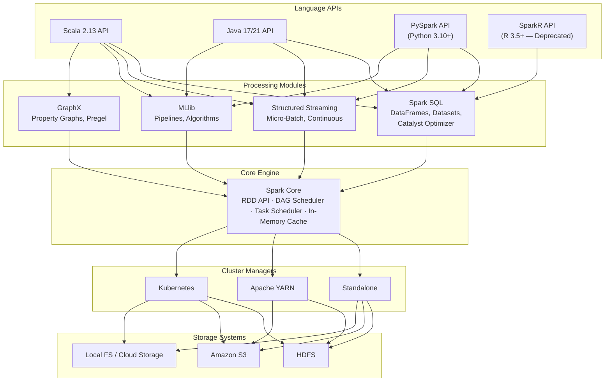
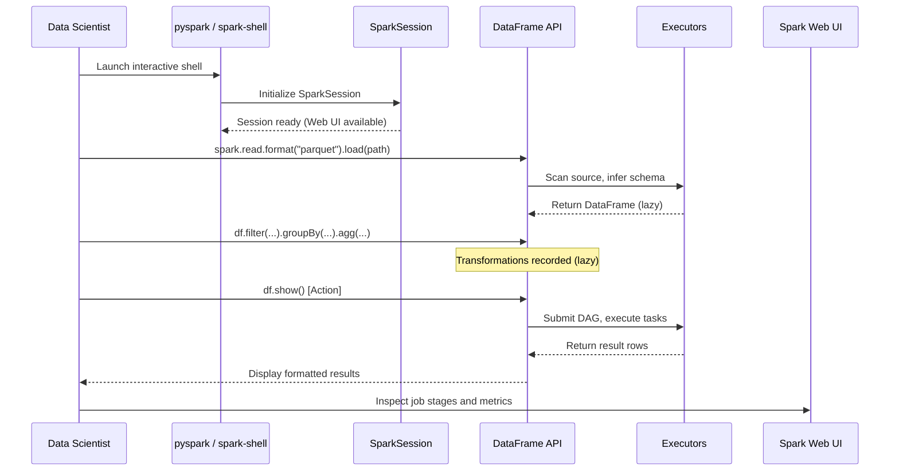
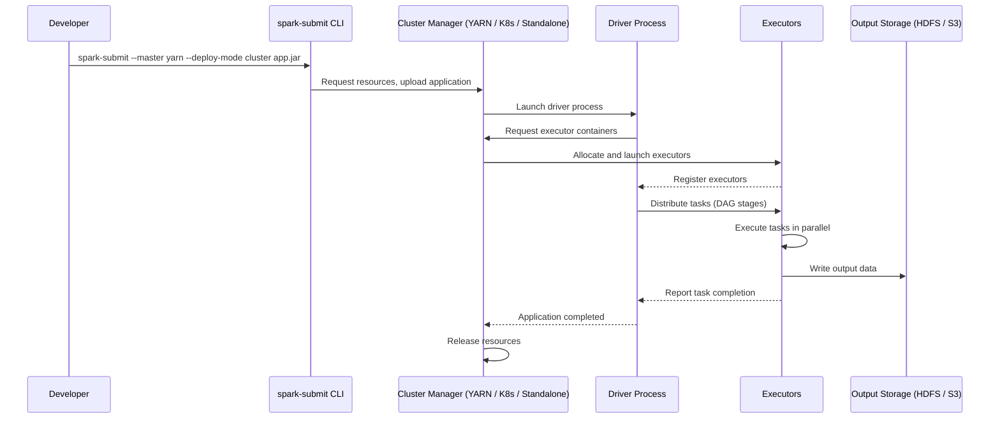
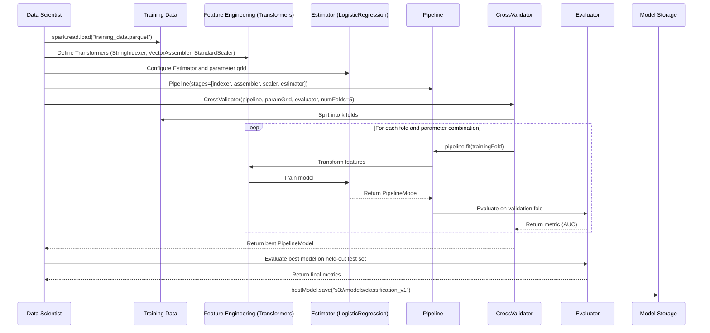
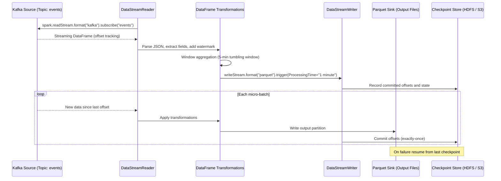
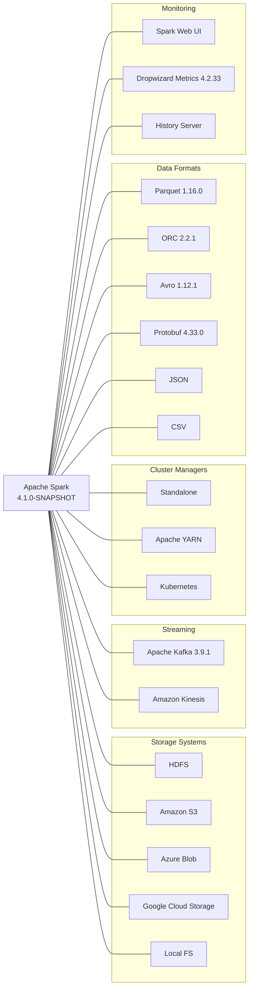
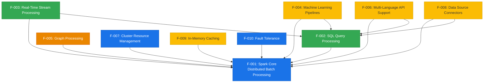

<!--
Licensed to the Apache Software Foundation (ASF) under one or more
contributor license agreements.  See the NOTICE file distributed with
this work for additional information regarding copyright ownership.
The ASF licenses this file to You under the Apache License, Version 2.0
(the "License"); you may not use this file except in compliance with
the License.  You may obtain a copy of the License at

   http://www.apache.org/licenses/LICENSE-2.0

Unless required by applicable law or agreed to in writing, software
distributed under the License is distributed on an "AS IS" BASIS,
WITHOUT WARRANTIES OR CONDITIONS OF ANY KIND, either express or implied.
See the License for the specific language governing permissions and
limitations under the License.
-->

# Product Requirements Document — Apache Spark

| Field | Value |
|-------|-------|
| **Product Version** | 4.1.0-SNAPSHOT |
| **Document Status** | Draft |
| **Owner** | Apache Spark PMC |
| **Last Updated** | 2026-03-31 |
| **Scala Version** | 2.13.17 |

### Change History

| Date | Version | Author | Description |
|------|---------|--------|-------------|
| 2026-03-31 | 1.0 | Apache Spark PMC | Initial PRD creation consolidating product definition |

---

## 2. Executive Summary

Apache Spark is a unified analytics engine for large-scale data processing. It provides high-level APIs in Scala, Java, Python, and R (Deprecated), and an optimized engine that supports general computation graphs for data analysis. Spark also supports a rich set of higher-level tools including Spark SQL for SQL and DataFrames, pandas API on Spark for pandas workloads, MLlib for machine learning, GraphX for graph processing, and Structured Streaming for stream processing.

Spark addresses the fundamental challenge of distributed data processing by providing a cohesive platform that unifies batch processing, interactive SQL queries, real-time stream processing, machine learning, and graph analytics under a single runtime. Its in-memory computing architecture delivers order-of-magnitude performance improvements over traditional disk-based processing frameworks for iterative algorithms and interactive workloads.

The platform runs on Java 17/21, Scala 2.13, Python 3.10+, and R 3.5+ (Deprecated). It deploys on Standalone clusters, Apache YARN, and Kubernetes, and integrates with a broad ecosystem of storage systems, streaming platforms, and data formats. Spark Connect introduces a decoupled client-server architecture that allows remote connectivity to Spark clusters using the DataFrame API and gRPC as the transport protocol.

### Product Architecture Overview

*Source: Repository module structure (`core/`, `sql/`, `mllib/`, `graphx/`, `streaming/`, `resource-managers/`), `README.md` lines 1–8, `docs/index.md` line 37.*

---

## 3. Business Problem Statement

### 3.1 Distributed Computing Complexity

**Problem:** Distributed data processing traditionally requires engineers to manage complex infrastructure concerns — partitioning data across nodes, coordinating parallel task execution, handling network communication, and managing partial failures. This complexity creates a steep learning curve and high development cost, diverting engineering effort from business logic to infrastructure plumbing.

**Value Proposition:** Apache Spark provides high-level abstractions — Resilient Distributed Datasets (RDDs) and DataFrames — that hide the complexity of distributed computing. Developers express computations as sequences of transformations and actions on distributed collections, while the Spark runtime automatically handles data partitioning, task scheduling via a Directed Acyclic Graph (DAG) scheduler, and fault recovery through lineage-based recomputation. This abstraction enables data engineers and scientists to write distributed programs using familiar collection-oriented APIs without managing low-level cluster coordination.

### 3.2 Big Data Performance Bottlenecks

**Problem:** Traditional disk-based distributed processing frameworks, exemplified by Hadoop MapReduce, write intermediate results to disk between processing stages. This approach creates severe performance bottlenecks for iterative algorithms (common in machine learning and graph processing) and interactive queries, where repeated disk I/O dominates computation time.

**Value Proposition:** Spark's in-memory computing architecture caches intermediate data in memory across processing stages, enabling 10–100x performance improvements over disk-based MapReduce for iterative workloads. The Tungsten execution engine provides whole-stage code generation for CPU-efficient query execution, and the Catalyst query optimizer applies rule-based and cost-based optimizations to minimize data movement. Adaptive Query Execution (AQE) further optimizes query plans at runtime based on observed data statistics.

### 3.3 Analytics Platform Fragmentation

**Problem:** Organizations historically required separate, specialized systems for different data processing needs — one system for batch ETL, another for SQL analytics, a third for stream processing, a fourth for machine learning, and a fifth for graph analytics. This fragmentation increases operational overhead, duplicates infrastructure costs, creates data silos, and forces data engineers to learn and maintain multiple technologies.

**Value Proposition:** Apache Spark unifies batch processing, SQL queries, real-time streaming, machine learning, and graph analytics under a single engine with a common runtime and shared APIs. Data loaded once can be processed across all workloads without costly data movement between systems. Teams operate a single cluster and skill set rather than maintaining five separate technology stacks.

### 3.4 Polyglot Data Science Requirements

**Problem:** Data teams comprise professionals with diverse language preferences — data engineers favoring Scala or Java for production pipelines, data scientists preferring Python for exploratory analysis and model development, and analysts working in SQL. Requiring all team members to adopt a single programming language limits talent pools and reduces productivity.

**Value Proposition:** Spark provides native APIs in Scala 2.13 (primary implementation language), Java 17+ (co-primary JVM language), and Python 3.10+ (PySpark, including pandas API on Spark for seamless pandas integration and Apache Arrow for efficient data transfer). R is supported at version 3.5+ via SparkR; however, **SparkR is deprecated as of Apache Spark 4.0.0 and will be removed in a future release**. Spark Connect further extends multi-language accessibility by providing a thin client library that can be embedded in any application environment.

*Source: `README.md` lines 1–8, `docs/index.md` line 37, `docs/sparkr.md` line 25, `docs/sql-pyspark-pandas-with-arrow.md`, `docs/spark-connect-overview.md`.*

---

## 4. Target Users and Personas

### 4.1 Data Engineers

| Attribute | Detail |
|-----------|--------|
| **Description** | Professionals responsible for building and maintaining data pipelines, ETL processes, and data infrastructure at scale. |
| **Primary Needs** | Reliable batch and streaming ETL pipelines; data quality validation; integration with diverse storage systems and data formats; scheduling and orchestration of data workflows; production-grade fault tolerance. |
| **Key Spark Features Used** | Spark SQL and DataFrames (F-002), Structured Streaming (F-003), Data Source Connectors (F-008), Fault Tolerance (F-010), Cluster Resource Management (F-007). |
| **Typical Workflow** | Read data from source systems (HDFS, S3, Kafka, JDBC) using DataFrames → apply transformations and business logic via DataFrame operations or SQL → validate data quality → write results to target storage (Parquet, ORC, data warehouses) → monitor pipeline health via Spark Web UI. |

### 4.2 Data Scientists

| Attribute | Detail |
|-----------|--------|
| **Description** | Analysts and researchers who explore large datasets, build and evaluate machine learning models, and deliver analytical insights. |
| **Primary Needs** | Interactive data exploration; scalable feature engineering; distributed model training and evaluation; familiar Python/pandas interfaces; model persistence and reproducibility. |
| **Key Spark Features Used** | PySpark and pandas API on Spark (F-006), MLlib Pipelines (F-004), Spark SQL (F-002), In-Memory Caching (F-009), Interactive shells (`pyspark`, notebooks). |
| **Typical Workflow** | Launch interactive PySpark session or notebook → load data via DataFrames → explore data with SQL queries and visualizations → engineer features using Transformers → train models using Estimators within a Pipeline → evaluate model quality with Evaluators → persist trained models for production deployment. |

### 4.3 Application Developers

| Attribute | Detail |
|-----------|--------|
| **Description** | Software engineers who embed Spark into data-intensive applications, build data products, and integrate Spark with broader application architectures. |
| **Primary Needs** | Programmatic access to Spark capabilities; thin client connectivity via Spark Connect; batch and streaming data processing embedded in applications; reliable job submission and monitoring. |
| **Key Spark Features Used** | Spark Connect (F-002), DataFrame API (F-002), Batch Processing (F-001), Structured Streaming (F-003), `spark-submit` CLI. |
| **Typical Workflow** | Develop Spark application using DataFrame API in Scala, Java, or Python → test locally → package application (JAR or Python files) → submit to cluster via `spark-submit` or connect remotely via Spark Connect client → monitor execution through REST API or Web UI → collect results. |

### 4.4 System Administrators

| Attribute | Detail |
|-----------|--------|
| **Description** | Operations professionals responsible for deploying, configuring, monitoring, and securing Spark clusters and infrastructure. |
| **Primary Needs** | Cluster deployment and configuration management; resource allocation and utilization monitoring; security configuration (authentication, encryption, ACLs); performance tuning; log management and troubleshooting. |
| **Key Spark Features Used** | Cluster Resource Management (F-007), Spark Web UI and History Server, Dropwizard Metrics, Security features (authentication, encryption, ACLs), Configuration system (`spark-defaults.conf`, environment variables). |
| **Typical Workflow** | Deploy Spark cluster on Standalone, YARN, or Kubernetes → configure security (authentication, TLS/SSL, ACLs) → set resource limits and dynamic allocation policies → monitor cluster health via Web UI and metrics endpoints → tune performance based on workload patterns → manage application logs and history. |

*Source: Synthesized from `docs/sql-programming-guide.md`, `docs/streaming/index.md`, `docs/ml-guide.md`, `docs/quick-start.md`, `docs/spark-connect-overview.md`, `docs/submitting-applications.md`, `docs/cluster-overview.md`, `docs/monitoring.md`, `docs/security.md`, `docs/configuration.md`.*

---

## 5. Product Vision and Goals

### 5.1 Product Vision Statement

Apache Spark aspires to be the standard unified analytics engine that empowers organizations to process data at any scale — combining speed, ease of use, generality across workloads, and broad ecosystem integration. By providing a single platform for batch, SQL, streaming, machine learning, and graph processing with native multi-language support, Spark eliminates the need for fragmented technology stacks and enables data teams to move from raw data to actionable insights with maximum velocity and minimum operational overhead.

### 5.2 Strategic Goals

| Goal | Description |
|------|-------------|
| **Unified Processing** | Provide a single engine for batch, SQL, streaming, ML, and graph workloads, eliminating the need for separate specialized systems. |
| **High Performance** | Deliver order-of-magnitude performance improvements over disk-based frameworks through in-memory computing, whole-stage code generation (Tungsten), and advanced query optimization (Catalyst, AQE). |
| **Multi-Language Accessibility** | Support native APIs in Scala, Java, and Python (with pandas compatibility), ensuring accessibility for diverse data team roles. R support is maintained in deprecated status via SparkR. |
| **Broad Integration** | Integrate with major storage systems (HDFS, S3, Azure Blob, GCS), streaming platforms (Kafka, Kinesis), cluster managers (Standalone, YARN, Kubernetes), and data formats (Parquet, ORC, Avro, Protobuf, JSON, CSV). |
| **Developer Productivity** | Provide high-level, declarative APIs (DataFrame, Dataset, SQL), interactive shells, notebook integration, and Spark Connect for thin-client development that reduces boilerplate and accelerates development cycles. |
| **Enterprise Reliability** | Ensure production-grade fault tolerance through lineage-based recovery, checkpointing, task retries, and exactly-once streaming semantics, enabling mission-critical data processing. |

### 5.3 Success Metrics

| Metric | Target | Measurement Method |
|--------|--------|--------------------|
| **Processing Performance** | 10–100x improvement over disk-based MapReduce for iterative algorithms | Benchmark comparison of in-memory vs. disk-based execution for iterative workloads (e.g., PageRank, logistic regression) |
| **Workload Coverage** | 5 unified processing paradigms (batch, SQL, streaming, ML, graph) | Feature catalog completeness across F-001 through F-005 |
| **Language Support** | 3 actively supported languages (Scala, Java, Python) + 1 deprecated (R) | API parity assessment across language bindings |
| **Data Source Breadth** | 8+ built-in data formats, 3 cluster managers, 2+ streaming connectors | Connector count in Data Source Connectors (F-008) |
| **Fault Recovery** | Automatic recovery from executor failures without job restart | Lineage-based RDD recomputation success rate under simulated failures |
| **Build Health** | CI pass rate across Java 17, Java 21, Python 3.10–3.14, multiple platforms | GitHub Actions CI workflow status (referenced in `README.md` CI badge matrix) |
| **Community Adoption** | Sustained PyPI download growth for PySpark package | PyPI download metrics (referenced in `README.md` badge) |

*Source: `README.md` lines 1–8, 13–15 (CI badges, PyPI badge), Tech Spec Sections 1.1, 1.2.*

---

## 6. Feature Requirements

### 6.1 F-001: Distributed Batch Processing

| Attribute | Detail |
|-----------|--------|
| **Feature ID** | F-001 |
| **Name** | Distributed Batch Processing |
| **Priority** | Critical |
| **Dependencies** | None (foundational feature) |

**Description:** Spark Core provides the foundational distributed batch processing engine upon which all other Spark modules are built. It implements the Resilient Distributed Dataset (RDD) abstraction — an immutable, partitioned collection of elements that can be operated on in parallel across a cluster. The DAG scheduler decomposes user programs into stages and tasks, the task scheduler dispatches work to executors, and the block manager handles data storage and transfer.

**User Benefits:**
- Write distributed computations using familiar collection-oriented APIs (map, filter, reduce) without managing low-level parallelism
- Achieve automatic data partitioning and locality-aware task scheduling
- Leverage lazy evaluation to optimize execution plans before computation begins
- Use broadcast variables for efficient distribution of large read-only data to all workers
- Use accumulators for distributed counters and aggregations

**Key Capabilities:**
- **Transformations (lazy):** `map`, `filter`, `flatMap`, `mapPartitions`, `reduceByKey`, `groupByKey`, `join`, `cogroup`, `union`, `distinct`, `sortByKey`, `repartition`, `coalesce`
- **Actions (eager):** `collect`, `count`, `reduce`, `first`, `take`, `saveAsTextFile`, `saveAsObjectFile`, `foreach`, `countByKey`
- **Shared Variables:** Broadcast variables (read-only distributed cache), Accumulators (distributed write-only counters)
- **DAG Execution:** Automatic stage decomposition at shuffle boundaries, pipelined execution within stages, locality-aware scheduling
- **Closure Semantics:** Automatic serialization and distribution of user-defined closures to executor JVMs

*Source: `docs/rdd-programming-guide.md`, Tech Spec Section 2.1 (F-001).*

---

### 6.2 F-002: SQL Query Processing

| Attribute | Detail |
|-----------|--------|
| **Feature ID** | F-002 |
| **Name** | SQL Query Processing |
| **Priority** | Critical |
| **Dependencies** | F-001 (Spark Core) |

**Description:** Spark SQL provides a structured data processing module with a SQL interface, DataFrame and Dataset APIs, and an extensible query optimizer. The Catalyst optimizer applies rule-based and cost-based optimizations to logical plans, and the Tungsten execution engine generates optimized bytecode for physical execution. SparkSession serves as the unified entry point for all structured data operations. Spark Connect introduces a decoupled client-server architecture that enables remote DataFrame operations via gRPC.

**User Benefits:**
- Execute SQL queries directly on distributed data with ANSI SQL compliance
- Use the DataFrame API for programmatic, type-safe data manipulation with equivalent performance to SQL
- Benefit from automatic query optimization without manual tuning (Catalyst optimizer)
- Access data from diverse sources (Parquet, ORC, JSON, CSV, JDBC, Hive) through a unified interface
- Leverage pandas API on Spark for seamless migration of pandas workloads to distributed execution
- Connect remotely to Spark clusters via Spark Connect thin client

**Key Capabilities:**
- **SparkSession:** Unified entry point for DataFrame creation, SQL execution, configuration, and catalog access
- **DataFrame / Dataset API:** Schema-aware distributed collection with named columns, supporting transformations, aggregations, joins, window functions, and UDFs
- **SQL Engine:** ANSI SQL parsing, Catalyst logical/physical plan optimization, Tungsten whole-stage code generation
- **Hive Integration:** Read and write Hive tables, access Hive metastore, execute HiveQL
- **Adaptive Query Execution (AQE):** Runtime query plan optimization based on observed data statistics (coalesce shuffle partitions, convert sort-merge join to broadcast join, optimize skew joins)
- **Spark Connect:** Client-server architecture using gRPC for remote DataFrame operations from thin clients in any language
- **Pandas API on Spark:** Drop-in pandas-compatible API (`pyspark.pandas`) for distributed execution of pandas workloads with Apache Arrow integration for efficient data transfer

*Source: `docs/sql-programming-guide.md`, `docs/sql-data-sources.md`, `docs/spark-connect-overview.md`, `docs/sql-pyspark-pandas-with-arrow.md`, Tech Spec Section 2.1 (F-002).*

---

### 6.3 F-003: Real-Time Stream Processing

| Attribute | Detail |
|-----------|--------|
| **Feature ID** | F-003 |
| **Name** | Real-Time Stream Processing |
| **Priority** | Critical |
| **Dependencies** | F-001 (Spark Core), F-002 (Spark SQL) |

**Description:** Structured Streaming provides a scalable, fault-tolerant stream processing engine built on the Spark SQL engine. Streaming computations are expressed using the same DataFrame and Dataset APIs as batch processing, and the engine runs them incrementally and continuously as new data arrives. The system guarantees end-to-end exactly-once fault-tolerance through checkpointing and Write-Ahead Logs in micro-batch mode.

**User Benefits:**
- Express streaming logic using the same DataFrame/SQL APIs as batch processing — no separate streaming paradigm to learn
- Achieve exactly-once processing semantics in micro-batch mode without manual deduplication
- Process events based on event time with watermarking for correct handling of late-arriving data
- Maintain stateful computations across micro-batches with automatic state management
- Choose between micro-batch (100ms latency, exactly-once) and continuous processing (1ms latency, at-least-once) based on application requirements

**Key Capabilities:**
- **DataStreamReader / DataStreamWriter:** Streaming source and sink configuration with identical API to batch
- **Processing Modes:** Micro-batch processing (default, exactly-once, ~100ms latency), Continuous processing (experimental, at-least-once, ~1ms latency)
- **Triggers:** `ProcessingTime` (fixed interval), `AvailableNow` (process all available then stop), `Continuous` (low-latency continuous)
- **Output Modes:** Append (new rows only), Update (changed rows), Complete (full result table)
- **Event-Time Processing:** Watermarking for late data handling, event-time windows, session windows
- **Stateful Operations:** `mapGroupsWithState`, `flatMapGroupsWithState`, `transformWithState` for arbitrary stateful processing
- **Sources and Sinks:** Kafka, file sources (Parquet, ORC, JSON, CSV, Text), socket (testing), rate (testing), console (debugging), memory (debugging), foreach/foreachBatch (custom sinks)

*Source: `docs/streaming/index.md`, `docs/streaming/getting-started.md`, `docs/streaming/apis-on-dataframes-and-datasets.md`, Tech Spec Section 2.1 (F-003).*

---

### 6.4 F-004: Machine Learning Pipelines

| Attribute | Detail |
|-----------|--------|
| **Feature ID** | F-004 |
| **Name** | Machine Learning Pipelines |
| **Priority** | High |
| **Dependencies** | F-001 (Spark Core), F-002 (Spark SQL) |

**Description:** MLlib is Spark's machine learning library, providing scalable implementations of common learning algorithms and a Pipeline API for constructing, evaluating, and tuning ML workflows. The DataFrame-based API (`spark.ml`) is the primary API; the legacy RDD-based API (`spark.mllib`) is in maintenance mode and receives only bug fixes.

**User Benefits:**
- Build end-to-end ML workflows as reusable, composable Pipelines of Transformers and Estimators
- Scale model training to large datasets distributed across a cluster
- Automate hyperparameter tuning with CrossValidator and TrainValidationSplit
- Persist trained models and entire Pipelines for production deployment
- Access a broad catalog of algorithms for classification, regression, clustering, and feature engineering

**Key Capabilities:**
- **Pipeline API:** `Transformer` (transforms DataFrames), `Estimator` (fits models), `Pipeline` (chains stages), `PipelineModel` (fitted pipeline), `Evaluator` (measures model quality), `ParamMap` (hyperparameter sets)
- **Classification:** Logistic Regression, Decision Trees, Random Forest, Gradient-Boosted Trees (GBT), Linear SVC, Naive Bayes, Multilayer Perceptron, Factorization Machines, One-vs-Rest
- **Regression:** Linear Regression, Decision Tree Regression, Random Forest Regression, GBT Regression, Isotonic Regression, AFT Survival Regression
- **Clustering:** K-Means, Bisecting K-Means, Gaussian Mixture Model (GMM), Latent Dirichlet Allocation (LDA), Power Iteration Clustering
- **Feature Engineering:** VectorAssembler, StringIndexer, OneHotEncoder, StandardScaler, RobustScaler, MinMaxScaler, Tokenizer, HashingTF, IDF, Word2Vec, PCA, SQLTransformer, Bucketizer, Imputer
- **Model Selection:** CrossValidator (k-fold cross-validation), TrainValidationSplit (single train-test split), parameter grid builder
- **Model Persistence:** Save and load models and Pipelines to/from persistent storage (HDFS, S3, local filesystem)

*Source: `docs/ml-guide.md`, `docs/ml-pipeline.md`, `docs/ml-classification-regression.md`, `docs/ml-clustering.md`, `docs/ml-features.md`, `docs/ml-tuning.md`, Tech Spec Section 2.1 (F-004).*

---

### 6.5 F-005: Graph Processing

| Attribute | Detail |
|-----------|--------|
| **Feature ID** | F-005 |
| **Name** | Graph Processing |
| **Priority** | Medium |
| **Dependencies** | F-001 (Spark Core) |

**Description:** GraphX provides an API for graph-parallel computation on property graphs — directed multigraphs with user-defined properties attached to each vertex and edge. It extends the Spark RDD abstraction with specialized graph data structures (VertexRDD and EdgeRDD) and exposes a set of graph operators and algorithms. GraphX is available only in the Scala API.

**User Benefits:**
- Represent and analyze complex relational data as property graphs within the Spark ecosystem
- Execute iterative graph algorithms (PageRank, shortest paths) using the Pregel API
- Combine graph analytics with other Spark workloads (SQL, ML) in a single application without data movement
- Leverage built-in implementations of common graph algorithms

**Key Capabilities:**
- **Property Graph Model:** Directed multigraph with typed vertex properties (`VertexRDD`) and edge properties (`EdgeRDD`), backed by Spark RDDs
- **Graph Operators:** `mapVertices`, `mapEdges`, `mapTriplets`, `subgraph`, `reverse`, `mask`, `groupEdges`
- **Neighborhood Aggregation:** `aggregateMessages` for sending and aggregating messages along edges
- **Pregel API:** Bulk-synchronous parallel messaging system for iterative graph computations
- **Built-in Algorithms:** PageRank (static and dynamic), Connected Components, Strongly Connected Components, Triangle Counting, Label Propagation
- **Graph Builder:** `GraphLoader.edgeListFile` for constructing graphs from edge list files

*Source: `docs/graphx-programming-guide.md`, Tech Spec Section 2.1 (F-005).*

---

### 6.6 F-006: Multi-Language API Support

| Attribute | Detail |
|-----------|--------|
| **Feature ID** | F-006 |
| **Name** | Multi-Language API Support |
| **Priority** | High |
| **Dependencies** | F-001 (Spark Core), F-002 (Spark SQL) |

**Description:** Spark provides native programming interfaces in multiple languages, enabling data teams with diverse skill sets to leverage the platform. Each language binding provides access to the core DataFrame and SQL APIs, with varying degrees of coverage across advanced modules.

**User Benefits:**
- Choose the most appropriate language for each use case without sacrificing Spark capabilities
- Leverage existing Python data science ecosystems (pandas, NumPy, scikit-learn) alongside Spark via PySpark
- Use pandas API on Spark for seamless migration of single-node pandas code to distributed execution
- Embed Spark in JVM applications using native Scala or Java APIs

**Key Capabilities:**

| Language | Version | Status | Coverage | Bridge Technology |
|----------|---------|--------|----------|-------------------|
| **Scala** | 2.13.17 | Primary | Full API (Core, SQL, Streaming, ML, GraphX) | Native (implementation language) |
| **Java** | 17, 21 | Co-Primary | Full API (Core, SQL, Streaming, ML) | Native JVM |
| **Python** | 3.10, 3.11, 3.12, 3.13 (3.14 experimental) | Supported | Full API (Core, SQL, Streaming, ML, pandas API on Spark) | Py4J bridge, Apache Arrow for data transfer |
| **R** | >= 3.5 | **Deprecated** | DataFrame/SQL only | SparkR package |

> **Deprecation Notice:** SparkR is deprecated as of Apache Spark 4.0.0 and will be removed in a future release. R users are encouraged to migrate to PySpark or other supported language bindings.

*Source: `docs/index.md` line 37, `docs/sparkr.md` line 25, `docs/sql-pyspark-pandas-with-arrow.md`, Tech Spec Section 3.1.*

---

### 6.7 F-007: Cluster Resource Management

| Attribute | Detail |
|-----------|--------|
| **Feature ID** | F-007 |
| **Name** | Cluster Resource Management |
| **Priority** | Critical |
| **Dependencies** | F-001 (Spark Core) |

**Description:** Spark supports deployment on multiple cluster managers, providing flexibility in infrastructure choices. The cluster management layer handles resource allocation, executor lifecycle management, and application isolation. Applications can run in client mode (driver runs on the submitting machine) or cluster mode (driver runs on the cluster).

**User Benefits:**
- Deploy on existing infrastructure without vendor lock-in (Standalone, YARN, Kubernetes)
- Scale resources dynamically based on workload demands via dynamic resource allocation
- Choose between client and cluster deploy modes based on operational requirements
- Leverage container orchestration capabilities of Kubernetes for cloud-native deployments

**Key Capabilities:**
- **Standalone Cluster Manager:** Built-in cluster manager with Master and Worker processes; supports monitoring via Web UI; requires no external dependencies
- **Apache YARN Integration:** Runs on Hadoop YARN clusters; supports client and cluster deploy modes; integrates with YARN resource scheduling and Kerberos authentication
- **Kubernetes Integration:** Deploys Spark applications as Kubernetes pods; supports dynamic allocation via pod scaling; manages driver and executor pods with configurable resource requests and limits (via Fabric8 Kubernetes client 7.4.0)
- **Dynamic Resource Allocation:** Automatically scales executor count up or down based on pending tasks and idle resources; configurable via `spark.dynamicAllocation.enabled`
- **Deploy Modes:** Client mode (driver on submission machine, for interactive use), Cluster mode (driver on cluster, for production)

*Source: `docs/cluster-overview.md`, `docs/spark-standalone.md`, `docs/running-on-yarn.md`, `docs/running-on-kubernetes.md`, Tech Spec Section 2.1 (F-007).*

---

### 6.8 F-008: Data Source Connectors

| Attribute | Detail |
|-----------|--------|
| **Feature ID** | F-008 |
| **Name** | Data Source Connectors |
| **Priority** | High |
| **Dependencies** | F-001 (Spark Core), F-002 (Spark SQL) |

**Description:** Spark provides a pluggable data source framework (DataSource V2 API) that enables reading from and writing to a wide variety of storage systems and data formats. Built-in connectors support common file formats, relational databases via JDBC, Apache Hive tables, and streaming systems. Cloud storage is accessed through Hadoop-compatible filesystem implementations.

**User Benefits:**
- Access data wherever it resides — files, databases, streaming systems, cloud storage — through a unified DataFrame API
- Leverage built-in format support without external dependencies for common formats (Parquet, ORC, JSON, CSV)
- Use schema inference for self-describing formats, reducing manual schema management
- Extend the platform with custom data sources via the DataSource V2 API

**Key Capabilities:**
- **File Formats:** Parquet (columnar, default), ORC (columnar), JSON, CSV, Avro, Protobuf, Text, Binary Files
- **Database Connectivity:** JDBC connector for relational databases (PostgreSQL, MySQL, Oracle, SQL Server, etc.) with predicate pushdown and partition-based parallel reads
- **Hive Integration:** Read and write Hive tables, access Hive metastore for schema management
- **Streaming Sources:** Apache Kafka (source and sink), Amazon Kinesis, file stream sources, socket source (testing), rate source (testing)
- **Cloud Storage:** Amazon S3, Azure Blob Storage, Google Cloud Storage, via Hadoop client libraries (`hadoop-cloud` module)
- **DataSource V2 API:** Extensible interface for building custom connectors with support for pushdown, partitioning, and transactional writes

*Source: `docs/sql-data-sources.md`, `docs/sql-data-sources-parquet.md`, `docs/sql-data-sources-jdbc.md`, `docs/streaming/structured-streaming-kafka-integration.md`, Tech Spec Section 2.1 (F-008).*

---

### 6.9 F-009: In-Memory Caching and Persistence

| Attribute | Detail |
|-----------|--------|
| **Feature ID** | F-009 |
| **Name** | In-Memory Caching and Persistence |
| **Priority** | High |
| **Dependencies** | F-001 (Spark Core) |

**Description:** Spark provides a flexible caching and persistence subsystem that stores frequently accessed data in memory (or on disk) across operations, avoiding redundant recomputation. This is fundamental to Spark's performance advantage for iterative algorithms and interactive workloads.

**User Benefits:**
- Dramatically reduce execution time for iterative algorithms by caching intermediate results in memory
- Speed up interactive data exploration by persisting frequently queried datasets
- Choose from multiple storage levels to balance memory usage, CPU overhead, and fault tolerance
- Manage cache lifecycle explicitly with `persist()` and `unpersist()` calls

**Key Capabilities:**
- **Storage Levels:**
  - `MEMORY_ONLY` — Store as deserialized Java objects in JVM heap (default for `cache()`)
  - `MEMORY_AND_DISK` — Spill to disk when data exceeds memory capacity
  - `MEMORY_ONLY_SER` — Store as serialized byte arrays (more space-efficient, higher CPU)
  - `MEMORY_AND_DISK_SER` — Serialized with disk spillover
  - `DISK_ONLY` — Store on disk only
  - `OFF_HEAP` — Store in off-heap memory (Tungsten)
  - Replication variants (`_2` suffix) for fault tolerance
- **DataFrame Caching:** `df.cache()` and `df.persist(storageLevel)` for structured data
- **Cache Management:** LRU (Least Recently Used) eviction policy; explicit `unpersist()` for cache release; `StorageLevel` selection per dataset
- **Cache Monitoring:** Storage tab in Spark Web UI for cache utilization tracking

*Source: `docs/rdd-programming-guide.md` (persistence section), `docs/tuning.md`, Tech Spec Section 2.1 (F-009).*

---

### 6.10 F-010: Fault Tolerance and Recovery

| Attribute | Detail |
|-----------|--------|
| **Feature ID** | F-010 |
| **Name** | Fault Tolerance and Recovery |
| **Priority** | Critical |
| **Dependencies** | F-001 (Spark Core) |

**Description:** Spark provides automatic fault tolerance through lineage-based recomputation for batch processing and checkpointing for long-running and streaming workloads. When an executor fails or a task encounters an error, the system automatically recovers without restarting the entire application.

**User Benefits:**
- Achieve automatic, transparent recovery from executor failures without manual intervention
- Avoid full recomputation by recovering only the lost data partitions via lineage
- Maintain streaming pipeline continuity across failures with checkpoint-based state recovery
- Mitigate straggler tasks through speculative execution

**Key Capabilities:**
- **Lineage-Based Recovery:** Each RDD records the sequence of transformations (lineage) used to build it; lost partitions are recomputed from their parent RDDs using this lineage
- **Checkpointing:** Saves RDD/DataFrame data to reliable storage (HDFS, S3) to truncate long lineage chains; required for streaming state management
- **Task Retry Policies:** Configurable maximum retry attempts per task (`spark.task.maxFailures`, default 4); configurable maximum failures per stage
- **Speculative Execution:** Launches duplicate copies of slow tasks on other nodes (`spark.speculation`); the first copy to complete is used, reducing tail latency
- **Streaming Checkpoint Recovery:** Streaming queries resume from the last committed offset after driver restart; Write-Ahead Logs ensure no data loss
- **Driver Recovery:** In cluster mode, the cluster manager can restart the driver process on failure

*Source: `docs/rdd-programming-guide.md`, `docs/streaming/apis-on-dataframes-and-datasets.md`, `docs/configuration.md`, Tech Spec Section 2.1 (F-010).*

---

### Feature Summary Matrix

| Feature ID | Name | Priority | Dependencies |
|------------|------|----------|--------------|
| F-001 | Distributed Batch Processing | Critical | None |
| F-002 | SQL Query Processing | Critical | F-001 |
| F-003 | Real-Time Stream Processing | Critical | F-001, F-002 |
| F-004 | Machine Learning Pipelines | High | F-001, F-002 |
| F-005 | Graph Processing | Medium | F-001 |
| F-006 | Multi-Language API Support | High | F-001, F-002 |
| F-007 | Cluster Resource Management | Critical | F-001 |
| F-008 | Data Source Connectors | High | F-001, F-002 |
| F-009 | In-Memory Caching and Persistence | High | F-001 |
| F-010 | Fault Tolerance and Recovery | Critical | F-001 |

---

## 7. User Flows and Scenarios

### 7.1 Interactive Data Exploration

**Entry Point:** User launches `pyspark` shell, `spark-shell` (Scala), or connects via a Jupyter notebook.

**Scenario:** A data scientist explores a new dataset interactively, applying transformations and inspecting results in real time.

**Expected Outcome:** The user interactively loads, transforms, and inspects data with sub-second response times for cached datasets. The Spark Web UI provides visibility into execution metrics, stage timelines, and storage utilization.

*Source: `docs/quick-start.md`.*

---

### 7.2 Batch Application Execution

**Entry Point:** Developer submits a packaged application via `spark-submit`.

**Scenario:** A data engineer deploys a production ETL job to a YARN cluster for scheduled batch processing.

**Expected Outcome:** The application executes across cluster resources, processes the full dataset in parallel, writes output to the specified storage system, and releases all allocated resources upon completion. The driver exit code indicates success or failure.

*Source: `docs/submitting-applications.md`, `docs/cluster-overview.md`.*

---

### 7.3 Data Pipeline Development

**Entry Point:** Data engineer develops an ETL pipeline using the DataFrame API and Spark SQL.

**Scenario:** An engineer builds a pipeline that ingests raw data from multiple sources, applies transformations and data quality validations, and writes curated data to a target system.

**Steps:**

1. **Data Ingestion:** Read data from source systems using DataFrames:
   - `spark.read.format("parquet").load("s3://raw-data/events/")`
   - `spark.read.format("jdbc").option("url", jdbcUrl).load()`

2. **Transformation:** Apply business logic using DataFrame operations and SQL:
   - Filter invalid records, deduplicate, enrich with reference data via joins
   - Apply column transformations, type casts, and computed fields
   - Register temporary views and execute SQL queries for complex aggregations

3. **Data Quality Validation:** Validate data integrity:
   - Assert non-null constraints on required columns
   - Verify row counts and aggregate checks against expected thresholds
   - Log quality metrics for monitoring

4. **Output:** Write curated data to target storage:
   - `df.write.format("parquet").mode("overwrite").partitionBy("date").save(outputPath)`
   - Write to JDBC targets for downstream consumption

**Expected Outcome:** The pipeline reads from all configured sources, applies all transformations correctly, passes data quality validations, and writes output in the specified format with appropriate partitioning. Failed quality checks halt the pipeline with descriptive error messages.

*Source: `docs/sql-programming-guide.md`, `docs/sql-data-sources.md`.*

---

### 7.4 Machine Learning Workflow

**Entry Point:** Data scientist creates an ML pipeline using the `spark.ml` API.

**Scenario:** A data scientist trains a classification model, tunes hyperparameters, evaluates performance, and persists the best model.

**Expected Outcome:** The CrossValidator evaluates all parameter combinations across all folds, selects the model with the highest evaluation metric, and returns a fitted PipelineModel. The model is persisted to storage and can be loaded in a separate Spark session for inference.

*Source: `docs/ml-pipeline.md`, `docs/ml-tuning.md`, `docs/ml-classification-regression.md`.*

---

### 7.5 Real-Time Streaming Pipeline

**Entry Point:** Data engineer configures a Structured Streaming query to process events from Apache Kafka.

**Scenario:** An engineer builds a real-time pipeline that reads events from Kafka, applies windowed aggregations, and writes results to Parquet files with exactly-once semantics.

**Expected Outcome:** The streaming query continuously processes new Kafka events, applies windowed aggregations with correct watermark-based late data handling, writes results to Parquet files, and maintains exactly-once semantics through checkpoint-based offset tracking. On failure, the query resumes from the last committed checkpoint without data loss or duplication.

*Source: `docs/streaming/getting-started.md`, `docs/streaming/apis-on-dataframes-and-datasets.md`, `docs/streaming/structured-streaming-kafka-integration.md`.*

---

### 7.6 Graph Analytics Workflow

**Entry Point:** Analyst loads graph data and applies graph algorithms using the GraphX API (Scala only).

**Scenario:** An analyst constructs a social network graph, runs PageRank to identify influential nodes, and extracts results for downstream analysis.

**Steps:**

1. **Graph Construction:** Load edge list from a file and create a property graph:
   - `val graph = GraphLoader.edgeListFile(sc, "edges.txt")`
   - Optionally attach vertex and edge properties

2. **Graph Exploration:** Inspect graph properties:
   - Count vertices (`graph.vertices.count()`) and edges (`graph.edges.count()`)
   - Compute in-degree and out-degree distributions
   - Apply `subgraph` to filter edges and vertices by property

3. **Algorithm Execution:** Run built-in graph algorithms:
   - PageRank: `graph.pageRank(tol = 0.001).vertices` to rank vertices by importance
   - Connected Components: `graph.connectedComponents().vertices` to identify clusters
   - Triangle Counting: `graph.triangleCount().vertices` for network density analysis

4. **Result Extraction:** Convert graph results to DataFrames for integration with Spark SQL:
   - Join PageRank scores with vertex metadata
   - Write results to Parquet for visualization or further analysis

**Expected Outcome:** The graph algorithms execute across the distributed graph data, converge within the specified tolerance, and produce correct results. Results are accessible as RDDs or DataFrames for further processing within the Spark ecosystem.

*Source: `docs/graphx-programming-guide.md`.*

---

## 8. Acceptance Criteria

### 8.1 Core Processing Acceptance Criteria (F-001, F-009, F-010)

| ID | Criterion | Feature |
|----|-----------|---------|
| AC-001 | RDD creation from `sc.parallelize()` shall produce a distributed dataset with the specified number of partitions, and elements shall be evenly distributed across partitions. | F-001 |
| AC-002 | RDD creation from external storage (HDFS, S3, local files) shall correctly read all data and partition according to the source's block structure or configured partition count. | F-001 |
| AC-003 | Transformations (`map`, `filter`, `flatMap`, `reduceByKey`, `join`) shall execute lazily — no computation shall occur until an action is invoked. | F-001 |
| AC-004 | Actions (`collect`, `count`, `reduce`, `first`, `take`) shall trigger DAG execution and return correct, complete results to the driver program. | F-001 |
| AC-005 | Broadcast variables shall be distributed to all executors exactly once and shall be accessible in all tasks without re-serialization per task. | F-001 |
| AC-006 | Accumulators shall correctly aggregate values from all tasks, and final accumulator values shall be accurate after action completion. | F-001 |
| AC-007 | Cached RDDs (via `persist(MEMORY_ONLY)`) shall be served from memory on subsequent access without recomputation, verifiable through the Storage tab in Spark Web UI. | F-009 |
| AC-008 | When cached data exceeds available memory under `MEMORY_AND_DISK`, partitions shall spill to disk transparently and remain accessible. | F-009 |
| AC-009 | `unpersist()` shall release cached data from memory and remove the entry from the Storage tab. | F-009 |
| AC-010 | When an executor fails, tasks running on that executor shall be automatically retried on other executors up to `spark.task.maxFailures` (default: 4) attempts. | F-010 |
| AC-011 | Lineage-based recovery shall reconstruct only the lost partitions of an RDD without recomputing the entire dataset, verifiable by observing that only the failed partition's lineage is re-executed. | F-010 |
| AC-012 | Checkpointed RDDs shall be readable from reliable storage after the original RDD lineage is no longer available. | F-010 |

### 8.2 SQL Processing Acceptance Criteria (F-002)

| ID | Criterion | Feature |
|----|-----------|---------|
| AC-013 | SQL queries submitted via `spark.sql()` shall be parsed, optimized by the Catalyst optimizer, and executed by the Tungsten engine, producing correct results matching equivalent relational algebra semantics. | F-002 |
| AC-014 | DataFrame operations (select, filter, groupBy, agg, join, orderBy, window) shall produce results identical to equivalent SQL queries on the same data. | F-002 |
| AC-015 | The system shall read data from Parquet, ORC, JSON, CSV, Avro, Protobuf, and JDBC sources and return correctly typed DataFrames with accurate schema inference. | F-002 |
| AC-016 | The system shall write DataFrames to Parquet, ORC, JSON, CSV, and JDBC targets with correct schema preservation and data integrity. | F-002 |
| AC-017 | Schema inference shall correctly detect column names and data types from self-describing formats (Parquet, ORC, JSON) without user-provided schema definitions. | F-002 |
| AC-018 | Spark Connect clients shall execute DataFrame operations remotely via gRPC and receive results identical to those produced by local execution. | F-002 |
| AC-019 | Adaptive Query Execution (AQE) shall dynamically adjust query plans at runtime (coalescing shuffle partitions, converting join strategies, handling skew) when `spark.sql.adaptive.enabled` is true. | F-002 |
| AC-020 | User-Defined Functions (UDFs) registered via `spark.udf.register()` shall be callable in SQL queries and DataFrame expressions and return correct results. | F-002 |

### 8.3 Streaming Acceptance Criteria (F-003)

| ID | Criterion | Feature |
|----|-----------|---------|
| AC-021 | Structured Streaming queries in micro-batch mode shall process each batch of data exactly once, with no duplicate or missing records in the output sink. | F-003 |
| AC-022 | Watermarking with a threshold of T shall correctly discard events with event timestamps older than (max event time - T) and shall not discard events within the watermark window. | F-003 |
| AC-023 | Stateful operations (`mapGroupsWithState`, `flatMapGroupsWithState`, `transformWithState`) shall maintain state correctly across micro-batches and recover state from checkpoints after failure. | F-003 |
| AC-024 | The Kafka source shall read from specified topics and starting offsets, and shall track consumed offsets in checkpoints for exactly-once recovery. | F-003 |
| AC-025 | The Kafka sink shall write output records to the specified topic, providing at-least-once delivery guarantees. | F-003 |
| AC-026 | A streaming query restarted from a checkpoint shall resume processing from the last committed offset without reprocessing already-committed data. | F-003 |
| AC-027 | Output modes (Append, Update, Complete) shall produce correct results: Append outputs only new rows; Update outputs only changed rows; Complete outputs the full result table. | F-003 |
| AC-028 | Trigger configurations (`ProcessingTime`, `AvailableNow`) shall control micro-batch scheduling frequency as specified by the user. | F-003 |

### 8.4 ML Pipeline Acceptance Criteria (F-004)

| ID | Criterion | Feature |
|----|-----------|---------|
| AC-029 | `Pipeline.fit(trainingData)` shall execute all pipeline stages sequentially, passing the output DataFrame of each stage as input to the next, and return a `PipelineModel`. | F-004 |
| AC-030 | Trained classification models (Logistic Regression, Random Forest, GBT) shall produce predictions on test data with measurable accuracy metrics (accuracy, AUC, F1-score) above random baseline. | F-004 |
| AC-031 | Trained regression models shall produce predictions with measurable error metrics (RMSE, MAE, R-squared) that improve over a naive baseline. | F-004 |
| AC-032 | `model.save(path)` shall persist the trained model to storage, and `Model.load(path)` shall reconstruct an identical model that produces the same predictions on the same input data. | F-004 |
| AC-033 | `CrossValidator` with `numFolds=k` and a parameter grid of size N shall train and evaluate k x N models and return the `PipelineModel` with the best average evaluation metric. | F-004 |
| AC-034 | Feature transformers (VectorAssembler, StringIndexer, StandardScaler, OneHotEncoder) shall correctly transform input columns and produce output columns with the expected types and dimensions. | F-004 |
| AC-035 | Clustering algorithms (K-Means, GMM) shall assign every data point to a cluster and shall converge within the configured maximum iterations. | F-004 |

### 8.5 Graph Processing Acceptance Criteria (F-005)

| ID | Criterion | Feature |
|----|-----------|---------|
| AC-036 | Property graphs created via `GraphLoader.edgeListFile()` shall correctly store all vertices and edges with their associated properties. | F-005 |
| AC-037 | `graph.pageRank(tol)` shall converge to stable PageRank values within the specified tolerance, and the sum of all PageRank values shall equal the number of vertices (for normalized PageRank). | F-005 |
| AC-038 | `graph.connectedComponents()` shall correctly identify all connected subgraphs and assign the same component ID to all vertices within each connected component. | F-005 |
| AC-039 | `graph.triangleCount()` shall return the correct count of triangles passing through each vertex. | F-005 |
| AC-040 | The Pregel API shall execute iterative graph computations by sending messages along edges, aggregating messages at vertices, and applying vertex programs until convergence or maximum iterations. | F-005 |
| AC-041 | Graph operators (`subgraph`, `mapVertices`, `mapEdges`, `reverse`) shall produce correct derived graphs consistent with their specifications. | F-005 |

### 8.6 Platform Infrastructure Acceptance Criteria (F-006, F-007, F-008)

| ID | Criterion | Feature |
|----|-----------|---------|
| AC-042 | Applications shall successfully deploy and execute on Standalone, YARN, and Kubernetes cluster managers in both client and cluster deploy modes. | F-007 |
| AC-043 | Dynamic resource allocation shall increase executor count when pending tasks exceed current capacity and decrease executor count when executors are idle beyond the configured timeout. | F-007 |
| AC-044 | Python (PySpark), Scala, and Java APIs shall provide functionally equivalent DataFrame operations, and identical queries on the same data shall produce identical results across all three languages. | F-006 |
| AC-045 | Data source connectors shall read from and write to all supported formats (Parquet, ORC, JSON, CSV, Avro, Protobuf, JDBC, Kafka) without data loss, truncation, or corruption. | F-008 |
| AC-046 | JDBC predicate pushdown shall push filter predicates to the database engine, reducing the volume of data transferred to Spark. | F-008 |
| AC-047 | Partition-based parallel JDBC reads shall distribute the data load across multiple Spark tasks based on the specified partition column and bounds. | F-008 |
| AC-048 | Schema evolution for Parquet sources shall correctly handle column additions (new columns read as null) and type promotions where supported. | F-008 |

---

## 9. Non-Functional Requirements

### 9.1 Performance Requirements

| Requirement | Specification | Source |
|-------------|--------------|--------|
| **In-Memory Processing Speed** | 10-100x faster than disk-based MapReduce for iterative algorithms (e.g., PageRank, logistic regression) and interactive queries, enabled by caching intermediate results in memory. | Tech Spec Section 1.1 |
| **Tungsten Code Generation** | Whole-stage code generation shall compile query plans into optimized Java bytecode, eliminating virtual function dispatch and leveraging CPU cache locality for CPU-efficient execution. | `docs/tuning.md` |
| **Adaptive Query Execution** | AQE shall dynamically optimize query plans at runtime by coalescing small shuffle partitions, converting sort-merge joins to broadcast joins when data sizes permit, and optimizing skewed joins. | Tech Spec Section 2.1 (F-002) |
| **Streaming Latency** | Micro-batch processing shall achieve end-to-end latencies as low as 100 milliseconds. Continuous processing mode shall achieve end-to-end latencies as low as 1 millisecond (experimental). | `docs/streaming/index.md` |
| **Serialization** | Kryo serialization shall be available as a faster alternative to default Java serialization, reducing serialized data size and improving shuffle and cache performance. | `docs/tuning.md` |

### 9.2 Scalability Requirements

| Requirement | Specification | Source |
|-------------|--------------|--------|
| **Horizontal Scaling** | The system shall scale horizontally by adding executor nodes; cluster sizes in production range from single machines to thousands of nodes. | `docs/hardware-provisioning.md` |
| **Dynamic Resource Allocation** | Executor count shall scale automatically based on workload demand, adding executors when tasks are pending and removing idle executors after a configurable timeout (`spark.dynamicAllocation.executorIdleTimeout`). | `docs/configuration.md` |
| **Data Parallelism** | Partition counts shall be configurable per operation (`spark.sql.shuffle.partitions`, `repartition()`, `coalesce()`), enabling users to tune parallelism to match cluster size and data volume. | `docs/tuning.md` |
| **Memory Management** | Unified memory management shall dynamically divide memory between execution (shuffle, sort, aggregation) and storage (caching) based on workload demands, controlled by `spark.memory.fraction` and `spark.memory.storageFraction`. | `docs/configuration.md` |

### 9.3 Reliability and Fault Tolerance

| Requirement | Specification | Source |
|-------------|--------------|--------|
| **Lineage-Based Recovery** | Lost RDD partitions shall be transparently recomputed from their lineage without user intervention or full-job restart. | `docs/rdd-programming-guide.md` |
| **Checkpointing** | Long-running computations and streaming state shall be periodically checkpointed to reliable storage (HDFS, S3) to truncate lineage chains and enable recovery. | `docs/configuration.md` |
| **Task Retry** | Failed tasks shall be retried up to `spark.task.maxFailures` times (default: 4) before the stage is marked as failed. | `docs/configuration.md` |
| **Speculative Execution** | Slow tasks shall be speculatively re-launched on other nodes when `spark.speculation` is enabled, with the first completion used and duplicates killed. | `docs/configuration.md` |
| **Streaming Exactly-Once** | Structured Streaming in micro-batch mode shall guarantee end-to-end exactly-once fault-tolerance through checkpointing and Write-Ahead Logs. | `docs/streaming/index.md` |

### 9.4 Security Requirements

| Requirement | Specification | Source |
|-------------|--------------|--------|
| **RPC Authentication** | Spark processes shall authenticate using a shared secret mechanism, configurable via `spark.authenticate`. | `docs/security.md` |
| **Kerberos Authentication** | YARN and HDFS deployments shall support Kerberos-based authentication for secure access to Hadoop services. | `docs/security.md` |
| **Network Encryption** | RPC communication and Web UI shall support TLS/SSL encryption; block transfer between nodes shall support AES encryption via `spark.network.crypto.enabled`. | `docs/security.md` |
| **Web UI ACLs** | Spark Web UI and History Server shall support Access Control Lists (ACLs) to restrict access to authorized users via `spark.ui.acls.enable`. | `docs/security.md` |
| **Local I/O Encryption** | Shuffle data and cached data written to local disk shall support encryption via `spark.io.encryption.enabled`. | `docs/security.md` |

### 9.5 Compatibility Matrix

| Component | Supported Versions | Status | Source |
|-----------|-------------------|--------|--------|
| Java (JDK) | 17, 21 | Required | `docs/index.md` line 37 |
| Scala | 2.13.17 | Required | `docs/_config.yml` line 25 |
| Python | 3.10, 3.11, 3.12, 3.13 (3.14 experimental) | Supported | CI workflows in `README.md` |
| R | >= 3.5 | **Deprecated** | `docs/index.md` line 37 |
| Apache Maven | 3.9.11+ | Build tool | `README.md` |
| Apache Hadoop | 3.4.2 | Required | `pom.xml` |
| Apache Kafka | 3.9.1 | Integration | Tech Spec Section 2.1 |
| Apache Parquet | 1.16.0 | Data format | Tech Spec Section 2.1 |
| Apache ORC | 2.2.1 | Data format | Tech Spec Section 2.1 |
| Apache Avro | 1.12.1 | Data format | Tech Spec Section 2.1 |
| Protobuf | 4.33.0 | Data format | Tech Spec Section 2.1 |

---

## 10. Integration Landscape

### 10.1 Storage Systems

| System | Integration Method | Notes |
|--------|-------------------|-------|
| Apache HDFS | Hadoop client libraries (built-in) | Primary distributed filesystem; supports read/write for all file formats |
| Amazon S3 | Hadoop S3A connector (`hadoop-cloud` module) | Object storage; supports read/write via `s3a://` URI scheme |
| Azure Blob Storage | Hadoop ABFS connector (`hadoop-cloud` module) | Azure cloud storage; supports read/write via `abfss://` URI scheme |
| Google Cloud Storage | Hadoop GCS connector (`hadoop-cloud` module) | GCP cloud storage; supports read/write via `gs://` URI scheme |
| Local Filesystem | Built-in | For local development and testing; supports `file://` URI scheme |

### 10.2 Streaming Infrastructure

| System | Version | Role | Notes |
|--------|---------|------|-------|
| Apache Kafka | 3.9.1 | Source and Sink | Structured Streaming connector for reading from and writing to Kafka topics; supports offset tracking and exactly-once recovery |
| Amazon Kinesis | AWS SDK 1.15.3 | Source | Structured Streaming connector for reading from Kinesis streams |
| Socket Source | N/A | Source (testing) | TCP socket source for development and testing only |
| Rate Source | N/A | Source (testing) | Generates data at a configurable rate for testing |

### 10.3 Cluster Managers

| Manager | Integration | Notes |
|---------|-------------|-------|
| Standalone | Built-in | Spark's own cluster manager with Master and Worker processes; no external dependencies |
| Apache YARN | YARN ApplicationMaster | Runs on Hadoop YARN clusters; supports client and cluster deploy modes; Kerberos authentication |
| Kubernetes | Fabric8 Kubernetes client 7.4.0 | Deploys driver and executor pods; supports dynamic allocation, volume mounts, and configurable resource requests |

### 10.4 Data Formats

| Format | Version | Read | Write | Schema | Notes |
|--------|---------|------|-------|--------|-------|
| Apache Parquet | 1.16.0 | Yes | Yes | Self-describing | Columnar; default format; predicate pushdown, column pruning |
| Apache ORC | 2.2.1 | Yes | Yes | Self-describing | Columnar; optimized for Hive workloads |
| Apache Avro | 1.12.1 | Yes | Yes | Self-describing | Row-based; schema evolution support |
| Protobuf | 4.33.0 | Yes | Yes | Schema-defined | Binary serialization via Protocol Buffers |
| JSON | Built-in | Yes | Yes | Inferred or provided | Human-readable; supports nested structures |
| CSV | Built-in | Yes | Yes | Inferred or provided | Delimited text; configurable header, delimiter, escape |
| Text | Built-in | Yes | Yes | Single string column | Line-based text files |
| Binary | Built-in | Yes | No | Fixed schema | Reads binary files as byte arrays |

### 10.5 Monitoring and Metrics

| Component | Technology | Purpose |
|-----------|------------|---------|
| Spark Web UI | Jetty 11.0.26 | Real-time application monitoring: jobs, stages, tasks, storage, environment, executors, SQL |
| History Server | Jetty 11.0.26 | Post-execution analysis of completed applications from event logs |
| Metrics System | Dropwizard Metrics 4.2.33 | Configurable metrics reporting to sinks: CSV, JMX, Slf4j, Graphite, Ganglia, StatsD, Prometheus |
| REST API | Built-in | Programmatic access to application status, job details, and stage metrics |
| Structured Streaming UI | Built-in | Streaming query progress monitoring: input rate, processing rate, batch duration, state size |

### Integration Landscape Diagram

*Source: `docs/sql-data-sources.md`, `docs/streaming/structured-streaming-kafka-integration.md`, `docs/cluster-overview.md`, `docs/monitoring.md`, Tech Spec Sections 2.1, 5.1.*

---

## 11. Dependencies and Constraints

### 11.1 Runtime Dependencies

| Category | Dependency | Version | Purpose | Source |
|----------|-----------|---------|---------|--------|
| Runtime | Java (JDK) | 17+ (21 supported) | JVM runtime | `docs/index.md` line 37, `pom.xml` |
| Runtime | Scala | 2.13.17 | Primary implementation language | `docs/_config.yml` line 25, `pom.xml` line 28 |
| Runtime | Python | 3.10, 3.11, 3.12, 3.13 (3.14 experimental) | PySpark runtime | `docs/index.md` line 37, CI workflows |
| Runtime | R | >= 3.5 (**Deprecated**) | SparkR runtime | `docs/index.md` line 37, `docs/sparkr.md` line 25 |
| Core Library | Apache Hadoop | 3.4.2 | HDFS client, YARN integration, cloud storage | `pom.xml` |
| Core Library | Netty | 4.2.7.Final | Network transport for RPC and shuffle | Tech Spec Section 1.2 |
| Core Library | Kryo | 4.0.3 | Fast serialization framework | Tech Spec Section 1.2 |
| Core Library | Apache Arrow | 18.3.0 | Columnar data transfer (PySpark, pandas) | Tech Spec Section 1.2 |
| SQL Engine | ANTLR4 | 4.13.1 | SQL parser generator | Tech Spec Section 2.1 (F-002) |
| SQL Engine | Janino | 3.1.9 | Runtime Java code generation (Tungsten) | Tech Spec Section 2.1 (F-002) |
| SQL Engine | Apache Hive | 2.3.10 | Hive metastore integration | Tech Spec Section 2.1 (F-002) |
| Data Format | Apache Parquet | 1.16.0 | Columnar file format | Tech Spec Section 2.1 |
| Data Format | Apache ORC | 2.2.1 | Columnar file format | Tech Spec Section 2.1 |
| Data Format | Apache Avro | 1.12.1 | Row-based file format | Tech Spec Section 2.1 (F-008) |
| Data Format | Protobuf | 4.33.0 | Binary serialization format | Tech Spec Section 2.1 (F-008) |
| Streaming | Apache Kafka Client | 3.9.1 | Kafka source/sink connector | Tech Spec Section 2.1 (F-003, F-008) |
| Streaming | AWS Kinesis SDK | 1.15.3 | Kinesis source connector | Tech Spec Section 2.1 (F-003) |
| ML | Breeze | 3.0.4 | Numerical processing for MLlib | Tech Spec Section 2.1 (F-004) |
| Cluster | Fabric8 Kubernetes Client | 7.4.0 | Kubernetes cluster manager integration | Tech Spec Section 2.1 (F-007) |
| Language Bridge | Py4J | 0.10.9.9 | Python-JVM bridge for PySpark | Tech Spec Section 2.1 (F-006) |
| Connect | gRPC | 1.67.1 | Spark Connect client-server transport | Tech Spec Section 5.1 |
| Web UI | Eclipse Jetty | 11.0.26 | HTTP server for Web UI and History Server | Tech Spec Section 1.2 |
| Metrics | Dropwizard Metrics | 4.2.33 | Application metrics collection and reporting | Tech Spec Section 1.2 |
| Compression | Snappy | 1.1.10.8 | Fast compression for shuffle and cache data | Tech Spec Section 1.2 |

### 11.2 Build Dependencies

| Dependency | Version | Purpose | Source |
|-----------|---------|---------|--------|
| Apache Maven | 3.9.11+ | Build system | `README.md` |
| sbt | (project-defined) | Scala compilation and packaging | Repository build configuration |
| Ruby | >= 3.0.0 | Documentation site build | `docs/Gemfile` |
| Jekyll | ~> 4.4 | Documentation site generator | `docs/Gemfile` |
| Bundler | 2.4.22+ | Ruby dependency management | `docs/README.md` |

### 11.3 Known Constraints and Limitations

| Constraint | Description | Impact |
|-----------|-------------|--------|
| **Single SparkContext per JVM** | Only one active `SparkContext` may exist per JVM process at a time. Creating a second `SparkContext` will raise an error unless the first is stopped. | Applications must manage SparkContext lifecycle carefully; multi-tenancy requires separate JVM processes. |
| **SparkR Deprecated** | SparkR is deprecated as of Apache Spark 4.0.0 and will be removed in a future release. No new features are being added. | R users should migrate to PySpark or other supported language bindings. |
| **GraphX Scala-Only** | GraphX is available only in the Scala API. There are no Python, Java, or R bindings for GraphX. | Non-Scala users must use alternative graph processing libraries or wrap GraphX calls in Scala. |
| **Continuous Processing Experimental** | Continuous processing mode in Structured Streaming is experimental and provides at-least-once guarantees (not exactly-once). | Production streaming pipelines requiring exactly-once semantics should use micro-batch mode. |
| **Native BLAS/LAPACK** | MLlib performance for linear algebra operations is significantly improved with native BLAS/LAPACK libraries, but these are not bundled with Spark. | System administrators must install native BLAS/LAPACK (OpenBLAS, MKL) separately for optimal ML performance. |
| **Driver Memory Constraints** | Actions such as `collect()` bring all data to the driver; collecting large datasets can cause driver out-of-memory errors. | Users must ensure driver memory is sufficient or use sampling/aggregation before collecting. |
| **Shuffle Data Volume** | Wide transformations (joins, groupBy) trigger shuffles that redistribute data across the cluster; excessive shuffle data can cause performance degradation and disk spillover. | Users should optimize partition counts and consider broadcast joins for small tables. |

---

## 12. Scope Boundaries

### 12.1 In Scope

The following capabilities are within the scope of Apache Spark version 4.1.0-SNAPSHOT as documented in this PRD:

- Distributed batch processing via the RDD API and DataFrame API (F-001)
- SQL query processing with Catalyst optimization and Tungsten code generation (F-002)
- Structured Streaming with exactly-once semantics in micro-batch mode (F-003)
- Machine learning pipeline API (`spark.ml`) with classification, regression, clustering, and feature engineering (F-004)
- Graph processing via GraphX with property graphs, Pregel API, and built-in algorithms (F-005)
- Multi-language API support for Scala 2.13, Java 17/21, and Python 3.10+; R 3.5+ in deprecated status via SparkR (F-006)
- Cluster resource management on Standalone, Apache YARN, and Kubernetes with dynamic resource allocation (F-007)
- Data source connectors for file formats (Parquet, ORC, JSON, CSV, Avro, Protobuf), JDBC databases, Hive, Kafka, and Kinesis (F-008)
- In-memory caching and persistence with multiple storage levels (F-009)
- Fault tolerance via lineage-based recovery, checkpointing, task retries, and speculative execution (F-010)
- Interactive development via `pyspark` and `spark-shell` interactive shells
- Spark Connect client-server architecture for remote DataFrame operations
- Spark Web UI, History Server, and metrics-based monitoring
- Security features including authentication, encryption, and ACLs

### 12.2 Out of Scope

The following are explicitly out of scope for this product definition:

| Item | Rationale |
|------|-----------|
| **Data storage layer** | Spark is a processing engine, not a storage system. It reads from and writes to external storage but does not manage data persistence or storage infrastructure. |
| **Workflow orchestration** | Integration with orchestration tools (Apache Airflow, Apache Oozie, Dagster) is the responsibility of the orchestration layer, not Spark itself. |
| **Real-time ML model serving** | Spark trains and persists models; real-time inference serving requires separate serving infrastructure (e.g., MLflow, TensorFlow Serving, Seldon). |
| **Deep learning training** | Spark does not provide native deep learning training capabilities. Deep learning inference is supported through compatible libraries (e.g., TensorFlow, PyTorch) used within PySpark. |
| **Custom cluster manager implementations** | Spark provides APIs for three supported cluster managers; developing custom cluster manager integrations is not part of the core product. |
| **End-to-end application deployment** | CI/CD pipelines, container image management, and application deployment automation are operational concerns outside of Spark's scope. |
| **SparkR feature development** | SparkR is deprecated; no new features or enhancements are planned for the R language binding. |
| **Legacy DStream API enhancements** | The legacy DStream API (Spark Streaming) is in maintenance mode; Structured Streaming is the recommended streaming API. |

---

## 13. Feature Dependency Map

The ten core features of Apache Spark have clearly defined dependency relationships. F-001 (Distributed Batch Processing / Spark Core) serves as the foundational layer upon which all other features are built. Features that provide structured data processing (F-002 through F-004, F-006, F-008) depend on the Spark Core for distributed execution and additionally leverage the SQL engine (F-002) for DataFrame-based processing. Infrastructure features (F-007, F-009, F-010) extend core platform capabilities.

### Dependency Relationships

| Feature | Depends On | Nature of Dependency |
|---------|-----------|---------------------|
| F-002: SQL Query Processing | F-001 | Uses Spark Core for distributed execution of query plans |
| F-003: Real-Time Stream Processing | F-001, F-002 | Built on Spark SQL engine; uses Core for distributed execution |
| F-004: Machine Learning Pipelines | F-001, F-002 | Uses DataFrames (F-002) for data representation; Core for distributed training |
| F-005: Graph Processing | F-001 | Uses RDDs (Core) for graph data structures |
| F-006: Multi-Language API Support | F-001, F-002 | Language bindings wrap Core and SQL APIs |
| F-007: Cluster Resource Management | F-001 | Manages executors and resources for Core engine |
| F-008: Data Source Connectors | F-001, F-002 | Uses DataSource V2 API (SQL module) built on Core |
| F-009: In-Memory Caching | F-001 | Extends Core's block manager for caching |
| F-010: Fault Tolerance | F-001 | Built into Core's RDD lineage and task scheduling |

### Feature Dependency Diagram

**Legend:** Blue = Critical priority, Green = Critical (with SQL dependency), Yellow = High priority, Orange = Medium priority. Arrows point from dependent feature to its dependency.

*Source: Tech Spec Section 2.3 (Feature Relationships).*

---

## 14. Appendix and References

### 14.1 Source Citations

**Repository Files:**

| File | Content Used |
|------|-------------|
| `README.md` | Project overview, CI badge matrix, build instructions, PyPI badge |
| `pom.xml` | Product version (4.1.0-SNAPSHOT), Scala version (2.13), dependency management |
| `CONTRIBUTING.md` | Contribution guidelines, Apache License affirmation |
| `docs/_config.yml` | SPARK_VERSION (4.1.0-SNAPSHOT), SCALA_VERSION (2.13.17), SCALA_BINARY_VERSION (2.13) |
| `docs/index.md` | Runtime requirements (Java 17/21, Scala 2.13, Python 3.10+, R 3.5+ Deprecated), download, setup |
| `docs/quick-start.md` | Getting started workflow, interactive shell usage |
| `docs/rdd-programming-guide.md` | RDD API (transformations, actions, persistence, closures, shared variables) |
| `docs/sql-programming-guide.md` | Spark SQL, DataFrame/Dataset API, data sources, Hive integration |
| `docs/sql-data-sources.md` | Data source format overview (Parquet, ORC, JSON, CSV, Avro, JDBC) |
| `docs/sql-data-sources-parquet.md` | Parquet format specifics, schema merging, partition discovery |
| `docs/sql-data-sources-jdbc.md` | JDBC connectivity, predicate pushdown, parallel reads |
| `docs/sql-pyspark-pandas-with-arrow.md` | Pandas API on Spark, Apache Arrow integration |
| `docs/spark-connect-overview.md` | Spark Connect client-server architecture, gRPC transport |
| `docs/streaming/index.md` | Structured Streaming overview, micro-batch and continuous processing |
| `docs/streaming/getting-started.md` | Streaming quickstart, basic query structure |
| `docs/streaming/apis-on-dataframes-and-datasets.md` | Streaming API reference (sources, sinks, output modes, triggers, stateful operations) |
| `docs/streaming/structured-streaming-kafka-integration.md` | Kafka connector configuration, offset management |
| `docs/ml-guide.md` | MLlib overview, algorithm catalog, DataFrame-based API announcement |
| `docs/ml-pipeline.md` | Pipeline API (Transformer, Estimator, Pipeline, Evaluator) |
| `docs/ml-classification-regression.md` | Classification and regression algorithms |
| `docs/ml-clustering.md` | Clustering algorithms (K-Means, GMM, LDA, Bisecting K-Means) |
| `docs/ml-features.md` | Feature transformers and extractors |
| `docs/ml-tuning.md` | Hyperparameter tuning (CrossValidator, TrainValidationSplit) |
| `docs/graphx-programming-guide.md` | GraphX API, property graph model, Pregel API, built-in algorithms |
| `docs/cluster-overview.md` | Cluster architecture, components (driver, executors, cluster manager) |
| `docs/spark-standalone.md` | Standalone cluster manager deployment |
| `docs/running-on-yarn.md` | YARN integration, deploy modes |
| `docs/running-on-kubernetes.md` | Kubernetes integration, pod management |
| `docs/submitting-applications.md` | spark-submit CLI, application packaging, deploy modes |
| `docs/configuration.md` | Configuration parameters, dynamic allocation, memory management |
| `docs/tuning.md` | Performance tuning, serialization, memory management, data structures |
| `docs/security.md` | Authentication, encryption (TLS/SSL, AES), ACLs, Kerberos |
| `docs/monitoring.md` | Spark Web UI, History Server, REST API, metrics system |
| `docs/hardware-provisioning.md` | Hardware recommendations, scaling guidelines |
| `docs/building-spark.md` | Build instructions, Maven configuration |
| `docs/sparkr.md` | SparkR package, deprecation notice |

**Technical Specification Sections:**

| Section | Title | Content Used |
|---------|-------|-------------|
| 1.1 | Executive Summary | Business problem statement, value proposition, key stakeholders |
| 1.2 | System Overview | System capabilities, major components, core technical approach |
| 1.3 | Scope | In-scope features, out-of-scope elements, project boundaries |
| 2.1 | Feature Catalog | Feature definitions F-001 through F-010 with metadata and dependencies |
| 2.2 | Functional Requirements | Acceptance criteria, technical specifications per feature |
| 2.3 | Feature Relationships | Feature dependency map, integration points |
| 3.1 | Programming Languages | Language versions, justifications, and constraints |
| 5.1 | High-Level Architecture | Master-worker architecture, DAG optimization, integration points |

### 14.2 Glossary of Terms

| Term | Definition |
|------|-----------|
| **RDD (Resilient Distributed Dataset)** | The fundamental data abstraction in Spark — an immutable, partitioned collection of elements distributed across cluster nodes that can be operated on in parallel. RDDs track their lineage (the sequence of transformations used to build them) for fault recovery. |
| **DataFrame** | A distributed collection of data organized into named columns, conceptually equivalent to a table in a relational database. DataFrames are built on top of RDDs and provide schema-aware optimizations via the Catalyst query optimizer. |
| **Dataset** | A strongly-typed, object-oriented interface to structured data in Spark. Datasets combine the benefits of RDDs (type safety, object-oriented programming) with the performance optimizations of DataFrames (Catalyst, Tungsten). Available in Scala and Java. |
| **DAG (Directed Acyclic Graph)** | The execution plan that Spark constructs from a user's program. Transformations define a DAG of computation steps; the DAG scheduler decomposes this into stages and tasks for parallel execution. |
| **Catalyst** | Spark SQL's extensible query optimizer. Catalyst applies rule-based and cost-based optimizations to logical and physical query plans, including predicate pushdown, column pruning, join reordering, and constant folding. |
| **Tungsten** | Spark's execution engine that provides whole-stage code generation, compiling query plans into optimized Java bytecode. Tungsten eliminates virtual function dispatch and leverages CPU cache locality for improved performance. |
| **SparkSession** | The unified entry point for all Spark functionality in Spark 2.0+. SparkSession provides access to DataFrame and Dataset APIs, SQL execution, catalog management, and configuration. It subsumes the earlier SQLContext and HiveContext. |
| **SparkContext** | The original entry point for Spark functionality, representing the connection to a Spark cluster. SparkContext is used to create RDDs, accumulators, and broadcast variables. In modern Spark, it is accessible via `SparkSession.sparkContext`. |
| **Executor** | A distributed agent responsible for executing tasks on a cluster node. Each executor runs in its own JVM and can execute multiple tasks concurrently in separate threads. Executors also cache data in memory for fast access. |
| **Driver** | The process that runs the user's `main()` function and creates the SparkContext/SparkSession. The driver coordinates task scheduling, tracks RDD lineage, and collects action results. |
| **Partition** | A logical division of data in an RDD or DataFrame. Each partition is processed by a single task on a single executor. The number of partitions determines the level of parallelism. |
| **Shuffle** | The redistribution of data across partitions, typically triggered by wide transformations (e.g., `reduceByKey`, `groupBy`, `join`). Shuffles involve serialization, network transfer, and disk I/O, making them the most expensive operations in Spark. |
| **Broadcast Variable** | A read-only variable cached on every executor node rather than shipped with each task. Broadcast variables are used to give every node a copy of a large dataset efficiently (e.g., a lookup table for joins). |
| **Accumulator** | A shared variable that supports commutative and associative aggregation across tasks. Accumulators are used for distributed counters and sums. Only the driver can read the accumulator value; tasks can only add to it. |
| **Lineage** | The recorded sequence of transformations used to derive an RDD from its parent RDDs. Lineage information enables fault tolerance: if a partition is lost, Spark recomputes it by replaying the transformations on the parent partitions. |
| **Checkpoint** | A mechanism that saves the data of an RDD or streaming state to reliable storage (HDFS, S3), truncating the lineage chain. Checkpointing is used for long-running computations and streaming state recovery. |
| **Watermark (Streaming)** | A threshold in event time used by Structured Streaming to determine when to stop waiting for late-arriving data. Events with event timestamps older than (max event time - watermark) are considered too late and may be discarded. |

---

*This document is the single source of truth for the Apache Spark product definition (version 4.1.0-SNAPSHOT). It consolidates information from the Apache Spark repository documentation, technical specification, and build configuration files. For detailed API reference and programming guides, consult the individual documentation files referenced in Section 14.1.*
